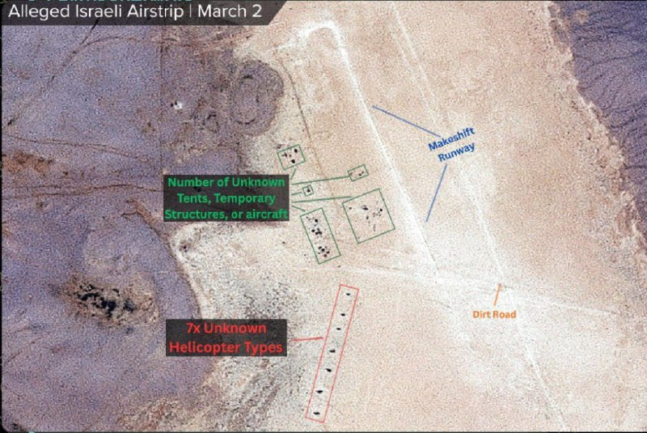
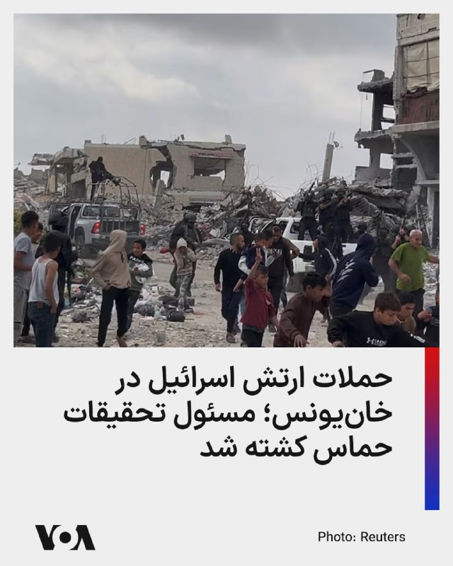
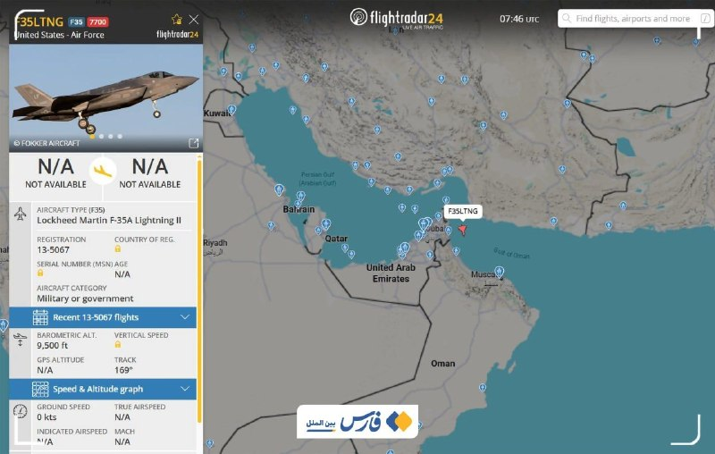
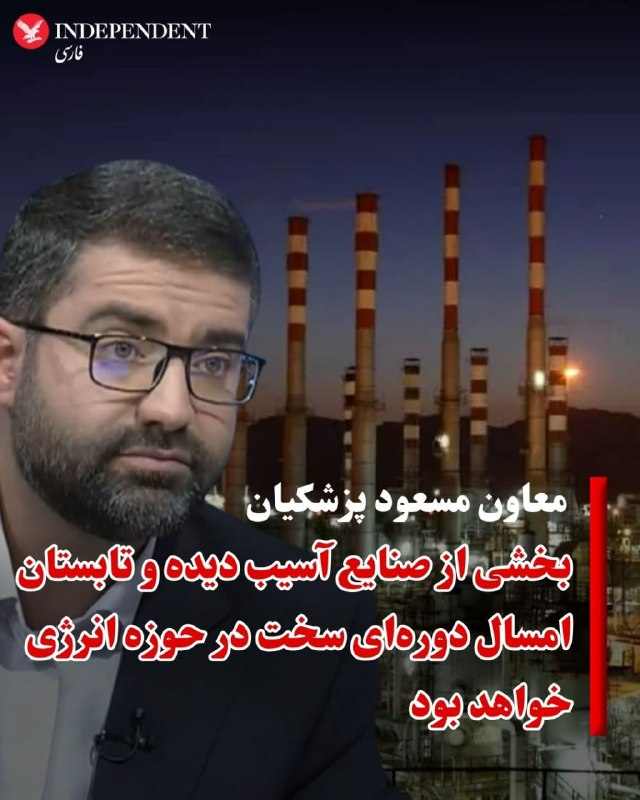
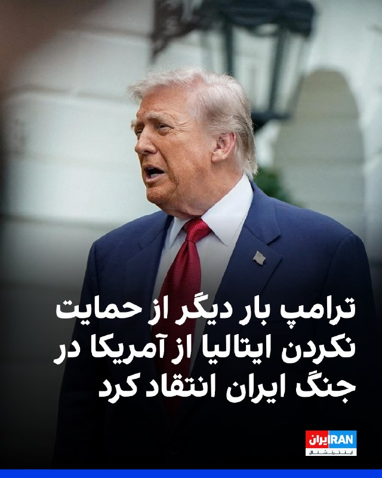
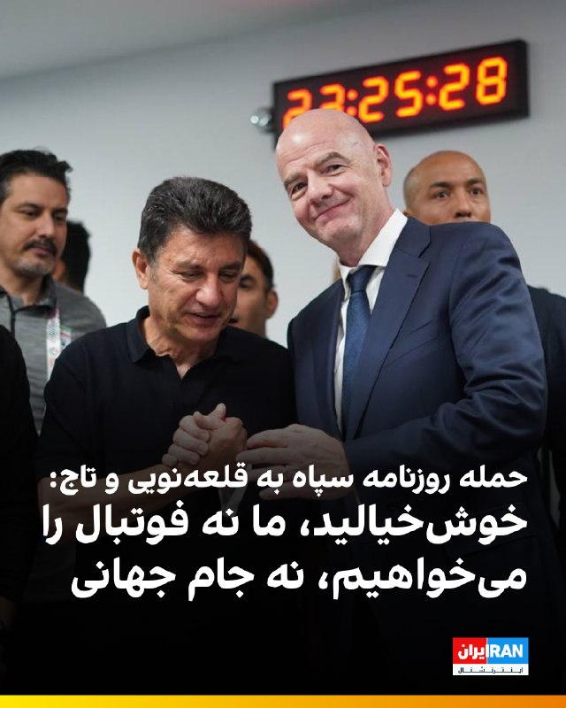

# خواننده تلگرام

<!-- TOP_NAV START -->

<a href="https://github.com/ProAlit/aio-downloader/blob/main/telegram/content/archive_1.md" style="display:inline-block; padding:6px 12px; margin:0 4px; background-color:#2ea44f; color:white; text-decoration:none; border-radius:4px; font-weight:bold;">صفحه بعد</a>

<!-- TOP_NAV END -->

<!-- MSG START -->

---
📅 بروزرسانی: 1405/02/20 11:52
---

## VahidOOnLine — post 239238

  <a href="telegram/content/VahidOOnLine_239238_1778401378.mp4" target="_blank">🎬 Download video</a>

بر اساس ویدیوهای رسیده به ایران‌اینترنشنال، ایرانیان مقیم ژاپن یکشنبه ۲۰ اردیبهشت در پی فراخوان شاهزاده رضا پهلوی، علیه اعدام‌های جمهوری اسلامی و قطع اینترنت در ایران، در شهر توکیو تجمع کردند.
‌🏁 🇬🇧 IranintlTV

🤖 @VahidOOnLine

## mwarmonitor — post 8784

🇮🇶 پارلمان عراق وزرای امنیت را برای بررسی گزارشی درباره ادعای وجود یک پایگاه مخفی اسرائیلی احضار می‌کند — شبکه i24

@mwarmonitor

## mwarmonitor — post 8783

  

🔴به گفته منابع آگاه از این موضوع، از جمله مقام‌های آمریکایی، اسرائیل یک پایگاه نظامی مخفی در بیابان غربی عراق ایجاد کرده بود تا از کارزار هوایی خود علیه ایران پشتیبانی کند. 🔸بر اساس گزارش‌ها، این تأسیسات پنهانی محل استقرار نیروهای ویژه اسرائیل بوده و به‌عنوان…

## DEJradio — post 4541

  <a href="telegram/content/DEJradio_4541_1778401381.mp4" target="_blank">🎬 Download video</a>

🎥
👑 ۱۹ دی‌ماه ۱۴۰۴؛ تیراندازی بـ.ـسیجی‌ها به مردم از پشت سر
وقتی مردم برای نجات جان خود در کوچه‌ها پنهان شده‌ بودند نیروهای سرکوبگر از پشت سر به آنها تیراندازی کردند.

#سرکوبگران #دیماه
@DEJradio

## DEJradio — post 4540

  <a href="telegram/content/DEJradio_4540_1778401384.webm" target="_blank">🎬 Download video</a>

⭕️
🔺 چند هفته پس از پایان جنگ ۴۰ روزه، بازار کار ایران با یکی از شدیدترین موج‌های بیکاری و تعدیل نیرو روبرو شده است. بسیاری از کارخانجات تعطیل شده‌اند و هزاران نفر شغل‌شان را از دست داده‌اند.
خبرگزاری فارس وابسته به سـ.ـپاه با اشاره به تعطیلی کارخانه‌ها و تولیدی‌ها به نقل از یک تولیدگر نوشته «اوضاع افتضاح است.»
این خبرگزاری به نقل از یک «تحلیلگر اقتصادی» می‌نویسد، «حتی اگر درگیر جنگ هم نبودیم، در دنیای امروز، اقتصاد کشور باید با فرض یک جنگ ۱۰ ساله بازمعماری شود. دولت باید با مردم حرف بزند و به سرعت وضعیتی که تصمیم‌ها را موقت، سرمایه‌گذاری‌ها را معلق و زنجیره‌های تولید را شکننده نگه داشت، پایان یابد.»
به نوشته فارس «بذر یک اقتصاد مقاوم در پذیرش یک افق هرچند دشوار کاشته می‌شود. فرض جنگی ۱۰ ساله، هرچند بی‌رحم است اما دست‌کم نقشه‌راه دارد؛ همان نقشه‌ای که می‌تواند چراغ کارخانه‌ای را پس‌از ماه‌ها خاموشی، دوباره روشن کند.»

#بیکاری #فقر
@DEJradio

## IranIntlTV — post 336423

  <a href="telegram/content/IranIntlTV_336423_1778401385.mp4" target="_blank">🎬 Download video</a>

بر اساس ویدیوهای رسیده به ایران‌اینترنشنال، ایرانیان مقیم ژاپن یکشنبه ۲۰ اردیبهشت در پی فراخوان شاهزاده رضا پهلوی، علیه اعدام‌های جمهوری اسلامی و قطع اینترنت در ایران، در شهر توکیو تجمع کردند.

## IranIntlTV — post 336422

  <a href="telegram/content/IranIntlTV_336422_1778401387.mp4" target="_blank">🎬 Download video</a>

همزمان با ادامه نبرد آمریکا و جمهوری اسلامی بر سر کنترل تنگه هرمز، دونالد ترامپ تصاویری گرافیکی از نابودسازی نیروی دریایی سپاه منتشر و بر پیروزی در جنگ تاکید کرد. سپاه پاسداران نیز ایالات متحده را به اقدام نظامی تهدید کرد.

گفت‌وگو با مرتضی کاظمیان، عضو تحریریه ایران‌اینترنشنال
@iranintltv

## IranIntlTV — post 336421

  <a href="telegram/content/IranIntlTV_336421_1778401389.mp4" target="_blank">🎬 Download video</a>

رجب طیب اردوغان، رییس‌جمهوری ترکیه، ضمن محکوم کردن حملات جمهوری اسلامی، بر حمایت کامل کشورش از امنیت و حاکمیت امارات متحده عربی و دولت اقلیم کردستان عراق تاکید کرد.
نرگس هورخش، خبرنگار ایران‌اینترنشنال، گزارش می‌دهد
@iranintltv

## FarsiVOA — post 217324

  

منابع غزه‌ای گزارش دادند در حملات ارتش اسرائیل به یک جیپ در خان‌یونس، سه نفر کشته شدند.

بر اساس این گزارش‌ها، یکی از کشته‌شدگان وسام عبدالهادی، مسئول بخش تحقیقات حماس در خان‌یونس، بوده است. منابع محلی همچنین اعلام کردند فادی هیکل، از همراهان او، نیز در این حملات کشته شده است.

هدف اصلی این حملات، بنا بر گزارش‌های اولیه، وسام عبدالهادی معرفی شده؛ فردی که از او به‌عنوان فرمانده بخش تحقیقات حماس در خان‌یونس نام برده می‌شود.
@FarsiVOA

## DW_Farsi — post 124510

  

📸عکس روز: رقص کشتی‌های یدک‌کش در قلب هامبورگ

۸۳۷ سال از تأسیس بندر هامبورگ می‌گذرد و به همین مناسبت کشتی‌های یدک‌کش چنان بر فراز رودخانه "البه" می‌لغزند که گویی برای رقصی مشترک با هم قرار گذاشته‌اند. آن‌ها با هماهنگی ظریف و برازنده خود خطوطی پرشور و مواج را بر پهنه آب ترسیم می‌کنند. در پس‌زمینه این صحنه، فرهنگسرا و تالار کنسرت ‌فیلارمونی هامبورگ دیده می‌شود که همچون رهبر ارکستر بر باله یدک‌کش‌ها در این دومین شهر بزرگ آلمان نظاره می‌افکند.

@dw_farsi

## Persian_Trend_Official — post 13810

  

🔴 دقایقی پیش یک فروند جنگنده F-35 Lightning II متعلق به نیروی هوایی ایالات متحده، هنگام پرواز بر فراز دریای عمان، کد اضطراری ۷۷۰۰ را ارسال کرد.

🔹این کد نشان‌دهنده بروز وضعیت اضطراری جدی و نیاز فوری هواپیما به فرود است.

☆Phantom☆
📌 @persian_trend_official
پرشین ترند | متفاوت‌ترین کانال نظامی

## BBCPersian — post 280642

🔻 فارس: کشتی‌ای که در سواحل قطر هدف قرار گرفت متعلق به آمریکا بود

خبرگزاری فارس به نقل از «یک منبع آگاه» نوشت کشتی فله‌بری که در نزدیکی سواحل قطر هدف قرار گرفت متعلق به ایالات متحده آمریکاست و «با پرچم آمریکا» تردد می‌کرد.

شبکه خبر ایران هم به نقل از منابع آگاه گفت کشتی باری که هدف قرار گرفت با پرچم آمریکا حرکت می‌کرد و متعلق به آمریکاست.

آمریکا اظهار نظری نکرده است.

اداره عملیات تجارت دریایی بریتانیا ساعاتی پیش گزارش کرده بود یک کشتی در فاصله ۴۳ کیلومتری شمال شرقی دوحه، پایتخت قطر، هدف «پرتابه ناشناس» قرار گرفته و آتش‌سوزی کوچکی در آن ایجاد شده است.

https://bbc.in/4d6jA8c
@BBCPersian

## alonews — post 119010

  <a href="telegram/content/alonews_119010_1778401393.webm" target="_blank">🎬 Download video</a>

👈دقایقی پیش یک فروند جنگنده  F-35 Lightning II نیروی هوایی ایالات متحده آمریکا هنگام پرواز بر فراز دریای عمان کد اضطراری ۷۷۰۰ را مخابره کرد.

🔴 ارسال این کد به معنای وجود یک وضعیت اضطراری و فوری است که نیاز به فرود دارد.

✅ @AloNews خبر جنگ

## alonews — post 119009

  <a href="telegram/content/alonews_119009_1778401393.webm" target="_blank">🎬 Download video</a>

👈وزارت خارجه قطر: وزیر خارجه قطر با روبیو و ویتکاف دیدار کرد

🔴وزارت خارجه قطر اعلام کرد که شیخ محمد بن عبدالرحمن بن جاسم آل ثانی ، در میامی با مارکو روبیو، وزیر خارجه آمریکا، و استیو ویتکاف، فرستاده آمریکا در امور خاورمیانه، دیدار کرده است.

🔴وزارت خارجه قطر در بیانیه‌ای افزود که در این دیدار، مشارکت راهبردی بین دو کشور، همچنین وضعیت منطقه و میانجیگری قطر برای کاهش تنش‌ها مورد بحث و بررسی قرار گرفته است.

🔴این وزارت‌خانه اشاره کرد که نخست‌وزیر قطر در جریان این دیدار با روبیو و ویتکاف بر ضرورت پاسخگویی همه طرف‌ها به تلاش‌های میانجیگرانه تأکید کرده است.

✅ @AloNews خبر جنگ

## alonews — post 119008

  <a href="telegram/content/alonews_119008_1778401394.webm" target="_blank">🎬 Download video</a>

👈رئیس اتحادیه کسب‌وکارهای اینترنتی: درآمد برخی فعالان شبکه‌های اجتماعی به نزدیک صفر رسیده است

✅ @AloNews خبر جنگ

---
📅 بروزرسانی: 1405/02/20 11:42
---

## VahidOOnLine — post 239237

  

فاطمه پوررضاقلی، دبیر انجمن پیوند کلیه ایران گفت: «در حوزه آنتی‌بیوتیک‌ها با مشکلاتی مواجه هستیم و برخی از این داروها بسیار نایاب شده‌اند.»

او افزود: «در حال حاضر نیز کمبود برخی داروهای عمومی و در دسترس، به‌تدریج محسوس شده است.»

پوررضاقلی ادامه داد: «بخشی از ذخایر دارویی و بیمارستانی طی ماه‌های گذشته مصرف شده و اگر گشایشی در روند تامین دارو ایجاد نشود، احتمال بروز مشکلات جدی در آینده وجود دارد.»
‌🏁 🇬🇧 IranintlTV

🤖 @VahidOOnLine

## VahidOOnLine — post 239236

  <a href="telegram/content/VahidOOnLine_239236_1778400758.mp4" target="_blank">🎬 Download video</a>

ویدیوهای رسیده به ایران‌اینترنشنال نشان می‌دهد ایرانیان مقیم نیوزیلند یکشنبه ۲۰ اردیبهشت در پاسخ به فراخوان شاهزاده رضا پهلوی و علیه اعدام‌های جمهوری اسلامی، با هم‌خوانی سرود «ای ایران» در شهر دنیدن تجمع کردند.
‌🏁 🇬🇧 IranintlTV

🤖 @VahidOOnLine

## VahidOOnLine — post 239235

🗣روایت شما از بیکاری و گرانی زیرسایه آتش‌بس- یکشنبه ۲۰ اردیبهشت ۱۴۰۵

 

🔹گرانی بیداد می‌کنه اما حکومت هیچ برنامه‌ای نداره و فقط سکوت کرده. بدون جنگ هم تا دو ماه دیگه این اقتصاد سقوط می‌کنه، شک نکنید.

 

🔹همه‌ی کالاها از لبنیات و روغن گرفته تا برنج، پلاستیک و دستمال، تقریباً هر فاکتور جدیدی که بیاد، قیمت‌ها افزایش پیدا کرده.

 

🔹من از تهران صحبت می‌کنم، از زمان اعتراضات دی‌ماه که دولت دلار رو برای کالاهای اساسی آزاد کرد، تورم و فشار اقتصادی تشدید شده و در همه مناطق کشور هم همین وضعیت هست.

 

🔹حتی اگه همین فردا هم اینترنت رو وصل کنید، هیچ‌وقت این ظلم و جنایتی که اعضای «شعام» (که حتی می‌ترسن اسم کامل‌شون رو اعلام کنن) در حق معیشت و روان ما کردن رو فراموش نمی‌کنیم.

 

🔹وضعیت اینترنت داغونه. بعد دو ماه با بدبختی تونستم وصل بشم. وضعیت شغل‌ها خرابه و همه بیکار شدن. درست حقوق نمی‌دن و همه‌چیز خیلی زیاد گرونه. به امید آزادی ایران.

 

🔹از اصفهان پیام می‌دم؛ هیچ کاری نمی‌شه کرد. این مدت هر کاری برای امرار معاش کردم، اما زورم به هیچی نمی‌رسه، حتی جمع کردن خودم. خدا لعنت کنه جمهوری اسلامی رو.

 

🔹اوضاع اصلاً جالب نیست. وام‌های طرح مهربانی بانک ملی اصلاً نمی‌ذاره نفس بکشیم. باقی بانک‌ها یه‌کم بهتر هستن، درواقع یعنی انتخاب بین بد و بدتر. با این رکود و وضعیت اقتصادی، قسط وام‌ها کمرشکن شده واقعاً.

 

🔹کارگاه تولیدی داشتیم و از پس اقساط برمی‌اومدیم، ماهانه ۳۰ میلیون قسط می‌دیم. متأسفانه بعد از جنگ و با قیمت افتضاح ورق فولادی، ورشکسته شدیم و اگر وام یک ماه رو پرداخت نکنید، سریع و بدون هشدار از حساب ضامن کم می‌کنه.
‌🏁 🇬🇧 IranintlTV

🤖 @VahidOOnLine

## VahidOOnLine — post 239234

  <a href="telegram/content/VahidOOnLine_239234_1778400761.mp4" target="_blank">🎬 Download video</a>

ویدیوهای رسیده به ایران‌اینترنشنال نشان می‌دهند ایرانیان مقیم استرالیا یکشنبه ۲۰ اردیبهشت با فراخوان شاهزاده رضا پهلوی در شهر ملبورن راهپیمایی کردند.
‌🏁 🇬🇧 IranintlTV

🤖 @VahidOOnLine

## mwarmonitor — post 8780

✈️ساعت 08:52 به وقت زرلو، شناسه SPOOF 30، یک فروند بمب‌افکن B-52H به‌صورت تک از پایگاه فرفورد (Fairford) به پرواز درآمده و روی فرکانس نظامی Swan Mil با فرکانس 278.600 در حال فعالیت است.

@mwarmonitor

## pm_afshaa — post 90453

🔴یدیعوت آحارونوت: پهپادهای هدایت‌شونده با فیبر نوری حزب‌الله به منبع نگرانی ارتش اسرائیل تبدیل شده

‌
💧 Rainbet.com the #1 Non-KYC Crypto Casino & Sportsbook @rainbetcom

😁 @Pm_Afshaa

## DEJradio — post 4539

  <a href="telegram/content/DEJradio_4539_1778400764.webm" target="_blank">🎬 Download video</a>

📢
🔺 “دی‌ماه از فاصله نسبتاً نزدیک به سینه و دنده‌های من ساچمه اصابت کرد، صدمه شدید دیدم، هنوز وقتی نفس که میکشم تو قفسه سینه‌ام درد میکنم، اما بدتر اینجاست که شغلم رو از دست دادم بیکارم

#پیام_دریافتی #دیماه
@DEJradio

## IranIntlTV — post 336420

  

فاطمه پوررضاقلی، دبیر انجمن پیوند کلیه ایران گفت: «در حوزه آنتی‌بیوتیک‌ها با مشکلاتی مواجه هستیم و برخی از این داروها بسیار نایاب شده‌اند.»

او افزود: «در حال حاضر نیز کمبود برخی داروهای عمومی و در دسترس، به‌تدریج محسوس شده است.»

پوررضاقلی ادامه داد: «بخشی از ذخایر دارویی و بیمارستانی طی ماه‌های گذشته مصرف شده و اگر گشایشی در روند تامین دارو ایجاد نشود، احتمال بروز مشکلات جدی در آینده وجود دارد.»
https://iranintl.com/202605109657

## IranIntlTV — post 336419

  <a href="telegram/content/IranIntlTV_336419_1778400765.mp4" target="_blank">🎬 Download video</a>

ویدیوهای رسیده به ایران‌اینترنشنال نشان می‌دهد ایرانیان مقیم نیوزیلند یکشنبه ۲۰ اردیبهشت در پاسخ به فراخوان شاهزاده رضا پهلوی و علیه اعدام‌های جمهوری اسلامی، با هم‌خوانی سرود «ای ایران» در شهر دنیدن تجمع کردند.

## IranIntlTV — post 336418

🗣روایت شما از بیکاری و گرانی زیرسایه آتش‌بس- یکشنبه ۲۰ اردیبهشت ۱۴۰۵

 

🔹گرانی بیداد می‌کنه اما حکومت هیچ برنامه‌ای نداره و فقط سکوت کرده. بدون جنگ هم تا دو ماه دیگه این اقتصاد سقوط می‌کنه، شک نکنید.

 

🔹همه‌ی کالاها از لبنیات و روغن گرفته تا برنج، پلاستیک و دستمال، تقریباً هر فاکتور جدیدی که بیاد، قیمت‌ها افزایش پیدا کرده.

 

🔹من از تهران صحبت می‌کنم، از زمان اعتراضات دی‌ماه که دولت دلار رو برای کالاهای اساسی آزاد کرد، تورم و فشار اقتصادی تشدید شده و در همه مناطق کشور هم همین وضعیت هست.

 

🔹حتی اگه همین فردا هم اینترنت رو وصل کنید، هیچ‌وقت این ظلم و جنایتی که اعضای «شعام» (که حتی می‌ترسن اسم کامل‌شون رو اعلام کنن) در حق معیشت و روان ما کردن رو فراموش نمی‌کنیم.

 

🔹وضعیت اینترنت داغونه. بعد دو ماه با بدبختی تونستم وصل بشم. وضعیت شغل‌ها خرابه و همه بیکار شدن. درست حقوق نمی‌دن و همه‌چیز خیلی زیاد گرونه. به امید آزادی ایران.

 

🔹از اصفهان پیام می‌دم؛ هیچ کاری نمی‌شه کرد. این مدت هر کاری برای امرار معاش کردم، اما زورم به هیچی نمی‌رسه، حتی جمع کردن خودم. خدا لعنت کنه جمهوری اسلامی رو.

 

🔹اوضاع اصلاً جالب نیست. وام‌های طرح مهربانی بانک ملی اصلاً نمی‌ذاره نفس بکشیم. باقی بانک‌ها یه‌کم بهتر هستن، درواقع یعنی انتخاب بین بد و بدتر. با این رکود و وضعیت اقتصادی، قسط وام‌ها کمرشکن شده واقعاً.

 

🔹کارگاه تولیدی داشتیم و از پس اقساط برمی‌اومدیم، ماهانه ۳۰ میلیون قسط می‌دیم. متأسفانه بعد از جنگ و با قیمت افتضاح ورق فولادی، ورشکسته شدیم و اگر وام یک ماه رو پرداخت نکنید، سریع و بدون هشدار از حساب ضامن کم می‌کنه.

## IranIntlTV — post 336417

  <a href="telegram/content/IranIntlTV_336417_1778400767.mp4" target="_blank">🎬 Download video</a>

ویدیوهای رسیده به ایران‌اینترنشنال نشان می‌دهند ایرانیان مقیم استرالیا یکشنبه ۲۰ اردیبهشت با فراخوان شاهزاده رضا پهلوی در شهر ملبورن راهپیمایی کردند.

## FarsiVOA — post 217322

🔺مذاکرات پاکستان با جمهوری اسلامی برای دریافت گاز مایع قطر

▪️خبرگزاری رویترز از قول یک منبع آگاه گزارش داده که پاکستان در حال مذاکره با جمهوری اسلامی برای عبور ایمن تعداد محدودی از کشتی‌های حامل گاز مایع قطر از تنگه هرمز است. قطر بزرگترین تأمین‌کننده گاز مایع، ال‌ان‌جی، پاکستان است.

▪️پاکستان که میانجی و میزبان مذاکرات جمهوری اسلامی و آمریکا است طی هفته‌های گذشته به خاطر انسداد تنگه هرمز با کسری شدید گاز مواجه شده است.

▪️جمهوری اسلامی حدود یک ماه پیش دو تانکر حامل ال‌ان‌جی قطر در مسیر تنگه هرمز را بدون هیچ توضیحی متوقف کرده بود، اما خبرگزاری بلومبرگ روز شنبه از عبور یک کشتی حامل گاز مایع قطر از کنار جزیره لارک ایران در تنگه هرمز خبر داد.

⬇️ بیشتر بخوانید:
https://ir.voanews.com/a/8148462.html

## DW_Farsi — post 124509

  

🔸مریم دریسی، فعال مدنی در حکمی جدید به بیش از یک سال حبس محکوم شد

دادگاه انقلاب شیراز در حکمی تازه مریم دریسی، فعال مدنی اهل کازرون، را به یک سال و سه ماه حبس تعزیری محکوم کرد.

به گزارش سایت حقوق بشری هرانا، این حکم به اتهام "تبلیغ علیه نظام" برای مریم دریسی صادر و در حالی به وکیل او ابلاغ شده است که حداکثر مجازات قانونی این اتهام یک سال حبس است اما دادگاه با استناد به مقررات تکرار جرم، مجازات او را تشدید کرده است.

مریم دریسی اسفندماه سال گذشته با تودیع وثیقه آزاد شده بود. دادگاه کیفری کازرون ۲۴ فروردین امسال در حکمی غیابی او را به اتهام "اخلال در نظم و آسایش عمومی" به یک سال حبس و ۷۴ ضربه شلاق محکوم کرده بود.

در متن دادنامه صادر شده علیه این فعال مدنی که هرانا تصویر آن را منتشر کرده، "شعار دادن‌های هنجارشکنانه و تشویق نمودن مردم جهت دست زدن و کل کشیدن به قصد تحریک جمعیت حاضر و کنترل جمعیت در مراسم" یادبود بهنام عنایت، از جانباختگان اعتراضات دی‌ماه ۱۴۰۴، از مصادیق اتهامات مطروحه علیه این فعال مدنی عنوان شده است.

@dw_farsi

## alonews — post 119007

  <a href="telegram/content/alonews_119007_1778400770.webm" target="_blank">🎬 Download video</a>

👈یدیعوت آحارونوت: پهپادهای هدایت‌شونده با فیبر نوری حزب‌الله به منبع نگرانی ارتش اسرائیل تبدیل شده‌اند

🔴ارتش اسرائیل از بالگردها، هواپیماها و سامانه گنبد آهنین برای مقابله با این پهپادها استفاده می‌کند ، اما این ابزارها بی‌اثر هستند.

🔴 بسیاری از شرکت‌ها راه‌حل‌های نوآورانه‌ای ارائه می‌دهند، اما در این مرحله، «این پهپادهای ساده و فیبر نوری، هوشمندتر از همه راه‌حل‌های دیگر هستند.»

✅ @AloNews خبر جنگ

## alonews — post 119006

  <a href="telegram/content/alonews_119006_1778400770.webm" target="_blank">🎬 Download video</a>

👈بیاتی نماینده مجلس: در اولین جلسه مجلس خروج از NPT را بررسی می‌کنیم.

🔴تنگه هرمز برگ برنده ماست آمریکا می‌خواهد آن را از ما را بگیرد.

🔴به هیچ وجه و در چارچوب هیچ مذاکره ای ایران غنی سازی را صفر و اورانیوم غنی شده را به آمریکا نمی دهد.

🔴مدیریت تنگه هرمز را راها نمی کنیم

✅ @AloNews خبر جنگ

---
📅 بروزرسانی: 1405/02/20 11:32
---

## VahidOOnLine — post 239233

  

قتل «مریم آقابابایی» دختر ۳۰ ساله اهل شهرکرد که پس از سوار شدن به یک تاکسی اینترنتی ناپدید شده بود، واکنش‌های گسترده‌ای در پی داشته است.

بر اساس گزارش رسانه‌های ایران، جسد سوخته مریم چند روز بعد توسط یک چوپان در اطراف شهرکرد پیدا شد. پلیس اعلام کرده متهم اصلی پرونده بازداشت شده و در بازجویی‌های اولیه به قتل اعتراف کرده است.

خانواده مریم می‌گویند انگیزه قتل هنوز به‌طور دقیق مشخص نیست. برخی گزارش‌های محلی از احتمال تعرض خبر داده‌اند، اما متهم تاکنون انگیزه را «سرقت طلا» عنوان کرده است.

همزمان، تجمع‌هایی در شهرکرد برای مطالبه عدالت و امنیت زنان برگزار شده است. پرونده همچنان در مرحله تحقیقات قرار دارد.
‌🏁 🇬🇧 ManotoTV

🤖 @VahidOOnLine

## VahidOOnLine — post 239232

  

رسانه‌های حکومتی در ایران از احتمال شنیده شدن صدای «انفجارهای کنترل‌شده» در اصفهان خبر دادند

بر اساس اطلاعیه منتشرشده در رسانه‌های نزدیک به حکومت، از جمله خبرگزاری فارس و رسانه‌های وابسته به سپاه، احتمال شنیده شدن صدای انفجار از ساعت ۹ تا ۱۵ امروز در برخی مناطق اصفهان وجود دارد.

در این اطلاعیه آمده که انفجارها در مناطق اقارب‌پرست، حکیم نظامی و بلوار کشاورز انجام می‌شود و «جای هیچ‌گونه نگرانی برای شهروندان نیست.»

در روزهای اخیر نیز رسانه‌های حکومتی چندین بار خبرهایی مشابه درباره «انفجارهای کنترل‌شده» در اصفهان و شهرهای دیگر منتشر کرده‌اند. روابط عمومی سپاه حضرت صاحب‌الزمان استان اصفهان در اطلاعیه‌های قبلی، مسئولیت انتشار این هشدارها را برعهده گرفته بود.
‌🏁 🇬🇧 ManotoTV

🤖 @VahidOOnLine

## mwarmonitor — post 8779

  

✈️🇺🇸جنگنده F-35 نیروی هوایی آمریکا (USAF) در حال ارسال کد اضطراری 7700 بر فراز تنگه هرمز است.

@mwarmonitor

## mwarmonitor — post 8778

  <a href="telegram/content/mwarmonitor_8778_1778400165.mp4" target="_blank">🎬 Download video</a>

📝 باید به حالِ سیرکی گریست که در آن، یک «مرغِ دیپورتی» که حتی درِ دستشویی‌های تورنتو را هم به رویش باز نکردند، حالا در نقشِ «ناجیِ دیپلماسی» برای یک ملت منبر می‌رود. این انگلِ خوش‌اشتها چنان با وقاحت از «ماندن تا آخرین لحظه» حرف می‌زند که انگار ماندنش یک تکلیف الهی است، نه یک مأموریتِ شکمی برای لیسیدنِ ته‌مانده‌ی دیگِ بیت‌المال.
🔸 درد اینجاست که او جام جهانی را نه برای فوتبال، بلکه به عنوان یک «گروگانِ سیاسی» می‌خواهد تا پشتِ آن قایم شود و به ریشِ مردمی بخندد که هزینه‌ی ویزاهای ریجکت‌شده‌اش را می‌دهند. او نگرانِ جایگزین شدنِ ایران توسط فیفا نیست؛ او می‌ترسد که اگر این سیرک تمام شود، دیگر جایی برای چریدن نداشته باشد. حقیقتِ تلخ و گزنده این است: ما در زمینی بازی می‌کنیم که داورش یک جیره‌بگیرِ بی‌مصرف است که در خارج از مرزها حتی به عنوان «ضایعات» هم پذیرفته نمی‌شود، اما در داخل، تاجِ افتخارِ مدیریتی بر سر می‌گذارد. این دیگر طنز نیست، این بوی گندِ تعفنی است که با هیچ ادکلنِ دیپلماتیکی پاک نمی‌شود؛ حکایتِ موجودی که تا آخرین قطره‌ی خونِ فوتبال را نمک نزند، دست از سرِ جنازه‌ی این ورزش بر نمی‌دارد.

@mwarmonitor

## ManotoTV — post 105225

  

قتل «مریم آقابابایی» دختر ۳۰ ساله اهل شهرکرد که پس از سوار شدن به یک تاکسی اینترنتی ناپدید شده بود، واکنش‌های گسترده‌ای در پی داشته است.

بر اساس گزارش رسانه‌های ایران، جسد سوخته مریم چند روز بعد توسط یک چوپان در اطراف شهرکرد پیدا شد. پلیس اعلام کرده متهم اصلی پرونده بازداشت شده و در بازجویی‌های اولیه به قتل اعتراف کرده است.

خانواده مریم می‌گویند انگیزه قتل هنوز به‌طور دقیق مشخص نیست. برخی گزارش‌های محلی از احتمال تعرض خبر داده‌اند، اما متهم تاکنون انگیزه را «سرقت طلا» عنوان کرده است.

همزمان، تجمع‌هایی در شهرکرد برای مطالبه عدالت و امنیت زنان برگزار شده است. پرونده همچنان در مرحله تحقیقات قرار دارد.

## ManotoTV — post 105224

  

رسانه‌های حکومتی در ایران از احتمال شنیده شدن صدای «انفجارهای کنترل‌شده» در اصفهان خبر دادند

بر اساس اطلاعیه منتشرشده در رسانه‌های نزدیک به حکومت، از جمله خبرگزاری فارس و رسانه‌های وابسته به سپاه، احتمال شنیده شدن صدای انفجار از ساعت ۹ تا ۱۵ امروز در برخی مناطق اصفهان وجود دارد.

در این اطلاعیه آمده که انفجارها در مناطق اقارب‌پرست، حکیم نظامی و بلوار کشاورز انجام می‌شود و «جای هیچ‌گونه نگرانی برای شهروندان نیست.»

در روزهای اخیر نیز رسانه‌های حکومتی چندین بار خبرهایی مشابه درباره «انفجارهای کنترل‌شده» در اصفهان و شهرهای دیگر منتشر کرده‌اند. روابط عمومی سپاه حضرت صاحب‌الزمان استان اصفهان در اطلاعیه‌های قبلی، مسئولیت انتشار این هشدارها را برعهده گرفته بود.

## BBCPersian — post 280641

🔻 ارتش اسرائیل: یک پرتابه را در جنوب لبنان رهگیری کردیم

ارتش اسرائیل می‌گوید که یک پرتابه «مشکوک» را در منطقه‌ حضور نیروهایش در جنوب لبنان شناسایی و رهگیری کرده است.

ارتش اسرائیل همچنین گفت که در دو روز گذشته بیش از ۴۰ نقطه زیرساختی حزب‌الله را در جنوب لبنان هدف قرار داده است.

این ارتش در شبکه اجتماعی ایکس نوشت که نیروهایش ۱۰ عضو حزب‌الله را در جنوب لبنان کشته‌اند و انبارهای سلاح و یک پرتابگر را هدف گرفته‌اند.

مقامات لبنانی می‌گویند که در حملات دیروز اسرائیل دست‌کم ۲۴ نفر کشته شده‌اند.

https://bbc.in/42qfNOo
@BBCPersian

## BBCPersian — post 280640

🔻 ارتش ایران: کشورهایی که از تحریم‌های آمریکا تبعیت کنند، برای عبور از تنگه هرمز مشکل خواهند داشت

به گفته سخنگوی ارتش ایران، «از این پس کشورهایی که از آمریکا در اعمال تحریم علیه جمهوری اسلامی ایران تبعیت کنند، حتما در عبور از تنگه هرمز با مشکل مواجه می‌شوند.»

به گزارش خبرگزاری دولتی ایرنا، محمد اکرمی‌نیا گفت: «آمریکایی‌ها هرگز قادر نخواهند بود این گستره وسیع در شمال اقیانوس هند را با پوشش ناوگان خود به یک محاصره واقعی تبدیل کنند.»

او همچنین گفت: «بدون شک، هدف از ادعای 'اعمال محاصره' تلاشی برای خنثی‌سازی مدیریت جمهوری اسلامی ایران بر تنگه هرمز از طریق اقدامات تبلیغاتی بوده است» و «تجارت دریایی ما همچنان به سهولت در جریان است؛ تنها تعداد معدودی کشتی توقیف شده‌اند که در مقابل، ما نیز توانسته‌ایم مانع تردد و فعالیت کشتی‌های رژیم صهیونیستی شویم و آنها را توقیف کنیم.»

https://bbc.in/42V76vA
@BBCPersian

## BBCPersian — post 280639

🔻 کشته شدن دو شهروند سوریه در حمله پهپادی اسرائیل به لبنان

خبرگزاری ملی لبنان گزارش کرد که در حمله پهپادی نیروهای اسرائیلی به یک موتورسیکلت در جاده اصلی بین القلیله و دیر قانون، دو سوری کشته شده‌اند.

بنابر این گزارش، «تیم‌های دفاع مدنی با هماهنگی ارتش لبنان در حال تلاش برای جابه‌جایی اجساد هستند.»

اسرائیل به شهرهای شقرا و صفد البطیخ هم حمله هوایی کرده و خانه‌ها را در روستاها و شهرهای خط مقدم، به‌ویژه در شهر بنت جبیل و شهر طیری تخریب کرده است.

به گفته خبرگزاری ملی لبنان، اسرائیل در سپیده دم به شهر صریفا حمله هوایی کرده‌ است.

https://bbc.in/4wiuYGS
@BBCPersian

## Hranews — post 112856

  

گزارشی از بازداشت ۹ شهروند در سبزوار

❗️
❗️
❗️
❗️
❗️ – در روزهای اخیر، ۹ شهروند در سبزوار توسط نیروهای امنیتی #بازداشت و به زندان تربت‌حیدریه منتقل شدند. تاکنون هویت چهار تن از آنان، امیرحسین پایدار، فرزانه پروانه، سعید پروانه و الهام پروانه، از اعضای خانواده ابوالفضل پایدار، از جان‌باختگان اعتراضات دی‌ماه ۱۴۰۴، احراز شده است.

به گزارش خبرگزاری هرانا، ارگان خبری مجموعه فعالان حقوق بشر در ایران، روز سه شنبه ۱۵ اردیبهشت ۱۴۰۵، دست‌کم ۹ شهروند توسط نیروهای امنیتی در سبزوار بازداشت و به زندان تربت‌حیدریه منتقل شدند.

بر اساس اطلاعات دریافتی هرانا، بازداشت این شهروندان در پی اقدام به برگزاری مراسم تولد ابوالفضل پایدار، یکی از جان‌باختگان اعتراضات دی‌ماه ۱۴۰۴، صورت گرفته است. تاکنون هویت چهار تن از بازداشت‌شدگان که از اعضای خانواده ابوالفضل پایدار هستند، به نام‌های امیرحسین پایدار، فرزانه پروانه، سعید پروانه و الهام پروانه، احراز شده است.

ادامه مطلب

#امیرحسین_پایدار
#فرزانه_پروانه
#سعید_پروانه
#الهام_پروانه

↘️
@hranews_bot تماس ✉️ -  @Hranews  کانال هرانا 🆑

## manototv — post 105225

  

قتل «مریم آقابابایی» دختر ۳۰ ساله اهل شهرکرد که پس از سوار شدن به یک تاکسی اینترنتی ناپدید شده بود، واکنش‌های گسترده‌ای در پی داشته است.

بر اساس گزارش رسانه‌های ایران، جسد سوخته مریم چند روز بعد توسط یک چوپان در اطراف شهرکرد پیدا شد. پلیس اعلام کرده متهم اصلی پرونده بازداشت شده و در بازجویی‌های اولیه به قتل اعتراف کرده است.

خانواده مریم می‌گویند انگیزه قتل هنوز به‌طور دقیق مشخص نیست. برخی گزارش‌های محلی از احتمال تعرض خبر داده‌اند، اما متهم تاکنون انگیزه را «سرقت طلا» عنوان کرده است.

همزمان، تجمع‌هایی در شهرکرد برای مطالبه عدالت و امنیت زنان برگزار شده است. پرونده همچنان در مرحله تحقیقات قرار دارد.

## manototv — post 105224

  

رسانه‌های حکومتی در ایران از احتمال شنیده شدن صدای «انفجارهای کنترل‌شده» در اصفهان خبر دادند

بر اساس اطلاعیه منتشرشده در رسانه‌های نزدیک به حکومت، از جمله خبرگزاری فارس و رسانه‌های وابسته به سپاه، احتمال شنیده شدن صدای انفجار از ساعت ۹ تا ۱۵ امروز در برخی مناطق اصفهان وجود دارد.

در این اطلاعیه آمده که انفجارها در مناطق اقارب‌پرست، حکیم نظامی و بلوار کشاورز انجام می‌شود و «جای هیچ‌گونه نگرانی برای شهروندان نیست.»

در روزهای اخیر نیز رسانه‌های حکومتی چندین بار خبرهایی مشابه درباره «انفجارهای کنترل‌شده» در اصفهان و شهرهای دیگر منتشر کرده‌اند. روابط عمومی سپاه حضرت صاحب‌الزمان استان اصفهان در اطلاعیه‌های قبلی، مسئولیت انتشار این هشدارها را برعهده گرفته بود.

## alonews — post 119005

  <a href="telegram/content/alonews_119005_1778400169.webm" target="_blank">🎬 Download video</a>

👈فایننشال تایمز : آلمان تلاش‌های خودشو برای خرید موشک‌های "تاماهاوک" از آمریکا، از سر گرفته

✅ @AloNews خبر جنگ

## alonews — post 119004

  

امروز May10؛ روز جهانی مادره.

مادرها روزتون مبارک❤️

[@AloTweet]

## alonews — post 119003

  <a href="telegram/content/alonews_119003_1778400169.webm" target="_blank">🎬 Download video</a>

👈مرکز عملیات دریایی انگلیس گزارش کرد که «یک کشتی فله‌بر در نزدیکی قطر مورد اصابت یک پرتابه ناشناس قرار گرفته است» 
✅ @AloNews خبر جنگ

---
📅 بروزرسانی: 1405/02/20 11:22
---

## VahidOOnLine — post 239231

  

نت‌بلاکس، نهاد ناظر بر اختلال‌های اینترنتی، صبح یکشنبه اعلام کرد قطعی اینترنت در ایران پس از بیش از ۱۷۰۰ ساعت، وارد هفتادودومین روز خود شده است.

بر اساس این گزارش، هیچ نشانه‌ای از برقراری اینترنت وجود ندارد و مقام‌های حکومت دسترسی عمومی به اینترنت بین‌المللی را محدود کرده‌اند.
‌🏁 🇬🇧 IranintlTV

🤖 @VahidOOnLine

## IranIntlTV — post 336416

  

نت‌بلاکس، نهاد ناظر بر اختلال‌های اینترنتی، صبح یکشنبه اعلام کرد قطعی اینترنت در ایران پس از بیش از ۱۷۰۰ ساعت، وارد هفتادودومین روز خود شده است.

بر اساس این گزارش، هیچ نشانه‌ای از برقراری اینترنت وجود ندارد و مقام‌های حکومت دسترسی عمومی به اینترنت بین‌المللی را محدود کرده‌اند.
https://iranintl.com/202605108444

## RadioFarda — post 157023

  

🔸مرکز عملیات تجارت دریایی بریتانیا روز یک‌شنبه در حساب رسمی خود در شبکه ایکس از اصابت «پرتابه‌ای ناشناس» به یک کشتی فله‌بر در نزدیکی ساحل قطر خبر داد.

🔸به گفته این مرکز، این رخداد باعث بروز «حریقی مختصر» در کشتی شده که خاموش شده و مجروحی نیز برجا نگذاشته است.

@RadioFarda

## RadioFarda — post 157022

]]

## Hranews — post 112855

  

نت‌بلاکس، که محدودیت دسترسی به #اینترنت در جهان را رصد می‌کند، اعلام کرد که قطع اینترنت در ایران وارد هفتادودومین روز خود شده است. این نهاد با اشاره به تداوم محدودیت‌ها پس از ۱۷۰۴ ساعت، اعلام کرد که دسترسی کاربران ایرانی به اینترنت جهانی همچنان در وضعیت «تقریبا متوقف» قرار دارد و نشانه‌ای از بازگشت گسترده اینترنت بین‌المللی مشاهده نمی‌شود.

↘️
@hranews_bot تماس ✉️ -  @Hranews  کانال هرانا 🆑

## alonews — post 119002

  <a href="telegram/content/alonews_119002_1778399565.mp4" target="_blank">🎬 Download video</a>

👈زیرگرفتن هواداران فوتبال در ترکیه

🔴شب گذشته فردی با خودروی شخصی تماشاگران تیم فوتبال گالاتاسرای را هنگام جشن قهرمانی زیرگرفت.

🔴طبق گزارش رسانهٔ ترکیه،درپی این اتفاق ۵ نفر مصدوم شد‌ند؛ فردی که تماشاگران را زیرگرفت نیز از محل حادثه فرار کرد.

✅ @AloNews خبر جنگ

## alonews — post 119001

  

فیلترشکن پرسرعت😊

مناسب برای همه اوپراتورها🛜🛜🛜🛜🛜

کانفیگ 🔐🔐🔐🔐

همراه با لینک ساب✔️
بدون ضریب✔️

قیمت هر یک گیگ 200 🛍
سه گیگ 600 🔥
شش گیگ 1200 😎
جهت خرید پیام بدید👀

@sstp_off

کانال جهت اعتماد👇

https://t.me/sstp_off1

---
📅 بروزرسانی: 1405/02/20 11:12
---

## pm_afshaa — post 90452

پزشکیان: دشمن پس از ناکامی در جنگ نظامی، تلاش دارد جنگ را به عرصه اقتصاد منتقل کند و مردم باید با نقش‌آفرینی و همراهی خود، این توطئه را نیز ناکام بگذارن

💧 Rainbet.com the #1 Non-KYC Crypto Casino & Sportsbook @rainbetcom

😁 @Pm_Afshaa

## IranIntlTV — post 336415

  <a href="telegram/content/IranIntlTV_336415_1778398979.mp4" target="_blank">🎬 Download video</a>

بریتانیا اعلام کرد پس از پایان رسمی درگیری‌های ایالات متحده و اسرائیل با جمهوری اسلامی، برای تامین امنیت عبور کشتی‌ها از تنگه هرمز یک ناو جنگی به خاورمیانه اعزام می‌کند.
گفت‌وگو با روح‌الله رحیم‌پور، روزنامه‌نگار و تحلیل‌گر سیاسی
@iranintltv

## IranIntlTV — post 336414

  

🔻مهدی تاج، رئیس فدراسیون فوتبال، در گفت‌وگو با صداوسیمای جمهوری اسلامی اعلام کرد: «۱۰ روز است که از کانادا برگشته‌ایم ولی هنوز چمدان‌هایمان را نفرستاده‌اند؛ نمی‌دانم سرنوشت چمدان‌های ما چه شده است.»

🔹پلیس کانادا از ورود مهدی تاج، هدایت ممبینی، دبیرکل فدراسیون و دو عضو کمیته روابط بین‌الملل به خاک این کشور جلوگیری کرد. این افراد پس از ساعت‌ها حضور در فرودگاه، از کانادا اخراج شدند.

🔹اخراج تاج پس از انتشار گزارش اختصاصی ایران‌اینترنشنال صورت گرفت؛ گزارشی که فاش کرد برای تاج «مجوز اقامت موقت» یا ویزای TRP صادر شده است.

🔹مهدی تاج سابقه فرماندهی در اطلاعات سپاه پاسداران اصفهان را دارد. دولت کانادا از خرداد ۱۴۰۳، سپاه پاسداران را در فهرست گروه‌های «تروریستی» قرار داده است.

@iranintltvsport

## FarsiVOA — post 217321

  

ارتش اسرائیل اعلام کرد دو پهپاد که به‌ظاهر متعلق به حزب‌الله بودند، صبح یکشنبه بر فراز مناطقی در جنوب لبنان که نیروهای اسرائیلی در آن مستقر هستند، شناسایی و رهگیری شدند.

به گزارش تایمز اسرائیل، ارتش اسرائیل گفته این دو پهپاد پیش از آنکه به نیروها یا مواضع اسرائیلی آسیب بزنند، سرنگون شده‌اند و در این دو حادثه گزارشی از زخمی شدن افراد منتشر نشده است.

این رخداد در حالی گزارش می‌شود که تنش در مرز اسرائیل و لبنان، با وجود آتش‌بس شکننده، همچنان ادامه دارد. در روزهای گذشته، ارتش اسرائیل چندین بار از حمله به مواضع حزب‌الله در جنوب لبنان خبر داده و رسانه‌های لبنانی نیز از حملات هوایی اسرائیل به چند منطقه در جنوب این کشور گزارش داده‌اند.
@FarsiVOA

## DW_Farsi — post 124503

🔸چه کسانی از جنگ در ایران سود می‌برند؟

🔻گزارشی از آتفه چهارمحالیان

با ادامه درگیری‌های نظامی میان ایران، آمریکا و اسرائیل و هم‌زمان با تشدید بحران‌های اقتصادی و سیاسی در ایران پرسش درباره این‌که هزینه‌های جنگ بر دوش چه کسانی قرار می‌گیرد و چه بخش‌هایی از ساختار قدرت از این وضعیت سود می‌برند، به یکی از موضوعات بحث‌برانگیز اقتصاد سیاسی کشور تبدیل شده است.

مهرداد وهابی، پژوهشگر ، نویسنده و استاد اقتصاد دانشگاه سوربن شمالی فرانسه در گفت‌وگو با دویچه وله به تعدادی از پرسش‌های جاری در فضای عمومی درباره پیامدهای اقتصادی جنگ پاسخ داده است. به باور او، اقتصاد ایران پیش از جنگ نیز با تورم مزمن، شوک‌های ارزی، کاهش ارزش ریال و کسری بودجه روبه‌رو بوده، اما شرایط جنگی این بحران‌ها را تشدید کرده است.

از منظر این اقتصاددان، در حالی که بخش بزرگی از جامعه، نیروی کار و دولت رسمی ایران از پیامدهای جنگ آسیب دیده‌اند، نهادهای وابسته به بخش ولایی و سپاه پاسداران انقلاب اسلامی از افزایش قیمت نفت، تجارت موازی و تمرکز بیشتر منابع اقتصادی سود برده‌اند.

@dw_farsi

## DW_Farsi — post 124502

🔸جام ۱۹۳۰؛ گیرمو استابیله، ستاره‌ای که از صافی می‌گذشت

گیرمو استابیله (Guillermo Stabile) اگرچه از تکنیک چندان خوبى برخوردار نبود، اما از آن‌جایى که در کنار فوتبال به ورزش دو و میدانى، به ویژه دو سرعت علاقه داشت، توانست نقش مهمى در مستطیل سبز ایفا کند.

این مهاجم آرژانتینى که در دوران نوجوانى، ۱۰۰ متر را در ۱۱ ثانیه طى مى‌کرد، بازی فوتبال را در باشگاه "اِسپورتیوو مِتان" آغاز کرد. او پس از مدت کوتاهی به تیم دسته برتری، اما نه‌چندان مطرح "اوراکان بوئنوس آیرس" (Huracán Buenos Aires) در پایتخت ملحق شد.

گیرمو استابیله، ستاره تیم ملی فوتبال آرژانتین در دهه ۳۰ قرن گذشتهگیرمو استابیله، ستاره تیم ملی فوتبال آرژانتین در دهه ۳۰ قرن گذشته
گیرمو استابیله در جام جهانی ۱۹۳۰ اورگوئه خوش درخشیدعکس: Getty Images/AFP
استابیله چون بازیکن چندان تکنیکى‌اى نبود، مربیان از وجود او استفاده نمی‌کردند، تا این‌که مهاجم میانى ثابت "اوراکان" دچار مصدومیت سختى شد و استابیله این فرصت را یافت تا توانایی‌هایش در سرعت، شتاب و شوت‌هاى دقیق به نمایش بگذارد.

بازیکنان تکنیکى این باشگاه معمولا در کنار خط حرکت مى‌کردند و یاران حریف را به سمت خود مى‌کشاندند؛ به‌طورى که در خط دفاعى شکاف‌هایى پدید مى‌آمد. استابیله هم با توجه به سرعت بالایی که داشت، پاس‌هاى دریافتى از گوشه‌ها را با خونسردى و مهارت کامل به گل تبدیل مى‌کرد.

قابلیت‌های نفوذى این مهاجم آرژانتینى باعث شد که هواداران به او لقب El Filtrador بدهند: "مردى که از صافى مى‌گذرد".

@dw_farsi

## DW_Farsi — post 124496

🔸چه کسانی از جنگ در ایران سود می‌برند؟

🔻گزارشی از آتفه چهارمحالیان

با ادامه درگیری‌های نظامی میان ایران، آمریکا و اسرائیل و هم‌زمان با تشدید بحران‌های اقتصادی و سیاسی در ایران پرسش درباره این‌که هزینه‌های جنگ بر دوش چه کسانی قرار می‌گیرد و چه بخش‌هایی از ساختار قدرت از این وضعیت سود می‌برند، به یکی از موضوعات بحث‌برانگیز اقتصاد سیاسی کشور تبدیل شده است.

مهرداد وهابی، پژوهشگر ، نویسنده و استاد اقتصاد دانشگاه سوربن شمالی فرانسه در گفت‌وگو با دویچه وله به تعدادی از پرسش‌های جاری در فضای عمومی درباره پیامدهای اقتصادی جنگ پاسخ داده است. به باور او، اقتصاد ایران پیش از جنگ نیز با تورم مزمن، شوک‌های ارزی، کاهش ارزش ریال و کسری بودجه روبه‌رو بوده، اما شرایط جنگی این بحران‌ها را تشدید کرده است.

از منظر این اقتصاددان، در حالی که بخش بزرگی از جامعه، نیروی کار و دولت رسمی ایران از پیامدهای جنگ آسیب دیده‌اند، نهادهای وابسته به بخش ولایی و سپاه پاسداران انقلاب اسلامی از افزایش قیمت نفت، تجارت موازی و تمرکز بیشتر منابع اقتصادی سود برده‌اند.

@dw_farsi

## RadioFarda — post 157021

  

🔸وزیر خارجه آمریکا روز شنبه در حالی با نخست وزیر قطر در میامی در فلوریدا دیدار داشت که یک نفتکش قطری حامل گاز مایع در راه پاکستان از تنگه هرمز می‌گذشت.

🔸بر اساس اطلاعات کشتی‌رانی در خلیج فارس که خبرگزاری رویترز شنبه شب گزارش کرد، این نفتکش حامل گاز طبیعی مایع روز شنبه به مقصد پاکستان در حال گذر از تنگه هرمز بود.

🔸این خبرگزاری به نقل از منابعی نوشته است که گذر این نفتکش «با تأیید» جمهوری اسلامی صورت می‌گیرد، اقدامی برای اعتمادسازی با دو کشور قطر و پاکستان که هر دو در جنگ آمریکا و اسرائیل با ایران نقش میانجی را ایفا کرده‌اند.

🔸از زمان آغاز جنگ، این نخستین باری خواهد بود که یک نفتکش قطری می‌تواند برای انتقال سوخت از تنگه هرمز بگذرد.

🔸همزمان، بر اساس بیانیه‌ای که وزارت خارجه آمریکا روز شنبه منتشر کرد، مارکو روبیو در دیدار با محمد بن عبدالرحمن آل ثانی، نخست وزیر قطر، درباره نیاز به ادامه همکاری دو کشور «برای رفع تهدیدها و ارتقای ثبات و امنیت در خاورمیانه» گفت‌وگو کرده است.

🔸در این بیانیه به طور مستقیم به ایران اشاره‌ای نشده است.

@RadioFarda

## BBCPersian — post 280638

دادستانی تهران علیه عباس عبدی و صادق زیباکلام اعلام جرم کرد. به گزارش میزان، خبرگزاری قوه قضائیه، دلیل این اعلام جرم یادداشت هفته گذشته عباس عبدی در روزنامه اعتماد و مصاحبه صادق زیباکلام با خبرگزاری آنا بوده است. دادستانی تهران گفته که برای هر دو رسانه هم…

## BBCPersian — post 280637

  

دادستانی تهران علیه عباس عبدی و صادق زیباکلام اعلام جرم کرد.

به گزارش میزان، خبرگزاری قوه قضائیه، دلیل این اعلام جرم یادداشت هفته گذشته عباس عبدی در روزنامه اعتماد و مصاحبه صادق زیباکلام با خبرگزاری آنا بوده است.

دادستانی تهران گفته که برای هر دو رسانه هم «اعلام جرم کرده تا پرونده آنها مورد رسیدگی قرار بگیرد.»

عباس عبدی، روزنامه‌نگار و فعال سیاسی، در یادداشت خود در روزنامه اعتماد نوشته بود که «یکی دیگر از کارهای تندروهای طرفدار جنگ بی‌پایان، ایفای نقش سخنگویی از طرف رهبری است» که «بدون اطلاع دقیق از میدان و وضع کشور در پی ادامه جنگ هستند و برای سیاستگذاران جریان‌سازی می‌کنند ... بدتر اینکه اکثریت مردم هم با تصمیماتی که یک اقلیت رانتی از کف خیابان تحمیل کنند همدلی نخواهند داشت.»

📷 Fararu/Khabaronline
@BBCPersian

## Dirty_Kids — post 389205

تتوی جدید ریحانا از نقاشی بچش
داداش خب یه شیش ماه صبر میکردی شاید تو نقاشی پیشرفت میکرد

@Dirty_Kids 👻

## Dirty_Kids — post 389204

  <a href="telegram/content/Dirty_Kids_389204_1778398986.mp4" target="_blank">🎬 Download video</a>

شکار سربازان و تجهیزات ارتش روسیه با کمک #پهپاد_انتحاری
🇺🇦🇷🇺

@Dirty_Kids 👻

## alonews — post 119000

  <a href="telegram/content/alonews_119000_1778398988.webm" target="_blank">🎬 Download video</a>

👈جی دی ونس : اگه نظرم رو در مورد جنگ ایران بگم بهتون، به زندان می افتم!

✅ @AloNews خبر جنگ

---
📅 بروزرسانی: 1405/02/20 11:02
---

## FarsiVOA — post 217320

  

وزارت کشور سوریه می‌گوید طی یک عملیات «امنیتی سریع» با مشارکت اداره مبارزه با تروریسم، وجیه علی عبدالله دستیار نظامی بشار اسد، دیکتاتور سابق سوریه را بازداشت کرده است.

حساب وزارت کشور سوریه در شبکه ایکس با اعلام این خبر گفته است سرلشکر وجیه علی عبدالله به مدت ۱۳ سال سمت مدیر دفتر امور نظامی «بشار اسدِ جنایتکار فراری» را بر عهده داشت.

این دستگیری بخشی از یک کارزار علیه مقامات نظامی و امنیتی سابق سوریه است که متهم به دست داشتن در نقض حقوق بشر، بازداشت‌های غیرقانونی، شکنجه و کشتار شهروندان در دوران بشار اسد هستند.
@FarsiVOA

## Persian_Trend_Official — post 13808

این بنده خدا نمیدونست من با ایدیش میتونم کامنتهای قبلیش رو ببینم ! 😄

حداقل برای کسی این کامنت رو بزار که ۵ ماه هرشب اتاق جنگ نداشته باشه 🤦🏻

## Hranews — post 112854

دادستان تهران علیه عباس عبدی، صادق زیباکلام و دو رسانه اعلام جرم کرد

❗️
❗️
❗️
❗️
❗️ – مرکز رسانه قوه قضاییه از #اعلام_جرم دادستان تهران علیه عباس عبدی و صادق زیباکلام خبر داد. همچنین دو رسانه منتشرکننده اظهارات این افراد نیز با گشایش پرونده قضایی مواجه شده‌اند.

ادامه مطلب

#عباس_عبدی
#صادق_زیباکلام

↘️
@hranews_bot تماس ✉️ -  @Hranews  کانال هرانا 🆑

## alonews — post 118999

  <a href="telegram/content/alonews_118999_1778398358.webm" target="_blank">🎬 Download video</a>

👈احتمال شنیده شدن صدای انفجار کنترل شده از ساعت ۹ تا ۱۵ امروز در شهر اصفهان وجود دارد.

✅ @AloNews خبر جنگ

## alonews — post 118998

  <a href="telegram/content/alonews_118998_1778398358.mp4" target="_blank">🎬 Download video</a>

🎬 Video

## alonews — post 118997

  <a href="telegram/content/alonews_118997_1778398359.webm" target="_blank">🎬 Download video</a>

👈پزشکیان: دشمن پس از ناکامی در جنگ نظامی، تلاش دارد جنگ را به عرصه اقتصاد منتقل کند و مردم باید با نقش‌آفرینی و همراهی خود، این توطئه را نیز ناکام بگذارند

✅ @AloNews خبر جنگ

## alonews — post 118996

  <a href="telegram/content/alonews_118996_1778398359.webm" target="_blank">🎬 Download video</a>

👈جمهوری اسلامی افغانستان(طالبان) اعلام کرد از ۲۰روز دیگر اینترنت نسل پنجم در کابل و هرات راه اندازی خواهد شد

✅ @AloNews خبر جنگ

---
📅 بروزرسانی: 1405/02/20 10:52
---

## VahidOOnLine — post 239230

  

حمیدرضا حاجی‌بابایی، نایب‌رییس مجلس گفت: «پس از ناامیدی از اغتشاشات داخلی، آمریکا با همراهی ۵۴ کشور یک جنگ تمام‌عیار نظامی علیه ما آغاز کرد اما سیاست ما نه سازش و نه تسلیم؛ نبرد با آمریکاست.»

او ادامه داد: «آمریکا قصد داشت با جلوگیری از جابه‌جایی نفت، ما را تحت فشار قرار دهد، اما ما با باز کردن مرز‌های ۱۶ استان کشور این توطئه را خنثی کردیم.»

او افزود: «دنیا می‌داند اگر تنگه هرمز بسته بماند، در کمتر از یک ماه بحران عظیم نفتی و افزایش شدید قیمت‌ها گریبان اروپا و آمریکا را خواهد گرفت.»
‌🏁 🇬🇧 IranintlTV

🤖 @VahidOOnLine

## IranIntlTV — post 336413

  

حمیدرضا حاجی‌بابایی، نایب‌رییس مجلس گفت: «پس از ناامیدی از اغتشاشات داخلی، آمریکا با همراهی ۵۴ کشور یک جنگ تمام‌عیار نظامی علیه ما آغاز کرد اما سیاست ما نه سازش و نه تسلیم؛ نبرد با آمریکاست.»

او ادامه داد: «آمریکا قصد داشت با جلوگیری از جابه‌جایی نفت، ما را تحت فشار قرار دهد، اما ما با باز کردن مرز‌های ۱۶ استان کشور این توطئه را خنثی کردیم.»

او افزود: «دنیا می‌داند اگر تنگه هرمز بسته بماند، در کمتر از یک ماه بحران عظیم نفتی و افزایش شدید قیمت‌ها گریبان اروپا و آمریکا را خواهد گرفت.»
https://iranintl.com/202605100111

## alonews — post 118995

👈جهت رزرو تبلیغات برای VPN در کانال #الونیوز به کانال زیر مراجعه کنید👇

📃https://t.me/ads_alonews

📃https://t.me/ads_alonews

## alonews — post 118994

  <a href="telegram/content/alonews_118994_1778397767.webm" target="_blank">🎬 Download video</a>

👈نخست‌وزیر پیشین اسرائیل، ایهود باراک، می‌گوید باقی ماندن حزب‌الله در عملیات پس از دو سال و نیم از آغاز جنگ، نمایانگر یک شکست استراتژیک برای دولت است و اضافه می‌کند که نتانیاهو به ترامپ و اسرائیلی‌ها توهم می‌فروشد — و خودش نیز شروع به باور کردن آن‌ها کرده است، طبق گزارش رسانه‌های اسرائیلی

✅ @AloNews خبر جنگ

## alonews — post 118993

  <a href="telegram/content/alonews_118993_1778397767.webm" target="_blank">🎬 Download video</a>

👈مدیرکل محیط زیست شهرداری تهران:
طی جنگ ۱۲ روزه و جنگ رمضان بیش از ۱۰۰ کیلووات از پنل‌های خورشیدی پایتخت آسیب دید اما در حال اجرای مجدد این‌ پنل‌ها هستیم.

🔴پنل‌های آسیب‌دیده تا پایان سال با پنل‌های نو جایگزین می‌شود.

✅ @AloNews خبر جنگ

---
📅 بروزرسانی: 1405/02/20 10:43
---

## VahidOOnLine — post 239229

  <a href="telegram/content/VahidOOnLine_239229_1778397194.mp4" target="_blank">🎬 Download video</a>

ویدیوهای ارسال‌شده به ایران‌اینترنشنال نشان می‌دهند ایرانیان مقیم نیوزیلند یکشنبه ۲۰ اردیبهشت در پاسخ به فراخوان شاهزاده رضا پهلوی و علیه اعدام‌های جمهوری اسلامی، در شهر اوکلند تجمع کردند.
‌🏁 🇬🇧 IranintlTV

🤖 @VahidOOnLine

## VahidOOnLine — post 239228

  

وال‌استریت ژورنال به نقل از مقام‌های آمریکایی و ایرانی گزارش داد مجتبی خامنه‌ای پس از جراحت شدید در حمله‌ای هوایی که به کشته شدن همسرش و علی خامنه‌ای انجامید، بیش از دو ماه است در انظار عمومی ظاهر نشده و غیبت او به اختلاف میان حامیان حکومت بر سر مذاکره با آمریکا دامن زده است.

بر اساس این گزارش مقام‌های جمهوری اسلامی در حالی برای پایان دادن به جنگ به دنبال توافق‌اند که رهبر جدیدشان از انظار عمومی غایب است و درباره مذاکرات سکوت کرده است.

به نوشته این روزنامه، از زمان حمله هوایی ۹ اسفند، تنها پیام‌هایی منتسب به خامنه‌ای و تصاویری از او منتشر شده که به نظر می‌رسد با هوش مصنوعی تولید یا دستکاری شده‌اند؛ از جمله تصویر حساب او در ایکس و بیلبوردهای تبلیغاتی.

مقام‌های جمهوری اسلامی نیز هیچ تصویر تازه یا فایل صوتی از او منتشر نکرده‌اند و همین باعث شده برخی شهروندان درباره زنده بودن او پرسش‌هایی مطرح کنند.

در ادامه این گزارش آمده است غیبت طولانی رهبر جدید جمهوری اسلامی اکنون به مشکلی جدی برای تهران تبدیل شده، زیرا مقام‌های حکومت بر سر میزان امتیازدهی به آمریکا برای رسیدن به توافق دچار اختلاف شده‌اند.
https://iranin
‌🏁 🇬🇧 IranintlTV

🤖 @VahidOOnLine

## VahidOOnLine — post 239227

  

♦️مسعود پزشکیان، رئیس جمهوری اسلامی روز یکشنبه ۱۹ اردیبهشت در نشستی تاکید کرد که مردم باید با «صرفه‌جویی» در مصرف انرژی، سهم خود را در میدان ایفا کنند.
پزشکیان گفت: «دشمن پس از ناکامی در جنگ نظامی، تلاش دارد جنگ را به عرصه اقتصاد منتقل کند و مردم باید با نقش‌آفرینی و همراهی خود، این توطئه را نیز ناکام بگذارند.»
او تاکید کرد که کشور نیازمند یک حرکت فراگیر مردمی در «راستای اصلاح الگوی مصرف» و «تقویت مشارکت اجتماعی» است.
مسعود پزشکیان اضافه کرد: «نیرو‌های مسلح وظایف خود را در مقابله با دشمن به‌خوبی انجام می‌دهند و مردم نیز باید با صرفه‌جویی در مصرف انرژی، سهم خود را در این میدان ایفا کنند.»
پیشتر اسماعیل سقاب اصفهانی، معاون پزشکیان و رییس سازمان بهینه‌سازی انرژی از آسیب‌دیدگی بخشی از شبکه گاز و سوخت کشور خبر داده و گفته بود «حتی اگر همه منابع مالی و دسترسی‌ها فراهم باشد، تابستان امسال دوره‌ای سخت در حوزه انرژی خواهد بود و همراهی مردم در صرفه‌جویی، نقشی تعیین‌کننده دارد.»
‌🇸🇦 Indypersian

🤖 @VahidOOnLine

## pm_afshaa — post 90451

🔴گاردین: ترامپ به دنبال بستن پرونده جنگ با ایران قبل از سفر به چین است

💧 Rainbet.com the #1 Non-KYC Crypto Casino & Sportsbook @rainbetcom

😁 @Pm_Afshaa

## IranIntlTV — post 336412

  <a href="telegram/content/IranIntlTV_336412_1778397198.mp4" target="_blank">🎬 Download video</a>

ویدیوهای ارسال‌شده به ایران‌اینترنشنال نشان می‌دهند ایرانیان مقیم نیوزیلند یکشنبه ۲۰ اردیبهشت در پاسخ به فراخوان شاهزاده رضا پهلوی و علیه اعدام‌های جمهوری اسلامی، در شهر اوکلند تجمع کردند.

## IranIntlTV — post 336411

  

وال‌استریت ژورنال به نقل از مقام‌های آمریکایی و ایرانی گزارش داد مجتبی خامنه‌ای پس از جراحت شدید در حمله‌ای هوایی که به کشته شدن همسرش و علی خامنه‌ای انجامید، بیش از دو ماه است در انظار عمومی ظاهر نشده و غیبت او به اختلاف میان حامیان حکومت بر سر مذاکره با آمریکا دامن زده است.

بر اساس این گزارش مقام‌های جمهوری اسلامی در حالی برای پایان دادن به جنگ به دنبال توافق‌اند که رهبر جدیدشان از انظار عمومی غایب است و درباره مذاکرات سکوت کرده است.

به نوشته این روزنامه، از زمان حمله هوایی ۹ اسفند، تنها پیام‌هایی منتسب به خامنه‌ای و تصاویری از او منتشر شده که به نظر می‌رسد با هوش مصنوعی تولید یا دستکاری شده‌اند؛ از جمله تصویر حساب او در ایکس و بیلبوردهای تبلیغاتی.

مقام‌های جمهوری اسلامی نیز هیچ تصویر تازه یا فایل صوتی از او منتشر نکرده‌اند و همین باعث شده برخی شهروندان درباره زنده بودن او پرسش‌هایی مطرح کنند.

در ادامه این گزارش آمده است غیبت طولانی رهبر جدید جمهوری اسلامی اکنون به مشکلی جدی برای تهران تبدیل شده، زیرا مقام‌های حکومت بر سر میزان امتیازدهی به آمریکا برای رسیدن به توافق دچار اختلاف شده‌اند.

## Persian_Trend_Official — post 13807

  

کسی میدونه این زبون بسته چی میخواد بگه ؟ 😄

## BBCPersian — post 280636

🔻 کشته شدن دو شهروند سوریه در حمله پهپادی اسرائیل به لبنان

خبرگزاری ملی لبنان گزارش کرده که در حمله پهپادی نیروهای اسرائیلی به یک موتورسیکلت در جاده اصلی بین القلیله و دیر قانون، دو تبعه سوریه کشته شده‌اند.

این خبرگزاری گزارش کرده که : «تیم‌های دفاع مدنی با هماهنگی ارتش لبنان در حال تلاش برای جابه‌جایی اجساد هستند.»

این حملات پس از حملات هوایی به شهرهای شقرا و صفد البطیخ و تخریب خانه‌ها در روستاها و شهرهای خط مقدم، به ویژه در شهر بنت جبیل و شهر طیری، انجام می‌شود.

خبرگزاری ملی لبنان اعلام کرد که نیروهای اسرائیلی همچنین در سپیده دم به شهر صریفا حمله هوایی انجام داده‌اند.

https://bbc.in/4uzi85u
@BBCPersian

## alonews — post 118992

  <a href="telegram/content/alonews_118992_1778397202.webm" target="_blank">🎬 Download video</a>

👈رسایی: الان اینترنت داریم و مردم تو کارای روزمره مشکلی ندارن، پس توجیحی نداره اینترنت بین الملل که کاملا ضرر هست رو وصل کنیم

🔴ما صلاح مردمو میخواهیم

✅ @AloNews خبر جنگ

## alonews — post 118991

  <a href="telegram/content/alonews_118991_1778397203.webm" target="_blank">🎬 Download video</a>

👈خسارت قطع اینترنت تاکنون 511,200,000,000,000تومان 
🔴اما این حجم خسارت برای مسئولان جزو بیت المال نیست ولی شکستن شیشه خودرو بیت المال است 
✅ @AloNews خبر جنگ

---
📅 بروزرسانی: 1405/02/20 10:32
---

## VahidOOnLine — post 239226

  <a href="telegram/content/VahidOOnLine_239226_1778396576.mp4" target="_blank">🎬 Download video</a>

ویدیوی ارسال شده به ایران‌اینترنشنال نشان می‌دهد ایرانیان ۱۹ اردیبهشت در سن‌خوزه کالیفرنیا در آمریکا، علیه جمهوری اسلامی در خیابان‌های شهر کاروان خودرویی به راه انداختند و پرچم‌های شیروخورشید به دست گرفتند.
‌🏁 🇬🇧 IranintlTV

🤖 @VahidOOnLine

## VahidOOnLine — post 239225

  

مسعود پزشکیان در جلسه طرح «محله‌محوری و مسجدمحوری» گفت: «مردم باید بدانند خاموش کردن یک چراغ، به‌مثابه شلیک یک تیر به سمت دشمن در جنگ فعلی است و اگر جامعه به این وظیفه عمل کند، بسیاری از مشکلات کشور قابل مدیریت خواهد بود.»

پزشکیان اضافه کرد: «نیرو‌های مسلح وظایف خود را در مقابله با دشمن به‌خوبی انجام می‌دهند و مردم نیز باید با صرفه‌جویی در مصرف انرژی، سهم خود را در این میدان ایفا کنند.»

او افزود: «دشمن پس از ناکامی در جنگ نظامی، تلاش دارد جنگ را به عرصه اقتصاد منتقل کند و مردم باید با نقش‌آفرینی و همراهی خود، این توطئه را نیز ناکام بگذارند.»

او ادامه داد: «اگر هر یک از مردم تنها یک چراغ اضافه را خاموش کنند، قطعا کشور با مشکل برق مواجه نخواهد شد.»
‌🏁 🇬🇧 IranintlTV

🤖 @VahidOOnLine

## VahidOOnLine — post 239224

⭕️ سخنگوی ارتش جمهوری اسلامی:
هیچ‌کدام از اهداف دشمن محقق نشد

♦️سخنگوی ارتش جمهوری اسلامی ایران در گفتگو با ایرنا گفت: «اگر دشمن بار دیگر دچار خطای محاسباتی شود، این‌بار با گزینه‌های غافلگیرکننده‌تری روبه‌رو خواهد شد، از تجهیزات پیشرفته و شیوه‌های نوین جنگ گرفته تا عرصه‌های جدید نبرد.»
محمد اکرمی‌نیا هدف اصلی «دشمن» را نه فقط ضربه نظامی، بلکه ایجاد آشوب داخلی و حتی تجزیه ایران عنوان کرد، هدفی که به گفته او «به‌طور کامل شکست خورد».
او مدعی شد برخلاف تصور آمریکا و اسرائیل، مردم ایران نه‌تنها از نظام فاصله نگرفتند، بلکه با حضور گسترده و حمایت از نیروهای مسلح، بزرگ‌ترین غافلگیری دشمن را رقم زدند. سخنگوی ارتش همچنین از مدیریت «فعال و تهاجمی» نیروهای مسلح در طول ۴۰ روز نبرد سخن گفت و افزود «دشمن» پس از ناتوانی در شکستن مقاومت ایران، ناچار به پذیرش آتش‌بس شد.
اکرمی‌نیا گفت: «دشمن تصور می‌کرد ظرف چند روز می‌تواند ایران را دچار فروپاشی کند، اما امروز نه‌تنها به اهدافش نرسیده بلکه با یک ایران منسجم‌تر و مقتدرتر مواجه شده است.»
‌🇸🇦 Indypersian

🤖 @VahidOOnLine

## mamlekate — post 103489

📝 وای‌نت: روزهای پایانی آلمان نازی هشداری برای ترامپ در قبال جمهوری اسلامی است

وب‌سایت وای‌نت در یادداشتی تحلیلی به قلم «سور پلوکر» نوشت تجربه فروپاشی آلمان نازی در سال ۱۹۴۵ می‌تواند هشداری برای دونالد ترامپ باشد؛ هشداری درباره حکومت‌هایی که حتی در آستانه شکست نیز حاضر به عقب‌نشینی نیستند و تا زمانی که شکست به آن‌ها تحمیل نشود، به جنگ ادامه می دهند.

@mamlekate

## IranIntlTV — post 336410

  <a href="telegram/content/IranIntlTV_336410_1778396579.mp4" target="_blank">🎬 Download video</a>

ویدیوی ارسال شده به ایران‌اینترنشنال نشان می‌دهد ایرانیان ۱۹ اردیبهشت در سن‌خوزه کالیفرنیا در آمریکا، علیه جمهوری اسلامی در خیابان‌های شهر کاروان خودرویی به راه انداختند و پرچم‌های شیروخورشید به دست گرفتند.

## IranIntlTV — post 336409

  <a href="telegram/content/IranIntlTV_336409_1778396580.mp4" target="_blank">🎬 Download video</a>

نیروی دریایی سپاه پاسداران آمریکا را به اقدام نظامی تهدید کرد. سپاه اعلام کرد در صورت «تعرض» به شناورهای جمهوری اسلامی، مراکز آمریکا در منطقه و کشتی‌ها را هدف قرار خواهد داد.
گفت‌وگو با حسین علیزاده، تحلیل‌گر مسایل بین‌الملل
@iranintltv

## IranIntlTV — post 336408

  

مسعود پزشکیان در جلسه طرح «محله‌محوری و مسجدمحوری» گفت: «مردم باید بدانند خاموش کردن یک چراغ، به‌مثابه شلیک یک تیر به سمت دشمن در جنگ فعلی است و اگر جامعه به این وظیفه عمل کند، بسیاری از مشکلات کشور قابل مدیریت خواهد بود.»

پزشکیان اضافه کرد: «نیرو‌های مسلح وظایف خود را در مقابله با دشمن به‌خوبی انجام می‌دهند و مردم نیز باید با صرفه‌جویی در مصرف انرژی، سهم خود را در این میدان ایفا کنند.»

او افزود: «دشمن پس از ناکامی در جنگ نظامی، تلاش دارد جنگ را به عرصه اقتصاد منتقل کند و مردم باید با نقش‌آفرینی و همراهی خود، این توطئه را نیز ناکام بگذارند.»

او ادامه داد: «اگر هر یک از مردم تنها یک چراغ اضافه را خاموش کنند، قطعا کشور با مشکل برق مواجه نخواهد شد.»
https://iranintl.com/202605107443

## IranIntlTV — post 336407

  <a href="telegram/content/IranIntlTV_336407_1778396583.mp4" target="_blank">🎬 Download video</a>

نیروی دریایی سپاه پاسداران آمریکا را به اقدام نظامی تهدید کرد. سپاه اعلام کرد در صورت «تعرض» به شناورهای جمهوری اسلامی، مراکز آمریکا در منطقه و کشتی‌ها را هدف قرار خواهد داد.
گفت‌وگو با حسین علیزاده، تحلیل‌گر مسایل بین‌الملل
@iranintltv

## BBCPersian — post 280635

  

‌ ‌ ‌ ‌
ولادیمیر پوتین، رئیس جمهور روسیه، پس از رژه نظامی کوچکی که در مسکو به مناسبت پیروزی شوروی سابق در جنگ جهانی دوم انجام شد، در جمع خبرنگاران گفت که او فکر می‌کند درگیری روسیه با اوکراین رو به پایان است.

آقای پوتین با اشاره به «عملیات ویژه نظامی» روسیه در اوکراین، ضمن محکوم کردن حمایت غرب از دولت کی‌یف، گفت: «فکر می‌کنم این موضوع رو به پایان است.»

رژه سالانه روسیه به دلیل نگرانی‌های امنیتی، فاقد نمایش معمول تانک‌ها و موشک‌ها بود، زیرا این کشور نگران بود که اوکراین ممکن است میدان سرخ را با پهپاد، هدف قرار دهد.

آتش‌بس لحظه آخری بین مسکو و کی‌یف، که با میانجیگری دونالد ترامپ، رئیس جمهور آمریکا، برقرار شد، خطر هرگونه حمله را کاهش داد و رژه بدون حادثه برگزار شد.

این اظهارات آقای پوتین تنها چند ساعت پس از آن مطرح شد که او از سخنرانی روز پیروزی، برای توجیه جنگ استفاده کرد.

او در آن سخنرانی گفت که روسیه در حال انجام جنگ «عادلانه‌ای» است و اوکراین را «نیرویی متجاوز» خواند که «توسط کل بلوک ناتو مسلح و حمایت می‌شود».

https://bbc.in/3OUhcK1
📷 Reuters
@BBCPersian

## alonews — post 118990

  <a href="telegram/content/alonews_118990_1778396585.webm" target="_blank">🎬 Download video</a>

👈گاردین: ترامپ به دنبال بستن پرونده جنگ با ایران قبل از سفر به چین است

✅ @AloNews خبر جنگ

---
📅 بروزرسانی: 1405/02/20 10:23
---

## VahidOOnLine — post 239223

  

وزارت خارجه آمریکا اعلام کرد در راستای فشار بر جمهوری اسلامی، اقداماتی برای «مختل کردن شبکه‌های تأمین نظامی برون‌مرزی ایران» انجام داده است.

دفتر امور خاور نزدیک وزارت خارجه آمریکا با انتشار بیانیه‌ای اعلام کرد این اقدامات با هدف محدود کردن دسترسی جمهوری اسلامی به تجهیزات، فناوری و شبکه‌های خرید خارجی مرتبط با فعالیت‌های نظامی صورت گرفته است.

در این بیانیه جزئیات بیشتری درباره افراد یا نهادهای هدف قرار گرفته منتشر نشده.
‌🏁 🇬🇧 ManotoTV

🤖 @VahidOOnLine

## VahidOOnLine — post 239222

  

خبرگزاری رویترز گزارش داد روز شنبه ۹ مه، پس از چند روز تنش پراکنده، آرامش نسبی در اطراف تنگه هرمز برقرار بود.

همزمان، آمریکا در انتظار پاسخ جمهوری اسلامی به تازه‌ترین پیشنهاد واشینگتن برای پایان دادن به بیش از دو ماه درگیری و آغاز مذاکرات صلح است.

مارکو روبیو، وزیر خارجه آمریکا، روز جمعه گفته بود واشینگتن انتظار دارد تهران «ظرف چند ساعت» پاسخ دهد؛ اما با گذشت یک روز، هنوز نشانه‌ای از واکنش رسمی جمهوری اسلامی دیده نشده است.
‌🏁 🇬🇧 ManotoTV

🤖 @VahidOOnLine

## VahidOOnLine — post 239221

  <a href="telegram/content/VahidOOnLine_239221_1778395986.mp4" target="_blank">🎬 Download video</a>

گردهمایی ایرانیان نیوزیلند
‌🏁 🇬🇧 ManotoTV

🤖 @VahidOOnLine

## pm_afshaa — post 90450

🔴وزیر دفاع لهستان :ما آمادگی داریم سربازای آمریکایی بیشتری رو تو کشورمون مستقر کنیم

💧 Rainbet.com the #1 Non-KYC Crypto Casino & Sportsbook @rainbetcom

😁 @Pm_Afshaa

## alonews — post 118988

  <a href="telegram/content/alonews_118988_1778395988.webm" target="_blank">🎬 Download video</a>

👈علی صبوری بلاگر معروف بعد اینکه فحش به نظام کشید، گفت بیایید منو به جرم فعالیت علیه نظام بگیرید

✅ @AloNews خبر جنگ

## alonews — post 118987

  <a href="telegram/content/alonews_118987_1778395988.webm" target="_blank">🎬 Download video</a>

👈ترامپ در پیشنهاد جدیدش، بودجه حمایت نظامی آمریکا از کردهای پیشمرگه‌ عراق در سال آینده را به صفر دلار کاهش داد

✅ @AloNews خبر جنگ

---
📅 بروزرسانی: 1405/02/20 10:13
---

## VahidOOnLine — post 239220

  

آمریکا سه شرکت ماهواره‌ای چینی و یک نهاد وابسته به وزارت دفاع جمهوری اسلامی را به اتهام کمک اطلاعاتی به تهران تحریم کرد.

وزارت خارجه آمریکا مدعی است این شرکت‌ها با ارائه تصاویر و داده‌های ماهواره‌ای، به جمهوری اسلامی برای حمله به نیروهای آمریکایی در خاورمیانه کمک کرده‌اند.

مارکو روبیو گفته واشینگتن علیه نهادها و افرادی که به برنامه‌های نظامی جمهوری اسلامی کمک کنند، اقدام خواهد کرد. چین نیز این تحریم‌ها را «یک‌جانبه و فاقد مبنای حقوقی» توصیف کرده است.

این اقدام چند روز پیش از سفر دونالد ترامپ به پکن انجام شده است.
‌🏁 🇬🇧 ManotoTV

🤖 @VahidOOnLine

## VahidOOnLine — post 239219

  

♦️خبرگزاری فرانسه به نقل از سازمان «عملیات تجارت دریایی بریتانیا» (UKMTO) گزارش داد که یک موشک ناشناس صبح یکشنبه ۱۹ اردیبهشت پس از تهدید سپاه پاسداران انقلاب اسلامی ایران به هدف قرار دادن کشتی‌های آمریکایی در منطقه، به یک کشتی در سواحل قطر برخورد کرد.

مرکز عملیات تجارت دریایی بریتانیا اعلام کرد که یک کشتی باری در ۲۳ مایل دریایی (۳۷ کیلومتری) شمال شرقی دوحه مورد اصابت یک «موشک ناشناس» قرار گرفته است.

بنا بر این گزارش یک آتش‌سوزی کوچک در این کشتی رخ داده که خاموش شده است و تلفات جانی نیز نداشته است.

این خبر در حالی اعلام شده است که مارکو روبیو، وزیر امور خارجه آمریکا روز شنبه با محمد بن عبدالرحمن آل ثانی، نخست‌وزیر و وزیر امور خارجه قطر، در میامی دیدار و گفتگو کرد.

روبیو پس از این نشست در اکس نوشت: «برای گفتگو درباره حمایت ایالات متحده از توان دفاعی قطر با نخست‌وزیر و وزیر امور خارجه این کشور دیدار کردم. شراکت ما برای بازدارندگی در برابر تهدیدات و تقویت ثبات در خاورمیانه حائز اهمیت است.»
‌🇸🇦 Indypersian

🤖 @VahidOOnLine

## mwarmonitor — post 8777

  

🔴سازمان UKMTO گزارشی از یک حادثه در ۲۳ مایل دریایی شمال شرقی دوحه، قطر دریافت کرده است. ناخدای یک کشتی فله‌بر گزارش داده است که کشتی مورد اصابت یک پرتابه ناشناس قرار گرفته است. آتش‌سوزی کوچکی رخ داده که مهار شده است؛ این حادثه تلفات جانی نداشته و هیچگونه اثرات زیست‌محیطی نیز گزارش نشده است.
مقامات در حال بررسی موضوع هستند.

@mwarmonitor

## IranIntlTV — post 336406

  <a href="telegram/content/IranIntlTV_336406_1778395400.mp4" target="_blank">🎬 Download video</a>

یکی از اعضای خانواده جاویدنام مسعود دشت‌بزرگی در تجمع ایرانیان مقیم سیدنی به علیرضا محبی، خبرنگار ایران‌اینترنشنال، گفت: «عزیزان ما جان خود را فدا کردند، ما نیز عمر خود را می‌گذاریم تا ایران آزاد شود.»
@iranintltv

## IranIntlTV — post 336405

یکی از برگزارکنندگان تجمع سیدنی به علیرضا محبی، خبرنگار ایران‌اینترنشنال، گفت هدف از برگزاری این تجمعات رساندن صدای مردم داخل ایران به گوش جهانیان است. او با اشاره به رفتار حاکمیت ایران در قبال شهروندان، گفت کدام کشور در دنیا ۷۲ روز اینترنت را بر روی مردم خود قطع می‌کند؟
@iranintltv

## ManotoTV — post 105223

  

وزارت خارجه آمریکا اعلام کرد در راستای فشار بر جمهوری اسلامی، اقداماتی برای «مختل کردن شبکه‌های تأمین نظامی برون‌مرزی ایران» انجام داده است.

دفتر امور خاور نزدیک وزارت خارجه آمریکا با انتشار بیانیه‌ای اعلام کرد این اقدامات با هدف محدود کردن دسترسی جمهوری اسلامی به تجهیزات، فناوری و شبکه‌های خرید خارجی مرتبط با فعالیت‌های نظامی صورت گرفته است.

در این بیانیه جزئیات بیشتری درباره افراد یا نهادهای هدف قرار گرفته منتشر نشده.

## ManotoTV — post 105222

  

خبرگزاری رویترز گزارش داد روز شنبه ۹ مه، پس از چند روز تنش پراکنده، آرامش نسبی در اطراف تنگه هرمز برقرار بود.

همزمان، آمریکا در انتظار پاسخ جمهوری اسلامی به تازه‌ترین پیشنهاد واشینگتن برای پایان دادن به بیش از دو ماه درگیری و آغاز مذاکرات صلح است.

مارکو روبیو، وزیر خارجه آمریکا، روز جمعه گفته بود واشینگتن انتظار دارد تهران «ظرف چند ساعت» پاسخ دهد؛ اما با گذشت یک روز، هنوز نشانه‌ای از واکنش رسمی جمهوری اسلامی دیده نشده است.

## ManotoTV — post 105221

  <a href="telegram/content/ManotoTV_105221_1778395405.mp4" target="_blank">🎬 Download video</a>

گردهمایی ایرانیان نیوزیلند

## ManotoTV — post 105220

  

آمریکا سه شرکت ماهواره‌ای چینی و یک نهاد وابسته به وزارت دفاع جمهوری اسلامی را به اتهام کمک اطلاعاتی به تهران تحریم کرد.

وزارت خارجه آمریکا مدعی است این شرکت‌ها با ارائه تصاویر و داده‌های ماهواره‌ای، به جمهوری اسلامی برای حمله به نیروهای آمریکایی در خاورمیانه کمک کرده‌اند.

مارکو روبیو گفته واشینگتن علیه نهادها و افرادی که به برنامه‌های نظامی جمهوری اسلامی کمک کنند، اقدام خواهد کرد. چین نیز این تحریم‌ها را «یک‌جانبه و فاقد مبنای حقوقی» توصیف کرده است.

این اقدام چند روز پیش از سفر دونالد ترامپ به پکن انجام شده است.

## FarsiVOA — post 217319

  

سخنگوی ارتش جمهوری اسلامی، گفت کشورهایی که از آمریکا در اعمال تحریم علیه ایران تبعیت کنند، «حتماً» در عبور از تنگه هرمز با مشکل روبه‌رو خواهند شد.

محمد اکرمی‌نیا همچنین اعلام کرد جمهوری اسلامی «نظام جدید حقوقی و امنیتی» در تنگه هرمز اعمال کرده و از این پس هر شناوری برای عبور از این گذرگاه باید با ایران هماهنگ کند.

این اظهارات در حالی بیان می‌شود که تنگه هرمز از آغاز جنگ آمریکا و اسرائیل با جمهوری اسلامی به یکی از محورهای اصلی بحران تبدیل شده و تردد کشتی‌ها در این مسیر راهبردی به‌شدت کاهش یافته است.

در پیش‌نویس ادعایی توافق میان واشنگتن و تهران نیز که اکسیوس و سپس رویترز گزارش کردند، کاهش تدریجی محدودیت‌ها در تنگه هرمز و کم شدن محاصره دریایی آمریکا طی یک دوره ۳۰ روزه از محورهای اصلی تفاهم احتمالی عنوان شده بود.
@FarsiVOA

## Dirty_Kids — post 389203

ندیدم حتی یکی از آخوندا بیاد بگه گرفتن پول اضافه برای دسترسی به اینترنت، مصداق حق‌الناسه و پولش حرومه.

همین جاکشا قبل شورش ۵۷ چون پول مفت نمیگیرفتن تا همش رو مود کصونه‌واویلا بودن، رابه‌را فتوا میدادن تحصن میکردن تنباکو و قند و کیرخر حرام اعلام میکردن

@Dirty_Kids 👻

## Dirty_Kids — post 389202

  

محصول مشترک الجزایر، فرانسه، ادیداس کرج و کردستان:

## manototv — post 105223

  

وزارت خارجه آمریکا اعلام کرد در راستای فشار بر جمهوری اسلامی، اقداماتی برای «مختل کردن شبکه‌های تأمین نظامی برون‌مرزی ایران» انجام داده است.

دفتر امور خاور نزدیک وزارت خارجه آمریکا با انتشار بیانیه‌ای اعلام کرد این اقدامات با هدف محدود کردن دسترسی جمهوری اسلامی به تجهیزات، فناوری و شبکه‌های خرید خارجی مرتبط با فعالیت‌های نظامی صورت گرفته است.

در این بیانیه جزئیات بیشتری درباره افراد یا نهادهای هدف قرار گرفته منتشر نشده.

## manototv — post 105222

  

خبرگزاری رویترز گزارش داد روز شنبه ۹ مه، پس از چند روز تنش پراکنده، آرامش نسبی در اطراف تنگه هرمز برقرار بود.

همزمان، آمریکا در انتظار پاسخ جمهوری اسلامی به تازه‌ترین پیشنهاد واشینگتن برای پایان دادن به بیش از دو ماه درگیری و آغاز مذاکرات صلح است.

مارکو روبیو، وزیر خارجه آمریکا، روز جمعه گفته بود واشینگتن انتظار دارد تهران «ظرف چند ساعت» پاسخ دهد؛ اما با گذشت یک روز، هنوز نشانه‌ای از واکنش رسمی جمهوری اسلامی دیده نشده است.

## manototv — post 105221

  <a href="telegram/content/manototv_105221_1778395411.mp4" target="_blank">🎬 Download video</a>

گردهمایی ایرانیان نیوزیلند

## manototv — post 105220

  

آمریکا سه شرکت ماهواره‌ای چینی و یک نهاد وابسته به وزارت دفاع جمهوری اسلامی را به اتهام کمک اطلاعاتی به تهران تحریم کرد.

وزارت خارجه آمریکا مدعی است این شرکت‌ها با ارائه تصاویر و داده‌های ماهواره‌ای، به جمهوری اسلامی برای حمله به نیروهای آمریکایی در خاورمیانه کمک کرده‌اند.

مارکو روبیو گفته واشینگتن علیه نهادها و افرادی که به برنامه‌های نظامی جمهوری اسلامی کمک کنند، اقدام خواهد کرد. چین نیز این تحریم‌ها را «یک‌جانبه و فاقد مبنای حقوقی» توصیف کرده است.

این اقدام چند روز پیش از سفر دونالد ترامپ به پکن انجام شده است.

## alonews — post 118986

  <a href="telegram/content/alonews_118986_1778395415.webm" target="_blank">🎬 Download video</a>

👈شهردار کیریات شمونا می‌گوید در شمال آتش‌بس جعلی وجود دارد و طبق گزارش رادیو ارتش، حفظ زندگی عادی غیرممکن است

✅ @AloNews خبر جنگ

---
📅 بروزرسانی: 1405/02/20 10:03
---

## VahidOOnLine — post 239218

  

ارتش اسرائیل خبر داد که نیروهای تیپ ۹۱، حدود ۴۰ زیرساخت حزب‌الله در جنوب لبنان را هدف قرار داده و بیش از ۱۰ نفر از اعضای این گروه را کشتند.

پیش‌تر کان‌نیوز به نقل از یک مقام ارشد ارتش اسرائیل گزارش داده بود حزب‌الله نگران است پشتیبانی جمهوری اسلامی را از دست بدهد و به همین دلیل از کنار گذاشتن سلاح خودداری می‌کند.
‌🏁 🇬🇧 IranintlTV

🤖 @VahidOOnLine

## IranIntlTV — post 336404

🔻اسرائیل در صحرای عراق پایگاه مخفی برای جنگ با جمهوری اسلامی ایجاد کرده بود

روزنامه وال‌استریت ژورنال به نقل از منابع آگاه، از جمله مقام‌های آمریکایی، گزارش داد اسرائیل پیش از آغاز جنگ با حکومت ایران یک پایگاه نظامی مخفی در صحرای عراق ایجاد کرده بود.

پایگاهی که به گفته این منابع برای پشتیبانی از عملیات هوایی علیه جمهوری اسلامی ایران، استقرار نیروهای ویژه و تیم‌های جست‌وجو و نجات مورد استفاده قرار می‌گرفت.

بر اساس این گزارش، این پایگاه با اطلاع آمریکا و اندکی پیش از آغاز جنگ ساخته شد و به‌عنوان مرکز لجستیکی نیروی هوایی اسرائیل عمل می‌کرد.

وال‌استریت ژورنال نوشت تیم‌های جست‌وجو و نجات اسرائیلی در این پایگاه مستقر بودند تا در صورت سقوط خلبانان اسرائیلی در خاک ایران وارد عمل شوند، هرچند به گفته منابع، تاکنون هیچ خلبان اسرائیلی سرنگون نشده است.

این گزارش همچنین می‌گوید زمانی که یک جنگنده اف-۱۵ آمریکایی در نزدیکی اصفهان سقوط کرد، اسرائیل پیشنهاد کمک در عملیات نجات را مطرح کرد، اما نیروهای آمریکایی خود دو خلبان را نجات دادند. با این حال، اسرائیل برای حفاظت از عملیات، حملات هوایی انجام داد.

به نوشته وال‌استریت ژورنال، این پایگاه مخفی در اوایل ماه مارس نزدیک بود فاش شود. رسانه‌های دولتی عراق گزارش داده بودند یک چوپان محلی فعالیت‌های مشکوک نظامی، از جمله پرواز بالگردها، را مشاهده و گزارش کرده و نیروهای عراقی برای بررسی به منطقه اعزام شده بودند.

منابع آگاه به این روزنامه گفتند اسرائیل برای جلوگیری از نزدیک شدن نیروهای عراقی، حملات هوایی انجام داد. در نتیجه این درگیری، یک سرباز عراقی کشته و دو نفر دیگر زخمی شدند.

قیس المحمداوی، معاون فرمانده ستاد عملیات مشترک عراق، در آن زمان گفته بود: «این عملیات بی‌پروا بدون هماهنگی یا مجوز انجام شد.»

عراق بعدتر در شکایتی به سازمان ملل، آمریکا را مسئول حمله معرفی کرد، اما یکی از منابع آگاه به وال‌استریت ژورنال گفت واشینگتن در این حمله دخالتی نداشته است.

این روزنامه نوشت جزئیات این پایگاه نشان می‌دهد اسرائیل برای اجرای عملیات هوایی علیه اهدافی در فاصله حدود هزار مایلی [حدود هزار و ۶۰۰ کیلومتر]، تا چه اندازه ریسک و برنامه‌ریزی عملیاتی انجام داده است.
بر اساس این گزارش، حضور این پایگاه در عراق به اسرائیل اجازه می‌داد به میدان نبرد نزدیک‌تر شود و در صورت نیاز، عملیات نجات اضطراری را سریع‌تر اجرا کند. همچنین نیروهای ویژه نیروی هوایی اسرائیل که برای عملیات کماندویی در خاک دشمن آموزش دیده‌اند، در این پایگاه حضور داشتند.

وال‌استریت ژورنال یادآوری کرد نیروی هوایی اسرائیل در طول کارزار پنج‌هفته‌ای خود هزاران حمله علیه اهدافی در ایران انجام داده است.

این گزارش همچنین به سابقه استفاده نیروهای آمریکایی از صحرای غرب عراق برای عملیات نظامی اشاره می‌کند. به گفته مایکل نایتس، کارشناس امنیتی و رییس بخش تحقیقات شرکت «هورایزن اینگیج»، این منطقه به دلیل وسعت زیاد و جمعیت اندک، محل مناسبی برای ایجاد پایگاه‌های موقت و مخفی است.

او گفت ساکنان محلی طی سال‌ها به مشاهده فعالیت‌های غیرعادی، از گروه‌های مسلح تا نیروهای ویژه، عادت کرده‌اند و در جریان جنگ اخیر نیز برخی از آن‌ها از فعالیت غیرمعمول بالگردها در منطقه خبر داده بودند.

وال‌استریت ژورنال در پایان نوشت مقام‌های اسرائیلی طی جنگ بارها به عملیات‌های مخفی اشاره کرده‌اند. از جمله «بار تومر»، فرمانده وقت نیروی هوایی اسرائیل، اوایل مارس در پیامی به نیروهایش گفته بود: «نیروهای واحدهای ویژه نیروی هوایی در حال انجام ماموریت‌هایی هستند که می‌تواند تخیل را شعله‌ور کند.»

🔗وب‌سایت ایران‌اینترنشنال
@iranintltv

## IranIntlTV — post 336403

  

ارتش اسرائیل خبر داد که نیروهای تیپ ۹۱، حدود ۴۰ زیرساخت حزب‌الله در جنوب لبنان را هدف قرار داده و بیش از ۱۰ نفر از اعضای این گروه را کشتند.

پیش‌تر کان‌نیوز به نقل از یک مقام ارشد ارتش اسرائیل گزارش داده بود حزب‌الله نگران است پشتیبانی جمهوری اسلامی را از دست بدهد و به همین دلیل از کنار گذاشتن سلاح خودداری می‌کند.
https://iranintl.com/202605108598

## IranIntlTV — post 336402

  <a href="telegram/content/IranIntlTV_336402_1778394804.mp4" target="_blank">🎬 Download video</a>

ایرانیان مقیم سیدنی استرالیا همزمان با معترضان در ده‌ها شهر جهان، در حمایت از انقلاب ملی ایرانیان تجمع کردند. این تجمع که در پی فراخوان شاهزاده رضا پهلوی برگزار شد، سه خواسته اصلی داشت: «توقف فوری اعدام‌ها، آزادی زندانیان سیاسی و اتصال دوباره اینترنت جهانی در ایران.»
علیرضا محبی، خبرنگار ایران‌اینترنشنال، گزارش می‌دهد
@iranintltv

## DW_Farsi — post 124495

  

🔸هدف قرار گرفتن یک کشتی فله‌بر در سواحل قطر با "پرتابه ناشناس"

مرکز عملیات تجارت دریایی بریتانیا (UKMTO) روز یکشنبه دهم مه (۲۰ اردیبهشت) اعلام کرد که یک کشتی فله‌بر در حالی که در فاصله ۲۳ مایل دریایی (۴۳ کیلومتری) شمال‌شرقی دوحه، پایتخت قطر، در حال حرکت بود، هدف اصابت یک پرتابه ناشناس قرار گرفت.

طبق این گزارش، این حادثه باعث بروز یک آتش‌سوزی کوچک شد که بعدا مهار و خاموش شد و هیچ تلفات جانی یا خسارت زیست‌محیطی در پی وقوع این حادثه رخ نداده است.

این مرکز اعلام کرده است که مقام‌ها در حال بررسی منشأ این پرتابه هستند و به کشتی‌های حاضر در منطقه توصیه شده است تا با احتیاط تردد کنند.

@dw_farsi

## alonews — post 118985

  <a href="telegram/content/alonews_118985_1778394808.webm" target="_blank">🎬 Download video</a>

👈دادستانی تهران هفتهٔ گذشته علیه عباس عبدی، صادق زیباکلام و دو رسانه‌ای که اظهارات آن‌ها را منتشر کردند، اعلام جرم کرده و در همین رابطه این افراد و رسانه‌ها به دادسرا احضار شده‌اند.

✅ @AloNews خبر جنگ

## alonews — post 118984

  <a href="telegram/content/alonews_118984_1778394808.webm" target="_blank">🎬 Download video</a>

👈نیروی هوایی اسرائیل یک هدف هوایی مشکوک را در منطقه‌ای که سربازان ارتش اسرائیل در جنوب لبنان فعالیت می‌کنند، رهگیری کرد، طبق بیانیه رسمی ارتش اسرائیل

✅ @AloNews خبر جنگ

---
📅 بروزرسانی: 1405/02/20 09:53
---

## VahidOOnLine — post 239217

  

♦️مهدی زحمتکش، رییس انجمن داروسازان خراسان رضوی روز یکشنبه ۱۹ اردیبهشت با اشاره به افزایش قیمت برخی داروها بین ۲۰ تا ۴۰۰ درصد گفت: «با کمبود داروی بیماران خاص و صعب العلاج، اعصاب، قلبی و تنفسی مواجه هستیم.»

زحمتکش به ایرنا گفت‌: «در حال حاضر مشکل عمده ما در کمبود دارو، مربوط به داروخانه‌های خاص است که در کار تامین داروهای حیاتی و خاص بیماران سخت درمان (صعب العلاج) هستند.»

او تاکید کرد که راهکار برون رفت از این چالش عمل کردن بیمه‌ها به تعهداتشان براساس قانون است.
رییس انجمن داروسازان خراسان رضوی افزود: در صورتی که بیمه ها به تعهدات‌شان عمل کنند و مطالبات داروخانه‌ها را تا ۴۵ روز تسویه کنند تا این گردش مالی به داروخانه‌ها برگردد، آنها می‌توانند نقدینگی مورد نیاز برای خرید داروی بیماران را تامین کنند.
‌🇸🇦 Indypersian

🤖 @VahidOOnLine

## FarsiVOA — post 217318

  

سازمان عملیات تجارت دریایی بریتانیا از هدف قرار گرفتن یک کشتی فله‌بر قطر خبر داد.

این نهاد اطلاعات دریایی می‌گوید حادثه در ۲۳ مایل دریایی شمال‌شرق دوحه، قطر اتفاق افتاده است. ناخدای یک کشتی فله‌بر اعلام کرده که کشتی با یک پرتابه ناشناس هدف قرار گرفته است.

آتش‌سوزی در کشتی مهار شده و هیچ تلفات یا آلودگی زیست‌محیطی گزارش نشده است.

این اولین حادثه برای کشتی‌ها بعد از چهار روز سکوت نسبی در خلیج فارس و دریای عمان است.
@FarsiVOA

## DW_Farsi — post 124494

  

🔸پوتین: روسیه آماده خارج کردن اورانیوم غنی‌شده از ایران است

ولادیمیر پوتین، رئیس جمهور روسیه، اعلام کرد، این کشور آماده است در صورت نیاز به عنوان بخشی از توافق برای پایان دادن به جنگ ایران، اورانیوم غنی‌شده ایران را به روسیه منتقل و از آن نگهداری کند.

پوتین روز شنبه ۱۹ اردیبهشت در یک کنفرانس خبری عنوان کرد روسیه پیش‌تر در سال ۲۰۱۵ نیز اورانیوم غنی‌شده ایران را منتقل کرده بود و مسکو آماده "تکرار این تجربه" است.

به گفته پوتین، ایران، آمریکا و اسرائیل پیش‌تر با انتقال اورانیوم به خارج موافقت کرده بودند اما "سپس ایالات متحده موضع خود را سخت‌تر کرد و خواستار آن شد که اورانیوم فقط به خاک آمریکا منتقل شود و در پی این امر، ایران هم موضع خود را سخت‌تر کرد".

رئیس جمهور روسیه درگیری میان آمریکا و ایران را "بسیار دشوار و پیچیده" توصیف کرد و گفت، مسکو در موقعیت دشواری قرار دارد زیرا هم با ایران و هم با کشورهای عربی حاشیه خلیج فارس روابط دوستانه دارد. او افزود، روسیه همچنان با ایران و آمریکا در تماس خواهد بود و امیدوار است این درگیری "هر چه سریعتر حل و فصل شود".

@dw_farsi

## Persian_Trend_Official — post 13806

کانال رسمی پرشین ترند pinned «کسایی که متوجه نشدن این یعنی چی این ویدیو رو ببینن https://youtube.com/shorts/3pyfO0CR6W0?si=5WqyK09H2oGXp5Rr»

## Persian_Trend_Official — post 13804

اعزام ناوشکن بریتانیایی به خاورمیانه برای مأموریت احتمالی در تنگه هرمز

بریتانیا اعلام کرد ناوشکن پدافند هوایی «HMS Dragon» را در چارچوب آماده‌سازی برای یک ائتلاف چندملیتی به رهبری مشترک لندن و پاریس به خاورمیانه اعزام کرده است.

این ناوشکن که پیش‌تر برای دفاع از قبرس در شرق مدیترانه مستقر بود، اکنون در صورت فراهم شدن شرایط، می‌تواند در عملیات حفاظت از خطوط کشتیرانی در تنگه هرمز مشارکت کند.

همزمان فرانسه نیز ناوگروه هواپیمابر خود را به جنوب دریای سرخ اعزام کرده و دو کشور در حال تدوین طرحی برای بازگرداندن امنیت و اعتماد به مسیر حیاتی تجارت دریایی منطقه هستند.

طبق گزارش رویترز، حدود ۱۲ کشور آمادگی اولیه خود را برای مشارکت در این ائتلاف اعلام کرده‌اند و اجرای طرح نیازمند هماهنگی با ایران خواهد بود.

☆Phantom☆

📌 @persian_trend_official
پرشین ترند | متفاوت‌ترین کانال نظامی

## alonews — post 118983

  <a href="telegram/content/alonews_118983_1778394205.webm" target="_blank">🎬 Download video</a>

👈فایننشال تایمز: ایران بیش از ۱۰۰۰ قایق بدون سرنشین که قادر به پرتاب موشک یا اژدر هستند و بین ۵۰۰ تا ۱۰۰۰ قایق تهاجمی تندرو در اختیار دارد.

🔴این قایق‌ها وقتی با موشک‌ها و پهپادها ترکیب می‌شوند، خطرناک‌تر می‌شوند، زیرا ایجاد حالت ترس و عدم اطمینان کافی است تا شرکت‌های کشتیرانی از عبور از تنگه هرمز خودداری کنند یا هزینه‌های بیمه را به شدت افزایش دهند

✅ @AloNews خبر جنگ

---
📅 بروزرسانی: 1405/02/20 09:43
---

## VahidOOnLine — post 239216

  

♦️ابوالفضل شکارچی، سخنگوی ارشد نیرو‌های مسلح روز یکشنبه با هشدار به برخی کشور‌های منطقه در خصوص تبعات همراهی با آمریکا گفت: «هر کشوری که علیه ایران اقدام کند با واکنش قاطع نیرو‌های مسلح کشورمان مواجه خواهد شد.»
شکارچی ضمن متهم کردن کشورهای منطقه به همکاری با ایالات متحده در حملات اخیر به برخی بنادر و نفتکش‌های ایرانی بر آمادگی نظامی نیرو‌های مسلح ایران تاکید کرد و افزود: «با وجود شیطنت‌های آمریکا، الحمدلله ابتکار عمل در دست نیرو‌های مسلح ماست و توانمندی رزمندگان در سطح بسیار خوبی قرار دارد.»

این اظهارات در حالی مطرح شده است که دونالد ترامپ، رئیس‌جمهوری ایالات متحده، روز شنبه در گفتگو با خبرنگاران هشدار داد که اگر تمامی مفاد توافق‌نامه صلح با تهران به طور کامل امضا و نهایی نشود، واشنگتن مسیر متفاوتی را در پیش خواهد گرفت. ترامپ با اشاره به احتمال ازسرگیری عملیات‌های نظامی تحت عنوان «پروژه آزادی» تاکید کرد که در صورت شکست مذاکرات، ایالات متحده با رویکردی تهاجمی‌تر به میدان بازمی‌گردد.
‌🇸🇦 Indypersian

🤖 @VahidOOnLine

## DW_Farsi — post 124493

  

🔸دیدار روبیو با نخست‌وزیر قطر در مورد "دستیابی به توافق برای پایان دادن به جنگ ایران"

مارکو روبیو، وزیر خارجه آمریکا، روز شنبه ۱۹ اردیبهشت با شیخ محمد بن عبدالرحمن بن جاسم آل ثانی، نخست‌وزیر و وزیر خارجه قطر، دیدار کرد.

به گفته وزارت خارجه آمریکا، روبیو در گفت‌وگو با همتای قطری خود بر نقش این کشور به عنوان یک میانجی کلیدی برای واشنگتن تأکید کرده است.

تامی پیگوت، سخنگوی وزارت خارجه آمریکا، در بیانیه‌ای اظهار داشت، وزیر خارجه ایالات متحده "از همکاری و شراکت قطر در طیفی از مسائل قدردانی کرد".

به گفته او، روبیو و آل ثانی همچنین درباره "حمایت آمریکا از توان دفاعی قطر و اهمیت ادامه هماهنگی نزدیک برای بازدارندگی در برابر تهدیدات و تقویت ثبات و امنیت در سراسر خاورمیانه گفت‌وگو کردند".

در همین حال سایت خبری "اکسیوس" در گزارشی به نقل از دو منبع آگاه نوشت، در دیدار روبیو با نخست‌وزیر قطر که در میامی برگزار شد، استیو ویتکاف، فرستاده ویژه دونالد ترامپ، حضور داشت. به نوشته اکسیوس و به نقل از دو منبع مطلع، این دیدار بخشی از تلاش‌ها برای دستیابی به توافقی به منظور پایان دادن به جنگ با ایران بوده.

@dw_farsi

## BBCPersian — post 280634

  

‌ ‌ ‌
اداره عملیات تجارت دریایی بریتانیا می‌گوید گزارشی از وقع یک حادثه‌ در فاصله ۴۳ کیلومتری شمال شرقی دوحه، پایتخت قطر را دریافت کرده است.

این اداره اعلام کرد که یک کشتی فله‌بر گزارش کرده که توسط یک «پرتابه ناشناخته» مورد اصابت قرار گرفته و آتش‌سوزی کوچکی در این کشتی رخ داده است.

این کشتی گفته که خدمه آن موفق به خاموش کرده آتش شده‌اند.

براساس این گزارش، این حادثه تلفات جانی نداشته است.

اداره عملیات تجاری دریایی بریتانیا گفته در پی این حادثه هیچ گونه تاثیر زیست‌محیطی گزارش نشده است.

https://bbc.in/4tXl4sN
📷Planet Observer/Universal Images Group via Getty Images
@BBCPersian

## alonews — post 118982

  <a href="telegram/content/alonews_118982_1778393599.webm" target="_blank">🎬 Download video</a>

👈تاجگردون، رئیس کمیسیون تلفیق بودجه سال ۱۴۰۵ کل کشور مجلس: بحث اصلاح بودجه ۱۴۰۵ مطرح نیست

🔴قانون کار باید افزایش حقوق کارکنان دستگاه‌های غیردولتی را مشخص کند

✅ @AloNews خبر جنگ

---
📅 بروزرسانی: 1405/02/20 09:33
---

## VahidOOnLine — post 239215

  

روزنامه کیهان که زیر نظر حسین شریعتمداری، نماینده رهبر کشته شده جمهوری اسلامی منتشر می‌شود، با انتقاد از نیروی دریایی سپاه، اجازه عبور کشتی‌ها از تنگه هرمز، در شرایطی که «هنوز محاصره دریایی جمهوری اسلامی از سوی آمریکا» برقرار است را «امتیاز یک‌طرفه» توصیف کرد.

این روزنامه نوشت: «چرا بعد از شکست اقدامات روز دوشنبه ارتش آمریکا، نیروی دریایی سپاه بیانیه داد که کشتی‌ها می‌توانند بیایند عبور کنند. ما حتی نیازهای آنان به سوخت و... را تامین می‌کنیم.»

کیهان ادامه داد: «چرا وقتی هنوز خط محاصره تجارت دریایی ایران شکسته نشده و ترامپ در روز چهارشنبه بر تداوم جدی آن تاکید هم کرده است ما باید موضعی می‌گرفتیم که از سوی دشمن‌، درست یا غلط نشانه دادن یکطرفه امتیاز تلقی شود؟»
‌🏁 🇬🇧 IranintlTV

🤖 @VahidOOnLine

## VahidOOnLine — post 239214

  <a href="telegram/content/VahidOOnLine_239214_1778393008.mp4" target="_blank">🎬 Download video</a>

⭕️ ۱۵ اردیبهشت روز شیراز است

♦️شیراز شهر همیشه اردیبهشت است. چه آن زمان که از کوچه‌های عفیف آباد می‌گذری و چه وقتی که در باغهای ارم، دلگشا، جهان نما، و باغهای همیشه سبز نارنجش به گشت و گذار می‌پردازی و می‌گذاری که احساست هوایی بخورد. گویی پیشینیان فرزانه ما خوب می‌دانستند که دقیقا درختهای نارنج را باید در شیراز کاشت. درستترین نقطه اقلیمی که طول سال سرسبزی به دنیای اطرافشان هدیه دهند و چشم‌ها را سرشوق بیاورند.

ماه اردیبهشت شیراز که جای خود دارد. ماه‌تر از هر ماهی. آنجا که دیگر شکوفه‌های سفید بهار نارنج باز شده‌اند و جوی‌های آب پر شده‌اند از گلبرگهای سفید ریز و درشت که چشم هر بیننده‌ای را جلا می‌دهد. بماند که دیگر عطر بهار نارنج در کوچه پس کوچه‌هایش چه حس شاعرانگی در وجودت به رقص می‌آورد و آواز پرندگان سرخوش میان درخت‌ها غزل زندگی را در وجود می‌سراید.

📌لینک پخش پادکست
‌🇸🇦 Indypersian

🤖 @VahidOOnLine

## IranIntlTV — post 336401

  

روزنامه کیهان که زیر نظر حسین شریعتمداری، نماینده رهبر کشته شده جمهوری اسلامی منتشر می‌شود، با انتقاد از نیروی دریایی سپاه، اجازه عبور کشتی‌ها از تنگه هرمز، در شرایطی که «هنوز محاصره دریایی جمهوری اسلامی از سوی آمریکا» برقرار است را «امتیاز یک‌طرفه» توصیف کرد.

این روزنامه نوشت: «چرا بعد از شکست اقدامات روز دوشنبه ارتش آمریکا، نیروی دریایی سپاه بیانیه داد که کشتی‌ها می‌توانند بیایند عبور کنند. ما حتی نیازهای آنان به سوخت و... را تامین می‌کنیم.»

کیهان ادامه داد: «چرا وقتی هنوز خط محاصره تجارت دریایی ایران شکسته نشده و ترامپ در روز چهارشنبه بر تداوم جدی آن تاکید هم کرده است ما باید موضعی می‌گرفتیم که از سوی دشمن‌، درست یا غلط نشانه دادن یکطرفه امتیاز تلقی شود؟»
https://iranintl.com/202605105957

## FarsiVOA — post 217317

  

رویترز به نقل از فایننشال‌تایمز گزارش داد آلمان تلاش خود برای خرید موشک‌های کروز تاماهاوک از آمریکا را دوباره فعال کرده است.

بر اساس این گزارش، برلین می‌خواهد دولت دونالد ترامپ را برای موافقت با فروش موشک‌های تاماهاوک و پرتابگرهای زمینی تایفون قانع کند. وزارت دفاع آلمان پیش‌تر در ژوئیه سال گذشته درخواست خرید سامانه‌های دوربرد را به واشنگتن ارائه کرده بود، اما آمریکا هنوز به این درخواست پاسخ نداده است.

فایننشال‌تایمز نوشته بوریس پیستوریوس، وزیر دفاع آلمان، قصد دارد برای احیای این پیشنهاد به واشنگتن سفر کند؛ هرچند انجام این سفر به این بستگی دارد که او بتواند با پیت هگست، همتای آمریکایی خود، دیدار کند.

تاماهاوک یک موشک کروز دوربرد است که معمولاً از دریا برای حمله به اهداف عمقی شلیک می‌شود. پنتاگون در ماه فوریه اعلام کرده بود قراردادی هفت‌ساله با شرکت ریتیان برای افزایش تولید تاماهاوک امضا کرده است؛ زیرا ذخایر آمریکا در جریان جنگ با جمهوری اسلامی کاهش یافته است.
@FarsiVOA

## Persian_Trend_Official — post 13803

  

⚡️🇮🇷🇶🇦 UKMTO :
گزارشی از یک حادثه در ۲۳ مایل دریایی شمال‌شرق دوحه، قطر دریافت کرده است.
ناخدای یک کشتی فله‌بر گزارش داده که کشتی با یک پرتابه ناشناس مورد اصابت قرار گرفته است. یک آتش‌سوزی کوچک رخ داده که خاموش شده و هیچ تلفات جانی وجود ندارد. همچنین هیچ‌گونه اثر زیست‌محیطی گزارش نشده است.

☆Phantom☆

📌 @persian_trend_official
پرشین ترند | متفاوت‌ترین کانال نظامی

## BBCPersian — post 280633

  

‌ ‌ ‌
اسرائیل گفته است که دو فعال مدنی را که در ناوگان کمک‌رسانی به سمت غزه دستگیر کرده بود، اخراج کرده است.

نیروی دریایی اسرائیل در روزهای پایانی ماه گذشته تعدادی از این فعالان را در آب‌های بین‌المللی و در سواحل یونان دستگیر کرده بود.

وزارت خارجه اسرائیل اعلام کرد سیف ابو کشک، تبعه اسپانیا که مظنون به وابستگی با یک گروه فلسطینی است که توسط اسرائیل به عنوان یک سازمان تروریستی طبقه‌بندی شده، یکی از افراد اخراج شده است.

فرد دوم هم یک شهروند برزیل به نام تیاگو آویلا اعلام شده که به فعالیت غیرقانونی متهم شده است.

هر دو نفر اتهامات وارد شده از سوی اسرائیل را رد کرده‌اند.

قایق‌هایی که این ناوگان را تشکیل می‌دادند، اوایل ماه آوریل از فرانسه، اسپانیا و ایتالیا حرکت کرده بودند و امید داشتند تا با شکستن محاصره غزه توسط اسرائیل، به این منطقه کمک‌های بشردوستانه برسانند.

https://bbc.in/42lKjZL
📷 EPA/Shutterstock
@BBCPersian

---
📅 بروزرسانی: 1405/02/20 09:23
---

## VahidOOnLine — post 239213

  

سازمان دریانوردی تجاری بریتانیا خبر داد که یک پرتابه به سمت یک کشتی باری در ۲۳ مایلی سواحل قطر شلیک شده است.
بر اساس این گزارش، آتش‌سوزی در این کشتی مهار شده و هیچ مصدومی گزارش نشده است.
‌🏁 🇬🇧 IranintlTV

🤖 @VahidOOnLine

## IranIntlTV — post 336400

  <a href="telegram/content/IranIntlTV_336400_1778392393.mp4" target="_blank">🎬 Download video</a>

سرخط خبرهای یکشنبه ۲۰ اردیبهشت
@iranintltv

## IranIntlTV — post 336399

  

سازمان دریانوردی تجاری بریتانیا خبر داد که یک پرتابه به سمت یک کشتی باری در ۲۳ مایلی سواحل قطر شلیک شده است.
بر اساس این گزارش، آتش‌سوزی در این کشتی مهار شده و هیچ مصدومی گزارش نشده است.
https://iranintl.com/202605106386

## alonews — post 118981

  <a href="telegram/content/alonews_118981_1778392396.webm" target="_blank">🎬 Download video</a>

👈سخنگوی ارتش: از این پس کشورهایی که از آمریکا در اعمال تحریم علیه جمهوری اسلامی ایران تبعیت کنند، حتماً در عبور از تنگه هرمز با مشکل مواجه می‌شوند

✅ @AloNews خبر جنگ

---
📅 بروزرسانی: 1405/02/20 09:12
---

## VahidOOnLine — post 239212

  

محمد اکرمی‌نیا، سخنگوی ارتش جمهوری اسلامی گفت: «از این پس کشورهایی که از آمریکا در اعمال تحریم علیه جمهوری اسلامی تبعیت کنند، حتما در عبور از تنگه هرمز با مشکل مواجه می‌شوند.»

او افزود: «ما وضعیت آتش‌بس را همچنان وضعیت جنگی تلقی می‌کنیم.»

او ادامه داد: «رصد تحولات نظامی و تغییر و تحولات منطقه نشان می‌دهد که دشمن همچنان در حال جابجایی تجهیزات و امکانات نظامی است. اما اینکه مدعی هستند ما خواهان صلح و مذاکره هستند، این یک بعد اعلامی است؛ در سیاست‌های کلان خود، آنها به تقویت نظامی‌شان در منطقه می‌پردازند.»
‌🏁 🇬🇧 IranintlTV

🤖 @VahidOOnLine

## IranIntlTV — post 336398

  

محمد اکرمی‌نیا، سخنگوی ارتش جمهوری اسلامی گفت: «از این پس کشورهایی که از آمریکا در اعمال تحریم علیه جمهوری اسلامی تبعیت کنند، حتما در عبور از تنگه هرمز با مشکل مواجه می‌شوند.»

او افزود: «ما وضعیت آتش‌بس را همچنان وضعیت جنگی تلقی می‌کنیم.»

او ادامه داد: «رصد تحولات نظامی و تغییر و تحولات منطقه نشان می‌دهد که دشمن همچنان در حال جابجایی تجهیزات و امکانات نظامی است. اما اینکه مدعی هستند ما خواهان صلح و مذاکره هستند، این یک بعد اعلامی است؛ در سیاست‌های کلان خود، آنها به تقویت نظامی‌شان در منطقه می‌پردازند.»
https://iranintl.com/202605101463

## DW_Farsi — post 124492

  

🔸سنتکام: از آغاز محاصره دریایی علیه ایران ۵۸ کشتی را وادار به تغییر مسیر کرده‌ایم

ستاد فرماندهی مرکزی ایالات متحده، سنتکام، با انتشار پیامی در ایکس اعلام کرد که نیروهای دریایی آمریکا از ابتدای محاصره دریایی علیه بنادر ایران، ۵۸ کشتی تجاری را وادار به "تغییر مسیر" کرده‌اند.

در این پیام که روز شنبه نهم مه (۱۹ اردیبهشت) منتشر شد، آمده است که نیروهای سنتکام همچنین "چهار شناور را از کار انداخته‌اند تا از ورود یا خروج کشتی‌ها به بنادر ایران جلوگیری کنند".

سنتکام همچنین در پست دیگری در ایکس با انتشار تصاویری از ملوانان ناو هواپیمابر آبراهام لینکلن نوشت که آنها "شبانه‌روز در حال انجام عملیات تعمیر و نگهداری هستند تا هواپیماهای مستقر در دریا را برای اجرای مأموریت‌ها آماده نگه دارند".

ارتش آمریکا روز جمعه با انتشار بیانیه‌ای اعلام کرده بود که دو کشتی "ام‌ تی سی استار" و "ام تی سودا" را پیش از ورود به یکی از بنادر ایران در خلیج عمان متوقف کرده و از کار انداخته است.

@dw_farsi

## alonews — post 118980

  <a href="telegram/content/alonews_118980_1778391772.webm" target="_blank">🎬 Download video</a>

👈مرکز عملیات دریایی انگلیس گزارش کرد که «یک کشتی فله‌بر در نزدیکی قطر مورد اصابت یک پرتابه ناشناس قرار گرفته است»

✅ @AloNews خبر جنگ

## alonews — post 118979

  <a href="telegram/content/alonews_118979_1778391772.webm" target="_blank">🎬 Download video</a>

👈اکنون آمریکایی‌ها حدود ۱.۶۸ تریلیون دلار وام خودرو دارند، که بیشتر از کل بدهی کارت اعتباری کشور و تقریباً برابر با وام‌های دانشجویی فدرال معوقه است، طبق گزارشی از بنیاد شده.

🔴حدود یک چهارم آمریکایی‌ها در حال حاضر در حال پرداخت بدهی خودرو هستند.

👈میانگین پرداخت ماهانه خودرو به حدود ۶۸۰ دلار افزایش یافته است، که تقریباً ۴۰٪ افزایش نسبت به حدود ۵۰۶ دلار در سال ۲۰۱۸ دارد، در حالی که برخی تخمین‌ها میانگین پرداخت را تا ۷۶۰ دلار در ماه می‌دانند.

✅ @AloNews خبر جنگ

---
📅 بروزرسانی: 1405/02/20 09:02
---

## VahidOOnLine — post 239211

  

مهدی زحمتکش، رییس انجمن داروسازان خراسان رضوی گفت: «با کمبود داروی بیماران خاص و صعب العلاج، اعصاب، قلبی و تنفسی مواجهیم و قیمت برخی داروها بین ۲۰ تا ۴۰۰ درصد افزایش یافته است.»

او ادامه داد: «در حال حاضر مشکل عمده ما در کمبود دارو، مربوط به داروخانه‌های خاص است که در کار تامین داروهای حیاتی و خاص بیماران سخت درمان (صعب العلاج) هستند.»
‌🏁 🇬🇧 IranintlTV

🤖 @VahidOOnLine

## IranIntlTV — post 336397

  <a href="telegram/content/IranIntlTV_336397_1778391176.mp4" target="_blank">🎬 Download video</a>

همزمان با موج گسترده اخراج و تعدیل نیرو در ایران، احمد میدری، وزیر تعاون، کار و رفاه اجتماعی، از پیام اخیر منسوب به مجتبی خامنه‌ای قدردانی کرد و آن را «مرهمی» بر دغدغه‌ها و چالش‌های جامعه کارگری دانست. در این پیام بر اولویت مصرف کالاهای ساخت داخل و پرهیز صاحبان کسب‌وکار از تعدیل و جداسازی نیروی کار تا حد امکان تاکید شده است.
جزییات بیشتر با روزبه بوالهری، خبرنگار ایران‌اینترنشنال
@iranintltv

## IranIntlTV — post 336396

  <a href="telegram/content/IranIntlTV_336396_1778391178.mp4" target="_blank">🎬 Download video</a>

روزنامه اعتماد گزارش داد قیمت برخی اقلام دارویی در ایران طی هفته‌های اخیر بین ۳۰ تا ۳۰۰ درصد افزایش یافته و بیماران، به‌ویژه مبتلایان به سرطان و بیماری‌های خاص، با بحران تامین دارو روبه‌رو هستند.
گفت‌وگو با کیارش آرامش، پزشک و متخصص پزشکی اجتماعی و اخلاق زیستی
@iranintltv

## IranIntlTV — post 336395

  <a href="telegram/content/IranIntlTV_336395_1778391180.mp4" target="_blank">🎬 Download video</a>

فیلم «سرحد» ساخته پرویز صیاد، سینماگر و هنرمند پیشکسوت ایرانی، همزمان با تاسیس بنیاد میراث هنری پرویز صیاد در لس‌آنجلس به نمایش درآمده است. این فیلم که سال ۱۳۶۶ ساخته شد، امروز با نگاهی پیش‌گویانه، روایت‌هایی آشنا از زندگی و دغدغه‌های جامعه مهاجران ایرانی را بازتاب می‌دهد.
نیلوفر منصوری، خبرنگار ایران‌اینترنشنال، گزارش می‌دهد
@iranintltv

## IranIntlTV — post 336394

  <a href="telegram/content/IranIntlTV_336394_1778391182.mp4" target="_blank">🎬 Download video</a>

ایرانیان با برگزاری تجمعی مقابل ساختمان شهرداری کلگری کانادا، به قطع اینترنت و تشدید روند اعدام‌ها در ایران اعتراض کردند. حمایت از شاهزاده رضا پهلوی و شعار «یک ملت در گروگان» از محورهای اصلی این تجمع اعتراضی بود.
سپیدار ولیان، خبرنگار ایران‌اینترنشنال، گزارش می‌دهد
@iranintltv

## IranIntlTV — post 336393

  

مهدی زحمتکش، رییس انجمن داروسازان خراسان رضوی گفت: «با کمبود داروی بیماران خاص و صعب العلاج، اعصاب، قلبی و تنفسی مواجهیم و قیمت برخی داروها بین ۲۰ تا ۴۰۰ درصد افزایش یافته است.»

او ادامه داد: «در حال حاضر مشکل عمده ما در کمبود دارو، مربوط به داروخانه‌های خاص است که در کار تامین داروهای حیاتی و خاص بیماران سخت درمان (صعب العلاج) هستند.»
https://iranintl.com/202605100169

## IranianMinds — post 19870

  

🔴 پست ترامپ: @IranianMinds

## alonews — post 118978

  <a href="telegram/content/alonews_118978_1778391185.webm" target="_blank">🎬 Download video</a>

👈استفاده از وسایل نقلیه الکتریکی به سرعت در سراسر آفریقا در حال گسترش است، که اتیوپی رهبری آن را بر عهده دارد و توسط چین تامین می‌شود، زیرا افزایش شدید قیمت سوخت و کمبودهای مرتبط با جنگ ایران کشورها را به سمت گزینه‌های حمل و نقل ارزان‌تر و پاک‌تر سوق می‌دهد، گزارش خبرگزاری AP.

✅ @AloNews خبر جنگ

## alonews — post 118977

  <a href="telegram/content/alonews_118977_1778391185.webm" target="_blank">🎬 Download video</a>

👈بازگشت «ویزاکارت» و «مسترکارت» به سوریه بعد از ۱۵ سال

🔴 قبل از این هم سوئیفت (سامانه انتقال پول بین بانک های جهان) به سوریه بازگشت.

✅ @AloNews خبر جنگ

---
📅 بروزرسانی: 1405/02/20 08:53
---

## VahidOOnLine — post 239210

  

ابوالفضل شکارچی، سخنگوی ارشد نیرو‌های مسلح جمهوری اسلامی گفت: «هر کشوری که علیه ما اقدام کند با واکنش قاطع نیروهای مسلح مواجه خواهد شد.»

او افزود: «با وجود شیطنت‌های آمریکا، الحمدلله ابتکار عمل در دست نیرو‌های مسلح ماست و توانمندی رزمندگان در سطح بسیار خوبی قرار دارد.»
‌🏁 🇬🇧 IranintlTV

🤖 @VahidOOnLine

## VahidOOnLine — post 239209

  

ابوالفضل شکارچی، سخنگوی ارشد نیرو‌های مسلح جمهوری اسلامی گفت: «هر کشوری که علیه ما اقدام کند با واکنش قاطع نیروهای مسلح مواجه خواهد شد.»

او افزود: «با وجود شیطنت‌های آمریکا، الحمدلله ابتکار عمل در دست نیرو‌های مسلح ماست و توانمندی رزمندگان در سطح بسیار خوبی قرار دارد.»
‌🏁 🇬🇧 IranintlTV

🤖 @VahidOOnLine

## VahidOOnLine — post 239208

  

ابوالفضل شکارچی، سخنگوی ارشد نیرو‌های مسلح جمهوری اسلامی گفت: «هر کشوری که علیه ما اقدام کند با واکنش قاطع نیروهای مسلح مواجه خواهد شد.»

او افزود: «با وجود شیطنت‌های آمریکا، الحمدلله ابتکار عمل در دست نیرو‌های مسلح ماست و توانمندی رزمندگان در سطح بسیار خوبی قرار دارد.»
‌🏁 🇬🇧 IranintlTV

🤖 @VahidOOnLine

## IranIntlTV — post 336390

  

ابوالفضل شکارچی، سخنگوی ارشد نیرو‌های مسلح جمهوری اسلامی گفت: «هر کشوری که علیه ما اقدام کند با واکنش قاطع نیروهای مسلح مواجه خواهد شد.»

او افزود: «با وجود شیطنت‌های آمریکا، الحمدلله ابتکار عمل در دست نیرو‌های مسلح ماست و توانمندی رزمندگان در سطح بسیار خوبی قرار دارد.»
https://iranintl.com/202605102953

## IranianMinds — post 19869

  

🔴 گاردین:

ترامپ برای پایان دادن به جنگ ایران خیلی عجله داره

و اون تصمیم گرفته تا قبل از سفرش به چین به یه نتیجه ای با ایران برسه.

@IranianMinds

## IranianMinds — post 19868

  <a href="https://t.me/IranianMinds/19868" target="_blank">📎 Download file</a>

📲#اپلیکیشن اندروید سایت جهانی دربی بت

👍اسپانسر لیگ انگلیس
👍
🔥امکان شارژ امن از طریق کارت بانکی
➖➖➖➖➖➖➖➖➖

🪙همین حالا عضو شوید 👇
https://t.me/+aCbq7yy8QY80NzQ0

## IranianMinds — post 19867

  

😤دنبال یه سایت شرط بندی بین المللی بودی که به ایرانیا خدمات بده؟!
⛔

👍دربی بت همون انتخاب  100%

💎ویژگی های سایت جهانی Derby Bet:

⬅️امکان شارژ امن با کارت بانکی

⬅️واریز اول دوبل شارژ می شوید(بونوس۱۰۰٪)

⬅️پر اپشن ترین سایت فعال در ایران

⬅️تسویه حساب کمتر از 5 دقیقه

⬅️برگشت بخشی از باخت به صورت هفتگی

🚨کد هدیه ثبت نام:GG007

⚠️برای دانلود اپلکیشن کلیک کنید
👉
re20

🔔کانال دربی بت :

🪙https://t.me/+aCbq7yy8QY80NzQ0

## alonews — post 118976

  <a href="telegram/content/alonews_118976_1778390601.webm" target="_blank">🎬 Download video</a>

👈وزارت دفاع هند در بیانیه‌ای اعلام کرد که این کشور پرتاب آزمایشی یک موشک پیشرفته آگنی-۵ مجهز به فناوری «سیستم هدف‌گیری مستقل چندگانه» (MIRV) را با موفقیت انجام داده است.

✅ @AloNews خبر جنگ

## alonews — post 118975

  <a href="telegram/content/alonews_118975_1778390601.mp4" target="_blank">🎬 Download video</a>

👈 آتش‌سوزی مهیب در نزدیکی فرودگاه شارل دوگل پاریس و آماده‌باش گسترده تیم‌های آتش‌نشانی

✅ @AloNews خبر جنگ

## alonews — post 118974

  <a href="telegram/content/alonews_118974_1778390602.webm" target="_blank">🎬 Download video</a>

👈آسوشیتدپرس: براساس گزارش «لویدز لیست»، از زمان شروع جنگ آمریکا با ایران تا ۴ می (۶ روز پیش)، ۵۳۴ کشتی از تنگهٔ هرمز عبور کرده‌اند که بسیاری از آن‌ها حامل نفت ایران بوده‌اند.

🔴در شرایط عادی، برآورد می‌شد که در همین بازه زمانی، حدود ۶,۵۰۰ تا ۸,۴۵۰ کشتی از تنگه عبور کنند.

✅ @AloNews خبر جنگ

---
📅 بروزرسانی: 1405/02/20 08:42
---

## IranianMinds — post 19866

  <a href="telegram/content/IranianMinds_19866_1778389973.mp4" target="_blank">🎬 Download video</a>

‏🔴 علی مطهری:

علی لاریجانی در یک خانه امن در پردیس کشته شد و هنوز نمی‌دانیم این خانه چه جوری لو رفت.

@IranianMinds

## IranianMinds — post 19865

🔴 فرمانده ارتش پاکستان:

اسلام آباد تمام تلاش خود را برای موفقیت در میانجیگری انجام می دهد و به این کار ادامه می دهد.

@IranianMinds

## alonews — post 118973

  <a href="telegram/content/alonews_118973_1778389977.webm" target="_blank">🎬 Download video</a>

👈ایران بیشترین سهم را در پست‌های تروث ترامپ دارد

✅ @AloNews خبر جنگ

## alonews — post 118972

  <a href="telegram/content/alonews_118972_1778389977.webm" target="_blank">🎬 Download video</a>

👈فایننشال تایمز به نقل از مدیر کانال پاناما: از زمان شروع جنگ با ایران، ترانزیت روزانه از طریق کانال ۲۰ درصد افزایش یافته است

✅ @AloNews خبر جنگ

---
📅 بروزرسانی: 1405/02/20 08:33
---

## VahidOOnLine — post 239207

  

کان‌نیوز به نقل از یک مقام ارشد ارتش اسرائیل گزارش داد در پی تحولات منطقه‌ای و ادامه تماس‌ها میان اسرائیل و لبنان، حزب‌الله تحت فشار فزاینده‌ای قرار دارد، اما این گروه نگران است پشتیبانی جمهوری اسلامی را از دست بدهد و به همین دلیل از کنار گذاشتن سلاح خودداری می‌کند.
طبق این گزارش، برآورد نهادهای امنیتی اسرائیل این است که حزب‌الله با نگرانی تحولات سیاسی و فشارهای بین‌المللی را دنبال می‌کند و بیم دارد توافق احتمالی آینده میان اسرائیل و لبنان به اقدام دولت لبنان علیه این گروه و تلاش برای کاهش قدرت و نفوذ آن در کشور منجر شود.

‌🏁 🇬🇧 IranintlTV

🤖 @VahidOOnLine

## VahidOOnLine — post 239206

  

پریتی پتل، نماینده پارلمان بریتانیا و وزیر خارجه در سایه، با انتقاد شدید از «سکوت شرم‌آور» دولت این کشور در برابر «جنایات» جمهوری اسلامی،‌ گفت لندن باید سپاه پاسداران را به دلیل «جنایاتش و تهدید تروریستی دولتی علیه بریتانیا» در فهرست سازمان‌های تروریستی قرار می‌داد.
پتل افزود با اشاره به ادامه «جنایات وحشیانه رژیم جمهوری اسلامی»، تاکید کرد که نباید کسانی را که در برابر سرکوب، شکنجه، خشونت و قتل برای آزادی‌های خود مبارزه می‌کنند، فراموش کرد و خواستار موضع‌گیری قاطع‌تر دولت بریتانیا شد.

‌🏁 🇬🇧 IranintlTV

🤖 @VahidOOnLine

## IranIntlTV — post 336389

  

کان‌نیوز به نقل از یک مقام ارشد ارتش اسرائیل گزارش داد در پی تحولات منطقه‌ای و ادامه تماس‌ها میان اسرائیل و لبنان، حزب‌الله تحت فشار فزاینده‌ای قرار دارد، اما این گروه نگران است پشتیبانی جمهوری اسلامی را از دست بدهد و به همین دلیل از کنار گذاشتن سلاح خودداری می‌کند.
طبق این گزارش، برآورد نهادهای امنیتی اسرائیل این است که حزب‌الله با نگرانی تحولات سیاسی و فشارهای بین‌المللی را دنبال می‌کند و بیم دارد توافق احتمالی آینده میان اسرائیل و لبنان به اقدام دولت لبنان علیه این گروه و تلاش برای کاهش قدرت و نفوذ آن در کشور منجر شود.

https://iranintl.com/202605101546

## IranIntlTV — post 336388

  

پریتی پتل، نماینده پارلمان بریتانیا و وزیر خارجه در سایه، با انتقاد شدید از «سکوت شرم‌آور» دولت این کشور در برابر «جنایات» جمهوری اسلامی،‌ گفت لندن باید سپاه پاسداران را به دلیل «جنایاتش و تهدید تروریستی دولتی علیه بریتانیا» در فهرست سازمان‌های تروریستی قرار می‌داد.
پتل افزود با اشاره به ادامه «جنایات وحشیانه رژیم جمهوری اسلامی»، تاکید کرد که نباید کسانی را که در برابر سرکوب، شکنجه، خشونت و قتل برای آزادی‌های خود مبارزه می‌کنند، فراموش کرد و خواستار موضع‌گیری قاطع‌تر دولت بریتانیا شد.

https://iranintl.com/202605106342

## Persian_Trend_Official — post 13802

  <a href="telegram/content/Persian_Trend_Official_13802_1778389435.mp4" target="_blank">🎬 Download video</a>

عملیات چک و خنثی موشک های عمل نکرده

📌 @persian_trend_official
پرشین ترند | متفاوت‌ترین کانال نظامی

## IranianMinds — post 19864

  

🔴 علی صبوری :

من دیگه تحمل و توان زندگی کردن رو ندارم ، به جرم فعالیت علیه نظام ، فحاشی تبلیغ وی پی ان بیاید منو بگیرید هیچیم ازم قبول نکنید و آزادم نکنید هرچه سریعتر بیاید بگیرید منو

@IranianMinds

## alonews — post 118971

  <a href="telegram/content/alonews_118971_1778389440.webm" target="_blank">🎬 Download video</a>

👈فرمانده ارتش پاکستان: تمام تلاش خود را برای موفقیت میانجیگری به کار می‌بریم و به آن ادامه می‌دهیم

✅ @AloNews خبر جنگ

---
📅 بروزرسانی: 1405/02/20 08:23
---

## VahidOOnLine — post 239205

  

♦️اسماعیل سقاب اصفهانی، معاون مسعود پزشکیان و رییس سازمان بهینه‌سازی انرژی شنبه شب ۱۹ اردیبهشت در یک گفتگوی تلویزیونی از آسیب‌دیدگی بخشی از شبکه گاز و سوخت کشور خبر داد و گفت: « واقعیت این است که بخشی از شبکه گاز و سوخت کشور آسیب دیده و جبران آن نیازمند زمان و منابع مالی قابل توجه است.»

او با اشاره به تلاش‌های دولت تاکید کرد: «بازگشت برخی ظرفیت‌های آسیب‌دیده بین ۱۸ ماه تا ۲ سال زمان می‌برد و مستلزم تأمین تجهیزات تخصصی، انجام تست‌های ایمنی و صرف هزینه‌های سنگین است.»
سقاب اصفهانی گفت: «حتی اگر همه منابع مالی و دسترسی‌ها فراهم باشد، تابستان امسال دوره‌ای سخت در حوزه انرژی خواهد بود و همراهی مردم در صرفه‌جویی، نقشی تعیین‌کننده دارد.»
‌🇸🇦 Indypersian

🤖 @VahidOOnLine

## VahidOOnLine — post 239204

x.com
‌🏁 🇬🇧 IranintlTV

🤖 @VahidOOnLine

## BBCPersian — post 280624

‌ ‌ ‌ ‌
در گوشه‌ای از خیابانی در توکیو، زیر باران شدید، جمعیتی رو به افزایش با پلاکاردهای خیس و پرچم‌های نم‌کشیده گرد هم آمدند. روی یکی از آن‌ها تنها دو کلمه با حروف درشت و پررنگ کانجی ژاپنی نوشته شده بود: «نه به جنگ.»

این احساسی است که در ژاپن هر روز بلندتر شنیده می‌شود؛ کشوری که اکنون شاهد بزرگ‌ترین اعتراض‌های ضد جنگ خود در چند دهه اخیر است.

از زمان رسیدن سانائه تاکائیچی به قدرت در اکتبر ۲۰۲۵، نخست‌وزیر ژاپن گام‌های بزرگی برای فاصله گرفتن از موضع صلح‌طلبانه پس از جنگ جهانی دوم برداشته است؛ از جمله لغو محدودیت‌های دیرینه بر صادرات تسلیحات و گسترش نقش نظامی ژاپن در خارج از کشور.

https://bbc.in/48PmNYF
📸 GettyImages/ VCG via Getty Images/Anadolu via Getty Images/ Bloomberg via Getty Images/ AFP via Getty Images
@BBCPersian

---
📅 بروزرسانی: 1405/02/20 08:13
---

هیچ پیام جدیدی در این بروزرسانی ارسال نشد.

---
📅 بروزرسانی: 1405/02/20 08:03
---

هیچ پیام جدیدی در این بروزرسانی ارسال نشد.

---
📅 بروزرسانی: 1405/02/20 07:53
---

هیچ پیام جدیدی در این بروزرسانی ارسال نشد.

---
📅 بروزرسانی: 1405/02/20 07:49
---

## IranIntlTV — post 336386

  <a href="telegram/content/IranIntlTV_336386_1778386786.mp4" target="_blank">🎬 Download video</a>

ویدیوهای دریافتی نشان می‌دهد جمعی از ایرانیان آلمان در حمایت از مردم ایران و در اعتراض به قطعی اینترنت در ایران، روز شنبه ۱۹ اردیبهشت تجمعی در هامبورگ برگزار کردند. آن‌ها با سر دادن شعار «این همه سال جنایت، مرگ بر این ولایت» علیه اقدامات سرکوبگرانه جمهوری اسلامی واکنش نشان دادند.
@iranintltv

---
📅 بروزرسانی: 1405/02/20 07:32
---

## VahidOOnLine — post 239203

  

وای نت در تحلیلی به نوشته سور پلاکر، سردبیر ارشد اقتصادی این روزنامه، با مقایسه وضعیت کنونی جمهوری اسلامی با روزهای آخر آلمان نازی، هشدار داد ترامپ برای رفع تهدید جمهوری اسلامی نباید منتظر تغییر منطقی رویکرد تهران و یا خیزش مردم علیه حکومت بماند.
این مطلب نوشت: «در هفته‌های اخیر، ترامپ توافق‌هایی معقول به حکومت ایران پیشنهاد کرده است تا به جنگ پایان دهد. تندروها در میان رهبران حکومت، با وجود ضربه‌هایی که ایرانیان متحمل شده‌اند و در جنگ با ایالات متحده و اسرائیل همچنان متحمل خواهند شد، این پیشنهادها را با تمسخر رد کرده‌اند.»
وای‌نت هشدار داد: «اگر ترامپ تصمیم بگیرد با شکیبایی منتظر بماند تا آنان از تعصب و افراط‌گرایی خود دست بکشند، ممکن است دریابد که صبرش بی‌نتیجه بوده است. این همان درس سختی است که تاریخ اروپا ۸۱ سال پیش لازم داشت.»
این تحلیل با اشاره به اینکه آلمانی‌ها با وجودی که ایمانشان را به هیتلر و حکومت نازی‌ها از دست داده بودند، شورش نکردند و خودشان نازیسم را سرنگون نکردند، گفت حکومت نازی تا زمانی که سربازان متفقین با زور بر درهای مقرهایشان کوبیدند، به سیاست‌های تهدیدآمیز و سرکوب‌گرانه خود ادامه داد.
‌🏁 🇬🇧 IranintlTV

🤖 @VahidOOnLine

## IranIntlTV — post 336385

  

وای نت در تحلیلی به نوشته سور پلاکر، سردبیر ارشد اقتصادی این روزنامه، با مقایسه وضعیت کنونی جمهوری اسلامی با روزهای آخر آلمان نازی، هشدار داد ترامپ برای رفع تهدید جمهوری اسلامی نباید منتظر تغییر منطقی رویکرد تهران و یا خیزش مردم علیه حکومت بماند.
این مطلب نوشت: «در هفته‌های اخیر، ترامپ توافق‌هایی معقول به حکومت ایران پیشنهاد کرده است تا به جنگ پایان دهد. تندروها در میان رهبران حکومت، با وجود ضربه‌هایی که ایرانیان متحمل شده‌اند و در جنگ با ایالات متحده و اسرائیل همچنان متحمل خواهند شد، این پیشنهادها را با تمسخر رد کرده‌اند.»
وای‌نت هشدار داد: «اگر ترامپ تصمیم بگیرد با شکیبایی منتظر بماند تا آنان از تعصب و افراط‌گرایی خود دست بکشند، ممکن است دریابد که صبرش بی‌نتیجه بوده است. این همان درس سختی است که تاریخ اروپا ۸۱ سال پیش لازم داشت.»
این تحلیل با اشاره به اینکه آلمانی‌ها با وجودی که ایمانشان را به هیتلر و حکومت نازی‌ها از دست داده بودند، شورش نکردند و خودشان نازیسم را سرنگون نکردند، گفت حکومت نازی تا زمانی که سربازان متفقین با زور بر درهای مقرهایشان کوبیدند، به سیاست‌های تهدیدآمیز و سرکوب‌گرانه خود ادامه داد.

---
📅 بروزرسانی: 1405/02/20 07:23
---

هیچ پیام جدیدی در این بروزرسانی ارسال نشد.

---
📅 بروزرسانی: 1405/02/20 07:12
---

## VahidOOnLine — post 239202

  

♦️به گزارش فاکس‌نیوز، کارشناسان تسلیحات هسته‌ای و منع اشاعه به دولت ترامپ هشدار دادند که در هرگونه توافق جدید با جمهوری اسلامی، باید ممنوعیت فعالیت‌های مرتبط با پلوتونیوم را به طور صریح گنجانده و نظارت‌های سختگیرانه‌ای بر تاسیسات اتمی ایران اعمال کند. این هشدارها در حالی مطرح می‌شود که تمرکز اصلی واشنگتن تاکنون بر مسیر غنی‌سازی اورانیوم بوده است، اما تحلیلگران معتقدند تهران می‌تواند از این «نقطه کور» برای ساخت پنهانی بمب اتمی بر پایه پلوتونیوم استفاده کند. جیسون برادسکی، مدیر سیاست‌گذاری «اتحاد علیه ایران هسته‌ای»، با اشاره به حملات اسرائیل به راکتور آب سنگین اراک در ژوئن ۲۰۲۵ و مارس ۲۰۲۶، تاکید کرد که تلاش‌های مکرر جمهوری اسلامی برای بازسازی این مرکز حتی پس از بمباران، نشان‌دهنده ضرورت مسدود کردن قطعی مسیر پلوتونیوم در هر مذاکره‌ای است.
هنری سوکولسکی، مقام سابق وزارت دفاع آمریکا، با ابراز نگرانی جدی گفته است که تهران پلوتونیوم کافی برای تولید بیش از ۲۰۰ بمب هسته‌ای را در اختیار دارد و می‌تواند از سوخت مصرف‌شده در نیروگاه بوشهر برای این منظور استفاده کند. او پیشنهاد داد که پنتاگون باید با استفاده از دارایی‌های نظارت فضایی و پهپادها، از عدم جابه‌جایی سوخت‌های مصرف‌شده در بوشهر اطمینان حاصل کند و دولت ترامپ نیز باید سیستمی برای نظارت لحظه‌ای بر استخرهای سوخت این نیروگاه ایجاد نماید. به گفته سوکولسکی، بازرسان آژانس بین‌المللی انرژی اتمی در سال گذشته تنها هر ۹۰ روز یک‌بار از این مرکز بازدید کرده‌اند که این فاصله زمانی طولانی، فرصت کافی را برای تغییر کاربری سوخت مصرف‌شده به سمت اهداف نظامی فراهم می‌کند.
در مقابل، برخی کارشناسان نظیر دیوید آلبرایت نسبت به استفاده رژیم ایران از پلوتونیوم بوشهر ابراز تردید کرده و معتقدند تهران هنوز طراحی لازم برای چنین سلاحی را در اختیار ندارد و هرگونه انحراف در سوخت بوشهر منجر به واکنش تند روسیه و قطع همکاری‌های میلیاردی خواهد شد. با این حال، آندریا استریکر از بنیاد دفاع از دموکراسی‌ها تأکید کرد که ایالات متحده باید بر «ممنوعیت دائمی و تایید شده بازفرآوری پلوتونیوم» در ایران پافشاری کند. در حالی که سخنگوی وزارت خارجه آمریکا برنامه هسته‌ای ایران را تهدیدی برای جهان خوانده و خواستار مذاکرات دیپلماتیک جدی شده است، نگرانی‌ها از رفتارهای فریبکارانه تهران و تلاش برای دستیابی به سلاح هسته‌ای به هر قیمتی، فشارها بر دولت ترامپ را برای اتخاذ رویکردی فراگیرتر افزایش داده است.
‌🇸🇦 Indypersian

🤖 @VahidOOnLine

## BBCPersian — post 280615

‌🔻درخواست دیرینه ترکیه برای پیوستن به اتحادیه اروپا بیش از یک دهه است که در وضعیت بن‌بست قرار دارد، اما مقام‌های ترک همچنان بر پایبندی آنکارا به هدف عضویت تاکید می‌کنند و معمولاً الگوهای جایگزین را کنار می‌گذارند.

اتحادیه اروپا در سال ۱۹۹۹‏ به ترکیه جایگاه نامزد عضویت داد و مذاکرات الحاق نیز در سال ۲۰۰۵‏ آغاز شد.

بروکسل عقب‌گرد آنکارا در زمینه حقوق و حاکمیت قانون، و نیز ادامه بن‌بست بر سر قبرس را از دلایل توقف مذاکرات عضویت عنوان می‌کند.

رجب طیب اردوغان، رئیس‌جمهور ترکیه، بارها اتحادیه اروپا را به «استانداردهای دوگانه» و «کوته‌بینی» ژئوپولیتیک در قبال تاخیر در روند عضویت متهم کرده و گفته است عضویت در اتحادیه اروپا همچنان «یک هدف راهبردی» برای آنکارا است.

مقام‌های ترکیه و رسانه‌های نزدیک به دولت استدلال می‌کنند که پیشنهاد آنکارا به این بلوک با تغییر توازن‌های جهانی تقویت شده است.

ادامه از:
https://bbc.in/4toZn3A
📸Getty/ Reuters/ Anadolu via Getty/ dia/ AFP via Getty/
LightRocket via Getty
@BBCPersian

---
📅 بروزرسانی: 1405/02/20 07:03
---

هیچ پیام جدیدی در این بروزرسانی ارسال نشد.

---
📅 بروزرسانی: 1405/02/20 06:53
---

## VahidOOnLine — post 239201

  <a href="telegram/content/VahidOOnLine_239201_1778383393.mp4" target="_blank">🎬 Download video</a>

مصطفی پوردهقان، نماینده مجلس، در گفت‌وگویی با «اقتصاد۱۲۰» درباره وضعیت اقتصادی ایران، ضمن اشاره به مشاهده آثار رهاسازی نرخ ارز از سال گذشته در فروردین و اردیبهشت ۱۴۰۵، افزود: «اگر کسی امروز بگوید شرایط معیشتی، شرایط نرخ تورم و شرایط ارز به‌خاطر جنگ است، یک دروغگوی محض است.»
‌🏁 🇬🇧 IranintlTV

🤖 @VahidOOnLine

## IranIntlTV — post 336384

  <a href="telegram/content/IranIntlTV_336384_1778383395.mp4" target="_blank">🎬 Download video</a>

مصطفی پوردهقان، نماینده مجلس، در گفت‌وگویی با «اقتصاد۱۲۰» درباره وضعیت اقتصادی ایران، ضمن اشاره به مشاهده آثار رهاسازی نرخ ارز از سال گذشته در فروردین و اردیبهشت ۱۴۰۵، افزود: «اگر کسی امروز بگوید شرایط معیشتی، شرایط نرخ تورم و شرایط ارز به‌خاطر جنگ است، یک دروغگوی محض است.»

## BBCPersian — post 280614

🔻 لبنان می‌گوید که در پی حملات اخیر اسرائیل ۳۹ نفر کشته شده‌اند

وزارت بهداشت لبنان اعلام کرد آمار کشته‌شدگان در پی حملات روز شنبه اسرائیل را ۳۹ نفر اعلام کرد.

به گفته این وزارتخانه، یکی از حملات اسرائیل به شهر سکسکیه در جنوب لبنان، دست‌کم هفت کشته بر جا گذاشت که یک کودک نیز در میان آنان بود.

ارتش اسرائیل اعلام کرد که هدف حملات، نیروهای حزب‌الله بوده‌اند و افزود که «از گزارش‌ها درباره آسیب دیدن غیرنظامیان مطلع است.»

از زمان اعلام توافق آتش‌بس میان دولت‌های اسرائیل و لبنان توسط دونالد ترامپ، رئیس‌جمهور آمریکا، در ۱۶ آوریل، نیروهای اسرائیلی و حزب‌الله همچنان به تبادل آتش ادامه داده‌اند.

بیشتر حملات هوایی اسرائیل جنوب لبنان را هدف قرار داده و ارتش این کشور می‌گوید زیرساخت‌ها و افراد وابسته به حزب‌الله را هدف قرار می‌دهد.

@BBCPersian

## BBCPersian — post 280613

🔻هند موشک جدید با قابلیت شلیک چند کلاهک را آزمایش کرد

ارتش هند از آزمایش موفقیت‌آمیز نسل جدید موشک‌‌های پیشرفته «آگنی» با قابلیت ورود مجدد به جو را در سواحل اودیشا انجام داد.

این موشک می‌تواند چندین کلاهک جنگی را در مکان‌های مختلف شلیک کند.

به گفته وزارت دفاع هند، این سیستم موشکی روز جمعه ۱۸ اردیبهشت آزمایش شد.

در بیانیه وزارت دفاع آمده است: «هند در ۸ مه، آزمایش پروازی موفقیت‌آمیز یک موشک پیشرفته آگنی با سیستم ام‌آی‌آروی را از جزیره عبدالکلام، اودیشا، انجام داد.»

در ادامه این بیانیه آمده که این موشک با چندین کلاهک، چند نقطه تعیین شده در یک منطقه جغرافیایی وسیع در اقیانوس هند را هدف قرار داده است.

ساخت موشک‌های آگنی از سال ۱۹۸۳ در هند آغاز شد. نسل پیشین (پنجم) آگنی، بالستیک و قاره‌پیما است و علاوه بر قابلیت حمل کلاهک هسته‌ای بیش از ۵ هزار کیلومتر برد دارد.

@BBCPersian

## BBCPersian — post 280612

🔻وضعیت نسبتا آرام در تنگه هرمز؛ آمریکا همچنان در انتظار پاسخ ایران

روز شنبه، پس از چند روز درگیری‌های پراکنده، فضای نسبتاً آرامی بر تنگه هرمز حاکم بود. آمریکا همچنان در انتظار پاسخ ایران به تازه‌ترین طرح پیشنهادی برای پایان دادن به جنگ و آغاز مذاکرات صلح است.

مارکو روبیو، وزیر امور خارجه آمریکا، روز جمعه اعلام کرد که واشنگتن انتظار دارد ظرف چند ساعت پاسخ تهران را دریافت کند. اما اکنون یک روز بعد، هنوز نشانه‌ای از واکنش ایران به این پیشنهاد دیده نشد. هدف این طرح پیشنهادی پایان رسمی جنگ پیش از آغاز گفت‌وگو درباره مسائل اختلاف‌برانگیزتر، از جمله برنامه هسته‌ای ایران، است.

بر اساس داده‌های کشتیرانی، یک نفتکش حامل گاز طبیعی مایع مربوط قطر که به پاکستان می‌رود، روز شنبه به سوی تنگه هرمز در حرکت بوده است. این کشتی، به گفته منابع آگاه موافقت ایران برای عبور از تنگه را گرفته است. موافقتی که می‌تواند موجب تقویت اعتماد میان تهران و قطر و پاکستان شود.

این نخستین بار از زمان آغاز درگیری‌ها است که یک کشتی حامل گاز طبیعی قطر از تنگه هرمز عبور می‌کند. همزمان با سفر برنامه‌ریزی‌شده دونالد ترامپ، رئیس‌جمهور آمریکا، به چین در هفته آینده، فشارها برای پایان دادن به جنگ افزایش یافته است. جنگی که بازارهای انرژی را دچار آشفتگی کرده و تهدیدی فزاینده برای اقتصاد جهانی به شمار می‌رود.

تنش‌ها و درگیری‌ها در اطراف تنگه هرمز در روزهای در شدیدترین سطح از زمان آغاز آتش‌بس یک ماه پیش بوده است. همچنین امارات متحده عربی روز جمعه بار دیگر هدف حملات تازه قرار گرفت.

@BBCPersian

## BBCPersian — post 280611

🔻دیدار مارکو روبیو با نخست‌وزیر قطر پیرامون امنیت در خاورمیانه

مارکو روبیو، وزیر امور خارجه آمریکا با شیخ محمد بن عبدالرحمن بن جاسم آل ثانی، نخست‌وزیر و وزیر خارجه قطر دیدار کرد.

وزارت خارجه آمریکا اعلام کرد که آقای روبیو در این دیدار از همکاری قطر در زمینه‌های مختلف قدردانی کرده است.

تامی پیگوت، سخنگوی وزارت خارجه آمریکا، در بیانیه‌ای کوتاه نوشت: «وزیر خارجه از مشارکت قطر در طیفی از مسائل ابراز قدردانی کرد.»

به گفته او، دو طرف همچنین درباره «حمایت آمریکا از توان دفاعی قطر و اهمیت ادامه هماهنگی نزدیک برای مقابله با تهدیدها و تقویت ثبات و امنیت در خاورمیانه گفت‌وگو کردند.»

@BBCPersian

---
📅 بروزرسانی: 1405/02/20 06:42
---

هیچ پیام جدیدی در این بروزرسانی ارسال نشد.

---
📅 بروزرسانی: 1405/02/20 06:33
---

## VahidOOnLine — post 239200

  

♦️مایک والتز، سفیر ایالات متحده، روز شنبه در واکنش به تنش‌های اخیر در آبراه‌های بین‌المللی، با بازنشر فهرستی از هشت تنگه حیاتی جهان تاکید کرد که ده‌ها کشور در حال پیوستن به قطعنامه پیشنهادی شورای همکاری خلیج‌فارس و بحرین در سازمان ملل برای محکومیت اقدامات جمهوری اسلامی هستند. والتز در حساب کاربری خود در اکس نوشت: «این دقیقا همان دلیلی است که ده‌ها کشور از قطعنامه سازمان ملل برای محکوم کردن ایران به دلیل مین‌گذاری در آب‌های بین‌المللی و تلاش برای گرفتن باج از کشتیرانی جهانی با تهدید اسلحه حمایت می‌کنند.» او در پایان هشدار داد که این کشورها به‌خوبی خطر بدعت‌گذاری ایران در به مخاطره انداختن امنیت تجارت دریایی را درک کرده‌اند.
‌🇸🇦 Indypersian

🤖 @VahidOOnLine

---
📅 بروزرسانی: 1405/02/20 06:22
---

هیچ پیام جدیدی در این بروزرسانی ارسال نشد.

---
📅 بروزرسانی: 1405/02/20 06:12
---

## VahidOOnLine — post 239199

  <a href="telegram/content/VahidOOnLine_239199_1778380979.mp4" target="_blank">🎬 Download video</a>

♦️میر مفتون، از شناخته‌شده‌ترین آوازخوانان محلی افغانستان، همراه با جاوید امرخیل، آوازخوان پشتوزبان، بخشی از یک آهنگ را در تاشکند، پایتخت ازبکستان، همخوانی کردند؛ اجرایی که با استقبال گسترده کاربران افغان در داخل و خارج از کشور روبه‌رو شد و در شبکه‌های اجتماعی بازتاب زیادی داشت.
پیش‌تر نیز اجراهای مشترک این دو هنرمند توجه بسیاری از شهروندان و علاقه‌مندان موسیقی افغانستان را جلب کرده بود. کاربران شبکه‌های اجتماعی از تلاش آنان برای زنده نگه داشتن موسیقی محلی افغانستان استقبال کرده‌اند.
پس از بازگشت طالبان به قدرت، اجرای موسیقی در افغانستان ممنوع شد، اما شماری از هنرمندان افغان فعالیت‌های هنری خود را در کشورهای همسایه، از جمله ازبکستان، ادامه داده‌اند و در این کشورها کنسرت برگزار می‌کنند.
در دوران حاکمیت دوباره طالبان، هنرمندان و اهالی موسیقی همچنان می‌کوشند چراغ موسیقی و هنر خاموش نشود. شماری از آوازخوانان افغانستان نیز در این مدت آهنگ‌های تازه منتشر کرده‌اند.
از سوی دیگر، موسیقی در افغانستان تحت حاکمیت طالبان به‌صورت زیرزمینی نیز اجرا می‌شود و طالبان نتوانسته‌اند نوای موسیقی را به‌طور کامل خاموش کنند. با این حال، این گروه در موارد متعدد آلات موسیقی را به آتش کشیده و هنرمندان و نوازندگان را بازداشت کرده است.
‌🇸🇦 Indypersian

🤖 @VahidOOnLine

## VahidOOnLine — post 239198

  

رندی فاین، عضو جمهوری‌خواه مجلس نمایندگان آمریکا، در پستی در ایکس با تاکید بر حمایت خود از سیاست‌های ترامپ علیه جمهوری اسلامی، گفت: «ما راهبرد صلح از طریق قدرت را برای درهم شکستن حکومت ایران انتخاب کرده‌ایم.»
او گفت: «۴۷ سال تلاش کردیم از راه به اصطلاح مودبانه، یعنی دیپلماسی بی‌پایان، پیش برویم؛ در حالی که ایران شعار مرگ بر آمریکا سر می‌داد و جان شمار زیادی از آمریکایی‌ها را گرفت. همکاران دموکرات من از تک‌تک لحظات آن لذت برده‌اند. دیگر بس است.»

‌🏁 🇬🇧 IranintlTV

🤖 @VahidOOnLine

## IranIntlTV — post 336383

  

رندی فاین، عضو جمهوری‌خواه مجلس نمایندگان آمریکا، در پستی در ایکس با تاکید بر حمایت خود از سیاست‌های ترامپ علیه جمهوری اسلامی، گفت: «ما راهبرد صلح از طریق قدرت را برای درهم شکستن حکومت ایران انتخاب کرده‌ایم.»
او گفت: «۴۷ سال تلاش کردیم از راه به اصطلاح مودبانه، یعنی دیپلماسی بی‌پایان، پیش برویم؛ در حالی که ایران شعار مرگ بر آمریکا سر می‌داد و جان شمار زیادی از آمریکایی‌ها را گرفت. همکاران دموکرات من از تک‌تک لحظات آن لذت برده‌اند. دیگر بس است.»

https://iranintl.com/202605101678

## FarsiVOA — post 217316

  

⚡️وزارت خارجه آمریکا گفت چندین نهاد مستقر در چین را به دلیل ارائه تصاویر ماهواره‌ای به جمهوری اسلامی تحریم کرده است. وزارت خارجه آمریکا گفت این تصاویر برای قادر ساختن جمهوری اسلامی در حمله به نیروهای آمریکایی در خاورمیانه بود. وزارت خزانه‌داری آمریکا نیز روز جمعه تحریم‌ها علیه نهادها و افراد بیشتری را که به برنامه تسلیحاتی جمهوری اسلامی کمک می‌کنند، تحریم کرد.
@FarsiVOA

---
📅 بروزرسانی: 1405/02/20 06:02
---

## VahidOOnLine — post 239197

  <a href="telegram/content/VahidOOnLine_239197_1778380371.mp4" target="_blank">🎬 Download video</a>

♦️شرکت هواپیمایی سنگاپور، در حال حاضر رکورد طولانی‌ترین مسیر پروازی تجاری جهان را در اختیار دارد که فاصله میان فرودگاه «جان اف کندی» نیویورک تا فرودگاه «چانگی» سنگاپور را به صورت مستقیم طی کرد. این پرواز با استفاده از هواپیمای پیشرفته ایرباس «A350-900ULR»، مسافتی در حدود ۱۵ هزار و ۳۴۹ کیلومتر را طی کرد، هرچند بسته به شرایط جوی و جریان‌های باد، مسافت واقعی پیموده شده ممکن است به بیش از ۱۶ هزار و ۵۰۰ کیلومتر نیز برسد. این سفر هوایی حدود ۱۸ ساعت و ۵۰ دقیقه به طول می‌انجامید.
‌🇸🇦 Indypersian

🤖 @VahidOOnLine

---
📅 بروزرسانی: 1405/02/20 05:52
---

## VahidOOnLine — post 239196

  <a href="telegram/content/VahidOOnLine_239196_1778379769.mp4" target="_blank">🎬 Download video</a>

ویدیوهای دریافت‌شده نشان می‌دهد ایرانیان مقیم آلمان، روز شنبه ۱۹ اردیبهشت، در حمایت از انقلاب ملی و در اعتراض به اجرای احکام اعدام، سرکوب و قطع اینترنت از سوی جمهوری اسلامی، در اشتوتگارت علیه حکومت تجمع کردند و حمایت خود را از مردم ایران اعلام کردند.
‌🏁 🇬🇧 IranintlTV

🤖 @VahidOOnLine

## VahidOOnLine — post 239195

  <a href="telegram/content/VahidOOnLine_239195_1778379771.mp4" target="_blank">🎬 Download video</a>

ویدیوی دریافت‌شده، پرفورمنس اعتراضی جمعی از ایرانیان را در روز شنبه ۱۹ اردیبهشت در بوردوی فرانسه نشان می‌دهد که در آن تلاش شده است سرکوب و کشتار معترضان از سوی جمهوری اسلامی در ۱۸ و ۱۹ دی‌ماه ۱۴۰۴، به تصویر کشیده شود.
‌🏁 🇬🇧 IranintlTV

🤖 @VahidOOnLine

## IranIntlTV — post 336382

  <a href="telegram/content/IranIntlTV_336382_1778379773.mp4" target="_blank">🎬 Download video</a>

ویدیوهای دریافت‌شده نشان می‌دهد ایرانیان مقیم آلمان، روز شنبه ۱۹ اردیبهشت، در حمایت از انقلاب ملی و در اعتراض به اجرای احکام اعدام، سرکوب و قطع اینترنت از سوی جمهوری اسلامی، در اشتوتگارت علیه حکومت تجمع کردند و حمایت خود را از مردم ایران اعلام کردند.

## IranIntlTV — post 336381

  <a href="telegram/content/IranIntlTV_336381_1778379775.mp4" target="_blank">🎬 Download video</a>

ویدیوی دریافت‌شده، پرفورمنس اعتراضی جمعی از ایرانیان را در روز شنبه ۱۹ اردیبهشت در بوردوی فرانسه نشان می‌دهد که در آن تلاش شده است سرکوب و کشتار معترضان از سوی جمهوری اسلامی در ۱۸ و ۱۹ دی‌ماه ۱۴۰۴، به تصویر کشیده شود.

## BBCPersian — post 280603

🖊تام لَم، مانیتورینگ بی‌بی‌سی

در حالی که چشم‌انداز مذاکرات صلح میان آمریکا و ایران همچنان نامشخص است، چین به تدریج به میانجی قدرتمندی در پشت صحنه تبدیل می‌شود، چرا که واشنگتن و تهران، هر دو به دنبال میانجی‌گری پکن برای پایان دادن به جنگ هستند.

سفر عباس عراقچی، وزیر خارجه ایران، به پکن در ۶ مه و در شرایطی که واشنگتن پیشنهاد تازه‌ای برای صلح ارائه کرده بود، از سوی ناظران به عنوان تلاشی برای جلب حمایت چین از مذاکرات تعبیر شد.

انتظار می‌رود موضوع ایران یکی از محورهای اصلی سفر دونالد ترامپ، رئیس‌جمهور آمریکا، به چین و دیدار او با شی جین‌پینگ، رئیس‌جمهور این کشور، در روزهای ۱۴ و ۱۵ مه باشد.

روی کاغذ، پکن می‌تواند از نفوذ خود بر ایران برای تسهیل دستیابی به توافقی جامع و پایدار استفاده کند، چنان‌که در مذاکرات اسلام‌آباد نیز با تحت فشار گذاشتن تهران، جمهوری اسلامی را به پذیرش آتش‌بسی واداشت که هرچند بسیار شکننده است، اما همچنان برقرار مانده است.

با این حال، برخی از تحلیلگران چینی نقش پکن را کم‌اهمیت جلوه داده‌اند.
ادامه از:
https://bbc.in/4tsqNWv
📷Getty/ Reuters/ EPA
@BBCPersian

---
📅 بروزرسانی: 1405/02/20 05:42
---

## VahidOOnLine — post 239194

  

♦️وزارت امور خارجه ایالات متحده از اعمال تحریم‌های جدید علیه چهار نهاد خبر داد که با ارائه تصاویر ماهواره‌ای از تاسیسات نظامی آمریکا در خاورمیانه، حملات رژیم ایران علیه نیروهای آمریکایی را تسهیل کرده‌اند. بر اساس بیانیه رسمی، سه شرکت چینی از جمله «میزار ویژن»، «ارث آی» و «چانگ گوانگ» به دلیل ارائه اطلاعات جاسوسی و تصاویر ماهواره‌ای در جریان عملیات «طوفان حماسی» (Epic Fury) در فهرست سیاه قرار گرفتند. واشنگتن تاکید کرد که این اقدامات برای جلوگیری از بازسازی برنامه‌های تسلیحاتی تهران و پاسخگو کردن نهادهایی است که امنیت پرسنل آمریکایی و متحدانش را به خطر می‌اندازند.
به طور هم‌زمان، وزارت خزانه‌داری آمریکا نیز ۱۰ نهاد و فرد دیگر را که در تأمین سلاح و مواد اولیه برای برنامه‌های پهپادی و موشک‌های بالستیک جمهوری اسلامی نقش داشتند، تحریم کرد. این تحریم‌ها که بر اساس فرمان‌های اجرایی مربوط به تسلیحات متعارف اعمال شده‌اند، در پی بازگشت محدودیت‌های سازمان ملل در سپتامبر ۲۰۲۵ به دلیل عدم پایبندی تهران به تعهدات هسته‌ای صورت می‌گیرد. در این فهرست، مرکز صادرات وزارت دفاع ایران (میندکس) نیز به عنوان بازوی بازاریابی و صادرات تجهیزات نظامی تهران تحت تحریم قرار گرفته است تا دسترسی جمهوری اسلامی به منابع مالی و شبکه‌های تدارکاتی بین‌المللی بیش از پیش محدود شود.
‌🇸🇦 Indypersian

🤖 @VahidOOnLine

## FarsiVOA — post 217315

  

⚡️مایک والتز، سفیر آمریکا در سازمان ملل، با بازنشر پستی در شبکه اجتماعی ایکس درباره اهمیت هشت تنگه اصلی برای تجارت جهانی، گفت: «دقیقاً به همین دلیل» ده‌ها کشور از قطعنامه شورای همکاری خلیج فارس و بحرین در سازمان ملل حمایت کرده‌اند؛ قطعنامه‌ای که جمهوری اسلامی ایران را به خاطر مین‌گذاری در آب‌های بین‌المللی و تلاش برای گرفتن عوارض از کشتی‌های تجاری با تهدید نظامی، محکوم می‌کند. والتز افزود این کشورها معتقدند مسیری که جمهوری اسلامی در پیش گرفته، می‌تواند در آینده پیامدهای خطرناکی داشته باشد.
@FarsiVOA

---
📅 بروزرسانی: 1405/02/20 05:32
---

## Shin_Persian — post 5915

  

↩️ Quoted tweet: Ali Vaez ✓ @AliVaez Sat, 09 May 2026 18:15:52 UTC Israel Built and Defended a Secret Iran War Base in Iraq https://www.wsj.com/world/middle-east/israel-built-and-defended-a-secret-iran-war-base-in-iraq-3590851a ↩️ توییت نقل‌قول شده — برای…

## Shin_Persian — post 5914

↩️ Quoted tweet:
Ali Vaez ✓ @AliVaez
Sat, 09 May 2026 18:15:52 UTC

Israel Built and Defended a Secret Iran War Base in Iraq https://www.wsj.com/world/middle-east/israel-built-and-defended-a-secret-iran-war-base-in-iraq-3590851a

↩️ توییت نقل‌قول شده — برای پاسخ، پست زیر را ببینید.

فارسی

اسرائیل یک پایگاه جنگی مخفی علیه ایران در عراق ساخته و از آن دفاع کرده است https://www.wsj.com/world/middle-east/israel-built-and-defended-a-secret-iran-war-base-in-iraq-3590851a

𝕏 · @shin_persian

---
📅 بروزرسانی: 1405/02/20 05:22
---

## VahidOOnLine — post 239193

  

♦️خبرگزاری فارس، رسانه وابسته به سپاه پاسداران، در گزارشی بر لزوم اعمال حاکمیت کامل ایران بر شاهراه‌های ارتباطی دیجیتال در منطقه تاکید کرد و نوشت: «عبور کابل‌های زیردریایی اینترنت در تنگه هرمز باید با مجوز و پرداخت عوارض انجام شود و شرکت‌های خارجی نیز موظف‌اند تحت قوانین ایران فعالیت کنند.» این رسانه با اشاره به اینکه بیش از ۹۹ درصد ارتباطات بین‌المللی از طریق این کابل‌ها انجام می‌شود، نوشت این زیرساخت‌ها «ستون فقرات غول‌های فناوری جهان مانند گوگل، متا و مایکروسافت» محسوب می‌شوند و اختلال در آن‌ها می‌تواند «ده‌ها تا صدها میلیون دلار خسارت به اقتصاد جهانی» وارد کند.
در ادامه این گزارش آمده است که بخش مهمی از این شبکه ارتباطی در محدوده‌ای قرار دارد که «ایران می‌تواند بر آن اعمال حاکمیت کند و حتی حق عبور ترانزیتی نیز این حاکمیت را از بین نمی‌برد.» خبرگزاری فارس در مدل پیشنهادی خود برای حکمرانی بر این آبراه استراتژیک، تاکید کرد که مدیریت، تعمیر و نگهداری این کابل‌ها باید به‌صورت انحصاری به شرکت‌های ایرانی سپرده شود تا از این طریق «تنگه هرمز به یکی از اهرم‌های اصلی قدرت دیجیتال ایران» در سطح بین‌المللی تبدیل گردد.
‌🇸🇦 Indypersian

🤖 @VahidOOnLine

## FarsiVOA — post 217314

  

⚡️سی‌بی‌اس نیوز اعلام کرد که روز یکشنبه، در برنامه «۶۰ دقیقه» مصاحبه بنیامین نتانیاهو نخست‌وزیر اسرائیل پخش می‌شود. به گفته این شبکه،‌ او در این گفت‌وگو درباره درگیری‌های جاری در خاورمیانه، چشم‌انداز توافق صلح و همچنین بحث‌هایی که پیش از تصمیم رئیس‌جمهوری آمریکا برای حمله به جمهوری اسلامی در اتاق وضعیت مطرح کرد، صحبت می‌کند.
@FarsiVOA

---
📅 بروزرسانی: 1405/02/20 05:12
---

## BBCPersian — post 280602

🔻روزنامه وال‌استریت ژورنال گزارش داده است که اسرائیل برای پشتیبانی از عملیات هوایی خود علیه ایران، یک پایگاه نظامی مخفی در صحرایی در عراق ایجاد کرده و زمانی که نیروهای عراقی در آستانه کشف آن قرار گرفتند، مواضع آن‌ها را هدف حملات هوایی قرار داده است. این روزنامه…

## BBCPersian — post 280601

  

🔻روزنامه وال‌استریت ژورنال گزارش داده است که اسرائیل برای پشتیبانی از عملیات هوایی خود علیه ایران، یک پایگاه نظامی مخفی در صحرایی در عراق ایجاد کرده و زمانی که نیروهای عراقی در آستانه کشف آن قرار گرفتند، مواضع آن‌ها را هدف حملات هوایی قرار داده است.

این روزنامه به نقل از منابع آگاه، از جمله مقام‌های آمریکایی، نوشت که اسرائیل این پایگاه را اندکی پیش از آغاز جنگ آمریکا و اسرائیل علیه ایران و با اطلاع واشنگتن احداث کرده بود. به گفته این منابع، این تأسیسات محل استقرار نیروهای ویژه اسرائیلی بوده و به‌عنوان مرکز لجستیکی برای نیروی هوایی این کشور عمل می‌کرده است.

بر اساس این گزارش، تیم‌های جست‌وجو و نجات نیز در این پایگاه مستقر بودند تا در صورت سقوط احتمالی جنگنده‌های اسرائیلی، به خلبانان کمک کنند.

بی‌بی‌سی به طور مستقل نمی‌تواند محتوای این گزارش را تایید کند.

📷Getty Images
@BBCPersian

---
📅 بروزرسانی: 1405/02/20 05:03
---

## VahidOOnLine — post 239192

  

مارکو روبیو، وزیر خارجه آمریکا، در پستی در ایکس با اشاره به دیدارش با نخست‌وزیر و وزیر خارجه قطر گفت در این دیدار درباره حمایت آمریکا از توان دفاعی قطر گفت‌وگو کرده است. او افزود: «شراکت ما برای بازدارندگی در برابر تهدیدها و تقویت ثبات در خاورمیانه اهمیت دارد.»
‌🏁 🇬🇧 IranintlTV

🤖 @VahidOOnLine

## IranIntlTV — post 336380

  

مارکو روبیو، وزیر خارجه آمریکا، در پستی در ایکس با اشاره به دیدارش با نخست‌وزیر و وزیر خارجه قطر گفت در این دیدار درباره حمایت آمریکا از توان دفاعی قطر گفت‌وگو کرده است. او افزود: «شراکت ما برای بازدارندگی در برابر تهدیدها و تقویت ثبات در خاورمیانه اهمیت دارد.»
https://iranintl.com/202605108121

---
📅 بروزرسانی: 1405/02/20 04:53
---

## VahidOOnLine — post 239191

  

♦️دولت سوریه روز شنبه، ۱۹ اردیبهشت‌ماه، با انتشار بیانیه‌ای همبستگی کامل خود را با پادشاهی بحرین در پی بازداشت عوامل مرتبط با سپاه پاسداران در این کشور ابراز کرد. دمشق در این پیام بر حمایت تمام‌عیار خود از منامه برای حفظ امنیت و ثبات داخلی تاکید کرده است. این موضع‌گیری دولت سوریه پس از آن صورت می‌گیرد که مقامات بحرین روز شنبه از دستگیری ۴۱ نفر به اتهام ارتباط با سپاه پاسداران خبر دادند؛ پیش از سوریه نیز کشورهای مصر و کویت حمایت مشابه خود را از اقدامات امنیتی بحرین اعلام کرده بودند.
‌🇸🇦 Indypersian

🤖 @VahidOOnLine

---
📅 بروزرسانی: 1405/02/20 04:43
---

هیچ پیام جدیدی در این بروزرسانی ارسال نشد.

---
📅 بروزرسانی: 1405/02/20 04:33
---

هیچ پیام جدیدی در این بروزرسانی ارسال نشد.

---
📅 بروزرسانی: 1405/02/20 04:23
---

## VahidOOnLine — post 239190

  <a href="telegram/content/VahidOOnLine_239190_1778374394.mp4" target="_blank">🎬 Download video</a>

♦️رسانه‌های محلی فرانسه از وقوع آتش‌سوزی بزرگی در یک انبار کالا در نزدیکی فرودگاه بین‌المللی «شارل دوگل» پاریس در ساعات پایانی شنبه، ۱۹ اردیبهشت‌ماه، خبر دادند. تصاویر منتشر شده در شبکه‌های اجتماعی، ستون‌های عظیمی از دود سیاه غلیظ را نشان می‌دهند که از فواصل دور و مناطق اطراف فرودگاه به وضوح قابل مشاهده است.
‌🇸🇦 Indypersian

🤖 @VahidOOnLine

---
📅 بروزرسانی: 1405/02/20 04:12
---

هیچ پیام جدیدی در این بروزرسانی ارسال نشد.

---
📅 بروزرسانی: 1405/02/20 04:02
---

## VahidOOnLine — post 239189

  <a href="telegram/content/VahidOOnLine_239189_1778373159.mp4" target="_blank">🎬 Download video</a>

در پی شیوع هانتاویروس در یک کشتی تفریحی، تاکنون سه نفر جان باخته‌اند. سازمان بهداشت جهانی اعلام کرد تا ۱۸ اردیبهشت، شش مورد قطعی و دو مورد محتمل ابتلا شناسایی شده و کشورهای مختلف در حال ردیابی مسافران و تماس‌های نزدیک آن‌ها هستند.
تدروس ادهانوم، دبیرکل سازمان بهداشت جهانی، در این‌باره گفت: «این ویروس، ویروس کووید نیست.»
‌🏁 🇬🇧 IranintlTV

🤖 @VahidOOnLine

## IranIntlTV — post 336379

  <a href="telegram/content/IranIntlTV_336379_1778373160.mp4" target="_blank">🎬 Download video</a>

در پی شیوع هانتاویروس در یک کشتی تفریحی، تاکنون سه نفر جان باخته‌اند. سازمان بهداشت جهانی اعلام کرد تا ۱۸ اردیبهشت، شش مورد قطعی و دو مورد محتمل ابتلا شناسایی شده و کشورهای مختلف در حال ردیابی مسافران و تماس‌های نزدیک آن‌ها هستند.
تدروس ادهانوم، دبیرکل سازمان بهداشت جهانی، در این‌باره گفت: «این ویروس، ویروس کووید نیست.»

---
📅 بروزرسانی: 1405/02/20 03:53
---

هیچ پیام جدیدی در این بروزرسانی ارسال نشد.

---
📅 بروزرسانی: 1405/02/20 03:42
---

هیچ پیام جدیدی در این بروزرسانی ارسال نشد.

---
📅 بروزرسانی: 1405/02/20 03:38
---

## Persian_Trend_Official — post 13801

  <a href="telegram/content/Persian_Trend_Official_13801_1778371717.webm" target="_blank">🎬 Download video</a>

⭕️ استوری علی صبوری

📝 Nick

📌 @persian_trend_official
پرشین ترند | متفاوت‌ترین کانال نظامی

---
📅 بروزرسانی: 1405/02/20 03:32
---

## VahidOOnLine — post 239180

در میان هزاران نام، هر کدامشان یک زندگی کامل بودند؛ نه تیتر، نه عدد، نه آمار.
یکی سوت مسابقه در دست داشت،
یکی دانشجوی مکانیک بود،
یکی خرج خانه را می‌داد،
یکی از شیفت پتروشیمی آمده بود،
و یکی هنوز سربازی‌اش تمام نشده بود.

صهبا رشتیان، عرفان عبدی‌پور، مهدی دلخوش، میکائیل دادرس صابری، مجتبی گرمابی، آرمین جشنی‌نژاد، رضا رحمتی و یاسین ضربی‌پور گلستانی

جاویدنامان انقلاب ملی ایرانیان؛
نسلی که حتی با گلوله هم متوقف نشد و از حافظه این سرزمین پاک نمی‌شود.
#جاویدنامان_انقلاب_ملی_ایرانیان
‌🏁 🇬🇧 IranintlTV

🤖 @VahidOOnLine

## IranIntlTV — post 336370

در میان هزاران نام، هر کدامشان یک زندگی کامل بودند؛ نه تیتر، نه عدد، نه آمار.
یکی سوت مسابقه در دست داشت،
یکی دانشجوی مکانیک بود،
یکی خرج خانه را می‌داد،
یکی از شیفت پتروشیمی آمده بود،
و یکی هنوز سربازی‌اش تمام نشده بود.

صهبا رشتیان، عرفان عبدی‌پور، مهدی دلخوش، میکائیل دادرس صابری، مجتبی گرمابی، آرمین جشنی‌نژاد، رضا رحمتی و یاسین ضربی‌پور گلستانی

جاویدنامان انقلاب ملی ایرانیان؛
نسلی که حتی با گلوله هم متوقف نشد و از حافظه این سرزمین پاک نمی‌شود.
#جاویدنامان_انقلاب_ملی_ایرانیان

## BBCPersian — post 280600

  

🔻رئیس سازمان جهانی بهداشت پیش از ورود کشتی مسافرتی که شیوع هانتاویروس در آن رخ داده بود، به ساکنان تنریفه، از جزایر قناری، اطمینان داد که خطر ابتلا به این بیماری پایین است.

تدروس گبریسوس تأکید کرد که «این یک کووید دیگر نیست» و در حال حاضر هیچ مسافری در کشتی ام‌وی هوندیوس علائم این بیماری را ندارد.

او افزود در حال حاضر دکتر فردی بانزا-موتوکا، متخصص سازمان جهانی بهداشت، در کشتی ام‌وی هوندیوس حضور دارد.

قرار است این کشتی در ساعات اولیه یکشنبه به بندر گرانادیلا برسد و این باعث نگرانی مردم محلی شده است.

شش مورد ابتلا در بین مسافران کشتی تأیید شده است، از جمله یکی از سه نفری که هنگام حرکت کشتی هلندی از آمریکای جنوبی جان باختند.

مقام‌های اسپانیا با تشریح دقیق اقدامات احتیاطی برای مهار این ویروس، سعی در کاهش نگرانی‌ها در مورد ورود کشتی داشته‌اند.
📷Reuters
@BBCPersian

---
📅 بروزرسانی: 1405/02/20 03:22
---

## pm_afshaa — post 90449

علی صبوری بعد این که ویدیویی داد و فحش خار مادر به نظامو طرفداراش کشید الان این استوری رو گذاشته و گفته بیاید منو بگیرید ببرید 
💧 Rainbet.com the #1 Non-KYC Crypto Casino & Sportsbook @rainbetcom 
😁 @Pm_Afshaa

## pm_afshaa — post 90448

  

علی صبوری بعد این که ویدیویی داد و فحش خار مادر به نظامو طرفداراش کشید

الان این استوری رو گذاشته و گفته بیاید منو بگیرید ببرید

💧 Rainbet.com the #1 Non-KYC Crypto Casino & Sportsbook @rainbetcom

😁 @Pm_Afshaa

---
📅 بروزرسانی: 1405/02/20 03:12
---

## VahidOOnLine — post 239179

  

♦️به گزارش «نیویورک‌پست»، یک پدر و دو فرزندش که برای شرکت در مسابقات «پوکمون گو» راهی لس‌آنجلس بودند، جزئیات تکان‌دهنده‌ای از لحظه بلعیده شدن یک عابر پیاده توسط موتور هواپیما را بازگو کردند. جان آنتنز ۵۶ ساله که همراه پسرانش در این پرواز حضور داشت، می‌گوید پس از شنیدن صدایی شبیه به انفجار بمب و تکان شدید کابین، تصور کرده که همگی خواهند مرد. فرزند او در گفتگو با رسانه‌ها فاش کرد که پدرش از پنجره هواپیما شاهد صحنه‌ای فجیع بوده و چرخش پاهای قربانی را در میان شعله‌های آتش درون موتور مشاهده کرده است. پس از توقف هواپیما، مسافران دقایق وحشتناکی را میان دود غلیظ سیاه و فریادهای اضطراب‌آلود سپری کردند تا سرانجام موفق به تخلیه اضطراری شدند.
این خانواده نبرسکایی در پی این آسیب روحی شدید، نخستین سفر تفریحی خود به کالیفرنیا و حضور در مسابقات قهرمانی را لغو کردند. آن‌ها با رد اعتبار ۵۰۰ دلاری پیشنهادی شرکت هواپیمایی «فرانتیر»، ترجیح دادند مسیر بازگشت به خانه را با خودروی اجاره‌ای طی کنند تا دیگر مجبور به پرواز نشوند. براساس این گزارش، این حادثه که منجر به مرگ آنی فرد پیاده در باند فرودگاه شد، یکی از عجیب‌ترین و وحشتناک‌ترین سوانح هوایی اخیر در ایالات متحده توصیف شده است.
‌🇸🇦 Indypersian

🤖 @VahidOOnLine

---
📅 بروزرسانی: 1405/02/20 03:02
---

## VahidOOnLine — post 239178

  

کانال ۱۴ اسرائیل گزارش داد عربستان سعودی هشدار داده بود در صورت ادامه «پروژه آزادی» تنگه هرمز از سوی ترامپ، ریاض اجازه استفاده از حریم هوایی و پایگاه‌های خود را به آمریکا نخواهد داد، زیرا نگران تشدید تنش‌های منطقه‌ای بود. ترامپ، ۳۶ ساعت پس از آغاز این ماموریت، آن را متوقف کرد.
‌🏁 🇬🇧 IranintlTV

🤖 @VahidOOnLine

## IranIntlTV — post 336369

  

کانال ۱۴ اسرائیل گزارش داد عربستان سعودی هشدار داده بود در صورت ادامه «پروژه آزادی» تنگه هرمز از سوی ترامپ، ریاض اجازه استفاده از حریم هوایی و پایگاه‌های خود را به آمریکا نخواهد داد، زیرا نگران تشدید تنش‌های منطقه‌ای بود. ترامپ، ۳۶ ساعت پس از آغاز این ماموریت، آن را متوقف کرد.
https://iranintl.com/202605096407

## IranIntlTV — post 336368

  <a href="telegram/content/IranIntlTV_336368_1778369568.mp4" target="_blank">🎬 Download video</a>

مراد ویسی، تحلیل‌گر ارشد ایران‌اینترنشنال، گفت: «نیویورک‌پست درباره حمله احتمالی هسته‌های خفته جمهوری اسلامی به جام جهانی فوتبال هشدار داد. جام جهانی قرار است به طور مشترک در امریکا ؛ مکزیک و کانادا برگزار شود.»
@iranintltv

---
📅 بروزرسانی: 1405/02/20 02:52
---

## VahidOOnLine — post 239177

  

♦️به گزارش خبرگزاری فرانسه، وزارت خارجه ایالات متحده روز شنبه اعلام کرد که مارکو روبیو، وزیر امور خارجه، با محمد بن عبدالرحمن آل ثانی، نخست‌وزیر و وزیر امور خارجه قطر، در میامی دیدار و گفتگو کرده است. روبیو پس از این نشست در اکس نوشت: «برای گفتگو درباره حمایت ایالات متحده از توان دفاعی قطر با نخست‌وزیر و وزیر امور خارجه این کشور دیدار کردم. شراکت ما برای بازدارندگی در برابر تهدیدات و تقویت ثبات در خاورمیانه حائز اهمیت است.» این دیدار در مقطع حساس کنونی، بر نقش محوری قطر به‌عنوان میانجی کلیدی میان واشنگتن و تهران تاکید دارد؛ به‌ویژه در شرایطی که ایالات متحده همچنان در انتظار پاسخ رسمی جمهوری اسلامی به پیشنهاد صلح برای پایان دادن به درگیری‌های اخیر است.
در ادامه این گفتگوها، طرفین بر اهمیت تداوم هماهنگی‌های نزدیک برای مقابله با تهدیدات و تقویت امنیت در سراسر خاورمیانه تأکید کردند. سخنگوی وزارت امور خارجه آمریکا خاطرنشان کرد که در این دیدار، موضوع حمایت ایالات متحده از توان دفاعی قطر نیز مورد بحث و بررسی قرار گرفته است.
‌🇸🇦 Indypersian

🤖 @VahidOOnLine

## pm_afshaa — post 90447

خامنه ای کشته شد

## IranIntlTV — post 336367

  <a href="telegram/content/IranIntlTV_336367_1778368974.mp4" target="_blank">🎬 Download video</a>

مراد ویسی، تحلیل‌گر ارشد ایران‌اینترنشنال، گفت: «با فراخوان شاهزاده رضا پهلوی، قرار است روز یکشنبه تجمع «یک ملت در گروگان» در شهرهای مختلف جهان برگزار شود. تجمعی در اعتراض به قطع ۱۱ هفته ای اینترنت در ایران، ادامه بازداشت‌های گسترده و افزاش اعدام ها در ایران.»
@iranintltv

---
📅 بروزرسانی: 1405/02/20 02:43
---

هیچ پیام جدیدی در این بروزرسانی ارسال نشد.

---
📅 بروزرسانی: 1405/02/20 02:39
---

## VahidOOnLine — post 239176

  

♦️به گزارش خبرگزاری رویترز، به‌رغم درگیری‌های پراکنده روزهای اخیر، آرامشی نسبی بر تنگه هرمز حاکم شده است؛ این در حالی است که ایالات متحده همچنان در انتظار پاسخ رسمی تهران به پیشنهادهای جدید برای پایان دادن به جنگ دو ماهه و آغاز مذاکرات صلح به سر می‌برد. مارکو روبیو، وزیر امور خارجه آمریکا، روز شنبه در میامی با نخست‌وزیر قطر دیدار کرد تا درباره هماهنگی‌های لازم برای بازدارندگی در برابر تهدیدات و ارتقای ثبات در خاورمیانه گفتگو کند. هم‌زمان، داده‌های کشتیرانی نشان می‌دهند که یک نفت‌کش قطری حامل گاز طبیعی مایع (LNG) با چراغ سبز تهران و با هدف اعتمادسازی میان میانجی‌گران، در حال حرکت به سمت تنگه هرمز است؛ اقدامی که در صورت تکمیل، نخستین عبور موفق یک شناور قطری از این آبراهه راهبردی از زمان آغاز درگیری‌ها خواهد بود.
در حالی که دونالد ترامپ برای سفر هفته آینده خود به چین آماده می‌شود، فشارهای بین‌المللی برای خاتمه دادن به این بحران که بازارهای انرژی را مختل کرده، رو به افزایش است. با این حال، گزارش‌های اطلاعاتی حاکی از آن است که ایران احتمالا می‌تواند تا چهار ماه آینده در برابر محاصره دریایی بنادر خود مقاومت اقتصادی نشان دهد. در همین راستا، ایالات متحده تحریم‌های جدیدی را علیه نهادهای مرتبط با پهپادهای شاهد، از جمله شرکت‌هایی در چین و هنگ‌کنگ اعمال کرده و به متحدان خود نسبت به پیامدهای خطرناک تسلط تهران بر این آبراهه بین‌المللی هشدار داده است. این در حالی است که رهبران اروپایی از جمله صدراعظم آلمان، بر تلاش برای کاهش شکاف‌های دیپلماتیک با واشنگتن تأکید کرده‌اند.
‌🇸🇦 Indypersian

🤖 @VahidOOnLine

## FarsiVOA — post 217313

  

⚡️دونالد ترامپ، رئیس جمهوری آمریکا، عصر شنبه گرافیکی را در تروت‌سوشال منتشر کرد که او را ایستاده روی یک کشتی جنگی نشان می‌دهد و نظاره‌گر قایق‌های تندروی آتش‌گرفته مهاجم است.
او همچنین گرافیک دیگری را از کشتی‌های غرق‌شده با پرچم‌های جمهوری اسلامی منتشر کرد.
@FarsiVOA

## Persian_Trend_Official — post 13800

  

🇬🇧 کیر استارمر وازکتومی شد.‼️

⭕️ بیش از ۱۰۰ عضو سابق شورا و کاندیدای حزب کارگر به کیر استارمر (نخست وزیر بریتانیا) نامه نوشته و خواستار استعفای او شده‌اند.

📝 Nick

📌 @persian_trend_official
پرشین ترند | متفاوت‌ترین کانال نظامی

## Hranews — post 112853

  

💥 دعوت به همکاری با خبرگزاری هرانا

خبرگزاری هرانا، با بیش از دو دهه سابقه در حوزه گزارشگری و مستندسازی حقوق بشر، در راستای توسعه فعالیت‌های خود از علاقه‌مندان واجد شرایط برای همکاری دعوت می‌کند.

هرانا در این مرحله بیش از آن‌که به دنبال افراد با سابقه حرفه‌ای باشد، به دنبال افرادی متعهد، دقیق و آموزش‌پذیر است؛ کسانی که دغدغه واقعی حقوق بشر دارند و مایل‌اند در یک چارچوب حرفه‌ای، مهارت‌های خود را توسعه دهند.

زمینه‌های همکاری شامل:
گزارشگری، ویراستاری، ترجمه، مدیریت شبکه‌های اجتماعی و سایر حوزه‌های مرتبط

ویژگی‌های مورد انتظار:

* تسلط کافی به زبان فارسی (خواندن و نوشتن)
* دقت، مسئولیت‌پذیری و توانایی یادگیری مستمر
* علاقه و حساسیت نسبت به موضوعات حقوق بشر
* آمادگی برای فعالیت در چارچوب‌های سازمان‌یافته و حرفه‌ای

❗️ توجه: درخواست‌ها صرفاً در صورتی بررسی خواهند شد که اطلاعات ثبت‌شده در فرم (از جمله کشور محل سکونت و سایر شرایط اعلام‌شده) با الزامات همکاری همخوانی داشته باشد.

همکاری با هرانا فرصتی است برای کسب تجربه عملی در حوزه مستندسازی و فعالیت‌های حقوق بشری در یک نهاد با سابقه و ساختار حرفه‌ای.

📎 برای ثبت درخواست همکاری، لطفا فرم زیر را تکمیل کنید:
https://hra.news/4cBjHqs

📩 در صورت بروز مشکل در تکمیل فرم، می‌توانید رزومه و اطلاعات تماس خود را به آدرس زیر ارسال نمایید:
info@hra-news.org

↘️
@hranews_bot تماس ✉️ -  @Hranews  کانال هرانا 🆑

---
📅 بروزرسانی: 1405/02/20 02:32
---

هیچ پیام جدیدی در این بروزرسانی ارسال نشد.

---
📅 بروزرسانی: 1405/02/20 02:22
---

## VahidOOnLine — post 239175

♦️جمعی از ایرانیان آمریکا، روز شنبه، در اعتراض به موج گسترده اعدام‌ها، قطعی ۷۱ روزه اینترنت و تداوم حبس فعالان سیاسی، در واشنگتن‌ دی‌سی تجمع و راهپیمایی برگزار کردند. شرکت‌کنندگان در این تجمع که از مقابل کاخ سفید آغاز شد، با پیمودن مسیر به سمت ساختمان نمایندگی اتحادیه اروپا و در نهایت تجمع مقابل دفتر حافظ منافع جمهوری اسلامی، خواستار مداخله جامعه جهانی برای توقف احکام اعدام و آزادی فوری زندانیان سیاسی شدند.
‌🇸🇦 Indypersian

🤖 @VahidOOnLine

## VahidOOnLine — post 239174

♦️ژولت هگدوس، سیاستمدار محبوب و نامزد اصلی وزارت بهداشت در دولت جدید مجارستان، روز شنبه بار دیگر با اجرای رقص مشهور خود در مقابل ساختمان پارلمان، توجه رسانه‌ها را به خود جلب کرد. این اجرای بداهه و پرانرژی درست پس از پایان مراسم رسمی تحلیف پیتر مگیار به عنوان نخست‌وزیر جدید این کشور انجام شد.
به گزارش رویترز، این سیاستمدار که پیش‌تر در جریان جشن پیروزی قاطع حزب «تیزا» در آوریل گذشته با حرکات نمایشی‌اش در فضای مجازی وایرال شده بود، این بار در مقابل دیدگان ده‌ها هزار نفر از هواداران، رقص خود را تکرار کرد. این تجمع بزرگ برای تماشای مراسم سوگند پیتر مگیار برگزار شد که با وعده تغییر و پایان دادن به رکود اقتصادی، سکان هدایت مجارستان را به دست گرفته است.
مگیار در انتخابات ۲۳ فروردین موفق شد با شکستی سنگین، به ۱۶ سال نخست‌وزیری «ویکتور اوربان» پایان دهد. اکنون با دستیابی حزب تیزا به اکثریت قانون اساسی، انتظار می‌رود اصلاحات گسترده‌ای برای بازگرداندن روندهای دموکراتیک و بهبود روابط با متحدان بین‌المللی در این کشور صورت گیرد.
‌🇸🇦 Indypersian

🤖 @VahidOOnLine

## pm_afshaa — post 90446

🔴دولت ترامپ مبلغ حمایت نظامی از پیشمرگه‌های اقلیم کردستان عراق در بودجه دفاعی سال آینده آمریکا را به صفر کاهش داد

+اسلحه مردم ایرانو میدزدین حرومزاده ها!؟

💧 Rainbet.com the #1 Non-KYC Crypto Casino & Sportsbook @rainbetcom

😁 @Pm_Afshaa

## FarsiVOA — post 217312

  

⚡️مارکو روبیو، وزیر امورخارجه آمریکا، دقایقی قبل گفت با نخست‌وزیر و وزیر امور خارجه قطر، محمد بن عبدالرحمن بن جاسم آل ثانی دیدار کرد تا با او درباره حمایت آمریکا از دفاع قطر از خود گفت‌وگو کند. آقای روبیو گفت مشارکت ما در بازدارندگی تهدیدها و تقویت ثبات در خاورمیانه اهمیت دارد.
@FarsiVOA

## Persian_Trend_Official — post 13799

✅ تلگرام هم هوش مصنوعی خودشو به اسم «میرا» راه انداخت. امکانات رایگانش شامل چت متنی نامحدود، تبدیل ویس به متن، تبدیل متن به صدا، جستجو داخل اینترنت، تحلیل تصاویر، ساخت ریمایندر، لینک سوال ناشناس و حتی مدیریت والت شبکه TON روی تست‌نته. بخش پولی هم قابلیت‌هایی…

## Persian_Trend_Official — post 13798

  <a href="telegram/content/Persian_Trend_Official_13798_1778367169.mp4" target="_blank">🎬 Download video</a>

💢بعداز پویش جان فدا باید منتظر پویش مال فدا باشیم ‼️

💢اموالتونو بیارید نذر موشک کنید‼️

🫆:Tony

📌 @persian_trend_official
پرشین ترند | متفاوت‌ترین کانال نظامی

## Persian_Trend_Official — post 13797

  

✅ تلگرام هم هوش مصنوعی خودشو به اسم «میرا» راه انداخت.

امکانات رایگانش شامل چت متنی نامحدود، تبدیل ویس به متن، تبدیل متن به صدا، جستجو داخل اینترنت، تحلیل تصاویر، ساخت ریمایندر، لینک سوال ناشناس و حتی مدیریت والت شبکه TON روی تست‌نته.

بخش پولی هم قابلیت‌هایی مثل ساخت عکس (تا ۳۰ بار)، ادیت تصویر (۳۰ بار)، تولید موزیک (۶۰ بار) و ساخت ویدیو (تا ۱۰۰ بار) داره.

از اون طرف میرا میتونه به ابزارهایی مثل جیمیل، گوگل شیت، گیت‌هاب و اسلک وصل بشه، اسکیل اختصاصی بسازه و حتی داخل گروه‌ها هم اضافه بشه.
آیدی ربات میرا: @Mira

📝 Nick

📌 @persian_trend_official
پرشین ترند | متفاوت‌ترین کانال نظامی

---
📅 بروزرسانی: 1405/02/20 02:12
---

## mwarmonitor — post 8776

🇺🇸🇶🇦مارکو روبیو ؛ با نخست‌وزیر و وزیر امور خارجه قطر، محمد بن عبدالرحمن آل‌ثانی، دیدار کردم تا درباره حمایت ایالات متحده از دفاع قطر گفت‌وگو کنیم. شراکت ما نقش مهمی در بازدارندگی تهدیدها و تقویت ثبات در خاورمیانه دارد.

@mwarmonitor

## mwarmonitor — post 8775

  <a href="telegram/content/mwarmonitor_8775_1778366568.mp4" target="_blank">🎬 Download video</a>

📝 در این سیرکِ چندش‌آور، شاهدِ معاشقه‌ی تهوع‌آورِ یک «قهرمانِ پلاستیکی» با چکمه‌های قدرت هستیم. وحید شمسایی، که حالا مدالِ طلای «وقاحت و مالش» را بر گردن دارد، چنان با ولع استخوان‌های پرتاب شده از سمتِ نظام را می‌لیسد که گویی شرف، بارِ سنگینی بود که سال‌ها پیش برای سبک‌بار شدن در مسیرِ جیره‌خواری، آن را در جویِ لجن رها کرده است.
🔸آن مجریانِ دوریالی نیز، با آن لبخندهایِ فیک و ژست‌های بازجویی، چیزی جز «گویندگانِ اصطبلِ استبداد» نیستند که وظیفه‌شان جفت‌وجور کردنِ نردبان برای بالا رفتنِ این مزدورانِ حقیر است. چقدر باید یک انسان «کوچک» باشد که در قابِ تلویزیونی که بویِ خونِ هم‌وطنش را می‌دهد، بنشیند و برای کسانی که مملکت را به ویرانه تبدیل کرده‌اند، دم تکان دهد؟ این تثلیثِ شومِ تزویر، ثابت کرد که برای برخی، «کاسه‌لیسی» نه یک اجبار، که یک هنرِ موروثی است. آن‌ها نه زبانِ مردم، که پارس‌کنندگانِ وفادارِ درگاهی هستند که نانش از سفره‌ی غارت‌زده‌ی ملت تأمین می‌شود؛ حقیرانی که حتی لایقِ تنفر نیستند، تنها مستحقِ «تحقیر و فراموشی» در زباله‌دانِ تاریخ‌اند.

@mwarmonitor

## FarsiVOA — post 217311

  

⚡️سپاه پاسداران جمهوری اسلامی تهدید کرد که هر گونه حمله به نفتکش‌ها و کشتی‌های تجاری جمهوری اسلامی را با «تهاجم سنگین» به «یکی» از «مراکز آمریکایی» در منطقه و یا «کشتی‌های دشمن» پاسخ خواهد داد. این تهدیدات در حالی است که آمریکا یک محاصره دریایی را علیه جمهوری اسلامی اجرا می‌کند و این دو همچنان در یک آتش‌بس به‌سر می‌برند. بسیاری از فرماندهان سپاه، از جمله فرمانده نیروی دریایی آن، در جریان عملیات نظامی مشترک آمریکا و اسرائيل کشته شده‌اند. دونالد ترامپ، رئیس جمهوری آمریکا گفته است که اگر جمهوری اسلامی با آمریکا به توافق نرسد، ضربات شدیدتری به نسبت گذشته دریافت خواهد کرد.
@FarsiVOA

## BBCPersian — post 280599

🔻پوتین: اگر درگیری‌ها با ایران هرچه زودتر پایان نیابد همه متضرر می‌شوند

ولادیمیر پوتین، رئیس‌جمهور روسیه، امروز (شنبه) گفت که امیدوار است درگیری با ایران هرچه زودتر پایان یابد، اما هشدار داد که اگر این اتفاق نیفتد، همه طرف‌ها متضرر خواهند شد.

آقای پوتین در جمع خبرنگاران گفت: «این یک درگیری بسیار پیچیده است و ما را در موقعیت دشواری قرار می‌دهد، زیرا ما روابط دوستانه‌ای با ایران و کشورهای خلیج فارس داریم.»

او ضمن اشاره به تماس مداوم با ایران و آمریکا افزود: «به نظر من، دیگر هیچ طرفی علاقه‌ای به ادامه این درگیری ندارد.»

روسیه پیش از این برای میانجیگری بین ایران و آمریکا ابراز آمادگی کرده بود.

عباس عراقچی، وزیر خارجه ایران به تازگی در سفر به روسیه با آقای پوتین ملاقات کرد.
https://bbc.in/4fcmevV
@BBCPersian

## BBCPersian — post 280598

  

🔻`سعید منتظرالمهدی، سخنگوی فراجا می‌گوید که پلیس ایران از آغاز جنگ ایران با اسرائیل و آمریکا، ۱۸۵ فروند از انواع موشک‌ها را خنثی کرده و در ۱۵۰۰ صحنه انفجار کنترل‌شده مهمات حضور داشته است.

آقای منتظرالمهدی از «خنثی‌سازی و انتقال امن موشک‌های فوق سنگین ام‌کی ۸۴ و انواع موشک‌های تاماهاوک، کروز، اسپایک و پهپاد هرمس» به عنوان بخشی از فعالیت نیروهای فراجا در روند خنثی‌سازی مهمات عمل‌نکرده در شهر‌ها و روستاها خبر داد.

📸Tabnak
@BBCPersian

---
📅 بروزرسانی: 1405/02/20 02:02
---

## pm_afshaa — post 90445

سپاه:از این به بعد اگه به نفتکش‌ها یا کشتی‌های تجاری ایران حمله بشه جوابش رو به پایگاه‌ ها یا نیروهای آمریکا تو منطقه و حتی کشتی‌هاشون می‌دیم

💧 Rainbet.com the #1 Non-KYC Crypto Casino & Sportsbook @rainbetcom

😁 @Pm_Afshaa

## FarsiVOA — post 217310

  <a href="telegram/content/FarsiVOA_217310_1778365970.mp4" target="_blank">🎬 Download video</a>

⚡️شلیک به قصد «نیت خصمانه»؛ دستور جدید آمریکا در خلیج فارس
@FarsiVOA

## IranianMinds — post 19863

قرارداد تبلیغاتی ۱ ماهه میبندم
غیر اخلاقی چیزی نمیزارم
دزدی و سیگنال ارز دیجیتال و این چیزا نمیزارم
خواستید پیام بزارید
اگر فیلترشکن میفروشید باید مدارک کامل بدید خیال راحتی باشه

«بازدهی تضمینی»
@AmirrPower

## Dirty_Kids — post 389195

  <a href="https://t.me/Dirty_Kids/389195" target="_blank">📎 Download file</a>

✅ اپلیکیشن اندروید سایت جهانی دربی بت

💰اولین سایت جهانی با امکان شارژ و برداشت ریالی(کارت به کارت)

🔗 برای ورود فیلترشکن روی کشور مناسب قرار دهید مانند فنلاند و المان و....

😀Telegram Channel
👇
https://t.me/+bcynkEgSW2dlYTc0

## Dirty_Kids — post 389194

  

😤دنبال یه سایت شرط بندی بین المللی بودی که به ایرانیا خدمات بده؟!
⛔

👍دربی بت همون انتخاب  100%

💎ویژگی های سایت جهانی Derby Bet:

⬅️امکان شارژ امن با کارت بانکی

⬅️واریز اول دوبل شارژ می شوید(بونوس۱۰۰٪)

⬅️پر اپشن ترین سایت فعال در ایران

⬅️تسویه حساب کمتر از 5 دقیقه

⬅️برگشت بخشی از باخت به صورت هفتگی

🚨کد هدیه ثبت نام:GG007

⚠️برای دانلود اپلکیشن کلیک کنید
👉

🔔کانال دربی بت :

🪙https://t.me/+bcynkEgSW2dlYTc0

## Dirty_Kids — post 389193

  

#بخوابیم

@Dirty_Kids 👻

## Dirty_Kids — post 389192

  <a href="telegram/content/Dirty_Kids_389192_1778365972.mp4" target="_blank">🎬 Download video</a>

مردم نگرانن ترکیب زیبایی مُشتبا بهم بخوره ❌
مردم میخوان سر به تن مُشتبا نباشه ✅

عاشقتم عمو ویسی 😂😂

@Dirty_Kids 👻

---
📅 بروزرسانی: 1405/02/20 01:52
---

## IranIntlTV — post 336366

  <a href="telegram/content/IranIntlTV_336366_1778365360.mp4" target="_blank">🎬 Download video</a>

نیویورک تایمز گزارش داد روسیه برای تقویت توان جمهوری اسلامی در برابر حملات آمریکا، کالاهای نظامی و تجاری از طریق دریای خزر به ایران ارسال می‌کند.

بر اساس این گزارش، محصور بودن دریای خزر رصد تبادلات دریایی میان دو کشور را دشوار کرده است.

گفت‌وگو با عطا حسینیان، روزنامه‌نگار
@iranintltv

## IranIntlTV — post 336365

  <a href="telegram/content/IranIntlTV_336365_1778365361.mp4" target="_blank">🎬 Download video</a>

با گذشت بیش از دو ماه از قطع اینترنت، جمهوری اسلامی از تاریکی دیجیتال برای کاهش هزینه سرکوب و افزایش میزان خشونت استفاده می‌کند.

همزمان در دانشگاه‌ها نیز معترضان علاوه بر بازداشت، با محرومیت از تحصیل، اخراج و امنیتی شدن فضا روبه‌رو هستند.

گفت‌وگو با رقیه رضایی، روزنامه‌نگار
@iranintltv

## IranIntlTV — post 336364

  <a href="telegram/content/IranIntlTV_336364_1778365362.mp4" target="_blank">🎬 Download video</a>

این روزها یک سوال مهم در میان ایرانیان مطرح است: اگر دوباره قیام کردیم و جمهوری اسلامی بار دیگر به کشتار دست زد، چه باید کرد؟ این سوال بسیار تکان‌دهنده است، اما در عین حال دغدغه‌ی بسیاری از ایرانی‌هاست. به نظر می‌رسد با توجه به نشانه‌های کنونی انباشت خشم در جامعه و حرکت به سوی شرایط پیش از قیام، پیدا کردن پاسخ درست برای این سوال یکی از مهم‌ترین دغدغه‌های امروز مردم ایران است.
@iranintltv

## FarsiVOA — post 217309

🔺ناوشکن بریتانیایی برای شرکت در ماموریت احتمالی تامین امنیت تنگه هرمز در خاورمیانه مستقر می‌شود

▪️شبکه اسکای نیوز گزارش داد که ناوشکن بریتانیایی اچ‌ام‌اس دراگون از شرق دریای مدیترانه به سمت خاورمیانه اعزام می‌شود.

⬇️ بیشتر بخوانید:
https://ir.voanews.com/a/8148328.html
@FarsiVOA

## Dirty_Kids — post 389190

  <a href="telegram/content/Dirty_Kids_389190_1778365364.mp4" target="_blank">🎬 Download video</a>

آخوند ماندگاری:

هیچ امام و پیغمبری تو تاریخ به اندازه "علی خامنه‌ای" و پسرش "مجتبی خامنه‌ای* لبیک‌گو نداشته.
مجتبی خامنه‌ای نایب‌ امام زمانه.

+ یکم دیگه غیبت کنخ ادای خدایی هم میکنن، موشلندر

@Dirty_Kids 👻

## Dirty_Kids — post 389187

ترامپ شیر خدا بیکار میشه میاد توان پهپادب سپاه مسخره میکنه :)))))

@Dirty_Kids 👻

---
📅 بروزرسانی: 1405/02/20 01:41
---

## VahidOOnLine — post 239173

  

♦️به گزارش خبرگزاری فرانسه، نواف سلام، نخست‌وزیر لبنان و احمد الشرع، رئیس‌جمهوری سوریه، در دومین دیدار رسمی خود پس از سرنگونی رژیم اسد، از پیشرفت‌های چشمگیر در مذاکرات دمشق پیرامون مسائل امنیتی، اقتصادی و انرژی خبر دادند. در این نشست که با تمرکز بر بازسازی روابط پس از ۱۸ ماه تحول سیاسی برگزار شد، طرفین بر لزوم تقویت امنیت مرزهای ۳۳۰ کیلومتری برای مقابله با قاچاق سلاح و مواد مخدر و همچنین تعیین تکلیف بیش از دو هزار زندانی سوری در بند دولت لبنان تاکید کردند. نکته حائز اهمیت در این رایزنی‌ها، موضع مشترک هر دو دولت در مقابله با نفوذ حزب‌الله لبنان و قطع مسیرهای امدادی این گروه از خاک سوریه است؛ به‌طوری‌که گزارش‌ها از بازداشت هسته‌های ترور وابسته به این گروه توسط دولت جدید سوریه حکایت دارد. این دیدار در حالی انجام شد که لبنان خود را برای دور جدید مذاکرات مستقیم با اسرائیل در واشینگتن با هدف تثبیت آتش‌بس و خروج نیروهای اسرائیلی آماده می‌کند.
‌🇸🇦 Indypersian

🤖 @VahidOOnLine

## VahidOOnLine — post 239172

  

♦️به گزارش «وال‌استریت ژورنال»، اسرائیل در اقدامی بی‌سابقه یک پایگاه نظامی مخفی در بیابان‌های عراق ایجاد کرده است تا از این طریق عملیات هوایی گسترده خود علیه ایران را پشتیبانی کند. این پایگاه که پیش از آغاز درگیری‌ها و با آگاهی ایالات متحده احداث شده، میزبان نیروهای ویژه اسرائیل و یگان‌های امداد و نجات برای خلبانانی بود که ممکن بود در جریان حملات سرنگون شوند. طبق گفته مقام‌های آگاه، استقرار این مرکز لجستیک در فاصله ۱۶۰۰ کیلومتری از اسرائیل، نقش کلیدی در مدیریت هزاران حمله هوایی تل‌آویو علیه اهداف نظامی رژیم جمهوری اسلامی در خاک ایران طی هفته‌های اخیر ایفا کرده است.
این گزارش فاش می‌کند که مخفیگاه مذکور در اوایل ماه مارس و پس از گزارش یک چوپان محلی درباره تحرکات مشکوک هلیکوپترها، تا آستانه لو رفتن پیش رفت. در پی این گزارش، ارتش عراق نیروهایی را برای بازرسی به منطقه اعزام کرد، اما نیروهای اسرائیلی با اجرای حملات هوایی سنگین علیه سربازان عراقی، مانع از دسترسی آن‌ها به این سایت سری شدند که در نتیجه آن یک سرباز عراقی کشته و دو نفر مجروح شدند.
‌🇸🇦 Indypersian

🤖 @VahidOOnLine

## VahidOOnLine — post 239171

  

دونالد ترامپ، رییس جمهوری ایالات متحده دو طرح گرافیکی را در تروث سوشال منتشر کرد که در آن ۱۵۹ کشتی جنگی جمهوری اسلامی در زمان بایدن و اوباما بر روی آب و در دوره او غرق شده و در زیر آب به تصویر کشیده شده‌اند.

او در پست دیگری پهپادهای جمهوری اسلامی را در حال سوختن نشان داده است.
‌🏁 🇬🇧 IranintlTV

🤖 @VahidOOnLine

## VahidOnline — post 75371

  

به گزارش «وال‌استریت ژورنال»، اسرائیل در اقدامی بی‌سابقه یک پایگاه نظامی مخفی در بیابان‌های عراق ایجاد کرده است تا از این طریق عملیات هوایی گسترده خود علیه ایران را پشتیبانی کند.

این پایگاه که پیش از آغاز درگیری‌ها و با آگاهی ایالات متحده احداث شده، میزبان نیروهای ویژه اسرائیل و یگان‌های امداد و نجات برای خلبانانی بود که ممکن بود در جریان حملات سرنگون شوند.
طبق گفته مقام‌های آگاه، استقرار این مرکز لجستیک در فاصله ۱۶۰۰ کیلومتری از اسرائیل، نقش کلیدی در مدیریت هزاران حمله هوایی تل‌آویو علیه اهداف نظامی رژیم جمهوری اسلامی در خاک ایران طی هفته‌های اخیر ایفا کرده است.

این گزارش فاش می‌کند که مخفیگاه مذکور در اوایل ماه مارس و پس از گزارش یک چوپان محلی درباره تحرکات مشکوک هلیکوپترها، تا آستانه لو رفتن پیش رفت. در پی این گزارش، ارتش عراق نیروهایی را برای بازرسی به منطقه اعزام کرد، اما نیروهای اسرائیلی با اجرای حملات هوایی سنگین علیه سربازان عراقی، مانع از دسترسی آن‌ها به این سایت سری شدند که در نتیجه آن یک سرباز عراقی کشته و دو نفر مجروح شدند.
@VahidOOnLine

📡 @VahidOnline

## IranIntlTV — post 336363

  <a href="https://t.me/IranintlTV/336363" target="_blank">📎 Download file</a>

🎧نسخه صوتی سیاست با مراد ویسی: سوال مهم درباره سرنگونی
@iranintlTV

## IranIntlTV — post 336362

  

دونالد ترامپ، رییس جمهوری ایالات متحده دو طرح گرافیکی را در تروث سوشال منتشر کرد که در آن ۱۵۹ کشتی جنگی جمهوری اسلامی در زمان بایدن و اوباما بر روی آب و در دوره او غرق شده و در زیر آب به تصویر کشیده شده‌اند.

او در پست دیگری پهپادهای جمهوری اسلامی را در حال سوختن نشان داده است.
https://iranintl.com/202605096279

## Persian_Trend_Official — post 13796

https://youtube.com/live/qprUFpWNj80?feature=share

---
📅 بروزرسانی: 1405/02/20 01:32
---

## VahidOOnLine — post 239170

  <a href="telegram/content/VahidOOnLine_239170_1778364174.mp4" target="_blank">🎬 Download video</a>

هزینه بیمه کشتی‌ها در محدوده تنگه هرمز به دلیل افزایش خطر حمله، جهشی کم‌سابقه داشته و به گفته کارشناسان کشتیرانی، از حدود یک درصد ارزش کالاهای هر کشتی تا ۱۰ درصد افزایش یافته است.

بر اساس گزارش آسوشیتدپرس، افزایش نرخ بیمه در حالی رخ داده که تردد کشتی‌ها در تنگه هرمز به شدت مختل شده و شرکت‌های کشتیرانی برای عبور از این مسیر با هزینه‌های سنگین‌تر و ریسک‌های امنیتی بیشتری روبه‌رو شده‌اند.
‌🏁 🇬🇧 ManotoTV

🤖 @VahidOOnLine

## ManotoTV — post 105219

  <a href="telegram/content/ManotoTV_105219_1778364175.mp4" target="_blank">🎬 Download video</a>

هزینه بیمه کشتی‌ها در محدوده تنگه هرمز به دلیل افزایش خطر حمله، جهشی کم‌سابقه داشته و به گفته کارشناسان کشتیرانی، از حدود یک درصد ارزش کالاهای هر کشتی تا ۱۰ درصد افزایش یافته است.

بر اساس گزارش آسوشیتدپرس، افزایش نرخ بیمه در حالی رخ داده که تردد کشتی‌ها در تنگه هرمز به شدت مختل شده و شرکت‌های کشتیرانی برای عبور از این مسیر با هزینه‌های سنگین‌تر و ریسک‌های امنیتی بیشتری روبه‌رو شده‌اند.

## FarsiVOA — post 217308

  

⚡️آکسیوس می‌گوید مارکو روبیو، وزیر امورخارجه آمریکا و استیو ویتکاف روز شنبه با نخست وزیر و وزیر خارجه قطر، محمد بن عبدالرحمن بن جاسم آل ثانی در فلوریدا دیدار و گفت‌وگو کردند. این مقام قطری روز جمعه با جی‌دی ونس، معاون رئیس جمهوری آمریکا درباره ایران دیدار و گفت‌وگو کرده بود.

@FarsiVOA

## manototv — post 105219

  <a href="telegram/content/manototv_105219_1778364176.mp4" target="_blank">🎬 Download video</a>

هزینه بیمه کشتی‌ها در محدوده تنگه هرمز به دلیل افزایش خطر حمله، جهشی کم‌سابقه داشته و به گفته کارشناسان کشتیرانی، از حدود یک درصد ارزش کالاهای هر کشتی تا ۱۰ درصد افزایش یافته است.

بر اساس گزارش آسوشیتدپرس، افزایش نرخ بیمه در حالی رخ داده که تردد کشتی‌ها در تنگه هرمز به شدت مختل شده و شرکت‌های کشتیرانی برای عبور از این مسیر با هزینه‌های سنگین‌تر و ریسک‌های امنیتی بیشتری روبه‌رو شده‌اند.

## alonews — post 118970

  <a href="telegram/content/alonews_118970_1778364176.webm" target="_blank">🎬 Download video</a>

👈پست جدید ترامپ

✅ @AloNews خبر جنگ

---
📅 بروزرسانی: 1405/02/20 01:23
---

## VahidOnline — post 75369

تصاویر ساختگی دیگری که ترامپ در صفحه‌اش منتشر کرده: realDonaldTrump

📡 @VahidOnline

## IranIntlTV — post 336361

هم‌زمان با فراخوان شاهزاده رضا پهلوی برای حمایت از مردم ایران در پی خاموشی سراسری اینترنت، بازداشت‌های گسترده و اعدام‌های مداوم، گروهی از ایرانیان روز شنبه مقابل کاخ سفید، دفتر اتحادیه اروپا و دفتر حافظ منافع جمهوری اسلامی تجمع اعتراضی برگزار کردند.

در این تجمع با برزو ارجمند، هنرمند ایرانی، گفت‌وگو شد؛ او از جمله افرادی است که پیش‌تر دستور توقیف اموالش در ایران صادر شده بود.
@iranintltv

## IranianMinds — post 19862

  

🔴 کیم‌ جونگ اون هم وقتی دید خامنه ای و کشتن و مادورو رو دزدیدن احساس خطر کرد و سیاست های هسته ای خودشو تغییر داد

از این پس اگه رهبر کره شمالی هدف عوامل یکی از کشور های دیگر قرار بگیره و اثبات بشه , کره شمالی استفاده از سلاح هسته ای علیه اون کشور خارجی رو مجاز میکنه.

@IranianMinds

## IranianMinds — post 19861

فقط کافیه مرغ از خیابون رد کنی و‌پولت چند برابر کنی
💵👌

## IranianMinds — post 19860

  <a href="telegram/content/IranianMinds_19860_1778363594.mp4" target="_blank">🎬 Download video</a>

بچه ها اسم این بازی عبور مرغ از خیابون  هست ویدئو نگاه کنید خیلی راحت 8 میلیون ازش سود گرفتیم😍

😤اگ توم دوس داری خیلی راحت از بازی های انلاین پول در بیاری حتما عضو کازینو شبانه شو
✅

توی کازینو شبانه بهت اموزش میدیم از بازی های انلاین پول دربیاری👌

کازینو شبانه راهی برای چند برابر کردن سرمایت 🤷‍♂

کسب درامد انلاین با یه ادم حرفه ای یاد بگیر و‌ پول دربیار 
💵
ae19
🎯همین حالا عضو شو و شروع کن👇
https://t.me/+OS-QBvyDO4M2ZGY0
https://t.me/+OS-QBvyDO4M2ZGY0

## BBCPersian — post 280597

  

‌🔻هواپیمای مسافربری شرکت فرانتیر در آمریکا پیش از پرواز از فرودگاه دنور به مقصد لس‌آنجلس، با فردی که از حصار اطراف باند فرودگاه بین‌المللی این شهر به داخل پریده بود تصادف کرد و باعث کشته‌شدن او شد.

برج مراقبت این فرودگاه صدای خلبان پرواز ۴۳۴۵ را منتشر کرد که لحظاتی پس از تصادف گفت: «ما همین الان به کسی برخورد کردیم. موتور آتش گرفته است.»

به گزارش مقام‌های فرودگاه، آتش‌نشانی دنور به سرعت آتش را خاموش کرد. پنج مسافر این هواپیما مجروح و به بیمارستان‌های اطراف منتقل شدند. همچنین ۱۲ سرنشین دچار جراحات جزئی شدند.

این حادثه جمعه ۸ مه/ ۱۸ اردیبهشت ساعت ۱۱ شب به وقت محلی رخ داد.

شرکت هواپیمایی فرانتیر اعلام کرد که «فرد ناشناس» دو دقیقه قبل از برخورد، از روی حصار اطراف فرودگاه به داخل پریده بود.

هواپیماهای مسافربری معمولاً با سرعتی بین ۲۴۰ تا ۲۹۰ کیلومتر در ساعت از زمین بلند می‌شوند.

فرودگاه دنور اعلام کرده که گمان نمی‌کند این فرد از کارکنان فرودگاه باشد.
📷EPA
@BBCPersian

## alonews — post 118969

  <a href="telegram/content/alonews_118969_1778363597.webm" target="_blank">🎬 Download video</a>

👈آسوشیتدپرس: به‌گفتهٔ کارشناسان کشتیرانی، نرخ بیمهٔ کشتی‌ها در تنگهٔ هرمز از 1 درصد ارزش کالاهای کشتی به 10 درصد جهش یافته است

✅ @AloNews خبر جنگ

## alonews — post 118968

  <a href="telegram/content/alonews_118968_1778363597.webm" target="_blank">🎬 Download video</a>

👈یک‌‌ ماه پیش در‌ چنین روزی آتش بس دو هفته ای بین ایران و آمریکا برقرار شد

✅ @AloNews خبر جنگ

---
📅 بروزرسانی: 1405/02/20 01:13
---

## VahidOOnLine — post 239169

  

♦️ستاد فرماندهی مرکزی ایالات متحده، سنتکام، روز شنبه با انتشار تصاویری از فعالیت متخصصان فنی خود، بر تداوم آمادگی رزمی نیروهای آمریکایی در خاورمیانه تاکید کرد. سنتکام در حساب رسمی خود در اکس نوشت: «ملوانان آمریکایی مستقر در ناو هواپیمابر «یواس‌اس آبراهام لینکلن» که در حال حاضر در منطقه خاورمیانه فعالیت می‌کند، به صورت شبانه‌روزی عملیات نگهداری و تعمیرات را انجام می‌دهند تا جنگنده‌های مستقر در دریا را برای اجرای ماموریت در حالت آماده‌باش کامل نگه دارند.»
‌🇸🇦 Indypersian

🤖 @VahidOOnLine

## pm_afshaa — post 90444

  

پست جدید ترامپ تو تروث سوشال :

💧 Rainbet.com the #1 Non-KYC Crypto Casino & Sportsbook @rainbetcom

😁 @Pm_Afshaa

## kianmeli1 — post 87316

  

🔴پست جدید ترامپ

[جنگ نزدیک است].
https://t.me/kianmeli1

## IranianMinds — post 19859

  

🔴توییت ترامپ:

@IranianMinds

---
📅 بروزرسانی: 1405/02/20 01:03
---

## Persian_Trend_Official — post 13795

  

⭕️ یکی هوش مصنوعی رو از ترامپ بگیره 🤦🏻‍♂️

📝 Nick

📌 @persian_trend_official
پرشین ترند | متفاوت‌ترین کانال نظامی

## Persian_Trend_Official — post 13794

  <a href="telegram/content/Persian_Trend_Official_13794_1778362396.webm" target="_blank">🎬 Download video</a>

⭕️ جمهوری اسلامی گفته در صورت اقدام آمریکا برای اذیت یا حمله، کابل‌های اینترنت جهانی در خلیج فارس و تنگه هرمز قطع و اینترنت جهان مختل می‌شود.

پ.ن: خوبه دنیا بفهمه اینا چه حرو***یی هستن.

📝 Nick

📌 @persian_trend_official
پرشین ترند | متفاوت‌ترین کانال نظامی

## alonews — post 118967

  <a href="telegram/content/alonews_118967_1778362397.webm" target="_blank">🎬 Download video</a>

👈آکسیوس: آمریکا هنوز در انتظار پاسخ ایران تا اوایل بعدازظهر یک‌شنبه است

✅ @AloNews خبر جنگ

---
📅 بروزرسانی: 1405/02/20 00:56
---

## FarsiVOA — post 217306

⚡️سنتکام تصاویری از ملوانان آمریکایی مستقر در ناو هواپیمابر آبراهام لینکلن را که منتشر کرد که کار تعمیر و نگهداری هواگردهای مستقر در دریا را «به‌صورت شبانه‌روزی» انجام می‌دهند و آن‌ها را «در آمادگی کامل عملیاتی» نگه می‌دارند. این ناو در خاورمیانه فعالیت می‌کند.
@FarsiVOA

## Persian_Trend_Official — post 13793

  <a href="https://t.me/persian_trend_official/13793" target="_blank">📎 Download file</a>

فایل صوتی لایو اول
نسخه کم حجم - 8.24 مگابایت

اتاق جنگ شنبه 19 اردیبهشت | ترامپ: اگر توافق نشود پروژه آزادی پلاس اجرا می شود.

📝 Nick

📌 @persian_trend_official
پرشین ترند | متفاوت‌ترین کانال نظامی

## alonews — post 118966

  <a href="telegram/content/alonews_118966_1778361983.webm" target="_blank">🎬 Download video</a>

👈توییت جدید ترامپ

✅ @AloNews خبر جنگ

---
📅 بروزرسانی: 1405/02/20 00:52
---

## VahidOOnLine — post 239168

  

♦️مهدی طائب، فرمانده قرارگاه عمار روز شنبه در جمع حامیان حکومت در اراک گفت: «تا زمانی که تنگه هرمز در کنترل ما باشد و اجازه عبور آزادانه به دشمن داده نشود، نشانه‌ای از سازش وجود ندارد. در گذشته برخی تصور می‌کردند اگر دشمن حمله‌ای انجام دهد همه چیز از بین خواهد رفت، اما امروز نگاه جامعه تغییر کرده است». او گفت: «دشمنان به این نتیجه رسیدند که برای مقابله با این جریان باید مرکز اسلام انقلابی را از بین ببرند و به همین دلیل در دوره‌های مختلف روسای جمهور آمریکا هر کدام بخشی از این برنامه را پیش بردند.»
‌🇸🇦 Indypersian

🤖 @VahidOOnLine

## VahidOOnLine — post 239167

  

♦️دونالد ترامپ، رئیس جمهوری ایالات متحده، روز شنبه با انتشار یک طرح گرافیکی مقایسه‌ای در «تروث سوشال»، بار دیگر سیاست‌های خارجی باراک اوباما و جو بایدن را در قبال جمهوری اسلامی به چالش کشید. در این تصویر که با عنوان «۱۵۹ کشتی ایرانی» منتشر شده، در سمت چپ (دوران اوباما/بایدن) ناوگانی فعال از شناورهای جنگی جمهوری اسلامی روی سطح آب دیده می‌شود که نمادی از تداوم فعالیت‌های دریایی تهران است. در مقابل و در سمت راست تصویر (دوران ترامپ)، همان ناوگان به صورت کشتی‌های غرق‌شده و منهدم‌شده در کف دریا به تصویر کشیده شده است.
‌🇸🇦 Indypersian

🤖 @VahidOOnLine

## VahidOOnLine — post 239166

  

♦️به گزارش آکسیوس، مارکو روبیو، وزیر امور خارجه آمریکا، و استیو ویتکاف، فرستاده ویژه کاخ سفید، روز شنبه در میامی با محمد بن عبدالرحمن آل ثانی، نخست‌وزیر قطر، دیدار و گفتگو کردند. این نشست که به عنوان بخشی از تلاش‌های دیپلماتیک برای پایان دادن به جنگ ایران ارزیابی می‌شود، بر روی یک یادداشت تفاهم تک‌صفحه‌ای متمرکز بود که قرار است چارچوبی برای مذاکرات جزئی‌تر و توقف درگیری‌ها ایجاد کند. براساس این گزارش، واشنگتن در حال حاضر در انتظار دریافت آخرین پاسخ تهران به این پیش‌نویس است و نخست‌وزیر قطر نیز برای پیشبرد این روند، برنامه بازگشت خود به دوحه را تغییر داده تا به صورت حضوری در این رایزنی‌های سرنوشت‌ساز شرکت کند. آکسیوس نوشت، اگرچه پاکستان از ابتدای جنگ به عنوان میانجی رسمی میان تهران و واشنگتن شناخته می‌شد، اما دولت ترامپ اکنون قطر را به عنوان بازیگری بسیار موثر در کانال‌های غیررسمی و پشت‌پرده می‌بیند. منابع آگاه تایید کرده‌اند که این تلاش‌ها به صورت هماهنگ میان قطر، پاکستان، مصر، ترکیه و عربستان سعودی در جریان است
‌🇸🇦 Indypersian

🤖 @VahidOOnLine

## pm_afshaa — post 90443

  <a href="telegram/content/pm_afshaa_90443_1778361776.webm" target="_blank">🎬 Download video</a>

🔴شبکه 15 اسرائیل: تو واشنگتن هنوز منتظر جواب ایران هستن.

💧 Rainbet.com the #1 Non-KYC Crypto Casino & Sportsbook @rainbetcom

😁 @Pm_Afshaa

## pm_afshaa — post 90442

خبری که از قول مارکو روبیو پخش شده که گفته "ایران پیشنهاد رو رد کرد" فیکه و اصلا همچین چیزی نگفته.

## Shin_Persian — post 5913

Shin ✓ @hey_itsmyturn
Sat, 09 May 2026 21:17:43 UTC

Jet activity over Baghdad
#Iraq 🇮🇶

فارسی

فعالیت جت‌ها بر فراز بغداد
#Iraq 🇮🇶

𝕏 · @shin_persian

## IranianMinds — post 19858

  

شما فک‌ کنید یه بچه ۱۶ ساله که الان تنها دغدغش باید درس و مشقش باشه، تو‌ این کشور جونش در خطره و ممکنه توسط حکومت اعدام شه :)

@IranianMinds

## IranianMinds — post 19857

🔴شبکه ۱۵ اسرائیل:

تو واشنگتن هنوز منتظر جواب ایران هستن.

@IranianMinds

## alonews — post 118965

  <a href="telegram/content/alonews_118965_1778361777.mp4" target="_blank">🎬 Download video</a>

🔴امروز سالروز اعدام فرخ رو پارسا وزیری با کارنامه طلایی تحولِ آموزش و پرورش در قرن بیستم ایرانِ شاهنشاهی که توسط جمهوری‌ خواهانِ وحشی سرکوبگر «مجاهد،توده‌ای،اسلامی…» به قتل رسید.!

🔴جرم: حذف زبان عربی از آموزش و کتاب‌های درسی، چادر و حجاب را ممنوع کرد.

✅@AloNews

---
📅 بروزرسانی: 1405/02/20 00:42
---

## VahidOOnLine — post 239165

  <a href="telegram/content/VahidOOnLine_239165_1778361157.mp4" target="_blank">🎬 Download video</a>

دونالد ترامپ، رئیس‌جمهور آمریکا، در حساب خود در شبکه تروث سوشال تصویری منتشر کرد که در آن عملکرد دولت‌های اوباما و بایدن و ترامپ به‌صورت کنایه‌آمیز مقایسه شده است.

در این تصویر، در بخش مربوط به «اوباما و بایدن»، شماری از کشتی‌ها روی سطح آب دیده می‌شوند، اما در بخش مربوط به «ترامپ»، کشتی‌ها در زیر آب نشان داده شده‌اند.
‌🏁 🇬🇧 ManotoTV

🤖 @VahidOOnLine

## mwarmonitor — post 8774

📝 سوالی دارید دایرکت جواب میدم

## pm_afshaa — post 90441

  <a href="telegram/content/pm_afshaa_90441_1778361158.webm" target="_blank">🎬 Download video</a>

🔴آکسیوس: آمریکا هنوز در انتظار پاسخ ایران تا اوایل بعدازظهر یک‌شنبه است.

💧 Rainbet.com the #1 Non-KYC Crypto Casino & Sportsbook @rainbetcom

😁 @Pm_Afshaa

## IranIntlTV — post 336360

  <a href="https://t.me/IranintlTV/336360" target="_blank">📎 Download file</a>

🎧نسخه صوتی چشم‌انداز: ترس مجتبی خامنه‌ای از شناسایی توسط اجنه موساد!
@iranintlTV

## IranIntlTV — post 336359

  <a href="telegram/content/IranIntlTV_336359_1778361159.mp4" target="_blank">🎬 Download video</a>

وزارت تجارت ترکیه اعلام کرد صادرات این کشور در ماه گذشته میلادی با بیش از ۲۲ درصد رشد به ۲۵ میلیارد و ۵۰۰ میلیون دلار رسیده است.

بریتانیا بزرگ‌ترین مقصد صادرات ترکیه اعلام شده و پس از آن آمریکا، اسلواکی، چین و آلمان قرار دارند.

گزارش نرگس هورخش، خبرنگار ایران‌اینترنشنال
@iranintltv

## ManotoTV — post 105218

  <a href="telegram/content/ManotoTV_105218_1778361160.mp4" target="_blank">🎬 Download video</a>

دونالد ترامپ، رئیس‌جمهور آمریکا، در حساب خود در شبکه تروث سوشال تصویری منتشر کرد که در آن عملکرد دولت‌های اوباما و بایدن و ترامپ به‌صورت کنایه‌آمیز مقایسه شده است.

در این تصویر، در بخش مربوط به «اوباما و بایدن»، شماری از کشتی‌ها روی سطح آب دیده می‌شوند، اما در بخش مربوط به «ترامپ»، کشتی‌ها در زیر آب نشان داده شده‌اند.

## FarsiVOA — post 217305

  

⚡️ناامن کردن تنگه هرمز و حمله به کشتی‌های تجاری از سوی جمهوری اسلامی، هزاران ملوان را هفته‌ها است که در آب‌های اطراف آن سرگردان کرده و مواد خوراکی آن‌ها نیز رو به اتمام است. وال‌استریت ژورنال در گزارشی تعداد ملوانان سرگردان را حدود ۲۰هزار نفر گزارش کرد.
@FarsiVOA

## IranianMinds — post 19856

🔴 جمهوری اسلامی : آمریکا بخواد بیشتر اذیتمون بکنه یا کاری بکنه میزنیم کل کابل های اینترنت جهانی در خلیح فارس و زیر تنگه هرمز رو قطع میکنیم و اینترنت کل دنیارو مختل میکنیم @IranianMinds

## Dirty_Kids — post 389186

  

مزد خر چروندن، گوز خره.
اینم تقدیم به دنیا برای مماشات با دیوانگان جمهوری اسلامی.

@Dirty_Kids 👻

## Dirty_Kids — post 389185

آخرین‌بار قبل ج.ا، صدام حسین شیر نفتو تو دریا باز کرد!

@Dirty_Kids 👻

## Dirty_Kids — post 389184

‏عصری رفتم لبنیاتی پرسیدم این ماسته شیرینه؟ گفت نه ترشه تقریبا. همه باورهام فرو ریخت، هرچی از بچگی شنیده بودم دود شد رفت هوا.
اولین ماست‌بند تاریخ بود که گفت ماست من ترشه.

@Dirty_Kids 👻

## manototv — post 105218

  <a href="telegram/content/manototv_105218_1778361161.mp4" target="_blank">🎬 Download video</a>

دونالد ترامپ، رئیس‌جمهور آمریکا، در حساب خود در شبکه تروث سوشال تصویری منتشر کرد که در آن عملکرد دولت‌های اوباما و بایدن و ترامپ به‌صورت کنایه‌آمیز مقایسه شده است.

در این تصویر، در بخش مربوط به «اوباما و بایدن»، شماری از کشتی‌ها روی سطح آب دیده می‌شوند، اما در بخش مربوط به «ترامپ»، کشتی‌ها در زیر آب نشان داده شده‌اند.

## alonews — post 118964

  <a href="telegram/content/alonews_118964_1778361162.webm" target="_blank">🎬 Download video</a>

👈شبکه 15 اسرائیل : تو واشنگتن هنوز منتظر جواب ایران هستن

✅ @AloNews خبر جنگ

---
📅 بروزرسانی: 1405/02/20 00:33
---

## VahidOOnLine — post 239164

  

اکسیوس خبر داد که مارکو روبیو، وزیر خارجه آمریکا و استیو ویتکوف، فرستاده ویژه ترامپ، شنبه در میامی با محمد بن عبدالرحمن آل ثانی، نخست‌وزیر و وزیر خارجه قطر درباره مذاکرات با جمهوری اسلامی گفت‌وگو کردند.

پیش‌تر اکسیوس گزارش داده بود که قطر در هفته‌های اخیر تلاش‌های میانجی‌گری پشت‌پرده میان آمریکا و جمهوری اسلامی را از سر گرفته و به یکی از دست‌کم سه کانال غیررسمی ارتباطی میان دو کشور تبدیل شده است.
‌🏁 🇬🇧 IranintlTV

🤖 @VahidOOnLine

## pm_afshaa — post 90440

  <a href="telegram/content/pm_afshaa_90440_1778360600.webm" target="_blank">🎬 Download video</a>

🔴باراک راوید خبرنگار ارشد آکسیوس:
مارکو روبیو و استیو ویتکاف امروز در میامی با نخست وزیر قطر دیدار کردن؛ نخست وزیر قطر ممکنه در مذاکرات بین آمریکا و ایران میانجی‌گری کنه

💧 Rainbet.com the #1 Non-KYC Crypto Casino & Sportsbook @rainbetcom

😁 @Pm_Afshaa

## pm_afshaa — post 90437

پست‌های جدید ترامپ و دیس به بایدن و اوباما و جمهوری اسلامی

💧 Rainbet.com the #1 Non-KYC Crypto Casino & Sportsbook @rainbetcom

😁 @Pm_Afshaa

## IranIntlTV — post 336358

  

اکسیوس خبر داد که مارکو روبیو، وزیر خارجه آمریکا و استیو ویتکوف، فرستاده ویژه ترامپ، شنبه در میامی با محمد بن عبدالرحمن آل ثانی، نخست‌وزیر و وزیر خارجه قطر درباره مذاکرات با جمهوری اسلامی گفت‌وگو کردند.

پیش‌تر اکسیوس گزارش داده بود که قطر در هفته‌های اخیر تلاش‌های میانجی‌گری پشت‌پرده میان آمریکا و جمهوری اسلامی را از سر گرفته و به یکی از دست‌کم سه کانال غیررسمی ارتباطی میان دو کشور تبدیل شده است.
https://iranintl.com/202605099539

## alonews — post 118963

  <a href="telegram/content/alonews_118963_1778360601.mp4" target="_blank">🎬 Download video</a>

👈مولانا عبدالحمید: تنگه هرمز و دریا متعلق به کشورهای حاشیه خلیج فارس هست و نباید گروگانگیری کرد

✅ @AloNews خبر جنگ

## alonews — post 118962

  <a href="telegram/content/alonews_118962_1778360603.webm" target="_blank">🎬 Download video</a>

👈آکسیوس: روبیو و ویتکاف با رئیس قطر درباره تلاش‌ها برای پایان دادن به جنگ با ایران صبحت کردن

✅ @AloNews خبر جنگ

---
📅 بروزرسانی: 1405/02/20 00:22
---

## VahidOOnLine — post 239163

  

♦️دونالد ترامپ با انتشار طرح‌های گرافیکی معناداری در «تروث سوشال»، به توانمندی‌های نوین دفاعی ایالات متحده در مقابله با تهدیدات پهپادی اشاره کرد. در یکی از این تصاویر که با عبارت «سقوط پهپادها مانند پروانه‌ها» منتشر شده، پهپادهای تهاجمی جمهوری اسلامی در حال سرنگونی در دریا به تصویر کشیده شده‌اند. این تصاویر به وضوح به استقرار سلاح‌های لیزری تحول‌آفرین پنتاگون اشاره دارند که پیش‌تر گزارش‌هایی درباره آزمایش آن‌ها منتشر شده بود. طبق گزارش فاکس‌نیوز، نیروی دریایی آمریکا آزمایش‌های شلیک واقعی را روی ناو «یو‌اس‌اس بوش» با موفقیت انجام داده است. این سامانه لیزری قادر است با دقت خیره‌کننده و هزینه‌ای بسیار ناچیز در مقایسه با موشک‌های پدافندی، پهپادها و موشک‌های کروز را مستقیما در آسمان ردیابی و منهدم کند.
‌🇸🇦 Indypersian

🤖 @VahidOOnLine

## VahidOOnLine — post 239162

  

مهدی طائب، فرمانده قرارگاه عمار گفت: «من دیپلمات نیستم و وارد مباحث دیپلماتیک هم نمی‌شوم، اما یک معیار روشن برای تشخیص وجود دارد و تا زمانی که تنگه هرمز در کنترل ما باشد و اجازه عبور آزادانه به دشمن داده نشود، نشانه‌ای از سازش وجود ندارد.»

او ادامه داد: «در گذشته برخی تصور می‌کردند اگر دشمن حمله‌ای انجام دهد همه چیز از بین خواهد رفت، اما امروز نگاه جامعه تغییر کرده و مردم با اعتماد به نفس بیشتری در برابر تهدیدها ایستاده‌اند.»

او افزود: «دشمنان به این نتیجه رسیدند که برای مقابله با این جریان باید مرکز اسلام انقلابی را از بین ببرند و به همین دلیل در دوره‌های مختلف روسای جمهور آمریکا هر کدام بخشی از این برنامه را پیش بردند.»
‌🏁 🇬🇧 IranintlTV

🤖 @VahidOOnLine

## VahidOOnLine — post 239159

دونالد ترامپ، رییس جمهوری ایالات متحده دو طرح گرافیکی را در تروث سوشال منتشر کرد که در آن ۱۵۹ کشتی جنگی جمهوری اسلامی در زمان بایدن و اوباما بر روی آب و در دوره او غرق شده و در زیر آب به تصویر کشیده شده‌اند.

او در پست دیگری پهپادهای جمهوری اسلامی را در حال سوختن نشان داده است.
‌🏁 🇬🇧 IranintlTV

🤖 @VahidOOnLine

## mwarmonitor — post 8773

🔴خبر اختصاصی: دیدار روبیو و ویتکاف با میانجی قطری در میامی درباره توافق ایران

📝باراک راوید AXIOS

🔰به گفته دو منبع آگاه، مارکو روبیو، وزیر امور خارجه، و استیو ویتکاف، فرستاده کاخ سفید، روز شنبه در میامی با محمد بن عبدالرحمن آل ثانی، نخست‌وزیر قطر، دیدار کردند. این نشست بخشی از تلاش‌ها برای دستیابی به توافقی جهت پایان دادن به جنگ در ایران است.

🔸چرا این موضوع اهمیت دارد؟
ایالات متحده و ایران در حال مذاکره بر سر یک یادداشت تفاهم یک‌صفحه‌ای هستند تا به جنگ پایان داده و چارچوبی برای مذاکرات مفصل‌تر ایجاد کنند. قطری‌ها نقش کلیدی را در میانجی‌گری بین طرفین ایفا می‌کنند.
تا اوایل بعدازظهر شنبه، ایالات متحده همچنان منتظر آخرین پاسخ ایران بود.
نکات حائز اهمیت (تحلیل پشت‌پرده)
نقش میانجی‌ها: در حالی که پاکستان از ابتدای جنگ میانجی رسمی بین ایالات متحده و ایران بوده است، قطری‌ها در پشت صحنه فعالیت کرده‌اند.
کارایی قطر: مقامات آمریکایی می‌گویند کاخ سفید آن‌ها را در مذاکرات با ایران بسیار موثر می‌بیند.
تغییر برنامه سفر: آل ثانی دیروز در واشینگتن با معاون رئیس‌جمهور، ونس، دیدار کرد. به گفته یکی از منابع، او قرار بود بلافاصله به دوحه بازگردد، اما برنامه خود را تغییر داد و به میامی رفت.
هماهنگی منطقه‌ای: منبع مذکور اشاره کرد که وی در حین حضور در میامی، با وزیر امور خارجه عربستان سعودی تماس گرفته تا درباره تلاش‌های میانجی‌گرانه گفتگو کند.
وزارت امور خارجه هنوز به درخواست‌ها برای اظهارنظر پاسخ نداده است.

📌گام‌های بعدی
منابع اعلام کردند که تمرکز این دیدار بر نقشه راه دستیابی به یک یادداشت تفاهم (MoU) برای پایان دادن به جنگ بوده است.
یکی از منابع اظهار داشت که کشورهای قطر، پاکستان، مصر، ترکیه و عربستان سعودی به‌طور هماهنگ برای پیشبرد یک توافق تلاش می‌کنند. این منبع افزود: «میانجی‌ها هر دو طرف را ترغیب می‌کنند که تنش‌ها را کاهش داده و بر نهایی کردن توافق تمرکز کنند.»

@mwarmonitor

## pm_afshaa — post 90436

  <a href="telegram/content/pm_afshaa_90436_1778359968.webm" target="_blank">🎬 Download video</a>

🔴اسماعیل سقاب اصفهانی، معاون پزشکیان:
بخشی از صنایع آسیب دیده و چاره‌ای جز صرفه‌جویی تا 2 سال آینده نداریم.

💧 Rainbet.com the #1 Non-KYC Crypto Casino & Sportsbook @rainbetcom

😁 @Pm_Afshaa

## IranIntlTV — post 336357

  

مهدی طائب، فرمانده قرارگاه عمار گفت: «من دیپلمات نیستم و وارد مباحث دیپلماتیک هم نمی‌شوم، اما یک معیار روشن برای تشخیص وجود دارد و تا زمانی که تنگه هرمز در کنترل ما باشد و اجازه عبور آزادانه به دشمن داده نشود، نشانه‌ای از سازش وجود ندارد.»

او ادامه داد: «در گذشته برخی تصور می‌کردند اگر دشمن حمله‌ای انجام دهد همه چیز از بین خواهد رفت، اما امروز نگاه جامعه تغییر کرده و مردم با اعتماد به نفس بیشتری در برابر تهدیدها ایستاده‌اند.»

او افزود: «دشمنان به این نتیجه رسیدند که برای مقابله با این جریان باید مرکز اسلام انقلابی را از بین ببرند و به همین دلیل در دوره‌های مختلف روسای جمهور آمریکا هر کدام بخشی از این برنامه را پیش بردند.»
https://iranintl.com/202605093915

## IranIntlTV — post 336356

  <a href="https://t.me/IranintlTV/336356" target="_blank">📎 Download file</a>

🎧نسخه صوتی تیتراول با نیوشا صارمی: هشدار نتانیاهو به ترامپ درباره طولانی شدن مذاکرات با تهران
@iranintlTV

## IranIntlTV — post 336353

دونالد ترامپ، رییس جمهوری ایالات متحده دو طرح گرافیکی را در تروث سوشال منتشر کرد که در آن ۱۵۹ کشتی جنگی جمهوری اسلامی در زمان بایدن و اوباما بر روی آب و در دوره او غرق شده و در زیر آب به تصویر کشیده شده‌اند.

او در پست دیگری پهپادهای جمهوری اسلامی را در حال سوختن نشان داده است.

## FarsiVOA — post 217304

🔺جنگ خاورمیانه و محدودیت‌های صادراتی چین باعث نگرانی در مورد کمبود عرضه اسید سولفوریک در جهان شد

▪️به گزارش وال‌استریت ژورنال، جنگ در خلیج فارس و محدودیت‌های جدید صادراتی چین، باعث جهش قیمت اسید سولفوریک شده و نگرانی‌هایی را درباره دسترسی به این ماده شیمیایی ایجاد کرده است.

⬇️ بیشتر بخوانید:
https://ir.voanews.com/a/8148325.html
@FarsiVOA

## Persian_Trend_Official — post 13792

  

🔴 فرمانده نیروی هوافضای سپاه: اهداف آمریکایی و کشتی‌های دشمن در منطقه هدف‌گیری شده اند

▪️سردار «مجید موسوی»، فرمانده نیروی هوافضای سپاه پاسداران، اعلام کرد موشک‌ها و پهپادهای ایران «اهداف آمریکایی در منطقه و کشتی‌های دشمن» را در وضعیت هدف‌گیری قرار داده‌اند.

▪️او افزود نیروها در حالت آماده‌باش کامل هستند و در انتظار صدور فرمان برای اقدام می‌باشند.

🫆:Tony

📌 @persian_trend_official
پرشین ترند | متفاوت‌ترین کانال نظامی

## alonews — post 118961

  

بختتو ایرانی،‌ توی خارج روی مرغشون نوشته:
«پرورش یافته در شرایط بدون استرس»

+ بعد جوون ایرانی از استرس تو ۱۷ سالگی کچل شده.

[@AloTweet]

---
📅 بروزرسانی: 1405/02/20 00:13
---

## Persian_Trend_Official — post 13789

💢تصاویر منتشر شده توسط دونالد ترامپ جهت تمسخر نیروی نظامی جمهوری اسلامی ...

🫆:Tony

📌 @persian_trend_official
پرشین ترند | متفاوت‌ترین کانال نظامی

## alonews — post 118960

  <a href="telegram/content/alonews_118960_1778359380.webm" target="_blank">🎬 Download video</a>

🔴فوووووووووووووووووووووووووووووووووووووووووووووووووووووووووووووووووووووووووووووووری

## alonews — post 118959

🔴فوووووووووووووووووووووووووووووووووووووووووووووووووووووووووووووووووووووووووووووووری

## alonews — post 118958

  <a href="telegram/content/alonews_118958_1778359380.webm" target="_blank">🎬 Download video</a>

👈پست جدید ترامپ که اشاره به نابودی ناوگان دریایی ایران دارد

✅ @AloNews خبر جنگ

---
📅 بروزرسانی: 1405/02/20 00:02
---

هیچ پیام جدیدی در این بروزرسانی ارسال نشد.

---
📅 بروزرسانی: 1405/02/19 23:59
---

## VahidOOnLine — post 239158

  

♦️همزمان با افزایش تنش‌ها میان تهران و واشنگتن، به گزارش خبرگزاری فارس، مجید موسوی، فرمانده هوافضای سپاه پاسداران، روز شنبه گفت: «موشک‌ها و پهپادهای هوافضا بر دشمن قفل شده و منتظر فرمان شلیک هستیم». پیش از این نیز فرماندهی نیروی دریایی سپاه با صدور «هشدار» نوشت: «هرگونه تعرض به شناورهای نفتکش و تجاری ایران، تهاجم سنگین علیه یکی از مراکز آمریکایی در منطقه و کشتی‌های دشمن را درپی خواهد داشت».
‌🇸🇦 Indypersian

🤖 @VahidOOnLine

## mwarmonitor — post 8772

  

📝 ببین، داستان این «قفل کردن» و «انتظار فرمان» بیشتر شبیه به سکانس‌های پایانی یک فیلم تخیلی است که در آن قهرمان داستان، در حالی که زیر پتو فرو رفته و از شدت دودِ منقل حتی نوک بینی‌اش را نمی‌بیند، خیال می‌کند فرمانده کل قوای کهکشان است. سردار طوری از آمادگی برای شلیک حرف می‌زند که انگار تنها مانعِ نابودی استکبار جهانی، رسیدنِ چایی نباتِ بعد از پُک آخر است؛ وگرنه کیست که نداند این «تجهیزات فوق پیشرفته‌ای» که ایشان از آن‌ها دم می‌زند، فعلاً فقط قدرتِ تخریب ریه‌های خودش و سیاه کردن سقف اتاق را دارند.

🔸واقعیت این است که این قفلِ ادعایی، نه روی رادارهای دشمن، که دقیقاً روی وافور و انبرِ پیش‌رویشان استوار شده؛ جایی که مرز بین واقعیت و توهم چنان کمرنگ می‌شود که طرف فکر می‌کند لولهٔ قلیانش همان موشک هایپرسونیکی است که قرار است موازنه قدرت را در منطقه جابجا کند. این حجم از حماسه سرایی در میان غبارِ غلیظ، بیشتر از آنکه لرزه بر اندام ناوهای آمریکایی بیندازد، آدم را نگران سوختگیِ موکت‌های بیت می‌کند.

@mwarmonitor

## alonews — post 118957

  <a href="telegram/content/alonews_118957_1778358581.webm" target="_blank">🎬 Download video</a>

👈کانال 13عبری: مقامات اسرائیلی معتقدند مذاکرات آمریکا و ایران در مقطعی شکست خواهد خورد.

✅ @AloNews خبر جنگ

## alonews — post 118956

  <a href="telegram/content/alonews_118956_1778358582.webm" target="_blank">🎬 Download video</a>

⭕️کی‌یر استارمر وازکتومی شد

🔴بیش از ۱۰۰ عضو سابق شورا و کاندیدای حزب کارگر به کی‌یر استارمر (نخست وزیر بریتانیا)نامه نوشته و خواستار استعفای او شده‌اند.

✅@AloNews

## alonews — post 118955

  <a href="telegram/content/alonews_118955_1778358582.webm" target="_blank">🎬 Download video</a>

👈پست جدید ترامپ:
"خداحافظ پهپادها"

✅@AloNews

---
📅 بروزرسانی: 1405/02/19 23:52
---

## VahidOOnLine — post 239157

  <a href="telegram/content/VahidOOnLine_239157_1778358161.mp4" target="_blank">🎬 Download video</a>

ولادیمیر پوتین، رئیس‌جمهور روسیه، گفت مسکو آماده است تجربه سال ۱۳۹۴ در انتقال اورانیوم غنی‌شده جمهوری اسلامی را تکرار کند، اما به گفته او، آمریکا پس از موافقت اولیه طرف‌ها موضع خود را سخت‌تر کرده و خواستار انتقال این مواد فقط به خاک آمریکا شده است.

پوتین در پاسخ به پرسشی درباره شرط آمریکا برای خروج اورانیوم با غنای بالا از ایران گفت روسیه پیش‌تر نیز پیشنهاد داده بود که خاک خود را برای انتقال این مواد در اختیار بگذارد. او افزود: «ما نه تنها پیشنهاد دادیم، بلکه یک بار در سال ۱۳۹۴ این کار را انجام دادیم.»

رئیس‌جمهور روسیه گفت جمهوری اسلامی «به‌طور کامل و نه بی‌دلیل» به روسیه اعتماد دارد، زیرا به گفته او، مسکو هیچ‌گاه توافق‌ها را نقض نکرده و همکاری خود با ایران در حوزه اتمی صلح‌آمیز را ادامه داده است. پوتین با اشاره به نیروگاه بوشهر گفت روسیه این نیروگاه را ساخته، این نیروگاه اکنون فعال است و مسکو همچنان به ساخت‌وساز در این حوزه ادامه می‌دهد.
‌🏁 🇬🇧 ManotoTV

🤖 @VahidOOnLine

## VahidOOnLine — post 239156

  <a href="telegram/content/VahidOOnLine_239156_1778358162.mp4" target="_blank">🎬 Download video</a>

ماسی از یک نوجوان ۱۵ ساله از چهارمحال بختیاری:
«آرزو اون چیزی نیست که خوابشو می‌بینی؛ اون چیزیه که نمی‌ذاره خوابت ببره.»
‌🏁 🇬🇧 ManotoTV

🤖 @VahidOOnLine

## IranIntlTV — post 336352

  <a href="telegram/content/IranIntlTV_336352_1778358164.mp4" target="_blank">🎬 Download video</a>

ایرانیان ساکن واشینگتن در حمایت از مردم ایران و در اعتراض به موج اعدام‌ها، سرکوب و قطع اینترنت، مقابل کاخ سفید تجمع اعتراضی برگزار کردند و سپس به سمت ساختمان نمایندگی اتحادیه اروپا و دفتر حافظ منافع جمهوری اسلامی در پایتخت ایالات متحده راهپیمایی کردند.

گزارش اردوان روزبه، خبرنگار ایران‌اینترنشنال و گفت‌وگو با برزو ارجمند، بازیگر و احمد باطبی، فعال سیاسی
@iranintltv

## IranIntlTV — post 336351

  <a href="telegram/content/IranIntlTV_336351_1778358165.mp4" target="_blank">🎬 Download video</a>

پنج ماه پس از کشتار دی‌ماه، همچنان اطلاعات دقیقی از وضعیت بازداشت‌شدگان انقلاب ملی ایرانیان در دست نیست.
نهادهای حقوق بشری گزارش‌های متعددی درباره صدور احکام ناعادلانه، بازداشت‌های خودسرانه و بی‌خبری از وضعیت بازداشت‌شدگان منتشر کرده‌اند.

گفت‌وگو با پگاه بنی‌هاشمی، پژوهشگر حقوق
@iranintltv

## ManotoTV — post 105217

  <a href="telegram/content/ManotoTV_105217_1778358167.mp4" target="_blank">🎬 Download video</a>

ولادیمیر پوتین، رئیس‌جمهور روسیه، گفت مسکو آماده است تجربه سال ۱۳۹۴ در انتقال اورانیوم غنی‌شده جمهوری اسلامی را تکرار کند، اما به گفته او، آمریکا پس از موافقت اولیه طرف‌ها موضع خود را سخت‌تر کرده و خواستار انتقال این مواد فقط به خاک آمریکا شده است.

پوتین در پاسخ به پرسشی درباره شرط آمریکا برای خروج اورانیوم با غنای بالا از ایران گفت روسیه پیش‌تر نیز پیشنهاد داده بود که خاک خود را برای انتقال این مواد در اختیار بگذارد. او افزود: «ما نه تنها پیشنهاد دادیم، بلکه یک بار در سال ۱۳۹۴ این کار را انجام دادیم.»

رئیس‌جمهور روسیه گفت جمهوری اسلامی «به‌طور کامل و نه بی‌دلیل» به روسیه اعتماد دارد، زیرا به گفته او، مسکو هیچ‌گاه توافق‌ها را نقض نکرده و همکاری خود با ایران در حوزه اتمی صلح‌آمیز را ادامه داده است. پوتین با اشاره به نیروگاه بوشهر گفت روسیه این نیروگاه را ساخته، این نیروگاه اکنون فعال است و مسکو همچنان به ساخت‌وساز در این حوزه ادامه می‌دهد.

## ManotoTV — post 105216

  <a href="telegram/content/ManotoTV_105216_1778358167.mp4" target="_blank">🎬 Download video</a>

ماسی از یک نوجوان ۱۵ ساله از چهارمحال بختیاری:
«آرزو اون چیزی نیست که خوابشو می‌بینی؛ اون چیزیه که نمی‌ذاره خوابت ببره.»

## FarsiVOA — post 217303

🔺وال‌استریت ژورنال: اسرائیل برای مقابله با جمهوری اسلامی در غرب عراق یک پایگاه نظامی مخفیانه ساخت

▪️روزنامه وال‌استریت ژورنال به نقل از مقامات آمریکایی گزارش داد که اسرائیل برای پشتیبانی از حملات هوایی خود علیه رژیم ایران، یک پایگاه نظامی مخفی در صحرای غربی عراق ایجاد کرد.

⬇️ بیشتر بخوانید:
https://ir.voanews.com/a/8148324.html
@FarsiVOA

## FarsiVOA — post 217302

  

⚡️دونالد ترامپ، رئیس جمهوری آمریکا، عصر شنبه ۱۹ شهریور چندین پست طعنه‌آمیز در مورد جمهوری اسلامی در شبکه تروت‌سوشال منتشر کرد.
یکی از این پست‌ها گرافیکی است با عنوان «خداحافظ پهپادها» که منهدم شدن پهپادها توسط یک کشتی آمریکایی را به تصویر کشیده است.
@FarsiVOA

## manototv — post 105217

  <a href="telegram/content/manototv_105217_1778358169.mp4" target="_blank">🎬 Download video</a>

ولادیمیر پوتین، رئیس‌جمهور روسیه، گفت مسکو آماده است تجربه سال ۱۳۹۴ در انتقال اورانیوم غنی‌شده جمهوری اسلامی را تکرار کند، اما به گفته او، آمریکا پس از موافقت اولیه طرف‌ها موضع خود را سخت‌تر کرده و خواستار انتقال این مواد فقط به خاک آمریکا شده است.

پوتین در پاسخ به پرسشی درباره شرط آمریکا برای خروج اورانیوم با غنای بالا از ایران گفت روسیه پیش‌تر نیز پیشنهاد داده بود که خاک خود را برای انتقال این مواد در اختیار بگذارد. او افزود: «ما نه تنها پیشنهاد دادیم، بلکه یک بار در سال ۱۳۹۴ این کار را انجام دادیم.»

رئیس‌جمهور روسیه گفت جمهوری اسلامی «به‌طور کامل و نه بی‌دلیل» به روسیه اعتماد دارد، زیرا به گفته او، مسکو هیچ‌گاه توافق‌ها را نقض نکرده و همکاری خود با ایران در حوزه اتمی صلح‌آمیز را ادامه داده است. پوتین با اشاره به نیروگاه بوشهر گفت روسیه این نیروگاه را ساخته، این نیروگاه اکنون فعال است و مسکو همچنان به ساخت‌وساز در این حوزه ادامه می‌دهد.

## manototv — post 105216

  <a href="telegram/content/manototv_105216_1778358170.mp4" target="_blank">🎬 Download video</a>

ماسی از یک نوجوان ۱۵ ساله از چهارمحال بختیاری:
«آرزو اون چیزی نیست که خوابشو می‌بینی؛ اون چیزیه که نمی‌ذاره خوابت ببره.»

---
📅 بروزرسانی: 1405/02/19 23:42
---

## VahidOOnLine — post 239155

  

خبرگزاری تسنیم، وابسته به سپاه پاسداران، با اشاره به کابل‌های فیبر نوری عبوری از تنگه هرمز و تهدید به اختلال در اقتصاد دیجیتال جهان در صورت آسیب به این کابل‌ها، خواهان اخذ هزینه از شرکت‌های خارجی و الزام غول‌های فناوری نظیر متا، آمازون و مایکروسافت به فعالیت تحت قوانین جمهوری اسلامی شد.

تسنیم نوشت: «کابل‌های تار نوری زیردریایی عبوری از تنگه هرمز روزانه حامل بیش از ۱۰ تریلیون دلار آمریکا تراکنش مالی (شامل پیام‌های سوئیفت، معاملات بورس و تبادلات ارزی) هستند.»

رسانه وابسته به سپاه در ادامه خواستار «اخذ هزینه مجوز اولیه و تمدید سالانه از شرکت‌های خارجی، الزام غول‌های فناوری (متا، آمازون، مایکروسافت) به فعالیت تحت قوانین جمهوری اسلامی و انحصار تعمیر و نگهداری کابل‌ها از سوی شرکت‌های ایرانی شد.»

فارس، دیگر وابسته به سپاه، نیز در گزارشی نوشت که ده‌ها کابل فیبر نوری زیردریایی که آسیا، اروپا و خاورمیانه را به هم متصل می‌کنند، از گذرگاه تنگه هرمز عبور می‌کنند و تهدید کرد که «هرگونه آسیب به این کابل‌ها می‌تواند اختلالات گسترده‌ای در اینترنت و اقتصاد دیجیتال کشورهای مختلف ایجاد کند.»
‌🏁 🇬🇧 IranintlTV

🤖 @VahidOOnLine

## mwarmonitor — post 8769

🇺🇸ترامپ در سوشال تروث

@mwarmonitor

## VahidOnline — post 75368

  

پست ترامپ: realDonaldTrump

📡 @VahidOnline

## VahidOnline — post 75367

  

خبرگزاری تسنیم، وابسته به سپاه پاسداران، با اشاره به کابل‌های فیبر نوری عبوری از تنگه هرمز و تهدید به اختلال در اقتصاد دیجیتال جهان در صورت آسیب به این کابل‌ها، خواهان اخذ هزینه از شرکت‌های خارجی و الزام غول‌های فناوری نظیر متا، آمازون و مایکروسافت به فعالیت تحت قوانین جمهوری اسلامی شد.

تسنیم نوشت: «کابل‌های تار نوری زیردریایی عبوری از تنگه هرمز روزانه حامل بیش از ۱۰ تریلیون دلار آمریکا تراکنش مالی (شامل پیام‌های سوئیفت، معاملات بورس و تبادلات ارزی) هستند.»

رسانه وابسته به سپاه در ادامه خواستار «اخذ هزینه مجوز اولیه و تمدید سالانه از شرکت‌های خارجی، الزام غول‌های فناوری (متا، آمازون، مایکروسافت) به فعالیت تحت قوانین جمهوری اسلامی و انحصار تعمیر و نگهداری کابل‌ها از سوی شرکت‌های ایرانی شد.»

فارس، دیگر وابسته به سپاه، نیز در گزارشی نوشت که ده‌ها کابل فیبر نوری زیردریایی که آسیا، اروپا و خاورمیانه را به هم متصل می‌کنند، از گذرگاه تنگه هرمز عبور می‌کنند و تهدید کرد که «هرگونه آسیب به این کابل‌ها می‌تواند اختلالات گسترده‌ای در اینترنت و اقتصاد دیجیتال کشورهای مختلف ایجاد کند.»
@VahidOOnLine

📡 @VahidOnline

## VahidOnline — post 75366

  

ولادیمیر پوتین، رئیس‌جمهور روسیه، روز شنبه ۱۹ اردیبهشت، ساعتی بعد از برپایی رژهٔ «روز پیروزی» در مسکو، گفت که معتقد است جنگ اوکراین در حال اتمام است.

او بدون اشاره به جزئیات بیشتر دربارهٔ این جنگ به خبرنگاران گفت: «فکر می‌کنم این موضوع در حال پایان یافتن است.»

روزنامه فایننشال تایمز روز پنجشنبه گزارش داده بود که رهبران اتحادیه اروپا در حال آماده‌سازی برای مذاکرات احتمالی هستند. وقتی از پوتین پرسیده شد آیا حاضر است با اروپایی‌ها وارد گفت‌وگو شود، او گفت که گزینه ترجیحی‌اش گرهارد شرودر، صدراعظم پیشین آلمان، است.
@VahidHeadline

📡 @VahidOnline

## IranIntlTV — post 336350

  

خبرگزاری تسنیم، وابسته به سپاه پاسداران، با اشاره به کابل‌های فیبر نوری عبوری از تنگه هرمز و تهدید به اختلال در اقتصاد دیجیتال جهان در صورت آسیب به این کابل‌ها، خواهان اخذ هزینه از شرکت‌های خارجی و الزام غول‌های فناوری نظیر متا، آمازون و مایکروسافت به فعالیت تحت قوانین جمهوری اسلامی شد.

تسنیم نوشت: «کابل‌های تار نوری زیردریایی عبوری از تنگه هرمز روزانه حامل بیش از ۱۰ تریلیون دلار آمریکا تراکنش مالی (شامل پیام‌های سوئیفت، معاملات بورس و تبادلات ارزی) هستند.»

رسانه وابسته به سپاه در ادامه خواستار «اخذ هزینه مجوز اولیه و تمدید سالانه از شرکت‌های خارجی، الزام غول‌های فناوری (متا، آمازون، مایکروسافت) به فعالیت تحت قوانین جمهوری اسلامی و انحصار تعمیر و نگهداری کابل‌ها از سوی شرکت‌های ایرانی شد.»

فارس، دیگر وابسته به سپاه، نیز در گزارشی نوشت که ده‌ها کابل فیبر نوری زیردریایی که آسیا، اروپا و خاورمیانه را به هم متصل می‌کنند، از گذرگاه تنگه هرمز عبور می‌کنند و تهدید کرد که «هرگونه آسیب به این کابل‌ها می‌تواند اختلالات گسترده‌ای در اینترنت و اقتصاد دیجیتال کشورهای مختلف ایجاد کند.»
https://iranintl.com/202605096177

## IranIntlTV — post 336349

  <a href="telegram/content/IranIntlTV_336349_1778357578.mp4" target="_blank">🎬 Download video</a>

سیامک آرام، برگزارکننده تجمع اعتراضی واشینگتن، در حاشیه این مراسم به اردوان روزبه، خبرنگار ایران‌اینترنشنال، گفت: «این یک تلاش کوتاه‌مدت نیست؛ یک ماراتن و مبارزه مستمر است و ما باید در شرایط خاموشی داخل ایران، صدای مردم را بازتاب دهیم.»

او افزود: «چهارمین هفته‌ای است که بر آزادی زندانیان سیاسی، قطع اینترنت و استفاده از اعدام به‌عنوان ابزار سرکوب و قتل حکومتی تمرکز کرده‌ایم.»
@iranintltv

## IranianMinds — post 19854

🔴 فرمانده هوا فضای سپاه :

بمولا موشکا و پهپادامونو قفل کردیم رو مختصات دژمن بخوان دست از پا خطا کنن نابودشون میکنیم

@IranianMinds

## IranianMinds — post 19853

🔴 یک‌‌ ماه پیش در‌ چنین روزی آتش بس دو هفته ای برقرار شد

@IranianMinds

## alonews — post 118953

  <a href="telegram/content/alonews_118953_1778357580.webm" target="_blank">🎬 Download video</a>

👈اسراییل هیوم : نتانیاهو باعث تشویق ترامپ برای حمله به ایران نبود، بلکه هگست خیلی ترامپ را تشویق کرد.

✅ @AloNews خبر جنگ

## alonews — post 118952

  <a href="telegram/content/alonews_118952_1778357581.webm" target="_blank">🎬 Download video</a>

👈فرمانده هوافضای سپاه: موشک‌ها و پهپادهای هوافضای سپاه بر اهداف آمریکایی در منطقه و کشتی‌های دشمن متجاوز قفل شده‌اند؛ در انتظار فرمان شلیک هستیم

✅ @AloNews خبر جنگ

## alonews — post 118951

  <a href="telegram/content/alonews_118951_1778357581.webm" target="_blank">🎬 Download video</a>

👈دستکم ۱۰۰ قایق تندرو سپاه و ارتش در تنگه هرمز در حال گشت هستند.

✅ @AloNews خبر جنگ

## alonews — post 118950

  <a href="telegram/content/alonews_118950_1778357581.mp4" target="_blank">🎬 Download video</a>

خیلی زیبا فرمول انقلاب با ترامپ و با رسم نمودار بیان کرد.

[@AloTweet]

---
📅 بروزرسانی: 1405/02/19 23:32
---

## VahidOOnLine — post 239154

  

حساب فرماندهی نیروی دریایی سپاه پاسداران در شبکه ایکس نوشت: «هرگونه تعرض به شناورهای نفتکش و تجاری جمهوری اسلامی، تهاجم سنگین علیه یکی از مراکز آمریکایی در منطقه و کشتی‌های دشمن را در پی خواهد داشت.»

سنتکام، فرماندهی مرکزی ایالات متحده، روز شنبه اعلام کرد که از زمان آغاز محاصره بنادر ایران تاکنون، ۵۸ کشتی تجاری تغییر مسیر داده‌اند و نیروهای آمریکایی چهار کشتی را از کار انداخته‌اند تا از ورود یا خروج آنها از این بنادر جلوگیری کنند.
‌🏁 🇬🇧 IranintlTV

🤖 @VahidOOnLine

## mwarmonitor — post 8767

🔸هشدار جدید فرماندهی نیروی دریایی سپاه

🔹 هرگونه تعرض به شناورهای نفتکش و تجاری جمهوری اسلامی ایران، تهاجم سنگین علیه یکی از مراکز آمریکایی در منطقه و کشتی‌های دشمن را در پی خواهد داشت.

📝 واقعیت این است که واژه «تعرض» دیگر زیادی عفیفانه به نظر می‌رسد؛ چرا که وضعیت نفتکش‌های جمهوری اسلامی در دریاها از مرحله «مزاحمت خیابانی» گذشته و رسماً به یک «تفاهم‌نامه فیزیکی عمیق» با آمریکا تبدیل شده است. گویا استراتژی جدید این است که بگذاریم آن‌ها هر چقدر می‌خواهند «نزدیکی» کنند، و سپاه در عوض با صدور هشدارهای آتشین، دمای آب را برای شنای بهتر آن‌ها تنظیم می‌کند. این تهدید به «تهاجم سنگین» هم بیشتر شبیه به خط‌ونشان کشیدن‌های نوجوانی است که بعد از کتک خوردن مفصل، در حالی که خون دماغش را پاک می‌کند، فریاد می‌زند: «فقط دفعه بعد جرات داری دست بهم بزن!» دشمن هم که می‌بیند «صبر استراتژیک» رژیم مثل کشِ تنبانِ ساختِ چین هر چه کش می‌آید پاره نمی‌شود، با خیال راحت به این هم‌آغوشیِ پرهزینه ادامه می‌دهد. در این میان، تنها چیزی که واقعاً «سنگین» فرود می‌آید، بیانیه‌هایی است که روی کاغذ می‌مانند تا ماهی‌ها حوصله‌شان سر نرود.

@mwarmonitor

## pm_afshaa — post 90435

  <a href="telegram/content/pm_afshaa_90435_1778356975.webm" target="_blank">🎬 Download video</a>

🔴وال‌استریت ژورنال به نقل از مقام‌های آمریکایی:

اسرائیل یک پایگاه نظامی مخفی در صحرای عراق ایجاد کرده تا از حملات هوایی به ایران پشتیبانی کنه؛ بر اساس این گزارش، در اوایل جنگ ایران، نیروهای عراقی نزدیک بود کشفش کنن که اسرائیل حملات هوایی علیه اونا انجام داد.

💧 Rainbet.com the #1 Non-KYC Crypto Casino & Sportsbook @rainbetcom

😁 @Pm_Afshaa

## kianmeli1 — post 87315

  

🔴با نزدیک شدن به پایان ضرب الاجل ترامپ، فرمانده هوافضا سپاه نوشت:

موشک ها بر اهداف امریکایی قفل شده و فقط منتظر فرمان هستیم
https://t.me/kianmeli1

## kianmeli1 — post 87312

🔴پست جدید ترامپ
https://t.me/kianmeli1

## kianmeli1 — post 87311

  

🔴رویترز: بحرین ۴۱ نفر از شهروندانش را به اتهام «ارتباط با سپاه پاسداران» بازداشت کرد
https://t.me/kianmeli1

## kianmeli1 — post 87310

  

🔴سخنگو قرارگاه خاتم

تنگه هرمز: ورود سگ‌ها یا آمریکایی‌ها ممنوع است
https://t.me/kianmeli1

## kianmeli1 — post 87309

  

🔴سالار آبنوش: موساد با جن‌ها دنبال آقا مجتبی هست
https://t.me/kianmeli1

## IranIntlTV — post 336348

  

حساب فرماندهی نیروی دریایی سپاه پاسداران در شبکه ایکس نوشت: «هرگونه تعرض به شناورهای نفتکش و تجاری جمهوری اسلامی، تهاجم سنگین علیه یکی از مراکز آمریکایی در منطقه و کشتی‌های دشمن را در پی خواهد داشت.»

سنتکام، فرماندهی مرکزی ایالات متحده، روز شنبه اعلام کرد که از زمان آغاز محاصره بنادر ایران تاکنون، ۵۸ کشتی تجاری تغییر مسیر داده‌اند و نیروهای آمریکایی چهار کشتی را از کار انداخته‌اند تا از ورود یا خروج آنها از این بنادر جلوگیری کنند.
https://iranintl.com/202605097644

## Shin_Persian — post 5909

↩️ Quoted tweet: U.S. Central Command ✓ @CENTCOM Sat, 09 May 2026 00:14:23 UTC A U.S. Air Force F-16 fighter jet flies in airspace over the Middle East. U.S. forces across the region remain mission ready. ↩️ توییت نقل‌قول شده — برای پاسخ، پست زیر را ببینید.…

## Shin_Persian — post 5908

  

↩️ Quoted tweet:
U.S. Central Command ✓ @CENTCOM
Sat, 09 May 2026 00:14:23 UTC

A U.S. Air Force F-16 fighter jet flies in airspace over the Middle East. U.S. forces across the region remain mission ready.

↩️ توییت نقل‌قول شده — برای پاسخ، پست زیر را ببینید.

فارسی

یک جنگنده اف-۱۶ نیروی هوایی ایالات متحده (USAF) در حریم هوایی خاورمیانه پرواز می‌کند. نیروهای ایالات متحده در سراسر منطقه در حالت آماده‌باش عملیاتی باقی می‌مانند.

𝕏 · @shin_persian

## FarsiVOA — post 217301

  <a href="telegram/content/FarsiVOA_217301_1778356979.mp4" target="_blank">🎬 Download video</a>

⚡️مارک لوین، چهره رسانه‌ای نزدیک به پرزیدنت ترامپ، می‌گوید که مردم ایران آماده مبارزه با رژیم جمهوری اسلامی هستند و باید آنها را مسلح کرد.
@FarsiVOA

## Persian_Trend_Official — post 13788

کانال رسمی پرشین ترند pinned «https://youtube.com/live/qprUFpWNj80?feature=share»

## Persian_Trend_Official — post 13787

https://youtube.com/live/qprUFpWNj80?feature=share

## Persian_Trend_Official — post 13786

  <a href="telegram/content/Persian_Trend_Official_13786_1778356980.webm" target="_blank">🎬 Download video</a>

⭕️ دستکم ۱۰۰ قایق تندرو سپاه و ارتش در تنگه هرمز در حال گشت هستند.

📝 Nick

📌 @persian_trend_official
پرشین ترند | متفاوت‌ترین کانال نظامی

## Persian_Trend_Official — post 13785

  

علی حیاتی مدیرعامل پتروشیمی امیرکبیرتصاویری از قبل و بعد از حمله موشکی به پتروشیمی امیرکبیر در بندر ماهشهر را منتشر کرد و گفت:

دوباره می‌سازیم؛ بهتر از قبل

☆Phantom☆

📌 @persian_trend_official
پرشین ترند | متفاوت‌ترین کانال نظامی

## IranianMinds — post 19850

پست های ترامپ:

@IranianMinds

## Dirty_Kids — post 389183

آقا کسی شماره میرحسین موسوی رو نداره ببینیم از سال ۸۸ تو خونه چیکار میکنه ؟
حوصلمون سر رفت.

@Dirty_Kids 👻

## alonews — post 118949

  <a href="telegram/content/alonews_118949_1778356981.webm" target="_blank">🎬 Download video</a>

👈وزارت خارجه قطر: وزیر امور خارجه قطر در تماس تلفنی با وزیر امور خارجه عربستان سعودی، درباره تلاش‌ها برای کاهش تنش در منطقه گفتگو کردند

✅ @AloNews خبر جنگ

## alonews — post 118948

  <a href="telegram/content/alonews_118948_1778356981.webm" target="_blank">🎬 Download video</a>

👈پوتین: برنامه‌های ارمنستان برای پیوستن به اتحادیه اروپا نیازمند «توجه ویژه» است

✅ @AloNews خبر جنگ

## alonews — post 118947

  <a href="telegram/content/alonews_118947_1778356982.webm" target="_blank">🎬 Download video</a>

👈تهدید فرماندهی نیروی دریایی سپاه: هرگونه تعرض به شناورهای نفتکش و تجاری ج ا ایران، تهاجم سنگین علیه یکی از مراکز آمریکایی در منطقه و کشتی‌های دشمن را در پی خواهد داشت

✅ @AloNews خبر جنگ

---
📅 بروزرسانی: 1405/02/19 23:22
---

## VahidOOnLine — post 239153

  

اسماعیل سقاب اصفهانی، معاون مسعود پزشکیان و رییس سازمان بهینه‌سازی انرژی گفت: «واقع‌بینانه که نگاه کنیم آسیب‌هایی به زیرساخت‌های کشور و شبکه گاز و سوخت ما وارد شده و در کنار تلاش مسئولان چاره‌ای جز صرفه‌جویی در یک‌ونیم تا دو سال آینده نداریم.»

او افزود: «قسمتی از ظرفیت تولید بنزین ما با مشکل مواجه شده و صنایع فولادی و پتروشیمی دچار خسارت شدند.»
‌🏁 🇬🇧 IranintlTV

🤖 @VahidOOnLine

## kianmeli1 — post 87308

🔴همزمان با ادامه خاموشی اینترنت در ایران، گزارش‌ها از توقیف اموال شهروندان، بازداشت‌ها، و افزایش فشارهای امنیتی حکایت دارد. منتقدان می‌گویند جمهوری اسلامی همزمان با مصادره اموال به نام «نفع ملت»، اینترنت مردم و کسب‌وکارها را هم زیر فشار برده است.
https://t.me/kianmeli1

## kianmeli1 — post 87307

🔴العربیه گزارش داد اسرائیل به آمریکا هشدار داده زمان به نفع جمهوری اسلامی در جریان است و هرگونه وقت‌کشی در مذاکرات و طولانی شدن آن، امنیت کل منطقه را به خطر می‌اندازد.
https://t.me/kianmeli1

## kianmeli1 — post 87306

  

🔴تهدید جدید سپاه
https://t.me/kianmeli1

## kianmeli1 — post 87305

  <a href="telegram/content/kianmeli1_87305_1778356359.mp4" target="_blank">🎬 Download video</a>

🔴نظر «فرید زکریا» درباره وضعیت تنگه هرمز

[فرید زکریا به خاطر تحلیل‌هایش دربارهٔ:
_سیاست خارجی آمریکا
_نظم جهانی
اقتصاد و جهانی‌شدن
_خاورمیانه و چین
_دموکراسی و آیندهٔ قدرت جهانی شناخته می‌شود].
https://t.me/kianmeli1

## IranIntlTV — post 336347

  <a href="telegram/content/IranIntlTV_336347_1778356361.mp4" target="_blank">🎬 Download video</a>

دونالد ترامپ گفت امیدوار است جمهوری اسلامی پاسخ خود به پیشنهاد آمریکا را تا پایان روز شنبه ارائه دهد.

او همچنین هشدار داد در صورت نهایی نشدن توافق، ممکن است ایالات متحده رویکرد متفاوتی در پیش بگیرد.

گفت‌وگو با میثم مهرانی، تحلیل‌گر سیاسی
@iranintltv

## IranIntlTV — post 336346

  <a href="telegram/content/IranIntlTV_336346_1778356362.mp4" target="_blank">🎬 Download video</a>

ایرانیان ساکن واشینگتن در حمایت از مردم ایران و در اعتراض به موج اعدام‌ها، سرکوب و قطع اینترنت تجمع اعتراضی برگزار کردند.

گزارش اردوان روزبه، خبرنگار ایران‌اینترنشنال و گفت‌وگو با سیامک آرام، برگزارکننده
@iranintltv

## IranIntlTV — post 336345

  

اسماعیل سقاب اصفهانی، معاون مسعود پزشکیان و رییس سازمان بهینه‌سازی انرژی گفت: «واقع‌بینانه که نگاه کنیم آسیب‌هایی به زیرساخت‌های کشور و شبکه گاز و سوخت ما وارد شده و در کنار تلاش مسئولان چاره‌ای جز صرفه‌جویی در یک‌ونیم تا دو سال آینده نداریم.»

او افزود: «قسمتی از ظرفیت تولید بنزین ما با مشکل مواجه شده و صنایع فولادی و پتروشیمی دچار خسارت شدند.»
https://iranintl.com/202605096101

## Persian_Trend_Official — post 13784

  

فرماندهی نیروی دریایی سپاه: هشدار! هرگونه تعرض به شناورهای نفتکش و تجاری ج ا ایران، تهاجم سنگین علیه یکی از مراکز آمریکایی در منطقه و کشتی‌های دشمن را در پی خواهد داشت.....

☆Phantom☆

📌 @persian_trend_official
پرشین ترند | متفاوت‌ترین کانال نظامی

## BBCPersian — post 280596

  <a href="telegram/content/BBCPersian_280596_1778356365.mp4" target="_blank">🎬 Download video</a>

⭕️آخرین خبرهای مهم روز شنبه ۱۹ اردیبهشت ۱۴۰۵
@BBCPersian

## alonews — post 118946

  <a href="telegram/content/alonews_118946_1778356367.webm" target="_blank">🎬 Download video</a>

👈پوتین: روسیه به تماس‌های خود با هر دو طرف درگیری ایران و اسرائیل ادامه می‌دهد.

✅ @AloNews خبر جنگ

## alonews — post 118945

  <a href="telegram/content/alonews_118945_1778356367.webm" target="_blank">🎬 Download video</a>

👈قبل و بعد از حمله موشکی به پتروشیمی امیرکبیر در بندر ماهشهر

✅ @AloNews خبر جنگ

---
📅 بروزرسانی: 1405/02/19 23:13
---

## VahidOOnLine — post 239152

♦️هفتادمین دوره ضیافت باشکوه «رقص اپرای وین» با نقاب، از میراث‌های ماندگار فرهنگی اتریش، شامگاه جمعه ۱۸ اردیبهشت در نیویورک برگزار شد. این رویداد با اجرای موسیقی کلاسیک والس، حضور مهمانان با لباس‌های فاخر و بازآفرینی سنت‌های اشرافی اروپا، همچنان در قرن بیست‌ویکم جایگاه ویژه خود را حفظ کرده است. این مراسم طی هفت دهه گذشته به یکی از مهم‌ترین نمادهای پیوند فرهنگی میان اتریش و ایالات متحده در نیویورک تبدیل شده و هر ساله توجه علاقه‌مندان هنر و موسیقی را به خود جلب می‌کند.

در این برنامه، اجرای هنرمندانی چون لری برونلی و انجل بلو نیز بخشی از برنامه هنری شب را تشکیل داد و فضای مراسم را بیش از پیش تحت تأثیر قرار داد.

این ضیافت در سالن تاریخی «چیپریانی» در خیابان ۴۲ منهتن برگزار شد؛ ساختمانی باشکوه با معماری الهام‌گرفته از سبک رومی-ایتالیایی، ستون‌های مرمرین و سقف‌های بلند که از شناخته‌شده‌ترین فضاهای تشریفاتی نیویورک به‌شمار می‌رود. در این مراسم، هیات دیپلماتیک اتریش در کنار جمعی از هنردوستان و علاقه‌مندان اپرا حضور داشتند و این رویداد را در فضایی رسمی و فرهنگی دنبال کردند.
‌🇸🇦 Indypersian

🤖 @VahidOOnLine

## FarsiVOA — post 217300

🔺سناتور گراهام: مذاکره با رژیم ایران باید شامل «پایان حمایت از تروریسم» باشد

▪️سناتور گراهام می‌گوید ایده «پروژه آزادی پلاس» بسیار جالب است و می‌تواند به نتیجه برسد.

⬇️ بیشتر بخوانید:
https://ir.voanews.com/a/iran-graham-us-freedom-plus/8148298.html
@FarsiVOA

## FarsiVOA — post 217299

🔺پرزیدنت ترامپ: فکر می‌کنم «خیلی زود» از رژیم ایران خبری بشنویم

▪️رئیس جمهوری آمریکا روز شنبه ۱۹ اردیبهشت در مصاحبه با یک شبکه خبری فرانسوی درباره تازه‌ترین تحولات در زمینه توافق با جمهوری اسلامی پیش‌بینی کرد که «خیلی زود» پیامی از رژیم ایران دریافت شود.

⬇️ بیشتر بخوانید:
https://ir.voanews.com/a/iran-trump-negotiations-us/8148319.html
@FarsiVOA

## Dirty_Kids — post 389182

  

"دکتر الهام شمس" (پژوهشگر شاهنامه و تاریخ هنر) درخواست علی ضیا مجری حکومتی برای شرکت در برنامه‌اش را رد کرده و اسکرین‌شات درخواست را در اینستاگرام خود پخش کرده است

پ‌ن: شرف داشتن رو به موازات میهن پرستی ایشان معنا کرد

@Dirty_Kids 👻

## Dirty_Kids — post 389181

  

گرتا کونگِرد در مورد نفتی که ج.ا میریزه تو دریا نظری نداره؟ محیط زیست در خطر نیست؟

@Dirty_Kids 👻

## Dirty_Kids — post 389180

  

سرعت تو گونی کردنمون 5G هس یا 4G ؟

+ ترامپ: استارلینک و اسلحه فرستادم ولی یه گروهی از کردها پیچوندن

@Dirty_Kids 👻

---
📅 بروزرسانی: 1405/02/19 23:07
---

## alonews — post 118944

  <a href="telegram/content/alonews_118944_1778355456.mp4" target="_blank">🎬 Download video</a>

👈اپراتورای پهپاد اوکراینی با یه پهپاد FPV که روش تفنگ ساچمه‌ای بستن، دارن پهپادهای FPV روسی رو می‌زنن پایین

✅ @AloNews خبر جنگ

---
📅 بروزرسانی: 1405/02/19 23:02
---

## VahidOOnLine — post 239151

  

♦️ ولادیمیر پوتین، رئیس‌جمهوری روسیه، روز شنبه ۱۹ اردیبهشت اعلام کرد که به باور او بحران اوکراین رو به پایان است. پوتین در گفتگو با خبرنگاران تاکید کرد: «من فکر می‌کنم که این موضوع در حال اتمام است». این اظهارات در حالی مطرح می‌شود که تهاجم سال ۲۰۲۲ روسیه به اوکراین، جدی‌ترین بحران در روابط مسکو و غرب را پس از بحران موشکی کوبا رقم زده بود.

گزارش‌ها حاکی از آن است که رهبران اتحادیه اروپا نیز در حال آماده‌سازی برای مذاکرات احتمالی هستند. پوتین در پاسخ به پرسشی درباره تمایل به گفتگو با اروپایی‌ها، از گرهارد شرودر، صدراعظم پیشین آلمان، به عنوان گزینه ترجیحی خود برای مذاکره یاد کرد. پیش‌تر کرملین اعلام کرده بود که دولت‌های اروپایی، به عنوان طرف‌هایی که پیوند خود را با مسکو قطع کردند، باید برای آغاز گفتگوها پیش‌قدم شوند.
‌🇸🇦 Indypersian

🤖 @VahidOOnLine

## kianmeli1 — post 87304

  

🔴وضعیت تاسیسات بندر ماهشهر بعد از حمله اسراییل
https://t.me/kianmeli1

## RadioFarda — post 157020

  

🔸ولادیمیر پوتین، رئیس‌جمهور روسیه، روز شنبه ۱۹ اردیبهشت، ساعتی بعد از برپایی رژهٔ «روز پیروزی» در مسکو، گفت که معتقد است جنگ اوکراین در حال اتمام است.

🔸او بدون اشاره به جزئیات بیشتر دربارهٔ این جنگ به خبرنگاران گفت: «فکر می‌کنم این موضوع در حال پایان یافتن است.»

🔸روزنامه فایننشال تایمز روز پنجشنبه گزارش داده بود که رهبران اتحادیه اروپا در حال آماده‌سازی برای مذاکرات احتمالی هستند. وقتی از پوتین پرسیده شد آیا حاضر است با اروپایی‌ها وارد گفت‌وگو شود، او گفت که گزینه ترجیحی‌اش گرهارد شرودر، صدراعظم پیشین آلمان، است.

🔸کرملین هفته گذشته اعلام کرده بود این دولت‌های اروپایی هستند که باید نخستین گام را بردارند، زیرا آن‌ها پس از آغاز جنگ اوکراین در سال ۲۰۲۲، ارتباط خود با مسکو را قطع کردند.

🔸تهاجم روسیه به اوکراین که بیش از چهار سال از آغاز آن می‌گذرد، جدی‌ترین بحران در روابط روسیه و غرب از زمان بحران موشکی کوبا در سال ۱۹۶۲ را رقم زده است.

@RadioFarda

## RadioFarda — post 157019

🔸روزنامهٔ وال‌ استریت جورنال در گزارشی اختصاصی نوشت اسرائیل پیش از جنگ اخیر با ایران، یک پایگاه نظامی مخفی در بیابان غرب عراق ایجاد کرده بود که برای پشتیبانی از عملیات هوایی علیه ایران استفاده می‌شد. 🔸این روزنامه، روز شنبه ۱۹ اردیبهشت، به‌نقل از منابع آگاه…

## RadioFarda — post 157018

  

🔸روزنامهٔ وال‌ استریت جورنال در گزارشی اختصاصی نوشت اسرائیل پیش از جنگ اخیر با ایران، یک پایگاه نظامی مخفی در بیابان غرب عراق ایجاد کرده بود که برای پشتیبانی از عملیات هوایی علیه ایران استفاده می‌شد.

🔸این روزنامه، روز شنبه ۱۹ اردیبهشت، به‌نقل از منابع آگاه از جمله چند مقام‌ آمریکایی نوشت این پایگاه اندکی پیش از آغاز جنگ و با اطلاع آمریکا ساخته شد و محل استقرار نیروهای ویژه و مرکز پشتیبانی لجستیکی نیروی هوایی اسرائیل بود.

🔸بر اساس این گزارش، تیم‌های جست‌وجو و نجات نیز در این پایگاه مستقر بودند تا در صورت سرنگونی خلبانان اسرائیلی وارد عمل شوند.

🔸بر اساس این گزارش، در اوایل ماه مارس، پس از آن‌که یک چوپان محلی فعالیت‌های غیرعادی نظامی و پرواز بالگردها را گزارش کرد، ارتش عراق نیروهایی را برای بررسی منطقه اعزام کرد، اما اسرائیل با حملات هوایی مانع پیشروی آن‌ها شد.

@RadioFarda

---
📅 بروزرسانی: 1405/02/19 22:52
---

## kianmeli1 — post 87303

‏🔴کانال ۱۳ اسرائیل نوشت که مقامات این کشور معتقدند مذاکرات آمریکا و جمهوری اسلامی در مقطعی شکست خواهد خورد
https://t.me/kianmeli1

## kianmeli1 — post 87302

  

🔴به گفته فرماندهی مرکزی ایالات متحده (CENTCOM)، در جریان محاصره کشتی‌های رفت و آمد به بنادر ایران توسط ایالات متحده، ۵۸ کشتی تغییر مسیر داده و ۴ کشتی غیرفعال شده‌اند که جدیدترین اقدام غیرفعال‌سازی دیروز انجام شده است.
https://t.me/kianmeli1

## FarsiVOA — post 217298

⚡️اقدامات بریتانیا برای جلوگیری از شیوع ویروس هانتا؛ مسافران کشتی تفریحی قرنطینه می‌شوند
@FarsiVOA

## FarsiVOA — post 217297

⚡️در گفت‌وگو با حسن هاشمیان به بازداشت ۴۱ نفر در بحرین به اتهام ارتباط با سپاه پاسداران پرداختیم و بررسی کردیم این اقدامات چه پیامی درباره مهار نفوذ جمهوری اسلامی و شکل‌گیری سازوکار تازه امنیتی در خلیج فارس دارد.
@FarsiVOA

## Persian_Trend_Official — post 13783

تا 30 دقیقه دیگه لایو شروع میشه

## Persian_Trend_Official — post 13782

کسی از دوستان هست که انگلیسی رو در سطح بالایی بلد باشه (C1 یا حتی C2) و کار با برنامه Subtitle Edit رو هم بلد باشه؟ دیگه پیام ندید کلی آدم پیام دادن 😂 دمتون گرم ❤️

## BBCPersian — post 280595

  

⭕️نمایندگان یک نهاد حقوق بشری ایرانی در دیدار با رئیس کنگره نمایندگان اسپانیا، خواستار اقدام فوری برای آزادی نرگس محمدی و دیگر زندانیان سیاسی در ایران شدند.

روز پنج‌شنبه ۷ مه، در دیدار اعضای «انجمن ایرانی حامی حقوق بشر در اسپانیا» با فرانسینا آرمنگول، رئیس کنگره نمایندگان اسپانیا موضوعاتی از جمله نقض حقوق بشر در ایران و همچنین جنگ آمریکا و اسرائیل با ایران مورد بحث قرار گرفت.

در این نشست، نمایندگان جامعه بهایی اسپانیا و همچنین نمایندگانی از ابتکار «جنگ را متوقف کنید» هم حضور داشتند.

حاضران در جلسه علاوه بر نگرانی از بازداشت‌های گسترده، شکنجه و اعدام‌ها، نسبت به وضعیت جسمانی نرگس محمدی برنده جایزه صلح نوبل هم ابراز نگرانی کرد.

خانم محمدی اخیرا با تشدید وخامت وضعیت جسمانی‌اش، از زندان به بیمارستان منتقل شد.

رئیس کنگره اسپانیا در این دیدار گفته است که از طرح این مطالبات حمایت خواهد کرد.

📸GettyImages

https://bbc.in/48Sw8Pp
@BBCPersian

## alonews — post 118943

  <a href="telegram/content/alonews_118943_1778354560.webm" target="_blank">🎬 Download video</a>

👈پوتین: روسیه و چین در حال آماده‌سازی برای برداشتن یک گام بسیار جدی به جلو در همکاری در بخش‌های گاز و نفت هستند

✅ @AloNews خبر جنگ

## alonews — post 118942

  <a href="telegram/content/alonews_118942_1778354560.webm" target="_blank">🎬 Download video</a>

👈پوتین: مکرون در سال ۲۰۲۲ با من تماس گرفت و گفت که اوکراین نمی‌تواند اسناد را در استانبول «با تفنگی به سرش» امضا کند و از من خواست که نیروها را از کی‌یف عقب بکشم.

🔴ایالات متحده به وضوح به درگیری اوکراینی نیاز ندارد؛ وظایف اولویت‌دار دیگری دارد.

🔴آن‌ها شکستی ویرانگر برای روسیه و فروپاشی حاکمیت دولتی آن را در عرض چند ماه پیش‌بینی می‌کردند. این اتفاق نیفتاد. سپس در این بن‌بست گیر کردند و اکنون نمی‌توانند از آن خارج شوند.

✅ @AloNews خبر جنگ

## alonews — post 118941

  <a href="telegram/content/alonews_118941_1778354560.webm" target="_blank">🎬 Download video</a>

👈پوتین: فنلاند — چرا به ناتو پیوست؟ آیا ما هیچ اختلاف سرزمینی با فنلاند داشتیم؟ همه چیز از مدت‌ها پیش حل و فصل شده بود.

✅ @AloNews خبر جنگ

## alonews — post 118940

قیمت استثنایی گیگی 
2️⃣
2️⃣
2️⃣ تحویل زیر یک دقیقه
✅ دارای لینک سابسکریشن جهت دیدن حجم و کنترل مصرف
✅ بدون قطعی 
✅ بدون محدودیت کاربر و زمان
✅ جمینایو چت جی بی تی و... کامل اوکیه با سرورامون
✅ 
🏪پشتیبانی کامل
✅ شروع فعالیت از سال 2022 
✅ پرداخت ریالی
✅ ضریب و این چیزا…

## alonews — post 118939

  

قیمت استثنایی گیگی 
2️⃣
2️⃣
2️⃣

تحویل زیر یک دقیقه
✅
دارای لینک سابسکریشن جهت دیدن حجم و کنترل مصرف
✅
بدون قطعی 
✅
بدون محدودیت کاربر و زمان
✅
جمینایو چت جی بی تی و... کامل اوکیه با سرورامون
✅

🏪پشتیبانی کامل
✅
شروع فعالیت از سال 2022 
✅
پرداخت ریالی
✅

ضریب و این چیزا ندارن و تا آخرین مگابایت برای پشتیبانیش درختمتیم
🥂

⭐️ @Napsternetiran_bot
〰️〰️〰️〰️〰️〰️〰️

🔶 @Napsternetvirani

---
📅 بروزرسانی: 1405/02/19 22:42
---

## VahidOOnLine — post 239150

  <a href="telegram/content/VahidOOnLine_239150_1778353953.mp4" target="_blank">🎬 Download video</a>

رالی موتور در راهپیمایی ایرانیان دوسلدرف
‌🏁 🇬🇧 ManotoTV

🤖 @VahidOOnLine

## kianmeli1 — post 87301

  

🔴به گزارش نیویورک تایمز، به نقل از مقامات آگاه به این موضوع، روسیه علاوه بر ارسال قطعات پهپاد به ایران از طریق دریای خزر، کالاهای دیگری را نیز به ایران ارسال می‌کند که معمولاً از طریق تنگه هرمز تحویل داده می‌شدند. افزایش تجارت فراساحلی خزر بین دو کشور به دلیل دو عامل اصلی است: عملیات اوکراین علیه کشتیرانی در دریای سیاه و محاصره اخیر کشتی‌های رفت و آمد به بنادر ایران توسط ایالات متحده.
https://t.me/kianmeli1

## kianmeli1 — post 87300

  

🔴به گزارش وال استریت ژورنال، به نقل از مقامات آمریکایی، اسرائیل در آستانه درگیری با ایران، یک پایگاه مخفی در صحرای غربی عراق ایجاد کرده بود و ایالات متحده از این اقدام آگاه بود.

علاوه بر این، طبق این گزارش، در اوایل درگیری، یک چوپان عراقی این پایگاه را کشف کرد و اسرائیل با استفاده از حملات هوایی، نیروهای نظامی عراقی را که در حال تحقیق بودند، مجبور به عقب‌نشینی کرد و یک سرباز عراقی را کشت.

این پایگاه برای پشتیبانی از عملیات علیه ایران، از جمله استقرار برای عملیات جستجو و نجات رزمی (CSAR) در صورت سقوط یک خلبان اسرائیلی در طول عملیات، ایجاد شده بود.
https://t.me/kianmeli1

## IranIntlTV — post 336344

  

🔻رسانه‌های ایران خبر داده‌اند که عیسی امیدوار، بازمانده تیم دونفره «برادران امیدوار» که ۷۲ سال پیش با موتور به سفر دور دنیا رفتند، در سن ۹۷ سالگی درگذشت.

🔹پیش از این خبر رسیده بود که او به علت بیماری و کهولت سن در بیمارستان بستری شده است. عیسی امیدوار متولد ۱۳۰۸ در شهر طالقان بود.

🔹عبدالله امیدوار، برادر او، در تیر ۱۴۰۱ در شیلی درگذشت. نخستین جهانگردان معاصر ایرانی در دهه ۳۰ خورشیدی به این سفر رفتند.

🔹برادران امیدوار در سال ۱۳۳۳ سفر دور دنیای خود را آغاز کردند. آنها در این سفر ۱۰ ساله که ابتدا با موتور شروع شد، از بکرترین مناطق جهان آن سال‌ها عبور کردند.

@iranintltvsport

## FarsiVOA — post 217296

⚡️ماموران امنیتی امیرحسین رضایی، دانشجوی دانشگاه تهران، و همچنین سه عضو خانواده دادخواه ابوالفضل پایدار را در سبزوار بازداشت کردند.
@FarsiVOA

## FarsiVOA — post 217295

همزمان با ادامه خاموشی اینترنت در ایران، گزارش‌ها از توقیف اموال شهروندان، بازداشت‌ها، و افزایش فشارهای امنیتی حکایت دارد. منتقدان می‌گویند جمهوری اسلامی همزمان با مصادره اموال به نام «نفع ملت»، اینترنت مردم و کسب‌وکارها را هم زیر فشار برده است.

## DW_Farsi — post 124491

  

🔶 سخنگوی قوه قضائیه: املاک ۲۶۲ نفر "وطن‌فروش" مصادره شد

بنا بر اعلام سخنگوی قوه قضائیه ایران، املاک ۲۶۲ نفر که "وطن‌فروش" خوانده شده‌اند از سوی دستگاه قضایی جمهوری اسلامی توقیف شده است.

اصغر جهانگیر روز شنبه ۱۹ اردیبهشت در سخنانی درباره "عملکرد دستگاه قضایی در دوران جنگ" گفت: «این املاک علاوه بر حساب‌ها و سایر اموالی است که از مزدوران و متهمان شناسایی و توقیف شده و پس از طی مراحل قانونی در صورت تایید نهایی حکم مصادره در دادگاه، به نفع ملت ایران مصادره خواهد شد.»

جهانگیر با اشاره به اینکه تصویب "قانون تشدید مجازات همکاری با اسرائیل" از سوی مجلس شورای اسلامی در سال گذشته، بسترهای قانونی لازم را برای این اقدام فراهم کرد، افزود: «بر اساس این قانون، امکان پیگیری و مجازات این افراد چه از منظر کیفری و چه از لحاظ مالی در داخل و خارج از مرزها فراهم شده و اقدامات لازم نیز در این زمینه صورت گرفته است.»

سازمان‌های حقوق بشری نسبت به استفاده از مجازات‌هایی چون مصادره اموال به عنوان ابزار سرکوب هشدار داده‌اند.
@dw_farsi

## Persian_Trend_Official — post 13781

🔴پوتین:

💢« ما آماده‌ایم تجربه ذخیره‌سازی اورانیوم غنی‌شده ایران را تکرار کنیم. در ابتدا همه با آن موافقت کردند، اما بعداً واشنگتن سخت‌گیری کرد.»

«ما همچنان آماده‌ایم اورانیوم غنی‌شده ایران را تحویل بگیریم و تهران می‌تواند به انتقال آن به یک کشور دوست اعتماد کند.

🫆:Tony

📌 @persian_trend_official
پرشین ترند | متفاوت‌ترین کانال نظامی

## IranianMinds — post 19849

  

🔴 جمهوری اسلامی :

آمریکا بخواد بیشتر اذیتمون بکنه یا کاری بکنه میزنیم کل کابل های اینترنت جهانی در خلیح فارس و زیر تنگه هرمز رو قطع میکنیم و اینترنت کل دنیارو مختل میکنیم

@IranianMinds

## IranianMinds — post 19848

  

وضعیت سیمکارت سفیدا و جک و جنده های حکومتی تو توییتر :

@IranianMinds

## Hranews — post 112852

گزارشی از بیکاری و معوقات مزدی کارگران در شهرهای مختلف کشور

❗️
❗️
❗️
❗️
❗️– نایب رئیس کانون عالی #کارگران بازنشسته و مستمری بگیران تامین اجتماعی کشور از بیکاری حدود ۳۰۰ تن از کارگران شرکت «بشل موتور» سوادکوه پس از پایان قرارداد موقت آنها خبر داد. از سوی دیگر، شماری از کارکنان پتروشیمی چابهار نسبت به معوقات مزدی و تعدیل نیرو در این پتروشیمی گلایه‌مند هستند. همچنین جمعی از صیادان و ملوانان اعلام کردند که در پی شرایط مرتبط به جنگ اخیر، با بیکاری مواجه شده‌اند.

ادامه مطلب

↘️
@hranews_bot تماس ✉️ - @Hranews کانال هرانا 🆑

## alonews — post 118938

  <a href="telegram/content/alonews_118938_1778353958.webm" target="_blank">🎬 Download video</a>

👈رئیس سازمان بهینه‌سازی انرژی:
واقع‌بینانه که نگاه کنیم آسیب‌هایی به زیرساخت‌های کشور وارد شده و در کنار تلاش مسئولان چاره‌ای جز صرفه‌جویی در یک‌ونیم تا ۲ سال آینده نداریم.

✅ @AloNews خبر جنگ

## alonews — post 118937

  <a href="telegram/content/alonews_118937_1778353958.webm" target="_blank">🎬 Download video</a>

👈پوتین: بال‌های جهانی‌گرای (گلوبالیست) نخبگان غربی، از طریق دست‌های اوکراینی‌ها علیه ما می‌جنگند؛ در آن معنا، آن‌ها خود را در موقعیتی نسبتأ راحتی قرار داده‌اند.

🔴به نظر می‌رسد درگیری در اوکراین به سمت یک نتیجه در حال حرکت است

✅ @AloNews خبر جنگ

---
📅 بروزرسانی: 1405/02/19 22:33
---

## VahidOOnLine — post 239149

  <a href="telegram/content/VahidOOnLine_239149_1778353393.mp4" target="_blank">🎬 Download video</a>

امروز در هاید پارک لندن، یکی از سخنرانان گردهمایی ایرانیان، درباره وضعیت مردم ایران، سرکوب، قطع اینترنت و تهدیدهای جمهوری اسلامی علیه مخالفانش سخنرانی کرد.

او از مردم بریتانیا خواست در کنار مردم ایران بایستند و نسبت به فعالیت‌های جمهوری اسلامی و سپاه پاسداران در خاک بریتانیا بی‌تفاوت نباشند.
‌🏁 🇬🇧 ManotoTV

🤖 @VahidOOnLine

## VahidOOnLine — post 239148

  <a href="telegram/content/VahidOOnLine_239148_1778353396.mp4" target="_blank">🎬 Download video</a>

وال‌استریت ژورنال به نقل از افراد آگاه، از جمله مقام‌های آمریکایی، گزارش داد اسرائیل پیش از آغاز جنگ با جمهوری اسلامی، در عملیاتی محرمانه یک پایگاه نظامی مخفی در صحرای عراق ایجاد کرده بود تا از حملات هوایی خود علیه ایران پشتیبانی کند.

بر اساس این گزارش، این پایگاه با اطلاع آمریکا ایجاد شده و محل استقرار نیروهای ویژه، تیم‌های جست‌وجو و نجات و مرکز لجستیکی نیروی هوایی اسرائیل بود. وال‌استریت ژورنال نوشت این پایگاه به اسرائیل کمک کرد هزاران حمله هوایی را در جریان کارزار پنج‌هفته‌ای علیه اهداف ایران انجام دهد.

این روزنامه همچنین گزارش داد که در اوایل مارس، پس از گزارش یک چوپان محلی درباره فعالیت‌های غیرعادی، نیروهای عراقی به کشف این پایگاه نزدیک شدند. به نوشته وال‌استریت ژورنال، اسرائیل برای جلوگیری از کشف محل، حملاتی هوایی انجام داد که در نتیجه آن یک سرباز عراقی کشته و دو نفر زخمی شدند.
‌🏁 🇬🇧 ManotoTV

🤖 @VahidOOnLine

## VahidOOnLine — post 239147

  

♦️ فاکس‌نیوز روز شنبه، ۱۹ اردیبهشت در گزارشی به نقل از تحلیل‌گران و منابع نظامی هشدار داد که در صورت فروپاشی مذاکرات صلح، ایالات متحده آمادگی دارد تا در فرآیندی سریع، توانمندی‌های نظامی ایران را از کار بیندازد. این عملیات احتمالا با انهدام سامانه‌های موشکی، دارایی‌های دریایی و شبکه‌های فرماندهی آغاز شده و در صورت نیاز به سمت اهداف استراتژیک‌تر گسترش می‌یابد.

ست کرومریچ، سرهنگ بازنشسته ارتش آمریکا و نایب‌رئیس مجموعه «گلوبال گاردین»، در گفتگو با فاکس‌نیوز دیجیتال بر عمق بی‌اعتمادی میان طرفین تاکید کرد. او با اشاره به دشواری پیش‌روی دیپلماسی گفت: «ما در نقطه صفر نیستیم، بلکه هر دو طرف در نقطه منفی ۱۰۰۰ شروع می‌کنیم، زیرا هیچ‌کدام به دیگری کوچک‌ترین اعتمادی ندارند». او این وضعیت را عاملی می‌داند که فرآیند پیش‌رو را بسیار سخت و شکننده می‌کند.

این بن‌بست دیپلماتیک در حالی است که دونالد ترامپ نیز پیش‌تر هشدار داده بود که در صورت شکست گفتگوها، گزینه بمباران زیرساخت‌های انرژی و دارایی‌های اقتصادی کلیدی ایران روی میز خواهد بود.
‌🇸🇦 Indypersian

🤖 @VahidOOnLine

## ManotoTV — post 105215

  <a href="telegram/content/ManotoTV_105215_1778353397.mp4" target="_blank">🎬 Download video</a>

رالی موتور در راهپیمایی ایرانیان دوسلدرف

## ManotoTV — post 105214

  <a href="telegram/content/ManotoTV_105214_1778353399.mp4" target="_blank">🎬 Download video</a>

امروز در هاید پارک لندن، یکی از سخنرانان گردهمایی ایرانیان، درباره وضعیت مردم ایران، سرکوب، قطع اینترنت و تهدیدهای جمهوری اسلامی علیه مخالفانش سخنرانی کرد.

او از مردم بریتانیا خواست در کنار مردم ایران بایستند و نسبت به فعالیت‌های جمهوری اسلامی و سپاه پاسداران در خاک بریتانیا بی‌تفاوت نباشند.

## ManotoTV — post 105213

  <a href="telegram/content/ManotoTV_105213_1778353400.mp4" target="_blank">🎬 Download video</a>

وال‌استریت ژورنال به نقل از افراد آگاه، از جمله مقام‌های آمریکایی، گزارش داد اسرائیل پیش از آغاز جنگ با جمهوری اسلامی، در عملیاتی محرمانه یک پایگاه نظامی مخفی در صحرای عراق ایجاد کرده بود تا از حملات هوایی خود علیه ایران پشتیبانی کند.

بر اساس این گزارش، این پایگاه با اطلاع آمریکا ایجاد شده و محل استقرار نیروهای ویژه، تیم‌های جست‌وجو و نجات و مرکز لجستیکی نیروی هوایی اسرائیل بود. وال‌استریت ژورنال نوشت این پایگاه به اسرائیل کمک کرد هزاران حمله هوایی را در جریان کارزار پنج‌هفته‌ای علیه اهداف ایران انجام دهد.

این روزنامه همچنین گزارش داد که در اوایل مارس، پس از گزارش یک چوپان محلی درباره فعالیت‌های غیرعادی، نیروهای عراقی به کشف این پایگاه نزدیک شدند. به نوشته وال‌استریت ژورنال، اسرائیل برای جلوگیری از کشف محل، حملاتی هوایی انجام داد که در نتیجه آن یک سرباز عراقی کشته و دو نفر زخمی شدند.

## FarsiVOA — post 217294

قوه قضائیه جمهوری اسلامی، دستگاهی که نقش مهمی در سرکوب‌ها در ایران دارد، اعلام کرد تاکنون ۲۶۲ فقره ملک در کشور توقیف شده است.

این املاک متعلق به شهروندان ایرانی است که از سوی حکومت با اتهام‌های سیاسی مواجه شده‌اند.

او کسانی را که حکومت املاک آنان را توقیف کرده، «وطن‌فروش، خائن و مزدور دشمن» توصیف کرد، و گفت که بیشترین فراوانی این املاک توقیف شده، «مربوط به استان‌های تهران، گیلان، البرز، مازندران و اصفهان» است.

سیاست مصادره اموال شهروندان ساکن داخل و خارج از کشور، به منظور ارعاب و ساکت کردن شهروندان اجرا می‌شود.

گزارش کامل را در وب‌سایت صدای آمریکا بخوانید.

@FarsiVOA

## FarsiVOA — post 217293

گفت‌وگو با محمد قائدی، مدرس روابط بین‌الملل در دانشگاه جرج واشنگتن، درباره خروج اورانیوم غنی‌شده از ونزوئلا و موقعیت مشابه آمریکا در مواجهه با جمهوری اسلامی.

## DW_Farsi — post 124490

  

🔶 اسرائیل و حزب‌الله یکدیگر را به نقض آتش‌بس متهم کردند

اسرائیل و حزب‌الله لبنان یکدیگر را به نقض توافقات آتش‌بس متهم کرده‌اند. اسرائیل، شبه‌نظامیان حزب‌الله را به حملات راکتی جدید متهم کرده و در پی آن از حملات گسترده در لبنان خبر داده است.

ارتش اسرائیل اعلام کرد، در ۲۴ ساعت گذشته ۸۵ هدف متعلق به حزب‌الله در لبنان را مورد حمله قرار داده است. این اهداف شامل انبارهای سلاح، سکوهای پرتاب و دیگر زیرساخت‌های نظامی بوده است.

به گزارش وزارت بهداشت لبنان بر اثر حملات ارتش اسرائیل در روز شنبه ۹ مه (۱۹ اردیبهشت) حداقل ۸ نفر کشته و پانزده نفر دیگر نیز زخمی شده‌اند. ارتش اسرائیل نیز از زخمی شدن سه سرباز خبر داده است.

ارتش اسرائیل اعلام کرد، این عملیات به خاطر ضرورت مقابله با تهدیدات علیه غیرنظامیان اسرائیلی و سربازان این کشور در جنوب لبنان صورت گرفته است.

همچنین گفته شده است، یک تاسیسات زیرزمینی در دره بقاع که گفته می‌شود حزب‌الله از آن برای تولید سلاح استفاده می‌کرد، منهدم شده است.

ارتش اسرائیل حزب‌الله را متهم کرد، در روزهای گذشته چندین راکت به سمت سربازان این کشور در جنوب لبنان شلیک کرده است.
@dw_farsi

## Persian_Trend_Official — post 13780

کسی از دوستان هست که انگلیسی رو در سطح بالایی بلد باشه (C1 یا حتی C2) و کار با برنامه Subtitle Edit رو هم بلد باشه؟

اگر هست به من پیام بده
@NickTARTARUS

## IranianMinds — post 19847

🔴سالار آبنوش:

موساد جن‌ها را اجیر کرده که بیوفتن دنبال آقا مجتبی.

@IranianMinds

## manototv — post 105215

  <a href="telegram/content/manototv_105215_1778353401.mp4" target="_blank">🎬 Download video</a>

رالی موتور در راهپیمایی ایرانیان دوسلدرف

## manototv — post 105214

  <a href="telegram/content/manototv_105214_1778353403.mp4" target="_blank">🎬 Download video</a>

امروز در هاید پارک لندن، یکی از سخنرانان گردهمایی ایرانیان، درباره وضعیت مردم ایران، سرکوب، قطع اینترنت و تهدیدهای جمهوری اسلامی علیه مخالفانش سخنرانی کرد.

او از مردم بریتانیا خواست در کنار مردم ایران بایستند و نسبت به فعالیت‌های جمهوری اسلامی و سپاه پاسداران در خاک بریتانیا بی‌تفاوت نباشند.

## manototv — post 105213

  <a href="telegram/content/manototv_105213_1778353405.mp4" target="_blank">🎬 Download video</a>

وال‌استریت ژورنال به نقل از افراد آگاه، از جمله مقام‌های آمریکایی، گزارش داد اسرائیل پیش از آغاز جنگ با جمهوری اسلامی، در عملیاتی محرمانه یک پایگاه نظامی مخفی در صحرای عراق ایجاد کرده بود تا از حملات هوایی خود علیه ایران پشتیبانی کند.

بر اساس این گزارش، این پایگاه با اطلاع آمریکا ایجاد شده و محل استقرار نیروهای ویژه، تیم‌های جست‌وجو و نجات و مرکز لجستیکی نیروی هوایی اسرائیل بود. وال‌استریت ژورنال نوشت این پایگاه به اسرائیل کمک کرد هزاران حمله هوایی را در جریان کارزار پنج‌هفته‌ای علیه اهداف ایران انجام دهد.

این روزنامه همچنین گزارش داد که در اوایل مارس، پس از گزارش یک چوپان محلی درباره فعالیت‌های غیرعادی، نیروهای عراقی به کشف این پایگاه نزدیک شدند. به نوشته وال‌استریت ژورنال، اسرائیل برای جلوگیری از کشف محل، حملاتی هوایی انجام داد که در نتیجه آن یک سرباز عراقی کشته و دو نفر زخمی شدند.

## alonews — post 118936

  <a href="telegram/content/alonews_118936_1778353406.webm" target="_blank">🎬 Download video</a>

👈ادعای وال استریت ژورنال: اسرائیل درست پیش از حمله هوایی خود علیه ایران، یک پایگاه نظامی مخفی در صحرای غرب عراق — با آگاهی آمریکا — ساخته بود تا نیروهای ویژه و تیم‌های جستجو و نجات را برای پشتیبانی از حملاتی در فاصله ۱۶۰۰ کیلومتری، در آن مستقر کند.

🔴در اوایل مارس، یک چوپان عراقی فعالیت غیرعادی یک هلیکوپتر را گزارش داد اما وقتی نیروهای عراقی برای بررسی به محل رفتند، حملات هوایی اسرائیل برای مخفی نگه داشتن پایگاه، منجر به کشته شدن یک سرباز و زخمی شدن دو تن دیگر شد.

🔴عراق در شکایتی به سازمان ملل، آمریکا را مقصر دانست، اما واشنگتن می‌گوید درگیر نبوده است؛ این پایگاه هرگز به طور رسمی کشف نشد

✅ @AloNews خبر جنگ

## alonews — post 118935

  <a href="telegram/content/alonews_118935_1778353406.webm" target="_blank">🎬 Download video</a>

👈پوتین : ایران به روسیه اعتماد دارد

✅ @AloNews خبر جنگ

## alonews — post 118934

  <a href="telegram/content/alonews_118934_1778353406.webm" target="_blank">🎬 Download video</a>

👈پوتین: روسیه آماده است تا تجربه ذخیره اورانیوم غنی‌شده ایران را تکرار کند و در ابتدا همه با این موضوع موافقت کردند، اما بعداً ایالات متحده موضع خود را سخت‌گیرانه‌تر کرد.

✅ @AloNews خبر جنگ

---
📅 بروزرسانی: 1405/02/19 22:23
---

## pm_afshaa — post 90434

  <a href="telegram/content/pm_afshaa_90434_1778352789.webm" target="_blank">🎬 Download video</a>

🔴پوتین: ایران به روسیه در زمینه هسته‌ای اعتماد داره و برای این اعتماد دلایل موجهی داره. مسکو آماده‌اس تا اورانیوم غنی‌شده ایرانی رو ذخیره کنه؛ روسیه همچنان مایل است تا اورانیوم غنی‌شده ایران رو در اختیار بگیره و تهران میتونه به انتقال آن به یک کشور دوست اعتماد کنه.

💧 Rainbet.com the #1 Non-KYC Crypto Casino & Sportsbook @rainbetcom

😁 @Pm_Afshaa

## pm_afshaa — post 90433

  <a href="telegram/content/pm_afshaa_90433_1778352790.webm" target="_blank">🎬 Download video</a>

🔴پوتین: ادامه درگیری بین ایران و آمریکا به نفع کسی نیست و این وضعیت روسیه رو با توجه به روابط خوبش با ایران و کشورهای خلیج فارس در موقعیت دشواری قرار میده.

💧 Rainbet.com the #1 Non-KYC Crypto Casino & Sportsbook @rainbetcom

😁 @Pm_Afshaa

## kianmeli1 — post 87299

🔴ساعاتی مانده به پایان ضرب‌الاجل ترامپ برای پاسخ جمهوری اسلامی به پیشنهاد توافق، سخنگوی وزارت خارجه گفت تهران عجله‌ای ندارد. همزمان العربیه خبر داد نتانیاهو به دولت آمریکا اعلام کرده توافقی که منجر به برچیدن کامل برنامه هسته‌ای ایران نشود قابل قبول نیست.
https://t.me/kianmeli1

## FarsiVOA — post 217292

🔺پرزیدنت ترامپ با بازنشر مقاله‌ای درباره اهمیت جلوگیری از دستیابی رژیم ایران به سلاح هسته‌ای: این موضع ملت ما است

▪️دونالد ترامپ، رئیس جمهوری آمریکا، مقاله‌ای را که بر اساس یک نظرسنجی و با مضمون حمایت اکثر آمریکایی‌ها از جلوگیری از دستیابی رژیم ایران به سلاح هسته‌ای و مهم‌تر دانستن آن در مقایسه با پایان دادن به جنگ منتشر شده است، بازنشر کرد.

⬇️ بیشتر بخوانید:

https://ir.voanews.com/a/us-trump-truth-post-survey-iran-epic-fury/8148313.html/?nocach=1

## IranianMinds — post 19846

🔴 فاکس ‌نیوز:

اگر پیشنهاد امشب تهران برای توافق با آمریکا منفی باشد، جنگ به سرعت شروع خواهد شد.

@IranianMinds

## IranianMinds — post 19845

🔴 کانال ۱۳ اسرائیل: موساد به کمتر از سرنگونی جمهوری‌اسلامی راضی نیست. ارتش اسرائیل هم وضعیت فعلی رو فرصتی مناسب برای ضربه زدن به رژیم ایران می‌دونه.

@IranianMinds

---
📅 بروزرسانی: 1405/02/19 22:12
---

## VahidOOnLine — post 239146

  

وال‌استریت ژورنال به نقل از مقام‌های آمریکایی نوشت که اسرائیل یک پایگاه نظامی مخفی در صحرای عراق ایجاد کرده تا از حملات هوایی به ایران پشتیبانی کند.

بر اساس این گزارش، در اوایل جنگ ایران، نیروهای عراقی نزدیک بود آن را کشف کنند که اسرائیل حملات هوایی علیه آنان انجام داد.
‌🏁 🇬🇧 IranintlTV

🤖 @VahidOOnLine

## mwarmonitor — post 8766

یک رویه جدیدی که اخیراً در برخی کانال‌های زرد برای جذب مخاطب رواج پیدا کرده، انتشار خبرهایی است که به‌دروغ به رسانه‌ها و خبرگزاری‌های معتبر مانند فاکس‌نیوز، وال‌استریت ژورنال و… نسبت داده می‌شوند، در حالی که چنین اخباری اساساً توسط این رسانه‌ها منتشر نشده‌اند.

هدف از این کار، ایجاد اعتبار جعلی برای خبر و فریب مخاطب است؛ روشی که متأسفانه باعث گمراهی افکار عمومی و تضعیف اعتماد به رسانه‌های رسمی می‌شود.

@mwarmonitor

## pm_afshaa — post 90432

  <a href="telegram/content/pm_afshaa_90432_1778352175.webm" target="_blank">🎬 Download video</a>

🔴کانال 13 اسرائیل:
موساد معتقده که برگشتن به جنگ، روند فروپاشی رژیم ایران رو سرعت میبخشه و در نهایت منجر به سقوطش میشه.
ارتش معتقده که وضعیت فعلی قدرت ایران، یه فرصت عملیاتی فراهم کرده؛ پس باید به جنگ برگشت و ماموریت رو تموم کرد.

💧Rainbet.com the #1 Non-KYC Crypto Casino & Sportsbook @rainbetcom

😁 @Pm_Afshaa

## pm_afshaa — post 90431

  <a href="telegram/content/pm_afshaa_90431_1778352176.webm" target="_blank">🎬 Download video</a>

🔴کانال 13 اسرائیل به نقل از یک منبع:
ارتش و موساد تو جلسات اخیر، نقشه‌ها و پیشنهادهایی با رویکرد کاملاً تهاجمی درباره ایران به نتانیاهو ارائه دادن.

💧 Rainbet.com the #1 Non-KYC Crypto Casino & Sportsbook @rainbetcom

😁 @Pm_Afshaa

## pm_afshaa — post 90430

  <a href="telegram/content/pm_afshaa_90430_1778352176.webm" target="_blank">🎬 Download video</a>

🔴یک مقام مسئول به کانال 13 اسرائیل:
ترامپ به اسرائیل قول داده که تو پرونده‌ی هسته‌ای ایران، به‌هیچ‌وجه عقب‌نشینی یا کوتاهی نمیکنه.

💧 Rainbet.com the #1 Non-KYC Crypto Casino & Sportsbook @rainbetcom

😁 @Pm_Afshaa

## pm_afshaa — post 90429

🔴فاکس نیوز: اگر پیشنهاد امشب تهران برای توافق با آمریکا منفی باشد جنگ به سرعت آغاز خواهد شد

💧 Rainbet.com the #1 Non-KYC Crypto Casino & Sportsbook @rainbetcom

😁 @Pm_Afshaa

## IranIntlTV — post 336343

  

وال‌استریت ژورنال به نقل از مقام‌های آمریکایی نوشت که اسرائیل یک پایگاه نظامی مخفی در صحرای عراق ایجاد کرده تا از حملات هوایی به ایران پشتیبانی کند.

بر اساس این گزارش، در اوایل جنگ ایران، نیروهای عراقی نزدیک بود آن را کشف کنند که اسرائیل حملات هوایی علیه آنان انجام داد.
https://iranintl.com/202605091678

## Persian_Trend_Official — post 13778

🔴 گزارش ادعایی وال‌استریت ژورنال درباره یک پایگاه محرمانه

💢روزنامه The Wall Street Journal به نقل از برخی مقام‌های آمریکایی مدعی شده است اسرائیل یک پایگاه نظامی محرمانه در صحرای Iraq ایجاد کرده است.

بر اساس این ادعا:

▪️ این پایگاه برای پشتیبانی عملیاتی از حملات هوایی علیه ایران استفاده شده است
▪️ برخی عملیات‌های اطلاعاتی و پشتیبانی از همین موقعیت انجام گرفته
▪️ در یک مورد، ارتش اسرائیل به اشتباه به نیروهای عراقی حمله کرده و همین موضوع باعث نزدیک شدن به افشای محل پایگاه شده است

💢تا این لحظه، هیچ تأیید رسمی از سوی دولت‌های عراق، اسرائیل یا آمریکا درباره این ادعا منتشر نشده است.

🫆:Tony

📌 @persian_trend_official
پرشین ترند | متفاوت‌ترین کانال نظامیهه

## Persian_Trend_Official — post 13777

  

⭕️ بررسی تصاویر ماهواره‌ای جدید نشان میدهد آلودگی اطراف جزیره خارک احتمالا نفتی بوده و لکه نفتی با سرعت حدود ۲ کیلومتر بر ساعت به سمت قطر در حرکت است؛ در صورت ثابت ماندن شرایط باد، طی ۳ تا ۴ روز آینده به سواحل قطر میرسد.

📝 Nick

📌 @persian_trend_official
پرشین ترند | متفاوت‌ترین کانال نظامی

## alonews — post 118933

  <a href="telegram/content/alonews_118933_1778352178.webm" target="_blank">🎬 Download video</a>

👈پوتین می‌گوید ادامه دادن به درگیری بین ایران و ایالات متحده به نفع هیچ‌کس نیست و اضافه می‌کند که این وضعیت روسیه را در موقعیت دشواری قرار می‌دهد زیرا روابط خوبی با هر دو ایران و کشورهای خلیج دارد.

✅ @AloNews خبر جنگ

## alonews — post 118932

  <a href="telegram/content/alonews_118932_1778352178.webm" target="_blank">🎬 Download video</a>

👈پوتین: نخست وزیر اسلواکی به من اطلاع داده که زلنسکی آمادگی برگزاری دیدار با من را دارد.

🔴می‌توان با زلنسکی در یک کشور ثالث دیدار کرد، اما پس از حصول توافق صلح.

🔴من معتقدم که مناقشه اوکراین به پایان خود نزدیک می‌شود.

🔴امیدوارم که مناقشه ایران در کوتاهترین زمان ممکن پایان یابد

✅ @AloNews خبر جنگ

---
📅 بروزرسانی: 1405/02/19 22:04
---

## VahidOOnLine — post 239145

  <a href="telegram/content/VahidOOnLine_239145_1778351646.mp4" target="_blank">🎬 Download video</a>

با وجود آتش‌بس با میانجی‌گری آمریکا، حملات اسرائیل به مناطق مختلف لبنان امروز دست‌کم ۱۹ کشته برجا گذاشت.
همزمان، ارتش اسرائیل اعلام کرد در پی انفجار یک پهپاد حزب‌الله در شمال اسرائیل، نزدیک مرز لبنان، سه سرباز اسرائیلی زخمی شده‌اند که حال یکی از آن‌ها وخیم گزارش شده است.
وزارت بهداشت لبنان نیز اعلام کرد شمار کشته‌شدگان درگیری‌های میان اسرائیل و حزب‌الله از دوم مارس تا ۹ مه به ۲۷۹۵ نفر رسیده و ۸۵۸۶ نفر هم زخمی شده‌اند.
ارتش اسرائیل در بیانیه‌ای درباره حملات امروز اعلام کرد نیروهایش «عناصر حزب‌الله» و افرادی را هدف قرار داده‌اند که به گفته این ارتش در حال برنامه‌ریزی برای حمله به نظامیان اسرائیلی بودند.
اسرائیل همچنین مدعی شد حزب‌الله فعالیت نظامی خود را در میان مناطق غیرنظامی انجام می‌دهد و پیش از حملات، اقداماتی برای کاهش آسیب به غیرنظامیان، از جمله استفاده از مهمات دقیق و نظارت هوایی، انجام شده است. ارتش اسرائیل افزود گزارش‌های مربوط به آسیب دیدن غیرنظامیان در حال بررسی است.
‌🏁 🇬🇧 ManotoTV

🤖 @VahidOOnLine

## VahidOOnLine — post 239144

  <a href="telegram/content/VahidOOnLine_239144_1778351647.mp4" target="_blank">🎬 Download video</a>

ابراهیم عزیزی، رئیس کمیسیون امنیت ملی و سیاست خارجی مجلس شورای اسلامی در شبکه اکس بحرین را «کشور ذره بینی» که در «حال همراهی با قطعنامه آمریکایی هستند» توصیف و درباره «پیامدهای جدی این اقدام» هشدار داد «درهای تنگه هرمز را برای همیشه به روی خود نبندید».
این مطلب پس از آن منتشر می‌شود که پس از آنکه وزارت کشور بحرین اعلام کرد ۴۱ نفر را به اتهام ارتباط با سپاه پاسداران بازداشت کرد.
‌🏁 🇬🇧 ManotoTV

🤖 @VahidOOnLine

## mwarmonitor — post 8765

🔴به گفته منابع آگاه از این موضوع، از جمله مقام‌های آمریکایی، اسرائیل یک پایگاه نظامی مخفی در بیابان غربی عراق ایجاد کرده بود تا از کارزار هوایی خود علیه ایران پشتیبانی کند.

🔸بر اساس گزارش‌ها، این تأسیسات پنهانی محل استقرار نیروهای ویژه اسرائیل بوده و به‌عنوان مرکز لجستیکی نیروی هوایی اسرائیل عمل می‌کرده است. منابع می‌گویند اسرائیل در اوایل جنگ پس از آن‌که نیروهای عراقی نزدیک بود این پایگاه را کشف کنند، حملات هوایی علیه نیروهای عراقی انجام داد. گفته می‌شود این پایگاه اندکی پیش از آغاز درگیری و با اطلاع ایالات متحده ایجاد شده بود. — وال‌استریت ژورنال

@mwarmonitor

## DEJradio — post 4538

  <a href="telegram/content/DEJradio_4538_1778351648.mp4" target="_blank">🎬 Download video</a>

🚨
🔸 حسن حسن‌زاده؛ سرکوبگری با ایده‌‌هایی برای حجاب اجباری

#شناسایی_سرکوبگران #حجاب_اجباری
@DEJradio

## ManotoTV — post 105212

  <a href="telegram/content/ManotoTV_105212_1778351652.mp4" target="_blank">🎬 Download video</a>

با وجود آتش‌بس با میانجی‌گری آمریکا، حملات اسرائیل به مناطق مختلف لبنان امروز دست‌کم ۱۹ کشته برجا گذاشت.
همزمان، ارتش اسرائیل اعلام کرد در پی انفجار یک پهپاد حزب‌الله در شمال اسرائیل، نزدیک مرز لبنان، سه سرباز اسرائیلی زخمی شده‌اند که حال یکی از آن‌ها وخیم گزارش شده است.
وزارت بهداشت لبنان نیز اعلام کرد شمار کشته‌شدگان درگیری‌های میان اسرائیل و حزب‌الله از دوم مارس تا ۹ مه به ۲۷۹۵ نفر رسیده و ۸۵۸۶ نفر هم زخمی شده‌اند.
ارتش اسرائیل در بیانیه‌ای درباره حملات امروز اعلام کرد نیروهایش «عناصر حزب‌الله» و افرادی را هدف قرار داده‌اند که به گفته این ارتش در حال برنامه‌ریزی برای حمله به نظامیان اسرائیلی بودند.
اسرائیل همچنین مدعی شد حزب‌الله فعالیت نظامی خود را در میان مناطق غیرنظامی انجام می‌دهد و پیش از حملات، اقداماتی برای کاهش آسیب به غیرنظامیان، از جمله استفاده از مهمات دقیق و نظارت هوایی، انجام شده است. ارتش اسرائیل افزود گزارش‌های مربوط به آسیب دیدن غیرنظامیان در حال بررسی است.

## ManotoTV — post 105211

  <a href="telegram/content/ManotoTV_105211_1778351653.mp4" target="_blank">🎬 Download video</a>

ابراهیم عزیزی، رئیس کمیسیون امنیت ملی و سیاست خارجی مجلس شورای اسلامی در شبکه اکس بحرین را «کشور ذره بینی» که در «حال همراهی با قطعنامه آمریکایی هستند» توصیف و درباره «پیامدهای جدی این اقدام» هشدار داد «درهای تنگه هرمز را برای همیشه به روی خود نبندید».
این مطلب پس از آن منتشر می‌شود که پس از آنکه وزارت کشور بحرین اعلام کرد ۴۱ نفر را به اتهام ارتباط با سپاه پاسداران بازداشت کرد.

## FarsiVOA — post 217291

گفت‌وگو با دکتر بابک خطی، پزشک و فعال سیاسی، درباره ماهیت و علایم ویروس «هانتا»، احتمال همه‌گیری جهانی، و مراقبت‌های لازم برای اجتناب از ابتلا

## RadioFarda — post 157017

  <a href="https://t.me/radiofarda/157017" target="_blank">📎 Download file</a>

تورم و گرانی؛ اضطرابی که برای ایرانی‌ها تمامی ندارد

🔸مقام‌های جمهوری اسلامی همچنان از تلاش برای «ثبات اقتصادی» سخن می‌گویند، اما سفرهٔ میلیون‌ها خانواده ایرانی در فروردین ۱۴۰۵ کوچک‌تر از همیشه شد؛ از گوشت و لبنیات تا دارو و هزینهٔ درمان، موج تازه گرانی کالاهای اساسی بار دیگر معیشت مردم را هدف گرفت و بسیاری از شهروندان می‌گویند تورم دیگر فقط یک عدد در گزارش‌های رسمی نیست بلکه به اضطراب روزانه‌ای تبدیل شده که هر بار در صف فروشگاه‌ها، داروخانه‌ها و روی قبض‌های زندگی تکرار می‌شود.

🔸گزارش بنیامین صدر را بشنوید.

@RadioFarda

## BBCPersian — post 280594

  

🔺یک کشتی قطری حمل گاز طبیعی مایع «برای اولین بار از زمان جنگ از تنگه هرمز عبور کرد»

بر اساس داده‌های یک شرکت ناظر بر کشتیرانی، یک فروند کشتی قطری حمل گاز طبیعی مایع امروز پس از ترک بندر رأس لفان، در مسیر بندر قاسم پاکستان، به سوی تنگه هرمز حرکت کرد.

عبور موفق این کشتی می‌تواند نخستین عبور یک کشتی حمل کاز طبیعی مایع قطری از تنگه هرمز از زمان آغاز جنگ با ایران باشد.

شرکت قطر انرژی تاکنون در این باره اظهارنظری نکرده است.

ایران از زمان حمله اسرائیل و آمریکا عبور و مرور کشتی ها در تنگه هرمز را محدود کرده است.

دو طرف اکنون در آتش‌بس هستند اما آمریکا می‌گوید ایران را محاصره دریایی کرده است.

📸AFP via Getty Images

https://bbc.in/48LG8Ko
@BBCPersian

## Dirty_Kids — post 389179

  <a href="telegram/content/Dirty_Kids_389179_1778351655.mp4" target="_blank">🎬 Download video</a>

املاکی شیر بلبل‌زاده‌ی خدا در طبیعت

@Dirty_Kids 👻

## manototv — post 105212

  <a href="telegram/content/manototv_105212_1778351657.mp4" target="_blank">🎬 Download video</a>

با وجود آتش‌بس با میانجی‌گری آمریکا، حملات اسرائیل به مناطق مختلف لبنان امروز دست‌کم ۱۹ کشته برجا گذاشت.
همزمان، ارتش اسرائیل اعلام کرد در پی انفجار یک پهپاد حزب‌الله در شمال اسرائیل، نزدیک مرز لبنان، سه سرباز اسرائیلی زخمی شده‌اند که حال یکی از آن‌ها وخیم گزارش شده است.
وزارت بهداشت لبنان نیز اعلام کرد شمار کشته‌شدگان درگیری‌های میان اسرائیل و حزب‌الله از دوم مارس تا ۹ مه به ۲۷۹۵ نفر رسیده و ۸۵۸۶ نفر هم زخمی شده‌اند.
ارتش اسرائیل در بیانیه‌ای درباره حملات امروز اعلام کرد نیروهایش «عناصر حزب‌الله» و افرادی را هدف قرار داده‌اند که به گفته این ارتش در حال برنامه‌ریزی برای حمله به نظامیان اسرائیلی بودند.
اسرائیل همچنین مدعی شد حزب‌الله فعالیت نظامی خود را در میان مناطق غیرنظامی انجام می‌دهد و پیش از حملات، اقداماتی برای کاهش آسیب به غیرنظامیان، از جمله استفاده از مهمات دقیق و نظارت هوایی، انجام شده است. ارتش اسرائیل افزود گزارش‌های مربوط به آسیب دیدن غیرنظامیان در حال بررسی است.

## manototv — post 105211

  <a href="telegram/content/manototv_105211_1778351658.mp4" target="_blank">🎬 Download video</a>

ابراهیم عزیزی، رئیس کمیسیون امنیت ملی و سیاست خارجی مجلس شورای اسلامی در شبکه اکس بحرین را «کشور ذره بینی» که در «حال همراهی با قطعنامه آمریکایی هستند» توصیف و درباره «پیامدهای جدی این اقدام» هشدار داد «درهای تنگه هرمز را برای همیشه به روی خود نبندید».
این مطلب پس از آن منتشر می‌شود که پس از آنکه وزارت کشور بحرین اعلام کرد ۴۱ نفر را به اتهام ارتباط با سپاه پاسداران بازداشت کرد.

## alonews — post 118931

  <a href="telegram/content/alonews_118931_1778351658.webm" target="_blank">🎬 Download video</a>

👈سی‌ان‌ان: جدی‌گرفتن حرف‌های ترامپ سخت شده؛ جنگ ایران تغییر کرده، اما مواضع ترامپ نه

✅ @AloNews خبر جنگ

## alonews — post 118930

  <a href="telegram/content/alonews_118930_1778351659.webm" target="_blank">🎬 Download video</a>

👈حزب‌الله گزارش می‌دهد که با توپخانه به تجمع نیروهای اسرائیلی در شرق شهرداری خیام در جنوب لبنان حمله کرده است

✅ @AloNews خبر جنگ

---
📅 بروزرسانی: 1405/02/19 21:53
---

## mwarmonitor — post 8764

  <a href="telegram/content/mwarmonitor_8764_1778351032.mp4" target="_blank">🎬 Download video</a>

📝 این کارناوالِ فریب و عفونت، مضحک‌ترین مرثیه‌ای است که می‌توان برای شرفِ بر باد رفته‌ی یک جماعتِ جیره‌خوار نوشت. تماشای این روسپی‌گریِ سیاسی که در آن شکنجه‌گرانِ دیروز، امروز برای تارِ موی زنان غش و ضعفِ مصلحتی می‌کنند، تهوع‌آورترین کمدیِ تاریخ است.
🔸همان دین‌فروشانِ دائم‌الخمرِ قدرت که تا دیروز با ریختنِ خونِ دختران، از عفتِ اجباری بت ساخته بودند، حالا در این باتلاقِ استیصال، چنان به سیمِ آخرِ بی‌ناموسی زده‌اند که برای پر کردنِ سیاهه‌ لشکرشان، هر نوع پوششی را نورِ حق می‌بینند. این سقوطِ شنیع ثابت کرد که تمام آن ادعاهای واهیِ ناموس‌پرستی، صرفاً پارس‌هایی از سرِ سیری بوده؛ وگرنه این گرسنگانِ مشروعیت، اگر توبره‌شان خالی بماند، برای بقای آخور، حتی شیطان را هم در صفِ اولِ نمازِ جمعه‌شان به آغوش می‌کشند.
🔸این سیرکِ خونین نه تغییر است و نه تسامح، بلکه بوی تعفنِ جنازه‌ای است که سعی می‌کند با آرایشِ دخترِ ایران ، گندیدگیِ خودش را پنهان کند. این جماعتِ بی‌هویت و هرزه‌گو، حیا را در پ پ‌خوری‌های سیاسی‌شان هضم کرده‌اند و حالا روی ویرانه‌ی تمامِ ارزش‌های ادعایی‌شان، در حال اجرایِ لجن‌وارترین رقصِ ذلت هستند.
@mwarmonitor

## pm_afshaa — post 90428

🔴آمریکا: تحریم‌هایی علیه 10 شرکت و افراد حقیقی که به تقویت نظامی ایران کمک کردند اعمال شد

💧 Rainbet.com the #1 Non-KYC Crypto Casino & Sportsbook @rainbetcom

😁 @Pm_Afshaa

## IranIntlTV — post 336342

  <a href="telegram/content/IranIntlTV_336342_1778351035.mp4" target="_blank">🎬 Download video</a>

مهدی مهدوی‌آزاد، در برنامه «چشم‌انداز» گفت اظهارات سالار ولایتمدار، عضو کمیسیون امنیت ملی مجلس، درباره مخفی نگه داشتن تصاویر مجتبی خامنه‌ای برای جلوگیری از آسیب «اجنه و علوم غریبه» نشان می‌دهد بخشی از ساختار حکمرانی جمهوری اسلامی همچنان بر پایه خرافه، دعا، طلسم و رمل عمل می‌کند.
@iranintltv

## DW_Farsi — post 124489

  <a href="telegram/content/DW_Farsi_124489_1778351037.mp4" target="_blank">🎬 Download video</a>

🎥 جنگ در ایران؛ بحران پلاستیک در جنوب شرق آسیا

بحران کمبود پلاستیک در جنوب ‌شرق آسیا، زنجیره تأمین را به‌شدت تحت تأثیر قرار داده است.

افزایش قیمت نفت خام و وابستگی تولید پلی‌اتیلن به آن، بازار را با نوسان جدی روبه‌رو کرده و برخی کارخانه‌ها را مجبور به کاهش تولید یا توقف بخشی از خطوط کرده است.
@dw_farsi

## RadioFarda — post 157016

مسکو رژه «روز پیروزی» را به‌صورت محدود و با تدابیر امنیتی شدید برگزار کرد

🔸روسیه روز ۱۹ اردیبهشت، در حالی که نگرانی‌ها از احتمال برهم زدن مراسم از سوی اوکراین افزایش یافته بود، محدودترین رژهٔ «روز پیروزی» خود در سال‌های اخیر را برگزار کرد.

🔸این مراسم که به‌مناسبت شکست آلمان نازی در جنگ جهانی دوم برگزار می‌شود، در دوران ریاست‌جمهوری ولادیمیر پوتین به یکی از مهم‌ترین تعطیلات سال در روسیه تبدیل شده است؛ جشنی پرشکوه برای نمایش تاریخ نظامی شوروی و روسیه و همچنین جنگ جاری مسکو در اوکراین.

🔸با این حال، مراسم امسال، با توجه به حملهٔ پهپادی اوکراین به یکی از حومه‌های مسکو در هفتهٔ گذشته و افزایش نگرانی‌های امنیتی، بدون حضور تانک‌ها و دیگر تجهیزات سنگین رزمی در میدان سرخ برگزار شد.

🔸مسکو پیش‌تر تهدید کرده بود که اگر اوکراین این رژه را مختل کند، حمله‌ای «گسترده» به مرکز کی‌یف انجام خواهد داد. این تهدیدها پیش از آن مطرح شد که دو طرف با میانجی‌گری دونالد ترامپ، رئیس‌جمهور آمریکا، بر سر آتش‌بسی سه‌روزه توافق کنند.

🔸با اجرایی شدن آتش‌بس موقت، هم روسیه و هم اوکراین از کاهش حملات در شب ۱۹ اردیبهشت خبر دادند. با این حال، ارتش اوکراین اعلام کرد نیروهای روسیه از روز قبل یک موشک و ده‌ها پهپاد به‌سمت اوکراین شلیک کرده‌اند. مسکو نیز مدعی شد که کی‌یف توافق را نقض کرده است، هرچند گزارشی دربارهٔ اختلال در خود مراسم رژه منتشر نشد.

🔸گزارش کامل را در وب‌سایت رادیوفردا بخوانید.

@RadioFarda

## RadioFarda — post 157015

  <a href="https://t.me/radiofarda/157015" target="_blank">📎 Download file</a>

📻بشنوید: ایستگاه ۱۹ با رادیوفردا، ۱۹ اردیبهشت ۱۴۰۵

@RadioFarda

## BBCPersian — post 280593

🔻لبنان: هشت نفر در حملات هوایی امروز اسرائیل کشته شدند

پیشتر گزارش کرده بودیم که لبنان گفته است که در حملات امروز اسرائیل یک نفر کشته شده است. اینک مقام‌های لبنانی اعلام کردند که در پی حملات هوایی اسرائیل به جنوب این کشور، دست‌کم هشت نفر کشته شده‌اند.

هم‌زمان، حملات دیگری هم بزرگراهی در جنوب بیروت را هدف قرار داد؛ منطقه‌ای که خارج از پایگاه‌های سنتی حزب‌الله و دور از مرکز اصلی درگیری‌های جاری است.

این حملات تازه با وجود آتش‌بس سه‌هفته‌ای میان اسرائیل و حزب‌الله مورد حمایت ایران صورت گرفت. آتش‌بس نتوانسته تبادل تقریباً روزانه آتش، عمدتاً در جنوب لبنان، را متوقف کند.

حزب‌الله لبنان امروز اعلام کرد که در واکنش به ادامه حملات اسرائیل، نیروهای اسرائیلی در شمال این کشور را با پهپاد هدف قرار داده است.

ارتش اسرائیل هم اعلام کرد که «چندین» پهپاد انفجاری به سمت خاک اسرائیل پرتاب شده و در یکی از حملات، یک نیروی ذخیره ارتش به شدت زخمی و دو نفر دیگر نیز به طور متوسط مجروح شده‌اند.

خبرگزاری دولتی لبنان از سلسله حملات اسرائیل در جنوب این کشور خبر داد. وزارت بهداشت لبنان اعلام کرد که این حمله «در آمار اولیه منجر به کشته شدن هفت نفر، از جمله یک دختر، و زخمی شدن ۱۵ نفر، از جمله سه کودک شده است.»

این وزارتخانه همچنین اعلام کرد که حمله دیگری از سوی اسرائیل به یک موتورسیکلت در شهر نبطیه، «یک شهروند سوری و دختر ۱۲ ساله‌اش» را هدف قرار داده است.

https://bbc.in/4wpvW4o
@BBCPersian

## alonews — post 118929

  <a href="telegram/content/alonews_118929_1778351039.webm" target="_blank">🎬 Download video</a>

🔴فوری/فاکس نیوز: اگر پیشنهاد امشب تهران برای توافق با آمریکا منفی باشد جنگ به سرعت آغاز خواهد شد.

✅ @AloNews خبر جنگ

## alonews — post 118928

  <a href="telegram/content/alonews_118928_1778351040.webm" target="_blank">🎬 Download video</a>

👈سازمان ملل: در حال حاضر، حدود ۲۰ هزار خدمه و نزدیک به ۱۵۰۰ کشتی در محدودیت بستن تنگه هرمز قرار گرفته‌اند.

✅ @AloNews خبر جنگ

---
📅 بروزرسانی: 1405/02/19 21:41
---

## VahidOOnLine — post 239143

  

فاکس‌نیوز گزارش داد اگر مذاکرات واشینگتن با جمهوری اسلامی شکست بخورد، احتمالا ایالات متحده به‌سرعت برای تضعیف توانایی‌های نظامی تهران اقدام خواهد کرد.

این رسانه آمریکایی به نقل از سپهبد بازنشسته نیروی هوایی آمریکا، دیوید دپتولا، نوشت که اگر مذاکرات فروبپاشد، آمریکا تلاش می‌کند اهرم‌های باقی‌مانده تهران را از میان ببرد.

او گفت: «توانایی‌هایی که در مرکز توجه قرار خواهند گرفت، همان‌هایی هستند که ایران برای ایجاد اهرم فشار و اجبار از آن‌ها استفاده می‌کند: موشک‌های بالستیک، موشک‌های کروز، سامانه‌های پدافند هوایی، تجهیزات حمله دریایی، شبکه‌های فرماندهی و کنترل، زیرساخت‌های سپاه پاسداران، کانال‌های پشتیبانی نیروهای نیابتی، و تاسیسات مرتبط با هسته‌ای.»

اولیویا ولز، سخنگوی کاخ سفید، به فاکس‌نیوز دیجیتال گفت: «رئیس‌جمهور ترامپ همه کارت‌ها را در اختیار دارد و عاقلانه همه گزینه‌ها را روی میز نگه می‌دارد تا اطمینان حاصل شود ایران هرگز نتواند به سلاح هسته‌ای دست پیدا کند.»
‌🏁 🇬🇧 IranintlTV

🤖 @VahidOOnLine

## pm_afshaa — post 90427

هعی بی پولی
😫

## IranIntlTV — post 336341

  

فاکس‌نیوز گزارش داد اگر مذاکرات واشینگتن با جمهوری اسلامی شکست بخورد، احتمالا ایالات متحده به‌سرعت برای تضعیف توانایی‌های نظامی تهران اقدام خواهد کرد.

این رسانه آمریکایی به نقل از سپهبد بازنشسته نیروی هوایی آمریکا، دیوید دپتولا، نوشت که اگر مذاکرات فروبپاشد، آمریکا تلاش می‌کند اهرم‌های باقی‌مانده تهران را از میان ببرد.

او گفت: «توانایی‌هایی که در مرکز توجه قرار خواهند گرفت، همان‌هایی هستند که ایران برای ایجاد اهرم فشار و اجبار از آن‌ها استفاده می‌کند: موشک‌های بالستیک، موشک‌های کروز، سامانه‌های پدافند هوایی، تجهیزات حمله دریایی، شبکه‌های فرماندهی و کنترل، زیرساخت‌های سپاه پاسداران، کانال‌های پشتیبانی نیروهای نیابتی، و تاسیسات مرتبط با هسته‌ای.»

اولیویا ولز، سخنگوی کاخ سفید، به فاکس‌نیوز دیجیتال گفت: «رئیس‌جمهور ترامپ همه کارت‌ها را در اختیار دارد و عاقلانه همه گزینه‌ها را روی میز نگه می‌دارد تا اطمینان حاصل شود ایران هرگز نتواند به سلاح هسته‌ای دست پیدا کند.»
https://iranintl.com/202605096614

## FarsiVOA — post 217290

  <a href="telegram/content/FarsiVOA_217290_1778350274.mp4" target="_blank">🎬 Download video</a>

در ویدیوی منتشر شده در شبکه‌های اجتماعی از یکی از تجمع‌های حامیان جمهوری اسلامی، مداح حکومتی، زنان «کم حجابی» که در این تجمع‌ها شرکت می‌کنند را «نور چشم و دختر کشور» می‌خواند.

پیش‌تر امام جمعه رشت زنان بدون حجاب اجباری را به برخورد تهدید کرده و گفته بود کشف حجاب «مخالفت با خدا و قرآن است.»

در حالی که حجاب اجباری یکی از محورهای اصلی تنش میان حکومت و جامعه ایران بوده است، طی آتش‌بس فعلی، جمهوری اسلامی از زنان بدون حجاب در تجمعات حکومتی برای مقبول نشان دادن خود استفاده می‌کند.

## Persian_Trend_Official — post 13776

  

پرواز مرموز هواپیمای ترابری نظامی قطر از سومالی به ترکیه همزمان با تنش‌های منطقه‌ای

داده‌های وب‌سایت ردیابی پروازها نشان می‌دهد یک فروند هواپیمای ترابری سنگین C-17A Globemaster III متعلق به نیروی هوایی امیر قطر، با کد پروازی LHOB270، از موگادیشو پایتخت سومالی به سمت ازمیر ترکیه در حال پرواز بوده است.

این پرواز در شرایطی انجام می‌شود که منطقه خاورمیانه با تنش بی‌سابقه میان ایران و آمریکا، بحران تنگه هرمز و افزایش آماده‌باش نظامی کشورهای منطقه مواجه است. هواپیماهای C-17 معمولاً برای انتقال تجهیزات نظامی، نیرو، سامانه‌های پشتیبانی، محموله‌های حساس یا عملیات لجستیکی راهبردی استفاده می‌شوند.
هنوز مشخص نیست محموله این پرواز چیست، اما همزمانی آن با تحرکات گسترده نظامی آمریکا، استقرار تجهیزات جدید در خلیج فارس و افزایش همکاری‌های امنیتی میان ترکیه، قطر و برخی بازیگران منطقه‌ای، باعث جلب توجه تحلیلگران نظامی شده است.
برخی ناظران احتمال می‌دهند این پرواز بخشی از جابه‌جایی تجهیزات یا نیروهای مرتبط با تحولات امنیتی منطقه باشد، هرچند تاکنون مقام‌های قطری یا ترکیه‌ای توضیح رسمی درباره مأموریت این هواپیما ارائه نکرده‌اند.

## alonews — post 118927

  <a href="telegram/content/alonews_118927_1778350276.mp4" target="_blank">🎬 Download video</a>

👈حمله‌ی نیروی هوایی آمریکا به کشتی حامل مواد مخدر،شرق اقیانوس آرم

✅ @AloNews خبر جنگ

---
📅 بروزرسانی: 1405/02/19 21:33
---

## VahidOOnLine — post 239142

  <a href="telegram/content/VahidOOnLine_239142_1778349794.mp4" target="_blank">🎬 Download video</a>

لندن؛ تجمع ایرانیان در هاید پارک
‌🏁 🇬🇧 ManotoTV

🤖 @VahidOOnLine

## VahidOOnLine — post 239141

  

بر اساس گزارش بلومبرگ ذخایر جهانی نفت در پی جنگ ایران حدود ذخایر جهانی نفت کاهش یافته است.بر پایه این گزارش، اختلال در جریان صادرات نفت از خلیج فارس باعث شده ذخایر جهانی نفت با سرعتی بی‌سابقه کاهش پیدا کند و یکی از مهم‌ترین سپرهای مقابله با شوک‌های عرضه تضعیف شود.بانک مورگان استنلی برآورد کرده ذخایر جهانی نفت بین اول مارس تا ۲۵ آوریل نزدیک به ۲۷۰ میلیون بشکه کاهش یافته است.این افت شدید به این معناست که دولت‌ها و صنایع، توان کمتری برای جبران اختلال بیش از یک میلیارد بشکه‌ای در عرضه نفت از زمان آغاز جنگ در ۲۸ فوریه دارند.
‌🏁 🇬🇧 ManotoTV

🤖 @VahidOOnLine

## VahidOOnLine — post 239140

  <a href="telegram/content/VahidOOnLine_239140_1778349796.mp4" target="_blank">🎬 Download video</a>

دونالد ترامپ، رئیس‌جمهور آمریکا، در گفت‌وگوی تلفنی با تلویزیون فرانسوی ال‌سی‌ای گفت مقام‌های جمهوری اسلامی «واقعا می‌خواهند توافق کنند» و افزود که نتیجه این روند «خیلی زود» روشن خواهد شد.

به گزارش تی‌اف‌وان اینفو، ترامپ روز شنبه در پاسخ به پرسش ال‌سی‌آی درباره آخرین وضعیت پیشنهاد آمریکا به جمهوری اسلامی گفت: «آنها واقعا می‌خواهند توافق کنند، خیلی زود خواهیم دید.» این سخنان در حالی بیان شد که واشینگتن منتظر پاسخ جمهوری اسلامی به پیشنهاد تازه آمریکا برای پایان دادن پایدار به تنش‌ها است.

مارگو حداد، خبرنگار ال‌سی‌ای، نیز به نقل از ترامپ نوشت که رئیس‌جمهور آمریکا انتظار دارد «خیلی زود» از مقام‌های جمهوری اسلامی پاسخ دریافت کند و به گفته او، آنها همچنان «به‌شدت» خواهان نهایی شدن توافق هستند.
‌🏁 🇬🇧 ManotoTV

🤖 @VahidOOnLine

## VahidOOnLine — post 239139

  <a href="telegram/content/VahidOOnLine_239139_1778349798.mp4" target="_blank">🎬 Download video</a>

♦️پنتاگون با انتشار ویدیویی از یک شی پرنده ناشناس (UAP)، بار دیگر بحث‌ها درباره این پدیده‌ها را زنده کرده است.
در این ویدیو که با حسگر مادون قرمز ثبت شده، جسمی با شکل غیرمعمول دیده می‌شود که در آسمان در حال حرکت است. به گفته منابع نظامی، این تصاویر در سال ۲۰۱۳ توسط نیروهای فرماندهی مرکزی آمریکا (سنتکام) و در منطقه خاورمیانه ثبت شده است.
این ویدیو نزدیک به دو دقیقه طول دارد و شی مورد نظر را در حال حرکت در ارتفاع بالا نشان می‌دهد، بدون آنکه توضیح مشخصی درباره ماهیت یا منشأ آن ارائه شود.
مقام‌های آمریکایی تأکید کرده‌اند انتشار این تصاویر به‌معنای تایید منشا فرازمینی این پدیده نیست و صرفا در چارچوب افزایش شفافیت درباره موارد ثبت‌شده از اشیاء ناشناس انجام شده است.
‌🇸🇦 Indypersian

🤖 @VahidOOnLine

## ManotoTV — post 105210

  <a href="telegram/content/ManotoTV_105210_1778349799.mp4" target="_blank">🎬 Download video</a>

لندن؛ تجمع ایرانیان در هاید پارک

## ManotoTV — post 105209

  

بر اساس گزارش بلومبرگ ذخایر جهانی نفت در پی جنگ ایران حدود ذخایر جهانی نفت کاهش یافته است.بر پایه این گزارش، اختلال در جریان صادرات نفت از خلیج فارس باعث شده ذخایر جهانی نفت با سرعتی بی‌سابقه کاهش پیدا کند و یکی از مهم‌ترین سپرهای مقابله با شوک‌های عرضه تضعیف شود.بانک مورگان استنلی برآورد کرده ذخایر جهانی نفت بین اول مارس تا ۲۵ آوریل نزدیک به ۲۷۰ میلیون بشکه کاهش یافته است.این افت شدید به این معناست که دولت‌ها و صنایع، توان کمتری برای جبران اختلال بیش از یک میلیارد بشکه‌ای در عرضه نفت از زمان آغاز جنگ در ۲۸ فوریه دارند.

## ManotoTV — post 105208

  <a href="telegram/content/ManotoTV_105208_1778349801.mp4" target="_blank">🎬 Download video</a>

دونالد ترامپ، رئیس‌جمهور آمریکا، در گفت‌وگوی تلفنی با تلویزیون فرانسوی ال‌سی‌ای گفت مقام‌های جمهوری اسلامی «واقعا می‌خواهند توافق کنند» و افزود که نتیجه این روند «خیلی زود» روشن خواهد شد.

به گزارش تی‌اف‌وان اینفو، ترامپ روز شنبه در پاسخ به پرسش ال‌سی‌آی درباره آخرین وضعیت پیشنهاد آمریکا به جمهوری اسلامی گفت: «آنها واقعا می‌خواهند توافق کنند، خیلی زود خواهیم دید.» این سخنان در حالی بیان شد که واشینگتن منتظر پاسخ جمهوری اسلامی به پیشنهاد تازه آمریکا برای پایان دادن پایدار به تنش‌ها است.

مارگو حداد، خبرنگار ال‌سی‌ای، نیز به نقل از ترامپ نوشت که رئیس‌جمهور آمریکا انتظار دارد «خیلی زود» از مقام‌های جمهوری اسلامی پاسخ دریافت کند و به گفته او، آنها همچنان «به‌شدت» خواهان نهایی شدن توافق هستند.

## FarsiVOA — post 217287

وزارت دفاع آمریکا برای نخستین بار بخشی از اسناد مربوط به پدیده‌های ناشناس پرنده را منتشر کرد.

این اسناد شامل عکس‌ها، ویدیوها، و گزارش‌هایی است که پیش‌تر در دسترس عموم قرار نداشتند و انتشار آن‌ها در راستای افزایش شفافیت انجام شده است.

@FarsiVOA

## DW_Farsi — post 124488

  

🔶 فدراسیون فوتبال ایران برای حضور در جام جهانی ۱۰ شرط گذاشت

ایران با وجود وضعیت متشنج سیاسی و ادامه جنگ در خاورمیانه در جام جهانی فوتبال ۲۰۲۶ شرکت خواهد کرد.

فدراسیون فوتبال ایران روز شنبه ۱۹ اردیبهشت (۹ مه) در حالی این خبر را به صورت رسمی اعلام کرد که حضور تیم ملی را به شروطی در قبال سه کشور میزبان یعنی آمریکا، مکزیک و کانادا گره زد.

این فدراسیون در وب‌سایت رسمی خود اعلام کرد: «ما قطعا در جام جهانی ۲۰۲۶ شرکت خواهیم کرد اما میزبانان باید نگرانی‌های ما را در نظر بگیرند.»

فدراسیون فوتبال ایران همچنین تاکید کرد: «ما در جام جهانی شرکت خواهیم کرد اما بدون هیچ عقب‌نشینی از باورها، فرهنگ و اصول خود.»

کانادا پیش از برگزاری کنگره فیفا از ورود مهدی تاج، رئیس فدراسیون فوتبال ایران به این کشور جلوگیری کرده بود.

این تصمیم به خاطر ارتباطات مهدی تاج با سپاه پاسداران انقلاب اسلامی بود که کانادا در سال ۲۰۲۴ آن را سازمانی تروریستی اعلام کرد.
@dw_farsi

## BBCPersian — post 280592

🔻مرتس: با وجود اختلافی که بر سر جنگ ایران پدید آمد، خواستار حفظ ناتو هستیم

فریدریش مرتس، صدراعظم آلمان گفت که با وجود اختلافاتی که بر سر جنگ ایران آشکار شد، اروپا خواهان حفظ ائتلاف آتلانتیک شمالی (ناتو) است.

تنش‌ها میان دولت دونالد ترامپ، رئیس‌جمهور آمریکا، و کشورهای اروپایی عضو ناتو، آینده این ائتلاف را در پاره‌ای از ابهام قرار داده است.

اختلاف‌ها زمانی بالا گرفت که کشورهای اروپایی عضو ناتو به درخواست دونالد ترامپ برای حمایت از آمریکا در جنگ با ایران دست رد زدند.

این آخرین مورد از اختلاف نظرهایی بود که پیشتر بر سر میزان هزینه دفاعی کشورهای عضو و همچنین اختلاف نظر بر سر گریلند پدید آمده بود.

اکنون اما فریدریش مرتس در یک نشست خبری مشترک با نخست‌وزیر سوئد از تمایل این کشورها برای «زنده‌ نگه داشتن این ائتلاف» صحبت کرده است.

صدراعظم آلمان گفت «می‌دانیم اختلافاتی وجود دارد، می‌دانیم با چالش‌هایی روبه‌رو هستیم، همه ما، اما هدف نهایی ما این است که این درگیری پایان یابد و تضمین شود ایران قادر به تولید سلاح هسته‌ای نیست.»

او تاکید کرد که «این هدف، هدف مشترک آمریکا و اروپاست.»

پس از آن‌که آقای مرتس ماه گذشته گفت ایران «آمریکا را تحقیر کرده است»، دونالد ترامپ واکنش نشان داد و دستور خروج ۵۰۰۰ نیروی آمریکایی را صادر و همچنین استقرار برنامه‌ریزی‌شده موشک‌های دوربرد تاماهاوک را لغو کرد.

https://bbc.in/4dcDoXF
@BBCPersian

## Dirty_Kids — post 389177

گزارشگر صداسیما میپرسه «به نظرت کی از سگ‌های هلال احمر پست‌تره؟». ینی سگی که بدون هیچ منتی داره کمکشون میکنه و زنده یابی میکنه رو هم موجود "پست" میبینن و دنبال پست‌تر از اون میگردن.

@Dirty_Kids 👻

## Dirty_Kids — post 389176

رسما دارن نفتی رو که نمی‌توانند بفروشند با شعار «دیگی که برای من نجوشد» تو خلیج فارس رها میکنند تا منجر به مرگ میلیون‌ها انسان و جاندار دیگه بشود. دیگه الان فقط مردم ایران گروگان این جانی ها نیستند همه جانداران رو گروگان گرفتند.

@Dirty_Kids 👻

## Dirty_Kids — post 389175

  

دم و دستگاش صبح رسیدن باغ خودش شب

از اینا پر شده اکثرا عادی‌ساز، سایبری و نرمالایز کننده فضا هستن یا کلا بیشعورن:/
خلاصه اینجوریاس خواستم درجریان باشید

@Dirty_Kids 👻

## Hranews — post 112851

  

مریم دریسی به حبس و شلاق محکوم شد

❗️
❗️
❗️
❗️
❗️– مریم دریسی، شهروند ساکن کازرون که در اسفند ماه با تودیع وثیقه آزاد شده بود، توسط دادگاه‌های کیفری کازرون و انقلاب شیراز مجموعا به دو سال و سه ماه حبس و تحمل ۷۴ ضربه #شلاق محکوم شد.

به گزارش خبرگزاری هرانا، ارگان خبری مجموعه فعالان حقوق بشر در ایران، مریم دریسی، به حبس و شلاق محکوم شد.

براساس حکم صادره توسط شعبه ۱۰۱ دادگاه کیفری دو کازرون، خانم دریسی از بابت اتهام «اخلال در نظم و آسایش عمومی» (ماده ۶۱۸ قانون مجازات اسلامى) به یک سال حبس و ۷۴ ضربه شلاق محکوم شده است. این حکم در تاریخ ۲۴ فروردین ۱۴۰۵ و به صورت غیابی صادر شده است. همچنین خانم دریسی در بخش دیگری از پرونده خود، توسط شعبه یک دادگاه انقلاب شیراز از بابت اتهام «تبلیغ علیه نظام» به یک سال و سه ماه حبس محکوم شده است. این حکم امروز به وکیل او در حالی ابلاغ شده که حداکثر مجازات قانونی این اتهام یک سال حبس است و دادگاه با استناد به مقررات تکرار جرم، مجازات وی را تشدید کرده است.

#مریم_دریسی

ادامه مطلب

↘️
@hranews_bot تماس ✉️ - @Hranews کانال هرانا 🆑

## manototv — post 105210

  <a href="telegram/content/manototv_105210_1778349804.mp4" target="_blank">🎬 Download video</a>

لندن؛ تجمع ایرانیان در هاید پارک

## manototv — post 105209

  

بر اساس گزارش بلومبرگ ذخایر جهانی نفت در پی جنگ ایران حدود ذخایر جهانی نفت کاهش یافته است.بر پایه این گزارش، اختلال در جریان صادرات نفت از خلیج فارس باعث شده ذخایر جهانی نفت با سرعتی بی‌سابقه کاهش پیدا کند و یکی از مهم‌ترین سپرهای مقابله با شوک‌های عرضه تضعیف شود.بانک مورگان استنلی برآورد کرده ذخایر جهانی نفت بین اول مارس تا ۲۵ آوریل نزدیک به ۲۷۰ میلیون بشکه کاهش یافته است.این افت شدید به این معناست که دولت‌ها و صنایع، توان کمتری برای جبران اختلال بیش از یک میلیارد بشکه‌ای در عرضه نفت از زمان آغاز جنگ در ۲۸ فوریه دارند.

## manototv — post 105208

  <a href="telegram/content/manototv_105208_1778349806.mp4" target="_blank">🎬 Download video</a>

دونالد ترامپ، رئیس‌جمهور آمریکا، در گفت‌وگوی تلفنی با تلویزیون فرانسوی ال‌سی‌ای گفت مقام‌های جمهوری اسلامی «واقعا می‌خواهند توافق کنند» و افزود که نتیجه این روند «خیلی زود» روشن خواهد شد.

به گزارش تی‌اف‌وان اینفو، ترامپ روز شنبه در پاسخ به پرسش ال‌سی‌آی درباره آخرین وضعیت پیشنهاد آمریکا به جمهوری اسلامی گفت: «آنها واقعا می‌خواهند توافق کنند، خیلی زود خواهیم دید.» این سخنان در حالی بیان شد که واشینگتن منتظر پاسخ جمهوری اسلامی به پیشنهاد تازه آمریکا برای پایان دادن پایدار به تنش‌ها است.

مارگو حداد، خبرنگار ال‌سی‌ای، نیز به نقل از ترامپ نوشت که رئیس‌جمهور آمریکا انتظار دارد «خیلی زود» از مقام‌های جمهوری اسلامی پاسخ دریافت کند و به گفته او، آنها همچنان «به‌شدت» خواهان نهایی شدن توافق هستند.

## alonews — post 118926

  <a href="telegram/content/alonews_118926_1778349807.webm" target="_blank">🎬 Download video</a>

👈کانال ۱۳ اسرائیل: ترامپ به نتانیاهو قول داد که در مورد اورانیوم ایرانی کوتاه نخواهد آمد.

✅ @AloNews خبر جنگ

---
📅 بروزرسانی: 1405/02/19 21:23
---

## VahidOOnLine — post 239138

  

♦️ دونالد ترامپ، رئیس‌جمهوری ایالات متحده، روز شنبه ۱۹ اردیبهشت در تماسی تلفنی با مارگو حداد، خبرنگار شبکه تلویزیونی LCI فرانسه، اعلام کرد که انتظار دارد «خیلی زود» پاسخ مقام‌های جمهوری اسلامی را در رابطه با آخرین طرح صلح ایالات متحده دریافت کند.

رئیس‌جمهوری آمریکا در این تماس گفت که ایرانی‌ها همچنان «بسیار زیاد» خواهان دستیابی به یک توافق صلح پایدار هستند. اگرچه ترامپ تاکید کرد که انتظار دارد این پاسخ به‌زودی ارسال شود، اما او پیش از این در شامگاه جمعه نیز گفته بود که همان شب منتظر دریافت پاسخ بوده است.

ترامپ در جریان حضور در زمین گلف خود در ویرجینیا به رسانه‌ها گفت: «قرار است ظاهرا امشب نامه‌ای [از سوی ایران] دریافت کنیم؛ باید ببینیم چه می‌شود». او در پاسخ به این سوال که آیا فکر می‌کند ایران عمدا در حال طولانی کردن فرآیند است، گفت: «نمی‌دانم؛ به‌زودی متوجه خواهیم شد»»

رئیس‌جمهوری آمریکا قرار است روز شنبه در مسابقات گلف LIV که در باشگاه ملی گلف ترامپ در استرلینگِ ویرجینیا برگزار می‌شود، شرکت کند.
‌🇸🇦 Indypersian

🤖 @VahidOOnLine

## mwarmonitor — post 8763

🇺🇸رئیس‌جمهور ترامپ به یک خبرنگار فرانسوی گفت که انتظار دارد «خیلی زود» از ایران خبری دریافت کند. CBS

@mwarmonitor

## pm_afshaa — post 90426

هعی بی پولی
😫

## pm_afshaa — post 90425

🔴شبکه 14 اسرائیل : مصر یه اسکادران جنگنده رافال داده امارات، تا مقابل تهدیدهای ایران توان دفاعی امارات تقویت بشه

💧 Rainbet.com the #1 Non-KYC Crypto Casino & Sportsbook @rainbetcom

😁 @Pm_Afshaa

## IranIntlTV — post 336340

  <a href="telegram/content/IranIntlTV_336340_1778349186.mp4" target="_blank">🎬 Download video</a>

سی‌ان‌ان با اشاره به رقابت جناح‌های سیاسی در ایران گزارش داد سپاه پاسداران نفوذ بیشتری در ساختار قدرت به دست آورده و جریان‌های تندرو کارزار علیه توافق با آمریکا را تشدید کرده‌اند.
گفت‌وگو با جمشید برزگر، روزنامه‌نگار و تحلیل‌گر سیاسی
@iranintltv

## Persian_Trend_Official — post 13775

## RadioFarda — post 157014

نهاد قدرت در جمهوری اسلامی، پس از علی خامنه‌ای، در دست کیست؟

🔸در ایرانِ امروز، قدرت دیگر چهره‌ای واحد ندارد؛ نه می‌توان آن را فقط در اتاق رهبر جمهوری اسلامی جست‌وجو کرد، نه در دولت، و نه حتی فقط در ستاد فرماندهی سپاه پاسداران.

🔸جمهوری اسلامی پس از جنگ آمریکا و اسرائیل علیه ایران، کشته‌شدن علی خامنه‌ای، حذف شماری از فرماندهان اصلی سپاه و مقام‌های ارشد امنیتی و نیز مجروح‌شدن مجتبی خامنه‌ای وارد مرحله‌ای از آرایش چندلایه و بی‌ثبات قدرت شده است؛ وضعیتی که در آن هر نهاد بخشی از قدرت را در اختیار دارد، اما هیچ‌یک به‌تنهایی تجسم کامل قدرت نیست.

🔸بخشی از دشواری فهم سازوکار قدرت در ایران به همین ساختار چندلایه و پراکندهٔ تصمیم‌گیری بازمی‌گردد؛ نکته‌ای که مقام‌های آمریکایی نیز به آن اشاره کرده‌اند.

🔸گزارش کامل وحید پوراستاد را در وب‌سایت رادیوفردا بخوانید.

@RadioFarda

## IranianMinds — post 19844

یه دو ماهه منتظر جوابی چخبره

🔴 ترامپ : انتظار داریم جمهوری اسلامی بزودی پاسخشو به ما بده

@IranianMinds

## BBCPersian — post 280591

🔺واکنش کاخ سفید به انتشار تصویری که ترامپ را در قبر نشان می‌داد: مارک همیل «فردی بیمار» است

انتشار تصویری از دونالد ترامپ که با هوش مصنوعی ساخته شده بود و رئیس‌جمهور آمریکا را به صورت دراز کشیده با چشمان بسته در قبر نشان می‌داد، انتقاد کاخ سفید را برانگیخت.

در این تصویر که مارک همیل، بازیگر جنگ ستارگان، آنرا در شبکه اجتماعی بلواسکای به اشتراک گذاشته بود، سنگ قبری دیده می‌شد که روی آن نوشته شده بود: «دونالد جی. ترامپ ۱۹۴۶-۲۰۲۴».

کاخ سفید در واکنش به انتشار این تصویر که با زیرنویس « ای کاش» منتشر شده بود، مارک هامیل را «فردی بیمار» توصیف کرد.

آقای همیل که از سال ۱۹۷۷ به بعد نقش لوک اسکای‌واکر را در مجموعه فیلم‌های اصلی جنگ ستارگان بازی می‌کرد، بعداً این پست را حذف و عذرخواهی کرد. او نوشت: «در واقع، آرزوی من برای او برعکس مرگ بود، اما اگر به‌ نظرتان این تصویر نامناسب بود، عذرخواهی می‌کنم.»

https://bbc.in/42ql3kY
@BBCPersian

## alonews — post 118925

  <a href="telegram/content/alonews_118925_1778349188.webm" target="_blank">🎬 Download video</a>

👈سالار آبنوش(ولایتمدار): موساد با جن‌ها دنبال آقا مجتبی هست

✅ @AloNews خبر جنگ

---
📅 بروزرسانی: 1405/02/19 21:12
---

## VahidOOnLine — post 239137

  

♦️ طبق گزارش بلومبرگ، ذخایر جهانی نفت با سرعتی بی‌سابقه در حال کاهش است؛ چرا که جنگ ایالات متحده و اسرائیل علیه جمهوری اسلامی باعث اختلال در جریان صادرات نفت از خلیج‌فارس شده و یکی از سپرهای اصلی در برابر شوک‌های عرضه را از میان برده است.

موسسه «مورگان استنلی» برآورد می‌کند که ذخایر جهانی نفت تنها در فاصله اول مارس تا ۲۵ آوریل، نزدیک به ۲۷۰ میلیون بشکه کاهش یافته است.

این کاهش شدید ذخایر به این معناست که دولت‌ها و صنایع، دیگر توان چندانی برای جذب پیامدهای ناشی از اختلال در عرضه بیش از یک میلیارد بشکه نفت ندارند؛ اختلالی که از زمان شروع درگیری‌ها در ۲۸ فوریه آغاز شده و همچنان ادامه دارد.
‌🇸🇦 Indypersian

🤖 @VahidOOnLine

## pm_afshaa — post 90424

🔴مجری فاکس نیوز:ترامپ همین الان رژیم رو مجبور کرد میلیون‌ها بشکه نفت خودش رو تخلیه کنه؛ این دیوانه‌کننده است و آنها دیوانه شده‌اند.
جمهوری اسلامی میلیون‌ها بشکه نفت خام را به خلیج فارس می‌ریزد. تصاویر ماهواره‌ای نشان می‌دهد که یک لکه نفتی عظیم در آب‌های جزیره خارک در حال گسترش است

💧 Rainbet.com the #1 Non-KYC Crypto Casino & Sportsbook @rainbetcom

😁 @Pm_Afshaa

## IranIntlTV — post 336339

  <a href="telegram/content/IranIntlTV_336339_1778348568.mp4" target="_blank">🎬 Download video</a>

تصاویر ماهواره‌ای از شکل‌گیری یک لکه نفتی حدود ۷۰ کیلومتر مربعی در نزدیکی جزیره خارک خبر می‌دهند. آسوشیتدپرس گزارش داده این آلودگی از بخش غربی جزیره در حال گسترش است و نگرانی‌ها درباره آسیب‌های زیست‌محیطی و امنیت انرژی در شرایط جنگی را افزایش داده است.
گفت‌وگو با احسان دانشور، کارشناس ارشد انرژی و محیط زیست
@iranintltv

## IranIntlTV — post 336338

  <a href="telegram/content/IranIntlTV_336338_1778348570.mp4" target="_blank">🎬 Download video</a>

تنش‌ها در خلیج فارس بالا گرفته و محاصره بنادر ایران از سوی آمریکا ادامه دارد. اقدامی که در پاسخ به مسدودسازی تنگه هرمز توسط سپاه پاسداران انجام شده است. سی‌ان‌ان این وضعیت را نمونه‌ای از جنگ چریکی دریایی بر پایه استراتژی جنگ نامتقارن توصیف کرد.
گفت‌وگو با فرزین ندیمی، پژوهشگر ارشد امور دفاعی و امنیتی در موسسه واشینگتن
@iranintltv

## DW_Farsi — post 124487

  

🔶 مجلس شورای اسلامی پس از حدود سه ماه به‌صورت آنلاین تشکیل جلسه می‌دهد

مجلس شورای اسلامی ایران در حالی که نزدیک به سه ماه تعطیلی جلسات را در پیش گرفت، حالا با وجود آتش‌بس قرار است نخستین جلسه علنی خود را به‌صورت آنلاین برگزار کند.

این خبر را سخنگوی هیات رئیسه مجلس شورای اسلامی اعلام کرد و گفت، نخستین جلسه مجلس پس از جنگ ۴۰ روزه برای بررسی گرانی‌ها و به صورت آنلاین برگزار خواهد شد.

عباس گودرزی، سخنگوی هیات رئیسه مجلس به خبرگزاری ایرنا گفت: «جلسه صحن مجلس در روز یکشنبه ۲۰ اردیبهشت به دلیل تدابیر اعلامی و مبتنی بر شرایط موجود به صورت ویدئوکنفرانس برگزار خواهد شد و نمایندگان به بررسی ابعاد مختلف التهابات اخیر بازار، نگرانی‌های معیشتی مردم و گرانی‌های اخیر خواهند پرداخت.»

آخرین جلسه علنی مجلس پیش از آغاز جنگ ۴۰ روزه در ۲۸ بهمن ماه ۱۴۰۴ برگزار شده بود.
@dw_farsi

## Hranews — post 112850

مصدومیت ۴ کارگر از جمله یک آتش‌نشان در سایه فقدان ایمنی کار

❗️
❗️
❗️
❗️
❗️– در سایه فقدان ایمنی محیط و شرایط نامناسب کار، چهار #کارگر از جمله یک آتش‌نشان در شهرهای مشهد، خرم‌آباد، مارگون و پاکدشت، طی حوادثی حین انجام کار مصدوم شدند.

ادامه مطلب

↘️
@hranews_bot تماس ✉️ - @Hranews کانال هرانا 🆑

## alonews — post 118923

  <a href="telegram/content/alonews_118923_1778348573.mp4" target="_blank">🎬 Download video</a>

👈چندین پهپاد حزب‌الله که از لبنان به سمت غرب جلیل در شمال اسرائیل پرتاب شده بودند، چند لحظه پیش رهگیری شدند

✅ @AloNews خبر جنگ

## alonews — post 118922

  <a href="telegram/content/alonews_118922_1778348574.webm" target="_blank">🎬 Download video</a>

👈فارس: وقوع چند انفجار در اربیل عراق

✅ @AloNews خبر جنگ

---
📅 بروزرسانی: 1405/02/19 21:02
---

## VahidOOnLine — post 239136

  

علی صفری، مشاور سخنگوی وزارت خارجه جمهوری اسلامی گفت که اولویت ما توقف جنگ، باز کردن تنگه هرمز و جلوگیری از «دزدی دریایی» آمریکا است.

او افزود: «به همه اقدامات تحریک‌آمیز آمریکا در تنگه هرمز پاسخ داده است.»

صفری همچنین گفت که پاسخ آمریکا به پیشنهاد جمهوری اسلامی دریافت شده و در حال بررسی است، اما نسبت به اقدامات «تحریک‌آمیز» واشینگتن در تنگه هرمز بدبینی وجود دارد.
‌🏁 🇬🇧 IranintlTV

🤖 @VahidOOnLine

## pm_afshaa — post 90423

  <a href="telegram/content/pm_afshaa_90423_1778347974.webm" target="_blank">🎬 Download video</a>

🔴ترامپ در مصاحبه با شبکه LCI:
مقامات ایرانی همچنان به‌شدت خواهان دستیابی به توافق هستن و انتظار دارم خیلی زود از جمهوری اسلامی پاسخ دریافت کنم.

💧 Rainbet.com the #1 Non-KYC Crypto Casino & Sportsbook @rainbetcom

😁 @Pm_Afshaa

## pm_afshaa — post 90422

  <a href="telegram/content/pm_afshaa_90422_1778347975.webm" target="_blank">🎬 Download video</a>

🔴سنتکام: محاصره دریایی آمریکا علیه ایران همچنان به‌طور کامل در حال اجراست.

از 13 آوریل تاکنون، نیروهای سنتکام 58 کشتی تجاری رو تغییر مسیر داده و 4 شناور رو از کار انداختن تا مانع ورود یا خروج کشتی‌ها از بنادر ایران بشن.

💧 Rainbet.com the #1 Non-KYC Crypto Casino & Sportsbook @rainbetcom

😁 @Pm_Afshaa

## VahidOnline — post 75365

  <a href="telegram/content/VahidOnline_75365_1778347975.mp4" target="_blank">🎬 Download video</a>

ویدیویی از تجمعات شبانه طرفداران جمهوری اسلامی منتشر شده که در آن فرد خواننده می‌گوید زنان «کم حجابی» که در تجمع طرفداری از حکومت شرکت می‌کنند «نور چشم» آن‌ها هستند و ظاهر افراد ملاک نیست.
نظام جمهوری اسلامی پیش از این زنان بدون حجاب اجباری را بازداشت کرده و طی لایحه‌ای به نام «حجاب و عفاف» قصد ابلاغ جریمه‌های و محرومیت‌های سنگین علیه آنان را داشت.
با این حال، در هفته‌های گذشته حکومت سعی کرده با انتشار ویدیوها و مصاحبه‌هایی از تعدادی زن بی‌حجاب در تجمعات حکومتی، پایگاه اجتماعی خود را گسترده نشان دهد.
@VahidHeadline

📡 @VahidOnline

## IranIntlTV — post 336337

  

علی صفری، مشاور سخنگوی وزارت خارجه جمهوری اسلامی گفت که اولویت ما توقف جنگ، باز کردن تنگه هرمز و جلوگیری از «دزدی دریایی» آمریکا است.

او افزود: «به همه اقدامات تحریک‌آمیز آمریکا در تنگه هرمز پاسخ داده است.»

صفری همچنین گفت که پاسخ آمریکا به پیشنهاد جمهوری اسلامی دریافت شده و در حال بررسی است، اما نسبت به اقدامات «تحریک‌آمیز» واشینگتن در تنگه هرمز بدبینی وجود دارد.
https://iranintl.com/202605097479

## Persian_Trend_Official — post 13774

  <a href="telegram/content/Persian_Trend_Official_13774_1778347976.mp4" target="_blank">🎬 Download video</a>

🔴نظر روح الله خمینی در مورد اقتصاد کشور

🫆:Tony

📌 @persian_trend_official
پرشین ترند | متفاوت‌ترین کانال نظامی

## BBCPersian — post 280590

🔻لکه نفتی نزدیک جزیره خارگ «از نظر بصری با نفت سازگار به نظر می‌رسد»

یک موسسه زیست‌محیطی غیردولتی در بریتانیا اعلام کرد که زیرساخت‌های نفتی ایران ممکن است منشاء لکه نفتی مشکوکی در نزدیکی جزیره مهم خارگ باشد که پایانه اصلی صادرات نفت ایران است.

هرچند تصاویر ماهواره‌ای نشان می‌دهد این لکه تا روز شنبه «به‌طور قابل توجهی کاهش یافته است» اما پیش‌تر، این لکه در حال گسترش به نظر می رسید.

هنوز مشخص نیست چه عاملی باعث این نشت احتمالی در سواحل غربی این جزیره کوچک در خلیج فارس شده است.

موسسه «رصد درگیری‌ها و وضعیت محیط زیست» به خبرگزاری فرانسه گفت: «علت و منشاء این لکه همچنان نامشخص است و فقط بر اساس تصاویر موجود نمی‌توان با قطعیت درباره آن اظهار نظر کرد.»

لئون مورلند از این موسسه گفت: «اگرچه زیرساخت‌های فراساحلی در منطقه می‌توانند یکی از منابع احتمالی باشند، اما در حال حاضر نمی‌توان نقطه دقیق آغاز نشت یا علت مشخص آن را تعیین کرد.»

او در عین حال گفت که بر اساس تحلیل برخی تصاویر ماهواره‌ای، این لکه «از نظر بصری با نفت سازگار به نظر می‌رسد.»

برخی رسانه‌ها، از جمله فاکس‌نیوز، گزارش داده‌اند که تأسیسات ذخیره‌سازی نفت ایران ممکن است تحت فشار قرار گرفته باشند، چرا که محاصره دریایی آمریکا توانایی ایران برای صادرات یا ذخیره نفت خام را مختل کرده است.

موسی احمدی، رئیس کمیسیون انرژی مجلس ایران امروز به خبرگزاری ایسنا گفت: «تا این لحظه هیچ گزارش رسمی‌ای مبنی بر نشت از تأسیسات نفتی ایران به دلیل فشار بر مخازن ذخیره‌سازی تأیید نشده است.»

https://bbc.in/49lVpSe
@BBCPersian

## alonews — post 118921

  <a href="telegram/content/alonews_118921_1778347978.webm" target="_blank">🎬 Download video</a>

👈بلومبرگ: یک کشتی قطری در حال عبور از تنگه هرمز است 
✅ @AloNews خبر جنگ

## alonews — post 118920

  <a href="telegram/content/alonews_118920_1778347978.webm" target="_blank">🎬 Download video</a>

👈ترامپ: تمدید آتش‌بس بین روسیه و اوکراین کار خوبی خواهد بود

🔴گزارش‌های مربوط به نقض آتش‌بس از سوی روسیه را نخوانده‌ام و در وقوع آن تردید دارم

✅ @AloNews خبر جنگ

## alonews — post 118919

  <a href="telegram/content/alonews_118919_1778347978.webm" target="_blank">🎬 Download video</a>

👈معاون وزیر ارتباطات: قطع اینترنت در بلندمدت خود به یک تهدید امنیتی برای زیرساخت‌های کشور تبدیل خواهد شد. تبدیل اینترنت ایران مثل چین، ممکن نیست.

✅ @AloNews خبر جنگ

---
📅 بروزرسانی: 1405/02/19 20:52
---

## Shin_Persian — post 5907

  

Shin ✓ @hey_itsmyturn
Sat, 09 May 2026 17:14:56 UTC

Today -
TEL movement,
Shokuhiyeh Town,
Qom Province, #Iran .

(Do not watermark)

فارسی

امروز -
تحرک پرتابگرهای موشک (TEL)،
شهرک شکوهیه،
استان قم، #Iran .

(واترنمارک نکنید)

𝕏 · @shin_persian

## FarsiVOA — post 217286

سیاست راهبردی آمریکا برای مهار گروه‌های مسلح وابسته به جمهوری اسلامی در عراق

## Persian_Trend_Official — post 13772

  

🔴 فعال شدن هشدار قرمز در شمال اسرائیل در پی رهگیری پهپاد حزب‌الله

رسانه‌های عبری گزارش می‌دهند هشدارهای قرمز در نزدیکی شهر «شلومی» در شمال اسرائیل، به‌دلیل تلاش برای رهگیری یک پهپاد وابسته به حزب‌الله فعال شده است.

🫆:Tony

📌 @persian_trend_official
پرشین ترند | متفاوت‌ترین کانال نظامی

## BBCPersian — post 280589

  <a href="https://t.me/bbcpersian/280589" target="_blank">📎 Download file</a>

پادکست رادیویی جام جهان‌نما شنبه ۱۹ اردیبهشت ۱۴۰۵
در پی تحولات اخیر ایران و قطع و اختلال در اینترنت که امکان دسترسی مخاطبان در ایران به رسانه‌ها را با مشکل مواجه کرده است، بی‌بی‌سی فارسی از ۱۵ بهمن پخش رادیویی برنامه‌های خود را دوباره آغاز کرده است.

برنامه‌ جام جهان‌نما از این پس همه روزه از ساعت ۱۶:۳۰ گرینویچ (۲۰:۰۰ ایران) روی موج متوسط ۷۰۲ کیلوهرتز و موج کوتاه ۹۴۶۵ کیلوهرتز پخش می‌شود.

تکرار این برنامه از ساعت ۱۸:۰۰ گرینویچ (۲۱:۳۰ ایران) روی موج متوسط ۷۰۲ کیلوهرتز و موج کوتاه ۵۹۳۵ کیلوهرتز پخش می‌شود.
@BBCPersian

## alonews — post 118918

  <a href="telegram/content/alonews_118918_1778347375.webm" target="_blank">🎬 Download video</a>

👈ترامپ به شبکه LCI:
ایران واقعا میخواهد به توافق برسد‌‌

🔴انتظار داریم خیلی زود پاسخ ایران داده شود‌‌

✅ @AloNews خبر جنگ

## alonews — post 118917

  <a href="telegram/content/alonews_118917_1778347376.webm" target="_blank">🎬 Download video</a>

👈روس‌اتم: نیروگاه بوشهر علی‌رغم تنش نظامی بین ایران و آمریکا، به فعالیت خود ادامه می‌دهد

✅ @AloNews خبر جنگ

---
📅 بروزرسانی: 1405/02/19 20:43
---

## VahidOOnLine — post 239135

  

بر اساس داده‌های شرکت ردیابی کشتی‌ها ال اس ای جی، نفتکش حامل گاز طبیعی مایع «الخرایطیات» پس از ترک بندر رأس‌لفان قطر و در مسیر بندر قاسم پاکستان، به‌سمت تنگه هرمز حرکت می‌کند.در صورت عبور موفق، این نخستین عبور یک نفتکش گاز طبیعی مایع قطری از تنگه هرمز از زمان آغاز جنگ خواهد بود.شرکت «قطر انرژی» هنوز واکنشی به این خبر نشان نداده است.
‌🏁 🇬🇧 ManotoTV

🤖 @VahidOOnLine

## ManotoTV — post 105207

  <a href="telegram/content/ManotoTV_105207_1778346815.mp4" target="_blank">🎬 Download video</a>

ایرانیان مقیم دوسلدورف آلمان، روز شنبه ۱۹ اردیبهشت برابر با ۹ مه ۲۰۲۶، بار دیگر با حضور در خیابان‌های این شهر تجمع اعتراضی برگزار کردند.

شرکت‌کنندگان در این تجمع با سر دادن شعارهایی، صدای اعتراض ایرانیان گروگان‌گرفته‌شده توسط جمهوری اسلامی را به گوش جهانیان رساندند و حمایت خود را از شاهزاده رضا پهلوی اعلام کردند.

## ManotoTV — post 105206

  

بر اساس داده‌های شرکت ردیابی کشتی‌ها ال اس ای جی، نفتکش حامل گاز طبیعی مایع «الخرایطیات» پس از ترک بندر رأس‌لفان قطر و در مسیر بندر قاسم پاکستان، به‌سمت تنگه هرمز حرکت می‌کند.در صورت عبور موفق، این نخستین عبور یک نفتکش گاز طبیعی مایع قطری از تنگه هرمز از زمان آغاز جنگ خواهد بود.شرکت «قطر انرژی» هنوز واکنشی به این خبر نشان نداده است.

## FarsiVOA — post 217285

آتش‌بس سه روزه روسیه و اوکراین؛ توافقی با ابتکار پرزیدنت ترامپ و تردید درباره دوام آن

## Persian_Trend_Official — post 13769

🔴 انتشار تصاویر پهپاد انتحاری «گران-۵»

💢تصاویر تازه‌ای از پهپاد انتحاری Geran-5 منتشر شده؛ پهپادی که گفته می‌شود بسیاری از ویژگی‌های «گران-۲» را حفظ کرده اما به سامانه اپتیکی مجهز شده است.

▪️ افزوده شدن سامانه اپتیکی، امکان شناسایی و اصلاح مسیر تا لحظه برخورد را فراهم می‌کند
▪️ قابلیت هدایت مستقیم می‌تواند دقت حمله و توان مقابله با اهداف متحرک را افزایش دهد
▪️ این تغییرات، پهپاد را نسبت به نسخه‌های قبلی خطرناک‌تر و انعطاف‌پذیرتر کرده است

🫆:Tony

📌 @persian_trend_official
پرشین ترند | متفاوت‌ترین کانال نظامی

## BBCPersian — post 280588

🔻مجمع تشخیص مصلحت نظام در ایران برای دبیرخانه خود سرپرست تعیین کرد

مجمع تشخیص مصلحت نظام در ایران اعلام کرده است که برای دبیرخانه خود سرپرست تعیین کرده است.

سخنگوی این مجمع گفته است که با حکم صادق لاریجانی، رئیس مجمع، عباسعلی کدخدایی به عنوان سرپرست دبیرخانه منصوب شده است.

محمدباقر ذوالقدر، دبیر پیشین مجمع، در پی کشته شدن علی لاریجانی، دبیر وقت شورای عالی امنیت ملی در حملات اسرائیل، به جای او منصوب شد.

خبرگزاری‌های ایران می‌گویند مراسم معارفه آقای کدخدایی امروز در تهران برگزار شده است.

او پیش از این عضو شورای نگهبان بود.

https://bbc.in/4tnFD0s
@BBCPersian

## manototv — post 105207

  <a href="telegram/content/manototv_105207_1778346819.mp4" target="_blank">🎬 Download video</a>

ایرانیان مقیم دوسلدورف آلمان، روز شنبه ۱۹ اردیبهشت برابر با ۹ مه ۲۰۲۶، بار دیگر با حضور در خیابان‌های این شهر تجمع اعتراضی برگزار کردند.

شرکت‌کنندگان در این تجمع با سر دادن شعارهایی، صدای اعتراض ایرانیان گروگان‌گرفته‌شده توسط جمهوری اسلامی را به گوش جهانیان رساندند و حمایت خود را از شاهزاده رضا پهلوی اعلام کردند.

---
📅 بروزرسانی: 1405/02/19 20:33
---

## VahidOOnLine — post 239134

  

دونالد ترامپ در مصاحبه تلفنی با شبکه ال‌سی‌آی گفت که مقام‌های ایرانی همچنان به‌شدت خواهان دستیابی به توافق هستند و او انتظار دارد خیلی زود از جمهوری اسلامی پاسخ دریافت کند.

پیش‌تر اعلام شده بود واشینگتن همچنان در انتظار پاسخ تهران به پیشنهاد آمریکا برای پایان رسمی جنگ است.
‌🏁 🇬🇧 IranintlTV

🤖 @VahidOOnLine

## VahidOOnLine — post 239133

  

♦️ خبرگزاری رویترز بر اساس داده‌های کشتیرانی موسسه LSEG، اعلام کرد که نفتکش حامل گاز طبیعی مایع (LNG) قطری با نام «الخریطیات» (Al Kharaitiyat)، روز شنبه ۱۹ اردیبهشت پس از ترک بندر رأس‌لفان، به سمت تنگه هرمز حرکت کرد تا مسیر خود را به مقصد بندر قاسم در پاکستان ادامه دهد.

اگر این شناور بتواند با موفقیت عبور کند، این اولین تردد یک نفتکش ال‌ان‌جی قطری از تنگه هرمز از زمان آغاز جنگ با ایران خواهد بود. شرکت «قطر انرژی» تا این لحظه واکنشی رسمی به این خبر نشان نداده است.
‌🇸🇦 Indypersian

🤖 @VahidOOnLine

## VahidOnline — post 75364

  

مقام‌های لبنانی روز شنبه اعلام کردند که در حملات هوایی اسرائیل به جنوب لبنان، هشت نفر کشته شده‌اند. همچنین بزرگراهی در جنوب بیروت هدف حمله هوایی قرار گرفت.

این حملات تازه با وجود آتش‌بس سه‌هفته‌ای میان اسرائیل و حزب‌الله، گروه مورد حمایت ایران، انجام شد؛ آتش‌بسی که تأثیر چندانی در توقف تبادل روزانه آتش، عمدتاً در جنوب لبنان، نداشته است.

حزب‌الله روز شنبه اعلام کرد که در واکنش به ادامه حملات، نیروهای اسرائیلی در شمال این کشور را با پهپاد هدف قرار داده است.
@VahidHeadline

📡 @VahidOnline

## IranIntlTV — post 336336

  

دونالد ترامپ در مصاحبه تلفنی با شبکه ال‌سی‌آی گفت که مقام‌های ایرانی همچنان به‌شدت خواهان دستیابی به توافق هستند و او انتظار دارد خیلی زود از جمهوری اسلامی پاسخ دریافت کند.

پیش‌تر اعلام شده بود واشینگتن همچنان در انتظار پاسخ تهران به پیشنهاد آمریکا برای پایان رسمی جنگ است.
https://iranintl.com/202605090761

## DW_Farsi — post 124486

  

🔶 اعزام ناوشکن بریتانیایی به منطقه خلیج فارس

ارتش بریتانیا ناوشکن "اچ‌ام‌اس دراگون" (HMS Dragon) را از دریای مدیترانه به منطقه خلیج فارس اعزام خواهد کرد.
وزارت دفاع بریتانیا روز شنبه ۹ مه (۱۹ اردیبهشت) اعلام کرد، "این ناو می‌تواند در یک ماموریت بین‌المللی احتمالی برای تامین امنیت تردد کشتی‌ها در تنگه هرمز مشارکت کند."

سخنگوی وزارت دفاع بریتانیا به خبرگزاری فرانسه گفت، "استقرار این ناوشکن بخشی از برنامه‌ریزی محتاطانه‌ای است که تضمین می‌کند، این کشور به‌عنوان بخشی از یک ائتلاف چندملیتی تحت رهبری مشترک بریتانیا و فرانسه آماده است، در صورت فراهم بودن شرایط، این تنگه را ایمن‌سازی کند."

به گفته این مقام مسئول، پس از پایان درگیری‌ها در منطقه، این کشتی می‌تواند از جمله در عملیات مین‌روبی نیز کمک کند.

بریتانیا و فرانسه در نشستی در ماه آوریل سال جاری در لندن با تامین امنیت نظامی تردد کشتی‌ها در تنگه هرمز موافقت کرده بودند.

آلمان نیز از دیگر کشورهایی است که از این اقدام حمایت کرده و در حال حاضر نیز یک کشتی مین‌روب نیروی دریایی این کشور به سمت منطقه در حال حرکت است.
@dw_farsi

## Persian_Trend_Official — post 13768

  

🔴 آژیر خطر در خارکیف؛ پهپاد روسی در نزدیکی شهر شناسایی شد

💢هم‌زمان با ادامه وضعیت آتش‌بس شکننده در جنگ اوکراین، آژیرهای هشدار در شهر خارکیو به صدا درآمده است.

💢گزارش‌ها حاکی است یک پهپاد روسی با مدل نامشخص در منطقه «پرودیانکا» در نزدیکی خارکیف شناسایی شده و وارد محدوده عملیاتی پدافند شده است.

🫆:Tony

📌 @persian_trend_official
پرشین ترند | متفاوت‌ترین کانال نظامی

## Persian_Trend_Official — post 13767

  

🔴 فعال شدن آژیرهای هشدار در شمال‌شرق اسرائیل

منابع عبری از فعال شدن آژیرهای هشدار حمله راکتی در مناطق شمال‌شرقی اسرائیل خبر می‌دهند.

🫆:Tony

📌 @persian_trend_official
پرشین ترند | متفاوت‌ترین کانال نظامی

## RadioFarda — post 157013

  

🔸فرماندهی مرکزی ایالات متحده، سنتکام، روز شنبه خبر داد از ابتدای محاصره دریایی علیه بنادر ایران تاکنون، ۵۸ کشتی تجاری را وادار به «تغییر مسیر» کرده است.

🔸در اطلاعیه سنتکام که در حساب شبکه ایکس آن منتشر شده است، آمده که نیروهای نظامی آمریکا در خاورمیانه چهار کشتی ایرانی را «از کار انداخته‌اند تا مانع ورود یا خروج آن‌ها از بنادر ایران شوند».

🔸ارتش آمریکا جمعه از شلیک به دو نفتکش ایرانی «ام‌تی سی استار» و «ام‌تی سودا» و از کار انداختن آنها خبر داد و روز چهارشنبه نیز نفتکش «ام‌تی حسنا» با پرچم ایران هدف قرار گرفته بود.

🔸ماه گذشته نیز نیروهای آمریکایی یک کشتی باری ایرانی را توقیف کرده بودند.

🔸محاصره دریایی ایران در حالی ادامه دارد که ایران هنوز به طرح پیشنهادی آمریکا برای رسیدن به توافق پایان جنگ پاسخ نداده است. به گفته مقام‌های آمریکایی، این پاسخ قرار بود روز جمعه به واشینگتن تحویل داده شود.

🔸از سوی دیگر جمهوری اسلامی رفع محاصره دریایی را پیش‌شرط باز شدن تنگه هرمز خوانده است.

@RadioFarda

## manototv — post 105206

  

بر اساس داده‌های شرکت ردیابی کشتی‌ها ال اس ای جی، نفتکش حامل گاز طبیعی مایع «الخرایطیات» پس از ترک بندر رأس‌لفان قطر و در مسیر بندر قاسم پاکستان، به‌سمت تنگه هرمز حرکت می‌کند.در صورت عبور موفق، این نخستین عبور یک نفتکش گاز طبیعی مایع قطری از تنگه هرمز از زمان آغاز جنگ خواهد بود.شرکت «قطر انرژی» هنوز واکنشی به این خبر نشان نداده است.

---
📅 بروزرسانی: 1405/02/19 20:23
---

## VahidOOnLine — post 239132

  

عبدالرضا محمدی طامه، رییس اتحادیه دارندگان اتوسرویس، تعمیرگاه، پارکینگ و کارواش خودرو به سایت دیده‌بان ایران گفت: «با توجه به شرایط اقتصادی و تورم، نرخ خدمات کارواش نسبت به سال گذشته حدود ۶۰ درصد افزایش داشته است.»

او از کاهش چشمگیر مشتریان خبر داد و افزود: «با این وجود مراجعه به کارواش همچنان انجام می‌شود چرا که تعداد کارواش در سطح تهران آنچنان بالا نیست.»
‌🏁 🇬🇧 IranintlTV

🤖 @VahidOOnLine

## VahidOOnLine — post 239131

  <a href="telegram/content/VahidOOnLine_239131_1778345603.mp4" target="_blank">🎬 Download video</a>

لندن؛ تجمع ایرانیان در هاید پارک
‌🏁 🇬🇧 ManotoTV

🤖 @VahidOOnLine

## VahidOOnLine — post 239130

  

ونالد ترامپ، رئیس‌جمهور آمریکا، در گفت‌وگویی با روزنامه ایتالیایی «کوریره دلاسرا» گفت فعلا نمی‌خواهد درباره نامه پاسخ جمهوری اسلامی اظهار نظر کند. این نامه، به نوشته کوریره دلاسرا، قرار بود شب گذشته به آمریکا برسد.

ترامپ در این گفت‌وگوی تلفنی که روز شنبه ۱۹ اردیبهشت انجام شد، درباره احتمال جابه‌جایی نیروهای آمریکایی از آلمان نیز اظهار نظر نکرد، اما تایید کرد که همچنان در حال بررسی انتقال نیروهای آمریکا از پایگاه‌های ایتالیا است. او گفت: «هنوز در حال بررسی آن هستم.»

رئیس‌جمهور آمریکا بار دیگر از موضع ایتالیا در جنگ ایران انتقاد کرد و گفت: «ایتالیا وقتی ما به آن نیاز داشتیم، آنجا نبود. من و کشورم همیشه برای ایتالیا بوده‌ایم.» به نوشته کوریره دلاسرا، وقتی خبرنگار این روزنامه به احتمال اعزام مین‌روب‌های ایتالیایی پس از آتش‌بس در ایران اشاره کرد، ترامپ سخن او را قطع کرد و دوباره گفت ایتالیا در زمان نیاز آمریکا حاضر نبوده است.
‌🏁 🇬🇧 ManotoTV

🤖 @VahidOOnLine

## IranIntlTV — post 336335

  

عبدالرضا محمدی طامه، رییس اتحادیه دارندگان اتوسرویس، تعمیرگاه، پارکینگ و کارواش خودرو به سایت دیده‌بان ایران گفت: «با توجه به شرایط اقتصادی و تورم، نرخ خدمات کارواش نسبت به سال گذشته حدود ۶۰ درصد افزایش داشته است.»

او از کاهش چشمگیر مشتریان خبر داد و افزود: «با این وجود مراجعه به کارواش همچنان انجام می‌شود چرا که تعداد کارواش در سطح تهران آنچنان بالا نیست.»
https://iranintl.com/202605098991

## IranIntlTV — post 336334

  <a href="https://t.me/IranintlTV/336334" target="_blank">📎 Download file</a>

🎧نسخه صوتی اخبار شبانگاهی | شنبه ۱۹ اردیبهشت
@iranintlTV

## ManotoTV — post 105205

  <a href="telegram/content/ManotoTV_105205_1778345608.mp4" target="_blank">🎬 Download video</a>

لندن؛ تجمع ایرانیان در هاید پارک

## ManotoTV — post 105204

  

ونالد ترامپ، رئیس‌جمهور آمریکا، در گفت‌وگویی با روزنامه ایتالیایی «کوریره دلاسرا» گفت فعلا نمی‌خواهد درباره نامه پاسخ جمهوری اسلامی اظهار نظر کند. این نامه، به نوشته کوریره دلاسرا، قرار بود شب گذشته به آمریکا برسد.

ترامپ در این گفت‌وگوی تلفنی که روز شنبه ۱۹ اردیبهشت انجام شد، درباره احتمال جابه‌جایی نیروهای آمریکایی از آلمان نیز اظهار نظر نکرد، اما تایید کرد که همچنان در حال بررسی انتقال نیروهای آمریکا از پایگاه‌های ایتالیا است. او گفت: «هنوز در حال بررسی آن هستم.»

رئیس‌جمهور آمریکا بار دیگر از موضع ایتالیا در جنگ ایران انتقاد کرد و گفت: «ایتالیا وقتی ما به آن نیاز داشتیم، آنجا نبود. من و کشورم همیشه برای ایتالیا بوده‌ایم.» به نوشته کوریره دلاسرا، وقتی خبرنگار این روزنامه به احتمال اعزام مین‌روب‌های ایتالیایی پس از آتش‌بس در ایران اشاره کرد، ترامپ سخن او را قطع کرد و دوباره گفت ایتالیا در زمان نیاز آمریکا حاضر نبوده است.

## FarsiVOA — post 217284

  <a href="telegram/content/FarsiVOA_217284_1778345611.mp4" target="_blank">🎬 Download video</a>

ارتش اسرائیل از حملات هوایی به سکوهای پرتاب پهپاد، انبارهای تسلیحاتی و لانچرهای آماده شلیک حزب‌الله در جنوب لبنان خبر داد.

ارتش اسرائیل همچنین اعلام کرد امروز، ۱۹ اردیبهشت، دو پرتابگر موشک آماده و مسلح را در جنوب لبنان هدف قرار داد که پیش‌تر راکت‌هایی به سمت اسرائیل شلیک کرده بود.

## DW_Farsi — post 124485

  

🔶 قطع سراسری اینترنت در ایران وارد یازدهمین هفته شد

نت بلاکس، نهاد ناظر بر وضعیت دسترسی به اینترنت در جهان اعلام کرد، قطع سراسری اینترنت در ایران وارد یازدهمین هفته شده است.

این نهاد با اعلام اینکه ۱۶۸۰ ساعت از قطع ارتباط کامل اینترنت ایران با جهان گذشته است، در پیامی در شبکه ایکس نوشت: «این اقدام سدی فوق‌العاده بزرگ در برابر دانش، اطلاعات و ارتباطات برای ایرانیانی است که در تلاش‌اند به امورات زندگی روزمره خود بپردازند.»

این نهاد پیش‌تر اعلام کرده بود، "این شدیدترین و طولانی‌ترین قطع دسترسی کاربران به اینترنت بین‌المللی از سوی یک حکومت محسوب می‌شود که تاکنون صورت گرفته است".

مسدودسازی اینترنت اواخر فوریه و با آغاز جنگ آمریکا و اسرائیل علیه جمهوری اسلامی ایران آغاز شد. پیش‌تر نیز در جریان اعتراضات دی‌ماه ۱۴۰۴ اینترنت برای مدتی قطع شده بود.
@dw_farsi

## RadioFarda — post 157012

🔸مسعود پزشکیان، رئیس‌جمهور ایران، همزمان با افزایش دمای هوا در کشور خواستار دخالت «مساجد و پایگاه‌های بسیج» برای بررسی «میزان مصرف کولرهای آبی» شد. 🔸رسانه‌های ایران روز شنبه ۱۹ اردیبهشت به نقل از او نوشتند: «مساجد و پایگاه‌های بسیج می‌توانند مسئولیت ارزیابی…

## RadioFarda — post 157011

  

🔸مسعود پزشکیان، رئیس‌جمهور ایران، همزمان با افزایش دمای هوا در کشور خواستار دخالت «مساجد و پایگاه‌های بسیج» برای بررسی «میزان مصرف کولرهای آبی» شد.

🔸رسانه‌های ایران روز شنبه ۱۹ اردیبهشت به نقل از او نوشتند: «مساجد و پایگاه‌های بسیج می‌توانند مسئولیت ارزیابی میزان مصرف کولرهای آبی در هر محله را برعهده بگیرند و با مشارکت مردم، روند اصلاح و بهینه‌سازی مصرف انرژی را دنبال کنند.»

🔸او توضیح بیشتری نداد که این نهادها چگونه و با استناد به چه سازوکاری می‌توانند مصرف دستگاه‌های خنک‌کننده منازل را ارزیابی کنند.

🔸این اظهارات در حالی صورت می‌گیرد که ایران در سال‌های اخیر و حتی پیش از جنگ ۱۲ روزه و جنگ اخیر، با نزدیک شدن به فصل گرما با بحران کمبود برق مواجه بود.

🔸بخش قابل توجهی از نیروگاه‌های برق ایران با سوزاندن گاز فعالیت می‌کنند و کمبود گاز علاوه بر کاهش تولید برق و خاموشی‌های برنامه‌ریزی‌شده، در این سال‌ها باعث «مازوت‌سوزی» در نیروگاه‌ها و افزایش شدید آلودگی هوا نیز شده است.

@RadioFarda

## BBCPersian — post 280586

  <a href="telegram/content/BBCPersian_280586_1778345615.mp4" target="_blank">🎬 Download video</a>

🔻مسئول دیدارهای دفتر علی خامنه‌ای، رهبر سابق جمهوری اسلامی، می‌گوید که مجتبی خامنه‌ای بر اثر «موج انفجار» مجروح شده بود و اکنون بهبود یافته و در «سلامت کامل» است.

مظاهر حسینی در گردهمایی شبانه حامیان حکومت گفت که در حمله آمریکا و اسرائیل، خانه مجتبی خامنه‌ای هم هدف قرار گرفت که منجر به کشته شدن همسرش، زهرا حداد عادل شد.
به گفته آقای حسینی، زمانی که مجتبی خامنه‌ای در حال بالا رفتن از پله‌ها بوده، بر اثر شلیک موشک «بین راه به زمین می‌افتد و کشکک پا و کمرش آسیب می‌بیند. کمر او در این ایام خوب شده و پا هم به زودی خوب خواهد شد.»

آقای حسینی، روایتی که از آسیب دیدن پیشانی مجتبی خامنه‌ای مطرح شده را رد کرد و گفت: «تنها ترکی پشت گوش او خورده که زیر عمامه قرار می‌گیرد و اصلا مشخص نیست و آن هم مداوا شده است.»
@BBCPersian

## Hranews — post 112849

به دلیل فروش فیلترشکن؛ ۲ شهروند در اسلامشهر بازداشت شدند
 

❗️
❗️
❗️
❗️
❗️ – بنا بر اعلام فرمانده انتظامی اسلامشهر، دو شهروند در این شهرستان به دلیل فروش فیلترشکن توسط ماموران پلیس امنیت و فتا #بازداشت شدند.
 
ادامه مطلب

↘️
@hranews_bot تماس ✉️ -  @Hranews  کانال هرانا 🆑

## manototv — post 105205

  <a href="telegram/content/manototv_105205_1778345618.mp4" target="_blank">🎬 Download video</a>

لندن؛ تجمع ایرانیان در هاید پارک

## alonews — post 118916

  <a href="telegram/content/alonews_118916_1778345620.webm" target="_blank">🎬 Download video</a>

👈بلومبرگ: یک کشتی قطری در حال عبور از تنگه هرمز است

✅ @AloNews خبر جنگ

---
📅 بروزرسانی: 1405/02/19 20:12
---

## VahidOOnLine — post 239129

  

♦️ حسن‌علی اخلاقی امیری، عضو کمیسیون فرهنگی مجلس، در گفتگو با رسانه‌ها اعلام کرد که علت برگزار نشدن جلسات علنی مجلس در بیش از دو ماه اخیر، مصوبه مستقیم شورای عالی امنیت ملی بوده است. او با اشاره به اینکه وضعیت تهران از نظر این شورا «قرمز» توصیف شده، گفت که برای حفظ امنیتِ یکی از قوای سه‌گانه، صلاح بر این بوده که نمایندگان در یک مکان جمع نشوند.

این نماینده مجلس در پاسخ به انتقادات درباره تفاوت رویکرد مجلس نسبت به درگیری‌های پیشین تاکید کرد که نمایندگان ابایی از حضور ندارند، اما تاکنون مجوزی برای تشکیل صحن علنی صادر نشده است. اخلاقی امیری همچنین تایید کرد که تا این لحظه هیچ جلسه‌ای میان روسای کمیسیون‌ها و محمدباقر قالیباف، رئیس مجلس شورای اسلامی برگزار نشده است.
‌🇸🇦 Indypersian

🤖 @VahidOOnLine

## VahidOOnLine — post 239128

  

داود رنگی، نایب‌رییس کمیسیون مدیریت واردات اتاق بازرگانی گفت که ما چاره‌ای نداریم جز اینکه تنگه هرمز را به نحوی باز کرده و تجارت را روان کنیم.

او افزود: «اگر ارزش این تنگه برای ما اکنون ۱۰۰ باشد، تا دو ماه دیگر به ۸۰ و تا یک سال دیگر به ۲۰ یا ۳۰ می‌رسد.»

او ادامه داد: «کشورهای حاشیه برای تجارت و صادرات نفت خود مسیرهای دیگری را انتخاب می‌کنند.»

نایب‌رییس کمیسیون مدیریت واردات اتاق بازرگانی گفت: «تنگه هرمز فقط برای ما می‌تواند ارزش داشته باشد و بستن آن به این معنی است که با دست خودمان تجارت خود را در آن منطقه می‌بندیم و خسارت بزرگی به کشور وارد می‌کنیم.»
‌🏁 🇬🇧 IranintlTV

🤖 @VahidOOnLine

## IranIntlTV — post 336333

  <a href="telegram/content/IranIntlTV_336333_1778344975.mp4" target="_blank">🎬 Download video</a>

تیتر اول با نیوشا صارمی، شنبه ۱۹ اردیبهشت
@iranintltv

## FarsiVOA — post 217283

🔺همکاری جدید بریتانیا با کشورهای عرب خاورمیانه برای دفع حملات پهپادی رژیم ایران

▪️ارتش بریتانیا روز شنبه ۱۹ اردیبهشت از آزمایش موفقیت‌آمیز موشک‌های رهگیر و پرتابگرهای جدید «اسکای‌همر» ساخت بریتانیا در اردن خبر داد و اعلام کرد با کمک این فناوری، کشورهای هم‌پیمان بریتانیا در خاورمیانه، در برابر حملات پهپادی جمهوری اسلامی مصونیت بیشتری خواهند یافت.

⬇️ بیشتر بخوانید:

https://ir.voanews.com/a/uk-expands-arab-alliance-against-iranian-drone-threats/8148300.html?withmediaplayer=1%2F%3Fnocach%3D1

## DW_Farsi — post 124484

  

🔶وزیر خارجه روسیه بر "حمایت از مذاکرات آمریکا و ایران" تاکید کرد

سرگئی لاوروف، وزیر امور خارجه روسیه در گفت‌وگوی تلفنی با عبدالله بن زاید آل نهیان، همتای خود در امارات متحده عربی گفت، "گفت‌وگوهای میان ایالات متحده آمریکا و ایران باید مورد حمایت قرار گیرد تا از سرگیری درگیری‌های خصمانه در خاورمیانه جلوگیری شود".

در بیانیه وزارت امور خارجه روسیه درباره این گفت‌و‌گو آمده است: «طرف روسی بر ضرورت تمرکز بر حمایت از مذاکرات جاری میان ایران و ایالات متحده تاکید کرد.»

روسیه همچنین تاکید کرده است، "نمی‌خواهد با از سرگیری درگیری‌ها، چشم‌اندازهای ثبات را به خطر بیندازد".

در هفته های اخیر ولادیمیر پوتین، رئیس‌جمهور روسیه در دیدار با عباس عراقچی، وزیر امور خارجه ایران در سن‌پترزبورگ، جمهوری اسلامی را مطمئن کرد، "حمایت مسکو از ایران ادامه خواهد یافت".

پوتین در این دیدار گفته بود: «ما می‌بینیم که مردم ایران چگونه شجاعانه و قهرمانانه برای استقلال و حاکمیت خود مبارزه می‌کنند. ما هر کاری که در راستای منافع آنها و همه مردم منطقه باشد انجام خواهیم داد تا صلح هرچه سریع‌تر برقرار شود.»
@dw_farsi

## manototv — post 105204

  

ونالد ترامپ، رئیس‌جمهور آمریکا، در گفت‌وگویی با روزنامه ایتالیایی «کوریره دلاسرا» گفت فعلا نمی‌خواهد درباره نامه پاسخ جمهوری اسلامی اظهار نظر کند. این نامه، به نوشته کوریره دلاسرا، قرار بود شب گذشته به آمریکا برسد.

ترامپ در این گفت‌وگوی تلفنی که روز شنبه ۱۹ اردیبهشت انجام شد، درباره احتمال جابه‌جایی نیروهای آمریکایی از آلمان نیز اظهار نظر نکرد، اما تایید کرد که همچنان در حال بررسی انتقال نیروهای آمریکا از پایگاه‌های ایتالیا است. او گفت: «هنوز در حال بررسی آن هستم.»

رئیس‌جمهور آمریکا بار دیگر از موضع ایتالیا در جنگ ایران انتقاد کرد و گفت: «ایتالیا وقتی ما به آن نیاز داشتیم، آنجا نبود. من و کشورم همیشه برای ایتالیا بوده‌ایم.» به نوشته کوریره دلاسرا، وقتی خبرنگار این روزنامه به احتمال اعزام مین‌روب‌های ایتالیایی پس از آتش‌بس در ایران اشاره کرد، ترامپ سخن او را قطع کرد و دوباره گفت ایتالیا در زمان نیاز آمریکا حاضر نبوده است.

## alonews — post 118915

  <a href="telegram/content/alonews_118915_1778344977.mp4" target="_blank">🎬 Download video</a>

👈صحنه‌هایی از بدیاس، جنوب لبنان، پس از حمله اسرائیل

✅ @AloNews خبر جنگ

---
📅 بروزرسانی: 1405/02/19 20:02
---

## VahidOOnLine — post 239127

  

بر اساس داده‌های کشتیرانی LSEG، یک نفتکش گاز طبیعی مایع قطر شنبه پس از ترک راس لفانبه‌سوی تنگه هرمز در حال حرکت است و قرار است به بندر قاسم پاکستان برسد.

عبور احتمالی این کشتی از تنگه هرمز، نخستین عبور یک نفتکش گاز طبیعی مایع قطر از این تنگه از زمان آغاز جنگ علیه جمهوری اسلامی خواهد بود.

هنوز شرکت قطرانرژی اظهارنظری در این زمینه نکرده است.
‌🏁 🇬🇧 IranintlTV

🤖 @VahidOOnLine

## VahidOOnLine — post 239126

  

بر اساس داده‌های کشتیرانی LSEG، یک نفتکش گاز طبیعی مایع قطر شنبه پس از ترک راس لفانبه‌سوی تنگه هرمز در حال حرکت است و قرار است به بندر قاسم پاکستان برسد.

عبور احتمالی این کشتی از تنگه هرمز، نخستین عبور یک نفتکش گاز طبیعی مایع قطر از این تنگه از زمان آغاز جنگ علیه جمهوری اسلامی خواهد بود.

هنوز شرکت قطرانرژی اظهارنظری در این زمینه نکرده است.
‌🏁 🇬🇧 IranintlTV

🤖 @VahidOOnLine

## pm_afshaa — post 90421

  <a href="telegram/content/pm_afshaa_90421_1778344370.webm" target="_blank">🎬 Download video</a>

🔴سفیر آمریکا در ناتو: دوران پرداخت هزینه‌های سنگین از سوی آمریکا برای دفاع از اروپا به پایان رسیده و از متحدان میخوایم به‌جای حرف، اقدام کنن.

💧 Rainbet.com the #1 Non-KYC Crypto Casino & Sportsbook @rainbetcom

😁 @Pm_Afshaa

## IranIntlTV — post 336332

  

داود رنگی، نایب‌رییس کمیسیون مدیریت واردات اتاق بازرگانی گفت که ما چاره‌ای نداریم جز اینکه تنگه هرمز را به نحوی باز کرده و تجارت را روان کنیم.

او افزود: «اگر ارزش این تنگه برای ما اکنون ۱۰۰ باشد، تا دو ماه دیگر به ۸۰ و تا یک سال دیگر به ۲۰ یا ۳۰ می‌رسد.»

او ادامه داد: «کشورهای حاشیه برای تجارت و صادرات نفت خود مسیرهای دیگری را انتخاب می‌کنند.»

نایب‌رییس کمیسیون مدیریت واردات اتاق بازرگانی گفت: «تنگه هرمز فقط برای ما می‌تواند ارزش داشته باشد و بستن آن به این معنی است که با دست خودمان تجارت خود را در آن منطقه می‌بندیم و خسارت بزرگی به کشور وارد می‌کنیم.»
https://iranintl.com/202605091986

## IranIntlTV — post 336330

  

بر اساس داده‌های کشتیرانی LSEG، یک نفتکش گاز طبیعی مایع قطر شنبه پس از ترک راس لفانبه‌سوی تنگه هرمز در حال حرکت است و قرار است به بندر قاسم پاکستان برسد.

عبور احتمالی این کشتی از تنگه هرمز، نخستین عبور یک نفتکش گاز طبیعی مایع قطر از این تنگه از زمان آغاز جنگ علیه جمهوری اسلامی خواهد بود.

هنوز شرکت قطرانرژی اظهارنظری در این زمینه نکرده است.
https://iranintl.com/202605093990

## Persian_Trend_Official — post 13766

  <a href="telegram/content/Persian_Trend_Official_13766_1778344372.webm" target="_blank">🎬 Download video</a>

🔴 نگاهی به کشتی مستقر شده در دیگو گارسیا «اوشن تریدر» آمریکا

🔹کشتی «اوشن تریدر» یکی از مرموزترین شناورهای پشتیبانی عملیات ویژه ارتش آمریکاست که تحت مدیریت فرماندهی ترابری دریایی این کشور فعالیت می‌کند.

▪️ این شناور در اصل یک کشتی تجاری حمل خودرو و تجهیزات بوده که برای مأموریت‌های نیروهای ویژه بازطراحی شده است.
▪️ توانایی حمل نیروهای عملیات ویژه، بالگرد، قایق‌های تندرو و تجهیزات اطلاعاتی و ارتباطی را دارد.
▪️ گفته می‌شود ظرفیت استقرار حدود ۲۰۰ نیروی ویژه را دارد.

🔹از مهم‌ترین ویژگی‌های این کشتی:

▪️ ظاهر غیرنظامی برای جلب نکردن توجه
▪️ سامانه‌های پیشرفته ارتباطی و اطلاعاتی
▪️ توان اجرای عملیات مخفی دریایی
▪️ پشتیبانی مستقیم از نیروهای ویژه آمریکا

🔹در سال‌های اخیر حضور این کشتی در مناطق حساسی مانند دریای سرخ، مدیترانه و اقیانوس هند بارها گزارش شده است.

🫆:Tony

📌 @persian_trend_official
پرشین ترند | متفاوت‌ترین کانال نظامی

## alonews — post 118914

  <a href="telegram/content/alonews_118914_1778344372.webm" target="_blank">🎬 Download video</a>

👈سی‌ان‌بی‌سی : با استناد به رؤسای شرکت‌های بزرگ نفت و گاز: سیستم انرژی جهانی به طور چشمگیری در نتیجه جنگ با ایران تغییر خواهد کرد.

🔴اختلال ناشی از بسته شدن تنگه هرمز، شکنندگی سیستم انرژی جهانی را آشکار کرده است.

✅ @AloNews خبر جنگ

---
📅 بروزرسانی: 1405/02/19 19:52
---

## VahidOOnLine — post 239125

  <a href="telegram/content/VahidOOnLine_239125_1778343759.mp4" target="_blank">🎬 Download video</a>

گردهمایی ایرانیان هامبورگ
‌🏁 🇬🇧 ManotoTV

🤖 @VahidOOnLine

## VahidOOnLine — post 239124

  

مسعود پزشکیان، رییس دولت جمهوری اسلامی گفت که هدف اصلی دولت اصلاح «فرهنگ عمومی» در حوزه صرفه‌جویی و مدیریت مصرف است تا این رویکرد به‌تدریج از طریق مساجد، مدارس، مراکز بهداشت، اصناف و مجموعه‌های محلی نهادینه شود و افزود نیروهای داوطلب طرح «جان‌فدا» می‌توانند در بهینه‌سازی مصرف انرژی مشارکت کنند.

او ادامه داد: «در شرایط فعلی باید با مشارکت عمومی و مدیریت مصرف، از فشار بر شبکه انرژی کشور جلوگیری شود.»
‌🏁 🇬🇧 IranintlTV

🤖 @VahidOOnLine

## mwarmonitor — post 8762

🔸بخش اول: پاسخ دونالد ترامپ به خبرنگاران

🔹خبرنگار: آیا خبری از ایران شده است؟
🔸ترامپ: احتمالاً امشب نامه‌ای خواهند داد، پس خواهیم دید چه می‌شود.
🔹خبرنگار: آیا فکر می‌کنید آن‌ها دارند وقت‌کشی می‌کنند؟ فکر می‌کنید عمداً روند را طولانی می‌کنند؟
🔹ترامپ: به زودی متوجه خواهیم شد.

🔴بخش دوم: تحلیل در استودیو فاکس نیوز

🔰مجری: جو، به برنامه خوش آمدی. خبر خیلی خوبی است که می‌شنویم رئیس‌جمهور معتقد است ممکن است بالاخره شاهد مذاکرات صلح و نوعی توافق بین ایران و کشورمان باشیم. آیا ایده‌ای داری که چرا تا الان خبری نشده؟ ساعت ۷:۳۰ صبح است، آیا این تأخیر عادی است یا ممکن است دیرتر در طول صبح خبری برسد؟

🔴سرهنگ جو بوچینو (او پیش از این مدیر ارتباطات فرماندهی مرکزی ایالات متحده (CENTCOM) بوده است.): نه، من پیش‌بینی می‌کنم که امروز، شاید اواخر صبح یا اواسط بعدازظهر به وقت ما در آمریکا، خبری دریافت کنیم. اما می‌دانید، ایران سعی خواهد کرد این موضوع را تا جایی که می‌تواند به تأخیر بیندازد. هر پاسخی که بدهند، بخشی از یک تاکتیک تأخیر خواهد بود.
مذاکرات با ایران به طرز بدنامی بسیار دشوار است. رفت و برگشت با ایران همیشه یک چالش است. در حال حاضر چالش‌ها و پیچیدگی‌های بیشتری وجود دارد چون شما با یک رهبری چندپاره طرف هستید؛ بین مجلس، سپاه پاسداران (IRGC) و روحانیون.
ما مطمئن نیستیم که مجلس با چه کسی در ارتباط است، مطمئن نیستیم کدام یک از روحانیون در قید حیات هستند و [رهبر] در مخفیگاه است و فقط از طریق تبادل یادداشت ارتباط برقرار می‌کند. بنابراین، تلاش برای به نتیجه رساندن این موضوع پیچیدگی‌های زیادی دارد.

بخش سوم: بررسی شکاف در حاکمیت ایران

🔸مجری: و جو، به نظر می‌رسد این پیچیدگی وجود دارد که از یک طرف افرادی مثل قالیباف (رئیس مجلس) و عراقچی را دارید که به نظر می‌رسد تمایل دارند در اسلام‌آباد با حسن نیت بر سر میز مذاکره بنشینند، اما از طرف دیگر احمد وحیدی، فرمانده سپاه را دارید که سابقه طولانی به عنوان اولین فرمانده نیروی قدس زیر نظر علی خامنه‌ای دارد و ظاهراً اوست که مقاومت می‌کند. اگر او همچنان مانع‌تراشی کند، چگونه می‌توانیم به پیشرفتی در این زمینه برسیم؟
🔴سرهنگ جو بوچینو: بله، این دقیقاً یکی از نکات حیاتی است. شما با تندروهایی طرف هستید که پس از کشته شدن دو رده اول رهبران ایران در اوایل این جنگ (۲۸ فوریه امسال)، پست‌ها و قدرت را در دست گرفته‌اند. بسیاری از این تندروها که اکنون قدرت را در دست دارند، بازماندگان جنگ ایران و عراق هستند و نیروها را در آن جنگ رهبری کرده‌اند. توافق صلحی که سازمان ملل در پایان آن جنگ میانجی‌گری کرد برای ایران بسیار تحقیرآمیز بود و آن‌ها این را به خاطر دارند. آن‌ها مدام به این موضوع فکر می‌کنند. بنابراین، در حال حاضر تمایلی به پذیرش هیچ نوع توافقی ندارند که منجر به بازگشایی تنگه هرمز شود؛ زیرا آن‌ها به خوبی از اهرم فشاری که بر ایالات متحده، اروپا و در واقع بر اقتصاد جهانی دارند، آگاه هستند.»
🔸مجری (ریچل): «سرهنگ، آیا این احتمال وجود دارد که ما میانه‌روها را از میان برداشته باشیم و حالا فقط تندروها باقی مانده باشند؟ آیا این بخشی از مشکل است؟»
🔴سرهنگ جو بوچینو: «دقیقاً همین اتفاق افتاده ریچل. ما نسلی از رهبران را از دست دادیم که شاید می‌توانستند راه را برای توافق با ایالات متحده هموار کنند؛ کسانی که فروپاشی واقعی اقتصادی را در صورت تداوم این وضعیت تا تابستان و ادامه محاصره درک می‌کردند. و حالا تندروهایی جایگزین آن‌ها شده‌اند که واقعاً اهمیت چندانی به این نمی‌دهند که اوضاع تا تابستان به همین شکل باقی بماند.»
سرهنگ در ادامه: «بنابراین، شما در حال تلاش برای عبور از سد این تندروها هستید. همچنین سعی دارید از میان لایه‌های متعدد رهبری که قبلاً به آن‌ها اشاره کردم، عبور کنید. شما تلاش می‌کنید با افرادی ارتباط برقرار کنید که از هیچ نوع دستگاه ارتباطی استفاده نمی‌کنند؛ زیرا می‌ترسند هر دستگاهی که قابل ردیابی باشد مورد استفاده قرار گیرد. بنابراین، همه این‌ها یک فرآیند بسیار کند است. علاوه بر این، موضع سنتی ایران همیشه بر پایه تأخیر و انتظار بوده است و در حال حاضر آن‌ها سعی دارند زمان بخرند و از هرگونه حملات نظامی بیشتر آمریکا به ایران جلوگیری کنند. به همین دلیل است که همه این‌ها زمان زیادی می‌برد.»

🔸مجری: «سرهنگ بوچینو، از وقتی که امروز در اختیار ما گذاشتید سپاسگزاریم.»
🔴سرهنگ جو بوچینو: «ممنون جو، از دعوت شما متشکرم.»
🔸مجری: «خیلی ممنون، موفق باشید.»

@mwarmonitor

## mwarmonitor — post 8761

  <a href="telegram/content/mwarmonitor_8761_1778343761.mp4" target="_blank">🎬 Download video</a>

🎬 Video

## IranIntlTV — post 336329

  <a href="telegram/content/IranIntlTV_336329_1778343763.mp4" target="_blank">🎬 Download video</a>

العربیه گزارش داد اسرائیل به آمریکا هشدار داده زمان به نفع جمهوری اسلامی در جریان است و هرگونه وقت‌کشی در مذاکرات و طولانی شدن آن، امنیت کل منطقه را به خطر می‌اندازد.

گزارش اشکان صفایی، خبرنگار ایران‌اینترنشنال
@iranintltv

## IranIntlTV — post 336328

  

مسعود پزشکیان، رییس دولت جمهوری اسلامی گفت که هدف اصلی دولت اصلاح «فرهنگ عمومی» در حوزه صرفه‌جویی و مدیریت مصرف است تا این رویکرد به‌تدریج از طریق مساجد، مدارس، مراکز بهداشت، اصناف و مجموعه‌های محلی نهادینه شود و افزود نیروهای داوطلب طرح «جان‌فدا» می‌توانند در بهینه‌سازی مصرف انرژی مشارکت کنند.

او ادامه داد: «در شرایط فعلی باید با مشارکت عمومی و مدیریت مصرف، از فشار بر شبکه انرژی کشور جلوگیری شود.»
https://iranintl.com/202605092419

## ManotoTV — post 105202

  <a href="telegram/content/ManotoTV_105202_1778343765.mp4" target="_blank">🎬 Download video</a>

گردهمایی ایرانیان هامبورگ

## RadioFarda — post 157010

🔸مقام‌های لبنانی روز شنبه اعلام کردند که در حملات هوایی اسرائیل به جنوب لبنان، هشت نفر کشته شده‌اند. همچنین بزرگراهی در جنوب بیروت هدف حمله هوایی قرار گرفت. 🔸این حملات تازه با وجود آتش‌بس سه‌هفته‌ای میان اسرائیل و حزب‌الله، گروه مورد حمایت ایران، انجام شد؛…

## RadioFarda — post 157009

  

🔸مقام‌های لبنانی روز شنبه اعلام کردند که در حملات هوایی اسرائیل به جنوب لبنان، هشت نفر کشته شده‌اند. همچنین بزرگراهی در جنوب بیروت هدف حمله هوایی قرار گرفت.

🔸این حملات تازه با وجود آتش‌بس سه‌هفته‌ای میان اسرائیل و حزب‌الله، گروه مورد حمایت ایران، انجام شد؛ آتش‌بسی که تأثیر چندانی در توقف تبادل روزانه آتش، عمدتاً در جنوب لبنان، نداشته است.

🔸حزب‌الله روز شنبه اعلام کرد که در واکنش به ادامه حملات، نیروهای اسرائیلی در شمال این کشور را با پهپاد هدف قرار داده است.

🔸ارتش اسرائیل اعلام کرد «چندین» پهپاد انفجاری به سوی خاک اسرائیل پرتاب شده‌اند که در یکی از این حملات، یک نیروی ذخیره ارتش به‌شدت زخمی و دو نفر دیگر نیز دچار جراحت شدند.

🔸خبرگزاری دولتی لبنان نیز از مجموعه‌ای از حملات اسرائیل در جنوب کشور، از جمله حمله به شهر سکسکیه، خبر داد.

@RadioFarda

## IranianMinds — post 19843

  <a href="telegram/content/IranianMinds_19843_1778343768.mp4" target="_blank">🎬 Download video</a>

🔴 ترامپ:

من هشت جنگ را حل و فصل کرده ام و در واقع نه و اکنون به نظر می رسد که می توانیم 10 جنگ داشته باشیم که تمومش کردم.

@IranianMinds

## IranianMinds — post 19842

  <a href="https://t.me/IranianMinds/19842" target="_blank">📎 Download file</a>

📲#اپلیکیشن اندروید سایت جهانی دربی بت

👍اسپانسر لیگ انگلیس
👍
🔥امکان شارژ امن از طریق کارت بانکی
➖➖➖➖➖➖➖➖➖

🪙همین حالا عضو شوید 👇
https://t.me/+aCbq7yy8QY80NzQ0

## IranianMinds — post 19841

  

😤دنبال یه سایت شرط بندی بین المللی بودی که به ایرانیا خدمات بده؟!
⛔

👍دربی بت همون انتخاب  100%

💎ویژگی های سایت جهانی Derby Bet:

⬅️امکان شارژ امن با کارت بانکی

⬅️واریز اول دوبل شارژ می شوید(بونوس۱۰۰٪)

⬅️پر اپشن ترین سایت فعال در ایران

⬅️تسویه حساب کمتر از 5 دقیقه

⬅️برگشت بخشی از باخت به صورت هفتگی

🚨کد هدیه ثبت نام:GG007

⚠️برای دانلود اپلکیشن کلیک کنید
👉
ge19

🔔کانال دربی بت :

🪙https://t.me/+aCbq7yy8QY80NzQ0

## Dirty_Kids — post 389174

  <a href="telegram/content/Dirty_Kids_389174_1778343770.mp4" target="_blank">🎬 Download video</a>

اگه صدر اسلام هم مثل جمهوری اسلامی بود. 😂

@Dirty_Kids 👻

## Dirty_Kids — post 389173

  

نصف کونش را انداخته بیرون که فیری فیری پالستاین کنه…. هاها
بنظرتون میدونه که اگه با همین شورتک جلوی همین ها که براشون جیغ میزنه راه بره، همین دو تا دنبه‌ها را از بیخ میکنند و جلوی سگ گرسنه میندازند؟

@Dirty_Kids 👻

## Dirty_Kids — post 389172

بچه ها اسم این بازی عبور مرغ از خیابون  هست ویدئو نگاه کنید خیلی راحت 8 میلیون ازش سود گرفتیم😍 
😤اگ توم دوس داری خیلی راحت از بازی های انلاین پول در بیاری حتما عضو کازینو شبانه شو
✅ توی کازینو شبانه بهت اموزش میدیم از بازی های انلاین پول دربیاری👌 کانال کازینو…

## Dirty_Kids — post 389171

  <a href="telegram/content/Dirty_Kids_389171_1778343772.mp4" target="_blank">🎬 Download video</a>

بچه ها اسم این بازی عبور مرغ از خیابون  هست ویدئو نگاه کنید خیلی راحت 8 میلیون ازش سود گرفتیم😍

😤اگ توم دوس داری خیلی راحت از بازی های انلاین پول در بیاری حتما عضو کازینو شبانه شو
✅

توی کازینو شبانه بهت اموزش میدیم از بازی های انلاین پول دربیاری👌

کانال کازینو شبانه راهی برای چند برابر کردن سرمایت 🤷‍♂

کسب درامد انلاین با یه ادم حرفه ای یاد بگیر و‌ پول دربیار 
💵
G19
🎯همین حالا عضو شو و شروع کن👇N
https://t.me/+6ckCmywafrxiYzk0
https://t.me/+6ckCmywafrxiYzk0

## manototv — post 105202

  <a href="telegram/content/manototv_105202_1778343774.mp4" target="_blank">🎬 Download video</a>

گردهمایی ایرانیان هامبورگ

## alonews — post 118913

  <a href="telegram/content/alonews_118913_1778343776.webm" target="_blank">🎬 Download video</a>

👈کرملین : پوتین به زودی سخنرانی میکنه

✅ @AloNews خبر جنگ

---
📅 بروزرسانی: 1405/02/19 19:42
---

## VahidOOnLine — post 239123

  

♦️ فرماندهی مرکزی ایالات متحده (سنتکام)، روز شنبه ۱۹ اردیبهشت اعلام کرد که محاصره دریایی بنادر ایران همچنان با قدرت در حال اجرا است. طبق آخرین آمار منتشر شده، نیروهای سنتکام از تاریخ ۱۳ آوریل تاکنون، مسیر ۵۸ کشتی تجاری را جهت جلوگیری از ورود به بنادر ایران یا خروج از آن‌ها تغییر داده‌اند.

علاوه بر تغییر مسیر این شناورها، سنتکام تأیید کرد که ۴ کشتی دیگر نیز به دلیل پیروی نکردن از دستورات و تلاش برای شکستن محاصره، توسط نیروهای آمریکایی از کار افتاده‌اند. مقامات سنتکام بر پایبندی کامل به اجرای این محدودیت‌ها تا زمان دستیابی به اهداف مورد نظر تأکید کرده‌اند.
‌🇸🇦 Indypersian

🤖 @VahidOOnLine

## VahidOOnLine — post 239122

  

کامران غضنفری، نماینده تهران در مجلس، در شبکه ایکس نوشت: «باید کشورهایی که در شورای امنیت به قطعنامه آمریکا و شیخ‌نشین‌های مفت‌خور خلیج‌فارس درباره تنگه هرمز رای موافق می‌دهند را به‌خاطر داشته باشیم و برای کشتی‌های متعلق به آنها، ممنوعیت تردد یا اخذ عوارض چندبرابری اعمال کنیم.»
‌🏁 🇬🇧 IranintlTV

🤖 @VahidOOnLine

## VahidOnline — post 75363

  

فرماندهی مرکزی آمریکا، سنتکام، روز ۱۹ اردیبهشت ۱۴۰۵ اعلام کرد محاصره دریایی آمریکا علیه جمهوری اسلامی همچنان به‌طور کامل اجرا می‌شود و نیروهای این فرماندهی تاکنون ۵۸ کشتی تجاری را تغییر مسیر داده و چهار شناور را از کار انداخته‌اند تا از ورود یا خروج آن‌ها به بنادر ایران جلوگیری شود.
@VahidHeadline

📡 @VahidOnline

## IranIntlTV — post 336327

  <a href="telegram/content/IranIntlTV_336327_1778343177.mp4" target="_blank">🎬 Download video</a>

بلومبرگ گزارش داد جمهوری اسلامی هنوز به طرح پیشنهادی دونالد ترامپ برای بازگشایی تنگه هرمز و پایان محاصره بنادر ایران پاسخ نداده است.
اردوان روزبه، خبرنگار ایران‌اینترنشنال، گزارش می‌دهد
@iranintltv

## IranIntlTV — post 336326

  

کامران غضنفری، نماینده تهران در مجلس، در شبکه ایکس نوشت: «باید کشورهایی که در شورای امنیت به قطعنامه آمریکا و شیخ‌نشین‌های مفت‌خور خلیج‌فارس درباره تنگه هرمز رای موافق می‌دهند را به‌خاطر داشته باشیم و برای کشتی‌های متعلق به آنها، ممنوعیت تردد یا اخذ عوارض چندبرابری اعمال کنیم.»
https://iranintl.com/202605091369

## BBCPersian — post 280585

  <a href="telegram/content/BBCPersian_280585_1778343181.mp4" target="_blank">🎬 Download video</a>

🔻‌‌گروهی از مخالفان حکومت جمهوری اسلامی ایران، شنبه، ۲۹ اردیبهشت در شهرهای مختلف جهان مانند بریزبن استرالیا و هامبورگ آلمان در اعتراض به قطع اینترنت و اعدام معترضان در ایران تجمع کردند.

آنها با اشاره به اینکه امروز هفتاد و یکمین روز از قطع اینترنت در ایران می‌گذرد می‌گویند: «۷۱ روز بریدن یک ملت از جهان، از کار، از آموزش، از زندگی، فقط یک تصمیم فنی نیست. این نشانه‌ ترس از شفافیت و  پاسخ‌گویی است. وقتی ارتباط قطع می‌شود، حقیقت هم هدف قرار می‌گیرد. قطع اینترنت یعنی فشار مستقیم بر مردم، کسب‌وکارهایی که فرو می‌ریزند، دانش‌آموزانی که درخانه می‌مانند، بیمارانی که دسترسی‌شان مختل می‌شود. هیچ حکومتی با خاموش کردن صداها قوی‌تر نمی‌شود. قدرت واقعی از اعتماد می‌آید، از پاسخ‌گویی، از شنیدن.»

با گذشت بیش از دو ماه که ایران در تاریکی دیجیتال به سر می‌برد، حکومت ایران همچنان یکی از طولانی‌ترین قطعی‌های سراسری اینترنت را که تاکنون در جهان ثبت شده، ادامه می‌دهد.

https://bbc.in/4waEADA
@BBCPersian

## alonews — post 118912

  <a href="telegram/content/alonews_118912_1778343183.webm" target="_blank">🎬 Download video</a>

👈اردوغان: مخالف گسترش جنگ در منطقه هستیم

🔴ترکیه نمی‌خواهد جنگ آمریکا علیه ایران در منطقه گسترش یابد

✅ @AloNews خبر جنگ

## alonews — post 118911

  <a href="telegram/content/alonews_118911_1778343184.webm" target="_blank">🎬 Download video</a>

👈بلومبرگ: ذخایر جهانی نفت روزانه حدود ۴.۸ میلیون بشکه کاهش یافته است

✅ @AloNews خبر جنگ

---
📅 بروزرسانی: 1405/02/19 19:33
---

## VahidOOnLine — post 239121

  

حسنعلی اخلاقی امیری، عضو کمیسیون فرهنگی مجلس، درباره تعطیلی صحن علنی با وجود اعلام آتش‌بس، گفت: «وضعیت امنیتی کشور را شورای عالی امنیت ملی تعیین می‌کند که چه اتفاقی بیفتد یا نیفتد و تاکنون این شورا مجوزی برای برگزاری صحن مجلس با حضور همه نمایندگان صادر نکرده است.»

او ادامه داد: «شورای عالی امنیت ملی مواردی را به‌عنوان مصوبه گذرانده و یکی از این موارد نیز همین عدم برگزاری صحن علنی است.»

این نماینده مجلس ادامه داد: «طبق نظر شورای عالی امنیت ملی تهران در وضعیت قرمز قرار داشته و صلاح نبوده که جلسات مجلس برگزار شود.»
‌🏁 🇬🇧 IranintlTV

🤖 @VahidOOnLine

## mwarmonitor — post 8760

✈️ساعت ۱۶:۵۷ به وقت زرلو ویس ۲۶، یک فروند بمب‌افکن استراتژیک B-1B از پایگاه فیرفورد برخاست و در حال کار با فرکانس 231.950 مربوط به برایز نورتن است.

@mwarmonitor

## pm_afshaa — post 90420

🔴آمریکا شرکت‌های ماهواره‌ای چین رو بخاطر کمک اطلاعاتی به ایران تحریم کرد

💧 Rainbet.com the #1 Non-KYC Crypto Casino & Sportsbook @rainbetcom

😁 @Pm_Afshaa

## IranIntlTV — post 336325

  

حسنعلی اخلاقی امیری، عضو کمیسیون فرهنگی مجلس، درباره تعطیلی صحن علنی با وجود اعلام آتش‌بس، گفت: «وضعیت امنیتی کشور را شورای عالی امنیت ملی تعیین می‌کند که چه اتفاقی بیفتد یا نیفتد و تاکنون این شورا مجوزی برای برگزاری صحن مجلس با حضور همه نمایندگان صادر نکرده است.»

او ادامه داد: «شورای عالی امنیت ملی مواردی را به‌عنوان مصوبه گذرانده و یکی از این موارد نیز همین عدم برگزاری صحن علنی است.»

این نماینده مجلس ادامه داد: «طبق نظر شورای عالی امنیت ملی تهران در وضعیت قرمز قرار داشته و صلاح نبوده که جلسات مجلس برگزار شود.»
https://iranintl.com/202605094877

## IranIntlTV — post 336324

  <a href="telegram/content/IranIntlTV_336324_1778342602.mp4" target="_blank">🎬 Download video</a>

ساعاتی مانده به پایان ضرب‌الاجل ترامپ برای پاسخ جمهوری اسلامی به پیشنهاد توافق، سخنگوی وزارت خارجه گفت تهران عجله‌ای ندارد. همزمان العربیه خبر داد نتانیاهو به دولت آمریکا اعلام کرده توافقی که منجر به برچیدن کامل برنامه هسته‌ای ایران نشود قابل قبول نیست.

گزارشی از مجتبا پورمحسن
@iranintltv

## DW_Farsi — post 124483

🔶 جنگ ایران و درس‌های پکن از ضعف آمریکا، به روایت پولیتیکو

در حالی که دونالد ترامپ، رئیس جمهور آمریکا و همتای چینی‌اش، شی جین‌پینگ، خود را برای دیداری حساس در هفته آینده آماده می‌کنند، مجله آمریکایی "پولیتیکو" در گزارشی که روز جمعه ۸ مه (۱۸ اردیبهشت) منتشر کرد، نوشت که جنگ فرسایشی و پیچیده میان آمریکا و ایران، همزمان با آشکار کردن محدودیت‌های قدرت واشنگتن، به منبعی ارزشمند برای دستگاه نظامی و اطلاعاتی چین تبدیل شده است.

به نوشته پولیتیکو، پکن اکنون با دقت می‌بیند که آمریکا نتوانسته محاصره ایران در تنگه هرمز را بشکند، برای مهار حملات تهران مجبور به استفاده گسترده از آتش سنگین شده، و همزمان دولت ترامپ برای خروج از جنگی که در داخل آمریکا محبوبیت اندکی دارد، با دشواری روبه‌روست. افزون بر این، افزایش شدید قیمت جهانی نفت و گاز و تغییر اولویت‌های راهبردی پنتاگون نیز از نگاه چین دور نمانده است.

پولیتیکو می‌نویسد اسناد راهبردی جدید وزارت دفاع آمریکا نشان می‌دهند که مهار چین دیگر اولویت نخست واشنگتن نیست؛ موضوعی که به گفته مقام‌های کنونی و پیشین دفاعی آمریکا، می‌تواند به پکن این تصور را بدهد که آمریکا تمرکز و منابع لازم برای رقابت بلندمدت در منطقه هند-اقیانوس آرام را از دست می‌دهد.

مجله آمریکایی در این گزارش به نقل از یکی از مقام‌های پیشین دفاعی آمریکا می‌نویسد: «چینی‌ها کاملاً حق دارند بپرسند: "دیگر با چه چیزی می‌خواهید بازدارندگی ایجاد کنید؟"» این مقام افزوده است: «برای اینکه یک معامله بزرگ جواب بدهد، باید پشت آن قدرت واقعی وجود داشته باشد. در این مسئله نمی‌شود بلوف زد.»

پولیتیکو یادآوری می‌کند که دیدار پیش روی ترامپ و شی، دو ماه پس از آن برگزار می‌شود که رئیس جمهور آمریکا نشست اولیه در پکن را به دلیل تمرکز بر جنگ ایران به تعویق انداخت. اما به نوشته این رسانه، آنچه قرار بود کارزاری سریع برای نابودی برنامه هسته‌ای ایران باشد، اکنون به جنگی طولانی‌تر و پیچیده‌تر بر سر کنترل تنگه هرمز تبدیل شده است؛ گذرگاهی که حدود ۲۰ درصد نفت جهان از آن عبور می‌کند.

به نوشته پولیتیکو، مقام‌های دفاعی آمریکا معتقدند ارتش چین با دقتی بسیار بالا، جزئیات عملیات نظامی واشنگتن علیه ایران را مطالعه می‌کند. یکی از مقام‌های دفاعی آمریکا به این رسانه گفته است: «ارتش چین بدون تردید عملیات ما علیه ایران را با دقت زیر نظر دارد تا آسیب‌پذیری‌هایی را که در صورت درگیری با آمریکا می‌تواند از آنها بهره ببرد، شناسایی کند.»

او افزوده است که پکن نه فقط نتایج عملیات، بلکه شیوه طراحی و اجرای آنها را نیز، از سرعت حملات موشکی گرفته تا فرآیند جمع‌آوری اطلاعات، بررسی می‌کند. پولیتیکو می‌نویسد سفارت چین، پنتاگون و کاخ سفید به درخواست این رسانه برای اظهار نظر پاسخی نداده‌اند.

به باور نویسندگان گزارش، چین که در سال‌های اخیر سرمایه‌گذاری عظیمی روی موشک‌های دوربرد و پهپادها انجام داده، اکنون می‌بیند که آمریکا برای بازگشایی تنگه هرمز و جلوگیری از حملات ایران به کشتی‌های جنگی و متحدانش در منطقه، با مشکلات جدی روبه‌روست. همچنین انتقال کشتی‌ها، سامانه‌های دفاع هوایی و نیروها از اقیانوس آرام به خاورمیانه، به نوشته پولیتیکو، نشانه‌ای است از اینکه ذخایر تسلیحاتی آمریکا نامحدود نیست.

یکی دیگر از مقام‌های دفاعی آمریکا به پولیتیکو گفته است: «پنتاگون هنوز در سطح تاکتیکی عملکرد قدرتمندی از خود نشان می‌دهد. اما بدون سیاست و استراتژی روشن، ما در سطح عملیاتی جنگ دچار مشکل هستیم.» او افزوده است: «پرسشی که باید پاسخ داده شود این است که آیا این مسئله منحصر به دولت کنونی است، یا مشکلی گسترده‌تر در شیوه جنگ‌آوری آمریکا است.»

در مقابل، مقام‌های رسمی پنتاگون تأکید کرده‌اند که انتقال تجهیزات به خاورمیانه، آمادگی آمریکا در منطقه اقیانوس آرام را تضعیف نکرده است. پولیتیکو به نقل از ساموئل پاپارو، فرمانده نیروهای آمریکایی در منطقه هند-اقیانوس آرام، می‌نویسد او ماه گذشته به قانون‌گذاران آمریکایی گفته بود: «من هیچ هزینه واقعی‌ای برای توانایی ما در بازدارندگی در برابر چین نمی‌بینم.»

آدمیرال پاپارو همچنین استدلال کرده که تجربه عملیاتی به‌دست‌آمده از جنگ ایران، برای نیروهای آمریکایی، به‌ویژه در مقایسه با ارتش چین که تجربه عملیاتی محدودی دارد، از ارزش بالایی برخوردار است.
@dw_farsi

## alonews — post 118910

  <a href="telegram/content/alonews_118910_1778342604.webm" target="_blank">🎬 Download video</a>

👈یک حمله هوایی اسرائیل چند لحظه پیش به بیدیا در جنوب لبنان هدف گرفت

✅ @AloNews خبر جنگ

## alonews — post 118909

  <a href="telegram/content/alonews_118909_1778342605.webm" target="_blank">🎬 Download video</a>

👈سخنگوی یونیفل به الجزیره می‌گوید که این نیرو از همه طرف‌ها در اجرای قطعنامه ۱۷۰۱ شورای امنیت سازمان ملل در لبنان حمایت می‌کند.

🔴 قطعنامه ۱۷۰۱ جنگ اسرائیل و حزب‌الله در سال ۲۰۰۶ را پایان داد و خواستار آتش‌بس، خلع سلاح شبه‌نظامیان در جنوب رودخانه لیتانی و استقرار ارتش لبنان در کنار نیروهای یونیفل در جنوب لبنان شد.

✅ @AloNews خبر جنگ

---
📅 بروزرسانی: 1405/02/19 19:22
---

## DEJradio — post 4537

  <a href="telegram/content/DEJradio_4537_1778341978.webm" target="_blank">🎬 Download video</a>

🔺🎥 پشتیبانی از شاهزاده رضا پهلوی و اعتراض به قطعی اینترنت در ایران

#قطعی_اینترنت #شاهزاده_رضا_پهلوی
@DEJradio

## mamlekate — post 103488

📝 اذعان وزارت ارتباطات به «شوک اقتصادی» قطع سراسری اینترنت

وزارت ارتباطات می‌گوید بخش ارتباطات و فناوری اطلاعات در جریان جنگ اخیر ۳۳۵ میلیون دلار خسارت مستقیم دیده است؛ عددی که فقط خسارت زیرساختی جنگ است و زیان ناشی از تصمیم‌های مربوط به قطع اینترنت را شامل نمی‌شود.

@mamlekate

## mamlekate — post 103487

  

📝 بریتانیا ناو جنگی خود را به ماموریت احتمالی در تنگه هرمز اعزام می‌کند

وزارت دفاع بریتانیا اعلام کرد ناو جنگی اچ‌ام‌اس دراگون برای پیوستن به ماموریت احتمالی حفاظت از کشتیرانی در تنگه هرمز به خاورمیانه اعزام می‌شود. بر اساس این اعلام، این ناو نیروی دریایی سلطنتی به منطقه اعزام شده است تا آماده پیوستن به ابتکار مشترک بریتانیا و فرانسه باشد.

@mamlekate

## IranIntlTV — post 336323

  <a href="telegram/content/IranIntlTV_336323_1778341979.mp4" target="_blank">🎬 Download video</a>

مهدی تاج، رییس فدراسیون فوتبال ایران، اعلام کرد برای حضور در جام جهانی آمریکا ۱۰ شرط به فیفا ارائه شده است و صدور ویزا برای تمامی بازیکنان و اعضای تیم فوتبال که سابقه خدمت در سپاه پاسداران دارند، از جمله این شروط است.
گفت‌وگو با مزدک میرزایی، عضو تحریریه ایران‌اینترنشنال
@iranintltv

## FarsiVOA — post 217278

📷فرماندهی مرکزی ایالات متحده، سنتکام، اعلام کرد در ادامه عملیات محاصره دریایی ایران تاکنون ۵۸ کشتی تجاری تغییر مسیر داده شده و چهار شناور متوقف شده است.

عملیات محاصره دریایی جمهوری اسلامی به دستور رئیس جمهوری آمریکا پس از آن اجرا شد که جمهوری اسلامی با وجود برقراری آتش‌بس در جنگ، از بازگشایی تنگه هرمز خودداری کرد.

## DW_Farsi — post 124482

🔶 "ویروس هانتا تهدید جدی برای اروپا محسوب نمی‌شود"

روبرت کراوزه (Robert Krause) متخصص برجسته اهل اتریش در زمینه بیماری‌های عفونی به سوالات سرویس خبری آنلاین شبکه دوم تلویزیون آلمان، ZDFheute پاسخ داده و آنچه تاکنون درباره ویروس هانتا باید دانست را شرح داده است.

این متخصص بیماری‌های عفونی با بیان اینکه ویروس هانتای آند (Andes-Hantavirus) یک نوع خاص از ویروس هانتا است که در آمریکای جنوبی، به‌ویژه در آرژانتین و شیلی وجود دارد، تاکید کرد، " این ویروس در اروپا وجود ندارد".

سازمان بهداشت جهانی نیز پیش‌تر اعلام کرد، "منشا اولیه آلودگی احتمالا از سفرهای قبلی مسافران به آرژانتین و شیلی بوده و سپس در داخل کشتی تقریحی گسترش یافته است".

کراوزه می‌گوید: «در اینجا با یک ویروس هانتا از نوع موسوم به "دنیای جدید" سروکار داریم. برای مثال در آمریکای شمالی نیز چنین ویروس‌های هانتای متعلق به دنیای جدید وجود دارند که به آنها ویروس‌های "سین نومبره" (Sin-Nombre) گفته می‌شود.»

ویژگی این ویروس‌های هانتا این است که در مقایسه با ویروس‌های هانتایی که در اروپا وجود دارد، دوره‌های بیماری شدیدتری ایجاد می‌کند و خطرناکتر است.

سازمان جهانی بهداشت از احتمال انتقال انسان به انسان این ویروس خبر داده که نگرانی‌ها درباره شیوع این ویروس در فضاهای بسته را بیشتر کرده است.

روبرت کراوزه در این باره می‌گوید: «در صورت ابتلا به این ویروس‌، بیماری‌ای ایجاد می‌شود که "سندرم قلبی-ریوی ویروس هانتا" نام دارد. این یک اصطلاح پزشکی و توصیف‌گر این است که اختلالی در عملکرد ریه ایجاد می‌شود. این وضعیت منجر به نارسایی ریوی و همچنین نارسایی قلبی می‌شود؛ یعنی از کار افتادن دو ارگان حیاتی بدن.»

به گفته کراوزه "اگر چنین بیماری‌ای رخ دهد، باید نارسایی ریوی به‌صورت مکانیکی درمان یا با دستگاه تنفس مصنوعی پشتیبانی شود تا این مرحله دشوار بیماری عفونی حاد پشت سر گذاشته و امکان زنده ماندن فراهم شود".

به گزارش رویترز، تاکنون در پی شیوع ویروس هانتا در کشتی تقریحی کروز، ابتلای شش نفر به طور قطعی تایید شده و دو مورد مشکوک دیگر نیز تحت نظر هستند؛ این در حالی است که تاکنون سه نفر از مبتلایان جان خود را از دست داده‌اند.

ابتلای این افراد به ویروس هانتا در حالی است که برای این عفونت ویروسی هیچ داروی مستقیمی که علیه خود ویروس‌ها موثر باشد، وجود ندارد.
بنا به گفته روبرت کراوزه، متخصص برجسته اهل اتریش، آزمایش‌هایی تاکنون با چندین دارو انجام شده که می‌توانند بیماری را مهار کنند اما اینها، داروهایی هستند که تنها می‌توانند مانع از خروج مایعات به درون ریه شده یا بر آن تاثیر بگذارند.

کراوزه توضیح می‌دهد: «با این داروها می‌توان روند بیماری را تا حدی تضعیف کرد؛ ما نیز گاهی اوقات در موارد شدید عفونت‌های ویروس هانتا که در اروپا یافت می‌شود و در مقایسه با عفونت‌های ویروس هانتا در آمریکا نادر است، این کار را انجام می‌دهیم اما متاسفانه در حال حاضر هیچ درمانی که مستقیما علیه این ویروس‌ موثر باشد وجود ندارد و تنها تسکین علائم امکان‌پذیر است.»

این متخصص بیماری‌های عفونی همچنین درباره احتمال گسترش این گونه از ویروس هانتا در اروپا گفت: «این ویروس در اروپا اصلا گسترش نخواهد یافت زیرا در مورد افرادی که از قبل مشخص شده به آن مبتلا هستند، می‌توان اقدامات احتیاطی انجام داد. برای این منظور، در بیمارستان‌ها پروتکل‌های مشخصی وجود دارد تا از انتقال چنین عفونت‌هایی به کارکنان یا افرادی که از این بیماران مراقبت می‌کنند، جلوگیری شود.»

با وجود اینکه این ویروس همراه با این کشتی تفریحی به اروپا وارد شده است اما بنا به گفته کراوزه "ناقل این نوع از ویروس‌ هانتا در اروپا وجود ندارد، چرا که این ناقل، گونه خاصی از جوندگان یعنی موش برنج (Reisratte) است که در اروپا یافت نمی‌شود و به همین دلیل، ویروس نمی‌تواند در اروپا بیشتر گسترش یابد".
@dw_farsi

## IranianMinds — post 19840

  

🔴وزیر خارجه آمریکا:
تا پایان امروز، جواب ایران را باید دریافت کنیم.

@IranianMinds

## alonews — post 118908

  <a href="telegram/content/alonews_118908_1778341981.webm" target="_blank">🎬 Download video</a>

👈صدراعظم آلمان فریدریش مرز: همه ما می‌دانیم که امنیت در اروپا در سال‌های اخیر به‌طور بنیادین تغییر کرده است. واضح است که روسیه تهدیدی قریب‌الوقوع برای ما محسوب می‌شود.

🔴در این دوران عدم قطعیت ژئوپولیتیکی و چالش‌های رو به رشد امنیتی، آلمان مسئولیت ویژه‌ای بر عهده دارد، نه تنها برای آینده خود، بلکه برای وحدت کل اروپا

🔴آلمان دیگر مقصد اصلی مهاجرت غیرقانونی در اروپا نیست.

🔴ما توانسته‌ایم مهاجرت غیرقانونی را، همکاران و دوستان عزیز، تا ۷۰٪ نسبت به سال ۲۰۲۳ کاهش دهیم. برای اولین بار از سال ۲۰۱۵، آلمان دیگر کشوری با بیشترین تعداد پناهجویان در اروپا نیست.

🔴ما در حال تبدیل ارتش خود، بوندس‌ور، به «قوی‌ترین ارتش متعارف در اروپا» هستیم.

✅ @AloNews خبر جنگ

## alonews — post 118907

  <a href="telegram/content/alonews_118907_1778341982.webm" target="_blank">🎬 Download video</a>

👈 خبرگزاری فارس یه کارزار با عنوان «قطع اینترنت بین‌الملل خبرگزاری فارس و تسنیم» رو تایید کرده و روی سایتش قرار داده و مردم میتونن امضاش کنن

✅ @AloNews خبر جنگ

## alonews — post 118906

  <a href="telegram/content/alonews_118906_1778341982.webm" target="_blank">🎬 Download video</a>

👈بلومبرگ: جهان به دلیل جنگ علیه ایران، با سرعتی بی‌سابقه ذخایر نفتی را سوزانده و سپری که در برابر شوک‌ها در عرضه، ایجاد محافظت می‌کند را تضعیف کرده است.

🔴کاهش سریع ذخایر به این معناست که خطر افزایش شدید قیمت و کمبودها نزدیک‌تر می‌شود و دولت‌ها و صنایع گزینه‌های کمتری برای کاهش اثر این شوک دارند.

🔴ذخایر قابل مشاهده نفت در جهان در حال حاضر نزدیک به پایین‌ترین سطح خود از سال ۲۰۱۸ است

✅ @AloNews خبر جنگ

---
📅 بروزرسانی: 1405/02/19 19:13
---

## VahidOOnLine — post 239120

  

فرماندهی مرکزی ارتش آمریکا، سنتکام، اعلام کرد انسداد دریایی آمریکا علیه ایران همچنان به‌طور کامل اجرا می‌شود.

سنتکام روز شنبه ۱۹ اردیبهشت در شبکه اجتماعی ایکس نوشت نیروهای این فرماندهی از زمان آغاز این عملیات در ۲۴ فروردین تاکنون، ۵۸ کشتی تجاری را تغییر مسیر داده و چهار کشتی دیگر را از کار انداخته‌اند تا مانع ورود آن‌ها به بنادر ایران یا خروج آن‌ها از این بنادر شوند.
‌🏁 🇬🇧 ManotoTV

🤖 @VahidOOnLine

## VahidOOnLine — post 239119

  

لیندسی گراهام، سناتور جمهوری‌خواه، در حساب ایکس خود نوشت که هرگونه توافق با جمهوری اسلامی باید پایان حمایت از تروریسم و ​​حزب‌الله را تضمین کند.

او اضافه کرد که توافق باید به‌روشنی تصریح کند که ادامه حمایت جمهوری اسلامی از نیروهای نیابتی خود با شدیدترین پیامدها روبه‌رو خواهد شد.
‌🏁 🇬🇧 IranintlTV

🤖 @VahidOOnLine

## IranIntlTV — post 336322

  <a href="telegram/content/IranIntlTV_336322_1778341389.mp4" target="_blank">🎬 Download video</a>

وزارت دفاع آمریکا ده‌ها تصویر، ویدیو و فایل صوتی مربوط به مشاهده اشیای ناشناس پرنده و پدیده‌های غیرعادی را از حالت محرمانه خارج کرده است. این اسناد شامل گزارش‌های عملیاتی ارتش، داده‌های راداری و پرونده‌های اف‌بی‌آی و ناساست و نشان می‌دهد ارتش آمریکا سال‌ها با پدیده‌هایی مواجه بوده که توضیح روشنی برای آن‌ها ارائه نشده است.
فرشاد متقی، عضو تحریریه ایران‌اینترنشنال، در «پیوست» به این موضوع می‌پردازد
@iranintltv

## IranIntlTV — post 336321

  

لیندسی گراهام، سناتور جمهوری‌خواه، در حساب ایکس خود نوشت که هرگونه توافق با جمهوری اسلامی باید پایان حمایت از تروریسم و ​​حزب‌الله را تضمین کند.

او اضافه کرد که توافق باید به‌روشنی تصریح کند که ادامه حمایت جمهوری اسلامی از نیروهای نیابتی خود با شدیدترین پیامدها روبه‌رو خواهد شد.
https://iranintl.com/202605097885

## ManotoTV — post 105201

  

فرماندهی مرکزی ارتش آمریکا، سنتکام، اعلام کرد انسداد دریایی آمریکا علیه ایران همچنان به‌طور کامل اجرا می‌شود.

سنتکام روز شنبه ۱۹ اردیبهشت در شبکه اجتماعی ایکس نوشت نیروهای این فرماندهی از زمان آغاز این عملیات در ۲۴ فروردین تاکنون، ۵۸ کشتی تجاری را تغییر مسیر داده و چهار کشتی دیگر را از کار انداخته‌اند تا مانع ورود آن‌ها به بنادر ایران یا خروج آن‌ها از این بنادر شوند.

## Persian_Trend_Official — post 13765

🔴 کویت از بحرین در پرونده «شبکه مرتبط با سپاه» حمایت کرد

💢وزارت خارجه کویت در بیانیه‌ای حمایت و همبستگی خود را با بحرین اعلام کرد؛ پس از آنکه منامه از کشف و بازداشت یک «تشکیلات مرتبط با سپاه پاسداران ایران» خبر داد.

💢در این بیانیه که در X منتشر شد، وزارت خارجه کویت از «کارآمدی و هوشیاری دستگاه امنیتی بحرین در مقابله با طرح‌هایی که امنیت پادشاهی را هدف قرار می‌دهند» تمجید کرد.

🫆:Tony

📌 @persian_trend_official
پرشین ترند | متفاوت‌ترین کانال نظامی

## Dirty_Kids — post 389170

‏این رکبی که پزشکیان به سپاه زد و مجتبیِ مُرده رو از انحصار سپاه در آورد، بیشتر شبیه کارهای روحانی و ظریفه تا مسعود شصت‌چی‌ نظام!

داره شبیه اون قضیه میشه که؛
دیشب خواب اون مرحوم را دیدم میشه

@Dirty_Kids 👻

## Dirty_Kids — post 389169

‏شغلهای باقیمانده در ایران
اسنپ،کانفیگ فروشی،عرق‌ فروشی
بقیه مشاغل هم اون گوشه ها با هم دودول بازی میکنن

@Dirty_Kids 👻

## Dirty_Kids — post 389168

  <a href="telegram/content/Dirty_Kids_389168_1778341393.mp4" target="_blank">🎬 Download video</a>

جام‌جهانی پیشِ‌رو، چهارمین جام‌جهانی‌ایه که دلبند عزیزتون شکیرا خواننده‌ی آهنگ رسمیشه و جا داره فلش‌بکی بزنیم به دل جام‌جهانی‌های قبلی و تیزرهای بانو برای هر دوره رو ببینیم؛

@Dirty_Kids 👻

## manototv — post 105201

  

فرماندهی مرکزی ارتش آمریکا، سنتکام، اعلام کرد انسداد دریایی آمریکا علیه ایران همچنان به‌طور کامل اجرا می‌شود.

سنتکام روز شنبه ۱۹ اردیبهشت در شبکه اجتماعی ایکس نوشت نیروهای این فرماندهی از زمان آغاز این عملیات در ۲۴ فروردین تاکنون، ۵۸ کشتی تجاری را تغییر مسیر داده و چهار کشتی دیگر را از کار انداخته‌اند تا مانع ورود آن‌ها به بنادر ایران یا خروج آن‌ها از این بنادر شوند.

## alonews — post 118905

  <a href="telegram/content/alonews_118905_1778341397.webm" target="_blank">🎬 Download video</a>

👈دیدار نواف سلام و احمد الشرع در دمشق

✅ @AloNews خبر جنگ

---
📅 بروزرسانی: 1405/02/19 19:02
---

## VahidOOnLine — post 239118

  

حساب سنتکام در ایکس اعلام کرد که از زمان آغاز محاصره بنادر ایران تاکنون، ۵۸ کشتی تجاری تغییر مسیر داده‌اند و نیروهای آمریکایی چهار کشتی را از کار انداخته‌اند تا از ورود یا خروج آنها از این بنادر جلوگیری کنند.

با وجود تعلیق موقت «پروژه آزادی» از سوی ترامپ، محاصره دریایی بنادر جنوب ایران از سوی ارتش ایالات متحده همچنان ادامه دارد.
‌🏁 🇬🇧 IranintlTV

🤖 @VahidOOnLine

## VahidOOnLine — post 239117

  <a href="telegram/content/VahidOOnLine_239117_1778340780.mp4" target="_blank">🎬 Download video</a>

رالی موتور در راهپیمایی ایرانیان لندن
‌🏁 🇬🇧 ManotoTV

🤖 @VahidOOnLine

## VahidOOnLine — post 239116

  <a href="telegram/content/VahidOOnLine_239116_1778340782.mp4" target="_blank">🎬 Download video</a>

⭕️هفتادمین ضیافت اپرای وینی در نیویورک؛ شبی برای موتزارت و ۲۵۰ سالگی آمریکا

📌از مهم‌ترین بخش‌های مراسم، سنت قدیمی دبوتانت در ضیافت‌های اروپایی است که در آن دختران جوان برای نخستین بار به جامعه اشرافی و محافل اجتماعی معرفی می‌شوند

♦️هفتادمین بزرگداشت ضیافت فاخر «رقص اوپرای وینی» با نقاب که یک میراث ماندگار اتریشی است، جمعه شب در نیویورک برگزار شد. موسیقی کلاسیک والس، پیراهن‌های فاخر و سنت‌های قدیمی اشرافیت اروپایی، آن چیزی است که همچنان در قرن ۲۱ و جهان مدرن امروز، جلوه‌ای ویژه دارد. ضیافت «اوپرای وین» که در هفت دهه گذشته به یکی از پیوندهای فرهنگی اتریش و آمریکا در شهر نیویورک تبدیل شده است.

ضیافت با شکوه رقص در سالن تاریخی چیپریانی در خیابان ۴۲ برگزار شد؛ ساختمانی باشکوه در قلب منهتن که با معماری رومی ایتالیایی، ستون‌های مرمر، سقف‌های بلند و فضای مجللش، یکی از مشهورترین سالن‌های تشریفاتی نیویورک است و شامگاه جمعه ۸ مه میزبان هیات دیپلماتیک اتریش و نیویورکی‌های دوستدار هنر اپرا بود.

بیشتر بخوانید...
‌🇸🇦 Indypersian

🤖 @VahidOOnLine

## IranIntlTV — post 336320

  

حساب سنتکام در ایکس اعلام کرد که از زمان آغاز محاصره بنادر ایران تاکنون، ۵۸ کشتی تجاری تغییر مسیر داده‌اند و نیروهای آمریکایی چهار کشتی را از کار انداخته‌اند تا از ورود یا خروج آنها از این بنادر جلوگیری کنند.

با وجود تعلیق موقت «پروژه آزادی» از سوی ترامپ، محاصره دریایی بنادر جنوب ایران از سوی ارتش ایالات متحده همچنان ادامه دارد.
https://iranintl.com/202605096339

## ManotoTV — post 105200

  <a href="telegram/content/ManotoTV_105200_1778340783.mp4" target="_blank">🎬 Download video</a>

رالی موتور در راهپیمایی ایرانیان لندن

## FarsiVOA — post 217273

در گفت‌وگو با امیر چاهکی، کارشناس روابط بین‌الملل، سناریوهای احتمالی لکه نفتی ۴۵ کیلومتر مربعی در نزدیکی جزیره خارک را برشمردیم. از فرضیه نشت عمدی و پیامدهای حقوقی و غرامت بین‌المللی تا سکوت معنادار نهادهای رسمی گفتیم و احتمال استفاده ابزاری از فاجعه زیست‌محیطی را در شرایط محاصره دریایی بررسی کردیم.

## FarsiVOA — post 217272

در گفت‌وگو با شاهین مدرس، تحلیلگر مطالعات امنیتی، به سناریوی «پروژه آزادی پلاس»، منطق تهدیدهای تازه پرزیدنت ترامپ علیه رژیم ایران، واکنش جمهوری اسلامی و چشم‌انداز ازسرگیری برخوردهای نظامی در تنگه هرمز پرداختیم و بررسی کردیم این تحولات بر آینده مذاکرات و توافق برای پایان جنگ چه تأثیری خواهد داشت.

## BBCPersian — post 280584

🔺اعزام یک ناوشکن بریتانیا به خاورمیانه

وزارت دفاع بریتانیا اعلام کرد ناوشکن اچ‌ام‌اس دراگون نیروی دریایی بریتانیا به خاورمیانه اعزام خواهد شد.

بنابر گزارش آسوشیتدپرس، این اقدام ممکن است در قالب یک ماموریت بین‌المللی برای حفاظت از کشتیرانی در تنگه هرمز، پس از پایان درگیری‌ها باشد.

این ناوشکن در شرایطی به منطقه اعزام می‌شود که با بروز تنش‌های اخیر، کشورهای اروپایی ایده‌هایی درباره چگونگی تامین امنیت مسیرهای دریایی در تنگه هرمز مطرح کردند.

کشورهای اروپایی دخالت در این ماموریت را به پایان جنگ موکول کرده‌اند.

https://bbc.in/3QYfIPq
@BBCPersian

## manototv — post 105200

  <a href="telegram/content/manototv_105200_1778340784.mp4" target="_blank">🎬 Download video</a>

رالی موتور در راهپیمایی ایرانیان لندن

---
📅 بروزرسانی: 1405/02/19 18:53
---

## VahidOOnLine — post 239115

  

روزنامه اعتماد در گزارشی نوشت که محدود شدن منابع ارزشی دولت به معنی کاهش امکان اختصاص یارانه به تولید و عرضه دارو است که منجر به افزایش قیمت بین ۳۰ تا ۳۰۰ درصدی قیمت دارو شده است.

این روزنامه افزود: «نگرانی از باز نشدن مسیر واردات در کنار کمبود مواد اولیه مورد نیاز برای تولید دارو، کاهش ارزش پول ملی ایران و کاهش ذخایر ارزی دولت در بسیاری از حوزه‌های اقتصادی و زندگی روزمره مردم ایران موثر بوده، اما در مورد قیمت و در دسترس بودن دارو به شکل قابل ملاحظه‌ای اوضاع از حوزه‌های دیگر بدتر است.»
‌🏁 🇬🇧 IranintlTV

🤖 @VahidOOnLine

## pm_afshaa — post 90419

  <a href="telegram/content/pm_afshaa_90419_1778340188.webm" target="_blank">🎬 Download video</a>

🔴نیویورک تایمز: روسیه داره قطعات پهپاد رو از طریق دریای خزر به ایران میفرسته؛ این کار واسه اینه که به ایران کمک کنن تا توان تهاجمی خودش رو بازسازی کنه؛ چون ایران تو درگیری‌های اخیر، حدود 60 درصد زرادخانه پهپادیش رو از دست داده.

💧 Rainbet.com the #1 Non-KYC Crypto Casino & Sportsbook @rainbetcom

😁 @Pm_Afshaa

## pm_afshaa — post 90418

  <a href="telegram/content/pm_afshaa_90418_1778340189.webm" target="_blank">🎬 Download video</a>

🔴ترامپ به روزنامه ایتالیایی: در حال حاضر تمایلی به اظهار نظر در مورد پاسخ ایران ندارم.

ایتالیا زمانی که به او نیاز داشتیم، حضور نداشت؛ در حالی که من و کشورم همیشه در کنارش بوده‌ایم.

💧 Rainbet.com the #1 Non-KYC Crypto Casino & Sportsbook @rainbetcom

😁 @Pm_Afshaa

## VahidOnline — post 75358

گذشت

‌ عبدالله امیدوار، یکی از دو برادر امیدوار که اولین نزدیک به ۷۰ سال پیش با موتورسیکلت دور جهان را گشتند، در سانتياگو، پايتخت شيلی درگذشت.

عبدالله، برادر کوچکتر پس از پایان سفرشان به شيلی رفت و در آنجا ازدواج کرد و شرکت فیلم‌سازی در شيلی تاسيس کرد.

عبدالله۲۱ ساله و عیسی ۲۳ ساله، در سال ۱۹۵۴

## VahidOnline — post 75357

  

وزارت دفاع بریتانیا روز شنبه اعلام کرد که پیش از هرگونه مأموریت بین‌المللی برای کمک به حفاظت از کشتیرانی در تنگه هرمز، یک ناوشکن به خاورمیانه اعزام خواهد کرد.

سخنگوی این وزارتخانه به خبرگزاری فرانسه گفت: «استقرار پیشاپیش ناوشکن «اچ‌ام‌اس دراگون» بخشی از برنامه‌ریزی محتاطانه‌ای است که تضمین می‌کند بریتانیا به‌عنوان بخشی از یک ائتلاف چندملیتی به رهبری مشترک بریتانیا و فرانسه، در زمان مناسب آماده تأمین امنیت تنگه باشد.»
لندن و پاریس چند هفته پیش اعلام کردند که طرح‌های نظامی برای تأمین امنیت تنگه هرمز در حال شکل‌گیری است و در بازگرداندن جریان تجارت از طریق این گذرگاه حیاتی موفق خواهد بود.
@VahidHeadline

📡 @VahidOnline

## kianmeli1 — post 87298

  

🔴جمهوری اسلامی تهدید کرد ممکن است کابل های اینترنت جهانی زیر تنگه هرمز را قطع کند

غول‌های فناوری جهان مانند گوگل، متا و مایکروسافت. اهمیت این شبکه تا جایی است که اختلال چندروزه در آنها می‌تواند ده‌ها تا صدها میلیون دلار خسارت به اقتصاد منطقه و جهان وارد کند.‏
https://t.me/kianmeli1

## kianmeli1 — post 87297

  

🔴کارشناس صداوسیما: آرایش نیروهای آمریکایی خبر از یک جنگ بزرگ می‌ دهد
https://t.me/kianmeli1

## IranIntlTV — post 336319

  

روزنامه اعتماد در گزارشی نوشت که محدود شدن منابع ارزشی دولت به معنی کاهش امکان اختصاص یارانه به تولید و عرضه دارو است که منجر به افزایش قیمت بین ۳۰ تا ۳۰۰ درصدی قیمت دارو شده است.

این روزنامه افزود: «نگرانی از باز نشدن مسیر واردات در کنار کمبود مواد اولیه مورد نیاز برای تولید دارو، کاهش ارزش پول ملی ایران و کاهش ذخایر ارزی دولت در بسیاری از حوزه‌های اقتصادی و زندگی روزمره مردم ایران موثر بوده، اما در مورد قیمت و در دسترس بودن دارو به شکل قابل ملاحظه‌ای اوضاع از حوزه‌های دیگر بدتر است.»
https://iranintl.com/202605092126

## DW_Farsi — post 124481

پارادوکس هرمز؛اهرم صعود به قدرت جهانی یا قمار بر کارت سوخته؟

🔻 گزارشی از الینا فرهادی

در فضای غبارآلود پساجنگ ۳۸ روزه ایالات متحده و اسرائیل علیه ایران، تنگه هرمز بار دیگر از یک گذرگاه تجاری صرف به "مرکز ثقل" رقابت‌های ژئوپولیتیک قرن بیست‌ و یکم بدل شده است.

این شریان حیاتی که نبض یک‌پنجم تجارت نفت جهان در آن می‌تپد، اکنون فراتر از یک مسیر ترانزیتی، به مثابه ابزاری برای جراحی موازنه قدرت در خاورمیانه و بازتعریف قواعد بازی در سطحی جهانی نگریسته می‌شود.

علیرغم استقرار یک آتش‌بس لرزان میان تهران و واشنگتن، تداوم فرسایشی درگیری‌های دریایی، حملات جراحی‌شده به زیرساخت‌های کلان انرژی و دیپلماسی سایه، نشان از آن دارد که بحران تنها از فاز "تخریب سخت" به فاز "فشار ساختاری" منتقل شده و جمهوری اسلامی ایران با وقوف بر وزن استراتژیک خود، در پی آن است تا اقتدار بر هرمز را از یک "سپر بازدارنده" به یک "اهرم تثبیت‌کننده" در معماری نظم نوین جهانی ارتقا دهد.

با این حال، یک پرسش بنیادین سایه خود را بر این راهبرد افکنده است: آیا تسلط بر این گلوگاه استراتژیک می‌تواند کاتالیزور تبدیل ایران به یک قدرت بزرگ جهانی باشد، یا این اهرم نیز به سرنوشت "دکترین هسته‌ای" دچار شده و با استفاده نامتقارن، به ابزاری فرسایشی و تهدیدی وجودی علیه منافع ملی ایران بدل خواهد شد؟

دویچه‌ وله فارسی در گفت‌وگو با دو صاحب‌نظر، به کالبدشکافی دو سناریوی متضاد پرداخته است؛ علی واعظ، مدیر پروژه ایران در گروه بین‌المللی بحران، با نگاهی واقع‌گرایانه بر محدودیت‌های ساختاری قدرت ملی و ضرورت گذار به امنیت دسته‌جمعی منطقه‌ای تأکید دارد.

در مقابل، دامون گلریز، تحلیلگر امور بین‌الملل و پژوهشگر انستیتوی ژئوپولیتیک لاهه، بر ظهور پارادایم "قدرت ساختاری دریایی" تمرکز می‌کند؛ پدیده‌ای که به زعم او، قادر است هژمونی سنتی ایالات متحده را در آب‌های آزاد به چالش بکشد.

گزارش تازه شبکه آمریکایی سی‌ان‌ان درباره ایجاد مرجع تنگه خلیج فارس (PGSA) و اعمال مقررات جدید بر کشتی‌های عبوری از هرمز، نشانه‌ای از تلاش ایران برای نهادینه‌سازی اقتدار خود بر این آبراه تلقی می‌شود.

بر اساس سندی که سی‌ان‌ان منتشر کرده، تمام کشتی‌های عبوری از هرمز اکنون موظف شده‌اند فرمی بیش از ۴۰ پرسشی را تکمیل کنند؛ فرمی که جزئیات گسترده‌ای از جمله مالکیت کشتی، ملیت خدمه، مسیر حرکت و سوابق شناور را طلب می‌کند. ریچارد مید، سردبیر "لویدز لیست"، به سی‌ان‌ان گفته است که این اقدام "حرکتی از سوی ایران برای عادی‌سازی اقتدار خود بر رفت‌وآمدهای دریایی" به شمار می‌رود.

این نخستین‌بار است که تهران تلاش می‌کند نوعی چارچوب اداری و شبه‌حقوقی رسمی برای مدیریت تردد در هرمز ایجاد کند؛ اقدامی که پس از دور دوم حملات اسرائیل و آمریکا به ایران و محدود شدن عبور کشتی‌های مرتبط با این دو کشور انجام شده است.
این تحول در حالی رخ می‌دهد که همزمان، آمریکا و متحدان اروپایی‌اش در تلاش‌اند مفهوم "آزادی کشتیرانی" را به محور اصلی راهبرد پساجنگ تبدیل کنند.
مارکو روبیو، وزیر خارجه آمریکا، اخیرا اعلام کرد: «ما نمی‌توانیم در جهانی زندگی کنیم که در آن یک کشور تصمیم بگیرد بگوید اکنون این مسیر بین‌المللی کشتیرانی متعلق به ماست.»

برخلاف موضع تهاجمی واشنگتن، اروپا در قبال گزینه نظامی محتاط‌تر ظاهر شده است. امانوئل مکرون، رئیس‌جمهور فرانسه، بازگشایی اجباری تنگه هرمز را "غیرواقع‌بینانه" خوانده و تاکید کرده که چنین اقدامی "تنها با همکاری ایران" ممکن است.

علی واعظ، مدیر پروژه ایران در گروه بین‌المللی بحران در این زمینه معتقد است: «جنگ باعث شد که ایران توانایی جدیدی به دست بیاورد: ایجاد اخلال در اقتصاد جهانی از طریق اعمال کنترل بر تنگه هرمز. این، به‌عنوان یک ابزار بازدارندگی برای ایران موثر است، اما نه به این معنا که بتواند ایران را به یک قدرت جهانی تبدیل کند؛ زیرا قدرت، مؤلفه‌های مختلفی دارد: قدرت اقتصادی، قدرت نظامی، قدرت نرم و قدرت فرهنگی، و کنترل بر تنگه هرمز هیچ‌یک از این مؤلفه‌ها را برای ایران فراهم نخواهد کرد.»

در مقابل این نگاه، دامون گلریز، تحلیلگر مسائل ژئوپولیتیک، تحولات اخیر را خروج از "لاک دفاعی" و ورود به عصر "قدرت ساختاری" می‌بیند.

او با اشاره به بن‌بست راهبردی واشنگتن معتقد است: «واشنگتن سرانجام بر سر یک راهبرد جنگی در چارچوب محاصره نظامی و محاصره دریایی ایران به جمع‌بندی رسیده است: بازگرداندن آزادی عبور و مرور بین‌المللی از تنگه هرمز و در نتیجه حفظ نظم جهانی پیش از جنگ. تهران نیز، از سوی خود اراده سیاسی لازم را برای پاسخ نظامی به ایالات متحده و متحدان منطقه‌ای آن، به‌ویژه امارات متحده عربی، نشان داده است.»

متن کامل گزارش را در وب سایت دویچه وله فارسی بخوانید.
@dw_farsi

## Persian_Trend_Official — post 13764

🔴 ارتش و شاباک اسرائیل: کارگاه تولید سلاح جهاد اسلامی در شمال غزه هدف قرار گرفت

💢ارتش اسرائیل و سازمان امنیت داخلی اسرائیل اعلام کردند در یک حمله دقیق، یک مرکز تولید سلاح و انبار تسلیحات وابسته به سازمان جهاد اسلامی در شمال را منهدم کرده‌اند.

طبق این بیانیه:

▪️ این مرکز اخیراً توسط واحد تولید تسلیحات جهاد اسلامی و همچنین حماس برای ساخت مواد منفجره و نگهداری سلاح استفاده می‌شده
▪️ تسلیحات موجود در این محل برای حمله به غیرنظامیان اسرائیلی و نیروهای ارتش در نزدیکی «خط زرد» در نظر گرفته شده بود
▪️ پیش از حمله، اقداماتی برای کاهش آسیب به غیرنظامیان انجام شده؛ از جمله تخلیه محل، استفاده از مهمات دقیق و نظارت هوایی

💢ارتش اسرائیل همچنین اعلام کرد نیروهای فرماندهی جنوبی مطابق توافق آتش‌بس همچنان در منطقه مستقر هستند و برای رفع «هرگونه تهدید فوری» به عملیات ادامه خواهند داد.

🫆:Tony

📌 @persian_trend_official
پرشین ترند | متفاوت‌ترین کانال نظامی

## Hranews — post 112848

  

داروهای کمیاب، قیمت‌های نجومی؛ روایت بیماران از بازار غیررسمی دارو پس از جنگ
 

❗️
❗️
❗️
❗️
❗️ – گزارش میدانی پیش‌رو به بحران #کمبود_دارو در ایران پس از جنگ و گسترش بازار غیررسمی فروش دارو می‌پردازد؛ بحرانی که بیماران را از صف داروخانه‌ها به کانال‌ها و گروه‌های تلگرامی کشانده است.
 
گزارش حاضر بر پایه روایت بیماران، خانواده‌ها و کارکنان داروخانه‌ها، تصویری از دشواری روزانه تهیه دارو، افزایش قیمت‌ها، نگرانی درباره اصالت داروهای بازار آزاد و شکل‌گیری شبکه‌های غیررسمی تأمین دارو ارائه می‌کند:
 
بعد از ساعت ۹ شب است اما صف مقابل داروخانه شبانه‌روزی خیابان طالقانی هنوز تمام نشده. بعضی بیماران نسخه‌های کاغذی را در دست دارند و بعضی دیگر عکس جعبه دارو را روی تلفن همراهشان نشان می‌دهند. زن میانسالی هر چند دقیقه یک بار نام داروی همسرش را زیر لب تکرار می‌کند؛ مرد جوانی کنار در ورودی مدام با چند داروخانه دیگر تماس می‌گیرد و پاسخ همه تقریباً یکسان است: «نداریم.»
 
ادامه مطلب

↘️
@hranews_bot تماس ✉️ -  @Hranews  کانال هرانا 🆑

## alonews — post 118904

  <a href="telegram/content/alonews_118904_1778340194.webm" target="_blank">🎬 Download video</a>

👈آمریکا شرکت‌های ماهواره‌ای چین رو بخاطر کمک اطلاعاتی به ایران تحریم کرد

✅ @AloNews خبر جنگ

---
📅 بروزرسانی: 1405/02/19 18:42
---

## VahidOOnLine — post 239114

  

ترامپ در مصاحبه با روزنامه ایتالیایی کوریره دلا سرا، بار دیگر از حمایت نکردن این کشور از آمریکا در جنگ ایران انتقاد کرد.

او گفت: «من همیشه کنار ایتالیا بوده‌ام اما زمانی که به آن نیاز داشتیم، کنار ما نبود.»

ترامپ درباره خروج نیروهای آمریکایی از پایگاه‌های ایتالیا گفت: «هنوز در حال فکر کردن به آن هستم.»
‌🏁 🇬🇧 IranintlTV

🤖 @VahidOOnLine

## VahidOOnLine — post 239113

  

⭕️توافقی که توان غنی‌سازی جمهوری اسلامی را حفظ کند، خطرناک است

📌در حالی که برخی از مقام‌های آمریکایی نسبت به احتمال دستیابی به توافق با جمهوری اسلامی ابراز خوش‌بینی می‌کنند، اسرائیل تاکید دارد که اختلافات اساسی میان تهران و واشنگتن هنوز پابرجاست

♦️مقام‌های ارشد اسرائیلی می‌گویند همچنان شکاف‌های قابل‌توجهی میان واشنگتن و تهران وجود دارد و پرسش اصلی برای اسرائیل فقط این نیست که جمهوری اسلامی برای دستیابی به توافق و پایان دادن به تنش‌ها حاضر است چه امتیازهایی بدهد، بلکه این است که دونالد ترامپ، رئیس‌جمهوری آمریکا، تا چه اندازه حاضر است برای دستیابی به یک موفقیت دیپلماتیک عقب‌نشینی کند.

منابع اسرائیلی در گفتگوهای خصوصی اظهار کرده‌اند «اگرچه تحرکاتی دیده می‌شود، اما لزوما به معنای نزدیک شدن به پیشرفتی اساسی نیست. این روند عمدتا ناشی از وجود فشارها است. هر روز که می‌گذرد فشار بیشتری بر اقتصاد ایران وارد می‌شود، اما در عین حال بر ترامپ هم تاثیرگذار است. قیمت سوخت در آمریکا همچنان بالاست و مردم این فشار را در زندگی روزمره احساس می‌کنند.

بیشتر بخوانید...
‌🇸🇦 Indypersian

🤖 @VahidOOnLine

## VahidOOnLine — post 239112

  

مجید موافق قدیری، عضو هیئت نمایندگان اتاق بازرگانی ایران، در خصوص وضعیت تولید و واردات ذرت و سویا گفت: «به دلیل ابرچالش بحران آب، تولید داخلی این ذرات بسیار محدود است. نیاز ما به ذرت ۱۲ میلیون تن است که بیش از ۹۰ درصد آن وارد می‌شود و ۹۵ درصد نیاز سویا را وارد می‌کنیم.»

او افزود: «نیاز داخلی به سویا، سه میلیون تن است که تولید داخلی ما سالانه حداکثر ۱۵۰ هزار تن است. در خصوص جو هم نیمی از نیاز شش میلیون تنی ما باید از خارج تامین شود.»
‌🏁 🇬🇧 IranintlTV

🤖 @VahidOOnLine

## VahidOOnLine — post 239111

  <a href="telegram/content/VahidOOnLine_239111_1778339577.mp4" target="_blank">🎬 Download video</a>

گردهمایی ایرانیان نیوکاسل
‌🏁 🇬🇧 ManotoTV

🤖 @VahidOOnLine

## VahidOOnLine — post 239110

  <a href="telegram/content/VahidOOnLine_239110_1778339578.mp4" target="_blank">🎬 Download video</a>

مسرور بارزانی، نخست‌وزیر اقلیم کردستان عراق، روز شنبه ۱۹ اردیبهشت با رجب طیب اردوغان، رئیس‌جمهوری ترکیه، در کاخ دلمه‌باغچه استانبول دیدار کرد.

بر اساس بیانیه ریاست‌جمهوری ترکیه، اردوغان در این دیدار از هدف قرار گرفتن خاک عراق، از جمله اربیل، در جریان جنگ اخیر میان آمریکا و جمهوری اسلامی ابراز تاسف کرد و گفت ترکیه خواهان گسترش درگیری‌ها به کشورهای دیگر منطقه نیست.

بارزانی همچنین حمایت خود را از روند خلع سلاح حزب کارگران کردستان و روند صلح در ترکیه اعلام کرد. گزارش‌ها می‌گویند این نخستین سفر او به ترکیه از دی‌ماه ۱۴۰۳ بوده است.
‌🏁 🇬🇧 ManotoTV

🤖 @VahidOOnLine

## VahidOOnLine — post 239109

  <a href="telegram/content/VahidOOnLine_239109_1778339579.mp4" target="_blank">🎬 Download video</a>

راهپیمایی ایرانیان لندن
‌🏁 🇬🇧 ManotoTV

🤖 @VahidOOnLine

## VahidOnline — post 75354

وزارت کشور بحرین روز شنبه ۱۹ اردیبهشت اعلام کرد که ۴۱ نفر را که به گفته این وزارتخانه با سپاه پاسداران ایران مرتبط بوده‌اند، دستگیر کرده است.
خبرگزاری دولتی بحرین به نقل از این وزارتخانه گزارش داد که مقامات امنیتی گروهی مرتبط با سپاه پاسداران ایران را شناسایی کرده است و افزود که تحقیقات برای شناسایی و برخورد با هر فردی که در این تشکیلات فعالیت داشته ادامه دارد.
@VahidHeadline
ابراهیم عزیزی، رئیس کمیسیون امنیت ملی مجلس شورای اسلامی، روز شنبه ۱۹ اردیبهشت، با انتشار پیامی در شبکه اجتماعی ایکس کشورهای منطقه از جمله بحرین را تهدید کرد که در صورت همراهی با قطعنامه پیشنهادی آمریکا در شورای امنیت سازمان ملل، با «پیامدهای جدی» مواجه خواهد شد.
عزیزی بحرین را «کشور ذره‌بینی» خواند و نوشت: «به دولت‌هایی همچون کشور ذره‌بینی بحرین که در حال همراهی با قطعنامه آمریکایی هستند، درباره پیامدهای جدی این اقدام هشدار می‌دهیم. درهای تنگه هرمز را برای همیشه به روی خود نبندید!»
قطعنامه مذکور که با حمایت آمریکا و کشورهای حوزه خلیج فارس به شورای امنیت سازمان ملل ارائه شده، از ایران می‌خواهد که ضمن توقف حملات علیه شناورهایی که قصد عبور از تنگه هرمز را دارند، محل دقیق مین‌های کارگذاری شده را اعلام کند و از دریافت هرگونه عوارض عبور از شناورهای عبوری خودداری کند.
@VahidOOnLine
وزارت خارجه عربستان سعودی در بیانیه‌ای حمایت کامل ریاض را از اقداماتی اعلام کرد که پادشاهی بحرین برای مقابله با آنچه «اقدام‌های صادرشده از سوی ایران» خوانده، اتخاذ کرده است.
در این بیانیه آمده است این اقدام‌ها به گفته مقام‌های سعودی، امنیت ملی بحرین را تحت تاثیر قرار می‌دهد و با هدف بی‌ثبات کردن امنیت و ثبات این کشور انجام می‌شود.
@VahidOOnLine

📡 @VahidOnline

## kianmeli1 — post 87296

‏🔴شرکت هواپیمایی ویزایر پروازهای خود به اسرائیل را تا تاریخ پنج خرداد لغو کرد
https://t.me/kianmeli1

## kianmeli1 — post 87295

‏🔴آسوشیتدپرس خبر داد که حدود ۲۰ هزار ملوان از دو ماه پیش در خلیج فارس گرفتار شده‌اند
https://t.me/kianmeli1

## kianmeli1 — post 87294

🔴وزیر خارجه آمریکا:
تا پایان امروز پاسخ ایران را باید دریافت کنیم.
https://t.me/kianmeli1

## IranIntlTV — post 336318

  

ترامپ در مصاحبه با روزنامه ایتالیایی کوریره دلا سرا، بار دیگر از حمایت نکردن این کشور از آمریکا در جنگ ایران انتقاد کرد.

او گفت: «من همیشه کنار ایتالیا بوده‌ام اما زمانی که به آن نیاز داشتیم، کنار ما نبود.»

ترامپ درباره خروج نیروهای آمریکایی از پایگاه‌های ایتالیا گفت: «هنوز در حال فکر کردن به آن هستم.»
https://iranintl.com/202605094671

## IranIntlTV — post 336317

  <a href="telegram/content/IranIntlTV_336317_1778339581.mp4" target="_blank">🎬 Download video</a>

🔻مهدی تاج، رییس فدراسیون فوتبال شب گذشته در یک برنامه تلویزیونی گفت که امیر قلعه‌نویی، سرمربی تیم ملی فوتبال وعده داده است تیم ملی تا مرحله سوم جام جهانی ۲۰۲۶، صعود کند.

🔹او همچنین گفت که قلعه‌نویی در جام قهرمانی ۲۰۲۷ آسیا هم سرمربی تیم ملی خواهد بود.

@iranintltvsport

## IranIntlTV — post 336316

  

🔻روزنامه جوان،‌ وابسته به سپاه پاسداران در یادداشتی با حمله به امیر قلعه‌نویی به دلیل مصاحبه با سایت فیفا و اظهارات اخیر مهدی تاج نوشت که اگر مدیران فدراسیون، کار فنی و بازیکنان تیم ملی از «آرمان‌های ایران اسلامی» گامی به عقب بردارند، «ما نه فوتبال می‌خواهیم و نه جام جهانی را».

🔹این روزنامه حکومتی اظهارات قلعه‌نویی در مصاحبه با فیفا را «خوش‌خیالی فدراسیون‌نشینان» دانسته و با اشاره به جلسه مدیران فدراسیون فوتبال با مقامات ارشد فیفا نوشته است: «تیم مدیریتی اعزامی به این جلسه چگونه قرار است از عزت و شوکت «ایران اسلامی»، مردم کف خیابان، نیرو‌های مقتدر مسلح و دیپلماسی قوی کشور دفاع کند؟»

🔹این رسانه وابسته به سپاه پاسداران نوشته که حرف‌های مهدی تاج، رییس فدراسیون فوتبال و امیر قلعه‌نویی موجب «شادی جهانیان» و شرمندگی هواداران حکومت می‌شود و «رؤیاپردازی‌ها و حرف‌های سطحی مسئولان» فوتبال را موجب نگرانی دانسته است.

🔹روزنامه جوان می‌نویسد: «نگرانیم آقایان بروند و با چند وعده توخالی در دام فیفا، اینفانتینو و ترامپ بیفتند»

🔹جزییات بیشتر را در سایت بخوانید.

@iranintltvsport

## FarsiVOA — post 217271

🔺انتشار تماس‌های محرمانه رهبران حماس و حزب‌الله درباره حمله ۷ اکتبر؛ رژیم ایران از قبل اطلاع داشت

▪️با انتشار اسناد تماس‌های محرمانه رهبران کشته شده گروه‌های تروریستی حماس و حزب‌الله‌ در روز شنبه ۱۹ اردبیهشت در رسانه‌های منطقه، ابعاد تازه‌ای از حمله تروریستی ۷ اکتبر به اسرائیل و زوایای پنهان مشارکت جمهوری اسلامی و حزب‌الله لبنان در آن آشکار شده است.

⬇️ بیشتر بخوانید:

https://ir.voanews.com/a/documents-reveal-iranian-regime-knew-october-terror-attack/8148283.html/?nocach=1

## Persian_Trend_Official — post 13760

🔴 سنتکام: محاصره دریایی ایران به‌طور کامل ادامه دارد

فرماندهی مرکزی United States Central Command اعلام کرد عملیات محاصره دریایی ایران همچنان به‌طور کامل در حال اجراست.

طبق این بیانیه:

▪️ از ۱۳ آوریل تاکنون، نیروهای آمریکایی مسیر ۵۸ کشتی تجاری را تغییر داده‌اند
▪️ ۴ کشتی نیز برای جلوگیری از ورود یا خروج به بنادر ایران متوقف شده‌اند

تصاویر منتشرشده همراه این بیانیه شامل:

▪️ هدایت جنگنده‌ها توسط خدمه عرشه پرواز در زمان غروب

▪️ یک ناوشکن کلاس Arleigh Burke-class destroyer

▪️ بالگرد Sikorsky MH-60 Seahawk روی عرشه ناو هواپیمابر

▪️ تصویر شبانه از بالگرد AH-64 Apache

🫆:Tony

📌 @persian_trend_official
پرشین ترند | متفاوت‌ترین کانال نظامی

## Persian_Trend_Official — post 13759

  <a href="telegram/content/Persian_Trend_Official_13759_1778339583.webm" target="_blank">🎬 Download video</a>

⭕️ حزب چپ کارگر انگلیس بیش از ۱۳۰۰ کرسی خود را در انتخابات باخته است و کیر استامر به پایان خود رسیده است.

📝 Nick

📌 @persian_trend_official
پرشین ترند | متفاوت‌ترین کانال نظامی

## alonews — post 118903

  <a href="telegram/content/alonews_118903_1778339583.webm" target="_blank">🎬 Download video</a>

👈در حالی که آمریکا ایران را محاصره کرده است، نفت آن همچنان به صورت کشتی به کشتی در اقیانوس‌ها جاری است.

🔴کارشناسان می‌گویند انتقال‌های مخفیانه در دریا برای پنهان کردن منشأ نفتی استفاده می‌شود که پیش از اعمال محاصره، بنادر ایران و خلیج عمان را ترک کرده است.

🔴شبکه‌ای گسترده از نفتکش‌ها با استفاده از روش‌های پیچیده نظیر خاموش‌کردن سیستم‌های ردیابی و انتقال کشتی‌به‌کشتی در آب‌های دوردست، موفق شده‌اند نظارت‌های دقیق دریایی را دور بزنند.

🔴تصاویر ماهواره‌ای و داده‌های ردیابی نشان می‌دهند که ده‌ها فروند شناور در اقیانوس‌های هند و آرام در حال جابه‌جایی محموله‌های سوخت هستند تا شناسایی مبدأ اصلی بار غیرممکن شود.

✅ @AloNews خبر جنگ

## alonews — post 118902

  <a href="telegram/content/alonews_118902_1778339584.webm" target="_blank">🎬 Download video</a>

👈سه نظامی ذخیره ارتش اسرائیل زخمی شدند که یکی از آنها به شدت مجروح شده است، پس از آنکه یک پهپاد FPV که توسط حزب‌الله پرتاب شده بود، در شمال اسرائیل نزدیک مرز با لبنان اصابت کرد.

🔴 ارتش همچنین اعلام کرد چندین راکت که توسط حزب‌الله به سمت نیروهای اسرائیلی در جنوب لبنان شلیک شده بود، توسط سامانه‌های دفاع هوایی رهگیری شدند.

✅ @AloNews خبر جنگ

---
📅 بروزرسانی: 1405/02/19 18:33
---

## VahidOnline — post 75353

  

همزمان با شرایط پرتنش منطقه، رویداد «در امارات بسازید» در ابوظبی برگزار شد و شرکت‌های تجاری نزدیک به ۴۶ میلیارد دلار در امارات سرمایه‌گذاری کردند.

بر اساس اعلام اوپک، این رقم بیش از مجموع درآمد نفتی جمهوری اسلامی، ۴۵.۳ میلیارد دلار، در سال ۲۰۲۵ میلادی است.

النهار گزارش کرد این سرمایه‌گذاری شامل صنایع دفاعی و تکنولوژیک، دارویی، شیمیایی و انرژی است. این رویداد چهارروزه حتی در شرایط جنگی تعطیل نشد و توانست جایگاه امارات را به عنوان یک قطب صنعتی در منطقه تقویت کند.
@VahidOOnLine

📡 @VahidOnline

## VahidOnline — post 75348

در آغاز یازدهمین هفته از قطعی سراسری اینترنت بین‌المللی در ایران، یک مقام دولتی هشدار داد که این اقدام حکومت در درازمدت خود به «تهدید امنیتی» برای جمهوری اسلامی بدل خواهد شد.
احسان چیت‌ساز، معاون وزیر ارتباطات در دولت مسعود پزشکیان، گفت: «قطع اینترنت فقط در بازه‌های زمانی کوتاه می‌تواند کمک کند و در بلندمدت تهدید امنیتی است.»
قطعی اینترنت در ایران روز شنبه، ۱۹ اردیبهشت، یازدهمین هفته خود را آغاز کرد، در حالی که مردم عادی در کشور تنها با صرف هزینه‌های گزاف می‌توانند به اینترنت بین‌المللی دسترسی داشته باشند و مقام‌های حکومتی و عده‌ای از حامیان جمهوری اسلامی با مانعی در دسترسی مواجه نیستند.
@VahidHeadline
معاون وزیر ارتباطات ایران خسارت‌های ناشی از قطع اینترنت برای اقتصاد دیجیتال ایران، در پلتفرم‌های بزرگ را ۵۵ هزار میلیارد تومان اعلام کرد.
او گفته است: «مجموع عدم‌النفع (کاهش درآمد) این حوزه نزدیک به ۱۶/۳۲ هزار میلیارد تومان برآورد می‌شود.»
معاون وزیر ارتباطات ایران همچنین گفته است قطعی اینترنت در حوزه مخابرات و ارتباطات حدود ۶/۴ هزار میلیارد تومان کاهش درآمد مستقیم کسب‌وکارها را در بر داشته است.
آقای چیت‌ساز گفته است: «قطع اینترنت برای کسب‌وکار اقتصاد دیجیتال ممکن است برای چند ساعت قابل تحمل باشد، اما قطع گسترده و سراسری آن عملا یک شوک اقتصادی ایجاد می‌کند.»
یازده هفته از قطع سراسری اینترنت در ایران می‌گذرد.
افشین کلاهی، ازاعضای اتاق بازرگانی ایران، پیش از این گفته بود که خسارت مستقیم قطع اینترنت در ایران ۳۰ تا ۴۰ میلیون دلار در روز است و خسارت مستقیم و غیرمستقیم این محدودیت تا۸۰ میلیون دلار در روز می‌رسد.
@VahidHeadline
خبرگزاری دولتی ایرنا در گزارشی میدانی از تهران، عملاً تأیید کرده است که قطع اینترنت بخشی از فروشگاه‌های مجازی را از فضای آنلاین بیرون رانده و به خیابان و پیاده‌رو کشانده است.
ایرنا نوشته پررنگ شدن دستفروشی فقط محدود به نقاط مرکزی تهران نیست و از بازار امامزاده حسن در جنوب غرب تهران تا شهرک اندیشه شهریار نیز دیده می‌شود.
به گزارش این خبرگزاری، مدارای شهرداری و «دستور آگاهانه» برای برخورد نکردن با دستفروشان، این روند را آشکارتر کرده و بخش‌هایی از شهر را به ویترین بساط‌گرانی تبدیل کرده است که به‌اجبار از اینستاگرام به خیابان کوچ کرده‌اند.
ایرنا نوشته فروشندگانی که تا چند ماه پیش با صفحه اینستاگرامی، پرداخت آنلاین و ارسال سفارش فعالیت می‌کردند، حالا در نبود اینترنت آزاد و پایدار، ناچار شده‌اند در خیابان بساط کنند.
@VahidHeadline

📡 @VahidOnline

## IranIntlTV — post 336315

  

مجید موافق قدیری، عضو هیئت نمایندگان اتاق بازرگانی ایران، در خصوص وضعیت تولید و واردات ذرت و سویا گفت: «به دلیل ابرچالش بحران آب، تولید داخلی این ذرات بسیار محدود است. نیاز ما به ذرت ۱۲ میلیون تن است که بیش از ۹۰ درصد آن وارد می‌شود و ۹۵ درصد نیاز سویا را وارد می‌کنیم.»

او افزود: «نیاز داخلی به سویا، سه میلیون تن است که تولید داخلی ما سالانه حداکثر ۱۵۰ هزار تن است. در خصوص جو هم نیمی از نیاز شش میلیون تنی ما باید از خارج تامین شود.»
https://iranintl.com/202605095276

## ManotoTV — post 105199

  <a href="telegram/content/ManotoTV_105199_1778338983.mp4" target="_blank">🎬 Download video</a>

گردهمایی ایرانیان نیوکاسل

## ManotoTV — post 105198

  <a href="telegram/content/ManotoTV_105198_1778338985.mp4" target="_blank">🎬 Download video</a>

مسرور بارزانی، نخست‌وزیر اقلیم کردستان عراق، روز شنبه ۱۹ اردیبهشت با رجب طیب اردوغان، رئیس‌جمهوری ترکیه، در کاخ دلمه‌باغچه استانبول دیدار کرد.

بر اساس بیانیه ریاست‌جمهوری ترکیه، اردوغان در این دیدار از هدف قرار گرفتن خاک عراق، از جمله اربیل، در جریان جنگ اخیر میان آمریکا و جمهوری اسلامی ابراز تاسف کرد و گفت ترکیه خواهان گسترش درگیری‌ها به کشورهای دیگر منطقه نیست.

بارزانی همچنین حمایت خود را از روند خلع سلاح حزب کارگران کردستان و روند صلح در ترکیه اعلام کرد. گزارش‌ها می‌گویند این نخستین سفر او به ترکیه از دی‌ماه ۱۴۰۳ بوده است.

## ManotoTV — post 105197

  <a href="telegram/content/ManotoTV_105197_1778338985.mp4" target="_blank">🎬 Download video</a>

راهپیمایی ایرانیان لندن

## FarsiVOA — post 217270

  <a href="telegram/content/FarsiVOA_217270_1778338987.mp4" target="_blank">🎬 Download video</a>

به گزارش رسانه‌های داخل ایران، ۵:۲۰ بامداد امروز ۱۹ اردیبهشت، برخورد دو خودروی پژو پارس و پژو ۴۰۵ در محور بهبهان ـ رامهرمز، شش کشته به دنبال داشت.

علت این تصادف انحراف ناگهانی پژو پارس به سمت چپ اعلام شده است که احتمالا «ناشی از خستگی و خواب‌آلودگی راننده» بود.

این ویدیو بی‌صدا است.

## BBCPersian — post 280583

⚽️فدراسیون فوتبال ایران شرکت این تیم در جام جهانی آمریکا را «قطعی» دانسته و می‌گوید تیم ملی فوتبال این کشور در جام‌جهانی ۲۰۲۶ آمریکا شرکت خواهد کرد.

با این حال این فدراسیون می‌گوید ایران خواستار ملاحظاتی از سوی میزبان شده است.

خبرگزاری‌های ایران می‌گویند مهدی تاج، رئیس فدراسیون فوتبال ۱۰ شرط برای حضور تیم ایران در مسابقات به فیفا ارائه کرده است، از جمله اینکه بازیکنان و کادر فنی، به ویژه کسانی که در سپاه پاسداران خدمت سربازی کرده‌اند «بدون مشکل» ویزا دریافت کنند؛ مهدی طارمی و احسان حاج‌صفی از حمله بازیکنانی هستند که دوره سربازی خود را در سپاه گذرانده‌اند. مهدی تاج هم سابقه فرماندهی در سپاه را دارد.

از دیگر درخواست‌های مطرح شده، خودداری پلیس مهاجرت آمریکا از «سوال و جواب» بازیکنان و کادرفنی است.

«حفظ بالاترین سطح پروتکل‌های حفاظتی و امنیتی» از دیگر درخواست‌های مطرح شده است.

یکی دیگر از شرط‌ها مربوط به سرود جمهوری اسلامی است که مهدی تاج خواسته «پخش صحیح وبدون اختلال آن تضمین شود.»

آقای تاج از فیفا خواسته سوال‌های خبرنگاران در نشست‌های خبری «صرفا مربوط به مباحث تکنیکی باشد.»

آقای تاج همچنین از برگزار‌کنندگان خواسته که به هواداران هر دو تیم فقط مجوز پرچم رسمی‌ دو کشور را بدهند؛ او گفته «ورود هرگونه پرچمی به جز پرچم رسمی جمهوری اسلامی ایران به ورزشگاه ممنوع باشد.»

مسئولان جمهوری اسلامی نگرانند با توجه به شمار زیاد ایرانی‌های مقیم آمریکا، پرچم شیروخورشید در سطح گسترده‌ای در ورزشگاه‌ها نمایش داده شود.

https://bbc.in/4nmUpTM
@BBCPersian

## manototv — post 105199

  <a href="telegram/content/manototv_105199_1778338989.mp4" target="_blank">🎬 Download video</a>

گردهمایی ایرانیان نیوکاسل

## manototv — post 105198

  <a href="telegram/content/manototv_105198_1778338991.mp4" target="_blank">🎬 Download video</a>

مسرور بارزانی، نخست‌وزیر اقلیم کردستان عراق، روز شنبه ۱۹ اردیبهشت با رجب طیب اردوغان، رئیس‌جمهوری ترکیه، در کاخ دلمه‌باغچه استانبول دیدار کرد.

بر اساس بیانیه ریاست‌جمهوری ترکیه، اردوغان در این دیدار از هدف قرار گرفتن خاک عراق، از جمله اربیل، در جریان جنگ اخیر میان آمریکا و جمهوری اسلامی ابراز تاسف کرد و گفت ترکیه خواهان گسترش درگیری‌ها به کشورهای دیگر منطقه نیست.

بارزانی همچنین حمایت خود را از روند خلع سلاح حزب کارگران کردستان و روند صلح در ترکیه اعلام کرد. گزارش‌ها می‌گویند این نخستین سفر او به ترکیه از دی‌ماه ۱۴۰۳ بوده است.

## manototv — post 105197

  <a href="telegram/content/manototv_105197_1778338992.mp4" target="_blank">🎬 Download video</a>

راهپیمایی ایرانیان لندن

---
📅 بروزرسانی: 1405/02/19 18:29
---

## pm_afshaa — post 90417

🔴وزارت انرژی آمریکا اعلام کرد تحت رهبری دونالد ترامپ، 13.5 کیلوگرم اورانیوم غنی‌شده با درجه خلوص بالا را از یک رآکتور تحقیقاتی در ونزوئلا خارج و به ایالات متحده منتقل کرده

💧 Rainbet.com the #1 Non-KYC Crypto Casino & Sportsbook @rainbetcom

😁 @Pm_Afshaa

## Persian_Trend_Official — post 13758

افغانستان تست خدمات اینترنت 5G رو در کابل استارت زده، عراق تلگرام رو رفع فیلتر کرده؛ اما جمهوری اسلامی تا آخرین لحظات حیات خود درحال آزار و اذیت میلیون‌ها ایرانیه!

📝 Nick

📌 @persian_trend_official
پرشین ترند | متفاوت‌ترین کانال نظامی

## Persian_Trend_Official — post 13757

  <a href="telegram/content/Persian_Trend_Official_13757_1778338788.webm" target="_blank">🎬 Download video</a>

🔴 عراق یک بالن حامل محموله بزرگ کپتاگون را ضبط کرد

نیروهای مرزبانی عراق اعلام کردند یک بالن هوایی که از سمت سوریه وارد خاک عراق شده بود را رهگیری و ضبط کرده‌اند.

طبق بیانیه منتشرشده:

▪️ این بالن حامل بیش از ۳۴ کیلوگرم قرص مخدر بوده

▪️ تعداد قرص‌های کشف‌شده بیش از ۱۹۸ هزار عدد کپتاگون اعلام شده است

قاچاق کپتاگون در سال‌های اخیر به یکی از مهم‌ترین چالش‌های امنیتی منطقه، به‌ویژه در مرزهای سوریه، عراق و کشورهای عربی تبدیل شده است/نایا

🫆:Tony

📌 @persian_trend_official
پرشین ترند | متفاوت‌ترین کانال نظامی

## IranianMinds — post 19839

  

🔴توییت اتاق جنگ اسرائیل:

🦁ایران را از اشغالگران تروریستش آزاد کنید.

@IranianMinds

## alonews — post 118901

  <a href="telegram/content/alonews_118901_1778338789.webm" target="_blank">🎬 Download video</a>

👈ستاد فرماندهی نیروهای آمریکا مدعی شد: تعداد کشتی‌هایی که مسیرشان را تغییر دادیم به ۵۸ کشتی و تعداد کشتی‌هایی که از ۱۳ آوریل هدف قرار دادیم به ۴ کشتی افزایش یافته است

✅ @AloNews خبر جنگ

## alonews — post 118900

  <a href="telegram/content/alonews_118900_1778338789.webm" target="_blank">🎬 Download video</a>

👈یوری اوشاکوف، دستیار رئیس جمهور روسیه: پوتین بارها تاکید کرده است که اگر زلنسکی خواهان دیدار باشد، مسکو آماده پذیرایی از او است.

✅ @AloNews خبر جنگ

---
📅 بروزرسانی: 1405/02/19 18:22
---

## VahidOOnLine — post 239108

  

مجید دوستعلی، عضو کمیسیون برنامه و بودجه مجلس گفت: «امروز دشمن به دنبال جنگ اقتصادی است و مردم یک رسالت مهم دارند که آن هم مسئله صرفه‌جویی است. صرفه‌جویی تنها یک توصیه اقتصادی نیست، بلکه ریشه در آموزه‌های دینی و اخلاقی دارد.»

او افزود: «دشمن می‌خواهد از مسیر مشکلاتی مانند کمبود برق، آب یا سوخت، مردم را تحت فشار قرار دهد و نارضایتی ایجاد کند، اما هر میزان صرفه‌جویی مردم، در حقیقت مقابله مستقیم با این توطئه اقتصادی دشمن است.»
‌🏁 🇬🇧 IranintlTV

🤖 @VahidOOnLine

## mwarmonitor — post 8759

🔴 ترامپ به روزنامه ایتالیایی «کوریره دلا سرا» (Corriere della Sera): در حال حاضر تمایلی ندارم درباره پاسخ ایران اظهارنظری کنم.

@mwarmonitor

## mwarmonitor — post 8758

  

🇺🇸محاصره دریایی نیروی دریایی آمریکا علیه ایران همچنان به‌طور کامل در حال اجراست. از ۱۳ آوریل تاکنون، نیروهای سنتکام ۵۸ کشتی تجاری را منحرف کرده و ۴ فروند را از کار انداخته‌اند تا از ورود یا خروج این کشتی‌ها به بنادر ایران جلوگیری کنند.

@mwarmonitor

## mwarmonitor — post 8757

🇺🇸ترامپ ؛ «ما مسیر متفاوتی نسبت به بقیه رفتیم تا همه‌چیز امضا و قطعی شود. این بهترین مسیر ممکن بود. از ما خواسته شد که آن کار را توسط دادستان کل ویلیام بار و بقیه انجام ندهیم؛ آن‌ها نمی‌خواستند همزمان با معامله با بار، از پروژه آزادی (Project Freedom) هم استفاده…

## mwarmonitor — post 8756

  <a href="telegram/content/mwarmonitor_8756_1778338372.mp4" target="_blank">🎬 Download video</a>

🇺🇸ترامپ ؛ «ما مسیر متفاوتی نسبت به بقیه رفتیم تا همه‌چیز امضا و قطعی شود. این بهترین مسیر ممکن بود. از ما خواسته شد که آن کار را توسط دادستان کل ویلیام بار و بقیه انجام ندهیم؛ آن‌ها نمی‌خواستند همزمان با معامله با بار، از پروژه آزادی (Project Freedom) هم استفاده کنند.
اما من فکر می‌کنم پروژه آزادی خوب بود، هرچند فکر می‌کنم در حال حاضر راه‌های دیگری هم برای انجام آن داریم. ممکن است دوباره به پروژه آزادی برگردیم، مگر اینکه اتفاقات دیگری بیفتد. اما آن موقع نامش «پروژه آزادی پلاس» خواهد بود، یعنی پروژه آزادی به‌علاوه موارد بیشتر.»

@mwarmonitor

## pm_afshaa — post 90416

علم‌الگدا: گرانی ها ، کار پیاده‌نظام‌های دشمنه 
💧 Rainbet.com the #1 Non-KYC Crypto Casino & Sportsbook @rainbetcom 
😁 @Pm_Afshaa

## pm_afshaa — post 90415

🔴اکونومیست : روسیه می‌خواد 5000 پهپاد برای حمله به نیروهای آمریکا به ایران بده که با جنگ الکترونیک هم نمی‌شه جلوشون وایساد

💧 Rainbet.com the #1 Non-KYC Crypto Casino & Sportsbook @rainbetcom

😁 @Pm_Afshaa

## pm_afshaa — post 90414

علم‌الگدا: گرانی ها ، کار پیاده‌نظام‌های دشمنه 
💧 Rainbet.com the #1 Non-KYC Crypto Casino & Sportsbook @rainbetcom 
😁 @Pm_Afshaa

## VahidOnline — post 75346

تازه‌ترین داده‌های مرکز آمار ایران نشان می‌دهد قیمت برخی کالاهای اساسی خوراکی در فروردین ۱۴۰۵ نسبت به مدت مشابه سال قبل جهش کم‌سابقه‌ای داشته است.

بنابر این گزارش، روغن جامد با تورم نقطه‌ای ۳۷۵ درصدی، بیشترین افزایش قیمت را در میان اقلام خوراکی ثبت کرده و قیمت آن از حدود ۸۱ هزار تومان در فروردین ۱۴۰۴ به بیش از ۳۸۵ هزار تومان رسیده است. روغن مایع نیز با افزایش ۳۰۸ درصدی، از حدود ۷۴ هزار تومان به بیش از ۳۰۰ هزار تومان رسیده است.
برنج خارجی درجه یک با رشد ۲۰۹ درصدی، مرغ ماشینی با ۱۹۱ درصد، سس مایونز با ۱۹۰ درصد و تخم‌مرغ با ۱۷۰ درصد افزایش قیمت، از دیگر اقلام پرتورم بوده‌اند.

این جهش قیمت‌ها در حالی رخ داده که فعالان کارگری سبد معیشت خانوار کارگری را بیش از ۷۱ میلیون تومان برآورد کرده‌اند، اما حداقل مزد پایه ماهانه کارگران در سال ۱۴۰۵ حدود ۱۶ میلیون و ۶۰۰ هزار تومان است؛ شکافی که نشان می‌دهد حتی درآمد رسمی کارگران فاصله‌ای چندبرابری با هزینه حداقلی زندگی دارد.
@VahidHeadline
خبرآنلاین در گزارشی نوشته اثر افزایش ۶۰ درصدی حداقل مزد سال ۱۴۰۵ تنها در ۴۵ روز از بین رفته و قدرت خرید کارگران دوباره به سطح پیش از افزایش مزد بازگشته است.
بر اساس این گزارش، حداقل مزد پایه ماهانه امسال ۱۶ میلیون و ۶۲۵ هزار تومان تعیین شد؛ رقمی که در روز تصویب، با دلار ۱۴۳ هزار و ۷۰۰ تومانی حدود ۱۱۶ دلار ارزش داشت. اما با رسیدن دلار به حدود ۱۹۰ هزار تومان در نیمه اردیبهشت، ارزش دلاری مزد به حدود ۸۷.۵ دلار سقوط کرده است.
خبرآنلاین نوشته قدرت خرید مزد بر اساس طلا هم افت کرده؛ حداقل حقوق که در اسفند معادل حدود یک گرم طلای ۱۸ عیار بود، حالا به ۰.۸۱ گرم رسیده است.
این یعنی افزایش اسمی دستمزد، زیر فشار سقوط ریال، تورم و سیاست‌های اقتصادی جمهوری اسلامی عملاً خنثی شده و کارگران دوباره با شکافی عمیق میان درآمد و هزینه زندگی روبه‌رو شده‌اند.
@VahidHeadline

📡 @VahidOnline

## VahidOnline — post 75345

  

روز جمعه،‌ ۱۸ اردیبهشت، یک خبرنگار در کاخ سفید از دونالد ترامپ درباره نتیجه تحقیقات دولت آمریکا درباره حمله به مدرسه میناب پرسید.

او در پاسخ گفت که این مسئله هم‌چنان در حال بررسی است و نتیجه تحقیقات «به محض آماده شدن» در اختیار خبرنگاران و رسانه‌ها قرار خواهد گرفت.

در جریان حمله به مدرسه‌ای دخترانه و پسرانه در شهر میناب در جنوب کشور که در روز آغازین جنگ مشترک آمریکا و اسرائیل با ایران رخ داد دست‌کم ۱۲۰ دانش‌آموز و ۲۶ معلم کشته شدند.

چند روز پس از حمله، تحقیقات رسانه‌ها نشان داد که این مدرسه که در نزدیکی یک پایگاه دریایی سپاه قرار داشت با موشک‌های آمریکایی هدف قرار گرفته است.
از آن زمان تاکنون هفته‌هاست که پنتاگون اعلام کرده است در حال تحقیق درباره چگونگی رخ دادن این حمله است.
@VahidHeadline

📡 @VahidOnline

## IranIntlTV — post 336314

  <a href="telegram/content/IranIntlTV_336314_1778338374.mp4" target="_blank">🎬 Download video</a>

دونالد ترامپ با بازنشر یک نظرسنجی، جلوگیری از دستیابی تهران به سلاح هسته‌ای را مهم‌تر از پایان‌دادن به جنگ دانست.

گفت‌وگو با شهرام خلدی، پژوهشگر تاریخ خاورمیانه و روابط بین‌الملل
@iranintltv

## IranIntlTV — post 336313

  

مجید دوستعلی، عضو کمیسیون برنامه و بودجه مجلس گفت: «امروز دشمن به دنبال جنگ اقتصادی است و مردم یک رسالت مهم دارند که آن هم مسئله صرفه‌جویی است. صرفه‌جویی تنها یک توصیه اقتصادی نیست، بلکه ریشه در آموزه‌های دینی و اخلاقی دارد.»

او افزود: «دشمن می‌خواهد از مسیر مشکلاتی مانند کمبود برق، آب یا سوخت، مردم را تحت فشار قرار دهد و نارضایتی ایجاد کند، اما هر میزان صرفه‌جویی مردم، در حقیقت مقابله مستقیم با این توطئه اقتصادی دشمن است.»
https://iranintl.com/202605097748

## FarsiVOA — post 217269

🔺ارتش اسرائیل: بیش از ۸۵ زیرساخت حزب‌الله را هدف قرار دادیم

▪️ارتش اسرائیل روز شنبه ۱۹ اردیبهشت با انتشار بیانیه‌ای اعلام کرد که «در ۲۴ ساعت گذشته» با اجرای حملات هوایی و زمینی، بیش از ۸۵ زیرساخت متعلق به سازمان تروریستی حزب‌الله در جنوب لبنان را هدف قرار داده است.

⬇️ بیشتر بخوانید:

https://ir.voanews.com/a/israel-hezbollah-lebanon-attack-terrorist-army/8148291.html/?nocach=1

## FarsiVOA — post 217268

  

⚡️وزارت ‌ امور خارجه عربستان سعودی روز شنبه ۱۹ اردبیهشت با صدور بیانیه‌ای اعلام کرد که از اقدامات امنیتی دولت بحرین در بازداشت یک گروه مرتبط با سپاه پاسداران به طور کامل حمایت می‌کند.

در این بیانیه، وزارت‌ امور خارجه سعودی از عملکرد دستگاه‌های امنیتی بحرین و اقدامات آنها در شناسایی و کشف زودهنگام فعالیت ضد امنیتی این شبکه ستایش کرده است.

وزارت کشور بحرین صبح شنبه اعلام کرد که ۴۱ تن اعضای یک شبکه مرتبط با سپاه پاسداران جمهوری اسلامی را بازداشت کرده است.

## RadioFarda — post 157008

  <a href="https://t.me/radiofarda/157008" target="_blank">📎 Download file</a>

پاراگراف اول؛ وقتی اجرای موسیقی در روزهای بحرانی و جنگ مسئله می‌شود

🔸در تاریخ کمتر ثبت شده که هنرمندان به‌واسطه فشار، ترس یا هزینه‌های اجتماعی، سازهای خود را زمین گذاشته باشند. آن‌چه بر سر موسیقی آمده، یا در سایهٔ حکومت‌های خودکامه شکل گرفته یا در دل تغییرات سیاسی رادیکال و گاه در نتیجهٔ اعتراض‌های صنفی.

🔸اما در ایران از دی‌ماه ۱۴۰۴ به این سو گویی «جدالی بی‌صدا با ساز و آواز» در جریان است.

🔸در برنامهٔ رادیویی پاراگراف اول به میزبانی محمد ضرغامی، شهیار قنبری ترانه‌سرا به همراه صادق نوجوکی آهنگساز، هر دو ساکن لس‌آنجلس، از فشارهای اجتماعی برای جلوگیری از اجرای صحنه‌ای برنامه‌های هنری در بحران‌های سیاسی گفته‌اند.

🔸متن این گفت‌وگو را در وب‌سایت رادیوفردا بخوانید یا به فایل صوتی آن گوش دهید.

@RadioFarda

## alonews — post 118899

  <a href="telegram/content/alonews_118899_1778338377.webm" target="_blank">🎬 Download video</a>

👈ترامپ به روزنامه ایتالیایی کوریره دلا سرا گفت: ایتالیا زمانی که ما به آن نیاز داشتیم، آنجا نبود و من در حال بررسی انتقال نیروهایمان از پایگاه‌های ایتالیا هستم.

🔴در حال حاضر تمایلی به اظهار نظر در مورد پاسخ ایران ندارم

✅ @AloNews خبر جنگ

## alonews — post 118898

  <a href="telegram/content/alonews_118898_1778338377.webm" target="_blank">🎬 Download video</a>

👈نشریه آتلانتیک: پنج تن از دستیاران ترامپ و مشاوران بیرون از کاخ سفید گفتند که رئیس‌جمهور متقاعد شده است که می‌تواند هر نوع توافقی را به عنوان یک پیروزی بفروشد. اما حداقل در حال حاضر، مردی که کتاب «هنر معامله» را نوشته است، حتی نمی‌تواند ایران را پای میز مذاکره بیاورد.

🔴امروز، واشنگتن هنوز منتظر پاسخ ایران به آخرین پیشنهاد است، یک یادداشت تفاهم یک صفحه‌ای که بسیار بیشتر تمدید آتش‌بس است تا معاهده‌ای برای پایان درگیری

✅ @AloNews خبر جنگ

## alonews — post 118897

  <a href="telegram/content/alonews_118897_1778338377.webm" target="_blank">🎬 Download video</a>

👈نورالدین الدغیر خبرنگار الجزیره در تهران: بازتعریف قواعد درگیری حتی در مذاکرات دارد رخ می دهد

🔴احتمال دارد تهران ارسال پاسخ خود را به جای پیروی از زمان‌بندی واشنگتن، تا پایان هفته به تأخیر بیندازد، زیرا تهران بر اساس فضای عمومی، نه خواهان تسلیم شدن در برابر زمان‌بندی‌های آمریکایی است و نه می‌خواهد بازار انرژی اسیر مواضع آمریکا باشد.

✅ @AloNews خبر جنگ

## alonews — post 118896

  <a href="telegram/content/alonews_118896_1778338377.webm" target="_blank">🎬 Download video</a>

👈گلدمن ساکس تخمین می‌زند که ذخایر جهانی نفت به پایین‌ترین سطح خود از سال ۲۰۱۸ نزدیک شده‌اند، بلومبرگ گزارش می‌دهد.

✅ @AloNews خبر جنگ

---
📅 بروزرسانی: 1405/02/19 18:12
---

## VahidOOnLine — post 239107

  

♦️ ابراهیم عزیزی، رئیس کمیسیون امنیت ملی مجلس شورای اسلامی، روز شنبه ۱۹ اردیبهشت، با انتشار پیامی در شبکه اجتماعی ایکس کشورهای منطقه از جمله بحرین را تهدید کرد که در صورت همراهی با قطعنامه پیشنهادی آمریکا در شورای امنیت سازمان ملل، با «پیامدهای جدی» مواجه خواهد شد.

عزیزی بحرین را «کشور ذره‌بینی» خواند و نوشت: «به دولت‌هایی همچون کشور ذره‌بینی بحرین که در حال همراهی با قطعنامه آمریکایی هستند، درباره پیامدهای جدی این اقدام هشدار می‌دهیم. درهای تنگه هرمز را برای همیشه به روی خود نبندید!»

قطعنامه مذکور که با حمایت آمریکا و کشورهای حوزه خلیج فارس به شورای امنیت سازمان ملل ارائه شده، از ایران می‌خواهد که ضمن توقف حملات علیه شناورهایی که قصد عبور از تنگه هرمز را دارند، محل دقیق مین‌های کارگذاری شده را اعلام کند و از دریافت هرگونه عوارض عبور از شناورهای عبوری خودداری کند.
‌🇸🇦 Indypersian

🤖 @VahidOOnLine

## VahidOOnLine — post 239106

  

وزارت خارجه عربستان سعودی در بیانیه‌ای حمایت کامل ریاض را از اقداماتی اعلام کرد که پادشاهی بحرین برای مقابله با آنچه «اقدام‌های صادرشده از سوی ایران» خوانده، اتخاذ کرده است.

در این بیانیه آمده است این اقدام‌ها به گفته مقام‌های سعودی، امنیت ملی بحرین را تحت تاثیر قرار می‌دهد و با هدف بی‌ثبات کردن امنیت و ثبات این کشور انجام می‌شود.
‌🏁 🇬🇧 ManotoTV

🤖 @VahidOOnLine

## VahidOOnLine — post 239105

  <a href="telegram/content/VahidOOnLine_239105_1778337776.mp4" target="_blank">🎬 Download video</a>

دانمارک؛ «پاینده ایران، جاوید شاه
‌🏁 🇬🇧 ManotoTV

🤖 @VahidOOnLine

## pm_afshaa — post 90413

علم‌الگدا: گرانی ها ، کار پیاده‌نظام‌های
دشمنه

💧 Rainbet.com the #1 Non-KYC Crypto Casino & Sportsbook @rainbetcom

😁 @Pm_Afshaa

## pm_afshaa — post 90412

💰تعرفه
💰

1 گیگ    
⬆️ 295 ت

500 مگ 
⬆️ 185 ت

100 مگ 
⬆️ 55 ت

⭐️ اتصال پایدار در نت ملی

⭐️ مناسب اینستاگرام و تلگرام و یوتیوب

⭐️ دارای سایت استعلام باقی حجم

⭐️ بدون محدودیت کاربر و بدون انقضا

⭐️ ضمانت بازگشت وجه درصورت عدم رضایت

🌟 تست هم موجود میباشد 
🌟

جهت خرید به آیدی زیر پیام دهید 
⬆️

Admin : @Four_Support 
👨‍💻

Channel : @Four_Vpn_4 
🩵

🎇داخل گروه زیر هر شب قرعه کشی ۱۰ اشتراک رایگان انجام میشود 
⬆️
https://t.me/+v8GFmLXjHa5jNDZk

## pm_afshaa — post 90411

  <a href="telegram/content/pm_afshaa_90411_1778337778.webm" target="_blank">🎬 Download video</a>

🔴رئیس کمیسیون آموزش مجلس: به آسیب‌دیدگان جنگ سهمیهٔ کنکور تعلق میگیره.

💧 Rainbet.com the #1 Non-KYC Crypto Casino & Sportsbook @rainbetcom

😁 @Pm_Afshaa

## IranIntlTV — post 336312

  <a href="telegram/content/IranIntlTV_336312_1778337779.mp4" target="_blank">🎬 Download video</a>

سرخط خبرهای شنبه ۱۹ اردیبهشت
@iranintltv

## IranIntlTV — post 336311

  <a href="telegram/content/IranIntlTV_336311_1778337780.mp4" target="_blank">🎬 Download video</a>

ایرانیان مقیم لندن در حمایت از انقلاب ملی و در پاسخ به فراخوان شاهزاده رضا پهلوی در این شهر تجمع کردند.

گفت‌وگوی تاج‌الدین سروش، خبرنگار ایران‌اینترنشنال، با شرکت‌کنندگان در این تجمع
@iranintltv

## ManotoTV — post 105196

  

وزارت خارجه عربستان سعودی در بیانیه‌ای حمایت کامل ریاض را از اقداماتی اعلام کرد که پادشاهی بحرین برای مقابله با آنچه «اقدام‌های صادرشده از سوی ایران» خوانده، اتخاذ کرده است.

در این بیانیه آمده است این اقدام‌ها به گفته مقام‌های سعودی، امنیت ملی بحرین را تحت تاثیر قرار می‌دهد و با هدف بی‌ثبات کردن امنیت و ثبات این کشور انجام می‌شود.

## FarsiVOA — post 217267

🔺طرح اتهام علیه دو مظنون به تهیه «محتوای یهودستیزانه» در بریتانیا

▪️بریتانیا می‌گوید دو مرد پس از ضبط ویدیوهایی یهودستیزانه برای انتشار شبکه اجتماعی تیک‌تاک، به «آزار شهروندان با انگیزه مذهبی» متهم شدند.

⬇️ بیشتر بخوانید:

https://ir.voanews.com/a/britain-antisemitic-london-police-/8148287.html/?nocach=1

## Persian_Trend_Official — post 13756

  <a href="telegram/content/Persian_Trend_Official_13756_1778337783.mp4" target="_blank">🎬 Download video</a>

🔴یکی از دلایل قطع بودن اینترنت تلاش برای القا روایت مورد پسند حاکمیت به فضای درونی جامعه است

🫆:Tony

📌 @persian_trend_official
پرشین ترند | متفاوت‌ترین کانال نظامی

## IranianMinds — post 19838

🔴دونالد ترامپ:

اگر همه چیز امضاء و نهایی نشود، مسیر متفاوتی را پیش خواهیم گرفت.
اگر اتفاقی حاصل نشود، ممکن است به پروژه آزادسازی تنگه هرمز بازگردیم، اما آن پروژه آزادی پلاس خواهد بود.
پروژه آزادی به اضافه موارد دیگر.

@IranianMinds

## Dirty_Kids — post 389167

  <a href="telegram/content/Dirty_Kids_389167_1778337785.mp4" target="_blank">🎬 Download video</a>

ویدئویی که تو این روزهای بی‌نِتی وایرال شده؛

دختره پشت فرمون داره مشروب میخوره و با افتخار فیلم هم می‌گیره! کاش اگه تصادف کردی حداقل فقط خودت آسیب ببینب و به بقیه آسیب نزنی...

اینا همینایی هستن که بی‌حجاب میرن تجمعات عرزشیا

@Dirty_Kids 👻

## alonews — post 118895

  <a href="telegram/content/alonews_118895_1778337787.webm" target="_blank">🎬 Download video</a>

👈وزارت دفاع هند از آزمایش موفق موشک پیشرفته «آگنی» مجهز به سامانه‌های مستقل هدف‌گیری‌شده چندگانه از جزیره خبر داد.
 

🔴بنابر اعلام وزارت دفاع هند، این موشک به اهداف از پیش تعیین شده در منطقه اقیانوس هند با موفقیت برخورد کرد.

✅ @AloNews خبر جنگ

---
📅 بروزرسانی: 1405/02/19 18:02
---

## VahidOOnLine — post 239104

  

رجب طیب اردوغان، رییس‌جمهور ترکیه در دیدار با مسرور بارزانی، نخست‌وزیر اقلیم کردستان عراق گفت که ترکیه از هدف قرار گرفتن اربیل در جریان جنگ ایران متاسف شده و به هیچ وجه نمی‌خواهد درگیری به دیگر کشورهای منطقه گسترش یابد.

اربیل عراق و مقرهای احزاب کرد ایرانی در این منطقه، از زمان آغاز جنگ میان جمهوری اسلامی و آمریکا و اسرائیل، بارها از سوی حکومت ایران هدف حملات موشکی و پهپادی قرار گرفت.
‌🏁 🇬🇧 IranintlTV

🤖 @VahidOOnLine

## VahidOOnLine — post 239103

  

ویدیویی از معاون جمعیت هلال احمر منتشر شده که در آن می‌گوید در روز نخست حمله آمریکا و اسرائیل به «بیت رهبری»، علی لاریجانی، عباس عراقچی و علی‌اکبر صالحی در محل حضور داشتند. بر پایه این گفتگو آن‌ها زمان حملات در بیت بودن و به صورت «خاک و خلی» مشاهده شده‌اند.
‌🏁 🇬🇧 ManotoTV

🤖 @VahidOOnLine

## VahidOOnLine — post 239102

  

به دنبال فراخوان شاهزاده رضا پهلوی، ایرانیان روز یک‌شنبه، ۲۰ اردیبهشت در شهرهای مختلف جهان در اعتراض به خاموشی اینترنت، بازداشت‌های گسترده و احکام اعدام تجمع و راهپیمایی برگزار می‌کنند.
عنوان فراخوان «یک ملت در گروگان» اعلام شده و هدف از برگزاری، اعتراض به خاموشی اینترنت، بازداشت‌های گسترده و ادامه اعدام شهروندان عنوان شده است.

تجمع سیدنی در استرالیا ساعت ۱۵:۰۰ به وقت محلی آغاز می‌شود و شرکت‌کنندگان مسیر «نورث هاید پارک» تا «مارتین پلیس» را راهپیمایی خواهند کرد. تجمع سئول در کره جنوبی ساعت ۱۶:۰۰ به وقت محلی مقابل ساختمان وزارت خارجه برگزار می‌شود.

تجمع استکهلم در سوئد ساعت ۱۳:۰۰ به وقت محلی در میدان «نورا بانتوریه» برگزار خواهد شد. معترضان در برلین ساعت ۱۵:۰۰ به وقت محلی از «پوتسدامر پلاتس» به سمت «براندنبورگ تور» راهپیمایی می‌کنند و تجمع فرانکفورت ساعت ۱۶:۰۰ به وقت محلی در مرکز شهر برگزار می‌شود.

بر اساس این فراخوان، تجمع تورنتو در کانادا ساعت ۱۳:۰۰ به وقت محلی در مقابل کتابخانه «ریچموند هیل» برگزار خواهد شد و ایرانیان در لس‌آنجلس نیز ساعت ۱۶:۰۰ به وقت محلی در «ویلسایر بولوار» گرد هم می‌آیند.
https://ira
‌🏁 🇬🇧 IranintlTV

🤖 @VahidOOnLine

## IranIntlTV — post 336310

  

رجب طیب اردوغان، رییس‌جمهور ترکیه در دیدار با مسرور بارزانی، نخست‌وزیر اقلیم کردستان عراق گفت که ترکیه از هدف قرار گرفتن اربیل در جریان جنگ ایران متاسف شده و به هیچ وجه نمی‌خواهد درگیری به دیگر کشورهای منطقه گسترش یابد.

اربیل عراق و مقرهای احزاب کرد ایرانی در این منطقه، از زمان آغاز جنگ میان جمهوری اسلامی و آمریکا و اسرائیل، بارها از سوی حکومت ایران هدف حملات موشکی و پهپادی قرار گرفت.
https://iranintl.com/202605098953

## IranIntlTV — post 336309

  <a href="telegram/content/IranIntlTV_336309_1778337164.mp4" target="_blank">🎬 Download video</a>

رییس انجمن اهدای عضو ایران از کاهش شدید اهدای عضو در شرایط جنگی خبر داد. کتایون نجف‌زاده با اشاره به کاهش ۵۰ تا ۷۰ درصدی اهدای عضو گفت روزانه ۷ تا ۱۰ نفر در کشور به همین دلیل جان خود را از دست می دهند.

گفت‌وگو با مازیار صدری، فوق تخصص مراقبت‌های ویژه
@iranintltv

## IranIntlTV — post 336308

  <a href="telegram/content/IranIntlTV_336308_1778337166.mp4" target="_blank">🎬 Download video</a>

بنا بر اطلاعات رسیده به ایران‌اینترنشنال، به بازیکنان شاغل در لیگ‌های داخلی فوتبال ایران وعده داده شده در صورت حضور در تجمعات شبانه، چهار درصد کسر شده از قراردادشان به آن‌ها بازگردانده خواهد شد.

جزییات بیشتر در گفت‌وگو با رها پوربخش، عضو تحریریه ایران‌اینترنشنال
@iranintltv

## IranIntlTV — post 336307

  

به دنبال فراخوان شاهزاده رضا پهلوی، ایرانیان روز یک‌شنبه، ۲۰ اردیبهشت در شهرهای مختلف جهان در اعتراض به خاموشی اینترنت، بازداشت‌های گسترده و احکام اعدام تجمع و راهپیمایی برگزار می‌کنند.
عنوان فراخوان «یک ملت در گروگان» اعلام شده و هدف از برگزاری، اعتراض به خاموشی اینترنت، بازداشت‌های گسترده و ادامه اعدام شهروندان عنوان شده است.

تجمع سیدنی در استرالیا ساعت ۱۵:۰۰ به وقت محلی آغاز می‌شود و شرکت‌کنندگان مسیر «نورث هاید پارک» تا «مارتین پلیس» را راهپیمایی خواهند کرد. تجمع سئول در کره جنوبی ساعت ۱۶:۰۰ به وقت محلی مقابل ساختمان وزارت خارجه برگزار می‌شود.

تجمع استکهلم در سوئد ساعت ۱۳:۰۰ به وقت محلی در میدان «نورا بانتوریه» برگزار خواهد شد. معترضان در برلین ساعت ۱۵:۰۰ به وقت محلی از «پوتسدامر پلاتس» به سمت «براندنبورگ تور» راهپیمایی می‌کنند و تجمع فرانکفورت ساعت ۱۶:۰۰ به وقت محلی در مرکز شهر برگزار می‌شود.

بر اساس این فراخوان، تجمع تورنتو در کانادا ساعت ۱۳:۰۰ به وقت محلی در مقابل کتابخانه «ریچموند هیل» برگزار خواهد شد و ایرانیان در لس‌آنجلس نیز ساعت ۱۶:۰۰ به وقت محلی در «ویلسایر بولوار» گرد هم می‌آیند.

## ManotoTV — post 105195

  <a href="telegram/content/ManotoTV_105195_1778337168.mp4" target="_blank">🎬 Download video</a>

دانمارک؛ «پاینده ایران، جاوید شاه

## ManotoTV — post 105194

  

ویدیویی از معاون جمعیت هلال احمر منتشر شده که در آن می‌گوید در روز نخست حمله آمریکا و اسرائیل به «بیت رهبری»، علی لاریجانی، عباس عراقچی و علی‌اکبر صالحی در محل حضور داشتند. بر پایه این گفتگو آن‌ها زمان حملات در بیت بودن و به صورت «خاک و خلی» مشاهده شده‌اند.

## BBCPersian — post 280582

🔻لبنان: یک نفر بر اثر حملات امروز اسرائیل کشته شد

لبنان اعلام کرد که با وجود آتش‌بس با حزب‌الله، در حملات امروز اسرائیل به جنوب این کشور دست‌کم یک نفر کشته شده است.

این حملات پس از صدور هشدار تخلیه برای چندین روستا از سوی ارتش اسرائیل انجام شد.

نیروهای اسرائیلی و حزب‌الله مورد حمایت ایران، از زمان اجرایی شدن توافق آتش‌بس در لبنان در ۱۷ آوریل، تقریباً هر روز و عمدتاً در جنوب لبنان با یکدیگر تبادل آتش داشته‌اند.

ارتش اسرائیل از ساکنان ۹ روستا خواسته بود منطقه را تخلیه کنند و هشدار داده بود که در واکنش به «نقض توافق آتش‌بس» از سوی حزب‌الله، «با قدرت» اقدام خواهد کرد.

خبرگزاری رسمی لبنان گزارش داد که جنگنده‌های اسرائیلی یک شهرک در جنوب و چند منطقه دیگر را که در هشدار تخلیه ذکر شده بودند، هدف قرار دادند.

https://bbc.in/3Pf13yO
@BBCPersian

## BBCPersian — post 280581

  <a href="https://t.me/bbcpersian/280581" target="_blank">📎 Download file</a>

📻این هفته در پرگار: شکل نظام سیاسی، موضوعی فرعی؟

🔻آیا شکل یک نظام سیاسی مهم نیست و آنچه اهمیت دارد مضمون آن است؟ آیا مفهوم مشروطه جواب این سوال را می‌دهد؟

میهمان‌ها:
فرزانه بذرپور، تحلیل‌گر سیاسی
دامون گلریز، تحلیل‌گر سیاسی
 
@BBCPersian

## Dirty_Kids — post 389166

  <a href="telegram/content/Dirty_Kids_389166_1778337171.mp4" target="_blank">🎬 Download video</a>

ویدیو وایرال شده از پیرسگی ولایی در هنگام فرار از دست مردم

قیافه‌هارو ببینید!! همه عرب فلسطینی لبنانی عراقی افغانین.. پول ما صرف چه چیزایی میشه

@Dirty_Kids 👻

## Dirty_Kids — post 389165

‏یعنی من شک نداشتم اینا مخازن پر بشه سر شیلنگ رو میگیرن سمت خلیج فارس. اونی که ۴۰ هزار معترض رو میکشه مگه از نابود کردن اکولوژی ابایی داره؟

@Dirty_Kids 👻

## manototv — post 105196

  

وزارت خارجه عربستان سعودی در بیانیه‌ای حمایت کامل ریاض را از اقداماتی اعلام کرد که پادشاهی بحرین برای مقابله با آنچه «اقدام‌های صادرشده از سوی ایران» خوانده، اتخاذ کرده است.

در این بیانیه آمده است این اقدام‌ها به گفته مقام‌های سعودی، امنیت ملی بحرین را تحت تاثیر قرار می‌دهد و با هدف بی‌ثبات کردن امنیت و ثبات این کشور انجام می‌شود.

## manototv — post 105195

  <a href="telegram/content/manototv_105195_1778337174.mp4" target="_blank">🎬 Download video</a>

دانمارک؛ «پاینده ایران، جاوید شاه

## manototv — post 105194

  

ویدیویی از معاون جمعیت هلال احمر منتشر شده که در آن می‌گوید در روز نخست حمله آمریکا و اسرائیل به «بیت رهبری»، علی لاریجانی، عباس عراقچی و علی‌اکبر صالحی در محل حضور داشتند. بر پایه این گفتگو آن‌ها زمان حملات در بیت بودن و به صورت «خاک و خلی» مشاهده شده‌اند.

## alonews — post 118894

  <a href="telegram/content/alonews_118894_1778337175.mp4" target="_blank">🎬 Download video</a>

یک روحانی:اگه تو بهشت زمین بخواهید باید هرمتر ۱۷۰۰دلار بدید بیاد

[@AloTweet]

## alonews — post 118893

  <a href="telegram/content/alonews_118893_1778337177.webm" target="_blank">🎬 Download video</a>

👈نشریه نشنال امارات: انتظار می‌رود روز دوشنبه (به صورت احتمالی)، شورای امنیت سازمان ملل به پیش‌نویس قطعنامه تغییر یافته آمریکا و شورای همکاری خلیج فارس درباره تنگه هرمز رأی دهد

🔴در پیش‌نویس جدید: فصل هفتم (اقدام نظامی) حذف شده است.

🔴 سطح اجرا به امکان بررسی تحریم‌ها در آینده کاهش یافته است.

🔴عبارت‌هایی درباره گفتگو، کاهش تنش و «صلح پایدار» اضافه شده است.

🔴خواسته‌های اصلی از ایران از جمله پایان حملات، پاک‌سازی مین و توقف اخذ عوارض، تا حد زیادی بدون تغییر باقی مانده است

✅ @AloNews خبر جنگ

## alonews — post 118892

  <a href="telegram/content/alonews_118892_1778337177.webm" target="_blank">🎬 Download video</a>

👈اکونومیست : روسیه می‌خواد 5000 پهپاد برای حمله به نیروهای آمریکا به ایران بده که با جنگ الکترونیک هم نمی‌شه جلوشون وایساد

✅ @AloNews خبر جنگ

---
📅 بروزرسانی: 1405/02/19 17:52
---

## kianmeli1 — post 87293

  

🔴اقلام رکورددار در تورم/ روغن جامد با ۳۸۵درصد افزایش در صدر
https://t.me/kianmeli1

## IranIntlTV — post 336306

  <a href="telegram/content/IranIntlTV_336306_1778336564.mp4" target="_blank">🎬 Download video</a>

روزنامه دنیای اقتصاد گزارش داد حذف امارات از شرکای تجاری ایران می‌تواند زنجیره تامین کالا در ایران را به‌سرعت تحت تاثیر قرار دهد؛ چرا که بیش از ۳۰ درصد واردات و بخش عمده تامین ارز کالاها از طریق بازار امارات انجام می‌شود.
گفت‌وگو با اشکان نظام‌آبادی، روزنامه‌نگار اقتصادی
@iranintltv

## DW_Farsi — post 124480

  <a href="telegram/content/DW_Farsi_124480_1778336565.mp4" target="_blank">🎬 Download video</a>

🎥 احتمال قطع پخش جام جهانی در چین

چین با حدود ۲۰۰ میلیون هوادار فوتبال، یکی از بزرگ‌ترین بازارهای فوتبالی جهان به حساب می‌آید.
اما اختلاف میان فیفا و شبکه دولتی چین بر سر حق پخش، حالا این احتمال را ایجاد کرده که میلیون‌ها نفر در چین نتوانند جام جهانی را تماشا کنند.
@dw_farsi

## IranianMinds — post 19837

🔴علم‌الهدی هم گفته که گرانی، کار پیاده‌نظام‌های دشمن است.

@IranianMinds

## alonews — post 118891

  <a href="telegram/content/alonews_118891_1778336567.webm" target="_blank">🎬 Download video</a>

👈یک منبع دیپلماتیک ایرانی به الجزیره عربی گفت که تصاویر مربوط به بازدید رئیس جمهور مصر و رئیس امارات از نیروهای نظامی در امارات، اطلاعات جدیدی برای تهران محسوب نمی‌شود و اشاره کرد که ایران از حمایت مصر از کشورهای حاشیه خلیج فارس آگاه است و ماهیت روابط قاهره با شرکای عرب خود را درک می‌کند.

🔴این منبع ایرانی گفت که نگرانی ایران معطوف به حمایت از آمریکا و اسرائیل در جنگ علیه تهران است و تأکید کرد که ایران، مصر را به دنبال رویارویی یا ارائه هرگونه حمایت برای حمله به ایران نمی‌بیند و بنابراین مصر را طرفدار چنین اقداماتی محسوب نمی‌کند.

🔴لازم به ذکر است که اخیرا یک اسکادران از جنگنده‌های رافال نیروی هوایی مصر در امارات متحده عربی مستقر شد.

✅ @AloNews خبر جنگ

---
📅 بروزرسانی: 1405/02/19 17:42
---

## VahidOOnLine — post 239101

  

روح‌الله متفکر آزاد، عضو هیات‌ رییسه مجلس گفت: «اگر امارات متحده عربی از عقلانیت استراتژیک برخوردار باشد، هرگز به‌خاطر منافع اسرائیل و آمریکا که در این میدان ناکام مانده‌اند، خود را در مهلکه‌ای بزرگ‌تر از توان و ظرفیت خود قرار نخواهد داد.»

او افزود: «امارات برای جمهوری اسلامی عددی محسوب نمی‌شود.»

این نماینده مجلس ادامه داد: «توصیه می‌شود اماراتی‌ها با درک قواعد این جنگ، از ورود به عرصه‌ای که فراتر از ظرفیت و اندازه آن‌هاست، خودداری کنند.»
‌🏁 🇬🇧 IranintlTV

🤖 @VahidOOnLine

## VahidOOnLine — post 239100

  

♦️ دولت ایالات متحده در حال برنامه‌ریزی برای تخلیه مسافران آمریکایی از یک کشتی تفریحی است که با شیوع مرگبار ویروس هانتا (Hantavirus) مرتبط است.
 
به گزارش فاکس‌نیوز، تیمی از مرکز کنترل و پیشگیری از بیماری‌ها (CDC) در جزایر قناری مستقر شده است تا میزان قرارگیری در معرض آلودگی و نیازهای نظارتی را ارزیابی کند.
 
مسافران با یک پرواز اختصاصیِ پزشکی به «مرکز ملی قرنطینه» در دانشگاه نبراسکا منتقل خواهند شد تا تحت مراقبت‌های پزشکی قرار بگیرند.
 
همچنین، متخصصان بیشتری از CDC جهت پشتیبانی از ارزیابی‌های سلامت در پایگاه هوایی «آف‌ات» (Offutt) در همان نزدیکی مستقر خواهند شد.
‌🇸🇦 Indypersian

🤖 @VahidOOnLine

## IranIntlTV — post 336305

  

روح‌الله متفکر آزاد، عضو هیات‌ رییسه مجلس گفت: «اگر امارات متحده عربی از عقلانیت استراتژیک برخوردار باشد، هرگز به‌خاطر منافع اسرائیل و آمریکا که در این میدان ناکام مانده‌اند، خود را در مهلکه‌ای بزرگ‌تر از توان و ظرفیت خود قرار نخواهد داد.»

او افزود: «امارات برای جمهوری اسلامی عددی محسوب نمی‌شود.»

این نماینده مجلس ادامه داد: «توصیه می‌شود اماراتی‌ها با درک قواعد این جنگ، از ورود به عرصه‌ای که فراتر از ظرفیت و اندازه آن‌هاست، خودداری کنند.»
https://iranintl.com/202605097571

## IranIntlTV — post 336304

  <a href="telegram/content/IranIntlTV_336304_1778335957.mp4" target="_blank">🎬 Download video</a>

ایرانیان آلمان روز شنبه در دوسلدورف تجمع کرده و ضمن حمایت از انقلاب ملی فریاد پشتیبانی از شاهزاده رضا پهلوی سر دادند.

@iranintltv

## Persian_Trend_Official — post 13755

  <a href="telegram/content/Persian_Trend_Official_13755_1778335958.mp4" target="_blank">🎬 Download video</a>

🔴ویدیویی منتشر شده سنتکام از هدف قرار دادن لانچرهای موشکی جمهوری اسلامی در زمان قبل از آتش بس

🫆:Tony

📌 @persian_trend_official
پرشین ترند | متفاوت‌ترین کانال نظامی

## IranianMinds — post 19836

  

🔴ترامپ مقاله‌ی یک ماهه را منتشر کرد که ادعا می‌کند بیشتر آمریکایی‌ها معتقدند جلوگیری از دستیابی ایران به سلاح هسته‌ای مهم‌تر از پایان دادن به جنگ است، با عنوان بسیار مهم. این موضع کشور ما است.

@IranianMinds

## BBCPersian — post 280580

  <a href="telegram/content/BBCPersian_280580_1778335960.mp4" target="_blank">🎬 Download video</a>

⭕️سرخط خبرها، شنبه ۱۹ اردیبهشت ۱۴۰۵
@BBCPersian

## alonews — post 118890

  <a href="telegram/content/alonews_118890_1778335962.webm" target="_blank">🎬 Download video</a>

👈خسارت قطع اینترنت تاکنون

511,200,000,000,000تومان

🔴اما این حجم خسارت برای مسئولان جزو بیت المال نیست اما شکستن شیشه خودرو بیت المال است

✅ @AloNews خبر جنگ

## alonews — post 118889

  <a href="telegram/content/alonews_118889_1778335962.webm" target="_blank">🎬 Download video</a>

👈نیویورک‌تایمز: پهپادهای ایران، حضور‌گستردهٔ آمریکا در غرب آسیا را به نقطه‌ضعف تبدیل کرده‌اند

✅ @AloNews خبر جنگ

## alonews — post 118888

  <a href="telegram/content/alonews_118888_1778335962.webm" target="_blank">🎬 Download video</a>

👈احتمال شنیدن صدای انفجارهای کنترل‌شده مهمات در بندرعباس

✅ @AloNews خبر جنگ

---
📅 بروزرسانی: 1405/02/19 17:33
---

## mwarmonitor — post 8755

  <a href="telegram/content/mwarmonitor_8755_1778335383.mp4" target="_blank">🎬 Download video</a>

📝اوضاع جوری شده که باید آرزو کرد درد و بلای مارک لوین مستقیم بخوره تو سر هرچی مثلاً ایرانیه که این روزها رگ غیرتش خشک شده و افتاده دنبال عادی‌سازی. کافیه فقط یه دور تو این اینستاگرام فارسی بزنید تا عمق فاجعه رو با چشمای خودتون ببینید؛ جوری که انگار نه انگار خون کسی به زمین ریخته.
🔸یه مشت حرامزاده‌ پرچم به دست که توی میدان‌ها نقش بازی می‌کنن و نون رو به نرخ روز می‌خورن، از یه طرف؛ و از اونا حرومی‌تر اونایی هستن که توی کافه‌ها و رستوران‌ها جوری غرق در خوش‌گذرونی و استوری گذاشتن هستن که انگار حافظه‌شون کلاً پاک شده.
🔸این جماعتِ بی‌هویت، با هر لبخند مصنوعی و هر میز چیده‌شده‌شون، دارن روی زخم‌های باز نمک می‌پاشن. برای این نون به نرخ روز خورها، نه وطن معنی داره و نه شرف؛ فقط کافیه بساط عیش و نوش‌شون به راه باشه تا روی هر جنایتی چشم ببندن. واقعاً که این حجم از وقاحت و بی‌عاری، خودش یه هنرِ کثیفه که فقط از عهده این "ایرانی‌نماها" برمی‌آید.

@mwarmonitor

## BBCPersian — post 280579

🔻پوتین در رژه روز پیروزی ناتو را تقبیح کرد

ولادیمیر پوتین، رئیس‌جمهور روسیه، از سخنرانی سالانه خود به مناسبت «روز پیروزی» در میدان سرخ مسکو برای توجیه جنگ در اوکراین و محکوم کردن ناتو استفاده کرد.

رئیس‌جمهور روسیه در حضور صدها پرسنل نظامی و در کنار چند نفر از رهبران جهان، گفت که در حال جنگی «موجه» است؛ او اوکراین را «نیرویی متجاوز» خواند که «از سوی ناتو مسلح و حمایت می‌شود».

«روز پیروزی» یادبود پیروزی اتحاد جماهیر شوروی بر آلمان نازی و بزرگترین تعطیلی سراسری در روسیه است؛ اما امسال جشن‌های این مراسم کم‌سر‌وصداتر از معمول برگزار می‌شود.

https://bbc.in/4d9CJ9q
@BBCPersian

---
📅 بروزرسانی: 1405/02/19 17:26
---

## Persian_Trend_Official — post 13754

  <a href="telegram/content/Persian_Trend_Official_13754_1778334990.mp4" target="_blank">🎬 Download video</a>

🔴 ارسال محموله جدید تانک‌های روسی به خطوط مقدم جنگ

💢منابع روسی گزارش می‌دهند محموله جدیدی از تانک‌های اصلی میدان نبرد T-90M، T-72B3M و T-80BVM از کارخانه‌های تولیدی به خطوط مقدم جنگ اعزام شده‌اند.

💢این اقدام در حالی انجام می‌شود که روسیه همچنان در حال افزایش تولید و نوسازی تجهیزات زرهی خود برای ادامه جنگ با اوکراین است.

🫆:Tony

📌 @persian_trend_official
پرشین ترند | متفاوت‌ترین کانال نظامی

## Hranews — post 112847

  

در یازدهمین هفته از قطع اینترنت در ایران، رئیس دانشگاه صنعتی امیرکبیر از «آغاز دسترسی دانشجویان تحصیلات تکمیلی به اینترنت همراه در ساعات مشخص از روز» خبر داده است. عباس سروش همچنین ادعا کرد که در حال حاضر ۹۵٪ اساتید این دانشگاه به اینترنت دسترسی دارند.

↘️
@hranews_bot تماس ✉️ -  @Hranews  کانال هرانا 🆑

---
📅 بروزرسانی: 1405/02/19 17:22
---

## VahidOOnLine — post 239099

  

ابراهیم عزیزی، رییس کمیسیون امنیت ملی مجلس، با اشاره به پیش‌نویس قطعنامه بحرین علیه جمهوری اسلامی در شورای امنیت، در شبکه ایکس نوشت: «به دولت‌هایی همچون کشور ذره‌بینی بحرین که در حال همراهی با قطعنامه آمریکایی هستند، درباره پیامدهای جدی این اقدام هشدار می‌دهیم.»

او افزود: «درهای تنگه هرمز را برای همیشه به روی خود نبندید.»
‌🏁 🇬🇧 IranintlTV

🤖 @VahidOOnLine

## IranIntlTV — post 336303

  

ابراهیم عزیزی، رییس کمیسیون امنیت ملی مجلس، با اشاره به پیش‌نویس قطعنامه بحرین علیه جمهوری اسلامی در شورای امنیت، در شبکه ایکس نوشت: «به دولت‌هایی همچون کشور ذره‌بینی بحرین که در حال همراهی با قطعنامه آمریکایی هستند، درباره پیامدهای جدی این اقدام هشدار می‌دهیم.»

او افزود: «درهای تنگه هرمز را برای همیشه به روی خود نبندید.»
https://iranintl.com/202605099666

## alonews — post 118887

  <a href="telegram/content/alonews_118887_1778334754.webm" target="_blank">🎬 Download video</a>

👈سخنگوی وزارت دفاع بریتانیا: ما یک ناو جنگی بریتانیا به خاورمیانه اعزام می‌شود تا برای پیوستن به مأموریتی بین‌المللی برای رفع انسداد تنگه هرمز آماده باشد.

🔴این سخنگو افزود: «ما میتوانیم تأیید کنیم که اچاماس دراگون به خاورمیانه اعزام خواهد شد تا پیش از هر مأموریت چندملیتی آینده، در موقعیتی مستقر شود که از کشتیرانی بین‌المللی محافظت کند، زمانی که شرایط به کشتیها اجازه عبور از تنگه هرمز را بدهد.»

🔴 «استقرار پیشگیرانه اچاماس دراگون بخشی از برنامه‌ریزی محتاطانه‌ای است که تضمین میکند بریتانیا، به عنوان بخشی از ائتلاف چندملیتی تحت رهبری مشترک بریتانیا و فرانسه، آماده تأمین امنیت تنگه باشد، آن‌گاه که شرایط اجازه دهد.»

✅ @AloNews خبر جنگ

## alonews — post 118886

  <a href="telegram/content/alonews_118886_1778334755.webm" target="_blank">🎬 Download video</a>

👈گفتگوی مقامات ارشد قطر و مصر درباره آتش‌بس ایران

✅ @AloNews خبر جنگ

## alonews — post 118885

  <a href="telegram/content/alonews_118885_1778334755.webm" target="_blank">🎬 Download video</a>

👈رئیس کمیسیون امنیت ملی مجلس، ابراهیم عزیزی : به دولت‌هایی مثل بحرین هشدار میدیم که طرف قطعنامه‌ای که آمریکا هلش میده نرن

🔴وگرنه تاوان سنگینی داره،تنگه هرمز شاهرگ دنیاست، کاری نکنین خودتون باعث بسته شدنش بشین

✅ @AloNews خبر جنگ

---
📅 بروزرسانی: 1405/02/19 17:12
---

## VahidOOnLine — post 239098

ایرانیان دانمارک در کپنهاگ روز شنبه با تشکیل تجمعی در حمایت از انقلاب ملی علیه جمهوری اسلامی شعار «پاینده ایران» سر دادند.
‌🏁 🇬🇧 IranintlTV

🤖 @VahidOOnLine

## VahidOOnLine — post 239097

  

دونالد ترامپ، رییس‌جمهوری آمریکا، گزارشی درباره نتایج یک نظرسنجی را که نشان می‌دهد اکثریت رای‌دهندگان آمریکایی جلوگیری از دستیابی جمهوری اسلامی به سلاح هسته‌ای را مهم‌تر از پایان سریع جنگ می‌دانند، در شبکه تروت سوشال بازنشر کرد و نوشت: «این بسیار مهم است، این جایگاه ملت ماست.»

این نظرسنجی که یک ماه پیش از سوی ناپولیتان نیوز منتشر شده، نشان می‌دهد ۵۳ درصد از رای‌دهندگان گفته‌اند جلوگیری از دستیابی جمهوری اسلامی به سلاح هسته‌ای مهم‌تر از پایان دادن به درگیری است.
‌🏁 🇬🇧 IranintlTV

🤖 @VahidOOnLine

## mwarmonitor — post 8754

🇮🇷🇺🇸«ایران هنوز هیچ نشانه‌ای نداده است که آیا طرح رئیس‌جمهور دونالد ترامپ را که روز چهارشنبه ارسال شده و پیشنهاد می‌کند جمهوری اسلامی طی یک ماه آینده آبراه را دوباره بازگشایی کند و در مقابل، آمریکا محاصره بنادر ایران را پایان دهد، خواهد پذیرفت یا نه.» Bloomberg

@mwarmonitor

## pm_afshaa — post 90410

🔴وال استریت ژورنال: بیش از 20 هزار ملوان در صدها کشتی در تنگه هرمز گیر افتاده‌اند و بسیاری از کشتی‌ها با کمبود شدید غذا، آب، سوخت و دارو روبه‌رو شده‌اند

💧 Rainbet.com the #1 Non-KYC Crypto Casino & Sportsbook @rainbetcom

😁 @Pm_Afshaa

## pm_afshaa — post 90409

🔴نت‌بلاکس:قطعی اینترنت در ایران، وارد یازدهمین هفته شد

💧 Rainbet.com the #1 Non-KYC Crypto Casino & Sportsbook @rainbetcom

😁 @Pm_Afshaa

## DEJradio — post 4536

  <a href="telegram/content/DEJradio_4536_1778334171.mp4" target="_blank">🎬 Download video</a>

🚨🎥 حال‌‌وش گزارش داد شامگاه جمعه ۱۸ اردیبهشت‌ماه ۱۴۰۵، چندین فروند پهپاد در آسمان و خیابان‌های خیام و خرمشهر در نزدیکی مسجد مکی زاهدان مشاهده شده که باعث نگرانی شماری از شهروندان ساکن این مناطق شده است.

بر اساس ویدئوی ارسالی به حال‌‌وش، چراغ و پرواز یکی از این پهپادها در آسمان منطقه به‌وضوح قابل مشاهده بوده و از آن فیلم‌برداری شده است.
به گفته منابع محلی، علاوه بر این پهپاد، چراغ چند پهپاد دیگر نیز در فاصله‌ای دورتر دیده شده و صدای پرواز آن‌ها در آسمان منطقه شنیده می‌شده است.

به گفته منابع حال‌‌وش: «پهپادها برای مدتی بر فراز مناطق مسکونی اطراف مسجد مکی و خیابان‌های مجاور در حال پرواز و گشت‌زنی بودند و صدای ممتد آن‌ها در سطح منطقه شنیده می‌شد.»

#پهباد #زاهدان
@DEJradio

## IranIntlTV — post 336302

ایرانیان دانمارک در کپنهاگ روز شنبه با تشکیل تجمعی در حمایت از انقلاب ملی علیه جمهوری اسلامی شعار «پاینده ایران» سر دادند.

## IranIntlTV — post 336301

  

دونالد ترامپ، رییس‌جمهوری آمریکا، گزارشی درباره نتایج یک نظرسنجی را که نشان می‌دهد اکثریت رای‌دهندگان آمریکایی جلوگیری از دستیابی جمهوری اسلامی به سلاح هسته‌ای را مهم‌تر از پایان سریع جنگ می‌دانند، در شبکه تروت سوشال بازنشر کرد و نوشت: «این بسیار مهم است، این جایگاه ملت ماست.»

این نظرسنجی که یک ماه پیش از سوی ناپولیتان نیوز منتشر شده، نشان می‌دهد ۵۳ درصد از رای‌دهندگان گفته‌اند جلوگیری از دستیابی جمهوری اسلامی به سلاح هسته‌ای مهم‌تر از پایان دادن به درگیری است.
https://iranintl.com/202605091217

## FarsiVOA — post 217266

وزارت دفاع آمریکا برای نخستین بار بخشی از اسناد مربوط به پدیده‌های ناشناس پرنده را منتشر کرد.

این اسناد شامل عکس‌ها، ویدیوها، و گزارش‌هایی است که پیش‌تر در دسترس عموم قرار نداشتند و انتشار آن‌ها در راستای افزایش شفافیت انجام شده است.

@FarsiVOA

## FarsiVOA — post 217265

لکه‌های نفتی خارک؛ شواهد ماهواره‌ای چه می‌گویند و چرا سکوت ادامه دارد

## DW_Farsi — post 124479

🔶 سفر روبیو به ایتالیا؛ آدم ترامپ برای "مهار خسارت"

برای مارکو روبیو، وزیر خارجه آمریکا سفر به ایتالیا نوعی بازگشت به ریشه‌های خانوادگی‌اش نیز بود؛ بخشی از خانواده او از منطقه پیمونت ایتالیا می‌آیند. در وزارت خارجه ایتالیا در رم، حتی بخش ایتالیایی شجره‌نامه خانوادگی‌اش به‌طور رسمی به او اهدا شد.

روبیو که فرزند مهاجران تبعیدی کوبایی است و به اسپانیایی روان صحبت می‌کند، از شباهت زیاد زبان اسپانیایی و ایتالیایی ابراز شگفتی کرد. او همچنین گفت که مدتی با یک اپلیکیشن آموزش زبان در حال یادگیری ایتالیایی بوده است.

او گفت: «اشتراک بابِل (Babbel) [اپ آموزش زبان] من تمام شده و هنوز تمدیدش نکرده‌ام؛ باید دوباره تمدیدش کنم تا دفعه بعد که به اینجا آمدم ادامه بدهم. اما واقعاً جالب است. من تقریباً همه چیز را می‌فهمم. در جلسات حتی هدفون ترجمه هم نگذاشتم، چون همه حرف‌های او را مستقیم متوجه می‌شدم.»

اما هدف اصلی گفت‌وگوهای روبیو در ایتالیا، مسائل خانوادگی نبود، بلکه سیاست جهانی بود. هرچند روابط شخصی نیز در این سفر نقش داشت؛ زیرا رابطه میان جورجیا ملونی، نخست‌وزیر ایتالیا، و دونالد ترامپ زمانی بسیار خوب بود، اما حالا دچار تنش شده است.

ملونی انتقادهای تند ترامپ از پاپ لئو چهاردهم را غیرقابل قبول دانسته بود. علاوه بر آن، ایتالیا حاضر نشده در جنگ علیه ایران مشارکت کند.
پس از دیدار روبیو و ملونی، وزارت خارجه آمریکا اعلام کرد که روبیو برای «تقویت شراکت راهبردی پایدار میان آمریکا و ایتالیا» با ملونی دیدار کرده است.

طبق اعلام رسمی، موضوعات دیدار شامل چالش‌های امنیتی، همکاری فراآتلانتیکی و هماهنگی نزدیک درباره اولویت‌های مشترک بوده است؛ یعنی تلاشی برای یافتن زمینه مشترک بیشتر در میان بحران‌های جهانی.

جنگ با ایران نیز از جمله این مسائل بود. امیدها برای پایان سریع جنگ فعلاً کاهش یافته، هرچند ایران در حال بررسی پیشنهاد مذاکره آمریکا است.
روبیو پس از دیدار با ملونی در روز جمعه ۸ مه (۱۸ اردیبهشت) در رم گفت: «ما هنوز امروز منتظر پاسخ ایران هستیم. خواهیم دید این پاسخ چیست و امیدواریم بتواند مذاکرات را به‌طور جدی پیش ببرد.»

روبیو همچنین با همتای ایتالیایی خود، آنتونیو تایانی، دیدار مفصلی داشت. موضوع گفت‌وگوها شامل همکاری‌های دوجانبه در حوزه اقتصاد و امنیت بود.

تایانی پس از این دیدار موضع ایتالیا را چنین بیان کرد: «اروپا به آمریکا نیاز دارد، ایتالیا به آمریکا نیاز دارد، اما ایالات متحده نیز به اروپا و ایتالیا نیازمند است. وحدت غرب بسیار اساسی است. به همین دلیل، من مثبت می‌بینم که دیدار با پدر مقدس خوب پیش رفت.»
@dw_farsi

## Persian_Trend_Official — post 13753

  <a href="telegram/content/Persian_Trend_Official_13753_1778334174.mp4" target="_blank">🎬 Download video</a>

وضعیت اصلا به نفع حزب دموکرات نیست!

پس از اجرای طرح باز توزیع حوزه‌های انتخابی ایالت ها که موجب شده هردو حزب به تکاپو برای گرفتن حداکثر ظرفیت برای خود باشند و تبلیغات خود را گسترش دهند بر اساس نظرسنجی های برگزار شده و پیشبینی از افزایش میزان رای‌های هر حزب در برخی از ایالت های آمریکا نسبت به انتخاب پیشین! (قرمز جمهوری خواهان و آبی دموکرات‌ها)

🔴در تگزاس 5 کرسی بیشتر
🔴در فلوریدا 4 کرسی بیشتر
🔴در تنسی یک کرسی بیشتر و حذف آخرین کرسی دموکرات‌های این ایالت
🔴در اوهایو دو کرسی بیشتر
🔴در میزوری 1 کرسی بیشتر
🔴در کارولینای شمالی یک کرسی بیشتر
🔴در آلاباما کسب یک کرسی بیشتر
🔵در کالیفرنیا کسب پنج کرسی بیشتر
🔵در ویرجینیا کسب چهار کرسی جدید
🔵در یوتا کسب اولین کرسی دموکرات‌ها

نتیجه تغییرات تاکنون: 15 نفر جمهوری خواهان و 10 نفر و دستکم پنج نفر بیشتر نسبت به انتخابات سابق

📝 Nick

📌 @persian_trend_official
پرشین ترند | متفاوت‌ترین کانال نظامی

## RadioFarda — post 157007

🔸وزارت دفاع بریتانیا روز شنبه اعلام کرد که پیش از هرگونه مأموریت بین‌المللی برای کمک به حفاظت از کشتیرانی در تنگه هرمز، یک ناوشکن به خاورمیانه اعزام خواهد کرد. 🔸سخنگوی این وزارتخانه به خبرگزاری فرانسه گفت: «استقرار پیشاپیش ناوشکن «اچ‌ام‌اس دراگون» بخشی از…

## RadioFarda — post 157006

  

🔸وزارت دفاع بریتانیا روز شنبه اعلام کرد که پیش از هرگونه مأموریت بین‌المللی برای کمک به حفاظت از کشتیرانی در تنگه هرمز، یک ناوشکن به خاورمیانه اعزام خواهد کرد.

🔸سخنگوی این وزارتخانه به خبرگزاری فرانسه گفت: «استقرار پیشاپیش ناوشکن «اچ‌ام‌اس دراگون» بخشی از برنامه‌ریزی محتاطانه‌ای است که تضمین می‌کند بریتانیا به‌عنوان بخشی از یک ائتلاف چندملیتی به رهبری مشترک بریتانیا و فرانسه، در زمان مناسب آماده تأمین امنیت تنگه باشد.»

🔸لندن و پاریس چند هفته پیش اعلام کردند که طرح‌های نظامی برای تأمین امنیت تنگه هرمز در حال شکل‌گیری است و در بازگرداندن جریان تجارت از طریق این گذرگاه حیاتی موفق خواهد بود.

@RadioFarda

## RadioFarda — post 157005

  

🔸فدراسیون فوتبال ایران روز شنبه با اعلام این که تیم ملی کشور قطعا در جام جهانی فوتبال شرکت خواهد کرد، شرط‌هایی برای این حضور اعلام کرد.

🔸در میان شرط‌هایی که این فدراسیون به آنها اشاره کرده است، لزوم صدور ویزای آمریکا برای «تمامی بازیکنان و کادر فنی، به ویژه کسانی که در سپاه خدمت کرده‌اند» آمده است.

🔸فدراسیون نام مهدی طارمی و احسان حاج‌صفی، دو بازیکن باسابقه تیم ملی، را قید کرده که دوران سربازی را در سپاه پاسداران گذرانده‌اند.

🔸فدراسیون فوتبال ایران همچنین خواستار «بالاترین سطح پروتکل‌های حفاظتی و امنیتی» توسط پلیس آمریکا شد تا به گفته آن، از «حواشی و مشکلات احتمالی (مانند آنچه در استرالیا رخ داد) جلوگیری شود».

🔸اشاره فدراسیون به اتفاقاتی است که در جریان حضور تیم ملی فوتبال زنان ایران در جام ملت‌های آسیا در استرالیا در روزهای ابتدایی جنگ اخیر رخ داد و در نهایت به پناهندگی تعدادی از اعضای این تیم به کشور میزبان ختم شد.

🔸ایران همچنین خواستار ممنوع شدن ورود هرگونه پرچم به جز «پرچم رسمی جمهوری اسلامی» به ورزشگاه‌های محل بازی تیم ایران شده است.

@RadioFarda

## Dirty_Kids — post 389164

نت بلاکس فقط میشمره ما چند روزه قطعیم؟
خب یه گوهییی بخور شمردن رو منم بلدم.

@Dirty_Kids 👻

## Dirty_Kids — post 389163

  <a href="telegram/content/Dirty_Kids_389163_1778334178.mp4" target="_blank">🎬 Download video</a>

برای حکومتی‌های بی‌حجاب نوحه ساختن!

«هرکسی که چادریه تاج‌سرمونه و مث خواهرمونه، کم‌حجابیم که اومده میون میدون، نور چشممون و دختر کشورمونه. آخه کی میگه ظاهر آدما ملاکه؟ در اصل ملاک آدمیت دلِ پاکه.»

تو تجمعات شبانه‌شون فعک کنم کافور میدن، چون همینا معتقد بود موی زن تحریک کنندس باعث راست کردن میشود و گناه است

@Dirty_Kids 👻

## Dirty_Kids — post 389162

  <a href="telegram/content/Dirty_Kids_389162_1778334180.mp4" target="_blank">🎬 Download video</a>

توی محور بهبهان-رامهرمز یه پژو پارس با یه پژو ۴۰۵ به این شکل شاخ به شاخ شد و باعث شد ۶ نفر کشته بشن! 🔞

+ رانندگی تو جاده‌های غیراستاندارد ایران تا این حد خطرناکه که حتی ممکنه توی یه جاده خلوت وقتی داری مسیرتو میری یهو یکی باهات شاخ به شاخ شه!

@Dirty_Kids 👻

## alonews — post 118884

  <a href="telegram/content/alonews_118884_1778334183.webm" target="_blank">🎬 Download video</a>

👈مینو محرز متخصص بیماری‌های عفونی:
ویروس «هانتا» که شایع شده مرگباره ولی در ایران هنوز موردی گزارش نشده.
ویروس هانتا مثل کووید نیست که فوری جهانگیر بشه و مردم نگران باشن چرا که سرایت انسان به انسان در این ویروس خیلی نادره.
معمولا بخاطر تماس با جوندگان مثل فضله جوندگان بهش مبتلا میشن.
این بیماری میتونه سخت و کشنده باشه و درصورت ابتلا درصد مرگ بسیار زیاده.
علایم این بیماری مثل آنفولانزاست و شامل تب؛ سرفه و بدن درده.

✅ @AloNews خبر جنگ

## alonews — post 118883

  <a href="telegram/content/alonews_118883_1778334183.webm" target="_blank">🎬 Download video</a>

👈آغاز تست خدمات اینترنت 5G در کابل افغانستان...

✅ @AloNews خبر جنگ

## alonews — post 118881

  <a href="telegram/content/alonews_118881_1778334184.webm" target="_blank">🎬 Download video</a>

👈وال استریت ژورنال: بیش از ۲۰ هزار ملوان در صدها کشتی در تنگه هرمز گیر افتاده‌اند و بسیاری از کشتی‌ها با کمبود شدید غذا، آب، سوخت و دارو روبه‌رو شده‌اند.

🔴گفته می‌شود بیش از ۸۰۰ کشتی منتظر خروج هستند.

🔴از زمان آغاز بحران، دست‌کم ۱۰ ملوان کشته شده‌اند و بیش از ۳۰ کشتی هدف پهپادها یا موشک‌های ایرانی قرار گرفته‌اند.

🔴خدمه کشتی‌ها گفته‌اند دائماً در ترس از حملات موشکی، پهپادی، مین‌های دریایی و گشت‌های دریایی ایران زندگی می‌کنند؛ در حالی که هزینه بیمه هم به‌شدت افزایش یافته و کمبود تجهیزات بدتر شده است.

🔴برخی کشتی‌ها برای جلوگیری از درگیری:

ردیاب‌های خود را خاموش کرده‌اند
پرچم کشورشان را تغییر داده‌اند
یا خود را «چینی» معرفی کرده‌اند
تا شاید بتوانند از تنش‌ها دور بمانند و منتظر بازگشایی مسیر بمانند.

✅ @AloNews خبر جنگ

---
📅 بروزرسانی: 1405/02/19 17:02
---

## VahidOOnLine — post 239096

  

بر اساس اطلاعات رسیده به ایران‌اینترنشنال، پیام افخمی، شهروند ساکن تهران، ۲۵ اسفند ۱۴۰۴ در منزل خود از سوی ماموران وزارت اطلاعات بازداشت شده و تاکنون خبری از وضعیت، محل نگهداری و اتهام‌های او در دست نیست.

افخمی از زمان بازداشت تنها یک تماس کوتاه با خانواده داشته است.
‌🏁 🇬🇧 IranintlTV

🤖 @VahidOOnLine

## VahidOOnLine — post 239095

  

معاون وزیر ارتباطات اعلام کرد برآوردهای اولیه نشان می‌دهد کسب‌وکارهای دیجیتال و تجارت الکترونیک در جریان جنگ و محدودیت‌های اینترنتی اخیر، حدود ۲.۴ همت خسارت دیده‌اند.به گفته چیت‌ساز، در ۴۰ روز گذشته با نهادها و تشکل‌های مختلف برای جمع‌آوری مستندات مربوط به خسارت‌های فیزیکی، کاهش درآمد و تعدیل نیرو مکاتبه شده است. او گفت هنوز آمار دقیقی از میزان خسارت واردشده به فریلنسرها وجود ندارد، چون نهاد مشخصی برای ثبت و جمع‌آوری اطلاعات این بخش تعریف نشده است.معاون وزیر ارتباطات همچنین گفت تماس‌های تلفنی بین‌المللی از ابتدای دوره محدودیت‌ها برقرار بوده و اختلالی در این زمینه گزارش نشده است.
‌🏁 🇬🇧 ManotoTV

🤖 @VahidOOnLine

## VahidOOnLine — post 239094

  <a href="telegram/content/VahidOOnLine_239094_1778333551.mp4" target="_blank">🎬 Download video</a>

«تجمع ایرانیان در دانمارک»
‌🏁 🇬🇧 ManotoTV

🤖 @VahidOOnLine

## VahidOOnLine — post 239093

  <a href="telegram/content/VahidOOnLine_239093_1778333553.mp4" target="_blank">🎬 Download video</a>

♦️رژه روز پیروزی روسیه در میدان سرخ مسکو امسال با مدت‌زمان کوتاه‌تر و تغییراتی در ساختار برگزاری همراه بود.
بر اساس گزارش‌ها، این مراسم حدود ۴۵ دقیقه به طول انجامید و برخلاف برخی سال‌های گذشته، نمایش گسترده‌ای از تجهیزات نظامی در آن دیده نشد. همچنین تعداد یگان‌های شرکت‌کننده کاهش یافته و تنها ۱۲ واحد رژه در میدان سرخ حضور داشتند که نسبت به سال ۲۰۲۴ کمتر بوده است.
در بخشی از این مراسم، ویدیویی چند دقیقه‌ای درباره تجهیزات نظامی جدید روسیه پخش شد. همچنین حضور نیروهایی از کره شمالی در رژه توجه‌ها را به خود جلب کرد.
در این رویداد، رهبرانی از کشورهایی مانند بلاروس، قزاقستان، ازبکستان، مالزی و لائوس حضور داشتند، در حالی که کیم جونگ اون، رهبر کره شمالی، در این مراسم شرکت نکرد و تنها پیام تبریکی ارسال کرد.
این مراسم در شرایطی برگزار شد که تحلیلگران به تغییرات در نحوه برگزاری رژه امسال و پیام‌های سیاسی آن توجه ویژه‌ای نشان داده‌اند.
‌🇸🇦 Indypersian

🤖 @VahidOOnLine

## mwarmonitor — post 8753

  

🇺🇸رئیس‌جمهور ترامپ مقاله‌ای مربوط به حدود یک ماه پیش را بازنشر کرد که در آن ادعا شده اکثر آمریکایی‌ها معتقدند جلوگیری از دستیابی ایران به سلاح هسته‌ای، مهم‌تر از پایان دادن به جنگ است.

او در توضیح این مطلب نوشت:
«بسیار مهم. این موضع کشور ماست.»

@mwarmonitor

## mwarmonitor — post 8748

🚢سه نفتکش بزرگ حامل نفت خام ایران که هدف حمله آمریکا 🇺🇸 قرار گرفته‌اند، امروز در خلیج جاسک شرقی در مختصات زیر در حال سوختن مشاهده شدند:

25.6139, 57.9483

🚢یک نفتکش از نوع Suezmax به‌شدت در حال آتش‌سوزی است.
یک شناور آتش‌نشانی در نزدیکی یک VLCC که دود می‌کند حضور دارد و از یک VLCC دیگر که هنوز در حال سوختن است، نشت سوخت مشاهده می‌شود.

🚨این حادثه دقیقاً مقابل پایگاه دریایی سپاه پاسداران انقلاب اسلامی رخ داده است.

@mwarmonitor

## IranIntlTV — post 336300

  

بر اساس اطلاعات رسیده به ایران‌اینترنشنال، پیام افخمی، شهروند ساکن تهران، ۲۵ اسفند ۱۴۰۴ در منزل خود از سوی ماموران وزارت اطلاعات بازداشت شده و تاکنون خبری از وضعیت، محل نگهداری و اتهام‌های او در دست نیست.

افخمی از زمان بازداشت تنها یک تماس کوتاه با خانواده داشته است.
https://iranintl.com/202605094577

## IranIntlTV — post 336299

  <a href="telegram/content/IranIntlTV_336299_1778333555.mp4" target="_blank">🎬 Download video</a>

یکی از شرکت‌کنندگان در تجمع کپنهاگن، به مهران عباسیان، خبرنگار ایران‌اینترنشنال، گفت: «امروز جمع شده‌ایم تا صدای مردمی باشیم که صدایشان قطع شده تا بگوییم می‌خواهیم ایران را از غاصبان پس بگیریم.»
@iranintltv

## ManotoTV — post 105193

  

معاون وزیر ارتباطات اعلام کرد برآوردهای اولیه نشان می‌دهد کسب‌وکارهای دیجیتال و تجارت الکترونیک در جریان جنگ و محدودیت‌های اینترنتی اخیر، حدود ۲.۴ همت خسارت دیده‌اند.به گفته چیت‌ساز، در ۴۰ روز گذشته با نهادها و تشکل‌های مختلف برای جمع‌آوری مستندات مربوط به خسارت‌های فیزیکی، کاهش درآمد و تعدیل نیرو مکاتبه شده است. او گفت هنوز آمار دقیقی از میزان خسارت واردشده به فریلنسرها وجود ندارد، چون نهاد مشخصی برای ثبت و جمع‌آوری اطلاعات این بخش تعریف نشده است.معاون وزیر ارتباطات همچنین گفت تماس‌های تلفنی بین‌المللی از ابتدای دوره محدودیت‌ها برقرار بوده و اختلالی در این زمینه گزارش نشده است.

## ManotoTV — post 105192

  <a href="telegram/content/ManotoTV_105192_1778333557.mp4" target="_blank">🎬 Download video</a>

«تجمع ایرانیان در دانمارک»

## FarsiVOA — post 217264

  <a href="telegram/content/FarsiVOA_217264_1778333559.mp4" target="_blank">🎬 Download video</a>

ارتش اسرائیل با انتشار این ویدیو اعلام کرد در ۲۴ ساعت گذشته بیش از ۸۵ زیرساخت متعلق به حزب‌الله را در چند منطقه در لبنان هدف قرار داد. این زیرساخت‌ها شامل انبارهای تسلیحاتی، سکوی پرتاب و ساختمان‌های مورد استفاده نظامی حزب‌الله است.

ارتش اسرائیل همچنین اعلام کرد یک سایت زیرزمینی برای تولید سلاح متعلق به حزب‌الله را در منطقه بقاع هدف قرار داده است.

این ویدیو بی‌صدا است.

## RadioFarda — post 157004

آیا کشاورزی ایران زیر فشار محاصره خارجی و با «آمارسازی داخلی» دوام می‌آورد؟

🔸دولت جمهوری اسلامی ایران می‌گوید اغلب نیازهای کشاورزی کشور در داخل تولید می‌شود و ایران پس از بسته شدن عملی تنگه هرمز و همچنین محاصره دریایی بنادر جنوبی‌ توسط آمریکا، مشکلی در وضعیت کشاورزی، به‌ویژه دسترسی کشاورزان به کودهای شیمیایی، ندارد.

🔸اما گزارش‌های رسانه‌ای و ارزیابی کارشناسان حاکی است که وضعیت تولید کشاورزی ایران در سال‌های اخیر روند نزولی داشته و کمبود و گرانی کودهای شیمیایی می‌تواند این وضعیت را وخیم‌تر کند.

🔸شرایط به‌گونه‌ای است که یکی از رسانه‌های ایران این پرسش را مطرح کرده که آیا وضعیت کنونی منجر به «فلج شدن کشاورزی ایران خواهد شد؟»

🔸وضعیت واقعی تولید کشاورزی در ایران چیست، افزایش قیمت کود به چه میزان بوده و تأثیراتش چیست، و محاصرهٔ بنادر ایران چه نتایجی در حوزهٔ کشاورزی دارد؟

🔸گزارش کامل را در وب‌سایت رادیوفردا بخوانید.

@RadioFarda

## manototv — post 105193

  

معاون وزیر ارتباطات اعلام کرد برآوردهای اولیه نشان می‌دهد کسب‌وکارهای دیجیتال و تجارت الکترونیک در جریان جنگ و محدودیت‌های اینترنتی اخیر، حدود ۲.۴ همت خسارت دیده‌اند.به گفته چیت‌ساز، در ۴۰ روز گذشته با نهادها و تشکل‌های مختلف برای جمع‌آوری مستندات مربوط به خسارت‌های فیزیکی، کاهش درآمد و تعدیل نیرو مکاتبه شده است. او گفت هنوز آمار دقیقی از میزان خسارت واردشده به فریلنسرها وجود ندارد، چون نهاد مشخصی برای ثبت و جمع‌آوری اطلاعات این بخش تعریف نشده است.معاون وزیر ارتباطات همچنین گفت تماس‌های تلفنی بین‌المللی از ابتدای دوره محدودیت‌ها برقرار بوده و اختلالی در این زمینه گزارش نشده است.

## manototv — post 105192

  <a href="telegram/content/manototv_105192_1778333561.mp4" target="_blank">🎬 Download video</a>

«تجمع ایرانیان در دانمارک»

## alonews — post 118880

  <a href="telegram/content/alonews_118880_1778333562.webm" target="_blank">🎬 Download video</a>

👈طبقاتی شدن اینترنت با سرعت ادامه دارد

🔴اطلاعیه دانشگاه امیرکبیر: دسترسی دانشجویان تحصیلات تکمیلی به اینترنت همراه را از هفته گذشته آغاز کردیم تا این افراد بتوانند در ساعات مشخصی از روز به آن دسترسی داشته باشند.

✅ @AloNews خبر جنگ

---
📅 بروزرسانی: 1405/02/19 16:52
---

## VahidOOnLine — post 239092

  

احسان چیت‌ساز، معاون وزیر ارتباطات گفت که در طول جنگ اخیر، بیش از ۵۰۰ سایت ارتباطی مورد حمله دشمنان قرار گرفت و به‌طور مرتب «ارتباط جزایر ما با سرزمین اصلی قطع می‌شد و در مواردی شهید هم دادیم و خسارت‌های زیادی متحمل شدیم.»

او افزود: «بخشی از این خسارت‌ها ناشی از حملات موشکی مستقیم بود که منجر به تخریب دارایی‌ها و سرمایه‌های ثابت در حوزه اقتصاد دیجیتال شد و چالش اساسی ایجاد کرد.»
‌🏁 🇬🇧 IranintlTV

🤖 @VahidOOnLine

## VahidOOnLine — post 239091

  

وزارت دفاع بریتانیا اعلام کرد ناو جنگی اچ‌ام‌اس دراگون برای پیوستن به ماموریت احتمالی حفاظت از کشتیرانی در تنگه هرمز به خاورمیانه اعزام می‌شود.

بر اساس این اعلام، این ناو نیروی دریایی سلطنتی به منطقه اعزام شده است تا آماده پیوستن به ابتکار مشترک بریتانیا و فرانسه باشد.

در حالی که آتش‌بس شکننده‌ای برقرار است، حملات روز جمعه ادامه یافت و نیروهای آمریکا دو نفتکش جمهوری اسلامی را که به گفته آن‌ها در تلاش برای نقض محاصره اعمال‌شده از سوی دونالد ترامپ، رییس‌جمهوری آمریکا، بودند، هدف قرار دادند.
‌🏁 🇬🇧 IranintlTV

🤖 @VahidOOnLine

## IranIntlTV — post 336298

  

احسان چیت‌ساز، معاون وزیر ارتباطات گفت که در طول جنگ اخیر، بیش از ۵۰۰ سایت ارتباطی مورد حمله دشمنان قرار گرفت و به‌طور مرتب «ارتباط جزایر ما با سرزمین اصلی قطع می‌شد و در مواردی شهید هم دادیم و خسارت‌های زیادی متحمل شدیم.»

او افزود: «بخشی از این خسارت‌ها ناشی از حملات موشکی مستقیم بود که منجر به تخریب دارایی‌ها و سرمایه‌های ثابت در حوزه اقتصاد دیجیتال شد و چالش اساسی ایجاد کرد.»
https://iranintl.com/202605099835

## IranIntlTV — post 336297

  

وزارت دفاع بریتانیا اعلام کرد ناو جنگی اچ‌ام‌اس دراگون برای پیوستن به ماموریت احتمالی حفاظت از کشتیرانی در تنگه هرمز به خاورمیانه اعزام می‌شود.

بر اساس این اعلام، این ناو نیروی دریایی سلطنتی به منطقه اعزام شده است تا آماده پیوستن به ابتکار مشترک بریتانیا و فرانسه باشد.

در حالی که آتش‌بس شکننده‌ای برقرار است، حملات روز جمعه ادامه یافت و نیروهای آمریکا دو نفتکش جمهوری اسلامی را که به گفته آن‌ها در تلاش برای نقض محاصره اعمال‌شده از سوی دونالد ترامپ، رییس‌جمهوری آمریکا، بودند، هدف قرار دادند.
https://iranintl.com/202605091928

## DW_Farsi — post 124478

  

🔶 روبیو: چند نهاد چین که تصاویر ماهواره‌ای به ایران می‌دادند تحریم شدند

مارکو روبیو، وزیر امور خارجه آمریکا اعلام کرد، هدف تحریم‌های تازه کشورش چندین نهاد مستقر در چین است که تصاویر ماهواره‌ای به ایران می‌دادند تا این کشور را در حملات نظامی علیه نیروهای ایالات متحده در خاورمیانه توانمند سازند.

طبق بیانیه مندرج در وب‌سایت وزارت امور خارجه ایالات متحده، دولت دونالد ترامپ روز جمعه ۸ مه (۱۸ اردیبهشت) همچنین اعلام کرد که در حال اعمال تحریم‌هایی علیه ۱۱ نهاد و سه فرد مستقر در ایران، چین، بلاروس و امارات متحده عربی است که در تلاش‌های ایران برای دستیابی یا استفاده از تسلیحات و تجهیزات مرتبط با آن مشارکت داشته‌اند.

ایالات متحده می‌گوید که از تمام اقدامات لازم و ابزارهایی که در اختیار دارد برای هدف قرار دادن نهادها و افراد در کشورهای ثالث که به ارتش و صنایع دفاعی جمهوری اسلامی ایران کمک می‌کنند، استفاده خواهد کرد.
@dw_farsi

## IranianMinds — post 19835

  <a href="telegram/content/IranianMinds_19835_1778332967.mp4" target="_blank">🎬 Download video</a>

🔴نوحه برای بی‌حجاب‌ها هم خوانده شد.
کم حجابی‌هم که اومده نور چشممونه.

قذافی هم یه گردان فاحشه داشت و بهشون پول می‌داد در مراسم‌ها شرکت کنن.
چی شدن؟

@IranianMinds

## alonews — post 118879

  <a href="telegram/content/alonews_118879_1778332970.webm" target="_blank">🎬 Download video</a>

👈عارف،معاون اول دولت: درست میشه

✅ @AloNews خبر جنگ

---
📅 بروزرسانی: 1405/02/19 16:43
---

## VahidOOnLine — post 239090

  

علیرضا منادی سفیدان، رئیس کمیسیون آموزش مجلس شورای اسلامی اعلام کرده به «آسیب‌دیدگان جدی جنگ» سهمیه کنکور تعلق می‌گیرد.
‌🏁 🇬🇧 ManotoTV

🤖 @VahidOOnLine

## VahidOOnLine — post 239089

  

♦️ سخنگوی وزارت دفاع بریتانیا روز شنبه اعلام کرد که ناو «اچ‌ام‌اس دراگون» (HMS Dragon)، متعلق به ناوگان سلطنتی این کشور، جهت «استقرار پیش‌دستانه برای هرگونه ماموریت چندملیتی آتی جهت حفاظت از کشتیرانی بین‌المللی در تنگه هرمز» به منطقه خاورمیانه اعزام می‌شود.

این سخنگو افزود: «استقرار ناو دراگون بخشی از یک برنامه‌ریزی هوشمندانه است تا اطمینان حاصل شود که بریتانیا، به عنوان بخشی از یک ائتلاف چندملیتی به رهبری مشترک لندن و پاریس، آمادگی کامل را برای تامین امنیت تنگه هرمز در زمان مقتضی داراست.»

به گفته این وزارتخانه، اعزام مذکور در راستای تعهد بریتانیا به یک ماموریت دفاعی و چندملیتی با هدف تقویت اعتماد کشتیرانی تجاری در این آبراه حیاتی صورت می‌گیرد. بریتانیا و فرانسه تاکنون نشست‌های برنامه‌ریزی متعددی را با حضور ده‌ها کشور برای تشکیل ائتلافی جهت بازگرداندن «آزادی ناوبری» در تنگه هرمز رهبری کرده‌اند. با این حال، آن‌ها تاکید دارند که این ماموریت تنها زمانی آغاز خواهد شد که یک آتش‌بس پایدار برقرار شده و صنعت دریانوردی از امنیت کامل تردد کشتی‌ها اطمینان حاصل کند.
‌🇸🇦 Indypersian

🤖 @VahidOOnLine

## VahidOOnLine — post 239088

  

وام، خبرگزاری رسمی امارات متحده عربی گزارش داد محمد بن زاید آل نهیان، رئیس امارات متحده عربی، در تماس تلفنی با ژوزف عون، رئیس‌جمهوری لبنان، گفت‌وگو کرد.در این تماس، عون بار دیگر حملات «تروریستی» جمهوری‌اسلامی علیه غیرنظامیان و تأسیسات غیرنظامی در امارات را محکوم کرد و بر همبستگی لبنان با امارات و حمایت از تمامی اقدام‌های این کشور برای حفظ امنیت، حاکمیت و سلامت سرزمین و شهروندانش تأکید کرد.
‌🏁 🇬🇧 ManotoTV

🤖 @VahidOOnLine

## VahidOOnLine — post 239087

  

فریدریش مرتس، صدراعظم آلمان، با اشاره به اختلاف‌ها میان اروپا و آمریکا تاکید کرد هدف نهایی دو طرف پایان دادن به درگیری و جلوگیری از دستیابی جمهوری اسلامی به سلاح هسته‌ای است. او گفت: «هدف نهایی ما پایان دادن به این درگیری و تضمین این است که ایران نتواند سلاح هسته‌ای تولید کند.» مرتس افزود: «این هدف، هدفی مشترک میان آمریکا و اروپا است.»
‌🏁 🇬🇧 IranintlTV

🤖 @VahidOOnLine

## pm_afshaa — post 90408

  <a href="telegram/content/pm_afshaa_90408_1778332386.webm" target="_blank">🎬 Download video</a>

🔥 ربات فروشگاه مردمی وینستون در خدمت شماست 
🔥

فروش کانفیگ ویتوری 
🏳

گیگی 220.000 تومان
☄️
گیگی 250.000 تومان 
☄️
گیگی 280.000 تومان 
☄️

🔥 سرعت موشکی

💎 ( پنل مشاهده حجم در ربات )
لوکیشن بلغارستان و آلمان و ترکیه 
🇧🇬
🇩🇪
🇹🇷

‼️ برای خرید ربات رو استارت کنید 
‼️

BOT 
📎 @WinstonLite_bot

PV 
✉️ @mosadeveloper

CH 
📣 https://t.me/winstonservice

## pm_afshaa — post 90407

  <a href="telegram/content/pm_afshaa_90407_1778332387.webm" target="_blank">🎬 Download video</a>

🔴ترامپ مقاله‌ای رو منتشر کرد که ادعا میکنه بیشتر آمریکایی‌ها معتقدن جلوگیری از دستیابی ایران به سلاح هسته‌ای مهم‌تر از پایان دادن به جنگه؛ با عنوان «بسیار مهم. این موضع کشور ما است.

💧 Rainbet.com the #1 Non-KYC Crypto Casino & Sportsbook @rainbetcom

😁 @Pm_Afshaa

## IranIntlTV — post 336296

🔻دریای خزر، مسیر پنهان تجارت و همکاری نظامی تهران و مسکو در سایه جنگ

نیویورک‌تایمز گزارش داد روسیه از طریق دریای خزر کالاهای نظامی و تجاری به ایران ارسال می‌کند تا توان جمهوری اسلامی را برای مقاومت در برابر حملات آمریکا تقویت کند. این رسانه به نقل از مقام‌های آمریکایی نوشت روسیه از مسیر دریای خزر قطعات پهپاد به ایران منتقل می‌کند.

بر اساس این گزارش، روسیه همچنین کالاهایی را تامین می‌کند که پیش‌تر معمولا از تنگه هرمز عبور می‌کردند.

آمارهای تجاری روسیه نشان می‌دهند حمل‌ونقل از طریق دریای خزر در ماه‌های اخیر افزایش یافته است.

ویتالی چرنوف، مدیر بخش تحلیل در گروه رسانه‌ای پورت‌نیوز، گفت سالانه دو میلیون تن گندم روسیه که پیش‌تر از دریای سیاه به ایران ارسال می‌شد، اکنون از مسیر خزر منتقل می‌شود.

او افزود: «در سایه بی‌ثباتی در خاورمیانه، مسیرهای خزر به ایران بسیار جذاب‌تر به نظر می‌رسند.»

الکساندر شاروف، رییس موسسه روس‌ایران‌اکسپو که به صادرکنندگان روسیه برای یافتن خریداران ایرانی کمک می‌کند، نیز برآورد کرد حجم بار عبوری از خزر ممکن است امسال دو برابر شود.

نیویورک‌تایمز نوشت که حمله جنگنده‌های اسرائیلی به مرکز فرماندهی نیروی دریایی جمهوری اسلامی در بندر انزلی در اسفند ۱۴۰۴، بار دیگر نگاه‌ها را به دریای خزر جلب کرد. جایی که در ماه‌های اخیر به یکی از مهم‌ترین مسیرهای تجاری و لجستیکی میان ایران و روسیه تبدیل شده است و نقشی فزاینده در تجارت آشکار و پنهان میان تهران و مسکو پیدا کرده است.
مسیر جایگزین

به نوشته نیویورک‌تایمز، برای ایران و روسیه - دو کشوری که هم‌زمان درگیر جنگ و تحت تحریم‌های گسترده غرب هستند - دریای خزر به مسیر مهمی برای انتقال کالا و همکاری‌های اقتصادی و نظامی تبدیل شده است.

مقام‌های آمریکایی گفتند روسیه از طریق دریای خزر قطعات پهپاد برای حکومت ایران ارسال می‌کند تا تهران بتواند توان پهپادی خود را که در جنگ اخیر حدود ۶۰ درصد آن از دست رفته است، بازسازی کند.

این مقام‌ها که نخواستند نامشان فاش شود، گفتند مسکو همچنین بخشی از کالاهایی را که پیش‌تر از مسیر تنگه هرمز وارد ایران می‌شد، اکنون از طریق دریای خزر منتقل می‌کند. به‌ویژه پس از آن که تنگه هرمز با محاصره نیروی دریایی آمریکا روبه‌رو شد.

مقام‌های حکومت ایران نیز اعلام کرده‌اند توسعه مسیرهای جایگزین تجاری با سرعت در حال انجام است و چهار بندر ایران در ساحل خزر به‌صورت شبانه‌روزی در حال دریافت گندم، ذرت، خوراک دام، روغن آفتابگردان و دیگر کالاهای اساسی هستند.

محمدرضا مرتضوی، رییس انجمن صنایع غذایی ایران، به صداوسیمای جمهوری اسلامی گفت ایران در حال انتقال مسیر واردات کالاهای اساسی به دریای خزر است.
مسیر دشوار برای رصد غرب

آمارهای بنادر روسیه نیز نشان‌دهنده رشد سریع حمل‌ونقل در دریای خزر است.

چرنوف گفت دو میلیون تن گندم روسیه اکنون از مسیر خزر منتقل می‌شود، زیرا مسیر دریای سیاه در معرض حملات اوکراین قرار دارد.

دریای خزر که بزرگ‌تر از ژاپن و بزرگ‌ترین دریاچه جهان محسوب می‌شود، به نوشته نیویورک‌تایمز به مسیر دشواری برای رصد غرب تبدیل شده است.

گروه‌های ردیابی دریایی می‌گویند کشتی‌هایی که میان بنادر ایران و روسیه رفت‌وآمد می‌کنند، اغلب سامانه‌های ردیابی خود را خاموش می‌کنند.

بر خلاف خلیج فارس، آمریکا نیز امکان توقیف یا بازرسی کشتی‌ها در خزر را ندارد، زیرا تنها پنج کشور ساحلی به این آبراه دسترسی دارند.

نیکول گراجفسکی، پژوهشگر حوزه ایران و روسیه در موسسه مطالعات سیاسی پاریس، گفت: «اگر به‌دنبال مسیر ایده‌آل برای دور زدن تحریم‌ها و انتقال تجهیزات نظامی باشید، دریای خزر همان‌جاست.»
همکاری پهپادی تهران و مسکو

این گزارش تاکید کرد همکاری نظامی جمهوری اسلامی و روسیه در زمینه پهپادها، نمونه‌ای از نزدیکی دفاعی دو کشور است.

به گفته مقام‌های آمریکایی، در حالی که روسیه در سال‌های گذشته برای جنگ اوکراین از ایران پهپاد دریافت می‌کرد، هم‌زمان قطعات و فناوری به ایران می‌فرستاد.

اما پس از آن که این کشور از تیر ۱۴۰۲ تولید نسخه بومی پهپاد شاهد را در کارخانه‌ای در تاتارستان آغاز کرد، نیازش به واردات مستقیم از ایران کاهش یافت.

اوکراین در مرداد ۱۴۰۴ اعلام کرد یک کشتی روسی را در بندر اولیا در شمال غرب خزر هدف قرار داده که به گفته کی‌یف در حال انتقال قطعات پهپاد شاهد از ایران بوده است.

وزارت خزانه‌داری آمریکا نیز پیش‌تر این کشتی و مالک روس آن را تحریم کرده و گفته بود در انتقال موشک‌های بالستیک کوتاه‌برد از ایران به روسیه نقش داشته‌اند.
خزر، نقطه کور برای آمریکا

به نوشته نیویورک‌تایمز، اهمیت راهبردی دریای خزر برای ایران و روسیه سال‌هاست روشن بوده است.
🔗ادامه این گزارش را اینجا بخوانید
@iranintltv

## IranIntlTV — post 336295

  

فریدریش مرتس، صدراعظم آلمان، با اشاره به اختلاف‌ها میان اروپا و آمریکا تاکید کرد هدف نهایی دو طرف پایان دادن به درگیری و جلوگیری از دستیابی جمهوری اسلامی به سلاح هسته‌ای است. او گفت: «هدف نهایی ما پایان دادن به این درگیری و تضمین این است که ایران نتواند سلاح هسته‌ای تولید کند.» مرتس افزود: «این هدف، هدفی مشترک میان آمریکا و اروپا است.»
https://iranintl.com/202605094061

## ManotoTV — post 105191

  

علیرضا منادی سفیدان، رئیس کمیسیون آموزش مجلس شورای اسلامی اعلام کرده به «آسیب‌دیدگان جدی جنگ» سهمیه کنکور تعلق می‌گیرد.

## ManotoTV — post 105190

  

وام، خبرگزاری رسمی امارات متحده عربی گزارش داد محمد بن زاید آل نهیان، رئیس امارات متحده عربی، در تماس تلفنی با ژوزف عون، رئیس‌جمهوری لبنان، گفت‌وگو کرد.در این تماس، عون بار دیگر حملات «تروریستی» جمهوری‌اسلامی علیه غیرنظامیان و تأسیسات غیرنظامی در امارات را محکوم کرد و بر همبستگی لبنان با امارات و حمایت از تمامی اقدام‌های این کشور برای حفظ امنیت، حاکمیت و سلامت سرزمین و شهروندانش تأکید کرد.

## Persian_Trend_Official — post 13752

  

🔴 پرواز مداوم هواپیمای ارتباطی ارتش آمریکا بر فراز عراق

💢هواپیمای E-11A متعلق به ارتش آمریکا از روز قبل به‌طور مداوم بر فراز مناطق جنوب‌غربی Iraq در حال پرواز است.

💢این هواپیما که برای ایجاد و حفظ ارتباطات رادیویی میان واحدهای عملیاتی ارتش آمریکا استفاده می‌شود، طبق داده‌های فلایت‌رادار از ریاض عربستان به پرواز درآمده است.

💢حضور مداوم E-11A معمولاً در شرایطی دیده می‌شود که نیروهای آمریکایی نیاز به پوشش ارتباطی گسترده برای عملیات‌های هوایی و زمینی داشته باشند.

🫆:Tony

📌 @persian_trend_official
پرشین ترند | متفاوت‌ترین کانال نظامی

## IranianMinds — post 19834

🔴وزارت دفاع بریتانیا اعلام کرد که ناوشکن دراگون در چار‌چوب اجرای مأموریتی تنگه هرمز، راهی خاورمیانه شده است.

@IranianMinds

## manototv — post 105191

  

علیرضا منادی سفیدان، رئیس کمیسیون آموزش مجلس شورای اسلامی اعلام کرده به «آسیب‌دیدگان جدی جنگ» سهمیه کنکور تعلق می‌گیرد.

## manototv — post 105190

  

وام، خبرگزاری رسمی امارات متحده عربی گزارش داد محمد بن زاید آل نهیان، رئیس امارات متحده عربی، در تماس تلفنی با ژوزف عون، رئیس‌جمهوری لبنان، گفت‌وگو کرد.در این تماس، عون بار دیگر حملات «تروریستی» جمهوری‌اسلامی علیه غیرنظامیان و تأسیسات غیرنظامی در امارات را محکوم کرد و بر همبستگی لبنان با امارات و حمایت از تمامی اقدام‌های این کشور برای حفظ امنیت، حاکمیت و سلامت سرزمین و شهروندانش تأکید کرد.

## alonews — post 118878

  <a href="telegram/content/alonews_118878_1778332393.mp4" target="_blank">🎬 Download video</a>

👈رئیس کمیسیون آموزش مجلس: به آسیب‌دیدگان جنگ سهمیهٔ کنکور تعلق می‌گیرد تا مثل ما دکتر شوند

✅ @AloNews خبر جنگ

<!-- MSG END -->

<!-- NAV START -->

<a href="https://github.com/ProAlit/aio-downloader/blob/main/telegram/content/archive_1.md" style="display:inline-block; padding:6px 12px; margin:0 4px; background-color:#2ea44f; color:white; text-decoration:none; border-radius:4px; font-weight:bold;">صفحه بعد</a>

<!-- NAV END -->
