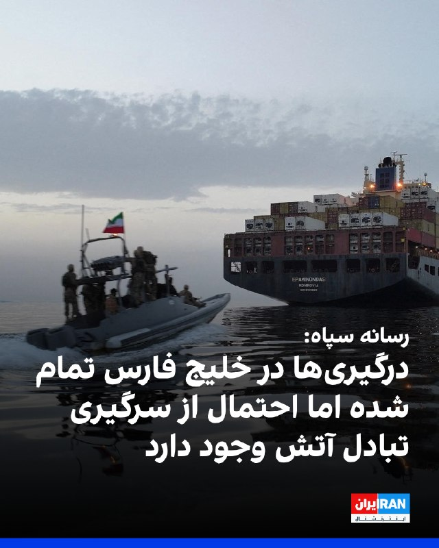

# خواننده تلگرام

<!-- TOP_NAV START -->

<a href="https://github.com/ProAlit/aio-downloader/blob/main/telegram/content/archive_1.md" style="display:inline-block; padding:6px 12px; margin:0 4px; background-color:#2ea44f; color:white; text-decoration:none; border-radius:4px; font-weight:bold;">صفحه بعد</a>

<!-- TOP_NAV END -->

<!-- MSG START -->

---
📅 بروزرسانی: 1405/02/18 23:42
---

## mwarmonitor — post 8732

🛢 (رویترز) — بهای معاملات آتی نفت خام برنت روز جمعه تا ۳ درصد افزایش یافت؛ یک روز پس از آن‌که ایالات متحده و ایران حملات هوایی متقابل انجام دادند. با این حال، با کاهش نگرانی‌ها و امید معامله‌گران به توقفی طولانی‌تر در درگیری‌ها، بخشی از این رشد از دست رفت؛ درگیری‌هایی که باعث توقف کشتیرانی در تنگه هرمز شده است.

@mwarmonitor

## kianmeli1 — post 87290

  <a href="telegram/content/kianmeli1_87290_1778271169.mp4" target="_blank">🎬 Download video</a>

🔴مجتبی خامنه ای فقط کشکک زانوش صدمه دیده

روایت جدید
https://t.me/kianmeli1

## Persian_Trend_Official — post 13721

لایو امشب حدودا نیم ساعت دیگر برگزار میشه ...

## Persian_Trend_Official — post 13720

⭕️ وال استریت ژورنال: ممکن است مذاکرات آمریکا و ایران از هفته آینده در اسلام‌آباد از سر گرفته شود، اما ایران همچنان با انتقال اورانیوم مخالفه.

📝 Nick

📌 @persian_trend_official
پرشین ترند | متفاوت‌ترین کانال نظامی

## configx2ray — post 38663

  <a href="https://t.me/ConfigX2ray/38663" target="_blank">📎 Download file</a>

کانفیگ برای Npv tunnel ⭕️

به هیچ وج دانلود نزنید باهاش
❤️

رمز فایل : @ConfigX2ray

Channel : https://t.me/ConfigX2ray

## alonews — post 118763

  <a href="telegram/content/alonews_118763_1778271171.webm" target="_blank">🎬 Download video</a>

👈یک پورش کاین با پلاک گشت عملیاتی سپاه در تهران

✅ @AloNews خبر جنگ

## alonews — post 118762

  <a href="telegram/content/alonews_118762_1778271172.mp4" target="_blank">🎬 Download video</a>

🚀 مگه میشه با این قیمت فضایی، بیت‌کوین داشت؟! 💰🔥

✅ بله، میشه… وقتی کلود ماینر نصب داشته باشی ☁️⛏️

✅ بله، میشه… وقتی بتونی یه ماینر اجاره کنی و ازش برای استخراج بیت‌کوین استفاده کنی 🖥️

✅ بله، میشه… وقتی فقط به اینترنت و یه گوشی نیاز داشته باشی 📱🌐

✅ بله، میشه… حتی وقتی هر شغلی داشته باشی و بیت‌کوین خودش برات استخراج بشه 💸⚡

✨ این معجزه نیست!
این همون سرویس اجاره ماینر ابریه ☁️⛏️

🔹 ساده
🔹 کاربردی
🔹 سودده

🔥 فقط با چند کلیک نصب کن، تست کن و خودت نتیجه رو ببین!

🤝 پشتیبانی ۲۴ ساعته هم کنارت هست تا کامل تو این مسیر پیش بری 💬🕐

📲 دانلود برنامه و شروع
https://t.me/cloudminersbtc/790

🎥 لینک اموزش استفاده
https://t.me/cloudminersbtc/830

---
📅 بروزرسانی: 1405/02/18 23:32
---

## VahidOOnLine — post 238969

  <a href="telegram/content/VahidOOnLine_238969_1778270573.mp4" target="_blank">🎬 Download video</a>

یکی از مخاطبان ایران‌اینترنشنال در پیامی به ایران‌اینترنشنال می‌گوید که در اداره‌های دولتی، حقوق کارمندان را پرداخت نمی‌کنند ولی جوایز مالی به تجمع‌کنندگان شبانه طرفدار جمهوری اسلامی می‌دهند.
‌🏁 🇬🇧 IranintlTV

🤖 @VahidOOnLine

## VahidOOnLine — post 238968

  

مظاهر حسینی، مسئول دیدارهای دفتر علی خامنه‌ای، در تجمع شبانه حکومتی، گفت که مجتبی خامنه‌ای در جریان بمباران بیت علی خامنه‌ای، رهبر کشته‌شده جمهوری اسلامی، از ناحیه زانو، کمر و پشت گوش آسیب دیده است.

حسینی گفت: «زمانی که در دفتر بودم، در ۳۰ متری ما بمب خورد که شیرازی [رییس دفتر نظامی علی خامنه‌ای] و دوستانشان پرپر شدند. ۷۰، ۸۰ متری ما جایگاه کار علی خامنه‌ای را زدند که آن اتفاق افتاد.»

او افزود: «منزل مجتبی خامنه‌ای را زدند که همسرش کشته شد. مجتبی خامنه‌ای در بین راه که آمد در پله‌ها که برود بالا، موشک آنجا خورد و خانم حداد [همسر مجتبی خامنه‌ای] کشته شد. مجتبی خامنه‌ای در بین راه ضربه موج [انفجار] خورده و روی زمین افتاده است.»

مسئول دیدارهای دفتر رهبر پیشین جمهوری اسلامی، درباره آسیب‌های وارد شده به مجتبی خامنه‌ای گفت: «یک خرده کشکک پایش صدمه دیده و یک خرده کمرش. کمرش در این ایام درست شد و کشکک پایش به زودی خوب می‌شود و در سلامتی کامل است.»

حسینی گفت: «یکی از عزیزان در هفته پیش با او دیدار داشت، آن بحث پیشانی که گفته‌اند بی‌خود است. یک ترک کوچک پشت گوشش خورده که آن هم پشت عمامه است و اصلا مشخص نیست.»
http
‌🏁 🇬🇧 IranintlTV

🤖 @VahidOOnLine

## VahidOOnLine — post 238967

  

♦️ در پی دستور مستقیم دونالد ترامپ برای پایان دادن به دهه‌ها پنهان‌کاری، مقامات دولت آمریکا روز جمعه اولین مجموعه از اسناد خروج از حالت محرمانه مربوط به اشیاء ناشناس پرنده (UFO) که اکنون با نام رسمی «پدیده‌های ناهنجار ناشناخته» (UAP) شناخته می‌شوند را منتشر کردند. این اسناد که توسط پنتاگون، اف‌بی‌آی و ناسا ارائه شده‌اند، شامل تصاویر، ویدیوهای بحث‌برانگیز و مصاحبه با شاهدان عینی است که بسیاری از آن‌ها تاکنون برای عموم غیرقابل دسترس بودند.

آنا کلی، سخنگوی کاخ سفید، در بیانیه‌ای اعلام کرد: «رئیس‌جمهوری بر ارائه حداکثر شفافیت به مردم متمرکز است تا آن‌ها خودشان درباره این اطلاعات قضاوت کنند. مردم آمریکا درخواست کردند و رئیس‌جمهوری ترامپ آن را عملی کرد؛ از آن لذت ببرید!»

ترامپ نیز در شبکه اجتماعی «تروث سوشال» با کنایه به دولت‌های پیشین بابت شفافیت نداشتن، از مردم خواست با این فایل‌ها «خوش بگذرانند». او تاکید کرد که با انتشار این مدارک و ویدیوها، اکنون این مردم هستند که می‌توانند درباره واقعیت این پدیده‌ها تصمیم بگیرند.
‌🇸🇦 Indypersian

🤖 @VahidOOnLine

## mwarmonitor — post 8731

  

«✈️📡 هواپیمای E-3G آواکس در سواحل ابوظبی فعال است؛ احتمالاً با هدف شناسایی پرتابه‌های احتمالی ایران که ممکن است پایگاه اصلی آمریکا مورد استفاده در حملات اخیر علیه ایران و نفتکش‌های ایرانی، یعنی پایگاه هوایی الظفره، را هدف قرار دهند.» @mwarmonitor

## mwarmonitor — post 8730

📝 به نظر می‌رسد با یک معجزه در مهندسی رزمی طرف هستیم؛ موشکی که ساختمان را پودر می‌کند و همراهان را به «کتلت» تغییر وضعیت می‌دهد، اما به مجتبی که می‌رسد، صرفاً در حد یک ماساژور برقی عمل کرده و فقط باعث «رگ‌به‌رگ شدن کمر» می‌شود! واقعاً تواضع هم حدی دارد؛ طرف…

## IranIntlTV — post 336200

  <a href="telegram/content/IranIntlTV_336200_1778270578.mp4" target="_blank">🎬 Download video</a>

یکی از مخاطبان ایران‌اینترنشنال در پیامی به ایران‌اینترنشنال می‌گوید که در اداره‌های دولتی، حقوق کارمندان را پرداخت نمی‌کنند ولی جوایز مالی به تجمع‌کنندگان شبانه طرفدار جمهوری اسلامی می‌دهند.

## IranIntlTV — post 336199

  

مظاهر حسینی، مسئول دیدارهای دفتر علی خامنه‌ای، در تجمع شبانه حکومتی، گفت که مجتبی خامنه‌ای در جریان بمباران بیت علی خامنه‌ای، رهبر کشته‌شده جمهوری اسلامی، از ناحیه زانو، کمر و پشت گوش آسیب دیده است.

حسینی گفت: «زمانی که در دفتر بودم، در ۳۰ متری ما بمب خورد که شیرازی [رییس دفتر نظامی علی خامنه‌ای] و دوستانشان پرپر شدند. ۷۰، ۸۰ متری ما جایگاه کار علی خامنه‌ای را زدند که آن اتفاق افتاد.»

او افزود: «منزل مجتبی خامنه‌ای را زدند که همسرش کشته شد. مجتبی خامنه‌ای در بین راه که آمد در پله‌ها که برود بالا، موشک آنجا خورد و خانم حداد [همسر مجتبی خامنه‌ای] کشته شد. مجتبی خامنه‌ای در بین راه ضربه موج [انفجار] خورده و روی زمین افتاده است.»

مسئول دیدارهای دفتر رهبر پیشین جمهوری اسلامی، درباره آسیب‌های وارد شده به مجتبی خامنه‌ای گفت: «یک خرده کشکک پایش صدمه دیده و یک خرده کمرش. کمرش در این ایام درست شد و کشکک پایش به زودی خوب می‌شود و در سلامتی کامل است.»

حسینی گفت: «یکی از عزیزان در هفته پیش با او دیدار داشت، آن بحث پیشانی که گفته‌اند بی‌خود است. یک ترک کوچک پشت گوشش خورده که آن هم پشت عمامه است و اصلا مشخص نیست.»

## FarsiVOA — post 217226

  <a href="telegram/content/FarsiVOA_217226_1778270581.mp4" target="_blank">🎬 Download video</a>

⚡️نیک‌آهنگ کوثر در برنامه تفسیر خبر: آثار منفی جنگ روی محیط زیست بسیار زیاد است
@FarsiVOA

## FarsiVOA — post 217225

🔺ایالات متحده اسناد محرمانه مربوط به «پدیده‌های هوایی ناشناس و غیرعادی» را منتشر کرد

◾️وزارت جنگ آمریکا روز جمعه ۱۸ اردیبهشت، برای نخستین بار و با هدف «شفاف‌سازی»، بخشی از فایل‌ها و اسناد مربوط به پدیده‌های ناشناس و غیرعادی فضایی را منتشر کرد.

⬇️ بیشتر بخوانید:
https://ir.voanews.com/a/war-department-ufo-uap-space-trump/8148066.html
@FarsiVOA

## RadioFarda — post 156987

  

🔸وزارت خارجه قطر شامگاه جمعه تأیید کرد که شیخ محمد بن عبدالرحمن بن جاسم آل ثانی، نخست‌وزیر و وزیر امور خارجه این کشور، ساعاتی پیش با جی.دی ونس، معاون رئیس‌جمهور آمریکا در واشینگتن دیدار کرده است.

🔸پیش‌تر خبرگزاری‌های رویترز و فرانسه به نقل از منابع آگاه از انجام این دیدار با تمرکز بر مذاکرات آمریکا و ایران برای پایان دادن به جنگ خبر داده بودند.

🔸وزارت خارجه قطر در بیانیه خود اعلام کرد که آقای ونس و مقام ارشد قطری «آخرین تحولات منطقه و تلاش‌های میانجی‌گرانه پاکستان برای کاهش تنش‌ها به‌گونه‌ای که به تقویت امنیت و ثبات در منطقه کمک کند را بررسی کردند.»

🔸این در حالی است که ایران می‌گوید همچنان در حال بررسی طرح پیشنهادی آمریکا برای توافق است و به آن پاسخ نداده است.

🔸مارکو روبیو، وزیر خارجه ایالات متحده، پیش‌تر گفت که انتظار می‌رود تهران پاسخ خود را روز جمعه به آمریکا تحویل دهد.

@RadioFarda

## Dirty_Kids — post 389129

خبر خاورمیانه‌ای جالب

نیویورک‌تایمز:
تلاش پاکستانی‌ها برای میانجی‌گری بین آمریکا و ایران، باعث تیره‌شدن روابط ابوظبی و اسلام‌آباد شده و امارات درحال اخراج کارگران شیعه پاکستانی است

@Dirty_Kids 👻

## Dirty_Kids — post 389128

  <a href="telegram/content/Dirty_Kids_389128_1778270583.mp4" target="_blank">🎬 Download video</a>

اگه با این منطق میخوای دستاورد بسازی بد میشه‌ براتوناااا، تو المپیک فقط یه نفرشون ۹ تا مدال میگیره

تازه دمش گرم کتک خورده حیا کرده رفته
شما انقد کونده پرو هستین که تایلور همش میگیره حسن یزدانی رو عن میکنه ولی میره باز برمیگرده کتک میخوره ازش :)))

@Dirty_Kids 👻

## configx2ray — post 38662

  <a href="telegram/content/configx2ray_38662_1778270585.webm" target="_blank">🎬 Download video</a>

socks://Og@62.220.126.56:30170#https://t.me/ConfigX2ray

ترکیبی با سایفون وصله 
✅

آموزش استفادع : 
👇
https://t.me/ConfigX2ray0/1665

Channel : https://t.me/ConfigX2ray

## alonews — post 118761

  <a href="telegram/content/alonews_118761_1778270585.webm" target="_blank">🎬 Download video</a>

👈وال استریت ژورنال: ممکن است مذاکرات آمریکا و ایران از هفته آینده در اسلام‌آباد از سر گرفته شود

✅ @AloNews خبر جنگ

## alonews — post 118760

  <a href="telegram/content/alonews_118760_1778270586.webm" target="_blank">🎬 Download video</a>

👈وال استریت ژورنال: ایران همچنان با انتقال مواد هسته ای به آمریکا مخالفه

✅ @AloNews خبر جنگ

---
📅 بروزرسانی: 1405/02/18 23:22
---

## VahidOOnLine — post 238966

  

♦️ در پی دستور مستقیم دونالد ترامپ برای پایان دادن به دهه‌ها پنهان‌کاری، مقامات دولت آمریکا روز جمعه اولین مجموعه از اسناد خروج از حالت محرمانه مربوط به اشیاء ناشناس پرنده (UFO) که اکنون با نام رسمی «پدیده‌های ناهنجار ناشناخته» (UAP) شناخته می‌شوند را منتشر کردند. این اسناد که توسط پنتاگون، اف‌بی‌آی و ناسا ارائه شده‌اند، شامل تصاویر، ویدیوهای بحث‌برانگیز و مصاحبه با شاهدان عینی است که بسیاری از آن‌ها تاکنون برای عموم غیرقابل دسترس بودند.

آنا کلی، سخنگوی کاخ سفید، در بیانیه‌ای اعلام کرد: «رئیس‌جمهوری بر ارائه حداکثر شفافیت به مردم متمرکز است تا آن‌ها خودشان درباره این اطلاعات قضاوت کنند. مردم آمریکا درخواست کردند و رئیس‌جمهوری ترامپ آن را عملی کرد؛ از آن لذت ببرید!»

ترامپ نیز در شبکه اجتماعی «تروث سوشال» با کنایه به دولت‌های پیشین بابت شفافیت نداشتن، از مردم خواست با این فایل‌ها «خوش بگذرانند». او تاکید کرد که با انتشار این مدارک و ویدیوها، اکنون این مردم هستند که می‌توانند درباره واقعیت این پدیده‌ها تصمیم بگیرند.
‌🇸🇦 Indypersian

🤖 @VahidOOnLine

## IranIntlTV — post 336198

  <a href="https://t.me/IranintlTV/336198" target="_blank">📎 Download file</a>

🎧نسخه صوتی ‌‌‏۲۴ با فرداد فرحزاد: درگیری در تنگه هرمز همزمان با انتظار واشینگتن برای پاسخ تهران
@iranintlTV

## FarsiVOA — post 217224

  <a href="telegram/content/FarsiVOA_217224_1778269954.mp4" target="_blank">🎬 Download video</a>

⚡️مردم ایران ۷۰ روز در خاموشی و تاریکی دیجیتال؛ واکنش کاربران شبکه‌های اجتماعی
@FarsiVOA

## FarsiVOA — post 217223

⚡️در برنامه تفسیر خبر امروز، مهدی آقازمانی با کارشناسان مهمان، درباره تداوم آتش بس بین ایران و آمریکا به رغم شلیک موشک به ناوهای آمریکایی از سوی سپاه و پاسخ تلافی جویانه آمریکا، گفتگو میکند ؟
@FarsiVOA

## FarsiVOA — post 217222

  <a href="telegram/content/FarsiVOA_217222_1778269955.mp4" target="_blank">🎬 Download video</a>

⚡️جمهوری اسلامی و امارات در مسیر تقابل؛ از حمله موشکی تا جنگ روایت‌ها
@FarsiVOA

## Persian_Trend_Official — post 13719

لایو امشب حدودا نیم ساعت دیگر برگزار میشه ...

## BBCPersian — post 280523

  <a href="telegram/content/BBCPersian_280523_1778269957.mp4" target="_blank">🎬 Download video</a>

🔻آخرین خبرهای مهم روز جمعه ۱۸ اردیبهشت ۱۴۰۵

@BBCPersian

## alonews — post 118759

  <a href="telegram/content/alonews_118759_1778269959.webm" target="_blank">🎬 Download video</a>

👈محمد جولانی رئیس‌جمهور موقت سوریه، برادرانش را از سمت‌های ارشد دولتی برکنار کرد تا با اتهامات خویشاوندسالاری مقابله کند و حکومت خود را از مدل خانواده اسد دور نگه دارد.

✅ @AloNews خبر جنگ

## alonews — post 118758

  <a href="telegram/content/alonews_118758_1778269959.webm" target="_blank">🎬 Download video</a>

👈زیبا کلام: نظام اگه به مخالفان هم اجازه تجمع بده ورق کلا برمیگرده

✅ @AloNews خبر جنگ

---
📅 بروزرسانی: 1405/02/18 23:12
---

## VahidOOnLine — post 238965

  <a href="telegram/content/VahidOOnLine_238965_1778269359.mp4" target="_blank">🎬 Download video</a>

یک شهروند شاغل به شغل فصلی می‌گوید قطع اینترنت درآمد و کسب او را مختل کرده است. او گفت حتی اگر با فیلترشکن به اینترنت وصل شود چون بقیه شهروندان در اینترنت حاضر نیستند تبلیغات او فایده‌ای نخواهد داشت.
‌🏁 🇬🇧 IranintlTV

🤖 @VahidOOnLine

## VahidOOnLine — post 238964

🗣روایت شما از بحران اقتصادی و زندگی در آتش‌بس- جمعه ۱۸ اردیبهشت:

🔹روز ۱۸ اردیبهشت شش قلم کالا شامل سبزیجات و میوه خریدم که حجم‌شان به یک کیلو هم نمی‌رسد، اما شد یک میلیون و ۱۱۴ هزار تومان. تازه این خرید کاملی نیست، حتی برای چند روز.

🔹مرغ کیلویی ۳۴۰ هزار تومان، شیر پاکتی ۸۵ هزار تومان، نوشابه که پارسال ۴۵ هزار تومان بود، شده ۱۲۵ هزار تومان، پنیر ۴۰۰ گرمی شده ۲۳۰ هزار تومان؛ یک خرید در حد خورد و خوراک چند روز یک خانواده دو نفره و همه وسایل عادی و لازم زندگی را خریدم شد ۴ میلیون و ۵۰۰ هزار تومان.

🔹به علت نوسانات برق، ۱۸ اردیبهشت یخچال سایدبای‌ساید سامسونگ ما سوخت؛ علاوه بر اینکه قطعه‌ اصلی نایاب است، گفتند تعمیرات با قطعه‌ چینی بیشتر از ۴۵ میلیون تومان هزینه دارد؛ پول نداریم درستش کنیم و الان همه‌ ذخیره‌ مرغ و گوشت ما خراب شده.

🔹یک موبایل معمولی، یک لپتاپ معمولی و یک موتور معمولی ساده و از نوع ارزان، مجموعا می‌شود حدود یک میلیارد تومان؛ یعنی مرگ آرزوهایمان در جمهوری اسلامی را به چشم دیدیم.

🔹روز ۱۸ اردیبهشت یک پلاستیک زباله و یک پلاستیک فریزر را در مازندران خریدم ۸۱۰ هزار تومان.
‌🏁 🇬🇧 IranintlTV

🤖 @VahidOOnLine

## mwarmonitor — post 8729

  <a href="telegram/content/mwarmonitor_8729_1778269363.mp4" target="_blank">🎬 Download video</a>

📝 به نظر می‌رسد با یک معجزه در مهندسی رزمی طرف هستیم؛ موشکی که ساختمان را پودر می‌کند و همراهان را به «کتلت» تغییر وضعیت می‌دهد، اما به مجتبی که می‌رسد، صرفاً در حد یک ماساژور برقی عمل کرده و فقط باعث «رگ‌به‌رگ شدن کمر» می‌شود! واقعاً تواضع هم حدی دارد؛ طرف با سیستم ایمنیِ تیتانیومی، موشک بالستیک را با یک قولنج شکستن ساده رد کرده و حالا آن‌قدر غرق در سلامتی کامل است که دوربین‌های دنیا هنوز تکنولوژی لازم برای ثبتِ این حجم از زنده بودن را ندارند. آرنولد در ترمیناتور با چهار تا گلوله از کار می‌افتاد، اما اینجا با انفجاری که تشتکِ کل منطقه را پرانده، حضرت آقا فقط یک «تَرَکِ نامرئی» پشت گوششان افتاده که آن هم زیر عمامه از انظار مخفی شده است. والا یک ویدیوی دو ثانیه‌ای با گوشی پزشکیان که سهل است، حتی یک ویسِ «تست صدا» هم روی فلش بریزند ما راضی هستیم؛ فقط می‌ترسیم لرزشِ صدای ناشی از آن کمردردِ موشکی، دوباره کل ساختمان را فرو بریزد!

@mwarmonitor

## IranIntlTV — post 336197

امارات متحده عربی از رهگیری حمله موشکی خبر داد؛ درگیری‌ها در تنگه هرمز تشدید شد

گزارش‌هایی از درگیری‌های پراکنده میان نیروهای مسلح جمهوری اسلامی و شناورهای آمریکایی در محدوده تنگه هرمز منتشر شده است. هم‌زمان امارات متحده عربی اعلام کرد در پی حمله موشکی و پهپادی جمهوری اسلامی سه نفر زخمی شدند.

خبرگزاری فارس، وابسته به سپاه پاسداران جمعه ۱۸ اردیبهشت نوشت درگیری‌های پراکنده میان نیروهای مسلح جمهوری اسلامی و شناورهای آمریکایی در محدوده تنگه هرمز از ساعتی پیش آغاز شده است.

ساعاتی بعد، خبرگزاری تسنیم، دیگر رسانه وابسته به سپاه پاسداران، به‌نقل از یک منبع نظامی نوشت که درگیری نیروهای جمهوری اسلامی با نیروهای آمریکایی «پس از مدتی تبادل آتش، متوقف شده و فضا آرام است.»

این منبع نظامی که نامش فاش نشده، افزود: «با این حال، اگر مجددا آمریکایی‌ها قصد ورود به خلیج فارس را داشته باشند و یا برای شناورهای ایرانی مزاحمتی ایجاد کنند، مجددا پاسخ قاطع دریافت خواهند کرد.»

او گفت: «بنابراین احتمال ورود مجدد به درگیری‌هایی از این قبیل در این منطقه همچنان وجود دارد.»

هم‌زمان گزارش‌های مختلفی از شنیده شدن صدای انفجار و فعالیت پدافند هوایی در چند شهر از جمله تهران، سیرک و کنارک منتشر شد.

این در حالی است که مارکو روبیو، وزیر امور خارجه آمریکا، گفت باید جمعه پاسخ جمهوری اسلامی به طرح پیشنهادی صلح به واشینگتن ارائه شود.

او ابراز امیدواری کرد این پاسخ «جدی» باشد و بتواند مسیر ورود به یک فرآیند مذاکراتی واقعی را باز کند.

امارات متحده عربی جمعه ۱۸ اردیبهشت اعلام کرد به یک حمله جدید موشکی جمهوری اسلامی پاسخ داده است؛ حمله‌ای که ساعاتی پس از اعلام تبادل آتش میان آمریکا و ایران در تنگه هرمز رخ داد و آتش‌بس شکننده یک‌ماهه را با چالش تازه‌ای روبه‌رو کرد.

وزارت دفاع امارات نیز گفت سامانه‌های پدافندی این کشور دو موشک بالستیک و سه پهپاد شلیک‌شده از سوی ایران را رهگیری کردند.

در این حمله سه نفر زخمی شدند، اما مشخص نیست همه اهداف به‌طور کامل منهدم شده باشند. مقام‌ها از شهروندان خواستند از محل سقوط احتمالی بقایا دوری کنند.

در همین حال، ارتش آمریکا اعلام کرد حملات جمهوری اسلامی به سه ناو نیروی دریایی خود در تنگه هرمز را دفع کرده و تاسیسات نظامی ایران را که در این حملات نقش داشته‌اند، هدف قرار داده است. به‌گفته مقام‌های آمریکایی، هیچ‌یک از کشتی‌های این کشور آسیب ندیده‌اند.

واشینگتن همچنین اعلام کرد نیروهایش دو نفت‌کش ایرانی دیگر را که در تلاش برای عبور از محاصره دریایی آمریکا بودند، هدف قرار داده و از کار انداخته‌اند. آمریکا با هدف جلوگیری از تردد نفت‌کش‌های ایرانی، بندرهای این کشور را تحت محاصره قرار داده است.

هم‌زمان، گزارش‌هایی منتشر شده که نشان می‌دهد جمهوری اسلامی با ایجاد نهادی برای کنترل عبور کشتی‌ها در تنگه هرمز، در پی تثبیت نقش خود در مدیریت این آبراه است؛ اقدامی که نگرانی‌های تازه‌ای درباره آزادی کشتی‌رانی ایجاد کرده است.

در حال حاضر صدها کشتی تجاری در خلیج فارس متوقف شده‌اند و امکان گذر از تنگه هرمز و ورود به آب‌های آزاد را ندارند.

🔗وب‌سایت ایران‌اینترنشنال
@iranintltv

## IranIntlTV — post 336196

  <a href="telegram/content/IranIntlTV_336196_1778269365.mp4" target="_blank">🎬 Download video</a>

یک شهروند شاغل به شغل فصلی می‌گوید قطع اینترنت درآمد و کسب او را مختل کرده است. او گفت حتی اگر با فیلترشکن به اینترنت وصل شود چون بقیه شهروندان در اینترنت حاضر نیستند تبلیغات او فایده‌ای نخواهد داشت.

## FarsiVOA — post 217221

⚡️ریشه‌ها و علل حملات موشکی و پهپادی جمهوری اسلامی به مواضع احزاب کُرد ایرانی در اقلیم کردستان عراق در گفت‌وگو با خالد عزیزی، سخنگوی حزب دموکرات کردستان ایران
@FarsiVOA

## Persian_Trend_Official — post 13718

  

📝 Nick

📌 @persian_trend_official
پرشین ترند | متفاوت‌ترین کانال نظامی

## alonews — post 118757

  <a href="telegram/content/alonews_118757_1778269370.webm" target="_blank">🎬 Download video</a>

👈میدل ایست آی: دبی با بحرانی وجودی مواجه است؛ جنگ علیه ایران باعث کاهش شدید تعداد توریست‌ها شده و این مقصد گردشگری جهانی را در بخش هتلداری ویران کرده

🔴در عرض دو هفته اول، مردم [گفتند] دیگر ارزشش را ندارد [که اینجا زندگی کنند]

🔴 کسب‌وکار‌ها ناگهان دارایی‌های خود را نقد می‌کردند و به عنوان جایگزین گزینه‌هایی را در اروپا بررسی کردند

🔴کل بنیان دبی به عنوان مکانی عاری از درگیری، لرزید

✅ @AloNews خبر جنگ

---
📅 بروزرسانی: 1405/02/18 23:02
---

## VahidOOnLine — post 238963

  <a href="telegram/content/VahidOOnLine_238963_1778268778.mp4" target="_blank">🎬 Download video</a>

وزارت خارجه قطر اعلام کرد محمد بن عبدالرحمن آل ثانی، نخست‌وزیر و وزیر خارجه این کشور، در واشینگتن با جی‌دی ونس، معاون رئیس‌جمهوری ایالات متحده آمریکا، دیدار و درباره کاهش تنش در منطقه گفت‌وگو کرده است.

در این بیانیه آمده است نخست‌وزیر قطر بر ضرورت پاسخ‌گویی طرف‌ها به میانجیگری پاکستان و دستیابی به توافقی جامع برای تحقق صلحی پایدار تاکید کرده است.
‌🏁 🇬🇧 ManotoTV

🤖 @VahidOOnLine

## VahidOOnLine — post 238962

  <a href="telegram/content/VahidOOnLine_238962_1778268779.mp4" target="_blank">🎬 Download video</a>

وزارت خارجه قطر با انتشار بیانیه‌ای، حملات جمهوری اسلامی به امارات متحده عربی را به‌شدت محکوم کرد و آن را «نقض آشکار حاکمیت» و تهدیدی برای امنیت منطقه دانست.

در این بیانیه آمده است که این حملات با استفاده از موشک‌های بالستیک و پهپاد انجام شده و به زخمی شدن چند نفر منجر شده است.

دوحه با اعلام همبستگی کامل با امارات متحده عربی تاکید کرد از تمامی اقدامات این کشور برای حفظ امنیت، ثبات و تمامیت ارضی‌اش حمایت می‌کند.
‌🏁 🇬🇧 ManotoTV

🤖 @VahidOOnLine

## VahidOOnLine — post 238961

  <a href="telegram/content/VahidOOnLine_238961_1778268780.mp4" target="_blank">🎬 Download video</a>

مارکو روبیو، وزیر خارجه ایالات متحده آمریکا، از متحدان اروپایی خواست از موضع‌گیری‌های لفظی فراتر رفته و اقدامات عملی علیه جمهوری اسلامی انجام دهند.

او پس از دیدار با جورجا ملونی، نخست‌وزیر ایتالیا، در رم گفت تلاش تهران برای کنترل تنگه هرمز «غیرقابل قبول» و تهدیدی برای امنیت جهانی است.

روبیو تاکید کرد: «همه می‌گویند ایران یک تهدید است و نباید به سلاح هسته‌ای دست پیدا کند، اما باید اقدامی هم انجام شود.»

او افزود: «اگر پاسخ این است که نه، پس باید چیزی فراتر از بیانیه‌های شدیدالحن داشته باشید.»
‌🏁 🇬🇧 ManotoTV

🤖 @VahidOOnLine

## IranIntlTV — post 336195

🗣روایت شما از بحران اقتصادی و زندگی در آتش‌بس- جمعه ۱۸ اردیبهشت:

🔹روز ۱۸ اردیبهشت شش قلم کالا شامل سبزیجات و میوه خریدم که حجم‌شان به یک کیلو هم نمی‌رسد، اما شد یک میلیون و ۱۱۴ هزار تومان. تازه این خرید کاملی نیست، حتی برای چند روز.

🔹مرغ کیلویی ۳۴۰ هزار تومان، شیر پاکتی ۸۵ هزار تومان، نوشابه که پارسال ۴۵ هزار تومان بود، شده ۱۲۵ هزار تومان، پنیر ۴۰۰ گرمی شده ۲۳۰ هزار تومان؛ یک خرید در حد خورد و خوراک چند روز یک خانواده دو نفره و همه وسایل عادی و لازم زندگی را خریدم شد ۴ میلیون و ۵۰۰ هزار تومان.

🔹به علت نوسانات برق، ۱۸ اردیبهشت یخچال سایدبای‌ساید سامسونگ ما سوخت؛ علاوه بر اینکه قطعه‌ اصلی نایاب است، گفتند تعمیرات با قطعه‌ چینی بیشتر از ۴۵ میلیون تومان هزینه دارد؛ پول نداریم درستش کنیم و الان همه‌ ذخیره‌ مرغ و گوشت ما خراب شده.

🔹یک موبایل معمولی، یک لپتاپ معمولی و یک موتور معمولی ساده و از نوع ارزان، مجموعا می‌شود حدود یک میلیارد تومان؛ یعنی مرگ آرزوهایمان در جمهوری اسلامی را به چشم دیدیم.

🔹روز ۱۸ اردیبهشت یک پلاستیک زباله و یک پلاستیک فریزر را در مازندران خریدم ۸۱۰ هزار تومان.

## ManotoTV — post 105162

  <a href="telegram/content/ManotoTV_105162_1778268781.mp4" target="_blank">🎬 Download video</a>

وزارت خارجه قطر اعلام کرد محمد بن عبدالرحمن آل ثانی، نخست‌وزیر و وزیر خارجه این کشور، در واشینگتن با جی‌دی ونس، معاون رئیس‌جمهوری ایالات متحده آمریکا، دیدار و درباره کاهش تنش در منطقه گفت‌وگو کرده است.

در این بیانیه آمده است نخست‌وزیر قطر بر ضرورت پاسخ‌گویی طرف‌ها به میانجیگری پاکستان و دستیابی به توافقی جامع برای تحقق صلحی پایدار تاکید کرده است.

## ManotoTV — post 105161

  <a href="telegram/content/ManotoTV_105161_1778268781.mp4" target="_blank">🎬 Download video</a>

وزارت خارجه قطر با انتشار بیانیه‌ای، حملات جمهوری اسلامی به امارات متحده عربی را به‌شدت محکوم کرد و آن را «نقض آشکار حاکمیت» و تهدیدی برای امنیت منطقه دانست.

در این بیانیه آمده است که این حملات با استفاده از موشک‌های بالستیک و پهپاد انجام شده و به زخمی شدن چند نفر منجر شده است.

دوحه با اعلام همبستگی کامل با امارات متحده عربی تاکید کرد از تمامی اقدامات این کشور برای حفظ امنیت، ثبات و تمامیت ارضی‌اش حمایت می‌کند.

## FarsiVOA — post 217220

🔺انتقال عرفان شکورزاده به زندان قزل‌حصار؛ خطر اجرای حکم اعدام این دانشجوی نخبه افزایش یافت

◾️رسانه‌های حقوق بشری اعلام کردند عرفان شکورزاده، دانشجوی نخبه ۲۹ ساله، پس از ماه‌ها نگهداری در سلول انفرادی و اعترافات اجباری، با حکم اعدام روبرو و برای اجرای این حکم به زندان قزل‌حصار منتقل شده است.

⬇️ بیشتر بخوانید:
https://ir.voanews.com/a/iran-execution-erfan-shakurzadeh-student-/8148049.html?withmediaplayer=1
@FarsiVOA

## alonews — post 118756

  <a href="telegram/content/alonews_118756_1778268782.webm" target="_blank">🎬 Download video</a>

👈کویت میگوید به دلیل نگرانی‌ها درباره احتمال حملات از سوی ایران، حرکت کشتی‌های دریایی را محدود می‌کند

✅ @AloNews خبر جنگ

---
📅 بروزرسانی: 1405/02/18 22:58
---

## ManotoTV — post 105160

  <a href="telegram/content/ManotoTV_105160_1778268532.mp4" target="_blank">🎬 Download video</a>

مارکو روبیو، وزیر خارجه ایالات متحده آمریکا، از متحدان اروپایی خواست از موضع‌گیری‌های لفظی فراتر رفته و اقدامات عملی علیه جمهوری اسلامی انجام دهند.

او پس از دیدار با جورجا ملونی، نخست‌وزیر ایتالیا، در رم گفت تلاش تهران برای کنترل تنگه هرمز «غیرقابل قبول» و تهدیدی برای امنیت جهانی است.

روبیو تاکید کرد: «همه می‌گویند ایران یک تهدید است و نباید به سلاح هسته‌ای دست پیدا کند، اما باید اقدامی هم انجام شود.»

او افزود: «اگر پاسخ این است که نه، پس باید چیزی فراتر از بیانیه‌های شدیدالحن داشته باشید.»

## manototv — post 105162

  <a href="telegram/content/manototv_105162_1778268533.mp4" target="_blank">🎬 Download video</a>

وزارت خارجه قطر اعلام کرد محمد بن عبدالرحمن آل ثانی، نخست‌وزیر و وزیر خارجه این کشور، در واشینگتن با جی‌دی ونس، معاون رئیس‌جمهوری ایالات متحده آمریکا، دیدار و درباره کاهش تنش در منطقه گفت‌وگو کرده است.

در این بیانیه آمده است نخست‌وزیر قطر بر ضرورت پاسخ‌گویی طرف‌ها به میانجیگری پاکستان و دستیابی به توافقی جامع برای تحقق صلحی پایدار تاکید کرده است.

## manototv — post 105161

  <a href="telegram/content/manototv_105161_1778268534.mp4" target="_blank">🎬 Download video</a>

وزارت خارجه قطر با انتشار بیانیه‌ای، حملات جمهوری اسلامی به امارات متحده عربی را به‌شدت محکوم کرد و آن را «نقض آشکار حاکمیت» و تهدیدی برای امنیت منطقه دانست.

در این بیانیه آمده است که این حملات با استفاده از موشک‌های بالستیک و پهپاد انجام شده و به زخمی شدن چند نفر منجر شده است.

دوحه با اعلام همبستگی کامل با امارات متحده عربی تاکید کرد از تمامی اقدامات این کشور برای حفظ امنیت، ثبات و تمامیت ارضی‌اش حمایت می‌کند.

## manototv — post 105160

  <a href="telegram/content/manototv_105160_1778268535.mp4" target="_blank">🎬 Download video</a>

مارکو روبیو، وزیر خارجه ایالات متحده آمریکا، از متحدان اروپایی خواست از موضع‌گیری‌های لفظی فراتر رفته و اقدامات عملی علیه جمهوری اسلامی انجام دهند.

او پس از دیدار با جورجا ملونی، نخست‌وزیر ایتالیا، در رم گفت تلاش تهران برای کنترل تنگه هرمز «غیرقابل قبول» و تهدیدی برای امنیت جهانی است.

روبیو تاکید کرد: «همه می‌گویند ایران یک تهدید است و نباید به سلاح هسته‌ای دست پیدا کند، اما باید اقدامی هم انجام شود.»

او افزود: «اگر پاسخ این است که نه، پس باید چیزی فراتر از بیانیه‌های شدیدالحن داشته باشید.»

---
📅 بروزرسانی: 1405/02/18 22:52
---

## VahidOOnLine — post 238960

  

♦️ وزارت امور خارجه ایالات متحده روز جمعه ۱۸ اردیبهشت اعلام کرد که نمایندگان اسرائیل و لبنان در روزهای ۲۴ و ۲۵ اردیبهشت برای انجام دو روز «مذاکرات فشرده» در واشنگتن گرد هم می‌آیند. هدف از این نشست، دستیابی به یک توافق جامع صلح و تدابیر امنیتی پایدار است که بتواند به دهه‌ها تنش در مرزهای شمالی اسرائیل و جنوب لبنان پایان دهد.

این سومین دور از گفتگوهای مستقیم دیپلماتیک میان دو طرف در هفته‌های اخیر است. دور قبلی این مذاکرات در تاریخ ۲۳ آوریل با حضور و میانجی‌گری مستقیم دونالد ترامپ، رئیس‌جمهور آمریکا، در کاخ سفید برگزار شد که منجر به تمدید سه هفته‌ای آتش‌بس شکننده میان دو کشور شد. اولین دور این گفتگوها نیز در ۱۴ آوریل انجام شده بود که به چندین دهه قطع رابطه دیپلماتیک پایان داد و اولین آتش‌بس ۱۰ روزه را رقم زد.
‌🇸🇦 Indypersian

🤖 @VahidOOnLine

## VahidOOnLine — post 238959

  

ارتش جمهوری اسلامی در بیانیه‌ای اعلام کرد که بامداد جمعه «در یک عملیات ترکیبی موشکی-پهپادی» با هشت موشک کروز و ۲۴ فروند پهپاد انتحاری، به سه ناوشکن آمریکایی که در حال خروج از تنگه هرمز به سمت دریای عمان بودند، حمله کرد.
‌🏁 🇬🇧 IranintlTV

🤖 @VahidOOnLine

## DEJradio — post 4523

  <a href="telegram/content/DEJradio_4523_1778268171.mp4" target="_blank">🎬 Download video</a>

📢
🔺 شکایت از سفره‌های خالی؛ "بچه‌های ما گرسنه‌اند".

#بحران #اقتصاد #فروپاشی
@DEJradio

## IranIntlTV — post 336194

  

ارتش جمهوری اسلامی در بیانیه‌ای اعلام کرد که بامداد جمعه «در یک عملیات ترکیبی موشکی-پهپادی» با هشت موشک کروز و ۲۴ فروند پهپاد انتحاری، به سه ناوشکن آمریکایی که در حال خروج از تنگه هرمز به سمت دریای عمان بودند، حمله کرد.
https://iranintl.com/202605088265

## FarsiVOA — post 217219

🔺گزارش| سرنخ ناوگان اشباح جمهوری اسلامی به وزارت نفت عراق رسید

◾️روز پنج‌شنبه ۱۷ اردیبهشت، وزارت خزانه‌داری آمریکا چهار عراقی را در لیست تحریم‌های خود قرار داد که یکی از آنها «علی بهادلی» معاون وزیر نفت عراق است. واشنگتن او را به سوءاستفاده از موقعیت خود برای تسهیل قاچاق نفت ایران از طریق عراق، و انجام این کار به واسطه شبه‌نظامیان عصائب اهل حق، با جعل اسناد درباره مبدأ نفت و اعطای امتیازات صادراتی به شبکه‌های قاچاق مرتبط با تهران، متهم کرده است.

⬇️ بیشتر بخوانید:
https://ir.voanews.com/a/8147979.html
@FarsiVOA

## FarsiVOA — post 217218

⚡️در حالی که مقام‌های جمهوری اسلامی امارات را تهدید می‌کنند، ویدئوهای رسیده به صدای آمریکا از صف جویندگان کار، قفسه‌های خالی فروشگاه‌ها و فشار شدید اقتصادی بر مردم ایران خبر می‌دهد. همزمان، تنش‌های امنیتی و اختلاف‌نظرها در داخل حکومت ادامه دارد
@FarsiVOA

## RadioFarda — post 156986

دونالد ترامپ از برقراری آتش‌بس سه‌روزه بین روسیه و اوکراین خبر داد

🔸دونالد ترامپ، رئیس‌جمهور آمریکا، روز جمعه از برقراری یک آتش‌بس سه‌روزه در جنگ میان روسیه و اوکراین از روز شنبه ۱۹ اردیبهشت خبر داد.

🔸او در شبکه اجتماعی تروث سوشال نوشت که این آتش‌بس به درخواست او و با موافقت ولادیمیر پوتین و ولودیمیر زلنسکی، روسای جمهور دو کشور، اعمال می‌شود و همزمان با آن هزار زندانی طرفین نیز با یکدیگر تبادل خواهند شد.

🔸ترامپ ابراز امیدواری کرد که این آتش‌بس «آغازی بر پایان یک جنگ بسیار طولانی، مرگبار و سخت» باشد.

🔸او نوشت که مذاکرات برای پایان دادن به این درگیری بزرگ که آن را «بزرگترین درگیری از زمان جنگ جهانی دوم» نامید، ادامه دارد و به نوشته او «ما هر روز به آن نزدیک‌تر می‌شویم.»

🔸ولودیمیر زلنسکی پس از اعلام دونالد ترامپ، گفت که آتش‌بس با روسیه از ۹ تا ۱۱ مه، ۱۹ تا ۲۱ اردیبهشت، «باید برقرار شود» و کی‌یف چراغ سبز مسکو را برای تبادل گسترده زندانیان دریافت کرده است.

🔸او گفت به نیروهای نظامی خود دستور داده است که در جریان رژه نظامی روز پیروزی در ۹ مه، به میدان سرخ حمله نکنند.

🔸زلنسکی در این فرمان گفت: «بدین‌وسیله دستور می‌دهم: برگزاری رژه در شهر مسکو (فدراسیون روسیه) در تاریخ ۹ مه ۲۰۲۶ مجاز باشد» و افزود که «بخش سرزمینی میدان سرخ» از هرگونه طرح برای استفاده از سلاح‌های اوکراینی مستثنا خواهد بود.

🔸یوری اوشاکوف، دستیار ولادیمیر پوتین، نیز با انتشار بیانیه‌ای اعلام کرد که روسیه با آتش‌بس سه‌روزه و تبادل زندانیان موافقت کرده است.

🔸گزارش کامل را در وب‌سایت رادیوفردا بخوانید.

@RadioFarda

## Dirty_Kids — post 389127

  

عباس عراقچی نوشت: «هر زمان که یک راه‌حل دیپلماتیک روی میز قرار می گیرد، ایالات متحده به‌ یک ماجراجویی نظامی بی‌خردانه رو می‌آورد. آیا این صرفا یک تاکتیک کور برای اعمال فشار است؟ یا فریب‌کاری یک خرابکار است که بار دیگر می‌خواهد رئیس‌جمهور آمریکا را به باتلاقی تازه بکشاند؟»

انگار نه انگار که همین ترامپ دستور قتل خامنه‌ای و اعضای خانواده‌اش و صدها فرمانده سپاه و دیگر مدیران ارشد نظام را صادر کرده است. با این‌حال عراقچی معتقد است که ترامپ خودش خوب است و اطرافیانش بد هستند و می‌خواهند «رییس‌جمهور را به باتلاق بکشانند»… عجب ذلت و حقارت جالبی :))

@Dirty_Kids 👻

## alonews — post 118755

  <a href="telegram/content/alonews_118755_1778268174.webm" target="_blank">🎬 Download video</a>

👈اسپوتنیک: روسیه با آتش‌بس پیشنهادی موافقت کرده است

✅ @AloNews خبر جنگ

## alonews — post 118754

  <a href="telegram/content/alonews_118754_1778268174.webm" target="_blank">🎬 Download video</a>

👈دو مشاور رئیس‌جمهور آمریکا به آتلانتیک گفتند:

🔴«رئیس‌جمهور معتقد است که می‌تواند هر توافقی با ایران را به عنوان پیروزی خود بازاریابی کند».

✅ @AloNews خبر جنگ

## alonews — post 118753

👈جهت رزرو تبلیغات برای VPN در کانال #الونیوز به کانال زیر مراجعه کنید👇

📃https://t.me/ads_alonews

📃https://t.me/ads_alonews

---
📅 بروزرسانی: 1405/02/18 22:42
---

## VahidOOnLine — post 238958

حسین حیدری، ۵۰ ساله و پدر یک دختر ۲۰ ساله، شامگاه ۱۸ دی ۱۴۰۴ در هفت حوض تهران هدف گلوله‌های جنگی ماموران قرار گرفت و خانواده‌اش پیکر او را در حیاط پشتی بیمارستان الغدیر و پیچیده در پتویی آبی‌رنگ یافتند.
‌🏁 🇬🇧 IranintlTV

🤖 @VahidOOnLine

## VahidOOnLine — post 238957

  <a href="telegram/content/VahidOOnLine_238957_1778267578.mp4" target="_blank">🎬 Download video</a>

فرماندار سوادکوه اعلام کرد در تنگه ابوالقیس این منطقه رانش زمینی به ارتفاع حدود ۳۰ متر رخ داده که به‌دلیل قرار گرفتن در مجاورت یک مسیر ارتباطی حیاتی، خطوط برق ۲۰ کیلووات، لوله نفت ۳۲ اینچ و نهر آب کشاورزی، وضعیت آن «ناپایدار و خطرآفرین» ارزیابی شده است.
به گفته او، این رانش در باند برگشت محور اصلی تهران به شمال و در فاصله حدود ۵۰۰ متری راهدارخانه اوریم، در ضلع غربی محور شمال به تهران اتفاق افتاده است.
بررسی‌های میدانی نشان می‌دهد آثار به‌جامانده از این رانش، احتمال ادامه‌دار بودن حرکت زمین و تشدید ناپایداری در منطقه را مطرح می‌کند.
‌🏁 🇬🇧 ManotoTV

🤖 @VahidOOnLine

## VahidOOnLine — post 238956

  <a href="telegram/content/VahidOOnLine_238956_1778267579.mp4" target="_blank">🎬 Download video</a>

پنتاگون مجموعه‌ای از اسناد جدید و «تاکنون دیده‌نشده» درباره اشیای پرنده ناشناس (UFO/UAP) منتشر کرده و اعلام کرده مردم می‌توانند خودشان درباره این پدیده‌ها نتیجه‌گیری کنند. در میان این اسناد، تصویری از مأموریت آپولو ۱۷ در سال ۱۹۷۲ دیده می‌شود که سه نقطه نورانی را به شکل مثلثی نشان می‌دهد. پنتاگون اعلام کرده هنوز اجماعی درباره ماهیت این پدیده‌ها وجود ندارد، اما بررسی‌های اولیه احتمال داده که ممکن است یک «شیء فیزیکی» باشد. در این بسته جدید ۱۶۱ فایل منتشر شده که شامل اسناد وزارت خارجه، اف‌بی‌آی، گزارش‌های ناسا از مأموریت‌های فضایی و بیش از ۲۰ ویدیو از اشیای ناشناس ثبت‌شده توسط حسگرهای نظامی در نقاط مختلف جهان است؛ از ژاپن و سوریه تا آمریکای شمالی. این اشیا از نقاط نورانی سریع‌الحرکت تا یک جسم شبیه توپ فوتبال آمریکایی در سال ۲۰۲۲ را شامل می‌شوند. در یکی از اسناد نیز گزارش شده که خلبانی در سال ۱۹۹۴ به همراه سه آمریکایی در آسمان قزاقستان یک شیء نورانی دیده که حرکات غیرعادی مانند چرخش‌های تند و تغییر مسیر ۹۰ درجه داشته است. همچنین در اسناد آپولو ۱۱، باز آلدرین از مشاهده یک شیء بزرگ نزدیک ماه و نورهای غیرعادی خبر داده و در گزارشی دیگر از اف‌بی‌آی یک خلبان پهپاد در سال ۲۰۲۳ گفته جسمی خطی با نور بسیار شدید برای چند ثانیه دیده شده و سپس ناپدید شده است. پنتاگون هدف از این انتشار را افزایش شفافیت اعلام کرده و گفته مردم خودشان باید قضاوت کنند، در حالی که تأکید شده در گزارش‌های قبلی هیچ مدرکی درباره فناوری فرازمینی تأیید نشده است.
‌🏁 🇬🇧 ManotoTV

🤖 @VahidOOnLine

## mwarmonitor — post 8728

  

✈️«یک فروند هواپیمای E-3 Sentry نیروی هوایی آمریکا با علامت پروازی ANDOR53 بر فراز شرق عربستان سعودی و در نزدیکی مرز قطر مشاهده شد. این هواپیمای آواکس وظیفه مدیریت میدان نبرد هوابرد و فرماندهی و کنترل را بر عهده دارد و عملیات‌ها را در یک منطقه وسیع هماهنگ…

## IranIntlTV — post 336193

حسین حیدری، ۵۰ ساله و پدر یک دختر ۲۰ ساله، شامگاه ۱۸ دی ۱۴۰۴ در هفت حوض تهران هدف گلوله‌های جنگی ماموران قرار گرفت و خانواده‌اش پیکر او را در حیاط پشتی بیمارستان الغدیر و پیچیده در پتویی آبی‌رنگ یافتند.

## ManotoTV — post 105159

  <a href="telegram/content/ManotoTV_105159_1778267581.mp4" target="_blank">🎬 Download video</a>

فرماندار سوادکوه اعلام کرد در تنگه ابوالقیس این منطقه رانش زمینی به ارتفاع حدود ۳۰ متر رخ داده که به‌دلیل قرار گرفتن در مجاورت یک مسیر ارتباطی حیاتی، خطوط برق ۲۰ کیلووات، لوله نفت ۳۲ اینچ و نهر آب کشاورزی، وضعیت آن «ناپایدار و خطرآفرین» ارزیابی شده است.
به گفته او، این رانش در باند برگشت محور اصلی تهران به شمال و در فاصله حدود ۵۰۰ متری راهدارخانه اوریم، در ضلع غربی محور شمال به تهران اتفاق افتاده است.
بررسی‌های میدانی نشان می‌دهد آثار به‌جامانده از این رانش، احتمال ادامه‌دار بودن حرکت زمین و تشدید ناپایداری در منطقه را مطرح می‌کند.

## FarsiVOA — post 217217

🔺اعدام محراب عبدالله زاده، معترض «زن، زندگی، آزادی» که تا آخرین لحظه گفت «بی گناهم»

◾️«سلام مردم ایران، من محراب عبدالله‌زاده هستم. صدای من را از زندان مرکزی ارومیه می‌شنوید.» این سه جمله ابتدایی پیام صوتی کسی است که حالا نامش به عنوان یکی از اعدام شده‌های جمهوری اسلامی ثبت شده است. محراب عبدالله زاده در این پیام گزارش داده است که توسط سپاه پاسداران در جریان اعتراضات «زن، زندگی، آزادی» در ارومیه بازداشت شده است و «۴۲ ماه زیر حکم اعدام بوده است».

⬇️ بیشتر بخوانید:
https://ir.voanews.com/a/iran-execution-mehrab-abdollahzadeh-kurd-protest-/8148033.html
@FarsiVOA

## DW_Farsi — post 124459

  

🔶 تصاویر ماهواره‌ای از احتمال نشت نفت در نزدیکی جزیره خارک خبر می‌دهند

خبرگزاری رویترز گزارش داد تصاویر ماهواره‌های کوپرنیک در فاصله سه‌شنبه تا پنج‌شنبه ۶ تا ۸ مه (۱۶ تا ۱۸ اردیبهشت ) لکه‌ای مشکوک را در آب‌های غرب جزیره خارک ثبت کرده‌اند؛ جزیره‌ای که پایانه اصلی صادرات نفت ایران به شمار می‌رود. پژوهشگران محیط‌زیست گفته‌اند این رد خاکستری‌ و سفید از نظر بصری با یک لکه نفتی مطابقت دارد، اما علت و منشأ دقیق آن هنوز مشخص نیست.

رویترز به نقل از دو پژوهشگر نوشته است این لکه احتمالی حدود ۴۵ کیلومتر مربع وسعت دارد؛ مساحتی در حد یک دریاچه بزرگ. با این حال، هنوز معلوم نیست این آلودگی از چه نقطه‌ای آغاز شده و چه عاملی باعث آن شده است. یکی از ارزیابی‌ها نیز می‌گوید در تصاویر پنج‌شنبه (۱۸ اردیبهشت) نشانه‌ای از ادامه فعال نشت دیده نشده است.

جزیره خارک که حدود ۲۵ کیلومتر از ساحل ایران فاصله دارد، مرکز انتقال حدود ۹۰ درصد صادرات نفت ایران است. همین موقعیت باعث شده هر تحول زیست‌محیطی یا نظامی در اطراف آن، اهمیت اقتصادی و راهبردی پیدا کند.
@dw_farsi

## Hranews — post 112836

یک زندانی در زندان اردبیل اعدام شد

❗️
❗️
❗️
❗️
❗️ – سحرگاه روز چهارشنبه ۱۶ اردیبهشت ماه، حکم یک زندانی که پیشتر از بابت اتهام قتل به #اعدام محکوم شده بود، در زندان اردبیل اجرا شد.

ادامه مطلب

#شهاب_عظیمی

↘️
@hranews_bot تماس ✉️ -  @Hranews  کانال هرانا 🆑

## alonews — post 118752

  <a href="telegram/content/alonews_118752_1778267583.webm" target="_blank">🎬 Download video</a>

👈تصویری از کارولین لویت سخنگوی کاخ سفید و فرزندش که تازه به دنیا آمده

✅ @AloNews خبر جنگ

## alonews — post 118751

  <a href="telegram/content/alonews_118751_1778267583.mp4" target="_blank">🎬 Download video</a>

🔴بیشتر از ناوهای آمریکا از سوگوارانی بترسید که سفید پوشیدند و شاهنامه خواندند و رقصیدند.

✅@AloNews

## alonews — post 118750

  <a href="telegram/content/alonews_118750_1778267586.webm" target="_blank">🎬 Download video</a>

👈آواکس Boeing E-3 Sentry به سواحل ابوظبی، امارات رفته

✅ @AloNews خبر جنگ

## alonews — post 118749

  <a href="telegram/content/alonews_118749_1778267587.webm" target="_blank">🎬 Download video</a>

👈بیش از ۷۰روز از شروع جنگ میگذرد اما همچنان خبری از احمدی نژاد نیست

✅ @AloNews خبر جنگ

## alonews — post 118748

  <a href="telegram/content/alonews_118748_1778267587.webm" target="_blank">🎬 Download video</a>

👈 ارتش ایران در عملیات دیشب علیه ناوشکن‌های آمریکایی: عملیات شامل شلیک ۸ موشک کروز و ۲۴ پهپاد انتحاری بود.

🔴ما ناوشکن‌های آمریکایی را با یک موشک کروز و سه پهپاد هدف قرار دادیم که منجر به آتش‌سوزی در آن‌ها شد.

🔴ما ۳ ناوشکن را هدف گرفتیم که نیروی دریایی آمریکا تلاش داشت آن‌ها را از تنگه هرمز به سمت دریای عمان منتقل کند.

✅ @AloNews خبر جنگ

## alonews — post 118747

  <a href="telegram/content/alonews_118747_1778267588.webm" target="_blank">🎬 Download video</a>

👈گروسی،مدیر کل آژانس بین‌المللی انرژی اتمی : موضوع هسته ای ایران تنها از طریق دیپلماتیک حل میشه

✅ @AloNews خبر جنگ

---
📅 بروزرسانی: 1405/02/18 22:32
---

## VahidOOnLine — post 238955

  <a href="telegram/content/VahidOOnLine_238955_1778266977.mp4" target="_blank">🎬 Download video</a>

♦️ ستاد فرماندهی مرکزی ایالات متحده، سنتکام، ویدیویی از هدف قرار گرفتن دو نفتکش «سی‌استار ۳» و «سِودا» را منتشر کرد. به گفته سنتکام، این دو نفتکش خالی، قصد داشتن به بنادر ایران نزدیک شوند اما با شلیک جنگنده‌ای که از ناو «جورج دبلیو بوش» بلند شده بود، از کار افتادند. پیش از این نیز نفتکش دیگری به نام «حَسنا» از سوی جنگنده‌ای از ناوگان آبراهام لینکلن از کار افتاده بود.

سنتکام تاکید کرده است که با جدیت با هر نوع نقض محاصره دریایی بنادر ایران مقابله خواهد کرد.

در حالی‌که جمهوری اسلامی به‌دلیل محاصره دریایی امکان صادرات نفت از مسیر دریای عمان را از دست داده و مخازن نفت در کشور در آستانه پر شدن قرار دارند، ورود این نفتکش‌ها به بنادر ایران، می‌توانست فضایی اضافه برای ذخیره‌سازی ایجاد کند تا دولت مجبور به متوقف کردن استخراج نفت نشود. توقف استخراج نفت و راه‌اندازی دوباره، موجب هزینه مضاعف تعمیر و راه‌اندازی می‌شود.
‌🇸🇦 Indypersian

🤖 @VahidOOnLine

## VahidOOnLine — post 238954

  

وزارت کشور سوریه اعلام کرد «خردل احمد دیوب»، ژنرال دوران حکومت بشار اسد را به دلیل نقش مستقیم در نقض سازمان‌یافته حقوق غیرنظامیان، همکاری با جمهوری اسلامی و دست داشتن در حملات شیمیایی در دمشق بازداشت کرده است.

دیوب متهم است که «بر عملیات سرکوب نظارت کرده و در هماهنگی لجستیکی بمباران غوطه شرقی با سلاح‌های شیمیایی ممنوعه بین‌المللی مشارکت داشته است.»

دیوب که تازه‌ترین مقام بازداشت‌شده از میان مسئولان دوران اسد در ماه‌های اخیر است، همچنین به مشارکت در اعدام‌های فراقضایی و هماهنگی با جمهوری اسلامی و حزب‌الله لبنان، که هر دو از حکومت سرنگون‌شده حمایت می‌کردند، متهم شده است.

در تابستان سال ۱۳۹۲، ارتش تحت فرمان اسد متهم شد که با استفاده از سلاح‌های شیمیایی، مناطق تحت کنترل شورشیان را هدف قرار داده و بنا بر ارزیابی نهادهای اطلاعاتی آمریکا و گروه‌های حقوق بشری، بیش از ۱۴۰۰ مرد، زن و کودک را کشته است.
‌🏁 🇬🇧 IranintlTV

🤖 @VahidOOnLine

## pm_afshaa — post 90384

🔴اتلانتیک:ترامپ از جنگ ایران «خسته» و ناامید است زیرا این جنگ بسیار طولانی‌تر از آنچه انتظار داشت ادامه یافته و پیروزی روشنی در چشم نیست.

او می‌خواهد به مسائل داخلی، مذاکرات تجاری با چین و اولویت‌های دیگر بپردازد، اما ایران همچنان از مذاکره امتناع می‌کند و درگیری را طولانی‌تر می‌کند

💧 Rainbet.com the #1 Non-KYC Crypto Casino & Sportsbook @rainbetcom

😁 @Pm_Afshaa

## IranIntlTV — post 336192

  

وزارت کشور سوریه اعلام کرد «خردل احمد دیوب»، ژنرال دوران حکومت بشار اسد را به دلیل نقش مستقیم در نقض سازمان‌یافته حقوق غیرنظامیان، همکاری با جمهوری اسلامی و دست داشتن در حملات شیمیایی در دمشق بازداشت کرده است.

دیوب متهم است که «بر عملیات سرکوب نظارت کرده و در هماهنگی لجستیکی بمباران غوطه شرقی با سلاح‌های شیمیایی ممنوعه بین‌المللی مشارکت داشته است.»

دیوب که تازه‌ترین مقام بازداشت‌شده از میان مسئولان دوران اسد در ماه‌های اخیر است، همچنین به مشارکت در اعدام‌های فراقضایی و هماهنگی با جمهوری اسلامی و حزب‌الله لبنان، که هر دو از حکومت سرنگون‌شده حمایت می‌کردند، متهم شده است.

در تابستان سال ۱۳۹۲، ارتش تحت فرمان اسد متهم شد که با استفاده از سلاح‌های شیمیایی، مناطق تحت کنترل شورشیان را هدف قرار داده و بنا بر ارزیابی نهادهای اطلاعاتی آمریکا و گروه‌های حقوق بشری، بیش از ۱۴۰۰ مرد، زن و کودک را کشته است.
https://iranintl.com/202605086109

## ManotoTV — post 105158

  <a href="telegram/content/ManotoTV_105158_1778266982.mp4" target="_blank">🎬 Download video</a>

پنتاگون مجموعه‌ای از اسناد جدید و «تاکنون دیده‌نشده» درباره اشیای پرنده ناشناس (UFO/UAP) منتشر کرده و اعلام کرده مردم می‌توانند خودشان درباره این پدیده‌ها نتیجه‌گیری کنند. در میان این اسناد، تصویری از مأموریت آپولو ۱۷ در سال ۱۹۷۲ دیده می‌شود که سه نقطه نورانی را به شکل مثلثی نشان می‌دهد. پنتاگون اعلام کرده هنوز اجماعی درباره ماهیت این پدیده‌ها وجود ندارد، اما بررسی‌های اولیه احتمال داده که ممکن است یک «شیء فیزیکی» باشد. در این بسته جدید ۱۶۱ فایل منتشر شده که شامل اسناد وزارت خارجه، اف‌بی‌آی، گزارش‌های ناسا از مأموریت‌های فضایی و بیش از ۲۰ ویدیو از اشیای ناشناس ثبت‌شده توسط حسگرهای نظامی در نقاط مختلف جهان است؛ از ژاپن و سوریه تا آمریکای شمالی. این اشیا از نقاط نورانی سریع‌الحركت تا یک جسم شبیه توپ فوتبال آمریکایی در سال ۲۰۲۲ را شامل می‌شوند. در یکی از اسناد نیز گزارش شده که خلبانی در سال ۱۹۹۴ به همراه سه آمریکایی در آسمان قزاقستان یک شیء نورانی دیده که حرکات غیرعادی مانند چرخش‌های تند و تغییر مسیر ۹۰ درجه داشته است. همچنین در اسناد آپولو ۱۱، باز آلدرین از مشاهده یک شیء بزرگ نزدیک ماه و نورهای غیرعادی خبر داده و در گزارشی دیگر از اف‌بی‌آی یک خلبان پهپاد در سال ۲۰۲۳ گفته جسمی خطی با نور بسیار شدید برای چند ثانیه دیده شده و سپس ناپدید شده است. پنتاگون هدف از این انتشار را افزایش شفافیت اعلام کرده و گفته مردم خودشان باید قضاوت کنند، در حالی که تأکید شده در گزارش‌های قبلی هیچ مدرکی درباره فناوری فرازمینی تأیید نشده است.

## FarsiVOA — post 217216

🔺ارتش آمریکا مانع ورود یا خروج بیش از ۷۰ نفتکش از بنادر ایران شده است

◾️سنتکام می‌گوید هم‌اکنون، بیش از ۷۰ نفتکش، به دستور نیروهای آمریکایی در تنگه هرمز از ادامه مسیر خروج از بنادر ایران یا ورود به آنها خودداری کرده‌اند. ارزش این محموله‌های نفتی ۱۳ میلیارد دلار است.‏ همچنین ۵۰ کشتی نیز به دستور ارتش آمریکا، تغییر مسیر داده‌اند.

⬇️ بیشتر بخوانید:

https://ir.voanews.com/a/iran-centcom-hormuz-blockade-us-tankers-/8147997.html

## IranianMinds — post 19814

🔴ترامپ:

آتش‌بس ۳ روزه میان اوکراین و روسیه برقرار کردیم.

@IranianMinds

## BBCPersian — post 280522

  <a href="telegram/content/BBCPersian_280522_1778266983.mp4" target="_blank">🎬 Download video</a>

امروز، ۱۹ فروردین ۱۴۰۵، صدمین سالگرد تولد سردیوید اتنبورو، طبیعت‌شناس و مجری و مستندساز بی‌بی‌سی است. او در پیام صوتی که دیروز منتشر شد، گفت: «من ترجیح می‌دادم که صدمین سالگرد تولدم را بی‌سروصدا جشن بگیرم، اما به نظر می‌رسد که بسیاری از شما نظر دیگری داشتید.»

این پیام تولد در میدان پیکادلی لندن به نمایش درمی‌آید و به همین مناسبت مراسمی در سالن رویال آلبرت هال لندن هم برگزار می‌شود.

برنامه ۹۰ دقیقه‌ای که از رویال آلبرت هال لندن پخش می‌شود، با ارکستر کنسرت بی‌بی‌سی همراه است که موسیقی نمادین برخی از سکانس‌های تلویزیونی از سریال‌های آقای اتنبرو مانند «سیاره زمین»، «سیاره آبی» و «سیاره یخ‌زده» را اجرا می‌کند و به مرور دستاوردهای صد سال زندگی سردیوید اتنبورو می‌پردازد. در این برنامه افرادی که با آقای اتنبرو کار کرده‌اند و از او الهام گرفته‌اند هم درباره او صحبت خواهند کرد.

پیام صوتی سردیوید اتنبرو را در این ویدیو گوش دهید.

@BBCPersian
https://bbc.in/49B2wpU

## Dirty_Kids — post 389126

  <a href="telegram/content/Dirty_Kids_389126_1778266986.mp4" target="_blank">🎬 Download video</a>

تصاویر ماهواره‌ای نشان می‌دهند که لکه نفتی بزرگی در خلیج فارس، در نزدیکی جزیره خارک (پایانه اصلی صادرات نفت خام ایران)، در حال گسترش است.

@Dirty_Kids 👻

## manototv — post 105159

  <a href="telegram/content/manototv_105159_1778266987.mp4" target="_blank">🎬 Download video</a>

فرماندار سوادکوه اعلام کرد در تنگه ابوالقیس این منطقه رانش زمینی به ارتفاع حدود ۳۰ متر رخ داده که به‌دلیل قرار گرفتن در مجاورت یک مسیر ارتباطی حیاتی، خطوط برق ۲۰ کیلووات، لوله نفت ۳۲ اینچ و نهر آب کشاورزی، وضعیت آن «ناپایدار و خطرآفرین» ارزیابی شده است.
به گفته او، این رانش در باند برگشت محور اصلی تهران به شمال و در فاصله حدود ۵۰۰ متری راهدارخانه اوریم، در ضلع غربی محور شمال به تهران اتفاق افتاده است.
بررسی‌های میدانی نشان می‌دهد آثار به‌جامانده از این رانش، احتمال ادامه‌دار بودن حرکت زمین و تشدید ناپایداری در منطقه را مطرح می‌کند.

## manototv — post 105158

  <a href="telegram/content/manototv_105158_1778266988.mp4" target="_blank">🎬 Download video</a>

پنتاگون مجموعه‌ای از اسناد جدید و «تاکنون دیده‌نشده» درباره اشیای پرنده ناشناس (UFO/UAP) منتشر کرده و اعلام کرده مردم می‌توانند خودشان درباره این پدیده‌ها نتیجه‌گیری کنند. در میان این اسناد، تصویری از مأموریت آپولو ۱۷ در سال ۱۹۷۲ دیده می‌شود که سه نقطه نورانی را به شکل مثلثی نشان می‌دهد. پنتاگون اعلام کرده هنوز اجماعی درباره ماهیت این پدیده‌ها وجود ندارد، اما بررسی‌های اولیه احتمال داده که ممکن است یک «شیء فیزیکی» باشد. در این بسته جدید ۱۶۱ فایل منتشر شده که شامل اسناد وزارت خارجه، اف‌بی‌آی، گزارش‌های ناسا از مأموریت‌های فضایی و بیش از ۲۰ ویدیو از اشیای ناشناس ثبت‌شده توسط حسگرهای نظامی در نقاط مختلف جهان است؛ از ژاپن و سوریه تا آمریکای شمالی. این اشیا از نقاط نورانی سریع‌الحركت تا یک جسم شبیه توپ فوتبال آمریکایی در سال ۲۰۲۲ را شامل می‌شوند. در یکی از اسناد نیز گزارش شده که خلبانی در سال ۱۹۹۴ به همراه سه آمریکایی در آسمان قزاقستان یک شیء نورانی دیده که حرکات غیرعادی مانند چرخش‌های تند و تغییر مسیر ۹۰ درجه داشته است. همچنین در اسناد آپولو ۱۱، باز آلدرین از مشاهده یک شیء بزرگ نزدیک ماه و نورهای غیرعادی خبر داده و در گزارشی دیگر از اف‌بی‌آی یک خلبان پهپاد در سال ۲۰۲۳ گفته جسمی خطی با نور بسیار شدید برای چند ثانیه دیده شده و سپس ناپدید شده است. پنتاگون هدف از این انتشار را افزایش شفافیت اعلام کرده و گفته مردم خودشان باید قضاوت کنند، در حالی که تأکید شده در گزارش‌های قبلی هیچ مدرکی درباره فناوری فرازمینی تأیید نشده است.

## alonews — post 118746

  <a href="telegram/content/alonews_118746_1778266989.webm" target="_blank">🎬 Download video</a>

🔴در تصویر چه می‌بینید؟

✅@AloNews

## alonews — post 118745

  <a href="telegram/content/alonews_118745_1778266990.webm" target="_blank">🎬 Download video</a>

👈وزارت امور خارجه قطر: نخست‌وزیر و وزیر خارجه قطر امروز در واشنگتن با معاون رئیس‌جمهور آمریکا دیدار کرد.

🔴 نخست‌وزیر و وزیر خارجه با «ونس» درباره آخرین تحولات منطقه و میانجی‌گری پاکستان گفت‌وگو کرد.

🔴 نخست‌وزیر و وزیر خارجه بر ضرورت همکاری همه طرف‌ها با تلاش‌های میانجی‌گری جاری تأکید کرد.

✅ @AloNews خبر جنگ

## alonews — post 118744

  <a href="telegram/content/alonews_118744_1778266990.webm" target="_blank">🎬 Download video</a>

👈اژه ای: ناوهای شیطان بزرگ حتی جرئت نزدیک شدن به تنگه هرمز را نیز ندارند

✅ @AloNews خبر جنگ

## alonews — post 118743

  <a href="telegram/content/alonews_118743_1778266991.webm" target="_blank">🎬 Download video</a>

👈به گزارش آتلانتیک ترامپ از جنگ ایران «کسل» و ناامید شده است، زیرا این جنگ بسیار طولانی‌تر از آنچه انتظار داشت، شده و هیچ پیروزی روشنی در چشم‌انداز نیست.

🔴او می‌خواهد به سراغ مسائل دیگر برود به سیاست داخلی، مذاکرات تجاری با چین و سایر اولویت‌ها اما ایران همچنان در برابر مذاکرات مقاومت می‌کند و درگیری را گسترش می‌دهد.

✅ @AloNews خبر جنگ

---
📅 بروزرسانی: 1405/02/18 22:22
---

## VahidOOnLine — post 238953

  

♦️ دونالد ترامپ، رئیس‌جمهوری آمریکا، روز جمعه ۱۸ اردیبهشت، اعلام کرد که روسیه و اوکراین بر سر یک آتش‌بس سه روزه که از شنبه آغاز می‌شود و همچنین تبادل متقابل ۲۰۰۰ اسیر (۱۰۰۰ نفر از هر طرف) به توافق رسیده‌اند. ترامپ در پیامی ابراز امیدواری کرد که این آتش‌بس در روزهای شنبه، یکشنبه و دوشنبه، «آغازی بر پایان این جنگ طولانی، مرگبار و سخت» باشد.

ولودیمیر زلنسکی، رئیس‌جمهوری اوکراین، نیز با تایید این خبر اظهار داشت که کی‌یف چراغ سبز مسکو را برای انجام این تبادل بزرگ دریافت کرده است. او تاکید کرد که برقراری رژیم آتش‌بس در روزهای ۹ تا ۱۱ مه (۲۰ تا ۲۲ اردیبهشت) ضروری است.

روسیه پیش از این به مناسبت ۹ مه، سالگرد پیروزی در جنگ جهانی دوم، یک آتش‌بس دو روزه یک‌جانبه اعلام کرده بود، اما اکنون با توافق جدید، این مدت به سه روز افزایش یافته و شامل تبادل گسترده اسرا نیز می‌شود. این تحول دیپلماتیک که با نقش‌آفرینی مستقیم واشنگتن حاصل شده، امیدها را برای کاهش تنش‌ها در جبهه‌های نبرد تقویت کرده است.
‌🇸🇦 Indypersian

🤖 @VahidOOnLine

## mwarmonitor — post 8727

«من خوشحالم که اعلام کنم یک آتش‌بس سه روزه (در روزهای نهم، دهم و یازدهم می) در جنگ میان روسیه و اوکراین برقرار خواهد بود. این جشن در روسیه به مناسبت «روز پیروزی» است، اما به همین ترتیب در اوکراین نیز برگزار می‌شود، زیرا آن‌ها هم بخش و عامل بزرگی در جنگ جهانی…

## VahidOnline — post 75339

  

دونالد ترامپ، رئیس‌جمهوری آمریکا، روز جمعه ۱۸ اردیبهشت، اعلام کرد که روسیه و اوکراین بر سر یک آتش‌بس سه روزه که از شنبه آغاز می‌شود و همچنین تبادل متقابل ۲۰۰۰ اسیر (۱۰۰۰ نفر از هر طرف) به توافق رسیده‌اند.
ترامپ در پیامی ابراز امیدواری کرد که این آتش‌بس در روزهای شنبه، یکشنبه و دوشنبه، «آغازی بر پایان این جنگ طولانی، مرگبار و سخت» باشد.
@VahidOOnLine

📡 @VahidOnline

## IranIntlTV — post 336191

جنگ نمادها: چرا شکوفایی امارات برای جمهوری اسلامی غیرقابل تحمل است؟

🖋 کامیار بهرنگ

دشمنی جمهوری اسلامی با امارات متحده عربی بیش از آنکه بر سر مرزها باشد، ریشه در یک تضاد عمیق وجودی دارد.

دقیق‌ترین توصیف از این شکاف را ریم الهاشمی، وزیر مشاور امارات ارائه داد. او تاکید کرد که امارات بیش از هر کشور دیگری هدف حملات تهران بوده است، زیرا این کشور هر آن چیزی است که جمهوری اسلامی نیست. امارات با ارائه الگویی از شکوفایی اقتصادی، تنوع ادیان و همزیستی فرهنگ‌های جهانی، عملا به ضدِ الگوی حکومتی تبدیل شده که بقای خود را در انزوای ایدئولوژیک و ترویج فقر تحت نام مقاومت می‌بیند.

هراس از ابطال روایت؛ وقتی رفاه همسایه پایه‌های شعار را می‌لرزاند
برای سیستمی که دهه‌ها بر طبل ساده‌زیستی انقلابی و دشمنی با تجمل کوبیده است، تماشای یک کشور مسلمان در همسایگی که به قله‌های رفاه و تکنولوژی رسیده، یک کابوس تمام‌عیار است.

موفقیت دبی و ابوظبی به‌طور خودکار ادعای ناکارآمدی مدل‌های غیرانقلابی را باطل می‌کند. مقامات تهران توسعه امارات را نه یک پیشرفت بومی، بلکه ویترینی از استعمار نوین معرفی می‌کنند، چرا که پذیرش موفقیت این مدل به معنای پذیرش شکست چهل سال شعار اقتصاد مقاومتی در ایران است.

استراتژی ویرانی؛ چرا برج‌ها و هتل‌ها در سیبل حملات هستند؟
تمرکز هواداران نظام و رسانه‌های رادیکال (اصلاح‌طلب، اصولگرا و ...) بر تهدید به تخریب هتل‌ها و برج‌های نمادین دبی، برخاسته از یک منطق جنگی است که اعتبار و امنیت را هدف می‌گیرد. آنها می‌دانند که قدرت امارات بر تصویر امنیت و ثبات استوار است.

در حالی که اهداف نظامی ممکن است بازسازی شوند، فروریختن یک نماد لوکس مانند برج خلیفه، ضربه‌ای مهلک به قلب صنعت توریسم و جریان سرمایه‌گذاری خارجی است. هدف قرار دادن این نمادها، تلاشی است برای اثبات این ادعا که رفاه بدون تبعیت از نظم مورد نظر تهران، سرابی لرزان بیش نیست.

خانه شیشه‌ای؛ منطق شکنندگی در برابر منطق توسعه
استفاده مداوم از استعاره خانه شیشه‌ای در ادبیات نظامی و رسانه‌ای جمهوری اسلامی، پیامی روشن به ابوظبی است. بر اساس تحلیل‌های منتشر شده در رسانه‌های وابسته به نهادهای نظامی، کشوری که تمام دارایی‌اش در چند سازه مدرن خلاصه شده، در برابر ضربه پهپادی و موشکی به‌شدت آسیب‌پذیر است.

این استراتژی در واقع تلاش برای باج‌گیری از کشوری است که برخلاف تهران، چیزهای زیادی برای از دست دادن دارد. آنها می‌خواهند ثابت کنند که شکوفایی اقتصادی در غیاب تبعیت سیاسی از قدرت منطقه‌ای جمهوری اسلامی، به مویی بند است.

اما ندیدن موازنه بلند مدت قدرت بزرگ‌ترین اشتباه راهبردی جمهوری اسلامی است. جایی که اتفاقا امارات متحده عربی به‌خوبی روی آن سرمایه‌گذاری کرده است و کشورش را از دل شن به جایی برای رفاه و سرمایه‌گذاری بدل کرده است.

پیمان ابراهیم؛ تغییر موازنه و ورود اسرائیل به معادله
تنها بخشی از این دشمنی که مستقیما به اسرائیل گره می‌خورد، نقش امارات در پیمان ابراهیم است. از نظر حاکمان جمهوری اسلامی، این توافق نه یک حرکت دیپلماتیک، بلکه یک خیانت راهبردی و تهدید موجودیتی است. الحاق امارات به این پیمان، به معنای پایان انزوای اسرائیل در منطقه و آغاز همکاری‌های امنیتی و راداری در نزدیکی سواحل ایران است. جمهوری اسلامی با وحشت نظاره‌گر این است که امارات چگونه با تغییر قطب‌نما، امنیت خود را از طریق اتحاد با قدرت‌های نوین و تکنولوژیک تامین می‌کند و عملا نفوذ سنتی ایران در میان کشورهای عربی را خنثی می‌سازد.

استقلال در بازار انرژی؛ پایان دوران تبعیت از الگوهای فرسوده
تحرکات امارات برای بازنگری در سهمیه‌های اوپک یا حتی شایعات خروج از این سازمان، نشان‌دهنده تولد یک بازیگر مستقل است که دیگر حاضر نیست منافع ملی خود را فدای سیاست‌های دسته‌جمعی کند.

این رویکرد که ابوظبی مسیر ویژن ۲۰۳۱ خود را مقدم بر اتحادهای نفتی قدیمی می‌داند، برای تهران که تحت فشار تحریم‌ها به انسجام اوپک نیاز دارد، یک ضربه سنگین است. امارات ثابت کرده که در نظم نوین جهانی، شکوفایی اقتصادی از مسیر عمل‌گرایی می‌گذرد، نه همبستگی‌های فرسوده ایدئولوژیک.

پایان عصر انحصار؛ پیروزی واقع‌گرایی بر شعار
امارات با انتخاب مسیر شکوفایی و تکثر، عملا ثابت کرده است که می‌توان مسلمان بود، مدرن زیست و با تمام جهان رابطه داشت و به ثروت رسید.

این دقیقا همان واقعیتی است که جمهوری اسلامی بیش از چهار دهه تلاش کرده تا آن را غیرممکن جلوه دهد. دشمنی با امارات، در حقیقت دشمنی با آینه‌ای است که ناتوانی‌های حکمرانی ایدئولوژیک را به وضوح نشان می‌دهد.

🔗متن کامل گزارش را اینجا بخوانید
@iranintltv

## IranIntlTV — post 336190

  <a href="https://t.me/IranintlTV/336190" target="_blank">📎 Download file</a>

🎧نسخه صوتی حرف آخر با پوریا زراعتی - طرح موساد برای مجتبی
@iranintlTV

## FarsiVOA — post 217215

  <a href="telegram/content/FarsiVOA_217215_1778266355.mp4" target="_blank">🎬 Download video</a>

فرماندهی مرکزی ایالات متحده، سنتکام، اعلام کرد سه ناوشکن آمریکایی در دریای عرب در حال پشتیبانی از عملیات مرتبط با محاصره دریایی ایران هستند.

سنتکام همچنین گفته تاکنون مسیر ۵۷ کشتی تجاری مرتبط با ایران را تغییر داده و چهار شناور را برای جلوگیری از ورود یا خروج از بنادر این کشور متوقف کرده‌ است.

@FarsiVOA

## FarsiVOA — post 217214

مهرزاد بروجردی: با توجه به ادامه آتش‌بس، روزنه‌ای از امید برای توافق میان واشنگتن و تهران وجود دارد

## DW_Farsi — post 124458

  

🔶 آمریکا دو نفتکش ایرانی دیگر را از کار انداخت

به گزارش خبرگزاری آلمان، فرماندهی مرکزی ایالات متحده اعلام کرد روز جمعه۸ مه  (۱۸ اردیبهشت) دو نفتکش ایرانی با نام‌های "ام‌تی سی استار" و "ام‌تی سودا" را پیش از ورود به یک بندر در دریای عمان هدف قرار داده و از کار انداخته است. سنتکام گفت این دو کشتی بدون بار و با پرچم ایران در حرکت بودند و یک جنگنده اف-۱۸ سوپر هورنت با شلیک مهمات دقیق به دودکش‌های آن‌ها، مانع از ادامه مسیرشان شد.

سنتکام گفت نیروهای آمریکایی روز چهارشنبه (۱۶ اردیبهشت) نیز نفتکش دیگری با نام "ام‌تی حسنا" را از کار انداخته بودند و هر سه کشتی دیگر به سمت ایران در حرکت نیستند.

دریاسالار برد کوپر، فرمانده سنتکام، نیز گفت نیروهای آمریکایی همچنان به اجرای کامل محاصره کشتی‌هایی که به ایران وارد یا از آن خارج می‌شوند، متعهد هستند.

ارتش آمریکا همچنین اعلام کرد اکنون مانع ورود یا خروج بیش از ۷۰ نفتکش از بنادر ایران شده است. به گفته سنتکام، این کشتی‌ها ظرفیت حمل نفتی به ارزش بیش از ۱۳ میلیارد دلار را داشته‌اند.
@dw_farsi

## Persian_Trend_Official — post 13717

  

💢آخرین وضعیت سوخت رسان ها و هواپیما های نظامی حاضر در آسمان منطقه 🫆:Tony 📌 @persian_trend_official پرشین ترند | متفاوت‌ترین کانال نظامی

## Persian_Trend_Official — post 13716

  

💢آخرین وضعیت سوخت رسان ها و هواپیما های نظامی حاضر در آسمان منطقه

🫆:Tony

📌 @persian_trend_official
پرشین ترند | متفاوت‌ترین کانال نظامی

## alonews — post 118742

  <a href="telegram/content/alonews_118742_1778266358.webm" target="_blank">🎬 Download video</a>

🔴نخستین فوران نفت در ایران، مسجد سلیمان

✅@AloNews

## alonews — post 118741

  <a href="telegram/content/alonews_118741_1778266359.webm" target="_blank">🎬 Download video</a>

👈وال استریت ژورنال: هیچ کشتی تجاری که توسط شرکت‌های ثبت‌شده اداره شود، از سه‌شنبه از تنگه هرمز عبور نکرده است

✅ @AloNews خبر جنگ

## alonews — post 118740

  

جدیدترین رده‌بندی برترین تیم‌های فوتسال
🔹تیم مردان ایران در ردۀ پنجم و تیم زنان در رتبۀ دهم دنیا قرار گرفته‌اند.

@AloSport

## alonews — post 118739

تعرفه سرویس های Vip 
⭕️ 
✅ 1 گیگابایت 
⬅️ 250/000 تومان 
✅ 3 گیگابایت 
⬅️ 750/000 تومان استارلینک Vip 
💫 
🌟 
⭐️ 5 گیگابایت 
⬅️ 1/200/000 تومان 
⭐️ 10 گیگابایت 
⬅️ 2/400/000 تومان ویژگی های سرویس های Vip : 
❤️‍🔥 
✅ متصل در تمامی دستگاه و اپراتور ها 
✅ مناسب استفاده…

## alonews — post 118738

تعرفه سرویس های Vip 
⭕️

✅ 1 گیگابایت 
⬅️ 250/000 تومان

✅ 3 گیگابایت 
⬅️ 750/000 تومان

استارلینک Vip 
💫 
🌟

⭐️ 5 گیگابایت 
⬅️ 1/200/000 تومان

⭐️ 10 گیگابایت 
⬅️ 2/400/000 تومان

ویژگی های سرویس های Vip : 
❤️‍🔥

✅ متصل در تمامی دستگاه و اپراتور ها

✅ مناسب استفاده روزمره در تمامی برنامه ها

✅ دارای ساب برای اطلاع لحظه ای باقیمانده

✅ تک لینک بدون نیاز به بروزرسانی های متعدد
 برای خرید از پشتیبانی به ایدی زیر پیام بدید.
👇

🔤 @expressuport

خرید فوری از ربات.
👇

🔤 @vpn_express_sup_bot

---
📅 بروزرسانی: 1405/02/18 22:12
---

## IranIntlTV — post 336189

  <a href="telegram/content/IranIntlTV_336189_1778265734.mp4" target="_blank">🎬 Download video</a>

۲۴ با فرداد فرحزاد
@iranintltv

## Dirty_Kids — post 389125

  <a href="telegram/content/Dirty_Kids_389125_1778265735.mp4" target="_blank">🎬 Download video</a>

گلهای غربت، تو این روزای سخت، خانواده‌ها و عزیزانتون داخل ایران رو دریابید لطفا.

@Dirty_Kids 👻

## Dirty_Kids — post 389124

  

انقد موشتباه نیومد خمینی کامبک زد

+ البته قبول نیست، چون آفتابشو نیاورده

@Dirty_Kids 👻

## Dirty_Kids — post 389123

  

پست جدید ترامپ: پدافند لیزری ناوشکن

@Dirty_Kids 👻

## configx2ray — post 38661

  <a href="https://t.me/ConfigX2ray/38661" target="_blank">📎 Download file</a>

کانفیگ برای Npv tunnel ⭕️

به هیچ وج دانلود نزنید باهاش
❤️

رمز فایل : @ConfigX2ray

Channel : https://t.me/ConfigX2ray

## alonews — post 118737

  <a href="telegram/content/alonews_118737_1778265738.webm" target="_blank">🎬 Download video</a>

👈دو مشاور رئیس‌جمهور آمریکا به آتلانتیک گفتند: «رئیس‌جمهور معتقد است که می‌تواند هر توافقی با ایران را به عنوان پیروزی خود بازاریابی کند».

✅ @AloNews خبر جنگ

## alonews — post 118736

  <a href="telegram/content/alonews_118736_1778265738.webm" target="_blank">🎬 Download video</a>

👈زلنسکی: ما موافقت روسیه را برای انجام تبادل اسیران به صورت ۱۰۰۰ نفر در برابر ۱۰۰۰ نفر دریافت کردیم.

🔴همچنین باید آتش‌بس در روزهای ۹، ۱۰ و ۱۱ مه برقرار باشد.

🔴از رئیس‌جمهور ایالات متحده و تیمش برای مشارکت دیپلماتیک مؤثرشان تشکر می‌کنم.

🔴ما انتظار داریم ایالات متحده اجرای توافقات را از سوی روسیه تضمین کند

✅ @AloNews خبر جنگ

---
📅 بروزرسانی: 1405/02/18 22:03
---

## VahidOOnLine — post 238952

  <a href="telegram/content/VahidOOnLine_238952_1778265190.mp4" target="_blank">🎬 Download video</a>

♦️ فرماندهی مرکزی ایالات متحده (سنتکام) روز جمعه ۱۸ اردیبهشت اعلام کرد که از زمان آغاز محاصره بنادر ایران، نیروهای آمریکایی در مجموع مسیر ۵۷ شناور تجاری را تغییر داده و ۳ شناور دیگر را نیز از کار انداخته‌اند.

سنتکام همچنین تایید کرد که در حال حاضر سه ناوشکن آمریکایی شامل «یواس‌اس تراکستون» (USS Truxton)، «یواس‌اس رافائل پرالتا» (USS Rafael Peralta) و «یواس‌اس میسون» (USS Mason) در دریای عرب مستقر هستند تا بر اجرای این محاصره نظارت کنند. این ناوشکن‌ها بخشی از نیروی ضربت دریایی هستند که وظیفه دارند مانع از ورود یا خروج هرگونه محموله از بنادر ایران شوند.
‌🇸🇦 Indypersian

🤖 @VahidOOnLine

## mwarmonitor — post 8726

  

«من خوشحالم که اعلام کنم یک آتش‌بس سه روزه (در روزهای نهم، دهم و یازدهم می) در جنگ میان روسیه و اوکراین برقرار خواهد بود. این جشن در روسیه به مناسبت «روز پیروزی» است، اما به همین ترتیب در اوکراین نیز برگزار می‌شود، زیرا آن‌ها هم بخش و عامل بزرگی در جنگ جهانی دوم بودند.
این آتش‌بس شامل تعلیق تمامی فعالیت‌های نظامی جنبشی (درگیری‌های فیزیکی) و همچنین تبادل ۱۰۰۰ زندانی از هر کشور خواهد بود. این درخواست مستقیماً توسط من مطرح شد و من از موافقت پرزیدنت ولادیمیر پوتین و پرزیدنت ولودیمیر زلنسکی بسیار قدردانی می‌کنم.
امیدوارم این شروعی برای پایان یک جنگ بسیار طولانی، مرگبار و سخت باشد. گفتگوها برای پایان دادن به این درگیری بزرگ - که بزرگترین درگیری از زمان جنگ جهانی دوم است - ادامه دارد و ما هر روز به نتیجه نزدیک‌تر و نزدیک‌تر می‌شویم. از توجه شما به این موضوع سپاسگزارم!

رئیس‌جمهور دونالد جی. ترامپ»

@mwarmonitor

## IranIntlTV — post 336188

  <a href="telegram/content/IranIntlTV_336188_1778265194.mp4" target="_blank">🎬 Download video</a>

چرا در شرایط فعلی توافق بین تهران و واشنگتن ممکن نیست؟

ترامپ و نتانیاهو برای تسلیم ج.ا چه طرحی در سر دارند؟
@iranintltv

## FarsiVOA — post 217213

  

⚡️دونالد ترامپ، رئیس‌جمهوری ایالات متحده، از دستیابی به توافقی برای برقراری یک آتش‌بس سه‌روزه (۹، ۱۰ و ۱۱ ماه مه برابر با ۱۹، ۲۰ و ۲۱ اردیبهشت) میان روسیه و اوکراین خبر داد.
این توافق که به مناسبت سالگرد پیروزی در جنگ جهانی دوم حاصل شده، شامل توقف کامل تمامی فعالیت‌های نظامی و تبادل گسترده زندانیان است.
پرزیدنت ترامپ که مدت‌هاست برای پایان این جتگ تلاش می‌کند در تروت سوشال نوشت: «امیدوارم این آغاز پایانِ یک جنگ بسیار طولانی، مرگبار و سخت باشد.»

## BBCPersian — post 280521

🔻حزب دموکرات کردستان ایران از «حمله موشکی» به یک اردوگاهش خبر داد

حزب دموکرات کردستان ایران از «حمله موشکی» حکومت ایران به یک اردوگاهش در نزدیکی اربیل خبر داد.

این حزب می‌گوید کمپ «جژنیکان» که روز جمعه هدف قرار گرفته است، یک منطقه مسکونی و غیرنظامی در نزدیکی اربیل در اقلیم کردستان عراق است و خانواده‌های اعضای حزب دموکرات کردستان ایران در آن سکونت دارند.

حزب دموکرات کردستان ایران می‌گوید که روز پنجشبه هم اهدافی مرتبط با این حزب هدف قرار گرفته بود.

ایران تا کنون درباره این حملات اظهارنظری نکرده است اما پیش از این، سپاه پاسداران بارها مقر‌ها و محل‌های استقرار اعضای این حزب را هدف قرار داده بود.

حملات به احزاب کردی مستقر در اقلیم کردستان ایران، از از زمان آغاز حمله آمریکا و اسرائیل به ایران افزایش یافته است.

https://bbc.in/4cZY32k
@BBCPersian

## alonews — post 118735

  <a href="telegram/content/alonews_118735_1778265197.webm" target="_blank">🎬 Download video</a>

👈صدای انفجار تو حوالی" قشم" شنیده شده

✅ @AloNews خبر جنگ

---
📅 بروزرسانی: 1405/02/18 21:52
---

## mwarmonitor — post 8725

  

«ایران 🇮🇷 جزیره خارک امروز مشاهده شد .
هیچ نفتکش غول‌پیکر VLCC در حال بارگیری دیده نمی‌شود. فقط یک نفتکش کوچک ساحلی که از قبل هم آنجا بوده است.

❗️نشت بزرگ نفت از پایانه غربی (W terminal) پایان یافته است. یک لکه نفتی بزرگ در سمت چپ دیده می‌شود.
یک نشت کوچک نیز در نزدیکی نفتکش ساحلی در پایانه اسکله T (T-Jetty) مشاهده می‌شود.»

@mwarmonitor

## pm_afshaa — post 90383

🔴گروسی: مسئله هسته‌ای ایران تنها از طریق دیپلماسی قابل حل است

💧 Rainbet.com the #1 Non-KYC Crypto Casino & Sportsbook @rainbetcom

😁 @Pm_Afshaa

## IranIntlTV — post 336187

  <a href="https://t.me/IranintlTV/336187" target="_blank">📎 Download file</a>

🎧نسخه صوتی اخبار شبانگاهی | جمعه ۱۸ اردیبهشت
@iranintlTV

## IranIntlTV — post 336186

  <a href="telegram/content/IranIntlTV_336186_1778264556.mp4" target="_blank">🎬 Download video</a>

در پی یک گروگان‌گیری در شهر زین‌سیش آلمان، پلیس عملیات گسترده‌ای را در این شهر آغاز کرد. با ورود نیروهای ویژه به ساختمان، افراد محبوس‌شده بدون جراحت آزاد شدند.

پلیس اعلام کرد هنگام ورود نیروها، مهاجمان دیگر در محل حضور نداشتند.

گزارش علی حسن‌پور، خبرنگار ایران‌اینترنشنال
@iranintltv

## FarsiVOA — post 217212

علی جوانمردی: روی سرنگونی جمهوری اسلامی با جنگ آمریکا سرمایەگذاری نکنید!

## Persian_Trend_Official — post 13715

  

«خوشحالم اعلام کنم که آتش‌بس سه روزه‌ای(9 الی 11 می) در جنگ بین روسیه و اوکراین برقرار خواهد شد.

🔹جشن در روسیه به مناسبت روز پیروزی است اما به همین ترتیب در اوکراین نیز، زیرا آن‌ها نیز بخش بزرگی از جنگ جهانی دوم بودند.

🔹این آتش‌بس شامل تعلیق تمام فعالیت‌های نظامی و همچنین تبادل 1000 اسیر از هر کشور خواهد بود.

🔹این درخواست مستقیماً توسط من مطرح شده و من از موافقت رئیس‌جمهور ولادیمیر پوتین و رئیس‌جمهور ولادیمیر زلنسکی بسیار قدردانی می‌کنم.

🔹امیدوارم این آغاز پایان جنگی بسیار طولانی، مرگبار و سخت باشد.مذاکرات برای پایان دادن به این درگیری بزرگ، بزرگ‌ترین از زمان جنگ جهانی دوم، ادامه دارد و هر روز به هم نزدیک‌تر می‌شویم.»

-دونالد ترامپ،رئیس جمهور آمریکا

🫆:Tony

📌 @persian_trend_official
پرشین ترند | متفاوت‌ترین کانال نظامی

## RadioFarda — post 156985

  

🔸سفیر جمهوری اسلامی در پکن گزارش‌ها درباره حمله ایران به یک نفتکش چینی در نزدیکی تنگه هرمز را تکذیب کرد.

🔸رسانه‌های ایران به نقل از عبدالرضا رحمانی فضلی نوشتند که نقش داشتن ایران در این حمله خبر «غیر واقع» است و «با هدف تحت تاثیر قرار دادن دستاوردهای سفر اخیر وزیر امور خارجه ایران به پکن، منتشر شده است».

🔸این در حالی است که وزارت خارجه چین تأیید کرد نفتکشی که دوشنبه گذشته در نزدیکی تنگه هرمز هدف حمله قرار گرفت، متعلق به یک شرکت چینی و با خدمه‌ای از شهروندان این کشور بوده است.

🔸منابع امنیت دریایی گفته‌اند کشتی آسیب‌دیده احتمالاً نفتکش و شناور حمل مواد شیمیایی «جی‌وی اینوویشن» با پرچم جزایر مارشال بوده است.

@RadioFarda

## Hranews — post 112835

  

کرج؛ ریاض بهراد، شهروند بهائی بازداشت شد

❗️
❗️
❗️
❗️
❗️ – ریاض بهراد، شهروند بهایی، روز چهارشنبه ۱۶ اردیبهشت‌ماه پس از حضور در دادسرای کرج #بازداشت و به مکان نامعلومی منتقل شد.

به گزارش هرانا، ارگان خبری مجموعه فعالان حقوق بشر در ایران، ریاض بهراد، شهروند بهایی، ساکن کرج بازداشت شد.

بازداشت این شهروند بهایی روز چهارشنبه ۱۶ اردیبهشت‌ماه پس از حضور در دادسرای کرج صورت گرفته است. منزل آقای بهراد روز دوشنبه ۱۴ اردیبهشت نیز توسط ماموران امنیتی تفتیش شده بود.

ادامه مطلب

#ریاض_بهراد

↘️
@hranews_bot تماس ✉️ -  @Hranews  کانال هرانا 🆑

## alonews — post 118734

  <a href="telegram/content/alonews_118734_1778264560.webm" target="_blank">🎬 Download video</a>

👈گروسی،مدیر کل آژانس بین‌المللی انرژی اتمی : موضوع هسته ای ایران تنها از طریق دیپلماتیک حل میشه

✅ @AloNews خبر جنگ

## alonews — post 118733

  <a href="telegram/content/alonews_118733_1778264560.webm" target="_blank">🎬 Download video</a>

👈 ترامپ: آتش‌بس سه روزه‌ای (۹، ۱۰ و ۱۱ مه) در جنگ بین روسیه و اوکراین برقرار خواهد شد.

🔴این آتش‌بس شامل تعلیق تمام فعالیت‌های نظامی و همچنین تبادل ۱۰۰۰ زندانی از هر کشور خواهد بود.

🔴این درخواست مستقیماً توسط من مطرح شده و از موافقت رئیس‌جمهور ولادیمیر پوتین و رئیس‌جمهور ولودیمیر زلنسکی بسیار قدردانی می‌کنم.

✅ @AloNews خبر جنگ

---
📅 بروزرسانی: 1405/02/18 21:42
---

## VahidOOnLine — post 238951

  

دونالد ترامپ، رییس‌جمهوری آمریکا، با انتشار پستی در تروث سوشال اعلام کرد که بنا بر درخواست او، در روزهای نوزدهم، بیستم و بیست‌ویکم اردیبهشت، بین روسیه و اوکراین آتش‌بس سه روزه برقرار خواهد شد. ترامپ ابراز امیدواری کرد این آتش‌بس، شروعی برای پایان این جنگ باشد.

رییس‌جمهوری آمریکا نوشت: «این آتش‌بس شامل توقف تمامی فعالیت‌های نظامی و همچنین تبادل هزار اسیر از هر کشور خواهد بود. این درخواست مستقیما از سوی من مطرح شد و از موافقت ولادیمیر پوتین و ولودیمیر زلنسکی با آن بسیار قدردانی می‌کنم.»

ترامپ در این پست نوشت: «امیدوارم این، آغاز پایان یک جنگ بسیار طولانی، مرگبار و سخت باشد. مذاکرات برای پایان دادن به این درگیری بزرگ ــ بزرگ‌ترین درگیری از زمان جنگ جهانی دوم ــ ادامه دارد و هر روز بیش از پیش به توافق نزدیک می‌شویم.»
‌🏁 🇬🇧 IranintlTV

🤖 @VahidOOnLine

## VahidOnline — post 75338

  

خبرگزاری «تسنیم»،رسانه نزدیک به سپاه پاسداران به نقل از یک منبع نظامی نوشته است که «پس از مدتی تبادل آتش، هم اینک درگیری‌ها متوقف شده و فضا آرام است». او اما در عین حال ادامه داده که «اگر مجددا آمریکایی‌ها قصد ورود به خلیج فارس را داشته باشند و یا برای شناورهای ایرانی مزاحمتی ایجاد کنند، مجدداً پاسخ قاطع دریافت خواهند کرد. بنابراین احتمال ورود مجدد به درگیری‌هایی از این قبیل در این منطقه همچنان وجود دارد.»
@VahidHeadline

📡 @VahidOnline

## IranIntlTV — post 336185

  <a href="telegram/content/IranIntlTV_336185_1778263970.mp4" target="_blank">🎬 Download video</a>

وزارت خارجه آمریکا از قطعی شدن دور جدید گفت‌وگوها میان اسرائیل و لبنان در واشینگتن خبر داد. یک مقام لبنانی گفت با وجود تلاش‌های آمریکا برای کاهش اقدامات نظامی اسرائیل، حمله به ضاحیه جنوبی را پیامی برای اخلال در روند مذاکرات می‌دانیم.

گزارش اشکان صفایی، خبرنگار ایران‌اینترنشنال
@iranintltv

## IranIntlTV — post 336184

  

دونالد ترامپ، رییس‌جمهوری آمریکا، با انتشار پستی در تروث سوشال اعلام کرد که بنا بر درخواست او، در روزهای نوزدهم، بیستم و بیست‌ویکم اردیبهشت، بین روسیه و اوکراین آتش‌بس سه روزه برقرار خواهد شد. ترامپ ابراز امیدواری کرد این آتش‌بس، شروعی برای پایان این جنگ باشد.

رییس‌جمهوری آمریکا نوشت: «این آتش‌بس شامل توقف تمامی فعالیت‌های نظامی و همچنین تبادل هزار اسیر از هر کشور خواهد بود. این درخواست مستقیما از سوی من مطرح شد و از موافقت ولادیمیر پوتین و ولودیمیر زلنسکی با آن بسیار قدردانی می‌کنم.»

ترامپ در این پست نوشت: «امیدوارم این، آغاز پایان یک جنگ بسیار طولانی، مرگبار و سخت باشد. مذاکرات برای پایان دادن به این درگیری بزرگ ــ بزرگ‌ترین درگیری از زمان جنگ جهانی دوم ــ ادامه دارد و هر روز بیش از پیش به توافق نزدیک می‌شویم.»
https://iranintl.com/202605082152

## FarsiVOA — post 217211

آمریکا دو‌ نفتکش دیگر‌ وابسته به جمهوری اسلامی‌ را هدف قرار داد

## DW_Farsi — post 124457

  

🔶 حزب‌الله با وجود آتش‌بس به شمال اسرائیل راکت شلیک کرد؛ چهار کشته در حمله اسرائیل به جنوب لبنان

خبرگزاری آلمان گزارش داد با وجود آتش‌بس میان اسرائیل و حزب‌الله، بعدازظهر جمعه ۸ مه (۱۸ اردیبهشت) در چند نقطه از شمال اسرائیل آژیر خطر به صدا درآمد و ارتش اسرائیل اعلام کرد یک راکت را رهگیری کرده و چند راکت دیگر در مناطق باز فرود آمده‌اند. هم‌زمان، وزارت بهداشت لبنان خبر داد در حمله اسرائیل به جنوب لبنان چهار نفر کشته و چند نفر زخمی شده‌اند.

این تبادل آتش پس از آن رخ داد که اسرائیل در حمله‌ای به حومه جنوبی بیروت، یکی از فرماندهان واحد رضوان حزب‌الله را هدف قرار داد. رسانه‌های اسرائیلی گزارش دادند در این حمله، مالک بلّوط، معاون او و چند عضو دیگر این واحد کشته شده‌اند.

ارتش اسرائیل گفته بود از قبل انتظار واکنش از خاک لبنان را داشته و خود را برای چنین حمله‌ای آماده کرده بود.

ارتش اسرائیل همچنین اعلام کرد یک پهپاد حامل مواد انفجاری که به حزب‌الله نسبت داده شده، در اسرائیل سقوط کرده و در نتیجه آن دو سرباز زخمی شده‌اند که حال یکی از آن‌ها وخیم گزارش شده است.
@dw_farsi

## Dirty_Kids — post 389122

یه فیلترشکن فروش پیدا کردم میگه گیگی ۱۰ هزار تومن، فکر کنم تازه کلاه‌برداری رو شروع کرده، مرد حسابی من قبل جنگ هم انقدر ارزون نمیگرفتم.

@Dirty_Kids 👻

## Dirty_Kids — post 389121

  

ناموساً نمی‌دونم از کجا شروع کنم؟ این خارکسه عرزشی تمام قواد فیزیک، منطق، ریاضی و بهم ریختن

@Dirty_Kids 👻

## alonews — post 118732

  <a href="telegram/content/alonews_118732_1778263974.webm" target="_blank">🎬 Download video</a>

👈کاخ سفید: ترامپ همه گزینه‌ها را درباره ایران روی میز نگه می‌دارد

✅ @AloNews خبر جنگ

## alonews — post 118731

  <a href="telegram/content/alonews_118731_1778263974.webm" target="_blank">🎬 Download video</a>

👈تماس تلفنی وزرای خارجه ایران و انگلیس

✅ @AloNews خبر جنگ

---
📅 بروزرسانی: 1405/02/18 21:33
---

## VahidOOnLine — post 238950

  <a href="telegram/content/VahidOOnLine_238950_1778263390.mp4" target="_blank">🎬 Download video</a>

رحمانی فضلی، سفیر جمهوری اسلامی در چین، گزارش‌ها درباره حمله ایران به یک نفتکش چینی در تنگه هرمز را «غیرواقعی» توصیف کرد و گفت این خبر با هدف تحت تأثیر قرار دادن دستاوردهای سفر اخیر وزیر خارجه ایران به پکن منتشر شده است.
او همچنین گفت روابط تهران و پکن پس از جنگ «گسترده‌تر و عمیق‌تر» خواهد شد. سفیر نظام در چین افزود با توجه به جایگاه پکن برای ایران و کشورهای خلیج فارس، چین می‌تواند به‌عنوان «ضامن هرگونه توافق» در منطقه مطرح باشد.
‌🏁 🇬🇧 ManotoTV

🤖 @VahidOOnLine

## VahidOOnLine — post 238949

  <a href="telegram/content/VahidOOnLine_238949_1778263391.mp4" target="_blank">🎬 Download video</a>

یک شهروند در پیامی از قزوین به ایران‌اینترنشنال به کمبود داروها اشاره کرده و می‌گشوید به دلیل نبود داروی آنژیوگرافی در بیمارستان بوعلی جان و سلامت بیماران به خطر افتاده است.
‌🏁 🇬🇧 IranintlTV

🤖 @VahidOOnLine

## mwarmonitor — post 8724

🔴«به گزارش وال‌استریت ژورنال (WSJ)، از روز سه‌شنبه تاکنون هیچ کشتی تجاریِ متعلق به شرکت‌های کشتیرانی ثبت‌شده از تنگه هرمز عبور نکرده است؛ هم‌زمان با تشدید درگیری‌ها میان ایران و ایالات متحده.»

@mwarmonitor

## pm_afshaa — post 90382

🔴پرواز پهپاد های جاسوسی امریکا بر فراز تنگه هرمز

💧 Rainbet.com the #1 Non-KYC Crypto Casino & Sportsbook @rainbetcom

😁 @Pm_Afshaa

## kianmeli1 — post 87289

  

🔴سخنگو قرارگاه خاتم

ما از موضع ضعف مذاکره نمی‌کنیم؛ بلکه به دشمن آخرین فرصت را می‌دهیم تا از آنچه غیرقابل توصیف است، اجتناب کند. اگر درِ گفتگو را ببندید، دروازه‌های جهنم به رویتان گشوده خواهد شد.
https://t.me/kianmeli1

## IranIntlTV — post 336183

  <a href="telegram/content/IranIntlTV_336183_1778263394.mp4" target="_blank">🎬 Download video</a>

یک شهروند در پیامی از قزوین به ایران‌اینترنشنال به کمبود داروها اشاره کرده و می‌گشوید به دلیل نبود داروی آنژیوگرافی در بیمارستان بوعلی جان و سلامت بیماران به خطر افتاده است.

## ManotoTV — post 105157

  <a href="telegram/content/ManotoTV_105157_1778263396.mp4" target="_blank">🎬 Download video</a>

رحمانی فضلی، سفیر جمهوری اسلامی در چین، گزارش‌ها درباره حمله ایران به یک نفتکش چینی در تنگه هرمز را «غیرواقعی» توصیف کرد و گفت این خبر با هدف تحت تأثیر قرار دادن دستاوردهای سفر اخیر وزیر خارجه ایران به پکن منتشر شده است.
او همچنین گفت روابط تهران و پکن پس از جنگ «گسترده‌تر و عمیق‌تر» خواهد شد. سفیر نظام در چین افزود با توجه به جایگاه پکن برای ایران و کشورهای خلیج فارس، چین می‌تواند به‌عنوان «ضامن هرگونه توافق» در منطقه مطرح باشد.

## FarsiVOA — post 217210

اپلیکیشن‌های داخلی در ایران هیچ‌گونه امنیتی برای کاربران ندارند؛ گفت‌وگو با علیرضا فیروزی

## FarsiVOA — post 217209

همگرایی آمریکا و اروپا علیه برنامه هسته‌ای جمهوری اسلامی در تماس ترامپ و فون‌درلاین

## Persian_Trend_Official — post 13714

  

🔴 جمهوری اسلامی حملات آمریکا در هرمز را «ماجراجویی و رفتار یاغی‌گرایانه» توصیف کرد

اسماعیل بقایی، سخنگوی وزارت خارجه ، پس از حملات نظامی آمریکا به شناورهای ایرانی در تنگه هرمز، نسبت به «ماجراجویی و رفتار قانون‌گریزانه» هشدار داد.

بقایی در پیامی در X که به‌نظر می‌رسد اشاره‌ای مستقیم به دونالد ترامپ داشته باشد، نوشت:

«توطئه‌چینی و تعبیرات ساده‌لوحانه‌ای مانند “ضربه‌ای سبک” نمی‌تواند ننگ عمیقی را که حاصل خودشیفتگی، طمع، محاسبات بی‌پروا و بی‌مسئولیتی خارج از قانون است، پاک کند.»

عبارت «ضربه‌ای سبک» اشاره‌ای به اظهارات پیشین ترامپ دارد که حملات آمریکا علیه ایران را «یک love tap» توصیف کرده بود.

بقایی همچنین از «توییت‌های آشفته و توهم‌آلود» انتقاد کرد و گفت این پیام‌ها «دیگر هیچ تأثیری بر واقعیت ندارند.»

🫆:Tony

📌 @persian_trend_official
پرشین ترند | متفاوت‌ترین کانال نظامی

## Persian_Trend_Official — post 13713

آخرین اخبار تا این لحظه

🔴 تشدید تنش‌ها در خلیج فارس و جنوب لبنان

▪️ ارتش آمریکا اعلام کرد دو نفتکش با پرچم ایران را که در تلاش برای ورود به یکی از بنادر ایران در خلیج عمان بودند هدف قرار داده است؛ دومین روز متوالی از درگیری‌های دریایی میان دو طرف.

▪️ ارتش ایران این اقدام را «خصمانه» توصیف کرد و گفت نیروی دریایی ایران به حملات آمریکا پاسخ داده، اما اکنون وضعیت «آرام» است.

▪️ در پی حمله آمریکا به یک شناور ایرانی در پنج‌شنبه شب، دست‌کم یک ملوان جان باخته، ۱۰ نفر زخمی و ۴ نفر دیگر همچنان مفقود هستند.

▪️ حملات اسرائیل به جنوب لبنان نیز ادامه دارد. خبرگزاری ملی لبنان گزارش داده دست‌کم ۲۰ نفر در یکی از خونبارترین روزها از زمان آغاز جنگ با حزب‌الله در ۲ مارس کشته شده‌اند.

▪️ عباس عراقچی، وزیر خارجه ایران، با اشاره به طرح صلح آمریکا که هنوز در حال بررسی است، گفت:
«هر بار که راه‌حل دیپلماتیک روی میز قرار می‌گیرد، آمریکا یک ماجراجویی نظامی بی‌پروا را انتخاب می‌کند.»

🫆:Tony

📌 @persian_trend_official
پرشین ترند | متفاوت‌ترین کانال نظامی

## manototv — post 105157

  <a href="telegram/content/manototv_105157_1778263398.mp4" target="_blank">🎬 Download video</a>

رحمانی فضلی، سفیر جمهوری اسلامی در چین، گزارش‌ها درباره حمله ایران به یک نفتکش چینی در تنگه هرمز را «غیرواقعی» توصیف کرد و گفت این خبر با هدف تحت تأثیر قرار دادن دستاوردهای سفر اخیر وزیر خارجه ایران به پکن منتشر شده است.
او همچنین گفت روابط تهران و پکن پس از جنگ «گسترده‌تر و عمیق‌تر» خواهد شد. سفیر نظام در چین افزود با توجه به جایگاه پکن برای ایران و کشورهای خلیج فارس، چین می‌تواند به‌عنوان «ضامن هرگونه توافق» در منطقه مطرح باشد.

## alonews — post 118730

  <a href="telegram/content/alonews_118730_1778263398.webm" target="_blank">🎬 Download video</a>

👈طبق گزارش WSJ، از سه‌شنبه تاکنون هیچ کشتی تجاری که توسط شرکت‌های کشتیرانی ثبت‌شده اداره می‌شود، از تنگه هرمز عبور نکرده است، زیرا تنش‌ها بین ایران و آمریکا افزایش یافته است

✅ @AloNews خبر جنگ

## alonews — post 118729

  <a href="telegram/content/alonews_118729_1778263399.webm" target="_blank">🎬 Download video</a>

👈ارتش اسرائیل اعلام کرد که سیستم‌های راداری به اشتباه پرتاب دو موشک از ایران را تشخیص داده‌اند.ظاهراً این نقص سیستم بوده

✅ @AloNews خبر جنگ

---
📅 بروزرسانی: 1405/02/18 21:22
---

## VahidOOnLine — post 238948

  

♦️ عباس عراقچی، وزیر امور خارجه جمهوری اسلامی، در تماسی تلفنی با همتای ترکیه‌ای خود، هاکان فیدان، آخرین تحولات منطقه‌ای را مورد بحث و تبادل نظر قرار داد.

عراقچی در این تماس گزارشی از آخرین وضعیت مذاکرات و آنچه «نقض مکرر آتش‌بس توسط ایالات متحده» خوانده، ارائه کرده است. او همچنین اختلال در تردد دریایی تنگه هرمز را نتیجه «قانون‌گریزی و ماجراجویی‌های نظامی آمریکا» دانست.

هم‌زمان، فرماندهی مرکزی ایالات متحده (سنتکام) اعلام کرد که نیروهایش از ورود دو نفتکش دیگر ایرانی که قصد شکستن محاصره بنادر ایران را داشتند، جلوگیری کرده و آن‌ها را از کار انداخته‌اند. این اقدامات فشارها بر آتش‌بس لرزان کنونی را بیش از پیش افزایش داده است.
‌🇸🇦 Indypersian

🤖 @VahidOOnLine

## VahidOOnLine — post 238947

  <a href="telegram/content/VahidOOnLine_238947_1778262764.mp4" target="_blank">🎬 Download video</a>

♦️کاخ سفید روز جمعه ۱۸ اردیبهشت به مناسبت روز مادر میزبان ضیافتی در باغ رز (Rose Garden) بود. این مراسم با حضور مهمانان، خانواده‌ها و چهره‌های مختلف برگزار شد و در آن از نقش مادران در جامعه قدردانی شد.
ضیافت روز مادر یکی از برنامه‌های نمادین سالانه در کاخ سفید است که با هدف قدردانی از مادران و نقش آن‌ها در تربیت نسل‌ها برگزار می‌شود.
‌🇸🇦 Indypersian

🤖 @VahidOOnLine

## mwarmonitor — post 8723

  

✈️«یک فروند هواپیمای E-3 Sentry نیروی هوایی آمریکا با علامت پروازی ANDOR53 بر فراز شرق عربستان سعودی و در نزدیکی مرز قطر مشاهده شد. این هواپیمای آواکس وظیفه مدیریت میدان نبرد هوابرد و فرماندهی و کنترل را بر عهده دارد و عملیات‌ها را در یک منطقه وسیع هماهنگ می‌کند.»

@mwarmonitor

## pm_afshaa — post 90381

🔴وزارت امور خارجه ایالات متحده: لبنان و اسرائیل متعهد شده‌اند که بر اساس منافع مربوطه خود وارد گفتگو شوند و ما برای آشتی دادن آنها تلاش خواهیم کرد

💧 Rainbet.com the #1 Non-KYC Crypto Casino & Sportsbook @rainbetcom

😁 @Pm_Afshaa

## pm_afshaa — post 90380

💰تعرفه
💰 1 گیگ    
⬆️ 345 ت 500 مگ 
⬆️ 195 ت 100 مگ 
⬆️ 65 ت 
⭐️ اتصال پایدار در نت ملی 
⭐️ مناسب اینستاگرام و تلگرام و یوتیوب 
⭐️ دارای سایت استعلام باقی حجم 
⭐️ بدون محدودیت کاربر و بدون انقضا 
⭐️ ضمانت بازگشت عدم رضایت 
🌟 تست هم موجود میباشد 
🌟 جهت خرید…

## pm_afshaa — post 90379

💰تعرفه
💰

1 گیگ    
⬆️ 345 ت

500 مگ 
⬆️ 195 ت

100 مگ 
⬆️ 65 ت

⭐️ اتصال پایدار در نت ملی

⭐️ مناسب اینستاگرام و تلگرام و یوتیوب

⭐️ دارای سایت استعلام باقی حجم

⭐️ بدون محدودیت کاربر و بدون انقضا

⭐️ ضمانت بازگشت عدم رضایت

🌟 تست هم موجود میباشد 
🌟

جهت خرید به آیدی زیر پیام دهید 
⬆️

Admin : @Four_Support 
👨‍💻

Channel : @Four_Vpn_4 
🩵

🎇داخل گروه زیر هر شب قرعه کشی ۱۰ اشتراک رایگان انجام میشود 
⬆️
https://t.me/+v8GFmLXjHa5jNDZk

## IranIntlTV — post 336182

  <a href="telegram/content/IranIntlTV_336182_1778262766.mp4" target="_blank">🎬 Download video</a>

مقتدی صدر، روحانی پرنفوذ شیعه در عراق، گفت هیچ‌یک از گروه‌های مسلح نباید در دولت آینده این کشور حضور داشته باشند.

او که انتخابات را تحریم کرده بود، افزود هیچ نماینده‌ای در کابینه آینده عراق نخواهد داشت.

گفت‌وگو با تروسکه صادقی، عضو تحریریه ایران‌اینترنشنال
@iranintltv

## DW_Farsi — post 124456

  

🔶 حمله تازه ایران به مواضع حزب دموکرات کردستان ایران در اربیل

بنا بر گزارش روداو  و به نقل از حزب دموکرات کردستان ایران، سپاه پاسداران شامگاه پنج‌شنبه۷ مه  (۱۷ اردیبهشت) مواضع پیشمرگه‌های این حزب در کوه‌های بالیسان در استان اربیل را با چند پهپاد انتحاری هدف قرار داده است. این گروه گفت حمله تازه در ساعت ۱۹:۴۰ به وقت محلی انجام شد و پس از دو حمله جداگانه در روز قبل به اردوگاه‌های "زێوی سپی" و "گرده‌چال" صورت گرفت.

حزب دموکرات کردستان ایران گفته است حمله پنج‌شنبه ادامه مجموعه حملاتی است که از روز قبل آغاز شده بود. این گروه مدعی است با حمله تازه، شمار حملات ایران به پایگاه‌هایش در اقلیم کردستان به ۱۲۰ مورد رسیده و بخش زیادی از این حملات، مناطق مسکونی، مراکز درمانی و مدارس را نیز دربر گرفته است.
این حمله هم‌زمان با ادامه گمانه‌زنی‌ها درباره نزدیک شدن تهران و واشنگتن به یک تفاهم جدید انجام شده است. هم‌زمان، مقام‌های ایرانی گفته‌اند پیشنهاد آمریکا هنوز در دست بررسی است و پس از تکمیل ارزیابی، موضع تهران از طریق طرف پاکستانی اعلام خواهد شد.
@dw_farsi

## IranianMinds — post 19813

  

🔴هم‌اکنون یک پهپاد آمریکایی در حال رصد سواحل ایران.

@IranianMinds

## BBCPersian — post 280520

🔻ایران دخالت در حمله به نفتکشی که ملوانان چینی هم در آن بودند را رد کرد

عبدالرضا رحمانی فضلی، سفیر ایران در چین «هرگونه دخالت ایران» در حمله به نفتکشی که گفته می‌شود تحت مالکیت جزایر مارشال بوده را رد کرد.

او گفت «خبر غیرواقع حمله ایران به نفتکش چینی در تنگه هرمز با هدف تحت تاثیر قرار دادن دستاوردهای سفر اخیر وزیر امور خارجه ایران به پکن، منتشر شده است.»

ساعاتی پیش لین جیان، سخنگوی وزارت امور خارجه چین، در نشستی خبری گفت «بر اساس اطلاعات کسب‌‌شده، کشتی آسیب‌دیده متعلق به جزایر مارشال است و در میان خدمه آن، ملوانانی با تابعیت چینی نیز حضور دارند.»

او گفت «تاکنون، گزارشی مبنی بر تلفات جانی ملوانان این کشتی ارائه نشده است.»

او گفت چین «معتقد است که از سرگیری هرچه سریعتر تردد روان در تنگه هرمز و حفظ ایمنی کشتی‌های غیرنظامی و خدمه آنها، به نفع همه کشورهای منطقه و جامعه بین‌المللی است.»

https://bbc.in/4cZY32k
@BBCPersian

## Hranews — post 112834

فقدان ایمنی کار؛ افزایش شمار کارگران جانباخته حادثه آتش‌سوزی کارخانه صوفیان

❗️
❗️
❗️
❗️
❗️ – در سایه فقدان ایمنی محیط و شرایط نامناسب کار، رئیس انجمن ایمنی و بهداشت حرفه‌ای استان آذربایجان شرقی از افزایش شمار فوت‌شدگان حادثه آتش‌سوزی کارخانه چسب «تکنام کیهان پلیمر» در محدوده شهر صوفیان به سه تن خبر داد. همچنین در این واقعه ۱۶ #کارگر این کارخانه مصدوم شدند.

ادامه مطلب

↘️
@hranews_bot تماس ✉️ -  @Hranews  کانال هرانا 🆑

## alonews — post 118728

  <a href="telegram/content/alonews_118728_1778262769.webm" target="_blank">🎬 Download video</a>

👈گزارش اشتغال ایالات متحده برای ماه آوریل «فراتر از انتظارات بود»، با افزوده شدن ۱۱۵٬۰۰۰ شغل، که از افزایش ۵۵٬۰۰۰ شغلی پیش‌بینی‌شده توسط اقتصاددانان پیشی گرفت، گزارش وال استریت ژورنال.

🔴 نرخ بیکاری بدون تغییر باقی مانده است

✅ @AloNews خبر جنگ

## alonews — post 118727

  <a href="telegram/content/alonews_118727_1778262769.webm" target="_blank">🎬 Download video</a>

👈هم اکنون یک پهپاد آمریکایی درحال رصد سواحل ایران است

✅ @AloNews خبر جنگ

---
📅 بروزرسانی: 1405/02/18 21:12
---

## VahidOOnLine — post 238946

  

سنتکام، ستاد فرماندهی مرکزی ایالات متحده، اعلام کرد که از زمان آغاز محاصره دریایی بنادر و سواحل جنوب ایران، ۵۷ کشتی تجاری با دستور نیروهای آمریکایی تغییر مسیر داده و چهار کشتی پس از حمله از کار افتاده‌اند.

همچنین سه ناوشکن در دریای عرب برای پشتیبانی از محاصره در حال گشت‌زنی‌اند.
‌🏁 🇬🇧 IranintlTV

🤖 @VahidOOnLine

## kianmeli1 — post 87288

  

🔴سی‌ان‌ان: ایران به شناورها هشدار داده که از ناوهای آمریکا دور شوند

سی‌ان‌ان نوشت:

ایران روی فرکانس اضطراری کشتی‌ها در پیامی هشدار داده که: برای حفظ امنیت‌تان، توصیه می‌کنیم فاصلهٔ حداقل 10 مایلی را از ناوهای جنگی آمریکا حفظ کنید، زیرا ما گاهی نیاز داریم با موشک و پهپاد به یانکی‌ها درس بدهیم.

روز پنجشنبه هم ایرانی‌ها از تمامی کشتی‌های حاضر در بخش شمالی تنگهٔ هرمز خواستند به سمت دبی حرکت کنند و همهٔ آن‌ها به حرف ایران گوش کردند.
https://t.me/kianmeli1

## kianmeli1 — post 87287

  

🔴آواکس"Boeing E-3 Sentry" تو شرق عربستان نزدیک قطر دیده شد؛برای فرماندهی و کنترل نبرد هوایی استفاده می‌شود
https://t.me/kianmeli1

## IranIntlTV — post 336181

  

سنتکام، ستاد فرماندهی مرکزی ایالات متحده، اعلام کرد که از زمان آغاز محاصره دریایی بنادر و سواحل جنوب ایران، ۵۷ کشتی تجاری با دستور نیروهای آمریکایی تغییر مسیر داده و چهار کشتی پس از حمله از کار افتاده‌اند.

همچنین سه ناوشکن در دریای عرب برای پشتیبانی از محاصره در حال گشت‌زنی‌اند.
https://iranintl.com/202605081553

## configx2ray — post 38660

هرچیزی که رایگانه براتون وصله رو دایرکت چنل بفرستید تا متود برداری کنیم و از روش سرور بسازیم بزاریم چنل استفادع کنید فقط رایگان هارو بفرستید دمتون گرم دایرکت چنل : http://t.me/ConfigX2ray?direct

## configx2ray — post 38659

هرچیزی که رایگانه براتون وصله رو دایرکت چنل بفرستید تا متود برداری کنیم و از روش سرور بسازیم بزاریم چنل استفادع کنید

فقط رایگان هارو بفرستید دمتون گرم
دایرکت چنل :
http://t.me/ConfigX2ray?direct

## alonews — post 118726

  <a href="telegram/content/alonews_118726_1778262148.webm" target="_blank">🎬 Download video</a>

👈وزارت امور خارجه ایالات متحده: لبنان و اسرائیل متعهد شده‌اند که بر اساس منافع مربوطه خود وارد گفتگو شوند و ما برای آشتی دادن آنها تلاش خواهیم کرد.

✅ @AloNews خبر جنگ

## alonews — post 118725

  <a href="telegram/content/alonews_118725_1778262148.webm" target="_blank">🎬 Download video</a>

👈بقایی، سخنگوی وزارت‌خارجه: پاسخ ایران به پیشنهاد آمریکایی‌ها در دست بررسیه و در زمان خودش براشون ارسال میشه. ضرب‌الاجل آمریکایی‌ها؟ برامون مهم نیست و کار خودمونو میکنیم.

✅ @AloNews خبر جنگ

---
📅 بروزرسانی: 1405/02/18 21:02
---

## VahidOOnLine — post 238945

  

♦️ شیخ محمد بن عبدالرحمن بن جاسم آل ثانی، نخست‌وزیر قطر، صبح جمعه ۱۸ اردیبهشت وارد واشنگتن شد تا در دیداری با جی‌دی ونس، معاون رئیس‌جمهور آمریکا، پیرامون موضوعات مختلف از جمله جنگ با ایران گفتگو کند.

نخست‌وزیر قطر روز گذشته در گفتگو با روزنامه «العربی الجدید» اعلام کرده بود که «احتمال بالایی» برای دستیابی ایران و آمریکا به یک توافق وجود دارد. هم‌زمان، مارکو روبیو، وزیر امور خارجه آمریکا، صبح جمعه در ایتالیا اعلام کرد که واشنگتن انتظار دارد امروز پاسخ تهران به پیش‌نویس توافق برای پایان دادن به جنگ را دریافت کند.

روبیو هنگام ترک رم گفت: «ما منتظر پاسخ ایران هستیم و باید دید محتوای آن چیست.» وی ابراز امیدواری کرد که این پاسخ بتواند طرفین را وارد یک «فرآیند جدی برای مذاکره» کند.

نخست‌وزیر قطر که ریاست دستگاه دیپلماسی این کشور را نیز بر عهده دارد، همواره به عنوان میانجی کلیدی ایالات متحده در پرونده‌های دشواری چون غزه، افغانستان و جمهوری اسلامی عمل کرده است. قطر همچنین میزبان مقر فرماندهی مرکزی ایالات متحده (سنتکام) در منطقه است.
‌🇸🇦 Indypersian

🤖 @VahidOOnLine

## FarsiVOA — post 217208

🔺روزنامه‌نگار بهره‌مند از اینترنت «پرو» با مردم ایران چه می‌کند

◾️هفتاد روز از قطع سراسری اینترنت در کنترل جمهوری اسلامی در ایران می‌گذرد. این بار، خاموشی از ۹ اسفند ۱۴۰۴، روز شروع جنگ یا همان روز کشته شدن علی خامنه‌ای شروع شد. ولی ممکن است در نگاهی عمومی به ظاهر شبکه‌های اجتماعی فارسی‌زبان، به نظر برسد کم‌کم افراد بیشتری به نت جهانی وصل می‌شوند. مثل روزهای بعد از قطع کوتاه‌تر اینترنت به قصد محدود کردن اخبار سرکوب ۱۸ و ۱۹ دی که هر کسی وصل می‌شد، دیگران تازه از زنده بودنش باخبر می‌شدند، حالا هم خیلی‌ها خبر میدهند که «زنده‌ایم».

⬇️ بیشتر بخوانید:

https://ir.voanews.com/a/iran-internet-pro-filtering-black-out-journalists-/8148014.html

## DW_Farsi — post 124455

🔶 بلاتکلیفی متقاضیان ایرانی ویزای آلمان پس از جنگ

🔻 گزارشی از دانیال بابایانی

از زمان آغاز جنگ آمریکا و اسرائیل علیه ایران و تعطیلی سفارت آلمان در تهران، زندگی بسیاری از ایرانیانی که برای ویزای تحصیلی، کاری یا پیوست به خانواده اقدام کرده بودند، وارد وضعیتی معلق شده است؛ وضعیتی که برای بعضی حالا ماه‌ها طول کشیده است.

وزارت خارجه آلمان در ۱۷ اسفند ۱۴۰۴ اعلام کرد به دلیل ادامه حملات و "سطح بالای خطر"، کارکنان سفارت خود را به‌طور موقت از ایران خارج کرده است.

این وزارتخانه همچنین خبر داد که بخش کنسولی به‌شدت محدود شده و بخش ویزا نیز موقتا تعطیل است.

در همان زمان، کشورهای دیگری مانند اتریش، ایتالیا و اسپانیا نیز بخشی از فعالیت سفارتخانه‌های خود در تهران را متوقف یا منتقل کردند. اما در حالی که برخی کشورها سفارت جایگزین معرفی کردند، متقاضیان ایرانی ویزای آلمان می‌گویند برلین هنوز راه‌حل مشخص و فراگیری برای ادامه روند پرونده‌هایشان ارائه نکرده است.

وزارت خارجه آلمان در پاسخ به پرسش دویچه‌وله تاکید کرده که برخلاف برخی گزارش‌ها، سفارت آلمان در ایروان مسئولیت کامل خدمات کنسولی ایرانیان را بر عهده نگرفته است.

در پاسخ رسمی این وزارتخانه به دویچه‌وله آمده است: «تنها برخی متقاضیانی که پیش‌تر در تهران درخواست ویزا ثبت کرده و پرونده‌شان آماده صدور بوده، به‌صورت موردی برای الصاق ویزا به سفارت آلمان در ایروان معرفی شده‌اند.»

این وزارتخانه همچنین تاکید کرده که این روند به معنای انتقال کلی خدمات ویزا به ارمنستان نیست.

پویا، یکی از متقاضیان ویزای کاری آلمان، به دویچه‌ وله می‌گوید از زمان تعطیلی سفارت، روند رسیدگی عملا متوقف شده است.

او توضیح می‌دهد: «بسیاری از متقاضیان آوسبیلدونگ و ویزای کاری، ماه‌ها در صف انتظار مانده‌اند و بعضی قراردادهای شغلی یا پذیرش‌های خود را از دست داده‌اند.»

مانی دیگر شهروند ایرانی، حدود ۲۰ ماه است که برای ویزای پیوست به همسرش منتظر مانده؛ همسری که اکنون اقامت دائم آلمان را دریافت کرده است.

او به دویچه‌ وله می‌گوید: «دیگر کاملا از سفارت تهران ناامید شدم. نه پاسخ روشنی می‌دهند، نه اطلاع‌رسانی مشخصی وجود دارد.»

مانی اکنون به ارمنستان رفته و برای دریافت اقامت موقت در یک دوره زبان ثبت‌نام کرده است. اما حتی حالا هم مطمئن نیست آیا مدارکش مورد قبول سفارت خواهد بود یا نه.
@dw_farsi

## RadioFarda — post 156984

  

🔸محمد مخبر، دستیار رهبر جمهوری اسلامی، روز جمعه کنترل تنگه هرمز از سوی ایران را «امکانی در حد بمب اتم» خواند و گفت: «چیزی که با این جنگ به دست آوردیم را به هیچ وجه از دست نخواهیم داد.»

🔸او که در دولت ابراهیم رئیسی معاون اول رئیس‌جمهور سابق بود، به رسانه‌های ایران گفت که «اگر بتوانیم از نظر مسائل بین‌المللی، رژیم حقوقی تنگه هرمز را عوض خواهیم کرد وگرنه با قوانین داخلی خودمان این کار را خواهیم کرد».

🔸مقام‌های جمهوری اسلامی پس از آغاز جنگ اخیر و بسته شدن تنگه هرمز از سوی ایران، بارها گفته‌اند که شرایط این آبراه استراتژیک به پیش از جنگ باز نخواهد گشت.

🔸کشورهای غربی بارها کنترل تنگه هرمز از سوی ایران را رد کرده‌اند. روز جمعه، مارکو روبیو، وزیر خارجه آمریکا تلاش ایران برای کنترل تردد در تنگه هرمز را برای آمریکا غیر قابل قبول خواند و گفت اعمال کنترل بر آبراه‌های بین‌المللی پذیرفتنی نیست.

🔸محمد مخبر در اظهاراتش همچنین با تهدید امارات متحده عربی گفت این کشور «تنبیه شده و بیشتر هم تنبیه می‌شود.»

🔸ایران از زمان آغاز جنگ بارها با موشک و پهپاد به نقاط مختلفی در امارات حمله کرده است.

@RadioFarda

## BBCPersian — post 280519

🔻سنتکام: در دو روز گذشته سه نفتکش را پیش از ورود به بندرهای ایرانی از کار انداختیم

فرماندهی مرکزی آمریکا در منطقه (سنتکام) می‌گوید روز جمعه دو کشتی را «پیش از ورود به بندری ایرانی در خلیج عمان» متوقف کرده است.

سنتکام در پستی در شبکه اجتماعی ایکس اعلام کرد که یک جنگنده اف-۱۸ سوپر هورنت نیروی دریایی آمریکا با برخاستن از ناو هواپیمابر یواس‌اس جورج اچ‌دبلیو بوش «پس از شلیک دقیق به داخل دودکش‌های هر دو نفتکش، آنها را از کار انداخت».

سنتکام همچنین ویدئویی منتشر کرده که هر دو کشتی را در حالی که به آنها شلیک می‌شود نشان می‌دهد.

بیانیه سنتکام نام این دو کشتی را «سی استار ۳» و «سِودا» معرفی کرده است.

طبق داده‌های مارین ترافیک، نهاد پایش تردد دریایی، سی استار ۳ با پرچم ایران حرکت می‌کرده و متعلق به شرکت ملی نفت ایران است.

این شناور آخرین بار در ۱۷ اردیبهشت موقعیت مکانی خود را در تنگه مالاکا اعلام کرده که آبراهی میان سوماترا و شبه‌جزیره مالایا است. این کشتی همچنین از سوی دفتر کنترل دارایی‌های خارجی آمریکا، تحریم شده است.

طبق اطلاعات مارین ترافیک، کشتی سودا نیز با پرچم ایران حرکت می‌کرده و متعلق به شرکتی مستقر در کره جنوبی است.

آخرین موقعیت مکانی سودا نیز در ۲۲ فروردین، شمال تنگه مالاکا اعلام شده بود. این کشتی نیز که پیشتر با نام دیگری فعالیت می‌کرد، از سوی ایالات متحده تحریم شده است.

سنتکام همچنین اعلام کرده که در تاریخ ۱۶ اردیبهشت کشتی‌ دیگری به نام «هسنا» را «در حالی که سعی داشت به سمت بندری ایرانی در خلیج عمان حرکت کند» از کار انداخته است.

به گزارش این نهاد نظامی، یک جنگنده اف-۱۸ نیروی دریایی آمریکا از ناو هواپیمابر آبراهام لینکلن «با شلیک چندین گلوله توپ ۲۰ میلی‌متری، سکان این نفتکش خالی را از کار انداخته است.»

مارین ترافیک مالک این کشتی را شرکت ملی نفت ایران اعلام کرده است. آخرین موقعیت جغرافیایی هسنا در ۱۷ اردیبهشت، حدود ۳۸ کیلومتری شرق عمان اعلام شده بود. این کشتی نیز به دلیل ارتباط با صنعت نفت ایران از سوی ایالات متحده تحریم شده بود.

https://bbc.in/4cZY32k
@BBCPersian

## alonews — post 118724

  <a href="telegram/content/alonews_118724_1778261580.webm" target="_blank">🎬 Download video</a>

👈آواکس"Boeing E-3 Sentry" تو شرق عربستان نزدیک قطر دیده شد؛برای فرماندهی و کنترل نبرد هوایی استفاده می‌شه!

✅ @AloNews خبر جنگ

## alonews — post 118723

  <a href="telegram/content/alonews_118723_1778261580.webm" target="_blank">🎬 Download video</a>

👈فرماندهی مرکزی ایالات متحده: از امروز، نیروهای سنتکام ۵۷ کشتی تجاری را تغییر مسیر داده و ۴ کشتی را غیرفعال کرده‌اند تا از ورود یا خروج آنها از بنادر ایران جلوگیری کنند.

✅ @AloNews خبر جنگ

## alonews — post 118722

  <a href="telegram/content/alonews_118722_1778261580.webm" target="_blank">🎬 Download video</a>

👈 ترامپ از طریق Truth Social:
در مورد وعده‌ام به شما، وزارت جنگ اولین بخش از پرونده‌های UFO/UAP را برای بررسی و مطالعه عمومی منتشر کرده است. در تلاشی برای شفافیت کامل و حداکثری، افتخار من بود که دستور دهم دولت من پرونده‌های دولتی مرتبط با زندگی بیگانه و فرازمینی، پدیده‌های هوایی ناشناس و اشیاء پرنده ناشناس را شناسایی و ارائه کند.

🔴در حالی که دولت‌های قبلی در این موضوع شفاف نبوده‌اند، با این اسناد و ویدیوهای جدید، مردم می‌توانند خودشان تصمیم بگیرند، «چه خبره؟» خوش بگذرانید و لذت ببرید!

✅ @AloNews خبر جنگ

---
📅 بروزرسانی: 1405/02/18 20:53
---

## VahidOOnLine — post 238944

  <a href="telegram/content/VahidOOnLine_238944_1778260986.mp4" target="_blank">🎬 Download video</a>

‌
خبرگزاری حکومتی تسنیم به نقل از یک منبع نظامی گزارش داد درگیری‌ها در خلیج فارس فعلاً متوقف شده، اما احتمال آغاز مجدد آن همچنان وجود دارد.

این منبع مدعی شد پس از «اقدام خصمانه» آمریکا علیه نفتکش‌های ایران، نیروی دریایی جمهوری اسلامی با حملات خود به آن پاسخ داده و پس از مدتی تبادل آتش، درگیری‌ها متوقف شده است.

این منبع گفت در حال حاضر شرایط در منطقه آرام است، اما تهدید کرد «در صورت ورود دوباره نیروهای آمریکایی به خلیج فارس یا ایجاد مزاحمت برای شناورهای ایرانی، پاسخ قاطع داده خواهد شد.»
‌🏁 🇬🇧 ManotoTV

🤖 @VahidOOnLine

## VahidOOnLine — post 238943

  <a href="telegram/content/VahidOOnLine_238943_1778260987.mp4" target="_blank">🎬 Download video</a>

‌
هم‌زمان با زادروز جاویدنام احمد خسروانی، جان‌باخته اعتراضات دی‌ماه ۱۴۰۴، ویدیویی از حضور بر مزار او و رها کردن پرندگان در فضای مجازی منتشر شده است.

در این ویدیو، پریسا آقامحمدی، خواهر دادخواه پرهام آقامحمدی، جاویدنام اعتراضات دی‌ماه، با اشاره به دوستی این دو نوشته است: «امروز تولد احمد خسروانی بود… پرنده برای پرواز.»

احمد خسروانی، بسکتبالیست ۲۱ ساله و دانشجوی دانشگاه صنعتی شریف، روز ۱۹ دی‌ماه ۱۴۰۴ در جریان اعتراضات مردمی با شلیک مستقیم نیروهای امنیتی کشته شد.

او پیش‌تر با تیم «فرزان شمیران» عنوان قهرمانی مسابقات بسکتبال سه‌نفره تهران را کسب کرده و به‌عنوان برترین بازیکن لیگ تهران در سال ۱۴۰۴ انتخاب شده بود.
‌🏁 🇬🇧 ManotoTV

🤖 @VahidOOnLine

## VahidOOnLine — post 238942

  <a href="telegram/content/VahidOOnLine_238942_1778260990.mp4" target="_blank">🎬 Download video</a>

اکسویس گزارش داد جی‌دی ونس، معاون رئیس‌جمهوری ایالات متحده آمریکا، در دیدار با نخست‌وزیر قطر درباره مذاکرات با جمهوری اسلامی گفت‌وگو کرده است.

به‌گزارش آکسیوس، این دیدار با محوریت تلاش‌های دیپلماتیک برای پیشبرد مذاکرات انجام شده، اما جزئیات بیشتری از آن منتشر نشده است.

گزارش‌ها حاکی است اطلاعات تکمیلی درباره این دیدار هنوز منتشر نشده و انتظار می‌رود جزئیات بیشتری در ادامه اعلام شود.
‌🏁 🇬🇧 ManotoTV

🤖 @VahidOOnLine

## VahidOOnLine — post 238941

  <a href="telegram/content/VahidOOnLine_238941_1778260991.mp4" target="_blank">🎬 Download video</a>

سنتکام، اعلام کرد نیروهای آمریکایی دو نفتکش ایرانی به نام‌های «سی استار ۳» و «سوِودا» را پیش از ورود به بنادر ایران در دریای عمان از حرکت بازداشته‌اند.
به گفته سنتکام، جنگنده‌های مستقر روی ناو هواپیمابر «جورج اچ. دبلیو. بوش» با شلیک به دودکش این نفتکش‌ها، مانع ادامه حرکت آن‌ها شده‌اند.
آمریکا همچنین اعلام کرد نفتکش «حسنا» نیز روز ۶ مه توسط جنگنده‌ای از ناو «آبراهام لینکلن» هدف قرار گرفته و سکان آن از کار افتاده است.
سنتکام تأکید کرده این اقدامات در چارچوب اجرای محاصره دریایی علیه ایران انجام شده و هر سه نفتکش اکنون «دیگر در مسیر ایران نیستند.»
‌🏁 🇬🇧 ManotoTV

🤖 @VahidOOnLine

## mwarmonitor — post 8722

  <a href="telegram/content/mwarmonitor_8722_1778260991.mp4" target="_blank">🎬 Download video</a>

📷«تصاویری از ناوشکن‌های USS Truxton (DDG 103)، USS Rafael Peralta (DDG 115) و USS Mason (DDG 87) که در خاورمیانه در حال عملیات هستند. این سه ناوشکن در حال حاضر در دریای عرب در حال دریانوردی هستند و از محاصره علیه ایران پشتیبانی می‌کنند.

❌تا امروز، نیروهای سنتکام ۵۷ کشتی تجاری را منحرف کرده و ۳ کشتی را متوقف کرده‌اند تا از ورود یا خروج آن‌ها به/از بنادر ایران جلوگیری کنند.»

@mwarmonitor

## Shin_Persian — post 5898

  <a href="telegram/content/Shin_Persian_5898_1778260993.mp4" target="_blank">🎬 Download video</a>

U.S. Central Command ✓ @CENTCOM Fri, 08 May 2026 17:14:30 UTC Photos of USS Truxton (DDG 103), USS Rafael Peralta (DDG 115), and USS Mason (DDG 87) operating in the Middle East. The three destroyers are currently sailing in the Arabian Sea supporting the…

## Shin_Persian — post 5897

U.S. Central Command ✓ @CENTCOM
Fri, 08 May 2026 17:14:30 UTC

Photos of USS Truxton (DDG 103), USS Rafael Peralta (DDG 115), and USS Mason (DDG 87) operating in the Middle East. The three destroyers are currently sailing in the Arabian Sea supporting the blockade against Iran. As of today, CENTCOM forces have redirected 57 commercial vessels and disabled 4 to prevent the ships from entering or leaving Iranian ports.

فارسی

عکس‌هایی از یواس‌اس تراکستون (DDG 103)، یواس‌اس رافائل پرالتا (DDG 115) و یواس‌اس میسون (DDG 87) در حال عملیات در خاورمیانه. این سه ناوشکن در حال حاضر در دریای عرب در حال حرکت هستند و از محاصره علیه ایران پشتیبانی می‌کنند. تا امروز، نیروهای سنتکام (فرماندهی مرکزی ایالات متحده) ۵۷ کشتی تجاری را تغییر مسیر داده و ۴ کشتی را برای جلوگیری از ورود یا خروج آن‌ها از بنادر ایران از کار انداخته‌اند.

𝕏 · @shin_persian

## ManotoTV — post 105156

  <a href="telegram/content/ManotoTV_105156_1778260996.mp4" target="_blank">🎬 Download video</a>

‌
خبرگزاری حکومتی تسنیم به نقل از یک منبع نظامی گزارش داد درگیری‌ها در خلیج فارس فعلاً متوقف شده، اما احتمال آغاز مجدد آن همچنان وجود دارد.

این منبع مدعی شد پس از «اقدام خصمانه» آمریکا علیه نفتکش‌های ایران، نیروی دریایی جمهوری اسلامی با حملات خود به آن پاسخ داده و پس از مدتی تبادل آتش، درگیری‌ها متوقف شده است.

این منبع گفت در حال حاضر شرایط در منطقه آرام است، اما تهدید کرد «در صورت ورود دوباره نیروهای آمریکایی به خلیج فارس یا ایجاد مزاحمت برای شناورهای ایرانی، پاسخ قاطع داده خواهد شد.»

## ManotoTV — post 105155

  <a href="telegram/content/ManotoTV_105155_1778260997.mp4" target="_blank">🎬 Download video</a>

‌
هم‌زمان با زادروز جاویدنام احمد خسروانی، جان‌باخته اعتراضات دی‌ماه ۱۴۰۴، ویدیویی از حضور بر مزار او و رها کردن پرندگان در فضای مجازی منتشر شده است.

در این ویدیو، پریسا آقامحمدی، خواهر دادخواه پرهام آقامحمدی، جاویدنام اعتراضات دی‌ماه، با اشاره به دوستی این دو نوشته است: «امروز تولد احمد خسروانی بود… پرنده برای پرواز.»

احمد خسروانی، بسکتبالیست ۲۱ ساله و دانشجوی دانشگاه صنعتی شریف، روز ۱۹ دی‌ماه ۱۴۰۴ در جریان اعتراضات مردمی با شلیک مستقیم نیروهای امنیتی کشته شد.

او پیش‌تر با تیم «فرزان شمیران» عنوان قهرمانی مسابقات بسکتبال سه‌نفره تهران را کسب کرده و به‌عنوان برترین بازیکن لیگ تهران در سال ۱۴۰۴ انتخاب شده بود.

## ManotoTV — post 105154

  <a href="telegram/content/ManotoTV_105154_1778260999.mp4" target="_blank">🎬 Download video</a>

اکسویس گزارش داد جی‌دی ونس، معاون رئیس‌جمهوری ایالات متحده آمریکا، در دیدار با نخست‌وزیر قطر درباره مذاکرات با جمهوری اسلامی گفت‌وگو کرده است.

به‌گزارش آکسیوس، این دیدار با محوریت تلاش‌های دیپلماتیک برای پیشبرد مذاکرات انجام شده، اما جزئیات بیشتری از آن منتشر نشده است.

گزارش‌ها حاکی است اطلاعات تکمیلی درباره این دیدار هنوز منتشر نشده و انتظار می‌رود جزئیات بیشتری در ادامه اعلام شود.

## ManotoTV — post 105153

  <a href="telegram/content/ManotoTV_105153_1778260999.mp4" target="_blank">🎬 Download video</a>

سنتکام، اعلام کرد نیروهای آمریکایی دو نفتکش ایرانی به نام‌های «سی استار ۳» و «سوِودا» را پیش از ورود به بنادر ایران در دریای عمان از حرکت بازداشته‌اند.
به گفته سنتکام، جنگنده‌های مستقر روی ناو هواپیمابر «جورج اچ. دبلیو. بوش» با شلیک به دودکش این نفتکش‌ها، مانع ادامه حرکت آن‌ها شده‌اند.
آمریکا همچنین اعلام کرد نفتکش «حسنا» نیز روز ۶ مه توسط جنگنده‌ای از ناو «آبراهام لینکلن» هدف قرار گرفته و سکان آن از کار افتاده است.
سنتکام تأکید کرده این اقدامات در چارچوب اجرای محاصره دریایی علیه ایران انجام شده و هر سه نفتکش اکنون «دیگر در مسیر ایران نیستند.»

## manototv — post 105156

  <a href="telegram/content/manototv_105156_1778261000.mp4" target="_blank">🎬 Download video</a>

‌
خبرگزاری حکومتی تسنیم به نقل از یک منبع نظامی گزارش داد درگیری‌ها در خلیج فارس فعلاً متوقف شده، اما احتمال آغاز مجدد آن همچنان وجود دارد.

این منبع مدعی شد پس از «اقدام خصمانه» آمریکا علیه نفتکش‌های ایران، نیروی دریایی جمهوری اسلامی با حملات خود به آن پاسخ داده و پس از مدتی تبادل آتش، درگیری‌ها متوقف شده است.

این منبع گفت در حال حاضر شرایط در منطقه آرام است، اما تهدید کرد «در صورت ورود دوباره نیروهای آمریکایی به خلیج فارس یا ایجاد مزاحمت برای شناورهای ایرانی، پاسخ قاطع داده خواهد شد.»

## manototv — post 105155

  <a href="telegram/content/manototv_105155_1778261001.mp4" target="_blank">🎬 Download video</a>

‌
هم‌زمان با زادروز جاویدنام احمد خسروانی، جان‌باخته اعتراضات دی‌ماه ۱۴۰۴، ویدیویی از حضور بر مزار او و رها کردن پرندگان در فضای مجازی منتشر شده است.

در این ویدیو، پریسا آقامحمدی، خواهر دادخواه پرهام آقامحمدی، جاویدنام اعتراضات دی‌ماه، با اشاره به دوستی این دو نوشته است: «امروز تولد احمد خسروانی بود… پرنده برای پرواز.»

احمد خسروانی، بسکتبالیست ۲۱ ساله و دانشجوی دانشگاه صنعتی شریف، روز ۱۹ دی‌ماه ۱۴۰۴ در جریان اعتراضات مردمی با شلیک مستقیم نیروهای امنیتی کشته شد.

او پیش‌تر با تیم «فرزان شمیران» عنوان قهرمانی مسابقات بسکتبال سه‌نفره تهران را کسب کرده و به‌عنوان برترین بازیکن لیگ تهران در سال ۱۴۰۴ انتخاب شده بود.

## manototv — post 105154

  <a href="telegram/content/manototv_105154_1778261003.mp4" target="_blank">🎬 Download video</a>

اکسویس گزارش داد جی‌دی ونس، معاون رئیس‌جمهوری ایالات متحده آمریکا، در دیدار با نخست‌وزیر قطر درباره مذاکرات با جمهوری اسلامی گفت‌وگو کرده است.

به‌گزارش آکسیوس، این دیدار با محوریت تلاش‌های دیپلماتیک برای پیشبرد مذاکرات انجام شده، اما جزئیات بیشتری از آن منتشر نشده است.

گزارش‌ها حاکی است اطلاعات تکمیلی درباره این دیدار هنوز منتشر نشده و انتظار می‌رود جزئیات بیشتری در ادامه اعلام شود.

## manototv — post 105153

  <a href="telegram/content/manototv_105153_1778261004.mp4" target="_blank">🎬 Download video</a>

سنتکام، اعلام کرد نیروهای آمریکایی دو نفتکش ایرانی به نام‌های «سی استار ۳» و «سوِودا» را پیش از ورود به بنادر ایران در دریای عمان از حرکت بازداشته‌اند.
به گفته سنتکام، جنگنده‌های مستقر روی ناو هواپیمابر «جورج اچ. دبلیو. بوش» با شلیک به دودکش این نفتکش‌ها، مانع ادامه حرکت آن‌ها شده‌اند.
آمریکا همچنین اعلام کرد نفتکش «حسنا» نیز روز ۶ مه توسط جنگنده‌ای از ناو «آبراهام لینکلن» هدف قرار گرفته و سکان آن از کار افتاده است.
سنتکام تأکید کرده این اقدامات در چارچوب اجرای محاصره دریایی علیه ایران انجام شده و هر سه نفتکش اکنون «دیگر در مسیر ایران نیستند.»

## alonews — post 118721

  <a href="telegram/content/alonews_118721_1778261005.webm" target="_blank">🎬 Download video</a>

👈سفیر ایران در آلمان : اگر اروپا نگران هرمزه، آمریکا رو مهار کنه

✅ @AloNews خبر جنگ

## alonews — post 118720

  <a href="telegram/content/alonews_118720_1778261005.webm" target="_blank">🎬 Download video</a>

👈جی‌پی مورگان: «رسیدن قیمت بنزین به ۵ دلار در هر گالن دیگر قابل رد کردن نیست»

🔴بر اساس گزارش تحلیلگران جی‌پی مورگان، قیمت بنزین در ایالات متحده شانس جدی دارد که به ۵ دلار در هر گالن برسد، چرا که پالایشگاه‌ها اولویت را به تولید سوخت هواپیما می‌دهند و سایر فرآورده‌ها را در اولویت بعدی قرار می‌دهند.

✅ @AloNews خبر جنگ

## alonews — post 118719

  <a href="telegram/content/alonews_118719_1778261005.webm" target="_blank">🎬 Download video</a>

👈 نیویورک‌ تایمز: تلاش پاکستانی‌ها برای میانجی‌گری بین آمریکا و ایران، باعث تیره‌شدن روابط ابوظبی و اسلام‌آباد شده است امارات به‌همین دلیل درحال اخراج کارگران شیعه پاکستانی است.

✅ @AloNews خبر جنگ

## alonews — post 118718

  <a href="telegram/content/alonews_118718_1778261006.webm" target="_blank">🎬 Download video</a>

👈وال‌استریت‌ژورنال: طبق نظرسنجی گلدمن ساکس، سرمایه‌گذاران وال‌استریت انتظار دارند که بسته‌بودن تنگهٔ هرمز حداقل تا پایان ماه جولای (۱۰ مرداد) تداوم داشته باشد.

✅ @AloNews خبر جنگ

---
📅 بروزرسانی: 1405/02/18 20:42
---

## mwarmonitor — post 8721

🔴«به گفته پنج مشاور و دستیار، رئیس‌جمهور ترامپ “واقعاً، واقعاً می‌خواهد جنگ با ایران پایان یابد” و “مطمئن است که می‌تواند هر نوع توافقی را به‌عنوان یک پیروزی به مردم ارائه کند” — آتلانتیک» @mwarmonitor

## IranIntlTV — post 336180

مقتدی صدر: گروه‌های مسلح نباید در دولت آینده عراق حضور داشته باشند

مقتدی صدر، رهبر جریان صدر، در پیامی خطاب به علی الزیدی، نخست‌وزیر مکلف به تشکیل دولت جدید در عراق، تاکید کرد «افراد یا جریان‌های دارای شاخه مسلح» نباید در کابینه آینده این کشور حضور داشته باشند.

صدر جمعه ۱۸ اردیبهشت خواستار آن شد که گروه‌های مسلح یا در قالب تشکیلاتی با عنوان «سربازان شعائر دینی» زیر نظر هیات حج سازماندهی شوند یا به «نهادهای امدادرسان و بشردوستانه» تبدیل شوند.

صدر همچنین بر حفظ استقلال عراق و دوری از هرگونه دخالت خارجی «نه شرقی و نه غربی» تاکید کرد و گفت دولت آینده باید خواسته‌های مردم عراق را برآورده کند.

او ادامه داد: «هیچ فردی از جریان صدر را در کابینه وزارتی نمی‌پذیریم و هیچ وزیری نماینده ما نخواهد بود.»

گمانه‌زنی‌ها درباره کابینه آینده عراق
در روزهای اخیر، گمانه‌زنی‌ها درباره ترکیب دولت آینده عراق بالا گرفته است.

۷ اردیبهشت، ائتلاف احزاب سیاسی شیعه عراق، «چارچوب هماهنگی»، اعلام کرد که علی الزیدی را به‌عنوان نامزد خود برای سمت نخست‌وزیری معرفی کرده است.

پس از این اعلام، نمایندگان شیعه به رویترز گفتند که رییس‌جمهور عراق، نزار آمیدی، از الزیدی، دعوت کرد تا دولت را تشکیل دهد.

بر اساس قانون اساسی عراق، الزیدی ۳۰ روز فرصت دارد تا کابینه خود را تشکیل دهد و آن را برای تایید به پارلمان معرفی کند.

یک مقام ارشد وزارت امور خارجه آمریکا ۱۶ اردیبهشت، اعلام کرد واشینگتن از نخست‌وزیر عراق انتظار دارد برای محدود کردن نفوذ گروه‌های مسلح نزدیک به جمهوری اسلامی، «اقدام‌های عملی» انجام دهد.

این مقام آمریکایی که نامش فاش نشده، گفت آمریکا خواهان پایان دادن به «مرز مبهم» میان دولت عراق و گروه‌های مسلح شیعه مورد حمایت جمهوری اسلامی است.

به گفته او، ازسرگیری کامل حمایت‌های آمریکا از عراق، از جمله انتقال منابع مالی حاصل از فروش نفت و کمک‌های امنیتی، منوط به اقدام‌هایی مانند اخراج «شبه‌نظامیان تروریستی» از نهادهای دولتی، قطع بودجه این گروه‌ها و توقف پرداخت حقوق به نیروهای وابسته به آن‌ها است.

این مقام آمریکایی تاکید کرد: «این‌ها اقدام‌های عملی هستند که می‌توانند به ما نشان دهند ذهنیت جدیدی در عراق شکل گرفته است.»

ترامپ: دولت جدید عراق باید «عاری از تروریسم» باشد
الزیدی پس از معرفی شدن به‌عنوان گزینه نخست‌وزیری عراق، تماس تبریکی از ترامپ دریافت کرد.

ترامپ در پیام خود ابراز امیدواری کرد دولت جدید عراق «عاری از تروریسم» باشد و فصل تازه‌ای در روابط بغداد و واشینگتن آغاز شود.

در ماه‌های اخیر، گروه‌های مسلح در عراق، سفارت آمریکا در بغداد، تاسیسات دیپلماتیک و لجستیکی آمریکا در فرودگاه بغداد و همچنین میدان‌های نفتی متعلق به شرکت‌های خارجی را هدف قرار داده‌اند.

🔗وب‌سایت ایران‌اینترنشنال
@iranintltv

## IranIntlTV — post 336179

  <a href="telegram/content/IranIntlTV_336179_1778260355.mp4" target="_blank">🎬 Download video</a>

مارکو روبیو، وزیر امور خارجه آمریکا، گفت اقدام نظامی ایالات متحده در جریان درگیری با جمهوری اسلامی در اطراف تنگه هرمز، دفاع از خود بوده است.

او افزود ناوشکن‌های آمریکایی در آب‌های بین‌المللی در حال حرکت بودند که از سوی ایران هدف قرار گرفتند و آمریکا برای محافظت از خود به آن پاسخ داد.
@iranintltv

## IranIntlTV — post 336178

  <a href="telegram/content/IranIntlTV_336178_1778260357.mp4" target="_blank">🎬 Download video</a>

مارکو روبیو، وزیر خارجه آمریکا، گفت واشینگتن همچنان منتظر پاسخ ایران به پیشنهادهای مطرح‌شده است و امیدوار است تهران برای ورود به مذاکراتی «جدی و واقعی» آمادگی نشان دهد.

او افزود گزارش‌ها درباره تلاش ایران برای کنترل تردد در تنگه هرمز برای آمریکا قابل قبول نیست و تاکید کرد اعمال کنترل بر آبراه‌های بین‌المللی «پذیرفتنی نیست».

روبیو همچنین گفت حکومت ایران «بسیار شکننده» است و ممکن است همین موضوع باعث تاخیر در ارائه پاسخ شده باشد.
@iranintltv

## FarsiVOA — post 217207

  <a href="telegram/content/FarsiVOA_217207_1778260358.mp4" target="_blank">🎬 Download video</a>

یکی از مخاطبان صدای آمریکا با ارسال ویدئویی از پیرانشهر، آذربایجان غربی، از افزایش بیکاری و فشار اقتصادی گلایه می‌کند.

او می‌گوید: «هر روز این صف آدم‌های دنبال کار طولانی‌تر می‌شود». این مخاطب، حکومت و سپاه پاسداران را مسئول شرایط اقتصادی و معیشتی بسیار بد مردم می‌داند.

@FarsiVOA

## DW_Farsi — post 124454

🔶 روایت‌های متناقض از درگیری‌ها؛ آتش‌بس شکننده یا جنگ پنهان

🔻 گزارشی از مراد رحمتی

ایالات متحده و جمهوری اسلامی تمایلی به به‌کارگیری واژه "جنگ" ندارند، اما شکننده بودن آتش‌بس را پذیرفته‌اند و متقابلا یکدیگر را مسئول آن می‌دانند.

ترامپ واژه "جنگ" را به‌کار نمی‌گیرد، هرچند ماهیت این تحولات همچنان "جنگ‌گونه" است. او در عوض از عباراتی مانند "ضربه آرام عاشقانه" (love tap) استفاده می‌کند.

حال با توجه به شرایط موجود "نه جنگ و نه صلح"، چه دورنمایی می‌توان برای آن تصور کرد؟ دویچه‌وله این وضعیت پیش‌آمده را با دو کارشناس بررسی کرده است.

مهران براتی، تحلیلگر مسائل ایران می‌گوید آمریکا جنگ را تمام‌شده نمی‌بیند، اما مهلت ۶۰ روزه عملیات نظامی به پایان رسیده و تمدید آن برای یک ماه دیگر به تائید سنا نیاز دارد.

به گفته این کارشناس مقیم برلین ترامپ می‌تواند بدون تائید سنا نیز به عملیات ادامه دهد، اما کنگره این اختیار را دارد که منابع مالی را مسدود کند.

براتی معتقد است ترامپ با وجود حملات نظامی، همچنان تاکید می‌کند "جنگی درنگرفته و آتش‌بس برقرار است"؛ موضوعی که پذیرش آن دشوار به نظر می‌رسد. او ادامه می‌دهد جمهوری اسلامی نیز این روایت را پذیرفته، زیرا خود به مراکز آمریکایی در بحرین، کویت و قطر حمله کرده و تمایلی ندارد از ادامه جنگ سخن بگوید.

منشه امیر، تحلیلگر مسائل خاورمیانه در اسرائیل، نیز معتقد است ترامپ عمدا به‌جای واژه "جنگ" از عبارت "درگیری محدود" استفاده می‌کند، زیرا نمی‌خواهد خود را رئیس‌جمهوری جنگ‌طلب نشان دهد و در عین حال با محدودیت‌های قانونی کنگره روبه‌رو شود.

به گفته امیر در آمریکا برای اعلام رسمی جنگ علیه یک کشور، رئیس‌جمهور باید مجوز کنگره را دریافت کند، اما در صورت استفاده از عنوان "درگیری محدود نظامی" چنین مجوزی الزامی نیست.

منشه امیر همچنین می‌گوید ترامپ مدعی است توانسته ۱۰ جنگ منطقه‌ای را متوقف کند و به همین دلیل تمایلی ندارد واژه جنگ را درباره ایران به کار ببرد. او اضافه می‌کند مردم آمریکا و کشورهای اروپایی نیز علاقه‌ای به ورود به جنگی تازه ندارند.

ه باور این کارشناس امور خاورمیانه وضعیت فعلی نوعی "آتش‌بس شکننده" است؛ آتش‌بسی محدود و مشروط که هر لحظه ممکن است شعله‌های جنگ را دوباره روشن کند.

امیر اما تاکید دارد که این اقدام هرچه هم که باشد آن طور که ترامپ آن را "ضربه آرام عاشقانه "توصیف کرده نیست

@dw_farsi

## Persian_Trend_Official — post 13712

  <a href="telegram/content/Persian_Trend_Official_13712_1778260359.mp4" target="_blank">🎬 Download video</a>

💢 علی مطهری

آمریکا میخواهد تا قبل از جام جهانی جنگ را تمام کند و به دنبال ادامه جنگ نیست

🫆:Tony

📌 @persian_trend_official
پرشین ترند | متفاوت‌ترین کانال نظامی

## BBCPersian — post 280518

پادکست جام جهان‌نما، جمعه ۱۸ اردیبهشت ۱۴۰۵

این برنامه رادیویی را می‌توانید هر شب ساعت ۲۰ به وقت ایران، روی موج متوسط ۷۰۲ کیلوهرتز و موج کوتاه ۹۴۶۵ کیلوهرتز بشنوید.
تکرار برنامه را هم می‌توانید ساعت ۲۱:۳۰ روی موج متوسط ۷۰۲ کیلوهرتز و موج کوتاه ۵۳۹۵ کیلوهرتز گوش کنید.

@BBCPersian

## BBCPersian — post 280517

  <a href="https://t.me/bbcpersian/280517" target="_blank">📎 Download file</a>

📎 Document

## alonews — post 118717

  <a href="telegram/content/alonews_118717_1778260361.webm" target="_blank">🎬 Download video</a>

👈بلومبرگ: تنگه هرمز همچنان عملاً بسته است و از سه‌شنبه هیچ تردد کشتی به داخل یا خارج از آن ثبت نشده است.

✅ @AloNews خبر جنگ

## alonews — post 118716

اینترنت پرو روی سیم‌کارت شما 
🤘

دوستانی که میخوان اینترنت پرو رو روی خطشون فعال کنن میتونن از طریق عمو میرزا اقدام کنن و اشتراک 50 گیگ رو خریداری کنن 
🫨

همراه با درگاه پرداخت ریالی و ارزی 
✅

با میرزامتصل 
😘
به دنیای اینترنت آزاد دسترسی پیدا کنن 
🤑

https://t.me/+pxtiVpJWgdY4MzI0
https://t.me/+pxtiVpJWgdY4MzI0
https://t.me/+pxtiVpJWgdY4MzI0

---
📅 بروزرسانی: 1405/02/18 20:33
---

## VahidOOnLine — post 238940

  <a href="telegram/content/VahidOOnLine_238940_1778259796.mp4" target="_blank">🎬 Download video</a>

یکی از مخاطبان ایران‌اینترنشنال می‌گوید پس از ۷۰ روز به سختی توانسته ارتباط برقرار کند و از ایرانیان خارج از کشور می‌خواهد صدای مردم داخل ایران باشند.
‌🏁 🇬🇧 IranintlTV

🤖 @VahidOOnLine

## VahidOOnLine — post 238939

  

♦️ مسعود پزشکیان، رئیس‌جمهوری اسلامی، روز جمعه ۱۸ اردیبهشت، با انتشار پیامی در شبکه اجتماعی ایکس بار دیگر سیاست خارجی تهران را مبتنی بر «گسترش رابطه دوستانه با احترام متقابل و بر اساس منافع مشترک» دانست.

پزشکیان نوشت: «سیاست استعمار و استثمار جایی در جهان آینده نخواهد داشت. همانقدر که مدارا در فرهنگ مردم ما ریشه دارد، مبارزه با ظلم در تاریخ این سرزمین می‌درخشد. این هویت برای اعتلای نام ایران تداوم خواهد یافت.»

پزشکیان به‌طور مستقیم به حوادث اخیر اشاره نکرد اما به‌نظر می‌رسد با توجه به درگیری‌های ۲۴ ساعت گذشته در تنگه هرمز و افزایش فشارها بر جمهوری اسلامی برای پذیرش پیشنهادهای واشنگتن و از سر گیری مذاکرات، این پیام در راستای گفته‌های پیشین مجتبی خامنه‌ای، رهبر جدید جمهوری اسلامی مبنی بر کوتاه نیامدن از کنترل کامل تنگه هرمز باشد.
‌🇸🇦 Indypersian

🤖 @VahidOOnLine

## mwarmonitor — post 8720

🦠«شرکت مدرنا در یک بیانیه اعلام کرد که در مراحل اولیه پژوهش درباره واکسن ویروس‌های هانتا با همکاری مؤسسه تحقیقات پزشکی بیماری‌های عفونی ارتش ایالات متحده (USAMRIID) فعالیت کرده است.»

@mwarmonitor

## mwarmonitor — post 8719

🔰«به گزارش وال‌استریت ژورنال (WSJ)، شرکت‌های اپل و اینتل به یک توافق اولیه دست یافته‌اند که بر اساس آن اینتل برخی از تراشه‌های مورد استفاده در دستگاه‌های اپل را تولید خواهد کرد.»

@mwarmonitor

## IranIntlTV — post 336177

  <a href="telegram/content/IranIntlTV_336177_1778259800.mp4" target="_blank">🎬 Download video</a>

یکی از مخاطبان ایران‌اینترنشنال می‌گوید پس از ۷۰ روز به سختی توانسته ارتباط برقرار کند و از ایرانیان خارج از کشور می‌خواهد صدای مردم داخل ایران باشند.

## RadioFarda — post 156983

  <a href="https://t.me/radiofarda/156983" target="_blank">📎 Download file</a>

چرا کمبود دارو شدت گرفته و چگونه کنشگران به تامین آن کمک می‌کنند؟ گفت‌وگو با هما فتحی

🔸هما فتحی کنشگر حوزه درمان است. به گفته خودش از «کنجکاوی» در حوزه سرکوب کادر درمان به بخش کمک به بیماران، تامین دارو و خیریه متمایل شد. او از شهر مونترال در کانادا در گفت‌وگو با رادیوفردا از مشاهداتش در چرخه تامین دارو در داخل ایران، مشکلات و چالش‌های عدیده در این چرخه در پی جنگ چهل روزه و راه‌های مختلفی که کنشگرانی مثل او برای کمک به شهروندان ایرانی دارند یا ندارند، می‌گوید.

@RadioFarda

## RadioFarda — post 156982

  <a href="https://t.me/radiofarda/156982" target="_blank">📎 Download file</a>

📻بشنوید: ایستگاه ۱۹ با رادیوفردا، ۱۸ اردیبهشت ۱۴۰۵

@RadioFarda

## IranianMinds — post 19812

  

🔴 رویترز با استناد به تصاویر ماهواره‌ای: نشت مشکوک نفت، ۴۵ کیلومتر مربع در نزدیکی جزیره خارک ایران را پوشانده است.

@IranianMinds

## IranianMinds — post 19811

🔴 حسن قشقاوی، عضو کمیسیون امنیت ملی مجلس: آمریکا ۴۸ ساعت پیش ادعا کرد عملیات موسوم به «آزادی» را متوقف می‌کند و منتظر پاسخ دیپلماتیک ایران است، اما دیشب دست به اقدام نظامی زد.

@IranianMinds

## alonews — post 118715

  <a href="telegram/content/alonews_118715_1778259804.mp4" target="_blank">🎬 Download video</a>

👈دونالد ترامپ: «کارتل‌ها، آنها فقط حکومت می‌کنند، ما سالانه ۲۰۰هزار نفر را به خاطر این مواد مخدر که به کشورمان سرازیر می‌شود، از دست می‌دهیم. بنابراین ما کار دریا، یعنی اقیانوس‌ها، آبراه‌ها، را ۹۷٪ تمام کرده‌ایم و خیلی زود کار خشکی را هم تمام خواهیم کرد.»

✅ @AloNews خبر جنگ

## alonews — post 118714

  <a href="telegram/content/alonews_118714_1778259807.mp4" target="_blank">🎬 Download video</a>

👈ترامپ : قیمت داروها رو 90 درصد آوردیم پایین،البته اگه بخوای یه‌جوری بگی، میشه گفت 500٪ یا 600٪ هم کم شده!

✅ @AloNews خبر جنگ

## alonews — post 118713

  <a href="telegram/content/alonews_118713_1778259809.webm" target="_blank">🎬 Download video</a>

👈ترامپ در مورد کاخ سفید: قبلا این باغ پر از لجن بود و سنگاش شکسته بود نمیشد راه رفت ولی من درستش کردم و سنگ گرانیت کار گذاشتم

🔴این باغ رزی که توشیم قبلا رز نداشت فقط علف بود ولی من پر از رز کردمش

✅ @AloNews خبر جنگ

## alonews — post 118712

  <a href="telegram/content/alonews_118712_1778259809.mp4" target="_blank">🎬 Download video</a>

👈ترامپ : من بهشون میگم مرزهای احمقانه،کار آدمای احمقیه که اونا رو اونجا گذاشتن

🔴 ما مانع عبور هزاران نفر مهاجر کصخل از مرز خودمون شدیم

✅ @AloNews خبر جنگ

## alonews — post 118711

  <a href="telegram/content/alonews_118711_1778259811.mp4" target="_blank">🎬 Download video</a>

👈ترامپ به یاد مادرش : من مادری فوق‌العاده داشتم،روز مادر یکی از بزرگ‌ترین روزهاست که میشه گفت ..

✅ @AloNews خبر جنگ

## alonews — post 118710

  <a href="telegram/content/alonews_118710_1778259814.mp4" target="_blank">🎬 Download video</a>

👈ترامپ : ما عکس‌های رئیس‌جمهورها رو از جورج واشنگتن تا یه نفر به اسم ترامپ اضافه کردیم

🔴 مردم واقعاً خیلی خوششون اومده،ما بهش می‌گیم پیاده‌روی مشاهیر ریاست‌جمهوری

✅ @AloNews خبر جنگ

---
📅 بروزرسانی: 1405/02/18 20:23
---

## VahidOOnLine — post 238938

  

♦️ اسماعیل بقایی، سخنگوی وزارت امور خارجه جمهوری اسلامی، روز جمعه ۱۸ اردیبهشت در واکنش به درگیری‌های پنجشنبه‌شب در تنگه هرمز، اقدامات ایالات متحده را «ماجراجویی‌های هوس‌بازانه و رفتار شرورانه» دانست.

بقایی در واکنش به پیام ترامپ که اقدام نظامی آمریکا علیه نیروهای نظامی جمهوری اسلامی را به «سیلی آرام» تشبیه کرده بود، در شبکه اجتماعی ایکس نوشت: «توطئه شبانه و رذیلانه و واژگان ساده‌لوحانه‌ای چون سیلی آرام، هرگز نمی‌توانند ننگ عمیق ناشی از خودشیفتگی، طمع و محاسبات غلط بی‌پروا و بی‌مسئولیتی فراقانونی را پاک کنند.»

بقایی با بازنشر بخشی از کتاب «تاریخ بی‌خردی؛ از تروا تا ویتنام» نوشت: «توییت‌های گسسته و متوهمانه دیگر هیچ تاثیری بر واقعیت ندارند؛ هرچند طبق معمول، هر چه بیشتر در گرداب حماقت فرو می‌روند، در توجیه آن خلاق‌تر می‌شوند.»

این اظهارات در حالی مطرح شد که ایالات متحده در درگیری پنجشنبه‌شب در تنگه هرمز، جمهوری اسلامی را به اقدام نظامی علیه نیروهای این کشور متهم کرده و هدف قرار دادن مواضعی در ایران را پاسخی به این اقدام دانسته است.
‌🇸🇦 Indypersian

🤖 @VahidOOnLine

## mwarmonitor — post 8718

🔴«به گفته پنج مشاور و دستیار، رئیس‌جمهور ترامپ “واقعاً، واقعاً می‌خواهد جنگ با ایران پایان یابد” و “مطمئن است که می‌تواند هر نوع توافقی را به‌عنوان یک پیروزی به مردم ارائه کند” — آتلانتیک»

@mwarmonitor

## IranIntlTV — post 336176

  <a href="telegram/content/IranIntlTV_336176_1778259188.mp4" target="_blank">🎬 Download video</a>

مارکو روبیو، وزیر خارجه آمریکا، گفت واشینگتن همچنان منتظر پاسخ ایران به پیشنهادهای مطرح‌شده است و امیدوار است تهران برای ورود به مذاکراتی «جدی و واقعی» آمادگی نشان دهد.

او افزود گزارش‌ها درباره تلاش ایران برای کنترل تردد در تنگه هرمز برای آمریکا قابل قبول نیست و تاکید کرد اعمال کنترل بر آبراه‌های بین‌المللی «پذیرفتنی نیست.»

روبیو همچنین گفت حکومت ایران «بسیار شکننده» است و ممکن است همین موضوع باعث تاخیر در ارائه پاسخ شده باشد.
@iranintltv

## FarsiVOA — post 217206

مارکو روبیو، وزیر خارجه آمریکا، در سفر به رم با آنتونیو تایانی دیدار و درباره همکاری‌های دوجانبه، اوکراین و تحولات خاورمیانه گفت‌وگو کرد

## RadioFarda — post 156981

🔸وزارت دفاع ایالات متحده اعلام کرد نخستین مجموعه از اسناد، ویدئوها و تصاویر محرمانه مربوط به «پدیده‌های ناشناس» یا یوفوها را در چارچوب برنامه‌ای برای «شفافیت کامل» منتشر کرده است.

🔸بر اساس بیانیه پنتاگون، اسناد تازه منتشرشده شامل پرونده‌هایی درباره «حیات فرازمینی»، «پدیده‌های ناشناس هوایی» و «اشیای پرنده ناشناس» است که تاکنون در اختیار عموم قرار نگرفته بودند.

🔸دونالد ترامپ، رئیس‌جمهور آمریکا، در شبکه اجتماعی تروث‌سوشال نوشت این اسناد و ویدئوها به مردم اجازه می‌دهد خودشان قضاوت کنند که «بالاخره چه خبر است». او همچنین گفت دولتش برخلاف دولت‌های پیشین تلاش کرده در این زمینه «حداکثر شفافیت» را ارائه کند.

🔸وزارت دفاع آمریکا اعلام کرده این اسناد با همکاری نهادهایی از جمله دفتر مدیر اطلاعات ملی، ناسا، اف‌بی‌آی و دفتر بررسی پدیده‌های ناشناس تهیه و از طبقه‌بندی خارج شده‌اند و انتشار فایل‌های بیشتر نیز ادامه خواهد یافت.

@RadioFarda

## IranianMinds — post 19810

🔴کانال ۱۲ اسرائیل:

جی‌دی‌ونس، اکنون در کاخ سفید با نخست‌وزیر قطر، محمد‌بن‌عبدالرحمن‌ال‌ثانی، برای بررسی مذاکرات با ایران دیدار می‌کند.

@IranianMinds

## BBCPersian — post 280516

🔻تسنیم: درگیرها در خلیج‌فارس فعلا متوقف شده اما ممکن است از سرگرفته شود

خبرگزاری تسنیم از قول یک منبع نظامی بدون ذکر نام گزارش داده است که «درگیری‌ها در خلیج فارس فعلا متوقف شده اما احتمال آغاز مجدد آن وجود دارد.»

پیشتر خبرگزاری فارس که مانند تسنیم به نهادهای نظامی و امنیتی نزدیک است، گزارش داده بود که «درگیری‌های پراکنده در تنگه هرمز در جریان است.»

تسنیم از قول منبع خود گفته است «پس از مدتی تبادل آتش، هم اینک درگیری‌ها متوقف شده و فضا آرام است» اما ادامه داده است که «اگر مجددا آمریکایی‌ها قصد ورود به خلیج فارس را داشته باشند و یا برای شناورهای ایرانی مزاحمتی ایجاد کنند، مجدداً پاسخ قاطع دریافت خواهند کرد. بنابراین احتمال ورود مجدد به درگیری‌هایی از این قبیل در این منطقه همچنان وجود دارد.»

...https://bbc.in/4cZY32k
@BBCPersian

...ی از مسافران کشتی ...

## Dirty_Kids — post 389120

  <a href="telegram/content/Dirty_Kids_389120_1778259191.mp4" target="_blank">🎬 Download video</a>

سنتکام تصاویر حمله نیروهای آمریکا به کشتی‌های ایرانی Sea Star III و Sevda که قصد عبور از محاصره دریایی آمریکا داشتند را منتشر کرد.

@Dirty_Kids 👻

## Dirty_Kids — post 389119

جالبه تو دبیرستان دو‌تا رفیق داشتم یکیشون مثل خر درس میخوند و آخرم دولتی خوب قبول شد، اون یکی هم از اول درس تخمش بود و دنبال دلال بازی. دیروز خبر گرفتم ازشون اون درس خونه به خاک سیاه نشسته، اون یکی هم به خاک سیاه نشسته. بقیه بچه ها هم همینطور. کلا هممون به خاک سیاه نشستیم. هممو

@Dirty_Kids 👻

## Dirty_Kids — post 389118

  <a href="telegram/content/Dirty_Kids_389118_1778259192.mp4" target="_blank">🎬 Download video</a>

این مکالمه وحشتناک رو حتما گوش بدید.
روایت یک پزشک از ایران…

@Dirty_Kids 👻

## Hranews — post 112833

  

تأثیر شرایط جنگی بر حقوق کار و معیشت در ایران/ #احمد_علوی

📡
📡
📡
📡
📡 – جنگ‌ها در اقتصاد مدرن، دیگر صرفاً رویدادهایی نظامی نیستند، بلکه پدیده‌هایی چندبعدی‌اند که ساختارهای اقتصادی، اجتماعی و نهادی را به‌طور هم‌زمان تحت تاثیر قرار می‌دهند. در مورد ایران کنونی، در سال ۱۴۰۵، این ویژگی به‌وضوح قابل مشاهده است؛ جایی که اقتصاد پیشاپیش با عدم تعادل‌های مزمن مواجه بوده و جنگ به‌عنوان یک «شوک تشدیدکننده» عمل کرده است.

در چنین شرایطی، #بازار_کار به‌عنوان یکی از حساس‌ترین نهادهای اقتصادی، به سرعت واکنش نشان می‌دهد. کاهش اشتغال، افزایش #بیکاری_پنهان، خروج نیروی کار از بازار و تغییر در کیفیت اشتغال، همگی نشانه‌هایی از یک اختلال عمیق هستند. اما آن‌چه این وضعیت را پیچیده‌تر می‌کند، تلاقی آن با ساختار حقوقی و نهادی خاص بازار کار ایران است؛ جایی که قوانین، امکان تعلیق قراردادها را فراهم می‌کنند اما سازوکارهای حمایتی متناسب با آن توسعه نیافته‌اند.

از این رو، مسئله صرفاً «از دست رفتن شغل» نیست، بلکه ظهور یک وضعیت جدید است که می‌توان آن را «ناپایداری نهادی در بازار کار» نامید؛ وضعیتی که در آن، نه اشتغال پایدار وجود دارد و نه بیکاری به‌طور کامل شناسایی و جبران می‌شود. این گزارش تلاش می‌کند این وضعیت را از منظر نظری و تجربی واکاوی کند.

ادامه مطلب

ادامه مطلب در وب‌سایت خط صلح

↘️
@hranews_bot تماس ✉️ -  @Hranews  کانال هرانا 🆑

---
📅 بروزرسانی: 1405/02/18 20:12
---

## VahidOOnLine — post 238937

  <a href="telegram/content/VahidOOnLine_238937_1778258539.mp4" target="_blank">🎬 Download video</a>

ویدیوهای رسیده به ایران‌اینترنشنال نشان می‌دهند گروهی از ایرانیان مقیم اسپانیا جمعه ۱۸ اردیبهشت در اعتراض به اعدام شهروندان، مقابل سفارت جمهوری اسلامی در مادرید تجمع کردند.
‌🏁 🇬🇧 IranintlTV

🤖 @VahidOOnLine

## VahidOOnLine — post 238936

🗣روایت شما از قطع اینترنت- جمعه ۱۸ اردیبهشت:

🔹من یک روان‌شناسم و هر روز برای پژوهش، مطالعه و نوشتن مقاله به اینترنت نیاز دارم. ما اینجا زندگیمون قطع شده، نه تنها اینترنت؛ درآمد و ارتباطات ما هم قطع شده. این شرایط سلامت روان مردم را تحت تاثیر قرار داده.

🔹قطعی اینترنت فشار بدی به من ۱۹ ساله آورده؛ نمی‌تونم از هوش مصنوعی استفاده کنم، در یوتیوب فیلم‌های آموزشی ببینم، یا در اوقات فراقت در پینترست سر کنم و بازی‌هایی مثل کلش و براول استارز انجام بدم. هیچ دل و جون و رمقی برامون نمونده.

🔹کانفیگ‌ها خیلی گرونه. خیلی‌ها که کسب‌وکارشون با اینترنته، از پس این هزینه‌ها بر نمیان.

🔹ما عملا در کشور خودمون به گروگان گرفته شدیم، حق حرف زدن نداریم، حق استفاده از اینترنت آزاد نداریم. این واقعا حق مردم ما نیست.

🔹شرایط برای کنکوری‌ها واقعا افتضاحه. هر روز یه خبر جدید می‌گن، با این حجم از استرس، تعطیلی مدرسه‌ها و آموزشگاه‌ها، اینترنت ضعیف و کمبود دسترسی به منابع درسی، واقعا هیچ‌جوره نمی‌شه درس خوند.

🔹برای این حقارتی که داره بابت وی‌پی‌ان بهمون تحمیل می‌شه، عصبانی و غمگینم.
‌🏁 🇬🇧 IranintlTV

🤖 @VahidOOnLine

## mwarmonitor — post 8717

  

🚨 «کشتی مادر SOC در دیگو گارسیا» 🚨
تصاویر ماهواره‌ای Sentinel-2 مربوط به ۷ مه نشان می‌دهد که یک حضور بسیار مهم در پایگاه نیروی دریایی دیگو گارسیا (NSF Diego Garcia) ثبت شده است.

🔸 احتمالاً کشتی پشتیبانی عملیات ویژه (SOC) یعنی MV Ocean Trader با اطمینان در داخل آب‌سنگ حلقوی (آتول) لنگر انداخته است.
🔸 کشتی USNS Pililaau و یک ناوشکن کلاس آرلی برک نیز در داخل تالاب حضور دارند.

🔴آخرین مشاهده قطعی از این کشتی مربوط به نوامبر ۲۰۲۵ در سواحل پورتوریکو بود. همچنین یک مشاهده احتمالی در ۱۳ آوریل ۲۰۲۶ در مدیترانه و در مسیر کانال سوئز. این حضور در اقیانوس هند به‌طور قوی آن ردیابی قبلی را تأیید می‌کند.

⚠️وقتی Ocean Trader وارد یک منطقه عملیاتی می‌شود—مشابه آنچه قبلاً در آرایش‌های مربوط به ونزوئلا دیده بودیم—معمولاً عملیات‌های پیچیده‌تری در ادامه رخ می‌دهد.

❗️آیا ورود او نشان می‌دهد که عناصر SOCOM در حال آماده‌سازی فعال برای مرحله بعدی هستند؟خواهیم دید

@mwarmonitor

## IranIntlTV — post 336175

  <a href="telegram/content/IranIntlTV_336175_1778258541.mp4" target="_blank">🎬 Download video</a>

ویدیوهای رسیده به ایران‌اینترنشنال نشان می‌دهند گروهی از ایرانیان مقیم اسپانیا جمعه ۱۸ اردیبهشت در اعتراض به اعدام شهروندان، مقابل سفارت جمهوری اسلامی در مادرید تجمع کردند.

## IranIntlTV — post 336174

🗣روایت شما از قطع اینترنت- جمعه ۱۸ اردیبهشت:

🔹من یک روان‌شناسم و هر روز برای پژوهش، مطالعه و نوشتن مقاله به اینترنت نیاز دارم. ما اینجا زندگیمون قطع شده، نه تنها اینترنت؛ درآمد و ارتباطات ما هم قطع شده. این شرایط سلامت روان مردم را تحت تاثیر قرار داده.

🔹قطعی اینترنت فشار بدی به من ۱۹ ساله آورده؛ نمی‌تونم از هوش مصنوعی استفاده کنم، در یوتیوب فیلم‌های آموزشی ببینم، یا در اوقات فراقت در پینترست سر کنم و بازی‌هایی مثل کلش و براول استارز انجام بدم. هیچ دل و جون و رمقی برامون نمونده.

🔹کانفیگ‌ها خیلی گرونه. خیلی‌ها که کسب‌وکارشون با اینترنته، از پس این هزینه‌ها بر نمیان.

🔹ما عملا در کشور خودمون به گروگان گرفته شدیم، حق حرف زدن نداریم، حق استفاده از اینترنت آزاد نداریم. این واقعا حق مردم ما نیست.

🔹شرایط برای کنکوری‌ها واقعا افتضاحه. هر روز یه خبر جدید می‌گن، با این حجم از استرس، تعطیلی مدرسه‌ها و آموزشگاه‌ها، اینترنت ضعیف و کمبود دسترسی به منابع درسی، واقعا هیچ‌جوره نمی‌شه درس خوند.

🔹برای این حقارتی که داره بابت وی‌پی‌ان بهمون تحمیل می‌شه، عصبانی و غمگینم.

## FarsiVOA — post 217205

ابهام در دیدار پزشکیان با مجتبی خامنه‌ای؛ واقعاً در بیت رهبری چه گذشت؟

## Persian_Trend_Official — post 13711

🔴 نخست‌وزیر قطر وارد واشنگتن شد؛ گفت‌وگو درباره ایران در دستور کار

شیخ محمد بن عبدالرحمن آل ثانی، نخست‌وزیر و وزیر خارجه قطر، وارد واشنگتن دی‌سی شد تا با مقام‌های آمریکایی دیدار و درباره طرح صلح مرتبط با ایران گفت‌وگو کند.

«حمد المفتاح» معاون رئیس هیئت دیپلماتیک سفارت قطر در آمریکا با استقبال از او گفت:
«خوشحالیم که از صلح‌سازان در واشنگتن استقبال می‌کنیم.»

وب‌سایت Axios پیش‌تر گزارش داده بود نخست‌وزیر قطر قرار است با معاون رئیس‌جمهور آمریکا، «جی‌دی ونس»، درباره مذاکرات با ایران گفت‌وگو کند.

بر اساس گزارش AFP، محور این رایزنی‌ها شامل:
▪️ روابط آمریکا و قطر

▪️ وضعیت ایران

▪️ بازار گاز طبیعی مایع (LNG)

▪️ ثبات منطقه‌ای

خواهد بود.

🫆:Tony

📌 @persian_trend_official
پرشین ترند | متفاوت‌ترین کانال نظامی

## BBCPersian — post 280515

ویدیویی که توسط یکی از مسافران کشتی اکتشافی ام‌‌وی هوندیوس ضبط شده نشان می‌دهد که کاپیتان کشتی در ۲۳ فروردین مرگ یکی از مسافران مرد بر اثر «عوامل طبیعی» را اعلام می‌کند.
کاپیتان کشتی که ویروس هانتا در آن پیدا شده می‌گوید که بر اساس تشخیص پزشک کشتی، بیماری متوفی «مسری نیست».

از آن زمان، سه مورد تایید شده و پنج مورد مشکوک به هانتاویروس شناسایی شده‌اند.

هانتا ناقل بیماری نادر و خطرناکی است و معمولا از جوندگان به انسان منتقل می‌شود.

روحی چه‌نت، وب‌لاگ‌نویس ترک‌تبار که در کشتی حضور داشته و صحبت‌های کاپیتان را فیلمبرداری کرده به بی‌بی‌سی می‌گوید: «در آن زمان هیچ اقدام ایمنی فوری از سوی مسئولان کشتی صورت نگرفت.»

اووشن‌واید اکسپدیشنز، شرکت اداره‌کننده این کشتی اکتشافی به بی‌بی‌سی گفته، نخستین گزارش مربوط به هانتاویروس را «پس از پیاده شدن مسافران در جزیره سنت هلن» دریافت کرده است.

این شرکت همچنین اعلام کرده که پس از شناسایی نخستین مورد هانتاویروس در ۴ مه، «مطابق اطلاعیه‌هایی که داده، اقدام کرده است».
@BBCPersian

## Dirty_Kids — post 389117

بچه ها اسم این بازی عبور مرغ از خیابون  هست ویدئو نگاه کنید خیلی راحت 8 میلیون ازش سود گرفتیم😍 
😤اگ توم دوس داری خیلی راحت از بازی های انلاین پول در بیاری حتما عضو کازینو شبانه شو
✅ توی کازینو شبانه بهت اموزش میدیم از بازی های انلاین پول دربیاری👌 کانال کازینو…

## Dirty_Kids — post 389116

  <a href="telegram/content/Dirty_Kids_389116_1778258543.mp4" target="_blank">🎬 Download video</a>

بچه ها اسم این بازی عبور مرغ از خیابون  هست ویدئو نگاه کنید خیلی راحت 8 میلیون ازش سود گرفتیم😍

😤اگ توم دوس داری خیلی راحت از بازی های انلاین پول در بیاری حتما عضو کازینو شبانه شو
✅

توی کازینو شبانه بهت اموزش میدیم از بازی های انلاین پول دربیاری👌

کانال کازینو شبانه راهی برای چند برابر کردن سرمایت 🤷‍♂

کسب درامد انلاین با یه ادم حرفه ای یاد بگیر و‌ پول دربیار 
💵
G18
🎯همین حالا عضو شو و شروع کن👇N
https://t.me/+6ckCmywafrxiYzk0
https://t.me/+6ckCmywafrxiYzk0

## alonews — post 118709

  <a href="telegram/content/alonews_118709_1778258545.mp4" target="_blank">🎬 Download video</a>

👈حزب الله با پهپاد FPV خودروی زرهی نامر اسرائیل رو مورد اصابت قرار داد

✅ @AloNews خبر جنگ

## alonews — post 118708

  <a href="telegram/content/alonews_118708_1778258546.webm" target="_blank">🎬 Download video</a>

👈رویترز: دیدار ونس با نخست‌وزیر قطر به روابط آمریکا و قطر و وضعیت در ایران خواهد پرداخت

✅ @AloNews خبر جنگ

---
📅 بروزرسانی: 1405/02/18 20:04
---

## mwarmonitor — post 8716

  

🇺🇸پهپاد شناسایی Northrop Grumman MQ-4C Triton متعلق به نیروی دریایی آمریکا که از پایگاه هوایی Muwaffaq Salti Air Base پرواز کرده بود، کد اضطراری 7700 را ارسال کرده است. 🚨کد 7700 در هوانوردی به معنای اعلام وضعیت اضطراری عمومی از سوی هواگرد است. شماره 169804…

## mwarmonitor — post 8715

🔴«رویدادهای جاری در تنگه هرمز مانع از ادامه مذاکرات نشده‌اند و گفته می‌شود پاسخ ایران به پیشنهاد آمریکا به‌زودی از طریق پاکستان ارسال خواهد شد.» الجزیره

@mwarmonitor

## mamlekate — post 103479

📝 ارتش آمریکا می‌گوید دو نفتکش ایرانی را هدف قرار داده و از کار انداخته است

ارتش آمریکا روز جمعه ۱۸ اردیبهشت تایید کرد که با حمله به دو نفتکش ایرانی دیگر، مانع از عبور آنها از محاصره دریایی اعمال شده بر بنادر و کشتیرانی ایران شده است.

@mamlekate

## IranIntlTV — post 336173

  <a href="telegram/content/IranIntlTV_336173_1778258061.mp4" target="_blank">🎬 Download video</a>

رییس فراکسیون ورزش مجلس شورای اسلامی در نامه‌ای به مهدی تاج خواستار لغو تمامی مسابقات فوتبال در سراسر کشور شد. این در حالی است که پس از آغاز جنگ، هیچ مسابقه رسمی باشگاهی در ایران برگزار نشده است.

گفت‌وگو با محمد تقوی، بازیکن پیشین تیم ملی و باشگاه استقلال
@iranintltv

## IranIntlTV — post 336172

  <a href="telegram/content/IranIntlTV_336172_1778258062.mp4" target="_blank">🎬 Download video</a>

رییس فراکسیون ورزش مجلس شورای اسلامی در نامه‌ای به مهدی تاج خواستار لغو تمامی مسابقات فوتبال در سراسر کشور شد. این در حالی است که پس از آغاز جنگ، هیچ مسابقه رسمی باشگاهی در ایران برگزار نشده است.

گفت‌وگو با محمد تقوی، بازیکن پیشین تیم ملی و باشگاه استقلال
@iranintltv

## IranIntlTV — post 336171

  <a href="telegram/content/IranIntlTV_336171_1778258064.mp4" target="_blank">🎬 Download video</a>

خبرنامه امیرکبیر در گزارشی اختصاصی اعلام کرد عرفان شکورزاده، دانشجوی نخبه دانشگاه علم و صنعت، برای اجرای حکم اعدام به زندان قزلحصار منتقل شده است.

براساس این گزارش، او بهمن‌ماه ۱۴۰۳ با اتهام «جاسوسی و همکاری با کشورهای متخاصم» بازداشت شد و حدود ۹ ماه در سلول انفرادی تحت شکنجه برای اعتراف اجباری نگهداری شده است.

گفت‌وگو با مجتبی هاشمی، روزنامه‌نگار و تحلیل‌گر سیاسی
@iranintltv

## DW_Farsi — post 124453

  

🔶 روبیو: امروز منتظر پاسخ ایران هستیم؛ بقایی: هنوز جمع‌بندی نهایی اعلام نشده

مارکو روبیو، وزیر خارجه آمریکا، روز جمعه ۸ مه (۱۸ اردیبهشت) در رم، پایتخت ایتالیا گفت ایالات متحده انتظار دارد امروز پاسخ ایران به پیشنهاد اخیر واشینگتن برای پایان دادن به جنگ را دریافت کند. او افزود امیدوار است محتوای این پاسخ، زمینه را برای ورود به یک روند "جدی" مذاکراتی فراهم کند.

در مقابل، اسماعیل بقایی، سخنگوی وزارت خارجه ایران، گفت موضوع همچنان در دست بررسی است و اگر تهران به جمع‌بندی نهایی برسد، آن را رسما اعلام خواهد کرد.

روبیو در جمع خبرنگاران گفت واشنگتن به‌زودی خواهد دید پاسخ ایران چه دربردارد و ابراز امیدواری کرد این پاسخ بتواند به یک مسیر مذاکراتی جدی منتهی شود. این موضع در حالی مطرح شده که دولت ترامپ همچنان بر حفظ فشار بر تهران و در عین حال باز نگه داشتن مسیر توافق تأکید دارد.

بقایی نیز در تهران گفت مذاکرات همچنان در حال بررسی است و هنوز تصمیم نهایی اعلام نشده است.
@dw_farsi

## RadioFarda — post 156980

  <a href="https://t.me/radiofarda/156980" target="_blank">📎 Download file</a>

🔸 در این کافه فردا به اظهارات عجیب پزشک مخصوص علی خامنه‌ای در مورد رژیم غذایی او، صحبت‌های سعید لیلاز در مورد «زِر زدن» بعضی از منتقدین نظام، حرف‌های حمید رسایی در مورد سیم‌کارت سفید، فصل جدید سریال خاندان اژدها، روز جهانی صلیب سرخ و مروری بر زندگی و آثار متفاوت جلال همتی می‌پردازیم.

🔸 برای تماس با ما می‌توانید به شناسه کافه فردا در تلگرام صوت و متن بفرستید.

📻 کافه فردا

## IranianMinds — post 19809

  

🔴عرفان شکورزاده، دانشجوی دانشگاه علم‌و‌صنعت ایران، برای اجرای حکم اعدام از زندان اوین یه زندان قزالحصار منتقل شد.

او در سال ۱۴۰۳ توسط اطلاعات سپاه بازداشت شده بود.

@IranianMinds

---
📅 بروزرسانی: 1405/02/18 19:52
---

## VahidOOnLine — post 238935

  

آموزشکده توانا گزارش داد عرفان شکورزاده، دانشجوی دانشگاه علم و صنعت ایران، برای اجرای حکم اعدام از زندان اوین به زندان قزلحصار منتقل شده است.

بر اساس این گزارش، عرفان شکورزاده بهمن‌ماه ۱۴۰۳ از سوی اطلاعات سپاه با اتهام «جاسوسی و همکاری با کشورهای متخاصم» بازداشت و به اعدام محکوم شد و حکم صادرشده علیه او به‌تازگی در دیوان عالی کشور تایید شده است.
‌🏁 🇬🇧 IranintlTV

🤖 @VahidOOnLine

## mwarmonitor — post 8714

...ما باید به اسرائیلی‌ها اجازه دهیم تا اقدام کنند. آن‌ها برنامه بمباران بسیار جامعی دارند که قرار است اجرا کنند؛ برنامه‌ای که شامل رهبری، انرژی و تمام سیستم‌های تسلیحاتی (ایران) می‌شود که هنوز باید با آن‌ها روبرو شویم. به یاد داشته باشید، همانطور که از ابتدا…

## IranIntlTV — post 336170

  

آموزشکده توانا گزارش داد عرفان شکورزاده، دانشجوی دانشگاه علم و صنعت ایران، برای اجرای حکم اعدام از زندان اوین به زندان قزلحصار منتقل شده است.

بر اساس این گزارش، عرفان شکورزاده بهمن‌ماه ۱۴۰۳ از سوی اطلاعات سپاه با اتهام «جاسوسی و همکاری با کشورهای متخاصم» بازداشت و به اعدام محکوم شد و حکم صادرشده علیه او به‌تازگی در دیوان عالی کشور تایید شده است.
https://iranintl.com/202605089368

## FarsiVOA — post 217204

تاثیر تنش‌های خاورمیانه بر تامین انرژی و صنعت گردشگری در اروپا؛ گفت‌وگو با علی دادپی

## alonews — post 118707

  <a href="telegram/content/alonews_118707_1778257347.webm" target="_blank">🎬 Download video</a>

👈مخبر: تنگه هرمز را هیچ‌گاه از دست نخواهیم داد

🔴تنگه هرمز امکانی در حد بمب اتم است؛ یعنی وقتی جایگاهی در دست شما باشد که بتوانید با یک تصمیم کل اقتصاد دنیا را تحت تأثیر قرار دهید، امکانی بسیار بسیار بزرگ است.

🔴ما تنگه هرمز را هیچ‌گاه از دست نخواهیم داد. اماراتی‌ها تنبیه شده‌اند و بیشتر تنبیه خواهند شد.

✅ @AloNews خبر جنگ

## alonews — post 118706

  <a href="telegram/content/alonews_118706_1778257347.webm" target="_blank">🎬 Download video</a>

👈تانکر ترکرز: موقع بارگیری نفتکش نشت کرده و احتمال اینکه نفت رو خالی کرده باشند تو آب به خاطر نبود فضای ذخیره سازی خیلی کمه، چون ایران حجم بسیار زیادی هنوز برای ذخیره سازی دارد

✅ @AloNews خبر جنگ

---
📅 بروزرسانی: 1405/02/18 19:43
---

## VahidOOnLine — post 238934

  

خبرگزاری تسنیم، وابسته به سپاه، به نقل از یک منبع نظامی نوشت که پس از اقدام نیروهای آمریکایی علیه نفتکش‌های ایران، نیروهای دریایی جمهوری اسلامی با آتش حملات خود به «نقض آتش‌بس آمریکا» پاسخ داد و پس از مدتی تبادل آتش، اکنون درگیری‌ها متوقف شده و فضا آرام است.

رسانه وابسته به سپاه افزود: «اگر مجددا آمریکایی‌ها قصد ورود به خلیج فارس را داشته باشند و یا برای شناورهای ایرانی مزاحمتی ایجاد کنند، مجددا پاسخ قاطع دریافت خواهند کرد. بنابراین احتمال ورود مجدد به درگیری‌هایی از این قبیل در این منطقه همچنان وجود دارد.»
‌🏁 🇬🇧 IranintlTV

🤖 @VahidOOnLine

## mwarmonitor — post 8713

📌بخش اول: صحبت‌های دونالد ترامپ دونالد ترامپ: "ناوشکن‌ها و آمریکایی‌ها به هیچ وجه آسیب ندیدند... مردم آسیب ندیدند، اما آن‌ها به سمت ما شلیک می‌کردند و ما هم متقابلاً به سمت آن‌ها شلیک کردیم. قدرت آتش ما به مراتب قوی‌تر از آن‌ها بود و حسابی از خجالت‌شان درآمدیم…

## mwarmonitor — post 8712

📌بخش اول: صحبت‌های دونالد ترامپ
دونالد ترامپ:
"ناوشکن‌ها و آمریکایی‌ها به هیچ وجه آسیب ندیدند... مردم آسیب ندیدند، اما آن‌ها به سمت ما شلیک می‌کردند و ما هم متقابلاً به سمت آن‌ها شلیک کردیم. قدرت آتش ما به مراتب قوی‌تر از آن‌ها بود و حسابی از خجالت‌شان درآمدیم (آن‌ها را درهم کوبیدیم)."
📌بخش دوم: گزارشگر فاکس نیوز
گزارشگر:
"بسیار خب، نیروهای آمریکایی در تنگه هرمز پاسخ حملات ایران را دادند. درست پس از آنکه دیروز سه ناو جنگی نیروی دریایی ما هدف قرار گرفتند. مقامات به شبکه فاکس گفتند که این درگیری به معنای شروع مجدد جنگ نیست و همچنین به معنای پایان آتش‌بس هم نیست."
"تهران همچنان در حال بررسی پیشنهاد صلح است، در حالی که گزارش‌ها حاکی از آن است که دولت ترامپ به دنبال راه‌اندازی مجددِ به اصطلاح «پروژه آزادی» است. یادتان هست؟ قرار بود سمتِ عمانیِ تنگه را تحت کنترل بگیریم؛ تمام این‌ها در حالی است که طبق گزارش‌ها، اطلاعات آمریکا معتقد است ایران می‌تواند ماه‌ها در برابر محاصره آمریکا دوام بیاورد چون از پسِ تأمین نیازهای خود برمی‌آیند. این‌ها طبق گفته‌های سیا (CIA) است."

📌بخش سوم: گفتگو با ژنرال جک کین
گزارشگر:
"برای بحث در این باره، ژنرال بازنشسته چهار ستاره، تحلیلگر ارشد استراتژیک فاکس نیوز و رئیس مؤسسه مطالعات جنگ، ژنرال جک کین همراه ماست. ژنرال، شما کاملاً با راه‌اندازی مجدد «عملیات آزادی» موافق هستید، درست است؟"
🔴ژنرال جک کین:
"بله، قطعاً. اول از همه اجازه دهید کمی به عقب برگردیم و ببینیم کجا هستیم. باید به پرزیدنت ترامپ بابت شروع این عملیات اعتبار داد. پس از ۷ اکتبر، زمانی که اسرائیلی‌ها به وضوح مورد حمله ویرانگری قرار گرفتند، این تشخیص به وجود آمد که این منطقه باید تغییر کند و ما مجبوریم این تغییر را تحمیل کنیم و ایران پشت تمام اتفاقاتی است که در آنجا می‌افتد. این رئیس‌جمهور بر اساس آن عمل کرد، در حالی که رؤسای جمهور دیگر – هرچند اعتراف می‌کنم تهدید به اندازه الان بد نبود – اما عمدتاً آن را نادیده گرفتند. پس این نکته اول."
"نکته دوم، ما حدود یک ماه پیش به یک آتش‌بس رسیدیم. از دیدگاه ایرانی‌ها، این همان چیزی بود که می‌خواستند به آن برسند: متوقف کردن جنگ. و قرار بود طی چند هفته به یک توافق مذاکره‌شده برسیم، اما این اتفاق نیفتاد. آن‌ها عمداً در حال طولانی کردن این روند هستند. الان یک ماه گذشته و ما هنوز دستاورد چندانی نداریم. فکر می‌کنم احتمال رسیدن به یک توافق خوب، اندک است."
"و حتی اگر به توافقی برسیم، مشکل هر توافقی که انجام دهیم – با فرض اینکه تمام اهداف ما را برآورده کند – این است که برای رسیدن به آن، باید منابع مالی در اختیار ایرانی‌ها قرار دهیم (البته مشروط) و همچنین تحریم‌ها را کاهش دهیم. پس وقتی از دور به ماجرا نگاه می‌کنید، حتی پس از یک توافق مذاکره‌شده، چه چیزی داریم؟ رژیمی داریم که زنده مانده و توانایی بازسازی خود را دارد. و من فکر می‌کنم این اساساً اشتباه است."
"این هدفی نبود که ما این عملیات را برای رسیدن به آن شروع کردیم. ما می‌خواهیم ایران به زانو دربیاید، به شدت آسیب ببیند و در برابر مقاومت مردم خودش و فشارهای داخلی آسیب‌پذیر شود. بنابراین، به نظر من، باید واقعیت را همان‌طور که هست ببینیم. ما باید برگردیم و «پروژه آزادی» را اجرا کنیم، تنگه هرمز را از ایرانی‌ها بگیریم، امنیت آن را تأمین کنیم و آن را برای کشتیرانی باز نگه داریم... و همچنین در مقطعی برای انجام این کار کمک بگیریم. و بعد از آن، باید دست اسرائیلی‌ها را باز بگذاریم..."

@mwarmonitor

## VahidOnline — post 75336

فرماندهی مرکزی ایالات متحده (سنتکام) اعلام کرد که در راستای اجرای محاصره دریایی ایران، نیروهای آمریکایی طی دو عملیات جداگانه، سه نفتکش با پرچم ایران را که قصد ورود به بنادر این کشور در دریای عمان را داشتند، از کار انداخته‌اند.
در آخرین اقدام در تاریخ ۱۸ اردیبهشت، یک جنگنده F/A-18 سوپر هورنت برخاسته از ناو هواپیمابر «جورج اچ.دبلیو. بوش»، با شلیک مهمات دقیق به دودکش نفتکش‌های «سی استار ۳» (Sea Star III) و «سودا» (Sevda)، آن‌ها را از کار انداخت و مانع ورود این کشتی‌های خالی از بار به بنادر ایران شد. همچنین در ۱۶ اردیبهشت، جنگنده‌ای از ناو «آبراهام لینکلن» با شلیک توپ ۲۰ میلی‌متری، سکان نفتکش «حسنا» (Hasna) را هدف قرار داد و آن را متوقف کرد.
دریادار برد کوپر، فرمانده سنتکام، با تاکید بر پایبندی نیروهای آمریکایی به اجرای کامل محاصره، اعلام کرد که این سه شناور دیگر به سمت ایران در حرکت نیستند. طبق بیانیه سنتکام، تاکنون چندین کشتی تجاری توسط نیروهای آمریکایی از کار افتاده و بیش از ۵۰ فروند دیگر نیز تغییر مسیر داده شده‌اند.
@VahidOOnLine
خبرگزاری فارس، وابسته به سپاه پاسداران، روز جمعه ۱۸ اردیبهشت از وقوع «درگیری‌های پراکنده» میان نیروهای مسلح جمهوری اسلامی و آمریکا در محدوده تنگه هرمز خبر داد.
فاکس‌نیوز به نقل از یک مقام آمریکایی، اعلام کرد که این درگیری‌ها ناشی از اقدام آمریکا برای مقابله با حرکت یک نفتکش متعلق به ایران بوده است. بر اساس این گزارش، نفتکش مذکور قصد شکستن محاصره را داشته که با مقابله شناورهای آمریکایی مواجه شده است.
@VahidOOnLine

📡 @VahidOnline

## IranIntlTV — post 336169

زنگ خطر برای احزاب؛ حزب اصلاح پادشاهی بریتانیا در کمین قدرت

🖋 علی رشید

انتخابات محلی هفتم مه ۲۰۲۶ در ۱۳۶ شورای انگلستان برگزار شد و بیش از پنج هزار کرسی را به رقابت گذاشت. مشارکت حدود ۴۳ درصد گزارش شد که به نوبه خود رکوردی تاریخی برای انتخابات‌های محلی در انگلستان به شمار می‌آید.

کی‌یر استارمر، نخست‌وزیر و رهبر حزب کارگر، شکست را پذیرفت و گفت پیام رأی‌دهندگان را شنیده است، در حالی که نایجل فاراژ، رهبر حزب اصلاحات پادشاهی بریتانیا، نتایج را «تغییر تاریخی» در سیاست بریتانیا توصیف کرد. حزب کارگر چندین شورا را از دست داد و حزب اصلاحات پادشاهی بریتانیا بیش از ۴۰۰ کرسی تازه به دست آورد.

نایجل فاراژ؛ از حزب استقلال پادشاهی متحد تا اصلاح پادشاهی بریتانیا
نایجل فاراژ، متولد ۱۹۶۴ در فارنبرو، پس از تحصیل در کالج دالیچ به‌جای دانشگاه وارد بازار بورس سیتی لندن شد. مخالفت با پیمان ماستریخت او را در ۱۹۹۲ از حزب محافظه‌کار جدا کرد و در ۱۹۹۳ با حزب استقلال پادشاهی متحد (یوکیپ) وارد سیاست شد.

او از ۱۹۹۹ نماینده پارلمان اروپا از حوزه جنوب شرق انگلستان بود و از ۲۰۰۶ تا ۲۰۱۶ (با وقفه‌ای کوتاه) رهبری یوکیپ را برعهده داشت، حزبی که بر نگرانی‌های بخشی از طبقه کارگر سفیدپوست درباره مهاجرت سوار شد و در انتخابات محلی ۲۰۱۳ و انتخابات پارلمان اروپا ۲۰۱۴ به موفقیت‌های تاریخی رسید.

حزب اصلاح پادشاهی بریتانیا چه می‌خواهد؟
حزب اصلاحات پادشاهی بریتانیا خود را حزبی ضداستقرار معرفی می‌کند که بر کنترل مهاجرت، کاهش مالیات، کوچک‌سازی دولت تمرکز دارد. هدف فاراژ تبدیل این حزب به نیروی اصلی راست سیاسی و در نهایت تصاحب نخست‌وزیری است.
سیاست‌های اقتصادی و مالیاتی
در مانیفست «قرارداد ما با شما»، مهم‌ترین وعده‌های اقتصادی عبارت‌اند از:
•افزایش سقف معافیت مالیاتی درآمد به ۲۰ هزار پوند در سال
•حذف مالیات بر ارث برای دارایی‌های زیر دو میلیون پوند
•کاهش هزینه‌های دولت از طریق «حذف ولخرجی» و بازتوزیع منابع به خدمات عمومی کلیدی

مهاجرت و هویت
•مهاجرت محور اصلی گفتمان حزب اصلاح پادشاهی بریتانیاست. این حزب می‌خواهد مهاجرت «غیرضروری»، که آن را شامل مهاجرت کاری و خانوادگی می‌داند متوقف کند، اقامت دائم (ILR) برای متقاضیان جدید را لغو کند و به‌جای آن ویزاهای پنج‌ساله با شرایط سخت‌تر، حقوق بالاتر و کنترل‌های شدیدتر قرار دهد.
•به‌موازات این، حزب خروج از کنوانسیون اروپایی حقوق بشر را برای تسهیل اخراج مهاجران غیرقانونی و توقف قایق‌ها ضروری می‌داند. منتقدان حقوقی هشدار می‌دهند که این طرح‌ها می‌تواند با تعهدات بین‌المللی بریتانیا در تضاد باشد و وضعیت هزاران مهاجر را مبهم کند.
•کی‌یر استارمر در مصاحبه‌ای سیاست مهاجرتی حزب اصلاحات پادشاهی بریتانیا را «نژادپرستانه» توصیف کرده، با این حال دولت کارگر تحت فشار این حزب به سمت سیاست‌های سخت‌گیرانه‌تر حرکت کرده است. این تاثیرگذاری بر گفتمان، یکی از مهم‌ترین دستاوردهای حزب اصلاحات پادشاهی بریتانیا حتی بدون داشتن قدرت ملی مستقیم است.

آزمایشگاه‌های قدرت محلی؛ برنامه ریفرم در شوراها
پیروزی در انتخابات محلی، حزب اصلاحات پادشاهی بریتانیا را برای اولین بار در جایگاه تصمیم‌گیر در سطح محلی قرار داده است. هاورینگ، نیوکاسل-آندر-لایم و شماری دیگر از شوراها اکنون به آزمایشگاه‌های اصلی این حزب تبدیل شده‌اند.

متخصصان حقوق اداری هشدار می‌دهند که شوراهای محلی در بریتانیا اختیارات محدود دارند و بسیاری از این تصمیمات با چارچوب قانون‌گذاری ملی در وستمینستر در تعارض قرار می‌گیرد، بنابراین این وعده‌ها با چالش‌های حقوقی جدی روبه‌رو خواهند شد.

استارمر در تنگنا و صعود عضویت ریفرم
۱۸ ماه پس از پیروزی بزرگ حزب کارگر در انتخابات عمومی ژوئیه ۲۰۲۴ با ۴۱۲ کرسی، کی‌یر استارمر با جدی‌ترین بحران دوران نخست‌وزیری‌اش روبه‌رو است.

گزارش‌ها حاکی است او در کارزار انتخابات محلی ۲۰۲۶ به «نقطه ضعف انتخاباتی» تبدیل شده و بسیاری از نمایندگان کارگر حضورش را در خط مقدم کمپین محدود کرده‌اند.

با وجود فشارهای داخلی برای تغییر رهبری، دفتر نخست‌وزیر تاکید می‌کند استارمر از اختیار پنج‌ساله برخوردار است و قصد کناره‌گیری ندارد؛ موضعی که یادآور ایستادگی تونی بلر در برابر فشارهای مشابه برای اعلام تاریخ خروج است.

🔗متن کامل گزارش را اینجا بخوانید
@iranintltv

## IranIntlTV — post 336168

  <a href="telegram/content/IranIntlTV_336168_1778256835.mp4" target="_blank">🎬 Download video</a>

نتایج انتخابات محلی در بریتانیا نشان می‌دهد حزب کارگر با شکست روبه‌رو شده و حزب اصلاح پادشاهی بریتانیا با شعار «بازگشت عقل سلیم» و تمرکز بر موضوع مهاجرت، توانسته بخشی از رای‌دهندگان را از احزاب سنتی جذب کند.
فرشاد متقی، عضو تحریریه ایران‌اینترنشنال، در «پیوست» به این موضوع می‌پردازد
@iranintltv

## IranIntlTV — post 336167

  

خبرگزاری تسنیم، وابسته به سپاه، به نقل از یک منبع نظامی نوشت که پس از اقدام نیروهای آمریکایی علیه نفتکش‌های ایران، نیروهای دریایی جمهوری اسلامی با آتش حملات خود به «نقض آتش‌بس آمریکا» پاسخ داد و پس از مدتی تبادل آتش، اکنون درگیری‌ها متوقف شده و فضا آرام است.

رسانه وابسته به سپاه افزود: «اگر مجددا آمریکایی‌ها قصد ورود به خلیج فارس را داشته باشند و یا برای شناورهای ایرانی مزاحمتی ایجاد کنند، مجددا پاسخ قاطع دریافت خواهند کرد. بنابراین احتمال ورود مجدد به درگیری‌هایی از این قبیل در این منطقه همچنان وجود دارد.»
https://iranintl.com/202605084110

## FarsiVOA — post 217203

شکست سنگین حزب کارگر بریتانیا در انتخابات محلی؛ کی‌یر استارمر اعلام کرد استعفا نمی‌دهد

## Persian_Trend_Official — post 13710

  <a href="telegram/content/Persian_Trend_Official_13710_1778256838.mp4" target="_blank">🎬 Download video</a>

💢عضو کمیسیون امنیت ملی مجلس

🔹 از این به بعد اقدامات آمریکا برای محاصره دریایی، با پاسخ نظامی جمهوری اسلامی مواجه می‌شود

🔹آمریکا باید برای ناوشکن‌هایش چند اسکورت قرار دهد که در صورت غرق‌شدن بتوانند نیروهای خود را نجات دهند.

🫆:Tony

📌 @persian_trend_official
پرشین ترند | متفاوت‌ترین کانال نظامی

## Hranews — post 112832

بازداشت چندین شهروند در اردبیل توسط نیروهای اداره اطلاعات

❗️
❗️
❗️
❗️
❗️ – طی روزهای اخیر، چندین شهروند به دلیل آنچه «همکاری با رسانه‌های خارج از کشور» عنوان شده است، توسط نیروهای اداره اطلاعات #بازداشت شدند. همزمان ویدیویی از #اعترافات_اجباری سه تن از این افراد منتشر شده که شرایط ضبط آن مشخص نیست.

ادامه مطلب

↘️
@hranews_bot تماس ✉️ -  @Hranews  کانال هرانا 🆑

## alonews — post 118705

  <a href="telegram/content/alonews_118705_1778256839.webm" target="_blank">🎬 Download video</a>

👈مدیریت بحران: احتمال طغیان رودخانه‌های کشور وجود دارد

✅ @AloNews خبر جنگ

---
📅 بروزرسانی: 1405/02/18 19:32
---

## VahidOOnLine — post 238933

  

♦️ تصاویر ماهواره‌ای که بین ۶ تا ۸ می (۱۶ تا ۱۸ اردیبهشت) ثبت شده‌اند، از وقوع یک نشت نفت گسترده در نزدیکی جزیره خارگ، اصلی‌ترین پایانه صادرات نفت ایران، خبر می‌دهند. این لکه نفتی که در تصاویر ماهواره‌های کوپرنیک به‌صورت توده‌ای خاکستری و سفید دیده می‌شود، منطقه‌ای به وسعت تقریبی ۴۵ تا ۹۵ کیلومتر مربع را در غرب این جزیره پوشانده است.

لوییس گودارد، از موسسه تحلیلی «دیتا دسک»، این حادثه را احتمالا بزرگ‌ترین نشت نفتی از زمان آغاز جنگ اخیر توصیف کرده است. لئون مورلند، پژوهشگر رصدخانه درگیری و محیط‌زیست (CEOBS)، نیز تاکید کرد که ماهیت لکه با نفت کاملا همخوانی دارد، هرچند منشا دقیق و علت وقوع آن هنوز مشخص نیست.

جزیره خارگ که مرکز صادرات ۹۰ درصد نفت ایران است، در جریان این جنگ هدف حملات نیروهای آمریکایی قرار گرفته و اکنون تحت محاصره دریایی شدید قرار دارد. در حالی که نیروهای نظامی آمریکا و نمایندگی جمهوری اسلامی در سازمان ملل هنوز واکنشی به این تصاویر نشان نداده‌اند، کارشناسان هشدار می‌دهند که تداوم این وضعیت می‌تواند منجر به یک فاجعه زیست‌محیطی بی‌سابقه در زیست‌بوم حساس خلیج‌فارس شود.
‌🇸🇦 Indypersian

🤖 @VahidOOnLine

## mwarmonitor — post 8710

## pm_afshaa — post 90378

  

رویترز با استناد به تصاویر ماهواره‌ای: نشت مشکوک نفت، 45 کیلومتر مربع در نزدیکی جزیره خارک ایران رو پوشانده

💧 Rainbet.com the #1 Non-KYC Crypto Casino & Sportsbook @rainbetcom

😁 @Pm_Afshaa

## pm_afshaa — post 90377

🔴سی‌ان‌ان: ایران به شناورها هشدار داده که از ناوهای آمریکا دور شوند

💧 Rainbet.com the #1 Non-KYC Crypto Casino & Sportsbook @rainbetcom

😁 @Pm_Afshaa

## VahidOnline — post 75335

  

روح‌الله مومن‌نسب، دبیر ستاد امر به معروف تهران نوشت نمی‌شود نیروهای مسلح، مرزهای ما و تنگه هرمز را به روی دشمنان ببندند اما دولت فضای مجازی را در اختیار آنان قرار دهد.

او افزود که «فضای مجازی به هیچ وجه نباید به حالت قبل برگردد؛ همان‌طور که امام شهید ما به حالت قبل برنمی‌گردد.»
@VahidOOnLine

📡 @VahidOnline

## VahidOnline — post 75334

  

دونالد ترامپ در حساب تروث سوشال خود با انتشار تصویری شبیه‌سازی‌شده از انهدام یک پهپاد ایرانی توسط سلاح لیزری نیروی دریایی آمریکا، سرنگونی پهپادهای جمهوری اسلامی را به «پروانه‌ای که به سمت قبرش سقوط می‌کند»، تشبیه کرد.

او در واکنش به درگیری‌های شبانه ناوشکن‌ها در تنگه هرمز، این تبادل آتش را تنها یک «سیلی از روی محبت» (Love tap) خواند و تاکید کرد که آتش‌بس شکننده منطقه همچنان برقرار است.

سلاحی که ترامپ به آن اشاره می‌کند،سامانه لیزری ضد پهپاد «لوکاست» (LOCUST) است که پیش‌تر اعلام شد بر روی ناو هواپیمابر «یواس‌اس جورج اچ.دبلیو. بوش» نصب و آزمایش شده است.
به گزارش وب‌سایت «وار زون»، این نخستین بار است که یک سلاح انرژی هدایت‌شده روی یک ناو هواپیمابر کلاس نیمیتز نصب می‌شود.

مقامات عالی‌رتبه نیروی دریایی اعلام کرده‌اند که هدف نهایی آن‌ها، تبدیل این سلاح‌های پیشرفته به گزینه اصلی مقابله با تهدیدات نزدیک در آب‌های بین‌المللی است.
@VahidOOnLine

📡 @VahidOnline

## VahidOnline — post 75333

  

فرماندار میناب: حمله آمریکا به یک لنج باری یک کشته و چهار مفقود بر جا گذاشته است

فرماندار میناب می‌گوید که در حملات دیشب آمریکا یک لنج باری هدف قرار گرفته است که منجر به کشته شدن یک ملوان و مفقود شدن چهار نفر دیگر شده است. [گویا قبلا گفته بودند پنج مفقود داشته بعدا جسد یکیشون پیدا شد]

به گفته محمد رادمهر، ۱۰ ملوان دیگر این لنج هم مجروح و به بیمارستان منتقل شدند.

به گفته آقای رادمهر این حمله در نزدیکی آب‌های شهرستان میناب رخ داده است.
عملیات جستجو برای یافتن سایر مفقود‌شدگان ادامه دارد.

دیشب نیروهای ایرانی و آمریکایی در آب‌های جنوبی ایران تبادل آتش کردند، هرچند دونالد ترامپ می‌گوید که آتش‌بس همچنان برقرار است.
آمریکا می‌گوید که نیروهایش «بی‌مقدمه» هدف حمله موشک‌ها، پهپادها و قایق‌های تندرو ایران قرار گرفتند و ایران می‌گوید که حملاتش تلافی‌جویانه و در پاسخ به حمله آمریکا به یک نفتکش ایرانی و یک کشتی دیگر در منطقه تنگه هرمز بوده است.
@VahidHeadline

📡 @VahidOnline

## kianmeli1 — post 87285

  <a href="telegram/content/kianmeli1_87285_1778256173.mp4" target="_blank">🎬 Download video</a>

🔴به عنوان بخشی از دستور اجرایی ترامپ درباره افشای اطلاعات یوفوها، وزارت جنگ آمریکا اولین بخش از پرونده‌های یوفو را منتشر کرد.
https://t.me/kianmeli1

## kianmeli1 — post 87284

🔴بلومبرگ: تنگه هرمز همچنان عملاً بسته است و هیچ ترافیک کشتی‌ از سه‌شنبه تاکنون وارد یا خارج نشده است.
https://t.me/kianmeli1

## kianmeli1 — post 87283

🔴وزارت امور خارجه آمریکا اعلام کرد، مسافران آمریکایی یک کشتی کروز که در آن ویروس هانتا شیوع پیدا کرده است، به کشورشان بازگردانده خواهند شد.
https://t.me/kianmeli1

## kianmeli1 — post 87282

‏🔴خبرگزاری تسنیم به نقل از یک منبع نظامی نوشت در حال حاضر درگیری‌ها در خلیج فارس متوقف شده است، اما در صورت ورود دوباره نیروهای آمریکایی به این منطقه به آن‌ها پاسخ «قاطع» داده می‌شود
https://t.me/kianmeli1

## IranIntlTV — post 336166

  <a href="telegram/content/IranIntlTV_336166_1778256176.mp4" target="_blank">🎬 Download video</a>

یک شهروند با ارسال پیامی به ایران‌اینترنشنال از افزایش شدید قیمت خدمات درمانی روایت کرده و می‌گوید قیمت هر جلسه شیمی‌درمانی به ۷۰۰ میلیون تومان رسیده است.

## IranIntlTV — post 336165

  <a href="telegram/content/IranIntlTV_336165_1778256178.mp4" target="_blank">🎬 Download video</a>

در حالی که جمهوری اسلامی در جریان انقلاب ملی دست به گسترده‌ترین سرکوب معاصر زد، همچنان از برگزاری ساده‌ترین مراسم‌ بر مزار جان‌باختگان نیز جلوگیری می‌کند.
گفت‌وگو با رضا حاجی‌حسینی، روزنامه‌نگار
@iranintltv

## alonews — post 118704

  <a href="telegram/content/alonews_118704_1778256180.webm" target="_blank">🎬 Download video</a>

👈تسنیم: درگیری‌ها در خلیج فارس فعلاً متوقف شده اما احتمال آغاز مجدد آن وجود دارد

✅ @AloNews خبر جنگ

## alonews — post 118703

  <a href="telegram/content/alonews_118703_1778256181.webm" target="_blank">🎬 Download video</a>

👈سخنگوی وزارت خارجه: اقدام دیشب آمریکا، هم نقض آتش‌بس بود و هم نقض فاحش منشور سازمان ملل

✅ @AloNews خبر جنگ

## alonews — post 118702

  <a href="telegram/content/alonews_118702_1778256181.webm" target="_blank">🎬 Download video</a>

👈سی‌ان‌ان: ایران به شناورها هشدار داده که از ناوهای آمریکا دور شوند

✅ @AloNews خبر جنگ

---
📅 بروزرسانی: 1405/02/18 19:22
---

## VahidOOnLine — post 238932

  

♦️ محمد رادمهر، فرماندار میناب در استان هرمزگان، اعلام کرد که نیروهای امدادی موفق شدند پیکر یکی از پنج ملوانی را که در پی حمله شبانه ایالات متحده به شناور ایرانی در محدوده تنگه هرمز مفقود شده بودند، پیدا کنند.

خبرگزاری مهر به نقل از رادمهر گزارش داد که تیم‌های جست‌وجو و نجات همچنان در تلاش برای یافتن چهار ملوان دیگر هستند که سرنوشت آن‌ها نامشخص است. پیش از این نیز فرماندار میناب تایید کرده بود که در جریان درگیری‌های پنجشنبه‌شب، ۱۰ ملوان دیگر مجروح و به مراکز درمانی منتقل شده‌اند.
‌🇸🇦 Indypersian

🤖 @VahidOOnLine

## VahidOOnLine — post 238931

  

رویترز گزارش داد که بر اساس تصاویر ماهواره‌ای، در نزدیکی جزیره خارک، یکی از مراکز اصلی نفتی ایران، احتمال نشت نفت در دریا وجود دارد. در این تصاویر که بین ۱۶ تا ۱۸ اردیبهشت توسط ماهواره‌های کاپرنیکوس ثبت شده، لکه‌ای خاکستری و سفید در آب‌های غرب این جزیره دیده می‌شود.

پژوهشگر «رصدخانه منازعه و محیط زیست» گفته است که این لکه از نظر ظاهری با نفت مطابقت دارد و حدود ۴۵ کیلومتر مربع از سطح دریا را پوشش می‌دهد.
‌🏁 🇬🇧 IranintlTV

🤖 @VahidOOnLine

## mwarmonitor — post 8709

🔴سپاه پاسداران انقلاب اسلامی (IRGC) از طریق رادیو پیامی برای شناورها ارسال کرده و به آن‌ها توصیه کرده است که برای «امنیت خود» ۱۰ مایل از ناوهای جنگی آمریکا فاصله بگیرند، «زیرا گاهی لازم است به یانکی‌ها با موشک‌ها و پهپادها درس داده شود» - CNN

@mwarmonitor

## mwarmonitor — post 8708

  

📝بامزیِ قصه‌ی ما که ظاهراً دُز عسلِ قدرتش بالا زده، با همان چشمان خمار و ژستِ «فیلسوفِ کوچه بن‌بست»، دوباره پشت میکروفون رفته تا دنیا را با پوشک گره بزند. جناب مخبر مدعی شده تنگه هرمز مثل بمب اتم است؛ احتمالا به این دلیل که هر دو مورد در دستان مدیریتِ فاجعه‌بار ایشان، فقط پتانسیل نابودی زندگی خودی‌ها را دارد!
🔸​بزرگوار، شما که در تنظیم بازار پیاز و مرغ، در حد فدراسیون تیله‌بازی هم اقتدار نداری، چطور از تحت تأثیر قرار دادن اقتصاد جهان حرف می‌زنی؟ تهدید به «تنبیه امارات» هم بیشتر شبیه پارس کردن سگی است که قلاده‌اش در دست همان صاحب‌خانه است؛ چرا که نیمی از دارایی‌های رفقایتان در همان دبی زیر آفتاب استراحت می‌کند. حقیقت تلخ اینجاست که تنگه هرمز بمب اتم نیست، اما دهانِ باز و مغزِ متوهمِ مسئول بی‌کفایتی مثل شما، دقیقاً همان سلاح کشتار جمعی است که سال‌هاست زندگی مردم ایران را به خاکستر نشانده است. در دنیای فانتزی خودت خوش باش خرسِ متوهم، اما بدان که با این دست‌فرمان، تنها چیزی که منفجر می‌شود، آستانه تحمل مردمی است که از اراجیف استراتژیک شما جان به لب شده‌اند.

@mwarmonitor

## pm_afshaa — post 90376

🔴بلومبرگ:تنگه هرمز عملاً همچنان بسته است و از سه‌شنبه هیچ عبور و مرور کشتی‌ها به داخل یا خارج ثبت نشده

💧 Rainbet.com the #1 Non-KYC Crypto Casino & Sportsbook @rainbetcom

😁 @Pm_Afshaa

## VahidOnline — post 75328

  <a href="telegram/content/VahidOnline_75328_1778255548.mp4" target="_blank">🎬 Download video</a>

مارکو روبیو، وزیر امور خارجه آمریکا، گفت اقدام نظامی آمریکا علیه ایران در بامداد جمعه «جدا و متمایز» از عملیات «خشم حماسی» بوده و ایالات متحده همچنان به‌صورت «دفاعی» واکنش نشان خواهد داد.

روبیو روز جمعه در شهر رم، پایتخت ایتالیا، در جمع خبرنگاران اعلام کرد «خشم حماسی» که او اوایل این هفته گفته بود به پایان رسیده است، «یک عملیات تهاجمی بود که برای نابودی سکوهای پرتاب موشک، نیروی دریایی و نیروی هوایی آن‌ها طراحی شده بود.»
او افزود آنچه ساعاتی پیش رخ داد «ناوشکن‌های آمریکایی بودند که در آب‌های بین‌المللی در حال حرکت بودند و از سوی ایرانی‌ها به آن‌ها شلیک شد، و آمریکا برای حفاظت از خود به‌صورت دفاعی پاسخ داد.»
دیپلمات ارشد آمریکا گفت: «فقط کشورهای احمق وقتی به آن‌ها شلیک می‌شود، پاسخ نمی‌دهند. و ما کشور احمقی نیستیم.»

وقتی از روبیو پرسیده شد که آیا آمریکا خطوط قرمزی را به ایران منتقل کرده است یا نه، پاسخ داد: «خط قرمز روشن است: اگر آمریکایی‌ها را تهدید کنند، نابود خواهند شد.»
وزیر خارجه آمریکا همچنین خبر داد که واشینگتن انتظار دارد روز جمعه پاسخ ایران به پیشنهاد واشینگتن برای پایان دادن به جنگ را دریافت کند.
روبیو در این زمینه توضیح داد: «خواهیم دید که این پاسخ شامل چه چیزهایی است. امید ما این است که چیزی باشد که بتواند ما را وارد یک روند جدی مذاکره کند.»
او همچنین تلاش‌های ایران برای کنترل تنگه هرمز را محکوم کرد و گفت: «ایران اکنون ادعا می‌کند که مالک این آبراه بین‌المللی است و حق کنترل آن را دارد... این اقدامی غیرقابل قبول است که آن‌ها تلاش دارند آن را عادی جلوه دهند.»
@VahidHeadline

📡 @VahidOnline

## kianmeli1 — post 87281

‏🔴محمد مخبر، دستیار رهبر جمهوری اسلامی: تنگه هرمز امکانی در حد بمب اتم دارد و با یک تصمیم می‌توان اقتصاد جهان را تحت تاثیر قرار داد
https://t.me/kianmeli1

## kianmeli1 — post 87280

‏🔴زمین‌لرزه‌ای به بزرگی ۳.۹ در عمق ۶ کیلومتری، عصر جمعه خوی را لرزاند
https://t.me/kianmeli1

## kianmeli1 — post 87279

‏🔴زمین‌لرزه‌ای به بزرگی ۳.۷ عصر جمعه خرم‌آباد را لرزاند
https://t.me/kianmeli1

## kianmeli1 — post 87278

‏🔴وزیر علوم جمهوری اسلامی: هنوز درباره مجازی یا حضوری بودن امتحانات دانشگاه‌ها تصمیمی نگرفته‌ایم
https://t.me/kianmeli1

## kianmeli1 — post 87277

‏🔴اکسیوس گزارش داد که جی‌دی ونس، معاون رییس‌جمهور آمریکا، در نشستی با نخست‌وزیر قطر برای گفت‌وگو درباره مذاکرات با جمهوری اسلامی حضور دارد
https://t.me/kianmeli1

## kianmeli1 — post 87276

‏🔴معاون استاندار هرمزگان: از شنبه ۱۹ اردیبهشت ادارات استان با ۵۰ درصد حضور و ۵۰ درصد دورکاری فعالیت می‌کنند و ساعت کار دستگاه‌های اجرایی از ۸ تا ۱۳ تعیین شده است
https://t.me/kianmeli1

## IranIntlTV — post 336164

  <a href="telegram/content/IranIntlTV_336164_1778255549.mp4" target="_blank">🎬 Download video</a>

نتایج اولیه انتخابات شوراهای محلی در انگلستان نشان می‌دهد حزب راستگرای اصلاح توانسته دستاوردهای قابل توجهی کسب کند و حزب کارگر در چندین منطقه کرسی از دست بدهد.
گفت‌وگو با شهران طبری، روزنامه‌نگار و تحلیل‌گر سیاسی
@iranintltv

## IranIntlTV — post 336163

  

رویترز گزارش داد که بر اساس تصاویر ماهواره‌ای، در نزدیکی جزیره خارک، یکی از مراکز اصلی نفتی ایران، احتمال نشت نفت در دریا وجود دارد. در این تصاویر که بین ۱۶ تا ۱۸ اردیبهشت توسط ماهواره‌های کاپرنیکوس ثبت شده، لکه‌ای خاکستری و سفید در آب‌های غرب این جزیره دیده می‌شود.

پژوهشگر «رصدخانه منازعه و محیط زیست» گفته است که این لکه از نظر ظاهری با نفت مطابقت دارد و حدود ۴۵ کیلومتر مربع از سطح دریا را پوشش می‌دهد.
https://iranintl.com/202605080464

## FarsiVOA — post 217202

وزیر خارجه آمریکا در رم گفت واشنگتن امروز پاسخ جمهوری اسلامی به طرح پیشنهادی صلح را دریافت می‌کند و ابراز امیدواری کرد تهران با «پاسخی جدی» زمینه ورود به مذاکرات جدی را فراهم کند.

## IranianMinds — post 19808

  

خورشید مردم ایران دوباره طلوع می کند و بر تاریکی جمهوری ستمگر اسلامی پیروز خواهد شد.

@IranianMinds

## BBCPersian — post 280512

🔻خبرگزاری فارس: درگیری‌های پراکنده در تنگه هرمز در جریان است

خبرگزاری فارس وابسته به سپاه پاسداران انقلاب اسلامی می‌گوید «از ساعتی پیش درگیری‌های پراکنده‌ای میان نیروهای مسلح ایران و شناورهای آمریکایی‌ در محدودهٔ تنگهٔ هرمز در جریان است.»

جزئیات بیشتری از این درگیری از سوی ایران منتشر نشده است. مقام‌های آمریکایی هم در این زمینه اظهارنظری نکرده‌اند.

ایران و آمریکا شب گذشته در خلیج فارس تبادل آتش کردند اما هر دو کشور دیگری را آغازگر آن خواندند.

آمریکا گفته است با وجود این درگیری، آتش‌بس نقض نشده و همچنان جریان دارد.

https://bbc.in/4cZY32k
@BBCPersian

## BBCPersian — post 280511

🔻لبنان: چهار نفر در حمله هوایی کشته شدند؛ اسرائیل: چندین پرتابه از سمت لبنان شلیک شد

به گفته وزارت بهداشت لبنان، در حمله هوایی امروز به شهر طورا در جنوب این کشور، چهار نفر از جمله دو زن کشته شدند.

خبرگزاری دولتی لبنان و خبرگزاری فرانسه هم گزارش دادند که اسرائیل در حال انجام حملات گسترده در این منطقه بوده است.

اسرائیل در این باره اظهارنظر نکرده است اما در گزارش دیگری ارتش این کشور اعلام کرد پس از شلیک پرتابه از لبنان، آژیرهای هشدار حمله هوایی در چندین شهر شمالی این کشور به صدا درآمد.

در بیانیه ارتش اسرائیل آمده است که پس از فعال شدن آژیرها، «چندین پرتابه به سمت خاک اسرائیل شناسایی شد.»

این بیانیه افزود: «نیروی هوایی اسرائیل یکی از پرتابه‌ها را رهگیری کرد و سایر پرتابه‌ها در مناطق باز فرود آمدند. به کسی آسیب نرسید.»

ارتش اسرائیل جزئیات بیشتری ارائه نکرد.

با وجود آتش‌بس در جنگ میان اسرائیل و حزب‌الله، درگیری‌ها در جنوب لبنان متوقف نشده است.

https://bbc.in/4cZY32k
@BBCPersian

## Dirty_Kids — post 389113

دولت آمریکا اقدام به انتشار تصاویر و فیلم های مرتبط با UFO کرده. از نکات جالب این اسناد تصاویر گرفته شده در مأموریت آپولو 12 در سال 1969 بر روی ماه هست که به طور واضح اشیاء ناشناس در عکس ها دیده میشه

@Dirty_Kids 👻

## Hranews — post 112831

  

در هفته‌ای که گذشت؛ نگاهی به گزارشات محیط زیستی در ایران

❗️
❗️
❗️
❗️
❗️ – حق بر #محیط_زیست و مبانی فلسفی آن، از قواعد #حقوق_بشر و حقوق طبیعی نشأت گرفته شده است. ابتدایی ترین حق طبیعی انسان در این کره خاکی، «حق حیات» است. اما طی دهه‌های اخیر به دلیل استفاده بی‌رویه از منابع طبیعی، عدم نظارت و توجه به مباحث زیست محیطی و الگوهای صحیح، محیط زیست طبیعی به‌شدت آسیب دیده است. گزارش پیش رو حاصل ثبت ۶۵ گزارش محیط زیستی ایران است که در هفته‌ اخیر منتشر و به هدف آگاه‌سازی گردآوری شده است.

به گزارش خبرگزاری هرانا، ارگان خبری مجموعه فعالان حقوق بشر در ایران، در هفته‌‌ای که گذشت لاشه سه قلاده فوک خزری کشف شد. همچنین، بیش از ۵۴ شکارچی و صیاد غیرمجاز و قاچاقچی چوب بازداشت و به مراجع قضایی معرفی شدند. افزون بر این، بر اساس گزارشات منتشر شده، بیش از ۵۵ تن چوب قاچاق کشف و ضبط شد. از سوی دیگر، شاخص کیفی هوا دستکم در ۳۰ شهر ناسالم و خطرناک اعلام شد. از دیگر اخبار مرتبط با محیط زیست میتوان به بحران خشکسالی، پسماندها و آلاینده‌ها در مناطق مختلف اشاره کرد؛ در گزارش پیش رو به برخی از آنها پرداخته شده است.

آسیب رسانی به جنبه های مختلف محیط زیست در ایران کماکان ادامه دارد. از طرفی شهروندانی وجود دارند که به دلیل عدم آموزش یا نیازهای مالی دست به تخریب و آسیب رسانی به محیط زیست می زنند و از سوی دیگر نهادهای متولی در تلاش هستند تا از حجم این آسیب ها بکاهند، هر چند این تلاش ها قابل تقدیر است اما به نظر نمی آید میزان آن با شرایط محیط زیستی ایران تطبیق داشته باشد.

ادامه مطلب

↘️
@hranews_bot تماس ✉️ -  @Hranews  کانال هرانا 🆑

## alonews — post 118701

  <a href="telegram/content/alonews_118701_1778255552.webm" target="_blank">🎬 Download video</a>

👈حسن قشقاوی، عضو کمیسیون امنیت ملی مجلس: آمریکا ۴۸ ساعت پیش ادعا کرد عملیات موسوم به «آزادی» را متوقف می‌کند و منتظر پاسخ دیپلماتیک ایران است، اما دیشب دست به اقدام نظامی زد.

✅ @AloNews خبر جنگ

## alonews — post 118700

  <a href="telegram/content/alonews_118700_1778255552.webm" target="_blank">🎬 Download video</a>

👈نیویورک تایمز: ترامپ کنترل خود را بر حزب جمهوری‌خواه از طریق ترکیبی از تطمیع و ارعاب اعمال کرد؛ کسانی که با او همسو هستند، نفوذ، حمایت و فرصت‌های سیاسی به دست می‌آورند، در حالی که کسانی که با او مخالفند با انزوای سختی روبرو می‌شوند که می‌تواند به حرفه سیاسی آنها پایان دهد

✅ @AloNews خبر جنگ

## alonews — post 118699

  <a href="telegram/content/alonews_118699_1778255553.webm" target="_blank">🎬 Download video</a>

⚽️🇮🇷بالاخره یه حریف تدارکاتی واسه تیم‌ملی قبل جام جهانی پیدا شد؛ تیمِ مخوف گامبیا🇬🇲حاضر شده قبل جام جهانی با ایران بازی دوستانه برگزار کنه. @AloSport

<!-- MSG END -->

<!-- NAV START -->

<a href="https://github.com/ProAlit/aio-downloader/blob/main/telegram/content/archive_1.md" style="display:inline-block; padding:6px 12px; margin:0 4px; background-color:#2ea44f; color:white; text-decoration:none; border-radius:4px; font-weight:bold;">صفحه بعد</a>

<!-- NAV END -->
