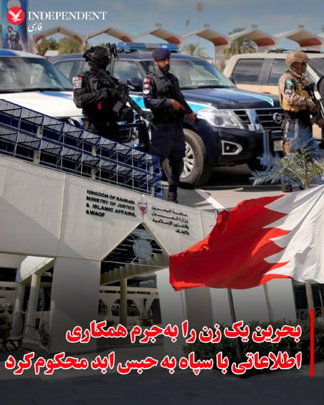
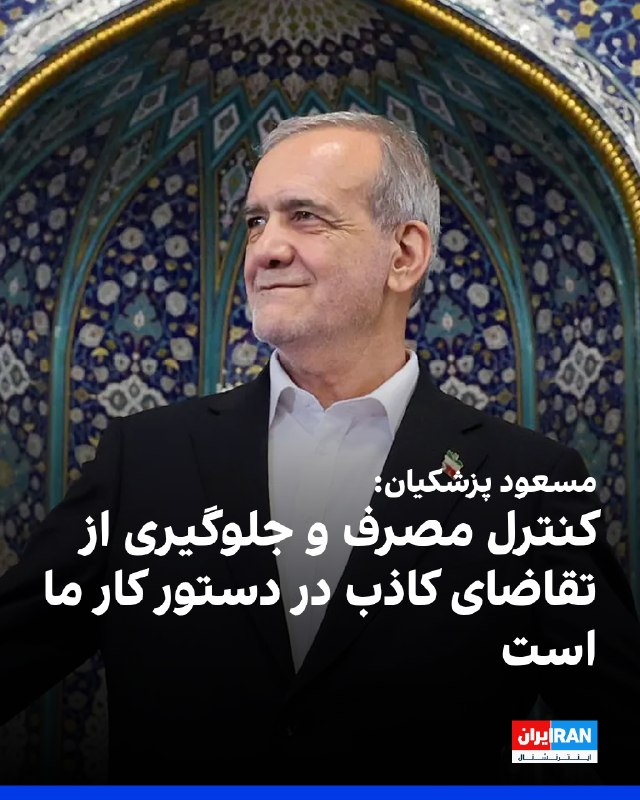

# خواننده تلگرام

<!-- TOP_NAV START -->

<a href="https://github.com/ProAlit/aio-downloader/blob/main/telegram/content/archive_1.md" style="display:inline-block; padding:6px 12px; margin:0 4px; background-color:#2ea44f; color:white; text-decoration:none; border-radius:4px; font-weight:bold;">صفحه بعد</a>

<!-- TOP_NAV END -->

<!-- MSG START -->

---
📅 بروزرسانی: 1405/02/22 13:13
---

هیچ پیام جدیدی در این بروزرسانی ارسال نشد.

---
📅 بروزرسانی: 1405/02/22 13:05
---

## VahidOOnLine — post 239671

  <a href="telegram/content/VahidOOnLine_239671_1778578523.mp4" target="_blank">🎬 Download video</a>

روزنامه اسرائیل هیوم گزارش داد هزاران شهروند اسرائیلی پیامک‌هایی تهدیدآمیز به زبان عبری دریافت کرده‌اند که در آنها از مخاطبان خواسته شده با جمهوری اسلامی همکاری اطلاعاتی کنند.

در یکی از این پیامک‌ها آمده است: «به شما قول داده بودیم که به‌زودی ستاره‌هایی را در آسمان شب خواهید دید که ستاره نیستند… به‌زودی خورشید را در آسمان شب خواهید دید، اما…»

بر اساس این گزارش، سازمان ملی سایبری اسرائیل این پیام‌ها را بخشی از تلاش برای ایجاد ترس و اثرگذاری روانی توصیف کرده و از شهروندان خواسته است به پیام‌ها پاسخ ندهند، شماره فرستنده را مسدود کنند و آن را گزارش دهند.
‌🏁 🇬🇧 ManotoTV

🤖 @VahidOOnLine

## VahidOOnLine — post 239670

  

♦️دادگاه عالی جنایی بحرین روز سه‌شنبه ۲۲ اردیبهشت یک زن را به اتهام همکاری اطلاعاتی با سپاه پاسداران به حبس ابد محکوم کرد.
به گزارش دیلی تریبون بحرین، این زن متهم است که در شبکه‌های اجتماعی تصاویری از اهداف و اماکن حیاتی کشورش را با هدف ضربه زدن به امنیت ملی بحرین منتشر می‌کرده است.

این زن همچنین متهم شده است که تصاویری از حملات جمهوری اسلامی به بحرین را همراه با محتوایی در راستای تمجید حکومت ایران منتشر می‌کرده است.
‌🇸🇦 Indypersian

🤖 @VahidOOnLine

## VahidOOnLine — post 239669

  

مسعود پزشکیان، رییس دولت جمهوری اسلامی، گفت: «دولت بنا ندارد برای فعالیت اقتصادی سالم محدودیت ایجاد کند، اما در مقابل نیز اجازه نخواهد داد عده‌ای با سوءاستفاده از شرایط جنگی، معیشت مردم را هدف قرار دهند.»

او یکی از سیاست‌های اساسی دولت چهاردهم در وضعیت کنونی را «کنترل مصرف و جلوگیری از شکل‌گیری تقاضای القایی و کاذب» دانست و افزود: «ایجاد تقاضای غیرواقعی بدون تامین متناسب کالا، منجر به نارضایتی عمومی خواهد شد.»

پزشکیان ادامه داد: «یکی از مهم‌ترین اهداف دشمن در شرایط فعلی، ایجاد اختلال در اقتصاد و فشار بر معیشت مردم است.»
‌🏁 🇬🇧 IranintlTV

🤖 @VahidOOnLine

## DEJradio — post 4583

  <a href="telegram/content/DEJradio_4583_1778578525.webm" target="_blank">🎬 Download video</a>

🚨
⭕️ تا شعاع ۵۰ کیلومتری پایگاه مشترک اسرائیل و آمریکا در عراق کسی حق نزدیک شدن ندارد

شاکر ابوتراب التمیمی، نماینده فراکسیون بدر [وابسته به نیروی قدس سـ.ـپاه] در پارلمان عراق، افشا کرد پایگاه مشترک اسرائیل- آمریکا در صحرای غرب عراق همچنان فعال است و نیروهای امنیتی عراق و آنها «اجازه نزدیک شدن به آن را ندارند».

به گفته التمیمی، «حدود دو ماه پیش اطلاعاتی درباره وجود این کمپ در خاک عراق منتشر شده بود، اما این اردوگاه همچنان پابرجاست و بغداد عملا هیچ کنترلی بر آن ندارد و آمریکا صراحتا به دولت عراق گفته است تا شعاع ۵۰ کیلومتری آن مکان کسی حق تردد و نزدیک شدن به آنجا را ندارد.»

او همچنین گفت، «دولت در ابتدا از این موضوع بی‌اطلاع بود، اما بعدها از مسیر دستگاه‌های امنیتی از وجود این پایگاه مشترک در صحرای غربی مطلع شد».
پیش‌تر وال‌استریت ژورنال به نقل از منابع امنیتی از وجود یک پایگاه مخفی اسرائیلی در صحرای نجف عراق خبر داده بود. طی جنگ ۴۰ روزه این پایگاه پشتیبان حملات به رژیم ایران بود.

#جنگ۴۰روزه #جمهوری_اسلامی
@DEJradio

## IranIntlTV — post 336785

  <a href="telegram/content/IranIntlTV_336785_1778578525.mp4" target="_blank">🎬 Download video</a>

اجلاس دموکراسی کپنهاگ ۲۰۲۶ در دانمارک با شعار «ساختن ائتلافی از دموکراسی‌ها در نظم بی‌نظم نوین جهانی» برگزار می‌شود. مسیح علی‌نژاد، فعال حقوق بشر ایرانی، امسال در فهرست مهمانان اصلی این اجلاس قرار دارد.
مهران عباسیان، خبرنگار ایران‌اینترنشنال، گزارش می‌دهد
@iranintltv

## IranIntlTV — post 336784

🔻ترامپ و شی درباره ایران، تجارت، هوش مصنوعی و تسلیحات هسته‌ای گفت‌وگو خواهند کرد

مقام‌های آمریکایی اعلام کردند دونالد ترامپ، رییس‌جمهوری آمریکا، و شی جین‌پینگ، رییس‌جمهوری چین، در جریان سفر دو روزه ترامپ به چین درباره ایران، تایوان، هوش مصنوعی و تسلیحات هسته‌ای گفت‌وگو خواهند کرد؛ در حالی که دو طرف در حال بررسی تمدید توافق مربوط به مواد معدنی حیاتی هستند.

خبرگزاری رویترز سه‌شنبه ۲۲ اردیبهشت نوشت که رهبران دو اقتصاد بزرگ جهان قرار است پس از بیش از شش ماه نخستین دیدار حضوری خود را برگزار کنند. دیداری که در شرایط تنش میان دو کشور بر سر تجارت، جنگ آمریکا و اسرائیل با حکومت ایران و دیگر اختلافات انجام می‌شود.

ترامپ قرار است چهارشنبه ۲۳ اردیبهشت وارد پکن شود و مذاکرات او با شی، روزهای پنج‌شنبه و جمعه برگزار خواهد شد.

این نخستین سفر ترامپ به چین از سال ۲۰۱۷ است.
توافق‌های احتمالی درباره خرید هواپیما، کشاورزی و تجارت

مقام‌های آمریکایی گفتند آمریکا و چین احتمالا درباره ایجاد سازوکارهایی برای تسهیل تجارت و سرمایه‌گذاری متقابل توافق خواهند کرد و انتظار می‌رود پکن خریدهایی را در حوزه هواپیماهای بوئینگ، محصولات کشاورزی آمریکا و انرژی اعلام کند.

به گفته یکی از این مقام‌ها، احتمال دارد طرح ایجاد «شورای تجارت» و «شورای سرمایه‌گذاری» نیز در این دیدار به‌طور رسمی اعلام شود، اما اجرای این سازوکارها به مذاکرات و اقدامات بعدی نیاز خواهد داشت.

دو کشور همچنین درباره تمدید آتش‌بس در جنگ تجاری خود گفت‌وگو خواهند کرد. توافقی که امکان صادرات مواد معدنی کمیاب از چین به آمریکا را فراهم کرده است.

این مقام آمریکایی گفت هنوز مشخص نیست این توافق در همین هفته تمدید شود یا نه، اما ابراز اطمینان کرد که در نهایت تمدید خواهد شد.

او به خبرنگاران گفت: «این توافق هنوز منقضی نشده است. مطمئنم هر گونه تمدید احتمالی در زمان مناسب اعلام خواهد شد.»

رویترز نوشت که سفارت چین در واشینگتن از اظهار نظر درباره این موضوع خودداری کرد.
ایران، تایوان و تسلیحات هسته‌ای؛ محورهای اختلاف

انتظار می‌رود گفت‌وگوهای ترامپ و شی به موضوعاتی مربوط شود که سال‌ها از محورهای تنش میان واشینگتن و پکن بوده‌اند؛ از جمله ایران، تایوان و تسلیحات هسته‌ای.

پکن روابط خود را با تهران حفظ کرده و همچنان یکی از خریداران اصلی نفت ایران است.

ترامپ تلاش کرده از نفوذ چین برای اعمال فشار بر تهران به‌منظور توافق با واشینگتن و پایان دادن به جنگی استفاده کند که با حملات آمریکا و اسرائیل به ایران در ۹ اسفند ۱۴۰۴ آغاز شد.

دولت ترامپ همچنین درباره روابط چین و روسیه به پکن فشار آورده است.

یکی از مقام‌های آمریکایی گفت: «رییس‌جمهوری چندین بار با شی جین‌پینگ درباره ایران و روسیه گفت‌وگو کرده، از جمله درباره درآمدی که چین در اختیار این دو حکومت قرار می‌دهد، و نیز کالاها و قطعات دو منظوره و حتی احتمال صادرات تسلیحات.»

او افزود: «انتظار دارم این گفت‌وگوها ادامه پیدا کند.»

در مقابل، شی از سیاست واشینگتن درباره تایوان ناراضی است.

آمریکا همچنان مهم‌ترین حامی بین‌المللی و تامین‌کننده تسلیحات برای تایوان به شمار می‌رود. جزیره‌ای که چین آن را بخشی از خاک خود می‌داند.

به گفته مقام‌های آمریکایی، چین در سال‌های اخیر حضور نظامی خود را در اطراف تایوان افزایش داده، اما سیاست آمریکا در این زمینه تغییر نخواهد کرد.
نگرانی آمریکا از پیشرفت هوش مصنوعی در چین

مشاوران ترامپ نگرانی فزاینده‌ای نسبت به مدل‌های پیشرفته هوش مصنوعی در حال توسعه در چین ابراز کرده‌اند.

آنان معتقدند دو کشور باید برای جلوگیری از بروز تنش ناشی از استفاده از این فناوری، «کانال ارتباطی» میان خود ایجاد کنند.

یکی از مقام‌ها گفت: «هنوز مشخص نیست این سازوکار چه شکلی خواهد داشت، اما می‌خواهیم از فرصت دیدار رهبران برای آغاز گفت‌وگو و بررسی امکان ایجاد کانال ارتباطی درباره مسائل مرتبط با هوش مصنوعی استفاده کنیم.»
اختلاف بر سر تسلیحات هسته‌ای

واشینگتن سال‌هاست امیدوار است گفت‌وگوهایی را درباره تسلیحات هسته‌ای با پکن آغاز کند، اما چین همچنان تمایلی به مذاکره درباره زرادخانه هسته‌ای خود نشان نداده است.

به گفته یک مقام آمریکایی، دولت چین به‌صورت خصوصی به واشینگتن اعلام کرده که در مقطع کنونی، «هیچ علاقه‌ای به گفت‌وگو درباره کنترل تسلیحات هسته‌ای یا موضوعات مشابه ندارد».

آخرین دیدار ترامپ و شی، آبان ۱۴۰۴ در کره جنوبی انجام شد. جایی که دو طرف توافق کردند جنگ تجاری شدید میان خود را متوقف کنند. جنگی که طی آن آمریکا تعرفه‌های سه رقمی بر کالاهای چینی وضع کرده بود و پکن نیز تهدید کرده بود صادرات مواد معدنی کمیاب را محدود خواهد کرد.

🔗 وب‌سایت ایران اینترنشنال
@iranintltv

## IranIntlTV — post 336783

  

مسعود پزشکیان، رییس دولت جمهوری اسلامی، گفت: «دولت بنا ندارد برای فعالیت اقتصادی سالم محدودیت ایجاد کند، اما در مقابل نیز اجازه نخواهد داد عده‌ای با سوءاستفاده از شرایط جنگی، معیشت مردم را هدف قرار دهند.»

او یکی از سیاست‌های اساسی دولت چهاردهم در وضعیت کنونی را «کنترل مصرف و جلوگیری از شکل‌گیری تقاضای القایی و کاذب» دانست و افزود: «ایجاد تقاضای غیرواقعی بدون تامین متناسب کالا، منجر به نارضایتی عمومی خواهد شد.»

پزشکیان ادامه داد: «یکی از مهم‌ترین اهداف دشمن در شرایط فعلی، ایجاد اختلال در اقتصاد و فشار بر معیشت مردم است.»
https://iranintl.com/202605122119

## IranIntlTV — post 336782

🔻۸ زندانی سیاسی زن در اوین از حق ملاقات با خانواده محروم شدند

بر اساس اطلاعات رسیده به ایران‌اینترنشنال، شیوا اسماعیلی، گلرخ ایرایی، سکینه پروانه، فروغ تقی‌پور، زهرا صفایی، مرضیه فارسی، الهه فولادی و وریشه مرادی، هشت تن از زندانیان سیاسی زن محبوس در بند زنان زندان اوین، از حق ملاقات با خانواده و وکیلان خود محروم شده‌اند.

اطلاعات رسیده حاکی است این محرومیت‌ها پس از تشدید فضای امنیتی در بند زنان اوین و در پی فشار و برخورد با زندانیانی اعمال شده که در برنامه‌های جمعی، یادبودها و رخدادهای اعتراضی داخل بند، مشارکت داشته‌اند.

یک منبع نزدیک به خانواده‌های زندانیان محبوس در بند زنان اوین به ایران‌اینترنشنال گفت در هفته‌های اخیر ماموران زندان بر خلاف روال پیشین، هر روز در ساعات صبح و گاه شب، به بهانه سرکشی وارد بند شده‌اند و با تردد مداوم خود، فضای بند را بیش از گذشته امنیتی کرده‌اند.

به گفته این منبع آگاه، زندانیان زن اوین در سال‌های گذشته مناسبت‌های سیاسی و عقیدتی را با دورهمی، خواندن متن و مقاله، سرودخوانی و یادآوری نام جان‌باختگان و چهره‌های پیشین و پیشکسوت جنبش‌های اعتراضی گرامی می‌داشتند، اما اخیرا همین برنامه‌ها نیز با دخالت مستقیم ماموران و مسئولان زندان و تهدید شرکت‌کنندگان روبه‌رو شده است.

این منبع مطلع افزود شماری از زندانیانی که به تازگی به بند زنان اوین منتقل شده‌اند و در برخی از این برنامه‌ها حضور پراکنده داشتند نیز از سوی زندانبانان و نیروهای امنیتی تهدید شده‌اند.

یک منبع آگاه دیگر به ایران‌اینترنشنال گفت ماموران زندان در ماه‌های اخیر با ادبیاتی اهانت‌آمیز با زندانیان برخورد کرده و آنان را به انتقال به سلول انفرادی تهدید کرده‌اند.

منبع دیگری که از وضعیت زنان زندانی در اوین مطلع است، به ایران‌اینترنشنال گفت غزل مرزبان، از زنان زندانی در اوین، اخیرا پس از اعتراض به رسیدگی نشدن به وضعیتش، پنج شب به سلول انفرادی منتقل شده است.

بند زنان اوین که از آن با عنوان خط مقدم جنبش «زن، زندگی، آزادی» یاد می‌شود، در سال‌های گذشته یکی از کانون‌های اصلی کنش‌گری زندانیان سیاسی زن بوده است. زندانیان این بند بارها در واکنش به تحولات سیاسی، اجتماعی و مدنی، از جمله اعتراض‌ها و خیزش‌ها، اعدام‌ها، بازداشت‌ها، فقر، فساد و سرکوب معترضان، موضع‌گیری کرده‌اند.

این بند همچنین بارها شاهد حرکت‌های اعتراضی، از جمله تحصن و اعتصاب غذای زندانیان در اعتراض به صدور و اجرای احکام اعدام بوده و زندانیان پس از آن با اقدامات تنبیهی، از جمله محرومیت از حق تماس تلفنی و ملاقات و نیز پرونده‌سازی تازه مواجه شده‌اند.

یک منبع نزدیک به خانواده‌های زندانیان زن اوین گفت افزایش محدودیت‌ها، تهدید به انفرادی و محرومیت از ملاقات، بخشی از تلاش مقام‌های زندان و نهادهای امنیتی برای خاموش کردن صدای اعتراض در این بند است.
محرومیت محترم پرندین از درمان فوری با وجود تومور نزدیک مخچه

بر اساس اطلاعات رسیده به ایران‌اینترنشنال، محترم پرندین، معروف به محشر، هنرمند و نقاش زندانی در اوین که ماه‌هاست با اتهامات سیاسی در حبس است، با وجود ابتلا به دو تومور در ناحیه پشت سر، نزدیک مخچه و گلو و همچنین بیماری حاد قلبی، از اعزام درمانی و جراحی فوری محروم مانده است.

یک منبع مطلع به ایران‌اینترنشنال گفت پزشک زندان جراحی فوری پرندین را ضروری دانسته و درباره خطر تومور نزدیک مخچه هشدار داده است. توموری که باعث اختلال در بینایی، تکلم و حرکات بدنی او شده و به گفته هم‌بندی‌هایش، آثار آن در راه رفتن و صحبت کردنش قابل مشاهده است.

به گفته این منبع آگاه، با وجود تاکید پزشک زندان، مسئولان تاکنون برای اعزام درمانی او همکاری نکرده‌اند و با وجود گذشت بیش از نیمی از ایام حبس و وخامت حال، با آزادی مشروط و مرخصی درمانی‌اش نیز مخالفت کرده‌اند.

این در حالی است که سند لازم برای مرخصی در اختیار دادستانی قرار دارد.

پرندین، مادر یک پسر نوجوان و محصل است و پس از درگذشت همسرش، سرپرستی خانواده را بر عهده دارد. فرزند او نیز به بیماری خاص مبتلاست و در نبود مادر با مشکلات جدی روبه‌رو شده است.
در سال‌های گذشته، گزارش‌های متعددی از محرومیت زندانیان سیاسی در ایران از رسیدگی پزشکی و نقض حق دسترسی آنان به درمان مناسب از سوی مسئولان زندان‌ها منتشر شده است.

شماری از زندانیان سیاسی نیز طی سال‌های اخیر در دوران حبس جان خود را از دست داده‌اند. مرگ‌هایی که خانواده‌ها و نهادهای حقوق بشری، آن‌ها را نتیجه فشار، شکنجه یا محرومیت از خدمات درمانی دانسته‌اند، اما جمهوری اسلامی در قبال آن‌ها مسئولیتی نپذیرفته است.

🔗 وب‌سایت ایران اینترنشنال
@iranintltv

## ManotoTV — post 105336

  <a href="telegram/content/ManotoTV_105336_1778578527.mp4" target="_blank">🎬 Download video</a>

روزنامه اسرائیل هیوم گزارش داد هزاران شهروند اسرائیلی پیامک‌هایی تهدیدآمیز به زبان عبری دریافت کرده‌اند که در آنها از مخاطبان خواسته شده با جمهوری اسلامی همکاری اطلاعاتی کنند.

در یکی از این پیامک‌ها آمده است: «به شما قول داده بودیم که به‌زودی ستاره‌هایی را در آسمان شب خواهید دید که ستاره نیستند… به‌زودی خورشید را در آسمان شب خواهید دید، اما…»

بر اساس این گزارش، سازمان ملی سایبری اسرائیل این پیام‌ها را بخشی از تلاش برای ایجاد ترس و اثرگذاری روانی توصیف کرده و از شهروندان خواسته است به پیام‌ها پاسخ ندهند، شماره فرستنده را مسدود کنند و آن را گزارش دهند.

## FarsiVOA — post 217513

  

شرکت «ادنوک گاز» که بهره‌برداری از تأسیسات حبشان، اصلی‌ترین مجتمع گازی امارات متحده عربی را برعهده دارد، اعلام کرد انتظار می‌رود این مجتمع سال ۲۰۲۷ بتواند ظرفیت کامل خود را بازیابد.

تأسیسات حبشان در جریان جنگ اخیر هدف حملات جمهوری اسلامی قرار گرفت و این حملات یک کشته و هفت زخمی بر جای گذاشت.

ادنوک گاز روز سه‌شنبه در بیانیه‌ای که به مناسبت انتشار نتایج سه‌ماهه خود صادر کرد، نوشت هدف این است که «تا پایان سال ۲۰۲۶ به ۸۰ درصد بازیابی برسیم و بازگشت به ظرفیت کامل در سال ۲۰۲۷ انجام شود.»

مجتمع حبشان در ابوظبی، یکی از بزرگ‌ترین مراکز فرآوری گاز در جهان، اوایل آوریل دوبار هدف حملات جمهوری اسلامی قرار گرفت.

ادنوک گاز که زیرمجموعه شرکت بزرگ اماراتی «ادنوک» است تاکنون توانسته ۶۰ درصد از ظرفیت فرآوری این مجتمع را بازگرداند. سود خالص ادنوک گاز در سه ماه نخست سال، در شرایطی که «اختلالات عمده در بخش انرژی و ترافیک دریایی در تنگه هرمز» وجود داشته، ۱۵ درصد نسبت به سال گذشته کاهش یافته و به ۱.۱ میلیارد دلار رسیده است.

بسته شدن تنگه هرمز باعث اختلال در تأمین و افزایش شدید قیمت‌های انرژی شده است.
@FarsiVOA

## Persian_Trend_Official — post 13967

  

⭕️ فعالیت سنگین نیروی دریایی آمریکا در اطراف تنگه باب‌المندب

این فعالیت سنگین در آب‌های جنوبی یمن و تا فاصله با تنگه باب‌المندب احتمالاً برای پشتیبانی از ناو گروه ضربت هواپیمابر شارل دوگل فرانسه برای خروج از تنگه باب‌المندب است.
ناو هواپیمابر جورج بوش پوشش خروج ناو شارل دوگل را از تنگه باب‌المندب فراهم می‌کند.

📝 Nick

📌 @persian_trend_official
پرشین ترند | متفاوت‌ترین کانال نظامی

## RadioFarda — post 157082

ترامپ می‌گوید خسته نمی‌شود و فشار بر جمهوری اسلامی را تا پیروزی کامل ادامه خواهد داد

🔸دونالد ترامپ، رئیس‌جمهور ایالات متحده، شامگاه دوشنبه ۲۱ اردیبهشت در گفت‌وگو با خبرنگاران بار دیگر پاسخ مقامات جمهوری اسلامی به پیشنهاد صلح آمریکا را «ضعیف» و «کاملاً غیرقابل قبول» خواند و تأکید کرد فشار بر جمهوری اسلامی را تا زمان دستیابی به توافق ادامه خواهد داد و از ادامهٔ جنگ فرسایشی خسته نخواهد شد.

🔸ترامپ در گفت‌وگو با خبرنگاران در کاخ سفید، با اشاره به رد پیشنهاد آمریکا از سوی تهران، گفت: «احمق‌ها نمی‌خواستند قبول کنند. فکر می‌کردند من خسته می‌شوم یا حوصله‌ام سر می‌رود یا تحت فشار قرار می‌گیرم، اما هیچ فشاری وجود ندارد. ما به یک پیروزی کامل خواهیم رسید.»

🔸او همچنین دربارهٔ پیشنهاد ارائه‌شده از سوی جمهوری اسلامی گفت: «به‌نظرم فوق‌العاده ضعیف است. بعد از خواندن مزخرفاتی که برای ما فرستادند، آن را ضعیف‌ترین پاسخ یافتم. من حتی خواندنش را تمام نکردم، گفتم وقتم را برای خواندن آن تلف نمی‌کنم.»

🔸ترامپ در گفت‌وگو با شبکه سی‌بی‌اس هم گفت تهران در برنامه هسته‌ای خود امتیازاتی داده، اما این امتیازها «کافی نبوده» است.

🔸ترامپ یک روز پیش‌تر نیز گفته بود از پاسخ تهران به پیشنهاد آمریکا رضایت ندارد و آن را «کاملاً غیرقابل قبول» می‌داند. همزمان، صداوسیمای جمهوری اسلامی گزارش داد که این پیشنهاد رد شده، زیرا به گفته این رسانه، به معنای «تسلیم کامل» بوده است.

🔸رئیس‌جمهور آمریکا در پاسخ به پرسشی دربارهٔ احتمال تغییر حکومت در ایران هم گفت در جمهوری اسلامی «میانه‌روها» و «دیوانه‌ها» وجود دارند و افزود: «دیوانه‌ها می‌خواهند تا آخر بجنگند.» ترامپ گفت جنگ «خیلی کوتاه» خواهد بود و مدعی شد میانه‌روها در حکومت ایران از تندروها می‌ترسند.

🔸نسخه کامل این گزارش را در وب‌سایت رادیوفردا بخوانید.

@RadioFarda

## Hranews — post 112896

  

نت‌بلاکس، نهاد ناظر بر اختلالات اینترنت در جهان، اعلام کرد که قطع گسترده اینترنت در ایران وارد هفتاد و چهارمین روز خود شده و اکنون از مرز ۱۷۵۲ ساعت گذشته است. این نهاد تاکید کرده که از زمان آغاز این محدودیت‌ها، دسترسی عمومی شهروندان ایران به #اینترنت جهانی همچنان به‌طور گسترده مسدود مانده است.

نت‌بلاکس همچنین با اشاره به همزمانی این محدودیت‌ها با بازداشت و اعدام شماری از فعالان و متخصصان حوزه فناوری در ایران، نوشته است که در حالی‌ که جهان شاهد پیشرفت‌های علمی و فناوری بوده، حکومت ایران به برخوردهای امنیتی با تکنولوژیست‌ها ادامه داده است.

↘️
@hranews_bot تماس ✉️ - @Hranews کانال هرانا 🆑

## manototv — post 105336

  <a href="telegram/content/manototv_105336_1778578530.mp4" target="_blank">🎬 Download video</a>

روزنامه اسرائیل هیوم گزارش داد هزاران شهروند اسرائیلی پیامک‌هایی تهدیدآمیز به زبان عبری دریافت کرده‌اند که در آنها از مخاطبان خواسته شده با جمهوری اسلامی همکاری اطلاعاتی کنند.

در یکی از این پیامک‌ها آمده است: «به شما قول داده بودیم که به‌زودی ستاره‌هایی را در آسمان شب خواهید دید که ستاره نیستند… به‌زودی خورشید را در آسمان شب خواهید دید، اما…»

بر اساس این گزارش، سازمان ملی سایبری اسرائیل این پیام‌ها را بخشی از تلاش برای ایجاد ترس و اثرگذاری روانی توصیف کرده و از شهروندان خواسته است به پیام‌ها پاسخ ندهند، شماره فرستنده را مسدود کنند و آن را گزارش دهند.

## alonews — post 119456

  <a href="telegram/content/alonews_119456_1778578530.webm" target="_blank">🎬 Download video</a>

👈سفیر آمریکا در تل‌آویو می‌گوید اسرائیل سامانه‌های گنبد آهنین را به امارات متحده عربی ارسال کرده است 
✅ @AloNews خبر جنگ

---
📅 بروزرسانی: 1405/02/22 12:55
---

## VahidOOnLine — post 239668

🗣روایت شما از زندگی زیر سایه آتش‌بس- سه‌شنبه ۲۲ اردیبهشت:

🔹قیمت قطعات خودرو مثل طلا به‌صورت دقیقه‌ای قیمت‌گذاری می‌شه و به طرز فجیعی بالا رفته، حتی نمی‌شه قطعات خودرو رو تعویض کرد.

🔹تهران آن‌قدر بیکاری زیاد شده که مردم همه راننده اسنپ شدند، آن هم با کرایه پایین که اصلا به‌صرفه نیست. گرانی بیداد می‌کند.

🔹کلی تلاش کردم وصل بشم تا بگم چرا پدر بازنشسته من بعد از ۳۰ سال تمام کار کردن باید حقوقش ۳۰ میلیون تومان باشد و برای خرج روزهایمان از صبح تا شب اسنپ کار کند؟

🔹من یک استادکار تاسیسات ساختمانم. اجناس تاسیسات پیش از عید تا حالا حدود ۴ برابر شده و به‌خاطر افزایش شدید قیمت اجناس، تقاضا برای کار تقریبا صفر شده.

🔹قیمت قهوه سر به فلک گذاشته و دیگر یک قهوه ساده هم نمی‌شود خورد. یک کیلو کیک و شیرینی بالای یک میلیون تومان شده. یک سالاد معمولی در کافه ۸۰۰ هزار تومان است.

🔹از شهر چابهار پیام می‌دهم؛ این‌جا زندگی روزه مردم به شدت مختل شده است، خصوصا برای قشر کارگر. خرید یک مرغ شده آرزو.
‌🏁 🇬🇧 IranintlTV

🤖 @VahidOOnLine

## WithYashar — post 11045

ترامپ : من نه قراره خسته بشم نه قراره کوتاه بیام جلو ایران ، تا پیروزی کامل ادامه میدم !
@withyashar

## mwarmonitor — post 8952

  

✈️🇺🇸نیروی هوایی آمریکا (USAF)

✈️هواپیمای ترابری فوق سنگین Lockheed C-5M Super Galaxy – یک فروند
شناسه: AE0580 / 87-0035 – با نام عملیاتی REACH 2042

🔰پرواز REACH 2042 در حال ورود به پایگاه RAF Mildenhall از پایگاه نیروی هوایی Dover Air Force Base ایالت دلاور است. آن‌ها در حال انجام عملیات «BANTER Ops» روی فرکانس 300.800 هستند.

@mwarmonitor

## mwarmonitor — post 8951

  

📝سؤال برای همه علاقه‌مندان هوانوردی: آیا نیروی هوایی پاکستان (PAF) در حال حاضر یک فروند C-130 با رنگ‌آمیزی استتار شنی/بیابانی (Desert Camouflage) در اختیار دارد؟ شهباز شریف خر خودتی @mwarmonitor

## DEJradio — post 4582

  <a href="telegram/content/DEJradio_4582_1778577956.webm" target="_blank">🎬 Download video</a>

🚨📢 ادعای وزارت خارجه پاکستان:
هواپیماهای ایرانی «موقت» در پاکستان مستقر هستند

سی‌بی‌اس گزارش داده بود که جمهوری اسلامی بخشی از ناوگان نیروی هوایی [تجاری و نظامی] خود را در طی جنگ ۴۰ روزه به پایگاه هوایی «نورخان» پاکستان منتقل کرده بود. در واکنش به این گزارش وزارت خارجه پاکستان به طور رسمی این گزارش را «گمراه‌کننده» خواند و تأکید کرد که این هواپیماها صرفاً برای تسهیل رفت‌وآمد دیپلمات‌ها و به صورت موقت مستقر شده‌اند.
در بیانیه وزارت خارجه پاکستان آمده «هواپیماهای نظامی ایران نه برای مصون ماندن از حملات آمریکا که در انتظار دورهای بعدی مذاکرات، در پایگاه نورخان مانده‌اند.»

همچنین تأکید شده، «هواپیماهای ایرانی که هم‌اکنون در خاک ما هستند، به هیچ گونه ترتیبات نظامی مرتبط نمی‌باشند». پاکستان همچنین تصریح کرد که ارتباط منظم خود را با همه طرف‌های ذی‌نفع حفظ کرده و متعهد است از تمامی تلاش‌هایی که به تقویت گفت‌وگو، کاهش تنش و پیشبرد صلح کمک می‌کند، حمایت کند.
در جریان جنگ ۱۲ روزه نیز نیروی هوایی جمهوری اسلامی بخشی از ناوگان خود را به پاکستان منتقل کرده بود تا کمتر آسیب ببینند.

#جنگ۴۰روزه #جمهوری_اسلامی #جنگ۱۲روزه
@DEJradio

## IranIntlTV — post 336781

  <a href="telegram/content/IranIntlTV_336781_1778577956.mp4" target="_blank">🎬 Download video</a>

یک شهروند با ارسال پیام به ایران‌اینترنشنال درباره گران و کمیاب شدن دارو می‌گوید: «من بیماری صرع دارم. بسته شش‌تایی دارویم را قبلا ۲۵۰ هزار تومان می‌خریدم که یک ماه پیش شده ۷۵۰ هزار تومان و الان به دو میلیون و ۳۰۰ هزار تومان رسیده است. گرانی کمر ما را شکسته و نگرانی پیدا نشدن دارو، دردی به دردهایمان اضافه کرده است.»

## IranIntlTV — post 336780

🗣روایت شما از زندگی زیر سایه آتش‌بس- سه‌شنبه ۲۲ اردیبهشت:

🔹قیمت قطعات خودرو مثل طلا به‌صورت دقیقه‌ای قیمت‌گذاری می‌شه و به طرز فجیعی بالا رفته، حتی نمی‌شه قطعات خودرو رو تعویض کرد.

🔹تهران آن‌قدر بیکاری زیاد شده که مردم همه راننده اسنپ شدند، آن هم با کرایه پایین که اصلا به‌صرفه نیست. گرانی بیداد می‌کند.

🔹کلی تلاش کردم وصل بشم تا بگم چرا پدر بازنشسته من بعد از ۳۰ سال تمام کار کردن باید حقوقش ۳۰ میلیون تومان باشد و برای خرج روزهایمان از صبح تا شب اسنپ کار کند؟

🔹من یک استادکار تاسیسات ساختمانم. اجناس تاسیسات پیش از عید تا حالا حدود ۴ برابر شده و به‌خاطر افزایش شدید قیمت اجناس، تقاضا برای کار تقریبا صفر شده.

🔹قیمت قهوه سر به فلک گذاشته و دیگر یک قهوه ساده هم نمی‌شود خورد. یک کیلو کیک و شیرینی بالای یک میلیون تومان شده. یک سالاد معمولی در کافه ۸۰۰ هزار تومان است.

🔹از شهر چابهار پیام می‌دهم؛ این‌جا زندگی روزه مردم به شدت مختل شده است، خصوصا برای قشر کارگر. خرید یک مرغ شده آرزو.

## IranIntlTV — post 336779

🔻قوه قضاییه جمهوری اسلامی از اعدام عبدالجلیل شه‌بخش، زندانی سیاسی، خبر داد

خبرگزاری میزان، رسانه قوه قضاییه جمهوری اسلامی، از اجرای حکم اعدام عبدالجلیل شه‌بخش، زندانی سیاسی بلوچ، خبر داد.

با اعدام شه‌بخش، شمار زندانیان اعدام‌شده با اتهامات سیاسی در ایران از ۲۷ اسفند ۱۴۰۴ تاکنون، طی ۵۶ روز، به دست‌کم ۳۰ نفر رسید.

این در حالی است که سایت حقوق بشری هرانا پیش‌تر گزارش داده بود جمهوری اسلامی در کل سال ۱۴۰۴ دست‌کم ۵۲ زندانی را با اتهام‌های سیاسی و امنیتی اعدام کرد.

به این ترتیب، روند اعدام زندانیان با اتهام‌های سیاسی و امنیتی در ایران از میانگین حدود یک اعدام در هفته در سال ۱۴۰۴، به حدود یک اعدام در هر دو روز طی ۵۶ روز گذشته رسید.

رسانه قوه قضاییه اعلام کرد حکم اعدام شه‌بخش با اتهامات «بغی از طریق حمله مسلحانه به مقرهای انتظامی و عضویت در گروه باغی انصارالفرقان» و پس از تایید در دیوان عالی کشور، بامداد سه‌شنبه ۲۲ اردیبهشت اجرا شده است.

میزان نوشت مستندات پرونده، از جمله فایل‌های صوتی استخراج‌شده از وسایل ارتباطی این زندانی و «اقاریر» او در مراحل بازجویی و بازپرسی، مبنای صدور حکم اعدام بوده است.

این رسانه توضیحی درباره نحوه دسترسی به این اطلاعات، شرایط نگهداری شه‌بخش در دوران بازداشت، چگونگی اخذ اعترافات او و محل اجرای حکم اعدام این زندانی سیاسی ارائه نکرد.

بر اساس گزارش میزان، نهادهای امنیتی جمهوری اسلامی شه‌بخش را از افراد بازداشت‌شده در استان سیستان و بلوچستان در جریان اعتراضات سال ۱۴۰۱ معرفی کرده‌اند.
میزان به نقل از نهادهای امنیتی نوشت او با یک تیم وابسته به گروه انصارالفرقان ارتباط داشته و اعضای این تیم با هدف «شناسایی مقرهای انتظامی» در استان سیستان و بلوچستان فعالیت می‌کردند.

قوه قضاییه افزود او حدود شش سال پیش به یکی از کشورهای همسایه رفته بود و پس از بازگشت به ایران، در «شناسایی مسیرها و مقرهای نظامی و انتظامی در مناطق کورین و تفتان» نقش داشته است.

هم‌زمان رسانه قوه قضاییه ویدیویی از اعترافات اجباری منتسب به شه‌بخش منتشر کرد که مشخص نیست در چه شرایطی ضبط شده است.

پیش‌تر اطلاعاتی درباره بازداشت شه‌بخش و روند قضایی پرونده او منتشر نشده بود. موضوعی که فعالان حقوق بشر آن را بخشی از رویه نهادهای امنیتی جمهوری اسلامی در پنهان نگه داشتن پرونده برخی بازداشت‌شدگان سیاسی و امنیتی می‌دانند.
در موارد مشابه، خانواده‌ها تحت فشار و تهدید قرار می‌گیرند تا درباره بازداشت فرزندان خود اطلاع‌رسانی نکنند و به آنان گفته می‌شود در صورت سکوت، امکان آزادی یا تخفیف مجازات وجود دارد.

هم‌زمان، شماری از بازداشت‌شدگان ماه‌ها در خانه‌های امن یا بازداشتگاه‌های امنیتی نگهداری می‌شوند و بدون انتقال به زندان‌های عمومی، روند پرونده و حتی صدور حکم آنان از افکار عمومی پنهان می‌ماند.

شبکه اسناد حقوق بشر بلوچستان، پیش‌تر در ۱۷ اردیبهشت گزارش داد دست‌کم ۲۱ زندانی سیاسی بلوچ در ایران در خطر اجرای حکم اعدام قرار دارند.
در این گزارش آمده است که بخش قابل توجهی از آنان پس از شکنجه، اعترافات اجباری، محرومیت از وکیل و دادگاه‌های غیرعلنی یا بدون حضور وکیل، به اعدام محکوم شده‌اند.
در حال حاضر صدها زندانی سیاسی و شهروند بازداشت‌شده در جریان اعتراضات در زندان‌های ایران با اتهام‌های سیاسی و امنیتی روبه‌رو هستند.

فعالان حقوق بشر هشدار داده‌اند بسیاری از آنان در خطر صدور، تایید و اجرای احکام اعدام هستند. احکامی که اغلب در روندهایی غیرشفاف و همراه با محدودیت شدید دسترسی به وکیل، نگهداری طولانی‌مدت در بازداشتگاه‌های امنیتی و فشار برای اخذ اعترافات اجباری صادر می‌شوند.

🔗 وب‌سایت ایران اینترنشنال
@iranintltv

## FarsiVOA — post 217512

  

عضو کمیسیون اقتصادی مجلس جمهوری اسلامی از افزایش ثبت‌نام برای بیمه بیکاری خبر داده و گفته است این روند می‌تواند هزینه‌های دولت و صندوق بیمه بیکاری را افزایش دهد.

خبرگزاری تسنیم به نقل از میثم ظهوریان نوشت که از ابتدای جنگ تاکنون حدود ۲۰۵ هزار نفر برای دریافت بیمه بیکاری در کشور ثبت‌نام کرده‌اند.

این نماینده مجلس مدعی شد که بخشی از این افراد ممکن است در بخش غیررسمی مشغول به کار شوند، اما در هر صورت هزینه پرداخت بیمه بیکاری بر عهده دولت باقی خواهد ماند.

پیشتر علیرضا محجوب، دبیر خانه کارگر اعلام کرده بود که در طول جنگ، ۱۳۰ هزار فرصت شغلی به صورت مستقیم و ۶۰۰ هزار فرصت شغلی به صورت غیر مستقیم از بین رفته است.
@FarsiVOA

## IranianMinds — post 19996

🔴بحرین:

سه نفر به اتهام جاسوسی برای سپاه پاسدارن ایران، به حبس ابد محکوم شدند.

@IranianMinds

## Hranews — post 112895

شهرستان آوج؛ یک جنگلبان توسط متخلف محیط زیستی مصدوم شد

❗️
❗️
❗️
❗️
❗️– یک #جنگلبان در منابع طبیعی شهرستان آوج توسط یک متخلف محیط زیستی مورد ضرب و شتم قرار گرفت و مجروح شد.

ادامه مطلب

↘️
@hranews_bot تماس ✉️ -  @Hranews  کانال هرانا 🆑

## alonews — post 119455

  <a href="telegram/content/alonews_119455_1778577958.webm" target="_blank">🎬 Download video</a>

👈ابراهیم رضایی، سخنگوی کمیسیون امنیت ملی مجلس : اگه دوباره به ایران حمله بشه، یکی از گزینه‌های روی میز می‌تونه غنی‌سازی ۹۰ درصدی اورانیوم باشه و این موضوع تو مجلس بررسی میشه!

✅ @AloNews خبر جنگ

## alonews — post 119454

  <a href="telegram/content/alonews_119454_1778577958.webm" target="_blank">🎬 Download video</a>

👈رویترز: به دلیل کمبود نفت، ژاپن چاپ بسته‌بندی مواد غذایی را به صورت سیاه‌وسفید آغاز کرده است.

✅ @AloNews خبر جنگ

---
📅 بروزرسانی: 1405/02/22 12:43
---

## VahidOOnLine — post 239667

♦️غلامحسین محسنی اژه‌ای، رئیس قوه قضائیه جمهوری اسلامی روز سه‌شنبه ۲۲ اردیبهشت گفت «برخی سرگردانی‌ها مثل پتکی بر سر مردم است».

اژه‌ای به مسئولان قضایی حکومت گفت باید بررسی شود که آیا سیم‌کارت سفید و «اینترنت پرو» تخلف قانونی هستند، باید با آن‌ها برخورد شود.

درحالی که از قطعی اینترنت در ایران ۷۴ روز می‌گذرد، دولت جمهوری اسلامی با هماهنگی شورای عالی امنیت ملی به گروهی از افراد در قبال هزینه‌های بالا اجازه اتصال به «اینترنت پرو/حرفه‌ای» داده است.
همین مساله باعث نارضایتی گسترده از ایجاد یک تبعیض جدید در جامعه شده است.
‌🇸🇦 Indypersian

🤖 @VahidOOnLine

## mwarmonitor — post 8950

  

🇺🇸سفارت آمریکا در کاراکاس «طرح سه‌مرحله‌ای ریس جمهور ترامپ و وزیر امور خارجه برای ونزوئلا، خروج این ریسک هسته‌ای را از ونزوئلا تسریع کرد و یک نقطه عطف تاریخی دیگر را رقم زد. ☢۱۳.۵ کیلوگرم اورانیوم از IVIC (موسسه تحقیقات علمی ونزوئلا) خارج و برای دفع به ایالات…

## kianmeli1 — post 87357

  

🔴نت بلاکس:
امروز روز ۷۴ از قطع اینترنت در ایران است و این حادثه اکنون از ساعت ۱۷۵۲ گذشته است.از ۲۸ فوریه ۲۰۲۶ تاکنون، جهان شاهد پیشرفت‌های بزرگ در علم و فناوری بوده، در حالی که رژیم ایران در حال بازداشت و اعدام متخصصان و تکنولوژیست‌هاست.

 سه شنبه ۲۲ اردیبهشت ۱۴۰۵ 
https://t.me/kianmeli1

## IranIntlTV — post 336778

🔻قوه قضاییه جمهوری اسلامی از اعدام عبدالجلیل شه‌بخش، زندانی سیاسی، خبر داد

خبرگزاری میزان، رسانه قوه قضاییه جمهوری اسلامی، از اجرای حکم اعدام عبدالجلیل شه‌بخش، زندانی سیاسی بلوچ، خبر داد.

با اعدام شه‌بخش، شمار زندانیان اعدام‌شده با اتهامات سیاسی در ایران از ۲۷ اسفند ۱۴۰۴ تاکنون، طی ۵۶ روز، به دست‌کم ۳۰ نفر رسید.

این در حالی است که سایت حقوق بشری هرانا پیش‌تر گزارش داده بود جمهوری اسلامی در کل سال ۱۴۰۴ دست‌کم ۵۲ زندانی را با اتهام‌های سیاسی و امنیتی اعدام کرد.

به این ترتیب، روند اعدام زندانیان با اتهام‌های سیاسی و امنیتی در ایران از میانگین حدود یک اعدام در هفته در سال ۱۴۰۴، به حدود یک اعدام در هر دو روز طی ۵۶ روز گذشته رسید.

رسانه قوه قضاییه اعلام کرد حکم اعدام شه‌بخش با اتهامات «بغی از طریق حمله مسلحانه به مقرهای انتظامی و عضویت در گروه باغی انصارالفرقان» و پس از تایید در دیوان عالی کشور، بامداد سه‌شنبه ۲۲ اردیبهشت اجرا شده است.

میزان نوشت مستندات پرونده، از جمله فایل‌های صوتی استخراج‌شده از وسایل ارتباطی این زندانی و «اقاریر» او در مراحل بازجویی و بازپرسی، مبنای صدور حکم اعدام بوده است.

این رسانه توضیحی درباره نحوه دسترسی به این اطلاعات، شرایط نگهداری شه‌بخش در دوران بازداشت، چگونگی اخذ اعترافات او و محل اجرای حکم اعدام این زندانی سیاسی ارائه نکرد.

بر اساس گزارش میزان، نهادهای امنیتی جمهوری اسلامی شه‌بخش را از افراد بازداشت‌شده در استان سیستان و بلوچستان در جریان اعتراضات سال ۱۴۰۱ معرفی کرده‌اند.
میزان به نقل از نهادهای امنیتی نوشت او با یک تیم وابسته به گروه انصارالفرقان ارتباط داشته و اعضای این تیم با هدف «شناسایی مقرهای انتظامی» در استان سیستان و بلوچستان فعالیت می‌کردند.

قوه قضاییه افزود او حدود شش سال پیش به یکی از کشورهای همسایه رفته بود و پس از بازگشت به ایران، در «شناسایی مسیرها و مقرهای نظامی و انتظامی در مناطق کورین و تفتان» نقش داشته است.

هم‌زمان رسانه قوه قضاییه ویدیویی از اعترافات اجباری منتسب به شه‌بخش منتشر کرد که مشخص نیست در چه شرایطی ضبط شده است.

پیش‌تر اطلاعاتی درباره بازداشت شه‌بخش و روند قضایی پرونده او منتشر نشده بود. موضوعی که فعالان حقوق بشر آن را بخشی از رویه نهادهای امنیتی جمهوری اسلامی در پنهان نگه داشتن پرونده برخی بازداشت‌شدگان سیاسی و امنیتی می‌دانند.
در موارد مشابه، خانواده‌ها تحت فشار و تهدید قرار می‌گیرند تا درباره بازداشت فرزندان خود اطلاع‌رسانی نکنند و به آنان گفته می‌شود در صورت سکوت، امکان آزادی یا تخفیف مجازات وجود دارد.

هم‌زمان، شماری از بازداشت‌شدگان ماه‌ها در خانه‌های امن یا بازداشتگاه‌های امنیتی نگهداری می‌شوند و بدون انتقال به زندان‌های عمومی، روند پرونده و حتی صدور حکم آنان از افکار عمومی پنهان می‌ماند.

شبکه اسناد حقوق بشر بلوچستان، پیش‌تر در ۱۷ اردیبهشت گزارش داد دست‌کم ۲۱ زندانی سیاسی بلوچ در ایران در خطر اجرای حکم اعدام قرار دارند.
در این گزارش آمده است که بخش قابل توجهی از آنان پس از شکنجه، اعترافات اجباری، محرومیت از وکیل و دادگاه‌های غیرعلنی یا بدون حضور وکیل، به اعدام محکوم شده‌اند.
در حال حاضر صدها زندانی سیاسی و شهروند بازداشت‌شده در جریان اعتراضات در زندان‌های ایران با اتهام‌های سیاسی و امنیتی روبه‌رو هستند.

فعالان حقوق بشر هشدار داده‌اند بسیاری از آنان در خطر صدور، تایید و اجرای احکام اعدام هستند. احکامی که اغلب در روندهایی غیرشفاف و همراه با محدودیت شدید دسترسی به وکیل، نگهداری طولانی‌مدت در بازداشتگاه‌های امنیتی و فشار برای اخذ اعترافات اجباری صادر می‌شوند.

🔗وب‌سایت ایران‌اینترنشنال
@iranintltv

## IranianMinds — post 19995

  

🔴ابراهیم رضایی سخنگوی کمیسیون امنیت ملی مجلس ایران در شبکه ایکس نوشت:

یکی از گزینه‌های ایران در صورت حمله مجدد می‌تواند غنی‌سازی ۹۰ درصدی باشد. در مجلس بررسی می‌کنیم.

@IranianMinds

## alonews — post 119453

  <a href="telegram/content/alonews_119453_1778577222.webm" target="_blank">🎬 Download video</a>

👈داده‌های ناوبری کپلر: ۸ کشتی روز دوشنبه از تنگه هرمز عبور کردند؛ ۵ کشتی از تنگه خارج و ۳ کشتی وارد شدند.

✅ @AloNews خبر جنگ

---
📅 بروزرسانی: 1405/02/22 12:34
---

## VahidOOnLine — post 239666

  

غلامحسین محسنی اژه‌ای، رییس قوه قضاییه جمهوری اسلامی، در جلسه‌ای با وزیر ارتباطات درباره «اینترنت پرو» و «سیم‌کارت سفید»، گفت: «موضوعاتی که برای مردم شفاف نمی‌شود، مانند پُتک بر افکار عمومی و اذهان جمعی فرود می‌آیند.»

اژه‌ای افزود: «قضیه اینترنت پرو و سیم‌کارت سفید در ذهن مردم مسئله ایجاد کرده است و اگر شفاف‌سازی نکنیم باعث بدبینی شهروندان خواهد شد.»

او به وجود شرایط جنگی اشاره کرد و گفت «سرمایه اصلی ما در این نبرد سرنوشت‌ساز» مردم هستند و «نباید اجازه دهیم دچار بی‌اعتمادی شوند».
‌🏁 🇬🇧 IranintlTV

🤖 @VahidOOnLine

## VahidOOnLine — post 239665

  

دادگاه عالی کیفری بحرین یک زن را به اتهام تلاش و همکاری اطلاعاتی با سپاه پاسداران با هدف انجام اقدامات خصمانه علیه این کشور به حبس ابد محکوم کرد.

دادستانی بحرین اعلام کرد این پرونده پس از شناسایی یک حساب کاربری در شبکه‌های اجتماعی تشکیل شد که تصاویر و مختصات برخی مکان‌ها و تاسیسات «مهم و حیاتی» در بحرین را منتشر می‌کرد.

به گفته مقام‌های بحرینی، محتوای منتشرشده در این حساب به جایگاه نظامی، سیاسی و اقتصادی این کشور آسیب می‌زد و شامل مطالبی در تمجید، تشویق و تبلیغ آنچه «حمله جمهوری اسلامی به بحرین» خوانده شده، بود.

دادستانی بحرین اعلام کرد این زن در بازجویی‌ها اتهامات مطرح‌شده را پذیرفته و گفته بود حساب کاربری خود را برای کمک به «مهاجمان علیه بحرین» اختصاص داده است.

به گفته دادستانی، او تصاویر و مختصات شماری از مکان‌های حیاتی را همراه با عباراتی درباره امکان هدف قرار گرفتن آن‌ها منتشر کرده بود.
‌🏁 🇬🇧 IranintlTV

🤖 @VahidOOnLine

## VahidOOnLine — post 239664

⭕️عربستان سعودی آینده امنیت غذایی را مهندسی می‌کند

📌تلاش عربستان سعودی برای تضمین امنیت غذایی خود، بیش‌ازپیش با علم، کشاورزی دقیق و نوآوری گسترده در یکی از سخت‌ترین شرایط اقلیمی جهان تعریف می‌شود

♦️عربستان سعودی در چارچوب چشم‌انداز ۲۰۳۰، با تکیه بر آبیاری هوشمند، کشاورزی دیجیتال، پژوهش‌های علمی و همکاری گسترده دولت و بخش خصوصی، در حال تبدیل کردن بیابان‌های خشک این کشور به قطب‌ تولید مواد غذایی است؛ تحولی که از مزارع عظیم سیب‌زمینی در وادی الدواسر تا استفاده از فناوری‌های هوش مصنوعی و «کشاورزی احیاگر بیابان» را دربر می‌گیرد و هدف آن کاهش وابستگی غذایی، صرفه‌جویی گسترده در مصرف آب و ایجاد الگویی پایدار برای تولید غذا در یکی از کم‌آب‌ترین کشورهای جهان است.

بیشتر بخوانید...
‌🇸🇦 Indypersian

🤖 @VahidOOnLine

## WithYashar — post 11044

  <a href="telegram/content/WithYashar_11044_1778576647.mp4" target="_blank">🎬 Download video</a>

بار نخود از جمهوری اوگاندا رسید😂مونافقو
@withyashar

## WithYashar — post 11043

درود بر یاشار عزیز. اقا یه مقدار بخواب و استراحت کن. اخرین پیامت یه ربع سه شب بود. اولین پیامتم ۶:۴۰. جات خالی دیروژ از ساعت ۱۶:۳۰ تا ۵ صبح امروز خوابیدم در هرحال خسته نباشی. انرژی میگیریم ازت باور کن

## pm_afshaa — post 90611

  <a href="telegram/content/pm_afshaa_90611_1778576649.mp4" target="_blank">🎬 Download video</a>

مارک لوین:می‌خوام با شما درباره‌ی مردم صحبت کنم، مردم ایران. 92 میلیون نفر که اکثریت قاطع اونها خواهان زندگی در آزادی هستند.

می‌خوام از انسانیت بگم. از ارزش‌ها و باورهای یهودی مسیحی. شاید بعضی از شما امروز به کلیسا یا معبد رفته باشید، یا صرفاً دارای این باورهای اخلاقی باشید. شاید اون‌ها رو یاد گرفته‌ باشید یا به صورت شهودی درکشون می‌کنید. اینکه تفاوت درست و غلط و خیر و شر رو می‌دونید.

پس می‌خوام درباره‌ی ده‌ها میلیون نفر در ایران صحبت کنم که 47 ساله با اون‌ها مثل حیوون رفتار شده. کسانی که زندانی، شکنجه، مورد تجاوز واقع شده و ده‌ها هزار نفرشون به قتل رسیدن. کسانی که به اون‌ها گفته شده چه نوع موسیقی‌ رو می‌تونن یا نمی‌تونن گوش بدن.

می‌خوام درباره‌ی زنان جوان بگم، دختران، خواهران و مادران در ایران که مجبور به پوشندن سر خود هستند و هیچ حقی ندارند، چه برسه به حقوق برابر و در معرض بدترین سوءرفتارها قرار می‌گیرن.

می‌خوام از جوونا بگم. جوونای ایران که می‌خوان از جوونی‌شون لذت ببرند، چیزهای جدید و شاد رو تجربه کنند و یاد بگیرن، اما توسط پلیس مخفی رژیم شیعه‌سانان رافضی هزارپدر بازداشت می‌شن و بدون محاکمه عمدتاً در خفا اعدام می‌شن.

می‌خوام درباره‌ی کسانی در کشور خودمون آمریکا صحبت کنم که خودشون رو لیبرال، فعال حقوق بشر یا مدافع آزادی‌های مدنی می‌نامند، اما کوچکترین اهمیتی به هیچ‌کدوم از اینها نمی‌دن. قرمساق‌هایی که اعتراض نمی‌کنند و نخواهند کرد، چون حزب دموکرات قرمدنگ یا جریان سیاسی که بهش تعلق دارند، مارکسیست‌ها و اسلام‌گرایان قحبه‌زاده، اونقدر از آمریکا و اسرائیل متنفرند که ترجیح می‌دن ده‌ها هزار ایرانی دیگه به شکلی وحشتناک بمیرند، اما شاهد اون نباشند که کشور ما این رژیم حرومزاده‌ی آدم‌کش رو شکست می‌ده. این جاکش‌ها در خیابون‌ها نیستند. راهپیمایی نمی‌کنند.
رهبران مذهبی کجان؟ بعضی‌شون هستند، اما بقیه‌شون کجان قحبه‌ها؟ صداشون رو نمی‌شنوم. شما می‌شنوید؟

می‌خوام از سکوت گروه‌های موسوم به فمینیست بگم که چنان با چپ‌گرایان افراطی و رادیکال گره خوردن که حتی یک کلمه درباره‌ی آزار و تجاوز گسترده به زنان و دختران توسط رژیم هزارپدر شیعه‌سانان رافضی نگفتن‌. هیچی!

می‌خوام درباره‌ی کسایی صحبت کنم که می‌گن تهدید هسته‌ای رژیم قحبه‌زادهی روافض قریب‌الوقوع نبود، می‌گن که این یک جنگ انتخابیه، می‌گن که این یک جنگ غیرقانونیه و کسشرایی از این دست.

این قرمساق‌های دیوث ذره‌ای حتی به اندازه‌ی یک ارزن اهمیت نمی‌دن که نه تنها در حال کمک کردن و آرامش دادن به این دشمن هولناک هستند، بلکه این دشمن پدرقحبه رو تشویق می‌کنند تا قتل‌عام کنه، اعدام کنه، تجاوز کنه، شکنجه کنه و کارهایی رو انجام بده که رژیم‌های آدم‌کش انجام می‌دن.

هیچ چیز، تکرار می‌کنم هیچ چیز شرافتمندانه یا برحقی در مورد هیچ‌کدوم از این گروه‌ها‌ی قحبه یا این افراد سراسر شرارت و تباهی وجود نداره.

و در مورد آمریکایی‌هایی که یا ساکتن یا بدتر از اون، تظاهر می‌کنن که این نسل‌کشی در حال اتفاق افتادن نیست، و یا با وجود اینکه می‌دونن در حال وقوعه، با بی‌تفاوتی ازش می‌گذرن. ننگ بر قرمساق‌هایی که این‌طوری فکر می‌کنن. ننگ بر اون قرمدنگ‌هایی که اعتراض نمی‌کنند. ننگ بر جاکشایی که اقدام نمی‌کنند، مخصوصاً اونایی که در جایگاهی هستند که می‌تونن کاری انجام بدن و نمی‌دن.

…مردم ایران‌ آزادی‌شون را می‌خوان و می‌خوان زندگی‌شون را پس بگیرن.
رژیم آدم‌کش و تروریست هزارپدر روافض رو بگایید، مردم ایران رو آزاد کنید و به هر نوع تهدید توسعه هسته‌ای و آبگرمکن‌های بالستیک در آینده پایان بدید. آیا این اتفاق خوبی برای مردم شریف ایران، برای مردم آمریکا، برای مردم خاورمیانه و کل دنیا نیست؟
ممکنه هزاران دلیل برای کمک نکردن به این مردم و اقدام نکردن وجود داشته باشه و شک ندارم که این دلایل ردیف شده و ارائه شدن. اما یک دلیل وجود دارد که بر همه‌ی اینا برتری داره. دلیلی که از همه اون‌ها مهم‌تره: انسانیت. اراده‌ی بشریت.

الان اون بهونه رو نداریم. با تکنولوژی مدرن ما می‌دونیم تو اون کشور چه می‌گذره. ما کشتار مردم عادی رو در اینترنت دیدیم‌ و نگاه کردن به اونا سخته. بیایید اون اشتباه رو تکرار نکنیم

💧 Rainbet.com the #1 Non-KYC Crypto Casino & Sportsbook @rainbetcom

😁 @Pm_Afshaa

## pm_afshaa — post 90610

حریم هوایی عراق کلیر شد

💧 Rainbet.com the #1 Non-KYC Crypto Casino & Sportsbook @rainbetcom

😁 @Pm_Afshaa

## kianmeli1 — post 87356

🔴 سخنان مارک لوین در مورد مردم ایران و سکوت دموکرات ها و چپ ها
‏ می‌خوام با شما درباره‌ی مردمی صحبت کنم، که اکثرانها خواهان زندگی در آزادی هستند.

‏ می‌خوام درباره‌ی ده‌ها میلیون صحبت کنم که ۴۷ ساله با ان‌ها مثل حیوان رفتار شده. کسانی که زندانی، شکنجه، مورد تجاوز واقع شده و ده‌ها هزار نفرشان به قتل رسیدن

‏می‌خوام درباره‌ زنان جوان بگم که مجبور به پوشندن سرخود هستند و هیچ حقی ندارند، چه برسه به حقوق برابر و در معرض بدترین سوءرفتارها قرار می‌گیرن.

‏می‌خوام از جوونا بگم. جوونای ایران که می‌خوان از جوونی‌شون لذت ببرند، چیزهای جدید و شاد رو تجربه کنند، اما توسط پلیس مخفی رژیم بازداشت و بدون محاکمه عمدتاً در خفا اعدام می‌شن.

‏می‌خوام درباره‌ کسانی در کشور خودمون آمریکا صحبت کنم که خودشون رو فعال حقوق بشر یا مدافع آزادی‌های مدنی می‌نامند، اما کوچکترین اهمیتی به هیچ‌کدوم از اینها نمی‌دهند، چون حزب دموکرات، مارکسیست‌ها و اسلام‌گرایان، آنقدر از آمریکا و اسرائیل متنفرند که ترجیح می‌دهند ده‌ها هزار ایرانی دیگه به شکلی وحشتناک بمیرند، اما شاهد اون نباشند که کشور ما این رژیم آدم‌کش رو شکست می‌دهد
‏

## IranIntlTV — post 336777

  

غلامحسین محسنی اژه‌ای، رییس قوه قضاییه جمهوری اسلامی، در جلسه‌ای با وزیر ارتباطات درباره «اینترنت پرو» و «سیم‌کارت سفید»، گفت: «موضوعاتی که برای مردم شفاف نمی‌شود، مانند پُتک بر افکار عمومی و اذهان جمعی فرود می‌آیند.»

اژه‌ای افزود: «قضیه اینترنت پرو و سیم‌کارت سفید در ذهن مردم مسئله ایجاد کرده است و اگر شفاف‌سازی نکنیم باعث بدبینی شهروندان خواهد شد.»

او به وجود شرایط جنگی اشاره کرد و گفت «سرمایه اصلی ما در این نبرد سرنوشت‌ساز» مردم هستند و «نباید اجازه دهیم دچار بی‌اعتمادی شوند».
https://iranintl.com/202605123055

## IranIntlTV — post 336776

  

دادگاه عالی کیفری بحرین یک زن را به اتهام تلاش و همکاری اطلاعاتی با سپاه پاسداران با هدف انجام اقدامات خصمانه علیه این کشور به حبس ابد محکوم کرد.

دادستانی بحرین اعلام کرد این پرونده پس از شناسایی یک حساب کاربری در شبکه‌های اجتماعی تشکیل شد که تصاویر و مختصات برخی مکان‌ها و تاسیسات «مهم و حیاتی» در بحرین را منتشر می‌کرد.

به گفته مقام‌های بحرینی، محتوای منتشرشده در این حساب به جایگاه نظامی، سیاسی و اقتصادی این کشور آسیب می‌زد و شامل مطالبی در تمجید، تشویق و تبلیغ آنچه «حمله جمهوری اسلامی به بحرین» خوانده شده، بود.

دادستانی بحرین اعلام کرد این زن در بازجویی‌ها اتهامات مطرح‌شده را پذیرفته و گفته بود حساب کاربری خود را برای کمک به «مهاجمان علیه بحرین» اختصاص داده است.

به گفته دادستانی، او تصاویر و مختصات شماری از مکان‌های حیاتی را همراه با عباراتی درباره امکان هدف قرار گرفتن آن‌ها منتشر کرده بود.
https://iranintl.com/202605128996

## FarsiVOA — post 217511

  <a href="telegram/content/FarsiVOA_217511_1778576653.mp4" target="_blank">🎬 Download video</a>

استقرار تعداد زیادی از هواپیماهای سوخت‌رسان ارتش ایالات متحده در فرودگاه بن گوریون اسرائیل؛

به دنبال گمانه‌زنی‌ها درباره تشدید احتمال از سرگیری عملیات نظامی آمریکا و اسرائیل علیه جمهوری اسلامی، تصاویر منتشر شده از فرودگاه بن گوریون اسرائیل، تعداد زیادی از سوخت‌رسان‌های نیروی هوایی ایالات متحده را در آن نشان می‌دهد.
@FarsiVOA

## BBCPersian — post 280821

🔻یک تحقیق بی‌بی‌سی از تخلفات جدی در بخش کودکان یک بیمارستان دولتی در پاکستان پرده برداشته است. در سال ۲۰۲۵، این بیمارستان در شهر تونسه با شیوع گسترده اچ‌آی‌وی در میان کودکان مرتبط دانسته شد.

مقام‌های پاکستانی وعده برخورد قاطع دادند، اما بیش از یک سال بعد، بی‌بی‌سی دریافت که استفاده دوباره از سرنگ‌ها همچنان جان کودکان را به خطر می‌اندازد.

بیشتر بخوانید:
https://bbc.in/431RC93
@BBCPersian

## Hranews — post 112894

  

میثم ظهوریان، عضو کمیسیون اقتصادی مجلس اعلام کرد که از ابتدای #جنگ تاکنون، ۲۰۵ هزار نفر برای استفاده از بیمه بیکاری ثبت‌نام کرده‌اند.

↘️
@hranews_bot تماس ✉️ - @Hranews کانال هرانا 🆑

## alonews — post 119452

  <a href="telegram/content/alonews_119452_1778576657.webm" target="_blank">🎬 Download video</a>

👈صدر اعظم آلمان: توسعه اقتصادی ما برای سال‌ها راکد مانده است — حداقل هفت سال — در حالی که کشورهای دیگر اطراف ما رشد می‌کنند، برخی به طور قابل توجهی.

🔴پیش‌بینی می‌شود رشد بالقوه کمتر از نیم درصد برای سال‌های آینده باشد.

🔴برای کشور ما، برای رفاه ما، برای اقتصاد ما — این به سادگی خیلی کم است.

✅ @AloNews خبر جنگ

## alonews — post 119451

  <a href="telegram/content/alonews_119451_1778576657.webm" target="_blank">🎬 Download video</a>

👈سفیر آمریکا در تل‌آویو می‌گوید اسرائیل سامانه‌های گنبد آهنین را به امارات متحده عربی ارسال کرده است

✅ @AloNews خبر جنگ

---
📅 بروزرسانی: 1405/02/22 12:23
---

## VahidOOnLine — post 239663

♦️فاطمه مهاجرانی، سخنگوی دولت جمهوری اسلامی روز سه‌شنبه ۲۲ اردیبهشت گفت با توجه به وضعیت جنگی، فعلا اینترنت عمومی وصل نخواهد شد.

مهاجرانی در پاسخ به پرسش‌های متعدد خبرنگاران درباره وضعیت اینترنت و به‌ویژه «اینترنت پرو» گفت ما در وضعیت جنگی هستیم. رئیس جمهوری به‌عنوان رئیس شورای عالی امنیت ملی پیگیر حقوق مردم است اما وضعیت جنگی است و بعد از پایان شرایط ویژه، اینترنت به‌حالت قبل بازخواهد گشت.»

پس از این سخنان، چند خبرنگار تلاش کردند تا با یادآوری تعهدات دولت پیگیر وضعیت وصل اینترنت شوند. مهاجرانی خطاب به آن‌ها گفت: «وقتی رئیس جمهوری آمریکا می‌گوید آتش‌بس به تنفس مصنوعی وصل است، انتظار شما چیست؟»
‌🇸🇦 Indypersian

🤖 @VahidOOnLine

## WithYashar — post 11042

درود بر یاشار عزیز.
اقا یه مقدار بخواب و استراحت کن. اخرین پیامت یه ربع سه شب بود. اولین پیامتم ۶:۴۰. جات خالی دیروژ از ساعت ۱۶:۳۰ تا ۵ صبح امروز خوابیدم
در هرحال خسته نباشی. انرژی میگیریم ازت باور کن

## mwarmonitor — post 8949

  <a href="telegram/content/mwarmonitor_8949_1778576010.mp4" target="_blank">🎬 Download video</a>

🎥 تماشا کنید: تصاویر اختصاصی از محل اقامت استفاده‌شده توسط تروریست‌های حزب‌الله.

🔸در جریان عملیات‌های ویژه برای پاکسازی زیرساخت‌های تروریستی از منطقه لیتانی، در جنوب خط دفاعی جلو، بیش از ۱۰۰ هدف نظامی مورد حمله قرار گرفت.

🔰اهداف منهدم‌شده شامل موارد زیر است:

🔹مجموعه‌هایی که توسط تروریست‌های حزب‌الله استفاده می‌شد
🔹مسیرهای تونلی زیرزمینی حاوی مقادیر زیادی سلاح
🔹تأسیسات ذخیره‌سازی سلاح
🔹پرتابگرهای موشک

🔸علاوه بر این، نیروها در درگیری‌های نزدیک (تن‌به‌تن) و با پشتیبانی هوایی، ده‌ها تروریست را هدف قرار داده و از بین بردند.

📝 این ویدئو تصویر گویای زندگی ذلیلانه و کرم‌گونه‌ای است که در اعماق تاریک و نمور زمین، میان دیواره‌های سنگی و فضایی متعفن، تنها برای فرار از مرگ برگزیده‌اید. سرنوشت محتوم این فرقه همین خزیدن در سوراخ‌های بزدلانه است؛ جایی که بوی ترس و زوال، تمام ادعاهای پوشالی‌تان را در خود بلعیده است.

@mwarmonitor

## mamlekate — post 103511

  <a href="telegram/content/mamlekate_103511_1778576013.mp4" target="_blank">🎬 Download video</a>

سخنگوی دولت: اینترنت پرو، مصوبه شورای عالی امنیت ملی است. اینترنت پرو برای کسب‌و‌کارها است. کشور در جنگ است و ویژگی جنگ امنیت مردم است

خانم فاطمه مهاجرانی دروغ می‌گوید. در هفته‌های اخیر، پیامک فعال‌سازی اینترنت پرو برای بسیاری از شهروندانی ارسال شده که هیچ کسب‌وکار خاصی ندارند. همزمان، گزارش‌های متعددی از شکل‌گیری بازار دلالی این نوع دسترسی منتشر شده؛ افرادی که در ازای دریافت مبالغی تا حدود ۶ میلیون تومان، اینترنت پرو را برای شهروندان فعال می‌کنند.

اظهارات امروز سخنگوی دولت مسعود پزشکیان، بار دیگر نشان می‌دهد که این دولت نه‌تنها مخالف فیلترینگ و محدودسازی اینترنت نیست، بلکه از سیاست ارائه اینترنت طبقاتی و دسترسی تبعیض‌آمیز به اینترنت آزاد نیز حمایت می‌کند.

alirezaer
@mamlekate

## IranIntlTV — post 336775

  <a href="telegram/content/IranIntlTV_336775_1778576014.mp4" target="_blank">🎬 Download video</a>

تیم فوتبال ایران در ادامه برنامه آماده‌سازی خود برای حضور در جام جهانی ۲۰۲۶، سه‌شنبه سومین بازی تدارکاتی با خود را برگزار می‌کند. این در حالی است که به‌دلیل محدودیت‌های بین‌المللی، امکان برگزاری دیدارهای تدارکاتی با تیم‌های مطرح فوتبال جهان برای این تیم فراهم نشده است.
گفت‌وگو با آیدین مقیمی، عضو تحریریه ایران‌اینترنشنال
@iranintltv

## FarsiVOA — post 217510

  

ارتش اسرائیل می‌گوید در ۲۴ ساعت گذشته حدود ۴۵ زیرساخت گروه حزب‌الله را در جنوب لبنان هدف قرار داده است. اسرائیل در کنار آمریکا و دیگر کشورها حزب‌الله لبنان را یک سازمان تروریستی می‌داند.

بر اساس اعلام ارتش اسرائیل، در طول ۲۴ ساعت گذشته، نیروهای اسرائیلی حدود ۴۵ زیرساخت مرتبط با حزب‌الله را در چندین منطقه در جنوب لبنان هدف قرار داد. از جمله این زیرساخت‌ها، «مراکز فرماندهی، ایستگاه‌های دیده‌بانی، نقاط تجمع و ساختمان‌های نظامی است که به گفته ارتش اسرائیل نیروهای حزب‌الله «از طریق آنها، اقدامات تروریستی علیه نیروهای ارتش و کشور اسرائیل را پیش می‌بردند.»

همچنین بر اساس این اعلام، حدود ۱۰ انبار که توسط حزب‌الله برای ذخیره تجهیزات جنگی با هدف آسیب رساندن به نیروهای ارتش اسرائیل استفاده می‌شد، هدف قرار گرفته‌اند.

همزمان، نیروی هوایی اسرائیل موشک‌اندازهایی را هدف قرار داده است. در رویدادی دیگر، نیروی هوایی اسرائیل دو هدف هوایی مشکوک را در منطقه‌ای که نیروهای ارتش اسرائیل در جنوب لبنان فعالیت می‌کنند، رهگیری کرد.
@FarsiVOA

## FarsiVOA — post 217509

  

پلیس بریتانیا اعلام کرد که یک مرد ۴۵ ساله را به اتهام آتش‌سوزی عمدی با قصد به خطر انداختن جان افراد متهم کرده است. بر اساس اعلام پلیس، این فرد، این فرد پس از حمله به یک کنیسه سابق در شرق لندن در هفته گذشته بازداشت شد.

موارد حملات یهودستیزانه در بریتانیا در ماه‌های اخیر افزایش یافته است.

به دلیل افزایش اخیر خشونت‌ها، پلیس متروپولیتن بریتانیا تشکیل یک تیم جدید حفاظت از منطقه را اعلام کرد که با افزودن ۱۰۰ افسر پلیس به حفاظت از جوامع یهودی در سراسر لندن کمک می‌کند.

روز دوشنبه، دولت بریتانیا ۱۲ فرد و نهاد مرتبط با رژیم ایران را به فهرست تحریمی خود اضافه و آنها را به مشارکت در «فعالیت خصمانه» از جمله طراحی حملات و «ارائه خدمات مالی به گروه‌ها» برای بی‌ثبات‌سازی بریتانیا و سایر کشورها متهم کرد.

روزنامه بریتانیایی تلگراف ۱۳ اردیبهشت، در گزارشی از فعالیت یک شبکه پروپاگاندای «مرتبط با سپاه پاسداران انقلاب اسلامی» در بریتانیا نسبت به تهدید «امنیت ملی» بریتانیا از سوی جمهوری اسلامی هشدار داد.
@FarsiVOA

## Persian_Trend_Official — post 13966

اینکه گفته شود «طرفداران رضا پهلوی غلط می‌کنند بگویند عرب نمی‌پرستیم، چون یک عرب به پدرش پناه داد» یک مغالطه تاریخی و احساسی است.

بله، انور سادات به محمدرضا شاه پناه داد. این رفتار انسانی، شرافتمندانه و قابل احترام بود. هیچ انسان منصفی نباید این بخش از تاریخ را انکار کند. اما از یک تصمیم محترمانه توسط یک رهبر عرب، نمی‌شود نتیجه گرفت که ایرانی‌ها باید هویت ملی خود را تعطیل کنند یا نقد عرب‌پرستی را کنار بگذارند.

ماجرای آوارگی شاه فقط «خیانت غرب» نبود. بله، کارتر قبل از انقلاب با فشارهای حقوق‌بشری، پیام‌های متناقض و حمایت نیم‌بند، شاه را در حساس‌ترین ماه‌های حکومتش تضعیف کرد. آمریکا و اروپا هم بعد از انقلاب، از شاه فاصله گرفتند و به متحد سابق خود وفادار نماندند.

اما عامل اصلی فشار بعد از انقلاب، توحش جمهوری اسلامی بود.

جمهوری اسلامی سفارت آمریکا را اشغال کرد، دیپلمات‌ها را گروگان گرفت و آزادی آن‌ها را به استرداد شاه گره زد. یعنی یک بیمار تبعیدی را به ابزار انتقام انقلابی تبدیل کرد. از آن لحظه به بعد، هر کشوری که می‌خواست شاه را بپذیرد، باید با خطر تهدید، گروگان‌گیری، حمله به سفارت، بحران نفتی و فشار امنیتی جمهوری اسلامی روبه‌رو می‌شد.

پس مسئله فقط این نبود که غرب «بی‌وفا» بود؛ جمهوری اسلامی عمداً چنان فضای وحشتی ساخت که شاه برای هر میزبان احتمالی به یک پرونده امنیتی خطرناک تبدیل شد.

تاریخ را باید کامل گفت:
سادات به شاه پناه داد؛ قابل احترام.
کارتر پشت شاه را خالی کرد؛ قابل نقد و محکومیت.
غرب منافع خودش را به وفاداری ترجیح داد؛ قابل فهم اما غیراخلاقی.
اما این جمهوری اسلامی بود که با گروگان‌گیری و باج‌خواهی سیاسی، شاه را تا آخرین روزهای عمرش تعقیب کرد.

بنابراین احترام به سادات یک چیز است، عرب‌پرستی چیز دیگر.
نقد خیانت غرب یک چیز است، فراموش کردن جنایت جمهوری اسلامی چیز دیگر.
دفاع از هویت ایرانی هم هیچ تناقضی با قدردانی از رفتار انسانی انور سادات ندارد.

این تاریخ است؛ نه شعار، نه مغالطه، نه ابزار برای تحقیر طرفداران رضا پهلوی.

📌 @persian_trend_official
پرشین ترند | متفاوت‌ترین کانال نظامی

## Persian_Trend_Official — post 13965

  <a href="telegram/content/Persian_Trend_Official_13965_1778576019.mp4" target="_blank">🎬 Download video</a>

🎬 Video

## RadioFarda — post 157081

آیا ایران می‌تواند از مالکان کابل‌های فیبر نوری در تنگۀ هرمز عوارض بگیرد؟

🔸ایران هفته‌هاست که ادعا می‌کند حق دارد از شناورهای بین‌المللی عبوری از تنگۀ هرمز، عوارض بگیرد.

🔸حالا دو نهاد خبری مرتبط با سپاه پاسداران، از طرح‌هایی برای دریافت عوارض از شرکت‌های فناوری اطلاعات خبر داده‌اند؛ اقدامی که به بهانۀ عبور کابل‌های فیبر نوری این‌ شرکت‌ها از تنگۀ هرمز پیشنهاد شده است.

🔸بازگشایی این آبراه حیاتی که تا پیش از جنگ، نزدیک به ۲۰ درصد از حامل‌های انرژی مورد نیاز جهان از آن عبور می‌کرد و حالا، مدت‌هاست که از سوی سپاه پاسداران بسته شده، به یکی از مهمترین موضوعات مرتبط با جنگ جاری خاورمیانه و پایان دادن به آن تبدیل شده است.

🔸تهران می‌گوید این تنگه، تحت حاکمیت ایران است و به همین دلیل دریافت چنین تعرفه‌ها و عوارضی را حق طبیعی خود می‌داند؛ موضوعی که از سوی جامعۀ بین‌المللی رد شده است.

🔸کارشناسان معتقدند که ایدۀ دریافت عوارض از شرکت‌های مالک کابل‌های زیر آبی عبوری از تنگۀ هرمز، بیشتر جنبۀ تهدید دارد تا امکان اجرایی و عملی.

🔸آیسیک مَتِر، مدیر تحقیقات در شرکت ناظر «نت بلاکس» مستقر در لندن به رادیو اروپای آزاد/رادیو آزادی می‌گوید: «خطر قطع تعمدی و خصمانۀ کابل‌های زیر دریایی، همیشه وجود داشته است؛ اما تهدیدی آشکار از سوی کشوری مثل ایران، این خطر را دوچندان می‌کند».

🔸کابل‌های زیردریایی، عمدتاً به غول‌های فناوری همچون گوگل، متا، مایکروسافت، و آمازون تعلق دارند. این کابل‌ها برای اتصال اینترنتی بین آسیا، اروپا و حوزۀ خلیج فارس به کار می‌روند؛ همین‌طور برای انتقال ترافیک داده‌ها، و البته برای تراکنش‌های مالی بین‌المللی.

🔸در صورت آسیب‌دیدن این کابل‌ها، مردم عادی ساکن آسیا، خاورمیانه و اروپا به سرعت و به‌شکلی گسترده با تبعات آن روبرو خواهند شد.

🔸نسخه کامل این گزارش را در وب‌سایت رادیوفردا بخوانید.

@RadioFarda

## alonews — post 119450

  <a href="telegram/content/alonews_119450_1778576022.webm" target="_blank">🎬 Download video</a>

👈چرا ‏گوشی ۱۱۰۰ دلاری در ایران ۳۰۰۰ دلار فروخته می‌شود؟!

✅ @AloNews خبر جنگ

---
📅 بروزرسانی: 1405/02/22 12:13
---

## mwarmonitor — post 8948

🔸پاسخ رسمی به گزارش سی‌بی‌اس (CBS) درباره هواپیماهای ایرانی در پاکستان 🔹پاکستان گزارش شبکه خبری سی‌بی‌اس در خصوص حضور هواپیماهای ایرانی در پایگاه هوایی نورخان را قویاً رد کرده و آن را «گمراه‌کننده و جنجال‌برانگیز» می‌خواند. به نظر می‌رسد این روایت‌های گمانه‌زنانه…

## Persian_Trend_Official — post 13964

اگر به اخبار جنگ، تحولات خاورمیانه، ایران، آمریکا و تحلیل اتفاقات روز علاقه داری، پیشنهاد می‌کنم حتماً پرشین ترند رو دنبال کنی.

چیزی که من توی این کانال دوست دارم فقط خبر نیست؛
تحلیل‌ها، جمع‌بندی‌ها و لایوهای شبانه‌ایه که کمک می‌کنه آدم وسط این حجم از اخبار، واقعاً بفهمه چه خبره.

هم نسخه کامل لایوها قرار می‌گیره، هم فایل صوتی و هم پوشش سریع اتفاقات مهم روز.

📌 @persian_trend_official
پرشین ترند | متفاوت‌ترین کانال نظامی

## Persian_Trend_Official — post 13963

اگر احساس می‌کنید یکی از دوستان، اعضای خانواده یا اطرافیانتون ممکنه به محتوای پرشین ترند علاقه داشته باشه، متن پایین رو براش فوروارد کنید 🙏

کمک شما باعث میشه خانواده پرشین ترند بزرگ‌تر بشه و افراد بیشتری به تحلیل‌ها، لایوها و پوشش روزانه اخبار دسترسی داشته باشن ❤️

## Dirty_Kids — post 389297

  

دوران قاجار واقعا عجیب بوده

@Dirty_Kids 👻

## alonews — post 119449

  <a href="telegram/content/alonews_119449_1778575393.webm" target="_blank">🎬 Download video</a>

👈وزیر کشور پاکستان: انفجار یک بمب در ایالت خیبرپختونخوا واقع در شمال غرب پاکستان دست کم ۷ کشته و ۱۸ زخمی برجای گذاشت.‌

✅ @AloNews خبر جنگ

## alonews — post 119448

## alonews — post 119447

  <a href="telegram/content/alonews_119447_1778575393.webm" target="_blank">🎬 Download video</a>

👈وال‌استریت ژورنال: آمریکا و ایران در یک بن‌بست دیپلماتیک بر سر موضوعاتی قرار گرفته‌اند که سال‌هاست دو طرف را دچار مشکل کرده است، و این درگیری اکنون در وضعیتی نامشخص و خاکستری قرار دارد؛ حالتی که نه جنگ است و نه صلح

✅ @AloNews خبر جنگ

---
📅 بروزرسانی: 1405/02/22 12:03
---

## VahidOOnLine — post 239662

⭕️ادعا‌ها و تهدید‌های رژیم ایران؛ چه کابل‌هایی از بستر تنگه هرمز عبور می‌کنند؟

📌چندین شبکه اصلی از بستر تنگه هرمز عبور می‌کنند، از جمله کابل آسیا-آفریقا-اروپا ۱ (AAE-1) که جنوب شرق آسیا را از طریق مصر به اروپا متصل می‌کند و نقاط اتصال آن در امارات متحده عربی، عمان، قطر و عربستان سعودی قرار دارد

♦️در تازه‌ترین تلاش جمهوری اسلامی برای اعمال فشار و کسب درآمد از تنگه هرمز، رسانه‌های نزدیک به سپاه پاسداران و نهادهای حکومتی جمهوری اسلامی در روزهای اخیر ادعای دریافت هزینه سالانه از شرکت‌های بین‌المللی برای استفاده از کابل‌های فیبر نوری زیردریایی در تنگه هرمز را مطرح کرده‌اند.

بیشتر بخوانید...
‌🇸🇦 Indypersian

🤖 @VahidOOnLine

## mwarmonitor — post 8947

🦠مقامات بهداشت جهانی می‌گویند در حال حاضر هیچ نشانه‌ای از گسترش گسترده انتقال ویروس هانتا از انسان به انسان وجود ندارد.

@mwarmonitor

## DEJradio — post 4581

  <a href="telegram/content/DEJradio_4581_1778574780.mp4" target="_blank">🎬 Download video</a>

🚨📢 تعرض به دختران مدرسه شرافت؛ "سکوت نکنید ملت"

تعرض ماموران امنیتی به دختران دانش‌آموز مدرسه شرافت با واکنش‌های مختلف در ایران روبرو شده است.
دانش‌آموزان و خانواده‌های آنها زیر فشار قرار دارند و سایر هموطنان مسئول‌ند از آنها پشتیبانی کنند.

#مدرسه_شرافت #مسئولیت_مدنی
@DEJradio

## DEJradio — post 4580

  <a href="telegram/content/DEJradio_4580_1778574782.mp4" target="_blank">🎬 Download video</a>

🔺🎥 پس از جنگ ۴۰ روزه اعتراض پرسنل نظامی به وضعیت خوراک و دستمزد پایین افزایش پیدا کرده و نارضایتی آنها از وضعیت معیشت بیشتر شده است.

بر اساس اطلاعات دریافتی، جیره‌های خوراکی ناکافی و ناسالم است و با تخریب پادگان‌ها بهداشت اولیه هم رعایت نمی‌شود. در برخی مناطق سرویس‌های معمول توالت تبدیل به مستراح‌های صحرایی شده است.

#جنگ۴۰روزه #جیره_بندی
@DEJradio

## FarsiVOA — post 217508

🔺۱۷۵۰ ساعت تاریکی دیجیتال؛ اژه‌ای خواستار برخورد با اینترنت پرو شد

▪️قطع گسترده اینترنت در ایران وارد هفتاد و چهارمین روز شده و مدت این اختلال از هزار و ۷۵۲ ساعت گذشته است.

▪️این محدودیت همزمان با بالا گرفتن جنجال «اینترنت پرو» و «خط‌های سفید»، موضوع دسترسی تبعیض‌آمیز به اینترنت را به یکی از محورهای اختلاف درون ساختار رسمی جمهوری اسلامی تبدیل کرده است.

▪️پرونده اینترنت پرو اکنون از یک طرح موقت اداری فراتر رفته و به موضوعی امنیتی، قضایی و سیاسی تبدیل شده است.

▪️این موضوع همزمان سه بحران را در خود جمع کرده است: ادامه قطع اینترنت برای اکثریت شهروندان، دسترسی ویژه برای گروهی محدود، و تأیید رسمی تخلف در سازوکار واگذاری این دسترسی‌ها.

⬇️ بیشتر بخوانید:
https://ir.voanews.com/a/8149152.html

## DW_Farsi — post 124587

🔶اخراج مهاجران؛ قصد اتحادیه اروپا برای دعوت از مقامات طالبان

تقریباً هیچ کشوری طالبان را به عنوان دولت قانونی افغانستان به رسمیت نمی‌شناسد. با این حال، اتحادیه اروپا می‌خواهد با اسلام‌گرایان حاکم بر این کشور، آن‌هم درباره افزایش اخراج مهاجران به افغانستان، گفت‌وگو کند.

اتحادیه اروپا قصد دارد نمایندگان دولت اسلام‌گرای افراطی طالبان را برای گفت‌وگو درباره اخراج مهاجران به افغانستان، به بروکسل دعوت کند.

سخنگوی کمیسیون اروپا ۱۱ مه (۲۱ اردیبهشت) اعلام کرد که در حال حاضر مقدمات برگزاری نشستی "در سطح فنی با مقام‌های بالفعل افغانستان" در دست آماده‌سازی است.

خبرگزاری فرانسه با استناد به منابع آگاه گزارش داد، قرار است به‌زودی نامه‌ای به کابل ارسال شود تا بتوان درباره تعیین زمانی برای این گفت‌وگوها در بروکسل به توافق رسید.

سفر نمایندگان طالبان به اروپا در ادامه دو سفر نمایندگان اروپایی به افغانستان انجام خواهد شد؛ سفرهایی که با هدف بررسی امکان اخراج مهاجران افغانستانی از اتحادیه اروپا به کشورشان صورت گرفته بود.

@dw_farsi

## Persian_Trend_Official — post 13962

🔴 سخنگوی کمیسیون امنیت ملی مجلس: غنی‌سازی ۹۰ درصدی یکی از گزینه‌های ایران است

💢سخنگوی کمیسیون امنیت ملی و سیاست خارجی مجلس ایران اعلام کرد در صورت وقوع تجاوز علیه ایران، غنی‌سازی اورانیوم تا سطح ۹۰ درصد یکی از گزینه‌های روی میز خواهد بود.

▪️این اظهارات در حالی مطرح می‌شود که تنش‌ها میان ایران و آمریکا همچنان ادامه دارد و پرونده هسته‌ای تهران بار دیگر در کانون تحولات منطقه‌ای قرار گرفته است.

🫆:Tony

📌 @persian_trend_official
پرشین ترند | متفاوت‌ترین کانال نظامی

## RadioFarda — post 157080

🔸نشست خبری سخنگوی دولت مسعود پزشکیان روز سه‌شنبه ۲۲ اردیبهشت به دلیل وضعیت اینترنت به بگومگوی خبرنگاران با فاطمه مهاجرانی منجر شد.

🔸سخنگوی دولت تاکید کرد که «اینترنت پرو» با مصوبه شورای عالی امنیت ملی که ریاست آن را مسعود پزشکیان بر عهده دارد،‌ مورد استفاده قرار می‌گیرد.

🔸او در عین حال تاکید کرد که این اینترنت ویژه کسب و کارها است.

🔸فاطمه مهاجرانی همچنین با اشاره به سخنان شب گذشته دونالد ترامپ درباره آتش‌بس شکننده میان ایران و آمریکا که آن را در وضعیت «حفظ حیات» توصیف کرده بود، گفت: شرایط جنگی است و پس از دور شدن سایه جنگ وضعیت اینترنت به تدریج به حالت عادی تغییر می کند.

🔸این اظهارات در حالی مطرح شد که حسین افشین، معاون علمی و فناوری مسعود پزشکیان، روز دوشنبه به طور تلویحی وجود دلایل امنیتی برای قطعی کامل اینترنت در ایران را رد کرد و گفت: «حتی در شرایط جنگی هم بستن اینترنت راهکار درستی نیست، چرا که دیدیم وقتی اینترنت کامل بسته بود هم ترورها ادامه داشت».

🔸مقام‌های جمهوری اسلامی در پی آغاز حملات مشترک آمریکا و اسرائیل به ایران دسترسی مردم به اینترنت در کشور را به طور کامل قطع کردند.

@RadioFarda

## Hranews — post 112893

  

وزارت امور خارجه استرالیا اعلام کرد که هفت فرد و چهار نهاد مرتبط با جمهوری اسلامی را به دلیل مشارکت در «نقض حقوق بشر در ایران»، از جمله سرکوب زنان و دختران و نقض حقوق شهروندی، #تحریم کرده است.

«اسکندر مومنی، سید مجید فیض جعفری، روح‌الله مومن‌نسب، قربان محمد ولی‌زاده، محسن ابراهیمی، ناصر زرین‌قلم و منصور زرین‌قلم، همچنین فرماندهی انتظامی جمهوری اسلامی ایران (فراجا)، سازمان فضای مجازی سراج، صرافی برلیان و صرافی GCM» از جمله افراد و نهادهایی هستند که به دلیل نقش در #نقض_حقوق_بشر تحریم شده‌اند.

دولت استرالیا برای این افراد و نهادها تحریم‌های مالی و ممنوعیت سفر در نظر گرفته است.

↘️
@hranews_bot تماس ✉️ - @Hranews کانال هرانا 🆑

## alonews — post 119446

  <a href="telegram/content/alonews_119446_1778574783.webm" target="_blank">🎬 Download video</a>

👈سی‌ان‌ان: بسته‌های چیپس کالبی ژاپن با تشدید جنگ علیه ایران، تک رنگ می‌شوند

🔴شرکت تولیدکننده تنقلات ژاپنی Calbee به دلیل مشکلات زنجیره تأمین ناشی از جنگ خاورمیانه، بسته‌بندی خود را به سیاه و سفید تغییر می‌دهد.

🔴این شرکت در بیانیه‌ای اعلام کرد که این اقدام در واکنش به «بی‌ثباتی عرضه که بر برخی مواد اولیه در بحبوحه تنش‌های جاری در خاورمیانه تأثیر می‌گذارد» صورت می‌گیرد.

🔴نفتا یک محصول جانبی نفتی است که گاهی اوقات در بخش‌هایی از فرآیند تولید جوهر استفاده می‌شود.

✅ @AloNews خبر جنگ

---
📅 بروزرسانی: 1405/02/22 11:53
---

## VahidOOnLine — post 239661

  

فاطمه مهاجرانی، سخنگوی دولت جمهوری اسلامی، با اشاره به قطعی طولانی‌مدت اینترنت در ایران گفت اینترنت حق مردم است و عصبانیت مردم کاملا درست است. اما در ادامه تاکید کرد: «عامل این عصبانیت دشمنانی هستند که باعث می‌شوند فضای امنیتی ما مخدوش شود.»

او افزود: «رسانه‌ها کمک کنند که این ادبیات را جا بیندازند. دولت طرفدار دسترسی آزاد است.»
‌🏁 🇬🇧 IranintlTV

🤖 @VahidOOnLine

## mwarmonitor — post 8946

🇺🇸🇮🇷ایالات متحده و ایران در یک بن‌بست دیپلماتیک بر سر موضوعاتی قرار گرفته‌اند که سال‌هاست دو طرف را دچار مشکل کرده است، و این درگیری اکنون در وضعیتی مبهم و خاکستری قرار دارد؛ حالتی که نه جنگ است و نه صلح. وال‌استریت ژورنال

@mwarmonitor

## DEJradio — post 4579

  <a href="telegram/content/DEJradio_4579_1778574220.mp4" target="_blank">🎬 Download video</a>

🤡
🔺 حکومت برای رونق‌بخشیدن به تجمعات شبانه، شیعیان را از کشورهای همسایه تا دورترین نقاط آفریقا به خیابان‌ها سرازیر کرده است!

در یکی از آخرین نمونه‌ها طلاب اوگاندایی و خانواده‌های آنها که در حوزه‌های علمیه بساط پهن کرده‌اند به عنوان سیاهی‌لشکر به تجمعات آمده‌اند.

#تجمعات_حکومتی #اوگاندا
@DEJradio

## DEJradio — post 4578

  <a href="telegram/content/DEJradio_4578_1778574222.mp4" target="_blank">🎬 Download video</a>

🔺🎥 ویدیوی ارسالی هموطنان با اشاره به گرانی و تورم شدید:
"مردم در بازار می‌چرخند اما هیچی نمی‌خرند."

#تورم #جمهوری_اسلامی
@DEJradio

## DEJradio — post 4577

  <a href="telegram/content/DEJradio_4577_1778574225.webm" target="_blank">🎬 Download video</a>

🚨
⭕️ «سی‌بی‌اس» دوشنبه، ۲۱ اردیبهشت‌ماه، گزارش داد که پاکستان برخلاف نقش خود به‌عنوان میانجی دیپلماتیک میان تهران و واشنگتن، به طور مخفیانه اجازه داده است هواپیماهای نظامی جمهوری اسلامی ایران در پایگاه‌های هوایی این کشور مستقر شوند تا از حملات هوایی آمریکا در امان بمانند.

بر اساس گزارش منابع آگاه در دولت ایالات متحده، تنها چند روز پس از اعلام آتش‌بس موقت توسط دونالد ترامپ، رئیس جمهوری آمریکا، در اوایل آوریل، چندین فروند هواپیما از جمله یک هواپیمای شناسایی و جاسوسی مدل «آر-۱۳۰» (RC-130) نیروی هوایی ایران در پایگاه هوایی «نورخان» پاکستان، واقع در نزدیکی شهر راولپندی، دیده شده‌اند. هم‌زمان گزارش‌هایی از اعزام هواپیماهای غیرنظامی جمهوری اسلامی ایران به افغانستان نیز منتشر شده است که به نظر می‌رسد بخشی از تلاش گسترده تهران برای حفاظت از دارایی‌های هوانوردی و نظامی باقی‌مانده خود در میانه درگیری‌های اخیر باشد.

همزمان، مقامات ارشد پاکستان این ادعاها را به شدت رد کرده‌اند. یک مقام عالی‌رتبه پاکستانی در گفت‌وگو با «سی‌بی‌اس نیوز» تاکید کرد که پایگاه هوایی نورخان در قلب شهر واقع شده و استقرار ناوگان بزرگی از هواپیماهای خارجی در چنین مکانی غیرممکن است که از دید عموم پنهان بماند. با این حال، تحلیلگران آمریکایی بر این باورند که این جابه‌جایی‌های استراتژیک نشان‌دهنده تلاش رژیم ایران برای بهره‌گیری از روابط منطقه‌ای جهت کاهش آسیب‌پذیری ناوگان هوایی خود در برابر فشارهای نظامی و محاصره اعمال شده توسط واشنگتن است.

#پاکستان #جمهوری_اسلامی
@DEJradio

## DEJradio — post 4576

  <a href="telegram/content/DEJradio_4576_1778574225.webm" target="_blank">🎬 Download video</a>

🔺📢 شاهزاده رضا پهلوی بامداد سه‌شنبه ۲۲ اردیبهشت به‌وقت ایران در«ایکس» نوشت که جمهوری اسلامی ۴۷ سال است علیه آمریکا و متحدانش جنگ به راه انداخته، و تاکید کرد: «امروز این رژیم از همیشه ضعیف‌تر است و مردم ایران آماده‌اند تا آن را سرنگون کنند.» او نوشت که اتخاذ سیاستی درست در این لحظه، می‌تواند قرن آینده را تغییر دهد.

#شاهزاده_رضا_پهلوی #جمهوری_اسلامی
@DEJradio

## IranIntlTV — post 336774

  

فاطمه مهاجرانی، سخنگوی دولت جمهوری اسلامی، با اشاره به قطعی طولانی‌مدت اینترنت در ایران گفت اینترنت حق مردم است و عصبانیت مردم کاملا درست است. اما در ادامه تاکید کرد: «عامل این عصبانیت دشمنانی هستند که باعث می‌شوند فضای امنیتی ما مخدوش شود.»

او افزود: «رسانه‌ها کمک کنند که این ادبیات را جا بیندازند. دولت طرفدار دسترسی آزاد است.»
https://iranintl.com/202605125702

## RadioFarda — post 157079

  <a href="https://t.me/radiofarda/157079" target="_blank">📎 Download file</a>

«خیرمقدم به بی‌حجاب‌ها»؛ عقب‌نشینی تاکتیکی یا استراتژی جدید جمهوری اسلامی؟

🔸احمد مَروی، تولیت آستان قدس رضوی و از روحانیون محافظه کار در جمهوری اسلامی، خواستار «خیرمقدم» به زنان با پوشش اختیاری در اجتماعات حکومتی شد.

🔸در روزهای گذشته نیز، در برخی تجمعات شبانه حامیان حکومت، از زنان و دخترانِ با ‌حجاب اختیاری به عنوان «ناموس ایران» یاد شد، و شعارهایی در استقبال از حضور آن‌ها در مراسم حکومتی سر داده شد.

🔸آیا استقبال از زنان با پوشش اختیاری در راهپیمایی‌های حکومتی یک چرخش ایدئولوژیک در ساختار جمهوری اسلامی است یا تنها یک تاکتیک موقت سیاسی در شرایط فعلی محسوب می‌شود؟

🔸این پرسشی است که با مهدیه گلرو، فعال حقوق زنان در سوئد، در میان گذاشته‌ایم.

@RadioFarda

## alonews — post 119445

  <a href="telegram/content/alonews_119445_1778574227.webm" target="_blank">🎬 Download video</a>

👈فاطمه مهاجرانی: وزارت علوم مکرر و روزانه پیگیر دانشجویان دستگیر شده است

✅ @AloNews خبر جنگ

## alonews — post 119444

  <a href="telegram/content/alonews_119444_1778574228.webm" target="_blank">🎬 Download video</a>

👈مشاور نخست‌وزیر عراق: گزارش روزنامه «وال‌استریت ژورنال» درباره ایجاد یک پایگاه نظامی مخفی اسرائیل در صحرای نجف صحت ندارد.

🔴آنچه در صحرای نجف رخ داده، نه ایجاد پایگاه نظامی بلکه یک «تلاش برای عملیات هلی‌برن» بوده که توسط نیروهای عراقی ناکام مانده است.

✅ @AloNews خبر جنگ

---
📅 بروزرسانی: 1405/02/22 11:43
---

## VahidOOnLine — post 239660

  <a href="telegram/content/VahidOOnLine_239660_1778573608.mp4" target="_blank">🎬 Download video</a>

گروهی از نیروهای ارتش بریتانیا برای رساندن کمک پزشکی به یک شهروند بریتانیایی مشکوک به ابتلا به هانتاویروس، با چتر روی جزیره دورافتاده تریستان دا کونا در جنوب اقیانوس اطلس فرود آمدند.

بر اساس اعلام وزارت دفاع بریتانیا، این عملیات با حضور شش چترباز و دو پزشک نظامی از تیپ شانزدهم حمله هوایی انجام شد. این نیروها از یک هواپیمای ترابری ایرفورس ای۴۰۰ام به جزیره اعزام شدند و همزمان اکسیژن و تجهیزات پزشکی نیز از هوا رها شد.

وزارت دفاع بریتانیا گفته است این نخستین‌بار است که ارتش این کشور برای یک ماموریت بشردوستانه پزشکی، نیروی درمانی را از راه پرش با چتر اعزام می‌کند. هانتاویروس بیماری نادری است که معمولا از طریق تماس یا تنفس ذرات آلوده به ادرار، مدفوع یا بزاق جوندگان منتقل می‌شود و در موارد شدید می‌تواند خطرناک باشد.
‌🏁 🇬🇧 ManotoTV

🤖 @VahidOOnLine

## VahidOOnLine — post 239659

🗣روایت شما از بحران اقتصادی و زندگی در آتش‌بس- سه‌شنبه ۲۲ اردیبهشت:

🔹در تاریخ ۲۰ اردیبهشت یک متر لوله پلیکا در ملایر خریدم یک میلیون و ۷۰۰ هزار تومان. قیمت‌ها به شکلی باورنکردنی افزایش یافته‌اند.

🔹من بیماری صرع دارم. پک ۶ تایی دارویم را قبلا در شیراز ۲۵۰ هزار تومن می‌خریدم، یک ماه پیش شد ۷۵۰ هزار تومان، الان قیمتش رسیده به دو میلیون و ۳۰۰ هزار تومان.

🔹چند ماه پیش قیمت آزاد قطره بتامتازون نهایتا ۷۰ هزار تومن بود امروز همان را با قیمت ۱۴۰ هزار تومان خریدم.

🔹قیمت بستنی قیفی در تهران در مقایسه با دوره پیش و پس از جنگ جهش کرده و از ۳۰ تومان به ۸۰ تومان رسیده است.

🔹من کارمند شرکت سایپا هستم حقوق‌ها را قسطی می‌ریزند، حتی به بازنشسته‌ها گفته‌اند سنوات‌تان را مهر ماه واریز می‌کنیم.

🔹پنج عدد تخم مرغ و سه تا دونه گوجه‌فرهنگی و یه پاکت سیگار، جمعا ۳۲۰ هزار تومن شد.
‌🏁 🇬🇧 IranintlTV

🤖 @VahidOOnLine

## VahidOOnLine — post 239658

  

نت‌بلاکس اعلام کرد امروز هفتاد و چهارمین روزی است که ایران تا حد زیادی از اینترنت جهانی قطع شده و این اختلال اکنون وارد هزار و هفتصد و پنجاه و دومین ساعت خود شده است. نت‌بلاکس نوشت از ۹ اسفند جهان شاهد پیشرفت‌هایی در حوزه علم و فناوری بوده، در حالی که همزمان حکومت ایران در حال بازداشت و اعدام متخصصان حوزه فناوری بوده است.
‌🏁 🇬🇧 IranintlTV

🤖 @VahidOOnLine

## DEJradio — post 4575

  <a href="telegram/content/DEJradio_4575_1778573611.webm" target="_blank">🎬 Download video</a>

🔺📢 بر اساس گزارش‌های منابع محلی، یک نفت‌کش متعلق به جمهوری اسلامی که قصد خروج از محدوده محاصره دریایی آمریکایی را داشت توسط موشک هدف قرار گرفت.
تاریخ دقیق اصابت مشخص نیست اما گفته شده ۱۹ یا ۲۰ اردیبهشت اتفاق افتاده است. بر اساس تصاویر زبانه‌های آتش و دود سیاه غلیظ از قسمت انتهایی عرضه این نفتکش کاملا پیداست اما از خدمه کسی کشته نشده است.
نام این کشتی در گذشته «سنندج» بود.

#محاصره_دریایی #آتشبس
@DEJradio

## IranIntlTV — post 336773

  

🔻تیم ملی والیبال ایران در مرحله مقدماتی لیگ ملت‌های ۲۰۲۶ در کشورهای برزیل، فرانسه و صربستان به مصاف حریفان خود می‌رود که در یکی از حساس‌ترین بازی‌ها شاگردان روبرتو پیاتزا ۴ تیر در فرانسه باید برابر آمریکا قرار بگیرند.

🔹در هفته اول این رقابت‌ها که از ۲۰ تا ۲۴ خرداد برگزار می‌شود، تیم ملی ایران در شهر برازیلیا برابر برزیل، بلغارستان، آرژانتین و بلژیک قرار می‌گیرد. دیدارهای این هفته به میزبانی کانادا، برزیل و چین برگزار خواهد شد.

🔹ملی‌پوشان ایران در ادامه و در هفته دوم لیگ ملت‌ها، از سوم تا هفتم تیر در شهر اورلئان فرانسه برابر فرانسه، آمریکا، ژاپن و کوبا صف‌آرایی می‌کنند. همزمان مسابقات این هفته در لهستان و اسلوونی نیز پیگیری می‌شود.

🔹هفته سوم مرحله مقدماتی لیگ ملت‌های ۲۰۲۶ از ۲۴ تا ۲۸ تیر برگزار خواهد شد و تیم ملی ایران در شهر بلگراد به مصاف اوکراین، آلمان، اسلوونی و ترکیه می‌رود. رقابت‌های این هفته علاوه بر صربستان، در آمریکا و ژاپن نیز برگزار می‌شود.

@iranintltvsport

## IranIntlTV — post 336772

🗣روایت شما از بحران اقتصادی و زندگی در آتش‌بس- سه‌شنبه ۲۲ اردیبهشت:

🔹در تاریخ ۲۰ اردیبهشت یک متر لوله پلیکا در ملایر خریدم یک میلیون و ۷۰۰ هزار تومان. قیمت‌ها به شکلی باورنکردنی افزایش یافته‌اند.

🔹من بیماری صرع دارم. پک ۶ تایی دارویم را قبلا در شیراز ۲۵۰ هزار تومن می‌خریدم، یک ماه پیش شد ۷۵۰ هزار تومان، الان قیمتش رسیده به دو میلیون و ۳۰۰ هزار تومان.

🔹چند ماه پیش قیمت آزاد قطره بتامتازون نهایتا ۷۰ هزار تومن بود امروز همان را با قیمت ۱۴۰ هزار تومان خریدم.

🔹قیمت بستنی قیفی در تهران در مقایسه با دوره پیش و پس از جنگ جهش کرده و از ۳۰ تومان به ۸۰ تومان رسیده است.

🔹من کارمند شرکت سایپا هستم حقوق‌ها را قسطی می‌ریزند، حتی به بازنشسته‌ها گفته‌اند سنوات‌تان را مهر ماه واریز می‌کنیم.

🔹پنج عدد تخم مرغ و سه تا دونه گوجه‌فرهنگی و یه پاکت سیگار، جمعا ۳۲۰ هزار تومن شد.

## IranIntlTV — post 336771

  

نت‌بلاکس اعلام کرد امروز هفتاد و چهارمین روزی است که ایران تا حد زیادی از اینترنت جهانی قطع شده و این اختلال اکنون وارد هزار و هفتصد و پنجاه و دومین ساعت خود شده است. نت‌بلاکس نوشت از ۹ اسفند جهان شاهد پیشرفت‌هایی در حوزه علم و فناوری بوده، در حالی که همزمان حکومت ایران در حال بازداشت و اعدام متخصصان حوزه فناوری بوده است.
https://iranintl.com/202605129825

## ManotoTV — post 105335

  <a href="telegram/content/ManotoTV_105335_1778573614.mp4" target="_blank">🎬 Download video</a>

گروهی از نیروهای ارتش بریتانیا برای رساندن کمک پزشکی به یک شهروند بریتانیایی مشکوک به ابتلا به هانتاویروس، با چتر روی جزیره دورافتاده تریستان دا کونا در جنوب اقیانوس اطلس فرود آمدند.

بر اساس اعلام وزارت دفاع بریتانیا، این عملیات با حضور شش چترباز و دو پزشک نظامی از تیپ شانزدهم حمله هوایی انجام شد. این نیروها از یک هواپیمای ترابری ایرفورس ای۴۰۰ام به جزیره اعزام شدند و همزمان اکسیژن و تجهیزات پزشکی نیز از هوا رها شد.

وزارت دفاع بریتانیا گفته است این نخستین‌بار است که ارتش این کشور برای یک ماموریت بشردوستانه پزشکی، نیروی درمانی را از راه پرش با چتر اعزام می‌کند. هانتاویروس بیماری نادری است که معمولا از طریق تماس یا تنفس ذرات آلوده به ادرار، مدفوع یا بزاق جوندگان منتقل می‌شود و در موارد شدید می‌تواند خطرناک باشد.

## DW_Farsi — post 124586

  

🔶 استرالیا تحریم‌های جدید علیه هفت فرد و چهار نهاد ایرانی اعمال کرد

پنی وانگ، وزیر امور خارجه استرالیا، روز سه‌شنبه ۱۲ مه (۲۲ اردیبهشت) اعلام کرد، دولت این کشور در واکنش به "سرکوب خشونت‌آمیز" مستمر شهروندان توسط حکومت جمهوری اسلامی و همچنین بازداشت ناعادلانه اتباع خارجی، ۷ فرد و ۴ نهاد ایرانی را تحریم می‌کند.

در بیانیه‌ای که وبسایت وزارت خارجه استرالیا منتشر کرده، آمده است: «در ماه ژانویه، رژیم ایران هزاران نفر از شهروندان خود را قتل‌عام کرد و دست به بازداشت‌های گسترده معترضان مسالمت‌آمیز زد؛ بازداشت‌شدگانی که تحت شکنجه قرار گرفتند، وادار به اعترافات اجباری شدند و از ارتباط با خانواده‌هایشان محروم ماندند.»

در این بیانیه با اشاره به قطع سراسری اینترنت گفته شده است حکومت ایران "دسترسی به اینترنت را محدود کرد تا مانع از آگاهی جهان از این جنایات شود".

به گفته وزیر خارجه استرالیا تحریم‌های جدید "همچنین نظام بانکی سایه‌ای ایران را هدف قرار می‌دهد که به این کشور اجازه می‌دهد گروه‌های نیابتی مانند حماس را تأمین مالی کند، از برنامه موشک‌های بالستیک خود حمایت کند و دیگر اقدامات بی‌ثبات‌کننده را انجام دهد".

## Persian_Trend_Official — post 13961

دو روز ۱۸ و ۱۹ دی ۱۴۰۴، ۲۳۶ کودک رو کشتید. ۵۵۵ بچه رو هم بازداشت کردید. از جنایت هاتون در سوریه هم یه روزی وقتش برسه حرف میزنیم. تاریخ قضاوت خواهد کرد بلایی که شما سر ایران آوردید مغول نیاورد ... 📌 @persian_trend_official پرشین ترند | متفاوت‌ترین کانال نظامی

## Persian_Trend_Official — post 13960

  <a href="telegram/content/Persian_Trend_Official_13960_1778573616.webm" target="_blank">🎬 Download video</a>

🔴سخنگوی دولت: اینترنت حق شهروندی است، پس از رفع تهدیدات شرایط عادی می‌شود

💢سخنگوی دولت در پاسخ به خبرنگار خبرهای فوری مهم درباره هزینه اینترنت پرو و تناقض آن با شعار رفع فیلتر توسط دولت و اینکه چه نهادی ناظر بر این مبالغ است تا منجر به رانت و فساد نشود، گفت:

🔹 دولت دسترسی عادلانه به اینترنت را حق شهروندی می‌داند و تبعیض را برنمی‌تابد.
مهاجرانی با اشاره به قطعی‌های مکرر اینترنت در سال ۱۴۰۴ و فضای ملتهب منطقه‌ای تأکید کرد:

🔹 اینترنت پرو مصوبه شورای عالی امنیت و با هدف حمایت از کسب‌وکارها بوده و این محدودیت‌ها موقتی خواهد بود.

🔹سخنگوی دولت وعده داد با بازگشت ثبات، وضعیت اینترنت هم عادی‌سازی می‌شود و درباره احتمال فساد در هزینه‌های دریافتی هم گفت نهادهای نظارتی بر همه فرآیندها نظارت دارند و مردم نگران نباشند

🫆:Tony

📌 @persian_trend_official
پرشین ترند | متفاوت‌ترین کانال نظامی

## manototv — post 105335

  <a href="telegram/content/manototv_105335_1778573617.mp4" target="_blank">🎬 Download video</a>

گروهی از نیروهای ارتش بریتانیا برای رساندن کمک پزشکی به یک شهروند بریتانیایی مشکوک به ابتلا به هانتاویروس، با چتر روی جزیره دورافتاده تریستان دا کونا در جنوب اقیانوس اطلس فرود آمدند.

بر اساس اعلام وزارت دفاع بریتانیا، این عملیات با حضور شش چترباز و دو پزشک نظامی از تیپ شانزدهم حمله هوایی انجام شد. این نیروها از یک هواپیمای ترابری ایرفورس ای۴۰۰ام به جزیره اعزام شدند و همزمان اکسیژن و تجهیزات پزشکی نیز از هوا رها شد.

وزارت دفاع بریتانیا گفته است این نخستین‌بار است که ارتش این کشور برای یک ماموریت بشردوستانه پزشکی، نیروی درمانی را از راه پرش با چتر اعزام می‌کند. هانتاویروس بیماری نادری است که معمولا از طریق تماس یا تنفس ذرات آلوده به ادرار، مدفوع یا بزاق جوندگان منتقل می‌شود و در موارد شدید می‌تواند خطرناک باشد.

## alonews — post 119443

  <a href="telegram/content/alonews_119443_1778573620.webm" target="_blank">🎬 Download video</a>

👈بی‌بی‌سی: ایالات متحده مذاکرات منظم و محرمانه‌ای با دانمارک برای افتتاح سه پایگاه نظامی جدید در جنوب گرینلند برگزار کرده است.

🔴این پایگاه‌های جدید به عنوان قلمرو حاکمیتی آمریکا تعیین خواهند شد.

🔴تمرکز این پایگاه‌ها بر نظارت بر فعالیت‌های دریایی روسیه و چین در گذرگاه GIUK خواهد بود.

🔴ایالات متحده در حال حاضر تنها یک پایگاه در گرینلند دارد — پایگاه فضایی پیتوفیک — که این تعداد در دوران جنگ سرد حدود ۱۷ پایگاه بود.

✅ @AloNews خبر جنگ

## alonews — post 119442

  <a href="telegram/content/alonews_119442_1778573620.webm" target="_blank">🎬 Download video</a>

👈سفیر آمریکا تو اسرائیل : ما نمی دونیم که اوضاع در مورد ایران به کجا میرسه

✅ @AloNews خبر جنگ

---
📅 بروزرسانی: 1405/02/22 11:33
---

## VahidOOnLine — post 239657

  <a href="telegram/content/VahidOOnLine_239657_1778573023.mp4" target="_blank">🎬 Download video</a>

وزارت خارجه پاکستان اعلام کرد اگرچه مذاکرات رسمی هنوز از سر گرفته نشده، تماس‌های دیپلماتیک در سطح بالا همچنان ادامه دارد.

این وزارتخانه در واکنش به گزارش سی‌بی‌اس درباره حضور هواپیماهای جمهوری اسلامی در پایگاه نورخان پاکستان، این گزارش را «گمراه‌کننده و جنجالی» خواند و گفت هواپیماهایی از ایران و آمریکا پس از آتش‌بس و در جریان دور نخست گفت‌وگوهای اسلام‌آباد وارد پاکستان شده بودند تا جابه‌جایی دیپلمات‌ها، تیم‌های امنیتی و کارکنان اداری مرتبط با روند مذاکرات را تسهیل کنند.

وزارت خارجه پاکستان همچنین گفت برخی هواپیماها و نیروهای پشتیبانی به‌طور موقت در پاکستان باقی ماندند تا برای دورهای بعدی تماس‌ها آماده باشند. اسلام‌آباد تاکید کرده است هواپیماهای ایرانی موجود در پاکستان ارتباطی با «اقدام نظامی» یا «حفظ دارایی‌های نظامی» ندارند و پاکستان در این روند نقش میانجی «بی‌طرف و سازنده» داشته است.
‌🏁 🇬🇧 ManotoTV

🤖 @VahidOOnLine

## mwarmonitor — post 8945

🇺🇸جمهوری‌خواهان نبرد بر سر «تالار رقص» را به همه‌پرسی درباره امنیت ترامپ تبدیل می‌کنند

📝نویسندگان: هانس نیکولز، کیت سانتالیز AXIOS

🔰رهبران جمهوری‌خواه سنا قصد دارند نبرد سیاسی بر سر درخواست ۱ میلیارد دلاری برای ارتقای امنیتی مربوط به تالار رقص (Ballroom) جدید کاخ سفید را به یک همه‌پرسی درباره امنیت پرزیدنت ترامپ تبدیل کنند.

چرا این موضوع اهمیت دارد؟
دموکرات‌ها معتقدند رقم ۱ میلیارد دلار، یک شعار تبلیغاتی ساده و موثر علیه جمهوری‌خواهان در اختیار آن‌ها می‌گذارد تا رای‌دهندگانی را که نگران هزینه‌های زندگی هستند، با خود همراه کنند.
اما جان تون، رهبر اکثریت سنا (جمهوری‌خواه از داکوتای جنوبی)، اعلام کرد که این بودجه با هدف ایمن‌سازی تاسیسات جدید و اطمینان از داشتن منابع لازم توسط سرویس مخفی برای حفاظت از رئیس‌جمهور در نظر گرفته شده است.
جان تون در گفتگو با خبرنگاران: «این یک اقدام امنیتی است. ما با رئیس‌جمهوری روبه‌رو هستیم که تنها در دو سال گذشته، سه بار مورد سوءقصد قرار گرفته است.»
تحلیل پشت‌صحنه
طبق گزارش آکسیوس، مایک جانسون، رئیس مجلس نمایندگان، در سخنرانی روز سه‌شنبه خود در ناهار کاری جمهوری‌خواهان سنا، تلاش خواهد کرد تا اصطکاک‌های فزاینده با همتایان خود در سنا را برطرف کند.
انتظار می‌رود جانسون بر لزوم باز بودن مسیرهای ارتباطی تأکید کند، چرا که جمهوری‌خواهان خود را برای بسته‌های بودجه‌ای «آشتی‌ ملی» (Reconciliation) نسخه ۲.۰ و ۳.۰ آماده می‌کنند.
شان کوران، مدیر سرویس مخفی ایالات متحده نیز در این جلسه حضور خواهد داشت تا درباره بودجه امنیت ریاست‌جمهوری و نیاز به ارتقای تجهیزات امنیتی در تالار رقص جدید گفتگو کند.
نگاه نزدیک‌تر
اظهارات «جان تون» به همان اندازه که خطاب به دموکرات‌هاست، به نظر می‌رسد خطاب به مخالفان داخلی حزب جمهوری‌خواه نیز باشد:
تام تیلیس (سناتور کارولینای شمالی): «مشتاق هستم که جزئیات را در این هفته ببینم.»
سوزان کالینز (رئیس کمیته تخصیص بودجه سنا): «برداشت من این بود که قرار است هزینه این کار از طریق کمک‌های خصوصی تأمین شود؛ این چیزی است که رئیس‌جمهور گفته بود.»
رند پال (سناتور کنتاکی): «حس می‌کنم این موضوع یا در لایحه نخواهد بود و یا از 'آزمون برد' (Byrd test) سربلند بیرون نمی‌آید. احتمالاً هفته آینده بیشتر خواهیم دانست.» (او ترجیح می‌دهد از کمک‌های خصوصی استفاده شود).

🔸چاک شومر، رهبر اقلیت سنا (دموکرات از نیویورک)، در انتقادی تند گفت:
«آن‌ها به "جمهوری‌خواهانِ تالار رقص" تبدیل شده‌اند.»

@mwarmonitor

## mwarmonitor — post 8944

  

🎙داشا برنز رئیس دفتر کاخ سفید در نشریه پولیتیکو (Politico): به ما در «اجلاس امنیتی POLITICO Live» بپیوندید، جایی که من با ولیعهد تبعیدی ایران، رضا پهلوی، درباره وضعیت جنگ و آینده جنبش مخالفان ایران گفت‌وگو خواهم کرد.

🔹می‌توانید به‌صورت حضوری در واشنگتن دی‌سی (DC) شرکت کنید یا پخش زنده را آنلاین تماشا کنید:
https://www.politico.com/politicosecuritysummit

@mwarmonitor

## mamlekate — post 103510

📝 بحران تنگه هرمز و بازار باقلوا؛ آیا پسته ایرانی جای خود را به رقبای ترک و سوری می‌دهد؟

برآوردهای اقتصادی نشان می‌دهد که قیمت باقلوا به دلیل افزایش قیمت پسته ایرانی، حدود ۱۰ درصد افزایش یافته است.

@mamlekate

## ManotoTV — post 105334

  <a href="telegram/content/ManotoTV_105334_1778573025.mp4" target="_blank">🎬 Download video</a>

وزارت خارجه پاکستان اعلام کرد اگرچه مذاکرات رسمی هنوز از سر گرفته نشده، تماس‌های دیپلماتیک در سطح بالا همچنان ادامه دارد.

این وزارتخانه در واکنش به گزارش سی‌بی‌اس درباره حضور هواپیماهای جمهوری اسلامی در پایگاه نورخان پاکستان، این گزارش را «گمراه‌کننده و جنجالی» خواند و گفت هواپیماهایی از ایران و آمریکا پس از آتش‌بس و در جریان دور نخست گفت‌وگوهای اسلام‌آباد وارد پاکستان شده بودند تا جابه‌جایی دیپلمات‌ها، تیم‌های امنیتی و کارکنان اداری مرتبط با روند مذاکرات را تسهیل کنند.

وزارت خارجه پاکستان همچنین گفت برخی هواپیماها و نیروهای پشتیبانی به‌طور موقت در پاکستان باقی ماندند تا برای دورهای بعدی تماس‌ها آماده باشند. اسلام‌آباد تاکید کرده است هواپیماهای ایرانی موجود در پاکستان ارتباطی با «اقدام نظامی» یا «حفظ دارایی‌های نظامی» ندارند و پاکستان در این روند نقش میانجی «بی‌طرف و سازنده» داشته است.

## FarsiVOA — post 217507

  

ارتش اسرائیل با صدور هشدار فوری از ساکنان چند شهر و روستای لبنان خواست فوراً محل حضور خود را ترک کنند و دست‌کم هزار متر از مناطق مسکونی به سمت زمین‌های باز فاصله بگیرند.

این هشدار شامل مناطق ارزون، طیر دبا، البازوریه و الحوش اعلام شده است.

در این پیام آمده است که «به‌دلیل نقض توافق آتش‌بس از سوی حزب‌الله تروریستی، ارتش اسرائیل ناچار است با قدرت علیه مواضع و زیرساخت‌های این گروه اقدام کند.»

ارتش اسرائیل تأکید کرده قصد آسیب‌رساندن به غیرنظامیان را ندارد اما «هر فردی که در نزدیکی نیروها، تأسیسات یا تجهیزات جنگی حزب‌الله تروریستی باقی بماند، جان خود را در معرض خطر قرار می‌دهد.»

این هشدار نشان می‌دهد تنش‌ها در جنوب لبنان بار دیگر وارد مرحله‌ای حساس شده و احتمال عملیات گسترده‌تر علیه مواضع حزب‌الله افزایش یافته است.
@FarsiVOA

## DW_Farsi — post 124585

  

🔶 قوه قضائیه از اعدام عبدالجلیل شه‌بخش به اتهام "عضویت در گروه انصارالفرقان" خبر داد

قوه قضائیه جمهوری اسلامی در اطلاعیه‌ای از اعدام یک زندانی دیگر به نام عبدالجلیل شه‌بخش در بامداد روز سه‌شنبه ۲۲ اردیبهشت (۱۲ مه) خبر داد.

در این اطلاعیه ادعا شده او "یکی از عناصر کلیدی گروه انصار الفرقان" بوده است که در جریان اعتراضات سراسری سال ۱۴۰۱ در استان سیستان و بلوچستان "با هدف انتقام‌جویی و ایجاد ناامنی، شناسایی مقرهای انتظامی را در دستور کار" قرار می‌دادند.

در این اطلاعیه اذعان شده است که عبدالجلیل شه‌بخش در مراحل اولیه بازجویی ارتباط با این گروه را تکذیب کرده است.

در ادامه ادعا شده است که او "در یکی از کشورهای همسایه آموزش‌های نظامی و ضد اطلاعاتی" دیده و "مستندات غیرقابل انکاری از حضور او در عملیات‌های مسلحانه" به دست آمده است.

قوه قضائیه مدعی شده است که عبدالجلیل شه‌بخش "حدود ۶ سال پیش" با گروه انصارالفرقان آشنا شده و " از روابط فامیلی و ترددهای عادی خود در مناطق کورین و تفتان به عنوان پوششی برای شناسایی مسیرها و مقرهای نظامی استفاده می‌کرده است".

@dw_farsi

## IranianMinds — post 19994

  

🔴 شاهزاده رضا پهلوی قراره امشب حدود ساعت ۲۰ به‌وقت ایران تو اجلاس امنیتی پولیتیکو تو واشنگتن سخنرانی کنه.

+ در این اجلاس مقامات رده‌بالایی همچون معاون وزیر دفاع آمریکا، مقامات ارشد پنتاگون، وزیر سابق امنیت‌داخلی آمریکا، سناتورهای کمیته نیروهای مسلح، کمیته اعتبارات و کمیته امنیت‌داخلی سنا، اعضای ارشد کمیته نیروهای مسلح و کمیته اطلاعات مجلس نمایندگان، مقامات دفاعی آلمان، مدیران ارشد شرکت لاکهید مارتین، و مدیران DARPA (آژانس پروژه‌های تحقیقاتی پیشرفته دفاعی) حضور دارن.

@IranianMinds

## manototv — post 105334

  <a href="telegram/content/manototv_105334_1778573028.mp4" target="_blank">🎬 Download video</a>

وزارت خارجه پاکستان اعلام کرد اگرچه مذاکرات رسمی هنوز از سر گرفته نشده، تماس‌های دیپلماتیک در سطح بالا همچنان ادامه دارد.

این وزارتخانه در واکنش به گزارش سی‌بی‌اس درباره حضور هواپیماهای جمهوری اسلامی در پایگاه نورخان پاکستان، این گزارش را «گمراه‌کننده و جنجالی» خواند و گفت هواپیماهایی از ایران و آمریکا پس از آتش‌بس و در جریان دور نخست گفت‌وگوهای اسلام‌آباد وارد پاکستان شده بودند تا جابه‌جایی دیپلمات‌ها، تیم‌های امنیتی و کارکنان اداری مرتبط با روند مذاکرات را تسهیل کنند.

وزارت خارجه پاکستان همچنین گفت برخی هواپیماها و نیروهای پشتیبانی به‌طور موقت در پاکستان باقی ماندند تا برای دورهای بعدی تماس‌ها آماده باشند. اسلام‌آباد تاکید کرده است هواپیماهای ایرانی موجود در پاکستان ارتباطی با «اقدام نظامی» یا «حفظ دارایی‌های نظامی» ندارند و پاکستان در این روند نقش میانجی «بی‌طرف و سازنده» داشته است.

## alonews — post 119441

  <a href="telegram/content/alonews_119441_1778573029.webm" target="_blank">🎬 Download video</a>

👈گزارش شبکه i24 اسرائیل نخستین بار از شروع جنگ نیروهای واحد گولانی ارتش اسرائیل درگیری در آن سوی رودخانه لیطانی با نیروهای حزب الله داشته اند که منجر به زخمی شدن ۸ نیروی تیپ گولانی شده است و به ادعای آنها پس از کشته شدن چندین نیروی حزب الله، مابقی دسته اقدام به عقب نشینی از منطقه مورد نظر(روستای زوطر الشرقیه) کرده اند.

✅ @AloNews خبر جنگ

## alonews — post 119440

  <a href="telegram/content/alonews_119440_1778573030.webm" target="_blank">🎬 Download video</a>

👈العربیه به نقل از سفیر آمریکا در اسرائیل:
نمیدانیم اوضاع با ایران به کجا خواهد کشید.

✅ @AloNews خبر جنگ

---
📅 بروزرسانی: 1405/02/22 11:22
---

## VahidOOnLine — post 239656

  

بر اساس اطلاعات رسیده به ایران‌اینترنشنال، شیوا اسماعیلی، گلرخ ایرایی، سکینه پروانه، فروغ تقی‌پور، زهرا صفایی، مرضیه فارسی، الهه فولادی و وریشه مرادی، هشت تن از زندانیان سیاسی زن محبوس در بند زنان زندان اوین، از حق ملاقات با خانواده و وکیلان خود محروم شده‌اند.

اطلاعات رسیده حاکی است این محرومیت‌ها پس از تشدید فضای امنیتی در بند زنان اوین و در پی فشار و برخورد با زندانیانی اعمال شده که در برنامه‌های جمعی، یادبودها و رخدادهای اعتراضی داخل بند، مشارکت داشته‌اند.
‌🏁 🇬🇧 IranintlTV

🤖 @VahidOOnLine

## VahidOOnLine — post 239655

  

بر اساس اطلاعات رسیده به ایران‌اینترنشنال، محترم پرندین، معروف به محشر، هنرمند و نقاش زندانی در اوین که ماه‌هاست با اتهامات سیاسی در حبس است، با وجود ابتلا به دو تومور در ناحیه پشت سر، نزدیک مخچه و گلو و همچنین بیماری حاد قلبی، از اعزام درمانی و جراحی فوری محروم مانده است.

یک منبع مطلع به ایران‌اینترنشنال گفت پزشک زندان جراحی فوری پرندین را ضروری دانسته و درباره خطر تومور نزدیک مخچه هشدار داده است؛ توموری که باعث اختلال در بینایی، تکلم و حرکات بدنی او شده و به گفته هم‌بندی‌هایش، آثار آن در راه رفتن و صحبت کردنش قابل مشاهده است.

به گفته این منبع آگاه، با وجود تاکید پزشک زندان، مسئولان تاکنون برای اعزام درمانی او همکاری نکرده‌اند و با وجود گذشت بیش از نیمی از ایام حبس و وخامت حال، با آزادی مشروط و مرخصی درمانی‌اش نیز مخالفت کرده‌اند؛ این در حالی است که سند لازم برای مرخصی در اختیار دادستانی قرار دارد.

محترم پرندین مادر یک پسر نوجوان و محصل است و پس از درگذشت همسرش سرپرستی خانواده را بر عهده دارد. فرزند او نیز به بیماری خاص مبتلاست و در نبود مادر با مشکلات جدی روبه‌رو شده است.
‌🏁 🇬🇧 IranintlTV

🤖 @VahidOOnLine

## WithYashar — post 11041

الجزیره : جمهوری اسلامی تهدید کرد که در صورت حمله مجدد آمریکا و اسرائیل سطح غنی‌سازی را به ۹۰٪ خواهد رساند.
@withyashar

## WithYashar — post 11040

شاهزاده رضا پهلوی: جمهوری‌اسلامی امروز از همیشه ضعیف‌تره و مردم ایران آماده‌ن تا سرنگونش کنن، اتخاذ سیاستی درست در این لحظه میتونه قرن آینده رو تغییر بده
@withyashar

## IranIntlTV — post 336770

  <a href="telegram/content/IranIntlTV_336770_1778572378.mp4" target="_blank">🎬 Download video</a>

عائد الهلالی، مشاور نخست‌وزیر عراق، در گفت‌وگو با شبکه الجزیره تایید کرد هدف از عملیاتی که در ماه مارس از سوی نیروهای اسرائیلی در خاک عراق انجام شد، ایجاد پایگاه نظامی نبوده است.

جزییات بیشتر با تروسکه صادقی، خبرنگار ایران‌اینترنشنال
@iranintltv

## IranIntlTV — post 336769

  <a href="telegram/content/IranIntlTV_336769_1778572379.mp4" target="_blank">🎬 Download video</a>

وزیر دفاع آلمان در سفری اعلام‌نشده به اوکراین از برنامه مشترک دو کشور برای توسعه پهپادها و سامانه‌های تسلیحاتی جدید خبر داد.

علی حسن‌پور، خبرنگار ایران‌اینترنشنال، گزارش می‌دهد

@iranintltv

## IranIntlTV — post 336768

  

بر اساس اطلاعات رسیده به ایران‌اینترنشنال، شیوا اسماعیلی، گلرخ ایرایی، سکینه پروانه، فروغ تقی‌پور، زهرا صفایی، مرضیه فارسی، الهه فولادی و وریشه مرادی، هشت تن از زندانیان سیاسی زن محبوس در بند زنان زندان اوین، از حق ملاقات با خانواده و وکیلان خود محروم شده‌اند.

اطلاعات رسیده حاکی است این محرومیت‌ها پس از تشدید فضای امنیتی در بند زنان اوین و در پی فشار و برخورد با زندانیانی اعمال شده که در برنامه‌های جمعی، یادبودها و رخدادهای اعتراضی داخل بند، مشارکت داشته‌اند.
https://iranintl.com/202605122250

## IranIntlTV — post 336767

  

بر اساس اطلاعات رسیده به ایران‌اینترنشنال، محترم پرندین، معروف به محشر، هنرمند و نقاش زندانی در اوین که ماه‌هاست با اتهامات سیاسی در حبس است، با وجود ابتلا به دو تومور در ناحیه پشت سر، نزدیک مخچه و گلو و همچنین بیماری حاد قلبی، از اعزام درمانی و جراحی فوری محروم مانده است.

یک منبع مطلع به ایران‌اینترنشنال گفت پزشک زندان جراحی فوری پرندین را ضروری دانسته و درباره خطر تومور نزدیک مخچه هشدار داده است؛ توموری که باعث اختلال در بینایی، تکلم و حرکات بدنی او شده و به گفته هم‌بندی‌هایش، آثار آن در راه رفتن و صحبت کردنش قابل مشاهده است.

به گفته این منبع آگاه، با وجود تاکید پزشک زندان، مسئولان تاکنون برای اعزام درمانی او همکاری نکرده‌اند و با وجود گذشت بیش از نیمی از ایام حبس و وخامت حال، با آزادی مشروط و مرخصی درمانی‌اش نیز مخالفت کرده‌اند؛ این در حالی است که سند لازم برای مرخصی در اختیار دادستانی قرار دارد.

محترم پرندین مادر یک پسر نوجوان و محصل است و پس از درگذشت همسرش سرپرستی خانواده را بر عهده دارد. فرزند او نیز به بیماری خاص مبتلاست و در نبود مادر با مشکلات جدی روبه‌رو شده است.
https://iranintl.com/2026051226

## RadioFarda — post 157078

  

🔸دبیر کارگروه نجات دریاچه ارومیه می‌گوید تراز دریاچه ارومیه به بالاترین سطح خود در ۶ سال گذشته رسیده و موجب احیای حیات دوباره آن و بازگشت پرندگان مهاجر شده است.

🔸رضا رحمانی، استاندار آذربایجان غربی و دبیر کارگروه نجات دریاچه ارومیه روز سه‌شنبه ۲۲ اردیبهشت گفت: در چند ماه گذشته روزانه حدود ۳۰ میلیون متر مکعب آب به حوضچه دریاچه ارومیه واریز شده که باعث شده تراز آن به بالاترین سطح خود از سال ۱۳۹۹ تاکنون برسد

🔸استاندار آذربایجان غربی «میزان مناسب بارندگی، لایروبی رودخانه‌ها، تامین حق آب و آبگیری تالاب‌های اقماری» را از دلایل بهبود وضعیت دریاچه ارومیه عنوان کرد و گفت: «اگر این شرایط تا سال آینده تثبیت نشود، سیکل تبخیر تابستانی دوباره وضعیت دریاچه را بحرانی خواهد کرد.»

🔸رضا رحمانی همچنین بر ادامه اصلاح الگوهای آبخیزداری به ویژه در بخش کشاورزی تاکید کرد و افزود: حفظ تراز فعلی نیازمند مقابله با توسعه بی‌رویه کشاورزی و برداشت‌های غیرمجاز است.

🔸کاهش تراز آبی و خشکی دریاچه ارومیه در سال‌های اخیر سبب نگرانی کارشناسان و فعالان محیط زیست شده و بحران محیط زیستی پیرامون دریاچه ایجاد کرده بود.

@RadioFarda

## IranianMinds — post 19993

  <a href="telegram/content/IranianMinds_19993_1778572383.mp4" target="_blank">🎬 Download video</a>

🔴یه مشت شیعه وارداتی از اوگاندا در تجمعات شبانه رژیم.

@IranianMinds

---
📅 بروزرسانی: 1405/02/22 11:13
---

## mwarmonitor — post 8943

  

📍 ۴ نفتکش/تانکر صبح امروز از تنگه هرمز عبور کردند:

🚢 نفتکش LPG APEX GAS با پرچم امارات (مرتبط با 🇨🇳 چین)
🚢 نفتکش نفت QUAR با پرچم جزایر ویرجین (مرتبط با 🇨🇳 چین)
🚢 نفتکش نفت STARWAY با مالکیت 🇨🇳 چین
🚢 نفتکش نفت AQUILA با پرچم سنگاپور (مرتبط با 🇨🇳 چین)

@mwarmonitor

## FarsiVOA — post 217506

🔺پالایشگاه‌های مستقل چین تولید را کاهش دادند؛ فشار تازه بر مسیر فروش نفت تحریمی تهران

▪️رویترز به نقل از منابع تجاری و پالایشگاهی گزارش داد شماری از پالایشگاه‌های مستقل چین در استان شاندونگ، همزمان با افزایش زیان مالی، تولید سوخت خود را کاهش داده‌اند.

▪️این اقدام می‌تواند تقاضا برای نفت تحریمی ایران و روسیه را در بزرگ‌ترین واردکننده نفت جهان کاهش دهد.

▪️پالایشگاه‌های مستقل چین حدود ۹۰ درصد نفت صادراتی جمهوری اسلامی را خریداری می‌کنند و واردات آنها از نفت ایران در ماه مارس به رکورد حدود یک میلیون و ۸۰۰ هزار بشکه در روز رسیده بود.

⬇️ بیشتر بخوانید:
https://ir.voanews.com/a/8149151.html

## IranianMinds — post 19992

🔴سی‌ان‌ان:

ترامپ تا قبل از سفرش به چین، تصمیمی برای حمله به ایران نمی‌گیرد و پس از اتمام سفر، تصمیم حمله را خواهد گرفت.

@IranianMinds

## BBCPersian — post 280814

🔻شاید باقلوا تنها یک شیرینی سنتی خاورمیانه‌ای به نظر بیاید که در مناسبت‌ها و مهمانی‌ها سرو می‌شود، اما پشت لایه‌های نازک خمیر، شربت و مغز پسته، زنجیره‌ای جهانی و بسیار حساس از تامین کالا قرار دارد.

با افزایش تنش‌های منطقه‌ای و بسته شدن تنگه هرمز، یکی از مهم‌ترین شریان‌های دریایی تجارت جهانی، این شیرینی کوچک هم بازتابی از بحران‌هایی بزرگ‌تر از اندازه خود شده است. این بحران بر قیمت پسته، زعفران و دیگر مواد اولیه صنعت شیرینی‌پزی اثر گذاشته است؛ به ویژه در بازارهای خلیج فارس که وابستگی زیادی به واردات دارند.
ادامه مطلب⬇️
📸GettyImages/ Anadolu via Getty Images/ AFP via Getty Images/ Universal Images Group via Getty Images
https://bbc.in/4wvMvvB
@BBCPersian

## alonews — post 119439

  <a href="telegram/content/alonews_119439_1778571790.webm" target="_blank">🎬 Download video</a>

👈وزارت خارجه پاکستان: اگرچه مذاکرات رسمی هنوز از سر گرفته نشده است، اما تماس‌های دیپلماتیک در سطح بالا ادامه دارد

✅ @AloNews خبر جنگ

## alonews — post 119438

  <a href="telegram/content/alonews_119438_1778571790.webm" target="_blank">🎬 Download video</a>

👈کره جنوبی هم به مذاکرات چندملیتی بازگشایی تنگه هرمز پیوست

🔴سئول قرار است امروز سه شنبه به یک نشست چندملیتی سطح بالای وزرای دفاع برای بحث در مورد امنیت تنگه هرمز بپیوندد.

✅ @AloNews خبر جنگ

## alonews — post 119437

  <a href="telegram/content/alonews_119437_1778571791.mp4" target="_blank">🎬 Download video</a>

👈ترامپ پس از شنیدن صدای یک پرنده در نشست خبری کاخ سفید: اوه! فکر کردم یه پهپاده؛ این روزها پهپادها رو در اندازه‌های مختلف درست می‌کنن و می‌تونن خیلی مخرب باشن، همون‌طور که احتمالا شنیدید

✅ @AloNews خبر جنگ

## alonews — post 119436

  <a href="telegram/content/alonews_119436_1778571792.webm" target="_blank">🎬 Download video</a>

👈معاون نیروی دریایی سپاه: تحرکات را با دقت زیرنظر داریم در یکی از موارد اخیر، یک ناوچه آمریکایی قصد عبور از محدودهٔ تنگهٔ هرمز را داشت که با رصد دقیق نیروهای مسلح مواجه شد و پس از مشاهدهٔ برخی رفتارهای تحریک‌آمیز، نیروی دریایی ارتش با شلیک‌های هشداردهنده و هدفمند، پیام لازم را منتقل کرد و این شناور نیز بلافاصله مسیر خود را تغییر داد.

✅ @AloNews خبر جنگ

---
📅 بروزرسانی: 1405/02/22 11:03
---

## VahidOOnLine — post 239654

  <a href="telegram/content/VahidOOnLine_239654_1778571189.mp4" target="_blank">🎬 Download video</a>

⭕️نفتکش ایرانی سه روز پس از حمله آمریکا در تنگه هرمز همچنان در حال سوختن است

♦️یک نفتکش متعلق به جمهوری اسلامی که به گفته مقام‌های آمریکایی با شلیک جنگنده‌های آمریکایی در دریای عمان و در نزدیکی بندر جاسک  متوقف شده بود، روز دوشنبه ۲۱ اردیبهشت‌ماه همچنان در آتش می‌سوخت.

فرماندهی مرکزی آمریکا، سنتکام، اعلام کرده بود نیروهای این کشور روز شنبه ۱۹ اردیبهشت دو نفتکش با پرچم جمهوری اسلامی را پیش از رسیدن به بنادر ایران متوقف کردند. جزئیات بیشتری درباره علت آتش‌سوزی و وضعیت خدمه این نفتکش منتشر نشده است.
‌🇸🇦 Indypersian

🤖 @VahidOOnLine

## VahidOOnLine — post 239653

  

ابراهیم رضایی، سخنگوی کمیسیون امنیت ملی مجلس، در شبکه اجتماعی ایکس نوشت یکی از گزینه‌های جمهوری اسلامی در صورت حمله مجدد می‌تواند غنی‌سازی ۹۰ درصد باشد.

او نوشت: «یکی از گزینه‌‌ها در صورت حمله مجدد می‌تواند غنی‌سازی ۹۰ درصد باشد. در مجلس بررسی می‌کنیم.»
‌🏁 🇬🇧 IranintlTV

🤖 @VahidOOnLine

## VahidOOnLine — post 239652

  

ابراهیم رضایی، سخنگوی کمیسیون امنیت ملی مجلس، در شبکه اجتماعی ایکس نوشت یکی از گزینه‌های جمهوری اسلامی در صورت حمله مجدد می‌تواند غنی‌سازی ۹۰ درصد باشد.

او نوشت: «یکی از گزینه‌‌ها در صورت حمله مجدد می‌تواند غنی‌سازی ۹۰ درصد باشد. در مجلس بررسی می‌کنیم.»
‌🏁 🇬🇧 IranintlTV

🤖 @VahidOOnLine

## VahidOOnLine — post 239651

  

ابراهیم رضایی، سخنگوی کمیسیون امنیت ملی مجلس، در شبکه اجتماعی ایکس نوشت یکی از گزینه‌های جمهوری اسلامی در صورت حمله مجدد می‌تواند غنی‌سازی ۹۰ درصد باشد.

او نوشت: «یکی از گزینه‌‌ها در صورت حمله مجدد می‌تواند غنی‌سازی ۹۰ درصد باشد. در مجلس بررسی می‌کنیم.»
‌🏁 🇬🇧 IranintlTV

🤖 @VahidOOnLine

## mwarmonitor — post 8942

📝 سوالی دارید دایرکت جواب میدم ...

## IranIntlTV — post 336766

  

ابراهیم رضایی، سخنگوی کمیسیون امنیت ملی مجلس، در شبکه اجتماعی ایکس نوشت یکی از گزینه‌های جمهوری اسلامی در صورت حمله مجدد می‌تواند غنی‌سازی ۹۰ درصد باشد.

او نوشت: «یکی از گزینه‌‌ها در صورت حمله مجدد می‌تواند غنی‌سازی ۹۰ درصد باشد. در مجلس بررسی می‌کنیم.»
https://iranintl.com/202605126303

## IranIntlTV — post 336765

  

ابراهیم رضایی، سخنگوی کمیسیون امنیت ملی مجلس، در شبکه اجتماعی ایکس نوشت یکی از گزینه‌های جمهوری اسلامی در صورت حمله مجدد می‌تواند غنی‌سازی ۹۰ درصد باشد.

او نوشت: «یکی از گزینه‌‌ها در صورت حمله مجدد می‌تواند غنی‌سازی ۹۰ درصد باشد. در مجلس بررسی می‌کنیم.»
https://iranintl.com/202605126303

## IranIntlTV — post 336764

  

ابراهیم رضایی، سخنگوی کمیسیون امنیت ملی مجلس، در شبکه اجتماعی ایکس نوشت یکی از گزینه‌های جمهوری اسلامی در صورت حمله مجدد می‌تواند غنی‌سازی ۹۰ درصد باشد.

او نوشت: «یکی از گزینه‌‌ها در صورت حمله مجدد می‌تواند غنی‌سازی ۹۰ درصد باشد. در مجلس بررسی می‌کنیم.»
https://iranintl.com/202605126303

## Hranews — post 112892

عبدالجلیل شه‌بخش اعدام شد

❗️
❗️
❗️
❗️
❗️– رسانه قوه قضاییه از اجرای حکم #اعدام عبدالجلیل شه‌بخش، زندانی با اتهامات امنیتی از جمله «بغی» و عضویت در یک گروه مسلح مخالف نظام، خبر داد. این حکم بامداد امروز سه‌شنبه ۲۲ اردیبهشت‌ماه، پس از تایید در دیوان عالی کشور به اجرا درآمد.

ادامه مطلب

#عبدالجلیل_شه‌بخش

↘️
@hranews_bot تماس ✉️ -  @Hranews  کانال هرانا 🆑

## alonews — post 119435

  <a href="telegram/content/alonews_119435_1778571195.webm" target="_blank">🎬 Download video</a>

👈هاکان فیدان وزیر خارجه ترکیه با خلیل الحیه رهبر گروه حماس دیدار کرد

🔴الحیه تحت تعقیب اسرائیل قرار دارد

✅ @AloNews خبر جنگ

## alonews — post 119434

  <a href="telegram/content/alonews_119434_1778571195.webm" target="_blank">🎬 Download video</a>

👈سخنگوی دولت: اینترنت پرو مصوبه‌ شورای‌ عالی امنیت ملی را دارد و اين شرايط موقت است

✅ @AloNews خبر جنگ

## alonews — post 119433

  <a href="telegram/content/alonews_119433_1778571195.mp4" target="_blank">🎬 Download video</a>

👈ترامپ : همه ۱۱۱ موشک ایرانی که به سمت یک ناو آمریکایی شلیک شده بودن، رهگیری و ساقط شدن

🔴 خدمه فقط حدود ۱۳ ثانیه وقت داشتن برای تصمیم‌گیری در هر درگیری

🔴 اگه یه محاسبه اشتباه بکنی، هم کلی نیرو از دست میدی، هم یه عالمه کشتی چند میلیارد دلاری

✅ @AloNews خبر جنگ

## alonews — post 119432

  <a href="telegram/content/alonews_119432_1778571197.webm" target="_blank">🎬 Download video</a>

👈آخرین قیمت نفت ۱۰۶.۳۸ دلار

✅ @AloNews خبر جنگ

---
📅 بروزرسانی: 1405/02/22 10:54
---

## VahidOOnLine — post 239650

  

♦️وزارت امور خارجه استرالیا روز سه‌شنبه ۲۲ اردیبهشت ماه اعلام کرد هفت فرد و چهار نهاد مرتبط با جمهوری اسلامی را به‌دلیل «سرکوب خشونت‌بار مردم» و «اقدامات مخل ثبات منطقه‌ای» در فهرست تحریم‌های خود قرارداده است.

براساس بیانیه وزارت امور خارجه استرالیا، این تحریم‌ها در هماهنگی با بریتانیا و دیگر شرکای بین‌المللی انجام شده است.

عبدلله اسکندر مومنی، وزیر کشور دولت مسعود پزشکیان، سید مجید فیض جعفری، روح‌الله مومن‌نسب، قربان محمد ولی‌زاده، محسن ابراهیمی، ناصر زرین‌قلم و منصور زرین قلم، افرادی هستند که در فهرست تحریم‌های استرالیا قرار گرفته‌اند.
علاوه بر وزیر کشور، رئیس پلیس امنیت عمومی فراجا، دبیر ستاد امر به معروف و نهی از منکر تهران و فرمانده سپاه سیدالشهدا استان تهران در فهرست تحریم‌های به‌روز شده دولت استرالیا قرار دارند.

وزارت خارجه استرالیا یکی از این افراد را «مسئول هدایت سرکوب زنان و دختران در ایران» معرفی کرده و نوشته است که این فرد «با استقرار ۸۰ هزار نیرو، نظارت گسترده و اجرای اجباری حجاب را دنبال کرده است».

فرد دیگر نیز موسس «پایگاه‌های اطلاعاتی محلی» معرفی شده که «از طریق جمع‌آوری اطلاعات خانه‌به‌خانه و گشت‌های محلی، مخالفان جمهوری اسلامی را شناسایی و مجازات کرده است. برخی دیگر نیز مسئول بازداشت ناعادلانه اتباع خارجی» معرفی شده‌اند.

تحریم‌های اخیر استرالیا سامانه «بانکداری پنهان ایران» را به‌عنوان سازوکاری برای حمایت از گروه‌های نیابتی نظیر حماس و برنامه موشکی بالستیک» هدف قرار داده و دارایی‌های
 نیروی انتظامی، سازمان فضای مجازی سراج، صرافی برلیان و صرافی جی‌سی‌ام را تحت نظام مجازات‌های مالی آورده است.
‌🇸🇦 Indypersian

🤖 @VahidOOnLine

## mwarmonitor — post 8941

  

📝 وقتی پستی و رذالت به مغز استخوان برسد، موجودی پدید می‌آید که حتی واژه «حرامزاده» برای توصیف عمق کثافت و بی‌ریشگی‌اش کم می‌آورد. علیرضا دبیر تفاله‌ی متعفن و نطفه‌ی منعقد شده در لجن‌زار ابلیس، با آرزوی مرگ برای یک نوزاد نشان دادی که نه تنها بویی از انسانیت نبرده‌ای، بلکه درنده‌خویی و پستی‌ات از هر جانوری فراتر رفته است. این حد از خباثت و کثافتِ باطنی تنها در ذاتِ بی‌اصل و نسبی چون تو پیدا می‌شود که با نانِ حرام و دست‌بوسیِ ظالمان پروار شده‌ای. تُف بر آن پیشانی پینه‌بسته‌ات که نقابِ ریای توست؛ تو لکه‌ی ننگی بر دامن خلقت و لجنِ خالص در کالبد بشری هستی که بوی گندِ روحِ پوسیده‌ات تمام فضا را مسموم کرده است. موجودی که داغِ یک طفل را آرزو می‌کند، باید در زباله‌دانِ تاریخ زیر خروارها لعنت و حقارت دفن شود، ای پست‌فطرتِ بی‌ریشه که حتی مرگ هم از دربرگرفتن کالبدِ نجسِ تو شرم دارد.

@mwarmonitor

## pm_afshaa — post 90609

🔴وزارت خزانه داری آمریکا تا الان 12 فرد و نهاد را به دلیل کمک به ارسال نفت از ایران به چین تحریم کرد

💧 Rainbet.com the #1 Non-KYC Crypto Casino & Sportsbook @rainbetcom

😁 @Pm_Afshaa

## RadioFarda — post 157077

«خیرمقدم به بی‌حجاب‌ها»؛ عقب‌نشینی تاکتیکی یا استراتژی جدید جمهوری اسلامی؟

🔸احمد مَروی، تولیت آستان قدس رضوی و از روحانیون محافظه کار در جمهوری اسلامی، خواستار «خیرمقدم» به زنان با پوشش اختیاری در اجتماعات حکومتی شد.

🔸در روزهای گذشته نیز، در برخی تجمعات شبانه حامیان حکومت، از زنان و دخترانِ با ‌حجاب اختیاری به عنوان «ناموس ایران» یاد شد، و شعارهایی در استقبال از حضور آن‌ها در مراسم حکومتی سر داده شد.

🔸آیا استقبال از زنان با پوشش اختیاری در راهپیمایی‌های حکومتی یک چرخش ایدئولوژیک در ساختار جمهوری اسلامی است یا تنها یک تاکتیک موقت سیاسی در شرایط فعلی محسوب می‌شود؟

🔸نسخه کامل این گفت‌وگو را در وب‌سایت رادیوفردا بشنوید.

@RadioFarda

---
📅 بروزرسانی: 1405/02/22 10:49
---

## pm_afshaa — post 90608

🔴2 مقام ارشد آمریکایی به فاکس نیوز:
ترامپ به از سرگیری جنگ با ایران متمایل شده

💧 Rainbet.com the #1 Non-KYC Crypto Casino & Sportsbook @rainbetcom

😁 @Pm_Afshaa

---
📅 بروزرسانی: 1405/02/22 10:43
---

## VahidOOnLine — post 239649

  

⭕️ارتش اسرائیل برای ساکنان چهار منطقه جنوب لبنان هشدار تخلیه صادر کرد

♦️آویخای ادرعی، سخنگوی عرب‌زبان ارتش ارتش اسرائیل، روز سه‌شنبه ۲۲ اردیبهشت با انتشار هشداری فوری از ساکنان مناطق ارزون، صور، البازوریه و الحوش در لبنان خواست فورا خانه‌های خود را تخلیه کرده و دست‌کم هزار متر به مناطق باز بروند.

سخنگوی ارتش اسرائیل در این هشدار بار دیگر حزب‌الله را به نقض آتش‌بس متهم کرد و نوشت: هر فردی که در نزدیکی نیروها، تاسیسات یا تجهیزات حزب‌الله قرار داشته باشد، در معرض خطر است.
این هشدار در حالی صادر می‌شود که وزارت بهداشت لبنان اعلام کرد در جریان بمباران‌های صبح سه‌شنبه دست‌کم ۶ نفر در جنوب این کشور کشته شده‌اند.
‌🇸🇦 Indypersian

🤖 @VahidOOnLine

## mwarmonitor — post 8938

⚠️افشاگری به نقل از CBSNews: 🔴منابعی به Jennifer Jacobs و JimLaPorta گفتند که در حالی که پاکستان خود را به‌عنوان کانال دیپلماتیک میان تهران و واشینگتن مطرح می‌کرد، به‌طور پنهانی به هواپیماهای نظامی ایران اجازه داد در خاک این کشور مستقر شوند؛ اقدامی که می‌توانست…

## pm_afshaa — post 90607

🔴شاهزاده رضا پهلوی: جمهوری‌اسلامی امروز از همیشه ضعیف‌تره و مردم ایران آماده‌ن تا سرنگونش کنن، اتخاذ سیاستی درست در این لحظه میتونه قرن آینده رو تغییر بده

💧 Rainbet.com the #1 Non-KYC Crypto Casino & Sportsbook @rainbetcom

😁 @Pm_Afshaa

## pm_afshaa — post 90606

🔴سی‌بی‌اس نیوز:پاکستان علیرغم نقش میانجی، به هواپیماهای نظامی ایران اجازه داد در فرودگاه‌هایش پارک کنند و به طور بالقوه از آنها در برابر حملات هوایی ایالات متحده محافظت کند

💧 Rainbet.com the #1 Non-KYC Crypto Casino & Sportsbook @rainbetcom

😁 @Pm_Afshaa

## FarsiVOA — post 217505

  

یک اداره اسرائیلی به مردم این کشور توصیه کرد که اگر پیام‌هایی موسوم به «پیام‌های ترس» دریافت کرده‌اند، نسبت به آن واکنشی نشان ندهند.

اداره ملی سایبری اسرائیل سه‌شنبه اعلام کرد که در چند ساعت گذشته، مردم این کشور این نوع پیام‌ها دریافت کرده‌اند که هدف آن‌ها «ایجاد وحشت و تضعیف احساس امنیت» است.

این اداره افزود: «این یک تلاش آشنا برای تأثیرگذاری در فضای دیجیتال است: پیام‌های تهدیدآمیز، دراماتیک یا استرس‌زا که مستقیماً برای شهروندان ارسال می‌شوند و تلاش می‌کنند آن‌ها را وادار کنند بر اساس ترس عمل کنند.»

این نهاد جزئیاتی درباره محتوای پیام‌ها ارائه نداد و مشخص نکرد که چه کسی پشت ارسال آن‌ها قرار دارد.

اداره ملی سایبری اسرائیل توصیه کرد که دریافت‌کنندگان چنین پیام‌هایی روی هیچ لینکی کلیک نکنند، آنها را برای دیگران ارسال نکنند و به آن‌ها پاسخ ندهند.
@FarsiVOA

## DW_Farsi — post 124584

  

🔶 جایزه ۱۵ میلیون دلاری آمریکا برای دریافت اطلاعات مربوط به ساز‌وکارهای مالی سپاه پاسداران

دولت آمریکا در چارچوب تلاش‌های خود برای افزایش فشار بر تهران و در ادامه کارزار "خشم اقتصادی" علیه تهران، جایزه‌ای تا سقف ۱۵ میلیون دلار برای اطلاعاتی که "به مختل‌ کردن سازوکارهای مالی" سپاه پاسداران انقلاب اسلامی منجر شود، تعیین کرده است.

این جایزه از سوی برنامه "پاداش برای عدالت" وزارت خارجه آمریکا و برای دریافت اطلاعات درباره "منابع درآمد سپاه پاسداران، نیروی قدس سپاه، شاخه‌های وابسته به آن یا سازوکارهای کلیدی تسهیل مالی آن" ارائه می‌شود؛ از جمله شرکت‌های صوری، افرادی که به سپاه در دور زدن تحریم‌ها کمک می‌کنند یا مؤسسات مالی‌ که با این نهاد همکاری دارند.

@dw_farsi

## alonews — post 119431

  <a href="telegram/content/alonews_119431_1778570023.webm" target="_blank">🎬 Download video</a>

👈قراردادهای آتی نفت خام برنت بیش از ۲٪ افزایش یافت و به ۱۰۶.۳۸ دلار در هر بشکه رسید، طبق گزارش رویترز

✅ @AloNews خبر جنگ

## alonews — post 119430

  <a href="telegram/content/alonews_119430_1778570023.webm" target="_blank">🎬 Download video</a>

👈شیخ حمد بن جاسم بن جابر آل ثانی، نخست‌وزیر سابق قطر: عملیات نظامی به طور کلی به نفع منطقه نبود. آمریکا به دوستان خود در منطقه آسیب زد.

🔴عملیات نظامی به طور شخصی به نفع نتانیاهو و برنانه‌های او بود

🔴او به صراحت درباره نقشه جدید منطقه، اتحادهای جدید و اسرائیل بزرگ صحبت می‌کند.

🔴آنها از ساختار قدرت در ایران بی‌اطلاعند. این هرم طی ۴۷ سال ساخته شده است، اینطور که آنها فکر می‌کنند فرو نخواهد ریخت

✅ @AloNews خبر جنگ

---
📅 بروزرسانی: 1405/02/22 10:33
---

## RadioFarda — post 157076

  

🔸روزنامه وال‌استریت جورنال به نقل از منابع آگاه، از «حملات نظامی» امارات متحده عربی به ایران خبر داد.

🔸بر اساس این گزارش، این حملات که امارات تاکنون به‌صورت علنی آن‌ها را تأیید نکرده، شامل «حمله به یک پالایشگاه در جزیره لاوان» ایران در خلیج فارس بوده است.

🔸آن‌طور که وال‌استریت جورنال نوشته، این حمله در اوایل ماه آوریل انجام شد.

🔸از زمان آغاز حملات مشترک آمریکا و اسرائیل به ایران، امارات متحده عربی، بیش از سایر کشورهای همسایه، مورد حملات پهپادی و موشکی جمهوری اسلامی قرار گرفته است. این کشور حتی در جریان آتش‌بس نیز اعلام کرد که چندبار هدف حملات موشکی و پهپادی قرار گرفته است.

🔸به‌نوشته وال‌استریت جورنال، این اقدام امارات می‌تواند این کشور را به یکی از طرف‌های فعال جنگی تبدیل کند که خود بیش از هر کشور دیگری هدف حملات حکومت ایران بوده است.

@RadioFarda

## alonews — post 119429

  <a href="telegram/content/alonews_119429_1778569439.mp4" target="_blank">🎬 Download video</a>

👈ترامپ از رئیس جمهور بعدی آمریکا گفت: ترکیب ونس-روبیو رویایی است!

🔴«چه کسی جی‌دی ونس را دوست دارد؟ چه کسی مارکو روبیو را؟ بسیار خب. به نظر ترکیب خوبی می‌آید. ضمناً، من معتقدم که این یک تیم رویایی است. فکر می‌کنم به نظر می‌رسد کاندیدای ریاست جمهوری و کاندیدای معاونت ریاست جمهوری باشد.

✅ @AloNews خبر جنگ

## alonews — post 119428

  <a href="telegram/content/alonews_119428_1778569442.webm" target="_blank">🎬 Download video</a>

👈رسایی: از نظر من باید با خانم‌های بی حجاب برخورد فرهنگی و انتظامی بشه

✅ @AloNews خبر جنگ

---
📅 بروزرسانی: 1405/02/22 10:23
---

## IranIntlTV — post 336763

  <a href="telegram/content/IranIntlTV_336763_1778568834.mp4" target="_blank">🎬 Download video</a>

اسرائیل به تصمیم اتحادیه اروپا برای تحریم برخی شهرک‌نشینان اسرائیلی در کرانه باختری واکنش نشان داد و با این اقدام مخالفت کرد.

بابک اسحاقی، خبرنگار ایران‌اینترنشنال، گزارش می‌دهد
@iranintltv

## FarsiVOA — post 217504

🔺اسلام‌آباد: حضور هواپیماهای ایرانی در پاکستان برای حفاظت از آنها نیست

▪️وزارت خارجه پاکستان اعلام کرد که حضور برخی هواپیماهای ایرانی در پاکستان در چارچوب «وضعیت اضطراری نظامی یا ترتیبات حفاظتی» نیست و صرفاً برای «تسهیل جابه‌جایی» مقامات جمهوری اسلامی در چارچوب مذاکرات است.

▪️پیشتر شبکه خبری سی‌بی‌اس گزارش داده بود که پاکستان به هواپیماهای نظامی جمهوری اسلامی اجازه داده در خاک آن کشور مستقر شوند و این اقدام به‌طور بالقوه آن هواپیماها را از حملات هوایی آمریکا محافظت می‌‌کند.

▪️در واکنش به این خبر، سناتور لیندزی گراهام، گفته بود: «اگر این گزارش درست باشد، باید نقش پاکستان به‌عنوان میانجی میان [جمهوری اسلامی] ایران، ایالات متحده و دیگر طرف‌ها به‌طور کامل بازنگری شود.»

⬇️ بیشتر بخوانید:
https://ir.voanews.com/a/8149150.html

## alonews — post 119427

  <a href="telegram/content/alonews_119427_1778568835.webm" target="_blank">🎬 Download video</a>

👈سخنگوی ارتش اسرائیل، آویخای آدراعی، هشدار فوری به ساکنان ارزون، طیر دبّه، البازوریه و الحوش در لبنان صادر کرده است تا فوراً خانه‌های خود را تخلیه کرده و حداقل ۱۰۰۰ متر به سمت مناطق باز حرکت کنند، با اشاره به نقض آتش‌بس توسط حزب‌الله و هشدار اینکه هر کسی که در نزدیکی اعضا، تأسیسات یا تجهیزات حزب‌الله باشد در معرض خطر است.

✅ @AloNews خبر جنگ

---
📅 بروزرسانی: 1405/02/22 10:15
---

## VahidOOnLine — post 239648

  

وزارت خارجه پاکستان گزارش درباره اعزام هواپیماهای نظامی و غیرنظامی جمهوری اسلامی به پاکستان برای در امان ماندن از حملات، را «گمراه‌کننده» توصیف کرد و آن را رد کرد.

این وزارتخانه در بیانیه‌ای اعلام کرد که پس از برقراری آتش‌بس و در جریان مذاکرات، شماری از هواپیماها وارد پاکستان شدند تا جابه‌جایی تیم‌ها را تسهیل کنند و برخی از این هواپیماها و نیروهای پشتیبانی «به‌طور موقت» در این کشور باقی ماندند تا برای دورهای بعدی تعامل آماده باشند.

در این بیانیه آمده است: «هواپیماهای ایرانی که هم‌اکنون در پاکستان مستقر هستند، در دوره آتش‌بس وارد این کشور شدند و هیچ‌گونه ارتباطی با هیچ سناریوی نظامی یا ترتیبات حفاظتی ندارند.»

شبکه خبری سی‌بی‌اس به نقل از «مقام‌های آگاه آمریکایی» گزارش داده بود که جمهوری اسلامی، شماری از هواپیماهای نظامی خود را به پایگاه نورخان پاکستان و همچنین چند هواپیمای غیرنظامی را به افغانستان اعزام کرده است تا از خسارات ناشی از جنگ در امان بمانند.
‌🏁 🇬🇧 IranintlTV

🤖 @VahidOOnLine

## VahidOOnLine — post 239647

🗣روایت شما از بحران اقتصادی و زندگی در آتش‌بس- سه‌شنبه ۲۲ اردیبهشت:

🔹دانه قهوه شده کیلویی ۲ میلیون تومان، قهوه فوری شده کیلویی ۳ میلیون تومان! دیگه نمی‌شه قهوه خورد

🔹لوازم بهداشتی به‌شدت گران شده‌ان. قیمت مام ضد تعریقی که می‌گرفتم ۲۰۰ هزار تومان به ۶۰۰ هزار تومان افزایش یافته.

🔹با ۲۸ میلیون حقوق ماهیانه، زندگی دو نفره رزیدنتی ما به بن‌بست رسیده. پس‌اندازهایمان تمام شده و حتی توان تعمیر وسایل را نداریم.

🔹من فارغ‌التحصیل ارشدم، دو سال با بدبختی پول جور کردم یه لپ‌تاپ خریدم تحقیقات انجام دادم همین که اومدم مقاله رو چاپ کنم نت قطع شد. این وضعیت برای یکی مثل من که هیچ‌وقت دست از تلاش برنمی‌داشتم یعنی خود مرگ.

🔹از میانکوه خوزستان پیام می‌دهم؛ منطقه یک انتقال گاز در سال جدید حقوق ارکان ثالث را پرداخت نکرده که سابقه نداشته، همیشه برج یک دستمزدها پرداخت می‌شد.

🔹جمهوری اسلامی دقیقا به سبک کارتل‌های مواد مخدر عمل می‌کند. یک عده وفادار به خودش را با تطمیع و پول‌پاشی نگه داشته، ملت ایران را ول کرده در فقر و گرونی دست و پا بزنند. الحق که جمهوری اسلامی جمع رذایل همه‌ حکومت‌های تاریخ است.
‌🏁 🇬🇧 IranintlTV

🤖 @VahidOOnLine

## mwarmonitor — post 8937

  <a href="telegram/content/mwarmonitor_8937_1778568355.mp4" target="_blank">🎬 Download video</a>

📌موقعیت احتمالی یک پایگاه نظامی محرمانه اسرائیل در صحرای عراق در مختصات 31.66697°N, 42.44864°E که دارای یک باند خاکی حدود ۱.۷ کیلومتری است. 🔸این محل که تنها ۷۰ کیلومتر با مرز عربستان فاصله دارد، به نظر می‌رسد چند روز پیش از آغاز جنگ با ایران ساخته شده باشد.…

## pm_afshaa — post 90605

🔴کانال 14 اسرائیل:کارخانه های خودرو سازی ایران از اهداف بعدی اسرائیل هستن

💧 Rainbet.com the #1 Non-KYC Crypto Casino & Sportsbook @rainbetcom

😁 @Pm_Afshaa

## pm_afshaa — post 90604

🔴سی ان ان:ترامپ تا قبل از سفرش به چین تصمیمی برای حمله به ایران نمی گیرد و پس از اتمام این سفر، تصمیم حمله را خواهد گرفت

💧 Rainbet.com the #1 Non-KYC Crypto Casino & Sportsbook @rainbetcom

😁 @Pm_Afshaa

## pm_afshaa — post 90603

🔴ترامپ:سیاست‌های دموکرات‌ها دیوانه‌وار است و آن‌ها کشور ما را به ویرانی خواهند کشاند.

ما باید در انتخابات میان‌دوره‌ای عملکرد خوبی داشته باشیم، و اگر نداشته باشیم، آن‌ها هر کاری که بتوانند انجام خواهند داد تا کشور ما را نابود کنن

💧 Rainbet.com the #1 Non-KYC Crypto Casino & Sportsbook @rainbetcom

😁 @Pm_Afshaa

## IranIntlTV — post 336762

  <a href="telegram/content/IranIntlTV_336762_1778568356.mp4" target="_blank">🎬 Download video</a>

نمایشگاهی با هدف «بیدارسازی افکار عمومی» اروپا نسبت به نقض گسترده حقوق بشر و موج اعدام‌ها در ایران، به‌مدت یک ماه در شهرهای برلین، لاهه، آمستردام، بروکسل، پاریس و ژنو برگزار شد.

مهدی تهرانی، خبرنگار ایران‌اینترنشنال، گزارش می‌دهد
@iranintltv

## IranIntlTV — post 336761

  

وزارت خارجه پاکستان گزارش درباره اعزام هواپیماهای نظامی و غیرنظامی جمهوری اسلامی به پاکستان برای در امان ماندن از حملات، را «گمراه‌کننده» توصیف کرد و آن را رد کرد.

این وزارتخانه در بیانیه‌ای اعلام کرد که پس از برقراری آتش‌بس و در جریان مذاکرات، شماری از هواپیماها وارد پاکستان شدند تا جابه‌جایی تیم‌ها را تسهیل کنند و برخی از این هواپیماها و نیروهای پشتیبانی «به‌طور موقت» در این کشور باقی ماندند تا برای دورهای بعدی تعامل آماده باشند.

در این بیانیه آمده است: «هواپیماهای ایرانی که هم‌اکنون در پاکستان مستقر هستند، در دوره آتش‌بس وارد این کشور شدند و هیچ‌گونه ارتباطی با هیچ سناریوی نظامی یا ترتیبات حفاظتی ندارند.»

شبکه خبری سی‌بی‌اس به نقل از «مقام‌های آگاه آمریکایی» گزارش داده بود که جمهوری اسلامی، شماری از هواپیماهای نظامی خود را به پایگاه نورخان پاکستان و همچنین چند هواپیمای غیرنظامی را به افغانستان اعزام کرده است تا از خسارات ناشی از جنگ در امان بمانند.
https://iranintl.com/202605125000

## IranIntlTV — post 336760

🗣روایت شما از بحران اقتصادی و زندگی در آتش‌بس- سه‌شنبه ۲۲ اردیبهشت:

🔹دانه قهوه شده کیلویی ۲ میلیون تومان، قهوه فوری شده کیلویی ۳ میلیون تومان! دیگه نمی‌شه قهوه خورد

🔹لوازم بهداشتی به‌شدت گران شده‌ان. قیمت مام ضد تعریقی که می‌گرفتم ۲۰۰ هزار تومان به ۶۰۰ هزار تومان افزایش یافته.

🔹با ۲۸ میلیون حقوق ماهیانه، زندگی دو نفره رزیدنتی ما به بن‌بست رسیده. پس‌اندازهایمان تمام شده و حتی توان تعمیر وسایل را نداریم.

🔹من فارغ‌التحصیل ارشدم، دو سال با بدبختی پول جور کردم یه لپ‌تاپ خریدم تحقیقات انجام دادم همین که اومدم مقاله رو چاپ کنم نت قطع شد. این وضعیت برای یکی مثل من که هیچ‌وقت دست از تلاش برنمی‌داشتم یعنی خود مرگ.

🔹از میانکوه خوزستان پیام می‌دهم؛ منطقه یک انتقال گاز در سال جدید حقوق ارکان ثالث را پرداخت نکرده که سابقه نداشته، همیشه برج یک دستمزدها پرداخت می‌شد.

🔹جمهوری اسلامی دقیقا به سبک کارتل‌های مواد مخدر عمل می‌کند. یک عده وفادار به خودش را با تطمیع و پول‌پاشی نگه داشته، ملت ایران را ول کرده در فقر و گرونی دست و پا بزنند. الحق که جمهوری اسلامی جمع رذایل همه‌ حکومت‌های تاریخ است.

## DW_Farsi — post 124583

  

🔶 سی‌ان‌ان: ترامپ به از سرگیری حملات نظامی علیه ایران جدی‌تر فکر می‌کند

شبکه خبری سی‌ان‌ان گزارش داد دونالد ترامپ، رئیس‌ جمهور آمریکا، به‌طور فزاینده‌ای از نحوه مدیریت مذاکرات توسط مقام‌های ایرانی برای پایان دادن به جنگ دچار نارضایتی شده و برخی از مشاوران ترامپ می‌گویند که او اکنون نسبت به هفته‌های اخیر، "با جدیت بیشتری به ازسرگیری عملیات‌های گسترده نظامی علیه ایران فکر می‌کند".

@dw_farsi

## Persian_Trend_Official — post 13959

  

رویترز، تولید نفت اوپک در ماه آوریل بار دیگر کاهش یافت و به پایین‌ترین سطح خود در بیش از دو دهه گذشته رسید.

بر اساس این نظرسنجی، تولید نفت خام ۱۲ عضو اوپک نسبت به ماه قبل، روزانه ۸۳۰ هزار بشکه کاهش یافته و به ۲۰.۰۴ میلیون بشکه در روز رسیده است. همچنین برآورد تولید ماه مارس نیز، پس از بازنگری در داده‌های عربستان سعودی، ۷۰۰ هزار بشکه در روز کمتر اعلام شد.

کویت بیشترین افت تولید را در میان اعضای اوپک ثبت کرد. عربستان سعودی و عراق نیز کاهش قابل‌توجهی در تولید داشتند. در مقابل، امارات متحده عربی تنها تولیدکننده بزرگ خلیج فارس بود که توانست تولید خود را افزایش دهد؛ اقدامی که با بهره‌گیری از مسیرهای صادراتی خارج از تنگه هرمز امکان‌پذیر شد. داده‌های ردیابی نفتکش‌ها نیز افزایش صادرات امارات در ماه آوریل را تأیید می‌کند.

رویترز گزارش داده است که سطح تولید اوپک در آوریل، پایین‌ترین میزان از سال ۲۰۰۰ تاکنون بوده است؛ البته با در نظر گرفتن تغییرات بعدی در عضویت این سازمان.

علاوه بر امارات، ونزوئلا و لیبی نیز از جمله کشورهایی بودند که در ماه آوریل افزایش تولید را تجربه کردند.

☆Phantom☆

📌 @persian_trend_official
پرشین ترند | متفاوت‌ترین کانال نظامی

## Persian_Trend_Official — post 13958

🔴 ارتش اسرائیل: بیش از ۳۵۰ نیروی حزب‌الله در جنوب لبنان کشته شدند

ارتش اسرائیل اعلام کرد طی هفته‌های اخیر، در جریان عملیات‌های انجام‌شده در جنوب لبنان، بیش از ۳۵۰ نفر از نیروهایی که آن‌ها را «تهدیدی علیه غیرنظامیان و نیروهای اسرائیلی» توصیف کرده، کشته شده‌اند.

بر اساس بیانیه ارتش اسرائیل:

▪️ بیش از ۱۱۰۰ هدف وابسته به حزب‌الله نیز هدف حمله قرار گرفته است

▪️ این اهداف شامل:

▪️ساختمان‌های مورد استفاده نظامی

▪️انبارهای تسلیحات

▪️سکوهای آماده شلیک

▪️زیرساخت‌های وابسته به حزب‌الله

بوده‌اند.

ارتش اسرائیل تأکید کرده عملیات‌ها در چارچوب تفاهمات میان اسرائیل و لبنان و طبق دستور مقامات سیاسی ادامه خواهد داشت.

🫆:Tony

📌 @persian_trend_official
پرشین ترند | متفاوت‌ترین کانال نظامی

## Persian_Trend_Official — post 13957

  <a href="telegram/content/Persian_Trend_Official_13957_1778568359.webm" target="_blank">🎬 Download video</a>

سنتکام؛ در تاریخ ۹ مه یک هواپیمای B-1B لانسر نیروی هوایی ایالات متحده در طول یک مأموریت آموزشی بر فراز خاورمیانه پرواز می‌کند،

☆Phantom☆

📌 @persian_trend_official
پرشین ترند | متفاوت‌ترین کانال نظامی

## BBCPersian — post 280813

  

🔻۲۷ وزير خارجه اتحاديه اروپا روز دوشنبه با اعمال تحريم‌های جديد عليه شهرک‌نشينان اسرائيلی به دليل افزايش خشونت‌ها عليه فلسطينيان در کرانه باختری اشغالی، موافقت کردند.

بر اساس آمار سازمان ملل متحد، از زمان آغاز جنگ غزه در اکتبر ۲۰۲۳، حملات شهرک‌نشينان افزايش چشمگيری داشته است.

شهرک‌های اسرائيلی — که طبق حقوق بين‌الملل غيرقانونی محسوب می‌شوند — بر روی اراضی اشغالی اسرائيل در کرانه باختری و بيت‌المقدس شرقی ساخته شده‌اند؛ مناطقی که فلسطينيان آنها را برای تشکيل کشور آينده خود مطالبه می‌کنند.

کايا کالاس، مسئول سیاست خارجی اتحادیه اروپا، روز دوشنبه گفت: «زمان آن رسيده که از بن‌بست به مرحله اقدام برسيم... افراط‌گرايی و خشونت بايد پيامد داشته باشد.»

تغيير دولت در مجارستان به ماه‌ها تأخير در اجرای تحريم‌های جديد اتحاديه اروپا پايان داد؛ تحريم‌هايی که پيش‌تر توسط نخست‌وزير راست‌گرای سابق اين کشور، ويکتور اوربان، از متحدان نزديک اسرائيل، متوقف شده بود.

ادامه مطلب⬇️
📸GettyImages
https://bbc.in/42sS8Nm
@BBCPersian

## Dirty_Kids — post 389296

زندگی اینجوری شده که ۲-۳ ساعت بهت خوش می‌گذره؛
بعد یهو ته دلت خالی می‌شه و یک دلشوره عجیبی میاد سراغت.

@Dirty_Kids 👻۰

## Dirty_Kids — post 389295

  

من هیچ جانوری رو ندیده بودم که آرزوی مرگ یک نوزاد رو بکنه!
کس ننه آقای دبیر و همه ۷۸۴ نفری که لایک کردن

@Dirty_Kids 👻

## alonews — post 119426

  <a href="telegram/content/alonews_119426_1778568360.mp4" target="_blank">🎬 Download video</a>

👈عوستاد خوش چشم سری قبل گفت جنگ نمیشه اما شد، اینسری گفته جنگ میشه ظرف ۱هفته و باید ببینیم دوباره گلشعر گفته یا نه

✅ @AloNews خبر جنگ

## alonews — post 119425

  <a href="telegram/content/alonews_119425_1778568362.mp4" target="_blank">🎬 Download video</a>

👈انفجار پالایشگاه سالیناکروز در مکزیک

🔴براثر انفجار پالایشگاه سالیناکروز در مکزیک، ۶ نفر زخمی و بخشی از این پالایشگاه تخریب شده است.

✅ @AloNews خبر جنگ

## alonews — post 119424

  <a href="telegram/content/alonews_119424_1778568362.webm" target="_blank">🎬 Download video</a>

👈ارتش اسرائیل تصمیم گرفته است کارخانه‌ای برای تولید پهپادهای انفجاری به عنوان بخشی از پاسخ خود به توانمندی‌های پهپادی حزب‌الله تأسیس کند، طبق گزارش یدیعوت آحارونوت

✅ @AloNews خبر جنگ

## alonews — post 119423

  <a href="telegram/content/alonews_119423_1778568363.webm" target="_blank">🎬 Download video</a>

👈سفیر پاکستان در مسکو: مذاکرات ادامه دارد و ما معتقدیم که دیر یا زود به نتیجه خواهیم رسید

🔴بن‌بست زمانی است که شما کاملاً از گفتگو با یکدیگر دست بکشید

🔴 خدا را شکر، آنها هنوز از طریق پاکستان در حال گفتگو هستند و مذاکرات ادامه دارد. این چیزی است که به من امید زیادی می‌دهد

🔴مهم‌ترین مسئله در حال حاضر باز شدن تنگه هرمز است که در ابتدا حتی روی میز هم نبود

✅ @AloNews خبر جنگ

---
📅 بروزرسانی: 1405/02/22 09:56
---

## mwarmonitor — post 8936

🔴رئیس‌جمهور ترامپ از افشای اطلاعات در رسانه‌ها درباره جنگ با ایران به دادستان کل موقت شکایت کرد؛ موضوعی که باعث شد وزارت دادگستری تحقیقات را آغاز کند. WSJ

@mwarmomitor

## pm_afshaa — post 90602

  <a href="telegram/content/pm_afshaa_90602_1778567200.mp4" target="_blank">🎬 Download video</a>

ترامپ درباره ایران:نیروهای نظامی ما عالی هستند. ما داریم حسابی ضربه می‌زنیم

💧 Rainbet.com the #1 Non-KYC Crypto Casino & Sportsbook @rainbetcom

😁 @Pm_Afshaa

## IranIntlTV — post 336759

  <a href="https://t.me/IranintlTV/336759" target="_blank">📎 Download file</a>

🎧نسخه صوتی اخبار بامدادی | سه‌شنبه ۲۲ اردیبهشت
@iranintlTV

## FarsiVOA — post 217503

🔺استرالیا نیروی انتظامی، وزیر کشور و چند فرد و نهاد دیگر جمهوری اسلامی را تحریم کرد

▪️استرالیا تحریم‌هایی را علیه نیروی انتظامی، وزیر کشور و چندین فرد و نهاد دیگر جمهوری اسلامی وضع و آن‌ها را به دست داشتن در نقض حقوق بشر، برنامه موشکی تهران، حمایت از گروه حماس و دیگر «اقدامات بی‌ثبات‌کننده» متهم کرد.

▪️وزیر کشور، رئیس‌ پلیس امنیت عمومی فراجا، دبیر ستاد امر به معروف و نهی از منکر تهران، فرمانده سپاه سیدالشهدا، فرمانده نیروهای موسوم به «نوپو»، و دو فردی که گفته می‌شود نقش کلیدی در پول‌شویی برای جمهوری اسلامی دارند، در فهرست این تحریم‌ها هستند.

▪️همچنین علاوه بر نیروی انتظامی، سازمان فضای مجازی سراج، صرافی برلیان و صرافی جی‌سی‌ام توسط استرالیا تحریم شده‌اند.

⬇️ بیشتر بخوانید:
https://ir.voanews.com/a/8149148.html

## DW_Farsi — post 124582

  

🔶 آمریکا ۱۲ فرد و نهاد را به دلیل فروش نفت ایران به چین تحریم کرد

دولت آمریکا روز دوشنبه ۱۱ مه (۲۱ اردیبهشت) اعلام کرد که سه فرد و ۹ شرکت از جمله چهار شرکت مستقر در هنگ‌کنگ و چهار شرکت در امارات متحده عربی را به دلیل کمک به ارسال نفت ایران به چین تحریم کرده است. شرکت نهم نیز در عمان مستقر است.

وزارت خزانه‌داری آمریکا در بیانیه‌ای گفت که این تحریم‌های جدید که توسط دفتر کنترل دارایی‌های خارجی (OFAC) اعمال شده، افراد و نهادهایی را هدف قرار می‌دهد که به سپاه پاسداران انقلاب اسلامی ایران کمک کرده‌اند تا سهم خود از نفت ایران را از طریق مجموعه‌ای از شرکت‌های پوششی به چین بفروشد و ارسال کند.

اسکات بسنت، وزیر خزانه‌داری، تأکید کرد که دولت ترامپ به استفاده از تحریم‌ها برای محروم کردن حکومت و ارتش ایران از منابع مالی لازم برای تأمین تسلیحات، برنامه هسته‌ای یا حمایت از نیروهای نیابتی در منطقه ادامه خواهد داد.

@dw_farsi

## DW_Farsi — post 124581

  

🔶 وال استریت ژورنال: امارات مخفیانه حملات نظامی علیه ایران انجام داده است

روزنامه وال استریت ژورنال به نقل از منابع مطلع گزارش داد که امارات متحده عربی به طور مخفیانه "حملات نظامی" جمهوری اسلامی انجام داده است. این روزنامه آمریکایی روز دوشنبه (۱۱ مه) ۲۱ اردیبهشت در گزارشی نوشت که حملات امارات پالایشگاهی واقع در جزیره لاوان را هدف قرار داده و "تقریباً هم‌زمان" با اعلام آتش‌بس جنگ از سوی دونالد ترامپ، رئیس ‌جمهور آمریکا، رخ داده است.

در این گزارش به نقل از یک منبع ناشناس ذکر شده است که آمریکا به طور محرمانه از حملات امارات و همچنین از هر کشور عربی حاشیه خلیج فارس که بخواهد به این جنگ با ایران بپیوندد، استقبال کرده است.

جمهوری اسلامی پس از آغاز جنگ چندین کشور عربی حاشیه خلیج فارس را هدف حملات موشکی و پهپادی قرار داد و در این میان امارات بیشترین حجم حملات را متحمل شد.

وال استریت ژورنال اشاره دقیقی به تاریخ حمله امارات به ایران نکرده و نوشته است این حمله که تا کنون به صورت علنی از سوی امارات تأیید نشده، اوایل ماه آوریل انجام شد.

@dw_farsi

## Persian_Trend_Official — post 13956

کانال رسمی پرشین ترند pinned a video

## RadioFarda — post 157075

  

🔸پاکستان گزارش سی‌بی‌اس مبنی بر اجازه دادن این کشور به ایران برای استقرار هواپیماهای نظامی در فرودگاه نورخان اسلام‌آباد را رد کرد، اما تأیید کرد که پس از دور نخست مذاکرات، شماری هواپیما و نیروهای پشتیبانی در پایگاه هوایی نورخان باقی ماندند.

🔸شبکه سی‌بی‌اس روز دوشنبه ۲۱ اردیبهشت در گزارشی به‌نقل از مقام‌های آمریکایی نوشت پاکستان، «پس از اعلام آتش‌بس میان ایران و آمریکا، به‌طور بی‌سر و صدا به چندین هواپیمای نظامی ایران اجازه داد در پایگاه هوایی نورخان مستقر شوند».

🔸این گزارش همچنین مدعی شد که در میان تجهیزات نظامی منتقل‌شده، «یک فروند هواپیمای RC-130 نیروی هوایی ارتش ایران» نیز وجود داشت.

🔸پاکستان اما روز سه‌شنبه با انتشار بیانیه‌ای، این گزارش را «گمراه‌کننده» خواند و در عین حال اعلام کرد: «هواپیماهای ایرانی که اکنون در پاکستان مستقر هستند، در دورهٔ آتش‌بس وارد این کشور شده‌اند و هیچ ارتباطی با هیچ‌گونه نیروی نظامی یا ترتیبات حفاظتی ندارند.»

@RadioFarda

## alonews — post 119422

  <a href="telegram/content/alonews_119422_1778567203.webm" target="_blank">🎬 Download video</a>

👈ترامپ پستی را بازنشر داده که خواستار بازداشت اوباما شده

✅ @AloNews خبر جنگ

## alonews — post 119421

  <a href="telegram/content/alonews_119421_1778567203.webm" target="_blank">🎬 Download video</a>

👈انفجار برنامه ريزی شده در 3 شهرستان آذربایجان شرقی

✅ @AloNews خبر جنگ

---
📅 بروزرسانی: 1405/02/22 09:45
---

## Persian_Trend_Official — post 13955

  <a href="telegram/content/Persian_Trend_Official_13955_1778566507.mp4" target="_blank">🎬 Download video</a>

خب اینم ضد حمله جنگ تبلیغاتی لگویی
جرات داری نت رو وصل کن ببین جطور جواب اراجیفت رو مردم ایران میدن !

📌 @persian_trend_official
پرشین ترند | متفاوت‌ترین کانال نظامی

## BBCPersian — post 280812

🔻 قوه قضائیه جمهوری اسلامی ایران از اعدام عبدالجلیل شه‌بخش به جرم عضویت در گروه «انصار الفرقان» خبر داد. میزان، خبرگزاری قوه قضائیه اعلام کرد که او بامداد امروز (سه‌شنبه) اعدام شد. در بیانیه قوه قضائیه آمده است عبدالجلیل شه‌بخش «در جریان اقدامات ضد تروریستی…

## BBCPersian — post 280811

  

🔻 قوه قضائیه جمهوری اسلامی ایران از اعدام عبدالجلیل شه‌بخش به جرم عضویت در گروه «انصار الفرقان» خبر داد.

میزان، خبرگزاری قوه قضائیه اعلام کرد که او بامداد امروز (سه‌شنبه) اعدام شد.

در بیانیه قوه قضائیه آمده است عبدالجلیل شه‌بخش «در جریان اقدامات ضد تروریستی در شرق کشور» بازداشت شده بود.

انصارالفرقان، یک گروه مسلح سنی است که در سال های گذشته، در مواردی در جنوب شرقی ایران به نیروهای حکومتی حمله کرده است.

جمهوری اسلامی ایران این گروه را «باغی و تروریستی» می‌خواند.

عبدالجلیل شه‌بخش پس از بازداشت متهم به عضویت در این گروه شد و قوه قضائیه همچنین ادعا کرده است که او شش سال قبل برای دریافت آموزش‌های نظامی «به یکی از کشورهای همسایه» رفته بود. قوه قضائیه همچنین ویدیویی از او را به عنوان «اعترافات» منتشر کرده است. مشخص نیست که این ویدیو از او در چه شرایطی گرفته شده است.

📷MIZAN
@BBCPersian

## alonews — post 119420

  <a href="telegram/content/alonews_119420_1778566509.webm" target="_blank">🎬 Download video</a>

👈روزنامه تایمز: وزیر کشور انگلیس، به همراه شماری دیگر از وزرای دولت از استارمر، نخست‌وزیر این کشور خواسته‌اند که به تعیین زمانی برای کناره‌ گیری از مقام خود فکر کند.

✅ @AloNews خبر جنگ

---
📅 بروزرسانی: 1405/02/22 09:33
---

## VahidOOnLine — post 239646

  

خبرگزاری میزان، رسانه قوه قضاییه جمهوری اسلامی، اعلام کرد که حکم اعدام عبدالجلیل شه‌بخش، زندانی بلوچ، بامداد سه‌شنبه ۲۲ اردیبهشت اجرا شده است. میزان اتهام او را «عضویت در گروه انصارالفرقان» و «بغی» عنوان کرده است.

در گزارش منتشرشده از سوی این رسانه، به تاریخ دقیق بازداشت عبدالجلیل شه‌بخش اشاره‌ای نشده است. همچنین پیشتر اطلاعی درباره بازداشت و روند طی شدن مراحل قضایی پرونده او منتشر نشده بود.
‌🏁 🇬🇧 IranintlTV

🤖 @VahidOOnLine

## VahidOOnLine — post 239645

  

♦️قیمت دلار صبح سه‌شنبه ۲۲ اردیبهشت و در زمان آغاز کار بازار با سه هزار تومان افزایش نسبت به روز قبل به ۱۸۵ هزار تومان رسید.
روند صعودی افزایش بهای ارزهای خارجی در بازارهای ایران در حالی ادامه دارد که با ادامه محاصره دریایی بنادر جنوب، تشدید تحریم‌ها و احتمال وقوع دوباره جنگ، نگرانی از کمبود دلار دوچندان شده است.

روز سه‌شنبه قیمت یورو به ۲۱۸ هزار تومان رسید و هر پوند بریتانیا در برابر ۲۵۱ هزار و ۸۰۰ تومان فروخته شد.

احتمال افزایش قیمت ارز تا پایان روز بسیار بالا است.
‌🇸🇦 Indypersian

🤖 @VahidOOnLine

## WithYashar — post 11039

  <a href="telegram/content/WithYashar_11039_1778565803.mp4" target="_blank">🎬 Download video</a>

منتظر تایید خنثی سازی هستیم 😂🙌🏾

## IranIntlTV — post 336758

  

خبرگزاری میزان، رسانه قوه قضاییه جمهوری اسلامی، اعلام کرد که حکم اعدام عبدالجلیل شه‌بخش، زندانی بلوچ، بامداد سه‌شنبه ۲۲ اردیبهشت اجرا شده است. میزان اتهام او را «عضویت در گروه انصارالفرقان» و «بغی» عنوان کرده است.

در گزارش منتشرشده از سوی این رسانه، به تاریخ دقیق بازداشت عبدالجلیل شه‌بخش اشاره‌ای نشده است. همچنین پیشتر اطلاعی درباره بازداشت و روند طی شدن مراحل قضایی پرونده او منتشر نشده بود.
https://iranintl.com/202605126293

## FarsiVOA — post 217502

  

خبرگزاری قوه قضائیه اعلام کرد حکم اعدام عبدالجلیل شه‌بخش، معروف به «شکیب»، بامداد سه‌شنبه ۲۲ اردیبهشت اجرا شده است.

بر اساس این گزارش، مقام‌های قضایی جمهوری اسلامی او را «از اعضای عملیاتی گروه انصارالفرقان» معرفی کرده و گفته‌اند پرونده او با اتهام «بغی»، از طریق حمله مسلحانه به مقرهای انتظامی و عضویت در این گروه، در دادگاه انقلاب بررسی شده بود.

رئیس کل دادگستری سیستان و بلوچستان گفته است مدارک استخراج‌شده از وسایل ارتباطی، فایل‌های صوتی و آنچه «اقاریر» متهم خوانده شده، مبنای صدور حکم قرار گرفته و دیوان عالی کشور نیز حکم را تأیید کرده بود.

جزئیات دادرسی، دسترسی متهم به وکیل مستقل و روند اخذ اعترافات به‌طور مستقل تأیید نشده است.
@FarsiVOA

---
📅 بروزرسانی: 1405/02/22 09:23
---

## FarsiVOA — post 217501

🔺نماینده آمریکا استقرار «گنبد آهنین» در امارات را تأیید کرد

▪️مایک والتز، سفیر آمریکا در سازمان ملل، استقرار سامانه دفاع موشکی «گنبد آهنین» اسرائیل برای رهگیری موشک‌های جمهوری اسلامی در امارات متحده عربی را تأیید کرد.

▪️والتز در جریان سخنرانی خود در مراسم روز استقلال که از سوی هیئت اسرائیل در سازمان ملل در نیویورک برگزار شد، گفت: «ما دیدیم که امارات متحده عربی از گنبد آهنینی که اسرائیل در اختیارش قرار داده بود استفاده کرد.»

▪️پیشتر اکسیوس گزارش کرده بود که در اوایل جنگ اخیر با جمهوری اسلامی، نتانیاهو به ارتش اسرائیل دستور داد که یک واحد سامانه گنبد آهنین همراه با رهگیرها و چند ده نیروی ارتش اسرائیل به امارات ارسال شود.

⬇️ بیشتر بخوانید:
https://ir.voanews.com/a/8149149.html

## DW_Farsi — post 124580

  

🔶 قالیباف: هیچ راه‌حلی جز پذیرفتن طرح ۱۴ ماده‌ای ایران وجود ندارد

محمدباقر قالیباف،‌ رئیس مجلس شورای اسلامی، با انتشار پیامی در شبکه ایکس به زبان انگلیسی در واکنش به ابراز ناخرسندی و انتقاد شدید دونالد ترامپ در مورد پاسخ تهران به پیشنهاد واشنگتن برای پایان جنگ، نوشت: «هیچ راه‌حلی جز پذیرش حقوق مردم ایران، آن‌گونه که در طرح ۱۴ ماده‌ای بیان شده است، وجود ندارد.»

او در این پیام که شامگاه دوشنبه ۲۱ اردیبهشت منتشر شد تأکید کرد: «هر رویکرد دیگری کاملاً بی‌نتیجه خواهد بود؛ چیزی جز شکست‌های پی‌درپی در پی نخواهد داشت.»

قالیباف به آمریکا نسبت به تعلل در پایان جنگ هشدار داد و افزود: «هرچه بیشتر وقت‌کشی کنند، مالیات‌دهندگان آمریکایی هزینه بیشتری برای آن خواهند پرداخت.»

@dw_farsi

## RadioFarda — post 157074

  

🔸قوه قضائیه از اجرای حکم اعدام یک زندانی دیگر به نام عبدالجلیل شه‌بخش در بامداد سه‌شنبه ۲۲ اردیبهشت خبر داد.

🔸ارگان رسمی نهاد قضایی ایران، شه‌بخش را «تروریست آموزش‌دیده» گروه «انصارالفرقان» معرفی کرده است.

🔸در این گزارش آمده که در پی بازداشت عبدالجلیل شه‌بخش در جریان اقدامات «ضدتروریستی در شرق کشور، پرونده‌ای علیه وی تشکیل و دادسرا او را با عناوین اتهامی بغی از طریق حمله مسلحانه به مقر‌های انتظامی و عضویت در گروه باغی انصارالفرقان به دادگاه انقلاب معرفی کرد.»

🔸میزان نوشته که صدور حکم اعدام برای او به‌دلیل «وجود مدارک و مستندات متقن استخراج شده از وسایل ارتباطی و فایل‌های صوتی متهم و همچنین اقاریر صریح وی در مراحل مختلف بازجویی و بازپرسی» صورت گرفت.

🔸از زمان حملات آمریکا و اسرائیل به ایران، جمهوری اسلامی اجرای احکام اعدام را افزایش داده است و در برخی روزها چند نفر را اعدام کرده است.

🔸بر اساس گزارش مشترک سازمان «حقوق بشر ایران» مستقر در نروژ و سازمان «با هم علیه مجازات اعدام» مستقر در پاریس، ایران در سال ۲۰۲۵ دست‌کم «یک هزار و ۶۳۹ نفر» را اعدام کرده‌ است.

@RadioFarda

## IranianMinds — post 19991

  

🔴 شاهزاده رضا پهلوی :

شرایط امروز جمهوری اسلامی نسبت به گذشته ضعیف‌تره و مردم ایران آمادگی تغییر وضعیت رو دارن. یک سیاست درست در این مقطع می‌تونه آینده کشور رو شکل بده!

@IranianMinds

## IranianMinds — post 19990

  <a href="https://t.me/IranianMinds/19990" target="_blank">📎 Download file</a>

📲#اپلیکیشن اندروید سایت جهانی دربی بت

👍اسپانسر لیگ انگلیس
👍
🔥امکان شارژ امن از طریق کارت بانکی
➖➖➖➖➖➖➖➖➖

🪙همین حالا عضو شوید 👇
https://t.me/+aCbq7yy8QY80NzQ0

## IranianMinds — post 19989

  

😤دنبال یه سایت شرط بندی بین المللی بودی که به ایرانیا خدمات بده؟!
⛔

👍دربی بت همون انتخاب  100%

💎ویژگی های سایت جهانی Derby Bet:

⬅️امکان شارژ امن با کارت بانکی

⬅️واریز اول دوبل شارژ می شوید(بونوس۱۰۰٪)

⬅️پر اپشن ترین سایت فعال در ایران

⬅️تسویه حساب کمتر از 5 دقیقه

⬅️برگشت بخشی از باخت به صورت هفتگی

🚨کد هدیه ثبت نام:GG007

⚠️برای دانلود اپلکیشن کلیک کنید
👉
re22

🔔کانال دربی بت :

🪙https://t.me/+aCbq7yy8QY80NzQ0

## alonews — post 119419

  <a href="telegram/content/alonews_119419_1778565188.webm" target="_blank">🎬 Download video</a>

👈وزارت علوم: به دنبال حضوری شدن کلاس‌های درس و امتحانات هستیم

🔴دفاع دانشجویان حضوری شد

✅ @AloNews خبر جنگ

---
📅 بروزرسانی: 1405/02/22 09:13
---

## WithYashar — post 11038

منتظر تایید خنثی سازی هستیم 😂🙌🏾

## WithYashar — post 11037

🤭😂😂 لعنت به اخوند

## WithYashar — post 11036

اتاق جنگ با شما : بوشهر دو بار زدن دود سیاه کانفینگم حجم نداره
@withyashar

## WithYashar — post 11035

بوشهر رو زدن پایگاه

## WithYashar — post 11034

گزارش صدای انفجار در بوشهر
@withyashar

## WithYashar — post 11033

  

شاهزاده رضا پهلوی امروز در اجلاس امنیتی POLITICO واشنگتن سخنرانی می‌کنه، در کنار مقامات ارشد پنتاگون، وزیر سابق امنیت داخلی آمریکا، سناتورهای کمیته نیروهای مسلح، روسای کمیته اطلاعات مجلس و مقامات دفاعی آلمان و مدیران لاکهید مارتین.
@withyashar

## iaghapour — post 2600

🔻نمیتونم خبر رو تایید کنم ولی میگن:
— افغانستان اینترنت 5G آورده.
— عراق تلگرام رو رفع فیلتر کرده.
— سوریه هم که ویزا و مستر کارت و...

این که ما درگیر فیلترینگ مسخره هستیم واقعا گریه داره...

## alonews — post 119418

  <a href="telegram/content/alonews_119418_1778564618.webm" target="_blank">🎬 Download video</a>

👈 طبق گزارش سی‌ان‌ان، بسیاری از افراد در دایره نزدیک ترامپ می‌خواهند میانجی‌گران پاکستان رویکردی سخت‌گیرانه‌تر و مستقیم‌تر با ایران در طول مذاکرات داشته باشند.

🔴برخی مقامات دولت ترامپ به این موضوع شک کرده‌اند که آیا واسطه‌های پاکستانی به طور کامل ناامیدی ترامپ از مذاکرات متوقف شده را منتقل می‌کنند یا خیر.

🔴 دیگران معتقدند پاکستان ممکن است تفسیری خوش‌بینانه‌تر از موضع ایران را به ایالات متحده ارائه دهد تا آنچه مقامات فکر می‌کنند واقعیت را منعکس کند.

✅ @AloNews خبر جنگ

## alonews — post 119417

  <a href="telegram/content/alonews_119417_1778564619.webm" target="_blank">🎬 Download video</a>

👈ترامپ: بی‌صبرانه منتظر سفرم به چین هستم؛ اتفاقات بزرگی برای هر دو کشور رخ خواهد داد

✅ @AloNews خبر جنگ

---
📅 بروزرسانی: 1405/02/22 09:03
---

## VahidOOnLine — post 239644

  <a href="telegram/content/VahidOOnLine_239644_1778563987.mp4" target="_blank">🎬 Download video</a>

وزارت خارجه استرالیا اعلام کرد این کشور تحریم‌های مالی هدفمند و ممنوعیت سفر تازه‌ای را علیه هفت فرد و چهار نهاد وابسته به جمهوری اسلامی اعمال کرده است.

پنی وانگ، وزیر خارجه استرالیا، گفت این تحریم‌ها در واکنش به «سرکوب خشونت‌بار مردم ایران»، قطع اینترنت، فشار بر زنان و دختران و اقدامات بی‌ثبات‌کننده جمهوری اسلامی در منطقه اعمال می‌شود.

بر اساس اعلام دفتر تحریم‌های استرالیا، افراد تحریم‌شده شامل اسکندر مومنی، مجید فیض جعفری، روح‌الله مومن‌نسب، قربان‌محمد ولی‌زاده، محسن ابراهیمی، ناصر زرین‌قلم و منصور زرین‌قلم هستند. نیروی انتظامی جمهوری اسلامی، سراج سایبرسپیس، صرافی برلیان و صرافی جی‌سی‌ام نیز در فهرست نهادهای تحریم‌شده قرار گرفته‌اند.
‌🏁 🇬🇧 ManotoTV

🤖 @VahidOOnLine

## VahidOOnLine — post 239643

  <a href="telegram/content/VahidOOnLine_239643_1778563987.mp4" target="_blank">🎬 Download video</a>

تصویری از نفتکش ایرانی «سی‌استار سه» منتشر شده که آتش‌سوزی در بخش دودکش آن را پس از هدف قرار گرفتن در دریای عمان نشان می‌دهد.

تانکر ترکرز گزارش داد این نفتکش متعلق به شرکت ملی نفتکش ایران، نزدیک جاسک هدف قرار گرفته است. به گفته این وب‌سایت تخصصی ردیابی نفتکش‌ها، «سی‌استار سه» از نفتکش‌های بسیار بزرگ حمل نفت خام است، نام اولیه آن «سنندج» بوده و پس از تحریم‌ها چند بار تغییر نام داده است.

در این گزارش آمده است خدمه نفتکش آسیبی ندیده‌اند.

پیشتر سنتکام، فرماندهی مرکزی ارتش آمریکا، اعلام کرده بود یک جنگنده نیروی دریایی آمریکا از ناو هواپیمابر «جورج اچ دبلیو بوش» ۱۸ اردیبهشت دودکش این نفتکش را هدف قرار داده است. سنتکام گفته بود این اقدام برای جلوگیری از ورود این نفتکش به یکی از بنادر ایران انجام شد.
‌🏁 🇬🇧 ManotoTV

🤖 @VahidOOnLine

## VahidOOnLine — post 239642

  <a href="telegram/content/VahidOOnLine_239642_1778563988.mp4" target="_blank">🎬 Download video</a>

پلیس منطقه یورک در کانادا اعلام کرد مهران محققی، ۳۹ ساله و ساکن ریچموند هیل، در ارتباط با حادثه‌ای در جریان یک تجمع درباره ایران در این شهر بازداشت و متهم شده است.

بر اساس بیانیه پلیس، این حادثه روز یکشنبه ۲۱ اردیبهشت در حوالی تقاطع خیابان یانگ و میجر مکنزی رخ داد. پلیس می‌گوید مظنون با خودرو به شکلی خطرناک در نزدیکی تجمع حرکت کرده، با یک راننده تحویل غذا که در تجمع حضور نداشت برخورد کرده و هنگام فرار نیز با خودرویی دیگر تصادف کرده است.

به گفته پلیس، محققی به حمله با سلاح، رانندگی خطرناک، تهدید و توقف نکردن پس از تصادف متهم شده است. تحقیقات در این پرونده ادامه دارد و پلیس از شاهدان و دارندگان تصاویر دوربین خودرو، تلفن همراه یا دوربین‌های امنیتی خواسته است اطلاعات خود را در اختیار بازرسان بگذارند.
‌🏁 🇬🇧 ManotoTV

🤖 @VahidOOnLine

## IranIntlTV — post 336757

  <a href="telegram/content/IranIntlTV_336757_1778563988.mp4" target="_blank">🎬 Download video</a>

تصویری از یک راهب که هر صبح با گروهی از سگ‌های یک معبد در تایلند برای جمع‌آوری نذورات و غذا در اطراف محله حرکت می‌کند، در روزهای اخیر در شبکه‌های اجتماعی بازتاب گسترده‌ای داشته و میلیون‌ها بار دیده شده است.

گزارش فرزیا ثابتی، خبرنگار ایران‌اینترنشنال
@iranintltv

## ManotoTV — post 105333

  <a href="telegram/content/ManotoTV_105333_1778563989.mp4" target="_blank">🎬 Download video</a>

وزارت خارجه استرالیا اعلام کرد این کشور تحریم‌های مالی هدفمند و ممنوعیت سفر تازه‌ای را علیه هفت فرد و چهار نهاد وابسته به جمهوری اسلامی اعمال کرده است.

پنی وانگ، وزیر خارجه استرالیا، گفت این تحریم‌ها در واکنش به «سرکوب خشونت‌بار مردم ایران»، قطع اینترنت، فشار بر زنان و دختران و اقدامات بی‌ثبات‌کننده جمهوری اسلامی در منطقه اعمال می‌شود.

بر اساس اعلام دفتر تحریم‌های استرالیا، افراد تحریم‌شده شامل اسکندر مومنی، مجید فیض جعفری، روح‌الله مومن‌نسب، قربان‌محمد ولی‌زاده، محسن ابراهیمی، ناصر زرین‌قلم و منصور زرین‌قلم هستند. نیروی انتظامی جمهوری اسلامی، سراج سایبرسپیس، صرافی برلیان و صرافی جی‌سی‌ام نیز در فهرست نهادهای تحریم‌شده قرار گرفته‌اند.

## ManotoTV — post 105332

  <a href="telegram/content/ManotoTV_105332_1778563990.mp4" target="_blank">🎬 Download video</a>

تصویری از نفتکش ایرانی «سی‌استار سه» منتشر شده که آتش‌سوزی در بخش دودکش آن را پس از هدف قرار گرفتن در دریای عمان نشان می‌دهد.

تانکر ترکرز گزارش داد این نفتکش متعلق به شرکت ملی نفتکش ایران، نزدیک جاسک هدف قرار گرفته است. به گفته این وب‌سایت تخصصی ردیابی نفتکش‌ها، «سی‌استار سه» از نفتکش‌های بسیار بزرگ حمل نفت خام است، نام اولیه آن «سنندج» بوده و پس از تحریم‌ها چند بار تغییر نام داده است.

در این گزارش آمده است خدمه نفتکش آسیبی ندیده‌اند.

پیشتر سنتکام، فرماندهی مرکزی ارتش آمریکا، اعلام کرده بود یک جنگنده نیروی دریایی آمریکا از ناو هواپیمابر «جورج اچ دبلیو بوش» ۱۸ اردیبهشت دودکش این نفتکش را هدف قرار داده است. سنتکام گفته بود این اقدام برای جلوگیری از ورود این نفتکش به یکی از بنادر ایران انجام شد.

## ManotoTV — post 105331

  <a href="telegram/content/ManotoTV_105331_1778563990.mp4" target="_blank">🎬 Download video</a>

پلیس منطقه یورک در کانادا اعلام کرد مهران محققی، ۳۹ ساله و ساکن ریچموند هیل، در ارتباط با حادثه‌ای در جریان یک تجمع درباره ایران در این شهر بازداشت و متهم شده است.

بر اساس بیانیه پلیس، این حادثه روز یکشنبه ۲۱ اردیبهشت در حوالی تقاطع خیابان یانگ و میجر مکنزی رخ داد. پلیس می‌گوید مظنون با خودرو به شکلی خطرناک در نزدیکی تجمع حرکت کرده، با یک راننده تحویل غذا که در تجمع حضور نداشت برخورد کرده و هنگام فرار نیز با خودرویی دیگر تصادف کرده است.

به گفته پلیس، محققی به حمله با سلاح، رانندگی خطرناک، تهدید و توقف نکردن پس از تصادف متهم شده است. تحقیقات در این پرونده ادامه دارد و پلیس از شاهدان و دارندگان تصاویر دوربین خودرو، تلفن همراه یا دوربین‌های امنیتی خواسته است اطلاعات خود را در اختیار بازرسان بگذارند.

## FarsiVOA — post 217500

🔺دیده‌بان حقوق بشر: فناوری‌های نظارتی اروپا به کشورهای ناقض حقوق بشر صادر شده است

▪️دیده‌بان حقوق بشر در گزارشی تازه اعلام کرد اتحادیه اروپا، با وجود مقرراتی که برای کنترل صادرات فناوری‌های حساس تصویب کرده، همچنان در جلوگیری از انتقال ابزارهای نظارتی به دولت‌هایی با سابقه نقض حقوق بشر ناکام بوده است.

▪️بر اساس این گزارش، فناوری‌های نظارتی اروپایی به بیش از ۲۴ کشور رسیده‌اند؛ کشورهایی که سابقه مستند در سرکوب مخالفان، روزنامه‌نگاران یا فعالان مدنی دارند.

▪️ایران در گزارش تازه دیده‌بان حقوق بشر به‌عنوان مقصد صادرات ذکر نشده، اما پیش‌تر نام چند شرکت خارجی در ارتباط با فروش یا انتقال فناوری‌های شنود و نظارت به ایران مطرح شده بود.

⬇️ بیشتر بخوانید:
https://ir.voanews.com/a/8149147.html

## DW_Farsi — post 124579

  

🔶 جام ۱۹۳۸؛ سیلویو پیولا، مهاجم زهردار لاجوردی‌پوشان ایتالیا

تیم ملی ایتالیا در مسابقات جام جهانی ۱۹۳۸ فرانسه مهاجمی جوان را در صف خود داشت که با ۲۷۴ گل، بهترین گلزن تاریخ لیگ فوتبال این کشور محسوب می‌شود: سیلویو پیولا که او را از مبتکران ضربه‌برگردان نیز می‌دانند.

سیلویو پیولا اگر چه در مسابقات جام جهانی ۱۹۳۸ فرانسه عنوان بهترین گلزن را به لئونیداس، ملی‌پوش برزیل واگذار کرد، اما با گل‌های مهم و سرنوشت‌ساز خود دومین عنوان قهرمانی جهان را برای لاجوردی‌های ایتالیا به ارمغان آورد.

خطرآفرینی و قابلیت‌های گلزنی پیولا سبب شده بود که ایتالیایی‌ها او را "سیلویو گل" بنامند. گل‌های او در مرحله یک‌چهارم نهایی جام جهانی ۳۸ مقابل فرانسه که حذف تیم میزبان را به دنبال داشت نیز باعث شد که نشریات فرانسوی پیولا را "جلادی" بخوانند که موجب نابودی فرانسویان شده بود.

@dw_farsi

## RadioFarda — post 157073

🔸تصاویری از خرس‌های قهوه‌ای در معرض خطر انقراض به همراه توله‌هایشان در کوه‌های سبلان ایران که به تازگی مشاهده شدند، منتشر شده است.

🔸خبرگزاری تسنیم گزارش داد که فعالان محیط زیست و سازمان حفاظت از محیط زیست ایران در مشاهده خرس‌های قهوه‌ای در معرض خطر انقراض، از جمله چندین توله، در منطقه کوهستانی سبلان مشارکت داشته‌اند.

🔸این تصاویر پس از آن ثبت شد که تصور می‌شد نسل خرس قهوه‌ای در برخی مناطق ایران منقرض شده است.

🔸بازگشت این خرس‌ها که در لیست «گونه‌های در خط انقراض» بودند سبب امیدواری برای حفظ تنوع زیستی در کوه‌های شمال غرب ایران شده است.

🔸خرس قهوه‌ای در ایران به‌عنوان گونه‌ای در خطر انقراض شناخته می‌شود.

🔸این گونه به‌ویژه در مناطق کوهستانی البرز، زاگرس و بخش‌هایی از استان‌های شمالی و شمال غرب ایران مانند مازندران، کردستان و لرستان پراکنده است.

@RadioFarda

## BBCPersian — post 280810

  

🔸تیم ملی فوتبال مردان ایران که آخرین تمرین‌های خود پیش از شرکت در جام جهانی را پشت سر می‌گذارد با انتشار عکسی دسته جمعی در روز دوشنبه - ۲۱ اردیبهشت - از نام‌گذاری رختکن کمپ تیم ملی به یاد کشته‌شدگان دبستان شجره طیبه میناب پرده برداشتند.

در این عکس که خبرگزاری ایرنا منتشر کرده تابلو «میناب ۱۶۸» در پشت سر بازیکنان حاضر در اردوی تیم ملی فوتبال دیده می‌شود.

تیم ملی فوتبال ایران برای برگزاری یک اردو تدارکاتی به زودی راهی ترکیه خواهد شد.

این تیم سه مسابقه مرحله گروهی خود را باید ماه آینده در لس‌آنجلس و سیاتل آمریکا برگزار کند و انتظار می‌رود در آنجا با حواشی فراونی از جمله اعتراضات ایرانیان مخالف جمهوری اسلامی روبرو شود.

📸IRNA
https://bbc.in/4dCcLg6
@BBCPersian

## manototv — post 105333

  <a href="telegram/content/manototv_105333_1778563992.mp4" target="_blank">🎬 Download video</a>

وزارت خارجه استرالیا اعلام کرد این کشور تحریم‌های مالی هدفمند و ممنوعیت سفر تازه‌ای را علیه هفت فرد و چهار نهاد وابسته به جمهوری اسلامی اعمال کرده است.

پنی وانگ، وزیر خارجه استرالیا، گفت این تحریم‌ها در واکنش به «سرکوب خشونت‌بار مردم ایران»، قطع اینترنت، فشار بر زنان و دختران و اقدامات بی‌ثبات‌کننده جمهوری اسلامی در منطقه اعمال می‌شود.

بر اساس اعلام دفتر تحریم‌های استرالیا، افراد تحریم‌شده شامل اسکندر مومنی، مجید فیض جعفری، روح‌الله مومن‌نسب، قربان‌محمد ولی‌زاده، محسن ابراهیمی، ناصر زرین‌قلم و منصور زرین‌قلم هستند. نیروی انتظامی جمهوری اسلامی، سراج سایبرسپیس، صرافی برلیان و صرافی جی‌سی‌ام نیز در فهرست نهادهای تحریم‌شده قرار گرفته‌اند.

## manototv — post 105332

  <a href="telegram/content/manototv_105332_1778563992.mp4" target="_blank">🎬 Download video</a>

تصویری از نفتکش ایرانی «سی‌استار سه» منتشر شده که آتش‌سوزی در بخش دودکش آن را پس از هدف قرار گرفتن در دریای عمان نشان می‌دهد.

تانکر ترکرز گزارش داد این نفتکش متعلق به شرکت ملی نفتکش ایران، نزدیک جاسک هدف قرار گرفته است. به گفته این وب‌سایت تخصصی ردیابی نفتکش‌ها، «سی‌استار سه» از نفتکش‌های بسیار بزرگ حمل نفت خام است، نام اولیه آن «سنندج» بوده و پس از تحریم‌ها چند بار تغییر نام داده است.

در این گزارش آمده است خدمه نفتکش آسیبی ندیده‌اند.

پیشتر سنتکام، فرماندهی مرکزی ارتش آمریکا، اعلام کرده بود یک جنگنده نیروی دریایی آمریکا از ناو هواپیمابر «جورج اچ دبلیو بوش» ۱۸ اردیبهشت دودکش این نفتکش را هدف قرار داده است. سنتکام گفته بود این اقدام برای جلوگیری از ورود این نفتکش به یکی از بنادر ایران انجام شد.

## manototv — post 105331

  <a href="telegram/content/manototv_105331_1778563993.mp4" target="_blank">🎬 Download video</a>

پلیس منطقه یورک در کانادا اعلام کرد مهران محققی، ۳۹ ساله و ساکن ریچموند هیل، در ارتباط با حادثه‌ای در جریان یک تجمع درباره ایران در این شهر بازداشت و متهم شده است.

بر اساس بیانیه پلیس، این حادثه روز یکشنبه ۲۱ اردیبهشت در حوالی تقاطع خیابان یانگ و میجر مکنزی رخ داد. پلیس می‌گوید مظنون با خودرو به شکلی خطرناک در نزدیکی تجمع حرکت کرده، با یک راننده تحویل غذا که در تجمع حضور نداشت برخورد کرده و هنگام فرار نیز با خودرویی دیگر تصادف کرده است.

به گفته پلیس، محققی به حمله با سلاح، رانندگی خطرناک، تهدید و توقف نکردن پس از تصادف متهم شده است. تحقیقات در این پرونده ادامه دارد و پلیس از شاهدان و دارندگان تصاویر دوربین خودرو، تلفن همراه یا دوربین‌های امنیتی خواسته است اطلاعات خود را در اختیار بازرسان بگذارند.

## alonews — post 119416

  <a href="telegram/content/alonews_119416_1778563993.webm" target="_blank">🎬 Download video</a>

👈سنتکام : لنسر B-1B نیروی هوایی آمریکا در طول یه ماموریت آموزشی تو خاورمیانه پرواز می‌کنه

✅ @AloNews خبر جنگ

## alonews — post 119415

  <a href="telegram/content/alonews_119415_1778563993.webm" target="_blank">🎬 Download video</a>

👈فایننشال‌تایمز: قیمت کودهای نیتروژنه که بخش عمده‌ای از آن در خاورمیانه تولید می‌شود، از زمان آغاز جنگ با ایران بیش از ۳۰ درصد افزایش یافته است

✅ @AloNews خبر جنگ

---
📅 بروزرسانی: 1405/02/22 08:53
---

## IranIntlTV — post 336756

  <a href="telegram/content/IranIntlTV_336756_1778563428.mp4" target="_blank">🎬 Download video</a>

آیلین وانگ، شهردار شهر آرکادیا در ایالت کالیفرنیا، پس از متهم شدن به «همکاری پنهانی با دولت چین»، از سمت خود کناره‌گیری کرد.

گفت‌وگو با رضا گوهرزاد، روزنامه‌نگار و تحلیلگر سیاسی
@iranintltv

## IranIntlTV — post 336755

  <a href="telegram/content/IranIntlTV_336755_1778563431.mp4" target="_blank">🎬 Download video</a>

حمله به یک کشتی کره جنوبی در تنگه هرمز بازتاب گسترده‌ای در رسانه‌ها و محافل بین‌المللی داشته است. در همین ارتباط، سفیر جمهوری اسلامی در سئول هرگونه دخالت ایران در این حادثه را رد کرد.

گفت‌وگو با توماج طاهباز، خبرنگار ایران‌اینترنشنال
@iranintltv

## FarsiVOA — post 217499

  

وزارت خارجه آمریکا اعلام کرد مارکو روبیو، وزیر خارجه این کشور، در تماس‌هایی جداگانه با پنی وانگ، وزیر خارجه استرالیا، و ایوت کوپر، وزیر خارجه بریتانیا، درباره ایران و تلاش‌ها برای بازگرداندن آزادی کشتیرانی در تنگه هرمز گفت‌وگو کرده است.

به گزارش رویترز، جنگ آمریکا و جمهوری اسلامی عملاً عبور از تنگه هرمز را مختل کرده و بزرگ‌ترین اختلال در بازار انرژی را رقم زده است. پیش از جنگ، حدود ۲۰ درصد محموله‌های جهانی نفت و گاز طبیعی مایع از این تنگه عبور می‌کرد.

تهران تقریباً همه کشتی‌ها به‌جز کشتی‌های خود را از عبور از این مسیر منع کرده و دونالد ترامپ نیز محاصره جداگانه‌ای علیه بنادر ایران اعمال کرده است. ترامپ روز دوشنبه گفت آتش‌بس با ایران که بیش از یک ماه پیش به دست آمد، «در وضعیت بسیار شکننده» قرار دارد.
@FarsiVOA

## IranianMinds — post 19988

  

انگار‌ دیگه مستقیم خودشون عضوت میکنن دوروز دیگه اومدن گفتن آمار شد ۹۵ میلیون‌ نفر تعجب نکنید

@IranianMinds

## IranianMinds — post 19987

  <a href="telegram/content/IranianMinds_19987_1778563436.mp4" target="_blank">🎬 Download video</a>

🔴 ترامپ :

من نه قراره خسته بشم نه قراره کوتاه بیام جلو ایران ، تا پیروزی کامل ادامه میدم !

@IranianMinds

## alonews — post 119414

  <a href="telegram/content/alonews_119414_1778563439.webm" target="_blank">🎬 Download video</a>

👈بلومبرگ: آمریکا تصمیم دارد بیش از ۵۳ میلیون بشکه از ذخایر استراتژیک نفت را برای جلوگیری از افزایش قیمت‌ها به دلیل جنگ آزاد کند

✅ @AloNews خبر جنگ

## alonews — post 119413

  <a href="telegram/content/alonews_119413_1778563440.webm" target="_blank">🎬 Download video</a>

👈پاکستان هرگونه حضور نظامی هواپیماهای ایران را رد کرد و بر تعهد خود به صلح تأکید نمود

✅ @AloNews خبر جنگ

## alonews — post 119412

  <a href="telegram/content/alonews_119412_1778563440.webm" target="_blank">🎬 Download video</a>

👈استرالیا 7 فرد و 4 نهاد ایرانی رو تحریم کرد

✅ @AloNews خبر جنگ

---
📅 بروزرسانی: 1405/02/22 08:43
---

## VahidOOnLine — post 239641

  

جانشین پایگاه دریابانی بندرعباس از شناسایی و انهدام یک خط لوله انتقال سوخت قاچاق به طول شش کیلومتر خبر داد. به گزارش فارس، وابسته به سپاه، قاچاقچیان این خطوط لوله را زیر ماسه‌ها و آب دریا جاسازی کرده بودند و از آن طریق، سوخت را از ساحل به دریا و شناورهای متخلف انتقال می‌دادند.
‌🏁 🇬🇧 IranintlTV

🤖 @VahidOOnLine

## WithYashar — post 11032

  <a href="https://t.me/withyashar/11032" target="_blank">📎 Download file</a>

🌐 instagram.com/yashar

🌐 t.me/withyashar

## IranIntlTV — post 336754

  

جانشین پایگاه دریابانی بندرعباس از شناسایی و انهدام یک خط لوله انتقال سوخت قاچاق به طول شش کیلومتر خبر داد. به گزارش فارس، وابسته به سپاه، قاچاقچیان این خطوط لوله را زیر ماسه‌ها و آب دریا جاسازی کرده بودند و از آن طریق، سوخت را از ساحل به دریا و شناورهای متخلف انتقال می‌دادند.
https://iranintl.com/202605125372

## RadioFarda — post 157072

  

🔸دولت استرالیا اعلام کرد که در واکنش به سرکوب خشن و مداوم مردم ایران و بی‌ثبات‌سازی منطقه توسط حکومت ایران، تحریم‌های مالی هدفمند و ممنوعیت‌های سفر بیشتری را علیه افراد و نهادهای ایرانی اعمال می‌کند.

🔸در بیانیه وزارت خارجه استرالیا آمده که «در ماه ژانویه، حکومت ایران هزاران نفر از شهروندان خود را قتل‌عام کرد و دست به بازداشت گسترده معترضان مسالمت‌آمیز زد؛ بازداشت‌شدگانی که تحت شکنجه قرار گرفتند، مجبور به اعترافات اجباری شدند و از ارتباط با عزیزانشان محروم ماندند.»

🔸این بیانیه همچنین به محدودیت دسترسی مردم ایران به اینترنت اشاره کرده و گفته هدف حکومت ایران از این اعمال محدودیت این بود که «جهان از این جنایات مطلع نشود».

🔸این بیانیه نوشته: «هفت فرد و چهار نهادی که امروز تحریم شده‌اند، شامل مقام‌ها و سازمان‌های ارشدی هستند که در این اقدامات هولناک، از جمله خشونت علیه زنان و کودکان، نقش داشته‌اند.»

🔸از جمله مقام‌هایی که تحت تحریم استرالیا قرار گرفته‌اند، وزیر کشور، رئیس پلیس امنیت عمومی فراجا، دبیر ستاد امر به معروف و نهی از منکر استان تهران و فرمانده سپاه «سیدالشهدا» در استان تهران هستند.

@RadioFarda

## IranianMinds — post 19986

🔴 وزارت خارجه پاکستان:

پاکستان همچنان به حمایت از تمامی تلاش‌های صادقانه برای تقویت گفت‌وگو متعهد است.

@IranianMinds

## alonews — post 119411

  <a href="telegram/content/alonews_119411_1778562792.webm" target="_blank">🎬 Download video</a>

👈وال استریت ژورنال: هنوز شکاف‌های بزرگی بین مواضع واشنگتن و تهران در مورد مدیریت آینده تنگه هرمز وجود دارد.

🔴همچنین در مورد نوع محدودیت‌هایی که تهران برای برنامه هسته‌ای خود خواهد پذیرفت، شکاف‌های عمدهای وجود دارد.

🔴دولت ترامپ، تاکنون هیچ هدف راهبردی را محقق نکرده است

✅ @AloNews خبر جنگ

## alonews — post 119410

  <a href="telegram/content/alonews_119410_1778562793.webm" target="_blank">🎬 Download video</a>

👈وال استریت ژورنال: ترامپ به طور جدی در حال پیگیری تحقیقات درباره نشت اطلاعات پس از جنگ ایران است.

🔴ترامپ شخصاً به دادستان کل موقت تاد بلانچ دسته‌ای از مقالات خبری با برچسب «خیانت» تحویل داد و وزارت دادگستری را تحت فشار قرار داد تا سوابق خبرنگاران از رسانه‌هایی مانند وال استریت ژورنال، نیویورک تایمز و واشنگتن پست را احضار کند.

🔴این احضاریه‌ها مربوط به داستان‌هایی درباره هشدارهای نظامی پیش از جنگ، لابی‌گری نتانیاهو با ترامپ و عملیات نجات جت‌های سرنگون شده است.

✅ @AloNews خبر جنگ

## alonews — post 119409

  <a href="telegram/content/alonews_119409_1778562793.webm" target="_blank">🎬 Download video</a>

👈دفتر نتانیاهو خطاب به اروپا : چاز آنجا که اسرائیل و آمریکا «کار کثیف اروپا را انجام می‌دهند» با مبارزه برای تمدن در برابر دیوانگان جهادی در ایران و جاهای دیگر، اتحادیه اروپا ورشکستگی اخلاقی خود را با ایجاد تقارن نادرست بین شهروندان اسرائیلی و تروریست‌های حماس نشان داد.

🔴تلاش‌های اتحادیه اروپا برای تحریم غیرنظامیان اسرائیلی نشانه‌ای دیگر از ضعف است و موفق نخواهد شد.

✅ @AloNews خبر جنگ

---
📅 بروزرسانی: 1405/02/22 08:33
---

## WithYashar — post 11031

## WithYashar — post 11030

  

دیشب گفتم قبل قطع اینترنت من در لب ۱ میلیارد بازدید بودم ! ویس بعدی رو گوش کنید
@withyashar

## WithYashar — post 11029

داشتم الان فکر میکردم یاد این خبر افتادم برایم اون زمان عجیب‌ بود و گفتم یعنی چی میخواد بشه ! ولی الان متوجه میشید قدرت تحلیل و ارتباطات بزرگ رو ! صافولا سعودی چقدر نفوذ و تحلیل دقیق داشت و گروه مدلل کرمانشاه چه سوختی داد !!!
هلدینگ سعودی Savola Group در بازار روغن خوراکی ایران بزرگترین بود، یک سال پیش سهامش را در ایران فروخت و خارج شد
صافولا در ایران مالک یا سهامدار عمده مجموعه‌هایی مانند: شرکت صنعتی بهشهر ، صافولا بهشهر ، برندهای روغن لادن ، بهار و نسترن بود.
طبق اعلام رسمی بورس عربستان، صافولا در ۳۱ دسامبر ۲۰۲۴ قرارداد فروش «تمام کسب‌وکارش در ایران» را به ارزش ۷۰۵ میلیون ریال سعودی امضا کرد
رسانه‌های اقتصادی ایران و چند منبع منطقه‌ای گزارش دادند که خریدار نهایی، «گروه مدلل» بوده است؛ یک گروه بزرگ ایرانی فعال در حوزه روغن، خوراک دام، کشاورزی و صنایع غذایی
@withyashar

## IranIntlTV — post 336753

  <a href="telegram/content/IranIntlTV_336753_1778562189.mp4" target="_blank">🎬 Download video</a>

🔻امانوئل مکرون، رییس‌جمهوری فرانسه، که برای شرکت در نشست «آفریقا فوروارد ۲۰۲۶» به کنیا سفر کرده است، صبح دوشنبه همراه با الیود کیپچوگه، قهرمان ماراتن المپیک‌های ۲۰۱۶ و ۲۰۲۰، دقایقی در خیابان‌های نایروبی، پایتخت کنیا دوید.

🔹الیود کیپچوگه با انتشار تصاویری درباره دویدن رییس‌جمهور فرانسه با او‌ نوشت: «فرصت داشتیم درباره این صحبت کنیم که چگونه می‌توانیم حمایت و فرصت‌های بیشتری برای نسل بعدی ورزشکاران آفریقایی فراهم کنیم.»

🔹او نوشت: «چنین لحظاتی به من یادآوری می‌کند که دویدن فراتر از حرکت است. این یک زبان جهانی است که مردم، فرهنگ‌ها و ایده‌ها را به هم پیوند می‌دهد.»

@iranintltvsport

## IranIntlTV — post 336752

  <a href="telegram/content/IranIntlTV_336752_1778562191.mp4" target="_blank">🎬 Download video</a>

دولت استرالیا از اعمال تحریم‌های جدید علیه مقام‌ها و نهادهای جمهوری اسلامی، از جمله وزیر کشور، فرماندهان امنیتی و نیروی انتظامی، به‌دلیل نقش آن‌ها در سرکوب معترضان و همچنین محدود کردن اینترنت در ایران خبر داد.

علیرضا محبی، خبرنگار ایران‌اینترنشنال،‌گزارش می‌دهد
@iranintltv

## IranIntlTV — post 336751

  <a href="telegram/content/IranIntlTV_336751_1778562192.mp4" target="_blank">🎬 Download video</a>

دونالد ترامپ، رییس‌جمهوری ایالات متحده، دوشنبه در کاخ سفید با تیم امنیت ملی و شماری از فرماندهان نظامی آمریکا درباره ایران گفت‌وگو کرد. بر اساس گزارش‌ها، در این نشست مسیر پیشروی جنگ با جمهوری اسلامی بررسی شد.

گزارش سمیرا قرایی، خبرنگار ایران‌اینترنشنال
@iranintltv

## IranIntlTV — post 336750

  <a href="telegram/content/IranIntlTV_336750_1778562193.mp4" target="_blank">🎬 Download video</a>

وزارت خزانه‌داری آمریکا دوشنبه ۱۲ فرد و نهاد مرتبط با سپاه پاسداران را به‌دلیل نقش آن‌ها در تسهیل فروش و انتقال نفت ایران به چین در فهرست تحریم‌های ایالات متحده قرار داد.

گفت‌وگو با امیر گیتی، عضو تحریریه ایران‌اینترنشنال
@iranintltv

## Persian_Trend_Official — post 13954

  

دو روز ۱۸ و ۱۹ دی ۱۴۰۴، ۲۳۶ کودک رو کشتید.
۵۵۵ بچه رو هم بازداشت کردید.
از جنایت هاتون در سوریه هم یه روزی وقتش برسه حرف میزنیم.
تاریخ قضاوت خواهد کرد بلایی که شما سر ایران آوردید مغول نیاورد ...

📌 @persian_trend_official
پرشین ترند | متفاوت‌ترین کانال نظامی

## RadioFarda — post 157071

  

🔸دونالد ترامپ، رئیس‌جمهور آمریکا، روز دوشنبه ۲۱ اردیبهشت پس از رد آخرین پیشنهاد متقابل ایران، هشدار داد که آتش‌بس در وضعیت شکننده‌ای است و «به دستگاه حفظ حیات» متصل است.

🔸ترامپ پس از آنکه پاسخ تهران را «کاملاً غیرقابل قبول» خواند، تأکید کرد که ایالات متحده شاهد «پیروزی کامل» بر ایران خواهد بود و افزود که آتش‌بس که بیش از یک ماه است جنگ در خلیج فارس را تا حد زیادی متوقف کرده است، در آخرین لحظات خود قرار دارد.

🔸او روز دوشنبه به خبرنگاران گفت که آتش‌بس در وضعیت «حفظ حیات» قرار دارد، جایی که پزشک وارد می‌شود و می‌گوید: «آقا، عزیز شما تقریباً یک درصد شانس زنده ماندن دارد.»

🔸محمد باقر قالیباف، رئیس مجلس شورای اسلامی، اندکی پس از آن گفت که نیروهای مسلح آماده هر سناریویی هستند.

🔸قالیباف همچنین اعلام کرد که «هیچ جایگزینی» جز پذیرش نکات مطرح شده در پیشنهاد ۱۴ ماده‌ای ایران که توسط ترامپ رد شد، وجود ندارد.

@RadioFarda

## IranianMinds — post 19985

🔴 ایالات متحده جایزه ۱۵ میلیون دلاری برای اطلاعاتی که به مختل شدن سازوکارهای مالی سپاه و شاخه‌های مختلف اون منجر بشه، تعیین کرد.

@IranianMinds

---
📅 بروزرسانی: 1405/02/22 08:23
---

## VahidOOnLine — post 239640

  

وزارت خارجه استرالیا اعلام کرد این کشور سه‌شنبه ۲۲ اردیبهشت در واکنش به اقدامات جمهوری اسلامی در ادامه سرکوب خشونت‌بار مردم ایران، قطع اینترنت و ایجاد بی‌ثباتی در منطقه، تحریم‌های مالی هدفمند و ممنوعیت‌های سفر بیشتری را علیه هفت فرد و چهار نهاد حکومت ایران اعمال می‌کند.
هفت فرد و چهار نهادی که امروز تحریم شده‌اند، شامل مقام‌ها و نهادهای ارشدی هستند که در این اقدامات، از جمله خشونت علیه زنان و کودکان، نقش داشته‌اند.
یکی از این افراد مسئول هدایت سرکوب زنان و دختران در ایران بوده و با به‌کارگیری ۸۰ هزار نیرو، نظارت و اجرای حجاب اجباری را پیش برده است.
فرد دیگری پایگاه‌های اطلاعاتی محلی ایجاد کرده و با جمع‌آوری اطلاعات خانه‌به‌خانه و گشت‌زنی، مخالفان جمهوری اسلامی را شناسایی و مجازات کرده است.
برخی دیگر نیز مسئول بازداشت ناعادلانه شهروندان خارجی بوده‌اند.
این تحریم‌ها همچنین نظام بانکداری پنهان جمهوری اسلامی را هدف قرار می‌دهد.

‌🏁 🇬🇧 IranintlTV

🤖 @VahidOOnLine

## VahidOOnLine — post 239639

  <a href="telegram/content/VahidOOnLine_239639_1778561614.mp4" target="_blank">🎬 Download video</a>

وزارت خارجه آمریکا از طریق برنامه «پاداش برای عدالت» اعلام کرد برای دریافت اطلاعاتی که به مختل شدن سازوکارهای مالی سپاه و شاخه‌های مختلف آن، از جمله نیروی قدس سپاه، منجر شود، تا سقف ۱۵ میلیون دلار پاداش پرداخت می‌کند.

بر اساس اعلام این برنامه، سپاه بخشی از فعالیت‌های خارجی خود را از طریق فروش نفت تحریم‌شده جمهوری اسلامی و با استفاده از شبکه‌ای از شرکت‌های پوششی تامین مالی می‌کند. وزارت خارجه آمریکا می‌گوید این شبکه‌ها درآمدهای حاصل از فروش نفت را از مسیرهای غیرشفاف و از جمله از طریق نظام بانکی آمریکا جابه‌جا کرده‌اند.

در اطلاعیه برنامه «پاداش برای عدالت» از وانگ شائویون، تبعه چین، و محمود راشد عامر الحبسی، تبعه عمان، نام برده شده است. به گفته مقام‌های آمریکایی، این دو نفر به همراه افراد و شرکت‌های وابسته در چین، عمان و ترکیه، فروش و انتقال نفت تحریم‌شده ایران به پالایشگاه‌ها و شرکت‌های دولتی چین را سازمان‌دهی کرده‌اند تا درآمد آن به نیروی قدس سپاه برسد.
‌🏁 🇬🇧 ManotoTV

🤖 @VahidOOnLine

## VahidOOnLine — post 239638

  <a href="telegram/content/VahidOOnLine_239638_1778561615.mp4" target="_blank">🎬 Download video</a>

سی‌بی‌اس نیوز به نقل از مقام‌های آمریکایی گزارش داد پاکستان، همزمان با ایفای نقش میانجی میان تهران و واشینگتن، به چند هواپیمای نظامی جمهوری اسلامی اجازه داد در پایگاه‌های هوایی این کشور مستقر شوند.

بر اساس این گزارش، این اقدام احتمالا برای دور نگه داشتن بخشی از دارایی‌های هوایی جمهوری اسلامی از حملات آمریکا انجام شده است. مقام‌های آمریکایی گفته‌اند یکی از این هواپیماها یک فروند آرسی-۱۳۰ نیروی هوایی ایران بود که به پایگاه نورخان پاکستان منتقل شد.

یک مقام ارشد پاکستانی این گزارش را رد کرد و گفت پنهان کردن چنین هواپیماهایی در پایگاه نورخان، به دلیل موقعیت آن در قلب شهر، ممکن نیست.
‌🏁 🇬🇧 ManotoTV

🤖 @VahidOOnLine

## VahidOOnLine — post 239637

  <a href="telegram/content/VahidOOnLine_239637_1778561616.mp4" target="_blank">🎬 Download video</a>

رزا پرتو، روزنامه‌نگار «منوتو»، در گردهمایی ایرانیان روبروی دادگاه لاهه در هلند گفت: «جمهوری اسلامی باید در دادگاه لاهه محاکمه شود».
‌🏁 🇬🇧 ManotoTV

🤖 @VahidOOnLine

## IranIntlTV — post 336749

  

وزارت خارجه استرالیا اعلام کرد این کشور سه‌شنبه ۲۲ اردیبهشت در واکنش به اقدامات جمهوری اسلامی در ادامه سرکوب خشونت‌بار مردم ایران، قطع اینترنت و ایجاد بی‌ثباتی در منطقه، تحریم‌های مالی هدفمند و ممنوعیت‌های سفر بیشتری را علیه هفت فرد و چهار نهاد حکومت ایران اعمال می‌کند.
هفت فرد و چهار نهادی که امروز تحریم شده‌اند، شامل مقام‌ها و نهادهای ارشدی هستند که در این اقدامات، از جمله خشونت علیه زنان و کودکان، نقش داشته‌اند.
یکی از این افراد مسئول هدایت سرکوب زنان و دختران در ایران بوده و با به‌کارگیری ۸۰ هزار نیرو، نظارت و اجرای حجاب اجباری را پیش برده است.
فرد دیگری پایگاه‌های اطلاعاتی محلی ایجاد کرده و با جمع‌آوری اطلاعات خانه‌به‌خانه و گشت‌زنی، مخالفان جمهوری اسلامی را شناسایی و مجازات کرده است.
برخی دیگر نیز مسئول بازداشت ناعادلانه شهروندان خارجی بوده‌اند.
این تحریم‌ها همچنین نظام بانکداری پنهان جمهوری اسلامی را هدف قرار می‌دهد.

https://iranintl.com/202605128683

## ManotoTV — post 105330

  <a href="telegram/content/ManotoTV_105330_1778561619.mp4" target="_blank">🎬 Download video</a>

وزارت خارجه آمریکا از طریق برنامه «پاداش برای عدالت» اعلام کرد برای دریافت اطلاعاتی که به مختل شدن سازوکارهای مالی سپاه و شاخه‌های مختلف آن، از جمله نیروی قدس سپاه، منجر شود، تا سقف ۱۵ میلیون دلار پاداش پرداخت می‌کند.

بر اساس اعلام این برنامه، سپاه بخشی از فعالیت‌های خارجی خود را از طریق فروش نفت تحریم‌شده جمهوری اسلامی و با استفاده از شبکه‌ای از شرکت‌های پوششی تامین مالی می‌کند. وزارت خارجه آمریکا می‌گوید این شبکه‌ها درآمدهای حاصل از فروش نفت را از مسیرهای غیرشفاف و از جمله از طریق نظام بانکی آمریکا جابه‌جا کرده‌اند.

در اطلاعیه برنامه «پاداش برای عدالت» از وانگ شائویون، تبعه چین، و محمود راشد عامر الحبسی، تبعه عمان، نام برده شده است. به گفته مقام‌های آمریکایی، این دو نفر به همراه افراد و شرکت‌های وابسته در چین، عمان و ترکیه، فروش و انتقال نفت تحریم‌شده ایران به پالایشگاه‌ها و شرکت‌های دولتی چین را سازمان‌دهی کرده‌اند تا درآمد آن به نیروی قدس سپاه برسد.

## ManotoTV — post 105329

  <a href="telegram/content/ManotoTV_105329_1778561620.mp4" target="_blank">🎬 Download video</a>

سی‌بی‌اس نیوز به نقل از مقام‌های آمریکایی گزارش داد پاکستان، همزمان با ایفای نقش میانجی میان تهران و واشینگتن، به چند هواپیمای نظامی جمهوری اسلامی اجازه داد در پایگاه‌های هوایی این کشور مستقر شوند.

بر اساس این گزارش، این اقدام احتمالا برای دور نگه داشتن بخشی از دارایی‌های هوایی جمهوری اسلامی از حملات آمریکا انجام شده است. مقام‌های آمریکایی گفته‌اند یکی از این هواپیماها یک فروند آرسی-۱۳۰ نیروی هوایی ایران بود که به پایگاه نورخان پاکستان منتقل شد.

یک مقام ارشد پاکستانی این گزارش را رد کرد و گفت پنهان کردن چنین هواپیماهایی در پایگاه نورخان، به دلیل موقعیت آن در قلب شهر، ممکن نیست.

## ManotoTV — post 105328

  <a href="telegram/content/ManotoTV_105328_1778561621.mp4" target="_blank">🎬 Download video</a>

رزا پرتو، روزنامه‌نگار «منوتو»، در گردهمایی ایرانیان روبروی دادگاه لاهه در هلند گفت: «جمهوری اسلامی باید در دادگاه لاهه محاکمه شود».

## Persian_Trend_Official — post 13953

#صبحانه_خبری

📍 بولتن صبحگاهی پرشین ترند
🗓 ۲۲ اردیبهشت ۱۴۰۵

━━━━━━━━━━━━━━

◾️ ایران به فرانسه و بریتانیا درباره حضور نظامی در تنگه هرمز هشدار داد

◾️ بیش از ۴۰ کشور درباره اسکورت کشتی‌ها در هرمز جلسه برگزار می‌کنند

◾️ ترامپ در حال بررسی گسترش «پروژه آزادی» در تنگه هرمز است

◾️ تمرکز مذاکرات تهران و واشنگتن روی پایان جنگ و امنیت هرمز قرار گرفت

◾️ ناو هواپیمابر شارل دوگل وارد دریای سرخ شد

◾️ جنگنده‌ها و سوخت‌رسان‌های فرانسوی به سمت خاورمیانه حرکت کردند

◾️ سنتکام: بیش از ۲۰ ناو جنگی آمریکا در محاصره دریایی ایران مشارکت دارند

◾️ دومین سیگنال اضطراری F-35 آمریکا طی ۲۴ ساعت گذشته ثبت شد

◾️ نفتکش قطری مسیر خود را در تنگه هرمز تغییر داد

◾️ حمله به کشتی فله‌بر نزدیک قطر نگرانی امنیت دریایی را افزایش داد

◾️ فرمانده نیروی دریایی ایران: زیردریایی‌های سبک به هرمز اعزام شدند

◾️ اتحادیه اروپا: تمرکز فعلی بر بازگشایی تنگه هرمز است

◾️ ترامپ چین را درباره روابطش با ایران تحت فشار قرار می‌دهد

◾️ احتمال ارسال سامانه‌های پدافندی چین به ایران بررسی می‌شود

◾️ نتانیاهو: سقوط حکومت ایران ممکن است اما تضمینی نیست

◾️ نتانیاهو: چین در تولید موشک به ایران کمک کرده است

◾️ اسرائیل آماده گسترش عملیات زمینی در لبنان می‌شود

◾️ رئیس رافائل: اسرائیل کمبود موشک رهگیر ندارد

◾️ ترکیه نخستین زیردریایی کوچک اژدرافکن خود را آزمایش کرد

◾️ ترکیه تولید انبوه بمب هدایت‌شونده TOLUN را آغاز کرد

◾️ عرفان شکورزاده به اتهام همکاری با موساد و سیا اعدام شد

◾️ وزارت اطلاعات: دو هسته وابسته به موساد متلاشی شدند

◾️ احتمال سفر عراقچی به هند برای نشست بریکس

◾️ تماس تلفنی عراقچی و وزیر خارجه عربستان درباره مذاکرات با آمریکا

◾️ کره جنوبی حمله به کشتی باری خود را محکوم کرد

◾️ جنگ ایران امنیت غذایی آسیا را تحت تاثیر قرار داده است

◾️ اروپا درباره تبعات اقتصادی جنگ ایران هشدار داد

◾️ پدافند ایران یک پهپاد شناسایی «دشمن» را سرنگون کرد

━━━━━━━━━━━━━━
📌 @persian_trend_official
پرشین ترند | متفاوت‌ترین کانال نظامی

## IranianMinds — post 19984

  

ترامپ یه سری پستارو داره ریپوست میکنه که خواهان بازداشت اوباما هستن

@IranianMinds

## manototv — post 105330

  <a href="telegram/content/manototv_105330_1778561625.mp4" target="_blank">🎬 Download video</a>

وزارت خارجه آمریکا از طریق برنامه «پاداش برای عدالت» اعلام کرد برای دریافت اطلاعاتی که به مختل شدن سازوکارهای مالی سپاه و شاخه‌های مختلف آن، از جمله نیروی قدس سپاه، منجر شود، تا سقف ۱۵ میلیون دلار پاداش پرداخت می‌کند.

بر اساس اعلام این برنامه، سپاه بخشی از فعالیت‌های خارجی خود را از طریق فروش نفت تحریم‌شده جمهوری اسلامی و با استفاده از شبکه‌ای از شرکت‌های پوششی تامین مالی می‌کند. وزارت خارجه آمریکا می‌گوید این شبکه‌ها درآمدهای حاصل از فروش نفت را از مسیرهای غیرشفاف و از جمله از طریق نظام بانکی آمریکا جابه‌جا کرده‌اند.

در اطلاعیه برنامه «پاداش برای عدالت» از وانگ شائویون، تبعه چین، و محمود راشد عامر الحبسی، تبعه عمان، نام برده شده است. به گفته مقام‌های آمریکایی، این دو نفر به همراه افراد و شرکت‌های وابسته در چین، عمان و ترکیه، فروش و انتقال نفت تحریم‌شده ایران به پالایشگاه‌ها و شرکت‌های دولتی چین را سازمان‌دهی کرده‌اند تا درآمد آن به نیروی قدس سپاه برسد.

## manototv — post 105329

  <a href="telegram/content/manototv_105329_1778561626.mp4" target="_blank">🎬 Download video</a>

سی‌بی‌اس نیوز به نقل از مقام‌های آمریکایی گزارش داد پاکستان، همزمان با ایفای نقش میانجی میان تهران و واشینگتن، به چند هواپیمای نظامی جمهوری اسلامی اجازه داد در پایگاه‌های هوایی این کشور مستقر شوند.

بر اساس این گزارش، این اقدام احتمالا برای دور نگه داشتن بخشی از دارایی‌های هوایی جمهوری اسلامی از حملات آمریکا انجام شده است. مقام‌های آمریکایی گفته‌اند یکی از این هواپیماها یک فروند آرسی-۱۳۰ نیروی هوایی ایران بود که به پایگاه نورخان پاکستان منتقل شد.

یک مقام ارشد پاکستانی این گزارش را رد کرد و گفت پنهان کردن چنین هواپیماهایی در پایگاه نورخان، به دلیل موقعیت آن در قلب شهر، ممکن نیست.

## manototv — post 105328

  <a href="telegram/content/manototv_105328_1778561626.mp4" target="_blank">🎬 Download video</a>

رزا پرتو، روزنامه‌نگار «منوتو»، در گردهمایی ایرانیان روبروی دادگاه لاهه در هلند گفت: «جمهوری اسلامی باید در دادگاه لاهه محاکمه شود».

---
📅 بروزرسانی: 1405/02/22 08:13
---

## BBCPersian — post 280809

  

🔸لامین یامال، فوق ستاره فوتبال اسپانیا و جهان که عصر یکشنبه به همراه تیم بارسلونا توانست با شکست رئال مادرید در ال‌کلاسیکو، قهرمانی این تیم در لالیگا را قطعی کند، روز دوشنبه در هنگام جشن خیابانی این تیم با بالا بردن پرچم فلسطین خبرساز شد.

بارسلونا در بازی اخیرش با نتیجه دو بر صفر، رئال مادرید را برد و سه هفته مانده به پایان مسابقات این فصل قهرمانی خود را مسجل کرد و و برای ۲۹مین بار جام قهرمانی باشگاه‌های اسپانیا را تصاحب کرد.

اسپانیا از کشورهای پیشگام اتحادیه اروپا در به رسمیت شناختن کشور مستقل فلسطینی است.

📸INSTAGRAM/Reuters
https://bbc.in/4wpg69U
@BBCPersian

---
📅 بروزرسانی: 1405/02/22 08:03
---

## WithYashar — post 11028

خورخه موریرا دا سیلوا مدیر اجرایی دفتر مشاوره‌ای سازمان ملل (UNOPS) هشدار داد اگر به‌زودی عبور کشتی‌های حامل کود از تنگه هرمز از سر گرفته نشود، جهان ممکن است با بحرانی بزرگ روبه‌رو شود که حدود ۴۵ میلیون نفر دیگر را در معرض گرسنگی قرار می‌دهد.
تنها چند هفته برای جلوگیری از این بحران فرصت باقی مانده
@withyashar

## IranIntlTV — post 336748

  <a href="telegram/content/IranIntlTV_336748_1778560423.mp4" target="_blank">🎬 Download video</a>

جاویدنامان انقلاب ملی ایرانیان
«محمد جباری» در شامگاه ۱۸ دی‌ماه در اعتراضات کرج با شلیک مستقیم نیروهای سرکوب کشته شد. نامش در حافظه‌ی این سرزمین می‌ماند و یادش چراغ راه آزادی‌خواهان است.
@iranintltv

## RadioFarda — post 157070

  

🔸محمدباقر قالیباف، رئیس مجلس شورای اسلامی در واکنش به مواضع دونالد ترامپ رئیس جمهوری آمریکا در قبال ایران روز دوشنبه ۲۱ اردیبهشت بر ضرورت پذیرش شروط تهران از سوی واشینگتن تاکید و اعلام کرد: «هیچ جایگزینی جز پذیرش حقوق ملت ایران وجود ندارد.»

🔸قالیباف در پیامی در شبکه اجتماعی ایکس نوشت: «هر رویکردی دیگری بی‌نتیجه خوواهد بود و تنها به شکست‌های پیاپی منجر می‌شود.»

🔸او همچنین هشدار داد که ادامه این روند هزینه بیشتری برای مالیات دهندگان آمریکایی به همراه خواهد داشت.

🔸این پیام پس از آن منتشر شد که دونالد ترامپ، رئیس‌جمهور آمریکا، شامگاه یکشنبه ۲۰ اردیبهشت پاسخ ایران به طرح پیشنهادی آمریکا برای پایان جنگ را «کاملا غیر قابل‌ قبول» خواند.

🔸او در پیام کوتاهی در شبکه اجتماعی تروث سوشال نوشت: «من همین حالا پاسخِ به‌اصطلاح “نمایندگان” ایران را خواندم. از آن خوشم نمی‌آید. کاملاً غیرقابل‌قبول است!»

@RadioFarda

---
📅 بروزرسانی: 1405/02/22 07:53
---

## WithYashar — post 11027

شبکه 14 اسرائیل، تو حمله بعدی اهدافمون شامل موارد زیر میشه: - تاسیسات انرژی و صنعت پتروشیمی - صنعت خودروسازی و پایگاه‌ های موشک بالستیک - صنعت نفت و صنعت فولاد @withyashar

## IranIntlTV — post 336747

  <a href="telegram/content/IranIntlTV_336747_1778559800.mp4" target="_blank">🎬 Download video</a>

سرخط خبرهای سه‌شنبه ۲۲ اردیبهشت
@iranintltv

## IranIntlTV — post 336746

  <a href="telegram/content/IranIntlTV_336746_1778559802.mp4" target="_blank">🎬 Download video</a>

شهروندی از انزلی با ارسال پیامی به ایران‌اینترنشنال، درباره وضعیت قطعی برق در این شهر روایت می‌کند که «افتضاح» است و می‌گوید چند ساعت در روز برق را بدون اطلاع قطع می‌کنند و هنوز تابستان شروع نشده، جمهوری اسلامی عذاب دادن مردم را آغاز کرده‌ است.

---
📅 بروزرسانی: 1405/02/22 07:42
---

## VahidOOnLine — post 239636

  

چاک شومر، رهبر اقلیت دموکرات در سنا، در ایکس نوشت دموکرات‌های سنا در هفته جاری هفتمین قطعنامه اختیارات جنگی برای خروج نیروهای آمریکایی از در‌گیری‌‌ها با جمهوری اسلامی را به رای می‌گذارند. تاکنون شش قطعنامه دموکرات‌‌ها در این زمینه شکست خورده است.
شومر جنگ علیه جمهوری اسلامی را «جنگی پرهزینه و بدون هیچ هدف» دانست و افزود: «بهترین راه برای کاهش هزینه‌ها و پایان دادن به این هرج و مرج، پایان دادن به این جنگ غیرقانونی است.»

‌🏁 🇬🇧 IranintlTV

🤖 @VahidOOnLine

## mamlekate — post 103509

  <a href="telegram/content/mamlekate_103509_1778559125.mp4" target="_blank">🎬 Download video</a>

رئیس‌جمهور ایالات متحده درباره ایران:

آن‌ها افراد بسیار بی‌اعتباری هستند؛ [منظورم] رهبری‌شان است. آن‌ها مدام نظرشان را عوض می‌کنند. من در تجارت بارها با این موضوع روبه‌رو شده‌ام. شما با این افراد معامله می‌کنید و بعد آن‌ها برایتان یک سند می‌فرستند که باید در ۲۰ دقیقه به دست شما برسد، اما پنج روز طول می‌کشد تا برسد.

آن‌ها هرگز سلاح هسته‌ای نخواهند داشت.

USABehFarsi
@mamlekate

## IranIntlTV — post 336745

  

چاک شومر، رهبر اقلیت دموکرات در سنا، در ایکس نوشت دموکرات‌های سنا در هفته جاری هفتمین قطعنامه اختیارات جنگی برای خروج نیروهای آمریکایی از در‌گیری‌‌ها با جمهوری اسلامی را به رای می‌گذارند. تاکنون شش قطعنامه دموکرات‌‌ها در این زمینه شکست خورده است.
شومر جنگ علیه جمهوری اسلامی را «جنگی پرهزینه و بدون هیچ هدف» دانست و افزود: «بهترین راه برای کاهش هزینه‌ها و پایان دادن به این هرج و مرج، پایان دادن به این جنگ غیرقانونی است.»

https://iranintl.com/202605123934

## Persian_Trend_Official — post 13952

  

امروز میخوام یه ویدیو تحلیلی در مورد این تصویر برم

اما به نظر شما چه اتفاقاتی از این پیشبینی محقق شده ؟

---
📅 بروزرسانی: 1405/02/22 07:33
---

## VahidOOnLine — post 239635

  

تامی پیگوت، سخنگوی وزارت خارجه آمریکا، درباره خواست ایالات‌متحده از توافق با جمهوری اسلامی به فاکس نیوز گفت: «ترامپ قرار است توافقی خوب برای مردم آمریکا انجام دهد که از ایالات متحده، جهان و نسل‌های آینده محافظت کند.»
او گفت: «هیچ ابهامی درباره آنچه ترامپ می‌خواهد وجود ندارد. آنچه او می‌خواهد این است که حکومت ایران نباید به سلاح هسته‌ای دست یابد.»
پیگوت افزود: «نکته مهم دیگر این است که ما در دوران دولت باراک اوباما شاهد یک توافق بد بودیم که به حکومت ایران نقشه راهی برای دستیابی به سلاح هسته‌ای داد.»

‌🏁 🇬🇧 IranintlTV

🤖 @VahidOOnLine

## mamlekate — post 103508

📝 وال‌استریت ژورنال: امارات به‌طور مخفیانه حملاتی علیه جمهوری اسلامی انجام داده است

روزنامه وال‌استریت ژٰورنال دوشنبه ۲۱ اردیبهشت به‌نقل از منابع آگاه خبر داد که امارات متحده عربی به‌طور مخفیانه حملاتی علیه جمهوری اسلامی انجام و در یکی از این حملات در ماه آوریل پالایشگاه نفتی جزیره لاوان ایران را هدف قرار داده است.

@mamlekate

## mamlekate — post 103507

📝 گزارش: دونالد ترامپ با تیم امنیت ملی خود درباره ایران جلسه گذاشت

دونالد ترامپ، رئيس جمهوری آمریکا روز دوشنبه بار دیگر با تیم امنیت ملی خود در کاخ سفید دیدار و گفت‌وگو کرد.

📝 نتانیاهو: جمهوری اسلامی اکنون می‌داند بستن تنگه هرمز چه خطر بزرگی برای خودش دارد

بنیامین نتانیاهو، نخست‌وزیر اسرائیل، در نخستین مصاحبه تلویزیونی با رسانه‌‌های آمریکایی پس از آغاز جنگ، به سی‌بی‌اس نیوز گفت جنگ ایران «دستاوردهای زیادی» داشته، اما به پایان نرسیده است.

📝 سی‌ان‌ان: ترامپ با جدیت بیشتری عملیات گسترده نظامی علیه جمهوری اسلامی را بررسی می‌کند

سی ان ان به نقل از منابع آگاه گزارش داد ترامپ به طور فزاینده ای از نحوه مدیریت مذاکرات از سوی مقام های ایران ابراز نارضایتی می کند و برخی از دستیاران او می گویند که ترامپ اکنون نسبت به هفته های اخیر، با جدیت بیشتری در حال بررسی ازسرگیری عملیات گسترده نظامی است.

@mamlekate

## mamlekate — post 103505

  

📞 شرح زندگی خامنه ای در تورات
[تورات، کتاب اشعیا، باب ۱۴، آیه ۱۸ تا ۲۱]

@mamlekate

## IranIntlTV — post 336744

  

تامی پیگوت، سخنگوی وزارت خارجه آمریکا، درباره خواست ایالات‌متحده از توافق با جمهوری اسلامی به فاکس نیوز گفت: «ترامپ قرار است توافقی خوب برای مردم آمریکا انجام دهد که از ایالات متحده، جهان و نسل‌های آینده محافظت کند.»
او گفت: «هیچ ابهامی درباره آنچه ترامپ می‌خواهد وجود ندارد. آنچه او می‌خواهد این است که حکومت ایران نباید به سلاح هسته‌ای دست یابد.»
پیگوت افزود: «نکته مهم دیگر این است که ما در دوران دولت باراک اوباما شاهد یک توافق بد بودیم که به حکومت ایران نقشه راهی برای دستیابی به سلاح هسته‌ای داد.»

https://iranintl.com/202605122667

## RadioFarda — post 157069

  <a href="https://t.me/radiofarda/157069" target="_blank">📎 Download file</a>

📻بشنوید: سرخط خبرها با رادیوفردا، ۲۲ اردیبهشت ۱۴۰۵‌

@RadioFarda

---
📅 بروزرسانی: 1405/02/22 07:23
---

## VahidOOnLine — post 239634

♦️دونالد ترامپ، رئیس‌جمهوری ایالات متحده، روز دوشنبه در جریان سخنرانی در جمع نیروهای پلیس با لحنی طنزآمیز دست به نظرسنجی از میان جمعیت حاضر زد تا محبوبیت گزینه‌های احتمالی برای پست معاونت ریاست‌جمهوری را بسنجد. او به چهره‌های شاخصی چون جی‌دی ونس و مارکو روبیو اشاره کرد. ترامپ پس از دریافت واکنش‌های مثبت و تشویق‌های بلند برای هر دو نفر، خاطرنشان کرد که ترکیب این دو می‌تواند یک «گروه رویایی» را تشکیل دهد، اما بلافاصله افزود: «البته این‌ها جزئیات است و به این معنا نیست که من در حال حاضر از کسی حمایت رسمی کرده‌ام، اما این ترکیب واقعا عالی به نظر می‌رسد. چیزی شبیه به یک زوج ایده‌آل برای ریاست‌جمهوری و معاونت ریاست‌جمهوری.»
‌🇸🇦 Indypersian

🤖 @VahidOOnLine

## BBCPersian — post 280808

  

🔻بنابر گزارش رسانه‌های ایران،‌ رضا رحمانی، دبیر کارگروه نجات دریاچه ارومیه گفته است در چند ماه گذشته حدود ۳۰ میلیون متر مکعب آب به حوضچه دریاچه ارومیه افزوده شده که موجب شکسته شدن رکود ۶ ساله تراز آبی این دریاچه شده است.

استاندار آذربایجان غربی «لایروبی نهرها ، تامین حق آب و آبگیری تالاب های اقماری در کنار وضعیت مناسب بارش‌ها» را از دلایل بهبود وضعیت دریاچه ارومیه دانسته است و بر ادامه اصلاح الگوهای آبخیزداری به ویژه در بخش کشاورزی تاکید کرده است.

خشکی دریاچه ارومیه سالهاست که موجب نگرانی کارشناسان و فعالان محیط زیست شده است.

📸IRNA
https://bbc.in/4u5xbUz
@BBCPersian

---
📅 بروزرسانی: 1405/02/22 07:13
---

## WithYashar — post 11026

ائتلاف منطقه ای علیه جمهوری اسلامی
تام کاتن، سناتور جمهوری‌خواه، گفت کشورهای عربی دیگر از آمریکا برای صلح کمک نمی‌خواهند، بلکه به‌دنبال همکاری نظامی علیه جمهوری اسلامی هستند.
@withyashar

---
📅 بروزرسانی: 1405/02/22 07:03
---

## VahidOOnLine — post 239633

  <a href="telegram/content/VahidOOnLine_239633_1778556823.mp4" target="_blank">🎬 Download video</a>

ارتش اسرائیل با انتشار ویدیویی در تلگرام، از انهدام تونل‌های حماس در نوار غزه خبر داد.
به گزارش ارتش اسرائیل، چهار تونل زیرزمینی، به طول مجموع حدود چهار کیلومتر، تخریب شدند. یکی از این تونل‌ها بخشی از مجموعه‌ای بود که به‌عنوان زیرساخت نگهداری گروگان‌ها مورد استفاده قرار می‌گرفت.
‌🏁 🇬🇧 IranintlTV

🤖 @VahidOOnLine

## WithYashar — post 11024

پلیس تورنتو کانادا : فردی به نام مهران محققی، ۳۹ ساله را در ارتباط با حادثه‌ای در جریان تجمع ایرانیان علیه جمهوری اسلامی بازداشت شد. این شخص به رانندگی خطرناک نزدیک تجمع، حمله با سلاح، تهدید تجمع‌کنندگان و فرار پس از تصادف متهم شده است.این فرد یک‌شنبه ۲۰ اردیبهشت با رانندگی خطرناک به این تجمع نزدیک شد و پرچم جمهوری اسلامی را تکان می‌داد. او پس از برخورد به راننده یک خودروی تحویل غذا سعی داشت متواری شود، اما پس از برخورد با یک خودروی دیگر متوقف شد.
طبق گزارش پلیس یورک، مظنون سپس خودرو را متوقف کرد تا معترضان را تهدید کند و پس از آن بازداشت شد. یک فرد مصدوم در این حادثه با جراحات جزئی به بیمارستان منتقل شده است.
@withyashar

---
📅 بروزرسانی: 1405/02/22 06:53
---

## VahidOOnLine — post 239632

♦️ولادیمیر پوتین، رئیس‌جمهور روسیه، روز دوشنبه  ۲۱ اردیبهشت در مسکو با معلم سابق خود، ورا دیمیتریونا گورویچ، دیدار کرد.
بر اساس اعلام کرملین، پوتین شخصا با خودروی خود به محل اقامت معلمش رفت و او را به کاخ کرملین برد؛ جایی که آن‌ها شام را در کنار یکدیگر صرف کردند. این دیدار در ادامه روابط صمیمانه‌ای صورت گرفت که میان این دو از دهه‌ها پیش برقرار بوده است.
گورویچ که در مدرسه شماره ۱۹۳ لنینگراد (سن‌پترزبورگ کنونی) به پوتین تدریس می‌کرد، به دعوت رئیس‌جمهور روسیه برای حضور در مراسم روز پیروزی و برنامه‌های فرهنگی مرتبط به مسکو سفر کرده است. پوتین پیش‌تر نیز بارها از نقش این معلم در شکل‌گیری مسیر زندگی و تحصیلی خود قدردانی کرده است.
‌🇸🇦 Indypersian

🤖 @VahidOOnLine

## VahidOOnLine — post 239631

  

♦️«تانکر ترکرز»، سامانه رصد موقعیت نفتکش‌ها در جهان، با انتشار تصاویری در اکس به بررسی فرضیه ایجاد یک مسیر جایگزین در شبه‌جزیره «مسندم» عمان پرداخته است. این سامانه با اشاره به وجود یک گذرگاه باریک صخره‌ای در منطقه «مقصه» با عرض تنها ۲۲۸ متر، عنوان کرد که از نظر فرضی امکان بازگشایی این مسیر برای عبور شناورهایی با عمق آبخور ۲۵ متر وجود دارد. هرچند تانکر ترکرز تاکید کرده که نباید این فرضیه را چندان جدی گرفت، چرا که بعید است دولت عمان تمایلی به اجرای چنین پروژه‌ای داشته باشد، اما مقایسه ابعاد این پل صخره‌ای با طول ۱۹۳ کیلومتری کانال سوئز، از نگاه فنی توجه تحلیلگران حوزه ترانزیت دریایی را به خود جلب کرده است.
‌🇸🇦 Indypersian

🤖 @VahidOOnLine

## VahidOOnLine — post 239630

  

پلیس منطقه یورک تورنتو کانادا اعلام کرد فردی به نام مهران محققی، ۳۹ ساله را در ارتباط با حادثه‌ای در جریان تجمع ایرانیان علیه جمهوری اسلامی بازداشت کرده است. این شخص به رانندگی خطرناک نزدیک تجمع، حمله با سلاح، تهدید تجمع‌کنندگان و فرار پس از تصادف متهم شده است.
طبق گزارش‌های ارائه شده به پلیس، این فرد یک‌شنبه ۲۰ اردیبهشت با رانندگی خطرناک به این تجمع نزدیک شد و پرچم جمهوری اسلامی را تکان می‌داد. او پس از برخورد به راننده یک خودروی تحویل غذا سعی داشت متواری شود، اما پس از برخورد با یک خودروی دیگر متوقف شد.
طبق گزارش پلیس یورک، مظنون سپس خودرو را متوقف کرد تا معترضان را تهدید کند و پس از آن بازداشت شد. یک فرد مصدوم در این حادثه با جراحات جزئی به بیمارستان منتقل شده است.
پلیس کانادا گفت تحقیقات درباره این پرونده همچنان ادامه دارد و جزئیات بیشتر پس از تکمیل بررسی‌ها منتشر خواهد شد.
پلیس از شاهدانی که هنوز با بازرسان گفت‌وگو نکرده‌اند و یا افرادی که فیلم و تصویری از این حمله دارند خواست هرچه سریع‌تر برای ارائه اطلاعات خود به پلیس مراجعه کنند.

‌🏁 🇬🇧 IranintlTV

🤖 @VahidOOnLine

## WithYashar — post 11023

  <a href="telegram/content/WithYashar_11023_1778556186.mp4" target="_blank">🎬 Download video</a>

ترامپ : من حاضرم برای کشورم گلوله بخورم. ما باید کشورمان را نجات بدهیم. کشور ما در دردسر است. و من می‌خواهم ایران خیلی خوب عمل کند. می‌خواهم موفق باشد. می‌خواهم کشوری بزرگ باشد. اما آن‌ها نمی‌توانند سلاح هسته‌ای داشته باشند. و بعضی از آدم‌های آنجا دیوانه‌اند. نمی‌شود گذاشت دیوانه‌ها سلاح هسته‌ای داشته باشند.
@withyashar

## IranIntlTV — post 336743

  <a href="telegram/content/IranIntlTV_336743_1778556188.mp4" target="_blank">🎬 Download video</a>

ارتش اسرائیل با انتشار ویدیویی در تلگرام، از انهدام تونل‌های حماس در نوار غزه خبر داد.
به گزارش ارتش اسرائیل، چهار تونل زیرزمینی، به طول مجموع حدود چهار کیلومتر، تخریب شدند. یکی از این تونل‌ها بخشی از مجموعه‌ای بود که به‌عنوان زیرساخت نگهداری گروگان‌ها مورد استفاده قرار می‌گرفت.

## IranIntlTV — post 336742

  <a href="telegram/content/IranIntlTV_336742_1778556189.mp4" target="_blank">🎬 Download video</a>

از مداحی بندری تا عروسی با جیپ جنگی؛
ازدواج نظامی برای زوج‌های «جان‌فدا»

سپاه تهران از برگزاری مراسم «پیوند آسمانی زوج‌های جان‌فدا» خبر داده؛ مراسمی که قرار است عروس و دامادها با جیپ‌های جنگی گل‌آرایی‌شده در سطح شهر حرکت کنند.

در شرایطی که جوانان با بحران اقتصادی، بیکاری، مهاجرت و دشواری ازدواج روبه‌رو هستند، نظامی‌کردن حتی مراسم عروسی، نشانه‌ای از گسترش نگاه امنیتی جمهوری اسلامی به تمام ابعاد زندگی مردم است.

کامبیز حسینی در «برنامه» به این موضوع می‌پردازد.

«یک ایران صدای شما را می‌شنود»
دوشنبه تا پنجشنبه ۱۱ شب تهران
از تلویزیون ایران اینترنشنال

تماشای نسخه کامل این قسمت از «برنامه» در یوتیوب:
https://youtu.be/upmpJfvQdS8
@iranintltv

## IranIntlTV — post 336741

  <a href="telegram/content/IranIntlTV_336741_1778556191.mp4" target="_blank">🎬 Download video</a>

رویا از آلمان: مردم نمی‌دانند نان بخرند برای خوردن یا استامینوفن برای دردشان

«یک ایران صدای شما را می‌شنود»
دوشنبه تا پنجشنبه ۱۱ شب تهران
از تلویزیون ایران اینترنشنال

تماشای نسخه کامل این قسمت از «برنامه» در یوتیوب:
https://youtu.be/upmpJfvQdS8
@iranintltv

---
📅 بروزرسانی: 1405/02/22 06:42
---

## VahidOOnLine — post 239629

  

♦️پس از انتشار ویدیوهایی در شبکه‌های اجتماعی در پی حمله مردی با پرچم جمهوری اسلامی به تجمع اعتراضی ایرانیان در تورنتو دست‌کم یک نفر زخمی شده و به چند خودرو نیز خسارت وارد شده است.
پلیس منطقه یورک کانادا با انتشار بیانیه‌ای اعلام کرد فردی به نام مهران محققی، ۳۹ ساله و ساکن ریچموند هیل، در ارتباط با این حادثه بازداشت شده است. به گفته پلیس، او با اتهاماتی از جمله حمله با خودرو، تهدید و ترک صحنه تصادف مواجه است.
پلیس تأکید کرده تحقیقات درباره این پرونده همچنان ادامه دارد و اطلاعات تکمیلی پس از پایان بررسی‌ها منتشر خواهد شد.
‌🇸🇦 Indypersian

🤖 @VahidOOnLine

## VahidOOnLine — post 239628

  <a href="telegram/content/VahidOOnLine_239628_1778555575.mp4" target="_blank">🎬 Download video</a>

♦️همزمان با هفتادوسومین روز قطع اینترنت جهانی در ایران، حسین افشین، معاون علمی و فناوری مسعود پزشکیان، در مصاحبه‌ با خبرگزاری جوان با اشاره به اینکه «در شرایط جنگی هم بستن اینترنت نمی‌تواند راهکار باشد» گفت: «دیدیم وقتی اینترنت کاملا بسته بود، ترورها همچنان وجود داشت.»
‌🇸🇦 Indypersian

🤖 @VahidOOnLine

## WithYashar — post 11022

درود دوباره ژنرال یاشار
این ویدیویی که گذاشتی در مورد پیدایش دین برای منی که زرتشتی بودم از بچگی و تاریخ دین خودم و چندتا دیگه از ادیان اریایی و میان رودانی رو خوندم تا حد زیادی به نظرم میتونه یه سناریو منطقی باشه
مثلا ما تو مزدیسنا یه فرقه ای داریم به نام زروانیان که اینا معتقدن که زروان درواقع همون مفهوم زمان هست. و زروان بچه یا نطفه ای داشته به نام اهورامزدا که اولین بار پا در سرزمین ایرانی ها (همون فلات اریایی ) میگذاره تا با اهریمن و سپاهش بجنگه (اینم طبق روایات نطفه دیگه یا دوقولوی اهورامزدا بوده)
نقاشی ها و سنگ نگاره هایی در میان رودان و‌حتی ایران هست مبنی بر حضور همین اجسام پرنده ناشناس و همین طور حضور اهورامزدا که تبدیل به خدای جهان بینی ایرانی میشه و بعد نام بابلی اَئورامازداش میگیره که در مصر میشه آمون تو کتیبه های مصری
ارتباطی بین این سه هست که نمیتونم دقیقا حدس بزنم ایا هر سه از یک منبع الهام گرفته شده ان یا نه
به هر صورت حالا در مورد این مالکان یا خود ufo ها یا هر چی که هستن دقیقا چون ما میگیم ناشناس ولی بالاخره یه گونه ای از حیات هستن که نامی هم دارند این هم دیدگاهم‌بود گفتم باهات اشتراک‌بگذارم
جاوید شاه

## IranIntlTV — post 336740

  

پلیس منطقه یورک تورنتو کانادا اعلام کرد فردی به نام مهران محققی، ۳۹ ساله را در ارتباط با حادثه‌ای در جریان تجمع ایرانیان علیه جمهوری اسلامی بازداشت کرده است. این شخص به رانندگی خطرناک نزدیک تجمع، حمله با سلاح، تهدید تجمع‌کنندگان و فرار پس از تصادف متهم شده است.
طبق گزارش‌های ارائه شده به پلیس، این فرد یک‌شنبه ۲۰ اردیبهشت با رانندگی خطرناک به این تجمع نزدیک شد و پرچم جمهوری اسلامی را تکان می‌داد. او پس از برخورد به راننده یک خودروی تحویل غذا سعی داشت متواری شود، اما پس از برخورد با یک خودروی دیگر متوقف شد.
طبق گزارش پلیس یورک، مظنون سپس خودرو را متوقف کرد تا معترضان را تهدید کند و پس از آن بازداشت شد. یک فرد مصدوم در این حادثه با جراحات جزئی به بیمارستان منتقل شده است.
پلیس کانادا گفت تحقیقات درباره این پرونده همچنان ادامه دارد و جزئیات بیشتر پس از تکمیل بررسی‌ها منتشر خواهد شد.
پلیس از شاهدانی که هنوز با بازرسان گفت‌وگو نکرده‌اند و یا افرادی که فیلم و تصویری از این حمله دارند خواست هرچه سریع‌تر برای ارائه اطلاعات خود به پلیس مراجعه کنند.

https://iranintl.com/202605126848

## IranIntlTV — post 336739

  <a href="telegram/content/IranIntlTV_336739_1778555577.mp4" target="_blank">🎬 Download video</a>

افشار از تهران: من پرستارم. فروردین ۱۵ میلیون تومان به من دادند که حتی نصف حقوقم هم نیست

«یک ایران صدای شما را می‌شنود»
دوشنبه تا پنجشنبه ۱۱ شب تهران
از تلویزیون ایران اینترنشنال

تماشای نسخه کامل این قسمت از «برنامه» در یوتیوب:
https://youtu.be/upmpJfvQdS8
@iranintltv

## IranIntlTV — post 336738

  <a href="telegram/content/IranIntlTV_336738_1778555579.mp4" target="_blank">🎬 Download video</a>

مازیار از رشت: قیمت داروهای بیماران ام‌اس و دیابتی‌ها ۵ تا ۶ برابر شده است

«یک ایران صدای شما را می‌شنود»
دوشنبه تا پنجشنبه ۱۱ شب تهران
از تلویزیون ایران اینترنشنال

تماشای نسخه کامل این قسمت از «برنامه» در یوتیوب:
https://youtu.be/upmpJfvQdS8
@iranintltv

## IranIntlTV — post 336737

  <a href="telegram/content/IranIntlTV_336737_1778555580.mp4" target="_blank">🎬 Download video</a>

شهیاد از بجنورد: رفتم برای نوه‌ام دارو بگیرم؛ دیدم قیمت سه برابر شده، همان هم پیدا نمی‌شود

«یک ایران صدای شما را می‌شنود»
دوشنبه تا پنجشنبه ۱۱ شب تهران
از تلویزیون ایران اینترنشنال

تماشای نسخه کامل این قسمت از «برنامه» در یوتیوب:
https://youtu.be/upmpJfvQdS8
@iranintltv

---
📅 بروزرسانی: 1405/02/22 06:33
---

## VahidOOnLine — post 239627

  

♦️به گزارش سی‌ان‌ان، بعید است پیش از سفر دونالد ترامپ به چین، تصمیم نهایی و مهمی درباره نحوه برخورد با ایران اتخاذ شود، اما رئیس‌جمهوری ایالات متحده به‌طور فزاینده‌ای از مدیریت مذاکرات توسط تهران ناامید شده و اکنون با جدیتی بیش از هفته‌های گذشته، موضوع ازسرگیری عملیات‌های گسترده نظامی را بررسی می‌کند. ترامپ که از تداوم انسداد تنگه هرمز و آنچه «شکاف در رهبری جمهوری اسلامی» می‌نامد به ستوه آمده، آخرین پاسخ ایران را «احمقانه» توصیف کرده است؛ موضوعی که باعث شده مقامات واشینگتن در جدیت تهران برای مذاکره تردید کنند. در حالی که پنتاگون بر گزینه‌های تهاجمی‌تر و حملات هدفمند تأکید دارد، برخی دیگر همچنان خواهان ادامه دیپلماسی هستند. هم‌زمان، مقامات آمریکایی نسبت به نقش میانجی‌گری پاکستان مشکوک بوده و معتقدند اسلام‌آباد خشم ترامپ را با شدت کافی به تهران منتقل نمی‌کند و تصویری خوش‌بینانه از مواضع رژیم ارائه می‌دهد. با وجود تلاش‌های فشرده منطقه‌ای برای هشدار به تهران مبنی بر اینکه این «آخرین فرصت برای دیپلماسی» است، به نظر نمی‌رسد جمهوری اسلامی این هشدارها را جدی گرفته باشد و اکنون همه نگاه‌ها به نتایج دیدارهای ترامپ با مقامات چینی در پکن دوخته شده است.
‌🇸🇦 Indypersian

🤖 @VahidOOnLine

## IranIntlTV — post 336736

  <a href="telegram/content/IranIntlTV_336736_1778555026.mp4" target="_blank">🎬 Download video</a>

رسانه‌های اسرائیلی گزارش دادند پس از رد پاسخ تهران از سوی دونالد ترامپ، بنیامین نتانیاهو جلسه امنیتی فوری برگزار کرده است.

بنابر این گزارش‌ها، نتانیاهو برای حضور در این نشست، جلسه دادگاه خود را ترک کرده است.

گفت‌وگو با بن سبطی، پژوهشگر ایران و اسرائیل
@iranintltv

## IranIntlTV — post 336735

  <a href="telegram/content/IranIntlTV_336735_1778555028.mp4" target="_blank">🎬 Download video</a>

وزارت خزانه‌داری آمریکا ۱۲ فرد و نهاد مرتبط با سپاه پاسداران را به‌دلیل نقش آن‌ها در تسهیل فروش و انتقال نفت ایران به چین تحریم کرد.

گفت‌وگو با فرهاد علوی، حقوقدان و کارشناس تحریم مالی و بانکی
@iranintltv

## IranIntlTV — post 336734

  <a href="telegram/content/IranIntlTV_336734_1778555031.mp4" target="_blank">🎬 Download video</a>

دونالد ترامپ در کاخ سفید با تیم امنیت ملی و شماری از فرماندهان نظامی آمریکا درباره ایران گفت‌وگو کرد.

براساس گزارش‌ها، در این نشست مسیر پیش‌روی جنگ با جمهوری اسلامی مورد بررسی قرار گرفت.

گزارش مرضیه حسینی، خبرنگار ایران‌اینترنشنال
@iranintltv

## BBCPersian — post 280807

  

🔻جان رابرتز، گزارشگر و از مجریان شبکه خبری فاکس نیوز در حساب ایکس خود نوشته که در تماسی تلفنی با دونالد ترامپ، رئیس جمهور آمریکا به او گفته به ایده انضمام ونزوئلا به عنوان ایالت پنجاه و یکم آمریکا «به طور جدی» فکر می‌کند.

آقای ترامپ پیش‌تر هم از ایده پیوستن کانادا به ایالات متحده به طور جدی سخن گفته بود که با واکنش تند دولت این کشور و بسیاری از رهبران غربی روبرو شد.

او همچنین از «به دست آوردن» گرینلند به طور جدی سخن گفته و حتی ایده خود را به اجلاس رهبران اروپا و ناتو هم برده بود هر چند در نهایت با طرح پیشنهادهایی از سوی کشورهای اروپایی و متحد واشنگتن، دیگر آن را مطرح نکرد.

📸EPA/Shutterstock
https://bbc.in/4wpH3Ko
@BBCPersian

---
📅 بروزرسانی: 1405/02/22 06:12
---

## Persian_Trend_Official — post 13951

  <a href="telegram/content/Persian_Trend_Official_13951_1778553764.mp4" target="_blank">🎬 Download video</a>

صبحتون بخیر ❤️

📝 Nick
📌 @persian_trend_official
پرشین ترند | متفاوت‌ترین کانال نظامی

---
📅 بروزرسانی: 1405/02/22 06:02
---

## VahidOOnLine — post 239626

  

♦️آمریکا تا ۱۵ میلیون دلار جایزه برای «اطلاعاتی که به مختل شدن سازوکارهای مالی» سپاه پاسداران جمهوری اسلامی منجر شود، تعیین کرده است.
این جایزه از سوی برنامه «پاداش برای عدالت» وزارت خارجه آمریکا ارائه شده است.
برنامه «پاداش برای عدالت» اعلام کرد این جایزه برای اطلاعاتی درباره «منابع درآمد سپاه پاسداران، نیروی قدس سپاه، شاخه‌های وابسته یا سازوکارهای کلیدی تسهیل مالی آن‌ها» در نظر گرفته شده است؛ از جمله شرکت‌های پوششی، افرادی که به سپاه برای دور زدن تحریم‌ها کمک می‌کنند یا موسسات مالی‌ای که با آن‌ها همکاری دارند.
این برنامه همچنین به‌دنبال اطلاعاتی درباره «نحوه انتقال پول و تجهیزات از سوی سپاه به نیروهای نیابتی و گروه‌های شبه‌نظامی وابسته»، «موسسات مالی یا صرافی‌هایی که تراکنش‌های سپاه را تسهیل می‌کنند» یا شرکت‌های تحت مالکیت سپاه است.
دولت ترامپ اوایل روز دوشنبه نیز ۱۲ فرد و نهاد را به‌دلیل نقش ادعایی‌شان در کمک به فروش و انتقال نفت ایران به چین از سوی سپاه پاسداران تحریم کرد.
‌🇸🇦 Indypersian

🤖 @VahidOOnLine

---
📅 بروزرسانی: 1405/02/22 05:53
---

## VahidOOnLine — post 239625

  

♦️به گزارش سی‌ان‌ان، دونالد ترامپ به‌طور فزاینده‌ای از نحوه مدیریت مذاکرات پایان جنگ از سوی رژیم ایران ناامید شده و برخی مشاوران او می‌گویند اکنون بیش از هفته‌های اخیر، جدی‌تر به ازسرگیری عملیات گسترده نظامی فکر می‌کند.
به گفته منابع آگاه از گفت‌وگوها، ترامپ از ادامه بسته ماندن تنگه هرمز و همچنین آنچه شکاف در رهبری جمهوری اسلامی می‌داند، خسته شده است. ترامپ پیش‌تر بسیاری از گزارش‌های رسانه های جریان اصلی آمریکا به ویژه سی‌ان‌ان را که به نقل از منابع ناشناس ادعاهایی را از آنچه پشت پرده می‌گذرد مطرح می‌کنند، رد کرده است
به گزارش سی‌ان‌ان این منابع ناشناس گفتند آخرین پاسخ ایران، که ترامپ آن را هم «کاملا غیرقابل‌قبول» و هم «احمقانه» توصیف کرده، باعث شده چندین مقام آمریکایی تردید کنند که آیا تهران واقعا آماده اتخاذ موضعی جدی در مذاکرات هست یا نه.
به گفته منابع، در داخل دولت آمریکا دیدگاه‌های متفاوتی درباره مسیر پیش‌رو وجود دارد. برخی، از جمله مقام‌هایی در پنتاگون، خواهان رویکردی تهاجمی‌تر از جمله حملات هدفمند هستند و برخی هم می‌خواهند دیپلماسی ادامه پیدا کند.
به نوشته سی‌ان‌ان، بسیاری از افراد نزدیک به ترامپ می‌خواهند میانجی‌های پاکستان در پیام‌رسانی به ایران بسیار صریح‌تر عمل کنند. برخی مقام‌های دولت آمریکا مدت‌هاست تردید دارند که آیا پاکستان نارضایتی ترامپ از روند مذاکرات را ــ آن‌گونه که او علنا بیان کرده ــ با شدت کافی به تهران منتقل می‌کند یا نه.
دو منبع گفتند برخی مقام‌های دولت آمریکا همچنین معتقدند پاکستان اغلب تصویری مثبت‌تر از مواضع رژیم ایران نسبت به واقعیت، به واشینگتن ارائه می‌دهد.
یک مقام منطقه‌ای روز دوشنبه گفت کشورهای مختلف منطقه و همچنین پاکستان تلاش فشرده‌ای داشته‌اند تا به ایران منتقل کنند که ترامپ خشمگین است و این آخرین فرصت تهران برای ورود جدی به دیپلماسی است، اما به‌نظر نمی‌رسد جمهوری اسلامی به این هشدارها توجهی داشته باشد یا آن‌ها را جدی بگیرد.
این مقام افزود آمریکا و ایران با دو سطح متفاوت از تحمل فشار و دو جدول زمانی متفاوت وارد مذاکرات شده‌اند و تهران دهه‌ها فشار اقتصادی را تحمل کرده است.
ترامپ روز دوشنبه بار دیگر با تیم امنیت ملی خود در کاخ سفید دیدار کرد تا گزینه‌های پیش‌رو را بررسی کند.
منابع آگاه از این گفت‌وگوها می‌گویند بعید است پیش از سفر ترامپ به چین ــ که قرار است بعدازظهر سه‌شنبه انجام شود ــ تصمیم مهمی درباره نحوه ادامه مسیر گرفته شود.
‌🇸🇦 Indypersian

🤖 @VahidOOnLine

## BBCPersian — post 280806

🔻مقامات لبنان از سفیر آمریکا خواستند اسرائیل را برای توقف حملات تحت فشار بگذارد

مقامات لبنان از سفیر آمریکا در بیروت خواسته‌اند که واشنگتن را برای متوقف کردن حملات اسرائیل به لبنان تحت فشار بگذارد. حملاتی که با وجود آتش‌بس در جنگ اسرائیل و حزب‌الله، همچنان ادامه دارد.

مقام‌های لبنانی اعلام کرده‌اند شمار کشته‌شدگان حملات اسرائیل از دوم مارس تاکنون به ۲ هزار و ۸۶۹ نفر رسیده که ده‌ها نفر از آن‌ها پس از اجرایی شدن آتش‌بس در ۱۷ آوریل کشته شده‌اند.

ژوزف عون، رئیس‌جمهوری لبنان و نواف سلام نخست‌وزیر جداگانه با میشل عیسی، سفیر آمریکا دیدار کردند. دیدارهایی که در آستانه سومین نشست نمایندگان لبنان و اسرائیل در واشنگتن انجام شد.

نواف سلام گفته است که از سفیر آمریکا خواسته برای توقف حملات و نقض‌ مداوم آتش‌بس از سوی اسرائیل اقدام کند.

در روزهای اخیر، اسرائیل حملات خود به لبنان را تشدید کرده و برخی حملات تا حدود ۲۰ کیلومتری بیروت پیش رفته است.

خبرگزاری رسمی لبنان گزارش داده که اسرائیل روز دوشنبه بیش از ۳۰ نقطه در جنوب و شرق این کشور را هدف حملات هوایی قرار داده است.

https://bbc.in/3RyM0k8
@BBCPersian

---
📅 بروزرسانی: 1405/02/22 05:42
---

## VahidOOnLine — post 239624

  <a href="telegram/content/VahidOOnLine_239624_1778551979.mp4" target="_blank">🎬 Download video</a>

♦️دونالد ترامپ، رئیس‌جمهوری ایالات متحده، روز دوشنبه، ضمن ابراز افتخار از حضور در جمع نیروهای پلیس در واشنگتن، به اولویت‌بندی برنامه‌های خود اشاره کرد و گفت: «امشب بسیار سرم شلوغ بود و وقت شام خوردن نداشتم، اما وقتی شنیدم که قرار است از نیروهای پلیس تجلیل شود، گفتم حتما برای شام خواهم ماند.» او در ادامه با تاکید بر اهمیت این مراسم، با لحنی طنزآمیز خطاب به حاضران گفت: «من امشب مسائل مربوط به ایرانی‌ها را کنار می‌گذارم تا در کنار شما باشم؛ شما افرادی واقعا خاص و شگفت‌انگیز هستید و از حضور در اینجا بسیار سپاسگزارم.»
‌🇸🇦 Indypersian

🤖 @VahidOOnLine

---
📅 بروزرسانی: 1405/02/22 05:33
---

## VahidOOnLine — post 239623

  

♦️علی‌اکبر ولایتی، از مشاوران رهبر جمهوری اسلامی با اشاره به سفر دونالد ترامپ به چین، ادعا کرد که رئیس‌جمهوری آمریکا نمی‌تواند نبود درگیری مستقیم میان آمریکا و ایران در حال حاضر را نشانه پیروزی تلقی کند.
به گزارش تسنیم ولایتی گفت: «آقای ترامپ، هرگز تصور نکنید که با سوءاستفاده از آرامش کنونی ایران، خواهید توانست پیروزمندانه وارد پکن شوید.»
او افزود: «ما شما را در میدان نبرد شکست دادیم؛ بنابراین هرگز فکر نکنید که در عرصه دیپلماسی نیز پیروز خواهید شد.»
ترامپ روز دوشنبه گفت آتش‌بس یک‌ماهه میان آمریکا و ایران «فقط با دستگاه زنده نگه داشته شده است.»
از زمان اجرایی شدن آتش‌بس، هم رژیم ایران و هم آمریکا در تنگه هرمز به‌سوی یکدیگر شلیک کرده‌اند.
‌🇸🇦 Indypersian

🤖 @VahidOOnLine

## FoxNewsTwitter — post 341570

  <a href="telegram/content/FoxNewsTwitter_341570_1778551396.mp4" target="_blank">🎬 Download video</a>

Fox News (Twitter/X)

A hero K-9 named Boomer saved the day after successfully tracking down a "missing and endangered" 96-year-old man, who was eventually found in the woods in Lutz, Florida.

## IranIntlTV — post 336733

  <a href="telegram/content/IranIntlTV_336733_1778551400.mp4" target="_blank">🎬 Download video</a>

حسین افشین، معاون علمی و فناوری مسعود پزشکیان، در مصاحبه‌ای، ضمن اشاره به اینکه حتی در زمان جنگ هم بستن اینترنت نمی‌تواند راهکار باشد، گفت: «دیدیم وقتی اینترنت کاملا بسته بود، ترورها [هنوز] وجود داشت.»

نت‌بلاکس، نهاد ناظر بر اختلال‌های اینترنتی، دوشنبه اعلام کرد قطعی اینترنت وارد هفتادوسومین روز خود شده است.

بر اساس این گزارش، دسترسی آزاد به اینترنت حقی است که زیربنای همه آزادی‌های دیگر به شمار می‌رود و محرومیت از آن، توانایی مردم برای مستندسازی و رسیدگی به نقض‌های بنیادین حقوق بشر را به‌شدت محدود می‌کند.
@iranintltv

---
📅 بروزرسانی: 1405/02/22 05:22
---

## FarsiVOA — post 217498

🔺گزارش: دونالد ترامپ با تیم امنیت ملی خود درباره ایران جلسه گذاشت

▪️دونالد ترامپ، رئيس جمهوری آمریکا روز دوشنبه بار دیگر با تیم امنیت ملی خود در کاخ سفید دیدار و گفت‌وگو کرد.

⬇️ بیشتر بخوانید:
https://ir.voanews.com/a/8149146.html
@FarsiVOA

## BBCPersian — post 280805

  

🔻محمدباقر قالیباف، رئیس مجلس شوری اسلامی ایران در واکنشی تازه به اظهارات دونالد ترامپ گفته است: «هيچ جايگزينی جز پذيرش حقوق مردم ايران، آن‌گونه که در پيشنهاد ۱۴ بندی آمده، وجود ندارد.»

این اظهارات را حساب کاربری آقای قالیباف عصر دوشنبه در شبکه ایکس و به زبان انگلیسی منتشر کرده و نوشته است: «هر رويکرد ديگری کاملا بی‌نتيجه خواهد بود و چيزی جز شکست‌های پياپی به همراه نخواهد داشت. هرچه بیشتر تعلل کنند، مالیات‌دهندگان آمریکایی هزینه بیشتری از جیب خود خواهند پرداخت.»

آقای قالیباف در پست قبلی هم گفته بود ایران برای هر سناریویی آماده است.

به نظر می‌رسد اظهارات رئیس مجلس ایران در واکنش به اظهارات دونالد ترامپ است که در آنها رئیس جمهور آمریکا از نارضایتی کامل خود از پاسخ ایران به پیشنهادهای او خبر داده است.

آقای ترامپ روز دوشنبه گفته بود با توجه به نارضایتی او از پاسخ ایران، آتش بس میان دو کشور در وضعیتی شبیه زنده ماندن به کمک «دستگاه تنفس مصنوعی» است.

📸Handout via Getty Images
https://bbc.in/437QfWl
@BBCPersian

---
📅 بروزرسانی: 1405/02/22 05:12
---

## BBCPersian — post 280804

🔻گزارش‌ها درباره احداث یک پایگاه مخفی اسرائیل در خاک عراق، ابعاد تازه‌ای از جنگ ۳۹ روزه آمریکا و اسرائیل با ایران را آشکار کرده است.
گفته می‌شود اسرائیل از این پایگاه که در وسط صحرای عراق ساخته شده بود، برای پشتیبانی عملیات علیه ایران استفاده می‌کرد.

گزارش فرزاد صیفی‌کاران از بخش راستی‌آزمایی بی‌بی‌سی

@BBCPERSIAN

---
📅 بروزرسانی: 1405/02/22 05:03
---

## FoxNewsTwitter — post 341569

  <a href="telegram/content/FoxNewsTwitter_341569_1778549592.mp4" target="_blank">🎬 Download video</a>

Fox News (Twitter/X)

"I love the name."

President Trump says Border Czar Tom Homan told him he didn't like the president's idea to rename ICE to "NICE" to mess with the media

## FarsiVOA — post 217497

  

⚡️ارتش اسرائيل با صدور هشداری فوری به ساکنان روستای سحمر در لبنان، از آن‌ها خواست برای حفظ امنیت خود، فوراً خانه‌های خود را ترک کنند و دست‌کم به فاصله ۱۰۰۰ متری از روستا، به مناطق باز منتقل شوند. ارتش اسرائيل در این هشدار گفت حزب‌الله لبنان توافق آتش‌بس را نقض کرده است و «ارتش دفاعی ناچار است علیه آن با قدرت اقدام کند. ارتش قصد آسیب رساندن به شما را ندارد.» ارتش اسرائيل افزود «هر فردی که در نزدیکی عناصر حزب‌الله، تأسیسات یا تجهیزات نظامی آن‌ها حضور داشته باشد، جان خود را در معرض خطر قرار می‌دهد.»
@FarsiVOA

## FarsiVOA — post 217496

  

⚡️کاخ سفید دوشنبه شب اعلام کرد که دونالد ترامپ، رئیس‌جمهوری آمریکا، در تاریخ ۵ خرداد (۲۶ مه) برای انجام معاینات سالانه پزشکی و دندان‌پزشکی خود به «مرکز پزشکی نظامی والتر رید» مراجعه می‌کند.
@FarsiVOA

---
📅 بروزرسانی: 1405/02/22 04:52
---

## VahidOOnLine — post 239622

  

سی‌ان‌ان به نقل از منابع آگاه گزارش داد ترامپ به طور فزاینده‌ای از نحوه مدیریت مذاکرات از سوی مقام‌های ایران ابراز نارضایتی می‌کند و برخی از دستیاران او می‌گویند که ترامپ اکنون نسبت به هفته‌های اخیر، با جدیت بیشتری در حال بررسی ازسرگیری عملیات گسترده نظامی است.
به گفته منابع آگاه از گفت‌وگوها، ترامپ از ادامه بسته بودن تنگه هرمز و نیز آنچه آن را اختلاف در رهبری ایران می‌داند که مانع ارائه امتیازهای اساسی در مذاکرات هسته‌ای می‌شود، بی‌صبر شده است. آن‌ها گفتند آخرین پاسخ ایران که ترامپ آن را «کاملا غیرقابل قبول» و «احمقانه» خوانده، باعث شده چندین مقام این پرسش را مطرح کنند که آیا تهران مایل است موضعی جدی در مذاکرات اتخاذ کند یا نه.
به گفته این منابع، در داخل دولت آمریکا دیدگاه‌های متفاوتی درباره نحوه پیشبرد کار وجود دارد. برخی استدلال کرده‌اند که برای اعمال فشار بر تهران به منظور بازگرداندن آن‌ها به میز مذاکره باید رویکردی تهاجمی‌تر، از جمله حملات هدفمند، در پیش گرفت. با این حال، برخی دیگر همچنان بر این باورند که باید به دیپلماسی فرصت منصفانه‌ای داده شود.

‌🏁 🇬🇧 IranintlTV

🤖 @VahidOOnLine

## IranIntlTV — post 336732

  

سی‌ان‌ان به نقل از منابع آگاه گزارش داد ترامپ به طور فزاینده‌ای از نحوه مدیریت مذاکرات از سوی مقام‌های ایران ابراز نارضایتی می‌کند و برخی از دستیاران او می‌گویند که ترامپ اکنون نسبت به هفته‌های اخیر، با جدیت بیشتری در حال بررسی ازسرگیری عملیات گسترده نظامی است.
به گفته منابع آگاه از گفت‌وگوها، ترامپ از ادامه بسته بودن تنگه هرمز و نیز آنچه آن را اختلاف در رهبری ایران می‌داند که مانع ارائه امتیازهای اساسی در مذاکرات هسته‌ای می‌شود، بی‌صبر شده است. آن‌ها گفتند آخرین پاسخ ایران که ترامپ آن را «کاملا غیرقابل قبول» و «احمقانه» خوانده، باعث شده چندین مقام این پرسش را مطرح کنند که آیا تهران مایل است موضعی جدی در مذاکرات اتخاذ کند یا نه.
به گفته این منابع، در داخل دولت آمریکا دیدگاه‌های متفاوتی درباره نحوه پیشبرد کار وجود دارد. برخی استدلال کرده‌اند که برای اعمال فشار بر تهران به منظور بازگرداندن آن‌ها به میز مذاکره باید رویکردی تهاجمی‌تر، از جمله حملات هدفمند، در پیش گرفت. با این حال، برخی دیگر همچنان بر این باورند که باید به دیپلماسی فرصت منصفانه‌ای داده شود.

https://iranintl.com/202605126803

---
📅 بروزرسانی: 1405/02/22 04:43
---

## VahidOOnLine — post 239621

  <a href="telegram/content/VahidOOnLine_239621_1778548403.mp4" target="_blank">🎬 Download video</a>

♦️دونالد ترامپ، رئیس‌جمهوری ایالات متحده، در سخنرانی در کاخ سفید با اشاره به حضور پهپادها در صحنه‌های مختلف گفت این تجهیزات در اندازه‌های گوناگون ظاهر می‌شوند و می‌توانند نقش قابل‌توجهی ایفا کنند. او با بیان اینکه در برخی موارد هم‌زمان با رویدادها یا فعالیت‌ها، پهپادها نیز حضور داشته‌اند، افزود: «امروزه آن‌ها در اندازه‌های مختلفی هستند و همان‌طور که شنیده‌اید، می‌توانند بسیار مخرب باشند.»
این درحالی است از زمان انتخابات ریاست جمهوری در ایالات متحده تا کنون بارها تلاش برای ترور ترامپ انجام شده است. یک بار در زمان سخرانی اش قبل از انتخابات در پنسیلوانیا سپس در محل اقامتش در مارالاگو و آخرین سوقصد در شب ضیافت خبرنگاران در هتل هیلتون واشنگتن می‌توان اشاره کرد.
‌🇸🇦 Indypersian

🤖 @VahidOOnLine

---
📅 بروزرسانی: 1405/02/22 04:33
---

## VahidOOnLine — post 239620

  

♦️بر اساس اعلام یک مقام کاخ سفید به نشریه هیل، ایلان ماسک، مدیرعامل تسلا، تیم کوک، مدیرعامل اپل، و بیش از ۱۲ رهبر تجاری دیگر قرار است اواخر این هفته در سفر دونالد ترامپ، رئیس‌جمهوری آمریکا، به چین او را همراهی کنند.
ترامپ که قرار است پنجشنبه و جمعه برای دیدار با شی جین‌پینگ، رئیس‌جمهوری چین، به پکن سفر کند، قصد دارد گروهی از مدیران برجسته حوزه تجارت و فناوری را نیز با خود ببرد.
در فهرست همراهان او نام لری فینک، مدیرعامل بلک‌راک، استیون شوارتزمن، مدیرعامل بلک‌استون، جین فریزر، مدیرعامل سیتی‌گروپ، دیوید سولومون، مدیرعامل گلدمن ساکس، مایکل میباخ، مدیرعامل مسترکارت، و رایان مک‌اینرنی، مدیرعامل ویزا، دیده می‌شود.
همچنین کلی اورتبرگ، مدیرعامل بوئینگ، برایان سایکس، مدیرعامل کارگیل، چاک رابینز، مدیرعامل سیسکو، جیم اندرسون، مدیرعامل کوهرنت، لری کالپ، مدیرعامل جنرال الکتریک، یاکوب تیسن، مدیرعامل ایلومینا، دینا پاول مک‌کورمیک، رئیس متا، سانجی مهروترا، مدیرعامل مایکرون، و کریستیانو آمون، مدیرعامل کوالکام نیز رئیس‌جمهوری آمریکا را همراهی خواهند کرد.
ترامپ در سفر خود به عربستان سعودی در ماه مه سال گذشته نیز گروهی از رهبران تجاری را با خود برده بود. شماری از مدیرانی که اکنون عازم پکن هستند، در سفر ریاض نیز حضور داشتند؛ از جمله ماسک، شوارتزمن، فینک، فریزر، اورتبرگ و پاول مک‌کورمیک.
سفر به پکن که در ابتدا قرار بود اوایل آوریل انجام شود، در پی جنگ آمریکا با ایران به تعویق افتاد.
‌🇸🇦 Indypersian

🤖 @VahidOOnLine

## VahidOOnLine — post 239619

  

قالیباف در ایکس نوشت: «هیچ جایگزینی جز پذیرش آنچه در طرح ۱۴ ماده‌ای پیشنهادی تهران آمده، وجود ندارد. هر رویکرد دیگری کاملا بی‌نتیجه خواهد بود و چیزی جز یک شکست از پس شکستی دیگر نخواهد داشت. هرچه بیشتر تعلل کنند، هزینه بیشتری بر دوش مالیات‌دهندگان آمریکایی خواهد بود.»
‌🏁 🇬🇧 IranintlTV

🤖 @VahidOOnLine

## FoxNewsTwitter — post 341568

  <a href="telegram/content/FoxNewsTwitter_341568_1778547823.mp4" target="_blank">🎬 Download video</a>

Fox News (Twitter/X)

"I saw them take JD by the shoulders and lift him up like he was a little boy."

President Trump praised Secret Service Director Sean Curran for keeping him and Vice President JD Vance safe during the WHCA Dinner shooting.

## IranIntlTV — post 336731

  

قالیباف در ایکس نوشت: «هیچ جایگزینی جز پذیرش آنچه در طرح ۱۴ ماده‌ای پیشنهادی تهران آمده، وجود ندارد. هر رویکرد دیگری کاملا بی‌نتیجه خواهد بود و چیزی جز یک شکست از پس شکستی دیگر نخواهد داشت. هرچه بیشتر تعلل کنند، هزینه بیشتری بر دوش مالیات‌دهندگان آمریکایی خواهد بود.»
https://iranintl.com/202605120458

---
📅 بروزرسانی: 1405/02/22 04:23
---

## VahidOOnLine — post 239618

  <a href="telegram/content/VahidOOnLine_239618_1778547198.mp4" target="_blank">🎬 Download video</a>

♦️تامی پیگوت، سخنگوی وزارت امور خارجه ایالات متحده، در گفتگو با «فاکس‌نیوز» بر موضع قاطع دولت ترامپ در قبال فعالیت‌های هسته‌ای تهران تاکید کرد و گفت: «هیچ ابهامی درباره خواسته رئیس‌جمهور وجود ندارد؛ رژیم ایران نمی‌تواند سلاح هسته‌ای داشته باشد.» پیگوت با انتقاد از رویکرد دولت‌های پیشین، توافق دوران اوباما را «توافقی بد» توصیف کرد که در عمل «نقشه راه دستیابی به سلاح هسته‌ای را برای رژیم ایران فراهم کرد.» او در ادامه خاطرنشان کرد که دونالد ترامپ متعهد به دستیابی به «توافقی خوب برای مردم آمریکا» است؛ توافقی که نه‌تنها از ایالات متحده و جهان، بلکه از نسل‌های آینده نیز در برابر تهدیدات هسته‌ای محافظت کند.
‌🇸🇦 Indypersian

🤖 @VahidOOnLine

## FoxNewsTwitter — post 341567

  <a href="telegram/content/FoxNewsTwitter_341567_1778547201.mp4" target="_blank">🎬 Download video</a>

Fox News (Twitter/X)

"Who likes JD Vance? Who likes Marco Rubio?"

President Trump polled the crowd during a Rose Garden Club dinner at the White House on potential presidential and vice presidential candidates for the 2028 ticket.

## BBCPersian — post 280803

  

🔻شبکه سی بی اس - شریک کاری بی‌بی‌سی در آمریکا - به نقل از دو مقام آمریکایی گزارش کرده است پاکستان در میان تلاش‌ها برای متوقف کردن جنگ میان ايران و ايالات متحده آمريکا، «به‌طور غيرعلنی به هواپيماهای نظامی ايران اجازه داد در پايگاه‌های هوايی اين کشور مستقر» شوند؛ اقدامی که به گفته مقام‌های امريکايی مطلع در گفتگو با سی‌بی‌اس، ممکن است حاکی از تلاش ایران برای محافظت از هواپیماهای خود در بربر حملات هوايی آمريکا بوده باشد.

دو مقام امريکايی به سی‌بی‌اس نيوز گفتند ايران همچنين هواپيماهای غيرنظامی را برای استقرار به افغانستان فرستاده است، هرچند مشخص نيست که آيا در ميان آنها هواپيماهای نظامی هم وجود داشته يا نه.

به گفته اين مقام‌ها، اين جابه‌جايی‌ها نشان‌دهنده تلاش آشکار تهران برای محافظت از بخشی از دارايی‌های باقی‌مانده نظامی و هوايی خود در برابر گسترش درگيری‌ها بوده؛ در حالی که مقام‌ها در اسلام آباد به‌طور علنی نقش ميانجی برای کاهش تنش را ايفا می‌کردند.
ادامه مطلب⬇️

📸AFP via Getty Images
https://bbc.in/4wn3TCv
@BBCPersian

---
📅 بروزرسانی: 1405/02/22 04:13
---

## VahidOOnLine — post 239617

  

وال استریت ژورنال به نقل از مقام‌های آمریکایی آگاه گزارش‌ها داد که ترامپ از درز اطلاعات محرمانه مربوط به جنگ با جمهوری اسلامی به رسانه‌ها ابراز خشم کرده و از وزارت دادگستری خواسته است که این پرونده‌ها را به طور جدی‌تری پیگیری کنند.
به گفته افرادی که در جریان درخواست‌ها بودند، دادستان‌ها در ماه‌های اخیر برای رسانه‌ها و نیز ارائه‌دهندگان خدمات ایمیل و تلفن در چارچوب تحقیقات مربوط به افشاگری‌ها احضاریه ارسال کرده‌اند.
مقام‌ها گفتند ترامپ ماه گذشته به طور مشخص از مقاله‌ای در تاریخ ۷ آوریل در نیویورک تایمز خشمگین بود که توضیح می‌داد چگونه بنیامین نتانیاهو، نخست‌وزیر اسرائیل، ترامپ را برای بمباران ایران ترغیب کرده است. این گزارش جزئیات روشنی از نشست‌های مقام‌های ارشد درباره این موضوع، از جمله جلساتی در اتاق وضعیت محرمانه، ارائه کرده بود.

‌🏁 🇬🇧 IranintlTV

🤖 @VahidOOnLine

## IranIntlTV — post 336730

  

وال استریت ژورنال به نقل از مقام‌های آمریکایی آگاه گزارش‌ها داد که ترامپ از درز اطلاعات محرمانه مربوط به جنگ با جمهوری اسلامی به رسانه‌ها ابراز خشم کرده و از وزارت دادگستری خواسته است که این پرونده‌ها را به طور جدی‌تری پیگیری کنند.
به گفته افرادی که در جریان درخواست‌ها بودند، دادستان‌ها در ماه‌های اخیر برای رسانه‌ها و نیز ارائه‌دهندگان خدمات ایمیل و تلفن در چارچوب تحقیقات مربوط به افشاگری‌ها احضاریه ارسال کرده‌اند.
مقام‌ها گفتند ترامپ ماه گذشته به طور مشخص از مقاله‌ای در تاریخ ۷ آوریل در نیویورک تایمز خشمگین بود که توضیح می‌داد چگونه بنیامین نتانیاهو، نخست‌وزیر اسرائیل، ترامپ را برای بمباران ایران ترغیب کرده است. این گزارش جزئیات روشنی از نشست‌های مقام‌های ارشد درباره این موضوع، از جمله جلساتی در اتاق وضعیت محرمانه، ارائه کرده بود.

https://iranintl.com/202605123621

---
📅 بروزرسانی: 1405/02/22 04:03
---

## VahidOOnLine — post 239616

  <a href="telegram/content/VahidOOnLine_239616_1778546011.mp4" target="_blank">🎬 Download video</a>

ویدیوهای دریافت‌شده نشان می‌دهد جمعی از ایرانیان مقیم آلمان، روز یک‌شنبه ۲۰ اردیبهشت، در پی فراخوان شاهزاده رضا پهلوی، هم‌صدا با کارزار جهانی «یک ملت در گروگان» علیه اعدام‌های جمهوری اسلامی و قطع اینترنت کاروانی از موتورها و خودروها را در اشتوتگارت به حرکت درآوردند و حمایت خود را از مردم ایران نشان دادند.
‌🏁 🇬🇧 IranintlTV

🤖 @VahidOOnLine

## IranIntlTV — post 336729

  <a href="telegram/content/IranIntlTV_336729_1778546014.mp4" target="_blank">🎬 Download video</a>

ویدیوهای دریافت‌شده نشان می‌دهد جمعی از ایرانیان مقیم آلمان، روز یک‌شنبه ۲۰ اردیبهشت، در پی فراخوان شاهزاده رضا پهلوی، هم‌صدا با کارزار جهانی «یک ملت در گروگان» علیه اعدام‌های جمهوری اسلامی و قطع اینترنت کاروانی از موتورها و خودروها را در اشتوتگارت به حرکت درآوردند و حمایت خود را از مردم ایران نشان دادند.

## FarsiVOA — post 217495

  

⚡️دونالد ترامپ، رئیس‌جمهوری آمریکا، شامگاه دوشنبه در کاخ سفید، میزبان ضیافت شامی در «باغ رز» کاخ سفید بود. این مراسم به افتخار هفته پلیس بود. آقای ترامپ در پایان سخنرانی خود برای مهمانان، به شوخی گفت: «گفتم امشب خیلی سرم شلوغ است و وقت شام خوردن ندارم. بعد به من گفتند، اوه، این [ضیافت شام] برای قدردانی از پلیس است. گفتم اوم، پس شام می‌خورم. پس به شما ملحق می‌شوم برای شام ایرادی ندارد؟ پس من [مسئله] ایرانی‌ها را برای خوردن شام کنار می‌گذارم. ایرانی‌ها را می‌گذارم کنار و می‌رویم یک شام کوچک بخوریم.»
@FarsiVOA

---
📅 بروزرسانی: 1405/02/22 03:53
---

هیچ پیام جدیدی در این بروزرسانی ارسال نشد.

---
📅 بروزرسانی: 1405/02/22 03:45
---

هیچ پیام جدیدی در این بروزرسانی ارسال نشد.

---
📅 بروزرسانی: 1405/02/22 03:42
---

## VahidOOnLine — post 239607

در این فهرست،
زندگی‌ها درست در آغاز راه متوقف شدند؛
کسی که می‌خواست به دوستانش هشدار بدهد،
کسی که تازه کار موردعلاقه‌اش را شروع کرده بود،
دختری که مقاومت کرد،
و جوانی که پیکرش در سکوت و ارعاب دفن شود.

وحید هاشمی، محمدمهدی رضایی آدریانی، ساغر سیف‌اللهی، رضا اکبری، نیما عباسی، عرفان صفری، علی (فرزان) عربی و محمد جهاندیده

جاویدنامان انقلاب ملی ایرانیان؛
نام‌هایی که با هر تکرار، یادآوری می‌کنند این فهرست فقط از مرگ نوشته نشده؛ از زندگی‌هایی‌ست که ناگهان ناتمام ماندند.
#جاویدنامان_انقلاب_ملی_ایرانیان
‌🏁 🇬🇧 IranintlTV

🤖 @VahidOOnLine

## FoxNewsTwitter — post 341566

  

Fox News (Twitter/X)

WATCH LIVE: President Trump hosts a Rose Garden Club dinner https://twitter.com/i/broadcasts/1yxBeMavvObJN

---
📅 بروزرسانی: 1405/02/22 03:33
---

## VahidOOnLine — post 239606

  

♦️درحالی که حکومت ایران از سال‌ها قبل پروژه «اینترنت بومی» یا «اینترانت» را پیش‌برد و به بهانه جنگ آن را اجرا کرد و با معرفی «اینترنت طبقاتی»،آن را به طرحی برای دریافت پول از مردم تبدیل کرد، دنیای اقتصاد به خسارت‌های اقتصادی هنگفت قطع اینترنت پرداخته و آمار و ارقامی از این ضرر هنگفت برای اقتصاد ایران و معیشت مردم ارایه می‌دهد که عمق فاجعه را نشان می‌دهد. فاجعه‌ای که با برنامه‌ریزی قبلی حکومت ایران و به‌طور آگاهانه ایجاد شده است. در این گزارش آمده است: . به عقیده وزیر ارتباطات، خسارت روزانه به هسته اقتصاد دیجیتال حدود ۵۰۰میلیارد تومان برآورد شده که عمدتا به اپراتورها و بخش شبکه‌ای مربوط است. خسارت روزانه به ‌اقتصاد کلان هم حدود ۵ هزارمیلیارد تومان برآورد می‌شود که لایه‌های دوم و سوم اقتصاد دیجیتال را نیز شامل می‌شود. به این ترتیب در ۶۰ روز قطعی اینترنت، اقتصاد ایران ۳۰۰ هزار‌میلیارد تومان زیان دیده است. افشین کلاهی، رئیس کمیسیون دانش‌بنیان اتاق بازرگانی ایران، خسارت مستقیم روزانه بر اثر قطعی اینترنت را ۳۰ تا ۴۰‌میلیون دلار اعلام کرده است. او تاکید دارد خسارت غیرمستقیم قطعی اینترنت معادل ۸۰-۷۰‌میلیون دلار در روز است.
به این ترتیب در ۶۰ روز حداقل یک‌میلیارد و هشتصد‌ میلیون دلار خسارت مستقیم به اقتصاد ایران وارد شده است. این زیان با احتساب زیان غیرمستقیم به بیش از چهار‌میلیارد دلار می‌رسد. (اقتصادنیوز، ۹ اردیبهشت۱۴۰۵) از سوی دیگر، گفته می‌شود حدود ۱۰میلیون نفر عمدتا از اقشار متوسط و پایین جامعه مستقیما درگیر فعالیت‌های وابسته به اینترنت هستند لذا محدودیت دسترسی به اینترنت، شغل و معیشت آنها را در معرض تهدید قرار می‌دهد. از این رو مشاور وزیر ارتباطات و فناوری اطلاعات نسبت به بحران امنیتی ناشی از محدودیت‌های اینترنتی هشدار می‌دهد (ایرانیان استارت‌آپ، ۱۲ اردیبهشت ۱۴۰۵).»
‌🇸🇦 Indypersian

🤖 @VahidOOnLine

## VahidOOnLine — post 239605

  <a href="telegram/content/VahidOOnLine_239605_1778544194.mp4" target="_blank">🎬 Download video</a>

♦️بهبود تراز آبی دریاچه ارومیه باعث شده تا جزیره «شاهسون» بار دیگر به زیستگاهی امن برای پرندگان مهاجر تبدیل شود. بر اساس تصاویر منتشر شده، با احیای نسبی وضعیت دریاچه، دسته‌های پرندگان «کاکایی» به این منطقه بازگشته‌اند تا بار دیگر در آشیانه‌های قدیمی خود استقرار یابند.
‌🇸🇦 Indypersian

🤖 @VahidOOnLine

## IranIntlTV — post 336720

در این فهرست،
زندگی‌ها درست در آغاز راه متوقف شدند؛
کسی که می‌خواست به دوستانش هشدار بدهد،
کسی که تازه کار موردعلاقه‌اش را شروع کرده بود،
دختری که مقاومت کرد،
و جوانی که پیکرش در سکوت و ارعاب دفن شود.

وحید هاشمی، محمدمهدی رضایی آدریانی، ساغر سیف‌اللهی، رضا اکبری، نیما عباسی، عرفان صفری، علی (فرزان) عربی و محمد جهاندیده

جاویدنامان انقلاب ملی ایرانیان؛
نام‌هایی که با هر تکرار، یادآوری می‌کنند این فهرست فقط از مرگ نوشته نشده؛ از زندگی‌هایی‌ست که ناگهان ناتمام ماندند.
#جاویدنامان_انقلاب_ملی_ایرانیان

## FarsiVOA — post 217494

🔺وال‌استریت ژورنال: امارات به‌طور مخفیانه حملاتی به جمهوری اسلامی انجام داده است

▪️روزنامه وال‌استریت ژورنال به نقل از افراد آگاه گزارش داد که امارات به‌طور مخفیانه حملاتی نظامی علیه جمهوری اسلامی انجام داده است.

⬇️ بیشتر بخوانید:
https://ir.voanews.com/a/8148938.html
@FarsiVOA

## FarsiVOA — post 217493

⚡️«درهای باز اتحادیه اروپا» در واشنگتن دی‌سی
@FarsiVOA

---
📅 بروزرسانی: 1405/02/22 03:22
---

## VahidOOnLine — post 239604

  

♦️کنفدراسیون فوتبال آسیا (AFC) روز دوشنبه ۲۱ اردیبهشت درخواست تغییر زمان‌بندی معرفی نمایندگان ایران را رد کرد و احتمال حذف پرسپولیس از سهمیه‌های آسیایی فصل آینده افزایش یافت. این درخواست با هدف تمدید مهلت معرفی نمایندگان ایران تا پایان لیگ مطرح شده بود، اما کنفدراسیون فوتبال آسیا با تغییر زمان‌بندی موافقت نکرد.
پس از توقف رقابت‌های لیگ برتر به‌دلیل شرایط اخیر و باقی ماندن هشت هفته تا پایان فصل، تعیین نمایندگان آسیایی به یکی از چالش‌های اصلی فوتبال ایران تبدیل شد. در حالی که برخی باشگاه‌ها خواستار مشخص شدن سهمیه‌ها بر اساس جدول نهایی بودند، فدراسیون بر مبنای جدول فعلی، استقلال و تراکتور را برای لیگ نخبگان آسیا و سپاهان را برای سطح دوم لیگ قهرمانان معرفی کرده است.
با توجه به اینکه مهلت معرفی تیم‌ها تا ۱۰ خرداد تعیین شده، احتمالا همین ترکیب نهایی خواهد شد و شانس تیم‌هایی مانند پرسپولیس برای حضور در رقابت‌های آسیایی از بین می‌رود. با این حال، فدراسیون فوتبال اعلام کرده همچنان در حال رایزنی با کنفدراسیون فوتبال آسیا برای بررسی برخی جزئیات است.
‌🇸🇦 Indypersian

🤖 @VahidOOnLine

## VahidOnline — post 75427

  

به گزارش نشریه آمریکایی وال استریت ژورنال، امارات متحده عربی به‌طور مخفیانه حملات نظامی علیه ایران انجام داده است؛ موضوعی که به گفته منابع آگاه به این نشریه، می تواند امارات را به یکی از طرف‌های فعال مخاصمه با ایران مطرح کند.

منابع آگاه به وال استریت ژورنال گفته‌اند حملاتی که امارات تاکنون به‌صورت علنی تایید نکرده، شامل حمله به یک پالایشگاه در جزیره لاوان در خلیج فارس بوده است.

در اوایل آوریل گذشته و هم‌زمان با اعلام آتش‌بس از سوی دونالد ترامپ چند حمله هوایی به تاسیسات نفتی ایران در جزایر این کشور و اصطلاحا مناطق فلات قاره شرکت ملی نفت ایران صورت گرفت که باعث آتش‌سوزی گسترده و خروج بخش بزرگی از ظرفیت پالایشگاه لاوان از مدار برای چندین ماه شد.

ایران در آن زمان اعلام کرده بود این پالایشگاه در یک «حمله دشمن» هدف قرار گرفته و در پاسخ، موجی از حملات موشکی و پهپادی علیه امارات و کویت انجام داده است.
@VahidHeadline

📡 @VahidOnline

## BBCPersian — post 280802

  

🔻رئیس شورای شهر تهران گفته است محل انبار نفت شهران در تهران باید تغییر کند،‌ زیرا که در مجاورت منازل مسکونی قرار دارد که این از نظر ایمنی و زیست محیطی مناسب نیست.

مهدی چمران گفت که این شورا از دوره سوم پیگیر جابجایی انبار نفت شهران بوده،‌ اما هنوز این اتفاق نیفتاده است.

به گفته رئیس شورای شهر تهران موقعیت جغرافیایی این انبار نفت مناسب نیست و در طول جنگ هم پس از هدف قرار گرفتن و آتش سوزی، بنزین در خیابان‌ها جاری شد که این باعث شد خودروهای اطراف این محل دچار آتش سوزی شوند.

پس از حملات آمریکا و اسرائیل به انبار نفت شهران تصاویری از دود غلیظ و آثار دوده بر خودروها و منازل در غرب تهران منتشر شد.

مقامات بهداشتی ایران در آن زمان به شهروندان هشدار دادند که فقط در موارد ضروری از خانه خارج شوند.

📸GettyImages
https://bbc.in/4wpu4IE
@BBCPersian

---
📅 بروزرسانی: 1405/02/22 03:12
---

هیچ پیام جدیدی در این بروزرسانی ارسال نشد.

---
📅 بروزرسانی: 1405/02/22 03:03
---

## VahidOOnLine — post 239603

  

♦️به موازات گزارش‌های مربوط به مشکلات شدید دانشجویان برای دسترسی به اینترنت و صف انتظار برای دسترسی به اینترنت در دانشگاه‌ها، بیژن رنجبر، رئیس دانشگاه آزاد اعلام کرده که برای برای ۲۰ هزار عضو هیئت علمی دانشگاه نیز درخواست‌هایی برای دست دسترسی به اینترنت ارائه شده و «منتظر پاسخ نهایی هستیم.»بر اساس گزارش‌ها، در اردیبهشت ۱۴۰۵، وضعیت دسترسی به اینترنت در برخی دانشگاه‌های بزرگ ایران، از جمله دانشگاه علوم پزشکی تهران و دانشگاه آزاد، با چالش‌های جدی مواجه شده است.به دلیل کمبود زیرساخت‌ها، استادان و پژوهشگران ناچارند برای استفاده از اینترنت در محیط دانشگاه، در صف‌های انتظار بمانند و به‌صورت نوبتی از آن استفاده کنند.دسترسی پایدار به اینترنت تنها در چند نقطه خاص از محوطه دانشگاه امکان‌پذیر است.این وضعیت، به‌ویژه برای دانشجویان تحصیلات تکمیلی که نیاز به دسترسی مداوم به پایگاه‌های علمی خارجی دارند، اختلال جدی در روند تحقیقات و نگارش رساله ایجاد کرده است.
‌🇸🇦 Indypersian

🤖 @VahidOOnLine

## FoxNewsTwitter — post 341565

  <a href="telegram/content/FoxNewsTwitter_341565_1778542398.mp4" target="_blank">🎬 Download video</a>

Fox News (Twitter/X)

Health officials are on high alert as an American tests positive for hantavirus. Meanwhile, President Trump warns the Iran ceasefire is on "life support." FOX News' @BillMelugin_ reports.

## FarsiVOA — post 217492

⚡️افشای جزئیات جدید از پایگاه مشترک آمریکا و اسرائیل در قلب صحرای عراق
@FarsiVOA

---
📅 بروزرسانی: 1405/02/22 02:53
---

## WithYashar — post 11021

شکلگیری یک دین
@withyashar

## FarsiVOA — post 217491

  

⚡️دونالد ترامپ، رئیس جمهوری آمریکا، صبح دوشنبه پاسخ جمهوری اسلامی به پیشنهاد آمریکا برای چارچوب مذاکرات صلح را به شدت رد کرد و آن را «به‌طرز باورنکردنی ضعیف» خواند. او گفت: «بعد از خواندن آن آشغالی که برای ما فرستادند، باید بگویم این ضعیف‌ترین واکنش [جمهوری اسلامی] تا الان بوده است.» آقای ترامپ گفت: «حتی خواندنش را هم تمام نکردم. وقت خودم را برای خواندنش تلف نمی‌کنم.» جمهوری اسلامی، از طریق پاکستان، پاسخ خود را ارائه داد.
@FarsiVOA

---
📅 بروزرسانی: 1405/02/22 02:46
---

## alonews — post 119408

  <a href="telegram/content/alonews_119408_1778541387.webm" target="_blank">🎬 Download video</a>

👈طبق گزارش والای اسرائیلی: ایالات متحده هفته گذشته به از سرگیری حملات به ایران نزدیک شد، اما تصمیم به تعویق افتاد پس از آنکه مشاوران در دایره نزدیک ترامپ به او توصیه کردند که قبل از تشدید نظامی، یک تلاش نهایی برای مذاکرات را مجاز کند

همزمان، مقامات ارشد ارتش اسرائیل به گزارش در جلسات بسته موضعی سخت‌گیرانه یکپارچه ارائه می‌دهند و استدلال می‌کنند که رهبری سیاسی اسرائیل باید به طور جدی حملات استراتژیک به زیرساخت‌های ملی ایران را در نظر بگیرد.


✅ @AloNews خبر جنگ

---
📅 بروزرسانی: 1405/02/22 02:43
---

## VahidOOnLine — post 239602

  

وزارت خارجه آمریکا بر اساس برنامه «پاداش برای عدالت» این وزارتخانه تا سقف ۱۵ میلیون دلار برای اطلاعاتی که به مختل شدن سازوکارهای مالی سپاه و شاخه‌های مختلف آن منجر شود، پاداش تعیین کرد.
پیش‌تر در روز دوشنبه، دولت آمریکا تحریم‌های جدیدی مرتبط با جمهوری اسلامی علیه سه فرد و ۹ نهاد، از جمله چهار نهاد مستقر در هنگ‌کنگ، چهار نهاد در امارات متحده عربی و یک نهاد در عمان وضع کرد.

‌🏁 🇬🇧 IranintlTV

🤖 @VahidOOnLine

## VahidOOnLine — post 239601

  <a href="telegram/content/VahidOOnLine_239601_1778541183.mp4" target="_blank">🎬 Download video</a>

♦️دونالد ترامپ، رئیس‌جمهوری ایالات متحده، روز دوشنبه ۲۱ اردیبهشت در پاسخ به پرسش خبرنگاران درباره سفر پیش‌رو به چین، به موضوع ایران نیز اشاره کرد.
او با بیان اینکه بخشی از گفتگوها ممکن است به مسائل انرژی و موضوعات مرتبط با برخی کشورها از جمله ایران بپردازد، گفت: «ایران کشور بسیار زیبایی است، اما افرادی آن را اداره می‌کنند که نباید آنجا باشند و آن‌ها باعث سقوط و نابودی آن شده‌اند.»
ترامپ همچنین افزود این وضعیت «نباید رخ می‌داد» و اشاره کرد که احتمال دارد در جریان این سفر، موضوعات دیگری نیز در سطح گفتگوهای دوجانبه مطرح شود.
‌🇸🇦 Indypersian

🤖 @VahidOOnLine

## VahidOOnLine — post 239600

  

♦️رسانه والا روز دوشنبه گزارش داد ایالات متحده هفته گذشته تا آستانه ازسرگیری حملات به ایران پیش رفت، اما این تصمیم «در آخرین لحظه» متوقف شد تا «آخرین تلاش برای مذاکرات پیش از تشدید دوباره درگیری نظامی» انجام شود. هفته گذشته گزارش هایی درباره تلاش پاکستان و قطر و برخی کشورهای منطقه برای میانجی‌گری منتشر شد.
‌🇸🇦 Indypersian

🤖 @VahidOOnLine

## WithYashar — post 11020

طبق گزارش‌های معتبر (از جمله بلومبرگ و سی بی اس و رویترز): دولت ترامپ تصمیم گرفته بخش بزرگی از ذخایر استراتژیک نفت آمریکا (SPR) را برای جلوگیری از افزایش قیمت‌ها به دلیل جنگ آزاد کندو وارد بازار کند.
عدد اعلام‌شده در بسته اصلی تصمیم، حدود ۱۷۲ میلیون بشکه است، ولی در مرحله های جداگانه ، همکنون حدود ۵۳ تا ۵۳.۳ میلیون بشکه “به صورت وام/عرضه اولیه” وارد بازار شده.
@withyashar

## IranIntlTV — post 336719

  

وزارت خارجه آمریکا بر اساس برنامه «پاداش برای عدالت» این وزارتخانه تا سقف ۱۵ میلیون دلار برای اطلاعاتی که به مختل شدن سازوکارهای مالی سپاه و شاخه‌های مختلف آن منجر شود، پاداش تعیین کرد.
پیش‌تر در روز دوشنبه، دولت آمریکا تحریم‌های جدیدی مرتبط با جمهوری اسلامی علیه سه فرد و ۹ نهاد، از جمله چهار نهاد مستقر در هنگ‌کنگ، چهار نهاد در امارات متحده عربی و یک نهاد در عمان وضع کرد.

https://iranintl.com/202605119344

## FarsiVOA — post 217490

🔺سناتور لیندزی گراهام به گزارش‌های پناه‌گرفتن هواپیماهای جمهوری اسلامی در پاکستان واکنش نشان داد

◾️شبکه خبری آمریکایی سی‌بی‌اس در گزارشی نوشت که حالی که پاکستان خود را به‌عنوان کانال دیپلماتیک میان تهران و واشنگتن مطرح می‌کند، بی ‌سروصدا به هواپیماهای نظامی جمهوری اسلامی اجازه داده است در خاک آن کشور مستقر شوند.

⬇️ بیشتر بخوانید:
https://ir.voanews.com/a/8148935.html
@FarsiVOA

## BBCPersian — post 280801

🔻پایان پوشش زنده

با ورود به بامداد ۲۲ اردیبهشت پوشش زنده ما از آخرین تحولات ایران و خاورمیانه به صفحه جدید روز سه شنبه منتقل می‌شود.

لطفا برای مرور تحولات ۲۴ ساعت گذشته به لینک پایین مراجعه کنید و از جمله آخرین اظهارات مقام‌های ایران و آمریکا درباره مذاکرات آتش‌بس را بخوانید.

https://bbc.in/4tnabzf
@BBCPersian

## alonews — post 119407

  <a href="telegram/content/alonews_119407_1778541186.mp4" target="_blank">🎬 Download video</a>

👈شبکه 14 اسرائیل: بخشی از اهداف بعدی در خاک ایران:

🔴تاسیسات انرژی و صنعت پتروشیمی

🔴صنعت خودروسازی و پایگاه‌ های موشک بالستیک

🔴صنعت نفت و صنعت فولاد

✅ @AloNews خبر جنگ

---
📅 بروزرسانی: 1405/02/22 02:33
---

## VahidOOnLine — post 239599

  

♦️براساس تصاویر ماهواره «سنتینل»، ورود آب از رودخانه‌های کرخه و دجله به تالاب هورالعظیم در مرز ایران و عراق همچنان ادامه دارد. این تصاویر ماهواره‌ای که آخرین وضعیت هورالهویزه را به تصویر کشیده‌اند، نشان‌دهنده تداوم جریان آب به بخش‌های مختلف این تالاب بین‌المللی است. همچنین در تصاویر ثبت‌شده با طیف رنگی کاذب (False color)، وضعیت پراکندگی و تراکم نیزارها در پهنه آبی تالاب به وضوح قابل مشاهده است که از بهبود نسبی شرایط زیست‌محیطی در این منطقه مرزی حکایت دارد.
‌🇸🇦 Indypersian

🤖 @VahidOOnLine

## WithYashar — post 11019

اتاق جنگ با شما : این داستان انتقال هواپیماهای نظامی و غیر نظامی به پاکستان و افغانستان رو که خوندم عجیب یاد اواخر حکومت صدام حسین افتادم!
اونم وقتی آمریکا بهش حمله تقریبا تمام جنگنده ها و هواپیماهای ترابری نظامیش رو منتقل کرد به ایران
که البته ایران دیگه بهش پس نداد
اونم شیر نفت رو باز کرد تو خلیج فارس!
اونم به طرفداراش میگفت هر شب بیاید تو خیابون و از من حمایت کنید
@withyashar

## WithYashar — post 11018

رهبر دموکرات‌های سنای آمریکا: برای هفتمین‌بار، طرح محدود کردن اختیارات جنگی ترامپ و پایان دادن جنگ ایران به رأی گذاشته می‌شود.

چاک شومر: تکرار می‌کنم، ترامپ آمریکا را به یک جنگ غیرقانونی، پرهزینه و بدون هیچ هدف و هیچ پایانی کشاند.
@withyashar

## IranIntlTV — post 336718

  <a href="telegram/content/IranIntlTV_336718_1778540584.mp4" target="_blank">🎬 Download video</a>

شهروندی با ارسال پیامی به ایران‌اینترنشنال، به مزاحمت‌های شبانه حامیان جمهوری اسلامی در خیابان‌های کرج اشاره می‌کند و می‌گوید آن‌ها هیچ ملاحظه‌ای برای کسی ندارند.
او در ادامه می‌گوید: «کسی به داد ما نمی‌رسد؛ جوانان ما دارند از بین می‌روند.»

## Shin_Persian — post 5962

  

U.S. Central Command ✓ @CENTCOM
Mon, 11 May 2026 23:00:36 UTC

A U.S. Air Force B-1B Lancer flies over the Middle East during a training mission, May 9.

فارسی

یک فروند بمب‌افکن بی-۱بی لنسر نیروی هوایی ایالات متحده (USAF) در جریان یک ماموریت آموزشی، ۹ می، برفراز خاورمیانه پرواز می‌کند.

𝕏 · @shin_persian

## alonews — post 119405

  <a href="telegram/content/alonews_119405_1778540586.webm" target="_blank">🎬 Download video</a>

👈دو روزنامه تندرو و کم مخاطب داخلی مذاکرات با ایالات متحده را رد کردند

✅ @AloNews خبر جنگ

---
📅 بروزرسانی: 1405/02/22 02:23
---

## WithYashar — post 11017

## WithYashar — post 11016

درود بر sir yashar دریاسالار و فرمانده قرارگاه اتاق جنگ
یه چیزی به ذهنم رسید برای این خبر هواپیماهای ایران که رفته پاکستان و افغانستان و نوشتن که برای حفاظت از دارایی ها ایران بوده به نظرت این کار همون شخصیت ال سی سی نمیتونه باشه که داره همون بخش کوچیک نیرو هوایی که بعدا لازم ایران میشه رو فعلا خارج میکنه تا اسیب نبینه تو‌جنگ؟ صرفا به ذهنم رسیده نمیدونم اصلا میتونه ربطی داشته باشه اگر نیست که اصلا جواب نده وقتت گرفته نشه
مرسی که هستی و بهمون انرژی میدیییی❤️
جاوید شاه

## FoxNewsTwitter — post 341564

  <a href="telegram/content/FoxNewsTwitter_341564_1778540026.mp4" target="_blank">🎬 Download video</a>

Fox News (Twitter/X)

CDC official Dr. David Fitter emphasized that federal and local officials are working around the clock to ensure the safe return of passengers while protecting American communities from potential health risks.

"Big priorities for us are the safe and healthy return of the passengers, but also safe and healthy American communities."

## Persian_Trend_Official — post 13950

  <a href="telegram/content/Persian_Trend_Official_13950_1778540028.mp4" target="_blank">🎬 Download video</a>

شبتون بخیر 🔥
📝 Nick

## BBCPersian — post 280795

🖋کیتی گورنال و سارا داوکینز/ بی‌بی‌سی

اگر از کاربران شبکه‌های اجتماعی باشید، احتمالا آن‌ها را دیده‌اید؛ ویدئوهای پر زرق‌وبرق بدنسازی که وعده می‌دهند هیکل شما را در عرض چند هفته به‌کلی دگرگون می‌کنند.

این ویدئوها بدن‌هایی تراشیده و تصاویر خیره‌کننده «قبل و بعد» نشان می‌دهند و ادعا می‌کنند که با دنبال کردن یک روتین ساده، می‌توانید چندین سال جوان‌تر به نظر برسید.

نتایج اغلب آن‌قدر خوب به نظر می‌رسند که باورکردنی نیستند و البته در بسیاری از موارد، واقعا هم نباید باورشان کرد.

طبق تحقیقات بی‌بی‌سی، آگهی‌های ورزشی گمراه‌کننده‌ای با استفاده از شخصیت‌های ساخته‌شده توسط هوش مصنوعی در حال انتشار هستند که قوانین تبلیغات بریتانیا را نقض می‌کنند. بسیاری از این آگهی‌ها همچنین به وضوح اعلام نکرده بودند که افراد نمایش‌داده‌شده واقعی نیستند.

ادامه مطلب⬇️

📸GettyImages
https://bbc.in/4u6vu9q
@BBCPersian

## BBCPersian — post 280794

🔻بازداشت یک نفر در تورنتو همزمان با تجمع هواداران سلطنت

پلیس تورنتو با انتشار بیانیه‌ای از بازداشت یک مرد ایرانی به اتهام «حمله با سلاح، تهدید،‌ رانندگی خطرناک و عدم توقف بعد از سانحه رانندگی» در حاشیه تجمع روز گذشته هواداران سلطنت در این شهر کانادا خبر داده است.

روز یکشنبه - ۲۰ اردیبهشت - گزارش‌هایی در شبکه‌های اجتماعی از تلاش برای اختلال در تجمعی در شهر ریچموند هیل تورنتو منتشر شد که در ویدیوهای منتسب به آن مردی که پرچم رسمی جمهوری اسلامی ایران در دست داشت در میان افسران پلیس دیده می‌شد که دقایقی بعد در حالی که دستبند به دست داشت افسران او را سوار خودرو پلیس می‌کردند.

در بیانیه روز دوشنبه - ۱۱ مه / ۲۱ اردیبهشت - پلیس تورنتو این حادثه چنین تشریح شده است: «روز يکشنبه ۱۰ مه ۲۰۲۶، حدود ساعت ۳:۱۵ بعدازظهر، پليس در پی گزارش‌هايی درباره يک راننده خطرناک در محدوده ميجر مکنزی درايو وست و خیابان يانگ به محل اعزام شد. مظنون در نزديکی يک تجمع اعتراضی، خودرو را به شکلی خطرناک هدايت می‌کرد. او با يک راننده تحويل غذا — که در اين تجمع نقشی نداشت — برخورد کرد و هنگام فرار از صحنه، به خودروی ديگری نيز زد. پليس می‌گويد مظنون سپس خودرويش را متوقف کرد و اقدام به فرياد زدن تهديدهايی عليه معترضان کرد، پيش از آنکه بازداشت شود.»

دهها ایرانی روز گذشته در تورنتو با پرچم‌های شیر و خورشید و پوسترهای رضا پهلوی، فرزند آخرین پادشاه ایران، تجمع کرده بودند که به گفته پلیس تورنتو این حادثه در خلال زمان برگزاری این تجمع روی داده است.

https://bbc.in/4uCcSxT
@BBCPersian

## alonews — post 119404

  <a href="telegram/content/alonews_119404_1778540030.webm" target="_blank">🎬 Download video</a>

👈تیتر جالب روزنامه سازندگی

✅ @AloNews خبر جنگ

---
📅 بروزرسانی: 1405/02/22 02:13
---

## VahidOOnLine — post 239598

  

♦️کانال ۱۴ تلویزیون اسرائیل به نقش ترکیه در پولشویی برای رژیم ایران اشاره کرده و می گوید گزارش‌هایی درباره هواپیماهای خصوصی حامل پول نقد و طلا، صراف‌ها و انتقال آزادانه منابع مالی حکومت از طریق مرز زمینی باز منتشر شده است.
صراف‌های غیررسمی ترکیه پس از تنش ها بین رژیم ایران و امارات متحده عربی به شریان مالی جدید حکومت ایران تبدیل شده‌اند.
کانال ۱۴می گوید، بدون اینکه اردوغان چشم خود را بر این فعالیت‌ها ببندد، بقای حکومت زیر فشار اقتصادی بسیار دشوار خواهد بود.»
این گزارش می گوید، حکومت ایران به‌طور فزاینده‌ای فعالیت‌های مالی خود را به سیستم «حواله» منتقل می‌کند؛ سازوکاری غیررسمی برای انتقال پول. این سیستم به این شکل عمل می‌کند.
‌🇸🇦 Indypersian

🤖 @VahidOOnLine

## VahidOOnLine — post 239597

  

♦️نشریه تایمز روز دوشنبه ۲۱ اردیبهشت گزارش داد که دست‌کم ۸۰ نماینده حزب کارگر در نامه‌ای که کاترین وست، نماینده پارلمان، ارائه کرده است از کی‌یر استارمر، نخست‌وزیر بریتانیا، خواسته شده برای کناره‌گیری خود جدول زمانی مشخصی ارائه دهد.
بر اساس این گزارش، برخی اعضای ارشد این کابینه از جمله شابانا محمود، وزیر کشور، نیز به استارمر توصیه کرده‌اند درباره ادامه حضور خود در قدرت تجدیدنظر کند. هم‌زمان، یکی از دستیاران وزارتی نیز در اعتراض به وضعیت فعلی استعفا داده و خواستار کناره‌گیری نخست‌وزیر شده است.
در همین حال، اختلافات درون‌حزبی در میان نمایندگان حزب کارگر افزایش یافته و تلاش‌ها برای جلب حمایت از برگزاری انتخابات رهبری تا ماه سپتامبر ادامه دارد. با این حال، استارمر با رد این درخواست‌ها تاکید کرده که از «مبارزه برای آینده بریتانیا» عقب‌نشینی نخواهد کرد.
‌🇸🇦 Indypersian

🤖 @VahidOOnLine

## WithYashar — post 11015

  

فاکس نیوز اعلام کرد
جزئیات جدیدترین پیشنهاد ایران
که ترامپ آن را رد کرد:

- دریافت غرامت بابت خسارات جنگی
- به رسمیت شناختن حاکمیت ایران بر تنگه هرمز
- پایان دزدی دریایی آمریکا علیه کشتی‌های ایرانی
- آزادسازی دارایی‌های مسدود شده ایران
@withyashar

## kianmeli1 — post 87355

  <a href="telegram/content/kianmeli1_87355_1778539410.mp4" target="_blank">🎬 Download video</a>

🔴 شبکه 14 اسرائیل: بخشی از اهداف بعدی ایران

-تاسیسات انرژی و صنعت پتروشیمی
-صنعت خودروسازی و پایگاه‌ های موشک بالستیک
-صنعت نفت و صنعت فولاد
https://t.me/kianmeli1

## IranIntlTV — post 336717

  <a href="https://t.me/IranintlTV/336717" target="_blank">📎 Download file</a>

🎧نسخه صوتی سیاست با مراد ویسی: از شاه‌ تا مجتبی، اوج و افول نفت ایران
@iranintlTV

## FarsiVOA — post 217489

  

⚡️وزارت خارجه آمریکا، با اعلام خبر تحریم‌های روز دوشنبه علیه شبکه بین‌المللی فروش نفت سپاه، گفت «برنامه پاداش برای عدالت» وزارت امور خارجه ایالات متحده، تا سقف ۱۵ میلیون دلار برای اطلاعاتی که منجر به اختلال در سازوکارهای مالی سپاه پاسداران انقلاب اسلامی و شاخه‌های مختلف آن شود، پاداش می‌دهد.
@FarsiVOA

## alonews — post 119403

  <a href="telegram/content/alonews_119403_1778539414.webm" target="_blank">🎬 Download video</a>

👈خبرگزاری والا: ساختار دفاعی اسرائیل ارزیابی می‌کند که مجتبی خامنه‌ای مانع اصلی پیشرفت در مذاکرات ایالات متحده و جمهوری اسلامی است.

✅ @AloNews خبر جنگ

## alonews — post 119402

  

🔥
🔝از اول جنگ کانفیگ های اینجا وصله بدون قطعی، سروراش تضمین بازگشت وجه داره، درجه یک با کیفیت. قیمت خیلی مناسب گیگی 250 پرداخت ارزی و تومن داره

🖥آیدی خود عسل @Asal_vpn021

آیدی کانالش
⬇️

👑
⭐️https://t.me/+wXrSv4IM6p9kNGQ0

👑
⭐️https://t.me/+wXrSv4IM6p9kNGQ0

---
📅 بروزرسانی: 1405/02/22 02:02
---

## VahidOOnLine — post 239596

  

♦️لیندزی گراهام، سناتور جمهوری‌خواه، در واکنش به گزارش‌های اخیر مبنی بر پناه دادن پاکستان به هواپیماهای نظامی رژیم ایران، خواستار بازنگری در نقش دیپلماتیک اسلام‌آباد شد و در اکس نوشت: «اگر این گزارش‌ها دقیق باشد، مستلزم ارزیابی مجدد کامل نقشی است که پاکستان به عنوان میانجی بین ایران، ایالات متحده و سایر طرف‌ها ایفا می‌کند.» او همچنین با اشاره به مواضع پیشین مقامات دفاعی پاکستان در قبال اسرائیل، تاکید کرد که از شنیدن چنین خبری شوکه نخواهد شد، چرا که این اقدامات با رویکرد اخیر اسلام‌آباد همخوانی دارد.
پیش از این، «سی‌بی‌اس» روز دوشنبه، ۲۱ اردیبهشت‌ماه، گزارش داد که پاکستان برخلاف نقش خود به عنوان میانجی دیپلماتیک میان تهران و واشنگتن، به طور مخفیانه اجازه داده است هواپیماهای نظامی رژیم ایران در پایگاه‌های هوایی این کشور مستقر شوند تا از حملات هوایی آمریکا در امان بمانند. خبری که مقامات ارشد پاکستان در گفتگو با «سی‌بی‌اس نیوز» آن را تکذیب کرده‌اند.
‌🇸🇦 Indypersian

🤖 @VahidOOnLine

## FoxNewsTwitter — post 341563

  <a href="telegram/content/FoxNewsTwitter_341563_1778538777.mp4" target="_blank">🎬 Download video</a>

Fox News (Twitter/X)

"We know this virus. It's not novel and we know what we need to do."

CDC official David Fitter said the Andes hantavirus strain is significantly more difficult to spread than typical respiratory viruses.

## IranIntlTV — post 336716

  <a href="telegram/content/IranIntlTV_336716_1778538779.mp4" target="_blank">🎬 Download video</a>

مراد ویسی، تحلیل‌گر ارشد ایران‌اینترنشنال، گفت: «این روزها در رسانه‌های جمهوری اسلامی از علی لاریجانی به‌عنوان چهره‌ای اهل تدبیر یاد می‌شود، در حالی که او به‌عنوان دبیر شورای عالی امنیت ملی نقش اصلی را در کشتار دی‌ماه داشته است. لاریجانی پس از خامنه‌ای، آمر اصلی بزرگ‌ترین کشتار خیابانی تاریخ ایران است.»
@iranintltv

## ManotoTV — post 105327

  <a href="telegram/content/ManotoTV_105327_1778538781.mp4" target="_blank">🎬 Download video</a>

سهیلا یوسفی فعال سیاسی و عضو حزب ایران نوین در گردهمایی ایرانیان روبروی دادگاه لاهه در هلند گفت: «شاهزاده رضا پهلوی تنها رهبر ماست».

## FarsiVOA — post 217488

⚡️تازه‌ترین واکنش‌های قانون‌گذاران آمریکایی به تحولات مرتبط با ایران
@FarsiVOA

## manototv — post 105327

  <a href="telegram/content/manototv_105327_1778538782.mp4" target="_blank">🎬 Download video</a>

سهیلا یوسفی فعال سیاسی و عضو حزب ایران نوین در گردهمایی ایرانیان روبروی دادگاه لاهه در هلند گفت: «شاهزاده رضا پهلوی تنها رهبر ماست».

---
📅 بروزرسانی: 1405/02/22 01:52
---

## VahidOOnLine — post 239595

  

لیندسی گراهام، سناتور جمهوری‌خواه، در واکنش به گزارش سی‌بی‌اس درباره انتقال هواپیماهای نظامی ایران به پاکستان گفت: «اگر این گزارش درست باشد، باید نقش پاکستان به‌عنوان میانجی میان ایران، آمریکا و سایر طرف‌ها به‌طور کامل بازنگری شود.»
لیندسی گراهام افزود با توجه به برخی اظهارات گذشته مقام‌های دفاعی پاکستان درباره اسرائیل، صحت این گزارش درباره کمک اسلام آباد به حکومت ایران برای او دور از انتظار نیست.
‌🏁 🇬🇧 IranintlTV

🤖 @VahidOOnLine

## IranIntlTV — post 336715

  

لیندسی گراهام، سناتور جمهوری‌خواه، در واکنش به گزارش سی‌بی‌اس درباره انتقال هواپیماهای نظامی ایران به پاکستان گفت: «اگر این گزارش درست باشد، باید نقش پاکستان به‌عنوان میانجی میان ایران، آمریکا و سایر طرف‌ها به‌طور کامل بازنگری شود.»
لیندسی گراهام افزود با توجه به برخی اظهارات گذشته مقام‌های دفاعی پاکستان درباره اسرائیل، صحت این گزارش درباره کمک اسلام آباد به حکومت ایران برای او دور از انتظار نیست.
https://iranintl.com/202605115329

## IranianMinds — post 19983

## IranianMinds — post 19982

  

🔴 سی بی اس نیوز:

پاکستان به‌طور پنهانی به ایران اجازه داد تا هواپیماهای نظامی از جمله یک هواپیمای شناسایی RC-130 را در پایگاه هوایی راهبردی نورخان نزدیک راولپندی پارک کند، حتی در حالی که اسلام‌آباد به‌طور عمومی خود را به‌عنوان میانجی بین تهران و واشنگتن معرفی می‌کرد.

ایران همچنین هواپیماهای غیرنظامی خود را به افغانستان منتقل کرد؛ از جمله یک هواپیمای ماهان ایر که از کابل به هرات منتقل شد تا در جریان حملات هوایی پاکستان به کابل در ماه مارس در امنیت باشد.

مقامات پاکستان و طالبان افغانستان این ادعاها را رد کردند، در حالی که مقامات آمریکایی می‌گویند این اقدام به‌نظر می‌رسد با هدف محافظت از دارایی‌های ایرانی در برابر حملات آمریکا انجام شده باشد

@IranianMinds

## IranianMinds — post 19981

فقط کافیه مرغ از خیابون رد کنی و‌پولت چند برابر کنی
💵👌

## IranianMinds — post 19980

  <a href="telegram/content/IranianMinds_19980_1778538168.mp4" target="_blank">🎬 Download video</a>

بچه ها اسم این بازی عبور مرغ از خیابون  هست ویدئو نگاه کنید خیلی راحت 8 میلیون ازش سود گرفتیم😍

😤اگ توم دوس داری خیلی راحت از بازی های انلاین پول در بیاری حتما عضو کازینو شبانه شو
✅

توی کازینو شبانه بهت اموزش میدیم از بازی های انلاین پول دربیاری👌

کازینو شبانه راهی برای چند برابر کردن سرمایت 🤷‍♂

کسب درامد انلاین با یه ادم حرفه ای یاد بگیر و‌ پول دربیار 
💵
ae21
🎯همین حالا عضو شو و شروع کن👇
https://t.me/+OS-QBvyDO4M2ZGY0
https://t.me/+OS-QBvyDO4M2ZGY0

## Dirty_Kids — post 389294

  <a href="https://t.me/Dirty_Kids/389294" target="_blank">📎 Download file</a>

✅ اپلیکیشن اندروید سایت جهانی دربی بت

💰اولین سایت جهانی با امکان شارژ و برداشت ریالی(کارت به کارت)

🔗 برای ورود فیلترشکن روی کشور مناسب قرار دهید مانند فنلاند و المان و....

😀Telegram Channel
👇
https://t.me/+bcynkEgSW2dlYTc0

## Dirty_Kids — post 389293

  

😤دنبال یه سایت شرط بندی بین المللی بودی که به ایرانیا خدمات بده؟!
⛔

👍دربی بت همون انتخاب  100%

💎ویژگی های سایت جهانی Derby Bet:

⬅️امکان شارژ امن با کارت بانکی

⬅️واریز اول دوبل شارژ می شوید(بونوس۱۰۰٪)

⬅️پر اپشن ترین سایت فعال در ایران

⬅️تسویه حساب کمتر از 5 دقیقه

⬅️برگشت بخشی از باخت به صورت هفتگی

🚨کد هدیه ثبت نام:GG007

⚠️برای دانلود اپلکیشن کلیک کنید
👉

🔔کانال دربی بت :

🪙https://t.me/+bcynkEgSW2dlYTc0

## Dirty_Kids — post 389292

  

#بخوابیم

@Dirty_Kids 👻

## Dirty_Kids — post 389291

  

سریال Margo's Got Money Troubles
مشکلات مالی مارگو

یه سریال خوب کمدی-درام که سرشار از سکس و نود ایناس...

از شبکه +AppleTV توقع نداشتم

@Dirty_Kids 👻

## Dirty_Kids — post 389290

کاش زودتر آیفون ۱۸ بیاد که آیفون ۱۷ ارزون‌تر بشه بتونیم تن ماهی بخریم

@Dirty_Kids 👻

## Dirty_Kids — post 389289

  <a href="telegram/content/Dirty_Kids_389289_1778538171.mp4" target="_blank">🎬 Download video</a>

مجتبی‌پور محسن مورد علاقم 😂😂

@Dirty_Kids 👻

## Dirty_Kids — post 389288

  <a href="telegram/content/Dirty_Kids_389288_1778538172.mp4" target="_blank">🎬 Download video</a>

پارگی پرچم شیر و خورشید و آزار فیزیکی؛ درگیری کوثر افتخاری با تجمع‌کنندگان پرو-فلسطین

برلین، آلمان – کوثر افتخاری، یکی از نمادهای آسیب‌دیدگان جنبش زن، زندگی، آزادی، در جریان تجمعات اخیر در برلین هدف حمله گروهی از تجمع‌کنندگان حامی فلسطین و جمهوری اسلامی قرار گرفت.
کوثر افتخاری در مهرماه ۱۴۰۱ (اکتبر ۲۰۲۲) طی اعتراضات تهران با سلاح پینت‌بال یا گلوله مستقیم به چشم راستش مورد اصابت قرار گرفت و بینایی یک چشم خود را از دست داد. او پس از این حادثه به آلمان پناهنده شد و در برلین ساکن گردید.
بر اساس ویدیوهای منتشرشده، کوثر در مقابل تجمع حامیان جمهوری اسلامی و گروه‌های pro-Palestine در برلین حضور یافت، پرچم شیر و خورشید را برافراشت و شعارهایی مانند «سپاه پاسداران تروریست است» و روایت شخصی خود از شلیک به چشمش را فریاد زد. در ادامه، تعدادی از حاضران به سمت او هجوم بردند، پرچم را از دستش ربودند و پاره کردند، او را محاصره کرده و با رفتارهای خشن فیزیکی و جنسیتی آزار دادند. پلیس آلمان دخالت کرد و حداقل دو نفر را بازداشت کرد.
قبل از این درگیری، در دوزهای گذشته...

@Dirty_Kids 👻

---
📅 بروزرسانی: 1405/02/22 01:43
---

## VahidOOnLine — post 239594

  

♦️دونالد ترامپ روز دوشنبه، ۲۱ اردیبهشت‌ماه، با انتشار پیامی در شبکه اجتماعی «تروث سوشال»، در آستانه سفر به پکن، با ابراز خرسندی نوشت: «بسیار مشتاق سفرم به چین هستم. کشوری شگفت‌انگیز با رهبری همچون رئیس‌جمهور شی که مورد احترام همگان است.» رئیس‌جمهوری ایالات متحده در ادامه پیام خود با خوش‌بینی نسبت به نتایج این دیدار تاکید کرد که «اتفاقات بزرگی برای هر دو کشور رقم خواهد خورد.» ترامپ قرار است از ۲۳ تا ۲۵ اردیبهشت‌ماه به پکن سفر کند.
‌🇸🇦 Indypersian

🤖 @VahidOOnLine

## WithYashar — post 11014

ادعای سی.بی.اس به نقل از مقامات آمریکایی: چند روز پس از اعلام آتش‌بس با ایران توسط ترامپ در اوایل آوریل، تهران چندین فروند هواپیما را به پایگاه هوایی «نور خان» نیروی هوایی پاکستان فرستاد. این پایگاه، یک تأسیسات نظامی راهبردی است که درست در حومه شهر راولپندی،…

## WithYashar — post 11013

ترامپ : من خیلی منتظر سفرم به چین هستم، یک کشور فوق‌العاده، با رهبری، رئیس‌جمهور شی، که مورد احترام همه است.

همکاری های بزرگی برای هر دو کشور رخ خواهد داد!
@withyashar

## WithYashar — post 11012

تایید نشده : ایران به شورای امنیت سازمان ملل اطلاع داده است که در صورت اعزام زیردریایی هسته‌ای آمریکا به خاورمیانه، سطح غنی سازی ۱۰ تن اورانیوم باقی مانده را به ۶۰ درصد خواهد رساند
@withyashar

## FoxNewsTwitter — post 341562

  

Fox News (Twitter/X)

President Trump announced he is "very much looking forward to" his upcoming trip to China.

## IranIntlTV — post 336714

  <a href="https://t.me/IranintlTV/336714" target="_blank">📎 Download file</a>

🎧نسخه صوتی «برنامه با کامبیز حسینی»؛ دارو؛ کالایی لوکس در میانهٔ فروپاشی معیشت در ایران
@iranintlTV

## IranianMinds — post 19979

  

🔴 ترامپ :

من خیلی منتظر سفرم به چین هستم، یک کشور فوق‌العاده، با رهبری، رئیس‌جمهور شی، که مورد احترام همه است.

کارهای بزرگی برای هر دو کشور رخ خواهد داد!

@IranianMinds

## alonews — post 119401

  <a href="telegram/content/alonews_119401_1778537589.mp4" target="_blank">🎬 Download video</a>

👈حرکت جنگنده های سنگین امشب بر فراز بغداد پایتخت عراق مشاهده شد

✅ @AloNews خبر جنگ

---
📅 بروزرسانی: 1405/02/22 01:33
---

## VahidOOnLine — post 239593

  <a href="telegram/content/VahidOOnLine_239593_1778536981.mp4" target="_blank">🎬 Download video</a>

روزنامه وال‌استریت ژورنال به نقل از منابع آگاه گزارش داد امارات متحده عربی به‌طور مخفیانه حملاتی نظامی علیه جمهوری اسلامی انجام داده و به یکی از طرف‌های مستقیم جنگ تبدیل شده است.

بر اساس این گزارش، یکی از این حملات در ماه آوریل پالایشگاه نفتی لاوان در خلیج فارس را هدف قرار داده؛ حمله‌ای که همزمان با اعلام آتش‌بس از سوی دونالد ترامپ رخ داده و باعث آتش‌سوزی گسترده و از کار افتادن بخش بزرگی از ظرفیت پالایشگاه برای چند ماه شده است.

به نوشته وال‌استریت ژورنال، جمهوری اسلامی در آن زمان اعلام کرده بود پالایشگاه در «حمله دشمن» هدف قرار گرفته و در واکنش، موجی از حملات موشکی و پهپادی علیه امارات و کویت انجام داده است.

این گزارش می‌گوید آمریکا از حمله امارات ناراضی نبوده و به‌طور غیرعلنی از مشارکت کشورهای خلیج فارس در جنگ علیه جمهوری اسلامی استقبال کرده است.

وزارت خارجه امارات از اظهار نظر مستقیم درباره این حملات خودداری کرده، اما به بیانیه‌های پیشین خود درباره «حق پاسخ، از جمله پاسخ نظامی، به اقدامات خصمانه» اشاره کرده است.

وال‌استریت ژورنال همچنین گزارش داد جمهوری اسلامی بیش از ۲۸۰۰ موشک و پهپاد به سمت امارات شلیک کرده؛ حملاتی که به بخش‌های هوایی، گردشگری و بازار املاک این کشور آسیب زده است.

در این گزارش آمده امارات پس از آغاز جنگ، همکاری نظامی خود با آمریکا را حفظ کرده و همزمان اقداماتی علیه منافع مالی جمهوری اسلامی، از جمله محدودیت برای شهروندان ایرانی و تعطیلی مراکز مرتبط با تهران در دبی، انجام داده است.
‌🏁 🇬🇧 ManotoTV

🤖 @VahidOOnLine

## VahidOOnLine — post 239592

  

♦️به گزارش خبرگزاری فرانسه، ایالات متحده در آستانه سفر دونالد ترامپ، رئیس جمهوری آمریکا به پکن، تحریم‌های جدیدی را علیه ۱۲ فرد و نهاد مرتبط با شبکه فروش و جابجایی نفت ایران به چین اعمال کرد. وزارت خزانه‌داری آمریکا روز دوشنبه در بیانیه‌ای اعلام کرد که این افراد و شرکت‌ها نقش کلیدی در تسهیل تجارت نفتی تهران ایفا کرده‌اند. واشنگتن تاکید کرد که سپاه پاسداران برای پنهان کردن نقش خود در معاملات نفتی و هدایت درآمدهای حاصل از آن به سمت رژیم ایران، به طور گسترده از شرکت‌های صوری در حوزه‌های قضایی با نظارت اقتصادی ضعیف استفاده می‌کند.
در فهرست جدید تحریم‌ها، نام چندین فرد مستقر در ایران و شرکت‌هایی در امارات متحده عربی و هنگ‌کنگ به چشم می‌خورد که متهم به همکاری با نیروی قدس سپاه پاسداران هستند. این اقدام که درست چند روز پیش از دیدارهای دیپلماتیک سطح بالای ترامپ در چین نهایی شده، نشان‌دهنده عزم واشنگتن برای مسدود کردن مسیرهای دور زدن تحریم‌ها و خشکاندن منابع مالی تهران در بازارهای شرق آسیا است. بر اساس این تحریم‌ها، کلیه دارایی‌های این نهادها در آمریکا مسدود و هرگونه مراوده مالی با آن‌ها با جریمه‌های سنگین مواجه خواهد شد.
‌🇸🇦 Indypersian

🤖 @VahidOOnLine

## VahidOOnLine — post 239591

  

شاهزاده رضا پهلوی در شبکه اجتماعی ایکس نوشت که جمهوری اسلامی ۴۷ سال است علیه آمریکا و متحدانش جنگ به راه انداخته، و تاکید کرد: «امروز این رژیم از همیشه ضعیف‌تر است و مردم ایران آماده‌اند تا آن را سرنگون کنند.»
او نوشت که اتخاذ سیاستی درست در این لحظه، می‌تواند قرن آینده را تغییر دهد.

‌🏁 🇬🇧 IranintlTV

🤖 @VahidOOnLine

## iaghapour — post 2599

سلام خواستم یه نکته کوچولو بگم
فقط بحث کسب و کارهای کوچیک نبود
فقط بحث آنلاین شاپ ها نبود
ماهایی که ۴ سال تو دیجیتال مارکتینگ بودیم توی طراحی سایت و سئو و اتوماسیون کار میکردیم هم کاملا ورشکست شدیم
نه از ۹ اسفند
ما یه بار جنگ خرداد زمین خوردیم تا اومدیم بلند شیم از جامون و داشتیم اوکی میشدیم دلار دی ماه سر به فلک کشید و بعد یه قطعی دیگه داشتیم که خیلی ها بهانه کردن و پول ندادن آخر دی ما هیچی پروژه نداشتیم حتی بهترین کارفرماها اومدن گفتن کار شما خیلی خوبه ولی ما واقعا پول پرسنل رو هم به زور میدیم نمیرسه به سئو
بهمن اومدیم خودمون رو جمع کنیم تیر آخر رو اول اسفند بهمون زدن
دفترمون رو تحویل دادیم
نیروهامونو از بهمن تعدیل کرده بودیم
و الان چه جوون ها و چه پدرانی که بیکار شدن
منی که تمام تخصصم همیناست
یک متخصص بیکار محسوب میشم.

©️ پیام ارسالی از کاربر shafikhany

## IranIntlTV — post 336713

  <a href="telegram/content/IranIntlTV_336713_1778536983.mp4" target="_blank">🎬 Download video</a>

میلاد محمدی، برادر شهریار محمدی، جان‌باخته اعتراضات سراسری ۱۴۰۱ ایران، با انتشار ویدیویی در اینستاگرام از هم‌پیمان شدن جمعی از مادران دادخواه کردستان خبر داد.
او در شرح این ویدیو نوشته است: «ما مادران دادخواه، مادران کردستان، مادران «ژن، ژیان، ئازادی» هنوز با جای خالی فرزندانمان نفس می‌کشیم. ما را با سکوت آشنا کردند، اما درد به ما صدا داد. مادر بودن فقط زندگی بخشیدن نیست؛ گاهی یعنی ایستادن بر زخم و ادامه دادن.»
او در پایان، روز مادر را به همه مادران دادخواه و داغدار تبریک گفت.
@iranintltv

## IranIntlTV — post 336712

  <a href="telegram/content/IranIntlTV_336712_1778536984.mp4" target="_blank">🎬 Download video</a>

مراد ویسی، تحلیل‌گر ارشد ایران‌اینترنشنال، گفت: «با رسیدن مذاکرات جمهوری اسلامی و آمریکا به بن‌بست، موقعیت اسرائیل که طرفدار ازسرگیری حملات نظامی است تقویت شده چون اسرائیل از ابتدا معتقد بود مذاکره و توافق با جمهوری اسلامی نتیجه‌ای ندارد. حالا که ترامپ پیشنهاد جمهوری اسلامی را غیرقابل قبول می‌داند، دست اسرائیل برای ترغیب واشینگتن به بازگشت به گزینه نظامی بازتر شده است.»
@iranintltv

## IranIntlTV — post 336711

  

شاهزاده رضا پهلوی در شبکه اجتماعی ایکس نوشت که جمهوری اسلامی ۴۷ سال است علیه آمریکا و متحدانش جنگ به راه انداخته، و تاکید کرد: «امروز این رژیم از همیشه ضعیف‌تر است و مردم ایران آماده‌اند تا آن را سرنگون کنند.»
او نوشت که اتخاذ سیاستی درست در این لحظه، می‌تواند قرن آینده را تغییر دهد.

https://iranintl.com/202605117455

## ManotoTV — post 105326

  <a href="telegram/content/ManotoTV_105326_1778536986.mp4" target="_blank">🎬 Download video</a>

روزنامه وال‌استریت ژورنال به نقل از منابع آگاه گزارش داد امارات متحده عربی به‌طور مخفیانه حملاتی نظامی علیه جمهوری اسلامی انجام داده و به یکی از طرف‌های مستقیم جنگ تبدیل شده است.

بر اساس این گزارش، یکی از این حملات در ماه آوریل پالایشگاه نفتی لاوان در خلیج فارس را هدف قرار داده؛ حمله‌ای که همزمان با اعلام آتش‌بس از سوی دونالد ترامپ رخ داده و باعث آتش‌سوزی گسترده و از کار افتادن بخش بزرگی از ظرفیت پالایشگاه برای چند ماه شده است.

به نوشته وال‌استریت ژورنال، جمهوری اسلامی در آن زمان اعلام کرده بود پالایشگاه در «حمله دشمن» هدف قرار گرفته و در واکنش، موجی از حملات موشکی و پهپادی علیه امارات و کویت انجام داده است.

این گزارش می‌گوید آمریکا از حمله امارات ناراضی نبوده و به‌طور غیرعلنی از مشارکت کشورهای خلیج فارس در جنگ علیه جمهوری اسلامی استقبال کرده است.

وزارت خارجه امارات از اظهار نظر مستقیم درباره این حملات خودداری کرده، اما به بیانیه‌های پیشین خود درباره «حق پاسخ، از جمله پاسخ نظامی، به اقدامات خصمانه» اشاره کرده است.

وال‌استریت ژورنال همچنین گزارش داد جمهوری اسلامی بیش از ۲۸۰۰ موشک و پهپاد به سمت امارات شلیک کرده؛ حملاتی که به بخش‌های هوایی، گردشگری و بازار املاک این کشور آسیب زده است.

در این گزارش آمده امارات پس از آغاز جنگ، همکاری نظامی خود با آمریکا را حفظ کرده و همزمان اقداماتی علیه منافع مالی جمهوری اسلامی، از جمله محدودیت برای شهروندان ایرانی و تعطیلی مراکز مرتبط با تهران در دبی، انجام داده است.

## IranianMinds — post 19978

🔴 کی‌ر استارمر، نخست وزیر بریتانیا : می‌دونم مردم و حتی کشور ازم ناراضی شدن

ولی قصد ندارم استفعا بدم و می‌خوام ثابت کنم که منتقدها اشتباه میکنن

@IranianMinds

## manototv — post 105326

  <a href="telegram/content/manototv_105326_1778536987.mp4" target="_blank">🎬 Download video</a>

روزنامه وال‌استریت ژورنال به نقل از منابع آگاه گزارش داد امارات متحده عربی به‌طور مخفیانه حملاتی نظامی علیه جمهوری اسلامی انجام داده و به یکی از طرف‌های مستقیم جنگ تبدیل شده است.

بر اساس این گزارش، یکی از این حملات در ماه آوریل پالایشگاه نفتی لاوان در خلیج فارس را هدف قرار داده؛ حمله‌ای که همزمان با اعلام آتش‌بس از سوی دونالد ترامپ رخ داده و باعث آتش‌سوزی گسترده و از کار افتادن بخش بزرگی از ظرفیت پالایشگاه برای چند ماه شده است.

به نوشته وال‌استریت ژورنال، جمهوری اسلامی در آن زمان اعلام کرده بود پالایشگاه در «حمله دشمن» هدف قرار گرفته و در واکنش، موجی از حملات موشکی و پهپادی علیه امارات و کویت انجام داده است.

این گزارش می‌گوید آمریکا از حمله امارات ناراضی نبوده و به‌طور غیرعلنی از مشارکت کشورهای خلیج فارس در جنگ علیه جمهوری اسلامی استقبال کرده است.

وزارت خارجه امارات از اظهار نظر مستقیم درباره این حملات خودداری کرده، اما به بیانیه‌های پیشین خود درباره «حق پاسخ، از جمله پاسخ نظامی، به اقدامات خصمانه» اشاره کرده است.

وال‌استریت ژورنال همچنین گزارش داد جمهوری اسلامی بیش از ۲۸۰۰ موشک و پهپاد به سمت امارات شلیک کرده؛ حملاتی که به بخش‌های هوایی، گردشگری و بازار املاک این کشور آسیب زده است.

در این گزارش آمده امارات پس از آغاز جنگ، همکاری نظامی خود با آمریکا را حفظ کرده و همزمان اقداماتی علیه منافع مالی جمهوری اسلامی، از جمله محدودیت برای شهروندان ایرانی و تعطیلی مراکز مرتبط با تهران در دبی، انجام داده است.

---
📅 بروزرسانی: 1405/02/22 01:22
---

## WithYashar — post 11011

## mwarmonitor — post 8935

🔴تحلیل اختصاصی کانال: دیپلماسی در لبه پرتگاه؛ استراتژی «تأدیب» یا «تغییر رژیم»؟

📝گزارش اخیر «باراک راوید» از وضعیت کنونی روابط ایران و آمریکا، نشان‌دهنده عبور از مرحله «چانه‌زنی سخت» و ورود به فاز «رویارویی کنترل‌شده» است. در ادامه، ابعاد مختلف این بن‌بست سیاسی تحلیل می‌شود:

۱. کالبدشکافی استراتژی ترامپ: «نقشه ساده» برای معامله‌ای پیچیده
ترامپ در سخنان خود از مفهومی به نام «بهترین نقشه تاریخ» یاد می‌کند که در ظاهر ساده است (ایران نباید سلاح هسته‌ای داشته باشد)، اما در باطن بر پایه تخریب کامل اهرم‌های قدرت طرف مقابل بنا شده است.

تاکتیک گوش‌مالی (Adjustment): استفاده از عبارت «کمی آن‌ها را تنظیم خواهد کرد» نشان می‌دهد که ترامپ به دنبال جنگ کلاسیک و اشغال‌گرایانه نیست؛ بلکه به دنبال حملات جراحی‌گونه (Surgical Strikes) برای تحمیل اراده سیاسی است.

تشدید دوقطبی داخلی ایران: ادعای ترامپ مبنی بر تقسیم رهبری ایران به «میانه‎‌روها و دیوانگان»، یک جنگ روانی هدفمند برای ایجاد گسل در ساختار تصمیم‌گیری تهران در لحظات بحرانی است.

۲. بن‌بست هسته‌ای؛ خط قرمزهای متقاطع
شکاف اصلی در مذاکرات روز یکشنبه، بر سر «خروج ذخایر اورانیوم» بوده است.
موضع ایران: تهران با غیرقابل مذاکره خواندن غنی‌سازی، به دنبال حفظ «آستانه هسته‌ای» به عنوان تنها کارت بازی باقی‌مانده است.
موضع ترامپ: او معتقد است ایرانِ بدون توان نظامی (طبق ادعای او)، حق داشتنِ اهرم هسته‌ای را ندارد. تعبیر «آتش‌بس در کما»، سیگنال واضحی است که آمریکا دیگر «زمان» را به عنوان یک فاکتور دیپلماتیک به رسمیت نمی‌شناسد.

۳. گزینه‌های نظامی روی میز: از «پروژه آزادی» تا «تأسیسات زیربنایی»
در صورت شکست کامل دیپلماسی پس از سفر ترامپ به چین، سه سناریوی نظامی محتمل است:
محاصره دریایی و تنگه هرمز: ازسرگیری «پروژه آزادی» به معنای به چالش کشیدن حاکمیت دریایی ایران و قطع شریان‌های باقی‌مانده اقتصادی است.
تکمیل بانک اهداف: اشاره به ۲۵ درصد باقی‌مانده از اهداف شناسایی شده، نشان‌دهنده آمادگی پنتاگون برای هدف قرار دادن زیرساخت‌های حیاتی (انرژی و مخابرات) است.
سناریوی خطرناک اسرائیل: عملیات نیروهای ویژه برای تصرف ذخایر اورانیوم، اگرچه از نظر ترامپ «پرخطر» توصیف شده، اما وجود آن در لیست بررسی، نشان‌دهنده سطح بی‌سابقه تنش است.

۴. متغیر چین؛ میانجی‌گری یا چراغ سبز؟
سفر ترامپ به چین نقطه عطف این بحران است. ترامپ به دنبال آن است که با استفاده از نفوذ اقتصادی چین بر ایران، تهران را به پذیرش شروط خود وادار کند.

🔵 اگر شی‌جین‌پینگ نتواند ایران را به عقب‌نشینی متقاعد کند، ترامپ احتمالاً از این «شکستِ دیپلماتیک» به عنوان مجوزی برای اقدام نظامی استفاده خواهد کرد تا به افکار عمومی نشان دهد «تمامی راه‌های غیرنظامی» را طی کرده است.

📌 پارادوکس «تاج مآبانه»
لحن ترامپ (استفاده از استعاره‌های پزشکی و تجاری) نشان می‌دهد که او با بحران ایران مانند یک «دارایی ورشکسته» در تجارت املاک برخورد می‌کند. او معتقد است ایران در ضعیف‌ترین موضع تاریخی خود قرار دارد و به همین دلیل، تمایلی به دادن امتیاز کوچک هم ندارد.

🔴ما اکنون در وضعیت «انتظار فعال» هستیم. بازه زمانی بازگشت ترامپ از چین (آخر هفته میلادی)، بحرانی‌ترین زمان برای تعیین تکلیف صلح یا جنگ خواهد بود. ایران میان دو گزینه «پذیرش خلع سلاح غنی‌سازی» (که آن را تسلیم می‌نامد) و «تحمل موج جدید حملات نظامی»، با سخت‌ترین تصمیم دهه اخیر خود روبروست.

☑️ تأکید ترامپ بر کشته شدن ۴۲,۰۰۰ نفر در اعتراضات، نشان‌دهنده آن است که او قصد دارد هرگونه اقدام نظامی احتمالی را تحت پوشش «حمایت از مردم» و «مسائل حقوق بشری» مشروعیت‌بخشی کند.

@mwarmonitor

## FoxNewsTwitter — post 341561

  

Fox News (Twitter/X)

WATCH LIVE: Health officials hold hantavirus news conference in Georgia
https://twitter.com/i/broadcasts/1nxnRYdRXLkxO

## IranianMinds — post 19977

  

🔴 قالیباف:

نیروهای مسلح ما آماده‌اند تا پاسخ شایسته‌ای به هرگونه تجاوز بدهند؛ استراتژی اشتباه و تصمیمات نادرست همیشه به نتایج اشتباه منجر می‌شوند — کل جهان قبلاً این را فهمیده است.

ما برای همه گزینه‌ها آماده‌ایم؛ آن‌ها غافلگیر خواهند شد.

@IranianMinds

## BBCPersian — post 280793

  

🔻به گزارش نشریه آمریکایی وال استريت ژورنال، امارات متحده عربی به‌طور مخفيانه حملات نظامی عليه ايران انجام داده است؛ موضوعی که به گفته منابع آگاه به این نشریه، می تواند امارات را به يکی از طرف‌های فعال مخاصمه با ایران مطرح کند.

منابع آگاه به وال استریت ژورنال گفته‌اند حملاتی که امارات تاکنون به‌صورت علنی تاييد نکرده، شامل حمله به يک پالايشگاه در جزيره لاوان در خليج فارس بوده است.

در اوايل آوريل گذشته و هم‌زمان با اعلام آتش‌بس از سوی دونالد ترامپ چند حمله هوایی به تاسیسات نفتی ایران در جزایر این کشور و اصطلاحا مناطق فلات قاره شرکت ملی نفت ایران صورت گرفت که باعث آتش‌سوزی گسترده و خروج بخش بزرگی از ظرفيت پالايشگاه لاوان از مدار برای چندين ماه شد.

ايران در آن زمان اعلام کرده بود اين پالايشگاه در يک «حمله دشمن» هدف قرار گرفته و در پاسخ، موجی از حملات موشکی و پهپادی عليه امارات و کويت انجام داده است.

📸AFP via Getty Images
https://bbc.in/4tyiBDX
@BBCPersian

## alonews — post 119400

  <a href="telegram/content/alonews_119400_1778536378.webm" target="_blank">🎬 Download video</a>

👈کیر استارمر: استعفا نمیدم

✅ @AloNews خبر جنگ

---
📅 بروزرسانی: 1405/02/22 01:13
---

## WithYashar — post 11010

یاشارجان درود
وقتت بخیر
اینکه میگن قراره تو دیدار ترامپ و شی و از طرفی بصورت غیرمستقیم با پوتین در مورد تایوان و ایران و اوکراین معامله صورت بگیره درسته؟؟
لطفا یه تحلیل کوچولو در این مورد برو
ازبس که از اینور اونور این اخبار زرد و بی اساس. شنیدیم واقعا خسته ایم
بعنوان یه ایرانی واژه خسته با ماها معنی میشه

ممنونم ازت بابت کانال خوبت و اخبار کاملی که میذاری
در پناه اهورای پاک🙏🙏🙏💚🤍♥️

## WithYashar — post 11009

من یکی با اینکه قبلا رفتار های اشتباهی در مقابل شما داشتم
ولی الان واقعا قدر زحماتتونو میفهمم
تنها ویسایی که باز میکنم ویسای شماست و ممنونم که واسمون وقت میزاری 🙏❤️

## WithYashar — post 11008

## WithYashar — post 11007

اخجون کلی ویس
اخجون تحلیل😍

## Shin_Persian — post 5961

↩️ Quoted tweet: Shin ✓ @hey_itsmyturn Sun, 10 May 2026 21:01:49 UTC Another night with jet activity over Baghdad #Iraq 🇮🇶 ↩️ توییت نقل‌قول شده — برای پاسخ، پست زیر را ببینید. فارسی شبی دیگر با فعالیت جنگنده‌ها بر فراز بغداد #Iraq 🇮🇶 𝕏 · @shin_persian

## Shin_Persian — post 5960

↩️ Quoted tweet:
Shin ✓ @hey_itsmyturn
Sun, 10 May 2026 21:01:49 UTC

Another night with jet activity over Baghdad #Iraq 🇮🇶

↩️ توییت نقل‌قول شده — برای پاسخ، پست زیر را ببینید.

فارسی

شبی دیگر با فعالیت جنگنده‌ها بر فراز بغداد #Iraq 🇮🇶

𝕏 · @shin_persian

## FarsiVOA — post 217487

  <a href="telegram/content/FarsiVOA_217487_1778535839.mp4" target="_blank">🎬 Download video</a>

⚡️بحران برق در ایران و نگرانی‌ها درباره آینده صادرات انرژی به افغانستان
@FarsiVOA

## FarsiVOA — post 217486

⚡️پوشش ویژه | پرزیدنت ترامپ میزبان قهرمانان ملی فوتبال آمریکایی
@FarsiVOA

## FarsiVOA — post 217485

⚡️دونالد ترامپ: پاسخ حکومت ایران به پیشنهاد صلح ایالات متحده را «پیشنهادی احمقانه» است
@FarsiVOA

---
📅 بروزرسانی: 1405/02/22 01:03
---

## WithYashar — post 11006

## WithYashar — post 11005

## WithYashar — post 11004

  <a href="telegram/content/WithYashar_11004_1778535201.mp4" target="_blank">🎬 Download video</a>

😳😳😳😳 @withyashar

## WithYashar — post 11003

## DEJradio — post 4574

  

👑
📱 شاهزاده رضا پهلوی در نخستین دقایق بامداد سه‌شنبه،در پیامی در شبکهٔ اکس اعلام کردند جمهوری اسلامی طی ۴۷سال گذشته علیه آمریکا و متحدانش جنگ به راه انداخته است. ایشان با اشاره به تضعیف بی‌سابقهٔ رژیم،تأکید کردند مردم ایران آماده‌اند جمهوری اسلامی را سرنگون کنند. شاهزاده رضا پهلوی همچنین نوشتند اتخاذ سیاستی درست در این مقطع حساس،می‌تواند قرن آینده را تغییر دهد. ایشان افزودند که قرار است روز سه‌شنبه در «نشست امنیتی پولیتیکو» دربارهٔ این موضوع گفت‌وگو کنند.

#شاهزاده_رضا_پهلوی
@DEJradio

## Dirty_Kids — post 389287

  

ظاهراً عمو «لینسی گراهام»، این رفیق گرمابه و گلستان ترامپ شیر خدا قراره دهن کشور نیوخایه‌مال پاکستان رو در این مقطع بگاد

طبق توئیت خبرنگار بلومبرگ، در دوران آتش‌بس روافض هزارپدر چند فروند از هواپیماهای نظامی‌شون رو از جمله یک فروند RC-130 که مدلی پیشرفته از هواپیمای هرکولس C-130 برای عملیات‌های شناسایی و جمع‌آوری اطلاعاته رو به پایگاه هوایی نورخان پاکستان قرمساق فرستاده و اونجا پارک کرده [ظاهراً تعدادی رو هم به افغانستان فرستاده]

عمو «لینسی گراهام» در توئیتی نظرش در خصوص این کسکلک‌بازی پاکستانی‌ها رو این‌طور بیان کرده:

«اگه این گزارش‌ها صحت داشته باشه، نقش پاکستان قرمدنگ به عنوان میانجی‌گر بین شیعه‌سانان رافضی، آمریکا و سایر طرف‌ها باید به طور کامل مورد بازنگری قرار بگیره. [این کسکشای نیوخایه‌مال هم از توبره دارن می‌خورن هم از آخور]

با توجه به مواضع تندی که برخی مقامات دفاعی قرمساق پاکستانی علیه اسرائیل اتخاذ کرده بودن، اگه این خبر واقعیت داشته باشه [دهنشون گاییده‌ست] و خیلی شوکه نمی‌شم [از این بی‌شرفای جاکش‌پدر].»

@Dirty_Kids 👻

## alonews — post 119399

  <a href="telegram/content/alonews_119399_1778535203.webm" target="_blank">🎬 Download video</a>

👈وال استریت ژورنال:
در پی حمله امارات به لاوان ایران پس از اعلام آتش بس ترامپ و تهران، ایران با حملات موشکی و پهپادی به امارات و کویت پاسخ داد.

🔴ایالات متحده از این حملات امارات ناراحت نشده و به‌طور خصوصی از مشارکت امارات و دیگر کشورهای حوزه خلیج فارس که مایل به پیوستن به نبرد هستند، استقبال کرده است.

✅ @AloNews خبر جنگ

---
📅 بروزرسانی: 1405/02/22 00:53
---

## WithYashar — post 11002

## mwarmonitor — post 8934

  

✈️📡 هواپیمای RC-135V Rivet Joint هواپیمای شناسایی و شنود الکترونیکی (جمع‌آوری اطلاعات سیگنالی و ارتباطی).(شماره 64-14848 از پایگاه سودا بی یونان) بر فراز عربستان سعودی مشاهده شد؛ در حال بازگشت از خلیج فارس. (تداخل شدید GPS در منطقه میان ریاض، امارات متحده…

## FoxNewsTwitter — post 341560

  <a href="telegram/content/FoxNewsTwitter_341560_1778534587.mp4" target="_blank">🎬 Download video</a>

Fox News (Twitter/X)

NEW: President Trump is met with 'Hoosiers' chants as he reflects on the team's historic National Championship run during their visit to the White House:

"This was a year that will live forever in the hearts of Indiana football fans."

"You're the biggest story. There's no story like this."

"The Hoosiers delivered the program's first-ever undefeated, untied season and capped it off with their first-ever national title. That's amazing."

## FoxNewsTwitter — post 341559

  

Fox News (Twitter/X)

NEW: President Trump receives an honorary ‘Trump’ jersey from the reigning CFP National Champions, the Indiana Hoosiers, during their White House celebration ceremony.

## alonews — post 119398

  <a href="telegram/content/alonews_119398_1778534589.webm" target="_blank">🎬 Download video</a>

👈شیخ منصور، معاون رئیس امارات: ایرانی ها در حد امارات متحده عربی نیستند و بهتر است اراده ما را محک نزنند زیرا ما خود آتش هستیم

🔴آنها باید جزایر ما را پس دهند

✅ @AloNews خبر جنگ

---
📅 بروزرسانی: 1405/02/22 00:45
---

## VahidOOnLine — post 239590

  

♦️محمدباقر قالیباف، رئیس مجلس شورای اسلامی، روز دوشنبه با انتشار پیامی در اکس، بر ضرورت پذیرش شروط تهران تاکید کرد و نوشت: «هیچ جایگزینی جز پذیرش حقوق ملت ایران، آن‌گونه که در پیشنهاد ۱۴ ماده‌ای آمده است، وجود ندارد.» او با هشدار نسبت به بی‌نتیجه بودن رویکردهای جایگزین مدعی شد که هر مسیر دیگری «کاملا بی‌سرانجام خواهد بود و چیزی جز شکست‌های پی‌درپی به همراه نخواهد داشت.» قالیباف همچنین خطاب به مقامات آمریکایی خاطرنشان کرد که «هرچه بیشتر در این امر تعلل کنند، مالیات‌دهندگان آمریکایی هزینه بیشتری برای آن پرداخت خواهند کرد.»
‌🇸🇦 Indypersian

🤖 @VahidOOnLine

## VahidOOnLine — post 239589

  

♦️روزنامه اطلاعات در یادداشتی با اشاره به ادامه جنگ، تحریم‌ها و محدودیت‌های دولت، از مردم خواست در مصرف منابعی مانند آب، برق، سوخت و مواد غذایی صرفه‌جویی کنند.
این روزنامه با انتقاد از برخی رفتارهای مصرفی نوشت در شرایطی که حمل‌ونقل عمومی در دسترس است، استفاده از خودروهای تک‌سرنشین یا «دور دور»های تفریحی ضرورتی ندارد و به افزایش مصرف سوخت دامن می‌زند.
اطلاعات همچنین به موضوع مصرف مواد غذایی پرداخت و تاکید کرد مصرف بیش از اندازه اقلامی مانند برنج و گندم، در کنار الگوهای تغذیه ناسالم، می‌تواند به بروز بیماری‌ها، کاهش طول عمر و افزایش هزینه‌های درمانی منجر شود.
‌🇸🇦 Indypersian

🤖 @VahidOOnLine

## WithYashar — post 11001

## mwarmonitor — post 8933

  <a href="telegram/content/mwarmonitor_8933_1778534114.mp4" target="_blank">🎬 Download video</a>

📝 این انگل‌های وارداتی حشدالشعبی که معلوم نیست چطور فارسی‌نفهمیده برای خامنه‌ای زجه می‌زنند، در واقع آینه دقِ آن حرامزاده‌های ارتشی و بزدلانِ پادگان‌نشینی هستند که شرفشان را با جیره و مواجب معامله کرده‌اند. خاک بر سر آن نظامیانی که دیروز مدعی بودند یک گردان کشته دادند تا کسی به ناموس ایران نگاه چپ نکند، اما حالا مثل هرزه‌های ترسو در سوراخ‌های خود خزیده‌اند و فرشِ زیر پای وحوشِ بیگانه شده‌اند. شما نه پاسدار مرز، که نگهبان ذلت و تماشاگرِ حقارتِ ملت هستید؛ بی‌رگ‌هایی که در ازای یک لقمه نانِ آغشته به خون، عزت و خاک وطن را به این گله‌های وارداتی واگذار کردید.

@mwarmonitor

## FoxNewsTwitter — post 341558

  <a href="telegram/content/FoxNewsTwitter_341558_1778534116.mp4" target="_blank">🎬 Download video</a>

Fox News (Twitter/X)

NEW: President Trump addresses star quarterback of the 2025 National Championship Indiana Hoosiers Fernando Mendoza not attending the White House ceremony:

"The reason he's not here — he was so nice, he called..."

"Actually, JD's a big fan of yours. You wouldn't believe it because he didn't show up. I'm not happy, but that's okay."

"The reason he didn't because he's at spring training, right?"

COACH CIGNETTI: Correct."

"If he was not here for other reasons like he didn't like Trump or he didn't want to come, I wouldn't have even mentioned him... But he's a great guy actually and he is actually a big fan of what we're doing for our country."

## IranIntlTV — post 336710

  <a href="telegram/content/IranIntlTV_336710_1778534119.mp4" target="_blank">🎬 Download video</a>

مراد ویسی، تحلیل‌گر ارشد ایران‌اینترنشنال، گفت: «در حالی که عربستان با ظرفیت تولید ۱۲ میلیون بشکه نفت در روز و صادرات هفت میلیون بشکه در روز حتی در شرایط جنگی، در اوج قدرت نفتی است، در جمهوری اسلامی ایران تولید و صادرات نفت به شدت افت کرده و تامین بنزین داخلی هم به وضعیت بحرانی رسیده است. ایران و عربستان دو کشوری که روزی غول‌های نفتی منطقه بودند، حالا دو سرنوشت نفتی متفاوت یافته‌اند.»
@iranintltv

## FarsiVOA — post 217484

🔺وزارت خزانه‌داری آمریکا به بانک‌ها دستور داد شبکه‌های مشکوک پول‌شویی مرتبط با رژیم ایران را شناسایی و گزارش کنند

▪️وزارت خزانه‌داری آمریکا روز دوشنبه ۲۱ اردیبهشت از بانک‌ها و دیگر مؤسسات مالی این کشور خواست شبکه‌های احتمالی پولشویی مرتبط با جمهوری اسلامی ایران را که از منابع مالی خود برای قاچاق نفت تحریم‌شده از طریق شرکت‌های پوششی و شبکه‌های رمزارزی استفاده می‌کنند، شناسایی کرده و گزارش کنند.

⬇️ بیشتر بخوانید:
https://ir.voanews.com/a/treasury-banking-monitoring-money-laundering-iran/8148885.html
@FarsiVOA

## alonews — post 119397

  <a href="telegram/content/alonews_119397_1778534122.mp4" target="_blank">🎬 Download video</a>

👈یک روحانی در صداوسیما:
امام علی شوهر زنی را کشت اما چون مهربان بود با زن بیوه دوست شد با او به خونه‌‌اش رفت، بعد شام هم با بچه‌های زن بیوه بازی کرد هم با خود زن بیوه

🔴پ.ن: سوال اینجاست که این روحانی چطور از تمام جزئیات هم خبر دارد؟ مشخص است فقط دروغ میگوید

✅ @AloNews خبر جنگ

---
📅 بروزرسانی: 1405/02/22 00:33
---

## VahidOOnLine — post 239588

  <a href="telegram/content/VahidOOnLine_239588_1778533393.mp4" target="_blank">🎬 Download video</a>

‌
محمدباقر قالیباف، رئیس مجلس شورای اسلامی، در پیامی به زبان انگلیسی در شبکه اکس نوشت «هیچ» جایگزینی جز پذیرش «طرح ۱۴ ماده‌ای» وجود ندارد.

قالیباف افزود:
«هر رویکرد دیگری کاملاً بی‌نتیجه خواهد بود و چیزی جز شکست‌های پی‌درپی به همراه نخواهد داشت. هرچه بیشتر وقت‌کشی کنند، هزینه بیشتری بر دوش مالیات‌دهندگان آمریکایی گذاشته خواهد شد.»
‌🏁 🇬🇧 ManotoTV

🤖 @VahidOOnLine

## VahidOOnLine — post 239587

  <a href="telegram/content/VahidOOnLine_239587_1778533393.mp4" target="_blank">🎬 Download video</a>

تماسی از چنارشاهیجان کازرون:
از جاویدنامان علیرضا نادری، عارف براتی، فرزانه ساسانی‌پور، بهبود حسن‌زاده، جبار پناهی و آنیسا هوشنگی گفت…
‌🏁 🇬🇧 ManotoTV

🤖 @VahidOOnLine

## VahidOOnLine — post 239586

  

♦️«سی‌بی‌اس» روز دوشنبه، ۲۱ اردیبهشت‌ماه، گزارش داد که پاکستان برخلاف نقش خود به عنوان میانجی دیپلماتیک میان تهران و واشنگتن، به طور مخفیانه اجازه داده است هواپیماهای نظامی ایران در پایگاه‌های هوایی این کشور مستقر شوند تا از حملات هوایی آمریکا در امان بمانند. بر اساس گزارش منابع آگاه در دولت ایالات متحده، تنها چند روز پس از اعلام آتش‌بس موقت توسط دونالد ترامپ، رئیس جمهوری آمریکا، در اوایل آوریل، چندین فروند هواپیما از جمله یک هواپیمای شناسایی و جاسوسی مدل «آر-۱۳۰» (RC-130) نیروی هوایی ایران در پایگاه هوایی «نورخان» پاکستان، واقع در نزدیکی شهر راولپندی، دیده شده‌اند. هم‌زمان گزارش‌هایی از اعزام هواپیماهای غیرنظامی ایران به افغانستان نیز منتشر شده است که به نظر می‌رسد بخشی از تلاش گسترده تهران برای حفاظت از دارایی‌های هوانوردی و نظامی باقی‌مانده خود در میانه درگیری‌های اخیر باشد.
همزمان، مقامات ارشد پاکستان این ادعاها را به شدت رد کرده‌اند. یک مقام عالی‌رتبه پاکستانی در گفتگو با «سی‌بی‌اس نیوز» تاکید کرد که پایگاه هوایی نورخان در قلب شهر واقع شده و استقرار ناوگان بزرگی از هواپیماهای خارجی در چنین مکانی غیرممکن است که از دید عموم پنهان بماند. با این حال، تحلیلگران آمریکایی بر این باورند که این جابه‌جایی‌های استراتژیک نشان‌دهنده تلاش رژیم ایران برای بهره‌گیری از روابط منطقه‌ای جهت کاهش آسیب‌پذیری ناوگان هوایی خود در برابر فشارهای نظامی و محاصره اعمال شده توسط واشنگتن است.
‌🇸🇦 Indypersian

🤖 @VahidOOnLine

## WithYashar — post 11000

## WithYashar — post 10999

## FoxNewsTwitter — post 341557

  <a href="telegram/content/FoxNewsTwitter_341557_1778533395.mp4" target="_blank">🎬 Download video</a>

Fox News (Twitter/X)

BREAKING: President Trump is presented with a custom “Trump” jersey and helmet by Indiana Hoosiers coach Curt Cignetti:

“I like this guy.”

## kianmeli1 — post 87354

  <a href="https://t.me/kianmeli1/87354" target="_blank">📎 Download file</a>

https://t.me/kianmeli1

## ManotoTV — post 105325

  <a href="telegram/content/ManotoTV_105325_1778533397.mp4" target="_blank">🎬 Download video</a>

‌
محمدباقر قالیباف، رئیس مجلس شورای اسلامی، در پیامی به زبان انگلیسی در شبکه اکس نوشت «هیچ» جایگزینی جز پذیرش «طرح ۱۴ ماده‌ای» وجود ندارد.

قالیباف افزود:
«هر رویکرد دیگری کاملاً بی‌نتیجه خواهد بود و چیزی جز شکست‌های پی‌درپی به همراه نخواهد داشت. هرچه بیشتر وقت‌کشی کنند، هزینه بیشتری بر دوش مالیات‌دهندگان آمریکایی گذاشته خواهد شد.»

## ManotoTV — post 105324

  <a href="telegram/content/ManotoTV_105324_1778533398.mp4" target="_blank">🎬 Download video</a>

تماسی از چنارشاهیجان کازرون:
از جاویدنامان علیرضا نادری، عارف براتی، فرزانه ساسانی‌پور، بهبود حسن‌زاده، جبار پناهی و آنیسا هوشنگی گفت…

## IranianMinds — post 19976

🔴وال‌استریت‌ژورنال:

حمله ماه پیش به جزیره لاوان ایران، کار امارات بوده است.

@IranianMinds

## BBCPersian — post 280792

🔻رئیس سازمان انرژی اتمی: غنی‌سازی قابل مذاکره نیست

محمد اسلامی، رئیس سازمان انرژی اتمی ایران در نشست کمیسیون امنیت ملی مجلس با اشاره به این که «فناوری هسته‌ای در دستور کار مذاکرات قرار ندارد» گفت که برنامه غنی‌سازی ایران «قابل مذاکره نیست.»

آقای اسلامی گفت که «تمهیدات لازم» برای حفاظت از مراکز و دارایی‌های هسته‌ای ایران انجام شده است.

دونالد ترامپ عصر امروز درباره ذخیره اورانیوم غنی‌شده ایران گفته بود: «ایران به من گفت که می‌خواهد گردوغبار هسته‌ای را به ما بدهند. اما باید خودتان آن را خارج کنید.»

https://bbc.in/4nlrNud
@BBCPersian

## manototv — post 105325

  <a href="telegram/content/manototv_105325_1778533400.mp4" target="_blank">🎬 Download video</a>

‌
محمدباقر قالیباف، رئیس مجلس شورای اسلامی، در پیامی به زبان انگلیسی در شبکه اکس نوشت «هیچ» جایگزینی جز پذیرش «طرح ۱۴ ماده‌ای» وجود ندارد.

قالیباف افزود:
«هر رویکرد دیگری کاملاً بی‌نتیجه خواهد بود و چیزی جز شکست‌های پی‌درپی به همراه نخواهد داشت. هرچه بیشتر وقت‌کشی کنند، هزینه بیشتری بر دوش مالیات‌دهندگان آمریکایی گذاشته خواهد شد.»

## manototv — post 105324

  <a href="telegram/content/manototv_105324_1778533400.mp4" target="_blank">🎬 Download video</a>

تماسی از چنارشاهیجان کازرون:
از جاویدنامان علیرضا نادری، عارف براتی، فرزانه ساسانی‌پور، بهبود حسن‌زاده، جبار پناهی و آنیسا هوشنگی گفت…

## alonews — post 119396

  <a href="telegram/content/alonews_119396_1778533402.webm" target="_blank">🎬 Download video</a>

👈دبیرکل سازمان ملل: جنگ باید تموم بشه

✅ @AloNews خبر جنگ

---
📅 بروزرسانی: 1405/02/22 00:23
---

## VahidOOnLine — post 239585

  

مجتبی ذوالنوری، عضو کمیسیون حقوقی مجلس، گفت: «لازم نیست در تنگه هرمز باشیم تا هر شناوری را که از آنجا رد می‌شود، بزنیم. از سمنان و مشهد و تهران می‌زنیم. چند شناور که آنجا غرق شود، خود تنگه بسته می‌شود. روی بحث مین‌ریزی کار کردیم و نجابت به خرج دادیم از این حق استفاده نکردیم.»
‌🏁 🇬🇧 IranintlTV

🤖 @VahidOOnLine

## VahidOOnLine — post 239584

  

وال استریت ژورنال به نقل از منابع مطلع گزارش داد که امارات متحده عربی حملات نظامی علیه جمهوری اسلامی انجام داده است؛ اقدامی که این کشور را در جایگاه یکی از طرف‌های فعال در جنگ قرار می‌دهد.

در این گزارش آمده است نیروهای نظامی این کشور به جنگنده‌های ساخت غرب و شبکه‌های نظارتی پیشرفته مجهز هستند و این حملات نشان می‌دهد امارات متحده عربی اکنون تمایل بیشتری دارد از این توانمندی‌ها برای حفاظت از قدرت اقتصادی و نفوذ رو‌به‌گسترش خود در سراسر خاورمیانه استفاده کند.

وال استریت ژورنال افزود که این حملات شامل حمله به یک پالایشگاه در جزیره لاوان ایران در خلیج فارس بوده که در اواسط فروردین انجام شده است؛ امارات به‌طور علنی انجام این حملات را تایید نکرده است.
در بخش دیگری از این گزارش آمده است که امارات متحده عربی اکنون تهران را تهدیدی مستقیم علیه ثبات و مدل اقتصادی خود می‌داند. همچنین براساس گمانه‌زنی‌ها، گفته می‌شود امارات متحده عربی با استفاده از جنگنده‌های میراژ فرانسوی و پهپادهای چینی متعلق به خود، در داخل ایران عملیات انجام داده است.
‌🏁 🇬🇧 IranintlTV

🤖 @VahidOOnLine

## FoxNewsTwitter — post 341556

  <a href="telegram/content/FoxNewsTwitter_341556_1778532789.mp4" target="_blank">🎬 Download video</a>

Fox News (Twitter/X)

RT @Outkick: “I think he’s the coach of the decade.”

Donald Trump gives Curt Cignetti his flowers 💐

## FoxNewsTwitter — post 341555

  <a href="telegram/content/FoxNewsTwitter_341555_1778532791.mp4" target="_blank">🎬 Download video</a>

Fox News (Twitter/X)

BREAKING: President Trump welcomes the 2025 College Football National Champions the Indiana Hoosiers to the White House.

## kianmeli1 — post 87353

  

🔴روسیه با شروع صادرات قطعات به ایران، بزرگترین کارخانه پهپاد جهان را گسترش می‌دهد.
https://t.me/kianmeli1

## kianmeli1 — post 87352

  

🔴طبق گزارش سی‌بی‌اس، به نقل از مقامات آمریکایی که نخواستند نامشان فاش شود، پاکستان، میانجی کلیدی در مذاکرات جاری به ایران اجازه داد تا هواپیماهای کلیدی خود را در پایگاه‌هایشان جابجا کند، احتمالاً برای جلوگیری از دست دادن آنها در حملات هوایی ایالات متحده. طبق این گزارش، هم پاکستان و هم افغانستان به آنها اجازه انجام این کار را دادند. ایران در روزهای اولیه جنگ، یکی از هواپیماهای ISR خود، یک RC-130 تبدیل‌شده به نام «صبا» و سایر هواپیماها، چه نظامی و چه غیرنظامی، را به پایگاه نیروی هوایی نورخان پاکستان فرستاد.
https://t.me/kianmeli1

## kianmeli1 — post 87351

  

🔴به گزارش وال استریت ژورنال، به نقل از افراد آگاه، امارات متحده عربی در واقع حملاتی علیه ایران انجام داده است.

طبق این گزارش، این حملات شامل حملات به پالایشگاه ایران در جزیره لاوان بلافاصله پس از اعلام آتش‌بس اسمی نیز می‌شد.

علاوه بر این، طبق گزارش‌ها، ایالات متحده نه تنها از دخالت خود آگاه بوده، بلکه «بی‌سروصدا» از پیوستن امارات و احتمالاً سایر کشورهای خلیج فارس به اقدامات تهاجمی علیه ایران استقبال کرده است.

تا به امروز، امارات متحده عربی به طور نامتناسبی بیشتر از هر یک از همسایگان خلیج فارس خود، هدف موشک‌ها و پهپادهای ایرانی قرار گرفته است و همواره گفته است که حق خود را برای جلوگیری از حملات ایران به هر وسیله ممکن محفوظ می‌دارد.
https://t.me/kianmeli1

## IranIntlTV — post 336709

  

مجتبی ذوالنوری، عضو کمیسیون حقوقی مجلس، گفت: «لازم نیست در تنگه هرمز باشیم تا هر شناوری را که از آنجا رد می‌شود، بزنیم. از سمنان و مشهد و تهران می‌زنیم. چند شناور که آنجا غرق شود، خود تنگه بسته می‌شود. روی بحث مین‌ریزی کار کردیم و نجابت به خرج دادیم از این حق استفاده نکردیم.»
https://iranintl.com/202605116088

## IranIntlTV — post 336708

  

وال استریت ژورنال به نقل از منابع مطلع گزارش داد که امارات متحده عربی حملات نظامی علیه جمهوری اسلامی انجام داده است؛ اقدامی که این کشور را در جایگاه یکی از طرف‌های فعال در جنگ قرار می‌دهد.

در این گزارش آمده است نیروهای نظامی این کشور به جنگنده‌های ساخت غرب و شبکه‌های نظارتی پیشرفته مجهز هستند و این حملات نشان می‌دهد امارات متحده عربی اکنون تمایل بیشتری دارد از این توانمندی‌ها برای حفاظت از قدرت اقتصادی و نفوذ رو‌به‌گسترش خود در سراسر خاورمیانه استفاده کند.

وال استریت ژورنال افزود که این حملات شامل حمله به یک پالایشگاه در جزیره لاوان ایران در خلیج فارس بوده که در اواسط فروردین انجام شده است؛ امارات به‌طور علنی انجام این حملات را تایید نکرده است.
در بخش دیگری از این گزارش آمده است که امارات متحده عربی اکنون تهران را تهدیدی مستقیم علیه ثبات و مدل اقتصادی خود می‌داند. همچنین براساس گمانه‌زنی‌ها، گفته می‌شود امارات متحده عربی با استفاده از جنگنده‌های میراژ فرانسوی و پهپادهای چینی متعلق به خود، در داخل ایران عملیات انجام داده است.
https://iranintl.com/202605110620

## FarsiVOA — post 217483

🔺آمریکا شبکه بین‌المللی فروش نفت سپاه پاسداران را هدف تحریم‌های تازه قرار داد

▪️وزارت خزانه‌داری ایالات متحده روز دوشنبه ۲۱ اردیبهشت از اعمال تحریم‌های جدید علیه ۱۲ فرد و شرکت مرتبط با شبکه فروش نفت سپاه پاسداران انقلاب اسلامی خبر داد؛ اقدامی که بخشی از کارزار «خشم اقتصادی» دولت رئیس جمهوری آمریکا، دونالد ترامپ علیه رژیم ایران توصیف شده است.

⬇️ بیشتر بخوانید:
https://ir.voanews.com/a/ofac-sanctions-twelve-iranian-individuals-and-entities-oil/8148883.html
@FarsiVOA

## BBCPersian — post 280791

🔻نماینده ایران در سازمان بین‌المللی دریانوردی: اقدام آمریکا علیه دو نفتکش حامل خدمه ایرانی غیرقانونی است

نماینده جمهوری اسلامی ایران در سازمان بین‌المللی دریانوردی (آیمو) در نامه‌ای به دبیرکل این سازمان، اقدام علیه دو نفتکش حامل خدمه ایرانی را «غیرقانونی و غیرانسانی» خواند و واشنگتن را «مسئول جان و سلامت دریانوردان» گرفتار در این وضعیت دانست.

به گفته علی موسوی، این دو نفتکش در جریان عملیات محاصره دریایی آمریکا و به دلیل آن چه که «حمل محموله مرتبط با ایران» خوانده شده، توقیف شده‌اند.

در این نامه آمده است که حدود ۶۰ نفر از خدمه دو نفتکش «ام‌تی تیفانی» و «ام‌تی ماجستیک» پس از توقیف، به یدک‌کش منتقل شده‌اند و در شرایطی «نامناسب و ناامن» نگهداری می‌شوند.

در این نامه گفته شده است که که این افراد تاکنون بیش از«۱۲۰۰ مایل دریایی» جابه‌جا شده‌اند و با کمبود غذا و آب روبه‌رو هستند.

آقای موسوی همچنین گفته است که این شناور اجازه حرکت به سمت مالزی را نداشته و تحت فشار نیروهای آمریکایی به سمت سنگاپور هدایت شده، اما هنوز مجوز پیاده شدن خدمه در این بندر صادر نشده است.

نماینده ایران در آیمو با محکوم کردن رفتار آمریکا، این اقدامات را «غیرقانونی، غیرانسانی و مغایر با اصول بنیادین ایمنی جان انسان‌ها در دریا» توصیف کرد و هشدار داد که ادامه این وضعیت می‌تواند پیامدهای انسانی فاجعه‌باری به همراه داشته باشد.

او از دبیرکل آیمو و کشورهای عضو خواست برای ارسال فوری غذا، آب و کمک‌های پزشکی و همچنین فراهم کردن شرایط امن برای انتقال و تعیین تکلیف خدمه اقدام کنند.

https://bbc.in/49pCSo6
@BBCPersian

## alonews — post 119394

  <a href="telegram/content/alonews_119394_1778532796.mp4" target="_blank">🎬 Download video</a>

تهران در روزهای آتش بس

البته تهران پُرو

[@AloTweet]

## alonews — post 119392

  <a href="telegram/content/alonews_119392_1778532798.webm" target="_blank">🎬 Download video</a>

👈قالیباف: 
راه دیگری جز پذیرش حقوق مردم ایران که در پیشنهاد ۱۴ بندی آمده است، وجود ندارد.

🔴هر رویکرد دیگری کاملاً بی‌نتیجه و شکست‌ پشت شکست خواهد بود.

🔴هرچه بیشتر تعلل کنند، مالیات‌دهندگان آمریکایی هزینه بیشتری از جیب خود خواهند پرداخت.

✅ @AloNews خبر جنگ

---
📅 بروزرسانی: 1405/02/22 00:14
---

## VahidOOnLine — post 239583

  

♦️همزمان با افزایش تنش‌ها میان تهران و واشنگتن، مجتبی ذوالنور، عضو کمیسیون قضایی و حقوقی مجلس، در گفتگو با شبکه خبر با اشاره به ویژگی‌های جغرافیایی تنگه هرمز گفت عرض این تنگه در باریک‌ترین نقطه حدود ۴۵ کیلومتر است، اما همه این محدوده قابل کشتیرانی نیست. به گفته او، بخش‌هایی از مسیر به‌دلیل عمق کم و بستر صخره‌ای، به‌ویژه در نزدیکی سواحل عمان و جزیره سلامه، محدودیت عبور دارند و عملا مسیرهای کشتیرانی به نواحی مشخصی محدود می‌شود.
ذوالنور همچنین با اشاره به موقعیت راهبردی ایران در این منطقه افزود آب‌های سرزمینی ایران، که حدود ۱۲ مایل دریایی (نزدیک به ۲۲ کیلومتر) را شامل می‌شود، بخش مهمی از مسیر عبور کشتی‌ها را پوشش می‌دهد. او مدعی شد ایران توان هدف قرار دادن شناورها را حتی از فواصل دور دارد و تأکید کرد هر شناوری که بخواهد از تنگه هرمز عبور کند را می‌توانیم از سمنان، تهران و مشهد بزنیم.
او همچنین به موضوع توانمندی‌های مین‌ریزی در خلیج فارس اشاره کرد و گفت ایران تاکنون از این ظرفیت استفاده نکرده است.
‌🇸🇦 Indypersian

🤖 @VahidOOnLine

## WithYashar — post 10997

پنتاگون تأیید کرد که زیردریایی هسته‌ای آمریکایی در مسیر خود به خاورمیانه ست @withyashar

## kianmeli1 — post 87350

  <a href="telegram/content/kianmeli1_87350_1778532251.mp4" target="_blank">🎬 Download video</a>

🔴ذوالنور عضو کمیسیون قضایی و حقوقی مجلس: هر شناوری که بخواهد از تنگه هرمز عبور کند را می‌توانیم از سمنان ،تهران و مشهد بزنیم
https://t.me/kianmeli1

## kianmeli1 — post 87349

  

🔴رونق بازار سیم‌کارت‌های عراقی در شهرهای مرزی کشور / اینترنت جایگزین از مسیر غیررسمی به ایران رسید

گزارش‌های میدانی و پیام‌های دریافتی از مخاطبان نشان می‌دهد در برخی مناطق مرزی کشور، به‌ویژه در استان خوزستان و نواحی همجوار با مرز عراق، فروش سیم‌کارت‌های اپراتورهای عراقی از جمله زین و دیگر اپراتورهای فعال این کشور افزایش یافته است.

این سیم‌کارت‌ها از مسیرهای غیررسمی وارد کشور شده و با قیمت‌هایی به‌مراتب بالاتر از نرخ معمول، در اختیار متقاضیان قرار می‌گیرند.
آنچه این بازار را قابل توجه کرده، استقبال بخشی از مردم از این سیم‌کارت‌هاست؛ کاربرانی که برای دسترسی به اینترنت بین‌الملل و حفظ ارتباطات خود، به استفاده از خدمات اپراتورهای خارجی روی آورده‌اند.
https://t.me/kianmeli1

## IranIntlTV — post 336707

  <a href="telegram/content/IranIntlTV_336707_1778532255.mp4" target="_blank">🎬 Download video</a>

دونالد ترامپ گفت که آتش‌بس مانند بیماری در وضعیت احتضار با دستگاه زنده است و شانس زنده ماندن آن را «تنها یک درصد» خواند. همزمان گمانه‌زنی‌ها درباره ادامه رویکرد ترامپ برای حل مساله ایران از طریق دیپلماسی یا حمله نظامی ادامه دارد.

گفت‌وگو با جیسون برادسکی، مدیر سیاست‌گذاری اتحاد علیه ایران هسته‌ای
@iranintltv

## FarsiVOA — post 217482

  

⚡️دونالد ترامپ، رئیس جمهوری آمریکا، دوشنبه عصر در یک سخنرانی در کاخ سفید با اشاره به قیمت‌های انرژی گفت: «ما مجبور شدیم سفری به کشور زیبای ایران داشته باشیم. نمی‌خواستیم اجازه دهیم آنها به سلاح هسته‌ای دست پیدا کنند. و تصمیم درستی گرفتیم و حالا اوضاع‌مان خیلی خوب است. به‌محض اینکه آن ماجرا تمام شود، قیمت‌ها به‌شدت کاهش پیدا خواهد کرد و ما آن را سر و سامان می‌دهیم.»

@FarsiVOA

## Persian_Trend_Official — post 13949

  

🔹محمد باقر قالیباف

💢هیچ راهی جز پذیرش حقوق ملت ایران، آن‌گونه که در طرح ۱۴ بندی آمده، وجود ندارد.

💢هر مسیر دیگری کاملاً بی‌نتیجه خواهد بود و چیزی جز شکست‌های پیاپی به همراه نخواهد داشت.

💢هرچه بیشتر وقت‌کشی کنند، هزینه بیشتری هم از جیب مالیات‌دهندگان آمریکایی پرداخت خواهد شد.

🫆:Tony

📌 @persian_trend_official
پرشین ترند | متفاوت‌ترین کانال نظامی

## Persian_Trend_Official — post 13948

  

🔴 وال‌استریت ژورنال: امارات حملات مخفیانه‌ای علیه ایران انجام داده است

💢وال‌استریت ژورنال به نقل از منابع مدعی شد امارات متحده عربی به‌صورت مخفیانه چند حمله نظامی علیه ایران انجام داده که از جمله آن‌ها حمله به یک پالایشگاه نفت در جزیره لاوان در اوایل آوریل بوده است؛ تقریباً هم‌زمان با زمانی که ترامپ از آتش‌بس صحبت کرده بود.

💢طبق این گزارش، این حمله باعث آتش‌سوزی گسترده شده و پالایشگاه را برای چند ماه از مدار خارج کرده است.

💢در ادامه ادعا شده ایران نیز در پاسخ، حملات موشکی و پهپادی علیه امارات و کویت انجام داده است.

🫆:Tony

📌 @persian_trend_official
پرشین ترند | متفاوت‌ترین کانال نظامی

## Dirty_Kids — post 389286

  <a href="telegram/content/Dirty_Kids_389286_1778532260.mp4" target="_blank">🎬 Download video</a>

🔴تو قسمت جدید سریال "ايفوريا | Euphoria" سیدنی سویینی حسابی به فوت فتیش‌ها حال داده و علاوه بر نمایش پاهاش، اونارو شخصا لیس زده!

+ تو این سریالِ فاخر، بانو سویینی به علت مسائل مالی، اکانت اونلی فنز زده و داره از این طریق، امرار معاش میکنه.

@Dirty_Kids 👻

## alonews — post 119391

  <a href="telegram/content/alonews_119391_1778532263.webm" target="_blank">🎬 Download video</a>

👈سایت خبری اسرائیلی والا به نقل از منابع: واشنگتن یک هفته پیشدر آستانه تصمیم گیری برای از سرگیری حملات به ایران بود

🔴افراد نزدیک به ترامپ هفته گذشته در آخرین لحظه او را متقاعد کردند که تصمیم به بازگشت به جنگ را متوقف کند.

🔴اسرائیل ارزیابی می‌کند که سید مجتبی خامنه‌ای همچنان مانع هرگونه پیشرفتی در مذاکرات می‌شود.

✅ @AloNews خبر جنگ

---
📅 بروزرسانی: 1405/02/22 00:03
---

## VahidOOnLine — post 239582

  

♦️وزارت خزانه‌داری ایالات متحده، روز دوشنبه، ۲۱ اردیبهشت‌ماه، در بیانیه‌ای رسمی اعلام کرد که پاسخ اخیر تهران به پیشنهاد دیپلماتیک واشنگتن، نه‌تنها از نظر سیاسی غیرقابل‌قبول است، بلکه با استانداردهای لازم برای لغو تحریم‌های مالی و اقتصادی نیز همخوانی ندارد. این وزارتخانه تاکید کرد که رویکرد فعلی ایران مانع از هرگونه گشایش در مسیر مبادلات بین‌المللی و آزادسازی دارایی‌های بلوکه شده می‌شود و تا زمانی که تعهدات شفافی در حوزه برنامه هسته‌ای ارائه نشود، فشارها بر شبکه مالی این کشور ادامه خواهد یافت.
در همین راستا، اسکات بسنت، وزیر خزانه‌داری دولت دونالد ترامپ، در اکس با بازنشر این بیانیه، موضعی قاطعانه اتخاذ کرد. او با اشاره به اینکه پاسخ تهران نشان‌دهنده عدم تمایل این کشور به همکاری واقعی است، نوشت: «در حالی که دولت ترامپ با حسن نیت مسیری برای دیپلماسی باز کرد، تهران با پاسخی کاملا غیرقابل‌قبول به میز مذاکره بازگشته است.» بسنت تاکید کرد که وزارت خزانه‌داری، سیاست‌های مالی را به گونه‌ای تنظیم خواهد کرد که جمهوری اسلامی متوجه شود عدم پذیرش توافق، هزینه‌های اقتصادی سنگین و غیرقابل‌جبرانی برای نظام پولی و بانکی این کشور به همراه خواهد داشت. او نوشت: «زمان آن رسیده که تهران متوجه شود هزینه لجاجت، فروپاشی کامل اقتصادی است».
‌🇸🇦 Indypersian

🤖 @VahidOOnLine

## WithYashar — post 10996

کانال ۱۲ اسرائیل: رئیس‌جمهور ترامپ تمایل دارد دستور ازسرگیری درگیری با ایران را صادر کند
@withyashar

## mwarmonitor — post 8932

🇦🇪امارات متحده عربی به‌طور مخفیانه حملات نظامی علیه ایران انجام داده است، به گفته منابع - وال‌استریت ژورنال

🔸این حملات شامل حمله به یک پالایشگاه در جزیره لاوان ایران بوده است.

@mwarmonitor

## FoxNewsTwitter — post 341554

  

Fox News (Twitter/X)

WATCH LIVE: President Trump hosts college football champion Indiana Hoosiers https://twitter.com/i/broadcasts/1qxvvkErMBgxB

## pm_afshaa — post 90601

🔥رفقا هانا که همیشه تبلیغشو کردم فقط مخصوص یوزرای ما تخفیف گذاشته👇🏼 1 Gig = 280,000 T 2 Gig = 560,000 T 3 Gig = 800,000 T 5 Gig = 1,200,000 T 10 Gig = 2,200,000T 20 Gig = 4,000,000T 💎پرداخت ریال ، کارت به کارت 💵واریز با ارز دیجیتال ( ترون ) 📌قابلیت…

## mamlekate — post 103504

📝 رویترز: نفتکش‌هایی از قطر، امارات متحده عربی و عراق از تنگه‌ هرمز عبور کردند

بررسی داده‌ها و گزارش‌های رسمی نشان می‌دهد عبور نفتکش‌ها و کشتی‌های حامل گاز طبیعی مایع از تنگه هرمز همچنان به‌صورت محدود، موردی و با هماهنگی‌های امنیتی انجام می‌شود. برخی کشتی‌ها با موافقت جمهوری اسلامی و خاموش کردن سیستم‌های رهگیری از این آبراه عبور کرده‌اند.

@mamlekate

## VahidOnline — post 75426

  

وزارت خزانه‌داری ایالات متحده، روز دوشنبه، ۲۱ اردیبهشت‌ماه، در بیانیه‌ای رسمی اعلام کرد که پاسخ اخیر تهران به پیشنهاد دیپلماتیک واشنگتن، نه‌تنها از نظر سیاسی غیرقابل‌قبول است، بلکه با استانداردهای لازم برای لغو تحریم‌های مالی و اقتصادی نیز همخوانی ندارد.

این وزارتخانه تاکید کرد که رویکرد فعلی ایران مانع از هرگونه گشایش در مسیر مبادلات بین‌المللی و آزادسازی دارایی‌های بلوکه شده می‌شود و تا زمانی که تعهدات شفافی در حوزه برنامه هسته‌ای ارائه نشود، فشارها بر شبکه مالی این کشور ادامه خواهد یافت.

در همین راستا، اسکات بسنت، وزیر خزانه‌داری دولت دونالد ترامپ، در اکس با بازنشر این بیانیه، موضعی قاطعانه اتخاذ کرد.
او با اشاره به اینکه پاسخ تهران نشان‌دهنده عدم تمایل این کشور به همکاری واقعی است، نوشت: «در حالی که دولت ترامپ با حسن نیت مسیری برای دیپلماسی باز کرد، تهران با پاسخی کاملا غیرقابل‌قبول به میز مذاکره بازگشته است.» بسنت تاکید کرد که وزارت خزانه‌داری، سیاست‌های مالی را به گونه‌ای تنظیم خواهد کرد که جمهوری اسلامی متوجه شود عدم پذیرش توافق، هزینه‌های اقتصادی سنگین و غیرقابل‌جبرانی برای نظام پولی و بانکی این کشور به همراه خواهد داشت. او نوشت: «زمان آن رسیده که تهران متوجه شود هزینه لجاجت، فروپاشی کامل اقتصادی است».
@VahidOOnLine

📡 @VahidOnline

## alonews — post 119390

  <a href="telegram/content/alonews_119390_1778531632.webm" target="_blank">🎬 Download video</a>

🔴فوووووووووووری/ ایران به شورای امنیت سازمان ملل اطلاع داده است که در صورت اعزام زیردریایی هسته‌ای آمریکا به خاورمیانه، سطح غنی سازی ۱۰ تن اورانیوم باقی مانده را به ۶۰ درصد خواهد رساند!

✅ @AloNews خبر جنگ

## alonews — post 119389

  <a href="telegram/content/alonews_119389_1778531633.webm" target="_blank">🎬 Download video</a>

👈2 مقام ارشد آمریکایی به فاکس نیوز:
ترامپ به از سرگیری جنگ با ایران متمایل شده است.

✅ @AloNews خبر جنگ

## alonews — post 119388

  <a href="telegram/content/alonews_119388_1778531633.webm" target="_blank">🎬 Download video</a>

👈 آخرین قیمت نفت ۱۰۴.۲۴ دلار

✅ @AloNews خبر جنگ

---
📅 بروزرسانی: 1405/02/21 23:52
---

## VahidOOnLine — post 239581

  <a href="telegram/content/VahidOOnLine_239581_1778530978.mp4" target="_blank">🎬 Download video</a>

وزارت خزانه‌داری آمریکا اعلام کرد ۱۲ فرد و نهاد را به‌دلیل نقش در فروش و انتقال نفت جمهوری اسلامی توسط سپاه پاسداران به چین تحریم کرده است.

در بیانیه دفتر کنترل دارایی‌های خارجی وزارت خزانه‌داری آمریکا آمده سپاه پاسداران برای پنهان کردن نقش خود در فروش نفت و انتقال درآمدها به جمهوری اسلامی، از شرکت‌های پوششی در کشورهای مختلف استفاده می‌کند.

اسکات بسنت، وزیر خزانه‌داری آمریکا، گفت: «در حالی که ارتش ایران تلاش می‌کند خود را بازسازی کند، عملیات “خشم اقتصادی” به محروم کردن جمهوری اسلامی از منابع مالی برنامه‌های تسلیحاتی، نیروهای نیابتی و جاه‌طلبی‌های هسته‌ای ادامه خواهد داد.»

وزارت خزانه‌داری آمریکا همچنین اعلام کرد جمهوری اسلامی به‌جای استفاده از درآمدهای نفتی برای حمایت از مردم ایران، این منابع را صرف توسعه تسلیحات، حمایت از گروه‌های نیابتی و تأمین مالی نیروهای امنیتی می‌کند.

در میان افراد تحریم‌شده، نام احمد محمدی‌زاده، رئیس قرارگاه نفتی شهید پورجعفری سپاه، صمد فتحی سلامی، مسئول مالی این قرارگاه، و محمدرضا اشرفی گهی، مسئول بازرگانی آن، دیده می‌شود.

همچنین چند شرکت مستقر در هنگ‌کنگ، دبی، عمان و شارجه به اتهام همکاری در انتقال نفت ایران و دور زدن تحریم‌ها هدف تحریم قرار گرفته‌اند.

وزارت خزانه‌داری آمریکا هشدار داد هر شرکت یا مؤسسه مالی خارجی که با شبکه‌های مرتبط با سپاه پاسداران همکاری کند، ممکن است هدف تحریم‌های ثانویه آمریکا قرار گیرد.
‌🏁 🇬🇧 ManotoTV

🤖 @VahidOOnLine

## WithYashar — post 10995

## WithYashar — post 10994

سلام یاشار امروز من تو اینترنشنال دیدم که داشت می گفت ممکنه که ترامپ سر اینکه جمهوری اسلامی بمونه با چین معامله کنه،این ممکنه که واقعیت داشته باشه؟

## WithYashar — post 10993

## FoxNewsTwitter — post 341553

  <a href="telegram/content/FoxNewsTwitter_341553_1778530979.mp4" target="_blank">🎬 Download video</a>

Fox News (Twitter/X)

JUST IN: Senate Majority Leader John Thune slams Democrats for their attempt to block funding for immigration enforcement:

"My Democrat colleagues refused to provide a single dollar for the men and women who protect our borders."

"They refused to provide a single dollar for the men and women who take dangerous criminal, illegal aliens off of our streets."

"My Democrat colleagues apparently believe that there should be no physical presence at our borders and no law enforcement officers to deport dangerous criminals who have entered our country illegally."

## pm_afshaa — post 90600

🔥رفقا هانا که همیشه تبلیغشو کردم فقط مخصوص یوزرای ما تخفیف گذاشته👇🏼

1 Gig = 280,000 T
2 Gig = 560,000 T
3 Gig = 800,000 T
5 Gig = 1,200,000 T
10 Gig = 2,200,000T
20 Gig = 4,000,000T

💎پرداخت ریال ، کارت به کارت

💵واریز با ارز دیجیتال ( ترون )

📌قابلیت مشاهده حجم مصرفی
📌نامحدود بودن تعداد کاربران
📌سرعت دانلود به شدت بالا

ایدی جهت خرید👇🏼👇🏼👇🏼👇🏼

@RealHoneyi

## pm_afshaa — post 90599

  <a href="telegram/content/pm_afshaa_90599_1778530980.webm" target="_blank">🎬 Download video</a>

🔴سی‌بی‌اس نیوز به نقل از مقامات آمریکایی: پاکستان علیرغم نقش میانجی، به هواپیماهای نظامی ایران اجازه داد در فرودگاه‌هایش پارک کنن و به طور بالقوه از آنها در برابر حملات هوایی آمریکا محافظت کنه! چند روز پس از اعلام آتش‌بس با ایران توسط ترامپ، ایران چندین فروند…

## ManotoTV — post 105323

  <a href="telegram/content/ManotoTV_105323_1778530981.mp4" target="_blank">🎬 Download video</a>

وزارت خزانه‌داری آمریکا اعلام کرد ۱۲ فرد و نهاد را به‌دلیل نقش در فروش و انتقال نفت جمهوری اسلامی توسط سپاه پاسداران به چین تحریم کرده است.

در بیانیه دفتر کنترل دارایی‌های خارجی وزارت خزانه‌داری آمریکا آمده سپاه پاسداران برای پنهان کردن نقش خود در فروش نفت و انتقال درآمدها به جمهوری اسلامی، از شرکت‌های پوششی در کشورهای مختلف استفاده می‌کند.

اسکات بسنت، وزیر خزانه‌داری آمریکا، گفت: «در حالی که ارتش ایران تلاش می‌کند خود را بازسازی کند، عملیات “خشم اقتصادی” به محروم کردن جمهوری اسلامی از منابع مالی برنامه‌های تسلیحاتی، نیروهای نیابتی و جاه‌طلبی‌های هسته‌ای ادامه خواهد داد.»

وزارت خزانه‌داری آمریکا همچنین اعلام کرد جمهوری اسلامی به‌جای استفاده از درآمدهای نفتی برای حمایت از مردم ایران، این منابع را صرف توسعه تسلیحات، حمایت از گروه‌های نیابتی و تأمین مالی نیروهای امنیتی می‌کند.

در میان افراد تحریم‌شده، نام احمد محمدی‌زاده، رئیس قرارگاه نفتی شهید پورجعفری سپاه، صمد فتحی سلامی، مسئول مالی این قرارگاه، و محمدرضا اشرفی گهی، مسئول بازرگانی آن، دیده می‌شود.

همچنین چند شرکت مستقر در هنگ‌کنگ، دبی، عمان و شارجه به اتهام همکاری در انتقال نفت ایران و دور زدن تحریم‌ها هدف تحریم قرار گرفته‌اند.

وزارت خزانه‌داری آمریکا هشدار داد هر شرکت یا مؤسسه مالی خارجی که با شبکه‌های مرتبط با سپاه پاسداران همکاری کند، ممکن است هدف تحریم‌های ثانویه آمریکا قرار گیرد.

## IranianMinds — post 19975

🔴کانال ۱۲ اسرائیل:

رئیس جمهور ترامپ تمایل دارد دستور از سرگیری درگیری با ایران را صادر کند.

@IranianMinds

## Dirty_Kids — post 389283

  <a href="telegram/content/Dirty_Kids_389283_1778530981.mp4" target="_blank">🎬 Download video</a>

لامین یامال بازیکن بی اخلاق و خانم‌باز بارسا توی جشن قهرمانی بارسلونا پرچم فلسطین را برافراشته.

+ این در جریان ۱ ماه دیگه باید بره امریکا لای کلی ایرانی؟

@Dirty_Kids 👻

## manototv — post 105323

  <a href="telegram/content/manototv_105323_1778530983.mp4" target="_blank">🎬 Download video</a>

وزارت خزانه‌داری آمریکا اعلام کرد ۱۲ فرد و نهاد را به‌دلیل نقش در فروش و انتقال نفت جمهوری اسلامی توسط سپاه پاسداران به چین تحریم کرده است.

در بیانیه دفتر کنترل دارایی‌های خارجی وزارت خزانه‌داری آمریکا آمده سپاه پاسداران برای پنهان کردن نقش خود در فروش نفت و انتقال درآمدها به جمهوری اسلامی، از شرکت‌های پوششی در کشورهای مختلف استفاده می‌کند.

اسکات بسنت، وزیر خزانه‌داری آمریکا، گفت: «در حالی که ارتش ایران تلاش می‌کند خود را بازسازی کند، عملیات “خشم اقتصادی” به محروم کردن جمهوری اسلامی از منابع مالی برنامه‌های تسلیحاتی، نیروهای نیابتی و جاه‌طلبی‌های هسته‌ای ادامه خواهد داد.»

وزارت خزانه‌داری آمریکا همچنین اعلام کرد جمهوری اسلامی به‌جای استفاده از درآمدهای نفتی برای حمایت از مردم ایران، این منابع را صرف توسعه تسلیحات، حمایت از گروه‌های نیابتی و تأمین مالی نیروهای امنیتی می‌کند.

در میان افراد تحریم‌شده، نام احمد محمدی‌زاده، رئیس قرارگاه نفتی شهید پورجعفری سپاه، صمد فتحی سلامی، مسئول مالی این قرارگاه، و محمدرضا اشرفی گهی، مسئول بازرگانی آن، دیده می‌شود.

همچنین چند شرکت مستقر در هنگ‌کنگ، دبی، عمان و شارجه به اتهام همکاری در انتقال نفت ایران و دور زدن تحریم‌ها هدف تحریم قرار گرفته‌اند.

وزارت خزانه‌داری آمریکا هشدار داد هر شرکت یا مؤسسه مالی خارجی که با شبکه‌های مرتبط با سپاه پاسداران همکاری کند، ممکن است هدف تحریم‌های ثانویه آمریکا قرار گیرد.

## alonews — post 119387

  <a href="telegram/content/alonews_119387_1778530984.webm" target="_blank">🎬 Download video</a>

👈مدیرعامل آرامکو: اگر تنگهٔ هرمز همین امروز هم باز شود، بازگشت تعادل به بازار نفت ماه‌ها زمان خواهد برد

🔴اما اگر بازگشایی تنگه چند هفتهٔ دیگر به تعویق بیفتد، عادی‌سازی شرایط تا سال ۲۰۲۷ طول خواهد کشید.

✅ @AloNews خبر جنگ

## alonews — post 119386

  <a href="telegram/content/alonews_119386_1778530984.webm" target="_blank">🎬 Download video</a>

👈وال استریت ژورنال، با استناد به منابع:
امارات متحده عربی حملات نظامی علیه ایران انجام داده است، از جمله حمله به یک پالایشگاه در جزیره لاوان ایران

✅ @AloNews خبر جنگ

---
📅 بروزرسانی: 1405/02/21 23:42
---

## WithYashar — post 10992

درود
خدا قوت
دمت گرم حرف نداری بخدا
یه جوری شده از صبح که میرم سرکار تا شب که برمیگردم خونه کلا تلگرام رو باز نمیکنم که شب بعد چای و سیگار بشینم یه دل سیر پیام ها و تحلیل هات رو گوش کنم و صدای دلنشینت رو بشنوم روحیه بگیرم برای روز بعد
بعدشم بخدا که تمام تحلیل هات درسته و دقیق
به امید پیروزی

## WithYashar — post 10991

## WithYashar — post 10990

## IranIntlTV — post 336706

  <a href="telegram/content/IranIntlTV_336706_1778530378.mp4" target="_blank">🎬 Download video</a>

مصطفی دانشگر، تحلیل‌گر سیاسی، گفت: «تلاش تهران برای امتیاز ندادن به واشینگتن در مساله هسته‌ای، بیش از آن‌که بر پشتوانه‌ای مشخص استوار باشد، ناشی از توهم و اشتباه محاسباتی است.»
@iranintltv

## IranIntlTV — post 336705

  <a href="telegram/content/IranIntlTV_336705_1778530380.mp4" target="_blank">🎬 Download video</a>

ائتلاف منطقه‌ای علیه تهران در حال شکل‌گیری است. تام کاتن، سناتور جمهوری‌خواه، گفت کشورهای عربی دیگر از آمریکا برای صلح کمک نمی‌خواهند، بلکه به‌دنبال همکاری نظامی علیه جمهوری اسلامی هستند.

گفت‌وگو با شایان سمیعی، کارشناس امنیت ملی
@iranintltv

## FarsiVOA — post 217481

⚡️دونالد ترامپ، رئیس جمهوری آمریکا، روز دوشنبه ۲۱ اردیبهشت، طی مراسمی در کاخ سفید، درباره مذاکرات جاری با رژیم ایران گفت که رهبران جمهوری اسلامی افرادی غیرشرافتمند و دیوانگانی هستند که مدام نظرشان را تغییر می‌دهند. صدای آمریکا بخشی از این مراسم را به طور زنده و با ترجمه همزمان پژواک کیومرثی پخش کرد.
@FarsiVOA

## FarsiVOA — post 217480

  <a href="telegram/content/FarsiVOA_217480_1778530382.mp4" target="_blank">🎬 Download video</a>

⚡️سینا قنبرپور در برنامه تفسیر خبر: از زنان ایران بیاموزیم که چگونه یک حکومت خودکامه را به عقب برانیم
@FarsiVOA

## alonews — post 119385

  <a href="telegram/content/alonews_119385_1778530383.webm" target="_blank">🎬 Download video</a>

👈فرماندهی عملیات مشترک عراق تأیید کرد که نیروهایش در ماه مارس با «واحدهای ناشناس بدون مجوز» که توسط هواپیما پشتیبانی می‌شدند در بیابان کربلا درگیر شدند، در حالی که تأکید کرد در حال حاضر هیچ نیروی غیرمجاز یا پایگاهی در خاک عراق وجود ندارد.

✅ @AloNews خبر جنگ

## alonews — post 119384

  <a href="telegram/content/alonews_119384_1778530383.webm" target="_blank">🎬 Download video</a>

👈کانال ۱۲ اسرائیل: رئیس‌جمهور ترامپ تمایل دارد دستور ازسرگیری درگیری با ایران را صادر کند

✅ @AloNews خبر جنگ

## alonews — post 119383

  <a href="telegram/content/alonews_119383_1778530383.webm" target="_blank">🎬 Download video</a>

👈کارکنان یک بیمارستان در هلند پس از اشتباهات رویه‌ای مرتبط با یک بیمار مبتلا به هانتاویروس، ایزوله شده‌اند، به گفته خبرگزاری AFP

✅ @AloNews خبر جنگ

---
📅 بروزرسانی: 1405/02/21 23:32
---

## VahidOOnLine — post 239580

  

سی‌بی‌اس نیوز به نقل از مقام‌های آمریکایی گزارش داد که پاکستان به‌طور غیررسمی اجازه داده است برخی هواپیماهای نظامی ایران در فرودگاه‌های این کشور مستقر شوند؛ اقدامی که احتمالا آن‌ها را از حملات هوایی آمریکا مصون می‌سازد.
براساس این گزارش، ایران همچنین برخی هواپیماهای غیرنظامی خود را به افغانستان منتقل کرده است، هرچند مشخص نیست که آیا در میان آن‌ها هواپیماهای نظامی نیز وجود دارد یا خیر.
‌🏁 🇬🇧 IranintlTV

🤖 @VahidOOnLine

## VahidOOnLine — post 239579

  <a href="telegram/content/VahidOOnLine_239579_1778529778.mp4" target="_blank">🎬 Download video</a>

دونالد ترامپ در کاخ سفید با تیم امنیتی و فرماندهان نظامی آمریکا درباره ادامه مسیر جنگ با جمهوری اسلامی جلسه برگزار می‌کند. او گفته در داخل حکومت ایران اختلاف وجود دارد؛ «میانه‌روها» دنبال توافق‌اند اما «دیوانه‌ها» می‌خواهند جنگ ادامه پیدا کند.
‌🏁 🇬🇧 IranintlTV

🤖 @VahidOOnLine

## WithYashar — post 10989

درود یاشار جان
چرا ترامپ همراه رئیس این کمپانی ها بره چین؟

## mwarmonitor — post 8931

🔴رئیس‌جمهور ترامپ تمایل دارد دستور ازسرگیری درگیری با ایران را صادر کند — کانال ۱۲ اسرائیل

@mwarmonitor

## mwarmonitor — post 8930

💠امروز، دفتر کنترل دارایی‌های خارجی وزارت خزانه‌داری آمریکا (OFAC)، ۱۲ فرد و نهاد را به دلیل نقش آن‌ها در تسهیل فروش و انتقال نفت ایران توسط سپاه پاسداران انقلاب اسلامی (IRGC) به جمهوری خلق چین تحریم کرد.

💠سپاه پاسداران برای پنهان‌سازی نقش خود در فروش نفت و انتقال درآمدها به حکومت ایران، به شرکت‌های پوششی در حوزه‌های اقتصادی سهل‌گیر متکی است. به‌جای آنکه این درآمدها صرف حمایت از مردم در مضیقه ایران شود، حکومت ایران آن را به سمت توسعه تسلیحات، حمایت از نیروهای نیابتی تروریستی، و تأمین مالی نیروهای امنیتی که آزادی‌های شهروندان را سرکوب می‌کنند هدایت می‌کند.

🔸اسکات بنت وزیر خزانه‌داری آمریکا ؛

🔘در حالی که نیروهای نظامی ایران به‌شدت در تلاش برای بازسازی خود هستند، کارزار «خشم اقتصادی» همچنان به محروم کردن رژیم از منابع مالی مورد نیاز برای برنامه‌های تسلیحاتی، نیروهای نیابتی تروریستی و جاه‌طلبی‌های هسته‌ای ادامه خواهد داد.

🔘وزارت خزانه‌داری به تلاش خود برای قطع دسترسی رژیم ایران به شبکه‌های مالی که از آن‌ها برای انجام اقدامات تروریستی و بی‌ثبات کردن اقتصاد جهانی استفاده می‌کند، ادامه خواهد داد.

@mwarmonitor

## mwarmonitor — post 8929

⚠️افشاگری به نقل از CBSNews: 🔴منابعی به Jennifer Jacobs و JimLaPorta گفتند که در حالی که پاکستان خود را به‌عنوان کانال دیپلماتیک میان تهران و واشینگتن مطرح می‌کرد، به‌طور پنهانی به هواپیماهای نظامی ایران اجازه داد در خاک این کشور مستقر شوند؛ اقدامی که می‌توانست…

## mwarmonitor — post 8928

⚠️افشاگری به نقل از CBSNews:

🔴منابعی به Jennifer Jacobs و JimLaPorta گفتند که در حالی که پاکستان خود را به‌عنوان کانال دیپلماتیک میان تهران و واشینگتن مطرح می‌کرد، به‌طور پنهانی به هواپیماهای نظامی ایران اجازه داد در خاک این کشور مستقر شوند؛ اقدامی که می‌توانست آن‌ها را از حملات هوایی آمریکا مصون نگه دارد.

🔴چند روز پس از آنکه دونالد ترامپ در اوایل آوریل آتش‌بس را اعلام کرد، تهران چندین فروند هواپیما را به پایگاه هوایی نورخان متعلق به نیروی هوایی پاکستان منتقل کرد.

🔴در میان تجهیزات نظامی منتقل‌شده، یک فروند RC-130 نیروی هوایی ایران نیز وجود داشت؛ گونه‌ای شناسایی و جمع‌آوری اطلاعات از هواپیمای ترابری تاکتیکی C-130 هرکولس.

@mwarmonitor

## pm_afshaa — post 90598

  <a href="telegram/content/pm_afshaa_90598_1778529779.webm" target="_blank">🎬 Download video</a>

🔴سی‌بی‌اس نیوز به نقل از مقامات آمریکایی:
پاکستان علیرغم نقش میانجی، به هواپیماهای نظامی ایران اجازه داد در فرودگاه‌هایش پارک کنن و به طور بالقوه از آنها در برابر حملات هوایی آمریکا محافظت کنه!

چند روز پس از اعلام آتش‌بس با ایران توسط ترامپ، ایران چندین فروند هواپیما رو به پایگاه هوایی «نور خان» نیروی هوایی پاکستان فرستاد. این پایگاه، یک تأسیسات نظامی راهبردی است که درست در حومه شهر راولپندی، شهر پادگانی پاکستان قرار داره. در میان تجهیزات نظامی ارسالی، یک فروند آر سی-۱۳۰ از نیروی هوایی ایران وجود داشت که نوعی هواپیمای شناسایی و گردآوری اطلاعات از فروند لاکهید سی-۱۳۰ هرکولس (هواپیمای ترابری تاکتیکی) محسوب میشه.

💧Rainbet.com the #1 Non-KYC Crypto Casino & Sportsbook @rainbetcom

😁 @Pm_Afshaa

## DEJradio — post 4573

  <a href="telegram/content/DEJradio_4573_1778529779.mp4" target="_blank">🎬 Download video</a>

🚨
🔸 خبر ۲۱
دوشنبه ۲۱ اردیبهشت ۱۴۰۵

#خبر۲۱
@DEJradio

## kianmeli1 — post 87348

  

🔴 ترامپ به سمت صدور دستور از سرگیری جنگ با ایران متمایل است -N12
https://t.me/kianmeli1

## IranIntlTV — post 336704

  

سی‌بی‌اس نیوز به نقل از مقام‌های آمریکایی گزارش داد که پاکستان به‌طور غیررسمی اجازه داده است برخی هواپیماهای نظامی ایران در فرودگاه‌های این کشور مستقر شوند؛ اقدامی که احتمالا آن‌ها را از حملات هوایی آمریکا مصون می‌سازد.
براساس این گزارش، ایران همچنین برخی هواپیماهای غیرنظامی خود را به افغانستان منتقل کرده است، هرچند مشخص نیست که آیا در میان آن‌ها هواپیماهای نظامی نیز وجود دارد یا خیر.
https://iranintl.com/202605113219

## IranIntlTV — post 336703

  <a href="telegram/content/IranIntlTV_336703_1778529782.mp4" target="_blank">🎬 Download video</a>

دونالد ترامپ در کاخ سفید با تیم امنیتی و فرماندهان نظامی آمریکا درباره ادامه مسیر جنگ با جمهوری اسلامی جلسه برگزار می‌کند. او گفته در داخل حکومت ایران اختلاف وجود دارد؛ «میانه‌روها» دنبال توافق‌اند اما «دیوانه‌ها» می‌خواهند جنگ ادامه پیدا کند.
@iranintltv

## FarsiVOA — post 217479

🔺سی‌ان‌ان: رژیم ایران شبکه‌های خرابکاری را برای اقدامات یهودستیزانه در اروپا اجیر می‌کند

▪️شبکه «سی‌ان‌ان» در یک تحقیق مفصل گزارش داده است که رژیم ایران و گروه‌های نیابتی وابسته به آن در حال گسترش شبکه‌های اطلاعاتی و خرابکاری خود در اروپا هستند. آنها از طریق شبکه‌های اجتماعی افراد مختلفی مثل مجرمان، جوانان، و نیروهای اجیرشده را برای جمع‌آوری اطلاعات و انجام عملیات علیه یهودستیزانه جذب می‌کنند.

⬇️ بیشتر بخوانید:
https://ir.voanews.com/a/cnn-report-iran-antisemitism-terrorism-britain/8148804.html
@FarsiVOA

## Persian_Trend_Official — post 13947

🔴 ادعای سی‌بی‌اس درباره پرواز هواپیماهای ایرانی به پاکستان

به گزارش سی‌بی‌اس به نقل از مقامات آمریکایی، چند روز پس از اعلام آتش‌بس میان ایران و آمریکا در اوایل آوریل، چند فروند هواپیمای ایرانی به پایگاه هوایی «نور خان» نیروی هوایی پاکستان در نزدیکی راولپندی اعزام شده‌اند.

بر اساس این ادعا:

این پایگاه یک مرکز نظامی مهم در حومه اسلام‌آباد/راولپندی محسوب می‌شود.

در میان هواپیماهای اعزامی، یک فروند C-130 هرکولس نیروی هوایی ایران نیز دیده شده است

📌 این گزارش هنوز به‌طور مستقل تأیید نشده و جزئیات رسمی از سوی ایران یا پاکستان منتشر نشده است.

🫆:Tony

📌 @persian_trend_official
پرشین ترند | متفاوت‌ترین کانال نظامی

## RadioFarda — post 157068

آمریکا تحریم‌های جدیدی را علیه شبکه مالی حامی ایران اعمال کرد

🔸وزارت خزانه‌داری آمریکا در ادامه کارزار «خشم اقتصادی» علیه تهران، از اعمال تحریم‌های جدیدی علیه شبکه‌های مالی حامی جمهوری اسلامی خبر داد.

🔸بر اساس بیانیه‌ای که در وب‌سایت رسمی این وزارتخانه منتشر شد، واشینگتن ۳ فرد و ۹ نهاد را به فهرست تحریم‌های خود اضافه کرده است.

🔸نکته قابل توجه در این فهرست، حضور ۴ شرکت مستقر در هنگ‌کنگ است که به گفته مقامات آمریکایی، «نقشی کلیدی در تسهیل جابه‌جایی پول و دور زدن تحریم‌های نفتی ایران در بازارهای آسیایی» ایفا می‌کردند.

🔸بر اساس بیانیۀ وزارت خزانه‌داری ایالات متحده، این افراد و شرکت‌ها، انتقال نفت ایران به چین را تسهیل می‌کرده‌اند.

🔸مقامات وزارت خزانه‌داری آمریکا پیشتر تأکید کرده بودند که ردیابی دارایی‌های سپاه پاسداران در بانک‌های بین‌المللی با همکاری متحدان منطقه‌ای با سرعت بیشتری ادامه خواهد یافت.

🔸به گزارش رویترز، تحلیلگران معتقدند هدف قرار دادن شرکت‌های مستقر در هنگ‌کنگ، پیامی صریح به شبکه‌های واسطه در شرق آسیاست که همچنان به همکاری مالی با تهران ادامه می‌دهند. این تحریم‌ها در شرایطی اعمال می‌شود که بن‌بست دیپلماتیک میان واشینگتن و تهران بر سر بازگشایی تنگه هرمز و برنامه هسته‌ای همچنان پابرجاست.

@RadioFarda

## alonews — post 119382

  <a href="telegram/content/alonews_119382_1778529784.mp4" target="_blank">🎬 Download video</a>

👈ذوالنور عضو کمیسیون قضایی و حقوقی مجلس: هر شناوری که بخواهد از تنگه هرمز عبور کند را می‌توانیم از سمنان ،تهران و مشهد بزنیم

✅ @AloNews خبر جنگ

## alonews — post 119381

  <a href="telegram/content/alonews_119381_1778529786.webm" target="_blank">🎬 Download video</a>

👈کالاس: اروپا آماده انتقال تجربه مذاکرات هسته‌ای با ایران است

✅ @AloNews خبر جنگ

---
📅 بروزرسانی: 1405/02/21 23:22
---

## WithYashar — post 10988

اسکای‌نیوز: 60 تا از نماینده حزب کارگر خواستار کناره‌گیری کیر استارمر نخست وزیر بریتانیا شدن.
@withyashar

## WithYashar — post 10987

ادعای سی.بی.اس به نقل از مقامات آمریکایی:

چند روز پس از اعلام آتش‌بس با ایران توسط ترامپ در اوایل آوریل، تهران چندین فروند هواپیما را به پایگاه هوایی «نور خان» نیروی هوایی پاکستان فرستاد. این پایگاه، یک تأسیسات نظامی راهبردی است که درست در حومه شهر راولپندی، شهر پادگانی پاکستان قرار دارد.

در میان تجهیزات نظامی ارسالی، یک فروند آر سی-۱۳۰ از نیروی هوایی ایران وجود داشت که نوعی هواپیمای شناسایی و گردآوری اطلاعات از فروند لاکهید سی-۱۳۰ هرکولس (هواپیمای ترابری تاکتیکی) محسوب می‌شود.
@withyashar

## pm_afshaa — post 90597

  <a href="telegram/content/pm_afshaa_90597_1778529177.webm" target="_blank">🎬 Download video</a>

🔴اسکای‌نیوز:
60 تا از نماینده حزب کارگر خواستار کناره‌گیری کیر استارمر نخست وزیر بریتانیا شدن.

💧 Rainbet.com the #1 Non-KYC Crypto Casino & Sportsbook @rainbetcom

😁 @Pm_Afshaa

## IranIntlTV — post 336702

  <a href="https://t.me/IranintlTV/336702" target="_blank">📎 Download file</a>

🎧نسخه صوتی ۲۴ با فرداد فرحزاد: جلسه ترامپ و فرماندهان ارتش در کاخ سفید در مورد ایران
@iranintlTV

## FarsiVOA — post 217478

⚡️در گفت‌وگو با حسن هاشمیان از صدای آمریکا به سفر پنهانی اسماعیل قاآنی به بغداد پرداختیم؛ سفری که به‌گفته آقای هاشمیان با «ورود و دیدار قاچاقی» فرمانده نیروی قدس انجام شده و هدفش مهار دولت جدید عراق و دور کردن علی الزیدی از واشنگتن در میانه کشمکش فزاینده جمهوری اسلامی و آمریکا است.
@FarsiVOA

## DW_Farsi — post 124578

  

🔶 سفر قاآنی به عراق برای جلوگیری از خلع‌ سلاح حامیان جمهوری اسلامی

رسانه‌های عربی به نقل از منابع عراقی گزارش داده‌اند که تلاش‌هایی برای به تعویق انداختن نشست پارلمان عراق، که قرار است به رای‌گیری درباره ترکیب کابینه علی الزیدی اختصاص یابد، در جریان است.

بر اساس این گزارش‌ها، در درون "چارچوب هماهنگی" بر سر توزیع پست‌های وزارتی اختلاف‌های جدی وجود دارد و همین موضوع برگزاری نشست پارلمان را با تاخیر روبه‌رو کرده است.

هم‌زمان، روزنامه الشرق الاوسط به نقل از دو مقام عراقی گزارش داد که اختلاف بر سر نقش گروه‌های مسلح نزدیک به ایران، روند تشکیل دولت جدید عراق را با مانع روبه‌رو کرده است.

به گفته این منابع، تهران با تلاش‌ها برای محدود کردن حضور این گروه‌ها در ساختار دولت آینده مخالفت کرده و از جریان‌های همسو خواسته است از حمایت هر کابینه‌ای که به تضعیف جایگاه این نیروها منجر شود، خودداری کنند.

این گزارش‌ها هم‌زمان با خبرهایی درباره سفر اسماعیل قاآنی، فرمانده نیروی قدس سپاه پاسداران انقلاب اسلامی، به بغداد منتشر شده‌اند.
@dw_farsi

## Persian_Trend_Official — post 13946

  <a href="telegram/content/Persian_Trend_Official_13946_1778529178.mp4" target="_blank">🎬 Download video</a>

🔹 آتش سوزی در پالایشگاه اوکلاهامای آمریکا

💢منابع خبری از وقوع آتش‌سوزی در پالایشگاه شرکت اچ‌اف سینکلر در تولسا، در اوکلاهمای آمریکا خبر دادند.

💢در جریان این حادثه دود سیاه عظیمی از این تأسیسات  نفتی به آسمان برخاست.

💢مقامات هنوز علت این آتش سوزی یا اینکه آیا کسی آسیب دیده است یا خیر را اعلام نکرده‌اند.

🫆:Tony

📌 @persian_trend_official
پرشین ترند | متفاوت‌ترین کانال نظامی

## Dirty_Kids — post 389282

  <a href="telegram/content/Dirty_Kids_389282_1778529180.webm" target="_blank">🎬 Download video</a>

🎶 کانفیگ من کجایی

@Dirty_Kids 👻

## Dirty_Kids — post 389281

‏صدا سیما از آپارات شکایت کرده و 3.5 همت براش حکم بریده
بعد یجوری تیم مدیریتی آپارات توقع دارن مردم پشتشون باشن انگار تا الان درصدی پشت مردم بودن
کون لقتون خودتون داخل خودتون کون خودتون رو پاره کنید

پ‌ن: درصدی دلتون نسوزه
طرف مالک صبا ایده‌س جدای آپارات کلی پلتفرم رانتی دیگه از جمله فیلیمو داره که سالها 10 ها برابر این هزینه رو از هر کدومش دراورده
بعد جالبه کسی که خودش صادر کننده حکم اولیه انحصار پلتفرم توی فعالیت های مجازیه از انحصار صدا و سیما میناله
هنوز سایت فیلم و سریال های متفاوتی که با شکایت فیلیمو به فاک رفتن چون رایگان بودن از یاد کسی نرفته
جالبی ماجرا چیه؟
خود فعالیت فیلیمو غیرقانونیه از نظر جهانی و دقیقا همون فیلم سریال خارجی رو از تورنت به رایگان میگیرن انکد میکنن و با اشتراک میدن دست ملت
چرا؟ چون مردم صلاحیت استفاده از بیت تورنت رو ندارن و شورای فیلترینگ از همون اول اکثر ترکر ها رو فیلتر کرده برای مردم عادی!!!!
درصدی این افراد دم از وای آزادی بیان و انحصار بازار بزنن باید کیرتو در بیاری شلاقی بذاری دهنشون!

@Dirty_Kids 👻

## Dirty_Kids — post 389280

اگه اینترنت غزه ۷۲ روز قطع می‌شد گرتا تونبرگ به نشانه‌ی اعتراض ۷۲ متر کابل اینترنت رو می‌کرد تو کونش.

@Dirty_Kids 👻

## Dirty_Kids — post 389279

  <a href="telegram/content/Dirty_Kids_389279_1778529180.mp4" target="_blank">🎬 Download video</a>

وقتی آبرو نداری، نگران از دست دادنش نیستی و حد و مرزی برات وجود نداره در دروغ و تظاهر و فرومایگی و رنگ عوض کردن و جنایت و .... !! شرم بر کسانی که هنوز امید به اصلاح و بهبود از این نکبت دارند !!

@Dirty_Kids 👻

## alonews — post 119377

  <a href="telegram/content/alonews_119377_1778529183.mp4" target="_blank">🎬 Download video</a>

👈فیلمی از زیردریایی موشک بالستیک کلاس اوهایو USS Alaska (SSBN-732) که دیروز به جبل الطارق رسید.

✅ @AloNews خبر جنگ

---
📅 بروزرسانی: 1405/02/21 23:15
---

## pm_afshaa — post 90596

  <a href="telegram/content/pm_afshaa_90596_1778528747.webm" target="_blank">🎬 Download video</a>

🔴مدیرعامل آرامکو: جنگ ایران و بسته‌ موندن تنگه هرمز باعث شده که یک میلیارد بشکه نفت صادر نشه.

💧 Rainbet.com the #1 Non-KYC Crypto Casino & Sportsbook @rainbetcom

😁 @Pm_Afshaa

## pm_afshaa — post 90595

  <a href="telegram/content/pm_afshaa_90595_1778528748.webm" target="_blank">🎬 Download video</a>

🔴آمریکا تحریم‌های جدیدی علیه 3 فرد و 9 نهاد مرتبط با جمهوری اسلامی اعمال کرد؛ نهادهایی در هنگ‌کنگ، امارات و عمان.

طبق این گزارش، محمدرضا اشرفی، صمد فتحی سلامی و احمد محمدی‌زاده به دلیل ارتباط با سپاه پاسداران تحریم شدن.

💧Rainbet.com the #1 Non-KYC Crypto Casino & Sportsbook @rainbetcom

😁 @Pm_Afshaa

## pm_afshaa — post 90593

  <a href="telegram/content/pm_afshaa_90593_1778528748.webm" target="_blank">🎬 Download video</a>

🔴سازمان رادیو و تلویزیون اسرائیل:
در ساعات اخیر بحث و رایزنی‌هایی با آمریکا درباره ازسرگیری جنگ علیه ایران در حال انجامه.

💧 Rainbet.com the #1 Non-KYC Crypto Casino & Sportsbook @rainbetcom

😁 @Pm_Afshaa

## IranIntlTV — post 336701

  <a href="telegram/content/IranIntlTV_336701_1778528749.mp4" target="_blank">🎬 Download video</a>

وخیم‌ترین اوضاع اقتصاد ایران بعد از قحطی جنگ جهانی

چشم‌انداز با مهدی مهدوی‌آزاد

تماشای نسخه کامل این برنامه در یوتیوب:
https://youtu.be/r1t36aJQtRA
@iranintltv

## IranIntlTV — post 336700

  <a href="https://t.me/IranintlTV/336700" target="_blank">📎 Download file</a>

🎧نسخه صوتی چشم‌انداز: وخیم‌ترین اوضاع اقتصاد ایران بعد از قحطی جنگ جهانی
@iranintlTV

## FarsiVOA — post 217477

  <a href="telegram/content/FarsiVOA_217477_1778528751.mp4" target="_blank">🎬 Download video</a>

⚡️نازیلا گلستان در برنامه تفسیر خبر: آزادی زندانیان سیاسی باید به یک مطالبه ملی تبدیل شود
@FarsiVOA

## Persian_Trend_Official — post 13945

🔴 ۶۰ نماینده حزب کارگر خواستار کناره‌گیری استارمر شدند

شبکه «اسکای‌نیوز» گزارش داد تاکنون ۶۰ نماینده حزب کارگر بریتانیا خواستار کناره‌گیری «کی یر استارمر» نخست‌وزیر این کشور شده‌اند.

🫆:Tony

📌 @persian_trend_official
پرشین ترند | متفاوت‌ترین کانال نظامی

## BBCPersian — post 280790

  <a href="telegram/content/BBCPersian_280790_1778528752.mp4" target="_blank">🎬 Download video</a>

🔻آخرین خبرهای مهم روز دوشنبه ۲۱ اردیبهشت ۱۴۰۵

@BBCPersian

## Hranews — post 112891

گزارشی از قطع بیمه کارگران شهرداری ارومیه

❗️
❗️
❗️
❗️
❗️– شماری از #کارگران شهرداری ارومیه از قطع بیمه درمانی خود خبر دادند. اداره تامین اجتماعی ارومیه به دلیل بدهی‌های مالی شهرداری به تامین اجتماعی، از تمدید اعتبار درمان این کارگرانی که نیازمند خدمات هستند، خودداری کرده است.

ادامه مطلب

↘️
@hranews_bot تماس ✉️ - @Hranews کانال هرانا 🆑

## alonews — post 119376

  <a href="telegram/content/alonews_119376_1778528753.webm" target="_blank">🎬 Download video</a>

👈دیدار معاون وزیر خارجه نروژ و سفیر فرانسه با غریب‌آبادی

✅ @AloNews خبر جنگ

## alonews — post 119375

  <a href="telegram/content/alonews_119375_1778528754.webm" target="_blank">🎬 Download video</a>

👈اسکای نیوز:اکنون ۶۰ نماینده حزب کارگر خواستار کناره‌گیری کیر استارمر شده‌اند

✅ @AloNews خبر جنگ

## alonews — post 119374

  <a href="telegram/content/alonews_119374_1778528754.mp4" target="_blank">🎬 Download video</a>

⭕️ شاه چارلز امسال رفت استیت ویزیت از آمریکا! چنین استقبالی از ایشون شد؟!

✅@AloNews

---
📅 بروزرسانی: 1405/02/21 23:02
---

## pm_afshaa — post 90592

  <a href="telegram/content/pm_afshaa_90592_1778527969.webm" target="_blank">🎬 Download video</a>

🔴تسنیم به نقل از منبع نزدیک به تیم مذاکرات: برخلاف اظهارات برخی رسانه‌های غربی، در متن پیشنهادی جمهوری اسلامی هیچ‌گونه پذیرش خروج مواد غنی‌شده هسته‌ای از کشور وجود نداره.

💧 Rainbet.com the #1 Non-KYC Crypto Casino & Sportsbook @rainbetcom

😁 @Pm_Afshaa

## pm_afshaa — post 90591

🔴وزیر دفاع بلژیک: به ابتکار فرانسه و انگلیس برای پاکسازی تنگه هرمز از مین‌های دریایی و بازگشت به دریانوردی آزاد خواهیم پیوست

💧 Rainbet.com the #1 Non-KYC Crypto Casino & Sportsbook @rainbetcom

😁 @Pm_Afshaa

## Shin_Persian — post 5959

Shin ✓ @hey_itsmyturn
Mon, 11 May 2026 19:30:59 UTC

Treasury's Economic Fury campaign targets 12 individuals and entities facilitating IRGC oil sales to China through front companies in Hong Kong, Dubai, and other jurisdictions, disrupting tens of millions in oil revenue.

𝐈𝐧𝐝𝐢𝐯𝐢𝐝𝐮𝐚𝐥𝐬:
- 𝐀𝐡𝐦𝐚𝐝 𝐌𝐨𝐡𝐚𝐦𝐦𝐚𝐝𝐢 𝐙𝐚𝐝𝐞𝐡 (Iran): Chief of IRGC Shahid Purja'fari Oil Headquarters, coordinates debt resolution with sanctioned entities through Golden Globe cover company
- 𝐒𝐚𝐦𝐚𝐝 𝐅𝐚𝐭𝐡𝐢 𝐒𝐚𝐥𝐚𝐦𝐢 (Iran): Finance chief of IRGC Shahid Purja'fari Oil Headquarters, manages foreign currency operations overseas
- 𝐌𝐨𝐡𝐚𝐦𝐦𝐚𝐝𝐫𝐞𝐳𝐚 𝐀𝐬𝐡𝐫𝐚𝐟𝐢 𝐆𝐡𝐞𝐡𝐢 (Iran): Commercial chief of IRGC oil headquarters, handled communications with Haokun Energy regarding debts

𝐄𝐧𝐭𝐢𝐭𝐢𝐞𝐬:
- 𝐇𝐨𝐧𝐠 𝐊𝐨𝐧𝐠 𝐁𝐥𝐮𝐞 𝐎𝐜𝐞𝐚𝐧 𝐋𝐢𝐦𝐢𝐭𝐞𝐝 (Hong Kong): Cover company arranging IRGC oil sales and shipments worth tens of millions, used sanctioned tankers GAGAN, CANGJIE, and HASNA
- 𝐇𝐨𝐧𝐠 𝐊𝐨𝐧𝐠 𝐒𝐚𝐧𝐦𝐮 𝐋𝐢𝐦𝐢𝐭𝐞𝐝 (Hong Kong): Cover company performing similar role to Golden Globe in facilitating Iranian oil sales
- 𝐎𝐜𝐞𝐚𝐧 𝐀𝐥𝐥𝐢𝐚𝐧𝐳 𝐒𝐡𝐢𝐩𝐩𝐢𝐧𝐠 𝐋𝐋𝐂 (Dubai): Facilitated IRGC oil shipments on five sanctioned shadow fleet tankers in 2025
- 𝐀𝐭𝐢𝐜 𝐄𝐧𝐞𝐫𝐠𝐲 𝐅𝐙𝐄 (Sharjah): Worked with IRGC to facilitate oil shipments on sanctioned vessels
- 𝐙𝐞𝐮𝐬 𝐋𝐨𝐠𝐢𝐬𝐭𝐢𝐜𝐬 𝐆𝐫𝐨𝐮𝐩 (Oman): Arranged vessels for Iranian oil cargoes including shipments on CANGJIE
- 𝐉𝐢𝐚𝐧𝐝𝐢 𝐇𝐊 𝐋𝐢𝐦𝐢𝐭𝐞𝐝 (Hong Kong): Entered deal to purchase tens of millions in Iranian oil from IRGC in mid-2025
- 𝐌𝐚𝐱 𝐇𝐨𝐧𝐨𝐫 𝐈𝐧𝐭𝐞𝐫𝐧𝐚𝐭𝐢𝐨𝐧𝐚𝐥 𝐓𝐫𝐚𝐝𝐞 𝐂𝐨., 𝐋𝐢𝐦𝐢𝐭𝐞𝐝 (Hong Kong): Purchased millions of barrels of Iranian oil carried on sanctioned SCALER and SKIPPER
- 𝐁𝐥𝐚𝐧𝐜𝐚 𝐆𝐨𝐨𝐝𝐬 𝐖𝐡𝐨𝐥𝐞𝐬𝐚𝐥𝐞𝐫 𝐋𝐋𝐂 (Dubai): Arranged 2025 oil deal with IRGC via Golden Globe
- 𝐔𝐧𝐢𝐯𝐞𝐫𝐬𝐚𝐥 𝐅𝐨𝐫𝐭𝐮𝐧𝐞 𝐓𝐫𝐚𝐝𝐢𝐧𝐠 𝐋𝐋𝐂 (Dubai): Contracted with Golden Globe for oil carried by sanctioned XD LEO, also serves as NIOC front company

𝐊𝐞𝐲 𝐕𝐞𝐬𝐬𝐞𝐥𝐬 𝐑𝐞𝐟𝐞𝐫𝐞𝐧𝐜𝐞𝐝:
- 𝐆𝐀𝐆𝐀𝐍 (IMO 9256468)
- 𝐂𝐀𝐍𝐆𝐉𝐈𝐄 (IMO 9299680)
- 𝐇𝐀𝐒𝐍𝐀 (IMO 9212917)
- 𝐇𝐀𝐍𝐒𝐎𝐍 (IMO 9237412)
- 𝐎𝐓𝐋𝐀 (IMO 9299719)
- 𝐒𝐂𝐀𝐋𝐄𝐑 (IMO 9254915)
- 𝐁𝐄𝐋𝐋𝐀 𝟏 (IMO 9230880)
- 𝐀𝐍𝐃𝐑𝐎𝐌𝐄𝐃𝐀 𝐕 (IMO 9197832)
- 𝐒𝐊𝐈𝐏𝐏𝐄𝐑 (IMO 9304667)
- 𝐗𝐃 𝐋𝐄𝐎 (IMO 9312872)

Action builds on July 2025 designation of Golden Globe Demir Celik Petrol, expanding pressure on IRGC oil revenue networks. Treasury warns of potential secondary sanctions on Chinese "teapot" refineries and foreign financial institutions facilitating Iranian commerce.

ترجمه فارسی در بخش نظرات

𝕏 · @shin_persian

## FarsiVOA — post 217476

⚡️در برنامه تفسیر خبر امروز، مهدی آقازمانی با کارشناسان مهمان، درباره چالش موجود در مذاکرات بین آمریکا و باقی‌مانده جمهوری اسلامی در سایه تشدید فشار داخلی بر مردم ایران از سوی حکومت و تلاش برای سرعت بخشی به اعدام معترضان، گفتگو می‌کند
@FarsiVOA

## FarsiVOA — post 217475

  <a href="telegram/content/FarsiVOA_217475_1778527970.mp4" target="_blank">🎬 Download video</a>

⚡️آلان توفیقی: اپوزسیون ایران به جای همگرایی به واگرایی رسیده است
@FarsiVOA

## DW_Farsi — post 124577

  

🔶 وزیر نفت ایران: اقداماتی در واکنش به محاصره دریایی آمریکا انجام داده‌ایم

محسن پاک‌نژاد، وزیر نفت جمهوری اسلامی، روز دوشنبه ۱۱ مه (۲۱ اردیبهشت) در گفت‌وگو با تلویزیون دولتی ایران گفت بخش نفت این کشور از زمان آغاز محاصره دریایی آمریکا علیه بنادر ایران با برخی مشکلات روبه‌رو شده، اما وزارت نفت اقدام‌های مقابله‌ای انجام داده است.

او بدون اشاره به جزئیات این اقدام‌ها گفت این روند همچنان ادامه دارد. پاک‌نژاد در عین حال اظهار داشت: «در طول ۴۰ روز جنگ، تولید ما کاهش پیدا نکرد و روند صادرات مطلوب بود.»

او افزود: «طبیعتا در روزهای پس از محاصره آمریکا با چالش‌هایی روبه‌رو شده‌ایم، اما اقدام‌هایی انجام شده و این روند ادامه دارد». وزیر نفت جمهوری اسلامی در ادامه گفت: «دشمن دچار توهم است.»

در همین حال، خبرگزاری رویترز گزارش داد که پاک‌نژاد در اظهارات خود جزئیاتی درباره این تدابیر ارائه نکرده است.

پیش‌تر نیز برخی مقام‌های آمریکایی گفته بودند جمهوری اسلامی در حال سازگار شدن با محاصره از راه‌های مختلف است.
@dw_farsi

## Persian_Trend_Official — post 13944

  <a href="telegram/content/Persian_Trend_Official_13944_1778527971.webm" target="_blank">🎬 Download video</a>

💢وزیر دفاع بلژیک

💢به فرانسه و انگلیس برای پاکسازی تنگه هرمز از مین‌های دریایی و بازگشت به دریانوردی آزاد خواهیم پیوست.

🫆:Tony

📌 @persian_trend_official
پرشین ترند | متفاوت‌ترین کانال نظامی

## Persian_Trend_Official — post 13943

🔴وزارت خزانه داری آمریکا اطلاع داده که تحریم های جدیدی علیه افراد مرتبط با جمهوری اسلامی اعمال کرده است

🫆:Tony

📌 @persian_trend_official
پرشین ترند | متفاوت‌ترین کانال نظامی

## RadioFarda — post 157067

تشکیل جلسه امنیتی در کاخ سفید برای تصمیم‌گیری درباره جنگ ایران

🔸در پی سخنان دونالد ترامپ درباره پیشنهادات تازه ایران، وب‌سایت خبری اکسیوس روز دوشنبه به نقل از سه منبع خبر داد که قرار است برای تصمیم‌گیری درباره گام‌های پیشِ رو در مورد ایران در کاخ سفید جلسه امنیتی تشکیل شود.

🔸به نوشته اکسیوس، بررسی امکان بازگشت به حمله نظامی از جمله این گام‌های احتمالی است.

🔸بر اساس این گزارش، علاوه بر رئیس جمهور آمریکا، جی‌دی ونس، معاون او، استیو ویتکاف، نماینده ویژه ترامپ، مارکو روبیو، وزیر خارجه، و پیت هگست، وزیر دفاع، نیز در این جلسه حضور خواهند داشت.

🔸اکسیوس از دن کین، رئیس ستاد مشترک ارتش آمریکا، و جان رتکلیف، رئیس سی‌آی‌ای، به عنوان دو شرکت‌کننده دیگر در این جلسه امنیتی نام برده است.

🔸این جلسه پس از آن برگزار می‌شود که ترامپ در دفتر کار خود در گفت‌وگو با خبرنگاران پیشنهادات تازه حکومت ایران را «احمقانه» و «آشغال» نامید و چنین نظر داد که آتش‌بس فعلی به‌زور زنده نگه داشته شده است.

@RadioFarda

## IranianMinds — post 19974

  

درود قهرمان.

@IranianMinds

## BBCPersian — post 280789

🔻لیتوانی اعزام نیروی نظامی برای کمک به آمریکا در تنگه هرمز را بررسی می‌کند

لیتوانی اعزام نیروی نظامی برای کمک به ایالات متحده در تنگه هرمز را بررسی می‌کند.

شورای دفاع دولتی لیتوانی که ریاست آن با رئیس‌جمهور است، امروز طرحی در این زمینه به پارلمان فرستاد.

این طرح می گوید که به دنبال آن است که لیتوانی بتواند تا ۴۰ سرباز و نیروی نظامی برای کمک به ایالات متحده در تنگه هرمز اعزام کند.

https://bbc.in/4d4DBxt
@BBCPersian

## BBCPersian — post 280788

🔻وزیر ارتباطات: در تلاش هستیم تا اینترنت در اسرع وقت برقرار شود

وزیر ارتباطات و فناوری اطلاعات با اشاره به قطع اینترنت گفته است که این وزارتخانه به نمایندگی از مردم به صورت شبانه روزی در حال پیگری است تا «دسترسی با کیفیت به اینترنت بین‌الملل برای کاربران در اسرع وقت برقرار شود.»

ستار هاشمی گفت که یکی از مطالبات به حق مردم و کسب و کارها از حاکمیت «دسترسی با کیفیت به اینترنت است.»

به گفته وزیر ارتباطات محدودیت دسترسی به اینترنت بین‌المللی به دلیل شرایط جنگی و بر اساس صلاح‌دید مراجع مربوطه بوده است.

او همچنین با ابراز امیدواری به این که این وضعیت هر چه سریع‌تر بهبود پیدا کند، افزود در این مورد جلسات مکرری در حوزه‌های مختلف برگزار شده است.

از زمان شروع جنگ در نهم اسفند ماه سال گذشته دسترسی به اینترنت در ایران قطع شده است.

https://bbc.in/4ubn7K2
@BBCPersian

## Hranews — post 112890

ایرانشهر؛ ۴ شهروند در پی تیراندازی بی‌ضابطه نیروهای امنیتی کشته شدند

❗️
❗️
❗️
❗️
❗️– روز گذشته در پی #تیراندازی_بی‌ضابطه نیروهای اداره اطلاعات ایرانشهر به سمت یک خودرو، چهار سرنشین آن جان خود را از دست دادند.

ادامه مطلب

↘️
@hranews_bot تماس ✉️ - @Hranews کانال هرانا 🆑

## alonews — post 119373

  <a href="telegram/content/alonews_119373_1778527972.webm" target="_blank">🎬 Download video</a>

👈وزارت خزانه داری آمریکا تحریم های جدیدی علیه افراد مرتبط با ایران اعمال کرد 
✅ @AloNews خبر جنگ

## alonews — post 119372

  <a href="telegram/content/alonews_119372_1778527972.webm" target="_blank">🎬 Download video</a>

👈ای بی نیوز مطرح کرد: پیت هگست، وزیر دفاع آمریکا گفت پنتاگون بررسی خواهد کرد که آیا سناتور مارک کلی، زمانی که این دموکرات آریزونایی نگرانی خود را درباره فشاری که جنگ با ایران بر انبارهای تسلیحات آمریکا وارد کرده، مطرح کرد، اطلاعات طبقه‌بندی‌شده را به طور نامناسب افشا کرده است یا خیر.

✅ @AloNews خبر جنگ

## alonews — post 119371

  <a href="telegram/content/alonews_119371_1778527972.webm" target="_blank">🎬 Download video</a>

👈وزارت بهداشت: هانتاویروس جدید نیست و در گذشته هم وجود داشته است

🔴انتقال انسان به انسان هانتاویروس بسیار نادر است

✅ @AloNews خبر جنگ

---
📅 بروزرسانی: 1405/02/21 22:52
---

## VahidOOnLine — post 239578

  <a href="telegram/content/VahidOOnLine_239578_1778527372.mp4" target="_blank">🎬 Download video</a>

تماسی از رشت:
«از رضا سمیع‌پور گفت…
۵۱ ساله، مردی نجیب و حامی حیوانات که جلوی خانه‌اش از پشت هدف گلوله قرار گرفت.
و از آیدین دولت‌خواه…
جوان ۲۲ ساله‌ای که با چهار گلوله کشته شد.
‌🏁 🇬🇧 ManotoTV

🤖 @VahidOOnLine

## VahidOOnLine — post 239577

  

ایالات متحده تحریم‌های جدیدی مرتبط با جمهوری اسلامی علیه سه فرد و ۹ نهاد، از جمله چهار نهاد مستقر در هنگ‌کنگ، ۴ نهاد در امارات متحده عربی و یک نهاد در عمان وضع کرد.

طبق این گزارش، محمدرضا اشرفی، صمد فتحی سلامی و احمد محمدی‌زاده به دلیل ارتباط با سپاه پاسداران تحریم شده‌اند.
‌🏁 🇬🇧 IranintlTV

🤖 @VahidOOnLine

## pm_afshaa — post 90589

  

🔔فقط با 190 هزار تومن 💸! 🛍

🚨اشتراک ویژه و پرسرعت با قیمتی استثنایی💎

📉 بدون هیچ‌گونه ضریب

🚩پشتیبانی 4️⃣2️⃣ ساعته فعال⚙️

⚡️خرید مستقیم، بدون واسطه⚡️

✅تضمین بازگشت وجه در صورت عدم رضایت

⚠️فرصت محدود — همین حالا اقدام کنید🔔

✔️ برای خرید ربات رو استارت کنید ⬇️

✅ @Zeus_networkrobot

## IranIntlTV — post 336699

  

ایالات متحده تحریم‌های جدیدی مرتبط با جمهوری اسلامی علیه سه فرد و ۹ نهاد، از جمله چهار نهاد مستقر در هنگ‌کنگ، ۴ نهاد در امارات متحده عربی و یک نهاد در عمان وضع کرد.

طبق این گزارش، محمدرضا اشرفی، صمد فتحی سلامی و احمد محمدی‌زاده به دلیل ارتباط با سپاه پاسداران تحریم شده‌اند.
https://iranintl.com/202605111289

## ManotoTV — post 105322

  <a href="telegram/content/ManotoTV_105322_1778527376.mp4" target="_blank">🎬 Download video</a>

تماسی از رشت:
«از رضا سمیع‌پور گفت…
۵۱ ساله، مردی نجیب و حامی حیوانات که جلوی خانه‌اش از پشت هدف گلوله قرار گرفت.
و از آیدین دولت‌خواه…
جوان ۲۲ ساله‌ای که با چهار گلوله کشته شد.

## FarsiVOA — post 217472

پنتاگون اعلام کرد سربازان لشکر ۲۵ پیاده‌نظام در پایگاه فورت ماگسایسای در فیلیپین، تمرین انتقال تجهیزات سنگین با بالگرد را برگزار کردند.

به گفته وزارت جنگ آمریکا، هدف از این تمرین افزایش سرعت و دقت در پشتیبانی از عملیات نظامی در میدان نبرد است.

@FarsiVOA

## FarsiVOA — post 217471

⚡️علی جوانمردی: چالش مذاکره و گزینه‌های پیش رو
@FarsiVOA

## manototv — post 105322

  <a href="telegram/content/manototv_105322_1778527378.mp4" target="_blank">🎬 Download video</a>

تماسی از رشت:
«از رضا سمیع‌پور گفت…
۵۱ ساله، مردی نجیب و حامی حیوانات که جلوی خانه‌اش از پشت هدف گلوله قرار گرفت.
و از آیدین دولت‌خواه…
جوان ۲۲ ساله‌ای که با چهار گلوله کشته شد.

## alonews — post 119370

  <a href="telegram/content/alonews_119370_1778527380.webm" target="_blank">🎬 Download video</a>

👈شلیک موشک به سمت جنوب اسرائیل شناسایی شده

✅ @AloNews خبر جنگ

## alonews — post 119369

اخبار جنگ الونیوز AloNews pinned a photo

## alonews — post 119368

  

🔥
🔝از اول جنگ کانفیگ های اینجا وصله بدون قطعی، سروراش تضمین بازگشت وجه داره، درجه یک با کیفیت. قیمت خیلی مناسب گیگی 250 پرداخت ارزی و تومن داره

🖥آیدی خود عسل @Asal_vpn021

آیدی کانالش
⬇️

👑
⭐️https://t.me/+wXrSv4IM6p9kNGQ0

👑
⭐️https://t.me/+wXrSv4IM6p9kNGQ0

## alonews — post 119367

  <a href="telegram/content/alonews_119367_1778527381.webm" target="_blank">🎬 Download video</a>

👈وزارت خزانه داری آمریکا تحریم های جدیدی علیه افراد مرتبط با ایران اعمال کرد

✅ @AloNews خبر جنگ

## alonews — post 119366

  <a href="telegram/content/alonews_119366_1778527381.webm" target="_blank">🎬 Download video</a>

👈فارس: آمریکا داره تسلیم میشه

✅ @AloNews خبر جنگ

---
📅 بروزرسانی: 1405/02/21 22:42
---

## VahidOOnLine — post 239576

  

♦️یک منبع منطقه‌ای به شبکه تلویزیونی سی‌ان‌ان گفت که عباس عراقچی، وزیر امور خارجه جمهوری اسلامی قرار است این هفته برای شرکت در نشست وزرای خارجه بریکس، روزهای ۲۴ و ۲۵ اردیبهشت (۱۴ و ۱۵ مه) به دهلی‌نو سفر کند.

این منبع افزود: «این سفر در شرایطی انجام می‌شود که تحولات و تنش‌های اخیر در منطقه، به‌ویژه در غرب آسیا، به یکی از محورهای اصلی رایزنی‌های دیپلماتیک میان کشورهای عضو بریکس تبدیل شده است.»

نشست وزرای خارجه بریکس با میزبانی هند برگزار می‌شود و انتظار می‌رود وزیران خارجه کشورهای عضو درباره موضوعاتی از جمله تحولات منطقه‌ای، همکاری‌های اقتصادی، چندجانبه‌گرایی و امنیت بین‌المللی گفتگو کنند.
‌🇸🇦 Indypersian

🤖 @VahidOOnLine

## VahidOOnLine — post 239575

  <a href="telegram/content/VahidOOnLine_239575_1778526773.mp4" target="_blank">🎬 Download video</a>

نمایشگاه عکس «حکومت اعدام» پس از یک ماه برگزاری در شهرهای برلین، لاهه، آمستردام، بروکسل، پاریس و ژنو، روز گذشته در آخرین ایستگاه خود در شهر کلن آلمان به کار خود پایان داد.

این نمایشگاه با هدف جلب توجه افکار عمومی اروپا به نقض گسترده حقوق بشر و موج اعدام‌ها در ایران برگزار شد و تصاویری از قربانیان اعدام‌شده طی ۴۸ سال گذشته، در کنار زندانیانی که اکنون در خطر اجرای حکم اعدام قرار دارند، به نمایش گذاشت.

همزمان، پرفرمنس «حکومت اعدام» نیز در تمامی روزهای برگزاری اجرا شد؛ اجرایی نمادین درباره اعدام، سرکوب و کشتار معترضان و جوانان ایران در دهه‌های گذشته.

این پروژه تلاش داشت با استفاده از تصویر، هنر و روایت، توجه رسانه‌ها، افکار عمومی و سیاستمداران اروپایی را به ادامه روند اعدام‌ها در جمهوری اسلامی جلب کند.
‌🏁 🇬🇧 ManotoTV

🤖 @VahidOOnLine

## WithYashar — post 10986

پنتاگون تأیید کرد که زیردریایی هسته‌ای آمریکایی در مسیر خود به خاورمیانه ست
@withyashar

## mwarmonitor — post 8927

🇺🇦یکی از نزدیک‌ترین متحدان ولودیمیر زلنسکی و رئیس سابق دفتر او، آندری یرماک، در پی یک تحقیق گسترده درباره فساد مالی، از سوی دادستانی ویژه مبارزه با فساد ابلاغیه «ظن ارتکاب جرم» دریافت کرده است.

🔸او متهم است که ۴۶۰ میلیون گریونا (بیش از ۱۰ میلیون دلار آمریکا) از منابع مالیِ به‌طور غیرقانونی به‌دست‌آمده را پول‌شویی کرده است. همچنین به تعدادی از افراد مظنون دیگر نیز ابلاغیه‌های مشابهی داده شده است.

🔹یرماک تاکنون از اظهار نظر درباره این اتهامات خودداری کرده است.

@mwarmonitor

## pm_afshaa — post 90588

🔴پنتاگون تأیید کرد که زیردریایی هسته‌ای آمریکایی در مسیر خود به خاورمیانه ست

💧 Rainbet.com the #1 Non-KYC Crypto Casino & Sportsbook @rainbetcom

😁 @Pm_Afshaa

## FarsiVOA — post 217470

🔺تداوم مانع‌تراشی‌های جمهوری اسلامی بر سر راه تشکیل دولت جدید عراق

▪️بنا بر گزارش‌ها تلاش‌های جمهوری اسلامی برای جلوگیری از تشکیل دولت جدید در عراق تحت هدایت علی الزیدی شدت یافته است.

⬇️ بیشتر بخوانید:
https://ir.voanews.com/a/iraq-iran-proxy-war-hormuz/8148775.html
@FarsiVOA

## FarsiVOA — post 217469

  <a href="telegram/content/FarsiVOA_217469_1778526775.mp4" target="_blank">🎬 Download video</a>

سخنگوی صنعت آب ایران، با بیان اینکه ۱۱ استان کشور همچنان بیش از ۱۰ درصد کاهش بارش دارند، گفت: تهران در صدر این استان‌ها قرار دارد و اکنون وارد ششمین سال متوالی کم‌آبی شده است.

عیسی بزرگ‌زاده گفت: وضعیت بارش کشور در محدوده نرمال قرار دارد، اما این نرمال بودن به معنای حل مشکل کم‌آبی در برخی استان‌ها نیست.

به تازگی خبرگزاری ایلنا در گزارشی نوشته بود که علیرغم افزایش موجودی مخازن سدهایی مانند کارون و کرخه، موجودی آب سدهای استان‌های تهران، اصفهان، خراسان رضوی، قم، زنجان و مرکزی در وضعیت نامطلوبی قرار دارند، و تأمین آب شرب از جمله در تهران، کرج، مشهد، اراک، قم، اصفهان، یزد با محدودیت مواجه است.

گزارش کامل را در وب‌سایت صدای آمریکا بخوانید.

@FarsiVOA

## DW_Farsi — post 124576

  

🔶 بحران لکه نفتی؛ تهدید وجودی زیست‌بوم خلیج فارس در جنگ

🔻 گزارشی از الینا فرهادی

در میانه جنگ فرسایشی و پرهزینه‌ای که طی هفته‌های اخیر خلیج فارس را به یکی از پرتنش‌ترین نقاط جهان بدل کرده، اکنون تهدیدی خاموش اما بالقوه ویرانگر، آرام‌آرام از دل آب‌های جنوب ایران سر برآورده است.

لکه‌های نفتی گسترده‌ای که تصاویر ماهواره‌ای، آن‌ها را در اطراف جزیره خارک، قشم، لاوان و بخش‌هایی از تنگه هرمز ثبت کرده‌اند، نگرانی‌ها درباره وقوع یک بحران زیست‌محیطی کم‌سابقه در قلب شاهراه انرژی جهان را افزایش داده‌اند.

اعظم بهرامی، پژوهشگر محیط زیست در تحلیل این وضعیت بحرانی در گفت‌و‌گو با دویچه وله فارسی معتقد است نخستین گام، ترسیم دقیق نقشه کانون‌های آلودگی است که در حال حاضر اکوسیستم منطقه را محاصره کرده‌اند.

منصور سهرابی، اگرواکولوژیست نیز به دویچه وله فارسی می‌گوید: «نفت با ایجاد لایه‌ای نفوذناپذیر بر سطح دریا، تبادل حیاتی اکسیژن میان هوا و آب را مختل می‌کند که این وضعیت به‌ویژه برای تخم‌ها، لاروها و موجودات ریز که در لایه‌های سطحی زندگی می‌کنند، کشنده است.»
@dw_farsi

## Persian_Trend_Official — post 13942

  <a href="telegram/content/Persian_Trend_Official_13942_1778526776.webm" target="_blank">🎬 Download video</a>

🔴سی‌ان‌ان: جزئیات بخشی از جدیدترین پیشنهاد ایران که ترامپ آن را رد کرد را منتشر نمود

💢 دریافت غرامت بابت خسارات جنگی

💢 به رسمیت شناختن حاکمیت ایران بر تنگه هرمز

💢 پایان دزدی دریایی آمریکا علیه کشتی‌های ایرانی

💢 آزادسازی دارایی‌های مسدود شده ایران

🫆:Tony

📌 @persian_trend_official
پرشین ترند | متفاوت‌ترین کانال نظامی

## IranianMinds — post 19973

  

🔴 ارتش آمریکا :

زیردریایی هسته‌ای اوهایو ایالات متحده مجهز به موشک‌ های بالستیک در مسیر خاورمیانه وارد جبل‌الطارق شد

@IranianMinds

## Hranews — post 112889

مرگ و مصدومیت ۳ کارگر از جمله یک آتش‌نشان در سایه فقدان ایمنی کار

❗️
❗️
❗️
❗️
❗️– در سایه فقدان ایمنی محیط و شرایط نامناسب کار، سه #کارگر از جمله یک آتش‌نشان در شهرهای مشهد و ملایر، حین انجام کار دچار حادثه شدند. طی این حوادث دو کارگر مصدوم و یک تن دیگر جان خود را از دست داد.

ادامه مطلب

↘️
@hranews_bot تماس ✉️ - @Hranews کانال هرانا 🆑

---
📅 بروزرسانی: 1405/02/21 22:32
---

## VahidOOnLine — post 239574

  <a href="telegram/content/VahidOOnLine_239574_1778526157.mp4" target="_blank">🎬 Download video</a>

⭕️ارکستر ملی عربستان سعودی در قلب تاریخی رم روی صحنه رفت

📌در این برنامه، ۳۲ نوازنده از ارکستر و گروه کُر ملی عربستان سعودی در کنار ۳۰ عضو ارکستر جوانان «فونتانه دی روما» به رهبری مارچلو روتا روی صحنه رفتند و آندره‌آ بوچلی به‌عنوان مهمان ویژه حضور داشت

♦️کمیسیون موسیقی عربستان سعودی روز جمعه تور جهانی «شگفتی‌های ارکستر سعودی» را در شهر رم روی صحنه برد. به گزارش عرب نیوز، این اجرای بزرگ در معبد ونوس و رم، واقع در پارک باستان‌شناسی کولوسئوم، برگزار شد و آندره‌آ بوچلی، خواننده مشهور ایتالیایی، نیز به‌عنوان مهمان ویژه حضور داشت. این کنسرت با هدف نمایش سنت‌های موسیقی عربستان سعودی و ایتالیا و تقویت تبادل فرهنگی میان دو کشور برگزار شد.
بیشتر بخوانید...

‌🇸🇦 Indypersian

🤖 @VahidOOnLine

## VahidOOnLine — post 239573

  

محمدباقر قالیباف، رییس مجلس در شبکه ایکس نوشت نیروهای مسلح جمهوری اسلامی آماده «پاسخگویی درس‌آموز» به هر حمله‌ای هستند؛ ما برای تمام گزینه‌ها آماده هستیم، «شگفت‌زده خواهند شد.»

او افزود: «استراتژی اشتباه و تصمیم‌های اشتباه، همیشه نتیجه اشتباه خواهد داشت، همه دنیا قبلا این را فهمیده‌اند.»
‌🏁 🇬🇧 IranintlTV

🤖 @VahidOOnLine

## WithYashar — post 10985

سازمان رادیو و تلویزیون اسرائیل:

بحث و رایزنی‌هایی با آمریکا درباره ازسرگیری جنگ علیه ایران در حال انجام است.
@withyashar

## WithYashar — post 10984

وزیر دفاع بلژیک: به ابتکار فرانسه و انگلیس برای پاکسازی تنگه هرمز از مین‌های دریایی و بازگشت به دریانوردی آزاد خواهیم پیوست
@withyashar

## mwarmonitor — post 8926

  

یک کشتی رزمی ساحلی کلاس Independence نیروی دریایی ایالات متحده 🇺🇸 امروز در مختصات زیر مشاهده شد:

23.4636, 60.5955 📍

🔸این شناور که به بسته‌های مقابله با مین (MCM) مجهز است، اکنون نقشی محوری در عملیات علیه ایران دارد و با انجام کشف و خنثی‌سازی مین‌ها از فاصله امن از تلاش‌های محاصره دریایی پشتیبانی می‌کند.

@mwarmonitor

## IranIntlTV — post 336698

  <a href="https://t.me/IranintlTV/336698" target="_blank">📎 Download file</a>

🎧نسخه صوتی تیتراول با نیوشا صارمی: ترامپ: احتمال باقی ماندن آتش‌بس یک درصد است، پیشنهاد تهران احمقانه بود
@iranintlTV

## IranIntlTV — post 336697

  

محمدباقر قالیباف، رییس مجلس در شبکه ایکس نوشت نیروهای مسلح جمهوری اسلامی آماده «پاسخگویی درس‌آموز» به هر حمله‌ای هستند؛ ما برای تمام گزینه‌ها آماده هستیم، «شگفت‌زده خواهند شد.»

او افزود: «استراتژی اشتباه و تصمیم‌های اشتباه، همیشه نتیجه اشتباه خواهد داشت، همه دنیا قبلا این را فهمیده‌اند.»
https://iranintl.com/202605113220

## ManotoTV — post 105321

  <a href="telegram/content/ManotoTV_105321_1778526161.mp4" target="_blank">🎬 Download video</a>

نمایشگاه عکس «حکومت اعدام» پس از یک ماه برگزاری در شهرهای برلین، لاهه، آمستردام، بروکسل، پاریس و ژنو، روز گذشته در آخرین ایستگاه خود در شهر کلن آلمان به کار خود پایان داد.

این نمایشگاه با هدف جلب توجه افکار عمومی اروپا به نقض گسترده حقوق بشر و موج اعدام‌ها در ایران برگزار شد و تصاویری از قربانیان اعدام‌شده طی ۴۸ سال گذشته، در کنار زندانیانی که اکنون در خطر اجرای حکم اعدام قرار دارند، به نمایش گذاشت.

همزمان، پرفرمنس «حکومت اعدام» نیز در تمامی روزهای برگزاری اجرا شد؛ اجرایی نمادین درباره اعدام، سرکوب و کشتار معترضان و جوانان ایران در دهه‌های گذشته.

این پروژه تلاش داشت با استفاده از تصویر، هنر و روایت، توجه رسانه‌ها، افکار عمومی و سیاستمداران اروپایی را به ادامه روند اعدام‌ها در جمهوری اسلامی جلب کند.

## FarsiVOA — post 217468

چنبره سپاه بر مذاکرات و پایان دیپلماسی؛ سناریوی جنگ روی میز

## RadioFarda — post 157066

  

🔸در پی انتشار خبر انتقال نرگس محمدی به بیمارستانی در تهران در پی وخامت هر چه بیشتر حالش، علی رحمانی، پسر او، در پیامی در شبکه ایکس تأکید کرد که خانواده خانم محمدی خواهان «پایان دائمی آزار و اذیت‌های قضایی» هستند.

🔸علی رحمانی، پسر نرگس محمدی و مدیر بنیاد نرگس، هشدار داده است: «پس از سال‌ها حبس، سلول انفرادی و بی‌توجهی سیستماتیک پزشکی، زندگی او در بخش مراقبت‌های ویژه (CCU) همچنان به مویی بند است.»

🔸او در ادامه تأکید کرده است: «ما نمی‌خواهیم او تنها برای چند روز از زندان خارج شود؛ ما خواستار پایان دائمی این آزار و اذیت‌های قضایی هستیم. مادر من به آزادی بی‌قید و شرط و مراقبت‌های تخصصی و طولانی‌مدت نیاز دارد.»

🔸مصطفی نیلی، وکیل دادگستری، روز ۲۰ اردیبهشت خبر داد که محمدی برای طی کردن مراحل درمان به بیمارستانی در تهران منتقل شده است.

🔸او در شبکه ایکس نوشت: «امروز خانم نرگس محمدی با صدور دستور توقف حکم برای انجام درمان از بیمارستان زنجان خارج و با آمبولانس به بیمارستان پارس تهران منتقل و بستری شدند.»

@RadioFarda

## BBCPersian — post 280787

🔻قالیباف: برای تمام گزینه‌ها آماده هستیم

محمدباقر قالیباف، رئیس مجلس ایران گفته است که نیروهای مسلح ایران آماده «پاسخگویی» به «تجاوز» طرف مقابل هستند.

او در پیامی در شبکه ایکس با اشاره ضمنی به آتش‌بس میان ایران و آمریکا نوشت: «استراتژی اشتباه و تصمیم‌های اشتباه، همیشه نتیجهٔ اشتباه خواهد داشت... ما برای تمام گزینه‌ها آماده هستیم؛ شگفت‌زده خواهند شد.»

ساعتی پیش دونالد ترامپ، رئیس جمهور آمریکا یک بار دیگر از پاسخ ایران به پیشنهاد آمریکا به‌شدت انتقاد کرد و هشدار داد که آتش‌بس در وضعیت بسیار شکننده‌ای قرار دارد.

https://bbc.in/435QelK
@BBCPersian

## manototv — post 105321

  <a href="telegram/content/manototv_105321_1778526163.mp4" target="_blank">🎬 Download video</a>

نمایشگاه عکس «حکومت اعدام» پس از یک ماه برگزاری در شهرهای برلین، لاهه، آمستردام، بروکسل، پاریس و ژنو، روز گذشته در آخرین ایستگاه خود در شهر کلن آلمان به کار خود پایان داد.

این نمایشگاه با هدف جلب توجه افکار عمومی اروپا به نقض گسترده حقوق بشر و موج اعدام‌ها در ایران برگزار شد و تصاویری از قربانیان اعدام‌شده طی ۴۸ سال گذشته، در کنار زندانیانی که اکنون در خطر اجرای حکم اعدام قرار دارند، به نمایش گذاشت.

همزمان، پرفرمنس «حکومت اعدام» نیز در تمامی روزهای برگزاری اجرا شد؛ اجرایی نمادین درباره اعدام، سرکوب و کشتار معترضان و جوانان ایران در دهه‌های گذشته.

این پروژه تلاش داشت با استفاده از تصویر، هنر و روایت، توجه رسانه‌ها، افکار عمومی و سیاستمداران اروپایی را به ادامه روند اعدام‌ها در جمهوری اسلامی جلب کند.

## alonews — post 119365

  <a href="telegram/content/alonews_119365_1778526165.webm" target="_blank">🎬 Download video</a>

👈مدیرعامل آرامکو: جنگ ایران و بسته‌ماندن تنگهٔ هرمز باعث شده که یک میلیارد بشکه نفت صادر نشود.

✅ @AloNews خبر جنگ

## alonews — post 119364

  <a href="telegram/content/alonews_119364_1778526165.webm" target="_blank">🎬 Download video</a>

👈وزیر دفاع بلژیک: به ابتکار فرانسه و انگلیس برای پاکسازی تنگه هرمز از مین‌های دریایی و بازگشت به دریانوردی آزاد خواهیم پیوست

✅ @AloNews خبر جنگ

## alonews — post 119363

  <a href="telegram/content/alonews_119363_1778526165.webm" target="_blank">🎬 Download video</a>

👈جزئیات بخشی از جدیدترین پیشنهاد ایران که ترامپ آن را رد کرد؛ به نقل از سی ان ان:

🔴دریافت غرامت بابت خسارات جنگی

🔴به رسمیت شناختن حاکمیت ایران بر تنگه هرمز

🔴 پایان دزدی دریایی آمریکا علیه کشتی‌های ایرانی

🔴 آزادسازی دارایی‌های مسدود شده ایران

✅ @AloNews خبر جنگ

## alonews — post 119362

  <a href="telegram/content/alonews_119362_1778526165.webm" target="_blank">🎬 Download video</a>

👈سازمان رادیو و تلویزیون اسرائیل:
بحث و رایزنی‌هایی با آمریکا درباره ازسرگیری جنگ علیه ایران در حال انجام است.

✅ @AloNews خبر جنگ

## alonews — post 119361

  <a href="telegram/content/alonews_119361_1778526165.webm" target="_blank">🎬 Download video</a>

👈تاکید قطر بر تداوم آتش‌بس میان ایران و آمریکا

🔴وزیر خارجه قطر در گفت‌وگوی تلفنی با همتای کویتی خود در خصوص آتش بس میان ایران و آمریکا با هدف کاهش تنش در منطقه گفت‌وگو کرد.

🔴وزیر خارجه قطر بر لزوم تعامل همه طرف‌ها با میانجیگری کنونی در راستای حل ریشه‌ای بحران از روش‌های مسالمت آمیز و گفت‌وگو و دستیابی به توافق پایدار که مانع تشدید مجدد تنش شود، تاکید کرد.

✅ @AloNews خبر جنگ

---
📅 بروزرسانی: 1405/02/21 22:22
---

## WithYashar — post 10983

حمله پهپادی جمهوری اسلامی به کردستان عراق
@withyashar

## VahidOnline — post 75425

  

محمدباقر قالیباف، رئیس مجلس شورای اسلامی و رئیس هیات جمهوری اسلامی در مذاکرات با آمریکا، دوشنبه ۲۱ اردیبهشت‌ماه در شبکه اجتماعی اکس نوشت نیروهای مسلح جمهوری اسلامی آماده «پاسخگویی درس‌آموز» به هر تجاوزی هستند.
قالیباف نوشت: «استراتژی اشتباه و تصمیم‌های اشتباه همیشه نتیجه اشتباه خواهد داشت. همه دنیا قبلا این را فهمیده‌اند.»
او افزود: «ما برای تمام گزینه‌ها آماده هستیم؛ شگفت‌زده خواهند شد.»
@VahidOOnLine

📡 @VahidOnline

## VahidOnline — post 75424

  

وب‌سایت اکسیوس گزارش داد دونالد ترامپ روز دوشنبه روز دوشنبه ۲۱ اردیبهشت ۱۴۰۵ با اعضای تیم امنیت ملی خود درباره ادامه جنگ با ایران و احتمال ازسرگیری اقدام نظامی علیه جمهوری اسلامی جلسه برگزار می‌کند.
بر اساس این گزارش، سه مقام آمریکایی گفته‌اند مذاکرات میان تهران و واشنگتن روز یکشنبه به بن‌بست رسیده و همین موضوع گزینه نظامی را دوباره روی میز قرار داده است.
اکسیوس به نقل از مقام‌های آمریکایی نوشت ترامپ همچنان خواهان توافق برای پایان جنگ است، اما رد بسیاری از خواسته‌های آمریکا از سوی ایران و خودداری تهران از دادن امتیاز جدی درباره برنامه هسته‌ای، احتمال اقدام نظامی را افزایش داده است.
@VahidHeadline

📡 @VahidOnline

## IranIntlTV — post 336696

  <a href="telegram/content/IranIntlTV_336696_1778525563.mp4" target="_blank">🎬 Download video</a>

۲۴ با فرداد فرحزاد
@iranintltv

## IranIntlTV — post 336695

  <a href="telegram/content/IranIntlTV_336695_1778525564.mp4" target="_blank">🎬 Download video</a>

۲۴ با فرداد فرحزاد
@iranintltv

## FarsiVOA — post 217467

ادامه اعدام‌ها و اختلال گسترده اینترنت در ایران؛ واکنش کاربران شبکه‌های اجتماعی

## IranianMinds — post 19972

  

لامین یامال بازیکن چپول بارسلونا که تو‌ جشن قهرمانی بارسا پرچم فلسطینو گرفته دستش

@IranianMinds

## Dirty_Kids — post 389278

اعدام رتبه اول کنکور، یه تحقیری توش هست که در کلام نمیگنجه.

این تحقیر یک ملته. تحقیر علمیه. تحقیر انسانه.

نابودی یک تمدن اینه.

@Dirty_Kids 👻

## Dirty_Kids — post 389277

  

قالیباف در جواب به ترامپ

@Dirty_Kids 👻

## alonews — post 119360

  <a href="telegram/content/alonews_119360_1778525566.webm" target="_blank">🎬 Download video</a>

👈کاخ سفید درباره ایران: ترامپ همه گزینه‌ها را روی میز گذاشته است

✅ @AloNews خبر جنگ

---
📅 بروزرسانی: 1405/02/21 22:13
---

## VahidOOnLine — post 239572

  

♦️محمدباقر قالیباف، رئیس مجلس شورای اسلامی و رئیس هیات جمهوری اسلامی در مذاکرات با آمریکا، دوشنبه ۲۱ اردیبهشت‌ماه در شبکه اجتماعی اکس نوشت نیروهای مسلح جمهوری اسلامی آماده «پاسخگویی درس‌آموز» به هر تجاوزی هستند.

قالیباف نوشت: «استراتژی اشتباه و تصمیم‌های اشتباه همیشه نتیجه اشتباه خواهد داشت. همه دنیا قبلا این را فهمیده‌اند.»

او افزود: «ما برای تمام گزینه‌ها آماده هستیم؛ شگفت‌زده خواهند شد.»
‌🇸🇦 Indypersian

🤖 @VahidOOnLine

## WithYashar — post 10982

قالیباف:
هرگونه تجاوز به ایران با پاسخی شایسته مواجه خواهد شد،
ما برای همه گزینه‌ها آماده‌ایم؛
آنها شگفت‌زده خواهند شد.
@withyashar

## WithYashar — post 10981

ترامپ در حال حاضر تیم ارشد خود را در اتاق بیضی کاخ سفید برای بحث درباره از سرگیری جنگ با ایران گرد هم آورده است.
@withyashar

## WithYashar — post 10980

lرئیس هوانوردی غیرنظامی اسرائیل هشدار داد که فرودگاه بین‌المللی تل‌آویو در ساعات اخیر عملاً به پایگاه نظامی آمریکا تبدیل شده است.
@withyashar

## WithYashar — post 10979

ترامپ:
آتش بس با ایران وقت تلف کردن است.
@withyashar

## mwarmonitor — post 8925

🚨بر اساس یک نظرسنجی Reuters / Ipsos که روز دوشنبه تکمیل شد، دو نفر از هر سه آمریکایی معتقدند رئیس‌جمهور دونالد ترامپ به‌طور شفاف توضیح نداده است که چرا کشور وارد جنگ با ایران شده است.
🔸این نظرسنجی همچنین نشان می‌دهد با وجود این انتقادها، میزان محبوبیت ترامپ اندکی افزایش یافته و از پایین‌ترین سطح دوره ریاست‌جمهوری‌اش بالاتر رفته است.

🔹این نظرسنجی چهارروزه نگرانی‌های عمیق درباره جهش قیمت بنزین را آشکار کرد و همچنین نشان داد بسیاری از رأی‌دهندگان مشکلات خود را متوجه متحدان جمهوری‌خواه ترامپ می‌دانند؛ متحدانی که قرار است در انتخابات میان‌دوره‌ای کنگره در ماه نوامبر برای حفظ اکثریت‌های خود رقابت کنند.

@mwarmonitor

## pm_afshaa — post 90587

باز کصکشا افتادن دارن همه کانفینگارو میزنن

## DEJradio — post 4572

  <a href="telegram/content/DEJradio_4572_1778524997.mp4" target="_blank">🎬 Download video</a>

🚨
🔸 برای این‌که حرکت اصلیت رو به‌دور از چشم و گوشِ حریف پیش ببری، باید بتونی نگاهش رو از میدان اصلی منحرف کنی؛
مثلاً با یک عملیات فریب ♟

البته عملیات فریب فقط وقتی کارسازه که زنجیره‌ی واکنش‌های حریف رو درست حساب کرده باشی 🧮

در قسمت ششم از «تمام‌رخ» رفتیم سراغ عملیات فریب؛ جایی که دیکوی اگر درست محاسبه نشه، تبدیل می‌شه به اشتباه محاسباتی

#تمام_رخ
@DEJradio

## FarsiVOA — post 217466

اتحادیه اروپا با اشاره به تنش‌ها در تنگه هرمز، تحریم‌های تازه‌ای علیه افراد مرتبط با اخلال در آزادی کشتیرانی توسط رژیم ایران تصویب کرد. همزمان وزیران اروپایی ازسرگیری کامل همکاری با سوریه و برداشتن تحریم برخی مقام‌های این کشور را گامی در مسیر عادی‌سازی روابط با این کشور توصیف کردند.

## DW_Farsi — post 124575

  

🔶 صرفه‌جویی گسترده مردم در آلمان در مصرف انرژی

طبق گزارش‌ها، بسیاری از شهروندان در آلمان به دلیل افزایش بهای انرژی در پی جنگ ایران، مصرف برق و انرژی خود را کاهش داده‌اند. خودرو نیز برای شمار زیادی از شهروندان این کشور کمتر از گذشته مورد استفاده قرار می‌گیرد.

بر اساس یک نظرسنجی که به سفارش وبسایت مقایسه قیمت "وریووکس" انجام شده، حدود دوسوم شرکت‌کنندگان، برابر با ۶۷ درصد، گفته‌اند که به دلیل افزایش هزینه‌ها، مصرف انرژی خود را آگاهانه محدود می‌کنند.

بر پایه این نظرسنجی نماینده، ۵۵ درصد از پاسخ‌دهندگان هزینه‌های گرمایش خود را کاهش می‌دهند و ۵۲ درصد بیشتر به مصرف برق خود توجه می‌کنند.

۵۶ درصد نیز گفته‌اند از روشن ماندن دستگاه‌های الکترونیکی در حالت آماده‌به‌کار پرهیز می‌کنند.

در حوزه رفت‌وآمد نیز تغییراتی دیده می‌شود. ۴۸ درصد گفته‌اند به دلیل گرانی سوخت، بیشتر اوقات از خودرو استفاده نمی‌کنند. ۲۹ درصد بیشتر از دوچرخه استفاده می‌کنند و ۲۴ درصد نیز بیشتر سوار اتوبوس و قطار می‌شوند.

در عین حال، بیش از یک‌چهارم پاسخ‌دهندگان گفته‌اند که در مصرف انرژی صرفه‌جویی نمی‌کنند.
@dw_farsi

## Persian_Trend_Official — post 13941

https://youtube.com/live/rsDox1i9jQs?feature=share

---
📅 بروزرسانی: 1405/02/21 22:03
---

## VahidOOnLine — post 239571

  <a href="telegram/content/VahidOOnLine_239571_1778524400.mp4" target="_blank">🎬 Download video</a>

مونترال|کبک کانادا؛
رالی خودرو و گردهمایی ایرانیان
‌🏁 🇬🇧 ManotoTV

🤖 @VahidOOnLine

## VahidOOnLine — post 239570

  <a href="telegram/content/VahidOOnLine_239570_1778524401.mp4" target="_blank">🎬 Download video</a>

‌
وب‌سایت اکسیوس به نقل از سه مقام آمریکایی گزارش داد دونالد ترامپ امروز با اعضای تیم امنیت ملی خود درباره گام‌های بعدی در جنگ با جمهوری اسلامی دیدار خواهد کرد.

بر اساس این گزارش، ازسرگیری احتمالی اقدام نظامی علیه جمهوری اسلامی از جمله گزینه‌هایی است که در این نشست بررسی می‌شود.

ترامپ پیش‌تر گفته بود قرار است با «ژنرال‌های ارشد» خود دیدار کند.

به گزارش اکسیوس، جی‌دی ونس، معاون رئیس‌جمهوری آمریکا، استیو ویتکاف، فرستاده ویژه کاخ سفید، مارکو روبیو، وزیر خارجه، و پیت هگست، وزیر دفاع آمریکا نیز در این نشست حضور خواهند داشت.
‌🏁 🇬🇧 ManotoTV

🤖 @VahidOOnLine

## VahidOOnLine — post 239569

  

یک روز پس از آن که دونالد ترامپ با پاسخ جمهوری اسلامی به پیشنهاد واشینگتن مخالفت کرد، ارتش آمریکا اعلام کرد که یک زیردریایی از کلاس اوهایو که مجهز به موشک‌های بالستیک هسته‌ای است، یک‌شنبه وارد جبل‌الطارق شد.

ناوگان ششم نیروی دریایی ایالات متحده در بیانیه‌ای نوشت: «زیردریایی‌های موشک بالستیک کلاس اوهایو، سکوهای پرتاب غیرقابل شناسایی برای موشک‌های بالستیک پرتاب‌شونده از زیردریایی هستند و برای ایالات متحده امن‌ترین و پایدارترین بخش از سه‌گانه هسته‌ای را فراهم می‌کنند.»

جبل‌الطارق، قلمرو بریتانیا و مشرف به تنگه‌ای است که دریای مدیترانه را به اقیانوس اطلس متصل می‌کند.

پنتاگون نام این زیردریایی را که یکی از محرمانه‌ترین سلاح‌های ارتش آمریکا است فاش نکرد.

به طور کلی، محل استقرار زیردریایی‌های هسته‌ای آمریکا به شدت طبقه‌بندی‌شده و محرمانه است.

ترامپ دوشنبه به خبرنگاران گفت که آتش‌بس آمریکا با ایران در وضعیت بحرانی قرار دارد و آن را «به‌طرز باورنکردنی ضعیف» توصیف کرد.

‌🏁 🇬🇧 IranintlTV

🤖 @VahidOOnLine

## VahidOOnLine — post 239568

  

♦️امین الناصر، رئیس شرکت نفت عربستان سعودی «آرامکو»، دوشنبه ۲۱ اردیبهشت‌ماه، اعلام کرد شوک عرضه انرژی که از سه‌ماهه نخست آغاز شده، بزرگ‌ترین شوکی است که جهان تاکنون تجربه کرده است. او هشدار داد حتی اگر تنگه هرمز امروز بازگشایی شود، بازارهای جهانی برای بازگشت به وضعیت عادی به چند ماه زمان نیاز خواهند داشت.

الناصر گفت اگر اختلال در تنگه هرمز چند هفته دیگر ادامه پیدا کند، ممکن است بازار انرژی پیش از سال ۲۰۲۷ به شرایط عادی بازنگردد. او افزود بسته ماندن این آبراه حیاتی باعث می‌شود بازار جهانی هر هفته ۱۰۰ میلیون بشکه نفت از دست بدهد.

رئیس آرامکو همچنین اعلام کرد تردد کشتی‌ها در تنگه هرمز به‌شدت کاهش یافته و از حدود ۷۰ کشتی در روز به تنها ۲ تا ۵ کشتی رسیده است؛ موضوعی که به گفته او شدت اختلال در زنجیره تامین جهانی را نشان می‌دهد.

الناصر تاکید کرد آرامکو در صورت نیاز می‌تواند ظرف سه هفته تولید خود را به حداکثر ظرفیت پایدار ۱۲ میلیون بشکه در روز برساند. او گفت این شرکت در سه‌ماهه نخست روزانه ۱۲.۶ میلیون بشکه معادل نفت تولید کرده است.
‌🇸🇦 Indypersian

🤖 @VahidOOnLine

## mwarmonitor — post 8924

  

✈️📡 هواپیمای RC-135V Rivet Joint هواپیمای شناسایی و شنود الکترونیکی (جمع‌آوری اطلاعات سیگنالی و ارتباطی).(شماره 64-14848 از پایگاه سودا بی یونان) بر فراز عربستان سعودی مشاهده شد؛ در حال بازگشت از خلیج فارس.
(تداخل شدید GPS در منطقه میان ریاض، امارات متحده عربی و قطر)

@mwarmonitor

## FoxNewsTwitter — post 341552

  <a href="telegram/content/FoxNewsTwitter_341552_1778524403.mp4" target="_blank">🎬 Download video</a>

Fox News (Twitter/X)

Hungary's new health minister, Zsolt Hegedus, going viral for recreating his election night celebration in a move that may rival the Trump Dance.

Hegedus’ original on-stage dance celebration came after his party’s election victory last month to end Viktor Orbán’s long rule in the country.

Hegedus showed off his moves once more after Peter Magyar was sworn in as the country’s new prime minister over the weekend.

## pm_afshaa — post 90586

قالیباف:نیروهای مسلح ما آماده پاسخ به هر تجاوزی هستند. استراتژی نادرست و تصمیمات اشتباه همیشه به نتایج نادرست منجر می‌شوند. ما برای هر احتمالی آماده‌ایم - آنها شگفت‌زده خواهند شد

💧 Rainbet.com the #1 Non-KYC Crypto Casino & Sportsbook @rainbetcom

😁 @Pm_Afshaa

## pm_afshaa — post 90585

🔴کاخ سفید:ترامپ همه گزینه‌ها را روی میز گذاشته

💧 Rainbet.com the #1 Non-KYC Crypto Casino & Sportsbook @rainbetcom

😁 @Pm_Afshaa

## pm_afshaa — post 90584

🔴رسانه‌های اسرائیلی: گفتگوهایی با آمریکا درباره از سرگیری مبارزه با ایران در جریان است

💧 Rainbet.com the #1 Non-KYC Crypto Casino & Sportsbook @rainbetcom

😁 @Pm_Afshaa

## DEJradio — post 4571

👑🎥 «یک ملت در گروگان»؛ اعتراض ایرانیان استکهلم علیه قطع اینترنت و موج اعدام‌ها

گزارش: بهنام روغنی

#شاهزاده_رضا_پهلوی #استکهلم
@DEJradio

## mamlekate — post 103502

الو کشتی نفتکش شرکت ملی نفتکش رو دیشب نزدیک جاسک زدن. کشتی کلاس S هست. اسم اولیه و قدیمی اش سنندج بود. بعد از تحریم ها بارها اسمش عوض شد. خدمه سالم هستن.

@mamlekate مملکته

## IranIntlTV — post 336694

  <a href="telegram/content/IranIntlTV_336694_1778524405.mp4" target="_blank">🎬 Download video</a>

شهیر شهیدثالث، روزنامه‌نگار و تحلیل‌گر سیاسی، درباره طرح پیشنهادی تهران برای توافق با واشینگتن گفت: «چه دونالد ترامپ در کاخ سفید باشد و چه فردی دیگر، مساله اصلی درخواست جمهوری اسلامی برای به‌رسمیت شناختن حاکمیتش بر تنگه هرمز است.» او تاکید کرد: «هیچ رییس‌جمهوری در آمریکا زیر بار چنین درخواستی نخواهد رفت.»
@iranintltv

## IranIntlTV — post 336693

  

یک روز پس از آن که دونالد ترامپ با پاسخ جمهوری اسلامی به پیشنهاد واشینگتن مخالفت کرد، ارتش آمریکا اعلام کرد که یک زیردریایی از کلاس اوهایو که مجهز به موشک‌های بالستیک هسته‌ای است، یک‌شنبه وارد جبل‌الطارق شد.

ناوگان ششم نیروی دریایی ایالات متحده در بیانیه‌ای نوشت: «زیردریایی‌های موشک بالستیک کلاس اوهایو، سکوهای پرتاب غیرقابل شناسایی برای موشک‌های بالستیک پرتاب‌شونده از زیردریایی هستند و برای ایالات متحده امن‌ترین و پایدارترین بخش از سه‌گانه هسته‌ای را فراهم می‌کنند.»

جبل‌الطارق، قلمرو بریتانیا و مشرف به تنگه‌ای است که دریای مدیترانه را به اقیانوس اطلس متصل می‌کند.

پنتاگون نام این زیردریایی را که یکی از محرمانه‌ترین سلاح‌های ارتش آمریکا است فاش نکرد.

به طور کلی، محل استقرار زیردریایی‌های هسته‌ای آمریکا به شدت طبقه‌بندی‌شده و محرمانه است.

ترامپ دوشنبه به خبرنگاران گفت که آتش‌بس آمریکا با ایران در وضعیت بحرانی قرار دارد و آن را «به‌طرز باورنکردنی ضعیف» توصیف کرد.

https://iranintl.com/202605111968

## ManotoTV — post 105320

  <a href="telegram/content/ManotoTV_105320_1778524407.mp4" target="_blank">🎬 Download video</a>

مونترال|کبک کانادا؛
رالی خودرو و گردهمایی ایرانیان

## ManotoTV — post 105319

  <a href="telegram/content/ManotoTV_105319_1778524409.mp4" target="_blank">🎬 Download video</a>

‌
وب‌سایت اکسیوس به نقل از سه مقام آمریکایی گزارش داد دونالد ترامپ امروز با اعضای تیم امنیت ملی خود درباره گام‌های بعدی در جنگ با جمهوری اسلامی دیدار خواهد کرد.

بر اساس این گزارش، ازسرگیری احتمالی اقدام نظامی علیه جمهوری اسلامی از جمله گزینه‌هایی است که در این نشست بررسی می‌شود.

ترامپ پیش‌تر گفته بود قرار است با «ژنرال‌های ارشد» خود دیدار کند.

به گزارش اکسیوس، جی‌دی ونس، معاون رئیس‌جمهوری آمریکا، استیو ویتکاف، فرستاده ویژه کاخ سفید، مارکو روبیو، وزیر خارجه، و پیت هگست، وزیر دفاع آمریکا نیز در این نشست حضور خواهند داشت.

## FarsiVOA — post 217465

فشار آمریکا برای خلع سلاح گروه‌های شبە نظامی عراقی از یک سو و مانع‌تراشی‌های رژیم جمهوری اسلامی از سوی دیگر، تشکیل دولت عراق را پیچیده‌تر کردە است.

## Persian_Trend_Official — post 13940

  

🔴محمد باقر قالیباف

‏💢نیروهای مسلح ما آمادهٔ پاسخگویی درس‌آموز به هر تجاوزی هستند؛ استراتژی اشتباه و تصمیم‌های اشتباه، همیشه نتیجهٔ اشتباه خواهد داشت، همهٔ دنیا قبلاً این را فهمیده‌اند.
‏ما برای تمام گزینه‌ها آماده هستیم؛ شگفت‌زده خواهند شد.

🫆:Tony

📌 @persian_trend_official
پرشین ترند | متفاوت‌ترین کانال نظامی

## manototv — post 105320

  <a href="telegram/content/manototv_105320_1778524410.mp4" target="_blank">🎬 Download video</a>

مونترال|کبک کانادا؛
رالی خودرو و گردهمایی ایرانیان

## manototv — post 105319

  <a href="telegram/content/manototv_105319_1778524412.mp4" target="_blank">🎬 Download video</a>

‌
وب‌سایت اکسیوس به نقل از سه مقام آمریکایی گزارش داد دونالد ترامپ امروز با اعضای تیم امنیت ملی خود درباره گام‌های بعدی در جنگ با جمهوری اسلامی دیدار خواهد کرد.

بر اساس این گزارش، ازسرگیری احتمالی اقدام نظامی علیه جمهوری اسلامی از جمله گزینه‌هایی است که در این نشست بررسی می‌شود.

ترامپ پیش‌تر گفته بود قرار است با «ژنرال‌های ارشد» خود دیدار کند.

به گزارش اکسیوس، جی‌دی ونس، معاون رئیس‌جمهوری آمریکا، استیو ویتکاف، فرستاده ویژه کاخ سفید، مارکو روبیو، وزیر خارجه، و پیت هگست، وزیر دفاع آمریکا نیز در این نشست حضور خواهند داشت.

## alonews — post 119359

  <a href="telegram/content/alonews_119359_1778524413.webm" target="_blank">🎬 Download video</a>

👈قالیباف: نیروهای مسلح ما آماده‌اند تا پاسخ شایسته‌ای به هرگونه تجاوز بدهند؛ استراتژی اشتباه و تصمیمات نادرست همیشه به نتایج اشتباه منجر می‌شوند— کل جهان این را فهمیده است.

🔴ما برای همه گزینه‌ها آماده‌ایم؛ آنها شگفت‌زده خواهند شد.

✅ @AloNews خبر جنگ

## alonews — post 119358

  <a href="telegram/content/alonews_119358_1778524413.webm" target="_blank">🎬 Download video</a>

👈نیروی دریایی سلطنتی بریتانیا: ناوشکن اچ‌ام‌اس دراگون (HMS Dragon) از کلاس تایپ ۴۵ماموریت خود را از ماموریت‌های دفاعی در نزدیکی قبرس به ماموریتی در تنگه هرمز تغییر خواهد داد

🔴 چرا که شناورهای رزمی اروپایی، از جمله ناو هواپیمابر تهاجمی شارل دوگل فرانسه، همچنان در حال تجمع در منطقه محلی هستند تا برای یک ماموریت دریایی اروپایی با هدف تامین امنیت عبور و مرور دریایی از طریق تنگه مورد مناقشه، آماده شوند.

✅ @AloNews خبر جنگ

---
📅 بروزرسانی: 1405/02/21 21:53
---

## WithYashar — post 10978

خبر ویژه برای اولین بار از اتاق جنگ با شما :
داداش سلام
ی داستان جالبی توی این سایت جان فدا اتفاق افتاده و فک کنم ایرانسل و همراه اول اطلاعات مشترکینشونو دادن به اونا و اونام همه رو دیفتلت ثبت نام کردن
هرکی و امروز دیدم میگفت از جان فدا پیامک اومده که ثبت نام شدی ولی روحمم خبر نداره
رفتم گوشی مادرمو نگاه کردم دیدم برای اونم پیامک اومده
یا بعد از هک شدن و آبروشون رفتن برداشتن همه رو ثبت نام کردن که آمار درست کنن
@withyashar

## WithYashar — post 10977

بلک‌راک — لری فینک
بلک‌استون — استیون شوارتزمن
سیتی‌گروپ — جین فریزر
گلدمن ساکس — دیوید سولومون
مسترکارت — مایکل میباخ
ویزا — رایان مک‌اینیری
اپل — تیم کوک
سیسکو — چاک رابینز (حضورش قطعی نیست)
تسلا — ایلان ماسک
بوئینگ — کلی اورتبِرگ
متا — دینا پاول مک‌کورمیک(تایید نشده)
@withyashar

## IranIntlTV — post 336692

  <a href="telegram/content/IranIntlTV_336692_1778523801.mp4" target="_blank">🎬 Download video</a>

دونالد ترامپ، رییس‌جمهوری آمریکا، گفت در حال بررسی احیای «پروژه آزادی» در تنگه هرمز است. او تاکید کرد این بار هدایت کشتی‌ها در این تنگه تنها بخش کوچکی از یک عملیات نظامی گسترده‌تر خواهد بود.

سمیرا قرایی و بابک اسحاقی، خبرنگاران ایران‌اینترنشنال، گزارش می‌دهند
@iranintltv

## IranIntlTV — post 336691

  <a href="telegram/content/IranIntlTV_336691_1778523803.mp4" target="_blank">🎬 Download video</a>

گزارش وال‌استریت ژورنال درباره وجود یک پایگاه نظامی مخفی اسرائیل در عراق واکنش‌های گسترده‌ای به همراه داشته است.

مقام‌های عراقی در ابتدا وجود این پایگاه را رد کردند، اما در ادامه تلاش کردند ابعاد ماجرا را کم‌اهمیت جلوه دهند.

گفت‌وگو با فرزین ندیمی، پژوهشگر امور دفاعی و امنیتی
@iranintltv

## FarsiVOA — post 217464

گفت‌وگو با بهرام غیاثی، کارشناس حقوق بین‌الملل در امور هسته‌ای، درباره خط قرمز واشنگتن درباره سرنوشت اورانیوم غنی‌شده در ایران

## FarsiVOA — post 217463

نت‌بلاکس اعلام کرده خاموشی اینترنت در ایران وارد هفتادوسومین روز شده و مدت اختلال از هزار و ۷۲۸ ساعت گذشته است.

این نهاد مستقل پایش دسترسی به اینترنت نوشته دسترسی آزاد به اینترنت، حقی بنیادین است که بسیاری از آزادی‌های دیگر بر آن تکیه دارند و محروم کردن مردم از آن، توان جامعه برای ثبت، پیگیری و مقابله با نقض حقوق اساسی را به‌شدت محدود می‌کند.

اما مسئله فقط نقض حقوق اساسی نیست؛ قطع اینترنت، نه‌تنها کسب‌وکارها را مختل کرده، بلکه در شرایطی که حکومت بیش از هر زمان به همراهی مردم نیاز دارد، خودش به عامل نارضایتی تبدیل شده است.

گزارش کامل را در وب‌سایت صدای آمریکا بخوانید.

@FarsiVOA

## FarsiVOA — post 217462

وضعیت شکننده آتش‌بس پس از پاسخ «غیرقابل قبول» رژیم ایران به توافق پیشنهادی آمریکا؛ بن‌بست تهران و واشنگتن برای پایان درگیری نظامی

## DW_Farsi — post 124574

  

🔶 ترامپ: عملیات آمریکا می‌تواند فراتر از اسکورت کشتی‌ها باشد

دونالد ترامپ، رئیس جمهور آمریکا، روز دوشنبه ۱۱ مه (۲۱ اردیبهشت) در گفت‌وگو با شبکه فاکس‌نیوز گفت در حال بررسی ازسرگیری پروژه "آزادی" است و افزود که در صورت ازسرگیری، این عملیات از همراهی و اسکورت کشتی‌ها در تنگه هرمز فراتر خواهد رفت.

ترامپ گفت هنوز تصمیم نهایی خود را در این باره نگرفته است.

او روز دوشنبه در دفتر بیضی کاخ سفید گفت آتش‌بس میان آمریکا و جمهوری اسلامی "در وضعیت احتضار" قرار دارد، زیرا او "آن مزخرفی را که برای ما فرستادند" خوانده است. منظور او شروط پیشنهادی جمهوری اسلامی بود.

ترامپ افزود: «آن‌ها فکر می‌کنند من از این موضوع خسته می‌شوم یا حوصله‌ام سر می‌رود یا تحت فشار قرار می‌گیرم، اما هیچ فشاری در کار نیست، اصلا هیچ فشاری وجود ندارد. ما به یک پیروزی کامل خواهیم رسید.»

او در ادامه گفت مردم ایران "می‌خواهند به خیابان‌ها بیایند."

ترامپ افزود: «آن‌ها سلاح ندارند. آنها اسلحه ندارند. ما فکر می‌کردیم کردها به آن‌ها سلاح خواهند داد اما کردها ما را ناامید کردند. کردها فقط می‌گیرند و می‌گیرند. من خیلی از کردها ناامید شده‌ام.»
@dw_farsi

## Persian_Trend_Official — post 13936

  <a href="telegram/content/Persian_Trend_Official_13936_1778523807.webm" target="_blank">🎬 Download video</a>

سیگنال هسته‌ای آمریکا در میانه تنش‌ها؟🇺🇸

⭕️طبق تصاویر موجود و اخبار اعلام شده زیردریایی هسته ای USS Alaska (SSBN 732) از کلاس اوهایو که حامل موشک های بالستیک اتمی ترایدنت می باشد، از تنگه جبل الطارق عبور کرده و وارد دریای مدیترانه شده است.

⭕️نقش زیر دریایی های SSBN بازدارندگی استراتژیک هسته‌ای است این زیر دریایی ها توانایی شلیک موشک های بالستیک هسته ای ترایدنت 2 را دارند و ستون فقرات نیروی بازدارنده هسته‌ای دریایی آمریکا محسوب می‌شوند.

⭕️برای تنها سومین بار در ۲۵ سال گذشته، یک زیردریایی اتمی حامل تسلیحات هسته ای ایالات متحده در جبل‌الطارق حضور دارد. این حضور به احتمال زیاد در چارچوب مأموریت بازدارندگی گسترده Extended Deterrence /فرماندهی استراتژیک ایالات متحده (STRATCOM) انجام شده است

⭕️این مأموریت‌ها برای اطمینان به متحدان (مانند اسرائیل، کشورهای خلیج فارس و اروپا) است که آمریکا آماده حمایت با تمام قابلیت‌ها (از جمله هسته‌ای) است.

📝 Nick

📌 @persian_trend_official
پرشین ترند | متفاوت‌ترین کانال نظامی

## BBCPersian — post 280786

🔻آرامکو: بازگشت بازار انرژی به تعادل حتی در صورت بازگشایی تنگه هرمز، تا سال ۲۰۲۷ طول می‌کشد

رئیس شرکت ملی نفت عربستان، آرامکو، روز دوشنبه به سرمایه‌گذاران گفت جنگ خاورمیانه بزرگ‌ترین شوک انرژی تاریخ جهان را رقم زده و حتی اگر محاصره تنگه هرمز به‌زودی برداشته شود، روند بازگشت بازار احتمالاً تا سال ۲۰۲۷ ادامه خواهد داشت.

امین ناصر گفت: «شوک عرضه انرژی که از سه‌ماهه اول آغاز شد، بزرگ‌ترین شوکی است که جهان تاکنون تجربه کرده است.»

او افزود: «اگر تنگه هرمز امروز باز شود، باز هم ماه‌ها زمان لازم است تا بازار به تعادل برسد و اگر بازگشایی آن چند هفته دیگر هم به تأخیر بیفتد، عادی شدن شرایط تا سال ۲۰۲۷ طول خواهد کشید.»

https://bbc.in/4f9PPGk
@BBCPersian

## Dirty_Kids — post 389276

  <a href="telegram/content/Dirty_Kids_389276_1778523808.webm" target="_blank">🎬 Download video</a>

🔴خبرگزاری آکسیوس | Axios :
ترامپ در حال بررسی گزینه‌های نظامی علیه ایران از جمله ازسرگیری بمبارون یا عملیات تو تنگه هرمز هستش.

@Dirty_Kids 👻

## alonews — post 119357

  <a href="telegram/content/alonews_119357_1778523808.webm" target="_blank">🎬 Download video</a>

👈خوش‌چشم کارشناس صداوسیما: این دفعه جوری اسرائیل رو میزنیم که هوش مصنوعی اسرائیل میره رو هوا

🔴یه جای دیگه هم تو اسرائیل میزنیم که نمیتونم بگم کجاست ولی بیچارشون میکنه

✅ @AloNews خبر جنگ

---
📅 بروزرسانی: 1405/02/21 21:43
---

## VahidOOnLine — post 239567

  

تصاویر ماهواره‌ای دوشنبه، که توسط آسوشیتدپرس بررسی شد، نشان می‌دهد لکه نفتی در خلیج فارس، در جنوب جزیره خارک – مهم‌ترین پایانه نفت خام ایران – در حال حرکت است.

پیش‌تر مدیرعامل شرکت پایانه‌های نفتی ایران، گزارش‌ها درباره وجود لکه نفتی در جزیره خارک را رد کرد.

او افزود: هیچ‌گونه نشتی در زیرساخت‌ها، مخازن ذخیره‌سازی، سیستم‌های اندازه‌گیری، اسکله‌ها، خطوط لوله این منطقه و کشتی‌های در حال بارگیری وجود ندارد.
‌🏁 🇬🇧 IranintlTV

🤖 @VahidOOnLine

## VahidOOnLine — post 239566

  

♦️نشریه «هیل» گزارش داد که وزارت دفاع ایالات متحده در اقدامی کم‌سابقه و درست یک روز پس از آنکه دونالد ترامپ پیشنهاد صلح جمهوری اسلامی را رد کرد، محل استقرار یک زیردریایی مجهز به سلاح هسته‌ای را فاش کرد. بر اساس اعلام ناوگان ششم آمریکا، این زیردریایی موشک بالستیک کلاس «اوهایو» روز یکشنبه در بندر جبل‌الطارق، واقع در قلمرو بریتانیا در سواحل جنوبی اسپانیا، پهلو گرفته است. پنتاگون با وجود پنهان نگاه داشتن نام دقیق این زیردریایی، این اقدام را نشانه «توانمندی، انعطاف‌پذیری و تعهد مداوم» واشنگتن به متحدان ناتو توصیف کرد؛ زیردریایی‌هایی که به دلیل توان بالای پنهان ماندن از شناسایی، مقاوم‌ترین بخش سه‌گانه هسته‌ای آمریکا به شمار می‌روند.

هم‌زمان با این تحرکات نظامی، دونالد ترامپ با «بسیار ضعیف» توصیف کردن وضعیت آتش‌بس با ایران، اعلام کرد که این توافق در وضعیت «تنفس مصنوعی» قرار دارد. رئیس‌جمهوری ایالات متحده پیشنهاد متقابل تهران شامل دریافت غرامت جنگی، به رسمیت شناختن حاکمیت ایران بر تنگه هرمز و لغو کامل تحریم‌ها را «کاملا غیرقابل قبول» خواند. زیردریایی‌های کلاس اوهایو با قابلیت حمل موشک‌های بالستیک «تریدنت ۲» و انجام ماموریت‌های بازدارندگی طولانی‌مدت، ابزار کلیدی پنتاگون برای پاسخ به تنش‌های فزاینده در منطقه محسوب می‌شوند.
‌🇸🇦 Indypersian

🤖 @VahidOOnLine

## VahidOOnLine — post 239565

  

یک منبع نزدیک به تیم مذاکرات به خبرگزاری تسنیم، رسانه وابسته به سپاه پاسداران گفت: «برخلاف اظهارات برخی رسانه‌های غربی، در متن پیشنهادی جمهوری اسلامی هیچ‌گونه پذیرش خروج مواد غنی‌شده هسته‌ای از کشور وجود ندارد.»

این منبع گفت آمریکا در طرح خود نوشته بود پول‌های بلوکه‌شده ایران را آزاد خواهد کرد اما جمهوری اسلامی تاکید کرده این پول‌ها باید در مدت معینی آزاد شود.
‌🏁 🇬🇧 IranintlTV

🤖 @VahidOOnLine

## WithYashar — post 10976

همراهان ترامپ در سفرش به چین:

رئیس شرکت بلک راک
رئیس شرکت گلدمن
رئیس شرکت مسترکارت
رئیس شرکت سیسکو
رئیس شرکت متا
رئیس شرکت ویزا
رئیس شرکت اپل
رئیس شرکت تسلا (ایلان ماسک)
@withyashar

## mwarmonitor — post 8923

🇮🇱بنیامین نتانیاهو ؛ «تنها کسی که رئیس موساد را منصوب می‌کند، نخست‌وزیر است. طبق قانون، موساد و شین‌بت مستقیماً زیر نظر نخست‌وزیر هستند. نخست‌وزیر است که رؤسای آن‌ها را تعیین می‌کند؛ نه مشاور حقوقی، نه دیوان عالی، نه رسانه‌ها. 🔸سرتیپ رومن گافمن یک جنگجوی…

## mwarmonitor — post 8922

  

ناو USS TRIPOLI 🇺🇸 و یک ناوشکن امروز در دریای عرب دیده شدند

در مختصات: 21.3026, 59.9829

در فاصله ۶۶ کیلومتری از عمان 🇴🇲

@mwarmonitor

## IranIntlTV — post 336690

  

تصاویر ماهواره‌ای دوشنبه، که توسط آسوشیتدپرس بررسی شد، نشان می‌دهد لکه نفتی در خلیج فارس، در جنوب جزیره خارک – مهم‌ترین پایانه نفت خام ایران – در حال حرکت است.

پیش‌تر مدیرعامل شرکت پایانه‌های نفتی ایران، گزارش‌ها درباره وجود لکه نفتی در جزیره خارک را رد کرد.

او افزود: هیچ‌گونه نشتی در زیرساخت‌ها، مخازن ذخیره‌سازی، سیستم‌های اندازه‌گیری، اسکله‌ها، خطوط لوله این منطقه و کشتی‌های در حال بارگیری وجود ندارد.
https://iranintl.com/202605113346

## FarsiVOA — post 217461

جمهوری اسلامی همچنان به آزار زنان زندانی ادامه می‌دهد. دامنه این آزار از مصادره اموال موهبت غفوری، پزشک متخصص، گرفته تا محروم کردن فاطمه سپهری از خدمات پزشکی، گسترده است.

## FarsiVOA — post 217460

بررسی جزئیات یک گزارش افشاگرانه درباره اقامت و فعالیت‌های فرزند قالیباف در استرالیا در گفت‌و‌گو با کیانوش رزاقی، حقوقدان و وکیل دادگستری

## Persian_Trend_Official — post 13935

⭕️ رئیس هوانوردی غیرنظامی اسرائیل هشدار داد که فرودگاه بین‌المللی تل‌آویو در ساعات اخیر عملاً به پایگاه نظامی آمریکا تبدیل شده است.

📝 Nick

📌 @persian_trend_official
پرشین ترند | متفاوت‌ترین کانال نظامی

## Persian_Trend_Official — post 13934

  

حزب‌الله مرکز فرماندهی اسرائیل در البیاضه را بمباران کرد....

🔹حزب‌الله لبنان اعلام کرد یک مرکز فرماندهی تازه‌تأسیس ارتش رژیم صهیونیستی را در شهرک البیاضه در جنوب لبنان هدف حمله راکتی قرار داده است.

☆Phantom☆

📌 @persian_trend_official
پرشین ترند | متفاوت‌ترین کانال نظامی

## Hranews — post 112888

صدور حکم اعدام برای یک متهم در تهران/ رهایی یک زندانی از چوبه‌دار

❗️
❗️
❗️
❗️
❗️– یک متهم به قتل در تهران توسط شعبه ۱۰ دادگاه کیفری این استان به #اعدام محکوم شد. از سوی دیگر، یک زندانی در تهران که پیشتر بابت اتهام قتل به مجازات مرگ محکوم شده بود، با گذشت اولیای دم از چوبه‌دار رهایی یافت.

ادامه مطلب

↘️
@hranews_bot تماس ✉️ - @Hranews کانال هرانا 🆑

## alonews — post 119356

  <a href="telegram/content/alonews_119356_1778523204.webm" target="_blank">🎬 Download video</a>

👈ولودیمیر زلنسکی، رئیس جمهور اوکراین مدعی شد که روسیه هیچ قصدی برای پایان دادن به جنگ ندارد.

🔴او گفت که اوکراین در حال آماده شدن برای حملات تازه روسیه است

✅ @AloNews خبر جنگ

## alonews — post 119355

  <a href="telegram/content/alonews_119355_1778523204.webm" target="_blank">🎬 Download video</a>

👈واشنگتن پست: اختلال در تنگه هرمز باعث شده که کشاورزان در کشور‌های عمده صادر کننده غذا، کاشت را کاهش دهند یا به طور کامل از آن دست بکشند، زیرا هزینه‌ها بالاتر از سود احتمالی است

✅ @AloNews خبر جنگ

---
📅 بروزرسانی: 1405/02/21 21:33
---

## WithYashar — post 10975

دریادار شهرام ایرانی:

یک سری دلفین انتحاری کف آب داریم، لباس ارتشی پوشیدن هر کی دوست داره ببینتشون بیاد از تنگه رد شه
@withyashar

## WithYashar — post 10974

همیشه تو جیبش مار داشت 😂😂

## WithYashar — post 10973

  <a href="telegram/content/WithYashar_10973_1778522610.mp4" target="_blank">🎬 Download video</a>

مرشد 🤣 خودشههههه
@withyashar

## WithYashar — post 10972

## FoxNewsTwitter — post 341551

  

Fox News (Twitter/X)

“Venezuela loves Trump.”

President Trump tells @johnrobertsFox he’s “seriously considering” making Venezuela the 51st U.S. state, pointing to the country’s massive oil reserves and saying there’s “$40 trillion in oil there.”

## FoxNewsTwitter — post 341550

‌Fox News (Twitter/X)

Read more:

## FoxNewsTwitter — post 341549

  

Fox News (Twitter/X)

The remains of a U.S. soldier who went missing during military exercises in Morocco have been recovered, according to U.S. Africa Command.

The soldier has been identified as 1st Lt. Kendrick Lamont Key Jr., 27, of Richmond, Virginia, who reportedly fell from a cliff during an off-duty hike near the Cap Draa Training Area on May 2.

Search efforts continue for a second soldier who remains missing following the incident during the “African Lion” joint maneuvers.

## pm_afshaa — post 90583

🔴حمله پهپادی جمهوری اسلامی به کردستان عراق

💧 Rainbet.com the #1 Non-KYC Crypto Casino & Sportsbook @rainbetcom

😁 @Pm_Afshaa

## IranIntlTV — post 336689

  

یک منبع نزدیک به تیم مذاکرات به خبرگزاری تسنیم، رسانه وابسته به سپاه پاسداران گفت: «برخلاف اظهارات برخی رسانه‌های غربی، در متن پیشنهادی جمهوری اسلامی هیچ‌گونه پذیرش خروج مواد غنی‌شده هسته‌ای از کشور وجود ندارد.»

این منبع گفت آمریکا در طرح خود نوشته بود پول‌های بلوکه‌شده ایران را آزاد خواهد کرد اما جمهوری اسلامی تاکید کرده این پول‌ها باید در مدت معینی آزاد شود.
https://iranintl.com/202605111974

## IranIntlTV — post 336688

  <a href="telegram/content/IranIntlTV_336688_1778522612.mp4" target="_blank">🎬 Download video</a>

مهدی مهدوی‌آزاد در برنامه چشم‌انداز گفت: «ایران با بحرانی اقتصادی روبه‌رو است که فقط به تورم محدود نمی‌شود، بلکه به روند نابودی رویاها و انگیزه‌های نسل جوان کشور گره خورده است.»
@iranintltv

## IranIntlTV — post 336687

  <a href="https://t.me/IranintlTV/336687" target="_blank">📎 Download file</a>

🎧نسخه صوتی دومینو: جمهوری اسلامی در برزخ صلح و جنگ
@iranintlTV

## IranIntlTV — post 336686

  <a href="telegram/content/IranIntlTV_336686_1778522614.mp4" target="_blank">🎬 Download video</a>

دونالد ترامپ گفت: «ایرانی‌ها دو روز پیش به ما گفتند باید مواد غنی‌شده را تحویل بگیرید، اما بعد نظرشان عوض شد، چون در سندی که برای ما فرستادند این موضوع ذکر نشده بود.»

او افزود: «آنها ابتدا با ما توافق کردند، ولی بعد حرفشان را پس گرفتند. ایران نباید به سلاح هسته‌ای برسد، اما در نامه‌ای که برای ما فرستادند این مساله را نپذیرفتند.»
@iranintltv

## FarsiVOA — post 217459

گفت‌و‌گو با رسول نفیسی، جامعه شناس و تحلیلگر سیاسی، درباره رد پاسخ جمهوری اسلامی از سوی پرزیدنت ترامپ

## Persian_Trend_Official — post 13933

  <a href="https://t.me/persian_trend_official/13933" target="_blank">📎 Download file</a>

فایل صوتی لایو اول
نسخه کم حجم - 5.99 مگابایت

اتاق جنگ دوشنبه 21 اردیبهشت | زمزمه های شروع جنگ ایران و آمریکا

📝 Nick

📌 @persian_trend_official
پرشین ترند | متفاوت‌ترین کانال نظامی

## RadioFarda — post 157065

  <a href="https://t.me/radiofarda/157065" target="_blank">📎 Download file</a>

📻بشنوید: ایستگاه ۱۹ با رادیوفردا، ۲۱ اردیبهشت ۱۴۰۵

@RadioFarda

## IranianMinds — post 19971

🔴آکسیوس : ترامپ در حال بررسی دو گزینه‌ست

- یا از سرگیری «پروژه آزادی» که هفته گذشته به حالت تعلیق دراومد

- یا از سرگیری بمبارون و حمله به ۲۵٪ از اهدافی که آمریکا شناسایی کرده اما هنوز به اونا حمله نکرده - و امشب با ژنرال‌ها جلسه داره!

@IranianMinds

## BBCPersian — post 280785

دونالد ترامپ، رئیس‌جمهور آمریکا یک بار دیگر ذخایر اورانیوم غنی‌شده ایران را «غبار هسته‌ای» خواند و گفت که ایران به آمریکا گفته است که فقط چین و آمریکا توانایی بیرون آوردن آن از زیر آوار تاسیسات بمباران شده را دارند.

آقای ترامپ گفت که ایران دو روز پیش موافقت کرد با همکاری آمریکا ذخایر اورانیوم غنی‌‌شده را از زیر زمین بیرون بیاورد ولی بعد نظرش عوض شد.

او همچنین گفت که وضعیت آتش‌بس بسیار شکننده است.
@BBCPersian

## alonews — post 119354

  <a href="telegram/content/alonews_119354_1778522616.webm" target="_blank">🎬 Download video</a>

👈رئیس سازمان برنامه و بودجه: در مورد قیمت بنزین هیچ گونه تصمیمی گرفته نشد

✅ @AloNews خبر جنگ

## alonews — post 119353

  <a href="telegram/content/alonews_119353_1778522616.webm" target="_blank">🎬 Download video</a>

👈 ششمین ناوگان ایالات متحده، تحت نظارت نیروهای دریایی ایالات متحده در اروپا و آفریقا و مسئول اصلی فعالیت‌های نیروی دریایی ایالات متحده در اطراف دریای مدیترانه، رسیدن یک زیردریایی موشک بالستیک کلاس اوهایو را برای بازدید از بندر در جبل‌الطارق در تاریخ ۱۰ مه تأیید کرده است

✅ @AloNews خبر جنگ

## alonews — post 119352

  <a href="telegram/content/alonews_119352_1778522616.webm" target="_blank">🎬 Download video</a>

👈 تحریم ۱۲ فرد و نهاد ادعایی مرتبط با ایران توسط انگلیس

✅ @AloNews خبر جنگ

---
📅 بروزرسانی: 1405/02/21 21:23
---

## WithYashar — post 10971

## WithYashar — post 10970

## WithYashar — post 10969

خوش‌چشم بعد از ۶ بس تریاک😂 :

این دفعه جوری اسرائیل رو میزنیم که هوش مصنوعی اسرائیل میره رو هوا

یه جای دیگه هم تو اسرائیل میزنیم که نمیتونم بگم کجاست ولی بیچارشون میکنه
@withyashar

## mwarmonitor — post 8921

  <a href="telegram/content/mwarmonitor_8921_1778521993.mp4" target="_blank">🎬 Download video</a>

🔸ولایتی خطاب به ترامپ: ما شما را در «میدان» شکست دادیم

🔹 ترامپ می‌گوید «ایران دیگر نخواهد خندید» و از آتش‌بسی با «درخشش عظیم» دم می‌زند. اما ترامپ، درحالی ایران را با ایهام، تهدید اتمی میکند که گویا دروغ‌های پنتاگون درباره کتمان آمار تلفات سنگین سربازان امریکایی را باور کرده است

📝جناب «فسیل‌الدوله» که حتی اختیار دریچه‌های خروجی بدنت را نداری و مثل یک تکه گوشتِ پوسیده روی دست محافظان جابه‌جا می‌شوی، حالا با همان دهانِ بویِ کُفن گرفته‌اش از «شکست دادن ترامپ» و «نظم جهانی» نطق می‌کند. این انگلِ هزارپایِ سیاست که دهه‌هاست مثل زالو به رگ‌های این مملکت چسبیده، در حالی که در ایزی‌لایفش دست‌وپای استراتژیک می‌زند، به دیگران الفبای دیپلماسی یاد می‌دهد. واقعاً وقاحت می‌خواهد که آدم با قامتی که از فرطِ پوسیدگی شبیه علامت سوال شده و بویِ تعفنی که از فرسودگی‌اش بلند است، هنوز سودایِ خط‌ونشان کشیدن داشته باشد؛ تو اگر خیلی هنر داری، فعلاً در نبرد با جاذبه زمین شکست نخور و سعی کن قبل از نطقِ بعدی، زیرساخت‌های بدنت را جمع‌وجور کنی تا بویِ گندِ حضورت دنیا را برندارد، ای لاشه متعفنِ نشسته بر سریرِ توهم!

@mwarmonitor

## IranIntlTV — post 336685

  <a href="telegram/content/IranIntlTV_336685_1778521994.mp4" target="_blank">🎬 Download video</a>

دونالد ترامپ بار دیگر از وجود اختلاف درون جمهوری اسلامی بر سر توافق با آمریکا سخن گفت و افزود گروهی از مقام‌های «میانه‌رو» خواهان توافق هستند اما «دیوانه‌ها» می‌خواهند جنگ ادامه پیدا کند.

او هشدار داد در صورت وقوع درگیری، «این یک جنگ خیلی سریع خواهد بود».

گفت‌وگو با جمشید برزگر، روزنامه‌نگار و تحلیل‌گر سیاسی
@iranintltv

## IranIntlTV — post 336684

  <a href="telegram/content/IranIntlTV_336684_1778521996.mp4" target="_blank">🎬 Download video</a>

دونالد ترامپ گفت: «مردم می‌خواهند اعتراض کنند، اما سلاحی ندارند. ما تصور می‌کردیم می‌توانیم از طریق کردها به آنها کمک کنیم و سلاح برسانیم، اما کردها ما را ناامید کردند.» او افزود: «بارها کمک گرفتند و کنگره می‌گفت کردها خیلی سخت می‌جنگند و برای حمایت از آنها تلاش زیادی شد، اما من از ابتدا هم فکر می‌کردم این سیاست جواب نمی‌دهد.»
@iranintltv

## FarsiVOA — post 217458

🔺پرزیدنت ترامپ: آتش‌بس با رژیم ایران به‌شدت شکننده است؛ با گروهی «دیوانه» سروکار داریم

▪️پرزیدنت ترامپ بار دیگر تاکید کرد که آتش‌بس کنونی با رژیم ایران به‌شدت شکننده است و شانس بقای آن بسیار اندک است. او همچنین تاکید کرد که رژیم ایران هرگز نخواهد توانست به سلاح هسته‌ای دست پیدا کند و آمریکا به یک پیروزی کامل خواهد رسید.

⬇️ بیشتر بخوانید:

https://ir.voanews.com/a/president-trump-lunatics-in-iran-want-to-fight/8148851.html/?nocach=1

## RadioFarda — post 157064

🔸رئیس جمهور آمریکا روز دوشنبه در سخنان خود درباره ایران و مخالفان حکومت در داخل کشور به گروه‌های کرد هم حمله کرد و به طور غیرمستقیم آنها را مسئول عدم کامیابی معترضان در ایران معرفی کرد. 🔸به گفته او، مردم ایران «می‌خواستند به خیابان‌ها بریزند، ولی اسلحه نداشتند،…

## RadioFarda — post 157063

  

🔸رئیس جمهور آمریکا روز دوشنبه در سخنان خود درباره ایران و مخالفان حکومت در داخل کشور به گروه‌های کرد هم حمله کرد و به طور غیرمستقیم آنها را مسئول عدم کامیابی معترضان در ایران معرفی کرد.

🔸به گفته او، مردم ایران «می‌خواستند به خیابان‌ها بریزند، ولی اسلحه نداشتند، ما فکر می‌کردیم کردها به آنها اسلحه خواهند رساند، اما کردها ما را نومید کردند، کردها فقط دست بگیر دارند.»

🔸ترامپ گفت که آمریکا «مقداری اسلحه با مهمات» برای آنها فرستاده است تا به مردم برسانند، اما کردها از این کار سر باز زده و سلاح‌ها را «نگه داشتند».

🔸این نکته‌ای است که او پیشتر نیز در روز اول ماه مه در کاخ سفید در گفت‌وگوهایش با خبرنگاران به آن اشاره کرده بود، که «مقدار کمی» اسلحه فرستاده شده، اما کردها اسلحه‌ها را «تحویل ندادند».

@RadioFarda

## alonews — post 119351

  <a href="telegram/content/alonews_119351_1778521998.webm" target="_blank">🎬 Download video</a>

👈ده‌ها تانکر سوخت‌رسانی آمریکا هنوز در فرودگاه بن گوریون اسرائیل مستقر هستند. 
✅ @AloNews خبر جنگ

---
📅 بروزرسانی: 1405/02/21 21:13
---

## VahidOOnLine — post 239564

  

♦️نشریه آمریکایی آکسیوس شامگاه دوشنبه ۲۱ اردیبهشت به وقت تهران با انتشار گزارشی درباره دیدار ساعات آینده ترامپ با مسئولان امنیت ملی این کشور در همین روز نوشت با توجه به ناامید رئیس جمهوری آمریکا از پیشرفت در مذاکرات با جمهوری اسلامی، او مایل است با حملات نظامی، حکومت ایران را به امتیازدهی در برنامه هسته‌ای مجبور کند.

آکسیوس به نقل از دو مقام نظامی آمریکایی گزارش کرد که بعید است ترامپ دستور از سرگیری حملات نظامی به ایران را پیش از سفر به چین صادر کند. رئیس جمهوری آمریکا روزهای ۲۳ تا ۲۵ اردیبهشت به چین سفر خواهد کرد.
‌🇸🇦 Indypersian

🤖 @VahidOOnLine

## VahidOOnLine — post 239563

♦️دونالد ترامپ، رئیس‌جمهوری آمریکا، دوشنبه ۲۱ اردیبهشت‌ماه در کاخ سفید و در حاشیه نشستی درباره مقررات حوزه سلامت، در پاسخ به پرسش خبرنگاران درباره ایران گفت آتش‌بس «به‌طرز باورنکردنی ضعیف» است و اکنون در ضعیف‌ترین وضعیت خود قرار دارد.

ترامپ با اشاره به پاسخ اخیر تهران به پیشنهاد آمریکا گفت: «پس از خواندن این متن بی‌ارزش که ایران فرستاده بود حتی خواندنش را تمام نکردم و گفتم آیا قرار است وقتم را برای این تلف کنم؟»

رئیس‌جمهوری آمریکا افزود آتش‌بس اکنون «به دستگاه تنفس وصل است» و وضعیت آن بسیار شکننده شده است.
‌🇸🇦 Indypersian

🤖 @VahidOOnLine

## VahidOOnLine — post 239562

  

⭕️ قیمت نفت پس از ابراز ناامیدی ترامپ از مذاکرات با تهران، به ۱۰۵ دلار افزایش یافت

♦️قیمت نفت شامگاه دوشنبه ۲۱ اردیبهشت (صبح به وقت آمریکا) و همزمان با آغاز به کار بازارها در آمریکا، به‌شدت افزایش یافت.
در پی ابراز ناامیدی دونالد ترامپ به نتیجه‌بخش بودن مذاکرات پایان جنگ با ایران، قیمت هر بشکه نفت خام برنت دریای شمال با نزدیک به ۴ درصد افزایش، به ۱۰۵ دلار هم رسید اما در دقایق بعد در کانال ۱۰۴ دلار و ۷۰ سنت تثبیت شد.
همزمان قیمت هر بشکه نفت خام وست تگزاس اینتر مدیت هم با بیش از سه دلار افزایش، به بهای بیش از ۹۸ دلار دادوستد شد.
‌🇸🇦 Indypersian

🤖 @VahidOOnLine

## FoxNewsTwitter — post 341548

  

Fox News (Twitter/X)

JUST IN: One hantavirus cruise ship passenger being treated in Atlanta is now officially showing symptoms after the deadly outbreak on board.

The other passenger being treated at Emory University Hospital is not yet showing any symptoms and is being monitored for hantavirus as a close contact.

Emory University Hospital says both passengers arrived from the MV Hondius cruise ship following the outbreak at sea.

## IranIntlTV — post 336683

  <a href="https://t.me/IranintlTV/336683" target="_blank">📎 Download file</a>

🎧نسخه صوتی اخبار شبانگاهی | دوشنبه ۲۱ اردیبهشت
@iranintlTV

## DW_Farsi — post 124573

  

🔶 فرمانده پیشین سپاه: بدون تحقق شرط‌های جمهوری اسلامی مذاکره‌ای انجام نخواهد شد

بنا بر گزارش رسانه‌های داخلی در ایران، محمدعلی جعفری، فرمانده قرارگاه فرهنگی و اجتماعی بقیه‌الله و فرمانده پیشین سپاه ، اظهار داشت تا زمانی که پنج شرط اصلی مورد نظر جمهوری اسلامی محقق نشود، مذاکره‌ای با آمریکا انجام نخواهد شد.

او موضع جمهوری اسلامی را مشروط به پایان کامل جنگ، لغو تحریم‌ها، آزادسازی دارایی‌های مسدودشده، جبران خسارت‌های ناشی از جنگ و به رسمیت شناخته شدن حاکمیت ایران بر تنگه هرمز دانست.

جعفری همچنین با حمله لفظی به دولت آمریکا، مدعی شد واشنگتن پس از ناکامی در جنگ، اکنون می‌خواهد از مسیر مذاکره به هدف‌های خود برسد.

او در بخش دیگری از سخنانش مدعی شد که این مواضع از حمایت عمومی در داخل ایران برخوردار است و آن را "مطالبه مردم" توصیف کرد.

اظهارات جعفری در حالی مطرح می‌شود که مقام‌های جمهوری اسلامی و رسانه‌های نزدیک به حکومت در روزهای اخیر بارها بر تعیین پیش‌شرط برای هرگونه مذاکره احتمالی با آمریکا تاکید کرده‌اند. ترامپ پیشنهاد‌های جدید ایران را غیرقابل خوانده است.
@dw_farsi

## BBCPersian — post 280784

  

🔻رئیس یک گروه ویژه سازمان ملل که با هدف جلوگیری از بروز بحران انسانی قریب‌الوقوع تشکیل شده، هشدار داده است که اگر عبور کودهای شیمیایی از تنگه هرمز به‌زودی از سر گرفته نشود، ده‌ها میلیون نفر ممکن است با گرسنگی و قحطی روبه‌رو شوند.

خورخه موریرا دا سیلوا، مدیر اجرایی دفتر خدمات پروژه سازمان ملل متحد و رئیس این گروه ویژه، به خبرگزاری فرانسه گفت: «ما فقط چند هفته فرصت داریم تا از چیزی که به احتمال زیاد به یک بحران انسانی گسترده تبدیل خواهد شد، جلوگیری کنیم.»

او افزود: «ممکن است شاهد بحرانی باشیم که ۴۵ میلیون نفر دیگر را دچار گرسنگی و قحطی کند.»

📷 AFP via Getty Images
https://bbc.in/48Xu2Om
@BBCPersian

## alonews — post 119350

  <a href="telegram/content/alonews_119350_1778521399.webm" target="_blank">🎬 Download video</a>

👈همراهان ترامپ در سفرش به چین:

🔴رئیس شرکت بلک راک

🔴رئیس شرکت گلدمن

🔴 رئیس شرکت مسترکارت

🔴 رئیس شرکت سیسکو

🔴 رئیس شرکت متا

🔴 رئیس شرکت ویزا

🔴رئیس شرکت اپل

🔴 رئیس شرکت تسلا (ایلان ماسک)

✅ @AloNews خبر جنگ

## alonews — post 119349

  <a href="telegram/content/alonews_119349_1778521399.webm" target="_blank">🎬 Download video</a>

👈یک منبع ایرانی به الجزیره گفت: ایران آماده است اورانیوم با غنای بالا را تا سطوح ۳.۷ درصد و ۲۰ درصد رقیق کند. 
✅ @AloNews خبر جنگ

## alonews — post 119348

  <a href="telegram/content/alonews_119348_1778521399.webm" target="_blank">🎬 Download video</a>

👈یک منبع ایرانی به الجزیره گفت: ایران آماده است اورانیوم با غنای بالا را تا سطوح ۳.۷ درصد و ۲۰ درصد رقیق کند.

✅ @AloNews خبر جنگ

---
📅 بروزرسانی: 1405/02/21 21:03
---

## VahidOOnLine — post 239561

  

اکسیوس به نقل از سه منبع آمریکایی گزارش داد که دونالد ترامپ روز دوشنبه با تیم امنیت ملی خود دیدار می‌کند تا درباره مسیر پیش رو در جنگ با جمهوری اسلامی، از جمله احتمال ازسرگیری اقدام نظامی، گفت‌وگو کند؛ این اقدام پس از بن‌بست مذاکرات با تهران در یکشنبه اعلام شده است.

براساس این گزارش، مقام‌های آمریکایی می‌گویند ترامپ خواستار رسیدن به توافقی برای پایان دادن به جنگ است، اما رد بسیاری از درخواست‌های او توسط جمهوری اسلامی و امتناع تهران از ارائه امتیازات قابل‌توجه در برنامه هسته‌ای، گزینه نظامی را دوباره روی میز قرار داده است.
‌🏁 🇬🇧 IranintlTV

🤖 @VahidOOnLine

## VahidOOnLine — post 239560

  <a href="telegram/content/VahidOOnLine_239560_1778520827.mp4" target="_blank">🎬 Download video</a>

‌
دونالد ترامپ، رئیس‌جمهوری آمریکا گفت:
« آن‌ها باور نمی‌کردند که ما تا این حد جلو برویم. چقدر آدم‌های احمقی هستند. فکر می‌کردند من خسته می‌شوم یا تحت فشار قرار می‌گیرم، اما هیچ فشاری وجود ندارد. ما به یک پیروزی کامل خواهیم رسید.»

ترامپ در بخش دیگری افزود جمهوری اسلامی ابتدا با خارج کردن همه اورانیوم غنی‌شده از ایران موافقت کرده بود، اما بعد موضع خود را تغییر داد.

ترامپ گفت: «دو روز پیش موافقت کرده بودند. گفتند شما باید آن را خارج کنید.»

او افزود قرار بوده آمریکا در روند انتقال این مواد مشارکت کند، اما تهران بعداً نظرش را عوض کرده و این موضوع را در متن پیشنهادی خود نیاورده است.

رئیس‌جمهوری آمریکا همچنین گفت واشینگتن چهار روز منتظر دریافت سندی بوده که «باید در ده دقیقه آماده می‌شد.»

ترامپ افزود: «موضوع خیلی ساده بود؛ ما آن مواد را دریافت می‌کنیم و آن‌ها هم برای مدت طولانی تضمین می‌دهند که سلاح هسته‌ای نداشته باشند.»

او در پایان گفت: «آن‌ها با ما موافقت می‌کنند و بعد حرفشان را پس می‌گیرند.»
‌🏁 🇬🇧 ManotoTV

🤖 @VahidOOnLine

## WithYashar — post 10968

این ناو باکسر ما چیشد نرسید 🥹؟؟

## WithYashar — post 10967

این ناو باکسر ما چیشد نرسید 🥹؟؟

## WithYashar — post 10966

  <a href="telegram/content/WithYashar_10966_1778520829.mp4" target="_blank">🎬 Download video</a>

دهها تانکر سوخت رسان آمریکا هنوز در بن گوریون اسرائیل مستقر هستند.
@withyashar

## pm_afshaa — post 90582

  <a href="telegram/content/pm_afshaa_90582_1778520832.webm" target="_blank">🎬 Download video</a>

🔴خبرگزاری Associated Press به نقل از دیپلمات‌های منطقه‌ای:

ترامپ از اصرار ایران بر دریافت غرامت جنگی عصبانی شده و گویا ایران در پیشنهادهای خود خواستار «غرامت جنگ» بوده.

بر اساس این گزارش‌ها، ترامپ نسبت به استفاده از واژه «غرامت» حساسیت داشته، چون در عرف سیاسی و تاریخی، پرداخت غرامت معمولاً با پذیرش شکست یا مسئولیت در جنگ همراه دانسته میشه.

💧 Rainbet.com the #1 Non-KYC Crypto Casino & Sportsbook @rainbetcom

😁 @Pm_Afshaa

## DEJradio — post 4570

  <a href="telegram/content/DEJradio_4570_1778520833.webm" target="_blank">🎬 Download video</a>

🚨
⭕️
اکسیوس گزارش داد دونالد ترامپ در پی "آتش‌بسی که در آستانۀ فروپاشی قرار دارد"، در حال بررسی اقدام نظامی علیه جمهوری اسلامی است.
بر اساس این گزارش، ترامپ تا ساعاتی دیگر با اعضای تیم امنیت ملی آمریکا که مسئول پرونده ایران هستند دیدار خواهد کرد تا درباره مسیر ادامه جنگ با جمهوری اسلامی گفت‌وگو کند.

#ترامپ #جنگ
@DEJradio

## VahidOnline — post 75420

پیام‌های دریافتی حدود ساعت ۱۹:۳۰ به همراه تصاویر بالا:

▪️وحید الان برام پیغام اومده که من جان فدا هستم و ثبت نام کردم ولی خودم در جریان نیستم 😂

▪️آقا یه اتفاق جالب افتاده. ظاهرا بعد از هک شدن دیتابیس جانفدا دوستان یه فکر بکر به سرشون زده.
من هیچ وقت در این کمپین ثبت نام نکردم ولی پیام زیر رو برام فرستادن. فکر کنم خودشون به صورت پیش فرض همه رو تو این کمپین عضو کردند، حالا هرکی جرات داره انصراف بده… البته نمیدونم انصراف داره یا نه.

▪️امروز این پیام برای من اومده در شرایطی که من اصلا ثبت‌نام نکردم.
حتی برای پدر خانمم که فوت شده هم اومده.

▪️امروز عصر واسه من این پیام اومده
در صورتی که من حتی تا حالا سایتشو هم باز نکردم
حالا یا خودشون دارن روی شماره هایی که از یک سایتی یا صنفی داشتن ثبت نام میکنن، یا اینکه یک ادم [...] واسه من فرم پر کرده یا اینکه مسیج الکی فرستادن

📡 @VahidOnline

## IranIntlTV — post 336682

  

اکسیوس به نقل از سه منبع آمریکایی گزارش داد که دونالد ترامپ روز دوشنبه با تیم امنیت ملی خود دیدار می‌کند تا درباره مسیر پیش رو در جنگ با جمهوری اسلامی، از جمله احتمال ازسرگیری اقدام نظامی، گفت‌وگو کند؛ این اقدام پس از بن‌بست مذاکرات با تهران در یکشنبه اعلام شده است.

براساس این گزارش، مقام‌های آمریکایی می‌گویند ترامپ خواستار رسیدن به توافقی برای پایان دادن به جنگ است، اما رد بسیاری از درخواست‌های او توسط جمهوری اسلامی و امتناع تهران از ارائه امتیازات قابل‌توجه در برنامه هسته‌ای، گزینه نظامی را دوباره روی میز قرار داده است.
https://iranintl.com/202605113448

## ManotoTV — post 105318

  <a href="telegram/content/ManotoTV_105318_1778520834.mp4" target="_blank">🎬 Download video</a>

‌
دونالد ترامپ، رئیس‌جمهوری آمریکا گفت:
« آن‌ها باور نمی‌کردند که ما تا این حد جلو برویم. چقدر آدم‌های احمقی هستند. فکر می‌کردند من خسته می‌شوم یا تحت فشار قرار می‌گیرم، اما هیچ فشاری وجود ندارد. ما به یک پیروزی کامل خواهیم رسید.»

ترامپ در بخش دیگری افزود جمهوری اسلامی ابتدا با خارج کردن همه اورانیوم غنی‌شده از ایران موافقت کرده بود، اما بعد موضع خود را تغییر داد.

ترامپ گفت: «دو روز پیش موافقت کرده بودند. گفتند شما باید آن را خارج کنید.»

او افزود قرار بوده آمریکا در روند انتقال این مواد مشارکت کند، اما تهران بعداً نظرش را عوض کرده و این موضوع را در متن پیشنهادی خود نیاورده است.

رئیس‌جمهوری آمریکا همچنین گفت واشینگتن چهار روز منتظر دریافت سندی بوده که «باید در ده دقیقه آماده می‌شد.»

ترامپ افزود: «موضوع خیلی ساده بود؛ ما آن مواد را دریافت می‌کنیم و آن‌ها هم برای مدت طولانی تضمین می‌دهند که سلاح هسته‌ای نداشته باشند.»

او در پایان گفت: «آن‌ها با ما موافقت می‌کنند و بعد حرفشان را پس می‌گیرند.»

## BBCPersian — post 280783

  <a href="https://t.me/bbcpersian/280783" target="_blank">📎 Download file</a>

📡 پادکست برنامه جام جهان‌نما سه‌شنبه ۲۱ اردیبهشت ۱۴۰۵

در برنامه رادیویی جام‌جهان‌نمای امروز می‌شنوید؛

اتهام فریبکاری علیه جمهوری اسلامی از سوی آمریکا؛ ترامپ پاسخ ایران به توافق پیشنهادی آمریکا را ناپذیرفتنی خواند. همزمان وزارت خارجه ایران مطالبات این کشور را معقول خواند. آیا جنگ دوباره آغاز می‌شود؟

در ایران عرفان شکورزاده به اتهام جاسوسی برای اسرائیل و آمریکا اعدام شد. فعالان حقوق بشر می‌گویند این دانشجوی ۲۹ ساله رشته هوافضای دانشگاه علم‌وصنعت پس از ماه‌ها حبس در سلول انفرادی و اعترافات اجباری اعدام شد.

و در «گپ روز» امشب می‌شنوید:
دستیار سرمربی تیم ملی فوتبال ایران استعفا داد. براساس برخی گزارش‌ها آنتونیو گالیاردی به دلیل عدم دریافت حقوق از همکاری با تیم ملی ایران انصراف داد. تنها ۳۴ روز تا جام جهانی در تیم ملی چه می‌گذرد؟

این برنامه رادیویی را می‌توانید هر شب ساعت ۲۰ به وقت ایران، روی موج متوسط ۷۰۲ کیلوهرتز و موج کوتاه ۹۴۶۵ کیلوهرتز بشنوید.

تکرار برنامه را هم می‌توانید ساعت ۲۱:۳۰ روی موج متوسط ۷۰۲ کیلوهرتز و موج کوتاه ۵۳۹۵ کیلوهرتز گوش کنید.

@BBCSHOMA
@BBCPersian

## Dirty_Kids — post 389275

  <a href="telegram/content/Dirty_Kids_389275_1778520836.mp4" target="_blank">🎬 Download video</a>

“من همون حسی رو دارم که ۵۰ سال پیش داشتم. شاید به خاطر غذاییه که میخورم! شاید فست‌فود برا آدم خوبه و غذاهای دیگه بده! آدم‌هایی رو می‌شناسم که خیلی مراقب غذا و وزنشون بودن، میرفتن رستوران کرفس میخوردن و آخرش تو سن جوونی مردن!!”

@Dirty_Kids 👻

## Dirty_Kids — post 389274

  <a href="telegram/content/Dirty_Kids_389274_1778520838.mp4" target="_blank">🎬 Download video</a>

در مورد کردها:
“کردها فقط دست بگیر دارن!! تو کنگره اعتبار خیلی خوبی دارن. کنگره میگه کردها سخت می‌جنگن. نه…فقط وقتی بهشون پول بدن، سخت می‌جنگن.
من واقعا از کُردها ناامید شدم!!”

@Dirty_Kids 👻

## manototv — post 105318

  <a href="telegram/content/manototv_105318_1778520839.mp4" target="_blank">🎬 Download video</a>

‌
دونالد ترامپ، رئیس‌جمهوری آمریکا گفت:
« آن‌ها باور نمی‌کردند که ما تا این حد جلو برویم. چقدر آدم‌های احمقی هستند. فکر می‌کردند من خسته می‌شوم یا تحت فشار قرار می‌گیرم، اما هیچ فشاری وجود ندارد. ما به یک پیروزی کامل خواهیم رسید.»

ترامپ در بخش دیگری افزود جمهوری اسلامی ابتدا با خارج کردن همه اورانیوم غنی‌شده از ایران موافقت کرده بود، اما بعد موضع خود را تغییر داد.

ترامپ گفت: «دو روز پیش موافقت کرده بودند. گفتند شما باید آن را خارج کنید.»

او افزود قرار بوده آمریکا در روند انتقال این مواد مشارکت کند، اما تهران بعداً نظرش را عوض کرده و این موضوع را در متن پیشنهادی خود نیاورده است.

رئیس‌جمهوری آمریکا همچنین گفت واشینگتن چهار روز منتظر دریافت سندی بوده که «باید در ده دقیقه آماده می‌شد.»

ترامپ افزود: «موضوع خیلی ساده بود؛ ما آن مواد را دریافت می‌کنیم و آن‌ها هم برای مدت طولانی تضمین می‌دهند که سلاح هسته‌ای نداشته باشند.»

او در پایان گفت: «آن‌ها با ما موافقت می‌کنند و بعد حرفشان را پس می‌گیرند.»

## alonews — post 119347

  <a href="telegram/content/alonews_119347_1778520841.webm" target="_blank">🎬 Download video</a>

👈 ترامپ درباره ویروس هانتا گفت: این ویروس بسیار سخت‌تر منتقل می‌شود و مدت‌هاست که وجود دارد. مدت‌هاست که وجود دارد. مردم با آن بسیار آشنا هستند. امیدوارم مشکلی نباشد.

✅ @AloNews خبر جنگ

## alonews — post 119346

  <a href="telegram/content/alonews_119346_1778520841.webm" target="_blank">🎬 Download video</a>

👈آکسیوس : مقامات آمریکایی می‌گویند انتظار می‌رود ترامپ جنگ با ایران را با شی جین‌پینگ، رئیس‌جمهور چین، در میان بگذارد

✅ @AloNews خبر جنگ

## alonews — post 119345

  <a href="telegram/content/alonews_119345_1778520842.webm" target="_blank">🎬 Download video</a>

👈تماس تلفنی عباس عراچقی وزیر امور خارجه با همتای سنگاپوری

✅ @AloNews خبر جنگ

---
📅 بروزرسانی: 1405/02/21 20:53
---

## VahidOOnLine — post 239559

  <a href="telegram/content/VahidOOnLine_239559_1778520208.mp4" target="_blank">🎬 Download video</a>

⭕️ ترامپ:
کردها ما را ناامید کردند و به‌جای انتقال سلاح به مردم ایران، آن‌ها را برای خودشان نگه داشتند

♦️دونالد ترامپ، رئیس جمهوری ایالات متحده در اظهاراتی گفت: «مردم در [ایران] می‌خواهند به خیابان‌ها بروند. آن‌ها هیچ سلاحی ندارند، هیچ تفنگی ندارند.»
او ادامه داد: «فکر می‌کردیم کردها قرار است سلاح بدهند، اما آن‌ها ما را ناامید کردند. کردها فقط می‌گیرند، می‌گیرند، می‌گیرند. در کنگره هم درباره آن‌ها شهرت خوبی دارند و می‌گویند خیلی سخت می‌جنگند، اما نه، وقتی می‌جنگند که پول بگیرند.»
ترامپ گفت: «من از کردها خیلی ناامید شدم، اما ما برخی سلاح‌ها را با مهمات فرستادیم که قرار بود تحویل داده شود، اما آن‌ها آن را نگه داشتند. من گفتم آن‌ها آن را نگه می‌دارند، اما چه می‌دانم؟»
‌🇸🇦 Indypersian

🤖 @VahidOOnLine

## WithYashar — post 10965

آکسیوس : ترامپ در حال بررسی دو گزینه‌ست

یا از سرگیری «پروژه آزادی» که هفته گذشته به حالت تعلیق دراومد

یا از سرگیری بمبارون و حمله به ۲۵٪ از اهدافی که آمریکا شناسایی کرده اما هنوز به اونا حمله نکرده - و امشب با ژنرال‌ها جلسه داره!
@withyashar

## mwarmonitor — post 8920

🇮🇱بنیامین نتانیاهو ؛ «تنها کسی که رئیس موساد را منصوب می‌کند، نخست‌وزیر است. طبق قانون، موساد و شین‌بت مستقیماً زیر نظر نخست‌وزیر هستند. نخست‌وزیر است که رؤسای آن‌ها را تعیین می‌کند؛ نه مشاور حقوقی، نه دیوان عالی، نه رسانه‌ها.

🔸سرتیپ رومن گافمن یک جنگجوی قهرمان است. او روحیه‌ای شجاع دارد و یکی از تحسین‌شده‌ترین فرماندهان عملیاتی در ارتش اسرائیل است. در طول جنگ کنونی، رومن رهبری فوق‌العاده‌ای از خود نشان داد و خارج از چارچوب‌های معمول فکر کرد.

🔹در ۷ اکتبر، رومن از خانه‌اش در اشدود به سمت نوار غزه شتافت. در تقاطع «شعار هانگب»، او با تروریست‌های حماس درگیر شد، با آن‌ها مبارزه کرد، تعدادی را از پا درآورد و خودش به شدت مجروح شد. اما او بهبود یافت. او شجاعت، ابتکار عمل، قاطعیت و زیرکی دارد. اما بالاتر از همه، او دارای تفکر مستقل و مسئولیت‌پذیریِ والایی نسبت به امنیت اسرائیل است.

🔹چنین افرادی باید در رأس موساد باشند و به همین دلیل من او را انتخاب کردم. پس چرا سعی می‌کنند او را رد صلاحیت کنند؟ چون او عضو گروه و محفل آن‌ها نیست؟ چون رومن از اتحاد جماهیر شوروی مهاجرت کرده است؟ به خاطر ملاحظات سیاسی؟ به خاطر اینکه او دبیر نظامی من است؟
رومن توسط من، یعنی نخست‌وزیر، انتخاب شده تا رئیس بعدی موساد باشد و او این سازمان را از موفقیتی به موفقیت دیگر هدایت خواهد کرد.»

@mwarmonitor

## mwarmonitor — post 8919

## mwarmonitor — post 8918

🔴ترامپ در حال بررسی اقدام نظامی علیه ایران؛ آتش‌بس در وضعیت «کمای کامل»

📝نوشته: باراک راوید AXIOS

🔰رئیس‌جمهور ترامپ قرار است روز دوشنبه با تیم امنیت ملی خود دیدار کند تا درباره مسیر پیش‌رو در جنگ با ایران، از جمله احتمال ازسرگیری اقدامات نظامی، گفتگو کند. این دیدار پس از آن صورت می‌گیرد که سه مقام آمریکایی اعلام کردند مذاکرات با ایران در روز یکشنبه به بن‌بست رسیده است.

چرا این موضوع اهمیت دارد؟
مقامات آمریکایی می‌گویند ترامپ خواهان توافقی برای پایان دادن به جنگ است، اما رد بسیاری از خواسته‌های او توسط ایران و امتناع تهران از دادن امتیازات معنادار در برنامه هسته‌ای، گزینه نظامی را دوباره روی میز قرار داده است. ترامپ در روزهای اخیر چندین بار به طور علنی تهدید کرده است که در صورت شکست دیپلماسی، تأسیسات زیربنایی در ایران را بمباران خواهد کرد.
جزئیات خبر
ایالات متحده ۱۰ روز منتظر پاسخ ایران به پیش‌نویس پیشنهادی خود برای پایان دادن به جنگ بود. کاخ سفید خوش‌بین بود که مواضع ایران نشان‌دهنده پیشرفت بیشتر به سمت یک توافق باشد.
اما پاسخی که روز یکشنبه از سوی ایران رسید، مثبت نبود. تلویزیون دولتی ایران گزارش داد که تهران پیشنهاد آمریکا را رد کرده و اعلام کرده است که این پیشنهاد «به معنای تسلیم شدن ایران در برابر خواسته‌های زیاده‌خواهانه ترامپ است.»
ترامپ روز یکشنبه پاسخ ایران را رد کرد. او به اکسیوس گفت: «من آن را دوست ندارم. نامناسب است.»
پشت صحنه
به گفته مقامات آمریکایی، انتظار می‌رود «جی‌دی ونس» معاون رئیس‌جمهور، «استیو ویتکاف» فرستاده کاخ سفید، «مارکو روبیو» وزیر امور خارجه، «پیت هگزت» وزیر دفاع، ژنرال «دن کین» رئیس ستاد مشترک ارتش، «جان رتکلیف» مدیر سی‌آی‌اِی (CIA) و دیگر مقامات ارشد در نشست روز دوشنبه درباره ایران شرکت کنند.
آنچه ترامپ می‌گوید
ترامپ روز دوشنبه پیش از جلسه، در دفتر بیضی شکل به خبرنگاران گفت: «من برنامه‌ای دارم. ایران نمی‌تواند سلاح هسته‌ای داشته باشد.» او افزود: «آتش‌بس با ایران در وضعیت کمای کامل (Life Support) قرار دارد.»
ترامپ گفت که ایران پیش‌تر با تحویل ذخایر اورانیوم غنی‌شده خود به آمریکا موافقت کرده بود، اما به نظر می‌رسد رهبران ایران تغییر موضع داده‌اند، زیرا در پاسخ روز یکشنبه آن‌ها هیچ اشاره‌ای به این موضوع نشده بود. ترامپ همچنین مدعی شد که رهبری ایران بین «میانه‎‌روها و دیوانگان» تقسیم شده است.
وضعیت فعلی
دو مقام آمریکایی گفتند که ترامپ به سمت انجام نوعی اقدام نظامی علیه ایران تمایل دارد تا فشار بر رژیم را افزایش داده و آن‌ها را مجبور به دادن امتیاز در برنامه هسته‌ای کند.
یک مقام آمریکایی گفت: «او کمی آن‌ها را گوش‌مالی خواهد داد (تنظیم خواهد کرد).»
مقام دوم گفت: «فکر می‌کنم همه ما می‌دانیم این وضعیت به کجا ختم می‌شود.»
مواردی که باید زیر نظر داشت
یکی از گزینه‌هایی که ترامپ در حال بررسی آن است، ازسرگیری «پروژه آزادی» است؛ عملیات آمریکا برای هدایت کشتی‌ها از طریق تنگه هرمز که هفته گذشته به حالت تعلیق درآمده بود.
گزینه دیگر، ازسرگیری کارزار بمباران و حمله به ۲۵ درصد باقی‌مانده از اهدافی است که ارتش آمریکا شناسایی کرده اما هنوز به آن‌ها حمله نکرده است.
دولت اسرائیل از ترامپ می‌خواهد دستور عملیات نیروهای ویژه را برای تصرف ذخایر اورانیوم غنی‌شده ایران صادر کند. مقامات اسرائیلی می‌گویند ترامپ در مورد صدور دستور چنین عملیاتی تردید دارد زیرا بسیار پرخطر است.

📌تصویر کلی
یکی از ملاحظات ترامپ برای گام‌های بعدی در جنگ، سفر این هفته او به چین است. انتظار می‌رود رئیس‌جمهور روز چهارشنبه (آمریکا را) ترک کند و جمعه بازگردد. دو مقام آمریکایی گفتند بعید است ترامپ پیش از بازگشت از چین، دستور اقدام نظامی علیه ایران را صادر کند.
مقامات آمریکایی می‌گویند انتظار می‌رود ترامپ در مورد جنگ ایران با «شی جین‌پینگ»، رئیس‌جمهور چین گفتگو کند. چین تاکنون از ایران خواسته است تا با آمریکا برای پایان دادن به جنگ و محدود کردن برنامه هسته‌ای خود به توافق برسد، اما تا این لحظه موفقیتی حاصل نشده است.

@mwarmonitor

## pm_afshaa — post 90581

🔴آکسیوس: اسرائیل می‌خواهد ترامپ دستور یک عملیات نیروهای ویژه را برای تصاحب ذخیرۀ اورانیوم ایران صادر کند. ترامپ در صدور دستور چنین عملیاتی تردید دارد زیرا بسیار پرریسک است

💧 Rainbet.com the #1 Non-KYC Crypto Casino & Sportsbook @rainbetcom

😁 @Pm_Afshaa

## pm_afshaa — post 90580

  <a href="telegram/content/pm_afshaa_90580_1778520212.webm" target="_blank">🎬 Download video</a>

🔴الحدث: اسماعیل قاآنی، فرمانده نیروی قدس سپاه، به عراق سفر کرده و از برخی گروه‌های مسلح خواسته از برقراری روابط با آمریکا خودداری کنن.

💧 Rainbet.com the #1 Non-KYC Crypto Casino & Sportsbook @rainbetcom

😁 @Pm_Afshaa

## pm_afshaa — post 90579

  <a href="telegram/content/pm_afshaa_90579_1778520213.webm" target="_blank">🎬 Download video</a>

فیلترشکن v2rayپرسرعت ‼️
                                                    

✅ مناسب برای تمام اینترنت‌ها (همراه اول ایرانسل رایتل اینترنت خانگی و ..)

✅ قابل استفاده برای تمام سیستم عامل ها 

😎 ضمانت بازگشت وجه در صورت عدم اتصال

✅ پشتیبانی ۲۴ ساعته تا آخرین مدت اعتبار اشتراک   
  

😎 اشتراک 10 گیگ 😎

✅ فقط و فقط 1/500/000 ✅

👩‍💻 آیدی ثبت سفارش✨پشتیبانی #خریدوفروش : 👇
@SuportSevenStarsVpn

لینک ورود به کانال اصلی:
            
 https://t.me/sevenstars_VPN

## pm_afshaa — post 90578

  <a href="telegram/content/pm_afshaa_90578_1778520213.webm" target="_blank">🎬 Download video</a>

🔴آکسیوس: ترامپ روز دوشنبه (امشب) با تیم امنیت ملی مسئول ایران دیدار خواهد کرد و با این تیم درباره راه‌های پیشروی در جنگ با ایران بحث خواهد کرد.

دو گزینه‌ مورد بررسی قرار میگیره:

از سرگیری عملیات «پروژه آزادی» در تنگه هرمز و یا از سرگیری حملات به 25 درصد از اهداف شناسایی شده که هنوز مورد حمله قرار نگرفتن.

مقامات آمریکایی فکر نمی‌کنن ترامپ قبل از بازگشت از چین دستور اقدام نظامی علیه ایران رو صادر کنه.

💧 Rainbet.com the #1 Non-KYC Crypto Casino & Sportsbook @rainbetcom

😁 @Pm_Afshaa

## kianmeli1 — post 87347

🔴 آکسیوس : ترامپ در حال بررسی دو گزینه‌ست
یا از سرگیری «پروژه آزادی» که هفته گذشته به حالت تعلیق دراومد
یا از سرگیری بمبارون و حمله به ۲۵٪ از اهدافی که آمریکا شناسایی کرده اما هنوز به اونا حمله نکرده - و امشب با ژنرال‌ها جلسه داره!
https://t.me/kianmeli1

## kianmeli1 — post 87346

  

🔴به گزارش اکسیوس، به نقل از مقامات ارشد آمریکایی، دونالد ترامپ، رئیس جمهور آمریکا، امروز با تیم امنیت ملی خود دیدار کرد تا در مورد چگونگی پیشبرد مذاکرات با ایران گفتگو کند. طبق این گزارش، مذاکرات همچنین شامل احتمال از سرگیری عملیات جنگی علیه ایران بود، چیزی که قبلاً گزارش شده بود. مقامات کلیدی، از جمله اما نه محدود به آنها، جی دی ونس، معاون رئیس جمهور ایالات متحده، استیو ویتکاف، فرستاده ویژه کاخ سفید در خاورمیانه، مارکو روبیو، وزیر امور خارجه ایالات متحده، پیت هگست، وزیر دفاع ایالات متحده، ژنرال دن کین، رئیس ستاد مشترک ارتش و جان راتکلیف، مدیر سیا، انتظار می‌رود در این جلسه شرکت کنند.
https://t.me/kianmeli1

## kianmeli1 — post 87345

🔴وزیر قطع ارتباطات:

در تلاش برای برقراری اینترنت بین‌الملل در اسرع وقت هستیم
https://t.me/kianmeli1

## kianmeli1 — post 87344

  <a href="telegram/content/kianmeli1_87344_1778520215.mp4" target="_blank">🎬 Download video</a>

🔴ترامپ
هیچ‌کس انتظار نداشت که عربستان، قطر و امارات مورد حمله قرار گیرند. این یک اشتباه بزرگ از سوی ایران بود.
https://t.me/kianmeli1

## FarsiVOA — post 217457

🔺ابتلای یک شهروند آمریکایی به ویروس هانتا و بروز علائم خفیف بیماری در یک فرد دیگر

◾️وزارت بهداشت و خدمات انسانی آمریکا اعلام کرده است که یکی از ۱۷ مسافر آمریکایی کشتی تفریحی آلوده به ویروس هانتا که در راه بازگشت به کشور هستند، به گونه‌ای خفیف به این ویروس مبتلا شده است. یک مسافر دیگر هم دچار علائم خفیف این بیماری است.

⬇️ بیشتر بخوانید:

https://ir.voanews.com/a/cruise-ship-hantavirus-america/8148787.html?withmediaplayer=1

## DW_Farsi — post 124572

  

🔶 سخنگوی صنعت آب: صرفه‌جویی و مدیریت مصرف آب همچنان ضروری است

بر اساس گزارش رسانه‌های داخلی در ایران، عیسی بزرگ‌زاده، سخنگوی صنعت آب در ایران گفته است که برخلاف برخی روایت‌ها، کشور "مطلقا" وارد دوره ترسالی نشده و وضعیت کنونی بارش‌ها همچنان در محدوده عادی قرار دارد.

سخنگوی صنعت آب ایران افزود این میزان تنها حدود دو درصد بالاتر از متوسط بلندمدت کشور است.

او در عین حال گفت توزیع بارش در ایران بسیار نامتوازن است. به گفته او، در حالی که در استان‌هایی مانند بوشهر، هرمزگان، ایلام و کرمان بارش بیشتری ثبت شده، استان‌هایی مانند تهران، قم، یزد، مرکزی و اصفهان همچنان با کاهش بارندگی روبه‌رو هستند.

بزرگ‌زاده گفت در حال حاضر ۱۱ استان ایران هنوز شرایط بارشی کمتر از حد نرمال دارند و تهران در صدر این مناطق قرار دارد.

او همچنین از افزایش ۶۸ درصدی ورودی آب به مخازن سدها در مقایسه با مدت مشابه سال گذشته خبر داد و گفت میزان پرشدگی متوسط سدهای کشور اکنون حدود ۶۵ درصد است.
@dw_farsi

## RadioFarda — post 157062

  <a href="telegram/content/RadioFarda_157062_1778520218.mp4" target="_blank">🎬 Download video</a>

🔸دونالد ترامپ، رئیس جمهور امریکا، روز دوشنبه در کاخ سفید پیشنهادات تازه حکومت ایران به عنوان مقدمه پایان جنگ را «احمقانه» خواند.

🔸او یک روز پیشتر گفته بود که طرح تازه ایران برایش «کاملا غیر قابل قبول» است. ترامپ روز دوشنبه در جایی از سخنانش حتی طرح تازه ایران را «آشغال» خواند و گفت که آن را کامل هم نخوانده است.

🔸ترامپ روز دوشنبه تأکید کرد که مقام‌های جمهوری اسلامی در نامه تازه خود اشاره نکرده‌اند که به دنبال تسلیحات هسته‌ای نخواهند رفت.

🔸او همچنین در پاسخ به منتقدانی که می‌گویند او سردرگم است و برنامه‌ای برای برخورد با ایران ندارد، تأکید کرد که برنامه‌ای مشخص دارد و آن این است که ایران نباید به سلاح هسته‌ای دست پیدا کند.

🔸ترامپ که در دفتر کار خود در کاخ سفید سخن می‌گفت از حکومت ایران انتقاد کرد که موافقت می‌کنند و بعد حرف‌شان را عوض می‌کنند. او در ادامه هشدار داد که آتش‌بس میان دو کشور ایران و‌ آمریکا به زور زنده نگه داشته شده است.

@Radiofarda

## Hranews — post 112887

  

با پایان دوران حبس؛ مهرداد مقیسه از زندان تربت حیدریه آزاد شد

❗️
❗️
❗️
❗️
❗️– مهرداد مقیسه، از بازداشت‌شدگان اعتراضات ۱۴۰۱ در سبزوار، با پایان دوران محکومیت از زندان تربت حیدریه آزاد شد.

به گزارش خبرگزاری هرانا، ارگان خبری مجموعه فعالان حقوق بشر در ایران، امروز دوشنبه ۲۱ اردیبهشت ماه، مهرداد مقیسه آزاد شد.

آزادی آقای مقیسه پس از اتمام دوران حبس وی صورت گرفته است. بنا بر اطلاعات رسیده، در جریان جنگ و همزمان با انتقال زندانیان زندان سبزوار، او نیز به زندان تربت حیدریه منتقل شده بود.

#مهرداد_مقیسه

ادامه مطلب

↘️
@hranews_bot تماس ✉️ - @Hranews کانال هرانا 🆑

## alonews — post 119344

  <a href="telegram/content/alonews_119344_1778520221.webm" target="_blank">🎬 Download video</a>

👈رئیس‌جمهور موقت ونزوئلا: ونزوئلا هرگز تبدیل شدن به پنجاه‌ویکمین ایالت آمریکا را مدنظر نداشته است.

🔴اگر چیزی باشد که همه ما مردم ونزوئلا در آن مشترک باشیم، عشق به روند استقلال‌مان و عشق به قهرمانان استقلال است

🔴 ترامپ ساعاتی پیش در سخنانی مدعی شده بود که ایالات متحده به طور جدی الحاق ونزوئلا به عنوان ایالت ۵۱ آمریکا را در دست بررسی دارد

✅ @AloNews خبر جنگ

## alonews — post 119343

  <a href="telegram/content/alonews_119343_1778520221.webm" target="_blank">🎬 Download video</a>

👈حزب‌الله دیروز فیلمی از حمله یک پهپاد FPV به تانک مرکاوا اسرائیل در بیاده، جنوب لبنان منتشر کرد

✅ @AloNews خبر جنگ

---
📅 بروزرسانی: 1405/02/21 20:43
---

## VahidOOnLine — post 239558

  

♦️دونالد ترامپ، رئیس‌جمهوری آمریکا، در گفتگو با فاکس‌نیوز گفت به‌طور جدی در حال بررسی تبدیل ونزوئلا به پنجاه‌و‌یکمین ایالت آمریکا است.

ترامپ با اشاره به ذخایر نفتی ونزوئلا گفت این کشور منابع عظیم انرژی دارد و افزود: «ونزوئلا عاشق ترامپ است.» او پیش‌تر نیز درباره گسترش قلمرو آمریکا و احتمال الحاق کانادا و گرینلند اظهارات مشابهی مطرح کرده بود.

رئیس‌جمهوری آمریکا همچنین به بازداشت نیکلاس مادورو درسوم ژانویه و انتقال او به آمریکا برای مواجهه با اتهام‌های مرتبط با مواد مخدر و سلاح اشاره کرد. بر اساس قوانین آمریکا، تبدیل ونزوئلا به ایالت جدید نیازمند برگزاری همه‌پرسی در این کشور و تایید کنگره آمریکا خواهد بود.
‌🇸🇦 Indypersian

🤖 @VahidOOnLine

## VahidOOnLine — post 239557

  <a href="telegram/content/VahidOOnLine_239557_1778519604.mp4" target="_blank">🎬 Download video</a>

‌
دونالد ترامپ، رئیس‌جمهوری آمریکا، با انتقاد شدید از پاسخ جمهوری اسلامی به پیشنهادهای واشینگتن، وضعیت آتش‌بس را «بسیار ضعیف» توصیف کرد.

ترامپ گفت: «بعد از خواندن آن آشغال، باید بگویم این آتش‌بس الان یکی از ضعیف‌ترین‌هاست.»

او افزود حتی متن پاسخ جمهوری اسلامی را کامل نخوانده و گفته است: «وقتم را برای خواندنش تلف نمی‌کنم.»

رئیس‌جمهوری آمریکا همچنین گفت: «می‌توانم بگویم این آتش‌بس الان روی دستگاه حفظ حیات است.»

او همچنین گفت در جمهوری اسلامی «میانه‌روها» و «دیوانه‌ها» وجود دارند و مدعی شد «میانه‌روها به‌شدت خواهان توافق هستند»، اما «تندروها می‌خواهند تا آخر بجنگند.»

او همچنین با انتقاد از کردها گفت واشینگتن انتظار داشت آن‌ها سلاح را به دست معترضان در ایران برسانند، اما «کردها ما را ناامید کردند.»

ترامپ افزود: «ما اسلحه و مهمات فرستادیم، اما آن‌ها آن را برای خودشان نگه داشتند.»
‌🏁 🇬🇧 ManotoTV

🤖 @VahidOOnLine

## VahidOOnLine — post 239556

  <a href="telegram/content/VahidOOnLine_239556_1778519606.mp4" target="_blank">🎬 Download video</a>

تماس‌هایی از ایران:
«با همه سختی‌ها و جیب‌های خالی…
اما دل‌های بزرگ.
نمی‌ذارن یه هموطن برای نجات عزیزش تنها بمونه.
این شرافت مردمه ایران.»
‌🏁 🇬🇧 ManotoTV

🤖 @VahidOOnLine

## VahidOOnLine — post 239555

  <a href="telegram/content/VahidOOnLine_239555_1778519609.mp4" target="_blank">🎬 Download video</a>

تماسی از ایران:
«می‌گفت تجمع‌ها دیگه جمعیت نداره…
با کباب و بازی هم مردم رو نمی‌تونن بیارن.
می‌گفت مردم زیر فشار گرونی موندن،
اما دیگه فریب نمی‌خورن.»
‌🏁 🇬🇧 ManotoTV

🤖 @VahidOOnLine

## VahidOOnLine — post 239554

  <a href="telegram/content/VahidOOnLine_239554_1778519612.mp4" target="_blank">🎬 Download video</a>

دونالد ترامپ، رئیس‌جمهوری آمریکا، پیشنهاد جمهوری اسلامی را غیرقابل قبول خواند و تهران به او گفته بود اورانیوم غنی‌شده باید توسط آمریکا از محل خارج شود، زیرا سایت هسته‌ای «آن‌قدر نابود شده» که تنها «یک یا دو کشور در جهان» توان خارج کردن مواد از آن را دارند.

ترامپ گفت: «آن‌ها گفتند فقط آمریکا و چین توانایی خارج کردنش را دارند.»

رئیس‌جمهوری آمریکا همچنین گفت جمهوری اسلامی پس از این حملات، با یک «پیشنهاد احمقانه» برای مذاکره بازگشته است؛ پیشنهادی که به گفته او «هیچ‌کس آن را قبول نمی‌کند.»

ترامپ در ادامه بار دیگر جمهوری اسلامی را به کشتن «۴۲ هزار معترض غیرمسلح» متهم کرد و گفت تهران «شروع به تیراندازی به معترضان کرد.»
‌🏁 🇬🇧 ManotoTV

🤖 @VahidOOnLine

## WithYashar — post 10964

ادعای آکسیوس:

مقامات آمریکایی می‌گویند انتظار می‌رود ونس، ویتکاف، روبیو، هگست، رئیس ستاد مشترک ارتش، رئیس سیا، و دیگر مقامات ارشد در جلسۀ امروز در مورد ایران برای احتمال از سر گیری جنگ شرکت کنند.
@withyashar

## pm_afshaa — post 90577

🔴آکسیوس به نقل از مقامات آمریکایی:
احتمالا جی‌دی ونس، ویتکاف، روبیو، هگست، رئیس ستاد مشترک ارتش، رئیس سیا، و دیگر مقامات ارشد در جلسه امروز در مورد ایران برای احتمال از سرگیری جنگ شرکت کنن.

💧 Rainbet.com the #1 Non-KYC Crypto Casino & Sportsbook @rainbetcom

😁 @Pm_Afshaa

## IranIntlTV — post 336681

  

دارو در ایران دیگر فقط گران نشده؛ دارد ناپدید می‌شود.
قیمت بعضی داروها تا ۴۰۰ درصد افزایش یافته، حدود ۲۰۰ قلم داروی حیاتی کمیاب شده و بسیاری از بیماران، میان غذا و درمان، مجبور به انتخاب شده‌اند.

بیماران سرطان، ام‌اس، دیالیز، هموفیلی و حتی بیماران اعصاب و روان، زیر فشار کمبود و گرانی دارو مانده‌اند.

آیا شما یا اطرافیانتان با بحران دارو روبه‌رو شده‌اید؟
آیا شده نسخه دست‌تان باشد، اما توان خرید دارو را نداشته باشید؟
آیا دارویی که مصرف می‌کنید، کمیاب یا سهمیه‌ای شده است؟

از تجربه و واقعیت زندگی‌تان برای ما بگویید.

«برنامه» صدای شماست.
اگر در ایران به اینترنت دسترسی دارید، بیایید روی خط و روایت خودتان را ثبت کنید.
ما شما را، بدون نوبت، مستقیم از ایران روی آنتن می‌آوریم.
تاریخ با صدای شما نوشته می‌شود.

برای شرکت در «برنامه با کامبیز حسینی» همین حالا در واتس‌اپ پیام بدهید:

۰۰۴۴۷۵۲۲۱۱۰۱۱۰
۰۰۴۴۷۵۴۴۱۱۰۱۱۰
۰۰۴۴۷۵۱۱۱۰۲۵۵۳

«یک ایران صدای شما را می‌شنود»
@iranintltv

## ManotoTV — post 105317

  <a href="telegram/content/ManotoTV_105317_1778519616.mp4" target="_blank">🎬 Download video</a>

‌
دونالد ترامپ، رئیس‌جمهوری آمریکا، با انتقاد شدید از پاسخ جمهوری اسلامی به پیشنهادهای واشینگتن، وضعیت آتش‌بس را «بسیار ضعیف» توصیف کرد.

ترامپ گفت: «بعد از خواندن آن آشغال، باید بگویم این آتش‌بس الان یکی از ضعیف‌ترین‌هاست.»

او افزود حتی متن پاسخ جمهوری اسلامی را کامل نخوانده و گفته است: «وقتم را برای خواندنش تلف نمی‌کنم.»

رئیس‌جمهوری آمریکا همچنین گفت: «می‌توانم بگویم این آتش‌بس الان روی دستگاه حفظ حیات است.»

او همچنین گفت در جمهوری اسلامی «میانه‌روها» و «دیوانه‌ها» وجود دارند و مدعی شد «میانه‌روها به‌شدت خواهان توافق هستند»، اما «تندروها می‌خواهند تا آخر بجنگند.»

او همچنین با انتقاد از کردها گفت واشینگتن انتظار داشت آن‌ها سلاح را به دست معترضان در ایران برسانند، اما «کردها ما را ناامید کردند.»

ترامپ افزود: «ما اسلحه و مهمات فرستادیم، اما آن‌ها آن را برای خودشان نگه داشتند.»

## ManotoTV — post 105316

  <a href="telegram/content/ManotoTV_105316_1778519618.mp4" target="_blank">🎬 Download video</a>

تماس‌هایی از ایران:
«با همه سختی‌ها و جیب‌های خالی…
اما دل‌های بزرگ.
نمی‌ذارن یه هموطن برای نجات عزیزش تنها بمونه.
این شرافت مردمه ایران.»

## ManotoTV — post 105315

  <a href="telegram/content/ManotoTV_105315_1778519621.mp4" target="_blank">🎬 Download video</a>

تماسی از ایران:
«می‌گفت تجمع‌ها دیگه جمعیت نداره…
با کباب و بازی هم مردم رو نمی‌تونن بیارن.
می‌گفت مردم زیر فشار گرونی موندن،
اما دیگه فریب نمی‌خورن.»

## ManotoTV — post 105314

  <a href="telegram/content/ManotoTV_105314_1778519623.mp4" target="_blank">🎬 Download video</a>

دونالد ترامپ، رئیس‌جمهوری آمریکا، پیشنهاد جمهوری اسلامی را غیرقابل قبول خواند و تهران به او گفته بود اورانیوم غنی‌شده باید توسط آمریکا از محل خارج شود، زیرا سایت هسته‌ای «آن‌قدر نابود شده» که تنها «یک یا دو کشور در جهان» توان خارج کردن مواد از آن را دارند.

ترامپ گفت: «آن‌ها گفتند فقط آمریکا و چین توانایی خارج کردنش را دارند.»

رئیس‌جمهوری آمریکا همچنین گفت جمهوری اسلامی پس از این حملات، با یک «پیشنهاد احمقانه» برای مذاکره بازگشته است؛ پیشنهادی که به گفته او «هیچ‌کس آن را قبول نمی‌کند.»

ترامپ در ادامه بار دیگر جمهوری اسلامی را به کشتن «۴۲ هزار معترض غیرمسلح» متهم کرد و گفت تهران «شروع به تیراندازی به معترضان کرد.»

## FarsiVOA — post 217456

🔺پرزیدنت ترامپ تعلیق موقت مالیات غیرمستقیم سوخت در آمریکا را بررسی می‌کند

▪️دونالد ترامپ، رئیس جمهوری آمریکا، روز دوشنبه به شبکه خبری «سی‌بی‌اس» گفت که قصد دارد مالیات فدرال بر سوخت وسایل نقلیه، یعنی بنزین و گازوئیل، را مدتی تعلیق کند، و پس از کاهش قیمت سوخت آن را به‌ تدریج بازگرداند.

⬇️ بیشتر بخوانید:

https://ir.voanews.com/a/president-trump-cbs-interview-gas-tax-suspended/8148837.html/?nocach=1

## manototv — post 105317

  <a href="telegram/content/manototv_105317_1778519626.mp4" target="_blank">🎬 Download video</a>

‌
دونالد ترامپ، رئیس‌جمهوری آمریکا، با انتقاد شدید از پاسخ جمهوری اسلامی به پیشنهادهای واشینگتن، وضعیت آتش‌بس را «بسیار ضعیف» توصیف کرد.

ترامپ گفت: «بعد از خواندن آن آشغال، باید بگویم این آتش‌بس الان یکی از ضعیف‌ترین‌هاست.»

او افزود حتی متن پاسخ جمهوری اسلامی را کامل نخوانده و گفته است: «وقتم را برای خواندنش تلف نمی‌کنم.»

رئیس‌جمهوری آمریکا همچنین گفت: «می‌توانم بگویم این آتش‌بس الان روی دستگاه حفظ حیات است.»

او همچنین گفت در جمهوری اسلامی «میانه‌روها» و «دیوانه‌ها» وجود دارند و مدعی شد «میانه‌روها به‌شدت خواهان توافق هستند»، اما «تندروها می‌خواهند تا آخر بجنگند.»

او همچنین با انتقاد از کردها گفت واشینگتن انتظار داشت آن‌ها سلاح را به دست معترضان در ایران برسانند، اما «کردها ما را ناامید کردند.»

ترامپ افزود: «ما اسلحه و مهمات فرستادیم، اما آن‌ها آن را برای خودشان نگه داشتند.»

## manototv — post 105316

  <a href="telegram/content/manototv_105316_1778519629.mp4" target="_blank">🎬 Download video</a>

تماس‌هایی از ایران:
«با همه سختی‌ها و جیب‌های خالی…
اما دل‌های بزرگ.
نمی‌ذارن یه هموطن برای نجات عزیزش تنها بمونه.
این شرافت مردمه ایران.»

## manototv — post 105315

  <a href="telegram/content/manototv_105315_1778519632.mp4" target="_blank">🎬 Download video</a>

تماسی از ایران:
«می‌گفت تجمع‌ها دیگه جمعیت نداره…
با کباب و بازی هم مردم رو نمی‌تونن بیارن.
می‌گفت مردم زیر فشار گرونی موندن،
اما دیگه فریب نمی‌خورن.»

## manototv — post 105314

  <a href="telegram/content/manototv_105314_1778519634.mp4" target="_blank">🎬 Download video</a>

دونالد ترامپ، رئیس‌جمهوری آمریکا، پیشنهاد جمهوری اسلامی را غیرقابل قبول خواند و تهران به او گفته بود اورانیوم غنی‌شده باید توسط آمریکا از محل خارج شود، زیرا سایت هسته‌ای «آن‌قدر نابود شده» که تنها «یک یا دو کشور در جهان» توان خارج کردن مواد از آن را دارند.

ترامپ گفت: «آن‌ها گفتند فقط آمریکا و چین توانایی خارج کردنش را دارند.»

رئیس‌جمهوری آمریکا همچنین گفت جمهوری اسلامی پس از این حملات، با یک «پیشنهاد احمقانه» برای مذاکره بازگشته است؛ پیشنهادی که به گفته او «هیچ‌کس آن را قبول نمی‌کند.»

ترامپ در ادامه بار دیگر جمهوری اسلامی را به کشتن «۴۲ هزار معترض غیرمسلح» متهم کرد و گفت تهران «شروع به تیراندازی به معترضان کرد.»

## alonews — post 119342

  <a href="telegram/content/alonews_119342_1778519637.webm" target="_blank">🎬 Download video</a>

👈ادعای آکسیوس: اسرائیل می‌خواهد ترامپ دستور یک عملیات نیروهای ویژه را برای تصاحب ذخیرۀ اورانیوم ایران صادر کند. ترامپ در صدور دستور چنین عملیاتی تردید دارد زیرا بسیار پرریسک است.

✅ @AloNews خبر جنگ

## alonews — post 119341

  <a href="telegram/content/alonews_119341_1778519637.webm" target="_blank">🎬 Download video</a>

👈ادعای آکسیوس: مقامات آمریکایی می‌گویند انتظار می‌رود ونس، ویتکاف، روبیو، هگست، رئیس ستاد مشترک ارتش، رئیس سیا، و دیگر مقامات ارشد در جلسۀ روز دوشنبه در مورد ایران شرکت کنند.

✅ @AloNews خبر جنگ

## alonews — post 119340

  <a href="telegram/content/alonews_119340_1778519637.webm" target="_blank">🎬 Download video</a>

👈آکسیوس : ترامپ در حال بررسی دو گزینه‌ست

🔴 یا از سرگیری «پروژه آزادی» که هفته گذشته به حالت تعلیق دراومد

🔴 یا از سرگیری بمبارون و حمله به ۲۵٪ از اهدافی که آمریکا شناسایی کرده اما هنوز به اونا حمله نکرده - و امشب با ژنرال‌ها جلسه داره!

✅ @AloNews خبر جنگ

---
📅 بروزرسانی: 1405/02/21 20:34
---

## VahidOOnLine — post 239553

  

الحدث به نقل از منابع عراقی گزارش داد که اسماعیل قاآنی، فرمانده نیروی قدس سپاه، به عراق سفر کرده و از برخی گروه‌های مسلح خواسته از برقراری روابط با آمریکا خودداری کنند.

بر اساس این گزارش، او همچنین خط قرمزی را برای دولت عراق در مورد تحویل سلاح گروه‌های مسلح تعیین کرده است.
‌🏁 🇬🇧 IranintlTV

🤖 @VahidOOnLine

## WithYashar — post 10963

خبرگزاری Associated Press به نقل از دیپلمات‌های منطقه‌ای گزارش داد که ترامپ از اصرار ایران بر دریافت غرامت جنگی عصبانی شده است. طبق این گزارش، ایران در پیشنهادهای خود خواستار «غرامت جنگ» بوده است.

بر اساس این گزارش‌ها، ترامپ نسبت به استفاده از واژه «غرامت» حساسیت داشته، زیرا در عرف سیاسی و تاریخی، پرداخت غرامت معمولاً با پذیرش شکست یا مسئولیت در جنگ همراه دانسته می‌شود.
@withyashar

## IranIntlTV — post 336680

  

دارو در ایران دیگر فقط گران نشده؛ دارد ناپدید می‌شود.
قیمت بعضی داروها تا ۴۰۰ درصد افزایش یافته، حدود ۲۰۰ قلم داروی حیاتی کمیاب شده و بسیاری از بیماران، میان غذا و درمان، مجبور به انتخاب شده‌اند.

بیماران سرطان، ام‌اس، دیالیز، هموفیلی و حتی بیماران اعصاب و روان، زیر فشار کمبود و گرانی دارو مانده‌اند.

آیا شما یا اطرافیانتان با بحران دارو روبه‌رو شده‌اید؟
آیا شده نسخه دست‌تان باشد، اما توان خرید دارو را نداشته باشید؟
آیا دارویی که مصرف می‌کنید، کمیاب یا سهمیه‌ای شده است؟

از تجربه و واقعیت زندگی‌تان برای ما بگویید.

«برنامه» صدای شماست.
اگر در ایران به اینترنت دسترسی دارید، بیایید روی خط و روایت خودتان را ثبت کنید.
ما شما را، بدون نوبت، مستقیم از ایران روی آنتن می‌آوریم.
تاریخ با صدای شما نوشته می‌شود.

برای شرکت در «برنامه با کامبیز حسینی» همین حالا در واتس‌اپ پیام بدهید:

۰۰۴۴۷۵۲۲۱۱۰۱۱۰
۰۰۴۴۷۵۴۴۱۱۰۱۱۰
۰۰۴۴۷۵۱۱۱۰۲۵۵۳

«یک ایران صدای شما را می‌شنود»
@iranintltv

## IranIntlTV — post 336679

  

الحدث به نقل از منابع عراقی گزارش داد که اسماعیل قاآنی، فرمانده نیروی قدس سپاه، به عراق سفر کرده و از برخی گروه‌های مسلح خواسته از برقراری روابط با آمریکا خودداری کنند.

بر اساس این گزارش، او همچنین خط قرمزی را برای دولت عراق در مورد تحویل سلاح گروه‌های مسلح تعیین کرده است.
https://iranintl.com/202605118884

## FarsiVOA — post 217455

در گفت‌وگو با رضا تقی‌زاده، تحلیلگر روابط بین‌الملل، به واکنش تند پرزیدنت ترامپ به پاسخ جمهوری اسلامی و مسکوت ماندن اختلاف‌های حل‌نشده در سایه تنش‌های دریایی پرداختیم و پرسیدیم آیا وضعیت آتش‌بس قابل دوام است و یا نشانه‌های عبور به مرحله‌ای خطرناک‌تر دیده می‌شود؟

## FarsiVOA — post 217454

در گفت‌وگو با مهرداد درویش‌پور، استاد دانشگاه و جامعه‌شناس، به اعدام عرفان شکورزاده دانشجوی نخبه رشته هوافضای دانشگاه علم و صنعت پرداختیم و بررسی کردیم که چرا جمهوری اسلامی در اوج بحران‌های داخلی، سرکوب و اعدام را به ابزاری برای مهار نارضایتی اجتماعی تبدیل کرده است.

## DW_Farsi — post 124571

🔶 پزشک یا متهم امنیتی؛ مرز میان درمان و سرکوب کجاست

🔻گزارشی از آتفه چهارمحالیان

امنیت پزشکان و اعضای کادر درمان ایران در شرایط اعتراضات مردمی، در ماه‌های اخیر به یکی از موضوعات مهم مورد تاکید نهادهای حقوق بشری و جامعه پزشکی تبدیل شده است؛ موضوعی که هم‌زمان با گزارش‌هایی درباره فشار امنیتی بر مراکز درمانی و برخورد با پزشکان و پرستارانی مطرح می‌شود که به "مجروحان اعتراضات" خدمات درمانی ارائه داده‌اند.

در یکی از آخرین موارد، شش روز پس از بازداشت مجدد دکتر موهبت غفوری، متخصص کودکان و از بازداشت‌شدگان اعتراضات دی‌ماه ۱۴۰۴، همچنان اطلاعی از محل نگهداری و وضعیت سلامت او منتشر نشده است.

بر اساس اظهارات حقوقدانان، تداوم بی‌خبری درباره محل نگهداری و وضعیت افراد بازداشت‌شده، از مصادیق "ناپدیدسازی قهری" است.
@dw_farsi

## BBCPersian — post 280782

🔻بریتانیا تحریم‌های تازه‌ای برای ۱۲ ایرانی و نهادهای مرتبط با حکومت صادر کرد

بریتانیا تحریم‌های جدیدی برای افراد و نهادها مرتبط با حکومت ایران صادر کرد.

این افراد متهم هستند که از جانب حکومت ایران برای طراحی حملاتی در خاک بریتانیا فعالیت کرده‌اند.

وزارت خارجه بریتانیا در به‌روزرسانی فهرست رسمی تحریم‌ها، برای ۹ نفر به اتهام «فعالیت‌های خصمانه» در بریتانیا و دیگر کشورها، ممنوعیت سفر به بریتانیا و توقیف دارایی‌ها وضع کرد.

سه تحریم دیگر نیز برای نهادهایی از جمله «شبکه زیندشتی» اعمال شد که سال گذشته در لیست تحریم اتحادیه اروپا قرار گرفتند و گفته می‌شود با وزارت اطلاعات ایران ارتباط دارد.

به گفته اتحادیه اروپا «شبکه زیندشتی» برای حکومت ایران «اقدامات متعددی در سرکوب فرامرزی» از جمله ربایش و ترور منتقدان انجام داده است.

https://bbc.in/4nnv6AP
@BBCPersian

## BBCPersian — post 280781

🔻دبیر شورای‌ عالی انقلاب‌ فرهنگی ایران خواستار انتقال «مراکز نظامی و انتظامی» از مجاورت محل‌های مسکونی شد.

عبدالحسین خسروپناه در جلسه شورای اداری شهرستان تهران گفت: «مراکز نظامی و انتظامی که اهداف دشمن هستند باید با رعایت اصول پدافند غیرعامل از مجاورت مراکز آموزشی، مانند مدارس نخبگان و مناطق مسکونی، منتقل شوند.»

او توضیح نداد که منظورش دقیقا چه مراکزی است ودر کدام مناطق مسکونی هستند.

در جریان جنگ اخیر، گزارش‌های زیادی از آسیب به آپارتمان‌های مسکونی و بیمارستان‌ها و مراکز درمانی منتشر شد که در حملات به مراکز نظامی بر اثر موج انفجار آسیب دیدند یا تخریب شدند.

در همین حال رئیس شورای شهر تهران هم گفت که محل انبار نفت شهران باید تغییر کند، زیرا که در مجاورت منازل مسکونی قرار دارد که این از نظر ایمنی و زیست محیطی مناسب نیست.

مهدی چمران گفت که این شورا از دوره سوم پیگیر جابه‌جایی انبار نفت شهران بوده اما هنوز این اتفاق نیفتاده است.

به گفته رئیس شورای شهر تهران، موقعیت جغرافیایی این انبار نفت مناسب نیست و در طول جنگ پس از هدف قرار گرفتن و آتش‌سوزی، بنزین در خیابان‌ها جاری شد و باعث شد خودروهای اطراف دچار آتش‌سوزی شوند.

به‌دلیل دود غلیط آتش‌سوزی، مقامات بهداشتی ایران در آن زمان به شهروندان هشدار دادند که فقط در موارد ضروری از خانه خارج شوند.

https://bbc.in/4uBhww5
@BBCPersian

## BBCPersian — post 280780

  <a href="telegram/content/BBCPersian_280780_1778519064.mp4" target="_blank">🎬 Download video</a>

🔻‌مسابقه حمل تختخواب، یک سنت عجیب و سالانه است که به‌طور ویژه در یکی از حومه‌‌های شهر پیلیاندالا، در نزدیکی کلمبو در سریلانکا برگزار می‌شود. 

هر سال ده‌‌ها نفر از منطقه دلتارا در این رویداد شرکت می‌کنند و تخت‌های چوبی ۳۵ کیلویی را در مسیری ۸ کیلومتری حمل می‌کنند. این مسابقه بخشی از جشن‌‌های سال نو سینهالی و تامیلی است که مردم برای بازی‌ها و آیین‌های سنتی گرد هم می‌آیند.

برگزارکنندگان می‌گویند این مسابقه که از سال ۱۹۹۰ برگزار می‌شود به تاریخ نجاری در این روستا بازمی‌گردد. در گذشته، بسیاری از اهالی محلی تخت‌های دست‌ساز خود را به نقاط مختلف کشور حمل می‌کردند تا برای تامین مخارج زندگی بفروشند.

@‌‌BBCPersian

## Dirty_Kids — post 389273

  <a href="telegram/content/Dirty_Kids_389273_1778519068.mp4" target="_blank">🎬 Download video</a>

“اون اشغالی که ایران برا ما فرستاد رو حتی کامل نخوندم! گفتم وقتمو تلف نکنم!! آتش بس الان رو لایف ساپورته! لایف ساپورت چیز خوبی نیس، مگه نه، دکتر آز؟ مث وقتیه که دکتر میاد تو اتاق میگه عزیز شما فقط ۱ درصد شانس زنده موندن داره!”

@Dirty_Kids 👻

## alonews — post 119339

  <a href="telegram/content/alonews_119339_1778519070.webm" target="_blank">🎬 Download video</a>

👈آکسیوس به نقل از مقامات: ترامپ امروز با تیم امنیت ملی خود برای بحث در مورد جنگ ایران، از جمله احتمال اقدام نظامی مجدد، جلسه دارد. 
🔴ترامپ به سمت نوعی اقدام نظامی علیه ایران متمایل است تا فشار را افزایش دهد و در مورد برنامه هسته‌ای این کشور امتیاز بگیرد 
✅…

## alonews — post 119338

  <a href="telegram/content/alonews_119338_1778519070.webm" target="_blank">🎬 Download video</a>

👈آکسیوس به نقل از مقامات: ترامپ امروز با تیم امنیت ملی خود برای بحث در مورد جنگ ایران، از جمله احتمال اقدام نظامی مجدد، جلسه دارد.

🔴ترامپ به سمت نوعی اقدام نظامی علیه ایران متمایل است تا فشار را افزایش دهد و در مورد برنامه هسته‌ای این کشور امتیاز بگیرد

✅ @AloNews خبر جنگ

---
📅 بروزرسانی: 1405/02/21 20:21
---

## VahidOOnLine — post 239552

♦️دونالد ترامپ، رئیس جمهوری آمریکا روز دوشنبه ۲۱ اردیبهشت رهبران جمهوری اسلامی را آدم‌های «بی‌شرفی» خواند که نظرشان عوض شده است.
ترامپ با انتقاد دوباره از تاخیر جمهوری اسلامی در ارسال پاسخ به آخرین طرح پیشنهادی آمریکا برای پایان جنگ گفت: «با این آدم‌ها توافق می‌کنید و بعد سندی برایتان می‌فرستند که رسیدنش ۵ روز طول می‌کشد در حالی که باید ۲۰ دقیقه‌ای می‌رسید.»
‌🇸🇦 Indypersian

🤖 @VahidOOnLine

## pm_afshaa — post 90576

  <a href="telegram/content/pm_afshaa_90576_1778518296.webm" target="_blank">🎬 Download video</a>

🔴ترامپ: پاسخ و پیشنهاد اخیر جمهوری اسلامی به آمریکا «ضعیف، احمقانه و غیرقابل‌قبول» بوده و امتیازاتی که تهران درباره برنامه هسته‌ای داده کافی نیست.

ایران ابتدا با انتقال اورانیوم غنی‌شده موافقت کرده بود اما بعدا موضعش رو تغییر داد، در داخل جمهوری اسلامی بر سر توافق اختلاف وجود داره؛ «میانه‌روها» دنبال توافق‌ان اما «دیوانه‌ها» میخوان جنگ ادامه پیدا کنه.

💧 Rainbet.com the #1 Non-KYC Crypto Casino & Sportsbook @rainbetcom

😁 @Pm_Afshaa

## IranIntlTV — post 336678

  <a href="telegram/content/IranIntlTV_336678_1778518297.mp4" target="_blank">🎬 Download video</a>

تیتر اول با نیوشا صارمی، دوشنبه ۲۱ اردیبهشت
@iranintltv

## FarsiVOA — post 217451

سنتکام اعلام کرد سی‌امین دوره رزمایش «همکاری منطقه‌ای ۲۰۲۶» ماه آینده در آمریکا برگزار می‌شود.

نیروهای نظامی نزدیک به ۱۲ کشور از آسیای مرکزی و جنوبی در این رزمایش برای تقویت مهارت‌های عملیاتی، افزایش آمادگی رزمی و گسترش همکاری‌های امنیتی شرکت می‌کنند.

@FarsiVOA

## Persian_Trend_Official — post 13932

  <a href="telegram/content/Persian_Trend_Official_13932_1778518299.webm" target="_blank">🎬 Download video</a>

🔴 تسنیم: ایران با خروج مواد غنی‌شده از کشور موافقت نکرده است

💢خبرگزاری تسنیم به‌نقل از یک منبع نزدیک به تیم مذاکره‌کننده اعلام کرد، برخلاف ادعای برخی رسانه‌های غربی، پاسخ ایران شامل پذیرش خروج مواد هسته‌ای غنی‌شده از کشور نیست.

💢این منبع افزود:

▪️ طرح پیشنهادی ایران دارای جدول زمانی مشخص برای آزادسازی دارایی‌های بلوکه‌شده تهران است

▪️ در حالی که پیشنهاد آمریکا به آزادسازی این دارایی‌ها اشاره کرده، ایران تأکید داشته این منابع باید در بازه زمانی مشخصی آزاد شوند

▪️ موضوع خروج ذخایر غنی‌شده از خاک ایران مورد پذیرش تهران قرار نگرفته است

💢این گزارش در شرایطی منتشر می‌شود که رایزنی‌ها درباره توافق احتمالی میان تهران و واشنگتن ادامه دارد.

🫆:Tony

📌 @persian_trend_official
پرشین ترند | متفاوت‌ترین کانال نظامی

## BBCPersian — post 280779

  

🔻دونالد ترامپ امروز یک بار دیگر از پاسخ ایران به پیشنهاد آمریکا انتقاد کرد.

رئیس‌جمهور آمریکا که دیروز پاسخ ایران را «کاملا غیرقابل قبول» خوانده بود امروز آن را «احمقانه» توصیف کرد و گفت در متن ایران اشاره‌ای به چشم‌پوشی از سلاح هسته‌ای نشده است.

آقای ترامپ یک بار دیگر ذخایر اورانیوم غنی‌شده ایران را «غبار هسته‌ای» خواند و گفت که ایران به آمریکا گفته است که فقط چین و آمریکا توانایی بیرون آوردن آن از زیر آوار تاسیسات بمباران شده را دارند.

آقای ترامپ گفت که ایران دو روز پیش موافقت کرد با همکاری آمریکا ذخایر اورانیوم غنی‌‌شده را از زیر زمین بیرون بیاورد ولی بعد نظرش عوض شد.

او همچنین گفت که وضعیت آتش‌بس بسیار شکننده است:

«آتش‌بس به‌طرز باورنکردنی ضعیف است... عملاً به دستگاه‌ تنفس مصنوعی وصل است؛ مثل وقتی که دکتر وارد اتاق می‌شود و می‌گوید عزیز شما تقریباً فقط یک درصد شانس زنده ماندن دارد.».

📷 Bloomberg via Getty Images
https://bbc.in/4wnNrC2
@BBCPersian

## alonews — post 119337

  <a href="telegram/content/alonews_119337_1778518300.webm" target="_blank">🎬 Download video</a>

👈تسنیم به نقل از یک منبع نزدیک به تیم مذاکرات: برخلاف ادعای برخی رسانه‌های غربی، در متن ایران چیزی به عنوان پذیرش خروج مواد غنی شده هسته‌ای از کشور، وجود ندارد 
✅ @AloNews خبر جنگ

## alonews — post 119336

  <a href="telegram/content/alonews_119336_1778518301.webm" target="_blank">🎬 Download video</a>

👈وزیر قطع ارتباطات: در تلاش برای برقراری اینترنت بین‌الملل در اسرع وقت هستیم.

✅ @AloNews خبر جنگ

## alonews — post 119335

  <a href="telegram/content/alonews_119335_1778518301.webm" target="_blank">🎬 Download video</a>

👈گزارش آسوشیتدپرس از دیپلمات‌های منطقه‌ای: یکی از مسائلی که ترامپ را ناامید کرده، درخواست غرامت جنگی ایران است. این مقامات گفتند که به طور سنتی غرامت توسط طرف شکست خورده پرداخت می‌شود و ترامپ در مورد عبارت «غرامت» در پیشنهادهای ایران محتاط است - زیرا موافقت با آن می‌تواند به عنوان پذیرش شکست تعبیر شود.

✅ @AloNews خبر جنگ

---
📅 بروزرسانی: 1405/02/21 20:13
---

## VahidOOnLine — post 239551

  

دونالد ترامپ از وجود اختلاف در داخل جمهوری اسلامی بر سر توافق با آمریکا سخن گفت و افزود گروهی از مقام‌های «میانه‌رو» خواهان توافق هستند اما «دیوانه‌ها» می‌خواهند جنگ ادامه پیدا کند.
او هشدار داد در صورت وقوع درگیری، «این یک جنگ خیلی سریع خواهد بود».

ترامپ گفت جمهوری اسلامی ابتدا با انتقال اورانیوم غنی‌شده از ایران موافقت کرده بود اما بعدا موضع خود را تغییر داد و این موضوع در سند ارسالی تهران به واشینگتن گنجانده نشد.

او افزود مقام‌های جمهوری اسلامی به آمریکا گفته بودند: «شما مجبورید آن را تحویل بگیرید.»

او در بخشی از صحبت‌های خود اضافه کرد واشینگتن قرار بود همراه با طرف ایرانی در روند انتقال مشارکت کند اما تهران بعدا نظرش را عوض کرد.

رییس‌جمهوری آمریکا گفت سند پیشنهادی جمهوری اسلامی پس از چهار روز تاخیر به واشینگتن ارسال شد؛ در حالی که به گفته او تهیه آن «فقط ۱۰ دقیقه» زمان نیاز داشت.

ترامپ افزود: «آنها تضمین دادند که برای مدت بسیار طولانی سلاح هسته‌ای نخواهند داشت، اما نمی‌توانند به نتیجه برسند.»
‌🏁 🇬🇧 IranintlTV

🤖 @VahidOOnLine

## mwarmonitor — post 8917

🔴پنتاگون اعلام کرد یک زیردریایی هسته‌ایِ نیروی دریایی آمریکا در جبل‌الطارق مستقر شده است؛ اقدامی که به‌ندرت درباره محل حضور یکی از محرمانه‌ترین تسلیحات آمریکا به‌صورت علنی اعلام می‌شود. این خبر یک روز پس از آن منتشر شد که رئیس‌جمهور ترامپ به‌طور قاطع آخرین پیشنهاد صلح ایران را رد کرد. وال‌استریت ژورنال

@mwarmonitor

## pm_afshaa — post 90575

ترامپ میگه آتش‌بس تقریبا 1 درصد احتمال داره زنده بمونه! احتمالا بعد سفر ترامپ به چین باید منتظر حمله و جنگ باشیم.

## pm_afshaa — post 90573

🔴ترامپ: آتش‌بس بسیار شکننده‌اس و داره می‌میره، بهش اکسیژن وصل کردیم تا زنده بمونه، اما یک درصد ممکنه زنده بمونه! 
💧 Rainbet.com the #1 Non-KYC Crypto Casino & Sportsbook @rainbetcom 
😁 @Pm_Afshaa

## VahidOnline — post 75408

  <a href="telegram/content/VahidOnline_75408_1778517816.mp4" target="_blank">🎬 Download video</a>

دونالد ترامپ، رئیس جمهوری آمریکا روز دوشنبه ۲۱ اردیبهشت گفت پاسخ تهران به طرح پیشنهادی صلح آمریکا احمقانه بوده است و او از ادامه جنگ و فشار بر ایران خسته نمی‌شود.
ترامپ در یک برنامه عمومی در کاخ سفید و در پاسخ به پرسش‌های خبرنگاران درباره طولانی شدن مسدودیت تنگه هرمز گفت: «احمق‌ها نمی‌خواستند قبول کنند. فکر می‌کردند من خسته می‌شوم یا حوصله‌ام سر می‌رود یا تحت فشار قرار می‌گیرم اما هیچ فشاری وجود ندارد. ما به یک پیروزی کامل خواهیم رسید.»
@VahidOOnLine
دونالد ترامپ، رئیس جمهوری آمریکا روز دوشنبه ۲۱ اردیبهشت، در پاسخ به پرسش خبرنگاران درباره آنچه او تغییر رژیم در ایران خوانده بود گفت: «در ایران میانه‌رو و دیوانه‌ها را دارید. دیوانه‌ها می‌خواهند تا آخر بجنگند.»
رئیس جمهوری آمریکا گفت جنگ خیلی کوتاهی در پیش خواهد بود. ترامپ تاکید کرد که میانه‌روها در جمهوری اسلامی از دیوانه‌ها می‌ترسند.
دونالد ترامپ از پایان هفته سوم جنگ می‌گوید با توجه به کشته شدن دو صف اول رهبران جمهوری اسلامی، تغییر رژیم در ایران پیشاپیش روی داده است.
@VahidOOnLine
دونالد ترامپ، رئیس‌جمهوری آمریکا، اعلام کرد که در حال بررسی دوباره «پروژه آزادی» در تنگه هرمز است، اما هنوز تصمیم نهایی درباره اجرای آن نگرفته است. او گفت هدایت کشتی‌ها توسط آمریکا در تنگه هرمز تنها بخش کوچکی از یک عملیات نظامی بزرگ‌تر خواهد بود.
ترامپ همچنین درباره مذاکرات با جمهوری اسلامی گفت: «حکومت تسلیم خواهد شد.»
او روز یکشنبه نیز اعلام کرده بود از پاسخ تهران به پیشنهاد آمریکا رضایت ندارد و آن را «کاملا غیرقابل قبول» توصیف کرده بود. همزمان صداوسیمای جمهوری اسلامی اعلام کرد پیشنهاد آمریکا رد شده، زیرا به گفته این رسانه، به معنی «تسلیم کامل رژیم ایران» بوده است.
@VahidOOnLine
دونالد ترامپ، رئیس‌جمهوری آمریکا، به فاکس‌نیوز گفت واشینگتن در حال بررسی ازسرگیری عملیاتی برای بازگشایی تنگه هرمز است.
او افزود واشینگتن فشار بر جمهوری اسلامی را تا زمان دستیابی به توافق ادامه خواهد داد.
ترامپ همچنین گفت هنوز تصمیم نهایی درباره ازسرگیری «پروژه آزادی» را نگرفته است.
@VahidOOnLine
دونالد ترامپ، رئیس‌جمهوری آمریکا، دوشنبه ۲۱ اردیبهشت‌ماه در گفتگو با سی‌بی‌اس نیوز درباره پاسخ اخیر تهران به پیشنهاد صلح آمریکا گفت جمهوری اسلامی در برنامه هسته‌ای خود امتیازاتی داده، اما این امتیازها «کافی نبوده» و پیشنهاد تهران همچنان «بسیار ضعیف و غیرقابل قبول» است.
@VahidOOnLine
دونالد ترامپ در واکنش به اظهارات بنیامین نتانیاهو که گفته بود «هیچ‌کس پیش‌بینی کامل و دقیقی» درباره تنگه هرمز نداشت، گفت: «من داشتم. من می‌دانستم آن‌ها تنگه هرمز را بسته‌اند. این تنها سلاحی است که دارند.»
ترامپ افزود آمریکا می‌توانست در چارچوب «پروژه آزادی» این گذرگاه را باز کند و گفت این عملیات می‌تواند از سر گرفته شود و در آن صورت «بسیار شدیدتر» خواهد بود.
@VahidOOnLine
دونالد ترامپ، رئیس جمهوری ایالات متحده یک روز پس از مخالفت با پاسخ پیشنهادی جمهوری اسلامی به طرح آمریکا برای پایان جنگ، به فاکس نیوز گفت که ایران فنآوری لازم برای بیرون کشیدن ذخایر اورانیوم غنی‌شده مدفون زیر خاک را ندارد.
ترامپ در این گفتگو تاکید کرد که اورانیوم غنی شده ایران آنچنان در اعماق خاک تاسیسات هسته‌ای دفن شده که آمریکا باید آن را خارج کند.
براساس آخرین گزارش‌های آژانس بین‌المللی انرژی اتمی، ایران دست‌کم ۴۶۰ کیلوگرم اورانیوم با غنای ۶۰ درصد دارد که گمان می‌رود در تاسیسات هسته‌ای اصفهان مدفون شده‌اند. این تاسیسات در جنگ ۱۲ روزه و جنگ اخیر اسرائیل و آمریکا بارها بمباران شدند.
@VahidOOnLine

📡 @VahidOnline

## IranIntlTV — post 336677

  

دونالد ترامپ از وجود اختلاف در داخل جمهوری اسلامی بر سر توافق با آمریکا سخن گفت و افزود گروهی از مقام‌های «میانه‌رو» خواهان توافق هستند اما «دیوانه‌ها» می‌خواهند جنگ ادامه پیدا کند.
او هشدار داد در صورت وقوع درگیری، «این یک جنگ خیلی سریع خواهد بود».

ترامپ گفت جمهوری اسلامی ابتدا با انتقال اورانیوم غنی‌شده از ایران موافقت کرده بود اما بعدا موضع خود را تغییر داد و این موضوع در سند ارسالی تهران به واشینگتن گنجانده نشد.

او افزود مقام‌های جمهوری اسلامی به آمریکا گفته بودند: «شما مجبورید آن را تحویل بگیرید.»

او در بخشی از صحبت‌های خود اضافه کرد واشینگتن قرار بود همراه با طرف ایرانی در روند انتقال مشارکت کند اما تهران بعدا نظرش را عوض کرد.

رییس‌جمهوری آمریکا گفت سند پیشنهادی جمهوری اسلامی پس از چهار روز تاخیر به واشینگتن ارسال شد؛ در حالی که به گفته او تهیه آن «فقط ۱۰ دقیقه» زمان نیاز داشت.

ترامپ افزود: «آنها تضمین دادند که برای مدت بسیار طولانی سلاح هسته‌ای نخواهند داشت، اما نمی‌توانند به نتیجه برسند.»
https://iranintl.com/202605119981

## FarsiVOA — post 217450

تلاش برای آگاه کردن جهان از بیماری پارکینسون

## DW_Farsi — post 124570

  

🔶 بریتانیا شبکه‌ای مرتبط با جمهوری اسلامی را تحریم کرد

بریتانیا روز دوشنبه ۱۱ مه (۲۱ اردیبهشت) ۱۲ فرد و نهاد مرتبط با جمهوری اسلامی را تحریم کرد و آنها را به مشارکت در فعالیت‌های خصمانه، از جمله طرح‌ریزی حملات و ارائه خدمات مالی به گروه‌هایی که در پی بی‌ثبات کردن بریتانیا و کشورهای دیگر هستند، متهم کرد.

افرادی که هدف این تحریم‌ها قرار گرفته‌اند، شامل اعضا و افراد نزدیک به آنچه دولت بریتانیا آن را "شبکه تبهکار زیندشتی" توصیف کرده، و همچنین چند صرافی و گرداننده خدمات مالی هستند.

دولت بریتانیا اعلام کرد این شبکه در فعالیت‌های خصمانه مورد حمایت جمهوری اسلامی نقش داشته است؛ فعالیت‌هایی که از جمله شامل تهدید، برنامه‌ریزی یا اجرای حملات علیه افراد و دارایی‌ها در بریتانیا و دیگر کشورها می‌شود.

جمهوری اسلامی بارها دخالت در حملات یا طرح‌های سوءقصد در بریتانیا و دیگر کشورها را رد کرده است.

بر اساس متن این اطلاعیه، برخی از افراد به دلیل مشارکت مستقیم در اقدامات خصمانه تحریم شده‌اند، در حالی که برخی دیگر به ارائه خدمات مالی یا حمایت‌های مادی دیگر برای تسهیل چنین فعالیت‌هایی متهم شده‌اند.
@dw_farsi

## IranianMinds — post 19970

  

بی بی سی آخوندی حرومزاده رو ببینید

یه بار نشد بیاد از مردم ایران حمایت کنه و از جنایات جمهوری اسلامی بگه بعد برا غزه داره میمیره

@IranianMinds

## IranianMinds — post 19969

  

💙 خان وی‌پی‌ان

⚡️ سرعت بالا

🛡 پینگ و پایداری عالی

🔐 مناسب تلگرام، اینستا، یوتیوب، گیم و استریم

💸 قیمت اقتصادی با پلن‌های متنوع

🎁 تست ۵۰ مگ فقط ۷۵ تومن

🛎 کانال:

https://t.me/+qNjExGEJztE2OGI0

🤖 ربات خرید:
@Xan_vpn_bot

## BBCPersian — post 280778

🔻رئیس دانشگاه آزاد: ۲۰ هزار عضو هیئت علمی در انتظار دریافت اینترنت هستند

رئیس دانشگاه آزاد اسلامی می‌گوید حدود «۲۰ هزار» عضو هیئت علمی این دانشگاه در انتظار دسترسی به اینترنت هستند.

به گفته بیژن رنجبر، «۲۵۰ واحد دانشگاهی» مجوزهای مربوط به آی‌پی‌ها را گرفته‌اند و زیرساخت‌های لازم برای اتصال به اینترنت برای استادان و دانشجویان فراهم شده است:

«استادان و دانشجویان می‌توانند با حضور در واحدهای دانشگاهی از طریق همان واحد به اینترنت متصل شوند.»

از زمان آغاز جنگ، اینترنت بین‌المللی در ایران قطع و دسترسی بسیار محدود بوده است و بسیاری از کاربران و دانشجویان و کسب‌وکارها از این وضعیت انتقاد کرده‌اند.

از این رو، طرح «اینترنت پرو» راه‌اندازی شده است تا کسب‌وکارها یا دانشگاهیان با پرداخت مبلغی بیشتر با دسترسی محدود به اینترنت بین‌المللی وصل شوند.

این موضوع واکنش‌‌های فراوانی داشته است و منتقدان آن را قدمی دیگر در طبقاتی کردن اینترنت و تبعیض ارتباطی دانسته‌اند.
https://bbc.in/4uLtMdQ
@BBCPersian

---
📅 بروزرسانی: 1405/02/21 20:03
---

## VahidOOnLine — post 239550

♦️دونالد ترامپ، رئیس جمهوری آمریکا روز دوشنبه ۲۱ اردیبهشت، در پاسخ به پرسش خبرنگاران درباره آنچه او تغییر رژیم در ایران خوانده بود گفت: «در ایران میانه‌رو و دیوانه‌ها را دارید. دیوانه‌ها می‌خواهند تا آخر بجنگند.»

رئیس جمهوری آمریکا گفت جنگ خیلی کوتاهی در پیش خواهد بود. ترامپ تاکید کرد که میانه‌روها در جمهوری اسلامی از دیوانه‌ها می‌ترسند.

دونالد ترامپ از پایان هفته سوم جنگ می‌گوید با توجه به کشته شدن دو صف اول رهبران جمهوری اسلامی، تغییر رژیم در ایران پیشاپیش روی داده است.
‌🇸🇦 Indypersian

🤖 @VahidOOnLine

## WithYashar — post 10962

ترامپ: هیچ‌کس فکر نمی‌کرد کشورهای منطقه رهدف قرار بگیرند.
این یک اشتباه استراتژیک بزرگ بود و آنها آن موشک‌ها را هدر دادند. ما سامانه‌های پاتریوت داریم که هر بار آنها را سرنگون کردند.
@withyashar

## mwarmonitor — post 8916

  

✈️نیروی دریایی آمریکا (US Navy)

✈️۱ فروند هواپیمای Boeing E-6B Mercury
شناسه: AE2927 – 162784 (THAW 64)

✈️یک فروند E-6B Mercury، که به‌عنوان پست فرماندهی هوابرد و رله ارتباطی عمل می‌کند، از پایگاه نیروی هوایی تینکر (Tinker Air Force Base) اوکلاهاما پرواز کرده و در حال حرکت به سمت اشتوتگارت، آلمان است.

@mwarmonitor

## mwarmonitor — post 8915

بعد از خوندن اون تیکه آشغالی که برامون فرستادن... حتی تمومش هم نکردم. گفتم وقتم رو برای خوندنش تلف نمی‌کنم.

## FoxNewsTwitter — post 341547

  <a href="telegram/content/FoxNewsTwitter_341547_1778517219.mp4" target="_blank">🎬 Download video</a>

Fox News (Twitter/X)

NEW: President Trump praises the "coolest guys" behind the scenes who take out incoming enemy missiles:

"They got like about 13 seconds to make a decision. It's not like, 'gee, let's figure it out.' They make a wrong calculation, you know you lose a lot of men."

## FoxNewsTwitter — post 341546

  <a href="telegram/content/FoxNewsTwitter_341546_1778517222.mp4" target="_blank">🎬 Download video</a>

Fox News (Twitter/X)

NEW: President Trump prepares for a high-stakes summit with President Xi, signaling that the future of U.S. weapons sales to Taiwan is on the negotiating table.

"I'm going to have that discussion with President XI. President XI would like us not to, and I'll have that discussion. That's one of the many things I'll be talking about."

"He and I have gotten along well... he runs 1.4 billion people with a pretty iron fist. He's, he loves his country, I can tell you that."

## FoxNewsTwitter — post 341545

  <a href="telegram/content/FoxNewsTwitter_341545_1778517225.mp4" target="_blank">🎬 Download video</a>

Fox News (Twitter/X)

BREAKING: President Trump addresses growing concerns about the hantavirus in the United States:

"The one thing with this one is that it's much harder to catch... It's been around for a long time, people are very familiar with it."

"I hope it's fine... It seems like it is not easy to spread."

“We think we're in very good shape."

## pm_afshaa — post 90572

  <a href="telegram/content/pm_afshaa_90572_1778517228.webm" target="_blank">🎬 Download video</a>

🔴ترامپ: من این هفته قراره رو در رو با رئیس‌جمهور چین درباره ایران حرف بزنم.

ایران کشور خیلی قشنگیه، ولی یه سری آدم‌ها اون رو اداره میکنن که شاید اصلاً نباید اونجا باشن.

💧 Rainbet.com the #1 Non-KYC Crypto Casino & Sportsbook @rainbetcom

😁 @Pm_Afshaa

## pm_afshaa — post 90571

  <a href="telegram/content/pm_afshaa_90571_1778517228.webm" target="_blank">🎬 Download video</a>

🔴ترامپ: هیچ‌کس فکر نمیکرد عربستان، قطر، امارات، کویت و بحرین هدف قرار بگیرن.

این یک اشتباه استراتژیک بزرگ بود و آنها موشک‌ها رو هدر دادن. ما سامانه‌های پاتریوت داریم که هر بار آنها رو سرنگون کردن.

💧 Rainbet.com the #1 Non-KYC Crypto Casino & Sportsbook @rainbetcom

😁 @Pm_Afshaa

## pm_afshaa — post 90570

  <a href="telegram/content/pm_afshaa_90570_1778517229.webm" target="_blank">🎬 Download video</a>

🔴ترامپ: در ایران، افراد میانه‌رو و دیوانه‌ها وجود دارن. میانه‌روها محترم‌تر هستن و دیوانه‌ها میخوان تا آخر بجنگن؛ در کشور ما هم دیوانه‌هایی وجود دارن.

💧 Rainbet.com the #1 Non-KYC Crypto Casino & Sportsbook @rainbetcom

😁 @Pm_Afshaa

## pm_afshaa — post 90569

  <a href="telegram/content/pm_afshaa_90569_1778517230.webm" target="_blank">🎬 Download video</a>

🔴دونالد ترامپ: اگه توافقی حاصل نشه، ما ایران رو به گونه‌ای هدف قرار خواهیم داد که قبلاً مثلش رو ندیدن.

ایران اگه به سلاح هسته‌ای دست پیدا کنه یک ساعت بعد از اون استفاده میکنه.

💧Rainbet.com the #1 Non-KYC Crypto Casino & Sportsbook @rainbetcom

😁 @Pm_Afshaa

## Shin_Persian — post 5958

  <a href="telegram/content/Shin_Persian_5958_1778517231.mp4" target="_blank">🎬 Download video</a>

Rapid Response 47 ✓ @RapidResponse47
Mon, 11 May 2026 15:48:50 UTC

.@POTUS on the ceasefire in Iran: "After reading that piece of garbage they sent us... It's on life support."

فارسی

.@POTUS در مورد آتش‌بس در ایران: «بعد از خواندن آن زباله‌ای که برای ما فرستادند... با دستگاه زنده مانده است.»

𝕏 · @shin_persian

## Persian_Trend_Official — post 13931

کانال رسمی پرشین ترند pinned «https://youtube.com/live/rsDox1i9jQs?feature=share»

## RadioFarda — post 157061

🔸حسین افشین، معاون علمی و فناوری مسعود پزشکیان، روز دوشنبه در مصاحبه‌ای به طور تلویحی وجود دلایل امنیتی برای قطعی کامل اینترنت در ایران را رد کرد.

🔸او در این مصاحبه می‌گوید که «حتی در شرایط جنگی هم بستن اینترنت راهکار درستی نیست، چرا که دیدیم وقتی اینترنت کامل بسته بود هم ترورها ادامه داشت».

🔸مقام‌های جمهوری اسلامی در پی آغاز حملات مشترک آمریکا و اسرائیل به ایران دسترسی مردم به اینترنت در کشور را به طور کامل قطع کردند؛ محدودیتی که پس از بیش از دو ماه هم‌چنان ادامه دارد.

🔸نت‌بلاکس که میزان دسترسی به اینترنت در سراسر جهان را رصد می‌کند روز دوشنبه یادآوری کرد که ۷۳ روز از قطعی اینترنت در ایران می‌گذرد بدون آن که چشم‌اندازی از بازگشت آن برای مردم وجود داشته باشد.

@RadioFarda

## Dirty_Kids — post 389272

فکر میکردم تو این سن قراره شکفته بشم،
شکافته شدم

@Dirty_Kids 👻

## Dirty_Kids — post 389271

پسرا بعد از اینکه مختو میزنن رابطه رو می سپرن به دست حضرت ابولفضل که اونم دست نداره.

@Dirty_Kids 👻

## Dirty_Kids — post 389270

  

صدا سیما اومده الکلاسیکو که کلا تبلیغی نداشته تبلیغاشو گذاشته
حالا چی تبلیغ کرده؟سایت بت
انقد بی پول شدید؟

@Dirty_Kids 👻

## Dirty_Kids — post 389269

بچه ها اسم این بازی عبور مرغ از خیابون  هست ویدئو نگاه کنید خیلی راحت 8 میلیون ازش سود گرفتیم😍 
😤اگ توم دوس داری خیلی راحت از بازی های انلاین پول در بیاری حتما عضو کازینو شبانه شو
✅ توی کازینو شبانه بهت اموزش میدیم از بازی های انلاین پول دربیاری👌 کانال کازینو…

## Dirty_Kids — post 389268

  <a href="telegram/content/Dirty_Kids_389268_1778517234.mp4" target="_blank">🎬 Download video</a>

بچه ها اسم این بازی عبور مرغ از خیابون  هست ویدئو نگاه کنید خیلی راحت 8 میلیون ازش سود گرفتیم😍

😤اگ توم دوس داری خیلی راحت از بازی های انلاین پول در بیاری حتما عضو کازینو شبانه شو
✅

توی کازینو شبانه بهت اموزش میدیم از بازی های انلاین پول دربیاری👌

کانال کازینو شبانه راهی برای چند برابر کردن سرمایت 🤷‍♂

کسب درامد انلاین با یه ادم حرفه ای یاد بگیر و‌ پول دربیار 
💵
G21
🎯همین حالا عضو شو و شروع کن👇N
https://t.me/+6ckCmywafrxiYzk0
https://t.me/+6ckCmywafrxiYzk0

## Dirty_Kids — post 389267

  

پیام‌رسان داخلی عالیه، حتما نصب کنین

@Dirty_Kids 👻

## alonews — post 119334

  <a href="telegram/content/alonews_119334_1778517237.mp4" target="_blank">🎬 Download video</a>

👈ده‌ها تانکر سوخت‌رسانی آمریکا هنوز در فرودگاه بن گوریون اسرائیل مستقر هستند.

✅ @AloNews خبر جنگ

## alonews — post 119333

  <a href="telegram/content/alonews_119333_1778517241.mp4" target="_blank">🎬 Download video</a>

👈ترامپ درباره ایران: فکر می‌کنم رسیدن به توافق بسیار ممکن است.

🔴ببینید، من چهار یا پنج بار مجبور شده‌ام با آنها سر و کار داشته باشم. آنها نظرشان را عوض می‌کنند. آنها بسیار بی‌انصاف هستند، بخصوص رهبری‌شان.

✅ @AloNews خبر جنگ

## alonews — post 119332

  <a href="telegram/content/alonews_119332_1778517242.mp4" target="_blank">🎬 Download video</a>

👈ترامپ تو پاسخ به سؤال درباره فروش سلاح به تایوان : من قراره این موضوع رو با رئیس‌جمهور شی جین‌پینگ صحبت کنم. خودِ شی دوست داره ما این کار رو نکنیم

✅ @AloNews خبر جنگ

## alonews — post 119331

  <a href="telegram/content/alonews_119331_1778517245.mp4" target="_blank">🎬 Download video</a>

👈ترامپ : من این هفته قراره رو در رو با رئیس‌جمهور چین،شی جین‌پینگ،درباره ایران حرف بزنم

🔴 ایران کشور خیلی قشنگیه،ولی یه سری آدم‌ها اون رو اداره می‌کنن که شاید اصلاً نباید اونجا باشن

✅ @AloNews خبر جنگ

---
📅 بروزرسانی: 1405/02/21 19:53
---

## VahidOOnLine — post 239549

♦️دونالد ترامپ، رئیس جمهوری آمریکا روز دوشنبه ۲۱ اردیبهشت گفت پاسخ تهران به طرح پیشنهادی صلح آمریکا احمقانه بوده است و او از ادامه جنگ و فشار بر ایران خسته نمی‌شود.

ترامپ در یک برنامه عمومی در کاخ سفید و در پاسخ به پرسش‌های خبرنگاران درباره طولانی شدن مسدودیت تنگه هرمز گفت: «احمق‌ها
نمی‌خواستند قبول کنند. فکر می‌کردند من خسته می‌شوم یا حوصله‌ام سر می‌رود یا تحت فشار قرار می‌گیرم اما هیچ فشاری وجود ندارد. ما به یک پیروزی کامل خواهیم رسید.»
‌🇸🇦 Indypersian

🤖 @VahidOOnLine

## WithYashar — post 10961

ترامپ درباره ایران گفت:
رهبرانشان آدم‌های بسیار بی‌شرفی هستند
@withyashar

## WithYashar — post 10960

ترامپ : از دست دادن تنگه هرمز«کارِ هوشمندانه‌ای» است، چون کشورها الان نفت خود را از تگزاس می‌خرند. و این تا اتفاق تا حدی شگفت‌انگیز است.
@withyashar

## mwarmonitor — post 8914

🔸 مشاور رهبر ایران: ترامپ نباید تصور کند که می‌تواند با سوءاستفاده از آرامش امروز ما، به چین سفر کند و خود را پیروز جلوه دهد. الجزیره

@mwarmonitor

## mwarmonitor — post 8913

  <a href="telegram/content/mwarmonitor_8913_1778516588.mp4" target="_blank">🎬 Download video</a>

🔸خبرنگار: آقای رئیس‌جمهور، آیا هنوز فکر می‌کنید راه حل دیپلماتیک با ایران امکان‌پذیر است یا فقط گزینه‌های نظامی دارید؟
🔹دونالد ترامپ: نه، فکر می‌کنم خیلی امکان‌پذیر است. ببینید، من چهار یا پنج بار با آن‌ها سر و کار داشته‌ام. آن‌ها نظرشان را عوض می‌کنند. آن‌ها افراد بسیار بی شرافت (ناشریفی) هستند، یعنی رهبران‌شان.
فراموش نکنید که این سطح سوم است. سطح اول خداست، آن‌ها غیرمنطقی بودند. سطح دوم منطقی‌تر است. در سطح سوم هیچ‌کس نمی‌خواهد رئیس‌جمهور شود، می‌دانید؟
آن‌ها می‌گویند «چه کسی می‌خواهد رئیس‌جمهور شود؟» و هیچ‌کس دستش را بالا نمی‌برد. اما ما... آن‌ها فقط نظرشان را عوض می‌کنند. من بارها در تجارت با این موضوع روبرو شده‌ام، می‌دانید، تغییر عقیده.
این آدم‌ها، شما با آن‌ها توافق می‌کنید و بعد روز بعد سندی برای شما می‌فرستند که ۵ روز طول می‌کشد تا به دستتان برسد، در حالی که باید در عرض ۲۰ دقیقه می‌رسید. می‌دانید، سند خیلی ساده‌ای است.
آن‌ها هرگز سلاح هسته‌ای نخواهند داشت.

@mwarmonitor

## FoxNewsTwitter — post 341544

  <a href="telegram/content/FoxNewsTwitter_341544_1778516589.mp4" target="_blank">🎬 Download video</a>

Fox News (Twitter/X)

BREAKING: President Trump tells reporters that he's "willing to take a bullet" for the country while vowing to prevent Iran from obtaining nuclear weapons.

"I'm willing to, it's a terrible expression, take a bullet. It's a terrible expression, especially when it's used by me. But I am I'm willing to take a bullet for the country."

## pm_afshaa — post 90568

🔴ترامپ: آتش‌بس بسیار شکننده‌اس و داره می‌میره، بهش اکسیژن وصل کردیم تا زنده بمونه، اما یک درصد ممکنه زنده بمونه!

💧 Rainbet.com the #1 Non-KYC Crypto Casino & Sportsbook @rainbetcom

😁 @Pm_Afshaa

## pm_afshaa — post 90567

  <a href="telegram/content/pm_afshaa_90567_1778516591.webm" target="_blank">🎬 Download video</a>

🔴ترامپ: پیشنهاد ایران خیلی بد بود، من حتی تا آخرش نخوندم!

💧 Rainbet.com the #1 Non-KYC Crypto Casino & Sportsbook @rainbetcom

😁 @Pm_Afshaa

## pm_afshaa — post 90566

  <a href="telegram/content/pm_afshaa_90566_1778516592.webm" target="_blank">🎬 Download video</a>

🔴ترامپ: ما چند روز منتظر موندیم تا پاسخ ایران رو دریافت کنیم درحالی که میتونستن در 10 دقیقه آماده کنن.

💧 Rainbet.com the #1 Non-KYC Crypto Casino & Sportsbook @rainbetcom

😁 @Pm_Afshaa

## pm_afshaa — post 90565

  <a href="telegram/content/pm_afshaa_90565_1778516592.webm" target="_blank">🎬 Download video</a>

🔴ترامپ: واسه مردم ایران اسلحه فرستادم ولی کُردها اونارو دزدیدن و منو مأیوس کردن. مردم ایران عالی مبارزه کردن ولی تفنگ نداشتن.

💧 Rainbet.com the #1 Non-KYC Crypto Casino & Sportsbook @rainbetcom

😁 @Pm_Afshaa

## pm_afshaa — post 90564

  <a href="telegram/content/pm_afshaa_90564_1778516593.webm" target="_blank">🎬 Download video</a>

🔴ترامپ:
ایران به من گفت: «تو گرد و غبار هسته‌ای رو خواهی گرفت، اما باید خودت برداریش. تنها تو و چین هستید که میتونید بردارینش، چون تأسیسات کاملاً نابود شدن..

💧 Rainbet.com the #1 Non-KYC Crypto Casino & Sportsbook @rainbetcom

😁 @Pm_Afshaa

## IranIntlTV — post 336676

  <a href="telegram/content/IranIntlTV_336676_1778516594.mp4" target="_blank">🎬 Download video</a>

ساعاتی پس از نارضایتی کامل رییس‌جمهور آمریکا از پاسخ تهران به پیشنهاد واشینگتن برای توافق، سخنگوی وزارت خارجه گفت جمهوری اسلامی فعلا درباره برنامه هسته‌ای‌اش مذاکره نمی‌کند. همزمان نخست‌وزیر اسرائیل تدارک برگزاری یک نشست امنیتی را دیده است.

گزارشی از مجتبا پورمحسن
@iranintltv

## IranIntlTV — post 336675

  <a href="telegram/content/IranIntlTV_336675_1778516596.mp4" target="_blank">🎬 Download video</a>

ساعاتی پس از نارضایتی کامل رییس‌جمهور آمریکا از پاسخ تهران به پیشنهاد واشینگتن برای توافق، سخنگوی وزارت خارجه گفت جمهوری اسلامی فعلا درباره برنامه هسته‌ای‌اش مذاکره نمی‌کند. همزمان نخست‌وزیر اسرائیل تدارک برگزاری یک نشست امنیتی را دیده است.

گزارشی از مجتبا پورمحسن
@iranintltv

## DW_Farsi — post 124569

🎥 برگزاری نمایشگاه عکس "حکومت اعدام" در شهر کلن

نمایشگاه عکس "حکومت اعدام" روز یکشنبه ۱۰ مه در شهر کلن آلمان برگزار شد. هدف از برگزاری این نمایشگاه، بیدارسازی افکار عمومی اروپا نسبت به نقض گسترده حقوق بشر و موج اعدام‌ها در ایران بود.
@dw_farsi

## Persian_Trend_Official — post 13930

https://youtube.com/live/rsDox1i9jQs?feature=share

## Persian_Trend_Official — post 13929

  <a href="telegram/content/Persian_Trend_Official_13929_1778516597.mp4" target="_blank">🎬 Download video</a>

🔴ترامپ: آتش‌بس تو وضعیت حیاتیه

💢 این وضعیت به طرز باورنکردنی ضعیفه. بعد از خوندن اون مزخرفات "پیشنهاد ایران" حتی وقت نکردم کاملش رو بخونم

💢 این پیشنهاد خیلی ضعیفه و عملاً امید زیادی به ادامه آتش‌بس وجود نداره

🫆:Tony

📌 @persian_trend_official
پرشین ترند | متفاوت‌ترین کانال نظامی

## Persian_Trend_Official — post 13928

  <a href="telegram/content/Persian_Trend_Official_13928_1778516599.mp4" target="_blank">🎬 Download video</a>

🔴 ترامپ: ما ۴ روز برای سندی از ایران منتظر ماندیم که تنظیم آن بیش از ۱۰ دقیقه زمان نمی‌برد

🔹آن‌ها ۲ روز پیش با خارج‌کردن اورانیوم‌ها موافقت کردند اما بعداً نظرشان تغییر کرد، چون آن را در پیام ارسالی به ما نیاوردند.

🫆:Tony

📌 @persian_trend_official
پرشین ترند | متفاوت‌ترین کانال نظامی

## IranianMinds — post 19967

  <a href="telegram/content/IranianMinds_19967_1778516601.mp4" target="_blank">🎬 Download video</a>

🔴 ترامپ درباره ایران:

رهبران ایران آدم‌های بسیار بی‌ناموس و غیرمورد اعتماد هستند.

@IranianMinds

## IranianMinds — post 19966

🔴 وای نت :

بنیامین نتانیاهو‌ به ترامپ پیشنهاد داده که برای فشار بیشتر بر روی جمهوری اسلامی برای قبول کردم پیشنهادات حملات خودشون به ایران رو از سر بگیرن

@IranianMinds

## alonews — post 119330

  <a href="telegram/content/alonews_119330_1778516603.webm" target="_blank">🎬 Download video</a>

👈تسنیم به نقل از یک منبع نزدیک به تیم مذاکرات: برخلاف ادعای برخی رسانه‌های غربی، در متن ایران چیزی به عنوان پذیرش خروج مواد غنی شده هسته‌ای از کشور، وجود ندارد

✅ @AloNews خبر جنگ

## alonews — post 119329

  <a href="telegram/content/alonews_119329_1778516603.webm" target="_blank">🎬 Download video</a>

👈ترامپ: امیدوارم ایران توسط انسان های خوبی در آینده رهبری شود!

✅ @AloNews خبر جنگ

---
📅 بروزرسانی: 1405/02/21 19:43
---

## WithYashar — post 10959

ترامپ : هیچ کشتی‌ای دیگه وارد نمی‌شه، هیچ کشتی مزخرفی هم نمیاد که آخرش باهاش درگیر بشیم امیدوارم رئیس‌جمهور شی به من احترام بزاره
@withyashar

## WithYashar — post 10958

ترامپ: ما ۴ روز برای سندی از ایران منتظر ماندیم که تنظیم آن بیش از ۱۰ دقیقه زمان نمی‌برد
آن‌ها ۲ روز پیش با خارج‌کردن اورانیوم‌ها موافقت کردند اما بعداً نظرشان تغییر کرد، چون آن را در پیام ارسالی به ما نیاوردند.
@withyashar

## WithYashar — post 10957

ترامپ:

اگر توافقی حاصل نشود، ما ایران را به گونه‌ای هدف قرار خواهیم داد که قبلاً ندیده‌ اند
ایران اگه به سلاح هسته ای دست پیدا کنه یک ساعت بعد از اون استفاده میکنه
@withyashar

## WithYashar — post 10956

من با آنها ( حاکمان ایران ) برخورد می‌کنم. به آنها می‌گویم: “شماها دیوانه‌اید. دیوانه‌اید. کاملاً روانی هستید.
@withyashar

## FoxNewsTwitter — post 341543

  <a href="telegram/content/FoxNewsTwitter_341543_1778515984.mp4" target="_blank">🎬 Download video</a>

Fox News (Twitter/X)

NEW: President Trump reveals what it's like to negotiate with Iran's fractured leadership:

"They have the moderates, they're dying to make a deal, and then you have the lunatics."

"The lunatics want to fight till the end."

## FoxNewsTwitter — post 341542

  <a href="telegram/content/FoxNewsTwitter_341542_1778515986.mp4" target="_blank">🎬 Download video</a>

Fox News (Twitter/X)

REPORTER: “For the time being, the ceasefire remains in place?”

PRESIDENT TRUMP: “It's unbelievably weak. I would call it the weakest right now.”

“After reading that piece of garbage they sent us. I didn't even finish reading it.”

“I would say the ceasefire is on massive life support.”

## pm_afshaa — post 90563

  <a href="telegram/content/pm_afshaa_90563_1778515988.webm" target="_blank">🎬 Download video</a>

🔴ترامپ: در این زمان آتش‌بس احتمالا در ایران مقداری خودشون رو بازسازی کردن که مهم نیست، ما تو یک روز از بین میبریشمون.

💧 Rainbet.com the #1 Non-KYC Crypto Casino & Sportsbook @rainbetcom

😁 @Pm_Afshaa

## pm_afshaa — post 90562

  <a href="telegram/content/pm_afshaa_90562_1778515989.mp4" target="_blank">🎬 Download video</a>

🔴دونالد ترامپ:
آنها چقدر احمق‌ هستن؟ آدم‌های احمق. فکر میکنن من از این قضیه خسته میشن، حوصله‌ام سر میره یا تحت فشار قرار میگیرم.

هیچ فشاری در کار نیست و ما به یک پیروزی کامل خواهیم رسید. از نظر نظامی، همین حالا هم عملاً به یک پیروزی کامل رسیدیم.

💧 Rainbet.com the #1 Non-KYC Crypto Casino & Sportsbook @rainbetcom

😁 @Pm_Afshaa

## pm_afshaa — post 90560

  <a href="telegram/content/pm_afshaa_90560_1778515991.mp4" target="_blank">🎬 Download video</a>

🔴ترامپ در کاخ سفید: گروه بزرگی از ژنرال‌ها در ارتباط با کشور دوست‌داشتنی ایران منتظر دیدار من در جلسه هستن.

💧 Rainbet.com the #1 Non-KYC Crypto Casino & Sportsbook @rainbetcom

😁 @Pm_Afshaa

## IranIntlTV — post 336674

  <a href="telegram/content/IranIntlTV_336674_1778515993.mp4" target="_blank">🎬 Download video</a>

دونالد ترامپ با «آشغال» خواندن پیشنهاد توافق تهران گفت آتش‌بس به‌شدت شکننده است. او در ادامه گفت: «آتش‌بس در اغما قرار دارد، به آن اکسیژن وصل کرده‌اند و تنها یک درصد شانس بقا دارد.»
@iranintltv

## IranIntlTV — post 336673

  <a href="telegram/content/IranIntlTV_336673_1778515995.mp4" target="_blank">🎬 Download video</a>

دونالد ترامپ، رییس‌جمهوری آمریکا، درباره مقامات جمهوری اسلامی گفت: «آن‌ها فکر می‌کنند من خسته خواهم شد، اما هیچ فشاری روی من نیست.» او همچنین پیشنهاد توافق جمهوری اسلامی را «احمقانه» توصیف کرد.
@iranintltv

## FarsiVOA — post 217449

  <a href="telegram/content/FarsiVOA_217449_1778515997.mp4" target="_blank">🎬 Download video</a>

ارتش اسرائیل اعلام کرد نیروهای لشکر ۹۱ «یک گروه شلیک» را که بعد از حمله موشکی به نیروهای اسرائیل در حال انتقال کامیون حامل پرتابگر موشک بود شناسایی کردند.

نیروی هوایی ارتش اسرائیل با هدایت نیروهای زمینی، «تروریست‌ها را هدف قرار داده و پرتابگر موشک» را منهدم کردند.

## Persian_Trend_Official — post 13927

  

🔴 اوکراین و آلمان تولید مشترک پهپادهای دوربرد را آغاز می‌کنند

💢اوکراین و آلمان از آغاز همکاری مشترک برای تولید پهپادهای تهاجمی دوربرد خبر دادند.

بر اساس گزارش‌ها:

▪️ برد این پهپادها تا حدود ۱۵۰۰ کیلومتر خواهد بود

▪️ هدف از این همکاری، افزایش توان حملات عمقی و دوربرد عنوان شده است

▪️ این پروژه بخشی از گسترش همکاری‌های نظامی و صنعتی میان برلین و کی‌یف محسوب می‌شود

🫆:Tony

📌 @persian_trend_official
پرشین ترند | متفاوت‌ترین کانال نظامی

## IranianMinds — post 19965

🔴 ترامپ : پیشنهاد ایران واقعا زباله بود یکمشو‌ خوندم و دیگه حتی ادامه هم‌ ندادم. @IranianMinds

## IranianMinds — post 19964

🔴 ترامپ درباره هانتاویروس:

این یکی خیلی سخت‌تر منتقل می‌شود و مدت‌هاست وجود داشته است.

امیدوارم مشکلی پیش نیاید.

@IranianMinds

## IranianMinds — post 19963

🔴 ترامپ :

کردها سلاح هارو فقط گرفتن و گرفتن و گرفتن ولی به هیچ معترضی یا کسی تحویل ندادن !

@IranianMinds

## Hranews — post 112885

ایمان معماریان با تودیع وثیقه آزاد شد
 

❗️
❗️
❗️
❗️
❗️ – #ایمان_معماریان، دامپزشک و فعال حوزه محیط زیست که در تهران بازداشت شده بود، روز جاری با تودیع وثیقه آزاد شد.
 
ادامه مطلب

#ایمان_معماریان

↘️
@hranews_bot تماس ✉️ -  @Hranews  کانال هرانا 🆑

## alonews — post 119328

  <a href="telegram/content/alonews_119328_1778516000.webm" target="_blank">🎬 Download video</a>

👈ترامپ: کاملا میدونستم که ایران تنگه رو میبنده

✅ @AloNews خبر جنگ

## alonews — post 119327

  <a href="telegram/content/alonews_119327_1778516000.webm" target="_blank">🎬 Download video</a>

👈ترامپ: هیچ‌کس فکر نمی‌کرد عربستان سعودی، قطر، امارات، کویت یا بحرین هدف قرار بگیرند.

🔴این یک اشتباه استراتژیک بزرگ بود و آنها آن موشک‌ها را هدر دادند. ما سامانه‌های پاتریوت داریم که هر بار آنها را سرنگون کردند.

✅ @AloNews خبر جنگ

## alonews — post 119326

  <a href="telegram/content/alonews_119326_1778516000.webm" target="_blank">🎬 Download video</a>

👈ترامپ: ما ۴ روز برای سندی از ایران منتظر ماندیم که تنظیم آن بیش از ۱۰ دقیقه زمان نمی‌برد

✅ @AloNews خبر جنگ

## alonews — post 119325

  <a href="telegram/content/alonews_119325_1778516000.webm" target="_blank">🎬 Download video</a>

👈توصیف ترامپ از پیشنهاد ایران: آنها یک برگه آشغال فرستادند که حتی کامل نخوندمش

✅ @AloNews خبر جنگ

## alonews — post 119324

  <a href="telegram/content/alonews_119324_1778516001.mp4" target="_blank">🎬 Download video</a>

👈ترامپ درباره ایران: من با آنها سر و کار دارم. به آنها می‌گویم: «شما مردم دیوانه‌اید. شما دیوانه‌اید. شما دیوانه‌اید. شما سلاح هسته‌ای نخواهید داشت.»

🔴آنها می‌دانند که من چه احساسی دارم

✅ @AloNews خبر جنگ

---
📅 بروزرسانی: 1405/02/21 19:33
---

## VahidOOnLine — post 239548

  

♦️دونالد ترامپ، رئیس جمهوری ایالات متحده یک روز پس از مخالفت با پاسخ پیشنهادی جمهوری اسلامی به طرح آمریکا برای پایان جنگ، به فاکس نیوز گفت که ایران فنآوری لازم برای بیرون کشیدن ذخایر اورانیوم غنی‌شده مدفون زیر خاک را ندارد.

ترامپ در این گفتگو تاکید کرد که اورانیوم غنی شده ایران آنچنان در اعماق خاک تاسیسات هسته‌ای دفن شده که آمریکا باید آن را خارج کند.

براساس آخرین گزارش‌های آژانس بین‌المللی انرژی اتمی، ایران دست‌کم ۴۶۰ کیلوگرم اورانیوم با غنای ۶۰ درصد دارد که گمان می‌رود در تاسیسات هسته‌ای اصفهان مدفون شده‌اند. این تاسیسات در جنگ ۱۲ روزه و جنگ اخیر اسرائیل و آمریکا بارها بمباران شدند.
‌🇸🇦 Indypersian

🤖 @VahidOOnLine

## WithYashar — post 10955

## WithYashar — post 10954

ترامپ گفت:
آتش‌بس در وضعیتِ وابسته به دستگاه‌های حیاتی (تقریباً در حال مرگ) قرار دارد.
@withyashar

## WithYashar — post 10953

## WithYashar — post 10952

ترامپ به کردها حمله کرد:

کردها فقط می‌گیرند، می‌گیرند و می‌گیرند. آنها در کنگره آمریکا شهرت خوبی دارند. کنگره می‌گوید آنها سخت می‌جنگند. وقتی پول بگیرند، سخت می‌جنگند.

من از کردها بسیار ناامید هستم
@withyashar

## WithYashar — post 10951

ترامپ: واسه مردم ایران اسلحه فرستادم ولی کُردها اونارو دزدیدن و منو مأیوس کردن. مردم ایران عالی مبارزه کردن ولی تفنگ نداشتن. @withyashar

## mwarmonitor — post 8912

  <a href="telegram/content/mwarmonitor_8912_1778515409.mp4" target="_blank">🎬 Download video</a>

سطح شدت اعتراضات... می‌دونید، مردم دارن تماشا می‌کنن، اونا می‌خوان بیان توی خیابون‌ها، اونا هیچ سلاحی ندارن، اونا هیچ تفنگی ندارن. ما فکر می‌کردیم کردها قراره بهمون سلاح بدن، اما کردها ناامیدمون کردن. کردها فقط می‌گیرن، می‌گیرن، می‌گیرن. اونا شهرت خیلی خوبی در کنگره دارن. کنگره می‌گه: «اوه، اونا خیلی سخت می‌جنگن!» نه، اونا وقتی پول می‌گیرن، سخت می‌جنگن. بنابراین من از کردها خیلی ناامید شدم، اما به اونا داده شد... من گفتم این کار جواب نمی‌ده. به هر حال، فقط باید بگم که با کاری که اونا کردن مخالف بودم. اونا دادنش، من گفتم اونا هرگز به اونجا نمی‌رسن. و حق با من بود. من دوست دارم حق با من باشه، در این مورد متأسفانه، اما ما تعدادی تفنگ با مهمات فرستادیم و قرار بود تحویل داده بشن، اما اونا پیش خودشون نگه داشتن. من گفتم اونا پیش خودشون نگه می‌دارن، اما خب، من چی می‌دونم؟ من فقط یه مدت کوتاهه که دارم این کارو انجام می‌دم!»

@mwarmonitor

## mwarmonitor — post 8911

  <a href="telegram/content/mwarmonitor_8911_1778515411.mp4" target="_blank">🎬 Download video</a>

🚨 ترامپ: آتش‌بس با ایران در وضعیت «حیاتِ بسیار بحرانی» قرار دارد / در آستانه فروپاشی است. @mwarmonitor

## mwarmonitor — post 8910

🚨ترامپ: کردها ما را ناامید کردند؛ با سلاح‌هایی که برایشان فرستادیم هیچ کاری انجام ندادند.

@mwarmonitor

## FoxNewsTwitter — post 341541

  <a href="telegram/content/FoxNewsTwitter_341541_1778515413.mp4" target="_blank">🎬 Download video</a>

Fox News (Twitter/X)

NEW: President Trump explains why he rejected the latest PEACE proposal from Iran, citing the regime's "unacceptable" violence against its own citizens and its pursuit of nuclear capabilities.

"It was just unacceptable.”

“Iran has been defeated militarily; totally. They have a little left they probably built up during this period of time."

## FoxNewsTwitter — post 341540

  <a href="telegram/content/FoxNewsTwitter_341540_1778515415.mp4" target="_blank">🎬 Download video</a>

Fox News (Twitter/X)

BREAKING: "It's a very simple plan. Iran cannot have a nuclear weapon and they won't have a nuclear weapon."

"How stupid! Are they stupid people? ...they think that, 'Well, I'll get tired of this or I'll get bored, or I'll have some pressure.' But there's no pressure. There's no pressure at all. We're going to have a complete victory." –President Trump

## DW_Farsi — post 124568

  

🔶 نتانیاهو در دفتر خود نشست امنیتی برگزار می‌کند

بر اساس گزارش تایمز اسرائیل، بنیامین نتانیاهو، نخست وزیر اسرائیل، هم‌اکنون در دفتر خود در اورشلیم (بیت‌المقدس) یک نشست امنیتی برگزار می‌کند.

این نشست پس از آن برگزار می‌شود که دونالد ترامپ، رئیس جمهور آمریکا، پاسخ جمهوری اسلامی به پیشنهاد آتش‌بس او را رد کرد.

این نشست همچنین پیش از گفت‌وگوهای مستقیم اسرائیل و لبنان انجام می‌شود که قرار است اواخر این هفته در واشنگتن برگزار شود.
@dw_farsi

## IranianMinds — post 19962

  <a href="telegram/content/IranianMinds_19962_1778515418.mp4" target="_blank">🎬 Download video</a>

🎬 Video

## IranianMinds — post 19961

🔴 ترامپ :

پیشنهاد ایران واقعا زباله بود یکمشو‌ خوندم و دیگه حتی ادامه هم‌ ندادم.

@IranianMinds

## idfinfarsi — post 11564

  <a href="telegram/content/idfinfarsi_11564_1778515420.mp4" target="_blank">🎬 Download video</a>

مستندسازی: نیروهای لشکر ۹۱ یک گروه شلیک را که پس از اجرای حمله موشکی به سوی نیروهای ما در حال انتقال یک پرتابگر موشکی بر روی کامیون بود، به هلاکت رساندند

تیپ آتش لشکر ۹۱ یک گروه شلیک را شناسایی کرد که پس از شلیک راکت به سوی نیروهای ارتش اسرائیل در جنوب لبنان، در حال انتقال یک پرتابگر موشکی بر روی یک کامیون بود.

پس از شناسایی، نیروی هوایی با هدایت نیروهای زمینی، تروریست ها را هدف قرار داده و پرتابگر موشکی را منهدم کرد. این حادثه بدون تلفات برای نیروهای ما به پایان رسید.

ارتش اسرائیل به اقدام برای رفع تهدیدها علیه نیروهای خود و شهروندان این کشور ادامه خواهد داد.

## alonews — post 119323

  <a href="telegram/content/alonews_119323_1778515422.mp4" target="_blank">🎬 Download video</a>

👈ترامپ درباره چین : هیچ کشتی‌ای دیگه وارد نمی‌شه، هیچ کشتی مزخرفی هم نمیاد که آخرش باهاش درگیر بشیم امیدوارم رئیس‌جمهور شی به من احترام بزاره

✅ @AloNews خبر جنگ

## alonews — post 119322

  <a href="telegram/content/alonews_119322_1778515424.webm" target="_blank">🎬 Download video</a>

👈ترامپ: ایران اگر به سلاح هسته ای دست پیدا کند یک ساعت بعد از آن استفاده میکند

✅ @AloNews خبر جنگ

## alonews — post 119321

  <a href="telegram/content/alonews_119321_1778515425.mp4" target="_blank">🎬 Download video</a>

👈ترامپ درباره ایران: آنها در هفته گذشته چندین نفر را کشتند، اما یک ماه و نیم پیش ۴۲٬۰۰۰ نفر را کشتند — آنها معترضان غیرمسلح بودند.

✅ @AloNews خبر جنگ

## alonews — post 119320

  <a href="telegram/content/alonews_119320_1778515427.webm" target="_blank">🎬 Download video</a>

🔴فوری/ ترامپ: اگر توافقی حاصل نشود، ما ایران را به گونه‌ای هدف قرار خواهیم داد که قبلاً ندیده‌ اند

✅ @AloNews خبر جنگ

---
📅 بروزرسانی: 1405/02/21 19:23
---

## VahidOOnLine — post 239547

  

دونالد ترامپ در گفت‌وگو با سی‌بی‌اس نیوز درباره پاسخ اخیر تهران به پیشنهاد صلح آمریکا گفت که جمهوری اسلامی در برنامه هسته‌ای خود امتیازاتی داده اما «کافی نبوده» و هنوز «پیشنهاد آن‌ها بسیار ضعیف و غیرقابل قبول» است.
‌🏁 🇬🇧 IranintlTV

🤖 @VahidOOnLine

## VahidOOnLine — post 239546

♦️اسماعیل بقایی، سخنگوی وزارت امور خارجه جمهوری اسلامی در نشست خبری گفت ایران هم‌زمان با حفظ آمادگی در همه حوزه‌ها، از دیپلماسی نیز برای پیشبرد منافع ملی استفاده می‌کند و این مسیر را بر اساس تشخیص خود و منافع ملت دنبال خواهد کرد.
او گفت: «ما هر وقت لازم باشد می‌جنگیم و هر وقت تشخیص دهیم از سلاح دیپلماسی استفاده می‌کنیم تا منافع ملت ایران را تحقق بخشیم. رضایت دیگران برای ما مهم نیست.»
بقایی با اشاره به قواعد حاکم بر مذاکرات و روندهای دیپلماتیک گفت هر روند دیپلماتیک چارچوب‌های مشخص خود را دارد و طرف‌های درگیر باید بر اساس منافع ملی خود تصمیم‌گیری کنند.
او افزود جمهوری اسلامی در پیگیری حقوق و منافع خود جدی است و در عین حال با حسن‌نیت و به‌صورت معقول در روندهای دیپلماتیک شرکت می‌کند، اما این موضوع به معنای انتظار برای اثبات جدیت از سوی طرف مقابل است.
سخنگوی وزارت امور خارجه در ادامه با انتقاد از عملکرد آمریکا گفت این کشور در هر روند دیپلماتیکی که در دو دهه اخیر حضور داشته، دچار بدعهدی شده است؛ از جمله خروج از برجام در سال ۲۰۱۸ و همچنین «حمله به میز دیپلماسی» در یک سال اخیر.
‌🇸🇦 Indypersian

🤖 @VahidOOnLine

## WithYashar — post 10950

ترامپ درباره ایران گفت:

در ایران، افراد میانه‌رو و دیوانه‌ها وجود دارند.
میانه‌روها محترم‌تر هستند. دیوانه‌ها می‌خواهند تا آخر بجنگند.
در کشور ما هم دیوانه‌هایی وجود دارند.
@withyashar

## WithYashar — post 10949

ترامپ: پیشنهاد ایران احمقانه بود؛ فقط شاید بایدن و اوباما اون رو قبول کنن.
@withyashar

## WithYashar — post 10948

ترامپ: واسه مردم ایران اسلحه فرستادم ولی کُردها اونارو دزدیدن و منو مأیوس کردن. مردم ایران عالی مبارزه کردن ولی تفنگ نداشتن.
@withyashar

## WithYashar — post 10947

ترامپ: در این زمان احتمالا مقداری خودشون رو بازسازی کردن که مهم نیست. توی یک روز از بین میبریشمون
@withyashar

## WithYashar — post 10946

ترامپ گفت: ایران به من گفت: “شما دارید به چیزی به نام گردِ هسته‌ای دست پیدا می‌کنید، اما مجبور خواهید بود آن را به دست بیاورید.”

آنها گفتند: “فقط شما و چین می‌توانید آن را به دست بیاورید، چون سایت‌ها کاملاً نابود شده‌اند.”
@withyashar

## WithYashar — post 10945

ترامپ : اون محاصره، اول از همه، یه نبوغ نظامی بود؛ درست مثل ونزوئلا،ما پر از مهمات فوق‌العاده‌ایم

الان خیلی چیزهای بهتری نسبت به دو ماه پیش داریم، وقتی اولین حمله رو انجام دادیم
@withyashar

## WithYashar — post 10944

ترامپ درباره ایران گفت:

آنها چقدر احمق هستند؟ آدم‌های احمق. فکر می‌کنند که من خسته می‌شوم، حوصله‌ام سر می‌رود، یا تحت فشار قرار می‌گیرم.

هیچ فشاری وجود ندارد. ما یک پیروزی کامل خواهیم داشت. در واقع، از نظر نظامی، ما از نظر تئوری همین حالا هم یک پیروزی کامل به دست آورده‌ایم.
@withyashar

## mwarmonitor — post 8909

🚨 ترامپ: آتش‌بس با ایران در وضعیت «حیاتِ بسیار بحرانی» قرار دارد / در آستانه فروپاشی است.

@mwarmonitor

## mwarmonitor — post 8908

ایشون خیلی طولانی صحبت نخواهند کرد چون یک گروه بزرگ از ژنرال‌ها منتظر من هستن و این هم موضوع خیلی مهمیه، می‌دونید، (موضوعی) مربوط به کشور کاملاً دوست‌داشتنیِ ایرون (ایران)؛ اینجوری تلفظش می‌کنن.» @mwarmonitor

## IranIntlTV — post 336672

  

دونالد ترامپ در گفت‌وگو با سی‌بی‌اس نیوز درباره پاسخ اخیر تهران به پیشنهاد صلح آمریکا گفت که جمهوری اسلامی در برنامه هسته‌ای خود امتیازاتی داده اما «کافی نبوده» و هنوز «پیشنهاد آن‌ها بسیار ضعیف و غیرقابل قبول» است.
https://iranintl.com/202605110573

## FarsiVOA — post 217448

🔺تحریم‌های بریتانیا علیه ۱۲ فرد و نهاد مرتبط با جمهوری اسلامی

▪️دولت بریتانیا روز دوشنبه ۲۱ اردیبهشت ۱۲ فرد و نهاد مرتبط با رژیم ایران را به فهرست تحریمی خود اضافه و آنها را به مشارکت در «فعالیت خصمانه» از جمله طراحی حملات و «ارائه خدمات مالی به گروه‌ها» برای بی‌ثبات‌سازی بریتانیا و سایر کشورها متهم کرد.

⬇️ بیشتر بخوانید:

https://ir.voanews.com/a/iran-islamic-republic-sanctions-britain/8148823.html/?nocach=1

## Persian_Trend_Official — post 13926

🔴ترامپ: گروه بزرگی از ژنرال‌ها منتظرند تا در مورد ایران با من ملاقات کنند 🔹ما در حال حاضر نمی‌دانیم چگونه می‌توانیم ایران را برای ادامه حذف بقایای هسته‌ای متقاعد کنیم و این موضوع را به مذاکرات بیشتر موکول خواهیم کرد. ▪️اگر توافقی حاصل نشود، ما ایران را به…

## IranianMinds — post 19960

  <a href="telegram/content/IranianMinds_19960_1778514797.mp4" target="_blank">🎬 Download video</a>

🔴 ترامپ درباره ایران:

در ایران هم آدم‌های میانه‌رو و دیوانه وجود دارند.

میانه‌روها بیشتر مورد احترام‌اند. دیوانه‌ها می‌خواهند تا آخر بجنگند.

ما هم در کشور خودمان دیوانه داریم.

@IranianMinds

## IranianMinds — post 19959

🔴 ترامپ : بعد این پیشنهاد مزخرفی که ایران دیروز برای ما فرستاد آتش بس به شدت شکننده است @IranianMinds

## IranianMinds — post 19958

🔴 ترامپ:

از کردها خیلی ناامیدم، کسانی که به آن‌ها سلاح دادیم تا آن را به داخل ایران تحویل دهند، اما آن را برای خودشان نگه داشتند.

@IranianMinds

## IranianMinds — post 19957

🔴 ترامپ :

بعد این پیشنهاد مزخرفی که ایران دیروز برای ما فرستاد آتش بس به شدت شکننده است

@IranianMinds

## IranianMinds — post 19956

🔴 ترامپ :

ایرانیا اول میان به ما میگن ما موافقیم و همه چیزو میدیم ولی بعد یهو تمام حرفاشونو عوض میکنن و کنار میکشن دوباره

@IranianMinds

## IranianMinds — post 19955

🔴 ترامپ:

ایران احتمالا در این زمان کوتاه خودشو کمی بازسازی کرده، ولی ما این را تقریبا در یک روز نابود خواهیم کرد، نمی‌توانیم اجازه دهیم ایران به سلاح هسته‌ای دست پیدا کند.

@IranianMinds

## alonews — post 119319

  <a href="telegram/content/alonews_119319_1778514799.webm" target="_blank">🎬 Download video</a>

👈ترامپ درباره ایران: آنها چقدر احمق هستند؟ آدم‌های احمق. آنها فکر می‌کنند که خب، من از این خسته می‌شوم، حوصله‌ام سر می‌رود، تحت فشار قرار می‌گیرم.

🔴هیچ فشاری وجود ندارد. ما پیروزی کامل خواهیم داشت. ما از نظر نظری، از دیدگاه نظامی، قبلاً پیروزی کامل را داریم.

✅ @AloNews خبر جنگ

## alonews — post 119318

  <a href="telegram/content/alonews_119318_1778514799.mp4" target="_blank">🎬 Download video</a>

👈ترامپ درباره ایران: خیلی‌ها می‌گویند، آیا او برنامه‌ای دارد؟ البته که برنامه دارم. بهترین برنامه‌ای که تا به‌حال بوده را دارم!

✅ @AloNews خبر جنگ

## alonews — post 119317

  <a href="telegram/content/alonews_119317_1778514801.webm" target="_blank">🎬 Download video</a>

👈ترامپ: آتش‌بس با ایران در بخش مراقبت‌های ویژه (ICU) است!

✅ @AloNews خبر جنگ

## alonews — post 119316

  <a href="telegram/content/alonews_119316_1778514801.webm" target="_blank">🎬 Download video</a>

👈ترامپ: ایرانی‌ها در مورد مسائلی با ما به توافق می‌رسند و سپس عقب‌نشینی می‌کنند

✅ @AloNews خبر جنگ

## alonews — post 119315

  <a href="telegram/content/alonews_119315_1778514801.webm" target="_blank">🎬 Download video</a>

👈ترامپ: طرح من برای مهار ایران یک طرح نظامی درخشان بود، درست مثل طرح ونزوئلا.

🔴ایران هم مثل آمریکا میانه‌رو و تندرو دارد.

🔴 ما چندین روز منتظر پاسخ ایران بودیم و می‌توانست ظرف ۱۰ دقیقه آماده شود

✅ @AloNews خبر جنگ

## alonews — post 119314

  <a href="telegram/content/alonews_119314_1778514802.mp4" target="_blank">🎬 Download video</a>

👈ترامپ : اون محاصره، اول از همه، یه نبوغ نظامی بود؛ درست مثل ونزوئلا،ما پر از مهمات فوق‌العاده‌ایم

🔴الان خیلی چیزهای بهتری نسبت به دو ماه پیش داریم، وقتی اولین حمله رو انجام دادیم

✅ @AloNews خبر جنگ

---
📅 بروزرسانی: 1405/02/21 19:13
---

## VahidOOnLine — post 239545

  <a href="telegram/content/VahidOOnLine_239545_1778514213.mp4" target="_blank">🎬 Download video</a>

‌
دونالد ترامپ، رئیس‌جمهوری آمریکا، در جریان یک رویداد مربوط به سلامت مادران در کاخ سفید، با اشاره به تحولات مربوط به جمهوری اسلامی گفت گروهی از ژنرال‌های آمریکایی منتظر دیدار با او هستند.

ترامپ خطاب به سخنرانان این نشست گفت: «زیاد طولانی صحبت نکنید، چون یک گروه بزرگ از ژنرال‌ها منتظر من هستند.»

او سپس با اشاره به ایران افزود: «و آن موضوع هم مهم است، می‌دانید، مربوط می‌شود به کشور کاملاً دوست‌داشتنی ایران.»

ترامپ همچنین با لحنی کنایه‌آمیز گفت: «آن‌ها این‌طور تلفظش می‌کنند.»
‌🏁 🇬🇧 ManotoTV

🤖 @VahidOOnLine

## VahidOOnLine — post 239544

  

دونالد ترامپ در واکنش به اظهارات بنیامین نتانیاهو که گفته بود «هیچ‌کس پیش‌بینی کامل و دقیقی» درباره تنگه هرمز نداشت، گفت: «من داشتم. من می‌دانستم آن‌ها تنگه هرمز را بسته‌اند. این تنها سلاحی است که دارند.»
ترامپ افزود آمریکا می‌توانست در چارچوب «پروژه آزادی» این گذرگاه را باز کند و گفت این عملیات می‌تواند از سر گرفته شود و در آن صورت «بسیار شدیدتر» خواهد بود.
‌🏁 🇬🇧 IranintlTV

🤖 @VahidOOnLine

## VahidOOnLine — post 239543

  

♦️دونالد ترامپ، رئیس‌جمهوری آمریکا، دوشنبه ۲۱ اردیبهشت‌ماه در گفتگو با سی‌بی‌اس نیوز درباره پاسخ اخیر تهران به پیشنهاد صلح آمریکا گفت جمهوری اسلامی در برنامه هسته‌ای خود امتیازاتی داده، اما این امتیازها «کافی نبوده» و پیشنهاد تهران همچنان «بسیار ضعیف و غیرقابل قبول» است.

ترامپ در واکنش به اظهارات نخست‌وزیر اسرائیل مبنی بر اینکه «هیچ‌کس پیش‌بینی دقیقی درباره تنگه هرمز نداشت» گفت: «من پیش‌بینی کرده بودم و می‌دانستم آن‌ها تنگه را بستند. این تنها سلاحشان بود.»
‌🇸🇦 Indypersian

🤖 @VahidOOnLine

## VahidOOnLine — post 239542

  <a href="telegram/content/VahidOOnLine_239542_1778514216.mp4" target="_blank">🎬 Download video</a>

راهپیمایی ایرانیان ونکوور
‌🏁 🇬🇧 ManotoTV

🤖 @VahidOOnLine

## VahidOOnLine — post 239541

  

دونالد ترامپ، رئیس‌جمهوری آمریکا، به فاکس‌نیوز گفت واشینگتن در حال بررسی ازسرگیری عملیاتی برای بازگشایی تنگه هرمز است.

او افزود واشینگتن فشار بر جمهوری اسلامی را تا زمان دستیابی به توافق ادامه خواهد داد.

ترامپ همچنین گفت هنوز تصمیم نهایی درباره ازسرگیری «پروژه آزادی» را نگرفته است.
‌🏁 🇬🇧 ManotoTV

🤖 @VahidOOnLine

## VahidOOnLine — post 239540

  

قوه قضائیه جمهوری اسلامی از توقیف بخشی از املاک علی کریمی خبر داد.

بر اساس اعلام قوه قضائیه، ۲ واحد تجاری و ۴ واحد مسکونی متعلق به علی کریمی در استان البرز شناسایی و توقیف شده‌اند.

در این گزارش ادعا شده این املاک پس از «استعلام از سازمان ثبت اسناد و املاک» و با «اقدامات حقوقی و اطلاعاتی» شناسایی شده‌اند.
‌🏁 🇬🇧 ManotoTV

🤖 @VahidOOnLine

## VahidOOnLine — post 239539

⭕️ تاثیر جنگ ایران بر بازار نوشابه در هند؛
قوطی‌های «دایت کوک» به کالای کمیاب تبدیل شد

♦️کمبود قوطی‌های نوشابه «دایت کوک» در هند که گزارش‌ها آن را به اختلال در زنجیره تامین ناشی از جنگ ایران و مشکلات حمل‌ونقل دریایی در تنگه هرمز مرتبط می‌دانند، به موجی از واکنش‌های گسترده در شبکه‌های اجتماعی و حتی برگزاری مهمانی‌هایی با محوریت این نوشیدنی منجر شده است.
بر اساس گزارش رویترز، «دایت کوک» در هند تنها در قوطی‌های آلومینیومی عرضه می‌شود و همین موضوع باعث شده اختلال در مسیرهای کشتیرانی و گیر افتادن بخشی از محموله‌ها، بازار این نوشیدنی را با کمبود مواجه کند.
در روزهای اخیر، کاربران شبکه‌های اجتماعی در هند با انتشار تصاویر و ویدیوهایی از ذخیره‌سازی این نوشابه، به کمبود آن واکنش نشان داده‌اند و موجی از شوخی‌ها و تصاویر طنز درباره کمیاب شدن «دایت کوک» شکل گرفته است.
در همین حال، برخی کافه‌ها و برگزارکنندگان رویدادها از این موج رسانه‌ای برای جذب مخاطب استفاده کرده‌اند و حتی «مهمانی دایت کوک» برگزار شده است؛ در برخی برنامه‌ها نیز قوطی‌های این نوشابه به عنوان جایزه قرعه‌کشی در نظر گرفته شده است.
‌🇸🇦 Indypersian

🤖 @VahidOOnLine

## WithYashar — post 10943

ترامپ درباره ایران:

خیلی‌ها می‌گویند: “آیا او اصلاً برنامه‌ای دارد؟”
البته که من برنامه دارم. من بهترین برنامه را دارم، بهترین برنامه‌ای که تا حالا وجود داشته است.
@withyashar

## WithYashar — post 10942

ترامپ به فاکس نیوز گفت که فعلاً مطمئن نیست آمریکا چگونه وارد ایران شود تا موضوع جمع‌آوری «اورانیوم» را پیش ببرد، و افزود که این مسئله باید از طریق مذاکرات بیشتر حل‌وفصل شود.
@withyashar

## mwarmonitor — post 8907

  <a href="telegram/content/mwarmonitor_8907_1778514220.mp4" target="_blank">🎬 Download video</a>

ایشون خیلی طولانی صحبت نخواهند کرد چون یک گروه بزرگ از ژنرال‌ها منتظر من هستن و این هم موضوع خیلی مهمیه، می‌دونید، (موضوعی) مربوط به کشور کاملاً دوست‌داشتنیِ ایرون (ایران)؛ اینجوری تلفظش می‌کنن.»

@mwarmonitor

## mwarmonitor — post 8906

  

🇺🇸به مناسبت برگزاری سی‌امین دوره، فرماندهی مرکزی آمریکا (CENTCOM) قرار است ماه آینده رزمایش «همکاری منطقه‌ای ۲۰۲۶» را با مشارکت کشورهای آسیای مرکزی و جنوب آسیا برگزار کند.

🔹در این رزمایش، نیروهای نظامی از نزدیک به ۱۲ کشور در ایالات متحده آموزش خواهند دید تا مهارت‌های عملیاتی خود را تقویت کنند، آمادگی رزمی را افزایش دهند و همکاری امنیتی منطقه‌ای را ارتقا دهند.

@mwarmonitor

## mwarmonitor — post 8905

🔴غنی‌سازی اورانیوم ایران و توسعه فناوری هسته‌ای، در هر توافقی با آمریکا غیرقابل مذاکره است؛ این را رئیس سازمان انرژی اتمی ایران به نقل از صدا و سیمای جمهوری اسلامی ایران (IRIB) اعلام کرده است.

@mwarmonitor

## FoxNewsTwitter — post 341539

  <a href="telegram/content/FoxNewsTwitter_341539_1778514223.mp4" target="_blank">🎬 Download video</a>

Fox News (Twitter/X)

JUST IN: President Trump asks guests to keep their White House remarks short as he prepares for a high-stakes briefing with military leadership regarding Iran.

"And you'll speak not too long, because I am being waited on by a large group of generals. And that's also important.”

“Having to do with the absolutely lovely country of Iran.”

## FoxNewsTwitter — post 341538

  <a href="telegram/content/FoxNewsTwitter_341538_1778514225.mp4" target="_blank">🎬 Download video</a>

Fox News (Twitter/X)

HAPPENING NOW: President Trump reveals his new nickname for Democrats who don’t support his agenda:

“They’ll give you no support at all, no matter how good it is.”

"That’s why we call them the ‘Dumbocrats’... because they're dumb."

## FoxNewsTwitter — post 341537

  <a href="telegram/content/FoxNewsTwitter_341537_1778514228.mp4" target="_blank">🎬 Download video</a>

Fox News (Twitter/X)

NEW: President Trump jokes about how he can get congressional Democrats to support his agenda as they continue to oppose his major policy initiatives:

"I'm going to propose something the opposite of what I want, and we will have massive amounts of legislation.”

“All I have to do is say ‘We will not build the wall!’”

## FoxNewsTwitter — post 341536

  <a href="telegram/content/FoxNewsTwitter_341536_1778514231.mp4" target="_blank">🎬 Download video</a>

Fox News (Twitter/X)

JUST NOW: President Trump announces a new rule from the Department of Labor to help expand fertility benefits for millions of Americans:

"This is a new benefit or an option that will be a major help for millions of American moms that will result in more beautiful American babies."

## pm_afshaa — post 90558

سرور های پر سرعت شارژ شد

در 2 حجم 5 گیگ و 10 گیگ موجوده

5 گیگ 1440

10 گیگ 2560

برای خرید ارزی و ریالی دایرکت چنل میتونین پیام بدین

## IranIntlTV — post 336671

  <a href="https://t.me/IranintlTV/336671" target="_blank">📎 Download file</a>

🎧نسخه صوتی اخبار نیمروزی | دوشنبه ۲۱ اردیبهشت
@iranintlTV

## IranIntlTV — post 336670

  

دونالد ترامپ در واکنش به اظهارات بنیامین نتانیاهو که گفته بود «هیچ‌کس پیش‌بینی کامل و دقیقی» درباره تنگه هرمز نداشت، گفت: «من داشتم. من می‌دانستم آن‌ها تنگه هرمز را بسته‌اند. این تنها سلاحی است که دارند.»
ترامپ افزود آمریکا می‌توانست در چارچوب «پروژه آزادی» این گذرگاه را باز کند و گفت این عملیات می‌تواند از سر گرفته شود و در آن صورت «بسیار شدیدتر» خواهد بود.
https://iranintl.com/202605119757

## ManotoTV — post 105313

  <a href="telegram/content/ManotoTV_105313_1778514235.mp4" target="_blank">🎬 Download video</a>

‌
دونالد ترامپ، رئیس‌جمهوری آمریکا، در جریان یک رویداد مربوط به سلامت مادران در کاخ سفید، با اشاره به تحولات مربوط به جمهوری اسلامی گفت گروهی از ژنرال‌های آمریکایی منتظر دیدار با او هستند.

ترامپ خطاب به سخنرانان این نشست گفت: «زیاد طولانی صحبت نکنید، چون یک گروه بزرگ از ژنرال‌ها منتظر من هستند.»

او سپس با اشاره به ایران افزود: «و آن موضوع هم مهم است، می‌دانید، مربوط می‌شود به کشور کاملاً دوست‌داشتنی ایران.»

ترامپ همچنین با لحنی کنایه‌آمیز گفت: «آن‌ها این‌طور تلفظش می‌کنند.»

## ManotoTV — post 105312

  <a href="telegram/content/ManotoTV_105312_1778514236.mp4" target="_blank">🎬 Download video</a>

راهپیمایی ایرانیان ونکوور

## ManotoTV — post 105311

  

دونالد ترامپ، رئیس‌جمهوری آمریکا، به فاکس‌نیوز گفت واشینگتن در حال بررسی ازسرگیری عملیاتی برای بازگشایی تنگه هرمز است.

او افزود واشینگتن فشار بر جمهوری اسلامی را تا زمان دستیابی به توافق ادامه خواهد داد.

ترامپ همچنین گفت هنوز تصمیم نهایی درباره ازسرگیری «پروژه آزادی» را نگرفته است.

## ManotoTV — post 105310

  

قوه قضائیه جمهوری اسلامی از توقیف بخشی از املاک علی کریمی خبر داد.

بر اساس اعلام قوه قضائیه، ۲ واحد تجاری و ۴ واحد مسکونی متعلق به علی کریمی در استان البرز شناسایی و توقیف شده‌اند.

در این گزارش ادعا شده این املاک پس از «استعلام از سازمان ثبت اسناد و املاک» و با «اقدامات حقوقی و اطلاعاتی» شناسایی شده‌اند.

## Persian_Trend_Official — post 13925

🔴ترامپ: گروه بزرگی از ژنرال‌ها منتظرند تا در مورد ایران با من ملاقات کنند

🔹ما در حال حاضر نمی‌دانیم چگونه می‌توانیم ایران را برای ادامه حذف بقایای هسته‌ای متقاعد کنیم و این موضوع را به مذاکرات بیشتر موکول خواهیم کرد.

▪️اگر توافقی حاصل نشود، ما ایران را به گونه‌ای هدف قرار خواهیم داد که قبلاً ندیده‌اند

🫆:Tony

📌 @persian_trend_official
پرشین ترند | متفاوت‌ترین کانال نظامی

## IranianMinds — post 19954

🔴 ترامپ:

ایرانی‌ها یک پیشنهاد احمقانه داده‌اند که نمی‌توانیم آن را بپذیریم.

@IranianMinds

## IranianMinds — post 19953

🔴 ترامپ:

طرح من برای محاصره ایران یک طرح نظامی نابغه بود، درست مانند طرح ونزوئلا

@IranianMinds

## IranianMinds — post 19952

  <a href="telegram/content/IranianMinds_19952_1778514241.mp4" target="_blank">🎬 Download video</a>

🔴 ترامپ درباره ایران:

خیلی‌ها می‌گویند: آیا او برنامه‌ای دارد؟

البته که برنامه دارم. بهترین برنامه‌ای که تا به حال بوده را دارم!

@IranianMinds

## IranianMinds — post 19951

🔴 ترامپ به فاکس نیوز:

فعلا نمی‌دانیم چطور می‌توانیم وارد ایران شویم تا گرد هسته‌ای را جمع‌آوری کنیم و این موضوع را برای مذاکرات بیشتر باقی می‌گذاریم.

@IranianMinds

## IranianMinds — post 19950

🔴 ترامپ :

مذاکره‌ کنندگان ایرانی به من گفتن ‌ که آمریکا باید مواد رادیواکتیو و «گرد هسته‌ای» را از سایت‌های هسته‌ای تخریب‌شده ایران خارج کند، چون ما فناوری لازم برای استخراج آن را نداریم.

@IranianMinds

## IranianMinds — post 19949

  <a href="telegram/content/IranianMinds_19949_1778514243.mp4" target="_blank">🎬 Download video</a>

🔴 ترامپ:

گروه بزرگی از ژنرال‌ها منتظر من هستند تا درباره کشور فوق‌العاده‌ی ایران صحبت کنیم.

@IranianMinds

## IranianMinds — post 19948

🔴 پاکستان :

تمام تلاشمونو‌ میکنیم که بن بست مذاکرات ایران و آمریکا رو از بین ببریم و کاری کنیم به توافق برسن.

@IranianMinds

## Dirty_Kids — post 389266

نتانیاهو: "در ایران، خیابان‌ها را به نام من نامگذاری می‌کنند. می‌دانید؟ خب، البته بعد از رئیس‌جمهور ترامپ هم، چون او رهبری مبارزه را بر عهده دارد. اما آن‌ها این را دارند؛ من فارسی صحبت نمی‌کنم، اما مرا «بی بی جون» صدا می‌کنند: بی بی عزیز." @Dirty_Kids 👻

## manototv — post 105313

  <a href="telegram/content/manototv_105313_1778514245.mp4" target="_blank">🎬 Download video</a>

‌
دونالد ترامپ، رئیس‌جمهوری آمریکا، در جریان یک رویداد مربوط به سلامت مادران در کاخ سفید، با اشاره به تحولات مربوط به جمهوری اسلامی گفت گروهی از ژنرال‌های آمریکایی منتظر دیدار با او هستند.

ترامپ خطاب به سخنرانان این نشست گفت: «زیاد طولانی صحبت نکنید، چون یک گروه بزرگ از ژنرال‌ها منتظر من هستند.»

او سپس با اشاره به ایران افزود: «و آن موضوع هم مهم است، می‌دانید، مربوط می‌شود به کشور کاملاً دوست‌داشتنی ایران.»

ترامپ همچنین با لحنی کنایه‌آمیز گفت: «آن‌ها این‌طور تلفظش می‌کنند.»

## manototv — post 105312

  <a href="telegram/content/manototv_105312_1778514247.mp4" target="_blank">🎬 Download video</a>

راهپیمایی ایرانیان ونکوور

## manototv — post 105311

  

دونالد ترامپ، رئیس‌جمهوری آمریکا، به فاکس‌نیوز گفت واشینگتن در حال بررسی ازسرگیری عملیاتی برای بازگشایی تنگه هرمز است.

او افزود واشینگتن فشار بر جمهوری اسلامی را تا زمان دستیابی به توافق ادامه خواهد داد.

ترامپ همچنین گفت هنوز تصمیم نهایی درباره ازسرگیری «پروژه آزادی» را نگرفته است.

## manototv — post 105310

  

قوه قضائیه جمهوری اسلامی از توقیف بخشی از املاک علی کریمی خبر داد.

بر اساس اعلام قوه قضائیه، ۲ واحد تجاری و ۴ واحد مسکونی متعلق به علی کریمی در استان البرز شناسایی و توقیف شده‌اند.

در این گزارش ادعا شده این املاک پس از «استعلام از سازمان ثبت اسناد و املاک» و با «اقدامات حقوقی و اطلاعاتی» شناسایی شده‌اند.

## alonews — post 119313

  <a href="telegram/content/alonews_119313_1778514252.webm" target="_blank">🎬 Download video</a>

👈ترامپ: ایرانی‌ها پیشنهاد احمقانه‌ای دادند که ما نمی‌توانیم آن را بپذیریم.

✅ @AloNews خبر جنگ

## alonews — post 119312

  <a href="telegram/content/alonews_119312_1778514252.webm" target="_blank">🎬 Download video</a>

👈پاکستان : تلاش میکنیم بن‌بستِ مذاکرات ایران و آمریکا رو بشکونیم

✅ @AloNews خبر جنگ

## alonews — post 119311

  <a href="telegram/content/alonews_119311_1778514252.mp4" target="_blank">🎬 Download video</a>

👈ترامپ، درباره دموکرات ها : من قبلاً شکار بودم، حالا شکارچی‌ام، این‌ها آدم‌های بدی هستن

🔴 برای همین بهشون می‌گیم "احمق‌سالارها" یه اسم جدید براشون داریم، چون احمقن. این‌ها آدم‌های احمقی هستن

✅ @AloNews خبر جنگ

## alonews — post 119310

  <a href="telegram/content/alonews_119310_1778514255.webm" target="_blank">🎬 Download video</a>

👈ترامپ به فاکس نیوز: ما در حال حاضر نمی‌دانیم چگونه می‌توانیم ایران را برای ادامه حذف بقایای هسته‌ای متقاعد کنیم و این موضوع را به مذاکرات بیشتر موکول خواهیم کرد.

✅ @AloNews خبر جنگ

## alonews — post 119309

  <a href="telegram/content/alonews_119309_1778514256.webm" target="_blank">🎬 Download video</a>

👈ترامپ:
تعداد زیادی از ژنرال ها منتظر من هستند تا در مورد ایران صحبت کنیم

✅ @AloNews خبر جنگ

---
📅 بروزرسانی: 1405/02/21 18:53
---

## VahidOOnLine — post 239538

  

♦️محمدعلی جعفری، فرمانده قرارگاه «بقیه‌الله» سپاه پاسداران، روز دوشنبه ۲۱ اردیبهشت‌ماه تاکید کرد که جمهوری اسلامی تنها در صورت تحقق شروطی مشخص حاضر به گفتگوهای آتی خواهد بود. او تصریح کرد که تا زمان پایان نیافتن جنگ در تمامی جبهه‌ها، لغو کامل تحریم‌ها و آزادسازی دارایی‌های بلوکه‌شده ایران، مسیر هرگونه مذاکره مجدد بسته خواهد ماند.

فرمانده پیشین کل سپاه همچنین جبران خسارت‌های ناشی از جنگ و رسمیت شناختن حق حاکمیت رژیم ایران بر تنگه هرمز را از دیگر الزامات اساسی پیش از هرگونه توافق جدید دانست.
‌🇸🇦 Indypersian

🤖 @VahidOOnLine

## WithYashar — post 10941

تعنه سنگین ترامپ: الان یک گروه بزرگ از ژنرال‌ها منتظر من هستند؛ دربارهٔ کشور کاملاً دوست‌داشتنیِ ایران.
@withyashar

## WithYashar — post 10940

ترامپ در مصاحبه با CBS News اعلام کرد که قصد دارد مالیات فدرال ۱۸ سنتی بر بنزین را برای مدتی به حالت تعلیق درآورد!
تحلیلگران این اقدام ترامپ را در راستای کنترل قیمت بنزین برای ادامه جنگ با ایران عنوان کرده‌اند.
@withyashar

## WithYashar — post 10939

ترامپ با شوخی گفت:

«شنیده‌ام که “سندرم ترامپ‌هراسی” واقعاً یک بیماری است. باعث افتخار من است.»
@withyashar

## mwarmonitor — post 8904

🔴دو ماه از زمانی که تنگه هرمز عملاً برای ترافیک کانتینری تجاری بسته شده می‌گذرد. داده‌های Kpler نشان می‌دهد:

🔵۵۳ کشتی از ۱۰ شرکت بزرگ حمل‌ونقل جهان در داخل خلیج فارس گرفتار شده‌اند. ۷۹٪ آن‌ها هنوز همان‌جا هستند.

🟢فقط ۹ کشتی توانسته‌اند از منطقه خارج شوند. دو مورد از آن‌ها برای عبور موفق به تلاش دوم نیاز داشتند (هر دو متعلق به COSCO؛ تنها شرکت با موفقیت در خروج). دو کشتی MSC توسط مقامات ایرانی توقیف شدند. یک کشتی نیز بر اثر برخورد با آوار آسیب دید.

🔘جزئیات شرکت‌ها تصویر واقعی را نشان می‌دهد: ◾ CMA CGM: ۱۵ کشتی وارد شده، ۱۳ کشتی هنوز داخل (۸۷٪ گرفتار) ◾ MSC: ۱۴ کشتی وارد شده، ۲ کشتی توقیف شده، ۸ کشتی هنوز داخل ◾ Maersk: ۶ کشتی وارد شده، ۵ کشتی هنوز داخل ◾ COSCO: ۵ کشتی وارد شده، ۲ کشتی با تلاش دوم خارج شده‌اند (تنها موفقیت در خروج) ◾ Wan Hai، Evergreen، Yang Ming، ONE، HMM: هیچ خروجی ثبت نکرده‌اند

🔸این فقط یک اختلال تجاری نیست. این وضعیت به معنای خارج شدن ده‌ها هزار TEU (واحد کانتینر استاندارد) از چرخه فعال حمل‌ونقل است؛ کانتینرهایی که درآمدی ایجاد نمی‌کنند، خدمه را درگیر کرده‌اند و صاحبان کالا را مجبور به بازطراحی کامل زنجیره تأمین کرده‌اند. آنچه Kpler در حال رصد آن است: ترمینال‌هایی که اکنون تجارت خلیج فارس را جذب کرده‌اند و اینکه تا چه مدت می‌توانند این حجم را مدیریت کنند.

🔹۴۲ کشتی باقی‌مانده در داخل، یکی از بزرگ‌ترین تمرکزهای ناخواسته ناوگان در تاریخ مدرن کشتیرانی را تشکیل می‌دهند.

@mwarmonitor

## mwarmonitor — post 8903

🔘تا زمانی که تنگه هرمز ناآرام باقی بماند، نیروی دریایی آمریکا هر بار که یک ناوشکن را از این آبراه عبور می‌دهد با میلیون‌ها دلار هزینه اضافی روبه‌رو می‌شود و چنین عبورهایی به‌تنهایی بعید است بتوانند باعث بازگشایی آن شوند. Bloomberg

@mwarmonitor

## mwarmonitor — post 8902

🔵شبکه CBS به نقل از ترامپ: می‌خواهم مالیات فدرال ۱۸ سنتی روی بنزین را برای مدتی به حالت تعلیق درآورم. @mwarmonitor

## pm_afshaa — post 90557

  <a href="telegram/content/pm_afshaa_90557_1778513017.webm" target="_blank">🎬 Download video</a>

🔴ترامپ: آخرش رهبران تندرو و خشن ایران رو تسلیم می‌کنیم.

💧 Rainbet.com the #1 Non-KYC Crypto Casino & Sportsbook @rainbetcom

😁 @Pm_Afshaa

## pm_afshaa — post 90556

  <a href="telegram/content/pm_afshaa_90556_1778513018.webm" target="_blank">🎬 Download video</a>

🔴ابراهیم رضایی، سخنگوی کمیسیون امنیت ملی مجلس: موضوع «فناوری» هسته‌ای در دستور کار مذاکرات قرار ندارد و غنی‌سازی قابل مذاکره نیست.

💧 Rainbet.com the #1 Non-KYC Crypto Casino & Sportsbook @rainbetcom

😁 @Pm_Afshaa

## IranIntlTV — post 336669

🔻کسب‌وکارها یکی پس از دیگری سقوط می‌کنند

همزمان با تداوم قطعی اینترنت، فشارهای اقتصادی و پیامدهای جنگ، بسیاری از کسب‌وکارها در شهرهای مختلف با کاهش فروش، تعدیل نیرو و حتی خطر تعطیلی مواجه شده‌اند. صاحبان کسب‌وکارها در پیام‌هایی به ایران‌اینترنشنال، وضعیت کنونی را یکی از دشوارترین دوره‌های سال‌های اخیر توصیف کردند.

یک مدرس کاشت ناخن و مانیکور از توقف کسب‌وکار خود از اسفندماه سال گذشته تاکنون خبر داد.

به گفته این شهروند، گرچه مردمی که از تامین نیازهای اولیه خود درمانده شده‌اند، کمتر به خدمات زیبایی می‌پردازند، اما عوامل دیگری نیز در این رکود موثر است؛ از جمله قطعی اینترنت که موجب شده تا او کسب درآمد از طریق فروش پکیج‌های آموزشی را از دست بدهد.

او همچنین توضیح داد از همان زمان تاکنون آنتن دستگاه کارتخوانش قطع شده است و در پاسخ به پیگیری‌هایش گفته‌اند سیگنال دستگاه کارتخوان «مشاغل غیرضروری» به دلایل «امنیتی» تا اطلاع ثانوی قطع خواهد بود.

بحران در صنایع پتروشیمی و بنادر

افزون بر این، پیام‌های رسیده به ایران‌اینترنشنال حاکی از موج گسترده بیکاری و ورشکستگی در کسب‌وکارهای صنعتی و خدماتی وابسته به صنایع سنگین است.

بسیاری از فعالان این حوزه‌ها که تعدیل، اخراج یا بیکار شده‌اند، گفتند همچون دیگر صنف‌هایی که با مشکل اقتصادی مواجه شده‌اند، به مشاغلی نظیر رانندگی در اسنپ یا کارهایی روی آورده‌اند که امنیت شغلی پایین‌تری دارند.

یک شهروند شاغل در حوزه صنعت گفت: «هر کیلو پروفیل پیش از جنگ تا حدود قیمت ۷۰ هزارتومان خریدوفروش می‌شد، اما اکنون قیمت آن به ۱۵۵ هزار تومان رسیده است. به دلیل همین افزایش قیمت مدت سه‌ ماه است که بیکاریم و توان پرداخت هزینه مواد اولیه را نداریم.»

قیمت پروفیل، به‌عنوان ماده اولیه ساخت‌وساز در صنایع طی یک‌سال گذشته افزایش قیمتی ۱۲۰ تا ۱۶۰ درصدی را تجربه کرده است.

مخاطب دیگری که فعال در صنف کابینت‌سازی است، نیز گفت قیمت هر ورق ام‌دی‎‌اف از ۳ میلیون تومان در سال ۱۴۰۴ به ۱۵ تا ۱۷ میلیون تومان در سال جدید رسیده است.

این شهروند با اشاره به رشد ۴۰۰ تا ۴۷۰ درصدی قیمت مواد اولیه، گفت در چنین شرایطی دیگر امکان ادامه کار و پرداخت اجاره محل کسب وجود ندارد.

پیش از این نیز شهروندان از بحران بیکاری در مشاغل مرتبط با پتروشیمی و نبود ورق آهن و مواد پتروشیمی در شهرهایی از جمله اصفهان خبر داده بودند که باعث تعطیلی بسیاری از کارگاه‌های صنعتی شده است.

علاوه بر صنایع، گزارش‌هایی نیز از موج توقف کسب و کارها و تعدیل نیرو در بنادر به دست ایران‌اینترنشنال رسیده است.

یکی از کارکنان بندر رجایی گفت بسیاری از کارگران این منطقه اقتصادی تعدیل شده‌اند و آنها که همچنان سر کار مانده‌اند، حقوق‌هایشان به‌صورت مرتب پرداخت نمی‌شود و بندر بسیار خلوت شده است.

بندر رجایی یکی از مهم‌ترین بنادر تجاری ایران است که اردیبهشت سال ۱۴۰۴ با آنچه انفجار یکی از کانتینرهای حامل مواد شیمیایی خطرناک، از جمله سدیم پرکلرات اعلام شد، دچار آتش‌سوزی شد و به مرگ ده‌ها نفر انجامید.

بسیاری از شرکت‌های پیمانکاری وابسته به این بندر پس از انفجار و تا پیش از جنگ نیز با مشکلات اقتصادی بسیاری دست به گریبان بوده‌اند.

شهروند دیگری از سربندر در پیامی مشابه نوشت تمامی شرکت‌های بندر نیروهای خود را تعدیل کرده‌اند و حقوق افرادی که کماکان بر سر کار مانده‌اند هم به درستی پرداخت نمی‌شود.

پایگاه خبری رویداد ۲۴ نیز ۱۷ اردیبهشت در گزارشی درباره وضعیت مجموعه فولاد مبارکه پس از حملات آمریکا و اسرائیل نوشت که با وجود اطمینان‌دهی اولیه به کارکنان مبنی بر پرداخت بدون مشکل حقوق،دستمزد نیروها به حداقل دستمزد مصوب اداره کار تقلیل یافته است و بسیاری از نیروهای متخصص به رانندگی در تاکسی‌های اینترنتی روی آورده‌اند.

رستوران‌ها تحت تاثیر گرانی

صنف رستوران و غذاخوری‌ها نیز از جمله کسب و کارهایی هستند که با افزایش قیمت مواد اولیه و فشارهای اقتصادی آسیب زیادی دیده‌اند.

یکی از مخاطبان ایران‌اینترنشنال که صاحب یک رستوران فست‌فود در لاهیجان است، نوشت: «مواد اولیه ساندویچی که اکنون به مبلغ ۱۰۰ هزارتومان فروخته می‌شود، چند روز بعد ۱۱۰ هزار تومان خریداری می‌شود. پس ناچار به افزایش قیمت روزانه هستیم که هم موجب نارضایتی مشتری است و هم خود از این مساله آسیب دیده‌ایم.»

رستوران‌دار دیگری از کیش نیز گفت اول ناچار شد بیش از ۱۰ نفر از نیروهایش را تعدیل کند و حالا چاره‌ای جز تعطیلی برایش نمانده است.
هم‌زمان، برخی مخاطبان از افزایش قیمت فست‌فود خبر دادند.

بر اساس این گزارش‌ها، قیمت یک ساندویچ به‌طور متوسط به ۵۰۰ هزار تومان و یک پیتزا به یک میلیون و ۲۰۰ هزار تومان رسیده است.

🔗 وب‌سایت ایران اینترنشنال

@iranintltv

## FarsiVOA — post 217447

  <a href="telegram/content/FarsiVOA_217447_1778513019.mp4" target="_blank">🎬 Download video</a>

سعید پیوندی، جامعه‌شناس آموزشی در میدان: روشنفکرانِ خواستار «بازگشت» در به گل نشستن پروژه نوسازی که فرخ‌رو پارسا نماد آن بود نقش داشتند و در نهایت شاهد پیروزی انقلاب اسلامی شدیم

## FarsiVOA — post 217446

  <a href="telegram/content/FarsiVOA_217446_1778513021.mp4" target="_blank">🎬 Download video</a>

ارتش اسرائیل اعلام کرد نیروهای لشکر ۱۴۶ روز یکشنبه زیرساخت‌ها و یک انبار تسلیحاتی متعلق به حزب‌الله لبنان را منهدم کرد. در این حملات نیروهای حزب‌الله نیز کشته شدند.

ارتش اسرائیل همچنین دو نیروی حزب‌الله را در جنوب لبنان، در یک «ساختمان که برای پیشبرد طرحی تروریستی علیه نیروهای ارتش اسرائیل استفاده می‌شد» شناسایی و حذف کرد.

ارتش اسرائیل از حملات حزب‌الله در ساعات اخیر با راکت و پهپاد انفجاری به نیروهایش در جنوب لبنان خبر داد که تلفات جانی نداشت و موجب خسارت دیدن تجهیزات ارتش شد.

## DW_Farsi — post 124566

🔶 ازسرگیری مذاکرات صلح اوکراین با سفر هیات آمریکایی به مسکو

کرملین اعلام کرده است که استیو ویتکاف، مذاکره‌کننده آمریکایی، و جرد کوشنر، داماد دونالد ترامپ، رئیس جمهور آمریکا، "به‌زودی" برای ادامه مذاکرات درباره پایان جنگ اوکراین وارد مسکو خواهند شد؛ نشانه‌ای تازه از تلاش‌های دولت ترامپ برای پیشبرد روندی که کاخ سفید آن را مقدمه‌ای برای پایان دادن به طولانی‌ترین و خونبارترین جنگ اروپا پس از جنگ جهانی دوم معرفی می‌کند.

یوری اوشاکوف، مشاور کرملین و نماینده روسیه در مذاکرات، روز دوشنبه ۱۱ مه (۲۱ اردیبهشت) در گفت‌وگو با تلویزیون دولتی روسیه، بدون اشاره به تاریخ دقیق سفر هیات آمریکایی، گفت آتش‌بس سه‌روزه اخیر میان روسیه و اوکراین نتیجه تماس‌های تلفنی "نه چندان آسان" میان مسکو و واشنگتن بوده است.
@dw_farsi

## Persian_Trend_Official — post 13924

  

🔹اسرائیل به قارسی

💢جمهوری اسلامی ورشکسته شده و قادر به پرداخت حقوق به مزدوران داخلی خود نیست...

🫆:Tony

📌 @persian_trend_official
پرشین ترند | متفاوت‌ترین کانال نظامی

## IranianMinds — post 19947

🔴 ترامپ به فاکس نیوز :

رهبران تندروی ایران قرار است کوتاه بیایند.

@IranianMinds

---
📅 بروزرسانی: 1405/02/21 18:43
---

## VahidOOnLine — post 239537

  

♦️دونالد ترامپ، رئیس‌جمهوری آمریکا، در گفتگو با فاکس‌نیوز اعلام کرد که در حال بررسی دوباره «پروژه آزادی» در تنگه هرمز است، اما هنوز تصمیم نهایی درباره اجرای آن نگرفته است. او گفت هدایت کشتی‌ها توسط آمریکا در تنگه هرمز تنها بخش کوچکی از یک عملیات نظامی بزرگ‌تر خواهد بود.

ترامپ همچنین درباره مذاکرات با جمهوری اسلامی گفت: «حکومت تسلیم خواهد شد.»

او روز یکشنبه نیز اعلام کرده بود از پاسخ تهران به پیشنهاد آمریکا رضایت ندارد و آن را «کاملا غیرقابل قبول» توصیف کرده بود. همزمان صداوسیمای جمهوری اسلامی اعلام کرد پیشنهاد آمریکا رد شده، زیرا به گفته این رسانه، به معنی «تسلیم کامل رژیم ایران» بوده است.
‌🇸🇦 Indypersian

🤖 @VahidOOnLine

## WithYashar — post 10938

رئیس شرکت رافائل اسرائیل : اسرائیل هیچ کمبودی در موشک‌های رهگیر سامانه گنبد آهنین ندارد
@withyashar

## mwarmonitor — post 8901

⚪️ (رویترز) - JPMorgan Chase انتظار دارد قیمت نفت برنت در بیشتر سال ۲۰۲۶ در محدوده پایین ۱۰۰ دلار باقی بماند، حتی اگر تنگه هرمز در ماه ژوئن دوباره باز شود، زیرا کاهش سریع ذخایر و گلوگاه‌های لجستیکی باعث می‌شود بازار نفت همچنان محدود و تحت فشار باقی بماند، این بانک در یک یادداشت اعلام کرد.

@mwarmonitor

## mwarmonitor — post 8900

🔵شبکه CBS به نقل از ترامپ:
می‌خواهم مالیات فدرال ۱۸ سنتی روی بنزین را برای مدتی به حالت تعلیق درآورم.

@mwarmonitor

## mwarmonitor — post 8899

🔴 ترامپ به فاکس‌نیوز: در حال بررسی ازسرگیری «پروژه آزادی» هستم، اما با دامنه‌ای گسترده‌تر که صرفاً به اسکورت کشتی‌ها از طریق تنگه هرمز محدود نباشد. @mwarmonitor

## mwarmonitor — post 8898

🔴 آسوشیتدپرس به نقل از یک منبع دیپلماتیک:

🔹اسلام‌آباد در تلاش است تا یک تفاهم‌نامه برای پایان جنگ تنظیم کند و مسیر گفت‌وگوی گسترده‌تری میان واشنگتن و تهران را باز کند.

@mwarmonitor

## FoxNewsTwitter — post 341535

  

Fox News (Twitter/X)

WATCH LIVE: Trump highlights new maternal healthcare initiatives at the White House https://twitter.com/i/broadcasts/1wxWjadDZwwJQ

## FoxNewsTwitter — post 341534

  <a href="telegram/content/FoxNewsTwitter_341534_1778512412.mp4" target="_blank">🎬 Download video</a>

Fox News (Twitter/X)

REPORTER: "Can you guarantee that no American will catch this virus from the passengers who returned to the United States?"

DR BRENDAN JACKSON: "Our top priority across all levels of government here and partners is the health and safety of the of the passengers and their communities."

REPORTER: "So there's – you can guarantee no American will catch this virus from these returning passengers?"

DR BRENDAN JACKSON: "There are no guarantees in life."

## FoxNewsTwitter — post 341533

  <a href="telegram/content/FoxNewsTwitter_341533_1778512415.mp4" target="_blank">🎬 Download video</a>

Fox News (Twitter/X)

NEW: The New York City man accused of murdering a 76-year-old teacher by shoving him down the steps of a subway station was released from a psych ward just hours before the deadly attack.

@AlexisMcAdamsTV reports the latest.

## pm_afshaa — post 90555

  <a href="telegram/content/pm_afshaa_90555_1778512418.webm" target="_blank">🎬 Download video</a>

🔴ترامپ به فاکس نیوز:
در حال بررسی از سرگیری پروژه آزادی هستم، اما در مقیاسی وسیع تر که فقط به اسکورت کشتی‌ها از طریق تنگه هرمز محدود نمیشه.

آنها تسلیم خواهند شد؛ من با آنها معامله خواهم کرد تا زمانی که به توافق برسن.

💧 Rainbet.com the #1 Non-KYC Crypto Casino & Sportsbook @rainbetcom

😁 @Pm_Afshaa

## BBCPersian — post 280771

🖋جیوان نروان
بی‌بی‌سی، لندن

کسب‌وکارهای فعال در لندن می‌گویند قیمت زعفران به دلیل جنگ ایران به شدت افزایش یافته است. زعفران یکی از گران‌ترین ادویه‌های جهان است و حدود ۹۰ درصد از ذخیره جهانی آن در ایران تولید می‌شود.

در پی بسته شدن تنگه هرمز، عرضه زعفران کاهش یافته و این محدودیت شامل برخی اقلام اساسی دیگر مانند نخود و زرشک نیز شده است؛ موادی که در بسیاری از غذاهای ایرانی و خاورمیانه‌ای کاربرد گسترده‌ای دارند.

دیلمان محمود، صاحب رستوران ایرانی صدف در غرب لندن، به بی‌بی‌سی عربی گفت با وجود فشارهای اقتصادی تلاش کرده قیمت‌ها را برای مشتریان ثابت نگه دارد. در همین حال، معین طیاری، تامین‌کننده زعفران، می‌گوید برای خرید عمده این ادویه با مشکل روبه‌رو شده است.

آقای محمود گفت: «هر غذایی که در آشپزخانه همراه برنج سرو می‌شود، روی آن یک لایه زعفران دارد.»

آلبوم را ورق بزنید و ادامه مطلب را از لینک زیر در وبسایت بی‌بی‌سی فارسی بخوانید.

📸GettyImages/ Reuters/ Anadolu via Getty Images/ Bloomberg via Getty Images/ NurPhoto via Getty Images
https://bbc.in/4eFVzYg
@BBCPersian

## alonews — post 119308

  <a href="telegram/content/alonews_119308_1778512419.webm" target="_blank">🎬 Download video</a>

👈آسوشیتدپرس: پاکستان هنوز در تلاش برای مذاکره برای رسیدن به توافق است

🔴دو دیپلمات منطقه‌ای که با مذاکرات جاری آشنا هستند، گفتند که پاکستان به تلاش‌های خود برای میانجیگری و رسیدن به سازش ادامه می‌دهد.

🔴یکی از دیپلمات‌ها گفت پاکستان در تلاش است تا یادداشت تفاهمی را با هدف پایان دادن به جنگ و هموار کردن راه برای گفتگوی گسترده‌تر در مورد مسائلی که دو طرف همچنان در مورد آنها اختلاف نظر دارند، تنظیم کند.

🔴این دیپلمات گفت پاکستان امیدوار بود که هفته گذشته به نهایی شدن این تفاهم‌نامه کمک کند، اما این تلاش محقق نشد و میانجی‌ها هنوز روی پیشنهادهای مختلف کار می‌کنند.

✅ @AloNews خبر جنگ

---
📅 بروزرسانی: 1405/02/21 18:33
---

## VahidOOnLine — post 239536

  

کول آلن، متهم به تلاش برای ترور دونالد ترامپ در مراسم شام خبرنگاران کاخ سفید، در دادگاه اتهامات علیه خود را رد کرد.
او متهم است ۲۵ آوریل با عبور از ایست بازرسی امنیتی، به سمت یکی از مأموران سرویس مخفی آمریکا شلیک کرده باشد.

در زمان حادثه، ترامپ، ملانیا ترامپ و شماری از مقام‌های ارشد دولت آمریکا در محل حضور داشتند و پس از شنیده شدن صدای تیراندازی از سالن خارج شدند.

دادستان‌ها می‌گویند هنگام بازداشت، چند چاقو و یک اسلحه کمری نیز همراه آلن بوده است. او در صورت محکومیت با احتمال حبس ابد روبه‌رو خواهد شد.
‌🏁 🇬🇧 ManotoTV

🤖 @VahidOOnLine

## VahidOOnLine — post 239535

♦️آریانا سعید، خواننده مشهور افغان، در ایالت ویرجینیای آمریکا کنسرتی ویژه زنان برگزار کرد؛ برنامه‌ای که با استقبال گسترده افغان‌های ساکن آمریکا همراه شد و فضای پرشوری را برای حاضران رقم زد.

او در این کنسرت مجموعه‌ای از ترانه‌ها را به زبان‌های فارسی، پشتو، ازبکی و اردو اجرا کرد و ویدیوهای منتشرشده از این برنامه نیز به‌سرعت در شبکه‌های اجتماعی مورد توجه کاربران قرار گرفت و به شکل گسترده بازنشر شد.

آریانا سعید از شناخته‌شده‌ترین چهره‌های موسیقی افغانستان به شمار می‌رود که پیش از بازگشت طالبان، بارها در کابل و دیگر شهرهای افغانستان روی صحنه رفته بود. اما پس از تسلط دوباره طالبان بر افغانستان، اجرای موسیقی و فعالیت بسیاری از هنرمندان با محدودیت‌های شدید روبه‌رو شد و شماری از خوانندگان و موسیقیدان‌ها ناچار به ترک کشور شدند.

در ماه‌های اخیر، تعدادی از هنرمندان افغان مقیم خارج از کشور تلاش کرده‌اند با برگزاری کنسرت‌ها و برنامه‌های موسیقی، فعالیت هنری خود را ادامه دهند و ارتباطشان را با مخاطبان افغان حفظ کنند.
‌🇸🇦 Indypersian

🤖 @VahidOOnLine

## WithYashar — post 10937

ترامپ به فاکس نیوز: تا زمانی که معامله‌ای صورت نگیرد با ایران برخورد خواهیم کرد. ایران عقب‌نشینی خواهد کرد
@withyashar

## WithYashar — post 10936

ترامپ به فاکس‌نیوز : آنها تسلیم خواهند شد... من با آنها معامله خواهم کرد تا زمانی که به توافق برسند.
@withyashar

## WithYashar — post 10935

همچنین ترامپ به فاکس نیوز گفت که او "به طور جدی" در حال بررسی طرحی برای تبدیل ونزوئلا به ایالت پنجاه و یکم است.
@withyashar

## mwarmonitor — post 8897

  <a href="telegram/content/mwarmonitor_8897_1778511795.mp4" target="_blank">🎬 Download video</a>

🇮🇱نیروهای لشکر ۱۴۶ یک انبار تسلیحاتی را هدف قرار داده و نیروهای حزب‌الله را که تهدیدی برای نیروهای ما بودند، به‌ هلاکت ‌رساندند

نیروهای لشکر ۱۴۶ دیروز (یکشنبه) دو تروریست وابسته به سازمان تروریستی حزب‌الله را که وارد ساختمانی در نزدیکی نیروهای ما در جنوب لبنان شده بودند، شناسایی کردند. از داخل این ساختمان، این تروریست ها برای پیشبرد طرحی تروریستی علیه نیروهای ارتش اسرائیل که در منطقه فعالیت می‌کنند، اقدام می‌کردند.

بلافاصله پس از شناسایی، نیروی هوایی با هدایت نیروهای لشکر، این تروریست ها را که در ساختمان فعالیت داشتند، هدف قرار داده و به هلاکت رساند.

همچنین زیرساخت‌ها و یک انبار تسلیحاتی که مورد استفاده سازمان تروریستی حزب‌الله بود، هدف قرار گرفت و تروریست های دیگری که تهدیدی برای نیروهای ما بودند نیز به هلاکت رسیدند.

علاوه بر این، در ساعات اخیر سازمان تروریستی حزب‌الله چندین راکت و پهپاد انفجاری به سوی نیروهای ارتش اسرائیل در جنوب لبنان شلیک کرد.
در جریان این رویدادها، دو پهپاد انفجاری به تجهیزات مهندسی بدون سرنشین اصابت کردند.

@mwarmonitor

## FoxNewsTwitter — post 341532

  <a href="telegram/content/FoxNewsTwitter_341532_1778511796.mp4" target="_blank">🎬 Download video</a>

Fox News (Twitter/X)

NEW: "The data that we have now all suggest that transmission that spread between people happens when people are symptomatic."

"That gives us one layer of added protection to know when the risk is going to be greatest and how we can best protect the health and safety of the passenger and the American public."

## pm_afshaa — post 90554

🔴ترامپ به فاکس نیوز: تا زمانی که معامله‌ای صورت نگیرد با ایران برخورد خواهیم کرد. ایران عقب‌نشینی خواهد کرد

💧 Rainbet.com the #1 Non-KYC Crypto Casino & Sportsbook @rainbetcom

😁 @Pm_Afshaa

## pm_afshaa — post 90553

🔴رئیس شرکت رافائل اسرائیل : اسرائیل هیچ کمبودی در موشک‌های رهگیر سامانه گنبد آهنین ندارد

💧 Rainbet.com the #1 Non-KYC Crypto Casino & Sportsbook @rainbetcom

😁 @Pm_Afshaa

## pm_afshaa — post 90552

🔴ترامپ: تیم مذاکره‌کننده جمهوری اسلامی به ما گفت که آمریکا باید اورانیوم غنی‌شده را خارج کند، زیرا جمهوری اسلامی فناوری انجام این کار را ندارد

💧 Rainbet.com the #1 Non-KYC Crypto Casino & Sportsbook @rainbetcom

😁 @Pm_Afshaa

## VahidOnline — post 75406

AmirKh1982

📡 @VahidOnline

## IranIntlTV — post 336668

  <a href="telegram/content/IranIntlTV_336668_1778511798.mp4" target="_blank">🎬 Download video</a>

سرخط خبرهای دوشنبه ۲۱ اردیبهشت
@iranintltv

## IranIntlTV — post 336667

  <a href="telegram/content/IranIntlTV_336667_1778511799.mp4" target="_blank">🎬 Download video</a>

پس از رد پیشنهاد دیپلماتیک جدید جمهوری اسلامی از سوی دونالد ترامپ، سناتورها در کنگره آمریکا به ابراز نظر و واکنش پرداختند. سناتور لیندسی گراهام از احیای پروژه آزادی پلاس حمایت کرد.

مرضیه حسینی، خبرنگار ایران‌اینترنشنال، گزارش می‌دهد
@iranintltv

## ManotoTV — post 105309

  

کول آلن، متهم به تلاش برای ترور دونالد ترامپ در مراسم شام خبرنگاران کاخ سفید، در دادگاه اتهامات علیه خود را رد کرد.
او متهم است ۲۵ آوریل با عبور از ایست بازرسی امنیتی، به سمت یکی از مأموران سرویس مخفی آمریکا شلیک کرده باشد.

در زمان حادثه، ترامپ، ملانیا ترامپ و شماری از مقام‌های ارشد دولت آمریکا در محل حضور داشتند و پس از شنیده شدن صدای تیراندازی از سالن خارج شدند.

دادستان‌ها می‌گویند هنگام بازداشت، چند چاقو و یک اسلحه کمری نیز همراه آلن بوده است. او در صورت محکومیت با احتمال حبس ابد روبه‌رو خواهد شد.

## FarsiVOA — post 217445

🔺آمادگی اسرائیل برای اقدام نظامی علیه جمهوری اسلامی؛ تمرکز بر ضربه به حزب‌الله و حماس با حذف بیش از ۲۲۰ تروریست

▪️بنا بر اطلاعاتی که در اختیار بخش فارسی صدای آمریکا قرار گرفته، اسرائیل در حالی‌که آمادگی کامل خود را برای هرگونه پاسخ به حملات احتمالی جمهوری اسلامی حفظ کرده، تمرکز عملیاتی خود را بر ادامه ضربه‌زدن به گروه‌های نیابتی جمهوری اسلامی، به‌ویژه حزب‌الله لبنان و حماس، ادامه خواهد داد.

⬇️ بیشتر بخوانید:

https://ir.voanews.com/a/8148806.html/?nocach=1

## Persian_Trend_Official — post 13923

  <a href="telegram/content/Persian_Trend_Official_13923_1778511801.webm" target="_blank">🎬 Download video</a>

🔴 ترامپ: ایران از آمریکا خواسته «گرد و غبار هسته‌ای» را جمع‌آوری کند

💢دونالد ترامپ مدعی شد مذاکره‌کنندگان ایرانی به او گفته‌اند آمریکا باید مواد رادیواکتیو باقی‌مانده در تأسیسات هسته‌ای تخریب‌شده ایران را خارج کند، زیرا تهران فناوری لازم برای استخراج و پاکسازی آن را در اختیار ندارد.

ترامپ در توصیف این مواد از عبارت «گرد و غبار هسته‌ای» استفاده کرده است.

📌 این ادعا تاکنون از سوی منابع رسمی ایران تأیید نشده است.

🫆:Tony

📌 @persian_trend_official
پرشین ترند | متفاوت‌ترین کانال نظامی

## Persian_Trend_Official — post 13922

🔴 ترامپ: احتمال ازسرگیری «پروژه آزادی» با ابعادی گسترده‌تر

💢دونالد ترامپ اعلام کرد در حال بررسی ازسرگیری «پروژه آزادی» است، اما این بار نه فقط برای اسکورت کشتی‌ها در تنگه هرمز، بلکه در قالبی گسترده‌تر.

💢او همچنین مدعی شد:
«رهبران تندروی ایران در نهایت تسلیم خواهند شد.»

«با ایران تعامل خواهیم کرد تا زمانی که به توافق برسیم.»

📌 این اظهارات در حالی مطرح می‌شود که فضای مذاکرات و تنش‌های منطقه‌ای همچنان ناپایدار و مبهم باقی مانده است.

🫆:Tony

📌 @persian_trend_official
پرشین ترند | متفاوت‌ترین کانال نظامی

## IranianMinds — post 19946

🔴 ترامپ به فاکس نیوز :

در حال بررسی تمدید عملیات پروژه آزادی اما گسترده‌تر کردن آن، نه محدود به اسکورت کشتی‌ها در تنگه هرمز

@IranianMinds

## IranianMinds — post 19945

  <a href="https://t.me/IranianMinds/19945" target="_blank">📎 Download file</a>

📲#اپلیکیشن اندروید سایت جهانی دربی بت

👍اسپانسر لیگ انگلیس
👍
🔥امکان شارژ امن از طریق کارت بانکی
➖➖➖➖➖➖➖➖➖

🪙همین حالا عضو شوید 👇
https://t.me/+aCbq7yy8QY80NzQ0

## IranianMinds — post 19944

  

😤دنبال یه سایت شرط بندی بین المللی بودی که به ایرانیا خدمات بده؟!
⛔

👍دربی بت همون انتخاب  100%

💎ویژگی های سایت جهانی Derby Bet:

⬅️امکان شارژ امن با کارت بانکی

⬅️واریز اول دوبل شارژ می شوید(بونوس۱۰۰٪)

⬅️پر اپشن ترین سایت فعال در ایران

⬅️تسویه حساب کمتر از 5 دقیقه

⬅️برگشت بخشی از باخت به صورت هفتگی

🚨کد هدیه ثبت نام:GG007

⚠️برای دانلود اپلکیشن کلیک کنید
👉
ge21

🔔کانال دربی بت :

🪙https://t.me/+aCbq7yy8QY80NzQ0

## Hranews — post 112884

  

سخنگوی صنعت آب کشور، اعلام کرد که ۳۵ میلیون نفر در ایران با مشکل #کم‌آبی مواجه هستند و ۱۱ استان همچنان شرایط بارشی زیر نرمال دارند. وی با اشاره به نامتوازن بودن بارش‌ها گفت که با وجود بارندگی مناسب در استان‌هایی مانند بوشهر، هرمزگان و ایلام، استان‌هایی از جمله تهران، قم، یزد، مرکزی و اصفهان همچنان با کاهش شدید بارش روبه‌رو هستند و تهران در صدر مناطق بحرانی قرار دارد.

عیسی بزرگ‌زاده، با تاکید بر اینکه مدیریت منابع آبی باید «کاملا محلی» باشد، گفت افزایش بارش یا سرریز سدها در برخی مناطق تاثیری در تامین آب استان‌های دچار تنش آبی ندارد. او با اشاره به ادامه بحران آب در بخش‌هایی از کشور، بر ضرورت مدیریت مصرف و اصلاح الگوی مصرف آب تاکید کرد.

↘️
@hranews_bot تماس ✉️ -  @Hranews  کانال هرانا 🆑

## manototv — post 105309

  

کول آلن، متهم به تلاش برای ترور دونالد ترامپ در مراسم شام خبرنگاران کاخ سفید، در دادگاه اتهامات علیه خود را رد کرد.
او متهم است ۲۵ آوریل با عبور از ایست بازرسی امنیتی، به سمت یکی از مأموران سرویس مخفی آمریکا شلیک کرده باشد.

در زمان حادثه، ترامپ، ملانیا ترامپ و شماری از مقام‌های ارشد دولت آمریکا در محل حضور داشتند و پس از شنیده شدن صدای تیراندازی از سالن خارج شدند.

دادستان‌ها می‌گویند هنگام بازداشت، چند چاقو و یک اسلحه کمری نیز همراه آلن بوده است. او در صورت محکومیت با احتمال حبس ابد روبه‌رو خواهد شد.

## alonews — post 119307

  <a href="telegram/content/alonews_119307_1778511804.webm" target="_blank">🎬 Download video</a>

👈ترامپ: رهبران تندرو ایران را تسلیم میکنیم

✅ @AloNews خبر جنگ

## alonews — post 119306

  <a href="telegram/content/alonews_119306_1778511804.webm" target="_blank">🎬 Download video</a>

👈ترامپ به فاکس نیوز: تا زمانی که معامله‌ای صورت نگیرد با ایران برخورد خواهیم کرد. ایران عقب‌نشینی خواهد کرد

✅ @AloNews خبر جنگ

## alonews — post 119305

  <a href="telegram/content/alonews_119305_1778511804.webm" target="_blank">🎬 Download video</a>

👈ترامپ به فاکس نیوز گفت که او «به طور جدی در حال بررسی» انتقال ونزوئلا به عنوان ایالت ۵۱ام است.

✅ @AloNews خبر جنگ

---
📅 بروزرسانی: 1405/02/21 18:23
---

## WithYashar — post 10934

ترامپ : در حال بررسی از سرگیری پروژه آزادی هستم، اما با دامنه گسترده‌تر که فقط به اسکورت کشتی‌ها از طریق تنگه هرمز محدود نشود.
@withyashar

## WithYashar — post 10933

ترامپ: تیم مذاکره‌کننده جمهوری اسلامی به ما گفت که آمریکا باید اورانیوم غنی‌شده را خارج کند، زیرا جمهوری اسلامی فناوری انجام این کار را ندارد
@withyashar

## mwarmonitor — post 8896

🔴 ترامپ به فاکس‌نیوز:
در حال بررسی ازسرگیری «پروژه آزادی» هستم، اما با دامنه‌ای گسترده‌تر که صرفاً به اسکورت کشتی‌ها از طریق تنگه هرمز محدود نباشد.

@mwarmonitor

## FoxNewsTwitter — post 341531

Fox News (Twitter/X)

JUST IN: Two passengers from the MV Hondius cruise ship who have been exposed to the deadly hantavirus outbreak arrive in Atlanta for medical care and assessments.

The passengers are reportedly being transported to Emory University Hospital, as health officials say both are asymptomatic and are following guidance from the Centers for Disease Control and Prevention.

## pm_afshaa — post 90551

🔴شبکه 14 اسرائیل، تو حمله بعدی اهدافمون شامل موارد زیر میشه:

تاسیسات انرژی و صنعت پتروشیمی

صنعت خودروسازی و پایگاه‌ های موشک بالستیک

صنعت نفت و صنعت فولاد

💧 Rainbet.com the #1 Non-KYC Crypto Casino & Sportsbook @rainbetcom

😁 @Pm_Afshaa

## VahidOnline — post 75405

قطع اینترنت نه تنها ربطی به تأمین امنیت زیرساخت‌ها ندارد، که «اقدام علیه امنیت ملی» است.
در ۷۲ روز گذشته میلیون‌ها گوشی، کامپیوتر و سرور ایرانی از صدها پچ امنیتی حیاتی محروم ماندند و در معرض انواع نفوذ و هک قرار گرفته‌اند.
در این #رشتو بخشی از این آپدیتها را مرور می‌کنم: @hamedbd_channel

hamedbd

📡 @VahidOnline

## FarsiVOA — post 217444

  <a href="telegram/content/FarsiVOA_217444_1778511184.mp4" target="_blank">🎬 Download video</a>

گلایه یک شهروند از گرانی روزافزون روغن و مواد خوراکی؛ «سپاه ما را به خواری و ذلت انداخته.»

در سایه بی‌ثباتی اقتصادی و فشارهای مداوم، زندگی روزمره بسیاری از مردم به میدان مبارزه‌ای خاموش برای تأمین حداقل‌ها تبدیل شده است.

## DW_Farsi — post 124565

  

🔶 کاهش شدید صادرات آلمان به خاورمیانه در پی جنگ

بر اساس ارزیابی خبرگزاری رویترز بر پایه نخستین داده‌های اداره فدرال آمار آلمان، در پی جنگ در خاورمیانه، صادرات به ایران در ماه مارس در مقایسه با ماه مشابه سال گذشته، ۶۷ درصد کاهش یافت و به کمتر از ۲۵ میلیون یورو رسید.

صادرات به کشورهای همسایه ایران در منطقه خلیج فارس نیز به شدت کاهش یافت.

صادرات به قطر با افتی نزدیک به ۶۰ درصد به حدود ۵۴ میلیون یورو رسید و صادرات به عراق با ۵۵ درصد کاهش به ۵۸ میلیون یورو رسید.

صادرات به کویت نیز با ۵۸ درصد کاهش به حدود ۴۴ میلیون یورو سقوط کرد و صادرات به عربستان سعودی با بیش از ۱۳ درصد کاهش به ۶۴۳ میلیون یورو رسید.

حجم تجارت با امارات متحده عربی نیز بیش از ۳۸ درصد کاهش یافت و به ۵۸۲ میلیون یورو رسید.

در عین حال صادرات به عمان ۱۷ درصد کاهش یافت و به کمتر از ۴۵ میلیون یورو و حجم صادرات به بحرین نیز با ۶۴ درصد افت به ۱۴.۲ میلیون یورو رسید.

طبق آمار منتشر شده، صادرات آلمان به این هشت کشور یادشده در ماه مارس به کمتر از ۱.۵ میلیارد یورو رسیده است. این رقم ۷۵۷ میلیون یورو کمتر از مدت مشابه در سال گذشته بوده است.
@dw_farsi

## IranianMinds — post 19943

  

🔴جمهوری اسلامی ورشکسته شده و قادر به پرداخت حقوق به مزدوران داخلی خود نیست...

@IranianMinds

## BBCPersian — post 280770

  

🔻مردی که به تیراندازی در هتل محل ضیافت خبرنگاران کاخ سفید در واشنگتن متهم شده است، اتهامات را رد کرد و در دادگاه اعلام بی‌گناهی کرد. این اتفاق دو هفته پیش رخ داد و ماموران سرویس مخفی آمریکا به‌سرعت دونالد ترامپ و همسرش و مقا‌های ارشد دولت را به محل امن بردند.

کول توماس آلن، ۳۱ ساله، به جرایم فدرال مرتبط با سلاح گرم و تلاش برای ترور دونالد ترامپ، رئیس‌جمهوری آمریکا، متهم شده است.

به گزارش شبکه سی‌بی‌اس، شریک خبری بی‌بی‌سی در آمریکا، آقای آلن روز دوشنبه با لباس نارنجی زندان و در حالی که دست‌ها و پاهایش زنجیر شده بود، در دادگاه حاضر شد.

کول توماس آلن در رشته مهندسی مکانیک در مؤسسه فناوری کالیفرنیا، یک دانشگاه بسیار معتبر، تحصیل کرده است.

دادستان‌ها می‌گویند او تلاش کرد از یک ایست بازرسی عبور کند و در مراسم در هتل هیلتون واشنگتن به یک مأمور سرویس مخفی آمریکا شلیک کرده است. جلیقه ضدگلوله‌اش جان این مامور را نجات داد.

ادامه خبر را از لینک زیر در وبسایت بی‌بی‌سی فارسی بخوانید.
📷 Reuters
https://bbc.in/4djpGT5
@BBCPersian

## idfinfarsi — post 11563

  <a href="telegram/content/idfinfarsi_11563_1778511188.mp4" target="_blank">🎬 Download video</a>

نیروهای لشکر ۱۴۶ یک انبار تسلیحاتی را هدف قرار داده و نیروهای حزب‌الله را که تهدیدی برای نیروهای ما بودند، به‌ هلاکت ‌رساندند

ارتش اسرائیل به اقدام برای رفع تهدیدها علیه شهروندان این کشور و نیروهای ارتش در جنوب لبنان ادامه می‌دهد.

نیروهای لشکر ۱۴۶ دیروز (یکشنبه) دو تروریست وابسته به سازمان تروریستی حزب‌الله را که وارد ساختمانی در نزدیکی نیروهای ما در جنوب لبنان شده بودند، شناسایی کردند. از داخل این ساختمان، این تروریست ها برای پیشبرد طرحی تروریستی علیه نیروهای ارتش اسرائیل که در منطقه فعالیت می‌کنند، اقدام می‌کردند.

بلافاصله پس از شناسایی، نیروی هوایی با هدایت نیروهای لشکر، این تروریست ها را که در ساختمان فعالیت داشتند، هدف قرار داده و به هلاکت رساند.

همچنین زیرساخت‌ها و یک انبار تسلیحاتی که مورد استفاده سازمان تروریستی حزب‌الله بود، هدف قرار گرفت و تروریست های دیگری که تهدیدی برای نیروهای ما بودند نیز به هلاکت رسیدند.

علاوه بر این، در ساعات اخیر سازمان تروریستی حزب‌الله چندین راکت و پهپاد انفجاری به سوی نیروهای ارتش اسرائیل در جنوب لبنان شلیک کرد.
در جریان این رویدادها، دو پهپاد انفجاری به تجهیزات مهندسی بدون سرنشین اصابت کردند. هیچ‌گونه تلفات جانی برای نیروهای ما گزارش نشده است، اما به تجهیزات خسارت وارد شده است.

ارتش اسرائیل به اقدام برای رفع تهدیدها علیه نیروهای خود و شهروندان این کشور ادامه خواهد داد.

## alonews — post 119304

  <a href="telegram/content/alonews_119304_1778511190.webm" target="_blank">🎬 Download video</a>

👈ترامپ: ایران گفته که آمریکا باید گرد و غبار هسته‌ای رو پاک کنه، چون خودشون وسایلشو ندارن

✅ @AloNews خبر جنگ

## alonews — post 119303

  <a href="telegram/content/alonews_119303_1778511190.webm" target="_blank">🎬 Download video</a>

👈ترامپ: از سرگیری پروژه آزادی در تنگه هرمز را بررسی می‌کنم

✅ @AloNews خبر جنگ

<!-- MSG END -->

<!-- NAV START -->

<a href="https://github.com/ProAlit/aio-downloader/blob/main/telegram/content/archive_1.md" style="display:inline-block; padding:6px 12px; margin:0 4px; background-color:#2ea44f; color:white; text-decoration:none; border-radius:4px; font-weight:bold;">صفحه بعد</a>

<!-- NAV END -->
