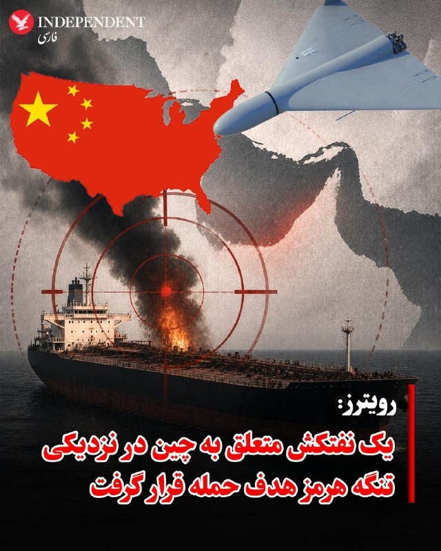
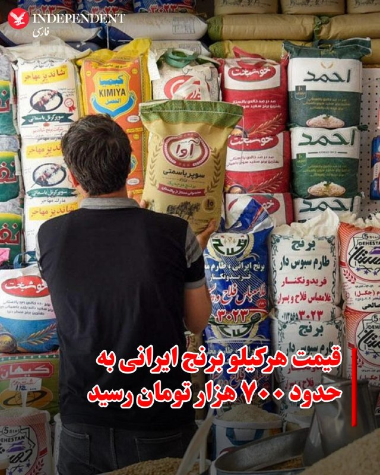
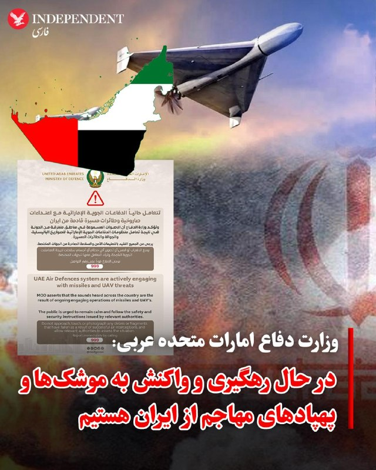
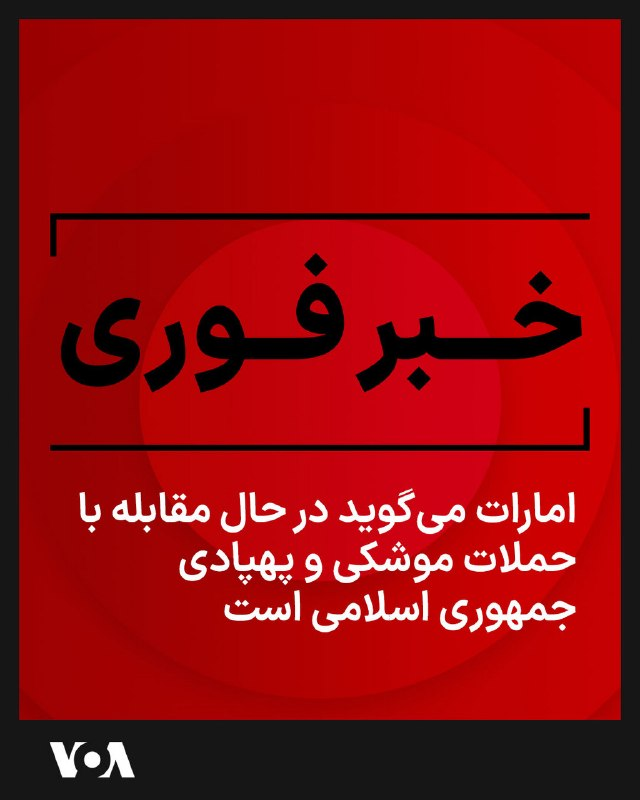

# خواننده تلگرام

<!-- MSG START -->

---
📅 بروزرسانی: 1405/02/18 06:52
---

## VahidOOnLine — post 238801

  

♦️خبرگزاری رویترز به نقل از رسانه چینی کایشین گزارش داد یک نفتکش حامل فرآورده‌های نفتی متعلق به چین روز دوشنبه در نزدیکی تنگه هرمز هدف حمله قرار گرفته است.
بر اساس این گزارش، آتش‌سوزی در عرشه این کشتی رخ داده و روی بدنه آن عبارت «مالک و خدمه چینی» نوشته شده بود. منابع امنیت دریایی گفته‌اند این کشتی احتمالا نفتکش و تانکر شیمیایی «جی‌وی اینوویشن» (JV Innovation) با پرچم جزایر مارشال بوده است.
این حادثه در نزدیکی سواحل امارات متحده عربی و حوالی بندر مینا صقر رخ داده و نخستین حمله گزارش‌شده به یک نفتکش چینی از زمان آغاز درگیری‌ها به شمار می‌رود.
رویترز همچنین گزارش داد تردد دریایی در تنگه هرمز پس از افزایش حملات در روزهای اخیر تقریبا متوقف شده و هزاران ملوان و صدها کشتی همچنان در خلیج فارس گرفتار مانده‌اند.
‌🇸🇦 Indypersian

🤖 @VahidOOnLine

## VahidOOnLine — post 238800

  

♦️ به موازات افزایش شدید قیمت کالاهای اساسی، قیمت هر کیلو برنج ایرانی به حدود ۷۰۰ هزار تومان رسیده است. پاسخ رئیس اتحادیه بنکداران مواد غذایی تهران به این افزایش شدید قیمت تنها این بوده است که «سیدن قیمت برنج ایرانی به حدود ۷۰۰ هزار تومان با شرایط فعلی عرضه و تقاضا همخوانی ندارد و واقع‌بینانه نیست.» نگاهی به فهرست قیمت‌ها در فروشگاه‌های آنلاین در ایران نشان می‌دهد که برنج طارم ممتاز دست‌کم کیلویی ۵۴۹ هزار تومان قیمت دارد و هر کیلو برنج ایرانی «بینام» کشت دوم، ۶۶۷ هزار تومان فروخته می‌شود. کف قیمت انواع دیگر برنج ایرانی نیز حدود ۴۰۰ هزار تومان است.
‌🇸🇦 Indypersian

🤖 @VahidOOnLine

## VahidOOnLine — post 238799

  

♦️وزارت دفاع امارات متحده عربی در ساعات اولیه بامداد جمعه اعلام کرد که نیروی هوایی در حال واکنش به تهدید‌های موشکی و پهپادی از سوی ایران است و تایید کرد که صداهایی که به گوش می‌رسد ناشی از عملیات رهگیری سیستم دفاعی است.
‌🇸🇦 Indypersian

🤖 @VahidOOnLine

## VahidOnline — post 75323

  

امارات متحده عربی اوایل روز جمعه اعلام کرد که سامانه‌های پدافند هوایی آن در حال مقابله با حملات پهپادی و موشکی از ایران هستند.
@VahidHeadline

📡 @VahidOnline

---
📅 بروزرسانی: 1405/02/18 06:42
---

## VahidOOnLine — post 238798

  

ترامپ پنج‌شنبه در واشینگتن‌دی‌سی به خبرنگاران گفت از وزیرخارجه آمریکا خواسته است در دیدار با پاپ خیلی محترمانه به او بگوید که اگر می‌خواهد از جمهوری اسلامی دفاع کند، باید بداند که حکومت ایران ۴۲ هزار معترض بی‌گناه را کشته است و همچنین باید بداند که تهران نباید سلاح هسته‌ای داشته باشد.
‌🏁 🇬🇧 IranintlTV

🤖 @VahidOOnLine

## mamlekate — post 103475

  <a href="telegram/content/mamlekate_103475_1778209937.mp4">🎬 Download video</a>

خبرنگار:بعد از حملات امروز، هنوز آتش‌بس با ایران برقراره؟
ترامپ: بله، برقراره! امروز خواستن به خورده بازی دربیارن، ما هم نابودشون کردیم. اگه آتش‌بس لغو شه خو‌دتون میفهمید!یه نور خیلی بزرگ از ایران بلند میشه که همه می‌بینن. بهتره زودتر توافق رو امضا کنن.

smn242424
@mamlekate

## IranIntlTV — post 336070

  

ترامپ پنج‌شنبه در واشینگتن‌دی‌سی به خبرنگاران گفت از وزیرخارجه آمریکا خواسته است در دیدار با پاپ خیلی محترمانه به او بگوید که اگر می‌خواهد از جمهوری اسلامی دفاع کند، باید بداند که حکومت ایران ۴۲ هزار معترض بی‌گناه را کشته است و همچنین باید بداند که تهران نباید سلاح هسته‌ای داشته باشد.
https://iranintl.com/202605081601

---
📅 بروزرسانی: 1405/02/18 06:32
---

## FarsiVOA — post 217160

  

⚡️امارات متحده عربی اوایل روز جمعه اعلام کرد که سامانه‌های پدافند هوایی آن در حال مقابله با حملات پهپادی و موشکی از ایران هستند و صداهایی که شنیده می‌شود مربوط به رهگیری‌ها است.
@FarsiVOA

---
📅 بروزرسانی: 1405/02/18 06:22
---

## VahidOOnLine — post 238797

  

وزارت دفاع امارات بامداد جمعه اعلام کرد پدافند هوایی این کشور در حال مقابله با حمله‌های موشکی و پهپادی از سوی ایران است و صداهای انفجار که در مناطق مختلف این کشور شنیده می‌شود، نتیجه فعال شدن سامانه‌های پدافند هوایی است.
‌🏁 🇬🇧 IranintlTV

🤖 @VahidOOnLine

## mamlekate — post 103473

  <a href="telegram/content/mamlekate_103473_1778208745.mp4">🎬 Download video</a>

آنچه گذشت

@mamlekate

## VahidOnline — post 75315

  <a href="telegram/content/VahidOnline_75315_1778208746.mp4">🎬 Download video</a>

ترامپ در گفت‌وگو با خبرنگاران در واشینگتن، با اشاره به درگیری جدید آمریکا و جمهوری اسلامی در تنگه هرمز گفت نیروهای جمهوری اسلامی با آمریکا «شوخی» کردند، اما آن‌ها ظرف حدود دو دقیقه نابود شدند.
او گفت: «امروز سه ناوشکن درجه‌یک آمریکا از تنگه عبور کردند. هر کشور دیگری در چنین شرایطی چنین کاری نمی‌کرد. به آن‌ ناوشکن‌ها موشک و پهپاد شلیک کردند و این قایق‌های احمقانه را به سویشان فرستادند. آن‌ها ظرف حدود دو دقیقه نابود شدند. نفتکششان هدف قرار گرفت. می‌دانید با نفتکش چه کردیم؟ نمی‌خواستیم شرایط حادی ایجاد شود، بنابراین سکان آن را زدیم و نفتکش شروع کرد به چرخیدن دور خودش. نباید امروز این کار را می‌کردند.»
ترامپ افزود: «همه موشک‌هایشان سرنگون شد. همه پهپادهایشان سرنگون شد و کسانی که آن‌ها را شلیک کردند نیز دیگر در میان ما نیستند.»
@VahidOOnLine
دونالد ترامپ، رئیس‌جمهوری آمریکا، روز پنج‌شنبه گفت پیشنهاد واشنگتن برای پایان دادن به درگیری با ایران، بسیار فراتر از یک «پیشنهاد یک‌صفحه‌ای» بوده است. سی‌ان‌ان نوشت، تهران همچنان در حال بررسی پیام‌های ارسال‌شده از سوی آمریکا از طریق میانجی‌های پاکستان است.
ترامپ در پاسخ به پرسشی درباره اینکه آیا ایران به آنچه «پیشنهاد یک‌صفحه‌ای» توصیف شده پاسخ داده است یا نه، این توصیف را رد کرد.
او به خبرنگاران گفت: «خب، این بیشتر از یک پیشنهاد یک‌صفحه‌ای است. این پیشنهادی بود که اساسا می‌گفت آنها سلاح هسته‌ای نخواهند داشت، گردوغبار هسته‌ای را به ما تحویل خواهند داد و بسیاری چیزهای دیگری را که ما می‌خواهیم.»
وقتی از او پرسیده شد آیا ایران با این شروط موافقت کرده است، ترامپ گفت: «آنها موافقت کرده‌اند. اما وقتی موافقت می‌کنند، خیلی معنا ندارد، چون روز بعد فراموش می‌کنند که موافقت کرده بودند.»
او افزود: «و می‌دانید، ما با مجموعه‌های متفاوتی از رهبران طرف هستیم.»
@VahidOOnLine
ترامپ در واشینگتن به خبرنگاران گفت: «مقام‌های ایران بهتر است خیلی سریع توافقشان را امضا کنند. مذاکرات بسیار خوب پیش می‌رود، اما باید بفهمند اگر امضا نشود، درد زیادی خواهند داشت. آن‌ها خیلی بیشتر از من می‌خواهند امضا کنند.»
ترامپ گفت: «ما اکنون در ایران با مجموعه‌های متفاوتی از رهبران سروکار داریم. وقتی درباره تغییر حکومت صحبت می‌کنید، آن‌ها مدام از تغییر حکومت حرف می‌زنند. ما حکومت اول را کنار زدیم. حکومت دوم را کنار زدیم. بیشتر حکومت سوم را کنار زدیم. بعد می‌گویند آیا این تغییر حکومت است؟ من فکر می‌کنم این نهایت تغییر حکومت است.»
@VahidOOnLine
دونالد ترامپ عصر پنج‌شنبه گفت: «ما هرگز اجازه نخواهیم داد» جمهوری اسلامی به سلاح هسته‌ای دست پیدا کند. آقای ترامپ گفت: «احتمال آن صفر است. خودشان هم این را می‌دانند و با آن موافقت کرده‌اند. حالا باید ببینیم آیا حاضرند توافق را امضا کنند یا نه.»
@VahidHeadline
ترامپ پنج‌شنبه به خبرنگاران گفت آمریکا با وجود تازه‌ترین تبادل آتش با جمهوری‌اسلامی در نزدیکی تنگه هرمز، در حال مذاکره با حکومت ایران است و افزود پاکستان از واشینگتن خواسته است در طول این گفت‌وگوها، طرح او برای اسکورت کشتی‌ها به خارج از این آبراه را دنبال نکند.
@VahidOOnLine

📡 @VahidOnline

## IranIntlTV — post 336069

  

وزارت دفاع امارات بامداد جمعه اعلام کرد پدافند هوایی این کشور در حال مقابله با حمله‌های موشکی و پهپادی از سوی ایران است و صداهای انفجار که در مناطق مختلف این کشور شنیده می‌شود، نتیجه فعال شدن سامانه‌های پدافند هوایی است.
https://iranintl.com/202605080824

---
📅 بروزرسانی: 1405/02/18 06:12
---

## Shin_Persian — post 5887

  

NCEMA UAE ✓ @NCEMAUAE
Fri, 08 May 2026 02:35:52 UTC

Air defense systems are currently responding to a missile threat. Please remain in a safe location and follow official channels for warnings and updates.

فارسی

سامانه‌های پدافند هوایی در حال حاضر در حال مقابله با یک تهدید موشکی هستند. لطفاً در مکان امن بمانید و کانال‌های رسمی را برای هشدارها و به‌روزرسانی‌ها دنبال کنید.

𝕏 · @shin_persian

## Shin_Persian — post 5886

Shin ✓ @hey_itsmyturn
Fri, 08 May 2026 02:35:30 UTC

NOW -
Seek shelter alert in #UAE 🇦🇪

فارسی

فوری -
هشدار پناه گرفتن در امارات متحده عربی (#UAE) 🇦🇪

𝕏 · @shin_persian

## BBCPersian — post 280459

🔻سازمان بین‌المللی دریانوردی: ۲۰ هزار ملوان پشت تنگه هرمز گرفتار شده‌اند

سازمان بین‌المللی دریانوردی سازمان ملل می‌گوید حدود هزار و پانصد کشتی و بیست هزار ملوان به دلیل ایجاد محدودیت در عبور از این تنگه توسط ایران در منطقه خلیج فارس گرفتار شده‌اند.

آرسنیو دومینگوئز، دبیرکل سازمان بین‌المللی دریانوردی سازمان ملل روز پنج‌شنبه در پاناما این خبر را اعلام کرد.

جنگ در خاورمیانه که در ۲۸ فوریه (۹ اسفند) با حمله اسرائیل و آمریکا علیه ایران آغاز شد، با تلافی تهران در سراسر منطقه و قطع عبور کشتی‌ها از تنگه هرمز، این مسیر حیاتی تجارت جهانی، همراه شد.

آرسنیو دومینگوئز در جریان نشست دریایی قاره آمریکا در پاناما گفت: «در حال حاضر، حدود ۲۰ هزار خدمه و نزدیک به ۱۵۰۰ کشتی در این منطقه گرفتار شده‌اند.»

به گفته این مقام، این ملوانان افراد بی‌گناهی هستند که در شرایط ژئوپلیتیکی خارج از کنترل خود گرفتار شده‌اند.

آمریکا روز دوشنبه از عملیاتی برای اسکورت کشتی‌ها از طریق این تنگه خبر داد، اما پس از یک روز آن را لغو کرد.

بر اساس گزارش‌ها ایران در حال بررسی پیشنهادهای واشنگتن برای چگونگی پایان دادن به درگیری و بازگشایی این آبراه است.

https://bbc.in/49jmR2Y
@BBCPersian

## BBCPersian — post 280458

🔻افزایش بهای نفت بلافاصله بعد از درگیری دریایی ایران و آمریکا

قيمت نفت در معاملات صبح جمعه در آسيا، پس از تبادل آتش ميان ايالات متحده امريکا و ايران در تنگه هرمز افزايش يافت.

ارتش امريکا اعلام کرد حملات ايران — شامل موشک‌ها، پهپادها و قايق‌های کوچک — را رهگيری کرده و زمانی که کشتی‌هایش در حال خروج از خليج فارس از طريق تنگه بودند، حملات متقابلی انجام داده است.

بهای نفت برنت، شاخص جهانی نفت، ۲/۳ درصد افزايش يافت و به ۱۰۲/۴۰ دلار در هر بشکه رسيد، در حالی که نفت خام معامله‌شده در امريکا نيز با رشد ۲/۱ درصدی به ۹۶/۸۰ دلار رسيد.

اين تشديد تنش، آتش‌بس ميان امريکا و ايران را بيش از پيش در معرض خطر قرار داده است؛ آتش‌بسی که دونالد ترامپ در ۲۱ آوريل برای فراهم شدن زمان بيشتر جهت مذاکرات صلح، آن را به‌طور نامحدود تمديد کرده بود.

https://bbc.in/3QRRzKp
@BBCPersian

---
📅 بروزرسانی: 1405/02/18 06:02
---

## mamlekate — post 103472

📝 ترامپ پس از حمله متقابل به بنادر جنوبی ایران: نوازشی دوستانه بود، در حال مذاکره هستیم

ارتش آمریکا پنجشنبه شب به دنبال حمله موشکی سپاه پاسداران به سه ناو آمریکایی در حال عبور از تنگه هرمز بنادر جنوبی ایران را هدف قرار داد.

پیام قبلی کانال:
t.me/mamlekate/103468

@mamlekate

## mamlekate — post 103471

📝 الو اصفهان ۱۸ اردیبهشت ساعت ۱:۲۳ صدای چندتا انفجار پشت سرهم اومد ۱:۵۶ هم یه انفجار دیگه

@mamlekate

---
📅 بروزرسانی: 1405/02/18 05:52
---

## BBCPersian — post 280449

🖋سوربهی کول
بخش مانیتورینگ بی‌بی‌سی

نتایج انتخابات اخیر ایالتی در هند از چند تحول مهم سیاسی خبر می‌دهد؛ تحولاتی که فراتر از مرزهای ایالتی بازتاب یافته و به تقویت جایگاه حزب حاکم بهاراتیا جاناتا (بی‌جی‌پی) در سطح فدرال انجامیده است.

میلیون‌ها نفر در انتخابات مجلس ایالتی در چهار ایالت هند، بنگال غربی، تامیل نادو، آسام و کرالا، و همچنین قلمروی تحت اداره فدرال پودوچری رای دادند.

نتایج اعلام ‌شده نشان داد در حالی که حزب کنگره که مهم‌ترین حزب مخالف دولت است، در برخی مناطق به پیروزی‌هایی دست پیدا کرد، اما حزب بی‌جی‌پی دستاوردهای مهمی داشته است.

در ایالت شرقی بنگال غربی که یکی از پایگاه‌های مهم اپوزیسیون محسوب می‌شود و در ۱۵ سال گذشته در اختیار حزب منطقه‌ای کنگره ترینامول بوده، بی‌جی‌پی پیروزی قاطعی به دست آورد و موفق شد یکی از آخرین سنگرهای سیاسی‌ را که پیش‌تر در فتح آن ناکام مانده بود، تصرف کند.

ادامه مطلب⬇️

📸GettyImages/ Reuters/ Hindustan
Times via Getty Images/ AFP via Getty Images/ NurPhoto via Getty Images/ India n media
https://bbc.in/48PNzQG
@BBCPersian

---
📅 بروزرسانی: 1405/02/18 05:42
---

## mwarmonitor — post 8667

  <a href="telegram/content/mwarmonitor_8667_1778206331.mp4">🎬 Download video</a>

📝 در فیلم «نورنبرگ» سکانس تکان‌دهنده‌ای وجود دارد که عمق استراتژی سیاسی را نشان می‌دهد: سیاستمداران آمریکایی برای محاکمه و اعدام سران نازی، به این نتیجه می‌رسند که تایید رئیس‌جمهور کافی نیست؛ آن‌ها برای همراه کردن افکار عمومی جهان، به تایید پاپ نیاز دارند.
وقتی پاپ در ابتدا با اعدام‌ها مخالفت می‌کند، نماینده آمریکا با یک جمله او را در بن‌بست اخلاقی قرار می‌دهد:
«ما در هر صورت نازی‌ها را نابود می‌کنیم، اما تاریخ قضاوت خواهد کرد که کلیسای کاتولیک در کنار آن‌ها ایستاد یا در برابرشان!»

🔸این فشار دیپلماتیک، پاپ را ناچار می‌کند تا برای حفظ وجهه تاریخی کلیسا، با دادگاه نورنبرگ موافقت کرده و آن را عملی برای خیرِ جهان بنامد.

🔸پیوند با واقعیت امروز
امروز نیز در میانه تنش‌ها، شاهد سفر مارکو روبیو به واتیکان و دیدار او با پاپ هستیم. این حرکت یادآور همان الگوی قدیمی است؛ تلاشی برای کسب مشروعیت اخلاقی و مذهبی در سطح بین‌الملل، پیش از برداشتن گام‌های بزرگتر در شطرنج سیاست. گویا تاریخ بار دیگر در حال تکرار است و سیاستمداران به دنبال جلب نظر «بالاترین مرجع» هستند.

@mwarmonitor

---
📅 بروزرسانی: 1405/02/18 05:32
---

## VahidOOnLine — post 238796

♦️دونالد ترامپ، رئیس‌جمهوری آمریکا، روز پنج‌شنبه در گفتگو با خبرنگاران اعلام کرد که از مارکو روبیو، وزیر خارجه خود، خواسته است در دیدار با پاپ لئو چهاردهم پیام روشنی را منتقل کند که پاپ باید بداند جمهوری اسلامی نباید به سلاح هسته‌ای دست یابد. او همچنین افزود پاپ باید در جریان باشد که این رژیم ۴۲ هزار معترض بی‌گناه و غیرمسلح را کشته است.
‌🇸🇦 Indypersian

🤖 @VahidOOnLine

## VahidOOnLine — post 238795

  

ترامپ در گفت‌وگو با خبرنگاران در واشینگتن، با اشاره به درگیری جدید آمریکا و جمهوری اسلامی در تنگه هرمز گفت نیروهای جمهوری اسلامی با آمریکا «شوخی» کردند، اما آن‌ها ظرف حدود دو دقیقه نابود شدند.
او گفت: «امروز سه ناوشکن درجه‌یک آمریکا از تنگه عبور کردند. هر کشور دیگری در چنین شرایطی چنین کاری نمی‌کرد. به آن‌ ناوشکن‌ها موشک و پهپاد شلیک کردند و این قایق‌های احمقانه را به سویشان فرستادند. آن‌ها ظرف حدود دو دقیقه نابود شدند. نفتکششان هدف قرار گرفت. می‌دانید با نفتکش چه کردیم؟ نمی‌خواستیم شرایط حادی ایجاد شود، بنابراین سکان آن را زدیم و نفتکش شروع کرد به چرخیدن دور خودش. نباید امروز این کار را می‌کردند.»
ترامپ افزود: «همه موشک‌هایشان سرنگون شد. همه پهپادهایشان سرنگون شد و کسانی که آن‌ها را شلیک کردند نیز دیگر در میان ما نیستند.»

‌🏁 🇬🇧 IranintlTV

🤖 @VahidOOnLine

## IranIntlTV — post 336068

  

ترامپ در گفت‌وگو با خبرنگاران در واشینگتن، با اشاره به درگیری جدید آمریکا و جمهوری اسلامی در تنگه هرمز گفت نیروهای جمهوری اسلامی با آمریکا «شوخی» کردند، اما آن‌ها ظرف حدود دو دقیقه نابود شدند.
او گفت: «امروز سه ناوشکن درجه‌یک آمریکا از تنگه عبور کردند. هر کشور دیگری در چنین شرایطی چنین کاری نمی‌کرد. به آن‌ ناوشکن‌ها موشک و پهپاد شلیک کردند و این قایق‌های احمقانه را به سویشان فرستادند. آن‌ها ظرف حدود دو دقیقه نابود شدند. نفتکششان هدف قرار گرفت. می‌دانید با نفتکش چه کردیم؟ نمی‌خواستیم شرایط حادی ایجاد شود، بنابراین سکان آن را زدیم و نفتکش شروع کرد به چرخیدن دور خودش. نباید امروز این کار را می‌کردند.»
ترامپ افزود: «همه موشک‌هایشان سرنگون شد. همه پهپادهایشان سرنگون شد و کسانی که آن‌ها را شلیک کردند نیز دیگر در میان ما نیستند.»

https://iranintl.com/202605083988

---
📅 بروزرسانی: 1405/02/18 05:22
---

---
📅 بروزرسانی: 1405/02/18 05:12
---

## VahidOOnLine — post 238794

  

ترامپ در واشینگتن به خبرنگاران گفت: «مقام‌های ایران بهتر است خیلی سریع توافقشان را امضا کنند. مذاکرات بسیار خوب پیش می‌رود، اما باید بفهمند اگر امضا نشود، درد زیادی خواهند داشت. آن‌ها خیلی بیشتر از من می‌خواهند امضا کنند.»
او افزود: «این بیش از یک پیشنهاد یک‌صفحه‌ای است. پیشنهادی است که اساسا می‌گوید آن‌ها سلاح هسته‌ای نخواهند داشت و گرد و غبار هسته‌ای و بسیاری چیزهای دیگری که ما می‌خواهیم را به ما تحویل خواهند داد. اما آنها وقتی موافقت می‌کنند، معنای زیادی ندارد، چون روز بعد فراموش می‌کنند که موافقت کرده‌اند.»
ترامپ گفت: «ما اکنون در ایران با مجموعه‌های متفاوتی از رهبران سروکار داریم. وقتی درباره تغییر حکومت صحبت می‌کنید، آن‌ها مدام از تغییر حکومت حرف می‌زنند. ما حکومت اول را کنار زدیم. حکومت دوم را کنار زدیم. بیشتر حکومت سوم را کنار زدیم. بعد می‌گویند آیا این تغییر حکومت است؟ من فکر می‌کنم این نهایت تغییر حکومت است.»

‌🏁 🇬🇧 IranintlTV

🤖 @VahidOOnLine

## IranIntlTV — post 336067

  

ترامپ در واشینگتن به خبرنگاران گفت: «مقام‌های ایران بهتر است خیلی سریع توافقشان را امضا کنند. مذاکرات بسیار خوب پیش می‌رود، اما باید بفهمند اگر امضا نشود، درد زیادی خواهند داشت. آن‌ها خیلی بیشتر از من می‌خواهند امضا کنند.»
او افزود: «این بیش از یک پیشنهاد یک‌صفحه‌ای است. پیشنهادی است که اساسا می‌گوید آن‌ها سلاح هسته‌ای نخواهند داشت و گرد و غبار هسته‌ای و بسیاری چیزهای دیگری که ما می‌خواهیم را به ما تحویل خواهند داد. اما آنها وقتی موافقت می‌کنند، معنای زیادی ندارد، چون روز بعد فراموش می‌کنند که موافقت کرده‌اند.»
ترامپ گفت: «ما اکنون در ایران با مجموعه‌های متفاوتی از رهبران سروکار داریم. وقتی درباره تغییر حکومت صحبت می‌کنید، آن‌ها مدام از تغییر حکومت حرف می‌زنند. ما حکومت اول را کنار زدیم. حکومت دوم را کنار زدیم. بیشتر حکومت سوم را کنار زدیم. بعد می‌گویند آیا این تغییر حکومت است؟ من فکر می‌کنم این نهایت تغییر حکومت است.»

https://iranintl.com/202605082826

## BBCPersian — post 280448

🔻مهمترین تحولات روز پنجشنبه
با خلاصه‌ای از مهمترین تحولات ۲۴ ساعت گذشته، پوشش زنده خود از آخرین خبرهای ایران و منطقه را به صفحه جدید ویژه روز جمعه - ۱۸ اردیبهشت - منتقل می‌کنیم. از همراهی شما سپاسگزاریم.

سر خط تحولات روز پنجشنبه اینها بودند:

🔹قرارگاه خاتم الانبیاء: آمریکا با همکاری چند کشور منطقه حملاتی به نفتکش‌های ایرانی صورت داد که با آن مقابله کردیم.
🔹سنتکام: ناوشکن‌های ما «در پاسخ به حملات پهپادی و موشکی ایران» آتش گشودند
🔹ترامپ: سه ناو ما از تنگه هرمز عبور کردند، آتش‌بس همچنان پابرجاست
🔹واشنگتن‌پست: منابع اطلاعاتی آمریکا می‌گویند ایران ماه‌ها می‌تواند در برابر محاصره بنادرش مقاومت کند
آمریکا معاون وزیر نفت عراق را به خاطر کمک به دور زدن تحریم‌های ایران تحریم کرد
🔹طاهر اندرآبی، سخنگوی وزارت خارجه پاکستان ابراز امیدواری کرده است که توافق میان آمریکا و ایران به‌زودی اعلام خواهد شد
🔹مسعود پزشکیان، رئیس‌جمهور ایران، در سخنانی از دیدار خود با مجتبی خامنه‌ای،‌ رهبر جمهوری اسلامی، خبر داد
🔹در شصت و نهمین روز قطع اینترنت، مردم داخل ایران ۱۶۳۲ ساعت است که به طور گسترده امکان دسترسی به اینترنت بین‌المللی ندارند
🔹یک منبع سعودی روز پنجشنبه گزارش رسانه‌های آمریکایی در مورد نقش ریاض در دستور توقف عملیات نظامی آمریکا در تنگه هرمز را رد کرد

https://bbc.in/4tY7aXg
@BBCPersian

---
📅 بروزرسانی: 1405/02/18 05:03
---

---
📅 بروزرسانی: 1405/02/18 04:58
---

## VahidOOnLine — post 238793

  

♦️دونالد ترامپ، رئیس‌جمهوری آمریکا، روز پنج‌شنبه گفت پیشنهاد واشنگتن برای پایان دادن به درگیری با ایران، بسیار فراتر از یک «پیشنهاد یک‌صفحه‌ای» بوده است. سی‌ان‌ان نوشت، تهران همچنان در حال بررسی پیام‌های ارسال‌شده از سوی آمریکا از طریق میانجی‌های پاکستان است.
ترامپ در پاسخ به پرسشی درباره اینکه آیا ایران به آنچه «پیشنهاد یک‌صفحه‌ای» توصیف شده پاسخ داده است یا نه، این توصیف را رد کرد.
او به خبرنگاران گفت: «خب، این بیشتر از یک پیشنهاد یک‌صفحه‌ای است. این پیشنهادی بود که اساسا می‌گفت آنها سلاح هسته‌ای نخواهند داشت، گردوغبار هسته‌ای را به ما تحویل خواهند داد و بسیاری چیزهای دیگری را که ما می‌خواهیم.»
وقتی از او پرسیده شد آیا ایران با این شروط موافقت کرده است، ترامپ گفت: «آنها موافقت کرده‌اند. اما وقتی موافقت می‌کنند، خیلی معنا ندارد، چون روز بعد فراموش می‌کنند که موافقت کرده بودند.»
او افزود: «و می‌دانید، ما با مجموعه‌های متفاوتی از رهبران طرف هستیم.»
رسانه‌های جمهوری اسلامی گزارش داده‌اند که تهران هنوز پاسخ نهایی خود به پیشنهاد آمریکا را نهایی نکرده و همچنان در حال بررسی «پیام‌های» آمریکاست که از طریق میانجی‌های پاکستان منتقل شده‌اند.
‌🇸🇦 Indypersian

🤖 @VahidOOnLine

## VahidOOnLine — post 238792

  

♦️ دونالد ترامپ، رئیس‌جمهوری آمریکا، روز پنج‌شنبه گفت آتش‌بس با ایران همچنان برقرار است. او گفت، اگر آتش‌بس پایان یافته بود، این موضوع کاملا آشکار می‌شد.
ترامپ در پاسخ به پرسش خبرنگاران در توقفی کوتاه نزدیک استخر یادبود لینکلن در واشنگتن گفت: «اگر آتش‌بسی در کار نباشد، لازم نیست کسی به شما بگوید. کافی است به یک درخشش عظیم که از ایران بیرون می‌آید نگاه کنید.»
رئیس‌جمهور آمریکا هم‌زمان تنش‌های اخیر را کم‌اهمیت جلوه داد و از واکنش نظامی آمریکا تمجید کرد.
او گفت: «آنها امروز با ما درگیر شدند. ما هم نابودشان کردیم. آنها مزاحم شدند؛ من اسمش را یک مزاحمت کوچک می‌گذارم.»
ترامپ سپس گفت مذاکرات با ایران همچنان ادامه دارد، هرچند نتیجه آن نامشخص است.
او افزود: «ممکن است توافق با ایران انجام نشود، اما ممکن هم هست هر روزی اتفاق بیفتد.»
اظهارات ترامپ پس از آن مطرح شد که فرماندهی مرکزی آمریکا (سنتکام) اعلام کرد نیروهای آمریکایی تأسیسات نظامی جمهوری اسلامی را که مسئول حملات موشکی، پهپادی و قایق‌های تندرو علیه ناوشکن‌های نیروی دریایی آمریکا در حال عبور از تنگه هرمز بودند، هدف قرار داده‌اند.
‌🇸🇦 Indypersian

🤖 @VahidOOnLine

## mwarmonitor — post 8666

🇺🇸سنتکام از کشتی‌های جنگی ایالات متحده در حین عبور از تنگه هرمز محافظت می‌کند
فرماندهی مرکزی ایالات متحده (U.S. Central Command)

🔴تامپا، فلوریدا — نیروهای ایالات متحده حملات بی‌دلیل ایران را دفع کردند و در حالی که ناوشکن‌های موشک‌انداز نیروی دریایی آمریکا در تاریخ ۷ می (۱۷ اردیبهشت) در حال عبور از تنگه هرمز به سمت دریای عمان بودند، با حملات دفاع از خود به آن‌ها پاسخ دادند.
🔸نیروهای ایرانی همزمان با عبور کشتی‌های USS Truxtun (DDG 103)، USS Rafael Peralta (DDG 115) و USS Mason (DDG 87) از این آبراه بین‌المللی، چندین موشک، پهپاد و قایق‌های کوچک را به کار گرفتند. به هیچ‌یک از دارایی‌های ایالات متحده آسیبی وارد نشد.
🔸فرماندهی مرکزی ایالات متحده (سنتکام) تهدیدات ورودی را از بین برد و تأسیسات نظامی ایران که مسئول حمله به نیروهای آمریکایی بودند، از جمله سایت‌های پرتاب موشک و پهپاد، مراکز فرماندهی و کنترل، و گره‌های اطلاعاتی، نظارتی و شناسایی را هدف قرار داد.
🔸سنتکام به دنبال تشدید تنش نیست، اما همچنان مستقر و آماده محافظت از نیروهای آمریکایی باقی می‌ماند.

@mwarmonitor

---
📅 بروزرسانی: 1405/02/18 04:52
---

## VahidOOnLine — post 238791

♦️دونالد ترامپ، رئیس‌جمهوری آمریکا، بامداد جمعه ۱۸ اردیبهشت‌ماه، ساعاتی پس از تبادل آتش با جمهوری اسلامی گفت افرادی که موشک‌ها و پهپادها را به سمت ناوشکن‌های آمریکا شلیک کرده بودند، «دیگر زنده نیستند.»

ترامپ گفت سه ناوشکن آمریکا بدون آسیب از تنگه هرمز عبور کرده‌اند، همه موشک‌ها رهگیری و همه پهپادها منهدم شده‌اند و قایق‌های تندروی ایرانی نیز «ظرف حدود دو دقیقه» نابود شدند. او همچنین گفت آمریکا با هدف قرار دادن سکان یک نفتکش، آن را از کنترل خارج کرده است.

ترامپ افزود: «آن‌ها نباید امروز این کار را می‌کردند. فکر می‌کردیم ممکن است چنین کاری بکنند؛ مطمئن نبودیم، اما آماده بودیم.»
‌🇸🇦 Indypersian

🤖 @VahidOOnLine

## VahidOOnLine — post 238790

  

♦️عبدالعزیز الواصل، نماینده دائم عربستان سعودی در سازمان ملل، هشدار داد هرگونه تهدید علیه کشتیرانی در تنگه هرمز مستقیما بر ثبات بازارهای جهانی و زنجیره‌های تامین بین‌المللی تاثیر می‌گذارد.
او در نشست مشترک کشورهای شورای همکاری خلیج فارس و ایالات متحده آمریکا تاکید کرد تنگه هرمز یکی از حیاتی‌ترین مسیرهای دریایی برای تجارت بین‌المللی و امنیت انرژی جهانی است.
الواصل همچنین گفت اختلال در عبور و مرور دریایی، بازار جهانی انرژی و انتقال کالاهای اساسی، از جمله مواد غذایی، دارو و کمک‌های بشردوستانه را تحت تاثیر قرار داده و می‌تواند برای کشورهای وابسته به واردات پیامدهای جدی داشته باشد.
کشورهای شورای همکاری خلیج فارس و آمریکا همزمان در سازمان ملل خواستار حمایت از پیش‌نویس قطعنامه‌ای شدند که از جمهوری اسلامی می‌خواهد حملات و مین‌گذاری در تنگه هرمز را متوقف کند.
‌🇸🇦 Indypersian

🤖 @VahidOOnLine

## VahidOOnLine — post 238789

♦️کارولین لویت، سخنگوی کاخ سفید، روز پنجشنبه از تولد دخترش «ویویانا» خبر داد. پیش از این،آز پرلمن، ذهن‌خوان مشهور اسراییلی-آمریکایی در جریان ضیافت شام خبرنگاران کاخ سفید نام این نوزاد را به درستی حدس زده بود. این پیش‌بینی درست در لحظاتی انجام شد که با ورود یک فرد مسلح به سالن، دونالد ترامپ و مقام‌های دولت از محل خارج شدند. پرلمن تاکید کرد که نام را روی کاغذ درست نوشته بود اما به دلیل شباهت با نام دختر خودش، آن را اشتباه تلفظ کرد.
لویت که از ۴ اردیبهشت به مرخصی زایمان رفته بود، پس از حادثه تیراندازی در مراسم شام خبرنگاران کاخ سفید در ۷ اردیبهشت، بار دیگر در جمع خبرنگاران حاضر شد. او در آن زمان گفته بود امیدوار است آن نشست آخرین حضورش پیش از پایان مرخصی زایمان باشد. در غیاب لیویت، اعضای کابینه از جمله مارکو روبیو مسئولیت پاسخگویی به رسانه‌ها را بر عهده گرفته‌اند.
‌🇸🇦 Indypersian

🤖 @VahidOOnLine

## mwarmonitor — post 8665

سه ناوشکن آمریکایی تراز اول، همین حالا با موفقیت کامل و در حالی که زیر آتش بودند، از تنگه هرمز عبور کردند. هیچ آسیبی به این سه ناوشکن وارد نشد، اما آسیب شدیدی به مهاجمان ایرانی وارد گشت. آن‌ها به همراه تعداد بی‌شماری از قایق‌های کوچک که برای جایگزینی نیروی دریایی کاملاً از هم پاشیده‌شان استفاده می‌شوند، به‌طور کامل نابود شدند. این قایق‌ها سریع و بااقتدار به قعر دریا رفتند.
موشک‌هایی به سمت ناوشکن‌های ما شلیک شد که به سادگی ساقط شدند. به همین ترتیب، پهپادها آمدند و در میان زمین و آسمان خاکستر شدند. آن‌ها بسیار زیبا به درون اقیانوس سقوط کردند، درست مانند سقوط یک پروانه به سمت گورش! یک کشور معمولی اجازه می‌داد این ناوشکن‌ها عبور کنند، اما ایران یک کشور معمولی نیست. آن‌ها توسط دیوانگان رهبری می‌شوند و اگر فرصت استفاده از سلاح هسته‌ای را داشتند، بدون تردید این کار را می‌کردند — اما آن‌ها هرگز چنین فرصتی نخواهند داشت.
همان‌طور که امروز دوباره آن‌ها را از پا درآوردیم، اگر توافق‌نامه‌شان را سریعاً امضا نکنند، در آینده آن‌ها را بسیار سخت‌تر و با خشونت بسیار بیشتر در هم خواهیم کوبید! سه ناوشکن ما با خدمه فوق‌العاده‌شان، اکنون به محاصره دریایی ما که به راستی یک «دیوار فولادی» است، ملحق خواهند شد.

رئیس‌جمهور دونالد جی. ترامپ

@mwarmonitor

---
📅 بروزرسانی: 1405/02/18 04:43
---

## VahidOOnLine — post 238788

  

ترامپ پنج‌شنبه در واشینگتن‌دی‌سی به خبرنگاران گفت از وزیرخارجه آمریکا خواسته است در دیدار با پاپ خیلی محترمانه به او بگوید که اگر می‌خواهد از جمهوری اسلامی دفاع کند، باید بداند که حکومت ایران ۴۲ هزار معترض بی‌گناه را کشته است و همچنین باید بداند که تهران نباید سلاح هسته‌ای داشته باشد.
‌🏁 🇬🇧 IranintlTV

🤖 @VahidOOnLine

## IranIntlTV — post 336066

  

ترامپ پنج‌شنبه در واشینگتن‌دی‌سی به خبرنگاران گفت از وزیرخارجه آمریکا خواسته است در دیدار با پاپ خیلی محترمانه به او بگوید که اگر می‌خواهد از جمهوری اسلامی دفاع کند، باید بداند که حکومت ایران ۴۲ هزار معترض بی‌گناه را کشته است و همچنین باید بداند که تهران نباید سلاح هسته‌ای داشته باشد.
https://iranintl.com/202605081601

## FarsiVOA — post 217159

  

⚡️دونالد ترامپ عصر پنج‌شنبه گفت: «ما هرگز اجازه نخواهیم داد» جمهوری اسلامی به سلاح هسته‌ای دست پیدا کند. آقای ترامپ گفت: «احتمال آن صفر است. خودشان هم این را می‌دانند و با آن موافقت کرده‌اند. حالا باید ببینیم آیا حاضرند توافق را امضا کنند یا نه.»
@FarsiVOA

---
📅 بروزرسانی: 1405/02/18 04:32
---

## FarsiVOA — post 217158

🔺دونالد ترامپ: نیروی دریایی جمهوری اسلامی زمانی ۱۵۹ کشتی داشت حالا چند قایق‌ تندرو دارد که مقداری سلاح جلوی آن‌ها نصب شده است

▪️دونالد ترامپ، رئیس جمهوری آمریکا، عصر پنج‌شنبه ۱۷ اردیبهشت، ساعاتی پس از حمله نیروهای جمهوری اسلامی به سه کشتی آمریکایی گفت «ارتش ما در سراسر جهان فوق‌العاده عمل می‌کند. آن‌ها کارشان را به شکل باورنکردنی انجام می‌دهند. ما در حال مذاکره با ایرانی‌ها هستیم. احتمالاً شنیدید که امروز سه ناوشکن خودمان را از میان شرایط بسیار سخت عبور دادیم و حسابی آن‌ها (نیروهای جمهوری اسلامی) را در هم کوبیدیم.»

⬇️ بیشتر بخوانید:
https://ir.voanews.com/a/8147948.html
@FarsiVOA

---
📅 بروزرسانی: 1405/02/18 04:22
---

## VahidOOnLine — post 238787

  

♦️دونالد ترامپ، رئیس‌جمهوری آمریکا، بامداد جمعه ۱۸ اردیبهشت‌ماه پس از حمله به اهداف و تاسیسات نظامی جمهوری اسلامی، در پاسخ به خبرنگاران گفت آمریکا همچنان با جمهوری اسلامی در حال مذاکره است.

او همچنین گفت سه ناوشکن آمریکایی از میان «درگیری‌های سنگین» در تنگه هرمز عبور کرده‌اند و هیچ آسیبی به ناوشکن‌ها و نیروهای آمریکایی وارد نشده است.

ترامپ افزود نیروهای جمهوری اسلامی به سمت ناوشکن‌ها شلیک کرده‌اند و آمریکا نیز پاسخ داده است. او گفت: «قدرت آتش ما خیلی بیشتر از آن‌ها بود و حسابی نابودشان کردیم.» ترامپ همچنین گفت تعداد زیادی از قایق‌های کوچک و تندروی ایرانی که به گفته او روی آن‌ها سلاح نصب شده بود، منهدم شدند.
‌🇸🇦 Indypersian

🤖 @VahidOOnLine

---
📅 بروزرسانی: 1405/02/18 04:12
---

---
📅 بروزرسانی: 1405/02/18 04:02
---

## VahidOOnLine — post 238786

  

ترامپ پنج‌شنبه به خبرنگاران گفت آمریکا با وجود تازه‌ترین تبادل آتش با جمهوری‌اسلامی در نزدیکی تنگه هرمز، در حال مذاکره با حکومت ایران است و افزود پاکستان از واشینگتن خواسته است در طول این گفت‌وگوها، طرح او برای اسکورت کشتی‌ها به خارج از این آبراه را دنبال نکند.
‌🏁 🇬🇧 IranintlTV

🤖 @VahidOOnLine

## IranIntlTV — post 336065

  

ترامپ پنج‌شنبه به خبرنگاران گفت آمریکا با وجود تازه‌ترین تبادل آتش با جمهوری‌اسلامی در نزدیکی تنگه هرمز، در حال مذاکره با حکومت ایران است و افزود پاکستان از واشینگتن خواسته است در طول این گفت‌وگوها، طرح او برای اسکورت کشتی‌ها به خارج از این آبراه را دنبال نکند.
https://iranintl.com/202605088751

## BBCPersian — post 280447

💢این یک تشدید تنش جدی پس از چهار هفته آتش‌بس است حتی با وجود تاکید ترامپ بر حفظ آتش‌بس
🖌تام بیتمن - خبرنگار بی‌‌بی‌سی در امور وزارت خارجه آمریکا

اين يک تشديد تنش قابل توجه است که آتش‌بس چهار هفته‌ای ميان ايالات متحده امريکا و ايران را بيش از پيش در معرض خطر قرار داده، هرچند هنوز مشخص نيست چه طرفی نخستين شليک را انجام داده است.

پنتاگون می‌گويد ناوشکن‌های نيروی دريايی آمريکا که در حال خروج از خليج فارس از طريق تنگه هرمز بودند، هدف حمله «تحريک‌نشده» موشک‌ها، پهپادها و قايق‌های کوچک ايرانی قرار گرفتند. آمريکا در پاسخ، تاسيسات نظامی ايران از جمله محل‌های پرتاب موشک و مراکز فرماندهی را هدف قرار داده است.

اين موضوع احتمالا توضيح‌دهنده گزارش‌های ايران درباره انفجارها در جزيره قشم و شهر بندری بندرعباس است.

اما نيروی دريايی سپاه پاسداران انقلاب اسلامی روايت متفاوتی ارائه داده و می‌گويد امريکا با آنچه «تجاوز» به يک نفتکش ايرانی و يک شناور ديگر خوانده، آغازگر درگيری بوده و ايران در واکنش، به سمت کشتی‌های امريکايی موشک و پهپاد شليک کرده است.

مقام‌های آمريکايی تلاش می‌کنند اين حادثه را يک تبادل آتش محدود جلوه دهند که به معنای از سرگيری جنگ نيست، اما تهران آن را نقض آتش‌بس از سوی امريکا توصيف می‌کند.

اين دور جديد درگيری‌ها پس از افزايش تنش ميان واشنگتن و متحدان عرب آن در خليج فارس رخ داده است؛ برخی از اين کشورها معتقدند امريکا در برابر حملات ايران به امارات متحده عربی در اوايل هفته جاری، واکنش به اندازه کافی شديدی نشان نداده است. اين حملات در پاسخ به عمليات نظامی — که اکنون متوقف شده — از سوی دونالد ترامپ برای بازگشايی اجباری تنگه هرمز انجام شده بود.

https://bbc.in/4tlxV6Q
@BBCPersian

---
📅 بروزرسانی: 1405/02/18 03:52
---

## BBCPersian — post 280446

  <a href="telegram/content/BBCPersian_280446_1778199739.mp4">🎬 Download video</a>

🔻خبرگزاری های فارس و تسنیم، نزدیک به سپاه پاسداران، بامداد جمعه تصاویری ویدیویی از لحظه شلیک موشک‌هایی را منتشر کردند که به ادعای آنها به سوی ناوهای آمریکایی در تنگه هرمز و سواحل مجاور قشم و بندرعباس شلیک شده است.

بی‌بی‌سی قادر به تایید درستی و تاریخ دقیق ین تصاویر نیست اما سنتکام مدعی شده است که سه ناو درگیر آن در این منازعه، آسیبی ندیده‌اند.

📸FARS
@BBCPersian

---
📅 بروزرسانی: 1405/02/18 03:42
---

---
📅 بروزرسانی: 1405/02/18 03:32
---

## VahidOOnLine — post 238777

بعضی اسم‌ها را فقط خانواده‌ها صدا نمی‌زنند؛ خیابان هم آن‌ها را به خاطر می‌سپارد.
از اسلامشهر تا اصفهان، از کرمانشاه تا گلستان، ۸ جوان دیگر که در انقلاب ملی کشته شدند؛
یکی در راه رسیدن به مادرش،
یکی روبه‌روی مقر سپاه،
یکی با گلوله‌ای به پشت سر،
و یکی با صدایی که دیگر به ترانه نرسید.
مهدی خلیلی، علیرضا قلعه‌قافی، آرمین عباسی، ارمیا لاچیانی، پویا رستمی، سامان نظری، ماهان قدمی، امیرارسلان قهرمانی
جاویدنامان انقلاب ملی ایرانیان؛
نام‌هایی که حکومت خواست در آمار گم شوند، اما در حافظه مردم ماندند.
#جاویدنامان_انقلاب_ملی_ایرانیان
‌🏁 🇬🇧 IranintlTV

🤖 @VahidOOnLine

## IranIntlTV — post 336056

بعضی اسم‌ها را فقط خانواده‌ها صدا نمی‌زنند؛ خیابان هم آن‌ها را به خاطر می‌سپارد.
از اسلامشهر تا اصفهان، از کرمانشاه تا گلستان، ۸ جوان دیگر که در انقلاب ملی کشته شدند؛
یکی در راه رسیدن به مادرش،
یکی روبه‌روی مقر سپاه،
یکی با گلوله‌ای به پشت سر،
و یکی با صدایی که دیگر به ترانه نرسید.
مهدی خلیلی، علیرضا قلعه‌قافی، آرمین عباسی، ارمیا لاچیانی، پویا رستمی، سامان نظری، ماهان قدمی، امیرارسلان قهرمانی
جاویدنامان انقلاب ملی ایرانیان؛
نام‌هایی که حکومت خواست در آمار گم شوند، اما در حافظه مردم ماندند.
#جاویدنامان_انقلاب_ملی_ایرانیان

---
📅 بروزرسانی: 1405/02/18 03:22
---

## VahidOOnLine — post 238776

  <a href="telegram/content/VahidOOnLine_238776_1778197950.mp4">🎬 Download video</a>

♦️خبرگزاری تسنیم، وابسته به سپاه پاسداران، بامداد جمعه ۱۸ اردیبهشت‌ماه تصاویری از شلیک موشک‌ به سمت ناو آمریکا منتشر کرد.

دونالد ترامپ، رئیس‌جمهوری آمریکا، همزمان اعلام کرد سه ناوشکن آمریکایی در حالی که زیر آتش موشک و پهپاد قرار داشتند، بدون آسیب از تنگه هرمز عبور کردند و موشک‌ها و پهپادهای شلیک‌شده به سمت آن‌ها رهگیری و منهدم شدند. او همچنین گفت قایق‌های تندروی ایرانی در جریان این درگیری‌ها غرق شدند و سه ناوشکن آمریکایی دوباره به محاصره دریایی آمریکا در منطقه بازخواهند گشت.
‌🇸🇦 Indypersian

🤖 @VahidOOnLine

## VahidOOnLine — post 238775

  

سخنگوی وزارت خارجه جمهوری اسلامی با انتشار فیلمی از بازسازی پل بی-۱ کرج که در جنگ کنونی تخریب شد، ابیاتی از شعر «دوباره می‌سازمت وطن» سیمین بهبهانی را بازنویسی کرد. آثار بهبهانی تحت حاکمیت جمهوری اسلامی با ممنوعیت مواجه بود و او به‌طور مداوم مورد احضار و بازجویی قرار می‌گرفت.
‌🏁 🇬🇧 IranintlTV

🤖 @VahidOOnLine

## IranIntlTV — post 336055

  

سخنگوی وزارت خارجه جمهوری اسلامی با انتشار فیلمی از بازسازی پل بی-۱ کرج که در جنگ کنونی تخریب شد، ابیاتی از شعر «دوباره می‌سازمت وطن» سیمین بهبهانی را بازنویسی کرد. آثار بهبهانی تحت حاکمیت جمهوری اسلامی با ممنوعیت مواجه بود و او به‌طور مداوم مورد احضار و بازجویی قرار می‌گرفت.
https://iranintl.com/202605073608

---
📅 بروزرسانی: 1405/02/18 03:11
---

## Iliaen — post 4433

نیروی دریایی سپاه بندر خمیر (هرمزگان)، شرکت و مجموعه کشتی‌سازی جزیره قشم، ساختمان هماهنگی سپاه در اسکله بهمن جزیره قشم، سایت موشکی سیریک هرمزگان و پایگاه هوایی بندرعباس هدف حملات ایالات متحده در حملات ساعات گذشته بودند.

همچنین تا این لحظه (ساعت ۰۳:۰۷ صبح جمعه)، گزارش‌ها از مشاهده و تداوم حضور پهپادهای شناسایی در خط ساحلی جنوب (بندرعباس، سیریک و بندر جاسک) حکایت دارد.

@iliaen

---
📅 بروزرسانی: 1405/02/18 03:02
---

## IranIntlTV — post 336054

  <a href="telegram/content/IranIntlTV_336054_1778196738.mp4">🎬 Download video</a>

بی‌عدالتی؛ میراث ۴۷ سالهٔ جمهوری اسلامی

مردم ایران در ۴۷ سال گذشته، هرگز طعم یک دستگاه قضایی عادل و حامی مردم را نچشیده‌اند و امروز، بی‌عدالتی را در همه‌چیز می‌بینند؛ از اینترنت طبقاتی و گرانی افسارگسیخته گرفته تا بیکاری، فروش وسایل خانه برای بقا و نابودی بازار کار.

کامبیز حسینی در «برنامه» نگاهی گذرا به این موضوع دارد.

«یک ایران صدای شما را می‌شنود»
دوشنبه تا پنجشنبه ۱۱ شب تهران
از تلویزیون ایران اینترنشنال

تماشای نسخه کامل این قسمت از «برنامه» در یوتیوب:
https://youtu.be/bCVx3k3JBjA
@iranintltv

## IranIntlTV — post 336053

  <a href="telegram/content/IranIntlTV_336053_1778196741.mp4">🎬 Download video</a>

آریا از تهران: خانوادهٔ جان‌فداها را حمایت کنیم؛ بیشتر آن‌ها نان‌آور خانواده بودند

«یک ایران صدای شما را می‌شنود»
دوشنبه تا پنجشنبه ۱۱ شب تهران
از تلویزیون ایران اینترنشنال

تماشای نسخه کامل این قسمت از «برنامه» در یوتیوب:
https://youtu.be/bCVx3k3JBjA
@iranintltv

## IranIntlTV — post 336052

  <a href="telegram/content/IranIntlTV_336052_1778196742.mp4">🎬 Download video</a>

مراد ویسی: حملهٔ آمریکا یعنی می‌خواهد به جمهوری اسلامی بگوید فقط تو نیستی که شلیک می‌کنی

«یک ایران صدای شما را می‌شنود»
دوشنبه تا پنجشنبه ۱۱ شب تهران
از تلویزیون ایران اینترنشنال

تماشای نسخه کامل این قسمت از «برنامه» در یوتیوب:
https://youtu.be/bCVx3k3JBjA
@iranintltv

## FarsiVOA — post 217157

  <a href="telegram/content/FarsiVOA_217157_1778196744.mp4">🎬 Download video</a>

⚡️گزارش‌ها از انفجارها در غرب تهران
@FarsiVOA

## BBCPersian — post 280445

  

🔻دونالد ترامپ، رئیس جمهور آمریکا، در نخستین واکنش به درگیری ساعاتی پیش در تنگه هرمز، اعلام کرد «سه ناوشکن «در کلاس جهانی» امريکا با موفقيت از تنگه هرمز عبور کرده‌اند، آن هم در حالی که تحت آتش قرار داشتند.»

آقای ترامپ مدعی شد «هيچ آسيبی به اين سه ناوشکن وارد نشده، اما «خسارات بزرگی» به مهاجمان ايرانی وارد شده است.»

رئیس جمهور آمریکا همچنین تاکید کرده با وجود این درگیری دریایی، از نظر او آتش‌بس میان این کشور و ایران همچنان پابرجاست.

این در حالی است که ایران می‌گوید توانسته «خسارات جدی» به نیروهای آمریکایی وارد کند.

با این حال دونالد ترامپ در پستی که پنجشنبه شب در شبکه اجتماعی خود منتشر کرد گفت «نيروهای ايرانی «به طور کامل نابود شدند»، همراه با شمار زيادی از قايق‌های کوچک که به گفته او برای جايگزينی نيروی دريايی «کاملا از بين رفته» ايران استفاده می‌شوند.

📸EPA/Shutterstock
https://bbc.in/4cVMhGi
@BBCPersian

---
📅 بروزرسانی: 1405/02/18 02:52
---

## IranIntlTV — post 336051

  <a href="telegram/content/IranIntlTV_336051_1778196132.mp4">🎬 Download video</a>

مهدی از مازندران: بسیجی‌ها، قیمت اجناس را نمی‌بینید؟ واکنش شما نسبت به گرانی چیست؟

«یک ایران صدای شما را می‌شنود»
دوشنبه تا پنجشنبه ۱۱ شب تهران
از تلویزیون ایران اینترنشنال

تماشای نسخه کامل این قسمت از «برنامه» در یوتیوب:
https://youtu.be/bCVx3k3JBjA
@iranintltv

## IranIntlTV — post 336050

  <a href="telegram/content/IranIntlTV_336050_1778196133.mp4">🎬 Download video</a>

بهمن از بندرعباس: نیم ساعت پیش صدای آخرین انفجار آمد، در دوران جنگ هم پدافند چیزی نزد

«یک ایران صدای شما را می‌شنود»
دوشنبه تا پنجشنبه ۱۱ شب تهران
از تلویزیون ایران اینترنشنال

تماشای نسخه کامل این قسمت از «برنامه» در یوتیوب:
https://youtu.be/bCVx3k3JBjA
@iranintltv

## IranIntlTV — post 336049

  <a href="telegram/content/IranIntlTV_336049_1778196134.mp4">🎬 Download video</a>

مراد ویسی: دیپلمات‌های ایران و آمریکا با هم حرف می‌زنند، اما نظامی‌ها به هم موشک می‌زنند

«یک ایران صدای شما را می‌شنود»
دوشنبه تا پنجشنبه ۱۱ شب تهران
از تلویزیون ایران اینترنشنال

تماشای نسخه کامل این قسمت از «برنامه» در یوتیوب:
https://youtu.be/bCVx3k3JBjA
@iranintltv

## IranIntlTV — post 336048

  <a href="telegram/content/IranIntlTV_336048_1778196136.mp4">🎬 Download video</a>

سنتکام اعلام کرد نیروهای آمریکایی حملات موشکی، پهپادی و قایق‌های کوچک جمهوری اسلامی را رهگیری کرده و به منابع این حمله‌ها در ایران حمله کرده‌اند.

سنتکام تاکید کرد به‌دنبال تشدید تنش نیست، اما همچنان در موقعیت مناسب قرار دارد.

گزارش نیلوفر منصوری، خبرنگار ایران‌اینترنشنال
@iranintltv

## FarsiVOA — post 217156

⚡️در روزگاری که اینترنت دیگر فقط ابزار ارتباط نیست و به ستون اصلی کار، آموزش، درمان و بقا تبدیل شده، قطع طولانی‌مدت اینترنت بین‌المللی در ایران، موج تازه‌ای از مهاجرت را شکل داده است. مهاجرتی برای وصل ماندن به جهان.
@FarsiVOA

## configx2ray — post 38616

  <a href="https://t.me/ConfigX2ray/38616">📎 Download file</a>

کانفیگ برای Npv tunnel ⭕️

به هیچ وج دانلود نزنید باهاش
❤️

رمز فایل : @ConfigX2ray

Channel : https://t.me/ConfigX2ray

---
📅 بروزرسانی: 1405/02/18 02:42
---

## VahidOOnLine — post 238774

  

♦️به گزارش وال استریت ژورنال، عربستان سعودی و کویت محدودیت‌هایی را که پس از آغاز عملیات آمریکا برای بازگشایی تنگه هرمز بر استفاده ارتش آمریکا از پایگاه‌ها و حریم هوایی این دو کشور اعمال شده بود، لغو کردند.
به نوشته وال استریت ژورنال، این اقدام مانعی را که تلاش دونالد ترامپ برای عبور دادن کشتی‌ها از این آبراه حیاتی با مشکل روبه‌رو کرده بود، برطرف کرده است.این در حالی است که عربستان سعودی ادعاهای قبلی رسانه ها مبنی بر اینکه چنین محدودیت هایی اعمال شده را تایید یا تکذیب نکرده است.
به گزارش این روزنامه آمریکایی، مقام‌های آمریکایی گفتند دولت ترامپ اکنون در پی ازسرگیری عملیاتی است که هدف آن هدایت کشتی‌های تجاری با پشتیبانی دریایی و هوایی بود؛ عملیاتی که این هفته پس از ۳۶ ساعت متوقف شد. با این حال هنوز مشخص نیست این عملیات چه زمانی از سر گرفته خواهد شد، هرچند مقام‌های پنتاگون گفته‌اند این کار ممکن است از همین هفته آغاز شود.
عملیات آمریکا برای باز نگه داشتن تنگه متکی به ناوگانی عظیم از هواپیماها بود که وظیفه حفاظت از کشتی‌های تجاری در برابر موشک‌ها و پهپادهای ایران را بر عهده داشتند؛ موضوعی که پایگاه‌ها و حریم هوایی عربستان سعودی و کویت را برای اجرای این ماموریت به عنصری حیاتی تبدیل می‌کرد.
‌🇸🇦 Indypersian

🤖 @VahidOOnLine

## VahidOOnLine — post 238773

  

ترامپ در تروث سوشال با اشاره به حمله جدید جمهوری اسلامی به سه ‌ناوشکن آمریکا گفت: «یک کشور عادی اجازه می‌داد این ناوشکن‌ها عبور کنند، اما ایران یک کشور عادی نیست. آن‌ها توسط دیوانگانی هدایت می‌شوند و اگر فرصت استفاده از سلاح هسته‌ای را داشته باشند، حتما این کار را خواهند کرد.»
او تاکید کرد: جمهوری اسلامی «هرگز چنین فرصتی نخواهد داشت و همان‌طور که امروز دوباره آن‌ها را از پا درآوردیم، اگر توافق خود را سریع امضا نکنند، در آینده بسیار شدیدتر و با خشونت بیشتری آن‌ها را از پا درخواهیم آورد.»
ترامپ گفت: «سه ناوشکن ما با خدمه عالی خود اکنون به محاصره دریایی ما بازخواهند گشت؛ محاصره‌ای که واقعا یک دیوار فولادی است.»

‌🏁 🇬🇧 IranintlTV

🤖 @VahidOOnLine

## IranIntlTV — post 336047

  

ترامپ در تروث سوشال با اشاره به حمله جدید جمهوری اسلامی به سه ‌ناوشکن آمریکا گفت: «یک کشور عادی اجازه می‌داد این ناوشکن‌ها عبور کنند، اما ایران یک کشور عادی نیست. آن‌ها توسط دیوانگانی هدایت می‌شوند و اگر فرصت استفاده از سلاح هسته‌ای را داشته باشند، حتما این کار را خواهند کرد.»
او تاکید کرد: جمهوری اسلامی «هرگز چنین فرصتی نخواهد داشت و همان‌طور که امروز دوباره آن‌ها را از پا درآوردیم، اگر توافق خود را سریع امضا نکنند، در آینده بسیار شدیدتر و با خشونت بیشتری آن‌ها را از پا درخواهیم آورد.»
ترامپ گفت: «سه ناوشکن ما با خدمه عالی خود اکنون به محاصره دریایی ما بازخواهند گشت؛ محاصره‌ای که واقعا یک دیوار فولادی است.»

https://iranintl.com/202605073527

## Shin_Persian — post 5885

  

Rapid Response 47 ✓ @RapidResponse47
Thu, 07 May 2026 22:35:05 UTC

𝕏 · @shin_persian

## FarsiVOA — post 217155

  <a href="telegram/content/FarsiVOA_217155_1778195563.mp4">🎬 Download video</a>

⚡️اقدام نظامی سنتکام در پاسخ به حملات جمهوری اسلامی به ناوهای آمریکایی در تنگه هرمز
@FarsiVOA

## FarsiVOA — post 217154

⚡️توقیف اموال و تهدید به اعدام؛ فاز تازه برخورد قضایی در ایران
@FarsiVOA

## DW_Farsi — post 124417

  

🔶 ترامپ: آتش‌بس با ایران برقرار است

دونالد ترامپ، رئیس جمهور ایالات متحده، در ساعات پایانی پنجشنبه ۷ مه (۱۷ اردیبهشت) گفت، آتش‌بس با ایران علیرغم حملات جدید همچنان پابرجاست.

ترامپ در یک تماس تلفنی به شبکه آمریکایی ABC News ا‌‌ظهار داشت، حملات علیه اهدافی در ایران فقط "یک ضربه محدود" بوده است.

رئیس جمهور آمریکا همچنین افزود: «آتش‌بس ادامه دارد و برقرار است.»

او همچنین در پستی در شبکه اجتماعی تروث سوشال نوشت: «سه ناوشکن آمریکایی درجه یک زیر آتش، با موفقیت بسیار زیاد، از تنگه هرمز خارج شدند. هیچ آسیبی به این سه ناوشکن وارد نشد، اما خسارات زیادی به مهاجمان ایرانی وارد شد. آنها به همراه تعداد زیادی قایق کوچک کاملا منهدم شدند.»

رئیس جمهور آمریکا در بخش دیگری از پیام خود نوشت: «اگر ایرانی‌ها فرصت استفاده از سلاح هسته‌ای را پیدا می‌کردند، بدون کوچک‌ترین تردیدی از آن استفاده می‌کردند اما هرگز چنین فرصتی به دست نخواهند آورد.»

ترامپ در انتهای پست خود همچنین نوشته است "همانطور که امروز ایرانی‌ها را در هم شکستیم، اگر به‌سرعت توافق را امضا نکنند، در آینده با قدرت و شدت بیشتری آن‌ها را سرکوب خواهیم کرد".
@dw_farsi

## BBCPersian — post 280444

  

🖋امیر عظیمی
بی‌بی‌سی فارسی

این دور از جنگ آمریکا و اسرائیل با ایران شاید فعلا پایان یافته باشد؛ دست‌کم این پیامی است که از واشنگتن مخابره می‌شود.

مارکو روبیو، وزیر خارجه آمریکا، روز سه‌شنبه ۵ مه، پس از چند هفته آتش‌بس، گفت عملیات «خشم حماسی» عملا به پایان رسیده است؛ هرچند او موضوعی چنین مهم را نه در صدر صحبت‌هایش، که در میان بخش‌های دیگر سخنرانی‌اش گفت.

حالا و با این فرض که این جنگ تمام شده، پرسش اصلی این است: چه کسی پیروز شد؟

پاسخ این سوال بستگی دارد به این‌که داستان را از زبان چه کسی بشنوید.

در ایران، صدا و سیما و سایر رسانه‌های نزدیک به حکومت، جنگ را سند ایستادگی این کشور در برابر قدرتمندترین ائتلاف نظامی جهان و شکست دادن آن توصیف می‌کنند.
ادامه مطلب⬇️

📸AFP via Getty Images
https://bbc.in/4utPwdQ
@BBCPersian

---
📅 بروزرسانی: 1405/02/18 02:32
---

## VahidOOnLine — post 238772

  

♦️به گزارش بلومبرگ، مارکو روبیو، وزیر خارجه آمریکا، فروش صدها موشک رهگیر پیشرفته پدافند هوایی و دیگر تسلیحات به شرکای آمریکا در خاورمیانه را در قالب قراردادهایی به ارزش ۲۵.۸ میلیارد دلار تأیید کرد؛ رقمی که سه برابر مبلغی است که دولت آمریکا هفته گذشته هنگام اعلام اولیه این توافق‌ها منتشر کرده بود.
به گفته سخنگوی وزارت خارجه آمریکا، روبیو اول مه با استفاده از اختیارات اضطراری، فروش این تسلیحات به بحرین، اسرائیل، کویت، قطر و امارات متحده عربی را تصویب کرد. یک دستیار کنگره آمریکا نیز که نخواست نامش فاش شود، تأیید کرد که قانونگذاران در جریان اقدام وزارت خارجه قرار گرفته‌اند.
‌🇸🇦 Indypersian

🤖 @VahidOOnLine

## VahidOOnLine — post 238771

  

♦️ کانال تلگرامی اسکان‌نیوز حدود ساعت یک‌و‌نیم صبح جمعه، از وقوع چهار انفجار در غرب تهران خبر داد. در ساعات گذشته گزارش‌های دیگری نیز از انفجار درغرب تهران و فعالیت ممتد پدافند هوایی منتشر شده بود.
‌🇸🇦 Indypersian

🤖 @VahidOOnLine

## VahidOOnLine — post 238770

  

ترامپ در تروث سوشال گفت سه ناوشکن نیروی دریایی آمریکا در حالی که هدف آتش قرار داشتند از تنگه هرمز عبور کردند و افزود این ناوشکن‌ها آسیبی ندیدند، اما «خسارت زیادی به مهاجمان ایرانی وارد شد.»
ترامپ نوشت: «سه ناوشکن درجه‌یک آمریکایی به‌تازگی با موفقیت بسیار در حالی که هدف آتش بودند از تنگه هرمز عبور کردند. هیچ آسیبی به این سه ناوشکن وارد نشد، اما خسارت زیادی به مهاجمان ایرانی وارد شد.»
او گفت: «آن‌ها به‌طور کامل نابود شدند، همراه با شمار زیادی قایق کوچک.»

‌🏁 🇬🇧 IranintlTV

🤖 @VahidOOnLine

## kianmeli1 — post 87266

  <a href="telegram/content/kianmeli1_87266_1778194945.mp4">🎬 Download video</a>

🔴سپاه فیلمی از لحظه شلیک موشک به ناوشکن های امریکا منتشر کرد

همزمان دقایقی پیش ترامپ گفت هیچ صدمه ای به ناوشکن ها نرسیده است
https://t.me/kianmeli1

## IranIntlTV — post 336046

  

ترامپ در تروث سوشال گفت سه ناوشکن نیروی دریایی آمریکا در حالی که هدف آتش قرار داشتند از تنگه هرمز عبور کردند و افزود این ناوشکن‌ها آسیبی ندیدند، اما «خسارت زیادی به مهاجمان ایرانی وارد شد.»
ترامپ نوشت: «سه ناوشکن درجه‌یک آمریکایی به‌تازگی با موفقیت بسیار در حالی که هدف آتش بودند از تنگه هرمز عبور کردند. هیچ آسیبی به این سه ناوشکن وارد نشد، اما خسارت زیادی به مهاجمان ایرانی وارد شد.»
او گفت: «آن‌ها به‌طور کامل نابود شدند، همراه با شمار زیادی قایق کوچک.»

https://iranintl.com/202605077977

## IranIntlTV — post 336045

  <a href="telegram/content/IranIntlTV_336045_1778194947.mp4">🎬 Download video</a>

وال‌استریت ژورنال گزارش داد دونالد ترامپ در حال بررسی ازسرگیری «پروژه آزادی» برای هدایت کشتی‌های تجاری از تنگه هرمز است و این اقدام ممکن است از اوایل همین هفته آغاز شود.

گزارش مرضیه حسینی، خبرنگار ایران‌اینترنشنال
@iranintltv

## FarsiVOA — post 217153

🔺واکنش ترامپ به حمله جمهوری اسلامی به ناوهای آمریکایی: رژیم اگر سریعتر توافق را امضا نکند با خشونت بیشتری از میدان به ‌در می‌شود

▪️دونالد ترامپ، رئیس جمهوری آمریکا، پنج‌شنبه ۱۷ اردیبهشت گفت «سه ناوشکن آمریکایی در کلاس جهانی، با موفقیت بسیار زیاد، از تنگه هرمز، زیر آتش دشمن، عبور کردند.»

⬇️ بیشتر بخوانید:
https://ir.voanews.com/a/8147729.html
@FarsiVOA

## FarsiVOA — post 217152

⚡️کاهش کشت خشخاش در افغانستان؛ نگرانی‌ها در ایران از قاچاق مواد مخدر
@FarsiVOA

## IranianMinds — post 19776

  

🔴 خلاصه حرف های ترامپ :

ایران اومد یه سری کار ها کرد که ما هم برای تلافی امشب بهشون حمله کردیم که چیزه خاصی نیست و آتش بس هنوز برقراره

رهبر های ایران همشون دیوانه ان و این دیوانه ها اصلا نباید به سلاح هسته ای برسن

اگه به جایی نرسیم حملاتمون شدیدتر و نابود کننده تر خواهد شد , پس بهتره هرچه زودتر سر عقل بیان و با ما به توافق برسن !

@IranianMinds

## IranianMinds — post 19775

فقط کافیه مرغ از خیابون رد کنی و‌پولت چند برابر کنی
💵👌

## IranianMinds — post 19774

  <a href="telegram/content/IranianMinds_19774_1778194948.mp4">🎬 Download video</a>

بچه ها اسم این بازی عبور مرغ از خیابون  هست ویدئو نگاه کنید خیلی راحت 8 میلیون ازش سود گرفتیم😍

😤اگ توم دوس داری خیلی راحت از بازی های انلاین پول در بیاری حتما عضو کازینو شبانه شو
✅

توی کازینو شبانه بهت اموزش میدیم از بازی های انلاین پول دربیاری👌

کازینو شبانه راهی برای چند برابر کردن سرمایت 🤷‍♂

کسب درامد انلاین با یه ادم حرفه ای یاد بگیر و‌ پول دربیار 
💵
ae17
🎯همین حالا عضو شو و شروع کن👇
https://t.me/+OS-QBvyDO4M2ZGY0
https://t.me/+OS-QBvyDO4M2ZGY0

---
📅 بروزرسانی: 1405/02/18 02:22
---

## VahidOOnLine — post 238769

  

♦️دونالد ترامپ، رئیس‌جمهوری آمریکا در پیامی در تروث سوشال نوشت: «سه ناوشکن کلاس‌جهانی آمریکایی با موفقیت کامل و در حالی که زیر آتش بودند، از تنگه هرمز عبور کردند. هیچ آسیبی به این سه ناوشکن وارد نشد، اما خسارت سنگینی به مهاجمان ایرانی وارد شد. آنها به‌طور کامل نابود شدند، همراه با شمار زیادی قایق کوچک که برای جایگزینی نیروی دریایی کاملا نابودشده ایران استفاده می‌شوند. این قایق‌ها به‌سرعت و با کارآمدی کامل به قعر دریا فرستاده شدند.»
ترامپ افزود: «موشک‌هایی به سمت ناوشکن‌های ما شلیک شد، اما به‌آسانی رهگیری و منهدم شدند. همچنین پهپادها به پرواز درآمدند، اما در آسمان سوزانده شدند.»
رئیس‌جمهوری آمریکا تاکید کرد: یک کشور عادی اجازه می‌داد این ناوشکن‌ها عبور کنند، اما ایران یک کشور عادی نیست. این کشور توسط دیوانه‌ها اداره می‌شود و اگر فرصتی برای استفاده از سلاح هسته‌ای داشته باشند، بدون تردید از آن استفاده خواهند کرد — اما آنها هرگز چنین فرصتی نخواهند داشت. همان‌طور که امروز آنها را از پا درآوردیم، اگر خیلی سریع توافقشان را امضا نکنند، در آینده بسیار شدیدتر و خشن‌تر آنها را درهم خواهیم کوبید.»
ترامپ در پایان تاکید کرد: «سه ناوشکن ما، همراه با خدمه فوق‌العاده‌شان، اکنون به محاصره دریایی ما بازخواهند گشت؛ محاصره‌ای که واقعا یک «دیوار فولادی» است.»
‌🇸🇦 Indypersian

🤖 @VahidOOnLine

## VahidOOnLine — post 238768

  

ترامپ درباره درگیری جدید آمریکا و جمهوری اسلامی در تنگه هرمز به شبکه ای‌بی‌سی نیوز گفت: «آتش‌بس پایان نیافته و همچنان برقرار است.» ترامپ حمله‌های جدید آمریکا به جمهوری اسلامی را «ضربه‌ای در حد نوازش» خواند.
ستاد فرماندهی مرکزی آمریکا، سنتکام، اعلام کرد نیروهای آمریکایی ۱۷ اردیبهشت همزمان با عبور ناوشکن‌های مجهز به موشک هدایت‌شونده آمریکا از تنگه هرمز به سوی دریای عمان، حملات موشکی، پهپادی و قایق‌های کوچک جمهوری اسلامی را رهگیری و به منابع این حمله‌ها در ایران حمله کردند.
‌🏁 🇬🇧 IranintlTV

🤖 @VahidOOnLine

## VahidOOnLine — post 238767

  <a href="telegram/content/VahidOOnLine_238767_1778194329.mp4">🎬 Download video</a>

‌
سنتکام، فرماندهی مرکزی آمریکا، اعلام کرد نیروهای این کشور در جریان عبور ناوشکن‌های نیروی دریایی آمریکا از تنگه هرمز، حملات «بدون تحریک» جمهوری اسلامی را رهگیری کرده و در پاسخ، حملات «دفاعی» انجام داده‌اند.

در بیانیه سنتکام آمده است که روز ۷ مه، هم‌زمان با عبور ناوشکن‌های «یو‌اس‌اس تروکستون»، «یو‌اس‌اس رافائل پرالتا» و «یو‌اس‌اس میسون» از این گذرگاه بین‌المللی به سمت دریای عمان، نیروهای جمهوری اسلامی با شلیک «چندین موشک، پهپاد و قایق‌های تندرو» این شناورها را هدف قرار دادند.

سنتکام تأکید کرده است که «هیچ‌یک از تجهیزات آمریکا هدف اصابت قرار نگرفت» و نیروهای آمریکایی تمامی تهدیدهای ورودی را منهدم کردند.

این فرماندهی همچنین اعلام کرد در واکنش، تأسیسات نظامی جمهوری اسلامی که به گفته آن در حمله به نیروهای آمریکایی نقش داشته‌اند، از جمله «سایت‌های پرتاب موشک و پهپاد، مراکز فرماندهی و کنترل و همچنین مراکز اطلاعاتی، نظارتی و شناسایی» هدف قرار گرفته‌اند.
‌🏁 🇬🇧 ManotoTV

🤖 @VahidOOnLine

## VahidOOnLine — post 238766

  <a href="telegram/content/VahidOOnLine_238766_1778194330.mp4">🎬 Download video</a>

‌
یک مقام آمریکایی به شبکه «ان‌بی‌سی نیوز» گفته نیروهای نظامی این کشور دست‌کم دو نقطه در ایران را هدف حمله قرار داده‌اند.

به گفته این مقام، این حملات در بندرعباس و جزیره قشم انجام شده و «ماهیت دفاعی» داشته است. او تأکید کرده این اقدام «به‌معنای ازسرگیری عملیات گسترده نظامی علیه ایران نیست».

این در حالی است که دونالد ترامپ پیش‌تر طرح «پروژه آزادی» برای اسکورت کشتی‌ها در تنگه هرمز را متوقف کرده بود. به گفته این مقام، با توجه به تداوم نگرانی‌های عربستان سعودی و دیگر متحدان منطقه‌ای، انتظار نمی‌رود این عملیات به‌زودی از سر گرفته شود.
‌🏁 🇬🇧 ManotoTV

🤖 @VahidOOnLine

## VahidOOnLine — post 238765

  <a href="telegram/content/VahidOOnLine_238765_1778194330.mp4">🎬 Download video</a>

فعالیت پدافند هوایی تهران، شامگاه پنجشنبه، ۱۷ اردیبهشت ۱۴۰۵
‌🏁 🇬🇧 ManotoTV

🤖 @VahidOOnLine

## VahidOnline — post 75314

  

ترامپ: ایران را دیوانگان هدایت می‌کنند

پست ترامپ، ترجمه ماشین:
سه ناوشکن درجه‌یک آمریکایی به‌تازگی، با موفقیت کامل و در حالی که زیر آتش بودند، از تنگه هرمز خارج شدند. هیچ آسیبی به این سه ناوشکن وارد نشد، اما به مهاجمان ایرانی آسیب سنگینی وارد شد. آن‌ها به‌طور کامل نابود شدند، همراه با شمار زیادی قایق کوچک که اکنون برای جایگزینی نیروی دریایی کاملاً از سر بریده‌شده‌شان استفاده می‌شوند. این قایق‌ها به‌سرعت و با کارایی کامل به قعر دریا رفتند.

به‌سوی ناوشکن‌های ما موشک شلیک شد و به‌راحتی سرنگون شدند. پهپادها نیز آمدند و در هوا سوزانده شدند. آن‌ها به‌شکلی بسیار زیبا به سوی اقیانوس سقوط کردند؛ درست مانند پروانه‌ای که به سوی گور خود فرو می‌افتد!

یک کشور عادی اجازه می‌داد این ناوشکن‌ها عبور کنند، اما ایران یک کشور عادی نیست. آن‌ها را دیوانگانی هدایت می‌کنند و اگر فرصت استفاده از سلاح هسته‌ای را داشتند، بی‌تردید این کار را می‌کردند — اما هرگز چنین فرصتی نخواهند داشت و همان‌طور که امروز دوباره آن‌ها را از پا درآوردیم، اگر توافق خود را سریع امضا نکنند، در آینده بسیار سخت‌تر و بسیار خشن‌تر آن‌ها را از پا درخواهیم آورد!

سه ناوشکن ما، همراه با خدمه فوق‌العاده‌شان، اکنون دوباره به محاصره دریایی ما خواهند پیوست؛ محاصره‌ای که واقعاً یک «دیوار فولادین» است.

رئیس‌جمهور دونالد جی. ترامپ
realDonaldTrump

📡 @VahidOnline

## IranIntlTV — post 336044

  

ترامپ درباره درگیری جدید آمریکا و جمهوری اسلامی در تنگه هرمز به شبکه ای‌بی‌سی نیوز گفت: «آتش‌بس پایان نیافته و همچنان برقرار است.» ترامپ حمله‌های جدید آمریکا به جمهوری اسلامی را «ضربه‌ای در حد نوازش» خواند.
ستاد فرماندهی مرکزی آمریکا، سنتکام، اعلام کرد نیروهای آمریکایی ۱۷ اردیبهشت همزمان با عبور ناوشکن‌های مجهز به موشک هدایت‌شونده آمریکا از تنگه هرمز به سوی دریای عمان، حملات موشکی، پهپادی و قایق‌های کوچک جمهوری اسلامی را رهگیری و به منابع این حمله‌ها در ایران حمله کردند.
https://iranintl.com/202605073051

## ManotoTV — post 105115

  <a href="telegram/content/ManotoTV_105115_1778194332.mp4">🎬 Download video</a>

‌
سنتکام، فرماندهی مرکزی آمریکا، اعلام کرد نیروهای این کشور در جریان عبور ناوشکن‌های نیروی دریایی آمریکا از تنگه هرمز، حملات «بدون تحریک» جمهوری اسلامی را رهگیری کرده و در پاسخ، حملات «دفاعی» انجام داده‌اند.

در بیانیه سنتکام آمده است که روز ۷ مه، هم‌زمان با عبور ناوشکن‌های «یو‌اس‌اس تروکستون»، «یو‌اس‌اس رافائل پرالتا» و «یو‌اس‌اس میسون» از این گذرگاه بین‌المللی به سمت دریای عمان، نیروهای جمهوری اسلامی با شلیک «چندین موشک، پهپاد و قایق‌های تندرو» این شناورها را هدف قرار دادند.

سنتکام تأکید کرده است که «هیچ‌یک از تجهیزات آمریکا هدف اصابت قرار نگرفت» و نیروهای آمریکایی تمامی تهدیدهای ورودی را منهدم کردند.

این فرماندهی همچنین اعلام کرد در واکنش، تأسیسات نظامی جمهوری اسلامی که به گفته آن در حمله به نیروهای آمریکایی نقش داشته‌اند، از جمله «سایت‌های پرتاب موشک و پهپاد، مراکز فرماندهی و کنترل و همچنین مراکز اطلاعاتی، نظارتی و شناسایی» هدف قرار گرفته‌اند.

## ManotoTV — post 105114

  <a href="telegram/content/ManotoTV_105114_1778194333.mp4">🎬 Download video</a>

‌
یک مقام آمریکایی به شبکه «ان‌بی‌سی نیوز» گفته نیروهای نظامی این کشور دست‌کم دو نقطه در ایران را هدف حمله قرار داده‌اند.

به گفته این مقام، این حملات در بندرعباس و جزیره قشم انجام شده و «ماهیت دفاعی» داشته است. او تأکید کرده این اقدام «به‌معنای ازسرگیری عملیات گسترده نظامی علیه ایران نیست».

این در حالی است که دونالد ترامپ پیش‌تر طرح «پروژه آزادی» برای اسکورت کشتی‌ها در تنگه هرمز را متوقف کرده بود. به گفته این مقام، با توجه به تداوم نگرانی‌های عربستان سعودی و دیگر متحدان منطقه‌ای، انتظار نمی‌رود این عملیات به‌زودی از سر گرفته شود.

## ManotoTV — post 105113

  <a href="telegram/content/ManotoTV_105113_1778194333.mp4">🎬 Download video</a>

فعالیت پدافند هوایی تهران، شامگاه پنجشنبه، ۱۷ اردیبهشت ۱۴۰۵

## FarsiVOA — post 217151

🔺سفیر آمریکا تائید کرد: جمهوری اسلامی به یک نفتکش چینی هم حمله کرد

▪️مایک والتز، سفیر آمریکا در سازمان ملل متحد روز پنج‌شنبه ۱۷ اردیبهشت تایید کرد که یک نفتکش متعلق به چین در تنگه هرمز ساعاتی قبل هدف حمله موشکی جمهوری اسلامی ایران قرار گرفت.

⬇️ بیشتر بخوانید:
https://ir.voanews.com/a/8147728.html
@FarsiVOA

## FarsiVOA — post 217150

  <a href="telegram/content/FarsiVOA_217150_1778194334.mp4">🎬 Download video</a>

⚡️ساعاتی قبل «حزب دموکرات کردستان ایران» و«حزب پاک» در اقلیم کردستان عراق هدف حمله پهپادی قرار گرفتند
@FarsiVOA

## configx2ray — post 38614

  <a href="https://t.me/ConfigX2ray/38614">📎 Download file</a>

کانفیگ برای Npv tunnel ⭕️

به هیچ وج دانلود نزنید باهاش
❤️

رمز فایل : @ConfigX2ray

Channel : https://t.me/ConfigX2ray

## manototv — post 105115

  <a href="telegram/content/manototv_105115_1778194335.mp4">🎬 Download video</a>

‌
سنتکام، فرماندهی مرکزی آمریکا، اعلام کرد نیروهای این کشور در جریان عبور ناوشکن‌های نیروی دریایی آمریکا از تنگه هرمز، حملات «بدون تحریک» جمهوری اسلامی را رهگیری کرده و در پاسخ، حملات «دفاعی» انجام داده‌اند.

در بیانیه سنتکام آمده است که روز ۷ مه، هم‌زمان با عبور ناوشکن‌های «یو‌اس‌اس تروکستون»، «یو‌اس‌اس رافائل پرالتا» و «یو‌اس‌اس میسون» از این گذرگاه بین‌المللی به سمت دریای عمان، نیروهای جمهوری اسلامی با شلیک «چندین موشک، پهپاد و قایق‌های تندرو» این شناورها را هدف قرار دادند.

سنتکام تأکید کرده است که «هیچ‌یک از تجهیزات آمریکا هدف اصابت قرار نگرفت» و نیروهای آمریکایی تمامی تهدیدهای ورودی را منهدم کردند.

این فرماندهی همچنین اعلام کرد در واکنش، تأسیسات نظامی جمهوری اسلامی که به گفته آن در حمله به نیروهای آمریکایی نقش داشته‌اند، از جمله «سایت‌های پرتاب موشک و پهپاد، مراکز فرماندهی و کنترل و همچنین مراکز اطلاعاتی، نظارتی و شناسایی» هدف قرار گرفته‌اند.

## manototv — post 105114

  <a href="telegram/content/manototv_105114_1778194336.mp4">🎬 Download video</a>

‌
یک مقام آمریکایی به شبکه «ان‌بی‌سی نیوز» گفته نیروهای نظامی این کشور دست‌کم دو نقطه در ایران را هدف حمله قرار داده‌اند.

به گفته این مقام، این حملات در بندرعباس و جزیره قشم انجام شده و «ماهیت دفاعی» داشته است. او تأکید کرده این اقدام «به‌معنای ازسرگیری عملیات گسترده نظامی علیه ایران نیست».

این در حالی است که دونالد ترامپ پیش‌تر طرح «پروژه آزادی» برای اسکورت کشتی‌ها در تنگه هرمز را متوقف کرده بود. به گفته این مقام، با توجه به تداوم نگرانی‌های عربستان سعودی و دیگر متحدان منطقه‌ای، انتظار نمی‌رود این عملیات به‌زودی از سر گرفته شود.

## manototv — post 105113

  <a href="telegram/content/manototv_105113_1778194336.mp4">🎬 Download video</a>

فعالیت پدافند هوایی تهران، شامگاه پنجشنبه، ۱۷ اردیبهشت ۱۴۰۵

---
📅 بروزرسانی: 1405/02/18 02:16
---

## VahidOOnLine — post 238764

  

♦️دونالد ترامپ، رئیس‌جمهوری آمریکا در پی حمله‌ها به بنادر جنوبی ایران و شنیده شدن صدای انفجار در غرب تهران به ای‌بی‌سی گفت که ارتش آمریکا در اقدامی دفاعی به رژیم ایران یک «نوازش دوستانه» داده است و آتش‌بس همچنان در حال اجراست. او گفت حمله‌های متقابل به ایران فقط یک نوازش دوستانه بوده است.
‌🇸🇦 Indypersian

🤖 @VahidOOnLine

## VahidOnline — post 75313

  

♦️دونالد ترامپ، رئیس‌جمهوری آمریکا در پی حمله‌ها به بنادر جنوبی ایران و شنیده شدن صدای انفجار در غرب تهران به ای‌بی‌سی گفت که ارتش آمریکا در اقدامی دفاعی به رژیم ایران یک «نوازش دوستانه» داده است و آتش‌بس همچنان در حال اجراست. او گفت حمله‌های متقابل به ایران فقط یک نوازش دوستانه بوده است.
@VahidOOnLine

📡 @VahidOnline

## IranIntlTV — post 336043

  <a href="telegram/content/IranIntlTV_336043_1778193970.mp4">🎬 Download video</a>

در جریان «هفته پاسخگو کردن جمهوری اسلامی» که از سال ۲۰۱۳ در کانادا برگزار می‌شود، گروه‌هایی از ایرانیان با شماری از نمایندگان مجلس عوام و سنای این کشور دیدار کردند تا حمایت قانون‌گذاران کانادا را برای افزایش فشارها بر جمهوری اسلامی جلب کنند.

گفت‌وگو با اردشیر زارع‌زاده، حقوقدان
@iranintltv

## DW_Farsi — post 124416

  

🔴 قرارگاه خاتم الانبیا آمریکا را به "نقض آتش‌بس" متهم کرد

قرارگاه مرکزی خاتم الانبیا با انتشار بیانیه‌ای که دقایقی پس از انتشار گزارش‌‌ها مبنی بر حملات متقابل ایران و آمریکا منتشر شد، ایالات متحده را به "نقض آتش‌بس و حمله به نفتکش‌های ایرانی" متهم کرد.

در این بیانیه به نقل از سخنگوی قرارگاه مرکزی خاتم الانبیا آمده است، "آمریکا با نقض آتش‌بس، یک کشتی نفتکش ایرانی در حال حرکت از آب‌های ساحلی ایران در منطقه جاسک به سمت تنگه هرمز و همچنین یک کشتی دیگر در حال ورود به تنگه هرمز را روبه‌روی بندر فجیره امارات هدف قرار داد".

همچنین در بخش دیگری از این بیانیه نوشته شده است، همزمان "مناطق غیرنظامی" در سواحل بندر خمیر، سیریک و جزیره قشم، "با همکاری برخی کشورهای منطقه هدف تعرض قرار گرفته‌اند".

قرارگاه خاتم‌الانبیا همچنین تهدید کرده است، "جمهوری اسلامی ایران پرقدرت و بدون کوچکترین تردید به هرگونه تعرض و تجاوز پاسخی کوبنده می‌دهد."
@dw_farsi

## Persian_Trend_Official — post 13660

یک شب معمولی در خاورمیانه: 📝 Nick 📌 @persian_trend_official پرشین ترند | متفاوت‌ترین کانال نظامی

## IranianMinds — post 19773

  

🔴 ترامپ :

سه ناوشکن آمریکایی کلاس آرلی برک با موفقیت از تنگه هرمز عبور کردن و زیر آتش ایران قرار گرفتن، اما هیچ آسیبی ندیدن. در عوض، مهاجمان ایرانی قایق‌های کوچک کاملاً نابود شدن. موشک‌ها و پهپادها هم به راحتی خنثی شدن.

- سه ناوشکن آمریکایی بدون خسارت از تنگه هرمز خارج شدن و به "دیوار فولادی" دریایی آمریکا برمی‌گردن.

قایق‌های کوچک ایرانی "به سرعت به قعر دریا رفتن" و پهپادها در هوا "سوزانده شدن" مثل پروانه‌ای که به قبرش می‌ریزه!

رهبران ایران دیوانه اند و اگر سلاح هسته‌ای داشت بدون تردید استفاده میکنن، اما آمریکا دوباره "ناک اوت‌شون کرد" و در آینده "سخت‌تر و خشن‌تر" برخورد می‌کنه مگر اینکه "سریع" توافق امضا کنن !

@IranianMinds

## BBCPersian — post 280443

🔻مقام‌های نظامی آمریکا به ان‌بی‌سی: دو هدف را در قشم و بندرعباس هدف قرار دادیم اما اقدام ما دفاعی بود

مقام‌های نظامی آمریکا به شبکه ان‌بی‌سی این کشور گفته‌اند که دو نقطه در قشم و بندرعباس را هدف قرار داده‌اند اما این یک اقدام دفاعی بود و به معنای آغاز مجدد جنگ با ایران نیست.

شبکه ان‌بی‌سی در گزارشی فوری به نقل از مقام‌های پنتاگون خبر داده که ناوهای آمریکایی در پاسخ به حملاتی که ایران آغاز کرده بوده، وارد عمل شده‌اند.

این در حالی است که ایران می‌گوید تنها هنگامی وارد عمل شده که نیروهای آمریکایی قصد تصرف یک نفتکش این کشور را داشته‌اند.

قرارگاه خاتم‌الانبیاء که فرماندهی جنگ در ایران را بر عهده دارد مدعی شده که نیروهای نظامی ایران به حملات آمریکا واکنش نشان داده‌اند: «نیروهای مسلح جمهوری اسلامی ایران نیز بلافاصله و در اقدامی متقابل شناورهای نظامی آمریکا در شرق تنگه هرمز و جنوب بندر چابهار را مورد هجوم قرار داده و خسارات قابل توجهی به‌ آنها وارد نمودند.»

https://bbc.in/3QVj3yI
@BBCPersian

## alonews — post 118560

  

🔥
🔥هر گیگ فقط 200هزار تومان
🔥
🔥

💥
🔝تخفیف ویژه به مناسبت 100کا شدن مون از دست ندین
💰

🔍دنبال یه خرید مطمئن و ارزونی؟

🔄
💯فقط با 200 تومن، مستقیم و بدون واسطه خرید کن.

📣
💎ما ۲۴ ساعته پشتت هستیم و اگه راضی نبودی، وجهت رو برمی‌گردونیم.
بزن رو لینک و امتحان کن:

🎮
🛡@PremiumVpn6bot

🎮
🛡@PremiumVpn6bot

---
📅 بروزرسانی: 1405/02/18 02:12
---

## VahidOOnLine — post 238763

♦️پیش‌نویس قطعنامه مشترک درباره حفاظت از کشتیرانی در تنگه هرمز، گفت جمع‌آوری مین‌ها از یک آبراه بین‌المللی «درخواستی ساده» است و جمهوری اسلامی نمی‌تواند برای عبور کشتی‌ها عوارض غیرقانونی دریافت کند.

والتز همچنین گفت: «اگر کشوری با چنین درخواست ساده‌ای مخالفت کند، آیا واقعا خواهان صلح است؟» او افزود ادامه تهدیدها در تنگه هرمز باعث افزایش هزینه انرژی و غذا برای مردم جهان شده و مانع رسیدن کمک‌ها به کشورهای نیازمند می‌شود.

سفیر آمریکا در سازمان ملل گفت جمهوری اسلامی اقتصاد جهانی و همسایگان خود را تحت فشار قرار داده و اکنون زمان انتخاب برای کشورهای شورای امنیت است؛ اینکه در کنار «حکومتی که اقتصاد جهان را خفه می‌کند» بایستند یا از آزادی کشتیرانی و قوانین بین‌المللی حمایت کنند.

او تاکید کرد آمریکا در کنار آزادی کشتیرانی، قوانین بین‌المللی و شرکای منطقه‌ای خود ایستاده است و از شورای امنیت خواست بر اساس قطعنامه ۲۸۱۷ سازمان ملل اقدام کند.

این تحرکات همزمان با ارائه پیش‌نویس قطعنامه مشترک آمریکا و کشورهای خلیج فارس انجام شده که بر حفاظت از کشتیرانی بین‌المللی و مخالفت با هر اقدامی که مانع عبور کشتی‌ها در تنگه هرمز شود، تاکید دارد.
‌🇸🇦 Indypersian

🤖 @VahidOOnLine

## VahidOOnLine — post 238762

  <a href="telegram/content/VahidOOnLine_238762_1778193728.mp4">🎬 Download video</a>

♦️ویدیوی رسیده به ایندیپندنت فارسی، صدای انفجارهای ناشی از حملات آمریکا به بندرعباس را در بامداد جمعه ۱۸ اردیبهشت نشان می‌دهد.
همزمان خبرگزاری‌های دولتی ایران از شنیده شدن انفجارهای جدید در سیریک در شرق استان هرمزگان خبر می‌دهند.
‌🇸🇦 Indypersian

🤖 @VahidOOnLine

## VahidOOnLine — post 238761

  

مایک والتز، سفیر آمریکا در سازمان ملل، تایید کرد یک کشتی متعلق به چین دوشنبه در حمله جمهوری اسلامی در تنگه هرمز مورد اصابت قرار گرفت. به گزارش رسانه‌های چینی، این اولین بار از آغاز درگیری‌ها در منطقه است که یک کشتی چینی هدف قرار می‌گیرد.
‌🏁 🇬🇧 IranintlTV

🤖 @VahidOOnLine

## IranIntlTV — post 336042

  <a href="telegram/content/IranIntlTV_336042_1778193731.mp4">🎬 Download video</a>

نشست غیرعلنی شورای امنیت سازمان ملل با محوریت حملات اخیر جمهوری اسلامی به امارات متحده عربی، وضعیت امنیتی در تنگه هرمز و خطر گسترش درگیری‌ها برگزار شد.

پیش‌نویس قطعنامه الزام ایران به بازگشایی تنگه هرمز نیز اوایل هفته آینده به رای گذاشته می‌شود.

گفت‌وگو با هوشنگ حسن‌یاری، کارشناس خاورمیانه و امور نظامی
@iranintltv

## IranIntlTV — post 336041

  <a href="telegram/content/IranIntlTV_336041_1778193733.mp4">🎬 Download video</a>

عباس عراقچی گفت در صورت توقف دائمی جنگ، رفع محاصره و لغو تحریم‌ها، تنگه هرمز باز خواهد شد. بنابر برخی گزارش‌ها کاخ سفید انتظار دارد فردا پاسخ ایران به آخرین پیشنهاد آمریکا را دریافت کند و واشینگتن در حال بررسی آغاز «پروژه آزادی» است.

گفت‌وگو با شایان سمیعی، کارشناس امنیت ملی
@iranintltv

## IranIntlTV — post 336040

  

مایک والتز، سفیر آمریکا در سازمان ملل، تایید کرد یک کشتی متعلق به چین دوشنبه در حمله جمهوری اسلامی در تنگه هرمز مورد اصابت قرار گرفت. به گزارش رسانه‌های چینی، این اولین بار از آغاز درگیری‌ها در منطقه است که یک کشتی چینی هدف قرار می‌گیرد.
https://iranintl.com/202605074835

## FarsiVOA — post 217149

  <a href="telegram/content/FarsiVOA_217149_1778193736.mp4">🎬 Download video</a>

⚡️ویدیوی منتسب به حمله پهپادی به احزاب «حزب دموکرات کردستان ایران» و «حزب پاک» در اقلیم کردستان عراق
@FarsiVOA

## FarsiVOA — post 217148

  <a href="telegram/content/FarsiVOA_217148_1778193737.mp4">🎬 Download video</a>

⚡️بندرعباس پنج‌شنبه ۱۷ اردیبهشت؛ سنتکام: نیروهای آمریکایی به حملات جمهوری اسلامی پاسخ دفاعی دادند
@FarsiVOA

## FarsiVOA — post 217147

🔺گزارش‌ها از حمله نیروهای‌ آمریکایی به ایست بازرسی دریایی بندر کرگان

▪️درگیری‌ها و انفجارهایی که اواخر شامگاه پنج‌شنبه در بخش‌های جنوبی ایران آغاز شده بود بامداد جمعه نیز ادامه یافت.

⬇️ بیشتر بخوانید:
https://ir.voanews.com/a/8147722.html
@FarsiVOA

## Persian_Trend_Official — post 13659

  <a href="telegram/content/Persian_Trend_Official_13659_1778193737.jpg">🎬 Download video</a>

⭕️ توییت جدید ترامپ در تروث سوشال:

سه ناوشکن جهانی آمریکایی با موفقیت کامل از تنگه هرمز عبور کردند، در حالی که زیر آتش دشمن بودند. هیچ آسیبی به این سه ناوشکن وارد نشد، اما آسیب بزرگی به مهاجمان ایرانی زده شد. آن‌ها کاملاً منهدم شدند، همراه با تعداد زیادی قایق کوچک که برای جایگزینی نیروی دریایی کاملاً از پای درآمده ایران استفاده می‌شوند. این قایق‌ها سریع و مؤثر به قعر دریا فرستاده شدند. موشک‌هایی به سمت ناوشکن‌های ما شلیک شد که به‌راحتی سرنگون گشتند. همچنین پهپادهایی آمدند که در هوا سوختند. آن‌ها بسیار زیبا به سمت اقیانوس سقوط کردند، درست مانند پروانه‌ای که به سمت قبرش فرومی‌رود! یک کشور عادی اجازه می‌داد این ناوشکن‌ها عبور کنند، اما ایران یک کشور عادی نیست. آن‌ها توسط دیوانگان رهبری می‌شوند، و اگر فرصت استفاده از سلاح هسته‌ای را داشته باشند، بدون تردید این کار را می‌کنند — اما هرگز آن فرصت را نخواهند یافت و همان‌طور که امروز دوباره آن‌ها را از پا درآوردیم، در آینده خیلی سخت‌تر و خیلی شدیدتر آن‌ها را از پا درخواهیم آورد، اگر قرارداد خود را سریع امضا نکنند! سه ناوشکن ما، با خدمه فوق‌العاده خود، اکنون به محاصره دریایی ما خواهند پیوست، که واقعاً یک «دیوار فولادی» است.

رئیس‌جمهور دونالد جی. ترامپ

📝 Nick

📌 @persian_trend_official
پرشین ترند | متفاوت‌ترین کانال نظامی

## Persian_Trend_Official — post 13658

  

⭕️ ترامپ: آتش بس برقرار است و نقض نشده است. 📝 Nick 📌 @persian_trend_official پرشین ترند | متفاوت‌ترین کانال نظامی

## Dirty_Kids — post 389084

  <a href="https://t.me/Dirty_Kids/389084">📎 Download file</a>

✅ اپلیکیشن اندروید سایت جهانی دربی بت

💰اولین سایت جهانی با امکان شارژ و برداشت ریالی(کارت به کارت)

🔗 برای ورود فیلترشکن روی کشور مناسب قرار دهید مانند فنلاند و المان و....

😀Telegram Channel
👇
https://t.me/+bcynkEgSW2dlYTc0

## Dirty_Kids — post 389083

  

😤دنبال یه سایت شرط بندی بین المللی بودی که به ایرانیا خدمات بده؟!
⛔

👍دربی بت همون انتخاب  100%

💎ویژگی های سایت جهانی Derby Bet:

⬅️امکان شارژ امن با کارت بانکی

⬅️واریز اول دوبل شارژ می شوید(بونوس۱۰۰٪)

⬅️پر اپشن ترین سایت فعال در ایران

⬅️تسویه حساب کمتر از 5 دقیقه

⬅️برگشت بخشی از باخت به صورت هفتگی

🚨کد هدیه ثبت نام:GG007

⚠️برای دانلود اپلکیشن کلیک کنید
👉

🔔کانال دربی بت :

🪙https://t.me/+bcynkEgSW2dlYTc0

## Dirty_Kids — post 389082

  

#بخوابیم

@Dirty_Kids 👻

## Dirty_Kids — post 389081

  

این وسط یکی بیاد منو چال کنه:)))

@Dirty_Kids 👻

## Dirty_Kids — post 389080

دونالد ترامپ در‌ گفتوگو با ای‌بی‌سی: «حملات تلافی‌جویانه پس از حملات ایران، تنها یک سیلی سبک بود و آتش‌بس همچنان ادامه دارد.»

‏(اصلا باشه، تو قول بده وحیدی و قالیباف و عراقچی رو هم بزنی، ما همه‌جا میگیم آتش‌بس هنوز نقض نشده)

@Dirty_Kids 👻

## Dirty_Kids — post 389079

پس خامنه‌ای گفت جنگ منطقه‌ای منظورش این بود کل منطقه خارتون رو میگان.

@Dirty_Kids 👻

## alonews — post 118559

  

👈توییت ترامپ در خصوص اتفاقات چند ساعت اخیر: سه ناوشکن آمریکایی درجه یک جهان همین الان با موفقیت زیاد از تنگه هرمز عبور کردند در حالی که زیر آتش بودند. به این سه ناوشکن هیچ آسیبی نرسید، اما به مهاجمان ایرانی خسارت عظیمی وارد شد.

🔴آنها به طور کامل همراه با قایق‌های کوچک متعدد که برای جایگزینی نیروی دریایی کاملاً سرکوب شده‌شان استفاده می‌شوند، نابود شدند.

🔴این قایق‌ها به سرعت و به طور مؤثر به ته دریا رفتند. به ناوشکن‌های ما موشک شلیک شد که به راحتی سرنگون شدند. همچنین پهپادهایی آمدند که در هوا سوختند. آنها به زیبایی در اقیانوس سقوط کردند، مثل پروانه‌ای که به قبرش فرود می‌آید!

🔴یک کشور عادی اجازه می‌داد این ناوشکن‌ها عبور کنند، اما ایران کشور عادی نیست. آنها توسط دیوانگان اداره می‌شوند و اگر فرصتی برای استفاده از سلاح هسته‌ای داشتند، بدون تردید این کار را می‌کردند — اما هرگز چنین فرصتی نخواهند داشت و همانطور که امروز دوباره آنها را شکست دادیم، در آینده بسیار سخت‌تر و بی‌رحمانه‌تر شکستشان خواهیم داد اگر سریعاً توافق خود را امضا نکنند!

🔴سه ناوشکن ما با خدمه‌های شگفت‌انگیزشان اکنون به محاصره دریایی ما می‌پیوندند که واقعاً «دیوار فولادی» است.



✅ @AloNews خبر جنگ

## alonews — post 118558

  <a href="telegram/content/alonews_118558_1778193741.jpg">🎬 Download video</a>

👈ترامپ: ناوشکن آمریکایی در سطح جهانی با موفقیت از تنگه هرمز زیر آتش عبور کرد 
✅ @AloNews خبر جنگ

## alonews — post 118557

  <a href="telegram/content/alonews_118557_1778193741.jpg">🎬 Download video</a>

👈ترامپ: ناوشکن آمریکایی در سطح جهانی با موفقیت از تنگه هرمز زیر آتش عبور کرد

✅ @AloNews خبر جنگ

## alonews — post 118556

  <a href="telegram/content/alonews_118556_1778193741.jpg">🎬 Download video</a>

👈دونالد ترامپ به ABC News گفته حملات تلافی‌جویانه علیه اهداف ایرانی فقط «یک ضربه کوچک» بوده است. 
✅ @AloNews خبر جنگ

---
📅 بروزرسانی: 1405/02/18 02:02
---

## IranIntlTV — post 336039

  <a href="telegram/content/IranIntlTV_336039_1778193164.mp4">🎬 Download video</a>

فاکس‌نیوز به نقل از یک مقام ارشد آمریکایی گزارش داد نیروهای ایالات متحده حملاتی را در قشم و بندرعباس انجام داده‌اند.

این مقام آمریکایی تاکید کرده این اقدام به معنای آغاز دوباره جنگ نیست.

گفت‌وگو با محسن مهیمنی، خبرنگار ایران‌اینترنشنال
@iranintltv

## Persian_Trend_Official — post 13657

⭕️ ترامپ: آتش بس برقرار است و نقض نشده است.

📝 Nick

📌 @persian_trend_official
پرشین ترند | متفاوت‌ترین کانال نظامی

## Persian_Trend_Official — post 13656

  

🔥 نورثروپ گرومن (Northrop Grumman):

نیروی آزمایش مشترک B-21 ریدر (B-21 Raider)، در همکاری با نیروی هوایی ایالات متحده (usairforce)، یک برنامه آزمایشی ۱۸۰ روزه را به ۷۳ روز کاهش داد و با انجام تنها نیمی از مأموریت‌ها، ۱۱.۸ میلیارد دلار بودجه را تضمین کرد.

ما در حال پیشبرد سریع و متمرکزِ فناوری رادارگریزی (پنهان‌کاری) نسل آینده هستیم.

📝 Nick

📌 @persian_trend_official
پرشین ترند | متفاوت‌ترین کانال نظامی

## IranianMinds — post 19772

🔴 ترامپ به ای بی سی نیوز :

آتش بس ادامه دارد و درحال اجراست هنوز حملات امشب فقط عشقی برای تلافی کاراشون بود

@IranianMinds

## alonews — post 118555

  

👈دونالد ترامپ به ABC News گفته حملات تلافی‌جویانه علیه اهداف ایرانی فقط «یک ضربه کوچک» بوده است.

✅ @AloNews خبر جنگ

## alonews — post 118554

  <a href="telegram/content/alonews_118554_1778193168.jpg">🎬 Download video</a>

🔴فوری/ترامپ: آتش بس برقراره و نقض نشده.

✅ @AloNews خبر جنگ

---
📅 بروزرسانی: 1405/02/18 01:52
---

## DEJradio — post 4507

  

📱 
⭕️ جنیفر گریفین، خبرنگار فاکس نیوز، به نقل از یک مقام ارشد آمریکایی نوشت حمله‌ای که لحظاتی پیش به بندر قشم و بندرعباس انجام شد، یک عملیات نظامی آمریکا بوده است. این مقام تأکید کرده که این حمله به معنای آغاز دوبارۀ جنگ یا پایان آتش‌بس نیست.
به گفتۀ این مقام آمریکایی، حمله به یکی از بنادر نفتی ایران دو روز پس از آن انجام شد که جمهوری اسلامی ۱۵ موشک بالستیک و کروز به سمت بندر فجیره در امارات شلیک کرد؛ حمله‌ای که خشم کشورهای حاشیۀ خلیج فارس را برانگیخت. این در حالی است که مقام‌های پنتاگون روز سه‌شنبه گفته بودند حملات جمهوری اسلامی در حدی نبوده که نقض آتش‌بس تلقی شود و آن را حملاتی «سطح پایین» توصیف کرده بودند.
جنیفر گریفین همچنین نوشت دونالد ترامپ پس از اعلام آغاز عملیات نظامی «پروژۀ آزادی» برای بازگشایی تنگۀ هرمز و هدایت کشتی‌ها، به‌طور ناگهانی این عملیات را متوقف کرد.
او به نقل از یک مقام ارشد آمریکایی افزود عربستان سعودی و کویت نیز به‌طور ناگهانی مجوز استفاده آمریکا از پایگاه‌ها و حریم هوایی خود برای اجرای «پروژۀ آزادی» را متوقف کرده بودند؛ تصمیمی که به گفتۀ این مقام، بعداً لغو شد. بر اساس این گزارش، مقام‌های سعودی از کم‌اهمیت جلوه دادن حملات جمهوری اسلامی از سوی پنتاگون خشمگین شده بودند.

#پروژه_آزادی #ترامپ #تنگه_هرمز
@DEJradio

## IranIntlTV — post 336038

  <a href="https://t.me/IranintlTV/336038">📎 Download file</a>

🎧نسخه صوتی «برنامه با کامبیز حسینی»؛ تبادل آتش در تنگهٔ هرمز؛ حملات آمریکا به قشم و بندرعباس
@iranintlTV

## Persian_Trend_Official — post 13655

  

حفاظت سنتکام از ناوهای جنگی ایالات متحده در حین عبور از تنگه هرمز

تامپا، فلوریدا — در روز ۷ مه، نیروهای آمریکایی حملات بدون دلیل (تحریک‌نشده) ایران را رهگیری کرده و همزمان با عبور ناوشکن‌های موشک‌انداز نیروی دریایی ایالات متحده از تنگه هرمز به سمت دریای عمان، با حملات مبتنی بر دفاع از خود به آن‌ها پاسخ دادند.

نیروهای ایرانی چندین موشک، پهپاد و قایق کوچک را همزمان با عبور ناوهای «یو‌اس‌اس تراکستون» (DDG 103)، «یو‌اس‌اس رافائل پرالتا» (DDG 115) و «یو‌اس‌اس میسون» (DDG 87) از این آبراه بین‌المللی روانه کردند. هیچ‌یک از تجهیزات یا دارایی‌های آمریکایی مورد اصابت قرار نگرفتند.

فرماندهی مرکزی ایالات متحده (سنتکام) تهدیدات ورودی را خنثی کرد و تأسیسات نظامی ایران را که مسئول حمله به نیروهای آمریکایی بودند، هدف قرار داد؛ از جمله سایت‌های پرتاب موشک و پهپاد، مراکز فرماندهی و کنترل، و پایگاه‌های اطلاعاتی، نظارتی و شناسایی.

سنتکام به دنبال تشدید تنش‌ها نیست، اما برای محافظت از نیروهای آمریکایی در موضع خود مستقر و آماده می‌ماند.

📝 Nick

📌 @persian_trend_official
پرشین ترند | متفاوت‌ترین کانال نظامی

## IranianMinds — post 19771

ولی من فکر نمیکنم درگیری جدی بشه و جنگ دوباره بد شروع شه تهش میان میگن یه هشداری بود یا برای تلافی بود چون موج حملاتشون جوری نیست که بگیم بخوان درگیریو از سر بگیرن اینا

## IranianMinds — post 19770

🔴 ان بی سی نیوز به نقل از مقام بالا رده آمریکایی :

حملات به ایران دفاعی ان و اصلا برای شروع دوباره درگیری ها نیست

@IranianMinds

## BBCPersian — post 280442

  

🔴به گزارش شبکه سی‌بی‌اس، شریک کاری ما در آمریکا، فرماندهی مرکزی ايالات متحده - سنتکام - اعلام کرد نيروهای امريکايی پس از آنکه دو ناوشکن نيروی دريايی اين کشور هدف حملات موشکی و پهپادی قرار گرفتند، «در دفاع از خود» اهدافی در ايران را هدف قرار دادند، هرچند اين ناوشکن‌ها مورد اصابت قرار نگرفتند.

به گفته سنتکام، ناوشکن‌های يو‌اس‌اس تراکستون، يو‌اس‌اس ميسن و يو‌اس‌اس رافائل پرالتا هدف موشک‌ها، پهپادها و قايق‌های کوچک قرار گرفتند.

ارتش امريکا گفته در پاسخ، تاسيسات ايرانی از جمله محل‌های پرتاب موشک و پهپاد را هدف قرار داده است.

این در حالی است که ایران می‌گوید در پاسخ به حملات آمریکا به سوی ناوهای نظامی این کشور آتش گشوده است.

📸U.S. Central Command
https://bbc.in/4ddOfAA
@BBCPersian

## Dirty_Kids — post 389078

خبرگزاری‌های دولتی ایران، هم‌اکنون از حملات جدید به مراکز نظامی سیریک در شرق هرمزگان و ساحل دریای عمان خبر می‌دهند.

@Dirty_Kids 👻

## alonews — post 118553

  <a href="telegram/content/alonews_118553_1778192536.mp4">🎬 Download video</a>

👈رئیس‌جمهور برزیل لولا:
ترامپ فکر می‌کند جنگ ایران قبلاً تمام شده است.

🔴این یک واقعیت نیست، اما او به آن باور دارد و من به خاطر دیدگاهش درباره جنگ، با او بحث نخواهم کرد.

✅ @AloNews خبر جنگ

---
📅 بروزرسانی: 1405/02/18 01:42
---

## DEJradio — post 4506

  <a href="telegram/content/DEJradio_4506_1778191927.jpg">🎬 Download video</a>

🧨
🚨 خبرگزاری‌های داخلی از انفجارهای تازه در سیریک خبر می‎دهند.

#انفجار #سیریک
@DEJradio

## Shin_Persian — post 5882

  

Faytuks News ✓ @Faytuks
Thu, 07 May 2026 22:04:11 UTC

Iran's state Mehr News agency is reporting a new explosion in Sirik, southern Iran.

فارسی

خبرگزاری دولتی مهر ایران از وقوع انفجاری جدید در سیریک، واقع در جنوب ایران خبر می‌دهد.

𝕏 · @shin_persian

## DW_Farsi — post 124415

  

🔴 فعال شدن پدافند هوایی در تهران و وقوع چند انفجار در هرمزگان

بنا بر گزارش‌های منتشر شده توسط رسانه‌های داخلی ایران، پس از وقوع دو انفجار مهیب در تهران، پدافند هوایی در غرب پایتخت فعال شده است. همچنین گزارش‌ها از صدای چندین انفجار در استان هرمزگان خبر می‌دهند.

فرماندهی نیروی دریایی سپاه در بیانیه‌‌ای اعلام کرد، پس از حمله ارتش آمریکا به یک نفتکش ایرانی، ناوشکن‌های آمریکایی "هدف موشک‌های بالستیک و کروز ضد کشتی و پهپادهای انهدامی با سر جنگی شدید الانفجار" قرار گرفتند و مجبور به عقب‌نشینی شدند.

یک مقام آمریکایی نیز به شبکه خبری فاکس نیوز گفت، "ارتش آمریکا پس از گزارش رسانه‌های ایرانی مبنی بر شنیده شدن صدای انفجار در بندرعباس و جزیره قشم در تنگه هرمز، حملاتی را علیه این دو شهر انجام داد."

این مقام در عین حال گفته است، "این حملات به معنای از سرگیری جنگ نیست."

فرماندهی مرکزی ارتش آمریکا، سنتکام، با انتشار پستی در شبکه اجتماعی ایکس ضمن تایید تبادل آتش بین دو طرف نوشت، نیروهای آمریکایی "حملات بی‌دلیل ایران" را رهگیری کردند و در دفاع به آنها پاسخ دادند.
@dw_farsi

## Persian_Trend_Official — post 13654

🔴هم اکنون صدای انفجار مجدد در سیریک هرمزگان شنیده شد/ مهر

🫆:Tony

📌 @persian_trend_official
پرشین ترند | متفاوت‌ترین کانال نظامی

## IranianMinds — post 19769

🔴 رادیو ارتش اسرائیل :

مقامات اسرائیلی ارزیابی کردن که تبادل آتش اخیر بین آمریکا و جمهوری اسلامی در منطقه خلیج فارس به پایان رسیده و هر دو طرف از حملات بیشتر خودداری کردن.

@IranianMinds

## IranianMinds — post 19768

خبری که بعضی کانالا میزارن از حمله به اسرائیل کذبه

@IranianMinds

## BBCPersian — post 280441

🔻خبرگزاری صدا و سیما: نیروهای ایران به سوی نظامیان آمریکایی که قصد تصرف یک نفتکش ایرانی را داشتند موشک شلیک کردند

خبرگزاری صدا و سیما در ایران در خبری فوری به نقل از مقام‌های نظامی گزارش کرده است که نیروهای نظامی ایران به سوی نیروهای آمریکایی که قصد تصرف یک نفتکش ایرانی را داشتند موشک شلیک کرده‌اند.

https://bbc.in/4eAncBV
@BBCPersian

## BBCPersian — post 280440

🔻نیروی دریایی سپاه مدعی «عملیات ترکیبی» علیه ناوهای آمریکایی شد

پس از آن که قرارگاه خاتم الانبیاء به عنوان مرکز فرماندهی جنگ در ایران از حملات و رد و بدل شدن آتش میان نیروهای این کشور و آمریکا خبر داد، نیروی دریایی سپاه پاسداران هم در اطلاعیه‌ای مدعی رویارویی با ناوهای آمریکایی شده است.

در اطلاعیه نیروی دریایی سپاه که بامداد جمعه به وقت تهران منتشر شده است آمده: «درپی نقض آتش‌بس و تجاوز ارتش تروریستی امریکا به یک فروند نفتکش جمهوری اسلامی ایران در حوالی بندر جاسک و نزدیک شدن ناوشکن های ارتش تروریستی امریکا به تنگۀ هرمز، طی یک عملیات ترکیبی بسیار پرحجم و دقیق با بکارگیری انواع موشک‌های بالستیک و کروز ضدکشتی و پهپادهای انهدامی با سر جنگی شدید الانفجار به سمت ناوشکن‌های دشمن آتش گشود.»

در این اطلاعیه ادعا شده که «۳ ناو» آمریکایی در پی این رویاروی با «خسارات قابل توجه» روبرو و سپس محدوده تنگه هرمز را «به سرعت» ترک کرده‌اند.

https://bbc.in/42iIn4f
@BBCPersian

## alonews — post 118552

  <a href="telegram/content/alonews_118552_1778191929.jpg">🎬 Download video</a>

👈هم اکنون صدای انفجار مجدد در سیریک بندرعباس شنیده شد

✅ @AloNews خبر جنگ

---
📅 بروزرسانی: 1405/02/18 01:32
---

## VahidOOnLine — post 238760

  

♦️جنیفر گریفین، خبرنگار فاکس‌نیوز، در شبکه اجتماعی اکس به نقل از یک مقام ارشد ایالات متحده از حملات نظامی این کشور به بندر قشم و بندرعباس خبر داد. این مقام آمریکایی تاکید کرد که این اقدام به معنای شروع دوباره جنگ یا پایان آتش‌بس نیست. این حملات دو روز پس از شلیک موشک‌های بالستیک ایران به بندر فجیره امارات صورت می‌گیرد. گزارش‌ها همچنین از حمله به ایستگاه بازرسی دریایی بندر کرگان در میناب حکایت دارد.
‌🇸🇦 Indypersian

🤖 @VahidOOnLine

## VahidOOnLine — post 238759

  

ستاد فرماندهی مرکزی آمریکا، سنتکام، اعلام کرد نیروهای آمریکایی ۱۷ اردیبهشت همزمان با عبور ناوشکن‌های مجهز به موشک هدایت‌شونده آمریکا از تنگه هرمز به سوی دریای عمان، حملات موشکی، پهپادی و قایق‌های کوچک جمهوری اسلامی را رهگیری و به منابع این حمله‌ها در ایران حمله کردند.

طبق اعلام سنتکام، نیروهای جمهوری اسلامی در حالی این حمله‌ها را با چندین موشک، پهپاد و قایق‌های کوچک انجام دادند که ناوهای یواس‌اس تراکستون، یواس‌اس رافائل پرالتا و یواس‌اس میسون از این گذرگاه بین‌المللی دریایی عبور می‌کردند و هیچ‌یک از تجهیزات یا دارایی‌های آمریکا هدف قرار نگرفت.

سنتکام گفت نیروهای آمریکا ضمن دفع این تهدیدها، تاسیسات نظامی ایران را که مسئول حمله به نیروهای آمریکایی بودند، از جمله محل‌های پرتاب موشک و پهپاد، مراکز فرماندهی و کنترل و گره‌های اطلاعاتی، نظارتی و شناسایی، هدف قرار دادند.

سنتکام تاکید کرد که به دنبال تشدید تنش نیست، اما همچنان در موقعیت مناسب قرار دارد و آماده حفاظت از نیروهای آمریکایی است.
‌🏁 🇬🇧 IranintlTV

🤖 @VahidOOnLine

## DEJradio — post 4505

  

🇺🇸 
⭕️ دونالد ترامپ، رئیس جمهوری ایالات متحده، اعلام کرد در گفت‌وگویی تلفنی با اورزولا فون در لاین، رئیس کمیسیون اروپا، درباره موضوعات مختلف از جمله جمهوری اسلامی و روابط تجاری آمریکا و اتحادیه اروپا رایزنی کرده است.
ترامپ در پیامی در شبکه اجتماعی تروث سوشال تأکید کرد واشینگتن و اتحادیه اروپا در این موضوع هم‌نظر هستند که جمهوری اسلامی هرگز نباید به سلاح هسته‌ای دست پیدا کند. او همچنین نوشت رژیمی که مردم خود را می‌کشد، نباید به سلاحی دسترسی داشته باشد که توان نابودی میلیون‌ها نفر را دارد.
رئیس جمهوری آمریکا در بخش دیگری از پیام خود، از اتحادیه اروپا خواست به تعهداتش در توافق تجاری «تاریخی» دو طرف که در ترنبری اسکاتلند مورد توافق قرار گرفته بود، عمل کند. ترامپ مدعی شد اتحادیه اروپا متعهد شده بود تعرفه‌های خود را به صفر کاهش دهد.
او هشدار داد در صورتی که اتحادیه اروپا تا دویست‌وپنجاهمین سالگرد استقلال آمریکا به تعهدات خود عمل نکند، واشینگتن تعرفه‌های جدید و بسیار بالاتری علیه کالاهای اروپایی اعمال خواهد کرد.

#ترامپ #اروپا
@DEJradio

## VahidOnline — post 75312

  

♦️جنیفر گریفین، خبرنگار فاکس‌نیوز، در شبکه اجتماعی اکس به نقل از یک مقام ارشد ایالات متحده از حملات نظامی این کشور به بندر قشم و بندرعباس خبر داد. این مقام آمریکایی تاکید کرد که این اقدام به معنای شروع دوباره جنگ یا پایان آتش‌بس نیست. این حملات دو روز پس از شلیک موشک‌های بالستیک ایران به بندر فجیره امارات صورت می‌گیرد. گزارش‌ها همچنین از حمله به ایستگاه بازرسی دریایی بندر کرگان در میناب حکایت دارد.
@VahidOOnLine

📡 @VahidOnline

## VahidOnline — post 75311

  

ستاد فرماندهی مرکزی آمریکا، سنتکام، اعلام کرد نیروهای آمریکایی ۱۷ اردیبهشت همزمان با عبور ناوشکن‌های مجهز به موشک هدایت‌شونده آمریکا از تنگه هرمز به سوی دریای عمان، حملات موشکی، پهپادی و قایق‌های کوچک جمهوری اسلامی را رهگیری و به منابع این حمله‌ها در ایران حمله کردند.

طبق اعلام سنتکام، نیروهای جمهوری اسلامی در حالی این حمله‌ها را با چندین موشک، پهپاد و قایق‌های کوچک انجام دادند که ناوهای یواس‌اس تراکستون، یواس‌اس رافائل پرالتا و یواس‌اس میسون از این گذرگاه بین‌المللی دریایی عبور می‌کردند و هیچ‌یک از تجهیزات یا دارایی‌های آمریکا هدف قرار نگرفت.

سنتکام گفت نیروهای آمریکا ضمن دفع این تهدیدها، تاسیسات نظامی ایران را که مسئول حمله به نیروهای آمریکایی بودند، از جمله محل‌های پرتاب موشک و پهپاد، مراکز فرماندهی و کنترل و گره‌های اطلاعاتی، نظارتی و شناسایی، هدف قرار دادند.

سنتکام تاکید کرد که به دنبال تشدید تنش نیست، اما همچنان در موقعیت مناسب قرار دارد و آماده حفاظت از نیروهای آمریکایی است.
@VahidOOnLine

📡 @VahidOnline

## IranIntlTV — post 336037

  

ستاد فرماندهی مرکزی آمریکا، سنتکام، اعلام کرد نیروهای آمریکایی ۱۷ اردیبهشت همزمان با عبور ناوشکن‌های مجهز به موشک هدایت‌شونده آمریکا از تنگه هرمز به سوی دریای عمان، حملات موشکی، پهپادی و قایق‌های کوچک جمهوری اسلامی را رهگیری و به منابع این حمله‌ها در ایران حمله کردند.

طبق اعلام سنتکام، نیروهای جمهوری اسلامی در حالی این حمله‌ها را با چندین موشک، پهپاد و قایق‌های کوچک انجام دادند که ناوهای یواس‌اس تراکستون، یواس‌اس رافائل پرالتا و یواس‌اس میسون از این گذرگاه بین‌المللی دریایی عبور می‌کردند و هیچ‌یک از تجهیزات یا دارایی‌های آمریکا هدف قرار نگرفت.

سنتکام گفت نیروهای آمریکا ضمن دفع این تهدیدها، تاسیسات نظامی ایران را که مسئول حمله به نیروهای آمریکایی بودند، از جمله محل‌های پرتاب موشک و پهپاد، مراکز فرماندهی و کنترل و گره‌های اطلاعاتی، نظارتی و شناسایی، هدف قرار دادند.

سنتکام تاکید کرد که به دنبال تشدید تنش نیست، اما همچنان در موقعیت مناسب قرار دارد و آماده حفاظت از نیروهای آمریکایی است.
https://iranintl.com/202605073769

## Persian_Trend_Official — post 13653

لینک داخلی لایو اول 17 اردیبهشت برای دانلود: https://dl.persiantrend.com/PersianTrendLives/PersianTrend.1405.02.17.Live1.mp4 نسخه 1080 🔥: https://dl.persiantrend.com/PersianTrendLives/PersianTrend.1405.02.17.Live1.1080p.mp4 ⚠️ نسخه 1080 بعد از 24 ساعت…

## RadioFarda — post 156949

  

🔸ارتش آمریکا اعلام کرد روز پنج‌شنبه حملات تلافی‌جویانه‌ای علیه ایران انجام داده و مکان‌هایی را هدف قرار داده است که به گفته واشینگتن مسئول حمله به نیروهای آمریکایی بوده‌اند.

🔸فرماندهی مرکزی آمریکا، سنتکام در بیانیه‌ای اعلام کرد در جریان عبور چند ناوشکن نیروی دریایی ایالات متحده از تنگه هرمز به سمت دریای عمان، حملات موشکی، پهپادی و دریایی ایران را رهگیری کرده‌ است.

🔸فرماندهی مرکزی آمریکا، سنتکام در بیانیه‌ای اعلام کرد، «سنتکام این تهدیدها را منهدم کرد و تأسیسات نظامی ایران را که مسئول حمله به نیروهای آمریکایی بودند هدف قرار داد.»

🔸به گفته فرماندهی مرکزی آمریکا، سایت‌های پرتاب موشک و پهپاد، مراکز فرماندهی و کنترل، و مراکز اطلاعاتی، شناسایی و نظارتی از جمله این اهداف بوده‌اند.

@RadioFarda

## IranianMinds — post 19767

🔴 این جنگ 2 ساعته هم تموم شد انگاری

@IranianMinds

## Dirty_Kids — post 389077

  

سنتکام: مراکز پرتاب موشک و پهپاد، مراکز فرماندهی و سامانه‌های اطلاعاتی ایران را هدف قرار دادیم

فرماندهی مرکزی ایالات متحده آمریکا، دقایقی قبل اعلام کرد آنان در پاسخ به حملات جمهوری اسلامی، «مراکز نظامی مرتبط با این حملات، از جمله مراکز پرتاب موشک و پهپاد، مراکز فرماندهی و سامانه‌های اطلاعاتی و شناسایی ایران» را هدف قرار داده‌اند.

در این بیانیه آمده است که دلیل این حملات، آن بوده که روز پنجشنبه و هنگام عبور چند ناوشکن موشک‌انداز آمریکا از تنگه هرمز به سمت دریای عمان، جمهوری اسلامی بدون هیچ دلیلی، «با موشک، پهپاد و قایق‌های تندرو» به سه ناوشکن آمریکایی حمله کرده بود.

سنتکام افزود «تمامی این حملات دفع شدند و هیچ آسیبی به نیروها و تجهیزات آمریکا وارد نشد.»

@Dirty_Kids 👻

## configx2ray — post 38613

  <a href="https://t.me/ConfigX2ray/38613">📎 Download file</a>

کانفیگ برای Npv tunnel ⭕️

به هیچ وج دانلود نزنید باهاش
❤️

رمز فایل : @ConfigX2ray

Channel : https://t.me/ConfigX2ray

## alonews — post 118551

  <a href="telegram/content/alonews_118551_1778191342.jpg">🎬 Download video</a>

👈ان بی سی به نقل از یک مقام آمریکایی: حملات در بندرعباس و قشم دفاعی است و از سرگیری عملیات بزرگ رزمی علیه ایران نیست

✅ @AloNews خبر جنگ

## alonews — post 118550

  <a href="telegram/content/alonews_118550_1778191343.jpg">🎬 Download video</a>

👈مقامات اسرائیلی ارزیابی می‌کنند که تبادل اخیر حملات بین ایران و ایالات متحده در منطقه خلیج فارس به پایان رسیده است و هر دو طرف از ادامه حملات بیشتر خودداری کرده‌اند، طبق گزارش رادیو ارتش اسرائیل.

🔴نیروهای آمریکایی پس از پاسخ به آتش ایران و انجام حملات به اهداف ایرانی، ناوهای خود را از تنگه هرمز خارج کردند.

🔴یک منبع اسرائیلی گفت که به نظر می‌رسد هر دو طرف قصد دارند درگیری را محدود نگه دارند و از تشدید گسترده‌تر جلوگیری کنند.

✅ @AloNews خبر جنگ

## alonews — post 118549

  <a href="telegram/content/alonews_118549_1778191343.jpg">🎬 Download video</a>

👈صدای جنگنده‌ها در بصره، عراق، نزدیک مرز ایران

✅ @AloNews خبر جنگ

## alonews — post 118548

  

🕺 قبل از افزایش قیمت به خاطر جنگ،

🕊 کف قیمت ایران از وب‌نت کانفیگ سوپرسرعتی بخر 
🤑

حجم بالا بخر که زمان جنگ مجبور نشی گرون بخری 
❗️

🌐وب‌نت؛ بهترین سرویس با کف‌ترین قیمت ایران :
@WebNetRoBot @WebNetRoBot
@WebNetRoBot @WebNetRoBot

## alonews — post 118547

  <a href="telegram/content/alonews_118547_1778191344.jpg">🎬 Download video</a>

👈زد و خورد در خلیج فارس بدون تلفات انسانی گزارش شده است

✅ @AloNews خبر جنگ

## alonews — post 118546

  

👈گزارش شده (به نقل از CBS News) که ناوشکن‌های آمریکایی USS Truxtun و USS Mason هدف یک حمله شدید ایران قرار گرفتند؛ حمله‌ای که مقام‌های آمریکایی آن را شدیدتر و طولانی‌تر از درگیری چند روز قبل توصیف کرده‌اند.

به گفته مقام‌های آمریکا، قایق‌های تندروی ایرانی آن‌قدر نزدیک شدند که ناوشکن‌ها مجبور شدند با توپ‌های دریایی، سامانه‌های دفاع نزدیک و سلاح‌های نصب‌شده روی عرشه شلیک کنند.
همچنین هواپیماهای پشتیبانی و بالگردهای AH-64 Apache با موشک‌های Hellfire و تیربار اهداف را هدف قرار دادند.
مقام‌ها گفته‌اند ایران در جریان این درگیری از پهپاد و موشک هم استفاده کرده، اما هیچ آسیبی به کشتی‌های آمریکایی وارد نشده و تلفاتی گزارش نشده است.

✅ @AloNews خبر جنگ

---
📅 بروزرسانی: 1405/02/18 01:22
---

## VahidOOnLine — post 238758

  <a href="telegram/content/VahidOOnLine_238758_1778190730.mp4">🎬 Download video</a>

‌
سخنگوی قرارگاه مرکزی «خاتم‌الانبیا» در بیانیه‌ای مدعی شد ارتش آمریکا با «نقض آتش‌بس» یک نفتکش ایرانی را در مسیر حرکت از آب‌های ساحلی ایران در منطقه جاسک به سمت تنگه هرمز هدف قرار داده است.

او همچنین مدعی شد یک کشتی دیگر در حال ورود به تنگه هرمز در نزدیکی بندر فجیره امارات نیز هدف حمله قرار گرفته و هم‌زمان «مناطق غیرنظامی» در سواحل بندر خمیر، سیریک و جزیره قشم با «همکاری برخی کشورهای منطقه» مورد تعرض هوایی قرار گرفته‌اند.

او افزود نیروهای مسلح ایران نیز «بلافاصله» در اقدامی متقابل، شناورهای نظامی آمریکا در شرق تنگه هرمز و جنوب بندر چابهار را هدف قرار داده و «خسارات قابل توجهی» به آن‌ها وارد کرده‌اند.
‌🏁 🇬🇧 ManotoTV

🤖 @VahidOOnLine

## VahidOOnLine — post 238757

  <a href="telegram/content/VahidOOnLine_238757_1778190730.mp4">🎬 Download video</a>

فعال شدن پدافند هوایی در محدوده شهران، غرب تهران ـ پنجشنبه ۱۷ اردیبهشت ساعت ۲۳:۵۷
‌🏁 🇬🇧 ManotoTV

🤖 @VahidOOnLine

## VahidOOnLine — post 238756

  <a href="telegram/content/VahidOOnLine_238756_1778190731.mp4">🎬 Download video</a>

خبرگزاری حکومتی تسنیم مدعی شده سه ناوشکن نیروی دریایی آمریکا در نزدیکی تنگه هرمز هدف حمله نیروی دریایی سپاه قرار گرفته‌اند.

رسانه‌های حکومتی نیز گزارش داده‌اند یگان‌های دریایی آمریکا در تنگه هرمز پس از حمله ارتش آمریکا به یک نفتکش ایرانی، هدف «حملات موشکی» قرار گرفتند و به گفته این منابع، ناوهای آمریکایی پس از وارد آمدن «آسیب»، مجبور به عقب‌نشینی شدند.

در همین حال، گزارش شده یک جنگنده آمریکایی روز گذشته یک نفتکش ایرانی را که قصد عبور از محاصره دریایی و حرکت به‌سوی یکی از بنادر ایران را داشت، از کار انداخته است.

مقام‌های آمریکایی تاکنون به این ادعاها واکنشی نشان نداده‌اند و امکان تأیید مستقل این گزارش‌ها وجود ندارد.
‌🏁 🇬🇧 ManotoTV

🤖 @VahidOOnLine

## VahidOOnLine — post 238755

  <a href="telegram/content/VahidOOnLine_238755_1778190732.mp4">🎬 Download video</a>

‌
خبرنگار آکسیوس به نقل از یک مقام آمریکایی گزارش داده ارتش ایالات متحده روز پنج‌شنبه اهدافی را در منطقه تنگه هرمز هدف حمله قرار داده است.

این مقام تأکید کرده این حملات «به‌معنای ازسرگیری جنگ با ایران نیست» و در چارچوب درگیری‌های محدود اخیر ارزیابی می‌شود.
‌🏁 🇬🇧 ManotoTV

🤖 @VahidOOnLine

## VahidOOnLine — post 238754

  <a href="telegram/content/VahidOOnLine_238754_1778190732.mp4">🎬 Download video</a>

صداوسیما به نقل از یک «مقام آگاه نظامی» گزارش داد:
«به دنبال تعرض ارتش آمریکا به یک نفتکش ایرانی یگان‌های متعرض دشمن در محدوده تنگه هرمز زیر آتش موشکی ایران قرار گرفتند که پس از تحمل خسارت مجبور به فرار شدند.»
‌🏁 🇬🇧 ManotoTV

🤖 @VahidOOnLine

## VahidOOnLine — post 238753

  <a href="telegram/content/VahidOOnLine_238753_1778190733.mp4">🎬 Download video</a>

‌
گزارش‌های رسیده به منوتو از شنیده شدن صدای انفجار در غرب و شمال‌ غرب تهران حکایت دارد.
‌🏁 🇬🇧 ManotoTV

🤖 @VahidOOnLine

## VahidOOnLine — post 238752

  

♦️فرماندهی مرکزی ایالات متحده، سنتکام، بامداد جمعه ۱۸ اردیبهشت‌ماه اعلام کرد نیروهای آمریکایی حملات «بدون تحریک» جمهوری اسلامی را در جریان عبور ناوشکن‌های نیروی دریایی آمریکا از تنگه هرمز رهگیری کرده‌اند.

بر اساس بیانیه سنتکام، نیروهای جمهوری اسلامی چندین موشک، پهپاد و قایق تندرو را به سمت یواس‌اس تراکستون، یواس‌اس رافائل پرالتا و یواس‌اس میسون شلیک کردند، اما هیچ‌یک از ناوهای آمریکایی هدف اصابت قرار نگرفتند.

سنتکام اعلام کرد آمریکا در پاسخ، پایگاه‌های موشکی و پهپادی جمهوری اسلامی، مراکز فرماندهی و کنترل و تاسیسات اطلاعاتی و شناسایی مرتبط با این حملات را هدف قرار داده است.

در این بیانیه تاکید شده است که آمریکا به دنبال تشدید تنش نیست، اما آماده حفاظت از نیروهای خود در منطقه باقی خواهد ماند.

رسانه‌های اسرائیلی و آمریکایی پیش‌تر گزارش داده بودند پس از جلوگیری یک ناو آمریکایی از عبور یک نفتکش ایرانی در تنگه هرمز، میان نیروهای جمهوری اسلامی و آمریکا درگیری رخ داده و همزمان حملاتی به قشم و بندرعباس انجام شده است.
‌🇸🇦 Indypersian

🤖 @VahidOOnLine

## DEJradio — post 4504

  

📡
🚨 آخرین شرایط ترافیک هوایی بر فراز منطقه

#ترافیک_هوایی #خاورمیانه
@DEJradio

## Iliaen — post 4432

  

سنتکام در یک اطلاعیه رسمی اعلام کرد:

سایت‌های پرتاب موشک و پهپاد، همچنین مراکز فرماندهی، مرکز کنترل و گره‌های اطلاعاتی، نظارتی و شناسایی جمهوری اسلامی که از آن‌ها جهت حمله به نیروی دریایی ایالات متحده استفاده می‌شد را مورد هدف قرار داد.

@iliaen

## ManotoTV — post 105112

  <a href="telegram/content/ManotoTV_105112_1778190735.mp4">🎬 Download video</a>

‌
سخنگوی قرارگاه مرکزی «خاتم‌الانبیا» در بیانیه‌ای مدعی شد ارتش آمریکا با «نقض آتش‌بس» یک نفتکش ایرانی را در مسیر حرکت از آب‌های ساحلی ایران در منطقه جاسک به سمت تنگه هرمز هدف قرار داده است.

او همچنین مدعی شد یک کشتی دیگر در حال ورود به تنگه هرمز در نزدیکی بندر فجیره امارات نیز هدف حمله قرار گرفته و هم‌زمان «مناطق غیرنظامی» در سواحل بندر خمیر، سیریک و جزیره قشم با «همکاری برخی کشورهای منطقه» مورد تعرض هوایی قرار گرفته‌اند.

او افزود نیروهای مسلح ایران نیز «بلافاصله» در اقدامی متقابل، شناورهای نظامی آمریکا در شرق تنگه هرمز و جنوب بندر چابهار را هدف قرار داده و «خسارات قابل توجهی» به آن‌ها وارد کرده‌اند.

## ManotoTV — post 105111

  <a href="telegram/content/ManotoTV_105111_1778190736.mp4">🎬 Download video</a>

فعال شدن پدافند هوایی در محدوده شهران، غرب تهران ـ پنجشنبه ۱۷ اردیبهشت ساعت ۲۳:۵۷

## ManotoTV — post 105110

  <a href="telegram/content/ManotoTV_105110_1778190736.mp4">🎬 Download video</a>

خبرگزاری حکومتی تسنیم مدعی شده سه ناوشکن نیروی دریایی آمریکا در نزدیکی تنگه هرمز هدف حمله نیروی دریایی سپاه قرار گرفته‌اند.

رسانه‌های حکومتی نیز گزارش داده‌اند یگان‌های دریایی آمریکا در تنگه هرمز پس از حمله ارتش آمریکا به یک نفتکش ایرانی، هدف «حملات موشکی» قرار گرفتند و به گفته این منابع، ناوهای آمریکایی پس از وارد آمدن «آسیب»، مجبور به عقب‌نشینی شدند.

در همین حال، گزارش شده یک جنگنده آمریکایی روز گذشته یک نفتکش ایرانی را که قصد عبور از محاصره دریایی و حرکت به‌سوی یکی از بنادر ایران را داشت، از کار انداخته است.

مقام‌های آمریکایی تاکنون به این ادعاها واکنشی نشان نداده‌اند و امکان تأیید مستقل این گزارش‌ها وجود ندارد.

## ManotoTV — post 105109

  <a href="telegram/content/ManotoTV_105109_1778190737.mp4">🎬 Download video</a>

‌
خبرنگار آکسیوس به نقل از یک مقام آمریکایی گزارش داده ارتش ایالات متحده روز پنج‌شنبه اهدافی را در منطقه تنگه هرمز هدف حمله قرار داده است.

این مقام تأکید کرده این حملات «به‌معنای ازسرگیری جنگ با ایران نیست» و در چارچوب درگیری‌های محدود اخیر ارزیابی می‌شود.

## ManotoTV — post 105108

  <a href="telegram/content/ManotoTV_105108_1778190737.mp4">🎬 Download video</a>

صداوسیما به نقل از یک «مقام آگاه نظامی» گزارش داد:
«به دنبال تعرض ارتش آمریکا به یک نفتکش ایرانی یگان‌های متعرض دشمن در محدوده تنگه هرمز زیر آتش موشکی ایران قرار گرفتند که پس از تحمل خسارت مجبور به فرار شدند.»

## ManotoTV — post 105107

  <a href="telegram/content/ManotoTV_105107_1778190738.mp4">🎬 Download video</a>

‌
گزارش‌های رسیده به منوتو از شنیده شدن صدای انفجار در غرب و شمال‌ غرب تهران حکایت دارد.

## FarsiVOA — post 217146

🔺سنتکام: نیروهای آمریکایی به «حملات بی‌دلیل» جمهوری اسلامی پاسخ دادند و تهدیدات را منهدم کردند

▪️ستاد فرماندهی مرکزی آمریکا، سنتکام، دقایقی قبل در بیانیه‌ای گفت که نیروهای آمریکایی روز ۱۷ اردیبهشت هنگام عبور ناوشکن‌های موشک‌انداز نیروی دریایی آمریکا از تنگه هرمز به سمت دریای عمان، «حملات بی‌دلیل» جمهوری اسلامی ایران را رهگیری کردند و در پاسخ، حملات دفاعی انجام دادند.

⬇️ بیشتر بخوانید:
https://ir.voanews.com/a/8147718.html
@FarsiVOA

## Persian_Trend_Official — post 13652

https://youtube.com/live/f_XbdlsXjOY?feature=share تا 10 دقیقه دیگه لایو آغاز میشه

## Persian_Trend_Official — post 13651

  

🔴سنتکام

💢نیروهای ایالات متحده حملات بی‌دلیل ایرانی را رهگیری کردند و با حملات دفاع شخصی پاسخ دادند، در حالی که ناوشکن‌های موشک‌دار نیروی دریایی آمریکا در حال عبور از تنگه هرمز به سمت خلیج عمان بودند (۷ مه).

💢نیروهای ایرانی چندین موشک، پهپاد و قایق کوچک را هنگام عبور ناوشکن ها و نیروهای ایالات متحد از این گذرگاه بین‌المللی دریایی شلیک کردند. هیچ یک از دارایی‌های آمریکایی مورد اصابت قرار نگرفت.

💢فرماندهی مرکزی ایالات متحده تهدیدهای ورودی را خنثی کرد و تأسیسات نظامی ایرانی مسئول حمله به نیروهای آمریکایی را هدف قرار داد؛ از جمله سایت‌های پرتاب موشک و پهپاد، مراکز فرماندهی و کنترل، و گره‌های اطلاعات، نظارت و شناسایی.

💢سنتکام به دنبال تشدید تنش نیست، اما آماده و موقعیت‌دار است تا از نیروهای آمریکایی حفاظت کند.

🫆:Tony

📌 @persian_trend_official
پرشین ترند | متفاوت‌ترین کانال نظامی

## RadioFarda — post 156948

  

🔸قرارگاه خاتم‌الانبیا سپاه پاسدران جمهوری اسلام بامداد جمعه ایالات متحده را به نقض آتش‌بس متهم کرد و گفت «آمریکا دو کشتی را در تنگه هرمز هدف قرار داده و به مناطق غیرنظامی حمله کرده است.»

🔸سخنگوی قرارگاه مرکزی خاتم‌الانبیا در بیانیه‌ای که رسانه‌های دولتی منتشر کردند، اضافه کرد که
«آمریکا یک نفتکش ایرانی را که از آب‌های ساحلی ایران در نزدیکی جاسک به سمت تنگه هرمز در حرکت بود، هدف قرار داد. همچنین یک شناور دیگر را که در نزدیکی بندر فجیره امارات وارد تنگه هرمز می‌شد، مورد حمله قرار داد.»

🔸این درحالی است که فرماندهی مرکزی آمریکا (سنتکام) در بیانیه‌ای اعلام کرد سه ناو این کشور در جریان عبور از تنگه هرمز به سمت دریای عمان، هدف حملات ایران قرار گرفتند، اما هیچ‌یک از تجهیزات یا نیروهای آمریکایی آسیب ندیدند.

🔸به گفته سنتکام، نیروهای آمریکایی در پاسخ، سایت‌های نظامی ایران از جمله محل‌های پرتاب موشک و پهپاد، مراکز فرماندهی و مراکز اطلاعاتی و شناسایی را هدف قرار داده‌اند.

@RadioFarda

## IranianMinds — post 19766

🔴کانال ۱۴ اسرائیل:

اتش‌بس فروریخت.

@IranianMinds

## IranianMinds — post 19765

بابا میگم اینا تو خاورمیانه عادیه قبول نمیکنید

هر موقع زدن 100 تا فرمانده سپاهو همزمان کتلت کردن بدونید برا یه دو سه روزی آتش بس تمومه

## manototv — post 105112

  <a href="telegram/content/manototv_105112_1778190740.mp4">🎬 Download video</a>

‌
سخنگوی قرارگاه مرکزی «خاتم‌الانبیا» در بیانیه‌ای مدعی شد ارتش آمریکا با «نقض آتش‌بس» یک نفتکش ایرانی را در مسیر حرکت از آب‌های ساحلی ایران در منطقه جاسک به سمت تنگه هرمز هدف قرار داده است.

او همچنین مدعی شد یک کشتی دیگر در حال ورود به تنگه هرمز در نزدیکی بندر فجیره امارات نیز هدف حمله قرار گرفته و هم‌زمان «مناطق غیرنظامی» در سواحل بندر خمیر، سیریک و جزیره قشم با «همکاری برخی کشورهای منطقه» مورد تعرض هوایی قرار گرفته‌اند.

او افزود نیروهای مسلح ایران نیز «بلافاصله» در اقدامی متقابل، شناورهای نظامی آمریکا در شرق تنگه هرمز و جنوب بندر چابهار را هدف قرار داده و «خسارات قابل توجهی» به آن‌ها وارد کرده‌اند.

## manototv — post 105111

  <a href="telegram/content/manototv_105111_1778190740.mp4">🎬 Download video</a>

فعال شدن پدافند هوایی در محدوده شهران، غرب تهران ـ پنجشنبه ۱۷ اردیبهشت ساعت ۲۳:۵۷

## manototv — post 105110

  <a href="telegram/content/manototv_105110_1778190741.mp4">🎬 Download video</a>

خبرگزاری حکومتی تسنیم مدعی شده سه ناوشکن نیروی دریایی آمریکا در نزدیکی تنگه هرمز هدف حمله نیروی دریایی سپاه قرار گرفته‌اند.

رسانه‌های حکومتی نیز گزارش داده‌اند یگان‌های دریایی آمریکا در تنگه هرمز پس از حمله ارتش آمریکا به یک نفتکش ایرانی، هدف «حملات موشکی» قرار گرفتند و به گفته این منابع، ناوهای آمریکایی پس از وارد آمدن «آسیب»، مجبور به عقب‌نشینی شدند.

در همین حال، گزارش شده یک جنگنده آمریکایی روز گذشته یک نفتکش ایرانی را که قصد عبور از محاصره دریایی و حرکت به‌سوی یکی از بنادر ایران را داشت، از کار انداخته است.

مقام‌های آمریکایی تاکنون به این ادعاها واکنشی نشان نداده‌اند و امکان تأیید مستقل این گزارش‌ها وجود ندارد.

## manototv — post 105109

  <a href="telegram/content/manototv_105109_1778190742.mp4">🎬 Download video</a>

‌
خبرنگار آکسیوس به نقل از یک مقام آمریکایی گزارش داده ارتش ایالات متحده روز پنج‌شنبه اهدافی را در منطقه تنگه هرمز هدف حمله قرار داده است.

این مقام تأکید کرده این حملات «به‌معنای ازسرگیری جنگ با ایران نیست» و در چارچوب درگیری‌های محدود اخیر ارزیابی می‌شود.

## manototv — post 105108

  <a href="telegram/content/manototv_105108_1778190742.mp4">🎬 Download video</a>

صداوسیما به نقل از یک «مقام آگاه نظامی» گزارش داد:
«به دنبال تعرض ارتش آمریکا به یک نفتکش ایرانی یگان‌های متعرض دشمن در محدوده تنگه هرمز زیر آتش موشکی ایران قرار گرفتند که پس از تحمل خسارت مجبور به فرار شدند.»

## manototv — post 105107

  <a href="telegram/content/manototv_105107_1778190743.mp4">🎬 Download video</a>

‌
گزارش‌های رسیده به منوتو از شنیده شدن صدای انفجار در غرب و شمال‌ غرب تهران حکایت دارد.

## alonews — post 118545

  <a href="telegram/content/alonews_118545_1778190744.mp4">🎬 Download video</a>

🔴همان‌گونه که قبلاً نیز اطلاع‌رسانی شده بود، رژیم دیگر عملاً ظرفیت کافی برای ذخیره‌سازی و تخلیه کامل نفت استخراج‌شده را ندارد.

🔴لذا چند روزی است که ظاهراً وانمود می‌کند در حال انتقال نفت به نفت‌کش‌هاست، اما در واقع بخش قابل‌توجهی از نفت را مستقیماً وارد دریا می‌کند.

✅@AloNews

## alonews — post 118544

  <a href="telegram/content/alonews_118544_1778190745.jpg">🎬 Download video</a>

👈خبرنگار صدا و سیما : مردم در ساحل تنگه هرمز، بساط شیرینی و تخمه پهن کرده‌اند

✅ @AloNews خبر جنگ

---
📅 بروزرسانی: 1405/02/18 01:11
---

## DEJradio — post 4503

  <a href="telegram/content/DEJradio_4503_1778190101.jpg">🎬 Download video</a>

🚨
🔺 سنتکام: مواضع نظامی و تاسیسات اطلاعاتی و نظامی جمهوری اسلامی هدف قرار گرفتند.

در پی درگیری شامگاه پنج‌شنبه در منطقع تنگه هرمز، سنتکام اعلام کرد نیروهای آمریکایی شامگاه هفتم مه، حملات جمهوری اسلامی علیه ناوشکن‌های نیروی دریایی آمریکا در حال عبور از تنگۀ هرمز به سمت دریای عمان را رهگیری کرده و در پاسخ، حملات دفاعی انجام داده‌اند.
بر اساس بیانیۀ فرماندهی مرکزی ایالات متحده، نیروهای جمهوری اسلامی چندین موشک، پهپاد و شناور تندرو را به سمت ناوشکن‌های «یواس‌اس تراکستون»، «یواس‌اس رافائل پرالتا» و «یواس‌اس میسن» شلیک کردند، اما هیچ‌یک از شناورهای آمریکایی هدف قرار نگرفتند.
سنتکام اعلام کرد در پاسخ به این حملات، مواضع نظامی جمهوری اسلامی شامل پایگاه‌های پرتاب موشک و پهپاد، مراکز فرماندهی و کنترل، و تأسیسات اطلاعاتی و شناسایی را هدف قرار داده است.

#سنتکام #تنگه_هرمز
@DEJradio

## DEJradio — post 4502

  <a href="telegram/content/DEJradio_4502_1778190101.jpg">🎬 Download video</a>

🔺
⭕️ شبکۀ فاکس نیوز به نقل از یک مقام آمریکایی گزارش داد حملات ایالات متحده در واکنش به شلیک ۱۵ موشک بالستیک، موشک کروز و پهپاد از سوی جمهوری اسلامی به سمت بندر فجیره در امارات انجام شده است.

#تنگه_هرمز #فجیره
@DEJradio

## kianmeli1 — post 87265

  

🔴فوری

بیانیه سنتکام:

«ایالات متحده تأسیسات نظامی ایران، از جمله سایت‌های پرتاب موشک و پهپاد؛ مکان‌های فرماندهی و کنترل؛ و مراکز اطلاعاتی، نظارتی و شناسایی را هدف قرار داد.»
https://t.me/kianmeli1

## kianmeli1 — post 87264

🔴فوری-انبار قایق های تندرو سپاه هدف حمله آمریکا قرار گرفته است
https://t.me/kianmeli1

## kianmeli1 — post 87263

🔴فوری-جت‌های جنگنده بر فراز کویت و بغداد مشاهده شدند.
https://t.me/kianmeli1

## Shin_Persian — post 5881

  <a href="telegram/content/Shin_Persian_5881_1778190102.mp4">🎬 Download video</a>

Shin ✓ @hey_itsmyturn
Thu, 07 May 2026 21:40:45 UTC

𝕏 · @shin_persian

## Shin_Persian — post 5880

U.S. Central Command ✓ @CENTCOM
Thu, 07 May 2026 21:33:12 UTC

http://x.com/i/article/2052495597194936320

𝕏 · @shin_persian

## Persian_Trend_Official — post 13650

  

بیانیه رسمی نیروی دریایی سپاه در باره نقض آتش بس و حمله به ناوهای امریکایی

☆Phantom☆

📌 @persian_trend_official
پرشین ترند | متفاوت‌ترین کانال نظامی

## Persian_Trend_Official — post 13649

  <a href="telegram/content/Persian_Trend_Official_13649_1778190104.jpg">🎬 Download video</a>

فایل صوتی لایو اول
نسخه کم حجم - 11.64 مگابایت

اتاق جنگ پنجشنبه 17 اردیبهشت | فارس از تبادل آتش خبر داد | آیا حمله شروع شد؟

📝 Nick

📌 @persian_trend_official
پرشین ترند | متفاوت‌ترین کانال نظامی

## IranianMinds — post 19764

🔴 سنتکام :

قایق های تندروی رژیم ایران در دریا و سایت های پرتاب موشک و پهپاد را در خاک ایران نابود کردیم !

@IranianMinds

## IranianMinds — post 19763

  

🔴 بیانیه سنتکام :

نیروهای آمریکایی حملات بی‌دلیل ایرانیان را رهگیری کرده و با حملات دفاعی پاسخ دادند در حالی که ناوشکن‌های موشک‌انداز نیروی دریایی آمریکا از تنگه هرمز به خلیج عمان عبور می‌کردند، ۷ مه.

نیروهای ایرانی چندین موشک، پهپاد و قایق کوچک را به سمت ناوشکن‌های USS Truxtun (DDG 103)، USS Rafael Peralta (DDG 115) و USS Mason (DDG 87) که از مسیر دریایی بین‌المللی عبور می‌کردند، پرتاب کردند. هیچ دارایی آمریکایی مورد اصابت قرار نگرفت.

فرماندهی مرکزی ایالات متحده (CENTCOM) تهدیدهای ورودی را از بین برد و تأسیسات نظامی ایرانی مسئول حمله به نیروهای آمریکایی از جمله سایت‌های پرتاب موشک و پهپاد؛ مکان‌های فرماندهی و کنترل؛ و گره‌های اطلاعاتی، نظارتی و شناسایی را هدف قرار داد.

@IranianMinds

## IranianMinds — post 19762

هر موقع اسرائیل هم اومد زد من باورم میشه جنگ شروع شده دوباره

## IranianMinds — post 19761

هر موقع اسرائیل هم اومد زد من باورم میشه جنگ شروع شده دوباره

## IranianMinds — post 19760

🔴 قرارگاه خاتم الانبیا:

آمریکا حملاتشو با همکاری کشور های منطقه انجام داد

@IranianMinds

## Dirty_Kids — post 389076

جمهوری‌اسلامی اینقد کمدیه که یه کشور بهت حمله میکنه ولی نمیدونی کی بود!

@Dirty_Kids 👻

## alonews — post 118543

  <a href="telegram/content/alonews_118543_1778190105.jpg">🎬 Download video</a>

👈گویا فیتیله تنش‌ها پایین کشیده شد

✅ @AloNews خبر جنگ

## alonews — post 118542

  

🔴فوری/سنتکام:

نیروهای آمریکایی حملات بی‌دلیل ایرانیان را رهگیری کرده و با حملات دفاعی پاسخ دادند در حالی که ناوشکن‌های موشک‌انداز نیروی دریایی آمریکا از تنگه هرمز به خلیج عمان عبور می‌کردند، ۷ مه.

نیروهای ایرانی چندین موشک، پهپاد و قایق کوچک را به سمت ناوشکن‌های USS Truxtun (DDG 103)، USS Rafael Peralta (DDG 115) و USS Mason (DDG 87) که از مسیر دریایی بین‌المللی عبور می‌کردند، پرتاب کردند. هیچ دارایی آمریکایی مورد اصابت قرار نگرفت.

فرماندهی مرکزی ایالات متحده (CENTCOM) تهدیدهای ورودی را از بین برد و تأسیسات نظامی ایرانی مسئول حمله به نیروهای آمریکایی از جمله سایت‌های پرتاب موشک و پهپاد؛ مکان‌های فرماندهی و کنترل؛ و گره‌های اطلاعاتی، نظارتی و شناسایی را هدف قرار داد.

سنتکام به دنبال تشدید تنش نیست اما آماده و مستقر برای حفاظت از نیروهای آمریکایی باقی

✅ @AloNews خبر جنگ

---
📅 بروزرسانی: 1405/02/18 01:02
---

## VahidOOnLine — post 238751

  

♦️خبرگزاری مهر بامداد جمعه ۱۸ اردیبهشت‌ماه به نقل از محمد رادمهر، معاون استاندار و فرماندار ویژه میناب، گزارش داد یک پایگاه دریابانی در این شهرستان هدف حمله قرار گرفته است.

به گفته رادمهر، این حمله ساعت ۰۰:۱۰ توسط اسرائیل و آمریکا انجام شده است.

همزمان فاکس‌نیوز گزارش داد آمریکا حملاتی را به جزیره قشم و بندرعباس در جنوب ایران انجام داده است.
‌🇸🇦 Indypersian

🤖 @VahidOOnLine

## VahidOOnLine — post 238750

  

♦️سخنگوی قرارگاه مرکزی خاتم‌الانبیا در بیانیه‌ای اعلام کرد ارتش ایالات متحده آمریکا با نقص آتش‌بس یک نفتکش ایرانی در مسیر جاسک به تنگه هرمز و همچنین یک کشتی دیگر در نزدیکی فجیره را هدف قرار داده است.
بر اساس این بیانیه، مناطقی در سواحل بندر خمیر، سیریک و قشم نیز هدف حملات هوایی قرار گرفته‌اند.
سخنگوی قرارگاه خاتم‌الانبیا همچنین اعلام کرد نیروهای مسلح جمهوری اسلامی در پاسخ، شناورهای نظامی آمریکا در شرق تنگه هرمز و جنوب چابهار را هدف قرار داده‌اند.
‌🇸🇦 Indypersian

🤖 @VahidOOnLine

## VahidOOnLine — post 238749

  

سخنگوی قرارگاه مرکزی حضرت خاتم‌الانبیا اعلام کرد ارتش آمریکا یک کشتی نفتکش جمهوری اسلامی در حال حرکت از آب‌های ساحلی ایران در منطقه جاسک به سمت تنگه هرمز و همچنین یک کشتی دیگر در حال ورود به این تنگه را هدف قرار داد. به گفته او، همزمان مناطق غیرنظامی در سواحل بندر خمیر، سیریک و جزیره قشم نیز با همکاری برخی کشورهای منطقه هدف حمله هوایی قرار گرفت.

سخنگوی قرارگاه مرکزی حضرت خاتم‌الانبیا گفت: «نیروهای مسلح جمهوری اسلامی نیز بلافاصله و در اقدامی متقابل شناورهای نظامی آمریکا در شرق تنگه هرمز و جنوب بندر چابهار را مورد هجوم قرار دادند و خسارات قابل توجهی به آنها وارد کردند.»
‌🏁 🇬🇧 IranintlTV

🤖 @VahidOOnLine

## mwarmonitor — post 8664

🔴یک مقام آمریکایی در گفتگو با اکسیوس تأیید کرد که روز پنجشنبه نیروهای ایالات متحده و ایران در تنگه هرمز به تبادل آتش پرداختند.

🔰گزارش رسانه‌های ایران: رسانه‌های دولتی ایران اعلام کردند که نیروی دریایی این کشور سه ناوشکن آمریکایی را هدف قرار داده است.

🔸گزارش مقام آمریکایی: این مقام مسئول اظهار داشت که ایالات متحده حملاتی را علیه اهدافی در تنگه هرمز انجام داده است.
🔸تصویر کلی (The Big Picture)
به گفته مقام آمریکایی، این درگیری به معنای ازسرگیری جنگ نیست؛ با این حال، ارتش ایران حملات ایالات متحده را نقض آتش‌بس توصیف کرده و تهدید به انتقام‌جویی نموده است. در حال حاضر میزان دقیق حملات و خسارات وارده مشخص نیست.
🔸ارتش ایران مدعی شد که ایالات متحده یک نفتکش و یک کشتی دیگر را در هنگام ورود به تنگه هدف قرار داده است.
🔸رئیس‌جمهور ترامپ روز سه‌شنبه دستور توقف عملیات نیروی دریایی برای تسهیل کشتی‌رانی را صادر کرد، اما محاصره دریایی ایالات متحده همچنان پابرجاست.
🔸به نظر می‌رسد این تقابل زمانی رخ داده که ایالات متحده قصد داشته این محاصره را اعمال کند.
🔰مروری بر رویدادهای اخیر
ایران روز دوشنبه در واکنش به عملیاتی از سوی آمریکا (که اکنون متوقف شده)، به شناورهای نیروی دریایی آمریکا، کشتی‌های تجاری و امارات متحده عربی شلیک کرده بود.
🔸عقب‌نشینی ترامپ در حالی صورت گرفت که ایالات متحده و ایران در حال مذاکره بر سر یک یادداشت تفاهم یک‌صفحه‌ای هستند؛ سندی که هدف آن پایان دادن به خصومت‌ها و زمینه‌سازی برای مذاکرات دقیق‌تر و گسترده‌تر است.

@mwarmonitor

## DEJradio — post 4501

⭕️
💣 خبرگزاری های رسمی داخلی از شنیده شدن صدای انفجار در میناب خبر میدهند. #میناب #انفجار @DEJradio

## VahidOnline — post 75310

  <a href="telegram/content/VahidOnline_75310_1778189568.mp4">🎬 Download video</a>

🔴قرارگاه خاتم النبیاء که مدیریت جنگ در ایران را بر عهده دارد، ساعتی بعد از گزارش‌ها از حملات و رد و بدل شدن آتش در حوالی تنگه هرمز، با انتشار بیانیه‌ای این حملات را «نقض اتش‌بس» و در پی «همکاری چند کشور منطقه با آمریکا» ارزیابی کرده و گفته است: «ارتش متجاوز، تروریست و راهزن آمریکا با نقض آتش‌بس یک کشتی نفتکش ایرانی و در حال حرکت از آبهای ساحلی ایران در منطقه جاسک به سمت تنگه هرمز و همچنین یک کشتی دیگر در حال ورود به تنگه هرمز را روبروی بندر فجیره امارات مورد هدف قرار دادند و همزمان مناطق غیرنظامی را با همکاری برخی از کشورهای منطقه در سواحل بندر خمیر، سیریک و جزیره قشم مورد تعرض هوایی خود قرار دادند.»

این قرارگاه در ادامه مدعی شده که نیروهای نظامی ایران به این حملات واکنش نشان داده‌اند: «نیروهای مسلح جمهوری اسلامی ایران نیز بلافاصله و در اقدامی متقابل شناورهای نظامی آمریکا در شرق تنگه هرمز و جنوب بندر چابهار را مورد هجوم قرار داده و خسارات قابل توجهی به‌ آنها وارد نمودند.»

bbc.in
@VahidHeadline

📡 @VahidOnline

## VahidOnline — post 75309

  

♦️خبرگزاری مهر بامداد جمعه ۱۸ اردیبهشت‌ماه به نقل از محمد رادمهر، معاون استاندار و فرماندار ویژه میناب، گزارش داد یک پایگاه دریابانی در این شهرستان هدف حمله قرار گرفته است.

به گفته رادمهر، این حمله ساعت ۰۰:۱۰ توسط اسرائیل و آمریکا انجام شده است.

همزمان فاکس‌نیوز گزارش داد آمریکا حملاتی را به جزیره قشم و بندرعباس در جنوب ایران انجام داده است.
@VahidOOnLine

📡 @VahidOnline

## kianmeli1 — post 87262

  

🔴فوری- فرماندهی دریایی سپاه

سه ناوشکن امریکا را در تنگه هرمز با موشک بالستیک و کروز هدف قرار داده ایم و فرار کردند
https://t.me/kianmeli1

## kianmeli1 — post 87261

🔴فوری-اسراییل
آتش بس فرو پاشید
https://t.me/kianmeli1

## kianmeli1 — post 87260

🔴فوری-ایست بازرسی دریایی بندر کرگان در میناب بمباران شد
https://t.me/kianmeli1

## IranIntlTV — post 336036

  

سخنگوی قرارگاه مرکزی حضرت خاتم‌الانبیا اعلام کرد ارتش آمریکا یک کشتی نفتکش جمهوری اسلامی در حال حرکت از آب‌های ساحلی ایران در منطقه جاسک به سمت تنگه هرمز و همچنین یک کشتی دیگر در حال ورود به این تنگه را هدف قرار داد. به گفته او، همزمان مناطق غیرنظامی در سواحل بندر خمیر، سیریک و جزیره قشم نیز با همکاری برخی کشورهای منطقه هدف حمله هوایی قرار گرفت.

سخنگوی قرارگاه مرکزی حضرت خاتم‌الانبیا گفت: «نیروهای مسلح جمهوری اسلامی نیز بلافاصله و در اقدامی متقابل شناورهای نظامی آمریکا در شرق تنگه هرمز و جنوب بندر چابهار را مورد هجوم قرار دادند و خسارات قابل توجهی به آنها وارد کردند.»
https://iranintl.com/202605074483

## Shin_Persian — post 5879

Shin ✓ @hey_itsmyturn
Thu, 07 May 2026 21:30:48 UTC

Jet activity over #Kuwait 🇰🇼

فارسی

فعالیت جنگنده‌ها برفراز #Kuwait 🇰🇼

𝕏 · @shin_persian

## Persian_Trend_Official — post 13648

  <a href="telegram/content/Persian_Trend_Official_13648_1778189572.jpg">🎬 Download video</a>

🔴خبرنگار صداوسیما:

💢 صداهایی که در جنوب شنیده
شد مربوط به دفاع قدرتمندانه ایران بود

🫆:Tony

📌 @persian_trend_official
پرشین ترند | متفاوت‌ترین کانال نظامی

## IranianMinds — post 19759

  

🔴 سپاه :

سه ناوشکن امریکا را در تنگه هرمز با موشک بالستیک و کروز هدف قرار داده ایم !

@IranianMinds

## IranianMinds — post 19758

🔴 فوری فاکس نیوز :

پایگاه دریابانی میناب توسط ارتش آمریکا هدف قرار گرفت

@IranianMinds

## IranianMinds — post 19757

🔴 قرارگاه خاتم الانبیا:

نیروهای ما در حمله به ناوهای نظامی آمریکایی در شرق تنگه هرمز و جنوب بندر چابهار خسارات قابل توجهی به آنها وارد کردند.

@IranianMinds

## IranianMinds — post 19756

🔴عرزشی ‌ها همه فرار، رفتن سوراخ موش.

## IranianMinds — post 19755

🔴 خبرگزاری مهر :

پدافند غرب تهران فعال شده

@IranianMinds

## BBCPersian — post 280439

🔻ایران می‌گوید در حال بررسی «نقش احتمالی امارات» در حملات به قشم و حوالی تنگه هرمز است

رسانه‌های نزدیک به سپاه پاسداران در ایران می‌گویند این کشور در حال بررسی نقش احتمالی امارات در درگیری‌هایی است که طی چند ساعت گذشته در جزیره قشم، بندر عباس و حوالی تنگه هرمز گزارش شده است.

خبرگزاری فارس - نزدیک به سپاه پاسداران - همچنین به نقل از منابع عربی از شنیده شدن صدای انفجار در ابوظبی خبر داده است.

تنش میان تهران و ابوظبی طی چند روز گذشته شدت یافته است. این تنش در پی گزارش‌هایی در رسانه‌های ایران مبنی بر «مشارکت مستقیم» امارات در جنگ آمریکا و اسرائیل با ایران و همچنین آتش‌سوزی چند روز پیش در تاسیسات نفتی فجیره امارات بالا گرفت که امارات مدعی شد ناشی از حمله ایران بوده است اما ایران رسما هر‌گونه حمله به امارات در روزهای اخیر را رد کرد.

https://bbc.in/4uGerv3
@BBCPersian

## BBCPersian — post 280438

  <a href="telegram/content/BBCPersian_280438_1778189574.mp4">🎬 Download video</a>

🔴قرارگاه خاتم النبیاء که مدیریت جنگ در ایران را بر عهده دارد، ساعتی بعد از گزارش‌ها از حملات و رد و بدل شدن آتش در حوالی تنگه هرمز، با انتشار بیانیه‌ای این حملات را «نقض اتش‌بس» و در پی «همکاری چند کشور منطقه با آمریکا» ارزیابی کرده و گفته است: «ارتش متجاوز، تروریست و راهزن آمریکا با نقض آتش‌بس یک کشتی نفتکش ایرانی و در حال حرکت از آبهای ساحلی ایران در منطقه جاسک به سمت تنگه هرمز و همچنین یک کشتی دیگر در حال ورود به تنگه هرمز را روبروی بندر فجیره امارات مورد هدف قرار دادند و همزمان مناطق غیرنظامی را با همکاری برخی از کشورهای منطقه در سواحل بندر خمیر، سیریک و جزیره قشم مورد تعرض هوایی خود قرار دادند.»

این قرارگاه در ادامه مدعی شده که نیروهای نظامی ایران به این حملات واکنش نشان داده‌اند: «نیروهای مسلح جمهوری اسلامی ایران نیز بلافاصله و در اقدامی متقابل شناورهای نظامی آمریکا در شرق تنگه هرمز و جنوب بندر چابهار را مورد هجوم قرار داده و خسارات قابل توجهی به‌ آنها وارد نمودند.»

https://bbc.in/4cWxUS2
@BBCPersian

## configx2ray — post 38612

  <a href="telegram/content/configx2ray_38612_1778189576.jpg">🎬 Download video</a>

vless://9d0b7f4e-b0fe-42bf-a550-31b7ecb0e053@2.144.4.245:23176?encryption=none&type=tcp&headerType=none#https://t.me/ConfigX2ray

socks://Og@62.220.126.56:26132#https://t.me/ConfigX2ray

hysteria2://Kz0JGcGICb@srm.kishonline.online:443?obfs=salamander&obfs-password=kish-data-center&sni=srm.kishonline.online&insecure=0#https://t.me/ConfigX2ray

vless://7fc9a955-4910-5b53-f516-0af48ec30de0@meli.masterdadeh.ir:80?encryption=none&type=ws&path=%2F#https://t.me/ConfigX2ray

ترکیبی با سایفون وصله 
✅

آموزش استفادع : 
👇
https://t.me/ConfigX2ray0/1665

Channel : https://t.me/ConfigX2ray

## alonews — post 118541

  

👈فرماندهی نیروی دریایی سپاه:

💢‏1- در پی نقض آتش بس و تجاوز ارتش تروریستی امریکا به یک فروند نفتکش ج.ا ایران در حوالی بندر جاسک و نزدیک شدن ناوشکن های ارتش تروریستی امریکا به تنگه هرمز، طی یک عملیات ترکیبی بسیار پرحجم و دقیق با بکارگیری انواع موشک های بالستیک و کروز ضد کشتی و پهپادهای انهدامی

🔴‏2- با سر جنگی شدید الانفجار به سمت ناوشکن های دشمن اجرای آتش نمود.

🔴رصدهای اطلاعاتی حاکی از خسارات قابل توجه به دشمن آمریکایی است و سه ناو دشمن متجاوز به سرعت از محدوده تنگه هرمز فرار کردند.

✅ @AloNews خبر جنگ

## alonews — post 118540

  <a href="telegram/content/alonews_118540_1778189577.mp4">🎬 Download video</a>

🔴فوری/فعالیت پدافند تو شرق تهران

✅ @AloNews خبر جنگ

## alonews — post 118539

  <a href="telegram/content/alonews_118539_1778189579.jpg">🎬 Download video</a>

🔴فوری/کانال 14 اسرائیل: آتش بس فروپاشید!!

✅ @AloNews خبر جنگ

---
📅 بروزرسانی: 1405/02/18 00:52
---

## VahidOOnLine — post 238748

  

♦️روزنامه اسرائیل هیوم بامداد جمعه ۱۸ اردیبهشت‌ماه، به نقل از یک منبع اسرائیلی گزارش داد که جمهوری اسلامی و آمریکا در تنگه هرمز به یکدیگر حمله کرده‌اند.

بر اساس این گزارش، پس از آنکه یک ناو جنگی آمریکا مانع عبور یک نفتکش ایرانی از تنگه هرمز شد، نیروهای جمهوری اسلامی به سمت این ناو موشک شلیک کردند و آمریکا نیز متقابلا حمله کرد.

همزمان فاکس‌نیوز اعلام کرد ارتش آمریکا حملاتی را به بندر قشم و بندرعباس انجام داده است.

خبرگزاری فارس، وابسته به سپاه پاسداران، نیز گزارش داد در جریان این درگیری‌ها بخش‌هایی از منطقه تجاری بندری در جزیره قشم هدف قرار گرفت.

رسانه‌های جمهوری اسلامی پیش‌تر از شنیده شدن صدای انفجار در بندرعباس، قشم و برخی مناطق اطراف تنگه هرمز خبر داده بودند.
‌🇸🇦 Indypersian

🤖 @VahidOOnLine

## mwarmonitor — post 8663

🇮🇷🇺🇸ایران: واشنگتن آتش‌بس را نقض کرده است. الجزیره

@mwarmonitor

## mwarmonitor — post 8662

🇮🇷ستاد کل مشترک نیروهای مسلح ایران: ایالات متحده با همکاری برخی کشورهای منطقه، حملات هوایی علیه مناطق غیرنظامی انجام داده است — به نقل از پرس‌تی‌وی.

@mwarmonitor

## DEJradio — post 4500

🔸
⭕️ سخنگوی ستاد کل قرارگاه خاتم‌الانبیا، ایالات متحده را به نقض آتش‌بس متهم کرد. او مدعی شد نیروهای آمریکایی یک نفتکش ایرانی را در نزدیکی جاسک و یک کشتی دیگر را در سواحل فجیره هدف قرار داده‌اند.
این مقام نظامی جمهوری اسلامی همچنین ادعا کرد هم‌زمان حملات هوایی به مناطقی در بندر خمیر، سیرک و جزیرۀ قشم با هماهنگی چند کشور منطقه انجام شده است.
به ادعای سخنگوی قرارگاه خاتم‌الانبیا، در واکنش به این حملات، نیروهای مسلح جمهوری اسلامی شناورهای نظامی آمریکا را در شرق تنگۀ هرمز و جنوب بندر چابهار هدف قرار داده‌اند.

#تنگه_هرمز #جنگ
@DEJradio

## kianmeli1 — post 87259

🔴فوری-فرماندار میناب

پایگاه دریابانی میناب زیر آتش امریکاست
https://t.me/kianmeli1

## kianmeli1 — post 87258

🔴فوری- پدافند تهران مجددا فعال شد
https://t.me/kianmeli1

## kianmeli1 — post 87257

🔴فوری-رویترز- چندین ناو امریکا آسیب جدی دیده اند و همچنان زیر آتش اند
https://t.me/kianmeli1

## kianmeli1 — post 87256

  

🔴فوری-سخنگو خاتم

آمریکا آتش‌بس را نقض کرده است.
https://t.me/kianmeli1

## kianmeli1 — post 87255

🔴فوری-پایگاه دریابانی میناب بمباران شد
https://t.me/kianmeli1

## Shin_Persian — post 5878

Shin ✓ @hey_itsmyturn
Thu, 07 May 2026 21:18:24 UTC

Aerial activity in Shiraz, Fars Province, #Iran

فارسی

فعالیت هوایی در شیراز، استان فارس، #Iran

𝕏 · @shin_persian

## Shin_Persian — post 5877

  

Shin ✓ @hey_itsmyturn
Thu, 07 May 2026 21:12:30 UTC

well..

فارسی

خب..

𝕏 · @shin_persian

## FarsiVOA — post 217145

🔺گزارش کانال تلگرامی وحیدآنلاین از صداهای انفجار در غرب تهران؛ خبرنگار فاکس‌ نیوز: ارتش آمریکا به بندر قشم و بندرعباس حمله کرد

▪️کانال تلگرامی وحیدآنلاین شامگاه پنجشنبه ۱۷ اردیبهشت به نقل از گزارش‌های مردمی از شنیده شدن صدای چندین انفجار در مناطق غربی تهران خبر داد.

⬇️ بیشتر بخوانید:
https://ir.voanews.com/a/8147707.html
@FarsiVOA

## Persian_Trend_Official — post 13647

Live stream finished (1 hour)

## Persian_Trend_Official — post 13646

🔴 درباره «تحرکات لانچرهای موشک بالستیک در ایران» و شایعاتی که در تلگرام پخش می‌شود:

▪️بخش زیادی از تصاویر و ویدیوهای منتشرشده قدیمی، بازنشر شده یا حتی ساختگی هستند و فعلاً هیچ نشانه‌ تأییدشده‌ای از تحرکات نظامی گسترده و غیرعادی دیده نمی‌شود.

▪️در دقایق اخیر موجی از اخبار هیجانی و بدون منبع معتبر در کانال‌های تلگرامی در حال انتشار است که بسیاری از آن‌ها تا این لحظه 00:47 توسط منابع مستقل تأیید نشده‌اند.

🫆:Tony

📌 @persian_trend_official
پرشین ترند | متفاوت‌ترین ک

## Persian_Trend_Official — post 13645

🔴فعالیت مجدد پدافند هوایی در مناطق غربی تهران/ مهر نیوز

🫆:Tony

📌 @persian_trend_official
پرشین ترند | متفاوت‌ترین کانال نظامی

## Persian_Trend_Official — post 13644

اکنون حداقل ۱۵ تانکر سوخت رسان نیروی هوایی ایالات متحده با ADS-B فعال هستند، بیشتر آن‌ها در نزدیکی فضای هوایی امارات قرار دارند.

📝 Nick

📌 @persian_trend_official
پرشین ترند | متفاوت‌ترین کانال نظامی

## Persian_Trend_Official — post 13643

  

⭕️ خبرگزاری رویترز:
تلویزیون دولتی ایران می گوید که یگان های نیروی دریایی ارتش آمریکا پس از حمله آمریکا به نفتکش ایرانی مورد شلیک موشک قرار گرفتند.

📝 Nick

📌 @persian_trend_official
پرشین ترند | متفاوت‌ترین کانال نظامی

## IranianMinds — post 19754

🔴 جمهوری اسلامی :

واشنگتن آتش بس را نقض کرد !

@IranianMinds

## IranianMinds — post 19753

این ترامپ هر وقت گفت به توافق خیلی نزدیکیم جنگ شد

## IranianMinds — post 19752

🔴 پدافند تهران دوباره فعال شد

@IranianMinds

## IranianMinds — post 19751

🔴 قرارگاه خاتم الانبیا:

ارتش آمریکا با نقض آتش بس، یک نفتکش ایرانی و یک کشتی ایرانی دیگر را در تنگه هرمز هدف قرار داد.

@IranianMinds

## IranianMinds — post 19750

این ترامپ هر وقت گفت به توافق خیلی نزدیکیم جنگ شد

## Dirty_Kids — post 389075

سخنگوی قرارگاه خاتم‌الانبیای سپاه پاسداران اعلام کرد:

«ارتش متجاوز، تروریست و راهزن آمریکا با نقض آتش بس یک کشتی نفتکش ایرانی و در حال حرکت از آبهای ساحلی ایران در منطقه جاسک به سمت تنگه هرمز و همچنین یک کشتی دیگر در حال ورود به تنگه هرمز را روبروی بندر فجیره امارات مورد هدف قرار دادند و همزمان مناطق غیرنظامی را با همکاری برخی از کشورهای منطقه در سواحل بندر خمیر، سیریک و جزیره قشم مورد تعرض هوایی خود قرار دادند.

نیروهای مسلح جمهوری اسلامی ایران نیز بلافاصله و در اقدامی متقابل شناورهای نظامی آمریکا در شرق تنگه هرمز و جنوب بندر چابهار را مورد هجوم قرار داده و خسارات قابل توجهی به‌ آنها وارد نمودند.

آمریکای جنایتکار و متجاوز و کشورهای حامی آن باید بدانند که جمهوری اسلامی ایران همچون گذشته پرقدرت و بدون کوچکترین تردید به هرگونه تعرض و تجاوز پاسخی کوبنده می دهد.»

@Dirty_Kids 👻

## alonews — post 118538

  <a href="telegram/content/alonews_118538_1778188944.jpg">🎬 Download video</a>

🔴فوووووووووووووووووووووری

## alonews — post 118537

🔴فوووووووووووووووووووووری

## alonews — post 118536

  <a href="telegram/content/alonews_118536_1778188944.jpg">🎬 Download video</a>

👈گزارش کاربران از اختلال شدید در اینترنت

✅ @AloNews خبر جنگ

## alonews — post 118535

  

👈اکنون حداقل ۱۵ تانکر سوخت رسان نیروی هوایی ایالات متحده با ADS-B فعال هستند، بیشتر آن‌ها در نزدیکی فضای هوایی امارات قرار دارند.

✅ @AloNews خبر جنگ

## alonews — post 118534

  <a href="telegram/content/alonews_118534_1778188945.jpg">🎬 Download video</a>

🔴فوری/شلیک موشک به سوی امارات

✅ @AloNews خبر جنگ

## alonews — post 118533

  <a href="telegram/content/alonews_118533_1778188945.jpg">🎬 Download video</a>

🔴فوری/فعالیت مجدد پدافند هوایی در مناطق غربی تهران

✅ @AloNews خبر جنگ

## alonews — post 118532

  <a href="telegram/content/alonews_118532_1778188946.jpg">🎬 Download video</a>

🔴فوری/هم اکنون حملات امریکا به بندر خمیر و سیریک

✅ @AloNews خبر جنگ

---
📅 بروزرسانی: 1405/02/18 00:42
---

## VahidOOnLine — post 238747

  

♦️رسانه‌های ایران، از جمله خبرگزاری مهر، بامداد جمعه ۱۸ اردیبهشت از شنیده شدن صدای انفجار در میناب و بندرعباس خبر دادند.
‌🇸🇦 Indypersian

🤖 @VahidOOnLine

## pm_afshaa — post 90346

🔴فاکس‌نیوز:بیش از 15 موشک به بندر نفتی فجیره امارات شلیک شده

💧 Rainbet.com the #1 Non-KYC Crypto Casino & Sportsbook @rainbetcom

😁 @Pm_Afshaa

## pm_afshaa — post 90345

تسنیم :3 تا ناوشکن آمریکایی رو زدیم

💧 Rainbet.com the #1 Non-KYC Crypto Casino & Sportsbook @rainbetcom

😁 @Pm_Afshaa

## pm_afshaa — post 90344

انفجار در دبی

## pm_afshaa — post 90343

🔴دو موشک کروز که به سمت ناوشکن آمریکایی که در سواحل ابوظبی لنگر انداخته بود شلیک شدن

💧 Rainbet.com the #1 Non-KYC Crypto Casino & Sportsbook @rainbetcom

😁 @Pm_Afshaa

## DEJradio — post 4499

💣 خبرگزاری‌های محلی از وقوع انفجار در شهر ابوظبی خبر میدهند. #انفجار #ابوظبی @DEJradio

## DEJradio — post 4498

  <a href="telegram/content/DEJradio_4498_1778188329.mp4">🎬 Download video</a>

🚨🎥 صدای انفجارها در منطقه بندرعباس همچنان ادامه دارد.

#انفجار #بندرعباس
@DEJradio

## kianmeli1 — post 87254

🔴فوری-موج دیگری از پهپادها و موشک‌های ضد کشتی ایران به سمت ناوهای جنگی آمریکا مستقر در نزدیکی ساحل امارات شلیک شد.
https://t.me/kianmeli1

## kianmeli1 — post 87253

🔴فوری-حمله امریکا به بندر خمیر و سیریک
https://t.me/kianmeli1

## kianmeli1 — post 87252

🔴فوری-دو نفتکش ایران هدف قرار گرفته شد در بندر جاسک و نزدیک فجیره
https://t.me/kianmeli1

## kianmeli1 — post 87251

  

🔴فوری-تسنیم

حملات به ناوهای امریکا ادامه دارد-خسارت سنگین وارد شده است
https://t.me/kianmeli1

## kianmeli1 — post 87250

🔴فوری-فاکس نیوز

بیش از ۱۵ موشک به بندر نفتی فجیره امارات شلیک شده است
https://t.me/kianmeli1

## Shin_Persian — post 5876

Shin ✓ @hey_itsmyturn
Thu, 07 May 2026 21:10:52 UTC

Intense jet activity over Baghdad
#Iraq 🇮🇶

فارسی

فعالیت شدید جنگنده‌ها بر فراز بغداد
#Iraq 🇮🇶

𝕏 · @shin_persian

## Persian_Trend_Official — post 13642

🔴آژیر هشدار و پدافند دبی و ابوظبی فعال شد

🫆:Tony

📌 @persian_trend_official
پرشین ترند | متفاوت‌ترین کانال نظامی

## Persian_Trend_Official — post 13641

گزارش شده است که تعدادی موشک ضد کشتی دیگر از سواحل ایران به سمت شناورهایی در اطراف تنگه هرمز شلیک شده است.

📝 Nick

📌 @persian_trend_official
پرشین ترند | متفاوت‌ترین کانال نظامی

## Persian_Trend_Official — post 13640

سخنگوی قرارگاه مرکزی حضرت خاتم‌الانبیا:

🔹ارتش متجاوز آمریکا با نقض آتش بس یک کشتی نفتکش ایرانی و در حال حرکت از آبهای ساحلی ایران در منطقه جاسک به سمت تنگه هرمز و همچنین یک کشتی دیگر در حال ورود به تنگه هرمز را روبروی بندر فجیره امارات مورد هدف قرار دادند و همزمان مناطق غیرنظامی را با همکاری برخی از کشورهای منطقه در سواحل بندر خمیر، سیریک و جزیره قشم مورد تعرض هوایی خود قرار دادند.

🔹نیروهای مسلح جمهوری اسلامی ایران نیز بلافاصله و در اقدامی متقابل شناورهای نظامی آمریکا در شرق تنگه هرمز و جنوب بندر چابهار را مورد هجوم قرار داده و خسارات قابل توجهی به‌ آنها وارد نمودند.

🔹آمریکای متجاوز و کشورهای حامی آن باید بدانند که جمهوری اسلامی ایران همچون گذشته پرقدرت و بدون کوچکترین تردید به هرگونه تعرض و تجاوز پاسخی کوبیده می دهد.

🫆:Tony

📌 @persian_trend_official
پرشین ترند | متفاوت‌ترین کانال نظامی

## Persian_Trend_Official — post 13639

🔴گزارش تایید نشده از رسانه های عربی

💢صدای انفجار در دبی

🫆:Tony

📌 @persian_trend_official
پرشین ترند | متفاوت‌ترین کانال نظامی

## Persian_Trend_Official — post 13638

🔴فاکس نیوز

«این حملات در پاسخ به پرتاب موشک بالستیک و کروز و پهپاد های ایران به سمت بندر فجیره در امارات صورت گرفت»

🫆:Tony

📌 @persian_trend_official
پرشین ترند | متفاوت‌ترین کانال نظامی

## IranianMinds — post 19749

🔴فوری:

حمله آمریکا به بندر خمیر و سیریک.

@IranianMinds

## IranianMinds — post 19748

🔴 دو نفتکش جمهوری اسلامی هدف قرار گرفتن

@IranianMinds

## IranianMinds — post 19747

🔴فاکس‌نیوز:

بیش از ۱۵ موشک به بندر نفتی فجیره امارات شلیک شده است.

@IranianMinds

## IranianMinds — post 19746

🔴 انفجار در دبی

@IranianMinds

## IranianMinds — post 19745

🔴 خبرگزاری تسنیم :

3 تا ناوشکن آمریکایی رو زدیم بمولا

@IranianMinds

## BBCPersian — post 280437

  

🔴س از آن که چند گزارش از سوی شهروندان تهرانی مبنی بر شنیدن صدای انفجار و شلیک ضدهوایی در حوالی نیمه شب پنجشنبه گزارش شد،

خبرگزاری دولتی ایرنا نوشته است: «بعد از دو صدای مهیب، برای چندین دقیقه صدای شلیک ممتد پدافند در غرب تهران شنیده شد.»

📸UGC
https://bbc.in/3Rd3AKp
@BBCPersian

## Dirty_Kids — post 389074

فاکس نیوز نوشته آمریکا حملاتی را به قشم و بندرعباس انجام داده، اما یک مقام ارشد آمریکایی گفته این به معنای از سرگیری جنگ نیست.

نه بابا جنگ چیه دیوونه، اینا نمک زندگیه.

@Dirty_Kids 👻

## Dirty_Kids — post 389073

  <a href="telegram/content/Dirty_Kids_389073_1778188332.jpg">🎬 Download video</a>

در میناب هم صدای انفجار شدید شنیده شد. همزمان اخباری در رسانه‌های ایران درباره حملات موشکی سپاه به ابوظبی منتشر شده است.

🔴رسانه‌های ایران از حملات موشکی سپاه به ابوظبی خبر می‌دهند. همزمان در میناب هرمزگان هم صدای انفجار شدید شنیده شد. همچنین منابع حکومتی در ایران می‌گویند جنگنده‌های خارجی امشب به کشتی‌سازی قشم، اسکه بهمن قشم، چندساختمان اداری در بندرعباس و پایگاه هوایی بندرعباس حمله کرده‌اند.

@Dirty_Kids 👻

## configx2ray — post 38611

صف پمپ بنزین کیلومتری شد دوباره 
😋

## alonews — post 118531

  

🔴فووووووووووووووووووووری

## alonews — post 118530

🔴فووووووووووووووووووووری

## alonews — post 118529

  <a href="telegram/content/alonews_118529_1778188333.jpg">🎬 Download video</a>

🔴فوری/رویترز: ناوهای امریکا در تنگه هرمز موشکباران شده اند

✅ @AloNews خبر جنگ

## alonews — post 118528

  <a href="telegram/content/alonews_118528_1778188333.jpg">🎬 Download video</a>

👈سخنگوی خاتم‌الانبیا:
ارتش متجاوز، تروریست و راهزن آمریکا با نقض آتش بس یک کشتی نفتکش ایرانی و در حال حرکت از آبهای ساحلی ایران در منطقه جاسک به سمت تنگه هرمز و همچنین یک کشتی دیگر در حال ورود به تنگه هرمز را روبروی بندر فجیره امارات مورد هدف قرار دادند و همزمان مناطق غیرنظامی را با همکاری برخی از کشورهای منطقه در سواحل بندر خمیر، سیریک و جزیره قشم مورد تعرض هوایی خود قرار دادند.

🔴نیروهای مسلح جمهوری اسلامی ایران نیز بلافاصله و در اقدامی متقابل شناورهای نظامی آمریکا در شرق تنگه هرمز و جنوب بندر چابهار را مورد هجوم قرار داده و خسارات قابل توجهی به‌ آنها وارد نمودند.

🔴آمریکای جنایتکار و متجاوز و کشورهای حامی آن باید بدانند که جمهوری اسلامی ایران همچون گذشته پرقدرت و بدون کوچکترین تردید به هرگونه تعرض و تجاوز پاسخی کوبیده می دهد.

✅ @AloNews خبر جنگ

## alonews — post 118527

✅ فروش فیلترشکن اختصاصی، قوی، بدون قطعی و از همه مهمتر بدون ضریب، با لینک ساب، آیپی ثابت استارلینک 
🌟 
💫 
🤔 در جهت افزایش کیفیت، کانفیگ ها بصورت محدود ارائه میشود و الویت با واریزی میباشد❤️ 
🤔1 گیگ : 400/000 تومان 
🤔3 گیگ : 1/200/000 تومان 
🤔 5 گیگ: 1/900/000 …

## alonews — post 118526

✅ فروش فیلترشکن اختصاصی، قوی، بدون قطعی و از همه مهمتر بدون ضریب، با لینک ساب، آیپی ثابت استارلینک 
🌟 
💫

🤔 در جهت افزایش کیفیت، کانفیگ ها بصورت محدود ارائه میشود و الویت با واریزی میباشد❤️

🤔1 گیگ : 400/000 تومان

🤔3 گیگ : 1/200/000 تومان

🤔 5 گیگ: 1/900/000 تومان

🤔 10 گیگ: 3/500/000 تومان

⭐️ پیوی و پشتیبانی جهت خرید:

✅ @expressuport

کانال رضایت مشتری :

⭐️ @vpn_express_supp

کانال اصلی :

🏠 @vpn_express_sup

## alonews — post 118525

  <a href="telegram/content/alonews_118525_1778188333.jpg">🎬 Download video</a>

🔴فوری/انفجار در دبی

✅ @AloNews خبر جنگ

---
📅 بروزرسانی: 1405/02/18 00:32
---

## VahidOOnLine — post 238746

  

♦️ بامداد جمعه ۱۸ اردیبهشت‌ماه گزارش داد ارتش آمریکا مسئولیت حمله به بندر قشم و بندرعباس را بر عهده گرفته است.

بر اساس گزارش فاکس‌نیوز، یک مقام ارشد آمریکایی گفته است پایان آتش‌بس با جمهوری اسلامی اعلام نشده و وضعیت آتش‌بس همچنان ادامه دارد

جزئیات بیشتری درباره ابعاد این حملات و خسارت‌های احتمالی منتشر نشده است.
‌🇸🇦 Indypersian

🤖 @VahidOOnLine

## mwarmonitor — post 8661

📝آتش‌بسِ پوشالی: از بوسه تا گاز ! 📌این دو هفته آتش‌بس، چیزی جز یک «تنفسِ مصنوعی» وسطِ یک دعوای ناموسی نیست. همه‌چیز دقیقاً مثل همین ویدیو شروع می‌شود؛ با بوسه‌هایی که بوی خیانت می‌دهند و آغوش‌هایی که فقط برای پیدا کردنِ جای چاقو باز شده‌اند. درست در لحظه‌ای…

## pm_afshaa — post 90342

حملات موشکی سپاه به سمت ناو های آمریکا در تنگه هرمز

💧 Rainbet.com the #1 Non-KYC Crypto Casino & Sportsbook @rainbetcom

😁 @Pm_Afshaa

## pm_afshaa — post 90341

انفجار در ابوظبی

💧 Rainbet.com the #1 Non-KYC Crypto Casino & Sportsbook @rainbetcom

😁 @Pm_Afshaa

## pm_afshaa — post 90340

محمود آباد اصفهانو زدن

## pm_afshaa — post 90339

صداسیمای گنده گوز جمهوری اسهالی:آمریکا برای خارج کردن دو فروند کشتی خود اقدام به ضربه زدن به برخی نقاط کرد اما بلافاصله با واکنش محکم نیروهای ما مواجه شد

💧 Rainbet.com the #1 Non-KYC Crypto Casino & Sportsbook @rainbetcom

😁 @Pm_Afshaa

## pm_afshaa — post 90338

امریکا اعلام کرد حملات امشب در پاسخ حمله جمهوری اسلامی به امارات بوده

💧 Rainbet.com the #1 Non-KYC Crypto Casino & Sportsbook @rainbetcom

😁 @Pm_Afshaa

## pm_afshaa — post 90337

انفجار در میناب

💧 Rainbet.com the #1 Non-KYC Crypto Casino & Sportsbook @rainbetcom

😁 @Pm_Afshaa

## pm_afshaa — post 90336

🔴سنتکام مسئولیت حمله به بندرعباس، قشم و تهران را برعهده گرفت

💧 Rainbet.com the #1 Non-KYC Crypto Casino & Sportsbook @rainbetcom

😁 @Pm_Afshaa

## DEJradio — post 4497

💣 خبرگزاری‌های محلی از وقوع انفجار در شهر ابوظبی خبر میدهند.
#انفجار #ابوظبی
@DEJradio

## DEJradio — post 4496

⭕️
💣 خبرگزاری های رسمی داخلی از شنیده شدن صدای انفجار در میناب خبر میدهند.

#میناب #انفجار
@DEJradio

## kianmeli1 — post 87249

🔴فوری-رویترز

ناوهای امریکا در تنگه هرمز موشکباران شده اند

US naval units near the Strait of Hormuz came under Iranian missile fire and were forced to retreat after sustaining damage - Reuters
https://t.me/kianmeli1

## kianmeli1 — post 87248

🔴فوری

انفجار در ابوظبی، امارات
https://t.me/kianmeli1

## kianmeli1 — post 87247

🔴فوری-سه ناوشکن امریکا هدف موشک سپاه قرار گرفت
https://t.me/kianmeli1

## Persian_Trend_Official — post 13637

⭕️ آکسیوس:
ارتش آمریکا به اهداف ایرانی در «منطقه تنگه هرمز» حمله کرده.

📝 Nick

📌 @persian_trend_official
پرشین ترند | متفاوت‌ترین کانال نظامی

## Persian_Trend_Official — post 13636

🔴گزارش‌های تایید نشده از شنیده‌شدن انفجارهای شدید در میناب و ابوظبی خبر می‌دهند.

🫆:Tony

📌 @persian_trend_official
پرشین ترند | متفاوت‌ترین کانا

## IranianMinds — post 19744

🔴 آکسیوس :

ارتش آمریکا داره در تنگه هرمز به اهداف ایرانی حمله میکنه

@IranianMinds

## IranianMinds — post 19743

🔴 صدای انفجار شدید در میناب

@IranianMinds

## Dirty_Kids — post 389072

فاکس‌نیوز اعلام کرد که ارتش آمریکا حملاتی را به بندر قشم و بندرعباس در ایران انجام داده است. اسرائیل هیوم نیز به نقل از یک منبع اسرائیلی تایید کرد که تهران و واشینگتن در تنگه هرمز تبادل آتش داشته‌اند.

پ‌ن: جدی منتظر بودن ناو باکسر برسه مراد انقد گفت جدی نگرفتید

@Dirty_Kids 👻

## alonews — post 118524

  <a href="telegram/content/alonews_118524_1778187763.jpg">🎬 Download video</a>

👈تسنیم: ۳ ناوشکن آمریکایی در نزدیکی تنگه هرمز هدف حمله نیروی دریایی ایران قرار گرفت

✅ @AloNews خبر جنگ

## alonews — post 118523

  <a href="telegram/content/alonews_118523_1778187763.jpg">🎬 Download video</a>

👈شاخص صف پمپ بنزین برای بار Nام در ایران بالا زد

✅ @AloNews خبر جنگ

## alonews — post 118522

  <a href="telegram/content/alonews_118522_1778187763.jpg">🎬 Download video</a>

👈اکسیوس گزارش می‌دهد که ارتش ایالات متحده حملاتی را به اهداف ایرانی در «منطقه تنگه هرمز» انجام داده است.

✅ @AloNews خبر جنگ

## alonews — post 118521

  <a href="telegram/content/alonews_118521_1778187763.jpg">🎬 Download video</a>

👈گزارشات ضد و نقیض از انفجار در اصفهان

✅ @AloNews خبر جنگ

## alonews — post 118520

  <a href="telegram/content/alonews_118520_1778187764.jpg">🎬 Download video</a>

👈شبکه خبر: آمریکا برای خارج کردن دو فروند کشتی خود اقدام به ضربه زدن به برخی نقاط کرد اما بلافاصله با واکنش محکم نیروهای ما مواجه شد

✅ @AloNews خبر جنگ

## alonews — post 118519

  <a href="telegram/content/alonews_118519_1778187764.jpg">🎬 Download video</a>

👈امریکا اعلام کرد حملات امشب در پاسخ حمله ایران به امارات بوده

✅ @AloNews خبر جنگ

---
📅 بروزرسانی: 1405/02/18 00:22
---

## VahidOOnLine — post 238745

  <a href="telegram/content/VahidOOnLine_238745_1778187154.mp4">🎬 Download video</a>

♦️تصاویر رسیده به ایندیپندنت فارسی، صدای انفجار و فعالیت پدافند هوایی در غرب تهران را بامداد جمعه ۱۸ اردیبهشت نشان می‌دهد.
‌🇸🇦 Indypersian

🤖 @VahidOOnLine

## VahidOOnLine — post 238744

  

فاکس‌نیوز اعلام کرد که ارتش آمریکا حملاتی را به بندر قشم و بندرعباس در ایران انجام داده است.

پیش‌تر صداوسیما گزارش داد: «انفجار در اسکله بهمن قشم در جریان تبادل آتش میان نیروهای مسلح ایران و دشمن رخ داده است.»

اسرائیل هیوم نیز به نقل از یک منبع اسرائیلی تایید کرد که تهران و واشینگتن در تنگه هرمز تبادل آتش داشته‌اند.
‌🏁 🇬🇧 IranintlTV

🤖 @VahidOOnLine

## mwarmonitor — post 8660

⚠️خبر فوری: به گفته یک مقام ارشد آمریکایی، ارتش ایالات متحده حملاتی را علیه جزیره قشم و بندرعباس ایران انجام داده است — به نقل از فاکس نیوز. @mwarmonitor

## pm_afshaa — post 90335

🔴فاکس نیوز تایید کرد حملات به قشم و بندرعباس توسط امریکا انجام شده 
💧 Rainbet.com the #1 Non-KYC Crypto Casino & Sportsbook @rainbetcom 
😁 @Pm_Afshaa

## pm_afshaa — post 90334

🔴فاکس نیوز تایید کرد حملات به قشم و بندرعباس توسط امریکا انجام شده

💧 Rainbet.com the #1 Non-KYC Crypto Casino & Sportsbook @rainbetcom

😁 @Pm_Afshaa

## pm_afshaa — post 90333

♨️
♨️
♨️

## DEJradio — post 4495

🚨
🚨فاکس نیوز در خبری اعلام کرد ایالات متحده حملاتی به بندر قشم و بندرعباس در ایران انجام داده است. #آمریکا #قشم @DEJradio

## DEJradio — post 4494

  <a href="telegram/content/DEJradio_4494_1778187158.jpg">🎬 Download video</a>

🚨
⭕️ صدای انفجارها در مناطق بندرعباس و قشم ادامه دارد. #انفجار @DEJradio

## kianmeli1 — post 87246

🔴فوری-حمله هوایی به میناب
https://t.me/kianmeli1

## kianmeli1 — post 87245

  <a href="telegram/content/kianmeli1_87245_1778187158.mp4">🎬 Download video</a>

🔴فوری-ریزپرنده های بسیاری به تهران حمله کرده اند
https://t.me/kianmeli1

## IranIntlTV — post 336035

  

فاکس‌نیوز اعلام کرد که ارتش آمریکا حملاتی را به بندر قشم و بندرعباس در ایران انجام داده است.

پیش‌تر صداوسیما گزارش داد: «انفجار در اسکله بهمن قشم در جریان تبادل آتش میان نیروهای مسلح ایران و دشمن رخ داده است.»

اسرائیل هیوم نیز به نقل از یک منبع اسرائیلی تایید کرد که تهران و واشینگتن در تنگه هرمز تبادل آتش داشته‌اند.
https://iranintl.com/202605075930

## Shin_Persian — post 5874

Jennifer Griffin ✓ @JenGriffinFNC
Thu, 07 May 2026 20:36:57 UTC

NEW: US military just carried out strikes on Iran’s Qeshm Port and Bandar Abbas: Senior US official tells me, but this is NOT a restarting of the war.

MORE

فارسی

جدید: ارتش ایالات متحده به تازگی حملاتی را علیه بندر قشم و بندرعباس ایران انجام داده است: یک مقام ارشد آمریکایی به من گفت، اما این به معنای شروع مجدد جنگ نیست.

بیشتر (MORE)

𝕏 · @shin_persian

## Shin_Persian — post 5873

Shin ✓ @hey_itsmyturn
Thu, 07 May 2026 20:47:54 UTC

NOW @ 2047Z
AA activity, western Tehran
#Tehran Province, #Iran

فارسی

هم‌اکنون در ۲۰۴۷ زولو (۰۰:۱۷ به وقت تهران)
فعالیت پدافند هوایی، غرب تهران
#استان_تهران، #ایران

𝕏 · @shin_persian

## Persian_Trend_Official — post 13635

#فوری

🔴فاکس نیوز

ایالات متحده حملاتی را به بندر قشم و بندرعباس ایران انجام داده است، اما یک مقام ارشد آمریکایی می‌گوید این به معنای از سرگیری جنگ نیست

🫆:Tony

📌 @persian_trend_official
پرشین ترند | متفاوت‌ترین کانال نظامی

## IranianMinds — post 19742

فک کنم این آتش بس فقط با بمب هسته ای میشکنه

## IranianMinds — post 19741

🔴 خبرگزاری مهر :

صدای انفجار دیگری در بندرعباس شنیده شد

@IranianMinds

## IranianMinds — post 19740

🔴 انفجار مجدد در بندرعباس

@IranianMinds

## IranianMinds — post 19739

🔴 فاکس نیوز :

دلیل حمله ی ایالات متحده هنوز مشخص نیست

@IranianMinds

## Dirty_Kids — post 389071

لطفا فعلا مجتبی خامنه‌ای رو تا کنید بذارید یه گوشه تا ببینیم چی میشه.

@Dirty_Kids 👻

## Dirty_Kids — post 389070

  <a href="telegram/content/Dirty_Kids_389070_1778187161.mp4">🎬 Download video</a>

غرب تهران، ساعت ۱۲.۰۵ بامداد جمعه؛ فعالیت شدید پدافند دیده می‌شود.

@Dirty_Kids 👻

## alonews — post 118518

  <a href="telegram/content/alonews_118518_1778187163.jpg">🎬 Download video</a>

🔴فوری/سنتکام مسئولیت حمله به بندرعباس، قشم و تهران را برعهده گرفت 
✅ @AloNews خبر جنگ

## alonews — post 118517

  <a href="telegram/content/alonews_118517_1778187163.jpg">🎬 Download video</a>

👈انفجار در میناب

✅ @AloNews خبر جنگ

## alonews — post 118516

  <a href="telegram/content/alonews_118516_1778187164.jpg">🎬 Download video</a>

🔴فووووووووووووووووووووووووووووووووووووووووووووووووووووووووووووووری

## alonews — post 118515

🔴فووووووووووووووووووووووووووووووووووووووووووووووووووووووووووووووری

## alonews — post 118514

  <a href="telegram/content/alonews_118514_1778187164.mp4">🎬 Download video</a>

👈فیلمی از سیریک، جنوب غربی ایران. حدود ۸ دقیقه پیش یک جسم ناشناس در آسمان پرواز می‌کرد.

✅ @AloNews خبر جنگ

## alonews — post 118513

  <a href="telegram/content/alonews_118513_1778187165.jpg">🎬 Download video</a>

👈انفجار در بندرعباس

✅ @AloNews خبر جنگ

## alonews — post 118512

  <a href="telegram/content/alonews_118512_1778187165.jpg">🎬 Download video</a>

🔴فوری/سنتکام مسئولیت حمله به بندرعباس، قشم و تهران را برعهده گرفت

✅ @AloNews خبر جنگ

## alonews — post 118511

  <a href="telegram/content/alonews_118511_1778187166.mp4">🎬 Download video</a>

🔴گزارش مردمی: غرب تهران، محدوده فردوس غرب. صدا شدید درگیری پدافند

✅@AloNews

## alonews — post 118510

  <a href="telegram/content/alonews_118510_1778187169.jpg">🎬 Download video</a>

👈فاکس نیوز تایید کرد حملات به قشم و بندرعباس توسط امریکا انجام شده 
✅ @AloNews خبر جنگ

## alonews — post 118509

  <a href="telegram/content/alonews_118509_1778187169.jpg">🎬 Download video</a>

👈هم اکنون فعالیت پدافند در غرب تهران

✅ @AloNews خبر جنگ

## alonews — post 118508

  <a href="telegram/content/alonews_118508_1778187169.jpg">🎬 Download video</a>

👈فاکس نیوز تایید کرد حملات به قشم و بندرعباس توسط امریکا انجام شده

✅ @AloNews خبر جنگ

---
📅 بروزرسانی: 1405/02/18 00:11
---

## VahidOOnLine — post 238743

  

♦️ابراهیم عزیزی، رئیس کمیسیون امنیت ملی مجلس، پنجشنبه شب ۱۷ اردیبهشت و همزمان با انتشار گزارش‌هایی درباره شنیده شدن صدای انفجار در بندرعباس و جزیره قشم، در اکس نوشت که تکرار اشتباهات با پاسخ شدیدتر و کوبنده‌تری روبه‌رو خواهد شد و باید به «نظم جدید دریایی ایران» احترام گذاشته شود.
‌🇸🇦 Indypersian

🤖 @VahidOOnLine

## VahidOOnLine — post 238742

  

رسانه‌های ایران از شنیده‌شدن صدای «فعالیت شدید پدافند هوایی» در غرب تهران در شامگاه پنجشنبه خبر دادند.

ایرنا، خبرگزاری دولت جمهوری اسلامی، اعلام کرد: «ساعت ۲۳:۵۲ پنجشنبه شب، بعد از دو صدای مهیب، برای چندین دقیقه صدای شلیک ممتد پدافند در غرب تهران شنیده شد.»

همزمان خبرگزاری مهر گزارش داد «پدافند موفق به سرنگونی دو هواگرد متخاصم بر روی آسمان بندرعباس و قشم شده است.»
‌🏁 🇬🇧 IranintlTV

🤖 @VahidOOnLine

## VahidOOnLine — post 238741

  

♦️به گزارش خبرگزاری مهر، در نخستین ساعت بامداد جمعه ۱۸ اردیبهشت، صدای چند انفجار و فعالیت پدافند در غرب تهران شنیده شد.
‌🇸🇦 Indypersian

🤖 @VahidOOnLine

## mwarmonitor — post 8659

⚠️خبر فوری: به گفته یک مقام ارشد آمریکایی، ارتش ایالات متحده حملاتی را علیه جزیره قشم و بندرعباس ایران انجام داده است — به نقل از فاکس نیوز.

@mwarmonitor

## mwarmonitor — post 8658

📝 ترامپ احتمالاً تهش توئیت می‌زنه: «اصلاً برخورد فیزیکی در کار نبوده، فقط داشتیم با برادران ایرانی روی ناوشکن، تست مقاومت بدنه و کیفیت رنگ بدنه انجام می‌دادیم؛ عالی بود، ۱۰ از ۱۰!»
از توجه شما سپاسگزارم دونالد جی ترامپ

@mwarmonitor

## pm_afshaa — post 90332

من بخابم جنگ میشه

## pm_afshaa — post 90331

  <a href="telegram/content/pm_afshaa_90331_1778186520.mp4">🎬 Download video</a>

غرب تهران هم اکنون

💧 Rainbet.com the #1 Non-KYC Crypto Casino & Sportsbook @rainbetcom

😁 @Pm_Afshaa

## DEJradio — post 4493

  <a href="telegram/content/DEJradio_4493_1778186522.jpg">🎬 Download video</a>

⭕️
🧨 
🚨 خبرگزاری‌های رسمی جمهوری اسلامی در آخرین دقایق پنجشنبه گزارش دادند که پس بعد دو صدای مهیب، برای چندین دقیقه صدای شلیک ممتد پدافند در غرب تهران شنیده شده است. پیش از این خبرهای غیر رسمی از فعالیت پدافند هوایی و انفجار در منطقه بیدگنه خبر داده بودند. …

## DEJradio — post 4492

  <a href="telegram/content/DEJradio_4492_1778186523.jpg">🎬 Download video</a>

⭕️
🧨 
🚨 خبرگزاری‌های رسمی جمهوری اسلامی در آخرین دقایق پنجشنبه گزارش دادند که پس بعد دو صدای مهیب، برای چندین دقیقه صدای شلیک ممتد پدافند در غرب تهران شنیده شده است.
پیش از این خبرهای غیر رسمی از فعالیت پدافند هوایی و انفجار در منطقه بیدگنه خبر داده بودند.

#تهران #انفجار
@DEJradio

## DEJradio — post 4491

  <a href="telegram/content/DEJradio_4491_1778186523.jpg">🎬 Download video</a>

🚨
🔸 سامان شریفیان کارآفرین و فعال بازارهای مالی در برنامه «پرتوی دیگر» عنوان کرد جنگ به مردم ایران یاد داد جمهوری اسلامی ظرفیت فروپاشی دارد.

برنامه پرتوی دیگر هر آدینه از یوتیوب کیهان لندن و شبکه دژ ساعت ۱۹:۰۰ به‌وقت تهران پخش می‌شود.

#پرتوی_دیگر #جمهوری_اسلامی
@DEJradio

## VahidOnline — post 75308

هرمزگان:

وحید بندر [عباس؟] صدای انفجار اومد الان

الان ساعت دوازده شب صدای دو انفجار دیگه در بندرعباس شنیده شد

همین الان بندرعباس صدای انفجار اومد

سلام بندرعباس ۰۰:۰۰ یک صدا اومد

۰۰:۰۲ بامداد جمعه ۱۸ اردیبهشت صدای تک انفجار این دفعه از فاصله بسیار دورتر ظاهرا از مناطقی در نزدیکی جزیره لارک یا هرمز بود.
خودم همچنان در همین محدوده نزدیک اسکله بهمن، محله دوحه و چابهار هستم

📡 @VahidOnline

## kianmeli1 — post 87244

🔴فوری-فاکس نیوز

ایالات متحده حملاتی را به بندر قشم و بندرعباس ایران انجام داده است
https://t.me/kianmeli1

## kianmeli1 — post 87243

🔴فوری- گچین بندرعباس هدف حمله هوایی قرار گرفت
https://t.me/kianmeli1

## kianmeli1 — post 87242

🔴فوری

امیرحاتمی،فرمانده کل ارتش

پشیمان خواهند شد
https://t.me/kianmeli1

## kianmeli1 — post 87241

  <a href="telegram/content/kianmeli1_87241_1778186524.mp4">🎬 Download video</a>

🔴فوری-خبرهایی از حمله به محدوده شهران تهران

پدافند فعال شده
https://t.me/kianmeli1

## IranIntlTV — post 336034

  

رسانه‌های ایران از شنیده‌شدن صدای «فعالیت شدید پدافند هوایی» در غرب تهران در شامگاه پنجشنبه خبر دادند.

ایرنا، خبرگزاری دولت جمهوری اسلامی، اعلام کرد: «ساعت ۲۳:۵۲ پنجشنبه شب، بعد از دو صدای مهیب، برای چندین دقیقه صدای شلیک ممتد پدافند در غرب تهران شنیده شد.»

همزمان خبرگزاری مهر گزارش داد «پدافند موفق به سرنگونی دو هواگرد متخاصم بر روی آسمان بندرعباس و قشم شده است.»
https://iranintl.com/202605074267

## Iliaen — post 4431

  <a href="telegram/content/Iliaen_4431_1778186527.mp4">🎬 Download video</a>

مشاهده یک شی نورانی در آسمان سیریک (هرمزگان)؛ پس از چند دقیقه صدای انفجار شنیده شد.

@iliaen

## FarsiVOA — post 217144

🔺گزارش‌های متفاوت رسانه‌های حکومتی در ایران از انفجارها در بندرعباس و جزیره قشم

▪️رسانه‌های حکومتی در ایران شامگاه پنجشنبه ۱۷ اردیبهشت از شنیده شدن چند صدای انفجار در بندرعباس و جزیره قشم خبر دادند.

⬇️ بیشتر بخوانید:
https://ir.voanews.com/a/8147702.html
@FarsiVOA

## Persian_Trend_Official — post 13634

  <a href="telegram/content/Persian_Trend_Official_13634_1778186527.mp4">🎬 Download video</a>

🔴فعالیت پدافند در آسمان تهران

🫆:Tony

📌 @persian_trend_official
پرشین ترند | متفاوت‌ترین کانال نظامی

## IranianMinds — post 19738

🔴 فاکس نیوز : ایالات متحده در حال حمله ی هوایی به بندر عباس و قشم است @IranianMinds

## IranianMinds — post 19737

🔴 فاکس نیوز :

ایالات متحده در حال حمله ی هوایی به بندر عباس و قشم است

@IranianMinds

## IranianMinds — post 19736

فوری

## IranianMinds — post 19735

  <a href="telegram/content/IranianMinds_19735_1778186529.mp4">🎬 Download video</a>

🔴 تهران

@IranianMinds

## Dirty_Kids — post 389069

  <a href="telegram/content/Dirty_Kids_389069_1778186530.mp4">🎬 Download video</a>

مشاهده یک شی نورانی در آسمان سیریک (هرمزگان)؛ پس از چند دقیقه صدای انفجار شنیده شد.

@Dirty_Kids 👻

## Dirty_Kids — post 389068

  <a href="telegram/content/Dirty_Kids_389068_1778186531.mp4">🎬 Download video</a>

ساعت ۲۳:۵۷ پنجشنبه؛ تهران محدوده‌ی شهران

@Dirty_Kids 👻

## alonews — post 118507

  <a href="telegram/content/alonews_118507_1778186532.jpg">🎬 Download video</a>

👈وزارت امور خارجه ایالات متحده شروع به لغو گذرنامه‌های آمریکایی‌هایی خواهد کرد که بدهی‌های زیادی بابت نفقه کودک پرداخت نشده دارند، ابتدا افرادی که بدهی‌های ۱۰۰٬۰۰۰ دلار یا بیشتر دارند را هدف قرار می‌دهد و به زودی شامل کسانی می‌شود که بیش از ۲٬۵۰۰ دلار بدهکارند، گزارش AP.

🔴 این سیاست که از جمعه آغاز می‌شود، می‌تواند حدود ۲٬۷۰۰ دارنده گذرنامه آمریکایی را تحت تأثیر قرار دهد.

✅ @AloNews خبر جنگ

## alonews — post 118506

  <a href="telegram/content/alonews_118506_1778186533.mp4">🎬 Download video</a>

🔴راه‌های دسترسی به برنامه‌های رادیو و تلویزیون انقلاب ملی ایران:

ماهواره: یوتلست 7B · 7° غربی
IRNR TV: 11304 H 29700
IRNRTV : 11262 H 27500

🔴رادیو انقلاب ملی ایران که بدون اینترنت و برق فقط با یه رادیو باتری ای یا شارژی ساده میشه دسترسی پیدا کرد.

🔴موج متوسط AM فرکانس 864 کیلوهرتز
هر شب ساعت هشت شب به وقت ایران

✅@AloNews

## alonews — post 118504

  <a href="telegram/content/alonews_118504_1778186535.jpg">🎬 Download video</a>

🔴فوری / ایرنا: دفاع هوایی ایران در حال مقابله با پرتابه‌های خصمانه بالای تهران است.

✅ @AloNews خبر جنگ

## alonews — post 118503

  <a href="telegram/content/alonews_118503_1778186536.jpg">🎬 Download video</a>

👈صدای انفجار در غرب تهران

✅ @AloNews خبر جنگ

## alonews — post 118502

  <a href="telegram/content/alonews_118502_1778186536.mp4">🎬 Download video</a>

🔴فوری/خبرهایی از حمله به محدوده شهران تهران

✅ @AloNews خبر جنگ

## alonews — post 118501

👈جهت رزرو تبلیغات برای VPN در کانال #الونیوز به کانال زیر مراجعه کنید👇

📃https://t.me/ads_alonews

📃https://t.me/ads_alonews

---
📅 بروزرسانی: 1405/02/18 00:02
---

## VahidOOnLine — post 238740

  <a href="telegram/content/VahidOOnLine_238740_1778185934.mp4">🎬 Download video</a>

خبرگزاری حکومتی تسنیم به نقل از منابعی گزارش داده «نشانه‌هایی از اقدام خصمانه امارات» در محدوده اسکله بهمن قشم مشاهده شده است؛ ادعایی که تاکنون به‌طور رسمی تأیید نشده است.

این خبرگزاری نوشت در صورتی که این مساله تایید شود «امارات هزینه اقدام خصمانه خود را خواهد پرداخت.»

بر اساس این گزارش، هم‌زمان در بندرعباس نیز صدای چند انفجار شنیده شده که به گفته منابع، ناشی از «مقابله پدافند با دو ریزپرنده» بوده و «دو پهپادها منهدم شده‌اند.»

تسنیم تأکید کرده صدای انفجارهای بندرعباس «مرتبط با عملکرد پدافند» بوده و موضوع انفجارهای اطراف اسکله بهمن قشم «جدا از این رویداد» عنوان شده است.

تا این لحظه، مقام‌های رسمی جزئیات بیشتری درباره این گزارش‌ها منتشر نکرده‌اند.
‌🏁 🇬🇧 ManotoTV

🤖 @VahidOOnLine

## VahidOOnLine — post 238739

  

♦️خبرگزاری تسنیم، وابسته به سپاه پاسداران، پنجشنبه ۱۷ اردیبهشت وقوع هرگونه انفجار در شهرستان سیریک را تکذیب کرد.
بر اساس این گزارش، صداهای شنیده‌شده در نزدیکی تنگه هرمز مربوط به هشدارهای نیروی دریایی سپاه پاسداران به برخی کشتی‌ها برای «تردد غیرمجاز» است.
سیریک شهرستانی در شرق استان هرمزگان و در سواحل دریای عمان است. این منطقه در نزدیکی تنگه هرمز قرار دارد.
‌🇸🇦 Indypersian

🤖 @VahidOOnLine

## pm_afshaa — post 90330

انفجار در غرب تهران

😁 @Pm_Afshaa

## pm_afshaa — post 90329

انفجار مجدد در قشم

## pm_afshaa — post 90328

🔴فعالیت شدید پدافند در غرب تهران

💧 Rainbet.com the #1 Non-KYC Crypto Casino & Sportsbook @rainbetcom

😁 @Pm_Afshaa

## pm_afshaa — post 90327

🔴اسرائیل هیوم: یک منبع اسرائیلی تأیید کرد که تبادل آتش بین ایران و ایالات متحده در تنگه هرمز رخ داده

💧 Rainbet.com the #1 Non-KYC Crypto Casino & Sportsbook @rainbetcom

😁 @Pm_Afshaa

## DEJradio — post 4490

  <a href="telegram/content/DEJradio_4490_1778185936.jpg">🎬 Download video</a>

🚨
🔸 شهرام آریان، ایران‌شناس، در برنامه «پرتوی دیگر» می‌گوید جهان فرنگ خودش دچار فروپاشی فضیلت‌ها شده و سلامتی ارزیابی‌ها را از دست داده است، نسبت به سرنوشت ایران بی‌تفاوت است.

او تأکید می‌کند «مردم ایران خودشان باید خواسته‌های خود را مطرح کنند.» به باور او «ملت‌های بزرگ در یک نبرد داخلی خود را بازتعریف می‌کنند.»

برنامه پرتوی دیگر هر آدینه از یوتیوب کیهان لندن و شبکه دژ ساعت ۱۹:۰۰ به‌وقت تهران پخش می‌شود.

#پرتوی_دیگر #جمهوری_اسلامی
@DEJradio

## VahidOnline — post 75307

پیام‌های دریافتی:

وحید جان سلام ۲۳:۵۳ غرب تهران فعالیت پدافند

غرب تهران نمی‌فهمم صدای پدافنده یا انفجار ۱۱:۵۳

سلام غرب تهران چنتا صدای انفجار و پدافند ۲۳:۵۲
صدا ها مرتب و پشت سر هم نیست

وحید من غرب تهرانم، ازادی. ساعت ۱۱:۵۳ صدای انفجار دور میاد
چندتا پشت هم

ساعت ۲۳:۵۰ امشب ۱۷ اردیبهشت صدای انفجار یا پدافند محدوده غرب تهران.

۱۱:۵۳ تهران شهرک اکباتان ۴ افنجار دور شنیده شد
مطمعنم صدا پدافند نبود انفجار دور بود
۱۱:۵۴ صدای پدافند به صدای انفجار ها اضافه شد شهرک اکباتان

ساعت 23:53، ممتد صدهای پدافند و مشابه انفجار باغ فیض غرب تهران

صدای چندین انفجار الان سمت شهران ۲۳:۵۴

سلام ساعت ۲۳:۵۲ دقیقه صدای چندین وحشتناک انفجار سمت غرب تهران شهران

پدافند غرب تهران داره میزنه

از غرب، جنت اباد نمی دونم پدافندها فعال شده یا داره می زنه

غرب تهران بلوار فردوس ساعت ۱۱:۵۴
صداهای متعدد میاد
شبیه پدافند

صدای انفجار و پدافند
جنت آباد ساعت 1154 شب
امشب

سلام وحید همین الان دوتا صدای انفجار اومد سمت بلوار فردوس غرب صدای پندافند هم میاد به شدت

چند تا صدای انفجار و پدافند میاد سمت غرب
منطقه ۵ ساعت ۱۱:۵۲ دقیقه

بلوار فردوس شرق، غرب تهران از ساعت ۲۳:۵۰ دقیقه صداهای ممتد شبیه فعالیت پدافند میاد، و یا حتی شلیک یه چیزی فراتر از پدافند

سلام محدوده چیتگر فعالیت شدید پدافند ساعت ۲۳:۵۴

وحید ۱۱:۴۵ شب، جنت‌اباد مرکزی تهران، یه عالمه صدا که فک میکنم پدافند بودن

وحید جان همین الان غرب تهران (سمت میدون آزادی) صدای پدافند شدید میاد
سمت شهرک نفت هم همینطور...

صدای پدافند از دور در مرکز تهران ساعت ۲۳:۵۵ شنیده میشه

صدای ضد هوایی بوضوح در جنت‌آباد شنیده میشه

سلام وحید همین الان کلی صدای پدافند تو تهرانسر اومد ساعت ۲۳:۵۰

وحید سلام شهرک غرب ۲۳ و ۵۳ پدافند فعال شد.

سلام وحید جان ۲۳:۵۵ منطقه ۱۰ صدای بم عجیبی اومد چند بار پشت سر هم. شک دارم چی بود.

وحید جان ساعت ۱۱:۵۴ جنت آباد مرکزی بنظر صدای پدافند میاد چندتا پشت سر هم

سلام وحید جان ما تهران، جنت آبادیم، پدافند فعال شده، انفجار نیست

۱۱:۵۷ دو مرتبه صدای انفجار و پدافند شدید غرب تهران شهرک اکباتان

ساعت ۱۱:۵۷ باز صدای پدافند شدید و صدای انفجار. جنگ اینجوری صدای پدافند نبود.

غرب تهران، ساعت 23:57 تشخیص نمی‌دم صدای انفجاره یا پدافند، اما صدا مهیبه

وحید جان ساعت ۱۱:۵۷ جنت آباد مرکزی بنظر صدای پدافند میاد چندتا پشت سر هم

صدای ممتد پدافند غرب تهران ۲۳:۵۷ همچنان ادامه داره

۲۳:۵۷ سمت مرزداران غرب تهران صدای پیدافند میاد همینجوری

ساعت ۱۱:۵۷ باز صدای پدافند شدید و صدای انفجار.

غرب تهران، ساعت 23:57 تشخیص نمی‌دم صدای انفجاره یا پدافند، اما صدا مهیبه

11:57 صدای انفجار میاد بعید میدونم پدافند باشه جنت آباد مرکزی

صداها وحشتناکه ۱۱:۵۷غرب تهران جنت اباد مثل زمان جنگ

الان صدای خیلی شدید تر میاد ۲۳:۵۷

جردن ۲۳:۵۵ صدای پدافند میاد

سلام وحید همین الان دوتا صدای انفجار اومد سمت بلوار فردوس غرب صدای پندافند هم میاد به شدت

ساعت ۱۱:۵۷ بازم صدای انفجار و پدافند، انفجار هم هست ولی انفجارهای بزرگی نیستن

📡 @VahidOnline

## kianmeli1 — post 87240

  

🔴فوری-خبرهای نهایی از بمباران کشتی سازی قشم و اسکله بهمن قشم و ساختمان های اداری در اسکله توسط امارات
https://t.me/kianmeli1

## kianmeli1 — post 87239

🔴فوری-پدافند هوایی غرب تهران فعال شد
https://t.me/kianmeli1

## kianmeli1 — post 87238

🔴فوری

رادیو ارتش اسرائیل

پس از هدف قرار گرفتن یک تانکر ایرانی توسط آمریکا، ایران ناوشکن آمریکایی را هدف قرار داد
https://t.me/kianmeli1

## Shin_Persian — post 5872

Shin ✓ @hey_itsmyturn
Thu, 07 May 2026 20:29:08 UTC

NOW @ 2028Z
Renewed AA activity in western Tehran
#Tehran Province, #Iran

فارسی

هم‌اکنون @ ۲۰۲۸ زولو (ساعت ۲۳:۵۸ به وقت تهران)
فعالیت مجدد پدافند هوایی در غرب تهران
#Tehran Province, #Iran

𝕏 · @shin_persian

## Shin_Persian — post 5871

Shin ✓ @hey_itsmyturn
Thu, 07 May 2026 20:24:29 UTC

AA activity western Tehran
Tehran Province, #Iran

فارسی

فعالیت پدافند هوایی در غرب تهران
استان تهران، #Iran

𝕏 · @shin_persian

## Shin_Persian — post 5870

Shin ✓ @hey_itsmyturn
Thu, 07 May 2026 20:24:10 UTC

NOW -
3 blast sounds in western Tehran
#Tehran Province, #Iran

فارسی

فوری -
شنیده شدن صدای ۳ انفجار در غرب تهران
#Tehran Province, #Iran

𝕏 · @shin_persian

## Iliaen — post 4430

  <a href="telegram/content/Iliaen_4430_1778185937.mp4">🎬 Download video</a>

ساعت ۲۳:۵۷ پنجشنبه؛ تهران محدوده‌ی شهران

@iliaen

## Iliaen — post 4429

ساعت ۲۳:۵۵ پنجشنبه؛ پدافند غرب تهران فعال شد.

@iliaen

## Iliaen — post 4428

  

یک موشک از مبدا ناشناس در دریا منفجر شد؛ ممکن است به یک کشتی یا قایق اصابت کرده باشد.

محدوده‌ تصویر و همچنین مختصات زیر محل تقریبی برخورد براساس مشاهده شاهدان است:

26.4656409, 56.7330182

@iliaen

## ManotoTV — post 105106

  <a href="telegram/content/ManotoTV_105106_1778185939.mp4">🎬 Download video</a>

خبرگزاری حکومتی تسنیم به نقل از منابعی گزارش داده «نشانه‌هایی از اقدام خصمانه امارات» در محدوده اسکله بهمن قشم مشاهده شده است؛ ادعایی که تاکنون به‌طور رسمی تأیید نشده است.

این خبرگزاری نوشت در صورتی که این مساله تایید شود «امارات هزینه اقدام خصمانه خود را خواهد پرداخت.»

بر اساس این گزارش، هم‌زمان در بندرعباس نیز صدای چند انفجار شنیده شده که به گفته منابع، ناشی از «مقابله پدافند با دو ریزپرنده» بوده و «دو پهپادها منهدم شده‌اند.»

تسنیم تأکید کرده صدای انفجارهای بندرعباس «مرتبط با عملکرد پدافند» بوده و موضوع انفجارهای اطراف اسکله بهمن قشم «جدا از این رویداد» عنوان شده است.

تا این لحظه، مقام‌های رسمی جزئیات بیشتری درباره این گزارش‌ها منتشر نکرده‌اند.

## Persian_Trend_Official — post 13633

🔴گزارشات مردمی تایید نشده از صدای پدافند در غرب تهران.

🫆:Tony

📌 @persian_trend_official
پرشین ترند | متفاوت‌ترین کانال نظامی

## IranianMinds — post 19734

🔴 پدافند غرب تهران فعال شد

@IranianMinds

## BBCPersian — post 280436

🔻ایران از «تبادل آتش بین نیروهای مسلح ایران و دشمن» در قشم خبر داد

پس از آن که گزارش‌هایی در مورد شنیده شدن صدای انفجارهایی در حوالی بندرعباس و جزیره قشم در رسانه‌های ایران منتشر شد، خبرگزاری فارس اکنون می‌گوید که بررسی‌هایش نشان می‌دهد «در جریان تبادل آتش میان نیروهای مسلح ایران و دشمن بخش‌هایی تجاری اسکله بهمن قشم هدف قرار گرفته است.»

خبرگزاری صدا و سیما هم گزارش کرده «انفجار در اسکله بهمن قشم در جریان تبادل آتش میان نیروهای مسلح ایران و دشمن رخ داده است.»

به گزارش صدا و سیما، ساختمان اداری این اسکله هدف حمله بود.

خبرگزاری فارس همچنین به نقل از «یک مقام نظامی آگاه» عصر پنجشنبه نوشت: «به‌دنبال تعرض ارتش متجاوز آمریکا به یک نفتکش ایرانی، یگان‌های متعرض دشمن در محدوده تنگهٔ هرمز زیر آتش موشکی ایران قرار گرفتند که پس از تحمل خسارت مجبور به فرار شدند.»

https://bbc.in/4tY9QnJ
@BBCPersian

## Dirty_Kids — post 389067

گزارش‌های مردمی و خبرگزاری حکومتی از فعالیت شدید پدافند در نقاط مختلف تهران خبر می‌دهند.

@Dirty_Kids 👻

## Dirty_Kids — post 389066

پدافند غرب تهران فعال شد 23:53 مشخص نیست انفجار بود یا چی

@Dirty_Kids 👻

## Dirty_Kids — post 389065

  

صداوسیما هم‌اکنون از «شلیک موشک‌های ایران به سوی یک ناو آمریکایی در تنگه هرمز» خبر می‌دهد.

@Dirty_Kids 👻

## Dirty_Kids — post 389064

  

فرمانده کل ارتش جمهوری اسلامی با ریتوییت یک پیام: پشیمان خواهند شد

@Dirty_Kids 👻

## configx2ray — post 38610

جنگه؟!
😋

## manototv — post 105106

  <a href="telegram/content/manototv_105106_1778185941.mp4">🎬 Download video</a>

خبرگزاری حکومتی تسنیم به نقل از منابعی گزارش داده «نشانه‌هایی از اقدام خصمانه امارات» در محدوده اسکله بهمن قشم مشاهده شده است؛ ادعایی که تاکنون به‌طور رسمی تأیید نشده است.

این خبرگزاری نوشت در صورتی که این مساله تایید شود «امارات هزینه اقدام خصمانه خود را خواهد پرداخت.»

بر اساس این گزارش، هم‌زمان در بندرعباس نیز صدای چند انفجار شنیده شده که به گفته منابع، ناشی از «مقابله پدافند با دو ریزپرنده» بوده و «دو پهپادها منهدم شده‌اند.»

تسنیم تأکید کرده صدای انفجارهای بندرعباس «مرتبط با عملکرد پدافند» بوده و موضوع انفجارهای اطراف اسکله بهمن قشم «جدا از این رویداد» عنوان شده است.

تا این لحظه، مقام‌های رسمی جزئیات بیشتری درباره این گزارش‌ها منتشر نکرده‌اند.

## alonews — post 118500

  <a href="telegram/content/alonews_118500_1778185942.jpg">🎬 Download video</a>

👈فعالیت پدافند در غرب تهران 
✅ @AloNews خبر جنگ

## alonews — post 118499

  <a href="telegram/content/alonews_118499_1778185942.jpg">🎬 Download video</a>

🚨جنگ شروع شد

## alonews — post 118498

  <a href="telegram/content/alonews_118498_1778185943.jpg">🎬 Download video</a>

🔴فوووووووووووووووووووووری

## alonews — post 118497

🔴فوووووووووووووووووووووری

## alonews — post 118496

  

👈فرمانده کل نیروهای مسلح ایران، امیر حاتمی: آنها پشیمان خواهند شد.

✅ @AloNews خبر جنگ

## alonews — post 118495

  <a href="telegram/content/alonews_118495_1778185944.jpg">🎬 Download video</a>

👈طبق گزارش رادیو ارتش اسرائیل، ایران به ناوشکن‌های موشکی آمریکا در تنگه هرمز هنگام خروج از منطقه حمله کرد.

🔴 اسرائیل به دقت تحولات خلیج فارس را زیر نظر دارد

✅ @AloNews خبر جنگ

---
📅 بروزرسانی: 1405/02/17 23:52
---

## VahidOOnLine — post 238738

  <a href="telegram/content/VahidOOnLine_238738_1778185343.mp4">🎬 Download video</a>

♦️صدا و سیمای جمهوری اسلامی پنجشنبه شب ۱۷ اردیبهشت به نقل از یک «مقام آگاه نظامی» گزارش داد که پس از آنچه «تعرض ارتش متجاوز آمریکا به یک نفت‌کش ایرانی» خوانده شد، یگان‌های آمریکایی در محدوده تنگه هرمز هدف حمله موشکی قرار گرفتند.

این مقام مدعی شد نیروهای آمریکایی پس از «تحمل خسارت» ناچار به عقب‌نشینی و فرار شدند.

مقام‌های آمریکایی و ستاد فرماندهی مرکزی ارتش آمریکا، سنتکام، تاکنون واکنشی به این ادعا نشان نداده‌اند.
‌🇸🇦 Indypersian

🤖 @VahidOOnLine

## VahidOOnLine — post 238737

  <a href="telegram/content/VahidOOnLine_238737_1778185344.mp4">🎬 Download video</a>

دونالد ترامپ، رئیس‌جمهور آمریکا، اعلام کرد در گفت‌وگوی تلفنی با اورزولا فون‌درلاین، رئیس کمیسیون اروپا، دو طرف بر جلوگیری از دستیابی جمهوری اسلامی به سلاح هسته‌ای تأکید کرده‌اند.

او در تروث‌سوشال نوشت: «کاملاً متحد هستیم که ایران هرگز نباید به سلاح هسته‌ای دست پیدا کند.»

ترامپ در ادامه افزود: «ما توافق داریم رژیمی که مردم خود را می‌کشد، نمی‌تواند بمبی را در اختیار داشته باشد که قادر است میلیون‌ها نفر را از بین ببرد.»
‌🏁 🇬🇧 ManotoTV

🤖 @VahidOOnLine

## mwarmonitor — post 8657

🔴 تبادل آتش بین ایران و ایالات متحده در تنگه هرمز، به نقل از روزنامه «Israel Hayom» و با استناد به منابع اسرائیلی.

@mwarmonitor

## mwarmonitor — post 8656

🇮🇱دورون کادوش از رادیو نظامی ارتش اسرائیل می‌گوید: تا جایی که آن‌ها مطلع هستند، ایران اخیراً پس از حمله آمریکا به یک نفتکش ایرانی، به ناوشکن‌های موشکی آمریکا حمله کرده است.

اسرائیل «تحولات را به‌دقت زیر نظر دارد».

@mwarmonitor

## pm_afshaa — post 90326

خبرگزاری های داخلی:2 تا پهپاد سرنگون کردیم

💧 Rainbet.com the #1 Non-KYC Crypto Casino & Sportsbook @rainbetcom

😁 @Pm_Afshaa

## pm_afshaa — post 90325

🔴صداوسیما : بعد اینکه موشکارو شلیک کردیم ناو آمریکایی از ترس قدرت ویران کننده موژک هامون فرار کرد

💧 Rainbet.com the #1 Non-KYC Crypto Casino & Sportsbook @rainbetcom

😁 @Pm_Afshaa

## DEJradio — post 4489

  <a href="telegram/content/DEJradio_4489_1778185345.jpg">🎬 Download video</a>

🚨
🔸 مجید محمدی، جامعه‌شناس، در سومین برنامه «پرتوی دیگر» تأکید کرد سی-چهل سال گذشته تمام مدافعان جمهوری اسلامی و لابیست‌ها ادعا کردند که اگر جنگی اتفاق بیافتد مردم پشت جمهوری اسلامی خواهند ایستاد اما اینطور نشد.

او تأکید کرد «جامعه هیچ وقت اشغال ایران توسط جمهوری اسلامی را نپذیرفت.»

برنامه پرتوی دیگر هر آدینه از یوتیوب کیهان لندن و شبکه دژ ساعت ۱۹:۰۰ به‌وقت تهران پخش می‌شود.

#پرتوی_دیگر #جمهوری_اسلامی
@DEJradio

## kianmeli1 — post 87237

🔴فوری-اسراییل هیوم

تبادل آتش بین ایران و آمریکا در تنگه هرمز
https://t.me/kianmeli1

## IranIntlTV — post 336033

  <a href="telegram/content/IranIntlTV_336033_1778185346.mp4">🎬 Download video</a>

تهران گفته در حال بررسی پیام‌ها و پیشنهادهای آمریکا با میانجیگری پاکستان است. در همین حال، ترامپ از پیشرفت مذاکرات ابراز امیدواری کرده اما تأکید کرده هر توافقی مشروط به محدودیت‌های جدی در برنامه هسته‌ای ایران خواهد بود. وزارت خزانه‌داری آمریکا نیز از اعمال تحریم‌های جدید علیه تهران خبر داد.
@iranintltv

## Shin_Persian — post 5869

  

Shin ✓ @hey_itsmyturn
Thu, 07 May 2026 20:14:45 UTC

AA activity, northwestern Tehran
#Tehran Province, #Iran

فارسی

فعالیت پدافند هوایی، شمال غربی تهران
#Tehran Province, #Iran

𝕏 · @shin_persian

## FarsiVOA — post 217143

  

⚡️ستاد فرماندهی مرکزی آمریکا، پنج‌شنبه عصر به وقت واشنگتن با انتشار این تصویر اعلام کرد که ناو هواپیمابر جورج اچ‌. دبلیو. بوش به همراه بیش از ۲۰ کشتی جنگی آمریکایی در حال اجرای محاصره دریایی جمهوری اسلامی هستند.
@FarsiVOA

## FarsiVOA — post 217142

  <a href="telegram/content/FarsiVOA_217142_1778185349.mp4">🎬 Download video</a>

⚡️منشه امیر در برنامه تفسیر خبر: اسرائیل بر این باور است که تا هنگامی که رژیم ایران عوض نشود منطقه روی آرامش نخواهد دید
@FarsiVOA

## FarsiVOA — post 217141

  <a href="telegram/content/FarsiVOA_217141_1778185350.mp4">🎬 Download video</a>

⚡️حسن اعتمادی در برنامه تفسیر خبر: توافق خوب آن است که هر سه طرف احساس برنده بودن داشته باشند
@FarsiVOA

## Persian_Trend_Official — post 13632

🔴اسرائیل هیوم

💢پس از هدف قرار گرفتن یک تانکر جمهوری اسلامی توسط آمریکا، آنها به سمت ناوشکن آمریکایی موشک شلیک کرده اند و تبادل آتش رخ داده است
🫆:Tony

📌 @persian_trend_official
پرشین ترند | متفاوت‌ترین کانال نظامی

## Persian_Trend_Official — post 13631

  

⭕️ شبکه خبر:

📝 Nick

📌 @persian_trend_official
پرشین ترند | متفاوت‌ترین کانال نظامی

## Persian_Trend_Official — post 13630

  

🔴ابراهیم عزیزی، رئیس کمیسیون امنیت ملی مجلس جمهوری اسلامی‌

💢تکرار همان اشتباه بارها و بارها پاسخ متفاوتی به شما نمی‌دهد؛ فقط پاسخی قوی‌تر خواهد بود.

▪️به رژیم جدید دریایی ایران احترام بگذارید

🫆:Tony

📌 @persian_trend_official
پرشین ترند | متفاوت‌ترین کانال نظامی

## IranianMinds — post 19733

🔴 صداوسیما : ناوگان آمریکایی به یک نفتکش ما تعرض کرد و ما هم در پاسخ بهش حمله ی موشکی کردیم. @IranianMinds

## IranianMinds — post 19732

🔴صدا‌و‌سیما:

اماراتو دیدید بزنید.

## Dirty_Kids — post 389063

کانال وابسته به سپاه در روبیکا: آغاز شمارش معکوس برای فرستادن امارات به عصر شترسواری

بنظر سپاه میخواد پاسخ سنگین به حملات امارات بده

@Dirty_Kids 👻

## configx2ray — post 38609

رفقا فروش بازه گیگی 380 هزار تومان با ساب اطلاع وضعیت 
⚡️ بدونه محدودیت کاربر و بدونه ضریب یک‌گیگ واقعی فقط پنجاه نفر اول 
❤️ جهت خرید به ربات زیر مراجعه کنید 
❤️ Bot : @netmeli1bot 
🌟

## configx2ray — post 38608

رفقا فروش بازه گیگی 380 هزار تومان با ساب اطلاع وضعیت 
⚡️

بدونه محدودیت کاربر و بدونه ضریب یک‌گیگ واقعی فقط پنجاه نفر اول 
❤️

جهت خرید به ربات زیر مراجعه کنید 
❤️

Bot : @netmeli1bot 
🌟

## alonews — post 118494

  <a href="telegram/content/alonews_118494_1778185353.jpg">🎬 Download video</a>

🔴فوری / اسرائیل هیوم: یک منبع اسرائیلی تأیید کرده است که تبادل آتش بین ایران و ایالات متحده در تنگه هرمز رخ داده است.

✅ @AloNews خبر جنگ

## alonews — post 118493

  <a href="telegram/content/alonews_118493_1778185353.jpg">🎬 Download video</a>

👈انفجار مجدد در قشم

✅ @AloNews خبر جنگ

## alonews — post 118492

  <a href="telegram/content/alonews_118492_1778185353.mp4">🎬 Download video</a>

👈صداوسیما: ناو امریکایی را هدف قرار دادیم و فرار کرد

✅ @AloNews خبر جنگ

## alonews — post 118491

  <a href="telegram/content/alonews_118491_1778185355.jpg">🎬 Download video</a>

👈خبرگزاری مهر نوشت که پدافند ایران موفق به سرنگونی دو هواگرد متخاصم بر روی آسمان بندرعباس و قشم شده است. این خبرگزاری به نوع هواگردها اشاره نکرده است.

✅ @AloNews خبر جنگ

## alonews — post 118490

  <a href="telegram/content/alonews_118490_1778185356.jpg">🎬 Download video</a>

🔴فوری/گویا حمله امارات تایید شده

✅ @AloNews خبر جنگ

## alonews — post 118489

  

👈خبرگزاری تسنیم وابسته به سپاه پاسداران تهدید می‌کند که اگر تأیید شود نیروی هوایی امارات جزیره قشم را بمباران کرده است، «بهای سنگینی» خواهد پرداخت

✅ @AloNews خبر جنگ

## alonews — post 118488

🔥 پیشنهاد استثنایی، زیر قیمت کل ایران 🔥

🚀 ۱۰ گیگ پرسرعت + ساب
💰 فقط 1,000,000 تومان

⏳ فقط تا ۲۴ ساعت (فرصت محدود برای استقبال از شما)

⚡ بدون قطعی و افت سرعت
🛡 بدون ضریب
📞 پشتیبانی واقعی ۲۴ ساعته

❗ این قیمت تکرار نمیشه، از دستش نده

ثبت سفارش🟢✔️:
🆔 @Cocsell_Admin
🤖 @captainconfbot

---
📅 بروزرسانی: 1405/02/17 23:42
---

## VahidOOnLine — post 238736

🗣روایت شما از زندگی در آتش‌بس- پنجشنبه ۱۷ اردیبهشت ۱۴۰۵

🔹در غرب جزیره قشم، چندین صدای انفجار در فاصله‌های کوتاه، حدود ساعت ۹:۲۵ تا ۱۰:۰۲ شب، شنیده شده و بعضی ساکنان از لرزش شیشه‌ها و احساس موج انفجار گفتن
🔹در بندرعباس، چند مورد صدای انفجار حوالی ساعت ۲۱:۳۰ تا ۲۲:۰۴ گزارش شده
🔹در بندر خمیر هم انفجارهای پیاپی و نسبتاً شدید حدود ساعت ۲۱:۳۰ شنیده شده
🔹در بندر کنگ، بعضی‌ها از شنیدن صداهای متعدد و احتمال پرتاب یا لانچ شیء ناشناس حوالی ساعت ۲۱:۵۰ گفتن
🔹در محدوده‌های ساحلی قشم، از جمله حوالی اسکله‌ها، چند صدای انفجار و نور در آسمان دیده شده
🔹در مناطق سیریک و میناب هم صداهای انفجار و مشاهده نور یا حرکت جسم نورانی در آسمان گزارش شده
‌🏁 🇬🇧 IranintlTV

🤖 @VahidOOnLine

## VahidOOnLine — post 238735

  

خبرگزاری صداوسیما به نقل از یک مقام آگاه نظامی گزارش داد «به دنبال تعرض ارتش آمریکا به یک نفت‌کش ایرانی، یگان‌های متعرض دشمن در محدوده تنگه هرمز زیر آتش موشکی جمهوری اسلامی قرار گرفتند که پس از تحمل خسارت مجبور به فرار شدند.»
‌🏁 🇬🇧 IranintlTV

🤖 @VahidOOnLine

## VahidOOnLine — post 238734

  

♦️دو خبرگزاری تسنیم و فارس که هر دو به سپاه پاسداران وابسته‌اند، پنجشنبه‌شب، ۱۷ اردیبهشت و همزمان با گزارش‌ها از شنیده شدن صدای انفجار در جزیره قشم و بندرعباس، به نقل از یک «مقام آگاه نظامی» اعلام کردند که نیروهای نظامی جمهوری اسلامی، یگان‌های آمریکایی در محدوده تنگه هرمز را هدف حمله موشکی قرار دادند. این مقام مدعی شد که این نیروها به یک نفتکش ایرانی «تجاوز» کرده بودند و پس از این حمله موشکی «متحمل خسارت شده» و عقب‌نشینی کرده‌اند.

ستاد فرماندهی مرکزی ارتش آمریکا، سنتکام واکنشی به این ادعا نشان نداده است.
‌🇸🇦 Indypersian

🤖 @VahidOOnLine

## mwarmonitor — post 8655

  

✈️🇦🇪نیروی هوایی امارات (UAE) یک فروند C-17A از آنکارا بازگشته که در آنجا تجهیزات نظامی (احتمالاً پهپاد) را تحویل گرفته است.

✈️در همین حال، ۶ فروند تانکر سوخت‌رسان نیروی هوایی آمریکا (USAF) در آسمان امارات فعال هستند و در حال سوخت‌رسانی به جنگنده‌ها می‌باشند.

@mwarmonitor

## pm_afshaa — post 90324

صداوسیما : ناوگان آمریکایی به یک نفتکش ما تعرض کرد و ما هم در پاسخ بهش حمله ی موشکی کردیم

💧 Rainbet.com the #1 Non-KYC Crypto Casino & Sportsbook @rainbetcom

😁 @Pm_Afshaa

## pm_afshaa — post 90323

🔴یک نفتکش سپاه در تنگه هرمز هدف گرفت

💧 Rainbet.com the #1 Non-KYC Crypto Casino & Sportsbook @rainbetcom

😁 @Pm_Afshaa

## pm_afshaa — post 90322

  

ابراهیم عزیزی : مرتکب شدن دوباره و دوباره همان اشتباه، پاسخ متفاوتی به شما نخواهد داد.

به رژیم جدید دریایی ایران احترام بگذارید

💧 Rainbet.com the #1 Non-KYC Crypto Casino & Sportsbook @rainbetcom

😁 @Pm_Afshaa

## iaghapour — post 2589

🔻اطلاعیه مهم: معرفی فروشندگان کانفیگ

طبق نتایج نظرسنجی اخیر، قصد داریم فروشندگان قدیمی و معتبری که از قبل می‌شناسیم را یکی‌یکی برای خرید به شما معرفی کنیم.

📌 قوانین و شرایط مربوط به فروشندگان:

— عدم پذیرش فروشنده جدید: در حال حاضر شخص جدیدی معرفی نمی‌شود؛ بنابراین لطفاً در قسمت «تماس با ما» برای معرفی خود پیام ندهید. افرادی که معرفی می‌شوند، همگی پیش‌تر در کانال ما سابقه تبلیغ داشته‌اند.

— تضمین خرید شما: مبلغی از پول این افراد نزد ما به عنوان امانت می‌ماند تا در صورت بروز هرگونه مشکل، بتوانیم مطالبات شما کاربران عزیز را پیگیری کنیم.

— ضمانت بازگشت وجه: این فروشندگان موظف‌اند در صورت لزوم (بسته به شرایطی که خودشان به شما اعلام می‌کنند)، بین ۴۸ تا ۷۲ ساعت امکان عودت وجه را فراهم کنند.

— قیمت منصفانه: تمامی این افراد تعهد داده‌اند که نسبت به شرایط بازار، قیمت‌های منصفانه‌تری برای کاربران کانال ما در نظر بگیرند.

⚠️ نکات مهم برای کاربران عزیز:

— انتظارات از کیفیت: کانفیگ‌ها باید بتوانند تلگرام، اینستاگرام و یوتیوب را به راحتی باز کنند. با توجه به شرایط فعلی اینترنت، داشتن سرعت‌های بسیار بالایِ گذشته کمی دور از انتظار است (هرچند ممکن است کیفیت سرویس‌ها عالی باشد)، پس لطفاً واقع‌بین باشید.

— اختلال و پشتیبانی: ممکن است در طول هفته، گاهی با اختلال مواجه شوید. پشتیبان‌ها موظف‌اند در سریع‌ترین زمان ممکن مشکل را حل کنند؛ اما لطفاً صبور باشید، حداقل یک ساعت به آن‌ها فرصت دهید و از ایجاد فشار زودهنگام به پشتیبانی کانال‌ها خودداری کنید.

— در ضمن، توجه داشته باشید که ما ذی‌نفع این کانال‌ها نیستیم و فقط به دلیل درخواست‌های زیاد شما این دوستان را معرفی می‌کنیم.

## VahidOnline — post 75306

  <a href="telegram/content/VahidOnline_75306_1778184725.mp4">🎬 Download video</a>

صداوسیما به نقل از یک مقام آگاه نظامی گزارش داد «به دنبال تعرض ارتش آمریکا به یک نفت‌کش ایرانی، یگان‌های متعرض دشمن در محدوده تنگه هرمز زیر آتش موشکی جمهوری اسلامی قرار گرفتند که پس از تحمل خسارت مجبور به فرار شدند.»
@VahidOOnLine

📡 @VahidOnline

## kianmeli1 — post 87236

  

🔴فوری-زیرنویس شبکه خبر

به ناو امریکایی موشک زده ایم
https://t.me/kianmeli1

## kianmeli1 — post 87235

  

🔴فوری-رئیس کمیسیون امنیت ملی در پاسخ به حملات امشب

حمله کوبنده میکنیم
https://t.me/kianmeli1

## kianmeli1 — post 87234

  <a href="telegram/content/kianmeli1_87234_1778184726.mp4">🎬 Download video</a>

🔴فوری-صدا و سیما جمهوری اسلامی

ناو امریکایی را هدف قرار دادیم و فرار کرد
https://t.me/kianmeli1

## IranIntlTV — post 336032

🗣روایت شما از زندگی در آتش‌بس- پنجشنبه ۱۷ اردیبهشت ۱۴۰۵

🔹در غرب جزیره قشم، چندین صدای انفجار در فاصله‌های کوتاه، حدود ساعت ۹:۲۵ تا ۱۰:۰۲ شب، شنیده شده و بعضی ساکنان از لرزش شیشه‌ها و احساس موج انفجار گفتن
🔹در بندرعباس، چند مورد صدای انفجار حوالی ساعت ۲۱:۳۰ تا ۲۲:۰۴ گزارش شده
🔹در بندر خمیر هم انفجارهای پیاپی و نسبتاً شدید حدود ساعت ۲۱:۳۰ شنیده شده
🔹در بندر کنگ، بعضی‌ها از شنیدن صداهای متعدد و احتمال پرتاب یا لانچ شیء ناشناس حوالی ساعت ۲۱:۵۰ گفتن
🔹در محدوده‌های ساحلی قشم، از جمله حوالی اسکله‌ها، چند صدای انفجار و نور در آسمان دیده شده
🔹در مناطق سیریک و میناب هم صداهای انفجار و مشاهده نور یا حرکت جسم نورانی در آسمان گزارش شده

## IranIntlTV — post 336031

  

خبرگزاری صداوسیما به نقل از یک مقام آگاه نظامی گزارش داد «به دنبال تعرض ارتش آمریکا به یک نفت‌کش ایرانی، یگان‌های متعرض دشمن در محدوده تنگه هرمز زیر آتش موشکی جمهوری اسلامی قرار گرفتند که پس از تحمل خسارت مجبور به فرار شدند.»
https://iranintl.com/202605074827

## IranIntlTV — post 336030

  <a href="telegram/content/IranIntlTV_336030_1778184728.mp4">🎬 Download video</a>

بر اساس اطلاعات رسیده به ایران‌اینترنشنال، خبر دیدار مسعود پزشکیان با مجتبی خامنه‌ای جعلی بوده و چنین ملاقاتی انجام نشده است.

منابع ایران‌اینترنشنال می‌گویند درخواست ملاقات پزشکیان پنج بار از سوی دفتر خامنه‌ای رد شده است. پزشکیان ساعاتی پیش گفته بود این نشست در فضایی «صمیمی» برگزار شده و حدود دو ساعت و نیم طول کشیده است.
@iranintltv

## ManotoTV — post 105105

  <a href="telegram/content/ManotoTV_105105_1778184730.mp4">🎬 Download video</a>

دونالد ترامپ، رئیس‌جمهور آمریکا، اعلام کرد در گفت‌وگوی تلفنی با اورزولا فون‌درلاین، رئیس کمیسیون اروپا، دو طرف بر جلوگیری از دستیابی جمهوری اسلامی به سلاح هسته‌ای تأکید کرده‌اند.

او در تروث‌سوشال نوشت: «کاملاً متحد هستیم که ایران هرگز نباید به سلاح هسته‌ای دست پیدا کند.»

ترامپ در ادامه افزود: «ما توافق داریم رژیمی که مردم خود را می‌کشد، نمی‌تواند بمبی را در اختیار داشته باشد که قادر است میلیون‌ها نفر را از بین ببرد.»

## FarsiVOA — post 217140

  <a href="telegram/content/FarsiVOA_217140_1778184730.mp4">🎬 Download video</a>

⚡️شکریا برادوست در برنامه تفسیر خبر: پرزیدنت ترامپ توپ را در داخل زمین جمهوری اسلامی انداخته است
@FarsiVOA

## Persian_Trend_Official — post 13629

  <a href="telegram/content/Persian_Trend_Official_13629_1778184731.jpg">🎬 Download video</a>

🔴شبکه خبر

💢اخبار مربوط به حمله هوایی به اسکله‌ای در قشم هنوز تایید نشده است.

🫆:Tony

📌 @persian_trend_official
پرشین ترند | متفاوت‌ترین کانال نظامی

## Persian_Trend_Official — post 13628

🔴تسنیم

تکذیب انفجار در سیریک/ صدای شنیده شده در سیریک مربوط به هشدار نیروی دریایی سپاه به برخی کشتی‌ها برای تردد غیرمجاز است

💢 براساس پیگیری خبرنگار تسنیم، تاکنون هیچ انفجار و برخوردی در سیریک گزارش نشده و شهر در امنیت کامل قرار دارد.

💢 طبق اعلام منابع مطلع صداهای انفجار در این شهر مربوط به هشدارهای نیروی دریایی سپاه به برخی کشتی‌ها برای تردد غیرمجاز است.

🫆:Tony

📌 @persian_trend_official
پرشین ترند | متفاوت‌ترین کانال نظامی

## IranianMinds — post 19731

🔴 صداوسیما : ناوگان آمریکایی به یک نفتکش ما تعرض کرد و ما هم در پاسخ بهش حمله ی موشکی کردیم. @IranianMinds

## Dirty_Kids — post 389062

امارات واستاد پدافند لیزری و گنبد آهنین از اسرائیل بگیره بعد حمله کنه

همه‌جا اول دفاع مهمه بعد حمله الا جمهوری اسلامی چون ما مردم بتخمشونیم

@Dirty_Kids 👻

## manototv — post 105105

  <a href="telegram/content/manototv_105105_1778184731.mp4">🎬 Download video</a>

دونالد ترامپ، رئیس‌جمهور آمریکا، اعلام کرد در گفت‌وگوی تلفنی با اورزولا فون‌درلاین، رئیس کمیسیون اروپا، دو طرف بر جلوگیری از دستیابی جمهوری اسلامی به سلاح هسته‌ای تأکید کرده‌اند.

او در تروث‌سوشال نوشت: «کاملاً متحد هستیم که ایران هرگز نباید به سلاح هسته‌ای دست پیدا کند.»

ترامپ در ادامه افزود: «ما توافق داریم رژیمی که مردم خود را می‌کشد، نمی‌تواند بمبی را در اختیار داشته باشد که قادر است میلیون‌ها نفر را از بین ببرد.»

## alonews — post 118487

  

👈هم اکنون اسکله بهمن قشم

✅ @AloNews خبر جنگ

## alonews — post 118486

  

👈رئیس کمیسیون امنیت ملی مجلس، ابراهیم عزیزی: تکرار همان اشتباه بارها و بارها پاسخ متفاوتی به شما نخواهد داد؛ فقط پاسخی قوی‌تر خواهد بود.

🔴به رژیم جدید دریایی ایران احترام بگذارید.

✅ @AloNews خبر جنگ

## alonews — post 118485

  <a href="telegram/content/alonews_118485_1778184732.jpg">🎬 Download video</a>

👈گویا ۷-۸ موشک از استان هرمزگان در جنوب ایران به سمت منطقه تنگه هرمز شلیک شد. 
✅ @AloNews خبر جنگ

---
📅 بروزرسانی: 1405/02/17 23:32
---

## VahidOOnLine — post 238733

  

♦️خبرگزاری تسنیم، وابسته به سپاه پاسداران شامگاه پنجشنبه ۱۷ اردیبهشت با متهم کردن امارات متحده عربی درباره انفجارهای قشم اعلام کرد: «نشانه‌هایی از اقدام خصمانه امارات در اسکله بهمن قشم وجود دارد.»

این رسانه با تاکید بر اینکه «صدای چند انفجار در بندرعباس مربوط به مقابله پدافند با دو ریزپرنده بوده است» نوشت: «برخی منابع از اقدام خصمانه دولت امارات، به عنوان آلت دست اسرائیل، در اسکله بهمن قشم خبر می‌دهند.»

رسانه نزدیک به سپاه پاسداران امارات را تهدید و نوشته است «در صورتی که این مساله تایید شود امارات هزینه اقدام خصمانه خود را خواهد پرداخت.»
هنوز هیچ منبع رسمی این موضوع را تایید نکرده است.

پیشتر علی خضریان نماینده مجلس شورای اسلامی در یک برنامه تلویزیونی گفته بود: «نگاه ایران به امارات تغییر کرده و این کشور را دیگر همسایه نمی‌داند بلکه پایگاه متخاصم دشمن می‌داند.»
‌🇸🇦 Indypersian

🤖 @VahidOOnLine

## VahidOOnLine — post 238732

  

♦️ شبکه خبری آی۲۴ نیوز به نقل از منابع اسرائیلی اعلام کرد که این کشور در حوادث پنجشنبه‌شب، ۱۷ اردیبهشت در جنوب ایران نقشی نداشته است. خبرگزاری فارس، وابسته به سپاه پاسداران اعلام کرد که صداهای انفجار در حوالی بندرعباس شنیده شده که مربوط به تبادل آتش «با دشمن» بوده است. به گفته فارس، در این تبادل آتش، اسکله بهمن در جزیره قشم که فاصله زیادی با بندرعباس ندارد، هدف قرار گرفته است.
‌🇸🇦 Indypersian

🤖 @VahidOOnLine

## mwarmonitor — post 8654

  

🇺🇸یک ملوان نیروی دریایی آمریکا علامت می‌دهد در حالی که یک هواپیمای EA-18G Growler از عرشه پرواز ناو USS George H.W. Bush (CVN 77) برخاسته است. این ناو در حال فعالیت در کنار بیش از ۲۰ کشتی جنگی آمریکا است که برای اجرای محاصره علیه ایران به‌کار گرفته شده‌اند.

@mwarmonitor

## pm_afshaa — post 90321

🔴حمله موشکی جمهوری اسلامی به ناو های آمریکا

💧 Rainbet.com the #1 Non-KYC Crypto Casino & Sportsbook @rainbetcom

😁 @Pm_Afshaa

## pm_afshaa — post 90320

پرتاب چندین موشک از هرمزگان

💧 Rainbet.com the #1 Non-KYC Crypto Casino & Sportsbook @rainbetcom

😁 @Pm_Afshaa

## pm_afshaa — post 90319

خار عرب و عرب پرستو گاییدم بزنین ننه همو بگایین کیرم تو جفتتون بره

## pm_afshaa — post 90318

🔴میدل ایست: امارات متحده عربی به ایران حمله کرده

💧 Rainbet.com the #1 Non-KYC Crypto Casino & Sportsbook @rainbetcom

😁 @Pm_Afshaa

## DEJradio — post 4488

  <a href="telegram/content/DEJradio_4488_1778184148.mp4">🎬 Download video</a>

🎥
🚨 تصاویری از حضور پهپادهای شناسایی در آسمان بندرعباس در شامگاه پنجشنبه ۱۷ اردیبهشت.

#بندرعباس #پهپاد
@DEJradio

## DEJradio — post 4487

🔸
⭕️ نشریه میدل ایست مدعی شد که حملات اخیر به قشم توسط امارات صورت گرفته است. #انفجار #قشم #امارات @DEJradio

## kianmeli1 — post 87233

🔴فوری-برخورد موشک سپاه به ناو امریکا در تنگه هرمز
https://t.me/kianmeli1

## kianmeli1 — post 87232

🔴فوری-حمله موشکی سپاه به ناو امریکایی
https://t.me/kianmeli1

## kianmeli1 — post 87231

🔴فوری-نفتکش سپاه در تنگه هرمز هدف گرفته شد
https://t.me/kianmeli1

## kianmeli1 — post 87230

‏🔴فوری-خبرگزاری تسنیم، وابسته به سپاه، گزارش داد که برخی منابع از «اقدام خصمانه» امارات متحده عربی در اسکله بهمن در جزیره قشم خبر می‌دهند
https://t.me/kianmeli1

## IranIntlTV — post 336029

  <a href="telegram/content/IranIntlTV_336029_1778184149.mp4">🎬 Download video</a>

سازمان همبستگی ملی برای ایران از برگزاری تجمعی اعتراضی در حمایت از مردم ایران در روز شنبه ۹ مه ساعت ۲ بعدازظهر مقابل کاخ سفید خبر داد. محورهای این تجمع آزادی زندانیان سیاسی، اینترنت آزاد و مخالفت با اعدام اعلام شده است.

گفت‌وگو با سیامک آرام، تحلیل‌گر سیاسی و مدرس دانشگاه
@iranintltv

## IranIntlTV — post 336028

  <a href="telegram/content/IranIntlTV_336028_1778184151.mp4">🎬 Download video</a>

نماینده آمریکا در سازمان ملل در نشست خبری مشترک با مقام‌های کشورهای عربی گفت ایران باید مین‌های تنگه هرمز را جمع‌آوری و دریافت عوارض از کشتی‌ها را متوقف کند. او تاکید کرد اقدام‌های تهران زمینه‌ساز نابودی تجارت جهانی است.

گفت‌وگو با علیرضا نامور حقیقی، تحلیل‌گر سیاسی
@iranintltv

## IranIntlTV — post 336027

  <a href="https://t.me/IranintlTV/336027">📎 Download file</a>

🎧نسخه صوتی ‌‌‏۲۴ با فرداد فرحزاد: خبر فوری: احتمال ازسرگیری پروژه آزادی تنگه هرمز با چراغ سبز ریاض
@iranintlTV

## FarsiVOA — post 217139

⚡️در گفت‌وگو با ابراهیم روشندل، دیپلمات پیشین ساکن مریلند، به توافق «بسیار محتمل» میان ایران و آمریکا پرداختیم؛ به گفته ابراهیم روشندل، تأخیر جمهوری اسلامی در پاسخ رسمی به آمریکا، بیش از هر چیز ناشی از اختلافات داخلی و تلاش برای مدیریت بحران است.
@FarsiVOA

## Persian_Trend_Official — post 13627

  <a href="telegram/content/Persian_Trend_Official_13627_1778184155.jpg">🎬 Download video</a>

🔴صدا و سیما جمهوری اسلامی مدعی است سپاه پاسداران به سمت ناوگان نیروی دریایی امریکا که در تلاش برای حمله به یک نفتکش ایرانی بوده اند شلیک کرده است

🫆:Tony

📌 @persian_trend_official
پرشین ترند | متفاوت‌ترین کانال نظامی

## Persian_Trend_Official — post 13626

یک شب معمولی در خاورمیانه:

📝 Nick

📌 @persian_trend_official
پرشین ترند | متفاوت‌ترین کانال نظامی

## RadioFarda — post 156947

  

🔸دونالد ترامپ، رئیس‌جمهور آمریکا، روز پنجشنبه گفت که با اورسولا فون در لاین، رئیس کمیسیون اروپا، دربارهٔ ایران و مذاکرات تجاری جاری با اتحادیه اروپا گفت‌وگو کرده است.

🔸او در پستی در شبکه اجتماعی تروث سوشال نوشت: «ما دربارهٔ موضوعات بسیاری گفت‌وگو کردیم، از جمله این‌که کاملاً متحد هستیم که ایران هرگز نباید به سلاح هسته‌ای دست پیدا کند.»

🔸او افزود: «ما توافق داریم که رژیمی که مردم خودش را می‌کشد، نمی‌تواند بمبی را در اختیار داشته باشد که قادر است میلیون‌ها نفر را بکشد.»

🔸این در حالی است که ایران همچنان در حال بررسی طرح آمریکا است که از طریق میانجی‌گران پاکستانی دریافت کرده و هنوز پاسخ خود به پیشنهاد آمریکا برای پایان دادن به جنگ را نهایی نکرده است.

🔸ساعتی پیش عباس عراقچی، در نامه‌ای به دبیرکل سازمان ملل و و رئیس شورای امنیت این نهاد اعلام کرد «تردد عادی دریایی» در تنگه هرمز مشروط به «توقف دائمی جنگ و رفع محاصره و تحریم‌های غیرقانونی علیه ایران» است.

🔸او در این نامه از قطعنامه پیشنهادی آمریکا و بحرین به شورای امنیت سازمان ملل انتقاد کرد.

@RadioFarda

## IranianMinds — post 19730

🔴 حرومزاده های دروغگو سه ساعت سرکارمون گذاشتن

خبرگزاری تسنیم :

صدای انفجارهای شنیده شده در شهرستان سیریک، جنوب ایران، ناشی از عملیات کشتی‌های هشدار نیروی دریایی سپاه پاسداران بود که هشدار دادند بدون مجوز از تنگه هرمز عبور نکنند !

@IranianMinds

## IranianMinds — post 19729

  

🔴 ابراهیم عزیزی :

مرتکب شدن دوباره و دوباره همان اشتباه، پاسخ متفاوتی به شما نخواهد داد.

به رژیم جدید دریایی ایران احترام بگذارید.

@IranianMinds

## IranianMinds — post 19728

🔴 صداوسیما :

ناوگان آمریکایی به یک نفتکش ما تعرض کرد و ما هم در پاسخ بهش حمله ی موشکی کردیم.

@IranianMinds

## IranianMinds — post 19727

🔴 صداوسیما :

به ناوهای آمریکایی حمله کردیم.

@IranianMinds

## IranianMinds — post 19726

جمهوری اسلامی حدود 7 - 8 موشک به سمت خلیج فارس شلیک کرد !

@IranianMinds

## BBCPersian — post 280435

🔻واشنگتن‌پست: منابع اطلاعاتی آمریکا می‌گویند ایران ماه‌ها می‌تواند در برابر محاصره بنادرش مقاومت کند

روزنامه واشنگتن‌پست طی گزارشی اختصاصی از مفاد یک تحلیل سازمان اطلاعات مرکزی آمریکا، سیا، گزارش کرده منابع اطلاعاتی آمریکا بر این باورند که ایران می‌تواند تا ۹۰ روز یا بیشتر در برابر محاصره دریایی بنادرش مقاومت کند.

گزارش واشنگتن پست بر اساس چهار منبع آگاه از محتوای یک سند محرمانه سیا تهیه شده است که این هفته در اختیار تصمیم‌گیرندگان در واشنگتن قرار گرفته است. به گفته این روزنامه، این ارزیابی، خوش‌بینی‌های دونالد ترامپ، رئیس‌جمهور آمریکا، درباره توانایی محاصره دریایی برای وادار کردن ایران به سازش را زیر سوال می‌برد.

به گزارش واشنگتن پست، سند سیا همچنین حاکی از آن است که ایران هنوز حدود ۷۵ درصد از پرتابگرهای موشکی خود را که پیش از جنگ داشت و همچنین حدود ۷۰ درصد از موشک‌های خود را در اختیار دارد.

این منبع افزود که شواهدی وجود دارد مبنی بر اینکه حکومت ایران موفق شده «تقریباً تمام» تأسیسات زیرزمینی‌ای را که اسرائیل و آمریکا ورودی آنها را بمباران کرده بودند دوباره بازگشایی کند و برخی از موشک‌های آسیب‌دیده در حملات را تعمیر کند.

https://bbc.in/4u0pRd3
@BBCPersian

## Dirty_Kids — post 389061

فارس: حملهٔ موشکی به ناوگان آمریکایی پس از تعرض به نفتکش ایرانی

@Dirty_Kids 👻

## alonews — post 118484

  <a href="telegram/content/alonews_118484_1778184157.jpg">🎬 Download video</a>

👈صدا سیما: اخبار مربوط به حمله هوایی به اسکله‌ای در قشم هنوز تایید نشده است

✅ @AloNews خبر جنگ

## alonews — post 118483

  <a href="telegram/content/alonews_118483_1778184157.jpg">🎬 Download video</a>

👈تسنیم تکذیب کرد: صدای انفجارهای شنیده شده در شهرستان سیریک، جنوب ایران، ناشی از عملیات کشتی‌های هشدار نیروی دریایی سپاه پاسداران بود که هشدار دادند بدون مجوز از تنگه هرمز عبور نکنند

✅ @AloNews خبر جنگ

## alonews — post 118482

  <a href="telegram/content/alonews_118482_1778184157.jpg">🎬 Download video</a>

🔴فوری / به گفته برخی منابع، چندین موشک از جنوب ایران به سمت تنگه هرمز شلیک شده است. 
✅ @AloNews خبر جنگ

## alonews — post 118481

  <a href="telegram/content/alonews_118481_1778184158.jpg">🎬 Download video</a>

👈رئیس کمیسیون امنیت ملی مجلس در پاسخ به حملات امشب: منتظر پاسخ کوبنده‌تر باشید!

✅ @AloNews خبر جنگ

## alonews — post 118480

  <a href="telegram/content/alonews_118480_1778184158.jpg">🎬 Download video</a>

🔴فوری / به گفته برخی منابع، چندین موشک از جنوب ایران به سمت تنگه هرمز شلیک شده است.

✅ @AloNews خبر جنگ

---
📅 بروزرسانی: 1405/02/17 23:22
---

## VahidOOnLine — post 238731

  

♦️دونالد ترامپ، رئیس‌جمهوری آمریکا، روز پنجشنبه ۱۷ اردیبهشت در پیامی در شبکه اجتماعی تروث سوشال از گفتگوی تلفنی با اورزولا فون در لاین، رئیس کمیسیون اروپا، خبر داد. ترامپ اعلام کرد که دو طرف بر سر جلوگیری قاطع از دستیابی جمهوری اسلامی به سلاح هسته‌ای توافق نظر کامل دارند و تاکید کردند رژیمی که مردم خود را می‌کشد، نباید به بمبی دست یابد که می‌تواند میلیون‌ها نفر را به کام مرگ بکشد.

ترامپ در بخش دیگری از پیام خود، با اشاره به توافق تجاری تاریخی «ترنبری»، به اتحادیه اروپا هشدار داد که باید به وعده خود مبنی بر صفر کردن تعرفه‌های گمرکی عمل کند. او تصریح کرد که تا سالگرد ۲۵۰ سالگی استقلال آمریکا (۴ ژوئیه ۲۰۲۶) به اروپا فرصت می‌دهد تا این تعهد را اجرایی کند؛ در غیر این صورت، تعرفه‌های واردات از اتحادیه اروپا بلافاصله به سطوح بسیار بالاتری افزایش خواهد یافت.
‌🇸🇦 Indypersian

🤖 @VahidOOnLine

## mwarmonitor — post 8653

جمهوری اسلامی اعلام کرده امارات به بندرعباس و قشم حمله کرده

## pm_afshaa — post 90317

صدا سیما : امارات جرات نداره بهمون حمله کنه

💧 Rainbet.com the #1 Non-KYC Crypto Casino & Sportsbook @rainbetcom

😁 @Pm_Afshaa

## pm_afshaa — post 90315

فعالیت شدید سوخت رسان ها در خاورمیانه

💧 Rainbet.com the #1 Non-KYC Crypto Casino & Sportsbook @rainbetcom

😁 @Pm_Afshaa

## pm_afshaa — post 90314

صداوسیما: اسکله مسافربری بهمن در جزیره قشم هدف حمله دشمن قرار گرفت

ساختمان اداری این اسکله هدف حمله بود

💧 Rainbet.com the #1 Non-KYC Crypto Casino & Sportsbook @rainbetcom

😁 @Pm_Afshaa

## DEJradio — post 4486

  

🚨
⭕️ آخرین شرایط ترافیک هوایی در منطقه
#خاورمیانه
@DEJradio

## kianmeli1 — post 87229

🔴فوری-میدل ایست: امارات متحده عربی به ایران حمله کرده
https://t.me/kianmeli1

## kianmeli1 — post 87228

🔴ساعت حدود ۲۳:۱۵ پنجشنبه؛ تعداد ۷ یا ۸ موشک از جنوب هرمزگان به سمت محدوده‌ی تنگه هرمز شلیک شد.
https://t.me/kianmeli1

## Shin_Persian — post 5867

Shin ✓ @hey_itsmyturn
Thu, 07 May 2026 19:50:09 UTC

Earlier: AA activity in Bidganeh (Bidkaneh), West of Tehran
Regime confirms, adds that it was "due to testing the air defense systems"

فارسی

پیش‌تر: فعالیت پدافند هوایی در بیدگنه، غرب تهران
رژیم تایید کرد و افزود که این موضوع «به دلیل آزمایش سامانه‌های پدافند هوایی» بوده است.

𝕏 · @shin_persian

## Shin_Persian — post 5866

↩️ Quoted tweet: Josh Young ✓ @JoshYoung Thu, 07 May 2026 19:43:33 UTC "Peace" in the Middle East sure is different! https://x.com/i/status/2052467946404950427 ↩️ توییت نقل‌قول شده — برای پاسخ، پست زیر را ببینید. فارسی «صلح» در خاورمیانه واقعاً متفاوت…

## Shin_Persian — post 5865

↩️ Quoted tweet:
Josh Young ✓ @JoshYoung
Thu, 07 May 2026 19:43:33 UTC

"Peace" in the Middle East sure is different!
https://x.com/i/status/2052467946404950427

↩️ توییت نقل‌قول شده — برای پاسخ، پست زیر را ببینید.

فارسی

«صلح» در خاورمیانه واقعاً متفاوت است!
https://x.com/i/status/2052467946404950427

𝕏 · @shin_persian

## Iliaen — post 4427

ساعت حدود ۲۳:۱۵ پنجشنبه؛ تعداد ۷ یا ۸ موشک از جنوب هرمزگان به سمت محدوده‌ی تنگه هرمز شلیک شد.

@iliaen

## FarsiVOA — post 217138

🔺دونالد ترامپ: جمهوری اسلامی «که مردم خودش را می‌کشد نباید کنترل بمبی را داشته باشد که می‌تواند میلیون‌ها نفر را بکشد»

▪️دونالد ترامپ، رئیس جمهوری آمریکا روز پنجشنبه در تروت‌سوشال اعلام کرد که با اورزولا فون در لاین، رئیس کمیسیون اروپا «تماس بسیار خوبی» داشت و در این تماس در مورد ایران گفت‌وگو کرد.

⬇️ بیشتر بخوانید:
https://ir.voanews.com/a/8147693.html
@FarsiVOA

## FarsiVOA — post 217137

  <a href="telegram/content/FarsiVOA_217137_1778183540.mp4">🎬 Download video</a>

⚡️بن‌بست تجاری اروپا و آمریکا در کنار نشست بروکسل‌؛ چالش‌های جدید اقتصاد و رقابت جهانی
@FarsiVOA

## Persian_Trend_Official — post 13625

همراهان پرشین ترند که فیلم یا عکسی از حملات امشب دارند به پی وی من ارسال کنند 🫶🙏

@Tony_Soprano007

## BBCPersian — post 280434

  <a href="telegram/content/BBCPersian_280434_1778183541.mp4">🎬 Download video</a>

🔴 از آن که گزارش‌هایی در مورد شنیده شدن صدای انفجارهایی در حوالی بندرعباس و جزیره قشم در رسانه‌های ایران منتشر شد، خبرگزاری فارس اکنون می‌گوید که بررسی‌هایش نشان می‌دهد «در جریان تبادل آتش میان نیروهای مسلح ایران و دشمن بخش‌هایی تجاری اسکله بهمن قشم هدف قرار گرفته است.»
خبرگزاری صدا و سیما هم گزارش کرده «انفجار در اسکله بهمن قشم در جریان تبادل آتش میان نیروهای مسلح ایران و دشمن رخ داده است.»
به گزارش صدا و سیما، ساختمان اداری این اسکله هدف حمله بود.

https://bbc.in/4etLM7w
@BBCPersian

## Dirty_Kids — post 389060

ساعت حدود ۲۳:۱۵ پنجشنبه؛ تعداد ۷ یا ۸ موشک از جنوب هرمزگان به سمت محدوده‌ی تنگه هرمز شلیک شد.

@Dirty_Kids 👻

## alonews — post 118479

  <a href="telegram/content/alonews_118479_1778183543.jpg">🎬 Download video</a>

👈یک مقام آگاه نظامی: به دنبال تعرض ارتش متجاوز آمریکا به یک نفت کش ایرانی یگان های متعرض دشمن در محدوده تنگه هرمز زیر آتش موشکی ایران قرار گرفتند که پس از تحمل خسارت مجبور به فرار شدند

✅ @AloNews خبر جنگ

## alonews — post 118478

  <a href="telegram/content/alonews_118478_1778183543.mp4">🎬 Download video</a>

👈دقایقی پیش، آسمان بندرعباس

✅ @AloNews خبر جنگ

## alonews — post 118477

  <a href="telegram/content/alonews_118477_1778183544.jpg">🎬 Download video</a>

👈علت شلیک پدافند هوایی در غرب کشور، ورود ریز پرنده های شناسایی بوده است

✅ @AloNews خبر جنگ

## alonews — post 118475

  <a href="telegram/content/alonews_118475_1778183544.jpg">🎬 Download video</a>

👈آسمان خاورمیانه هم اکنون !

✅ @AloNews خبر جنگ

---
📅 بروزرسانی: 1405/02/17 23:12
---

## VahidOOnLine — post 238730

  

نماینده کویت در سازمان ملل در نشست شورای امنیت گفت حمایت گسترده از پیش‌نویس قطعنامه تنگه هرمز بیانگر تعهد مشترک کشورها به آزادی ناوبری، امنیت مسیرهای دریایی و احترام به حقوق بین‌الملل است. او تاکید کرد این اصول مسئولیت‌هایی جمعی هستند که مستقیما با حفظ صلح و امنیت بین‌المللی ارتباط دارند.

نماینده کویت افزود اهمیت این پیش‌نویس در تاکید دوباره بر اصل بنیادین نظم بین‌المللی است؛ اینکه آبراه‌های بین‌المللی باید باز و امن باقی بمانند و نباید تحت تهدید یا محدودیت‌های غیرقانونی قرار گیرند.

او گفت هرگونه تلاش برای جلوگیری از عبور قانونی از تنگه هرمز پیامدهایی فراتر از منطقه دارد و بر چارچوب قواعد حاکم بر ناوبری بین‌المللی تاثیر می‌گذارد. به گفته او، این پیش‌نویس با هدف تشدید تنش‌ها ارائه نشده، بلکه بر توازن میان حقوق کشورهای ساحلی و حقوق جامعه بین‌المللی برای ناوبری ایمن تاکید می‌کند و هر اقدام تهدیدکننده کشتیرانی را رد می‌کند.
‌🏁 🇬🇧 IranintlTV

🤖 @VahidOOnLine

## VahidOOnLine — post 238729

  

خبرگزاری فارس، وابسته به سپاه پاسداران، گزارش داد بررسی‌ها در بندرعباس نشان می‌دهد در جریان تبادل آتش میان نیروهای مسلح جمهوری اسلامی و دشمن، بخش‌های تجاری اسکله بهمن هدف قرار گرفته است.

همزمان گزارش‌های رسیده به ایران اینترنشنال حاکی است ساعت ۲۲:۱۵ در قشم و بندرعباس صدای چندین انفجار شنیده شده و پدافندها فعال بوده‌اند.

براساس گزارش‌های رسیده به ایران اینترنشنال، در ساعت ۲۲:۲۷ نیز در شهرستان سیریک شلیک موشک گزارش شده است.
‌🏁 🇬🇧 IranintlTV

🤖 @VahidOOnLine

## VahidOOnLine — post 238728

  

نماینده کویت در سازمان ملل در نشست شورای امنیت گفت حمایت گسترده از پیش‌نویس قطعنامه تنگه هرمز بیانگر تعهد مشترک کشورها به آزادی ناوبری، امنیت مسیرهای دریایی و احترام به حقوق بین‌الملل است. او تاکید کرد این اصول مسئولیت‌هایی جمعی هستند که مستقیما با حفظ صلح و امنیت بین‌المللی ارتباط دارند.

نماینده کویت افزود اهمیت این پیش‌نویس در تاکید دوباره بر اصل بنیادین نظم بین‌المللی است؛ اینکه آبراه‌های بین‌المللی باید باز و امن باقی بمانند و نباید تحت تهدید یا محدودیت‌های غیرقانونی قرار گیرند.

او گفت هرگونه تلاش برای جلوگیری از عبور قانونی از تنگه هرمز پیامدهایی فراتر از منطقه دارد و بر چارچوب قواعد حاکم بر ناوبری بین‌المللی تاثیر می‌گذارد. به گفته او، این پیش‌نویس با هدف تشدید تنش‌ها ارائه نشده، بلکه بر توازن میان حقوق کشورهای ساحلی و حقوق جامعه بین‌المللی برای ناوبری ایمن تاکید می‌کند و هر اقدام تهدیدکننده کشتیرانی را رد می‌کند.
‌🏁 🇬🇧 IranintlTV

🤖 @VahidOOnLine

## VahidOOnLine — post 238727

  

نماینده کویت در سازمان ملل در نشست شورای امنیت گفت حمایت گسترده از پیش‌نویس قطعنامه تنگه هرمز بیانگر تعهد مشترک کشورها به آزادی ناوبری، امنیت مسیرهای دریایی و احترام به حقوق بین‌الملل است. او تاکید کرد این اصول مسئولیت‌هایی جمعی هستند که مستقیما با حفظ صلح و امنیت بین‌المللی ارتباط دارند.

نماینده کویت افزود اهمیت این پیش‌نویس در تاکید دوباره بر اصل بنیادین نظم بین‌المللی است؛ اینکه آبراه‌های بین‌المللی باید باز و امن باقی بمانند و نباید تحت تهدید یا محدودیت‌های غیرقانونی قرار گیرند.

او گفت هرگونه تلاش برای جلوگیری از عبور قانونی از تنگه هرمز پیامدهایی فراتر از منطقه دارد و بر چارچوب قواعد حاکم بر ناوبری بین‌المللی تاثیر می‌گذارد. به گفته او، این پیش‌نویس با هدف تشدید تنش‌ها ارائه نشده، بلکه بر توازن میان حقوق کشورهای ساحلی و حقوق جامعه بین‌المللی برای ناوبری ایمن تاکید می‌کند و هر اقدام تهدیدکننده کشتیرانی را رد می‌کند.
‌🏁 🇬🇧 IranintlTV

🤖 @VahidOOnLine

## VahidOOnLine — post 238726

♦️علی خضریان نماینده مجلس شورای اسلامی در یک برنامه تلویزیونی گفت: «نگاه ایران به امارات تغییر کرده و این کشور را دیگر همسایه نمی‌داند بلکه پایگاه متخاصم دشمن می‌داند.»

خضریان در برنامه «جان فدا» از شبکه سوم صداوسیما با اشاره به جنگ ۴۰ روزه تاکید کرد که «دکترین جدید نظامی و دفاعی ایران در خصوص امارات به مانند اقلیم کردستان عراق است و امارات را پایگاه متخاصم دشمن می داند.»

او اضافه کرد: «تنها در شرایطی که تصمیم بگیرد دیگر با کشورهای دشمن ایران همکاری نکند این شرایط می‌تواند تغییر کند.»

این اظهارات در حالی مطرح شده است که جاسم محمد البدیوی، دبیرکل شورای همکاری خلیج فارس، پنجشنبه‌شب ۱۷ اردیبهشت‌ماه، اظهارات مطرح‌شده در بیانیه وزارت خارجه جمهوری اسلامی علیه امارات متحده عربی را به‌شدت محکوم کرد و گفت شورای همکاری در برابر این «ادعاهای باطل و تجاوزها» کاملا در کنار ابوظبی ایستاده است.

روز سه‌شنبه ۱۵ اردیبهشت، قرارگاه خاتم‌الانبیا ادعاهای امارات درباره حملات موشکی و پهپادی از مبدا ایران را تکذیب کرد و گفت جمهوری اسلامی در روزهای اخیر حمله‌ای علیه خاک امارات انجام نداده است.
‌🇸🇦 Indypersian

🤖 @VahidOOnLine

## VahidOOnLine — post 238725

  <a href="telegram/content/VahidOOnLine_238725_1778182942.mp4">🎬 Download video</a>

تماسی از تهران:
«با همه سختی‌ها، هنوز باید پشت هم باشیم؛
هیچ‌کس از بیرون قرار نیست نجاتمون بده، خودمون باید به هم کمک کنیم و بایستیم.»
‌🏁 🇬🇧 ManotoTV

🤖 @VahidOOnLine

## mwarmonitor — post 8652

  

✈️فقط تانکرهای سوخت‌رسان نیروی هوایی آمریکا (USAF) قابل مشاهده هستند که از پایگاه هوایی الظفره و تل‌آویو برخاسته‌اند.

@mwarmonitor

## mwarmonitor — post 8651

🇺🇸آمریکا شروع به لغو گذرنامه والدینی خواهد کرد که بیش از ۱۰۰٬۰۰۰ دلار بدهی پرداخت‌نشده نفقه فرزند دارند و به‌زودی این سقف را به ۲٬۵۰۰ دلار نیز گسترش خواهد داد — آسوشیتدپرس

@mwarmonitor

## pm_afshaa — post 90313

  

فیلترشکن v2rayپرسرعت ‼️
                                                    

✅ مناسب برای تمام اینترنت‌ها (همراه اول ایرانسل رایتل اینترنت خانگی و ..)

✅ قابل استفاده برای تمام سیستم عامل ها 

😎 ضمانت بازگشت وجه در صورت عدم اتصال

✅ پشتیبانی ۲۴ ساعته تا آخرین مدت اعتبار اشتراک   
  

😎 اشتراک 10 گیگ 😎

✅ فقط و فقط 1/500/000 ✅

👩‍💻 آیدی ثبت سفارش✨پشتیبانی #خریدوفروش : 👇
@SuportSevenStarsVpn

لینک ورود به کانال اصلی:
            
 https://t.me/sevenstars_VPN

## pm_afshaa — post 90312

🔴مصر از استقرار یک اسکادران جنگنده رافائل در امارات خبر داد.

+این جنگنده‌ها به رهگیری پهپادهای سپاه و دفاع از امارات کمک خواهند کرد

💧 Rainbet.com the #1 Non-KYC Crypto Casino & Sportsbook @rainbetcom

😁 @Pm_Afshaa

## pm_afshaa — post 90311

تسنیم: اگه امارات زده باشه ماهم میزنیمش

💧 Rainbet.com the #1 Non-KYC Crypto Casino & Sportsbook @rainbetcom

😁 @Pm_Afshaa

## pm_afshaa — post 90310

🔴کانال 12 اسرائیل : اسرائیل هیچ نقشی در اتفاقات امشب ایران نداره

💧 Rainbet.com the #1 Non-KYC Crypto Casino & Sportsbook @rainbetcom

😁 @Pm_Afshaa

## DEJradio — post 4485

  <a href="telegram/content/DEJradio_4485_1778182947.jpg">🎬 Download video</a>

🚨
⭕️ صدای انفجارها در مناطق بندرعباس و قشم ادامه دارد. #انفجار @DEJradio

## mamlekate — post 103470

📝 آیا ترامپ پیروزی در جنگ ایران را با شکست عوض می‌کند؟

مارک ای. تیسن، ستون‌نویس روزنامه واشینگتن‌پست در تحلیلی به تصمیمات و اقدامات اخیر دونالد ترامپ، رییس‌جمهوری آمریکا، پرداخته و هشدار داده که او در آستانه آن است که پیروزی در جنگ ایران را با شکست معاوضه کند زیرا نحوه پایان دادن به جنگ، به اندازه نحوه آغاز آن اهمیت دارد.

@mamlekate

## kianmeli1 — post 87227

🔴فوری-صداسیما: امیدواریم امارات به ایران حمله کند اما جرات ندارد
https://t.me/kianmeli1

## IranIntlTV — post 336026

  <a href="https://t.me/IranintlTV/336026">📎 Download file</a>

🎧نسخه صوتی دومینو: یک ملت در گروگان
@iranintlTV

## IranIntlTV — post 336025

  

نماینده کویت در سازمان ملل در نشست شورای امنیت گفت حمایت گسترده از پیش‌نویس قطعنامه تنگه هرمز بیانگر تعهد مشترک کشورها به آزادی ناوبری، امنیت مسیرهای دریایی و احترام به حقوق بین‌الملل است. او تاکید کرد این اصول مسئولیت‌هایی جمعی هستند که مستقیما با حفظ صلح و امنیت بین‌المللی ارتباط دارند.

نماینده کویت افزود اهمیت این پیش‌نویس در تاکید دوباره بر اصل بنیادین نظم بین‌المللی است؛ اینکه آبراه‌های بین‌المللی باید باز و امن باقی بمانند و نباید تحت تهدید یا محدودیت‌های غیرقانونی قرار گیرند.

او گفت هرگونه تلاش برای جلوگیری از عبور قانونی از تنگه هرمز پیامدهایی فراتر از منطقه دارد و بر چارچوب قواعد حاکم بر ناوبری بین‌المللی تاثیر می‌گذارد. به گفته او، این پیش‌نویس با هدف تشدید تنش‌ها ارائه نشده، بلکه بر توازن میان حقوق کشورهای ساحلی و حقوق جامعه بین‌المللی برای ناوبری ایمن تاکید می‌کند و هر اقدام تهدیدکننده کشتیرانی را رد می‌کند.
https://iranintl.com/202605073148

## IranIntlTV — post 336024

  

خبرگزاری فارس، وابسته به سپاه پاسداران، گزارش داد بررسی‌ها در بندرعباس نشان می‌دهد در جریان تبادل آتش میان نیروهای مسلح جمهوری اسلامی و دشمن، بخش‌های تجاری اسکله بهمن هدف قرار گرفته است.

همزمان گزارش‌های رسیده به ایران اینترنشنال حاکی است ساعت ۲۲:۱۵ در قشم و بندرعباس صدای چندین انفجار شنیده شده و پدافندها فعال بوده‌اند.

براساس گزارش‌های رسیده به ایران اینترنشنال، در ساعت ۲۲:۲۷ نیز در شهرستان سیریک شلیک موشک گزارش شده است.
https://iranintl.com/202605076548

## Shin_Persian — post 5863

Shin ✓ @hey_itsmyturn
Thu, 07 May 2026 19:38:37 UTC

It's raining tankers in the Middle East.

فارسی

باران تانکرها در خاورمیانه در حال باریدن است.

𝕏 · @shin_persian

## Shin_Persian — post 5861

Shin ✓ @hey_itsmyturn Thu, 07 May 2026 19:35:08 UTC IRGC-owned Tasnim News cites "sources" regarding the explosions in Qeshm: "Some sources report that the sounds of several explosions in Bandar Abbas were related to air defense engaging two micro-drones…

## Shin_Persian — post 5860

Shin ✓ @hey_itsmyturn
Thu, 07 May 2026 19:35:08 UTC

IRGC-owned Tasnim News cites "sources" regarding the explosions in Qeshm:

"Some sources report that the sounds of several explosions in Bandar Abbas were related to air defense engaging two micro-drones (quadcopters).

Additionally, some sources report hostile action by the UAE government acting as a tool of the Zionist regime at Bahman Pier in Qeshm.

This matter has not yet been officially confirmed or announced.

Should this issue be confirmed, the UAE will pay the price for its hostile action."

فارسی

خبرگزاری تسنیم متعلق به سپاه پاسداران انقلاب اسلامی (IRGC) با استناد به «منابع آگاه» درباره انفجارهای قشم گزارش داد:

«برخی منابع گزارش می‌دهند که صدای چندین انفجار در بندرعباس مربوط به درگیری پدافند هوایی با دو ریزپرنده (کواڈکوپتر) بوده است.

علاوه بر این، برخی منابع از اقدام خصمانه دولت امارات متحده عربی به عنوان ابزار رژیم صهیونیستی در اسکله بهمن قشم خبر می‌دهند.

این موضوع هنوز به طور رسمی تایید یا اعلام نشده است.

در صورت تایید این موضوع، امارات هزینه اقدام خصمانه خود را پرداخت خواهد کرد.»

𝕏 · @shin_persian

## ManotoTV — post 105104

  <a href="telegram/content/ManotoTV_105104_1778182950.mp4">🎬 Download video</a>

تماسی از تهران:
«با همه سختی‌ها، هنوز باید پشت هم باشیم؛
هیچ‌کس از بیرون قرار نیست نجاتمون بده، خودمون باید به هم کمک کنیم و بایستیم.»

## FarsiVOA — post 217136

⚡️بحران مسکن و اجاره بها، یکی از نگرانی‌های بی‌پایان مردم ایران؛ نگاه کاربران شبکه‌های اجتماعی
@FarsiVOA

## Persian_Trend_Official — post 13624

🔴میدل ایست

هم اکنون امارات متحده عربی به ایران حمله کرده است/مهر

## Persian_Trend_Official — post 13623

Live stream started

## Persian_Trend_Official — post 13622

کانال رسمی پرشین ترند pinned «https://youtube.com/live/f_XbdlsXjOY?feature=share تا 10 دقیقه دیگه لایو آغاز میشه»

## Persian_Trend_Official — post 13621

گزارشات غیر رسمی از شلیک موشک به سمت امارات خبر میدهند......

## IranianMinds — post 19725

🔴 صداوسیما : امارات جرات نداره بهمون حمله کنه @IranianMinds

## IranianMinds — post 19724

🔴 صداوسیما : امارات جرات نداره بهمون حمله کنه

@IranianMinds

## IranianMinds — post 19723

زدن هم زدنای قدیم ...

## BBCPersian — post 280433

  <a href="telegram/content/BBCPersian_280433_1778182953.mp4">🎬 Download video</a>

🔻آخرین خبرهای مهم روز پنج‌شنبه ۱۷ اردیبهشت ۱۴۰۵

@BBCPersian

## Dirty_Kids — post 389059

تسنیم گفته احتمالا انفجارا تو بندر بهمن کار امارات بود

@Dirty_Kids 👻

## Dirty_Kids — post 389058

‏کرونا رو هم اولش گفتیم کسشره بابا، یهو دیدیم داریم چیپس میشوریم

@Dirty_Kids 👻

## alonews — post 118473

  <a href="telegram/content/alonews_118473_1778182955.jpg">🎬 Download video</a>

👈صداوسیما: انفجار در اسکله بهمن قشم در جریان تبادل آتش میان نیروهای مسلح ایران و دشمن رخ داده است

✅ @AloNews خبر جنگ

## alonews — post 118472

  <a href="telegram/content/alonews_118472_1778182956.jpg">🎬 Download video</a>

👈تسنیم: اگه امارات زده باشه ماهم میزنیمش

✅ @AloNews خبر جنگ

## alonews — post 118471

  <a href="telegram/content/alonews_118471_1778182956.jpg">🎬 Download video</a>

👈صدای چند انفجار در بندرعباس، جنوب ایران، مربوط به مقابله پدافند هوایی با دو پهپاد بود، به گزارش تسنیم و به نقل از منابع.

✅ @AloNews خبر جنگ

## alonews — post 118470

  <a href="telegram/content/alonews_118470_1778182956.jpg">🎬 Download video</a>

👈مهر : سپاه داره بررسی میکنه ببینه کار اماراته یا نه

✅ @AloNews خبر جنگ

## alonews — post 118469

  

👈ارسالی از سیریک و گزارش شلیک و صدای جنگنده

✅ @AloNews خبر جنگ

---
📅 بروزرسانی: 1405/02/17 23:02
---

## VahidOOnLine — post 238724

  <a href="telegram/content/VahidOOnLine_238724_1778182334.mp4">🎬 Download video</a>

‌
رسانه‌های داخلی ایران از شنیده شدن چندین صدای انفجار در مناطق جنوبی کشور از جمله بندرعباس، قشم و سیرک خبر داده‌اند.

بر اساس گزارش‌ها، شهروندان بندرعباس دقایقی پیش چند صدای «شبیه به انفجار» در اطراف این شهر شنیده‌اند. به نوشته رسانه‌ها، هنوز منشا و محل دقیق این صداها مشخص نیست و بررسی‌ها برای روشن شدن ابعاد ماجرا ادامه دارد.

همزمان برخی گزارش‌ها حاکی از شنیده شدن صدای انفجار در جزیره قشم، از جمله در محدوده اسکله مسافربری بهمن، و همچنین در شهرستان سیرک است.

خبرگزاری حکومتی تسنیم به نقل از منابعی اعلام کرده برخی از این صداها «مرتبط با عملیات نیروی دریایی سپاه پاسداران» بوده و با هدف هشدار به کشتی‌ها درباره عبور از تنگه هرمز انجام شده است.

با این حال، جزئیات بیشتری درباره ماهیت دقیق این انفجارها منتشر نشده و مقام‌های رسمی تاکنون توضیح شفافی در این‌باره ارائه نکرده‌اند.
‌🏁 🇬🇧 ManotoTV

🤖 @VahidOOnLine

## VahidOOnLine — post 238723

  <a href="telegram/content/VahidOOnLine_238723_1778182335.mp4">🎬 Download video</a>

تماس یک دختر ۹ ساله از رفسنجان
‌🏁 🇬🇧 ManotoTV

🤖 @VahidOOnLine

## VahidOOnLine — post 238722

  

♦️ خبرگزاری فارس، وابسته به سپاه پاسداران، در خبری اختصاصی اعلام کرد که صداهای انفجار که پنجشنبه‌شب، ۱۷ اردیبهشت در حوالی بندرعباس شنیده شد، مربوط به «تبادل آتش» میان نیروهای مسلح جمهوری اسلامی و ایالات متحده بوده است. به گفته فارس، در جریان این تبادل آتش، بخش‌هایی از اسکله بهمن در جزیره قشم هدف قرار گرفته است.
‌🇸🇦 Indypersian

🤖 @VahidOOnLine

## pm_afshaa — post 90309

🔴العربیه:حملات از طرف اسرائیل و امریکا نبوده

💧 Rainbet.com the #1 Non-KYC Crypto Casino & Sportsbook @rainbetcom

😁 @Pm_Afshaa

## pm_afshaa — post 90308

فارس:بررسی‌ها در بندرعباس نشان می‌دهد در جریان تبادل آتش میان نیروهای مسلح جمهوری اسلامی و دشمن بخش‌های تجاری اسکله بهمن هدف قرار گرفته

💧 Rainbet.com the #1 Non-KYC Crypto Casino & Sportsbook @rainbetcom

😁 @Pm_Afshaa

## pm_afshaa — post 90307

🔴خبرگزاری مهر حمله جنگنده های امارات عربی متحده به بنادر جنوبی ایران را تایید کرد

💧 Rainbet.com the #1 Non-KYC Crypto Casino & Sportsbook @rainbetcom

😁 @Pm_Afshaa

## pm_afshaa — post 90306

🔴صدای انفجار در قشم و بندر عباس 
💧 Rainbet.com the #1 Non-KYC Crypto Casino & Sportsbook @rainbetcom 
😁 @Pm_Afshaa

## pm_afshaa — post 90305

🔴صدای انفجار در قشم و بندر عباس

💧 Rainbet.com the #1 Non-KYC Crypto Casino & Sportsbook @rainbetcom

😁 @Pm_Afshaa

## pm_afshaa — post 90304

  

چندین هواپیمای سوخت‌رسان KC-135 نیروی هوایی ایالات متحده از امارات متحده عربی برخاستن

💧 Rainbet.com the #1 Non-KYC Crypto Casino & Sportsbook @rainbetcom

😁 @Pm_Afshaa

## DEJradio — post 4484

  <a href="telegram/content/DEJradio_4484_1778182337.jpg">🎬 Download video</a>

🚨
⭕️ صدای انفجارها در مناطق بندرعباس و قشم ادامه دارد.

#انفجار
@DEJradio

## DEJradio — post 4483

  <a href="telegram/content/DEJradio_4483_1778182338.mp4">🎬 Download video</a>

🎥
🔸 علی رضوانی؛ بازجو-خبرنگار و قطعه‌ای از پازل سپاه و وزارت اطلاعات

#اطلاعات #IRGCterrorists
@DEJradio

## VahidOnline — post 75305

  

خبرگزاری فارس، وابسته به سپاه پاسداران، در خبری اختصاصی اعلام کرد که صداهای انفجار که پنجشنبه‌شب، ۱۷ اردیبهشت در حوالی بندرعباس شنیده شد، مربوط به «تبادل آتش» میان نیروهای مسلح جمهوری اسلامی و ایالات متحده بوده است.
به گفته فارس، در جریان این تبادل آتش، بخش‌هایی از اسکله بهمن در جزیره قشم هدف قرار گرفته است.
@VahidOOnLine

📡 @VahidOnline

## Shin_Persian — post 5859

  

Rapid Response 47 ✓ @RapidResponse47
Thu, 07 May 2026 19:09:01 UTC

𝕏 · @shin_persian

## ManotoTV — post 105103

  <a href="telegram/content/ManotoTV_105103_1778182341.mp4">🎬 Download video</a>

‌
رسانه‌های داخلی ایران از شنیده شدن چندین صدای انفجار در مناطق جنوبی کشور از جمله بندرعباس، قشم و سیرک خبر داده‌اند.

بر اساس گزارش‌ها، شهروندان بندرعباس دقایقی پیش چند صدای «شبیه به انفجار» در اطراف این شهر شنیده‌اند. به نوشته رسانه‌ها، هنوز منشا و محل دقیق این صداها مشخص نیست و بررسی‌ها برای روشن شدن ابعاد ماجرا ادامه دارد.

همزمان برخی گزارش‌ها حاکی از شنیده شدن صدای انفجار در جزیره قشم، از جمله در محدوده اسکله مسافربری بهمن، و همچنین در شهرستان سیرک است.

خبرگزاری حکومتی تسنیم به نقل از منابعی اعلام کرده برخی از این صداها «مرتبط با عملیات نیروی دریایی سپاه پاسداران» بوده و با هدف هشدار به کشتی‌ها درباره عبور از تنگه هرمز انجام شده است.

با این حال، جزئیات بیشتری درباره ماهیت دقیق این انفجارها منتشر نشده و مقام‌های رسمی تاکنون توضیح شفافی در این‌باره ارائه نکرده‌اند.

## ManotoTV — post 105102

  <a href="telegram/content/ManotoTV_105102_1778182342.mp4">🎬 Download video</a>

تماس یک دختر ۹ ساله از رفسنجان

## FarsiVOA — post 217135

⚡️ماهیت ارائه اینترنت به گروههای خاص و برنامه‌های حکومت برای بسته نگه‌داشتن ارتباط دیجیتال عموم مردم؛ گفت‌وگو با امیر رشیدی
@FarsiVOA

## Persian_Trend_Official — post 13620

https://youtube.com/live/f_XbdlsXjOY?feature=share

تا 10 دقیقه دیگه لایو آغاز میشه

## Persian_Trend_Official — post 13619

  

آخرین بروز رسانی فلایت رادار ....
پرواز سوخت رسان های آمریکایی از فرودگاه های اسرائیلی به سوی خلیج فارس

## IranianMinds — post 19722

🔴 کانال 12 اسرائیل :

اسرائیل هیچ نقشی در اتفاقات امشب ایران نداره

@IranianMinds

## IranianMinds — post 19721

🔴 خبرگزاری مهر :

داریم تحقیق میکنیم ببینیم امارات زده یا نه

@IranianMinds

## IranianMinds — post 19720

🔴 صدای انفجار مجدد در قشم

@IranianMinds

## IranianMinds — post 19719

🔴العربیه:

حملات از طرف اسرائیل و امریکا نبوده است.

@IranianMinds

## IranianMinds — post 19718

🔴 خبرگزاری فارس :

اسرائیل میگه ما نزدیم احتمالا کار امارات بوده داریم تحقیق میکنیم ببینیم کی زده

@IranianMinds

## IranianMinds — post 19717

🔴 5 تا هواپیمای سوخت رسان از امارات بلند شدن @IranianMinds

## Dirty_Kids — post 389057

  <a href="telegram/content/Dirty_Kids_389057_1778182344.jpg">🎬 Download video</a>

🔴خبرگزاری فارس نوشت:
بررسی‌ها در بندرعباس نشان می‌دهد در جریان تبادل آتش میان نیروهای مسلح جمهوری اسلامی ایران و دشمن بخش‌های تجاری اسکله بهمن هدف قرار گرفته است.

🔴العربیه به نقل از یک مقام اسرائیلی:
اسرائیل هیچ نقشی در انفجارهای اخیر ایران نداشته است.

@Dirty_Kids 👻

## manototv — post 105104

  <a href="telegram/content/manototv_105104_1778182345.mp4">🎬 Download video</a>

تماسی از تهران:
«با همه سختی‌ها، هنوز باید پشت هم باشیم؛
هیچ‌کس از بیرون قرار نیست نجاتمون بده، خودمون باید به هم کمک کنیم و بایستیم.»

## manototv — post 105103

  <a href="telegram/content/manototv_105103_1778182346.mp4">🎬 Download video</a>

‌
رسانه‌های داخلی ایران از شنیده شدن چندین صدای انفجار در مناطق جنوبی کشور از جمله بندرعباس، قشم و سیرک خبر داده‌اند.

بر اساس گزارش‌ها، شهروندان بندرعباس دقایقی پیش چند صدای «شبیه به انفجار» در اطراف این شهر شنیده‌اند. به نوشته رسانه‌ها، هنوز منشا و محل دقیق این صداها مشخص نیست و بررسی‌ها برای روشن شدن ابعاد ماجرا ادامه دارد.

همزمان برخی گزارش‌ها حاکی از شنیده شدن صدای انفجار در جزیره قشم، از جمله در محدوده اسکله مسافربری بهمن، و همچنین در شهرستان سیرک است.

خبرگزاری حکومتی تسنیم به نقل از منابعی اعلام کرده برخی از این صداها «مرتبط با عملیات نیروی دریایی سپاه پاسداران» بوده و با هدف هشدار به کشتی‌ها درباره عبور از تنگه هرمز انجام شده است.

با این حال، جزئیات بیشتری درباره ماهیت دقیق این انفجارها منتشر نشده و مقام‌های رسمی تاکنون توضیح شفافی در این‌باره ارائه نکرده‌اند.

## manototv — post 105102

  <a href="telegram/content/manototv_105102_1778182347.mp4">🎬 Download video</a>

تماس یک دختر ۹ ساله از رفسنجان

## alonews — post 118468

  <a href="telegram/content/alonews_118468_1778182348.jpg">🎬 Download video</a>

👈منابع محلی: در اسکله مسافربری بهمن در قشم دود سیاه دیده می‌شود

✅ @AloNews خبر جنگ

## alonews — post 118467

  <a href="telegram/content/alonews_118467_1778182348.jpg">🎬 Download video</a>

🔴فوووووووووووووووووووری

## alonews — post 118466

🔴فوووووووووووووووووووری

## alonews — post 118465

  <a href="telegram/content/alonews_118465_1778182349.jpg">🎬 Download video</a>

👈میدل ایست : امارات متحده عربی به ایران حمله کرده

✅ @AloNews خبر جنگ

## alonews — post 118464

  <a href="telegram/content/alonews_118464_1778182349.jpg">🎬 Download video</a>

👈دوباره شنیده شدن صدای انفجار در بندر عباس و قشم

✅ @AloNews خبر جنگ

## alonews — post 118463

  <a href="telegram/content/alonews_118463_1778182349.jpg">🎬 Download video</a>

👈فارس نیز به خبر برخی منابع اسراییلی اشاره کرده و از احتمال نقش داشتن امارات در حوادث امشب را مطرح کرده

✅ @AloNews خبر جنگ

## alonews — post 118462

  <a href="telegram/content/alonews_118462_1778182349.jpg">🎬 Download video</a>

👈العربیه: اسرائیل و آمریکا حمله نکردن

✅ @AloNews خبر جنگ

---
📅 بروزرسانی: 1405/02/17 22:52
---

## VahidOOnLine — post 238721

  

دونالد ترامپ، رییس جمهوری آمریکا در تروث سوشال نوشت که گفت‌وگوی «بسیار خوبی» با اورزولا فون‌درلاین، رییس کمیسیون اروپا، داشته است. او افزود در این تماس درباره موضوعات مختلفی گفت‌وگو شده و دو طرف کاملا هم‌نظر هستند که تهران هرگز نباید به سلاح هسته‌ای دست پیدا کند.
‌🏁 🇬🇧 IranintlTV

🤖 @VahidOOnLine

## VahidOOnLine — post 238720

  

علی خضریان، عضو کمیسیون امنیت ملی مجلس، گفت اگر تنگه هرمز از دست برود، حاکمیت تحریم‌ها علیه کشور دوباره برقرار می‌شود.

او افزود امارات متحده عربی حکم پایگاه متخاصم را دارد و باید هر لحظه منتظر اقدامات پیش‌گیرانه جمهوری اسلامی باشد.

خضریان همچنین گفت به نظر او معادله امنیتی جمهوری اسلامی درباره اقلیم کردستان عراق، شامل امارات متحده عربی نیز خواهد شد.
‌🏁 🇬🇧 IranintlTV

🤖 @VahidOOnLine

## mwarmonitor — post 8650

🇮🇱یک مقام اسرائیلی: اسرائیل هیچ ارتباطی با صدای انفجارها در ایران ندارد — العربیه

@mwarmonitor

## pm_afshaa — post 90303

🔴صداوسیما : صدای انفجار از اسکله ی بهمن در جزیره ی قشم اومده

💧 Rainbet.com the #1 Non-KYC Crypto Casino & Sportsbook @rainbetcom

😁 @Pm_Afshaa

## DEJradio — post 4482

  <a href="telegram/content/DEJradio_4482_1778181757.jpg">🎬 Download video</a>

🟥
🚨 خبرگزاری‌های داخلی گزارش دادند که انفجارها از اسکله بهمن قشم به گوش رسیده است. همچنان منبع این صداها نا مشخص است. #انفجار #قشم @DEJradio

## DEJradio — post 4481

  <a href="telegram/content/DEJradio_4481_1778181758.jpg">🎬 Download video</a>

🧨
🟥
🚨 گزارش‌ها همچنین از شنیده شدن چند صدای انفجار در جزیرۀ قشم حکایت دارد. منابع محلی می‌گویند شدت صداها در بخش‌هایی از جزیره احساس شده، اما هنوز جزئیات دقیقی از محل و علت حادثه منتشر نشده است. مقام‌های رژیم تاکنون توضیحی درباره ماهیت این رویداد ارائه نکرده‌اند…

## VahidOnline — post 75304

  

پست ترامپ ترجمه ماشین:
تماس بسیار خوبی با رئیس کمیسیون اروپا، اورزولا فون در لاین، داشتم. درباره موضوعات زیادی گفت‌وگو کردیم؛ از جمله اینکه
کاملاً در این موضوع متحد هستیم که ایران هرگز نباید سلاح هسته‌ای داشته باشد.
توافق داشتیم که رژیمی که مردم خودش را می‌کشد، نمی‌تواند کنترل بمبی را در دست داشته باشد که قادر است میلیون‌ها نفر را بکشد.
من با صبر و حوصله منتظر بوده‌ام که اتحادیه اروپا به سهم خود از توافق تاریخی تجاری‌ای که در ترنبریِ اسکاتلند بر سر آن توافق کردیم، عمل کند؛ بزرگ‌ترین توافق تجاری تاریخ! وعده داده شد که اتحادیه اروپا سهم خود از این توافق را اجرا کند و طبق توافق، تعرفه‌های خود را به صفر برساند!

من موافقت کردم که تا دویست‌وپنجاهمین سالروز تولد کشورمان به او فرصت بدهم؛ وگرنه، متأسفانه، تعرفه‌های آن‌ها فوراً به سطوح بسیار بالاتری افزایش خواهد یافت.

از توجه شما به این موضوع سپاسگزارم.
رئیس‌جمهور دونالد جی. ترامپ
realDonaldTrump

📡 @VahidOnline

## kianmeli1 — post 87226

‏خبرگزاری فارس وابسته به سپاه پاسداران: بررسی‌ها در بندرعباس نشان می‌دهد در جریان تبادل آتش میان نیروهای مسلح جمهوری اسلامی و دشمن بخش‌های تجاری اسکله بهمن هدف قرار گرفته است
https://t.me/kianmeli1

## IranIntlTV — post 336021

  

دونالد ترامپ، رییس جمهوری آمریکا در تروث سوشال نوشت که گفت‌وگوی «بسیار خوبی» با اورزولا فون‌درلاین، رییس کمیسیون اروپا، داشته است. او افزود در این تماس درباره موضوعات مختلفی گفت‌وگو شده و دو طرف کاملا هم‌نظر هستند که تهران هرگز نباید به سلاح هسته‌ای دست پیدا کند.
https://iranintl.com/202605072808

## IranIntlTV — post 336020

  

علی خضریان، عضو کمیسیون امنیت ملی مجلس، گفت اگر تنگه هرمز از دست برود، حاکمیت تحریم‌ها علیه کشور دوباره برقرار می‌شود.

او افزود امارات متحده عربی حکم پایگاه متخاصم را دارد و باید هر لحظه منتظر اقدامات پیش‌گیرانه جمهوری اسلامی باشد.

خضریان همچنین گفت به نظر او معادله امنیتی جمهوری اسلامی درباره اقلیم کردستان عراق، شامل امارات متحده عربی نیز خواهد شد.
https://iranintl.com/202605070828

## Shin_Persian — post 5858

  

Shin ✓ @hey_itsmyturn
Thu, 07 May 2026 19:17:46 UTC

IRGC-owned Fars News reports - Fire exchange between the Islamic Regime forces and unknown sources (Fars mentions "Enemy") at Bahman Commercial Dock in Bandar Abbas. Commercial sections targeted.

Hormozgan Province, #Iran

فارسی

خبرگزاری فارس متعلق به سپاه پاسداران (IRGC) گزارش می‌دهد - تبادل آتش میان نیروهای رژیم اسلامی و منابع ناشناس (فارس از واژه «دشمن» استفاده کرده است) در اسکله تجاری بهمن در بندرعباس. بخش‌های تجاری هدف قرار گرفته‌اند.

استان هرمزگان، #Iran_

𝕏 · @shin_persian

## Shin_Persian — post 5856

Shin ✓ @hey_itsmyturn
Thu, 07 May 2026 19:14:20 UTC

IRGC-owned Tasnim News confirms the blast[s] in Qeshm.
Hormozgan Province, #Iran

فارسی

خبرگزاری تسنیم وابسته به سپاه پاسداران انقلاب اسلامی (IRGC)، وقوع انفجار(ها) در قشم را تایید کرد.
استان هرمزگان، #Iran_

𝕏 · @shin_persian

## FarsiVOA — post 217134

⚡️در برنامه تفسیر خبر امروز، مهدی آقازمانی با کارشناسان مهمان، درباره روند دیپلماتیک در جریان بین جمهوری اسلامی و آمریکا و منافع و خواسته های همه طرف‌های درگیر در بحران خاورمیانه از جمله کشورهای عربی، اسرائیل و و اروپایی‌ها از هر توافق احتمالی، گفتگو میکند ؟
@FarsiVOA

## FarsiVOA — post 217133

🔺تغییر قانون اسکار فیلم بین‌المللی؛ پایان انحصار وزارت ارشاد

▪️با خبر تغییر قوانین آکادمی اسکار می‌شود گفت که یکی دیگر از اهرم‌های سانسور از چنگال جمهوری اسلامی به در آمد. حالا کابوس تازه‌تر وزارت ارشاد جمهوری اسلامی، معرفی فیلم‌های مستقل به نمایندگی از سرزمینی است که به آن تعلق و در قبال حق و زیست و احوال مردمانش، دغدغه دارند: ایران.

⬇️ بیشتر بخوانید:
https://ir.voanews.com/a/iran-ministry-of-cultural-heritage-exclusive-cinema-oscar/8147583.html
@FarsiVOA

## FarsiVOA — post 217132

  

حساب فارسی فرماندهی مرکزی ایالات متحده، سنتکام در شبکه اجتماعی ایکس تصویری از فرود یک جنگنده اف/ای-‌۱۸ روی ناو هواپیمابر آبراهام لینکلن منتشر کرد. سنتکام در توضیح این تصویر نوشت جنگنده‌ها هنگام فرود روی ناو، با استفاده از کابل‌های مخصوص روی عرشه متوقف می‌شوند.

## Persian_Trend_Official — post 13618

یک اسکادران رافال مصری در حال اعزام به امارات هستند...

## Persian_Trend_Official — post 13617

جنگنده های اماراتی بندر عباس و قشم را هدف قرار داده اند......

## Persian_Trend_Official — post 13616

🔴گزارش از صدای انفجار هایی دیگر در بندر عباس/تسنیم

🫆:Tony

📌 @persian_trend_official
پرشین ترند | متفاوت‌ترین کانال نظامی

## Persian_Trend_Official — post 13615

🔴خبرگزاری فارس

بررسی‌های فارس در بندرعباس نشان می‌دهد در جریان تبادل آتش میان نیروهای مسلح ایران و دشمن بخش‌هایی تجاری اسکله بهمن هدف قرار گرفته است.

🫆:Tony

📌 @persian_trend_official
پرشین ترند | متفاوت‌ترین کانال نظامی

## RadioFarda — post 156946

  

🔸گزارش‌های رسانه‌ها و برخی کاربران شبکه‌های اجتماعی در ایران از شنیده شدن صدای چند انفجار در بندرعباس و جزیره قشم در شامگاه پنجشنبه ۱۷ اردیبهشت حکایت دارند.

🔸خبرگزاری فارس، نزدیک به سپاه پاسداران، نوشته که هنوز منشا و محل دقیق این انفجارها مشخص نیست. تسنیم، دیگر خبرگزاری نزدیک به سپاه، اعلام کرده صدای چند انفجار در بندرعباس و جزیره قشم شنیده شده است.

🔸خبرگزاری نیمه‌رسمی مهر نیز با اشاره به شنیده شدن صدای انفجارها در سیریک، نزدیک به بندرعباس، نوشته است: «به نظر می‌رسد صداها مربوط به درگیری‌هایی در پهنه آبی شهرستان سیریک باشد.»

🔸خبرگزاری صداوسیما نیز از شنیده شدن صدای انفجار در «اسکله مسافربری بهمن در جزیره قشم» خبر داده است.

🔸گزارش‌های شهروندان در شبکه‌های اجتماعی هم از شنیده شدن چند صدای انفجار «از دریا» حکایت دارند. بر اساس این گزارش‌ها صداهای انفجار در قشم، بندرعباس و سیریک شنیده شده است.

@RadioFarda

## IranianMinds — post 19716

🔴 فوری خبرگزاری فارس :

بخش های تجاری اسکله قشم هدف دشمن قرار گرفته است !

@IranianMinds

## IranianMinds — post 19715

  

🔴 ترامپ در تروث سوشیال در مورد تماس اخیرش با اورزولا فون در لاین، رئیس کمیسیون اروپا حرف زد. نکات اصلیش اینا هستن:

- اتحاد در مورد ایران: هر دو رهبر توافق کردن که ایران هیچ‌وقت نباید به سلاح هسته‌ای دست پیدا کنه، و گفتن رژیمی که به مردم خودش آسیب می‌زنه، نمی‌تونه با بمبی که میلیون‌ها نفر رو بکشه، درست برخورد کنه.

- فشار روی توافق تجاری: ترامپ به یه توافق تجاری "تاریخی" بین آمریکا و اتحادیه اروپا در تُرنبری، اسکاتلند اشاره کرد و اتحادیه اروپا رو ترغیب کرد که طبق قولشون تعرفه‌ها رو صفر کنن. بهشون تا دویست و پنجاهمین سالگرد استقلال آمریکا (۴ ژوئیه ۲۰۲۶) مهلت داد، وگرنه تعرفه‌های آمریکا رو خیلی بالاتر میبره.

@IranianMinds

## IranianMinds — post 19714

🔴 اسرائیل : ما امشب هیچ حمله به ایران نکردیم

@IranianMinds

## BBCPersian — post 280431

🔻گزارش رسانه‌های ایران از شنیده شدن صدای انفجار در بندرعباس و قشم

خبرگزاری‌های فارس و تسنیم از شنیده شدن صدای انفجارهایی در حوالی قشم و بندرعباس در استان هرمزگان خبر داده‌اند.

صدا و سیما هم شنیده شدن صدای انفجار در اسکله مسافربری بهمن در جزیره قشم را گزارش کرده است.

خبرگزاری مهر نوشته «ابعاد و ماهیت این حادثه هنوز مشخص نیست و مسئولان در حال بررسی موضوع هستند.»

خبرگزاری تسنیم هم نوشته «بعضی منابع می‌گویند که برخی از این صداها در حوالی بندرعباس مربوط به عملیات‌های نیروی دریایی سپاه برای اخطار به بعضی کشتی‌ها درباره عبور غیرمجاز از تنگه هرمز است.»

هنوز اطلاعات بیشتری در مورد ماهیت و منشا این انفجارها منتشر نشده است.

https://bbc.in/48Pa2gK
@BBCPersian

## Dirty_Kids — post 389056

  

وقتی عرض می‌کنم تا جای ممکن باید از اخبار کسشر فاصله گرفت به این دلیله،

از صبح کلی رسانه این خبر رو کار کردن که عربستان و کویت آسمان و پایگاه‌هاشون رو به روی آمریکا بستن،

بعد الان خبر وال‌استریت‌ژورنال در خبری اختصاصی نوشته که به گفته‌ی مقامات آمریکایی و سعودی، عربستان و کویت محدودیت‌های استفاده ارتش آمریکا از پایگاه‌ها و حریم هوایی خودشون رو لغو کردند و این اقدام مانع بزرگی رو که بر سر راه تلاش‌های ترامپ شیر خدا برای عبور کشتی‌ها از تنگه‌ی هرمز قرار داشت رو از میان برداشت.

@Dirty_Kids 👻

## Dirty_Kids — post 389055

در زمانی که نمیشه توی ایتا ثبت نام جدید انجام داد و توی روبیکا نمیتونی کانال رسمی روبیکا رو ترک کنی تلگرام آپدیت خفن داده

تلگرام آپدیت جدید داد؛با ۱۱ قابلیت تازه
تلگرام در آپدیت جدید خودش، تمرکز ویژه‌ای روی هوش مصنوعی و ربات‌ها گذاشته؛

• صدا زدن ربات‌های هوش مصنوعی داخل هر چت
• گفتگو و همکاری ربات‌ها با همدیگر
• نمایش زنده جواب ربات هنگام تایپ‌شدن
• اتصال ربات به پروفایل برای پاسخ‌گویی خودکار
• ساخت سبک اختصاصی برای ویرایش متن با هوش مصنوعی
• جست‌وجو بین بیش از ۱۰۰ میلیون استیکر و ایموجی
• پشتیبانی جست‌وجوی استیکر در ۳۶ زبان
• محدود کردن رأی‌گیری بر اساس کشور یا عضویت در کانال
• آمار پیشرفته نظرسنجی‌ها برای مدیران
• ارسال پیام زمان‌بندی‌شده به‌صورت بی‌صدا
• حذف ری‌اکشن کاربران توسط مدیران گروه
• بیش از ۲۰۰ بهبود و رفع باگ

@Dirty_Kids 👻

## Hranews — post 112826

  

اعتراضات دی‌ماه ۱۴۰۴؛ بلاتکلیفی ایمان صادقی به بیش از ۳ ماه رسید

❗️
❗️
❗️
❗️
❗️– ایمان صادقی از بازداشت‌شدگان اعتراضات سراسری ۱۴۰۴ در کاشان، بیش از سه ماه است که به‌ صورت بلاتکلیف در زندان این شهر نگهداری می‌شود.

به گزارش خبرگزاری هرانا، ارگان خبری مجموعه فعالان حقوق بشر در ایران، ایمان صادقی کماکان در بازداشت به سر می برد.

براساس اطلاعات دریافتی هرانا؛ ایمان صادقی مورخ ۱۱ بهمن ماه سال گذشته در جریان اعتراضات سراسری دی ماه ۱۴۰۴ در منزل خانوادگی خود در کاشان بازداشت شد. وی پس از بازداشت به زندان کاشان منتقل شده و علیرغم گذشت بیش از سه ماه از زمان دستگیری کماکان در این زندان به صورت بلاتکلیف نگهداری می شود.

ادامه مطلب

#ایمان_صادقی

↘️
@hranews_bot تماس ✉️ -  @Hranews  کانال هرانا 🆑

## alonews — post 118461

  <a href="telegram/content/alonews_118461_1778181764.jpg">🎬 Download video</a>

👈گویا حمله توسط امارات بوده

✅ @AloNews خبر جنگ

## alonews — post 118460

  

👈ترامپ از طریق Truth Social:
من یک تماس عالی با رئیس کمیسیون اروپا، اورسولا فون در لاین داشتم.

🔴ما درباره موضوعات زیادی بحث کردیم، از جمله اینکه کاملاً متحد هستیم که ایران هرگز نمی‌تواند سلاح هسته‌ای داشته باشد. ما توافق کردیم که رژیمی که مردم خود را می‌کشد نمی‌تواند بمبی را کنترل کند که می‌تواند میلیون‌ها نفر را بکشد.

🔴من صبورانه منتظر بودم که اتحادیه اروپا بخش خود از توافق تجاری تاریخی که در ترن‌بری، اسکاتلند، بزرگ‌ترین توافق تجاری تا به حال، را انجام دهد! وعده داده شده بود که اتحادیه اروپا بخش خود از توافق را اجرا کند و طبق توافق، تعرفه‌های خود را به صفر برساند!

🔴من موافقت کردم که به او تا ۲۵۰مین سالگرد کشورمان فرصت بدهم وگرنه متأسفانه تعرفه‌های آنها فوراً به سطوح بسیار بالاتری افزایش خواهد یافت.

✅ @AloNews خبر جنگ

## alonews — post 118459

  <a href="telegram/content/alonews_118459_1778181766.jpg">🎬 Download video</a>

👈یک منبع اسرائیلی به i24NEWS: اسرائیل هیچ ارتباطی با رویدادهای امشب در ایران ندارد

✅ @AloNews خبر جنگ

## alonews — post 118458

  <a href="telegram/content/alonews_118458_1778181766.jpg">🎬 Download video</a>

👈گزارش‌ها از شنیده شدن صدای ۶ انفجار با فاصله ۴۰ ثانیه از یکدیگر در سیریک (هرمزگان) خبر می‌دهند

✅ @AloNews خبر جنگ

---
📅 بروزرسانی: 1405/02/17 22:42
---

## VahidOOnLine — post 238719

  

♦️خبرگزاری فارس، وابسته به سپاه پاسداران، پنجشنبه‌شب ۱۷ اردیبهشت از شنیده شدن صدای چند انفجار از حوالی بندرعباس خبر داد. منشا و محل دقیق این انفجارها هنوز مشخص نشده است.

فارس مدعی شد که در دو شب گذشته، «دو قایق صیادی» ایرانی از سوی نیروهای آمریکا در محدوده تنگه هرمز هدف قرار گرفته‌اند اما انفجارهای پنجشنبه‌شب را مستقیما به این نیروها نسبت نداد.
‌🇸🇦 Indypersian

🤖 @VahidOOnLine

## VahidOOnLine — post 238718

  

♦️عباس عراقچی، وزیر امور خارجه جمهوری اسلامی، در نامه‌ای به اعضای شورای امنیت سازمان ملل، پیش‌نویس قطعنامه پیشنهادی آمریکا و بحرین درباره امنیت دریانوردی را «یک‌سویه و ناقص» خواند. او تاکید کرد که وضعیت کنونی در تنگه هرمز نتیجه مستقیم حمله نظامی و «استفاده غیرقانونی از زور توسط آمریکا و اسرائیل علیه ایران» است.

عراقچی در این نامه هشدار داد که هدف واقعی این پیش‌نویس، «تحریف واقعیت‌ها و مشروعیت‌بخشی به اقدامات غیرقانونی آمریکا از جمله محاصره دریایی ایران» است. او استناد به فصل هفتم منشور سازمان ملل در این قطعنامه را غیرموجه دانست و نوشت در صورت تصویب، اعتبار شورای امنیت را به‌شدت تضعیف خواهد کرد.

وزیر امور خارجه جمهوری اسلامی، درباره عادی‌سازی تردد در تنگه هرمز نوشت: «تنها در صورت توقف دائمی جنگ و رفع کامل محاصره و تحریم‌های غیرقانونی، تردد عادی دریایی به تنگه هرمز بازخواهد گشت.» عراقچی از کشورهای عضو خواست تا اجازه ندهند شورای امنیت به ابزاری برای توجیه «اقدامات قهری یک‌جانبه آمریکا» تبدیل شود.
‌🇸🇦 Indypersian

🤖 @VahidOOnLine

## VahidOOnLine — post 238717

  

همزمان با تلاش‌های ایالات متحده و بحرین برای پیشبرد قطعنامه‌ای در شورای امنیت درباره بازگشایی تنگه هرمز و آزادی کشتیرانی، عباس عراقچی، وزیر امور خارجه جمهوری اسلامی، این قطعنامه را «یک‌سویه و تحریک‌آمیز» و روایت‌های مندرج در آن را «گزینشی و جانبدارانه» خواند.

عراقچی در نامه‌ای به دبیرکل سازمان ملل و رهبران کشورهای عضو، محدودیت‌های کنونی در تنگه هرمز را ناشی از «جنگ تجاوزکارانه، غیرموجه و غیرقانونی» آمریکا و اسرائیل علیه جمهوری اسلامی خواند و به جامعه جهانی هشدار داد که نباید اجازه دهند شورای امنیت به گفته او مورد «سوءاستفاده متجاوزان» قرار گیرد.

او در این نامه تاکید می‌کند که تردد در تنگه هرمز تنها در صورت «توقف دائمی جنگ و رفع محاصره و تحریم‌های غیرقانونی» علیه جمهوری اسلامی به حالت «عادی» بازخواهد گشت.
‌🏁 🇬🇧 IranintlTV

🤖 @VahidOOnLine

## mwarmonitor — post 8649

  

من تماس بسیار خوبی با رئیس کمیسیون اروپا، اورسولا فون در لاین داشتم. ما درباره موضوعات متعددی گفتگو کردیم، از جمله اینکه ما کاملاً با هم متحد هستیم که ایران هرگز نباید به سلاح هسته‌ای دست یابد.
ما توافق داشتیم رژیمی که مردم خودش را می‌کشد، نمی‌تواند کنترلی بر بمبی داشته باشد که می‌تواند میلیون‌ها نفر را بکشد.
من صبورانه منتظر بوده‌ام تا اتحادیه اروپا سهم خود را از توافق تجاری تاریخی که در ترنبریِ اسکاتلند بر سر آن توافق کردیم (بزرگترین توافق تجاری تاریخ!) اجرا کند. وعده داده شده بود که اتحادیه اروپا سهم خود از این معامله را ایفا کرده و طبق توافق، تعرفه‌های خود را به صفر برساند!
من موافقت کردم که تا دویست و پنجاهمین سالگرد تولد کشورمان به او مهلت بدهم، در غیر این صورت متأسفانه تعرفه‌های آن‌ها بلافاصله به سطوح بسیار بالاتری جهش خواهد کرد. از توجه شما به این موضوع سپاسگزارم.

رئیس‌جمهور دونالد جی. ترامپ

@mwarmonitor

## mwarmonitor — post 8648

  

✈️حداقل ۴ هواپیمای سوخت‌رسان اکنون بر فراز اسرائیل/اردن هستند (یکی از آن‌ها ترانسپوندر خود را خاموش کرده است).

@mwarmonitor

## DEJradio — post 4480

  <a href="telegram/content/DEJradio_4480_1778181138.mp4">🎬 Download video</a>

🔺🎥 پرواز ریزپرنده‌های ناشناس در آسمان تهران
پنجشنبه ۱۷ اردیبهشت

#ریزپرنده #تهران
@DEJradio

## mamlekate — post 103469

📝 عربستان و کویت محدودیت‌های دسترسی نظامی آمریکا به پایگاه‌ها و حریم هوایی خود را لغو کردند

روزنامه وال‌استریت ژورنال گزارش داد که عربستان سعودی و کویت محدودیت‌های دسترسی نظامی آمریکا به پایگاه‌ها و حریم هوایی خود را لغو کردند. این اقدام راه را برای ازسرگیری «پروژه آزادی» آمریکا برای باز کردن تنگه هرمز را هموار می‌کند.

@mamlekate

## mamlekate — post 103468

❓ الو پنج‌شنبه ۱۷ اردیبهشت ۱۴۰۵ ساعت ۲۲:۳۴ پنج تا صدای انفجار شنیدم. بندرعباس.

@mamlekate

## VahidOnline — post 75303

  

همزمان با تلاش‌های ایالات متحده و بحرین برای پیشبرد قطعنامه‌ای در شورای امنیت درباره بازگشایی تنگه هرمز و آزادی کشتیرانی، عباس عراقچی، وزیر امور خارجه جمهوری اسلامی، این قطعنامه را «یک‌سویه و تحریک‌آمیز» و روایت‌های مندرج در آن را «گزینشی و جانبدارانه» خواند.

عراقچی در نامه‌ای به دبیرکل سازمان ملل و رهبران کشورهای عضو، محدودیت‌های کنونی در تنگه هرمز را ناشی از «جنگ تجاوزکارانه، غیرموجه و غیرقانونی» آمریکا و اسرائیل علیه جمهوری اسلامی خواند و به جامعه جهانی هشدار داد که نباید اجازه دهند شورای امنیت به گفته او مورد «سوءاستفاده متجاوزان» قرار گیرد.

او در این نامه تاکید می‌کند که تردد در تنگه هرمز تنها در صورت «توقف دائمی جنگ و رفع محاصره و تحریم‌های غیرقانونی» علیه جمهوری اسلامی به حالت «عادی» بازخواهد گشت.
@VahidOOnLine

📡 @VahidOnline

## kianmeli1 — post 87225

🔴فوری-منابع محلی: در اسکله مسافربری بهمن در قشم دود سیاه دیده میشود
https://t.me/kianmeli1

## kianmeli1 — post 87224

🔴فوری-سپاه: امارات جرات حمله ندارد ، شنیده شدن انفجارها در دست بررسی است
https://t.me/kianmeli1

## IranIntlTV — post 336019

  

🔻رسانه‌ اکیپ فرانسه گزارش داد در آستانه دیدار حساس رئال مادرید و بارسلونا در ال‌کلاسیکو، تنش‌ها در رختکن رئال مادرید افزایش یافته و در تمرین روز چهارشنبه درگیری فیزیکی میان اورلین شوامنی و فدریکو والورده رخ داده است.

🔹بر اساس این گزارش، ماجرا از برخورد شدید والورده با شوامنی در تمرین روز سه‌شنبه آغاز شد. پس از رد و بدل شدن توهین میان دو بازیکن، تنش‌ها در تمرین پنج‌شنبه شدت گرفت؛ جایی که والورده از دست دادن با شوامنی خودداری کرد و مشاجره میان دو بازیکن بالا گرفت.

🔹گزارش‌ها حاکی است پس از بالا گرفتن درگیری لفظی، شوامنی به والورده سیلی زد و او را هل داد. والورده پس از برخورد با یک میز تعادل خود را از دست داد و برای لحظاتی بیهوش شد.

🔹این اتفاق در شرایطی رخ داده که رئال مادرید شامگاه یکشنبه، مهمان بارسلونا خواهد بود.

🔹همچنین برخی از هواداران رئال مادرید یک صفحه‌ آنلاین راه‌اندازی کرده‌اند که در آن خواستار فروش کیلیان امباپه هستند و کاربران می‌توانند این درخواست را امضا کنند. جالب‌تر اینکه این درخواست تا الان توسط ۳۰ میلیون نفر امضا شده است.

🔹جزییات بیشتر را در سایت بخوانید

@iranintltvsport

## IranIntlTV — post 336018

  

همزمان با تلاش‌های ایالات متحده و بحرین برای پیشبرد قطعنامه‌ای در شورای امنیت درباره بازگشایی تنگه هرمز و آزادی کشتیرانی، عباس عراقچی، وزیر امور خارجه جمهوری اسلامی، این قطعنامه را «یک‌سویه و تحریک‌آمیز» و روایت‌های مندرج در آن را «گزینشی و جانبدارانه» خواند.

عراقچی در نامه‌ای به دبیرکل سازمان ملل و رهبران کشورهای عضو، محدودیت‌های کنونی در تنگه هرمز را ناشی از «جنگ تجاوزکارانه، غیرموجه و غیرقانونی» آمریکا و اسرائیل علیه جمهوری اسلامی خواند و به جامعه جهانی هشدار داد که نباید اجازه دهند شورای امنیت به گفته او مورد «سوءاستفاده متجاوزان» قرار گیرد.

او در این نامه تاکید می‌کند که تردد در تنگه هرمز تنها در صورت «توقف دائمی جنگ و رفع محاصره و تحریم‌های غیرقانونی» علیه جمهوری اسلامی به حالت «عادی» بازخواهد گشت.
https://iranintl.com/202605072728

## Shin_Persian — post 5855

Shin ✓ @hey_itsmyturn
Thu, 07 May 2026 19:11:11 UTC

Several airstrikes on Nabatieh Governorate, southern #Lebanon.

فارسی

چندین حمله هوایی به استان نبطیه در جنوب #Lebanon صورت گرفت.

𝕏 · @shin_persian

## Shin_Persian — post 5854

Shin ✓ @hey_itsmyturn
Thu, 07 May 2026 19:09:11 UTC

Intense jet activity over Baghdad, #Iraq 🇮🇶

فارسی

فعالیت شدید جنگنده‌ها برفراز بغداد، #Iraq 🇮🇶

𝕏 · @shin_persian

## Shin_Persian — post 5853

  

این کونکش قبلا سایت آهنگ رپ داشت الان جنگ گزارش می کنه :)) درد من یکی دو تا نیست که آخه :))

## Shin_Persian — post 5851

Shin ✓ @hey_itsmyturn
Thu, 07 May 2026 19:02:56 UTC

IRGC-owned Fars News confirms:

فارسی

خبرگزاری فارس متعلق به سپاه پاسداران تایید کرد:

𝕏 · @shin_persian

## DW_Farsi — post 124414

🔶 آمریکا معاون وزیر نفت عراق را به دلیل کمک به دور زدن تحریم‌های ایران تحریم کرد

وزارت خزانه‌داری آمریکا علی معارج البهادلی، معاون وزیر نفت عراق و چند تن از اعضای ارشد گروه‌های شبه‌نظامی این کشور را به دلیل حمایت از حکومت ایران تحریم کرد.

به گزارش رویترز، آمریکا البهادلی را متهم کرده که از موقعیت خود برای تسهیل انتقال و فروش نفت به نفع جمهوری اسلامی و گروه‌های عراقی همسو با آن سوءاستفاده کرده است.

حیان عبدالغنی، وزیر نفت عراق دو ماه پیش گفته بود که نفتکش‌های ایرانی که توسط نیروهای آمریکایی در خلیج فارس متوقف شده‌اند برای دور زدن تحریم‌ها از "اسناد جعلی عراقی" استفاده می‌کردند. تهران استفاده از چنین اسنادی را تکذیب کرده است.

وزارت خزانه‌داری آمریکا همچنین اعلام کرده که سه تن از اعضای ارشد گروه‌های شبه‌نظامی "عصائب اهل الحق" و "کتائب سیدالشهدا" عراق را نیز به دلیل ارتباط با جمهوری اسلامی تحریم کرده است.

رویترز می‌نویسد که تا کنون وزارت نفت عراق و همچنین البهادلی به درخواست‌ها برای ابراز نظر پاسخی نداده‌اند.

این تحریم‌ها دارایی این افراد در ایالات متحده را مسدود و به طور کلی آمریکایی‌ها را از معامله با آن‌ها منع می‌کند.
@dw_farsi

## Persian_Trend_Official — post 13614

💢 ۵ عدد سوخت رسان های آمریکایی در امارات بلنده شده اند و مشغول عملیات هستند

## IranianMinds — post 19713

🔴 فوری

شاخص کتلت در اطراف بیت رهبری به شدت صعودی شده

@IranianMinds

## IranianMinds — post 19712

🔴 صداوسیما : صدای انفجار از اسکله ی بهمن در جزیره ی قشم اومده

@IranianMinds

## IranianMinds — post 19711

سلام از نیویورک صدا انفجار میاد
زدن فک کنم

## Dirty_Kids — post 389054

  <a href="telegram/content/Dirty_Kids_389054_1778181141.mp4">🎬 Download video</a>

تهرانپارس؛ یک شی نورانی مانند پهپاد در فاصله‌ی چند صدمتری از سطح زمین پرواز می‌کند.

@Dirty_Kids 👻

## Dirty_Kids — post 389053

  <a href="telegram/content/Dirty_Kids_389053_1778181142.jpg">🎬 Download video</a>

🔴ساعت ۲۲:۰۵ پنجشنبه؛ ساکنان نزدیک به اسکله‌ی بندرعباس از شنیده شدن صدای انفجار در دریا خبر می‌دهند.

🔴ساعت ۲۲:۰۷ پنجشنبه؛ تعداد ۶ انفجار با فاصله ۴۰ ثانیه از یکدیگر در سیریک (هرمزگان) شنیده شد.

🔴ساعت ۲۲:۱۴ پنجشنبه؛ انفجار بسیار مهیب در سیریک هرمزگان گزارش می‌شود.

@Dirty_Kids 👻

## Dirty_Kids — post 389052

  

خبر اینکه، یک نفتکش بزرگ حامل فرآورده‌های پالایش‌شده متعلق به یک شرکت چینی در نزدیکی بندر القیر امارات و در ورودی تنگه‌ی هرمز، هدف حمله قرار گرفته و عرشه‌ش آتیش گرفته. @Dirty_Kids 👻

## Hranews — post 112825

معوقات مزدی معدنکاران کرمان/ بحران تعدیل کارگران در اصفهان و آذربایجان شرقی

❗️
❗️
❗️
❗️
❗️– کارگران معادن زغال‌سنگ کرمان نیمی از حقوق‌‌های اسفند سال گذشته و فروردین امسال را دریافت نکرده‌اند. از سوی دیگر، حملات موشکی به مجتمع فولاد مبارکه اصفهان در جنگ اخیر، فعالیت بزرگ‌ترین کارخانه فولاد ایران را با بحران جدی مواجه کرده است. از میان بیش از ۲۷ هزار نیروی شاغل این مجموعه، تنها حدود دو هزار نفر به محل کار بازگشته‌اند. استاندار آذربایجان شرقی نیز اعلام کرد که حدود دو هزار نفر در واحد‌های تولیدی استان به دلیل خسارت‌های ناشی از جنگ، شغل خود را از دست داده یا با تهدید شغلی مواجه شده‌اند.

ادامه مطلب

↘️
@hranews_bot تماس ✉️ -  @Hranews  کانال هرانا 🆑

## alonews — post 118457

  <a href="telegram/content/alonews_118457_1778181143.jpg">🎬 Download video</a>

👈فعالیت پهپادهای اسرائیلی در بکاء غربی

✅ @AloNews خبر جنگ

## alonews — post 118456

  <a href="telegram/content/alonews_118456_1778181143.jpg">🎬 Download video</a>

👈مهر: شنیده شدن صدای چند انفجار در محدوده شهرستان سیریک بندرعباس

✅ @AloNews خبر جنگ

## alonews — post 118455

  <a href="telegram/content/alonews_118455_1778181143.jpg">🎬 Download video</a>

👈صداوسیما: شنیده شدن صدای انفجار در اسکله مسافربری بهمن در جزیره قشم

✅ @AloNews خبر جنگ

---
📅 بروزرسانی: 1405/02/17 22:33
---

## VahidOOnLine — post 238716

🗣روایت شما از شنیدن صدای انفجار- پنجشنبه ۱۷ اردیبهشت ۱۴۰۵

🔹در جزیره قشم صدای انفجار به گوش می‌رسه

🔹من از بندرعباس گزارش می‌دم. همین نیم ساعت پیش، شامگاه پنجشنبه، صدای انفجاری مهیب شنیدیم اما مشخص نیست از کجا بود

🔹در ساعت ۱۰:۰۶ شب، در قشم اسکله ۲۲ بهمن، صدای انفجار اومد و هوا کامل روشن شد

🔹الان، شامگاه پنجشنبه حدود ساعت ۱۰ شب، صدای سه انفجار در جزیره قشم شنیده شد. کل خونه‌ها دارن می‌لرزن
‌🏁 🇬🇧 IranintlTV

🤖 @VahidOOnLine

## VahidOOnLine — post 238715

  

خبرگزاری فارس، وابسته به سپاه پاسداران، از شنیده شدن صدای چند انفجار در بندرعباس در شامگاه پنجشنبه خبر داد و اعلام کرد که هنوز منشا و محل دقیق این صداها مشخص نیست.
همزمان اسکان‌نیوز نوشت گزارش‌ها از شنیده‌شدن صدای ۶ انفجار با فاصله ۴۰ ثانیه از یکدیگر در سیریک در استان هرمزگان خبر می‌دهند.
وحید آنلاین نیز از شنیده شدن صداهای انفجار در قشم، میناب، بندرعباس، بندر خمیر، چابهار و سیریک در شامگاه پنجشنبه خبر داد.
‌🏁 🇬🇧 IranintlTV

🤖 @VahidOOnLine

## VahidOOnLine — post 238714

  

عبدالعزیز بن محمد الواصل، نماینده عربستان سعودی در سازمان ملل در نشست شورای امنیت گفت تنگه هرمز همچنان شریان حیاتی تجارت جهانی است و هرگونه اختلال در امنیت آن موجب نگرانی جدی بین‌المللی می‌شود. او افزود تحولات اخیر در این تنگه تنش‌ها را افزایش داده و خطر پیامدهای انسانی، اقتصادی و امنیتی قابل توجهی را به همراه داشته است.

نماینده عربستان سعودی گفت اختلال در عبور و مرور دریایی بازارهای جهانی انرژی را تحت تاثیر قرار داده و روند تحویل کالاهای اساسی از جمله مواد غذایی، تجهیزات پزشکی و کمک‌های بشردوستانه را با مشکل مواجه کرده است. به گفته او، این وضعیت پیامدهای سنگینی برای کشورهای آسیب‌پذیر و وابسته به واردات دارد.

او تاکید کرد این تحولات ضرورت فوری جلوگیری از تشدید تنش‌ها و حفاظت از ثبات و امنیت این آبراه راهبردی را نشان می‌دهد. به گفته نماینده عربستان، پیش‌نویس قطعنامه خواستار اقدام فوری و هماهنگ بین‌المللی برای تضمین جریان آزاد و ایمن تجارت دریایی، انتقال کمک‌های بشردوستانه و بازگرداندن ثبات به بازارهای جهانی است.
‌🏁 🇬🇧 IranintlTV

🤖 @VahidOOnLine

## mwarmonitor — post 8647

  

✈️برخاست سریع تانکرها؟

🔰با گزارش‌هایی که از شنیده شدن انفجار در بندرعباس ایران منتشر شده، ناوگان هواپیماهای سوخت‌رسان مستقر در امارات متحده عربی به‌صورت گروهی به پرواز درآمده‌اند؛ این اقدام ممکن است به دلیل نگرانی امارات از حملات بیشتر ایران باشد، یا احتمالاً در راستای حمایت از یک پاسخ تلافی‌جویانه امارات (در حال حاضر هیچ تأیید رسمی در این مورد وجود ندارد، اما امارات اعلام کرده که حق پاسخ به حملات اخیر ایران را برای خود محفوظ می‌داند).

@mwarmonitor

## mwarmonitor — post 8646

ظاهراً اتفاقاتی در حال رخ دادن

## DEJradio — post 4479

  <a href="telegram/content/DEJradio_4479_1778180595.jpg">🎬 Download video</a>

⭕️
🧨
🚨 منابع محلی و گزارش‌های داخلی از وقوع چندین انفجار در منطقه بندرعباس حکایت دارند. #انفجار #بندرعباس @DEJradio

## kianmeli1 — post 87223

  <a href="telegram/content/kianmeli1_87223_1778180596.mp4">🎬 Download video</a>

🔴 فوری-تهرانپارس؛ یک شی نورانی مانند پهپاد در فاصله‌ی چند صدمتری از سطح زمین پرواز می‌کند.
https://t.me/kianmeli1

## kianmeli1 — post 87222

🔴فوری-سپاه در حالت آماده باش جنگی قرار گرفت
https://t.me/kianmeli1

## kianmeli1 — post 87221

  

🔴فوری-برخاستن تانکرهای سوخت‌رسان از امارات
https://t.me/kianmeli1

## kianmeli1 — post 87220

🔴فوری-یک منبع اسراییلی نوشت

جنگنده های امارات ٫ اسکله بهمن قشم را بمباران کرد
https://t.me/kianmeli1

## IranIntlTV — post 336017

🗣روایت شما از شنیدن صدای انفجار- پنجشنبه ۱۷ اردیبهشت ۱۴۰۵

🔹در جزیره قشم صدای انفجار به گوش می‌رسه

🔹من از بندرعباس گزارش می‌دم. همین نیم ساعت پیش، شامگاه پنجشنبه، صدای انفجاری مهیب شنیدیم اما مشخص نیست از کجا بود

🔹در ساعت ۱۰:۰۶ شب، در قشم اسکله ۲۲ بهمن، صدای انفجار اومد و هوا کامل روشن شد

🔹الان، شامگاه پنجشنبه حدود ساعت ۱۰ شب، صدای سه انفجار در جزیره قشم شنیده شد. کل خونه‌ها دارن می‌لرزن

## IranIntlTV — post 336016

  

خبرگزاری فارس، وابسته به سپاه پاسداران، از شنیده شدن صدای چند انفجار در بندرعباس در شامگاه پنجشنبه خبر داد و اعلام کرد که هنوز منشا و محل دقیق این صداها مشخص نیست.
همزمان اسکان‌نیوز نوشت گزارش‌ها از شنیده‌شدن صدای ۶ انفجار با فاصله ۴۰ ثانیه از یکدیگر در سیریک در استان هرمزگان خبر می‌دهند.
وحید آنلاین نیز از شنیده شدن صداهای انفجار در قشم، میناب، بندرعباس، بندر خمیر، و سیریک در شامگاه پنجشنبه خبر داد.
https://iranintl.com/202605074248

## Shin_Persian — post 5850

  

DefenceGeek 🇬🇧 ✓ @DefenceGeek Thu, 07 May 2026 18:56:55 UTC Tankers Scramble? #FreeIran‌ --- Operation EPIC FURY / Project FREEDOM --- With reports coming in of explosions heard in Bandar Abbas in Iran, the fleet of tankers stationed in the UAE have gotten…

## Shin_Persian — post 5849

DefenceGeek 🇬🇧 ✓ @DefenceGeek
Thu, 07 May 2026 18:56:55 UTC

Tankers Scramble? #FreeIran‌
--- Operation EPIC FURY / Project FREEDOM ---

With reports coming in of explosions heard in Bandar Abbas in Iran, the fleet of tankers stationed in the UAE have gotten airborne as a group, potentially with the UAE either fearing further Iranian attacks, or supporting a potential UAE retaliation (there is no confirmation of this presently, but the UAE have said they reserve the right to respond for recent Iranian attacks)

@MATA_osint

فارسی

تکاپوی تانکرها؟ #FreeIran
--- عملیات خشم حماسی / پروژه آزادی ---

با انتشار گزارش‌هایی از شنیده شدن صدای انفجار در بندرعباس ایران، ناوگان تانکرهای مستقر در امارات متحده عربی به‌صورت گروهی به پرواز درآمده‌اند؛ این اقدام احتمالاً ناشی از ترس امارات از حملات بیشتر ایران، یا در راستای حمایت از پاسخ احتمالی امارات است (در حال حاضر تأییدی در این باره وجود ندارد، اما امارات پیش‌تر اعلام کرده است که حق پاسخگویی به حملات اخیر ایران را برای خود محفوظ می‌دارد).

@MATA_osint

𝕏 · @shin_persian

## Shin_Persian — post 5845

Shin ✓ @hey_itsmyturn
Thu, 07 May 2026 18:52:12 UTC

State-owned MehrNews confirms the explosion sounds in Qeshm and Bandar Abbas, Hormozgan Province, #Iran

فارسی

خبرگزاری دولتی مهر صدای انفجار در قشم و بندرعباس در استان هرمزگان، #Iran را تأیید کرد.

𝕏 · @shin_persian

## FarsiVOA — post 217131

تصمیم عجیب «چین» برای عدم ارائه تسهیلات بانکی به پتروشیمی‌هایی که با «جمهوری اسلامی» مراوده اقتصادی دارند؛ گفت گو با مهدی مصلحی

## IranianMinds — post 19710

🔴در اسکله‌های قشم هم چندین انفجار شنیده شد.

@IranianMinds

## IranianMinds — post 19709

  

🔴 5 تا هواپیمای سوخت رسان از امارات بلند شدن

@IranianMinds

## IranianMinds — post 19708

به نظر من تنها حالتی که بخواد باشه ، ( تازه اگر باشه ) اینه که امارات برای انتقام یک حمله کوچیک به یک اسلکه ایران کرده باشه

وگرنه اگر کار اسرائیل و آمریکا بود اعلام میشد و عکس و فیلم هاش همون لحظه میومد

تجربه اینو ثابت کرده

## IranianMinds — post 19707

یه صدا اومده باز همه شروع کردن جو دادن
تو بعضی چنلا آمریکا نیروی زمینیشم از مرز وارد کرده دارن میجنگن

## IranianMinds — post 19706

🔴 خبرگزاری فارس : دقایقی پیش مردم بندرعباس چند صدای شبیه به انفجار از حوالی این شهر شنیدند. @IranianMinds

## officialrezapahlavi — post 1828

در روز جهانی کارگر، به همه‌ی شما کارگران زحمتکش و شجاع ایران درود می‌فرستم.

در این روزهای سخت و طاقت‌فرسا -حاصل عملکرد ویرانگر چهل‌وهفت‌ساله‌ی جمهوری اسلامی- در کنار شما ایستاده‌ام. می‌دانم که شما کارگران و زحمت‌کشان، همچون اکثر هم‌میهنان، زیر فشار سنگین اقتصادی و تنگنای معیشتی هستید؛ سفره‌های‌تان هر روز کوچک‌تر و خالی‌تر می‌شود، در حالی که جمهوری اسلامی ثروت ملی ما را صرف جنگ‌افروزی و حمایت از گروه‌های تروریستی می‌کند.

این وضعیت شایسته‌ی کارگر و شهروند ایرانی نیست؛ و با سرنگونی این رژیم و به ثمر نشستن جان‌فشانی‌ها و خون پاک ده‌ها هزار جان‌فدای راه آزادی ایران، پایان خواهد یافت.

رسیدن به این هدف، به مشارکت تک‌تک ما نیاز دارد. در هر لحظه و هر قدم، از خود بپرسیم: آیا این اقدام بر عمر رژیم می‌افزاید یا اینکه به پیروزی انقلاب شیروخورشید کمک می‌کند؟ هر اقدام، هرچند کوچک، در از کار انداختن دستگاه سرکوب رژیم، در تعیین سرنوشت یک ملت بزرگ و تاریخی موثر است.

از آموزه‌های زرتشت تا دوران پرافتخار هخامنشیان، جایگاه کار و کارگر، به عنوان یکی از اصلی‌ترین بازوان توسعه، آبادانی و رفاه، همواره در تاریخ و فرهنگ ایرانی گرامی و ارجمند بوده است. داریوش بزرگ بیش از ۲۵۰۰ سال پیش شخصا به امور کارگران و کارمندان زن و مرد شاغل در تخت‌جمشید رسیدگی می‌کرد و دستور پرداخت مستقیم حق و حقوق‌شان را می‌داد. در دوران معاصر نیز شاهد بازیابی این فرهنگ کهن بودیم. پدربزرگ و پدرم همواره توجه ویژه‌ای به کار و کارگران داشتند. در زمان پدرم با انقلاب سفید شاه و ملت، رفاه و معیشت کارگران در کانون توجه قرار گرفت: از سهیم کردن کارگران در سود کارخانه‌ها، تا تسهیل خرید مسکن، و ایجاد امکانات آموزشی، رفاهی و ورزشی برای کارگران و خانواده‌هایشان.

موضوع توسعه‌ی اقتصادی و صنعتی، کار و کارآفرینی با محوریت رفاه، آسایش و زندگی شرافتمندانه‌ی کارگران، برای من نیز اهمیتی ویژه و اساسی دارد. از این‌رو، تیم من در پروژه‌ی شکوفایی ایران، به‌طور کامل و هدفمند بر این موضوع متمرکز شده و ایده‌ها و راهکارهای متناسب با شرایط ایران را به‌صورت دقیق مطالعه، بررسی و ارائه کرده است.

باور دارم که با قرار گرفتن دوباره ایران بر ریل ترقی و‌ توسعه، و بازگشت رونق و آبادانی، کارگران کشور و خانواده‌های شریف آنان بار دیگر از احترام، رفاه، و کرامتی که شایسته همه ایرانیان است برخوردار خواهند شد.

پاینده ایران،
رضا پهلوی

@OfficialRezaPahlavi

## officialrezapahlavi — post 1827

  <a href="telegram/content/officialrezapahlavi_1827_1778180599.mp4">🎬 Download video</a>

ساختار رژیم را هدف بگیرید و فشار بر آن را ادامه دهید تا مردم فرصت بازگشت به خیابان‌ها را به دست آورند.

مصاحبه با شان هنیتی در فاکس‌نیوز، با زیرنویس فارسی

۲۸ آوریل ۲۰۲۶ (۸ اردیبهشت ۱۴۰۵/۲۵۸۵)

@OfficialRezaPahlavi

## officialrezapahlavi — post 1826

سخنرانی در کنفرانس مطبوعاتی فدرال آلمان

برلین - ۳ اردیبهشت ۱۴۰۵/۲۵۸۵

Remarks at the Federal Press Conference (Bundespressekonferenz)
Berlin – April 23, 2026

@OfficialRezaPahlavi

## officialrezapahlavi — post 1825

  <a href="telegram/content/officialrezapahlavi_1825_1778180600.mp4">🎬 Download video</a>

در چند هفته اخیر در سفر به دور اروپا با اعضای پارلمان‌ها، دولت‌ها و رسانه‌ها گفت‌وگو کرده‌ام.

سفر من یک هدف داشت: این که صدای میلیون‌ها ایرانی باشم که تحت سلطه جمهوری اسلامی، ترورهای آن و قطع اینترنت، گروگان گرفته شده‌اند؛ میلیون‌ها ایرانی که صدایشان خاموش شده است.

اما اکنون با اطمینان می‌توانم بگویم این سکوت، این سانسور، نه‌تنها توسط رژیم در ایران، بلکه توسط رسانه‌های بین‌المللی و به‌ویژه اروپایی انجام می‌شود.

بنابراین، می‌خواهم به طور مستقیم با مردم اروپا صحبت کنم.

I have spent the past several weeks traveling across Europe, speaking to members of parliaments, governments, and the press.

My visit had one objective: to give a voice to the millions of Iranians held hostage by the Islamic Republic, its terror, and its Internet blackout. The millions of Iranians who have been silenced.

But I can now say with confidence that that silencing, that censorship, is not just happening at the hands of the regime in Iran, but by the international, and particularly the European, media.

So I want to speak directly to the people of Europe.

@OfficialRezaPahlavi

## officialrezapahlavi — post 1824

گفتگو با برنامه پورتا پورتا، شبکه رای-۱ ایتالیا

با زیرنویس فارسی
آوریل ۲۰۲۶ (فروردین ۱۴۰۵/۲۵۸۵)

@OfficialRezaPahlavi
https://youtu.be/DYnFKU782n8

## officialrezapahlavi — post 1816

در جریان سفر به ایتالیا با شماری از سناتورها و نمایندگان مجلس این کشور از احزاب مختلف دیدار و درباره جنگ جمهوری اسلامی علیه ملت ایران، و مسئولیت اخلاقی ایتالیا و اروپا بر پشتیبانی از انقلاب ملی ایرانیان با هدف پایان دادن به جمهوری اسلامی و رسیدن به آزادی و دموکراسی گفتگو کردیم.

من در این دیدارها بر لزوم فشار دیپلماتیک بر جمهوری اسلامی برای برقراری اینترنت، آزادی زندانیان سیاسی، و توقف فوری اعدام‌ها تاکید کردم.

ازجمله این دیدارها، دیدار با سناتور مائوریتزیو گاسپاری، رئیس کمیته امور خارجی و دفاع سنای ایتالیا بود.

@OfficialRezaPahlavi

## officialrezapahlavi — post 1815

نسخه کامل سخنرانی در پارلمان سوئد (با زیرنویس فارسی)

دوشنبه ١٣ آوریل ٢٠٢۶
٢۴ فروردین ١۴٠۵/٢۵٨۵

نسخه با کیفیت بهتر در یوتیوب

@OfficialRezaPahlavi

## officialrezapahlavi — post 1811

از کشور سوئد به خاطر استقبال گرم در جریان سفرم به استکهلم و پارلمان این کشور صمیمانه سپاسگزارم.

I would like to extend my sincere thanks to Sweden for the warm welcome during my visit to Stockholm and the Parliament.

@OfficialRezaPahlavi

## configx2ray — post 38607

🚨خبرگزاری فارس :
چند صدای انفجار حوالی بندرعباس شنیده شده؛
مردم بندرعباس دقایقی پیش چند صدای شبیه انفجار از اطراف شهر شنیدن.
هنوز معلوم نیست دقیقاً صداها از کجا بوده و ماجرا چی بوده، ولی پیگیری‌ها ادامه داره.

## configx2ray — post 38606

دوستان اینجا کسی کانال تلگرامی با ممبر های واقعی برا فروش داره بیاد پیوی

ترجیحا چنل بالای ده کا باشه ممنون

@Mehrabhabo

## configx2ray — post 38605

  <a href="https://t.me/ConfigX2ray/38605">📎 Download file</a>

کانفیگ برای Npv tunnel ⭕️

به هیچ وج دانلود نزنید باهاش
❤️

رمز فایل : @ConfigX2ray

Channel : https://t.me/ConfigX2ray

## configx2ray — post 38604

https://t.me/socks?server=api.nirvana-smoke.com&port=443&user=Azir_0a7948188115c46e86&pass=Azir_0a7948188115c46e86 https://t.me/socks?server=api.nirvana-smoke.com&port=443&user=Azir_0a7948188115c46e86&pass=Azir_0a7948188115c46e86 https://t.me/socks?server=api.nirvana…

## configx2ray — post 38603

https://t.me/socks?server=api.nirvana-smoke.com&port=443&user=Azir_0a7948188115c46e86&pass=Azir_0a7948188115c46e86

https://t.me/socks?server=api.nirvana-smoke.com&port=443&user=Azir_0a7948188115c46e86&pass=Azir_0a7948188115c46e86

https://t.me/socks?server=api.nirvana-smoke.com&port=443&user=Azir_0a7948188115c46e86&pass=Azir_0a7948188115c46e86

هرسه پروکسی بالا وصله بدونه ویپین وصل بشید یک دقیقه‌ زمان بدید راحت وصله 
❤️
Channel : https://t.me/ConfigX2ray

## configx2ray — post 38602

  <a href="https://t.me/ConfigX2ray/38602">📎 Download file</a>

کانفیگ برای Npv tunnel ⭕️

به هیچ وج دانلود نزنید باهاش
❤️

رمز فایل : @ConfigX2ray

Channel : https://t.me/ConfigX2ray

## configx2ray — post 38599

  <a href="telegram/content/configx2ray_38599_1778180602.jpg">🎬 Download video</a>

socks://Og@5.190.247.76:1080#https://t.me/ConfigX2ray

ترکیبی با سایفون وصله 
✅

آموزش استفادع : 
👇
https://t.me/ConfigX2ray0/1665

Channel : https://t.me/ConfigX2ray

## configx2ray — post 38598

  <a href="https://t.me/ConfigX2ray/38598">📎 Download file</a>

کانفیگ برای Npv tunnel ⭕️

به هیچ وج دانلود نزنید باهاش
❤️

رمز فایل : @ConfigX2ray

Channel : https://t.me/ConfigX2ray

## configx2ray — post 38596

  <a href="telegram/content/configx2ray_38596_1778180603.jpg">🎬 Download video</a>

socks://Og@45.94.213.213:443#https://t.me/ConfigX2ray

ترکیبی با سایفون وصله 
✅

آموزش استفادع : 
👇
https://t.me/ConfigX2ray0/1665

Channel : https://t.me/ConfigX2ray

## configx2ray — post 38593

  <a href="https://t.me/ConfigX2ray/38593">📎 Download file</a>

کانفیگ برای Npv tunnel ⭕️

به هیچ وج دانلود نزنید باهاش
❤️

رمز فایل : @ConfigX2ray

Channel : https://t.me/ConfigX2ray

## configx2ray — post 38592

  <a href="https://t.me/ConfigX2ray/38592">📎 Download file</a>

کانفیگ برای Npv tunnel ⭕️

به هیچ وج دانلود نزنید باهاش
❤️

رمز فایل : @ConfigX2ray

Channel : https://t.me/ConfigX2ray

## configx2ray — post 38591

  <a href="https://t.me/ConfigX2ray/38591">📎 Download file</a>

کانفیگ برای Npv tunnel ⭕️

به هیچ وج دانلود نزنید باهاش
❤️

رمز فایل : @ConfigX2ray

Channel : https://t.me/ConfigX2ray

## configx2ray — post 38590

  <a href="https://t.me/ConfigX2ray/38590">📎 Download file</a>

کانفیگ برای Npv tunnel ⭕️

به هیچ وج دانلود نزنید باهاش
❤️

رمز فایل : @ConfigX2ray

Channel : https://t.me/ConfigX2ray

## configx2ray — post 38589

🛜 پروکسی مخصوص اینترنت ملی؛ متصل بر روی وایفای(مخابرات)

پروکسی - پروکسی

Channel : https://t.me/ConfigX2ray

## configx2ray — post 38585

  <a href="https://t.me/ConfigX2ray/38585">📎 Download file</a>

کانفیگ برای Npv tunnel ⭕️

به هیچ وج دانلود نزنید باهاش
❤️

رمز فایل : @ConfigX2ray

Channel : https://t.me/ConfigX2ray

## configx2ray — post 38584

  <a href="telegram/content/configx2ray_38584_1778180605.jpg">🎬 Download video</a>

ss://Y2hhY2hhMjAtaWV0Zi1wb2x5MTMwNTpsWE16VFlyUmw4TGU1Mnk2aDZmcU5pakJNdkhXQVR0NQ%3D%3D@vip3.myspacex.shop:80#https://t.me/ConfigX2ray

ترکیبی با سایفون وصله 
✅

آموزش استفادع : 
👇
https://t.me/ConfigX2ray0/1665

Channel : https://t.me/ConfigX2ray

## configx2ray — post 38583

  <a href="telegram/content/configx2ray_38583_1778180605.jpg">🎬 Download video</a>

socks://Og@45.94.213.213:443#https://t.me/ConfigX2ray

ترکیبی با سایفون وصله 
✅

آموزش استفادع : 
👇
https://t.me/ConfigX2ray0/1665

Channel : https://t.me/ConfigX2ray

## configx2ray — post 38580

  <a href="telegram/content/configx2ray_38580_1778180606.jpg">🎬 Download video</a>

vless://4ea381a1-6af5-4d2f-af08-4ba432fd7210@79.143.85.9:4430?mode=auto&path=%2F&security=none&encryption=none&host=varzesh3.com&type=xhttp#https://t.me/ConfigX2ray

ترکیبی با سایفون وصله 
✅

آموزش استفادع : 
👇
https://t.me/ConfigX2ray0/1665

Channel : https://t.me/ConfigX2ray

## configx2ray — post 38576

  <a href="https://t.me/ConfigX2ray/38576">📎 Download file</a>

کانفیگ برای Npv tunnel ⭕️

به هیچ وج دانلود نزنید باهاش
❤️

رمز فایل : @ConfigX2ray

Channel : https://t.me/ConfigX2ray

## configx2ray — post 38575

  <a href="telegram/content/configx2ray_38575_1778180607.jpg">🎬 Download video</a>

vless://9692c29e-f714-44a5-abef-430d1169635a@45.90.75.168:2015?security=none&encryption=none&headerType=none&type=tcp#https://t.me/ConfigX2ray

vmess://eyJhZGQiOiIxODUuMjM2LjM4LjQ0IiwiYWlkIjoiMCIsImFscG4iOiIiLCJmcCI6IiIsImhvc3QiOiIiLCJpZCI6ImM5ZTQyNTM3LTg2NTItNGE0Yy04NWQzLTBkMzZhYmYzOGY4OCIsIm5ldCI6InRjcCIsInBhdGgiOiIiLCJwb3J0IjoiMTk5NDYiLCJwcyI6IkBDb25maWdYMnJheSDwn5GI8J+PliDaqdin2YbYp9mEINiq2YTar9ix2KfZhduMINmF2KciLCJzY3kiOiJhdXRvIiwic25pIjoiIiwidGxzIjoiIiwidHlwZSI6Im5vbmUiLCJ2IjoiMiJ9

ترکیبی با سایفون وصله 
✅

آموزش استفادع : 
👇
https://t.me/ConfigX2ray0/1665

Channel : https://t.me/ConfigX2ray

## manototv — post 105101

  <a href="telegram/content/manototv_105101_1778180607.mp4">🎬 Download video</a>

در تجمعات شرکت کنید و نمره ۲۰ بگیرید٬ تماس یک معلم از درون وطن

## manototv — post 105100

  <a href="telegram/content/manototv_105100_1778180609.mp4">🎬 Download video</a>

فایننشال‌تایمز گزارش داد دونالد ترامپ، رئیس‌جمهور آمریکا، پس از مخالفت عربستان سعودی با همکاری در طرح نظامی برای هدایت و اسکورت کشتی‌های تجاری در تنگه هرمز ، تنها یک روز پس از آغاز عملیات آن را متوقف کرد.

بر اساس این گزارش، ریاض به واشینگتن اعلام کرده اجازه استفاده از پایگاه‌ها و حریم هوایی خود را برای اجرای این طرح — موسوم به «پروژه آزادی» — نخواهد داد و آن را «تنش‌زا و فاقد برنامه‌ریزی دقیق» ارزیابی کرده است. کاخ سفید در این‌باره اظهار نظری نکرده است.

این تصمیم، نشانه‌ای از افزایش نارضایتی برخی متحدان عرب آمریکا از نحوه مدیریت جنگ از سوی ترامپ تلقی می‌شود.

مخالفت ریاض با این طرح، که نخستین‌بار توسط رسانه‌های آمریکایی گزارش شد، نشان‌دهنده افزایش نگرانی عربستان از رویکرد غیرقابل پیش‌بینی ترامپ در مدیریت جنگ است؛ به‌ویژه در شرایطی که کشورهای حاشیه خلیج فارس هدف حملات تلافی‌جویانه ایران قرار گرفته‌اند.

عربستان پیش‌تر با برخی کشورهای عربی دیگر نسبت به آغاز جنگ هشدار داده و بر لزوم پیگیری راه‌حل دیپلماتیک تأکید کرده بود. با وجود آن‌که ریاض در ابتدا از تضعیف توان موشکی و پهپادی جمهوری اسلامی استقبال کرده بود، اکنون نسبت به نبود یک راهبرد مشخص و تهدیدهای ترامپ برای حمله به زیرساخت‌های غیرنظامی، از جمله نیروگاه‌های برق، ابراز نگرانی کرده است.

این کشور در حال حاضر از تلاش‌های میانجی‌گرانه پاکستان برای پایان دادن به جنگ و بازگشایی تنگه هرمز حمایت می‌کند.

## manototv — post 105099

  <a href="telegram/content/manototv_105099_1778180610.mp4">🎬 Download video</a>

‌
مایک والتز، نماینده آمریکا در سازمان ملل، گفت اقدام جمهوری اسلامی در بستن تنگه هرمز نقض اصول پایه حقوق دریاها و قوانین بین‌المللی است.

او همچنین گزارش‌ها درباره ایجاد نهادی با عنوان «مرجع تنگه خلیج فارس» برای دریافت عوارض از کشتی‌ها را محکوم کرد و آن را «تلاشی فرصت‌طلبانه برای کسب اهرم فشار» خواند.

والتز گفت: «مجازات جمعی کل جهان برای حل یک اختلاف، غیرقابل قبول، غیراخلاقی و برخلاف حقوق بین‌الملل است.»

او افزود: «این باید یک خواسته ساده باشد؛ پاک‌سازی مین‌ها از یک آبراه بین‌المللی و عدم تحمیل عوارض غیرقانونی.»

نماینده آمریکا در سازمان ملل تأکید کرد این موارد باید در شورای امنیت بررسی شود و افزود: «اگر کشوری با چنین خواسته ساده‌ای مخالفت کند، باید پرسید آیا واقعاً به‌دنبال صلح است یا نه.»

## manototv — post 105098

  <a href="telegram/content/manototv_105098_1778180611.mp4">🎬 Download video</a>

تعدادی از جاویدنامان اصفهان (چمگردان)٬ اگر اطلاعات بیشتری از این عزیزان دارید با ما به اشترک بگذارید.

## manototv — post 105097

  <a href="telegram/content/manototv_105097_1778180614.mp4">🎬 Download video</a>

‌
نماینده امارات متحده عربی در سازمان ملل از ارائه پیش‌نویس قطعنامه‌ای خبر داد که بر ضرورت حفاظت از آبراه‌های بین‌المللی در پی افزایش تهدیدها در تنگه هرمز تأکید دارد.
محمد عیسی ابوشهاب گفت این قطعنامه بر اصول تثبیت‌شده حقوق بین‌الملل استوار است و تأکید می‌کند «آبراه‌های بین‌المللی را نمی‌توان از طریق اجبار، حمله یا تهدید علیه کشتیرانی غیرنظامی و تجاری کنترل کرد.»
او افزود جمهوری اسلامی طی ماه‌های گذشته «به حملات و تهدیدها علیه کشتی‌های تجاری ادامه داده، در ناوبری قانونی اختلال ایجاد کرده، در اطراف تنگه هرمز مین‌گذاری کرده و تلاش کرده عوارض غیرقانونی بر کشتیرانی بین‌المللی تحمیل کند.»
نماینده امارات گفت این قطعنامه خواستار افشای محل مین‌های دریایی و پاک‌سازی آن‌ها در تنگه هرمز است و هرگونه تحمیل عوارض غیرقانونی و مداخله در آزادی کشتیرانی را رد می‌کند.
او همچنین تأکید کرد این طرح از ایجاد یک کریدور بشردوستانه برای تسهیل انتقال کمک‌های انسانی، کود شیمیایی و سایر کالاهای اساسی از طریق این آبراه حمایت می‌کند.

## manototv — post 105096

  <a href="telegram/content/manototv_105096_1778180614.mp4">🎬 Download video</a>

آرسنیو دومینگز، دبیرکل سازمان بین‌المللی دریانوردی سازمان ملل، گفته است به‌دلیل اختلال‌ها در تنگه هرمز، حدود ۱۵۰۰ کشتی در خلیج فارس متوقف شده‌اند. او که در کنوانسیون دریایی قاره آمریکا در پاناما سخن می‌گفت، افزود حدود ۲۰ هزار خدمه نیز همراه این کشتی‌ها سرگردان مانده‌اند.

## manototv — post 105095

  <a href="telegram/content/manototv_105095_1778180615.mp4">🎬 Download video</a>

مقام‌های آمریکایی اعلام کرده‌اند اسرائیل و لبنان هفته آینده دور تازه‌ای از مذاکرات را در واشنگتن برگزار خواهند کرد.
به گزارش الجزیره عربی به نقل از یک منبع لبنانی، دو کشور قرار است هیئت‌هایی را برای این گفت‌وگوها به واشنگتن اعزام کنند.
بر اساس این گزارش، مذاکرات بر موضوعاتی از جمله خروج کامل نیروهای اسرائیلی از لبنان، وضعیت آوارگان و روند بازسازی متمرکز خواهد بود.
رویترز و خبرگزاری فرانسه نیز به نقل از یک مقام وزارت خارجه آمریکا گزارش داده‌اند این مذاکرات در روزهای ۱۴ و ۱۵ مه برگزار می‌شود.
این گفت‌وگوها در حالی انجام می‌شود که آتش‌بس میان اسرائیل و حزب‌الله لبنان طی هفته‌های اخیر بارها از سوی دو طرف نقض شده است.

## manototv — post 105094

  <a href="telegram/content/manototv_105094_1778180615.mp4">🎬 Download video</a>

کریس رایت، وزیر انرژی آمریکا، گفته است به نظر می‌رسد ایران تولید نفت خود را روزانه حدود ۴۰۰ هزار بشکه کاهش داده باشد.
او در گفت‌وگو با شبکه «فاکس نیوز» افزود که احتمال می‌رود تولید نفت ایران باز هم کاهش پیدا کند.

## manototv — post 105093

  <a href="telegram/content/manototv_105093_1778180616.mp4">🎬 Download video</a>

‌
سخنگوی وزارت خارجه جمهوری اسلامی اعلام کرد تهران هنوز به جمع‌بندی نرسیده و پاسخی به آمریکا ارائه نکرده است.

خبرگزاری حکومتی تسنیم با انتشار این نقل قول از اسماعیل بقایی نوشت جمهوری اسلامی در حال بررسی پیام‌ها با میانجیگری طرف پاکستانی است.

## manototv — post 105092

  <a href="telegram/content/manototv_105092_1778180616.mp4">🎬 Download video</a>

‌
وزارت خزانه‌داری ایالات متحده آمریکا اعلام کرد در ادامه فشار بر ایران، چند مقام و نهاد مرتبط با شبکه‌های نفتی و شبه‌نظامیان در عراق را تحریم کرده است.

بر اساس این بیانیه، علی معارج البهادلی، معاون وزیر نفت عراق، به‌دلیل کمک به انتقال و فروش نفت به نفع جمهوری اسلامی و گروه‌های همسو با آن، در فهرست تحریم‌ها قرار گرفته است.

هم‌زمان، چند عضو ارشد گروه‌های عصائب اهل الحق و کتائب سیدالشهدا نیز به‌اتهام قاچاق نفت، تامین مالی و همکاری با سپاه پاسداران انقلاب اسلامی و حزب‌الله لبنان تحریم شده‌اند.

به گفته وزارت خزانه‌داری، این شبکه با جعل اسناد و مخلوط کردن نفت ایران با نفت عراق، آن را به بازار جهانی عرضه می‌کرد.

واشینگتن تاکید کرده دارایی‌های افراد تحریم‌شده مسدود می‌شود و هرگونه همکاری با آنها، از جمله برای نهادهای مالی خارجی، می‌تواند منجر به تحریم‌های ثانویه شود.

## manototv — post 105091

  <a href="telegram/content/manototv_105091_1778180617.mp4">🎬 Download video</a>

هم‌زمان با آماده‌سازی برای دور دوم مذاکرات لبنان و اسرائیل در واشنگتن؛ یک مقام لبنانی به الجزیره عربی گفته است آمریکا تلاش کرده تنش‌ها و اقدامات اسرائیل در لبنان را کاهش دهد.
به گفته این مقام، مذاکرات هفته آینده بر مسائل امنیتی و سیاسی، از جمله خروج کامل نیروهای اسرائیلی از لبنان، آزادی زندانیان و بازسازی متمرکز خواهد بود.
او همچنین حمله روز گذشته اسرائیل به ضاحیه جنوبی بیروت، که یکی از فرماندهان نیروی رضوان حزب‌الله را هدف قرار داد، «پیامی برای برهم زدن مذاکرات» توصیف کرد.
این مقام لبنانی تأکید کرد لبنان به دنبال امضای توافق صلح با اسرائیل نیست، بلکه خواهان «بازگرداندن حقوق در برابر توافق عدم تجاوز» است.
او همچنین گفت تلاش‌های جمهوری‌اسلامی برای حمایت از موضع لبنان در صورتی قابل تقدیر است که به برقراری آتش‌بس منجر شود و از طریق نهادهای رسمی لبنان دنبال شود.

## manototv — post 105090

  <a href="telegram/content/manototv_105090_1778180617.mp4">🎬 Download video</a>

«قطع اینترنت خاموش کردن صدای مردم است»

## manototv — post 105089

  <a href="telegram/content/manototv_105089_1778180619.mp4">🎬 Download video</a>

مسعود پزشکیان در نشست اصناف و بازاریان مدعی شد با مجتبی خامنه‌ای دیدار داشته است.

پزشکیان گفت آن‌چه در دیدار با مجتبی خامنه‌ای بیش از هر موضوع دیگری برای او برجسته شد، برخورد «متواضعانه و صمیمی رهبر» بوده است .

## manototv — post 105088

  <a href="telegram/content/manototv_105088_1778180620.mp4">🎬 Download video</a>

رسانه‌های حکومتی گزارش داده‌اند عباس عراقچی، وزیر امور خارجه جمهوری‌اسلامی، و محمد اسحاق دار، وزیر خارجه پاکستان، عصر پنج‌شنبه در تماس تلفنی درباره آخرین تحولات منطقه گفت‌وگو کردند.
در این گزارش‌ها آمده، دو طرف بر اهمیت ادامه مسیر گفت‌وگو و دیپلماسی تأکید کرده و خواستار گسترش همکاری‌های منطقه‌ای برای حفظ ثبات و جلوگیری از تشدید تنش‌ها شدند.

## manototv — post 105087

  <a href="telegram/content/manototv_105087_1778180620.mp4">🎬 Download video</a>

ای۲۴ نیوز اسرائیل از قول منابعی در خلیج فارس گزارش داده عربستان سعودی اعلام کرده تا زمانی که ایالات متحده «حفاظت مناسب» در برابر حملات جمهوری‌اسلامی را تضمین نکند، دسترسی ارتش آمریکا به پایگاه‌ها و حریم هوایی این کشور محدود خواهد شد.
بر اساس این گزارش، ریاض به واشنگتن اطلاع داده که استفاده از پایگاه‌های نظامی و همچنین عبور هواپیماهای آمریکایی از حریم هوایی عربستان برای عملیات‌های مرتبط با جنگ در منطقه، متوقف یا محدود می‌شود.منابع این رسانه اسرائیلی گفته‌اند عربستان خواستار «تضمین امنیتی جدی‌تر» از سوی آمریکا در برابر تهدیدات جمهوری‌اسلامی شده و تا زمان دریافت این تضمین‌ها، همکاری‌های نظامی را کاهش می‌دهد.

## manototv — post 105086

  <a href="telegram/content/manototv_105086_1778180621.mp4">🎬 Download video</a>

رویترز در گزارشی اختصاصی نوشته منابع کشتیرانی می‌گویند امارات همچنان بخشی از نفت خود را از تنگه هرمز عبور می‌دهد؛ آن هم با کشتی‌هایی که برای جلوگیری از هدف قرار گرفتن، سیستم‌های ردیابی‌شان خاموش شده است.
بر اساس داده‌های ردیابی، شرکت ملی نفت ابوظبی در ماه آوریل چندین میلیون بشکه نفت خام را از پایانه‌های داخل خلیج فارس صادر کرده که بخشی از آن از طریق انتقال کشتی‌به‌کشتی یا تخلیه در عمان به مقصد پالایشگاه‌های آسیایی منتقل شده است.
این روش صادراتی در حالی انجام می‌شود که صادرات نفت امارات از آغاز جنگ کاهش یافته و ریسک حمل‌ونقل دریایی در منطقه به‌شدت افزایش پیدا کرده است.

## manototv — post 105085

  <a href="telegram/content/manototv_105085_1778180622.mp4">🎬 Download video</a>

قیمت نفت کاهش یافت و بازارهای جهانی سهام در معاملات روز پنج‌شنبه عملکردی متضاد داشتند؛ در حالی که سرمایه‌گذاران در انتظار به‌روزرسانی درباره طرح آمریکا برای پایان جنگ با ایران و بازگشایی تنگه هرمز هستند.
پس از آنکه قیمت نفت روز چهارشنبه در پی امید به صلح تا بیش از ۱۰ درصد سقوط کرده بود، روز پنج‌شنبه افت آن ملایم‌تر شد و حدود ۲ درصد کاهش ثبت کرد. در بازارهای سهام، بورس‌های اروپایی پس از رشد قابل توجه روز قبل کاهش یافتند، در حالی که بازارهای اصلی آسیا روند صعودی داشتند.
استراتژیست‌ها باور دارند هیجان شدیدی که با امید به کاهش تنش‌ها در بازارها ایجاد شده بود، در حال فروکش کردن است و این واقعیت در حال شکل‌گیری است که برای رسیدن به یک توافق پایدار، موانع بیشتری وجود دارد؛ حتی با وجود اینکه گزارش شده جمهوری‌اسلامی در حال بررسی یک پیشنهاد صلح آمریکا برای پایان رسمی درگیری است.

## manototv — post 105084

  <a href="telegram/content/manototv_105084_1778180622.mp4">🎬 Download video</a>

استاندار تهران اعلام کرد از روز شنبه ۱۹ اردیبهشت ۱۴۰۵، حضور کارکنان همه وزارتخانه‌ها، سازمان‌ها و دستگاه‌های اجرایی مستقر در استان تهران به‌صورت ۱۰۰ درصدی خواهد بود.
محمدصادق معتمدیان همچنین گفت فعالیت مدارس و دانشگاه‌ها نیز طبق تصمیم وزارت آموزش و پرورش و وزارت علوم، به شکل حضوری و طبق روال اعلام‌شده ادامه خواهد داشت.

## manototv — post 105083

  

https://youtube.com/live/cPjJ1JkeQaw?feature=share

## manototv — post 105082

  <a href="telegram/content/manototv_105082_1778180623.mp4">🎬 Download video</a>

پاکستان اعلام کرده است که انتظار دارد توافقی میان آمریکا و جمهوری‌اسلامی در آینده نزدیک حاصل شود؛ در حالی که این کشور در طول جنگ علیه ایران نقش میانجی میان واشنگتن و تهران را ایفا کرده است.
وزارت خارجه پاکستان با انتشار بیانیه‌ای جدید بر خوش‌بینی خود تأکید کرده است. تَحیر اندرابی، سخنگوی وزارت خارجه پاکستان، گفت: «انتظار داریم هرچه زودتر توافقی حاصل شود.»
او افزود: «امیدواریم طرف‌ها به یک راه‌حل مسالمت‌آمیز و پایدار برسند که نه‌تنها به صلح در منطقه ما، بلکه به صلح بین‌المللی نیز کمک کند.»
با این حال، او از ارائه زمان‌بندی خودداری کرد و گفت پاکستان جزئیات تلاش‌های دیپلماتیک در حال انجام را منتشر نخواهد کرد.
او تأکید کرد: «آنچه می‌توانم بگویم این است که ما همچنان امیدوار و خوش‌بین هستیم و امیدواریم این توافق هرچه زودتر حاصل شود.»
این موضع‌گیری در ادامه گزارش‌هایی است که از پیشرفت مذاکرات غیرمستقیم میان آمریکا و جمهوری‌اسلامی حکایت دارد؛ مذاکراتی که گفته می‌شود بر موضوع هسته‌ای و تنگه هرمز متمرکز است.

## alonews — post 118454

  

👈پنج هواپیمای سوخت‌رسان KC-135 استراتوتانکر نیروی هوایی ایالات متحده از امارات متحده عربی برخاستند

✅ @AloNews خبر جنگ

## alonews — post 118453

  <a href="telegram/content/alonews_118453_1778180624.jpg">🎬 Download video</a>

👈الو امارات خودتی... ؟

✅ @AloNews خبر جنگ

## alonews — post 118452

  <a href="telegram/content/alonews_118452_1778180625.jpg">🎬 Download video</a>

👈تسنیم: بعضی منابع می‌گویند که برخی از این صداها مربوط به عملیاتهای نیروی دریایی سپاه برای اخطار به بعضی کشتی‌ها درباره عبور غیرمجاز از تنگه هرمز است.

✅ @AloNews خبر جنگ

## alonews — post 118451

  <a href="telegram/content/alonews_118451_1778180625.jpg">🎬 Download video</a>

👈فعالیت سنگین هواپیماهای نظامی در آسمان عراق گزارش شده است

✅ @AloNews خبر جنگ

## alonews — post 118450

  <a href="telegram/content/alonews_118450_1778180625.jpg">🎬 Download video</a>

👈انفجارهای مجدد در جزیره قشم گزارش شد

✅ @AloNews خبر جنگ

## alonews — post 118449

  <a href="telegram/content/alonews_118449_1778180625.jpg">🎬 Download video</a>

👈خبرهایی از هدف قرار گرفتن اسکله بهمن قشم است!

✅ @AloNews خبر جنگ

## alonews — post 118448

  <a href="telegram/content/alonews_118448_1778180625.mp4">🎬 Download video</a>

👈تصاویر تکمیلی از پرنده ناشناس بر فراز تهران

✅ @AloNews خبر جنگ

## alonews — post 118447

  <a href="telegram/content/alonews_118447_1778180627.jpg">🎬 Download video</a>

👈منابع محلی گزارش می‌دهند که حداقل چند انفجار از بندر بهمن و اسکله‌های مجاور در جزیره قشم شنیده شد. صدای جنگنده‌ها نشنیده است

✅ @AloNews خبر جنگ

## alonews — post 118446

  <a href="telegram/content/alonews_118446_1778180627.jpg">🎬 Download video</a>

👈اهالی استان هرمزگان از شنیده شدن صدای سه انفجار خبر می دهند

✅ @AloNews خبر جنگ

## alonews — post 118445

  <a href="telegram/content/alonews_118445_1778180627.jpg">🎬 Download video</a>

👈فارس: هنوز منشأ و محل دقیق این صداها مشخص نیست

✅ @AloNews خبر جنگ

## alonews — post 118444

  <a href="telegram/content/alonews_118444_1778180627.jpg">🎬 Download video</a>

👈ساعت ۲۲:۰۵ پنجشنبه؛ ساکنان نزدیک به اسکله‌ی بندرعباس از شنیده شدن صدای انفجار در دریا خبر می‌دهند. 
✅ @AloNews خبر جنگ

## alonews — post 118443

  <a href="telegram/content/alonews_118443_1778180628.jpg">🎬 Download video</a>

👈ساعت ۲۲:۰۵ پنجشنبه؛ ساکنان نزدیک به اسکله‌ی بندرعباس از شنیده شدن صدای انفجار در دریا خبر می‌دهند.

✅ @AloNews خبر جنگ

## alonews — post 118442

  

👈بازگشت نبویانِ تندرو به تنظیمات کارخانه!

🔴 عراقچی را از مذاکره بیرون کنید!

✅ @AloNews خبر جنگ

## alonews — post 118441

  

ژاپن: حک قیمت منو غذا روی بتن
ایران: استفاده از تابلوی قیمت لحظه‌ای

[@AloTweet]

## alonews — post 118440

  <a href="telegram/content/alonews_118440_1778180629.jpg">🎬 Download video</a>

تخفیف ویژه هر‌گیگ فقط 200 هزار تومان

🚀اینترنت پرسرعت بدون محدودیت! 
📶

❌بدون فیلتر، قطعی و کندی 
📶
🎮 مناسب بازی | 
🎬 استریم | 
⬇️دانلود سریع

💎مزایا:

✔️سرعت پایدار

✔️بدون ضریب

✔️ پشتیبانی ۲۴ ساعته

✔️تحویل فوری

💵پلن‌ها:
۱ گیگ ➜ 200 هزار
۵ گیگ ➜ 1000
۱۰ گیگ ➜,2000 تومان
💳پرداخت: کارت‌به‌کارت و رمز ارز

⚡سفارش سریع:
👇

👉 https://t.me/+yzgejJG2S8o0OTlk

⏳ظرفیت محدود همین الان اقدام کن
👆
تخفیف 24 ساعت رو هر کانفینگ 20 درصد تخفیف ب مناسبت 100 کای شدنمون

## alonews — post 118439

  

👈 ترامپ در تروث‌سوشال: «همین‌اکنون جلسه‌ام با لوئیز ایناسیو لولا دا سیلوا، رئیس‌جمهور بسیار پویای برزیل را به پایان رساندم. در مورد موضوعات متعددی از جمله تجارت و به‌طور خاص تعرفه‌ها گفت‌وگو کردیم. جلسه بسیار خوب پیش رفت. نمایندگان برنامه‌ریزی کرده‌اند تا برای بحث در مورد برخی عناصر کلیدی گرد هم آیند. جلسات اضافی در ماه‌های آینده، در صورت نیاز، برنامه‌ریزی خواهند شد. دونالد جی. ترامپ»

✅ @AloNews خبر جنگ

## alonews — post 118437

  <a href="telegram/content/alonews_118437_1778180630.jpg">🎬 Download video</a>

👈عراقچی: بخاطر تنگه هرمز کشورهایی بهمون زنگ میزنن که سالی یکبار هم حال مارو نمیپرسیدن

✅ @AloNews خبر جنگ

## alonews — post 118436

  <a href="telegram/content/alonews_118436_1778180630.jpg">🎬 Download video</a>

✅ از ساعاتی پیش گسیل گسترده پروازهای ترابری نظامی ایالات متحده به سمت منطقه برای انتقال نیروها،‌ مهمات و تجهیزات نظامی آغاز شده است. 
✅ @AkhbareFouri

## alonews — post 118435

  <a href="telegram/content/alonews_118435_1778180630.jpg">🎬 Download video</a>

🔴فوری / کنفرانس خبری پرزیدنت ترامپ و رئیس‌جمهور برزیل لغو شد

✅ @AloNews خبر جنگ

## alonews — post 118434

  <a href="telegram/content/alonews_118434_1778180630.jpg">🎬 Download video</a>

👈اسرائیل در حالت آماده‌باش بالا برای احتمال حمله تلافی‌جویانه از حزب‌الله پس از ترور فرمانده نیروی رضوان این گروه در حومه جنوبی بیروت دیشب قرار دارد، طبق گزارش کانال ۱۲ اسرائیل.

🔴 فرماندهی شمالی ارتش اسرائیل برای حملات احتمالی از لبنان در ساعات آینده آماده می‌شود، در حالی که مقامات در شمال اسرائیل به عنوان اقدام احتیاطی رویدادها و تجمعات عمومی را لغو کرده‌اند

✅ @AloNews خبر جنگ

---
📅 بروزرسانی: 1405/02/17 22:22
---

## VahidOOnLine — post 238713

  

♦️دن جارویس، وزیر امنیت بریتانیا، روز پنجشنبه ۱۷ اردیبهشت در بیانیه‌ای اعلام کرد که در پی محکومیت دو مرد به اتهام جاسوسی برای هنگ‌کنگ و در نهایت برای دولت چین، سفیر این کشور به وزارت امور خارجه احضار خواهد شد.

جارویس در این باره گفت: «فعالیت‌های انجام شده توسط این افراد به نیابت از چین، نقض حاکمیت ملی ماست و هرگز تحمل نخواهد شد.»

او افزود: «ما به پاسخگو کردن چین ادامه می‌دهیم و به‌طور مستقیم با اقداماتی که امنیت مردم کشورمان را به خطر می‌اندازد، مقابله خواهیم کرد. به همین دلیل، وزارت امور خارجه سفیر چین را احضار می‌کند تا به روشنی اعلام کند که چنین فعالیت‌هایی در خاک بریتانیا غیرقابل قبول بوده است و همیشه نیز خواهد بود.»

محکومیت این دو مرد هنگ‌کنگی که به نیابت از دولت چین، مخالفان هنگ‌کنگی در بریتانیا را تهدید کرده و اطلاعاتی درباره آن‌ها به پکن می‌دادند، اولین مورد از محکومیت جاسوسان چین در تاریخ بریتانیا است.
‌🇸🇦 Indypersian

🤖 @VahidOOnLine

## VahidOOnLine — post 238712

  

♦️دبیرکل سازمان بین‌المللی دریانوردی (IMO) روز پنجشنبه، ۱۷ اردیبهشت در پاناما اعلام کرد که در پی مسدود شدن تنگه هرمز توسط جمهوری اسلامی، حدود ۱۵۰۰ کشتی و خدمه آن‌ها در خلیج‌فارس گرفتار شده‌اند.

آرسنیو دومینگز در جریان کنفرانس دریانوردی قاره آمریکا گفت: «در حال حاضر تقریبا ۲۰ هزار دریانورد و حدود ۱۵۰۰ کشتی در منطقه گرفتار هستند.»

دومینگز در جمع مدیران صنعت دریانوردی و نمایندگان این سازمان تاکید کرد که خدمه این کشتی‌ها «افراد بی‌گناهی هستند که هر روز برای منافع کشورهای دیگر تلاش می‌کنند، اما اکنون در دام موقعیت‌های ژئوپلیتیکی افتاده‌اند که خارج از کنترل آن‌هاست.»
‌🇸🇦 Indypersian

🤖 @VahidOOnLine

## pm_afshaa — post 90302

🔴شبکه 14 اسرائیل: بعد از اینکه ایران پیشنهاد آمریکا رو رد کنه، ترامپ دوباره پروژه «آزادی» رو راه میندازه

💧 Rainbet.com the #1 Non-KYC Crypto Casino & Sportsbook @rainbetcom

😁 @Pm_Afshaa

## DEJradio — post 4478

  <a href="telegram/content/DEJradio_4478_1778179936.jpg">🎬 Download video</a>

⭕️
🚨 منابع محلی و گزارش‌های داخلی از وقوع چندین انفجار در منطقه بندرعباس حکایت دارند.

#انفجار #بندرعباس
@DEJradio

## VahidOnline — post 75302

هرمزگان
پیام‌های دریافتی با جزئیات تایید نشده از ساعت ۹:۲۵:
درود
ما غرب جزیره قشمیم. از ساعت ۹:۲۵ به فاصله چند دقیقه ۴ بار صدای انفجار اومد و موجش شیشه ها رو لرزوند.
ساعت ۹:۴۸ یه صدای انفجار و ۱۰:۰۲ صدای دو انفجار دیگه. صدای جنگنده نیومده ولی

صدای چندین انفجار پیاپی قشم همین الان

بندرعباس همین الان صدای انفجار اومد مثل صدای برخورد بمب بود

بندرعباس صدای انفجار اومد حدود ساعت ۹ و نیم شب

سلام، ساعت 21:30 بندر خمیر استان هرمزگان انفجارهای پیاپی و شدید

سلام وحید جان قشم صدای پنج انفجار

سلام وحید جان بندر کنگ ساعت 21:50 صدای چندین لانچ موشک شنیده شد

ساعت 22:01 شهر قشم در محدوده [محله‌های] دوحه و چابهار صدای دو انفجار پشت هم شنیده شد
ظاهرا انفجار ها از سمت اسکله بهمن شهر قشم بوده
خودم حاضر بودم و شنیدم
صدا بسیار بلند بود و موج انفجار هم حس شد
امروز ۱۷ اردیبهشت ۱۴۰۵

سلام داداش
قشم دقیقا الان ساعت ۱۰
دوتا موشک زدن اسکله دوحه
خیلی وحشتناک بود کل آسمون قرمز شد

همین الان بندرعباس صدای دوتا انفجار پشت سر هم از سمت دریا اومد نمیدونم لانچ بود یا برخورد ولی هم صدا داشت هم پنجره ها لرزید

درود بر آقا وحید گل
بندرعباس ، الان ساعت ده و دو دقیقه شب صدای دو انفجار پشت سر هم آمد
ساعات پایانی روز پنجشنبه

سلام آقا وحید. قشم همین چند دقیقه پیش ساعت ۱۰ شب دوتا صدای انفجار اومد همراه یا نور روی دریا. چیزی رو توی دریا زدن

همین الان ۲۲:۰۴ دقیقه
صدای سه تا انفجار سمت دریا میاد
سمت سیریک استان هزمزگان
یه موشک هم بلند شد
با فاصله نورش دیده میشد
به سمت دریا رفت

الان سمت میناب دوبار صدای انفجار اومد
با شهر فاصله داره

📡 @VahidOnline

## kianmeli1 — post 87219

🔴خبرهایی از هدف قرار گرفتن اسکله بهمن قشم است!
https://t.me/kianmeli1

## kianmeli1 — post 87218

  <a href="telegram/content/kianmeli1_87218_1778179936.mp4">🎬 Download video</a>

⚠️فوری-بر اساس این گزارش‌ها

در غرب جزیره قشم، چندین صدای انفجار در فاصله‌های کوتاه (حدود ساعت ۹:۲۵ تا ۱۰:۰۲ شب) شنیده شده که برخی ساکنان از لرزش شیشه‌ها و احساس موج انفجار خبر داده‌اند.
در بندرعباس، چند مورد صدای انفجار در حوالی ساعت ۲۱:۳۰ تا ۲۲:۰۴ گزارش شده است.
در بندر خمیر نیز انفجارهای پیاپی و نسبتاً شدید در حدود ساعت ۲۱:۳۰ گزارش شده است.
در بندر کنگ، برخی افراد از شنیدن صداهای متعدد و احتمال پرتاب یا لانچ شئ ناشناس در حوالی ساعت ۲۱:۵۰ خبر داده‌اند.
در محدوده‌های ساحلی قشم (از جمله حوالی اسکله‌ها)، گزارش‌هایی از شنیده شدن چند صدای انفجار و مشاهده نور در آسمان منتشر شده است.
در مناطق سیریک و میناب نیز صداهای انفجار و مشاهده نور یا حرکت جسم نورانی در آسمان گزارش شده است
https://t.me/kianmeli1

## kianmeli1 — post 87217

🔴دقایقی پیش صدای چندین انفجار در بندرعباس شنیده شد

دلیل اصلی مشخص نیست
https://t.me/kianmeli1

## IranIntlTV — post 336015

  

عبدالعزیز بن محمد الواصل، نماینده عربستان سعودی در سازمان ملل در نشست شورای امنیت گفت تنگه هرمز همچنان شریان حیاتی تجارت جهانی است و هرگونه اختلال در امنیت آن موجب نگرانی جدی بین‌المللی می‌شود. او افزود تحولات اخیر در این تنگه تنش‌ها را افزایش داده و خطر پیامدهای انسانی، اقتصادی و امنیتی قابل توجهی را به همراه داشته است.

نماینده عربستان سعودی گفت اختلال در عبور و مرور دریایی بازارهای جهانی انرژی را تحت تاثیر قرار داده و روند تحویل کالاهای اساسی از جمله مواد غذایی، تجهیزات پزشکی و کمک‌های بشردوستانه را با مشکل مواجه کرده است. به گفته او، این وضعیت پیامدهای سنگینی برای کشورهای آسیب‌پذیر و وابسته به واردات دارد.

او تاکید کرد این تحولات ضرورت فوری جلوگیری از تشدید تنش‌ها و حفاظت از ثبات و امنیت این آبراه راهبردی را نشان می‌دهد. به گفته نماینده عربستان، پیش‌نویس قطعنامه خواستار اقدام فوری و هماهنگ بین‌المللی برای تضمین جریان آزاد و ایمن تجارت دریایی، انتقال کمک‌های بشردوستانه و بازگرداندن ثبات به بازارهای جهانی است.
https://iranintl.com/202605079251

## Iliaen — post 4426

ساعت ۲۲:۱۴ پنجشنبه؛ انفجار بسیار مهیب در سیریک هرمزگان گزارش می‌شود.

@iliaen

## Iliaen — post 4425

  <a href="telegram/content/Iliaen_4425_1778179937.mp4">🎬 Download video</a>

تهرانپارس؛ یک شی نورانی مانند پهپاد در فاصله‌ی چند صدمتری از سطح زمین پرواز می‌کند.

@iliaen

## FarsiVOA — post 217130

  <a href="telegram/content/FarsiVOA_217130_1778179939.mp4">🎬 Download video</a>

یکی از مخاطبان صدای آمریکا با ارسال ویدئویی از یک سوپرمارکت در ایران، از گرانی، کمبود کالا و فشار اقتصادی گلایه می‌کند و می‌گوید: مردم به خاطر جنگ و جدال سپاه پاسداران بیکارند. خودشان هر چی پول هست را زدند به جیب‌شان و ما اینجا برای یک تیکه نان خشک می‌میریم.

🔴ویدئوی ارسالی یکی از مخاطبان صدای آمریکا (صدا تغییر داده شده است)

## FarsiVOA — post 217129

انتخابات محلی و شورای شهر در بریتانیا، آزمون سیاسی سخت برای دولت حزب کارگر

## Persian_Trend_Official — post 13613

چندین انفجار با فاصله کم در بندر سیریک استان هرمزگان گزارش شده است.

☆Phantom☆

📌 @persian_trend_official
پرشین ترند | متفاوت‌ترین کانال نظامی

## IranianMinds — post 19705

🔴شبکه ۱۴ اسرائیل:

بعد از اینکه ایران پیشنهاد آمریکا را رد کند، ترامپ مجددأ پروژه آزادی تنگه هرمز را راه می‌اندازد .

@IranianMinds

## Dirty_Kids — post 389051

دوست دخترم چهار روز خونمون بود فهمیدم چرا همه ازدواج میکنن، یبار هم دو هفته با هم زندگی کردیم فهمیدم چرا همه طلاق میگیرن❤️

@Dirty_Kids 👻

## Dirty_Kids — post 389050

  

آیا انقدری پیر هستی که به اینا بگی شلوار دمپا گشاد؟

@Dirty_Kids 👻

<!-- MSG END -->
<!-- NAV START -->
*پایان پیام‌ها*
<!-- NAV END -->
